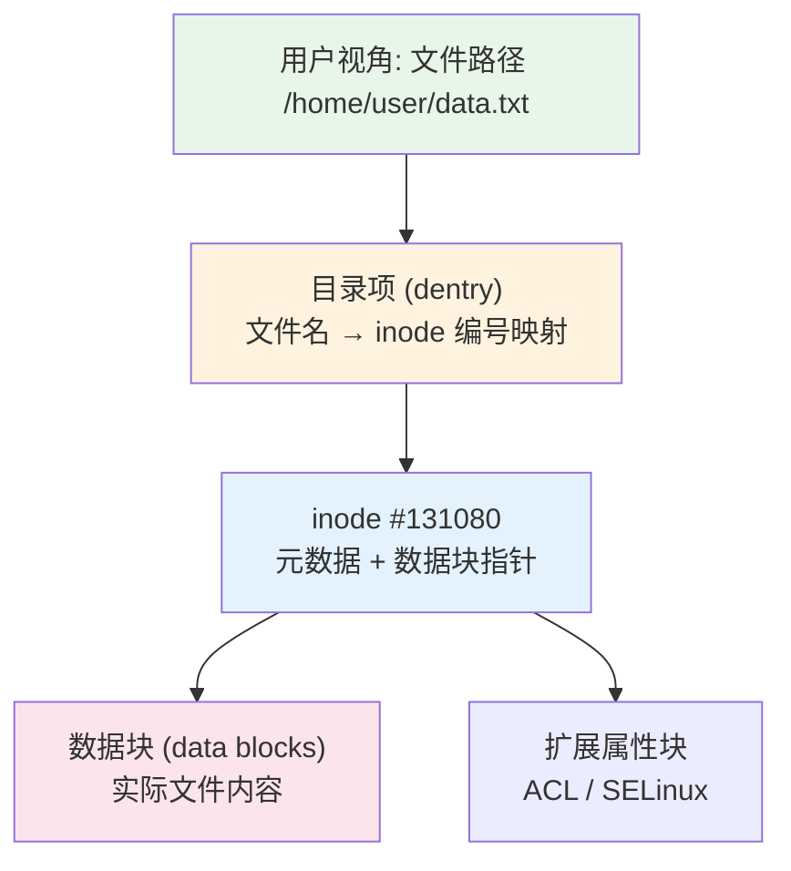
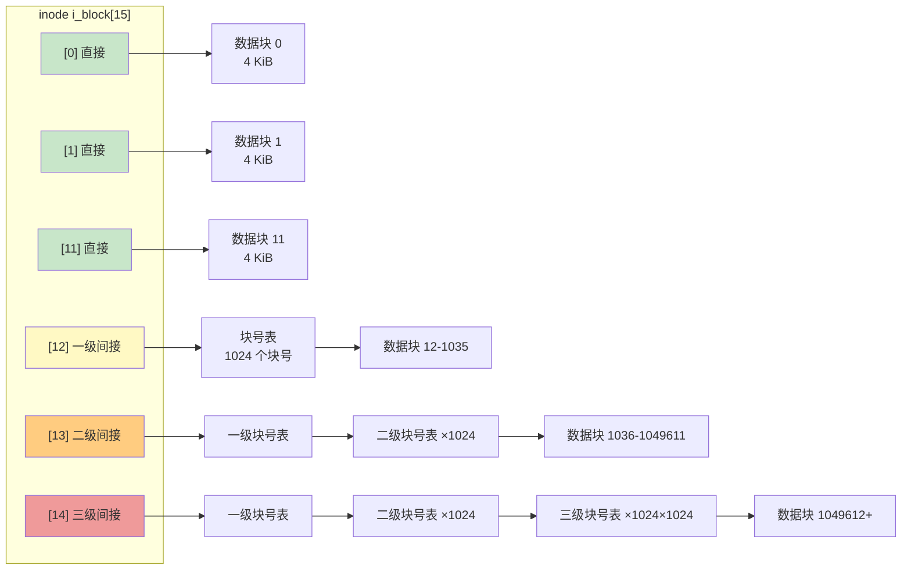
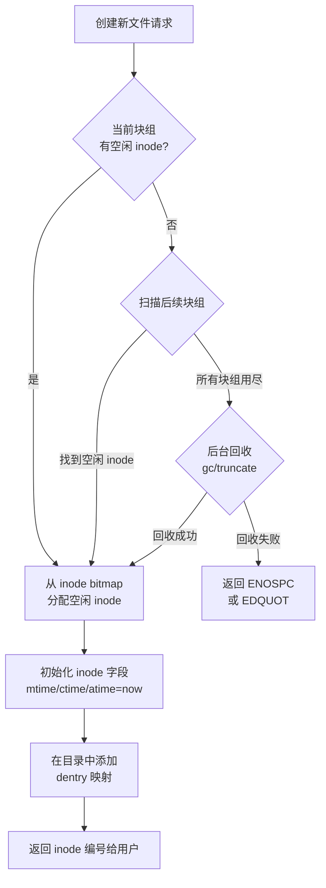
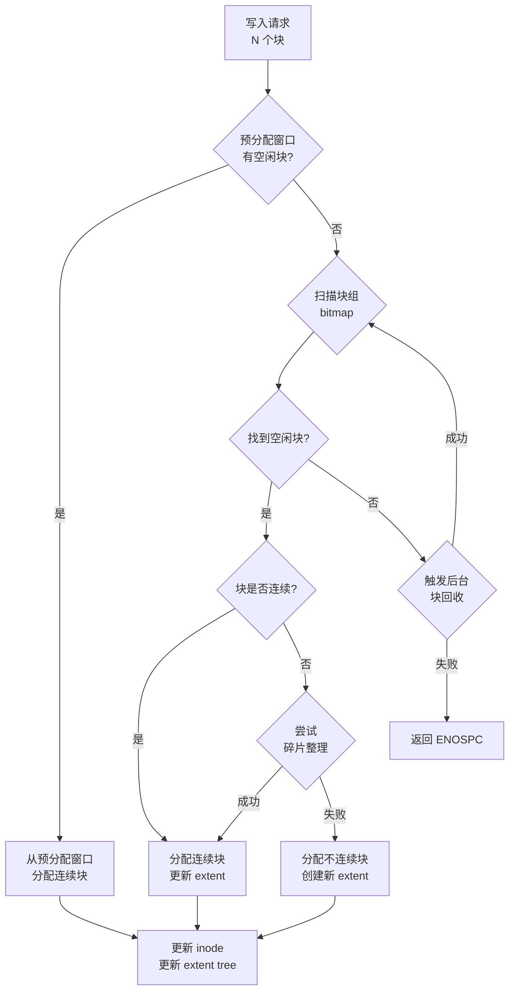

## 技巧2 inode与数据块管理

### 概述

在 Linux 文件系统中，用户看到的是目录和文件，而文件系统内核看到的是 **inode（索引节点）** 和 **数据块（data block）**。这两个概念是理解文件系统存储机制的核心——inode 描述"文件是什么"，数据块存储"文件的内容"。掌握 inode 与数据块的管理机制，是诊断磁盘空间异常、优化文件系统性能、理解硬链接本质的基石。

本节将从 inode 的内部结构出发，逐层深入到数据块的寻址方式、分配策略、碎片化问题以及生产环境中的实战诊断方法。



> **核心认知**：用户执行 `cat /home/user/data.txt` 时，内核先在目录中查找文件名获取 inode 编号，再读取 inode 获取数据块位置，最后从数据块中读取内容返回给用户。理解这条路径是理解一切文件系统问题的基础。

---

### 1. inode 的内部结构

每个文件（包括目录、符号链接、设备节点等）在文件系统中都对应一个唯一的 inode。inode 不包含文件名——文件名存储在目录项（dentry）中，与 inode 编号形成映射。这一设计是 UNIX 文件系统"一切皆 inode"哲学的体现。

**为什么 inode 不存储文件名？** 这是一个深思熟虑的设计决策：

1. **硬链接支持**：多个文件名可以指向同一个 inode，如果文件名存在 inode 中，就无法实现硬链接
2. **目录灵活性**：目录只是一个"文件名→inode 编号"的映射表，可以独立于 inode 进行操作
3. **性能优化**：查找文件名只需遍历目录项，无需加载完整的 inode 结构

#### 1.1 ext2/ext3/ext4 的 inode 结构

ext 系列文件系统的 inode 大小默认为 **128 字节**（ext2/ext3）或 **256 字节**（ext4，多出的空间用于扩展属性和纳秒级时间戳）。通过 `mkfs.ext4 -I 256` 可显式设置。

一个标准 ext4 inode 包含以下关键字段：

| 字段 | 字节数 | 说明 |
|------|--------|------|
| `i_mode` | 2 | 文件类型（普通文件/目录/符号链接/块设备等）+ 权限位（rwx + setuid/setgid/sticky） |
| `i_uid` | 2 | 所有者用户 ID（低 16 位；高 16 位在 ext4 中扩展） |
| `i_size` | 4 | 文件大小（字节），ext4 用 `i_size_high` 扩展到 48 位，支持最大 16 TiB 文件 |
| `i_atime` | 4 | 最后访问时间（ext4 改为纳秒精度） |
| `i_ctime` | 4 | inode 变更时间（权限/所有者修改时更新） |
| `i_mtime` | 4 | 最后修改时间（文件内容修改时更新） |
| `i_dtime` | 4 | 删除时间（文件被删除时记录，回收时清零） |
| `i_gid` | 2 | 所属组 ID |
| `i_links_count` | 2 | 硬链接计数（降为 0 时 inode 可被回收） |
| `i_blocks` | 4 | 文件占用的 512 字节扇区总数 |
| `i_flags` | 4 | 文件标志（如 `EXT4_IMMUTABLE_FL` 不可变、`EXT4_APPEND_FL` 仅追加） |
| `i_block[60]` | 60 | **核心字段**：15 个 4 字节的块指针，指向数据块位置 |
| `i_generation` | 4 | 文件版本号（NFS 使用） |
| `i_file_acl` | 4 | 扩展属性块的块号 |
| `i_faddr` | 4 | 碎片预留（ext4 已废弃） |
| `osd2` | 12 | 操作系统特定数据 |

> **关键理解**：inode 中最重要的字段是 `i_block[60]`——这 15 个指针决定了文件的数据存储在磁盘的哪些块上。理解它们的编排方式是掌握文件系统性能的关键。

**inode 大小演进对比**：

| 文件系统版本 | 默认 inode 大小 | 纳秒时间戳 | 扩展属性支持 | 最大文件大小 |
|-------------|----------------|-----------|-------------|-------------|
| ext2 | 128 字节 | 否（秒级） | 否 | 2 GiB |
| ext3 | 128 字节 | 否（秒级） | 可选（需指定） | 2 TiB |
| ext4 | 256 字节 | 是 | 是（内置） | 16 TiB |

#### 1.2 XFS 的 inode 结构

XFS 的 inode 采用 **B+tree** 管理数据映射，与 ext 的固定指针方案截然不同：

- **内联数据**：文件 ≤ 600 字节时，数据直接存储在 inode 内部（B+tree 根节点的中间数据区域），无需额外的块分配，读取延迟最低
- **B+tree 叶节点**：大文件的 extent 映射存储在 B+tree 中，支持高效的大范围查找和范围查询
- **B+tree 内部节点**：当 extent 数量超过叶节点容量时，自动升级为多层 B+tree

这种设计使 XFS 在大文件场景下具有天然优势：ext4 的 15 个指针最多直接寻址 60 KiB 数据（12 × 4 KiB），而 XFS 的 B+tree 可以无上限地扩展 extent 数量。

> **性能差异实测**：在 100 GiB 大文件顺序写入测试中，XFS 的 extent 数量通常只有 ext4 的 1/3 到 1/5，这是因为 XFS 的 extent 合并策略更激进。对于视频编辑、科学计算等大文件密集场景，XFS 的 inode 设计带来显著优势。

#### 1.3 Btrfs 的 inode 结构

Btrfs 基于 **B-tree** 存储所有元数据，inode 本身也是 B-tree 节点的一部分。每个 inode 的数据映射通过 **extent tree**（一棵独立的 B-tree）管理，支持：

- COW（Copy-on-Write）语义：修改数据时原 extent 不变，新数据写入新位置
- 端到端校验和：每个 extent 的数据校验和存储在 metadata 中
- 内联数据：≤ 16 KiB 的文件内容可内联存储在 inode 的 `inline_ref` 中

#### 1.4 三大文件系统 inode 设计对比

| 特性 | ext4 | XFS | Btrfs |
|------|------|-----|-------|
| inode 大小 | 256 字节（固定） | 512-1024 字节（可变） | 动态（B-tree 节点） |
| 数据映射方式 | extent tree（固定 60 字节空间） | B+tree（无空间限制） | extent tree（独立 B-tree） |
| 内联数据阈值 | 无（extent tree 最小 1 块） | ≤ 600 字节 | ≤ 16 KiB |
| 最大 extent 数量 | ~340（depth=5 时） | 无上限 | 无上限 |
| COW 支持 | 否 | 否（默认） | 是（核心特性） |
| 适用场景 | 通用、小文件密集 | 大文件、高吞吐 | 快照、数据完整性 |
| 碎片化敏感度 | 高（extent 不连续影响大） | 低（B+tree 高效查询） | 中（COW 增加写放大） |

---

### 2. 数据块寻址：从直接指针到三级间接

ext 系列文件系统通过 inode 中的 `i_block[15]` 数组实现数据块寻址，其结构如下：

i_block[0]  → 直接指针 0     → 数据块（4 KiB）
i_block[1]  → 直接指针 1     → 数据块（4 KiB）
...
i_block[11] → 直接指针 11    → 数据块（4 KiB）
i_block[12] → 一级间接指针   → 块号表 → 1024 个数据块
i_block[13] → 二级间接指针   → 块号表 → 块号表 → 1024×1024 个数据块
i_block[14] → 三级间接指针   → 块号表 → 块号表 → 块号表 → 1024^3 个数据块



以默认 4 KiB 块大小为例，每个块号占 4 字节，一个块可存储 1024 个块号（4096 / 4 = 1024）：

| 层级 | 指针数 | 可寻址块数 | 可寻址空间 |
|------|--------|-----------|-----------|
| 直接指针 | 12 | 12 块 | 48 KiB |
| 一级间接 | 1 | 1,024 块 | 4 MiB |
| 二级间接 | 1 | 1,048,576 块 | 4 GiB |
| 三级间接 | 1 | 1,073,741,824 块 | 4 TiB |
| **合计** | 15 | ~1.07 × 10⁹ 块 | **~4 TiB** |

> **性能启示**：前 48 KiB 数据只需一次间接查找（直接指针），这是绝大多数小文件的大小范围。文件越大，间接层级越多，元数据查找开销越大。这就是为什么 ext4 引入了 extent tree 来替代间接指针——对于大文件，extent 只需记录一个起始块号和连续长度，极大减少了元数据量。

**寻址方式的 IO 开销对比**：

| 文件大小 | 间接指针方案（ext2/3） | extent tree 方案（ext4） | 差异 |
|---------|----------------------|------------------------|------|
| < 48 KiB | 1 次 IO（直接指针） | 1 次 IO（内联 extent） | 相同 |
| 48 KiB - 4 MiB | 2 次 IO（一级间接） | 1 次 IO（单 extent） | ext4 节省 1 次 IO |
| 4 MiB - 4 GiB | 3 次 IO（二级间接） | 1-2 次 IO（少量 extent） | ext4 节省 1-2 次 IO |
| 4 GiB - 4 TiB | 4 次 IO（三级间接） | 2-3 次 IO（extent tree） | ext4 节省 1 次 IO |
| > 4 TiB | 无法寻址 | 正常工作 | ext4 优势明显 |

#### 2.1 ext4 的 extent tree

ext4 在 `i_block[60]` 中存储的不再是间接指针，而是一个 **extent tree 的根节点**：

```c
struct ext4_extent_header {
    __le16 eh_magic;       // 0xF30A
    __le16 eh_entries;     // 已有 extent 数量
    __le16 eh_max;         // 最大 extent 数量
    __le16 eh_depth;       // 树深度（0 = 叶节点，即内联 extent）
    __le32 eh_generation;  // 树版本号
};

struct ext4_extent {
    __le32 ee_block;       // 逻辑块号（文件中的起始块）
    __le16 ee_len;         // extent 长度（块数，最大 32768）
    __le16 ee_start_hi;    // 物理块号高 16 位
    __le32 ee_start_lo;    // 物理块号低 32 位
};
```

**extent tree 工作模式**：

- **depth=0**：`i_block[60]` 直接存储 extent 数组（最多 4 个 extent），小文件无需额外块
- **depth>0**：`i_block[60]` 存储 extent tree 的根节点，内部节点指向子节点，叶节点存储实际 extent
- extent tree 最大深度为 5 层，理论上可管理的单个文件大小远超 4 TiB

**extent 合并机制**：ext4 的 mballoc 块分配器在写入时会尝试将新的数据块合并到已有的 extent 中，减少 extent 数量。只有当新数据块与现有 extent 不连续时，才会创建新的 extent。这就是为什么连续写入的文件通常只有 1-2 个 extent，而随机写入的文件可能有成百上千个 extent。

**实践验证**：用 `debugfs` 查看 extent tree：

```bash
# 创建测试文件
dd if=/dev/zero of=/tmp/test_extents bs=1M count=100

# 查看 extent 分布
debugfs -R "stat /tmp/test_extents" /dev/sda1 2>/dev/null | grep -A 20 "EXTENTS:"

# 或用 filefrag 查看碎片化程度
filefrag -v /tmp/test_extents
```

输出示例：

Filesystem type is: ef53
Size of inode: 256
Inode: 131073   Type: regular    Mode:  0644   Flags: 0x80000
Size: 104857600
Block count: 204800
Block size: 4096
EXTENTS:
 (0-15999):262144-327683, length:16000
 (16000-31999):328708-394207, length:16000

**extent 数量与性能的关系**：

| extent 数量 | 文件状态 | 性能影响 |
|------------|---------|---------|
| 1 | 完全连续（理想状态） | 最优，顺序读写 |
| 2-10 | 轻微碎片化 | 影响可忽略 |
| 10-100 | 中度碎片化 | 顺序读性能下降 20-50% |
| 100-1000 | 严重碎片化 | 顺序读退化为随机读，性能下降 5-10 倍 |
| > 1000 | 极度碎片化 | 性能严重恶化，需立即整理 |

---

### 3. inode 的分配与回收

#### 3.1 inode 分配机制

ext 文件系统在格式化时预分配固定数量的 inode，存储在每个块组（block group）的 **inode table** 中。关键参数：

| 参数 | 默认值 | 含义 |
|------|--------|------|
| 每个 inode 大小 | 128/256 字节 | ext4 默认 256 字节 |
| 每个块组的 inode 数 | 8192（mkfs 默认） | 由 `-N` 或 `-i` 参数控制 |
| inode 预留比例 | 1/16 的块 | `mkfs.ext4 -m 1` 控制 |

**inode 分配流程**：



**关键理解**：inode 的分配是**按块组顺序**的，这意味着频繁创建/删除文件可能导致 inode 在块组间分布不均匀，进而影响性能（尤其是机械硬盘的寻道时间）。

**inode 分配策略的演进**：

- **ext2/ext3**：简单的位图扫描，从第一个有空闲 inode 的块组开始分配
- **ext4**：引入了"inode 预分配"机制，尽量将同一目录下的文件分配到同一块组
- **XFS**：使用 B+tree 管理空闲 inode，支持更灵活的分配策略
- **Btrfs**：inode 作为 B-tree 节点存储，分配与树操作一体化

#### 3.2 inode 的回收

文件被删除时（`unlink()`），内核执行以下操作：

1. 减少 inode 的 `i_links_count`
2. 如果 `i_links_count` 降为 0：
   - 释放 inode 占用的所有数据块（通过 extent tree 或间接指针）
   - 释放 extent tree 本身占用的元数据块
   - 清除 inode bitmap 中对应的位
   - 标记 inode 的 `i_dtime` 为当前时间
   - 将 inode 放入"已删除 inode"列表（便于快速恢复）

> **常见误区**：`rm` 删除文件后，inode 并不立即从磁盘清除。`i_dtime` 被设置，但 inode 的内存结构仍然存在，直到文件系统执行垃圾回收。这就是为什么在文件被删除后仍可通过 `debugfs` 或 `extundelete` 恢复数据——只要数据块未被覆写。

**inode 回收的安全窗口**：

| 时间阶段 | inode 状态 | 数据可恢复性 |
|---------|-----------|-------------|
| 刚删除（秒级） | i_dtime 已设置，数据块未释放 | 100% 可恢复 |
| 删除后数分钟 | 数据块可能已被部分回收 | 高概率恢复 |
| 删除后数小时 | 数据块可能已被覆写 | 部分恢复 |
| 删除后数天 | 数据块大概率已被覆写 | 极难恢复 |

> **生产建议**：关键数据删除后，立即停止对该分区的写入操作，使用 `extundelete` 或 `testdisk` 尝试恢复。时间越早，恢复成功率越高。

#### 3.3 inode 表与 inode bitmap 的磁盘布局

每个块组的布局如下（以 ext4 为例）：

块组结构:
┌──────────────┬───────────────┬──────────────┬──────────────┬───────────────┐
│  Superblock  │ Group Descriptor│ Block Bitmap │ Inode Bitmap │  Inode Table  │
│  (1 block)   │  Table (N)     │  (1 block)   │  (1 block)   │  (N blocks)   │
└──────────────┴───────────────┴──────────────┴──────────────┴───────────────┘
                                                                       │
                                                         存放该块组所有 inode
                                                         每个 inode 256 字节
                                                         8192 个 inode = 2 MiB

**inode bitmap 的工作原理**：每个位代表一个 inode 的占用状态（0=空闲，1=已占用）。当分配 inode 时，内核扫描 bitmap 找到第一个 0 位，将其置 1，并在 inode table 中对应位置初始化新 inode。这个操作是 O(n) 复杂度，n 为块组中的 inode 数量。

---

### 4. 数据块分配策略

#### 4.1 块分配器的工作原理

ext4 的块分配器（mballoc，multi-block allocator）采用以下策略：

**预分配（pre-allocation）**：
- 当一个文件持续增长时，内核会预分配比当前请求更多的连续块
- 目标是让 extent 尽可能长，减少碎片化
- 受 `ext4_mb_stream_request` 控制，通常预分配 1-8 MiB

**局部性分配（locality allocation）**：
- 新文件优先分配到与同一目录下其他文件相同的块组
- 原理：目录的 inode 和文件的 inode 在同一块组，减少元数据读取的寻道
- 这就是为什么 `df -i` 会显示各块组的 inode 使用不均匀——热点目录对应的块组 inode 消耗更快

**延迟分配（delayed allocation）**：
- `write()` 系统调用时，数据先进入页缓存，不立即分配磁盘块
- 直到 `fsync()` 或内存压力触发写回时，才一次性分配连续的大块
- 效果：大幅减少碎片化（写入缓冲合并后一次性分配）
- **风险**：崩溃时可能导致零长度文件（数据未落盘），需配合 `fsync()` 使用

**条带化分配（striped allocation）**：
- 在 RAID 配置下，块分配器会将数据分散到多个磁盘
- 通过 `stride` 和 `stripe-width` 挂载参数配置

**mballoc 分配决策流程**：



#### 4.2 块大小的选择

块大小是文件系统最关键的参数之一，直接影响性能和空间利用率：

| 块大小 | 优点 | 缺点 | 适用场景 |
|--------|------|------|----------|
| 1 KiB | 最小空间浪费（每个文件最多浪费 1 KiB） | 大文件元数据量巨大，性能差 | 小文件极多、空间受限的嵌入式系统 |
| 2 KiB | 折中方案 | 不常用，部分内核模块不支持 | 特殊场景 |
| 4 KiB | 默认值，匹配大多数磁盘扇区和页大小，均衡 | 大文件可能有少量内部碎片 | **通用场景的推荐值** |
| 8 KiB | 减少元数据开销，提高大文件顺序读性能 | 小文件浪费严重 | 大文件为主的存储（视频、日志） |
| 16 KiB | 极致大文件优化 | 空间浪费严重，小文件性能差 | 专用大文件服务器 |
| 64 KiB | 大规模存储集群优化 | 常规文件系统不适用 | Lustre、BeeGFS 等分布式文件系统 |

**块大小与 inode 密度的关系**：

块大小不仅影响数据存储效率，还影响 inode 的分配策略。mkfs.ext4 默认为每 16 KiB 数据分配一个 inode（`-i 16384`），这意味着：

- 4 KiB 块大小：每 4 个块分配 1 个 inode
- 8 KiB 块大小：每 2 个块分配 1 个 inode
- 16 KiB 块大小：每 1 个块分配 1 个 inode

对于小文件密集的场景（如邮件服务器），需要更密集的 inode 分配：

```bash
# 查看当前 inode 密度
tune2fs -l /dev/sda1 | grep -i "inode"
# Inodes per group: 8192
# Inode size:       256

# 格式化时指定 inode 密度
mkfs.ext4 -i 4096 /dev/sda1    # 每 4 KiB 一个 inode（密集）
mkfs.ext4 -i 65536 /dev/sda1   # 每 64 KiB 一个 inode（稀疏）
```

```bash
# 查看当前块大小
stat -f -c '%S' /        # 输出块大小（字节）
tune2fs -l /dev/sda1 | grep "Block size"

# 创建时指定块大小
mkfs.ext4 -b 4096 /dev/sda1
mkfs.xfs -b size=4096 /dev/sda
```

#### 4.3 碎片化与 defrag

**碎片化的成因**：

1. **频繁创建/删除文件**：导致空闲空间散布在多个块组
2. **并发写入多个文件**：块分配器在多个文件间交替分配，每个文件的 extent 都不连续
3. **延迟分配失效**：频繁的 `fsync()` 会过早触发块分配，无法积累连续空间
4. **文件增长**：文件原分配的空间后面被其他文件占据，增长时只能分配到更远的位置

**碎片化的影响**：

- **机械硬盘**：碎片化导致磁头频繁寻道，顺序读变成随机读，性能下降可达 10-100 倍
- **SSD**：碎片化对随机读性能影响较小，但影响写放大和 GC 效率
- **文件系统性能**：extent 过多导致 extent tree 层级增加，元数据查找变慢

**碎片化诊断**：

```bash
# 查看文件碎片化程度
filefrag -v /path/to/file

# 输出解读
# logical: 逻辑块范围
# physical: 物理块范围
# Length: extent 长度
# 一个文件的 extent 数量越多，碎片化越严重

# 批量检查目录碎片化
filefrag /var/log/*.log | awk '{print $2}' | sort | uniq -c | sort -rn | head

# 查看文件系统级别的碎片化概况
e4defrag -c /dev/sda1
```

**碎片化缓解与修复**：

```bash
# 在线碎片整理（ext4）
e4defrag /dev/sda1

# 对单个文件整理
e4defrag /var/log/large-logfile.log

# xfs_fsr（XFS 碎片整理工具）
xfs_fsr /dev/sda1

# Btrfs 碎片整理
btrfs filesystem defragment -r /mnt/data

# 预防碎片化的最佳实践：
# 1. 使用延迟分配（默认开启）
# 2. 大文件使用 prealloc（fallocate）
# 3. 避免在满磁盘上频繁创建/删除文件
# 4. 定期执行 e4defrag（可配合 cron）
```

**不同文件系统的碎片化处理能力对比**：

| 文件系统 | 碎片化敏感度 | 在线整理工具 | 整理效果 | 注意事项 |
|---------|-------------|-------------|---------|---------|
| ext4 | 高 | e4defrag | 好 | 需要足够的空闲空间（>10%） |
| XFS | 中 | xfs_fsr | 较好 | 大文件整理可能很慢 |
| Btrfs | 中 | btrfs defragment | 一般 | COW 机制导致整理时产生额外写入 |
| ZFS | 低 | 无（自动管理） | N/A | ZFS 的 allocation 策略天然抗碎片化 |

---

### 5. 实战：inode 与数据块诊断

#### 5.1 查看 inode 信息

```bash
# 基础 inode 信息
stat /etc/passwd
# 输出示例：
#   File: /etc/passwd
#   Size: 2841       Blocks: 8          IO Block: 4096   regular file
#   Device: 10302h/66306d   Inode: 131080    Links: 1
#   Access: (0644/-rw-r--r--)  Uid: (    0/    root)   Gid: (    0/    root)
#   Access: 2026-06-26 10:00:00.000000000 +0800
#   Modify: 2026-06-15 14:30:00.000000000 +0800
#   Change: 2026-06-15 14:30:00.000000000 +0800
#   Birth: 2026-01-01 08:00:00.000000000 +0800

# 查看 inode 编号
ls -i /etc/passwd
# 输出：131080 /etc/passwd

# 查看所有文件的 inode 编号
ls -li /var/log/ | head -20

# 查看 inode 详细十六进制信息（调试用）
debugfs -R "stat <131080>" /dev/sda1
```

**stat 输出字段详解**：

| 字段 | 含义 | 关注点 |
|------|------|--------|
| Size | 文件大小（字节） | 与 Blocks 对比可判断稀疏文件 |
| Blocks | 占用的 512 字节扇区数 | 实际磁盘占用 = Blocks × 512 |
| IO Block | 最佳 IO 块大小 | 通常等于文件系统块大小 |
| Inode | inode 编号 | 文件的唯一标识 |
| Links | 硬链接数 | 大于 1 表示有硬链接 |
| Access | 权限和所有者 | rwx 权限位 |
| Access/Modify/Change | 三种时间戳 | atime/mtime/ctime 区分 |

#### 5.2 inode 空间使用分析

```bash
# 查看文件系统 inode 使用情况
df -i
# Filesystem      Inodes   IUsed   IFree IUse% Mounted on
# /dev/sda1      6553600  482103  6071497    8% /

# 关键场景：df -h 显示有空间，但无法创建文件
# 原因：inode 用尽（IUse% = 100%）
# 解决：
#   1. 找到占用 inode 最多的目录
find / -xdev -printf '%h\n' | sort | uniq -c | sort -rn | head -10

#   2. 找到 inode 消耗大户（通常是小文件）
find / -xdev -type f -printf '%s %p\n' | sort -n | head -20   # 最小文件
find / -xdev -type f | wc -l                                   # 文件总数

#   3. 清理策略
#     - 清理 /var/log/ 下的旧日志
#     - 清理 /tmp/ 下的临时文件
#     - 清理邮件队列 /var/mail/ 和 /var/spool/
#     - 清理容器层的临时层（docker system prune）

# 格式化时调整 inode 数量
mkfs.ext4 -N 2000000 /dev/sda1        # 指定总 inode 数
mkfs.ext4 -i 4096 /dev/sda1           # 每 4096 字节分配一个 inode
```

**inode 耗尽的典型场景**：

| 场景 | 原因 | 预防措施 |
|------|------|---------|
| 邮件服务器 | 海量小邮件文件 | 增加 inode 密度，定期清理队列 |
| 缓存服务器 | 小缓存文件过多 | 使用 tmpfs 或增加 inode 预留 |
| 日志服务器 | 每秒生成多个日志文件 | 合并日志，使用 logrotate |
| Docker 环境 | 容器层叠加 | 定期 docker system prune |
| Git 仓库 | 大量小对象文件 | 使用 git gc，考虑 git-lfs |

#### 5.3 数据块空间分析

```bash
# 查看块使用情况
df -hT
# Filesystem     Type   Size  Used Avail Use% Mounted on
# /dev/sda1      ext4  100G   68G   27G  72% /

# 查看目录占用空间
du -sh /var/log/*
du -sh --max-depth=1 /

# 查看文件实际占用的物理块
du -b /path/to/file    # 精确字节数
du -B 4096 /path/to/file  # 以 4 KiB 块为单位

# 查看磁盘块分配详情
debugfs -R "blocks <inode_number>" /dev/sda1

# 检查块组使用情况
dumpe2fs /dev/sda1 | grep -A 5 "Block group"

# 实时监控 IO
iostat -x 1 5
```

**du 与 stat 的区别**：

- `du` 报告文件实际占用的磁盘块大小（包含内部碎片）
- `stat` 报告文件的逻辑大小（实际内容字节数）
- 对于稀疏文件，`du` 可能远小于 `stat` 报告的大小

```bash
# 创建稀疏文件演示差异
dd if=/dev/zero of=/tmp/sparse.img bs=1 count=0 seek=1G
stat -c '%s' /tmp/sparse.img    # 输出: 1073741824（逻辑大小 1 GiB）
du -h /tmp/sparse.img           # 输出: 0（实际占用 0 块）
```

#### 5.4 inode 与硬链接的关系

硬链接的本质是多个目录项指向同一个 inode：

```bash
# 创建硬链接
ln /path/to/original /path/to/hardlink

# 验证：两个路径的 inode 编号相同
ls -li /path/to/original /path/to/hardlink
# 131080 -rw-r--r-- 2 root root 1024 Jun 26 10:00 /path/to/original
# 131080 -rw-r--r-- 2 root root 1024 Jun 26 10:00 /path/to/hardlink

# inode 的 Links count 增加
stat /path/to/original | grep Links
# Links: 2

# 删除其中一个硬链接：Links count 减 1，inode 不释放
rm /path/to/hardlink
stat /path/to/original | grep Links
# Links: 1

# 删除最后一个硬链接：Links count 降为 0，inode 被标记删除
rm /path/to/original

# 软链接（符号链接）的 inode 不同
ln -s /path/to/original /path/to/symlink
ls -li /path/to/original /path/to/symlink
# 131080 -rw-r--r-- ... /path/to/original
# 131081 lrwxrwxrwx ... /path/to/symlink -> /path/to/original
# 注意：symlink 有自己的 inode（131081），类型为符号链接
```

> **生产场景**：大型软件安装目录（如 `/usr/lib`、`/usr/share`）广泛使用硬链接来节省空间。多个版本的库文件共享相同的 inode，只有实际不同的部分才占用新的数据块。例如 Docker 镜像层之间通过硬链接共享基础文件。

**硬链接 vs 软链接的使用场景**：

| 场景 | 推荐方式 | 理由 |
|------|---------|------|
| 同一文件系统内多路径访问 | 硬链接 | 不占用额外 inode，删除原文件不影响 |
| 跨文件系统链接 | 软链接 | 硬链接不支持跨文件系统 |
| 链接到目录 | 软链接 | ext4 不允许硬链接目录（防止环路） |
| 链接到不存在的目标 | 软链接 | 硬链接要求目标存在 |
| Docker 镜像层共享 | 硬链接 | 节省空间，层间文件相同部分共享 |
| 符合 POSIX 语义的工具 | 硬链接 | 软链接的行为在不同系统间可能不一致 |

---

### 6. 生产环境最佳实践

#### 6.1 inode 规划

| 场景 | 推荐 inode/块比 | 理由 |
|------|----------------|------|
| 通用服务器 | 默认 (1 inode/16 KiB) | 均衡 |
| 日志服务器 | 1 inode/4 KiB | 大量小日志文件 |
| 大文件存储 | 1 inode/64 KiB | 减少 inode 预留，更多空间给数据 |
| 邮件服务器 | 1 inode/2 KiB | 海量小文件（邮件队列） |
| 数据库 | 默认 | 数据库文件通常较大且数量有限 |

#### 6.2 关键调优参数

```bash
# 1. 延迟分配（减少碎片化）
mount -o delay_alloc /dev/sda1 /mnt/data

# 2. 调整预分配大小（大文件场景）
tune2fs -E stride=256,stripe-width=512 /dev/sda1  # RAID 优化

# 3. 保留块比例（ext4 默认 5%，大磁盘可降低）
tune2fs -m 1 /dev/sda1  # 保留 1% 给 root，释放更多空间给普通用户

# 4. 关闭 atime 更新（减少不必要的元数据写入）
mount -o noatime /dev/sda1 /mnt/data  # 或 relatime（默认，只在 atime < mtime 时更新）

# 5. 调整 inode 大小（扩展属性需要更大的 inode）
mkfs.ext4 -I 256 /dev/sda1  # ext4 默认 256，确保扩展属性有空间

# 6. 目录索引优化（htree 提升大目录查找性能）
tune2fs -O dir_index /dev/sda1  # ext4 默认启用
```

**atime 更新模式对比**：

| 模式 | 行为 | 性能影响 | 适用场景 |
|------|------|---------|---------|
| strictatime | 每次访问都更新 atime | 高（大量元数据写入） | 严格审计场景 |
| relatime | 仅在 atime < mtime 或 atime < ctime 时更新 | 低 | **默认推荐** |
| noatime | 从不更新 atime | 最低 | 高性能场景 |
| nodiratime | 不更新目录的 atime | 中 | 目录访问频繁场景 |

#### 6.3 监控告警脚本

```bash
#!/bin/bash
# inode-and-space-monitor.sh - 生产环境 inode 与磁盘空间监控

THRESHOLD_INODE=90    # inode 使用率告警阈值（%）
THRESHOLD_SPACE=85    # 磁盘空间告警阈值（%）
LOG_FILE="/var/log/fs_monitor.log"

echo "=== 文件系统监控 $(date '+%Y-%m-%d %H:%M:%S') ===" >> "$LOG_FILE"

# 检查 inode 使用率
while IFS= read -r line; do
    usage=$(echo "$line" | awk '{print $5}' | tr -d '%')
    filesystem=$(echo "$line" | awk '{print $1}')
    mount=$(echo "$line" | awk '{print $6}')

    if [ "$usage" -ge "$THRESHOLD_INODE" ] 2>/dev/null; then
        echo "[ALERT] inode 使用率 ${usage}% >= ${THRESHOLD_INODE}%: ${filesystem} (${mount})" >> "$LOG_FILE"

        # 找出 inode 消耗大户
        echo "  Top inode consumers in ${mount}:" >> "$LOG_FILE"
        find "$mount" -xdev -printf '%h\n' 2>/dev/null | sort | uniq -c | sort -rn | head -5 >> "$LOG_FILE"
    fi
done < <(df -i | tail -n +2 | grep -v tmpfs)

# 检查磁盘空间使用率
while IFS= read -r line; do
    usage=$(echo "$line" | awk '{print $5}' | tr -d '%')
    filesystem=$(echo "$line" | awk '{print $1}')
    mount=$(echo "$line" | awk '{print $6}')

    if [ "$usage" -ge "$THRESHOLD_SPACE" ] 2>/dev/null; then
        echo "[WARN] 磁盘空间 ${usage}% >= ${THRESHOLD_SPACE}%: ${filesystem} (${mount})" >> "$LOG_FILE"
    fi
done < <(df -h | tail -n +2 | grep -v tmpfs)

echo "" >> "$LOG_FILE"
```

---

### 7. 常见误区与排错

| 误区 | 真相 | 纠正方法 |
|------|------|----------|
| `df -h` 显示有空间但 `No space left on device` | inode 用尽而非空间用尽 | 用 `df -i` 检查 inode 使用率 |
| `rm` 大文件后空间未释放 | 进程仍持有文件句柄 | `lsof +L1` 查找被删除但未释放的文件 |
| 硬链接可以跨文件系统 | 硬链接必须在同一文件系统内 | 跨文件系统用符号链接 |
| 符号链接和硬链接本质相同 | 硬链接共享 inode，符号链接是独立 inode | `ls -li` 可见 inode 差异 |
| inode 大小固定不可调 | mkfs 时可配置 | `mkfs.ext4 -I 256` 指定 |
| 块大小越大性能越好 | 取决于文件大小分布 | 小文件多用小块，大文件多用大块 |
| 碎片化只影响 HDD | SSD 也受碎片化影响（写放大、GC） | 定期 `e4defrag`（HDD）或 TRIM（SSD） |
| ext4 inode 用尽必须重新格式化 | 可用 `tune2fs` 调整（仅限未满时）或清理小文件 | 优先清理 `/var/log`、`/tmp` |

#### 7.1 典型故障排查流程

**场景：磁盘空间充足但无法创建文件**

```bash
# Step 1: 确认是 inode 问题
df -i /          # 查看 inode 使用率
# 如果 IUse% = 100%，确认 inode 耗尽

# Step 2: 找到 inode 消耗大户
find / -xdev -printf '%h\n' | sort | uniq -c | sort -rn | head -20

# Step 3: 针对性清理
# 常见元凶：
# - /var/log/ 下的旧日志
# - /tmp/ 下的临时文件
# - 邮件队列 /var/spool/mail/ 和 /var/spool/postfix/
# - 容器日志 /var/lib/docker/containers/*/
# - 缓存文件 /var/cache/
# - 包管理器缓存 /var/cache/apt/archives/

# Step 4: 如果需要扩展 inode
# 方案 A: 清理后用 tune2fs 调整（仅适用于 ext2/3/4，且需有足够空闲 inode）
# 方案 B: 备份数据，重新格式化指定更多 inode
# 方案 C: 添加新磁盘分区，迁移小文件密集目录

# Step 5: 防止复发
# - 设置 cron 定期清理临时文件
# - 监控 inode 使用率（使用上面的监控脚本）
# - 对邮件服务器考虑增大 inode 预留
```

**场景：大文件写入性能差**

```bash
# Step 1: 检查碎片化程度
filefrag -v /path/to/large/file
# extent 数量 > 100 说明碎片化严重

# Step 2: 检查是否启用了延迟分配
mount | grep sda1 | grep delay_alloc
# 如果没有，启用延迟分配

# Step 3: 检查预分配行为
cat /proc/fs/ext4/sda1/options | grep prealloc
# 确认 prealloc 机制正常工作

# Step 4: 检查块分配器日志
dmesg | grep -i "ext4_mb" | tail -20

# Step 5: 执行碎片整理
e4defrag /dev/sda1

# Step 6: 长期优化
# - 使用 fallocate 预分配空间
# - 减少并发写入的文件数量
# - 确保磁盘空间 > 10% 空闲（碎片化与空闲空间正相关）
```

---

### 8. 进阶：内核层面的 inode 管理

#### 8.1 VFS inode 缓存

内核维护一个 inode 缓存（inode cache），将最近使用的 inode 保存在内存中以减少磁盘 IO：

```bash
# 查看 inode 缓存状态
cat /proc/meminfo | grep -i "inode"
# InodeCache: 245832     （已缓存的 inode 数量）

# 调整 inode 缓存压力
cat /proc/sys/fs/inode-nr
# 312456  23412
# 第一个数：已分配的 inode 数量
# 第二个数：空闲 inode 数量

# 控制 inode 内存回收
cat /proc/sys/fs/inode-max           # 系统最大 inode 数量
echo 500000 > /proc/sys/fs/inode-max  # 动态调整（重启失效）
```

**inode 缓存的工作机制**：


**inode 缓存的内存开销**：每个缓存的 inode 占用约 500-600 字节内存（包含 VFS 层的 `struct inode` 和文件系统特定的 `struct ext4_inode_info` 等）。对于拥有百万级文件的服务器，inode 缓存可能占用 500 MiB 以上内存。

#### 8.2 ext4 的 inode 扩展属性（inode EAs）

ext4 支持为 inode 设置扩展属性（Extended Attributes），常见用途：

```bash
# 设置 ACL（访问控制列表）
setfacl -m u:www-data:rwx /var/www/html

# 设置安全上下文（SELinux）
chcon -t httpd_sys_content_t /var/www/html/index.html

# 查看所有扩展属性
getfattr -d -m '.*' /var/www/html/index.html

# 设置 immutable 属性（防止文件被修改/删除）
chattr +i /etc/critical-config.conf
lsattr /etc/critical-config.conf
# ----i------------- /etc/critical-config.conf

# 设置 append-only 属性（只允许追加，适用于日志）
chattr +a /var/log/audit.log
```

> **性能影响**：频繁使用 `getfattr` / `setfattr` 操作扩展属性会增加 inode 的元数据 IO。在高吞吐场景下，应将扩展属性操作限制在初始化阶段，避免在热路径上频繁调用。

**扩展属性的存储位置**：

ext4 的扩展属性根据大小采用不同的存储策略：

| 扩展属性大小 | 存储位置 | 说明 |
|-------------|---------|------|
| ≤ 60 字节 | inode 内联存储 | 利用 inode 中的空闲空间（如 `osd2` 区域） |
| 60-4096 字节 | 单独的扩展属性块 | 通过 `i_file_acl` 指针指向 |
| > 4096 字节 | 多个扩展属性块 | 形成扩展属性块链 |

---

### 9. 小结

inode 与数据块管理是文件系统的核心机制。理解它们的关键要点：

1. **inode 是文件的元数据载体**：包含权限、大小、时间戳和数据块指针，不包含文件名
2. **数据块寻址从间接指针演进到 extent tree**：ext4 的 extent tree 大幅减少了大文件的元数据开销
3. **块分配策略决定碎片化程度**：延迟分配和预分配是减少碎片化的核心手段
4. **inode 耗尽是常见的隐蔽故障**：`df -h` 看不出来，必须用 `df -i` 检查
5. **不同文件系统的 inode 设计影响性能特征**：ext4 固定指针、XFS B+tree、Btrfs COW extent 各有优劣
6. **监控和预防优于事后修复**：定期监控 inode 使用率和碎片化程度，比故障后救火高效得多

> **延伸阅读**：本节深入探讨了 inode 与数据块的内部机制。下一节《ext4 日志与 B-tree 索引》将讲解 ext4 如何通过日志机制保证数据一致性，以及 B-tree 在目录索引中的应用——这是理解文件系统可靠性的关键拼图。
