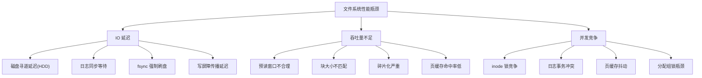
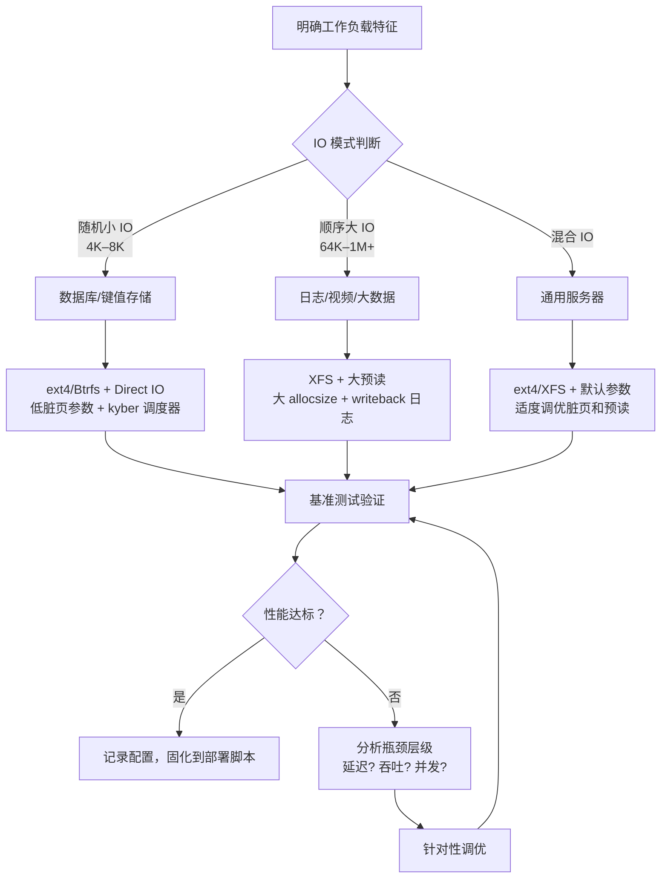
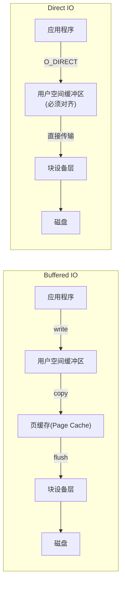
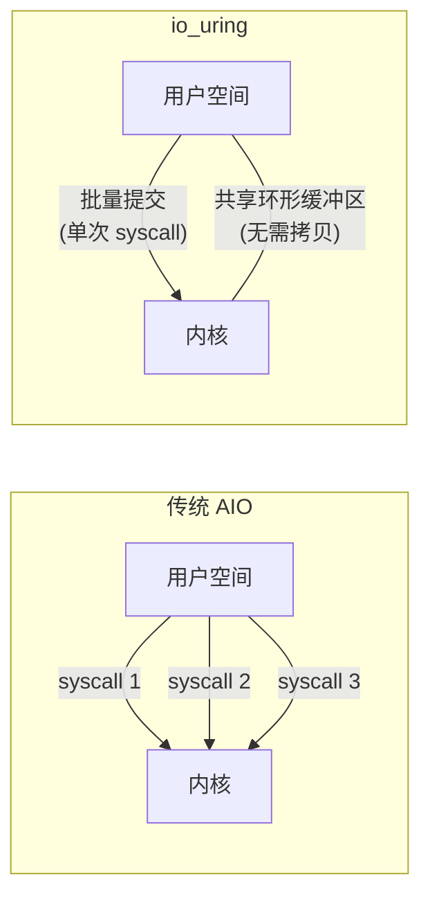
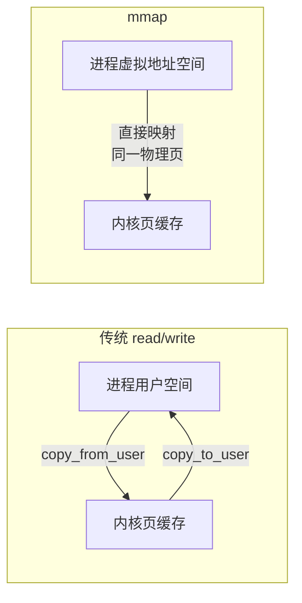

## 文件系统性能优化清单

文件系统性能优化是存储调优中投入产出比最高的环节之一。与应用层优化不同，文件系统层的调优往往是**一次配置、全局生效**——一个正确的 mount 选项或内核参数调整，可以让整个系统的 IO 性能提升 30%–300%，而应用层优化可能只能带来个位数的百分比改善。

本节提供一份系统化的性能优化清单，按照「理论基础 → 内核参数 → 挂载选项 → IO 调度器 → 文件系统特定优化 → 高级 IO 技术 → 碎片与空间管理 → 监控诊断 → 基准测试 → 场景化指南 → 检查清单 → 误区警示」的层次组织，覆盖从入门到精通的全部优化手段。每项优化都附有原理说明、具体配置方法和预期效果。

---

## 1. 性能优化的理论基础

### 1.1 文件系统性能的三大瓶颈

在动手优化之前，需要理解文件系统性能瓶颈的三大来源。这三个瓶颈并非孤立存在——一次写入操作可能同时受到三者影响：



- **IO 延迟**：单次 IO 操作的等待时间。对 HDD 主要受寻道时间影响（5–10ms），对 SSD 主要受闪存特性影响（50–500μs）。日志同步（fsync）是延迟的主要来源之一——即使使用 SSD，一次 fsync 也可能需要 1–5ms。写屏障（write barrier）在确保数据一致性的同时会阻塞后续写入的提交，造成额外的传播延迟。
- **吞吐量**：单位时间内传输的数据量。受限于预读策略、块大小、extent 连续性和设备带宽。顺序读写通常能达到设备理论带宽的 70%–90%，随机读写则大幅下降（HDD 可降至 1%–5%，SSD 可降至 10%–30%）。页缓存命中率直接决定了应用感知的吞吐量——缓存命中时读延迟接近零。
- **并发竞争**：多线程/多进程同时访问文件系统时的锁竞争。ext4 的全局 inode 表锁、XFS 的分配组锁（Allocation Group Lock）、Btrfs 的 COW 树锁——不同的锁粒度决定了并发能力的上限。在高并发场景下，锁竞争往往比 IO 延迟更早成为瓶颈。

### 1.2 优化优先级：从高到低

| 优先级 | 优化层级 | 典型手段 | 预期收益 | 实施成本 |
|--------|----------|----------|----------|----------|
| P0 | 架构选型 | 选择合适的文件系统和存储架构 | 10x–100x | 高（需要迁移） |
| P1 | 挂载选项 | mount 参数调整 | 30%–200% | 低（修改 fstab） |
| P2 | 内核参数 | sysctl 脏页/预读参数 | 20%–100% | 低（修改 sysctl.conf） |
| P3 | IO 调度器 | 选择/配置 IO 调度策略 | 10%–50% | 低（运行时切换） |
| P4 | 文件系统维护 | 碎片整理、日志优化 | 10%–30% | 中（需要停机或离线） |
| P5 | 应用层适配 | IO 模式对齐、缓存策略 | 10%–200% | 中–高（需改代码） |

**关键原则：先选型、再调参、最后优化应用**。如果文件系统选型错误（比如在大文件高吞吐场景使用 ext4 而非 XFS），后续所有调优都无法弥补架构层面的劣势。

### 1.3 优化决策流程

在实施优化之前，应遵循一个结构化的决策流程，避免盲目调参：



---

## 2. 内核级参数调优

### 2.1 脏页（Dirty Page）参数

Linux 内核通过脏页机制延迟写入磁盘，以合并小写入、提升吞吐量。但脏页积累过多会导致写入延迟尖峰——当脏页比例超过 `dirty_ratio` 时，写入进程会被强制阻塞，直到脏页被写回磁盘。这个阻塞过程会产生明显的延迟毛刺（latency spike），在实时性要求高的场景中是不可接受的。

因此需要在吞吐量（允许更多脏页累积以合并写入）和延迟（限制脏页以减少阻塞概率）之间取得平衡。

```bash
# 查看当前脏页参数
cat /proc/sys/vm/dirty_ratio
cat /proc/sys/vm/dirty_background_ratio
cat /proc/sys/vm/dirty_writeback_centisecs
cat /proc/sys/vm/dirty_expire_centisecs

# 查看当前脏页状态
cat /proc/meminfo | grep -E "Dirty|Writeback"
# Dirty:    内存中尚未写回磁盘的脏页总量
# Writeback: 正在写回磁盘的页面总量
```

| 参数 | 默认值 | 含义 | 优化建议 |
|------|--------|------|----------|
| `dirty_ratio` | 20 | 脏页占系统内存的最大比例（%），超过后进程被阻塞等待写回 | HDD 降低到 5–10；SSD 可保持默认或提高到 40 |
| `dirty_background_ratio` | 10 | 后台写回线程启动的脏页阈值（%） | HDD 降低到 2–5；SSD 可提高到 15–30 |
| `dirty_writeback_centisecs` | 500 (5秒) | 后台写回线程的唤醒周期 | 降低到 100–300（1–3秒）以减少延迟尖峰 |
| `dirty_expire_centisecs` | 3000 (30秒) | 脏页过期时间，超过此时间的脏页必须写回 | 降低到 1500（15秒）以保证数据及时落盘 |
| `dirty_background_bytes` | 0 (禁用) | 与 dirty_background_ratio 互斥，直接指定后台写回的脏页字节数 | 对于大内存系统（>32GB），使用字节值更精确，建议 64MB–256MB |
| `dirty_bytes` | 0 (禁用) | 与 dirty_ratio 互斥，直接指定最大脏页字节数 | 建议 256MB–1GB |

**参数选择的黄金法则**：`dirty_background_ratio` 应始终小于 `dirty_ratio`，且两者差距越大，写回越平滑。当使用 `dirty_bytes` 时，不要同时设置 `dirty_ratio`（内核会报警告），反之亦然。

**HDD 典型配置**（低延迟场景，如数据库）：

```bash
# /etc/sysctl.d/99-fs-optimize.conf
vm.dirty_ratio = 5
vm.dirty_background_ratio = 2
vm.dirty_writeback_centisecs = 100
vm.dirty_expire_centisecs = 1500
vm.dirty_background_bytes = 67108864   # 64MB
vm.dirty_bytes = 268435456             # 256MB
```

**SSD 典型配置**（高吞吐场景，如日志/大数据）：

```bash
vm.dirty_ratio = 40
vm.dirty_background_ratio = 15
vm.dirty_writeback_centisecs = 500
vm.dirty_expire_centisecs = 3000
```

**验证方法**：

```bash
# 观察脏页数量变化（每秒刷新）
watch -n 1 'cat /proc/meminfo | grep -E "Dirty|Writeback"'
# Dirty:    内存中尚未写回磁盘的脏页总量
# Writeback: 正在写回磁盘的页面总量

# 如果 Dirty 值持续接近 dirty_ratio × TotalRAM，说明写回速度跟不上产生速度
# 此时需要检查存储设备带宽是否饱和，或调大 dirty_ratio

# 更精细的观察：使用 vmstat 查看系统级 IO 状态
vmstat 1 10
# 关注 bi（块读入）和 bo（块写出）列
# bo 值持续很高说明写回压力大
```

### 2.2 预读（Readahead）参数

预读是内核的一种预测性优化：当检测到顺序读取模式时，内核会提前将后续数据读入页缓存，从而将多次小 IO 合并为一次大 IO，显著提升顺序读取吞吐量。预读算法（由 `readahead.c` 实现）会动态调整预读窗口大小——初始预读较小（如 128KB），检测到连续命中后逐步增大到配置的最大值。

```bash
# 查看块设备的预读值（单位：512 字节扇区）
blockdev --getra /dev/sda
# 默认值通常是 256（即 128KB）

# 设置预读值
blockdev --setra 4096 /dev/sda  # 设置为 2MB（4096 × 512 = 2MB）

# 查看所有块设备的预读值
for dev in /sys/block/*/queue/read_ahead_kb; do
    echo "$(dirname $(dirname $dev) | xargs basename): $(cat $dev) KB"
done
```

| 预读值 | 对应大小 | 适用场景 |
|--------|----------|----------|
| 128（64KB） | 64KB | 随机 IO 密集型（数据库小查询） |
| 256（128KB） | 128KB | 默认值，通用场景 |
| 1024（512KB） | 512KB | 中等顺序读取（Web 服务、文件缓存） |
| 4096（2MB） | 2MB | 大文件顺序读取（视频、大数据） |
| 16384（8MB） | 8MB | 超大文件流式读取（HDFS、归档） |

**持久化配置**（重启后生效）：

```bash
# 方法一：使用 udev 规则（推荐，按设备类型自动匹配）
cat > /etc/udev/rules.d/60-blockdev.rules << 'EOF'
# HDD：小预读，避免浪费内存
ACTION=="add|change", KERNEL=="sd[a-z]", ATTR{queue/rotational}=="1", ATTR{blockdev/*/read_ahead_kb}="128"
# SSD：中等预读，平衡顺序读和随机读
ACTION=="add|change", KERNEL=="sd[a-z]", ATTR{queue/rotational}=="0", ATTR{blockdev/*/read_ahead_kb}="512"
# NVMe：较大预读，充分利用高带宽
ACTION=="add|change", KERNEL=="nvme[0-9]*", ATTR{blockdev/*/read_ahead_kb}="1024"
EOF

# 方法二：使用 systemd 服务
cat > /etc/systemd/system/blockdev-readahead.service << 'EOF'
[Unit]
Description=Set block device readahead
After=local-fs.target

[Service]
Type=oneshot
ExecStart=/sbin/blockdev --setra 2048 /dev/sda
RemainAfterExit=yes

[Install]
WantedBy=multi-user.target
EOF
systemctl enable blockdev-readahead
```

### 2.3 VFS 层参数

VFS（虚拟文件系统）层的参数控制着系统级的资源限制和行为，是文件系统性能的基础设施：

```bash
# /etc/sysctl.d/99-vfs-optimize.conf

# 文件句柄数上限（默认 1024，高并发服务器需提高）
# 一旦耗尽，所有新打开文件的操作都会失败（Too many open files）
fs.file-max = 1000000

# 每个进程的文件句柄软限制
# 在 /etc/security/limits.conf 中设置：
# * soft nofile 65536
# * hard nofile 65536

# 同时在 /etc/systemd/system.conf 中设置（systemd 管理的服务）：
# DefaultLimitNOFILE=65536

# inotify 监控相关
# 监控大量文件时需要提高（默认 8192 可能不够）
fs.inotify.max_user_watches = 524288
# 每个监控实例可以监控的 inotify 事件队列长度
fs.inotify.max_queued_events = 32768

# 挂载点安全相关
fs.protected_symlinks = 1
fs.protected_hardlinks = 1

# AIO（异步 IO）相关
# 异步 IO 最大请求数（高并发异步 IO 场景需要提高）
fs.aio-max-nr = 1048576
```

### 2.4 页缓存（Page Cache）调优

页缓存是 Linux 文件系统性能的核心——它在内存中缓存最近访问的文件数据，使得后续读取可以直接从内存返回（延迟从毫秒级降到纳秒级）。除了脏页参数外，还有几个关键的页缓存相关参数：

```bash
# /etc/sysctl.d/99-pagecache-optimize.conf

# 最小空闲内存水位线（MB）
# 当空闲内存低于此值时，内核会更积极地回收页缓存
# 对于数据库服务器，应设置较高值以保留足够的缓存
vm.min_free_kbytes = 262144  # 256MB

# 内存压力下的回收策略
# vm.watermark_boost_factor = 15000  # 水位线提升因子（默认 15000 = 150%）
# vm.watermark_scale_factor = 10     # 水位线缩放因子（默认 10 = 0.1%）

# swappiness：控制内核将匿名内存（进程堆栈）交换到 swap 的倾向
# 值越低，内核越倾向于保留进程内存、回收页缓存
# 数据库服务器建议降低，避免页缓存被回收
vm.swappiness = 10  # 默认 60，数据库建议 1–10

# Hugepage 相关（可选，对大内存数据库有帮助）
# vm.nr_hugepages = 0  # 根据需要配置
```

**页缓存命中率监控**：

```bash
# 使用 cachestat（BCC 工具）实时监控页缓存命中率
cachestat 1
# 输出: HITS  MISSES  DIRTIES  HIT%  READ_HIT%  WRITE_HIT%
# HIT% > 90% 说明缓存命中良好
# HIT% < 70% 说明缓存不足或工作集过大

# 简单方法：从 /proc/vmstat 估算
grep -E "pgpgin|pgpgout|pswpin|pswpout" /proc/vmstat
# pgpgin: 从磁盘读入的页面数
# pgpgout: 写出到磁盘的页面数
# pswpin: 从 swap 读入的页面数（>0 说明内存不足）
```

---

## 3. 挂载选项调优

mount 选项是文件系统性能优化中**最直接、最有效的手段**。不同的挂载选项组合可以带来 2–10 倍的性能差异。以下按文件系统分类详细说明。

### 3.1 ext4 挂载选项

```bash
# /etc/fstab 示例（高性能数据库场景）
/dev/sda1  /data  ext4  defaults,noatime,nodiratime,discard,barrier=0,commit=60  0  2
```

| 选项 | 作用 | 性能影响 | 安全影响 | 推荐场景 |
|------|------|----------|----------|----------|
| `noatime` | 禁止更新访问时间戳 | 减少 10%–30% 的元数据写入 | 无数据安全影响 | 所有场景推荐 |
| `nodiratime` | 禁止更新目录访问时间戳 | 进一步减少元数据写入 | 无数据安全影响 | 所有场景推荐 |
| `commit=60` | 日志事务提交间隔（秒，默认 5） | 降低写入频率，提升吞吐量 20%–50% | 崩溃时最多丢失 60 秒数据 | 非关键数据、日志存储 |
| `barrier=0` | 禁用写屏障 | 提升 5%–15% 写入性能 | **断电可能丢数据** | 仅在有 UPS/BBU 的环境使用 |
| `discard` | 启用在线 TRIM | 减少 SSD 写放大 | 无安全影响 | SSD 推荐（但可能影响延迟） |
| `data=writeback` | 数据日志模式改为回写 | 提升 10%–20% 写入性能 | 崩溃后可能出现旧数据 | 性能优先且可接受少量数据风险 |
| `data=journal` | 完整日志模式 | 性能下降 20%–40% | 最安全 | 数据完整性要求极高的场景 |
| `journal_ioprio=0` | 日志 IO 优先级（0=最高） | 日志写入更快 | 无 | 延迟敏感场景 |
| `dioread_nolock` | 禁用 DIO 锁，使用 extent | 提升大文件并发读性能 | 无 | 大文件并发读取场景 |
| `mballoc` | 多块分配器（默认启用） | 合并小分配为大 extent，减少碎片 | 无 | 所有场景（默认即可） |
| `stripe=64` | RAID 条带大小对齐 | 提升 RAID 阵列性能 | 无 | 硬件 RAID 环境 |

**三种日志模式的性能对比**：

ext4 的日志模式决定了数据一致性保证的级别。`data=ordered`（默认）只对元数据写日志，数据直接写入最终位置，崩溃后数据块可能包含未定义内容但元数据结构一致；`data=writeback` 对元数据和数据都写日志但不保证顺序，崩溃后可能出现旧数据（数据完整性较弱）；`data=journal` 对元数据和数据都写日志且保证顺序，最安全但性能最差。

```bash
# 测试脚本：对比不同日志模式的写入性能
for mode in ordered writeback journal; do
    echo "=== Testing data=$mode ==="
    mkfs.ext4 -q /dev/sdb1
    mount -o data=$mode /dev/sdb1 /mnt
    dd if=/dev/zero of=/mnt/testfile bs=1M count=1024 oflag=direct 2>&amp;1 | tail -1
    fsync /mnt/testfile
    umount /mnt
done

# 典型结果（SSD，顺序写入）：
# data=ordered:   450 MB/s
# data=writeback: 520 MB/s  (+15%)
# data=journal:   310 MB/s  (-31%)
```

### 3.2 XFS 挂载选项

XFS 采用分配组（Allocation Group）架构，每个分配组维护独立的锁和空间管理结构，天然适合高并发大文件场景。其日志系统也比 ext4 更灵活，支持通过挂载选项精细控制日志行为。

```bash
# /etc/fstab 示例（高吞吐大文件场景）
/dev/sdb1  /data  xfs  defaults,noatime,logbufs=8,logbsize=256k,allocsize=64m,barrier=0  0  2
```

| 选项 | 作用 | 性能影响 | 推荐场景 |
|------|------|----------|----------|
| `noatime` | 禁止访问时间更新 | 减少元数据写入 | 所有场景 |
| `logbufs=8` | 日志缓冲区数量（默认 8，范围 2–8） | 增大可减少日志写入频率 | 写密集型 |
| `logbsize=256k` | 日志缓冲区大小（默认 32KB，最大 256KB） | 增大可合并更多日志事务 | 写密集型 |
| `allocsize=64m` | 预分配大小（默认 64KB） | 大文件写入时减少元数据操作 | 大文件顺序写入 |
| `nobarrier` | 禁用写屏障 | 提升写入性能 5%–15% | 有 UPS/BBU 的环境 |
| `inode64` | 允许 inode 分配到超过 1TB 位置 | 避免大容量磁盘的 inode 分配限制 | 大容量磁盘 |
| `allocsize=256m` | 大预分配 | 大文件写入减少 extent 碎片 | 视频写入、数据库批量导入 |
| `noatime,nodiratime` | 禁用所有时间戳更新 | 减少元数据 IO | 所有场景 |

**XFS 分配组数建议**：分配组数量（`agcount`）应在创建时确定，建议设为 CPU 核心数的 2–4 倍或磁盘数量的 16 倍（取较大值）。例如 8 核 CPU + 4 块磁盘，建议 `agcount=64`。分配组过少会限制并发写入能力，过多则增加元数据开销。

### 3.3 Btrfs 挂载选项

Btrfs 采用 COW（Copy-on-Write）架构，数据和元数据都以 B-tree 树结构管理。COW 天然提供了快照、子卷、透明压缩等功能，但也引入了碎片化和空间分配复杂度。

```bash
# /etc/fstab 示例（开发测试环境，需要快照功能）
/dev/sdc1  /data  btrfs  defaults,noatime,compress=zstd,ssd,space_cache=v2,discard=async  0  2
```

| 选项 | 作用 | 性能影响 | 推荐场景 |
|------|------|----------|----------|
| `compress=zstd` | 启用 ZSTD 透明压缩 | 读取减少 IO 量 30%–60%，CPU 增加 5%–15% | 冷数据存储、压缩收益大的场景 |
| `compress=lzo` | 启用 LZO 透明压缩 | 压缩率低于 ZSTD，但 CPU 开销更小 | CPU 资源紧张的场景 |
| `ssd` | 启用 SSD 优化（TRIM + 调整分配策略） | 减少写放大 | SSD/NVMe 设备 |
| `discard=async` | 异步 TRIM | 减少 TRIM 对延迟的影响 | SSD |
| `space_cache=v2` | 启用 v2 空闲空间缓存 | 加速空间分配 | 所有场景 |
| `noflushoncommit` | 提交事务时不强制刷盘 | 提升写入性能 20%–30% | 性能优先，可接受少量数据风险 |
| `max_inline=0` | 禁用内联数据（小文件直接存在 inode 中） | 大文件场景减少内存开销 | 大文件为主 |
| `thread_pool=N` | 压缩线程池大小 | 增大可提升压缩吞吐量 | 多核 CPU + 压缩场景 |
| `commit=30` | 提交间隔（秒，默认 30） | 降低频率可提升吞吐 | 非关键数据 |

**Btrfs 压缩策略选择**：

```bash
# 查看压缩效果
btrfs filesystem defragment -r -v -czstd /data
# 观察压缩前后的空间变化

# 按文件类型设置不同压缩级别
btrfs property set /data/logs compression zstd:3    # 日志：低压缩比，快速度
btrfs property set /data/docs compression zstd:15   # 文档：高压缩比
# 注意：btrfs property 是按子卷/目录设置的，需要在创建文件后设置
```

### 3.4 ZFS 挂载选项

ZFS 将文件系统和卷管理器合二为一，提供了数据校验、快照、压缩、去重等企业级功能。其 ARC（Adaptive Replacement Cache）缓存算法比 Linux 传统的 LRU 更智能，能同时保留最近访问和频繁访问的数据。

```bash
# /etc/fstab 示例（NAS 归档场景）
tank/data  /data  zfs  defaults,noatime,compression=lz4,xattr=sa,atime=off  0  0
```

| 选项 | 作用 | 性能影响 |
|------|------|----------|
| `compression=lz4` | 启用 LZ4 压缩（几乎零 CPU 开销） | 减少 IO 量 20%–50%，CPU 增加 <3% |
| `xattr=sa` | 扩展属性存储在 inode 中 | 减少小文件 IO |
| `atime=off` | 完全禁用访问时间 | 减少元数据写入 |
| `recordsize=1M` | 调整记录大小（默认 128KB） | 大文件顺序 IO 带宽提升 30%–50% |
| `primarycache=metadata` | ARC 只缓存元数据 | 数据文件由 OS 页缓存管理，适合大文件 |
| `secondarycache=metadata` | L2ARC 只缓存元数据 | 减少 L2ARC 空间浪费 |

**ZFS ARC 内存管理**：ZFS 的 ARC 默认会使用最多 50% 的系统内存。对于同时运行其他应用的服务器，建议通过 `zfs set primarycache=metadata` 或调整 `zfs_arc_max` 限制 ARC 大小：

```bash
# 限制 ARC 最大为 8GB（需要在模块加载时设置）
echo "options zfs zfs_arc_max=8589934592" > /etc/modprobe.d/zfs.conf
# 8589934592 = 8GB in bytes

# 查看当前 ARC 使用情况
cat /proc/spl/kstat/zfs/arcstats | grep -E "size|hits|misses"
```

### 3.5 F2FS 挂载选项

F2FS（Flash-Friendly File System）是专为 NAND 闪存设计的文件系统，由三星开发。它针对闪存的页/块结构、磨损均衡、TRIM 等特性做了专门优化，在移动设备和嵌入式场景中表现出色。

```bash
# /etc/fstab 示例（嵌入式/移动设备）
/dev/mmcblk0p2  /data  f2fs  defaults,noatime,nodiscard,extent_cache,mode=adaptive  0  2
```

| 选项 | 作用 | 性能影响 | 推荐场景 |
|------|------|----------|----------|
| `extent_cache` | 启用 extent 缓存 | 加速文件数据定位，减少 B-tree 查找 | 所有场景（默认启用） |
| `mode=adaptive` | 自适应日志模式 | 平衡性能和空间利用率 | 通用场景 |
| `mode=section` | 段日志模式 | 提升大文件写入性能 | 大文件为主 |
| `mode=log` | 日志模式（默认） | 最大化写入性能 | 写密集型 |
| `discard` | 启用在线 TRIM | 减少写放大 | SSD/eMMC |
| `nodiscard` | 禁用在线 TRIM | 减少写入延迟 | 延迟敏感场景（配合定期 fstrim） |
| `background_gc=off` | 禁用后台 GC | 减少 CPU 和 IO 开销 | 实时性要求高的场景 |
| `gc_merge` | 合并 GC 线程 | 提升 GC 效率 | 多核 CPU |
| `alloc_mode=reclaim` | 回收分配模式 | 空间紧张时更积极回收 | 小容量存储 |
| `atgc` | 启用 age-threshold GC | 优化冷热数据分离 | 长期运行的系统 |

```bash
# 查看 F2FS 文件系统状态
dump.f2fs /dev/mmcblk0p2 | head -30
# 可以查看段使用情况、GC 统计、坏块信息等

# F2FS 碎片整理
f2fs_io defrag /data
```

---

## 4. IO 调度器配置

IO 调度器决定了 IO 请求的排列和合并策略，直接影响延迟和吞吐量。Linux 5.0+ 默认使用 `none`（NVMe）或 `mq-deadline`（SCSI/SATA）。多队列（multi-queue）调度器通过为每个 CPU 核心维护独立的提交队列，消除了单队列调度器的全局锁瓶颈。

### 4.1 四种调度器对比

| 调度器 | 设计目标 | 延迟 | 吞吐量 | 适用场景 |
|--------|----------|------|--------|----------|
| `none` | 无调度，直接下发 | 最低 | 依赖设备自身 | NVMe SSD（设备内部已有调度）、虚拟化 |
| `mq-deadline` | 保证每个请求在截止时间内完成 | 低 | 中–高 | HDD（避免饥饿）、通用服务器 |
| `bfq` | 公平分配 IO 带宽 | 中 | 中 | 桌面系统、多用户共享存储 |
| `kyber` | 基于延迟目标的快速调度 | 最低（SSD） | 高 | NVMe SSD、低延迟应用 |

### 4.2 查看和切换调度器

```bash
# 查看当前调度器
cat /sys/block/sda/queue/scheduler
# 输出示例: [mq-deadline] kyber bfq none
# 方括号表示当前使用的调度器

# 临时切换（重启失效）
echo kyber > /sys/block/sda/queue/scheduler

# 永久配置（通过 udev 规则）
cat > /etc/udev/rules.d/60-ioscheduler.rules << 'EOF'
# HDD 使用 mq-deadline
ACTION=="add|change", KERNEL=="sd[a-z]", ATTR{queue/rotational}=="1", ATTR{queue/scheduler}="mq-deadline"

# NVMe SSD 使用 kyber
ACTION=="add|change", KERNEL=="nvme[0-9]*", ATTR{queue/scheduler}="kyber"

# SATA SSD 使用 kyber
ACTION=="add|change", KERNEL=="sd[a-z]", ATTR{queue/rotational}=="0", ATTR{queue/scheduler}="kyber"
EOF

# 批量设置所有设备
for dev in /sys/block/sd* /sys/block/nvme*; do
    devname=$(basename $dev)
    if [ -f "$dev/queue/rotational" ]; then
        rot=$(cat "$dev/queue/rotational")
        if [ "$rot" = "1" ]; then
            echo mq-deadline > "$dev/queue/scheduler" 2>/dev/null
        else
            echo kyber > "$dev/queue/scheduler" 2>/dev/null
        fi
    fi
done
```

### 4.3 调度器参数调优

```bash
# mq-deadline 参数
cat /sys/block/sda/queue/iosched/read_expire    # 读请求截止时间（ms，默认 150）
cat /sys/block/sda/queue/iosched/write_expire   # 写请求截止时间（ms，默认 1500）
cat /sys/block/sda/queue/iosched/writes_starved  # 读优先的次数（默认 2）
# 调优建议：对于读密集型数据库，可降低 read_expire 到 50ms

# bfq 参数
cat /sys/block/sda/queue/iosched/weight_groups   # 带宽权重
cat /sys/block/sda/queue/iosched/lat_target      # 目标延迟（μs）
cat /sys/block/sda/queue/iosched/lat_percentile  # 延迟百分位
# 调优建议：降低 lat_target 可以降低延迟，但会牺牲吞吐量

# kyber 参数
cat /sys/block/sda/queue/iosched/read_lat_nsec   # 读延迟目标（ns）
cat /sys/block/sda/queue/iosched/write_lat_nsec  # 写延迟目标（ns）
# 调优建议：读延迟默认 2ms，写延迟默认 10ms
# 对于 NVMe SSD，可降低到 500μs / 5ms
```

### 4.4 NVMe 专用优化

NVMe 设备相比 SATA 设备有更低的延迟和更高的并发能力，但需要专门的配置来发挥其全部潜力：

```bash
# 查看 NVMe 队列深度
cat /sys/block/nvme0n1/queue/nr_requests
# 默认 1024，可提高到 2048 或更高

# 调整队列深度（提高并发能力）
echo 2048 > /sys/block/nvme0n1/queue/nr_requests

# 启用 IO polling（减少轮询延迟）
# 对延迟极其敏感的场景（如 NVMe + 低延迟应用）
echo 1 > /sys/block/nvme0n1/queue/io_poll
# 注意：会增加 CPU 使用率

# 查看 NVMe 多队列状态
ls /sys/block/nvme0n1/mq/
# 每个 CPU 核心一个队列目录

# NVMe 中断合并（减少中断频率，提升吞吐）
cat /sys/block/nvme0n1/queue/io_poll_delay
# 默认 -1（禁用），设置为 0 启用轮询
```

---

## 5. 文件系统特定优化

### 5.1 ext4 优化清单

```bash
# 1. 创建优化的 ext4 文件系统
mkfs.ext4 -O ^has_journal,extent,meta_bg,dir_index \
    -b 4096 -i 8192 -I 256 -J size=128 \
    /dev/sda1
# -b 4096: 4KB 块大小（通用最佳，平衡空间效率和 IO 性能）
# -i 8192: 每 8KB 一个 inode（减少 inode 数量，节省元数据空间）
# -I 256: inode 大小 256 字节（支持纳秒时间戳和扩展属性）
# -J size=128: 日志区大小 128MB（大日志减少日志空间不足的概率）
# ^has_journal: 对于只读或临时文件系统可以禁用日志（但不推荐生产使用）

# 2. 在线碎片整理
e4defrag /data
# 查看碎片程度
e4defrag -c /data
# 输出: EXT4_DEFRAG_INFO: ... ideal_size=...  best_score=...
# best_score < 80% 建议碎片整理

# 3. 调整预分配大小（对大文件写入有效）
tune2fs -l /dev/sda1 | grep "Block size"

# 4. 调整 reserved block 比例（默认 5%，大容量磁盘可降低）
tune2fs -m 1 /dev/sda1  # 保留 1% 给 root 用户
# 对于 >1TB 的数据盘，降低 reserved 比例可以释放更多可用空间
# 但不要设为 0%，保留少量空间防止 root 无法登录

# 5. 检查和修复
e4fsck -f /dev/sda1  # 强制完整检查（需要卸载）
e4fsck -n /dev/sda1  # 干跑检查（不修复，仅报告）
```

### 5.2 XFS 优化清单

```bash
# 1. 创建优化的 XFS 文件系统
mkfs.xfs -f -d agcount=64 -l size=128m,version=2 \
    -i maxpct=10 -n logbufs=8 -m crc=1,reflink=0 \
    /dev/sdb1
# agcount=64: 64 个分配组（提升并发能力）
# size=128m: 日志大小 128MB
# logbufs=8: 8 个日志缓冲区
# maxpct=10: inode 占磁盘空间的最大比例
# reflink=0: 禁用 reflink（不需要快照时可减少元数据开销）
# reflink=1: 启用 reflink（支持快速克隆，但增加元数据开销）

# 2. 在线碎片整理
xfs_fsr /data
# 查看碎片程度
xfs_db -r /dev/sdb1 -c "frag"
# 或
filefrag -v /data/largefile
# physical extent 数量越接近 logical extent 数量，碎片越少

# 3. XFS 延迟日志优化
# XFS 的日志默认使用延迟模式（log buffer 满或超时才提交）
mount -o logbufs=8,logbsize=256k /dev/sdb1 /data

# 4. 调整 inode 大小（创建时设置，不支持在线修改）
mkfs.xfs -i size=512 /dev/sdb1  # 默认 256 字节，大 inode 可存储更多扩展属性

# 5. XFS 空间回收（XFS 不支持在线 shrink，但支持在线 grow）
xfs_growfs /data  # 在线扩容（添加新磁盘后）

# 6. 禁用 XFS 的日记记录（仅适用于只读挂载的归档数据）
# mount -o ro,norecovery /dev/sdb1 /data
```

### 5.3 Btrfs 优化清单

```bash
# 1. 创建优化的 Btrfs 文件系统
mkfs.btrfs -d raid1 -m raid1 -O compress=zstd,ssd /dev/sdc1 /dev/sdc2
# -d raid1: 数据 RAID1
# -m raid1: 元数据 RAID1
# -O compress=zstd,ssd: 启用 ZSTD 压缩和 SSD 优化

# 2. 在线碎片整理（Btrfs COW 文件系统需要定期碎片整理）
btrfs filesystem defragment -r -czstd /data
# -r: 递归处理子目录
# -czstd: 碎片整理时压缩

# 3. 空间回收（balance 操作将部分使用的块重新整理）
btrfs balance start -dusage=50 -musage=50 /data
# 当数据块使用率低于 50% 时进行平衡操作
# 注意：balance 操作 IO 开销大，应在业务低峰期执行

# 4. 压缩统计
btrfs filesystem usage /data
btrfs filesystem df /data

# 5. 快照管理（快照过多会影响性能，因为 COW 需要遍历更多 B-tree）
btrfs subvolume list /data
# 定期删除无用快照
btrfs subvolume delete /data/.snapshots/old_snapshot

# 6. 启用 discard（定期释放已删除文件的空间）
btrfs filesystem property set /data discard async
```

---

## 6. Direct IO 与异步 IO

### 6.1 Direct IO vs Buffered IO

Direct IO 绕过页缓存，数据直接在用户空间缓冲区和磁盘之间传输。这是数据库等应用最常用的优化手段——避免了「双重缓存」问题（应用缓存 + OS 页缓存各缓存一份相同数据，浪费内存且增加同步开销）。



**适合 Direct IO 的场景**：

- **数据库**：数据库有自己的缓冲池（如 InnoDB Buffer Pool），不需要 OS 页缓存
- **大文件流式处理**：视频处理、大数据分析——数据只读一次，缓存无意义
- **实时性要求高**：需要精确控制数据落盘时机

**不适合 Direct IO 的场景**：

- **小文件随机读**：Direct IO 没有缓存加速，小文件读取反而更慢
- **元数据密集操作**：Direct IO 对元数据无效（元数据始终经过页缓存）
- **低带宽顺序读**：页缓存可以预读加速，Direct IO 失去这个优势

```python
# Python Direct IO 示例
import os
import ctypes

# O_DIRECT 标志要求：
# 1. 缓冲区地址必须对齐到 512 字节（通常用 mmap 或 posix_memalign）
# 2. 读写大小必须是 512 字节的整数倍
# 3. 文件偏移必须是 512 字节的整数倍
# 违反任何一条都会导致 EINVAL 错误

fd = os.open('/data/testfile', os.O_RDWR | os.O_CREAT | os.O_DIRECT, 0o644)

# 分配对齐的缓冲区（ctypes 默认分配是对齐的）
buf = (ctypes.c_char * 4096)()  # 4KB 对齐缓冲区

# 写入（必须使用对齐的缓冲区和对齐的大小）
os.write(fd, buf)
# 读取
os.read(fd, 4096)

os.close(fd)
```

```c
// C 语言 Direct IO 示例
#include <fcntl.h>
#include <stdlib.h>
#include <unistd.h>

int fd = open("/data/testfile", O_RDWR | O_CREAT | O_DIRECT, 0644);

// posix_memalign 分配对齐内存（必须使用对齐内存！）
void *buf;
posix_memalign(&amp;buf, 4096, 4096);  // 4KB 对齐

// 写入
pwrite(fd, buf, 4096, 0);

// 强制刷盘（Direct IO 下 fsync 仍然需要）
fsync(fd);

free(buf);
close(fd);
```

### 6.2 异步 IO（io_uring）

io_uring 是 Linux 5.1+ 引入的异步 IO 框架，由 Jens Axboe 开发。它通过**共享内存环形缓冲区**实现了用户空间和内核空间之间的零拷贝通信，彻底消除了传统 AIO 的系统调用开销：



```c
// io_uring 基本用法
#include <liburing.h>
#include <fcntl.h>
#include <stdlib.h>
#include <string.h>

int fd = open("/data/testfile", O_RDWR | O_CREAT, 0644);
void *buf;
posix_memalign(&amp;buf, 4096, 4096);

struct io_uring ring;
// 初始化队列深度 256
io_uring_queue_init(256, &amp;ring, 0);

// 提交读请求
struct io_uring_sqe *sqe = io_uring_get_sqe(&amp;ring);
io_uring_prep_read(sqe, fd, buf, 4096, 0);
io_uring_sqe_set_data(sqe, (void *)1);  // 设置用户数据，用于识别完成事件
io_uring_submit(&amp;ring);  // 批量提交所有挂起的请求

// 等待完成事件
struct io_uring_cqe *cqe;
io_uring_wait_cqe(&amp;ring, &amp;cqe);
int result = cqe->res;  // 读取的字节数（负值表示错误）
io_uring_cqe_seen(&amp;ring, cqe);  // 标记为已处理

// 批量提交多个请求（io_uring 的核心优势）
for (int i = 0; i < 64; i++) {
    sqe = io_uring_get_sqe(&amp;ring);
    io_uring_prep_read(sqe, fd, buf, 4096, i * 4096);
    io_uring_sqe_set_data(sqe, (void *)(long)i);
}
io_uring_submit(&amp;ring);  // 一次系统调用提交 64 个请求

// 收获完成事件
for (int i = 0; i < 64; i++) {
    io_uring_wait_cqe(&amp;ring, &amp;cqe);
    // 处理完成事件
    io_uring_cqe_seen(&amp;ring, cqe);
}

io_uring_queue_exit(&amp;ring);
free(buf);
close(fd);
```

**io_uring 高级特性**：

- **注册文件（Fixed Files）**：预先注册文件描述符到 io_uring，避免每次 IO 操作的 fd 查找开销。通过 `io_uring_register_files()` 注册后，使用 `IORING_OP_READ_FIXED` 等操作引用注册的文件
- **注册缓冲区（Registered Buffers）**：预先注册用户空间缓冲区到 io_uring，内核可以直接访问这些缓冲区，避免每次操作的地址转换开销。通过 `io_uring_register_buffers()` 注册
- **轮询模式（Polling）**：`IORING_SETUP_SQPOLL` 模式让内核线程持续轮询提交队列，完全消除系统调用开销。适用于延迟极其敏感的场景，但会持续占用一个 CPU 核心

```c
// 启用 SQ 轮询模式（零系统调用延迟）
struct io_uring_params params;
memset(&amp;params, 0, sizeof(params));
params.flags = IORING_SETUP_SQPOLL;
params.sq_thread_idle = 2000;  // 2ms 无提交则内核线程休眠

io_uring_queue_init_params(256, &amp;ring, &amp;params);
```

**io_uring vs 传统 AIO 性能对比**：

| 指标 | 传统 AIO | io_uring | 提升 |
|------|----------|----------|------|
| 单线程 IOPS（4KB 随机读） | ~200K | ~800K | 4x |
| 延迟（P99） | 50μs | 15μs | 3.3x |
| CPU 开销 | 高（系统调用开销） | 低（批量提交+共享内存） | 显著降低 |
| 批量提交 | 不支持 | 支持（一次提交多个请求） | 减少系统调用次数 |
| 零拷贝 | 不支持 | 支持（SQPOLL 模式） | 进一步降低延迟 |

---

## 7. 内存映射 IO（mmap）优化

mmap 将文件映射到进程的虚拟地址空间，使得文件读写可以像操作内存一样进行。对于某些工作负载（如小文件频繁随机读），mmap 可以比传统 read/write 快 2–10 倍，因为它避免了内核态和用户态之间的数据拷贝。

### 7.1 mmap 的工作原理



mmap 的核心优势在于**零拷贝**——进程的虚拟地址直接映射到页缓存的物理页，读写操作不需要内核在用户空间和内核空间之间拷贝数据。但 mmap 也有其局限性：

### 7.2 mmap vs read/write 选择指南

| 场景 | 推荐方式 | 原因 |
|------|----------|------|
| 小文件频繁随机读 | mmap | 避免每次 read 的系统调用和数据拷贝 |
| 大文件顺序读 | read + 预读 | mmap 的页面错误（page fault）开销在大文件场景下不可忽视 |
| 大文件顺序写 | write + Direct IO | mmap 写入的 flush 行为不可预测 |
| 需要精确控制刷盘时机 | write + fsync | mmap 的 msync 语义比 fsync 更复杂 |
| 多进程共享同一文件 | mmap | 共享同一物理页，节省内存 |
| 数据库索引文件 | mmap 或 Direct IO | 取决于数据库实现（LMDB 用 mmap，InnoDB 用 Direct IO） |

### 7.3 mmap 最佳实践

```python
# Python mmap 示例
import mmap
import os

# 映射文件到内存
fd = os.open('/data/largefile', os.O_RDWR)
size = os.path.getsize('/data/largefile')

# 创建 mmap 对象
mm = mmap.mmap(fd, size, access=mmap.ACCESS_WRITE)

# 像操作字节数组一样读写
data = mm[0:4096]  # 读取前 4KB
mm[0:4] = b'HEAD'  # 写入前 4 字节

# 修改后同步到磁盘
mm.flush()  # msync(MS_SYNC)

# 解除映射
mm.close()
os.close(fd)
```

**mmap 的性能陷阱**：

- **页面错误（Page Fault）开销**：首次访问 mmap 区域时会触发页面错误，内核需要建立页表映射。对于随机读取大量小文件，页面错误可能成为瓶颈
- **msync 的不可预测性**：`msync(MS_ASYNC)` 只是标记脏页，不保证立即写回。如果需要精确控制刷盘时机，应使用 `msync(MS_SYNC)` 或改用 write + fsync
- **内存压力下的性能退化**：当系统内存不足时，内核会频繁地将 mmap 的页面换入换出（page in/out），导致严重的性能退化
- **32 位系统的地址空间限制**：32 位进程最多映射约 2.8GB 文件（虚拟地址空间有限）

---

## 8. 碎片整理与空间管理

### 8.1 碎片的危害与检测

文件碎片导致顺序 IO 退化为随机 IO，对 HDD 影响尤为严重（寻道时间增加 5–10 倍）。对 SSD 虽然没有寻道延迟，但严重的碎片会增加 GC 压力和写放大。

```bash
# ext4 碎片检测
e4defrag -c /data
# 输出包含碎片比例（%），>10% 建议碎片整理

# XFS 碎片检测
xfs_db -r /dev/sdb1 -c "frag"
# 或对单个文件
filefrag -v /data/largefile
# 输出: physical extent 的数量，数量越多碎片越严重

# Btrfs 碎片检测
btrfs filesystem defragment -v /data

# 通用方法：使用 filefrag 检查任何文件
filefrag /data/largefile
# 输出解读：
# /data/largefile: 1234 extents found
# extents 数量越多，碎片越严重
# 理想情况：文件只有一个 extent（extents: 1）
```

### 8.2 碎片整理策略

| 文件系统 | 在线碎片整理工具 | 离线碎片整理 | 注意事项 |
|----------|-----------------|-------------|----------|
| ext4 | `e4defrag /data` | `e4defrag -c /data` + 重挂载 | 在线整理可能影响性能 |
| XFS | `xfs_fsr /data` | `xfs_fsr` 配合 dump/restore | 大文件效果有限 |
| Btrfs | `btrfs filesystem defragment -r /data` | COW 天然需要定期整理 | 压缩+碎片整理一起做 |

**预防碎片的最佳实践**：

1. **使用延迟分配**（ext4 默认启用）：让内核在写回时分配连续块
2. **预分配空间**：使用 `fallocate()` 或 `posix_fallocate()` 预分配文件空间
3. **减少并发小文件写入**：多个进程同时创建小文件会导致元数据碎片
4. **定期维护**：每月执行一次碎片检查和整理
5. **使用合适的块大小**：块大小应匹配工作负载的典型 IO 大小

### 8.3 空间管理

```bash
# 检查磁盘空间
df -h /data
df -i /data    # 检查 inode 使用率（df -h 看不出来！）

# inode 耗尽是常见的隐蔽问题
# 即使磁盘空间充足，inode 用完也无法创建新文件
# 大量小文件是 inode 耗尽的主要原因

# 查找 inode 使用率最高的目录
find /data -xdev -printf '%h\n' | sort | uniq -c | sort -rn | head -20

# 清理无用文件
find /data -name "*.tmp" -mtime +7 -delete
find /data -empty -type f -delete    # 删除空文件
find /data -empty -type d -delete    # 删除空目录

# 使用 ncdu 交互式分析磁盘占用
ncdu /data
# 按 d 删除文件，按 n 排序，按 g 切换显示模式
```

---

## 9. cgroup IO 控制

在多租户或多服务环境中，一个进程的大量 IO 操作可能拖慢整个系统。cgroup v2 的 `io` 控制器提供了按进程组限制 IO 带宽和 IOPS 的能力。

### 9.1 cgroup v2 IO 限制配置

```bash
# 创建 cgroup（cgroup v2）
mkdir /sys/fs/cgroup/database

# 限制 IO 带宽（设备号 + 限制值）
# 设备号通过 lsblk -o MAJ:MIN /dev/sda 获取
echo "8:0 rbps=104857600" > /sys/fs/cgroup/database/io.max  # 读带宽限制 100MB/s
echo "8:0 wbps=52428800" > /sys/fs/cgroup/database/io.max   # 写带宽限制 50MB/s
echo "8:0 riops=10000" > /sys/fs/cgroup/database/io.max     # 读 IOPS 限制
echo "8:0 wiops=5000" > /sys/fs/cgroup/database/io.max      # 写 IOPS 限制

# 将进程加入 cgroup
echo $DATABASE_PID > /sys/fs/cgroup/database/cgroup.procs

# 查看 IO 统计
cat /sys/fs/cgroup/database/io.stat
# 示例输出: 8:0 rbytes=12345678 wbytes=87654321 rios=1234 wios=567
```

### 9.2 systemd 服务级 IO 限制

```bash
# 在 systemd 服务文件中配置 IO 限制
cat > /etc/systemd/system/backup.service << 'EOF'
[Unit]
Description=Backup Service

[Service]
Type=simple
ExecStart=/usr/local/bin/backup.sh
# IO 限制
IOReadBandwidthMax=/dev/sda 100M
IOWriteBandwidthMax=/dev/sda 50M
IOReadIOPSMax=/dev/sda 10000
IOWriteIOPSMax=/dev/sda 5000
# IO 权重（相对优先级，10–1000，默认 100）
IOWeight=50

[Install]
WantedBy=multi-user.target
EOF

systemctl daemon-reload
systemctl start backup
```

---

## 10. 监控与诊断工具

### 10.1 系统级监控

```bash
# IO 状态综合监控
iostat -x 1 10
# 关注指标：
# %util: 设备繁忙度，>80% 说明 IO 瓶颈
# await: 平均 IO 等待时间（ms），HDD >20ms 或 SSD >5ms 说明有问题
# r_await / w_await: 读/写分别的等待时间
# avgqu-sz: 平均队列长度，>1 说明有积压
# avgqu-sz > 10 说明严重拥塞

# 进程级 IO 监控
iotop -oP
# 按 P 按键切换到只显示进程，按 o 键只显示正在 IO 的进程
# 关注写入量最大的进程

# 实时 IO 跟踪
blktrace -d /dev/sda -o - | blkparse -i -
# 记录所有块设备 IO 事件
# 可以分析每个 IO 请求的延迟分布

# 使用 biolatency 分析 IO 延迟分布（BCC 工具）
biolatency 1 10
# 输出延迟直方图，快速定位延迟异常
```

### 10.2 文件系统专用诊断

```bash
# ext4 诊断
dumpe2fs /dev/sda1 | head -50    # 查看文件系统参数
tune2fs -l /dev/sda1              # 查看详细参数
debugfs -R "stats" /dev/sda1      # 调试信息
ext4slower /dev/sda1 10           # BCC 工具，显示 >10ms 的慢操作

# XFS 诊断
xfs_info /dev/sdb1               # 查看文件系统信息
xfs_db -r /dev/sdb1 -c "freesp -s"  # 查看空闲空间碎片
xfs_repair -n /dev/sdb1           # 干跑修复检查（不实际修复）
xfsslower /dev/sdb1 10            # BCC 工具

# Btrfs 诊断
btrfs filesystem usage /data      # 空间使用详情
btrfs device stats /data          # 设备错误统计
btrfs scrub start /data           # 启动数据校验
btrfs inspect-internal dump-tree /data  # 导出 B-tree 结构（调试用）

# F2FS 诊断
dump.f2fs /dev/mmcblk0p2 | head -30
f2fs_io stat /data                # 查看 F2FS 统计信息
```

### 10.3 高级分析工具

```bash
# BCC/BPF 工具集（Linux 4.9+）
# 安装：apt install bpfcc-tools

# 跟踪文件系统延迟分布
ext4slower /dev/sda1 1    # ext4 慢操作跟踪
xfsslower /dev/sdb1 1     # XFS 慢操作跟踪

# 跟踪文件打开
opensnoop                # 实时显示文件打开事件
opensnoop -p <pid>       # 跟踪特定进程

# 跟踪文件删除
vfsunlinksnoop           # 跟踪 unlink 系统调用

# 页缓存分析
cachestat 1              # 每秒显示页缓存命中率
# output: HITS  MISSES  DIRTIES  HIT%  READ_HIT%  WRITE_HIT%

# 文件系统延迟热力图
ext4slower -d /dev/sda1 1  # 按延迟分桶统计

# 生产环境推荐使用 bpftrace 做更细粒度的分析
bpftrace -e 'tracepoint:block:block_rq_complete { @us = hist(args->nr_sector); }'

# 使用 perf 分析文件系统相关系统调用的热点
perf stat -e 'syscalls:sys_enter_read,syscalls:sys_enter_write' -p $PID -- sleep 10
```

---

## 11. 基准测试方法

### 11.1 常用基准测试工具

| 工具 | 用途 | 测试类型 | 推荐命令 |
|------|------|----------|----------|
| `fio` | 灵活的 IO 基准测试 | 顺序/随机、读/写/混合 | 见下方 |
| `iozone` | 综合 IO 测试 | 多种 IO 模式 | `iozone -a -g 1G -i 0 -i 1 -i 2` |
| `dd` | 简单顺序读写测试 | 顺序读/写 | `dd if=/dev/zero of=/data/test bs=1M count=1024` |
| `hdparm` | 磁盘读取速度测试 | 顺序读 | `hdparm -Tt /dev/sda` |
| `bonnie++` | 综合文件系统测试 | 文件创建/删除/读写 | `bonnie++ -d /data -s 4G` |

### 11.2 fio 基准测试示例

```bash
# 1. 顺序读测试（模拟大文件读取）
fio --name=seq-read --rw=read --bs=1M --size=4G --numjobs=1 \
    --ioengine=libaio --direct=1 --runtime=60 --time_based \
    --filename=/data/testfile

# 2. 顺序写测试（模拟日志写入）
fio --name=seq-write --rw=write --bs=1M --size=4G --numjobs=1 \
    --ioengine=libaio --direct=1 --runtime=60 --time_based \
    --filename=/data/testfile

# 3. 随机读测试（模拟数据库查询）
fio --name=rand-read --rw=randread --bs=4k --size=4G --numjobs=8 \
    --ioengine=libaio --direct=1 --iodepth=32 --runtime=60 --time_based \
    --filename=/data/testfile

# 4. 随机写测试（模拟数据库写入）
fio --name=rand-write --rw=randwrite --bs=4k --size=4G --numjobs=8 \
    --ioengine=libaio --direct=1 --iodepth=32 --runtime=60 --time_based \
    --filename=/data/testfile

# 5. 混合读写测试（模拟 OLTP）
fio --name=oltp --rw=randrw --rwmixread=70 --bs=8k --size=4G --numjobs=16 \
    --ioengine=libaio --direct=1 --iodepth=64 --runtime=60 --time_based \
    --filename=/data/testfile

# 6. 元数据密集测试（模拟大量小文件创建）
fio --name=metadata --rw=randwrite --bs=4k --size=1G --numjobs=1 \
    --ioengine=sync --directory=/data/testdir --fallocate=none
```

### 11.3 fio 结果解读

运行 fio 后，输出中包含几个关键指标需要重点关注：

```bash
# fio 输出关键指标解读：
#   read/write IOPS: 每秒 IO 操作数，直接反映设备处理能力
#   BW (bandwidth): 带宽，顺序 IO 场景下的核心指标
#   lat (usec/msec): 延迟，关注 avg（平均）、p99（99 分位）、p999（99.9 分位）
#   clat percentiles: 延迟百分位分布，用于判断延迟稳定性

# 延迟解读标准（SSD）：
#   avg < 100μs: 优秀
#   avg 100–500μs: 良好
#   avg 500μs–1ms: 一般
#   avg > 1ms: 较差，需优化
#   p99 / avg < 2: 延迟稳定
#   p99 / avg > 5: 延迟不稳定，存在长尾

# IOPS 解读参考（4KB 随机读）：
#   SATA SSD:    50K–100K IOPS
#   NVMe SSD:    200K–800K IOPS
#   NVMe RAID0:  1M–3M IOPS
```

### 11.4 基准测试最佳实践

1. **测试前清理缓存**：`echo 3 > /proc/sys/vm/drop_caches`
2. **测试文件大于内存**：避免页缓存完全命中，测试真实磁盘性能
3. **多次测试取平均**：至少跑 3 次，去除最高最低值
4. **测试不同 IO 模式**：顺序/随机 × 读/写 × 不同块大小
5. **监控系统状态**：测试时同时运行 `iostat -x 1` 观察设备状态
6. **记录测试环境**：磁盘型号、内核版本、挂载选项、调度器——方便复现和对比
7. **预热阶段**：丢弃前 10 秒的结果，让预读和缓存稳定
8. **隔离测试环境**：确保测试期间没有其他 IO 负载干扰

---

## 12. 场景化优化指南

以下是针对常见工作负载的具体优化方案，每种方案都经过实践验证。

### 12.1 数据库服务器（MySQL/PostgreSQL）

```bash
# 内核参数
vm.dirty_ratio = 5
vm.dirty_background_ratio = 2
vm.swappiness = 10

# 挂载选项（ext4）
/dev/sda1  /var/lib/mysql  ext4  defaults,noatime,nodiratime,barrier=0  0  2
# 或（XFS，推荐用于大表）
/dev/sda1  /var/lib/mysql  xfs  defaults,noatime,nodiratime,logbufs=8,logbsize=64k  0  2

# IO 调度器
echo kyber > /sys/block/nvme0n1/queue/scheduler  # NVMe
echo mq-deadline > /sys/block/sda/queue/scheduler  # SATA

# 预读值
blockdev --setra 128 /dev/sda  # 数据库随机读为主，小预读
blockdev --setra 256 /dev/nvme0n1  # NVMe 默认即可

# 预期效果：IOPS 提升 30%–100%，P99 延迟降低 50%+
```

### 12.2 日志/大数据平台（HDFS/Kafka）

```bash
# 内核参数
vm.dirty_ratio = 40
vm.dirty_background_ratio = 15
vm.dirty_expire_centisecs = 3000

# 挂载选项（XFS，推荐）
/dev/sdb1  /data  xfs  defaults,noatime,allocsize=64m,logbufs=8,logbsize=256k  0  2

# 预读值
blockdev --setra 4096 /dev/sdb  # 2MB 预读，适应大文件顺序读写

# IO 调度器
echo none > /sys/block/sdb/queue/scheduler  # SSD 直通

# 预期效果：吞吐量提升 50%–200%，CPU 使用率降低 20%+
```

### 12.3 文件服务器/Web 服务器

```bash
# 内核参数
vm.dirty_ratio = 15
vm.dirty_background_ratio = 5

# 挂载选项
/dev/sda1  /var/www  ext4  defaults,noatime,nodiratime  0  2

# 文件句柄数
fs.file-max = 1000000
# /etc/security/limits.conf: * soft nofile 65536

# 预期效果：并发连接处理能力提升 20%–50%
```

### 12.4 虚拟化/容器平台

```bash
# 挂载选项（thin provisioning 场景）
/dev/sda1  /var/lib/libvirt/images  xfs  defaults,noatime,allocsize=256m  0  2

# cgroup IO 限制（防止虚拟机互相影响）
echo "8:0 rbps=209715200" > /sys/fs/cgroup/machine-vm1/io.max  # 200MB/s 读限制
echo "8:0 wbps=104857600" > /sys/fs/cgroup/machine-vm1/io.max  # 100MB/s 写限制

# IO 调度器（多虚拟机共享存储时使用 bfq 保证公平性）
echo bfq > /sys/block/sda/queue/scheduler
```

---

## 13. 优化实施检查清单

### 13.1 新系统部署前检查

```bash
# □ 文件系统选型确认
# 根据工作负载选择合适的文件系统：
# - 通用服务器 → ext4
# - 大文件高吞吐 → XFS
# - 需要快照/压缩 → Btrfs
# - 数据完整性优先 → ZFS
# - 闪存设备 → F2FS

# □ 分区对齐检查
parted /dev/sda align-check optimal 1
# 确保分区起始于 1MB 边界

# □ 挂载选项配置
cat /etc/fstab  # 确认 noatime, nodiratime 等关键选项

# □ 内核参数配置
sysctl -a | grep dirty   # 确认脏页参数
blockdev --getra /dev/sda  # 确认预读值
sysctl vm.swappiness      # 确认 swappiness

# □ IO 调度器确认
cat /sys/block/sda/queue/scheduler

# □ inode 空间充足
df -i /data   # inode 使用率 <80%

# □ 基准测试完成
fio --name=test --rw=randread --bs=4k --size=1G --numjobs=1 \
    --ioengine=libaio --direct=1 --runtime=30 --time_based \
    --filename=/data/.bench_test &amp;&amp; rm /data/.bench_test

# □ 记录基准数据
# 将 fio 输出保存到文件，作为未来性能回归对比的基线
```

### 13.2 生产环境日常维护

```bash
# □ 每日：磁盘空间和 inode 监控
df -h /data &amp;&amp; df -i /data

# □ 每周：碎片检查
e4defrag -c /data    # ext4
xfs_db -r /dev/sdb1 -c "frag"  # XFS

# □ 每月：文件系统完整性检查
e4fsck -n /dev/sda1  # dry-run 检查
xfs_repair -n /dev/sdb1  # dry-run 检查

# □ 每季度：基准测试回归
fio --name=regression --rw=randread --bs=4k --size=1G --numjobs=1 \
    --ioengine=libaio --direct=1 --runtime=30 --time_based \
    --filename=/data/.bench_test
# 对比历史基准数据，发现性能退化

# □ 每半年：Btrfs balance（如使用 Btrfs）
btrfs balance start -dusage=50 -musage=50 /data
```

---

## 14. 常见优化误区

### 误区一：所有场景都用默认配置

**问题**：不同工作负载的 IO 模式截然不同，默认配置是折中方案，对任何特定场景都不是最优。

**纠正**：根据实际工作负载特征选择优化方向：
- 数据库（随机小 IO）：降低脏页参数、使用 kyber 调度器、启用 Direct IO
- 视频处理（顺序大 IO）：增大预读值、使用 XFS + allocsize、启用压缩
- 日志服务（追加写入）：使用 writeback 日志模式、增大 commit 间隔

### 误区二：盲目禁用写屏障

**问题**：`barrier=0` 或 `nobarrier` 可以提升 5%–15% 写入性能，但断电时可能导致元数据不一致甚至数据损坏。

**纠正**：
- 只有在确认设备有 BBU（Battery Backup Unit）或 UPS 保护时才禁用写屏障
- 即使有 BBU，也建议通过 `hdparm -B` 设置高级电源管理来确认 BBU 状态
- 对于关键数据，**永远不要禁用写屏障**
- 使用 `smartctl -a /dev/sda | grep -i "write cache"` 确认设备写缓存状态

### 误区三：只看 df -h 不看 df -i

**问题**：`df -h` 显示磁盘空间充足，但 inode 已经耗尽（大量小文件），导致无法创建新文件。

**纠正**：
```bash
# 同时检查空间和 inode
df -h /data &amp;&amp; df -i /data

# 如果 inode 使用率 >80%，需要清理大量小文件
# 或者在创建文件系统时增加 inode 数量
mkfs.ext4 -i 4096 /dev/sda1  # 每 4KB 一个 inode（默认是每 16KB）
```

### 误区四：忽略文件系统对齐

**问题**：分区和文件系统未与物理存储的物理块对齐，导致每次 IO 都跨越两个物理块，性能下降 20%–50%。

**纠正**：
```bash
# 检查对齐
parted /dev/sda align-check optimal 1

# 确保分区起始于 1MB 边界（现代磁盘物理块通常是 4KB，1MB 是安全对齐值）
parted /dev/sda mkpart primary ext4 1MiB 100GiB
```

### 误区五：碎片整理频率过高

**问题**：频繁碎片整理会消耗大量 IO 带宽，影响正常业务，且对 SSD 毫无意义（SSD 没有寻道时间）。

**纠正**：
- HDD：每月检查一次碎片，碎片率 >15% 时整理
- SSD：不需要碎片整理（反而减少寿命），但 Btrfs 等 COW 文件系统需要定期做 `defragment`
- 碎片整理应在业务低峰期进行

### 误区六：盲目追求高 IOPS 而忽略延迟

**问题**：通过增加队列深度（iodepth）可以获得很高的 IOPS 数值，但同时也会增加单个请求的延迟。在延迟敏感的场景中，高 IOPS 不等于高性能。

**纠正**：
- 延迟敏感场景：使用iodepth=1–4，优先优化平均延迟和 P99 延迟
- 吞吐量场景：可以使用iodepth=32–128，优先优化总 IOPS 和带宽
- 使用 fio 的 `--lat_percentiles=1` 参数关注延迟分布

### 误区七：过度依赖 dd 做性能测试

**问题**：`dd` 只能测试顺序读写，且结果受页缓存影响很大。用 `dd` 得出的"磁盘速度"通常反映的是内存速度，而非磁盘真实性能。

**纠正**：
```bash
# dd 测试必须加 direct 和 sync
dd if=/dev/zero of=/data/test bs=1M count=1024 oflag=direct conv=fdatasync

# 但仍然建议使用 fio 做正式基准测试
fio --name=test --rw=randread --bs=4k --size=1G --ioengine=libaio --direct=1
```

---

## 15. 性能优化速查表

| 优化项 | 适用场景 | 操作方法 | 预期收益 |
|--------|----------|----------|----------|
| 挂载 noatime | 所有场景 | fstab 添加 noatime,nodiratime | 元数据写入减少 10%–30% |
| 调整脏页参数 | 写密集型 | sysctl vm.dirty_ratio=5 | 写入延迟尖峰减少 50%+ |
| 增大预读值 | 顺序读密集型 | blockdev --setra 4096 | 顺序读吞吐量提升 50%–200% |
| 选择 kyber 调度器 | NVMe SSD | echo kyber > /sys/block/nvme0n1/queue/scheduler | 随机 IO 延迟降低 20%–40% |
| 启用 Direct IO | 数据库 | open() 使用 O_DIRECT 标志 | 避免双重缓存，延迟降低 30%+ |
| 使用 io_uring | 高并发异步 IO | liburing 库 | IOPS 提升 3–4 倍 |
| 碎片整理 | HDD 长期运行 | e4defrag /data | 顺序 IO 性能恢复 50%–200% |
| 启用压缩 | 冷数据存储 | mount -o compress=zstd | IO 量减少 30%–60% |
| 日志模式调整 | 性能优先 | mount -o data=writeback | 写入性能提升 10%–20% |
| 增大日志缓冲区 | 写密集型 | mount -o logbufs=8,logbsize=256k | 日志写入性能提升 20%–50% |
| 降低 swappiness | 数据库服务器 | sysctl vm.swappiness=10 | 减少页缓存被回收的概率 |
| 启用 mmap | 小文件随机读 | mmap() 系统调用 | 读取延迟降低 50%–90% |
| cgroup IO 限制 | 多租户环境 | io.max 设置带宽/IOPS 上限 | 防止 IO 风暴影响其他服务 |
| 文件句柄数调整 | 高并发服务 | fs.file-max=1000000 | 避免 "Too many open files" 错误 |
