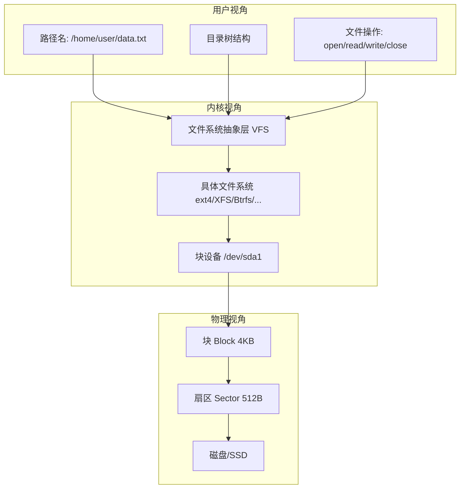
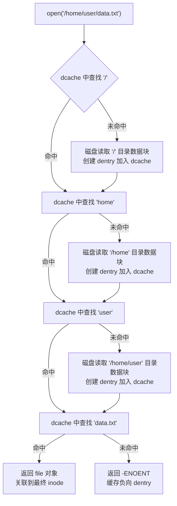
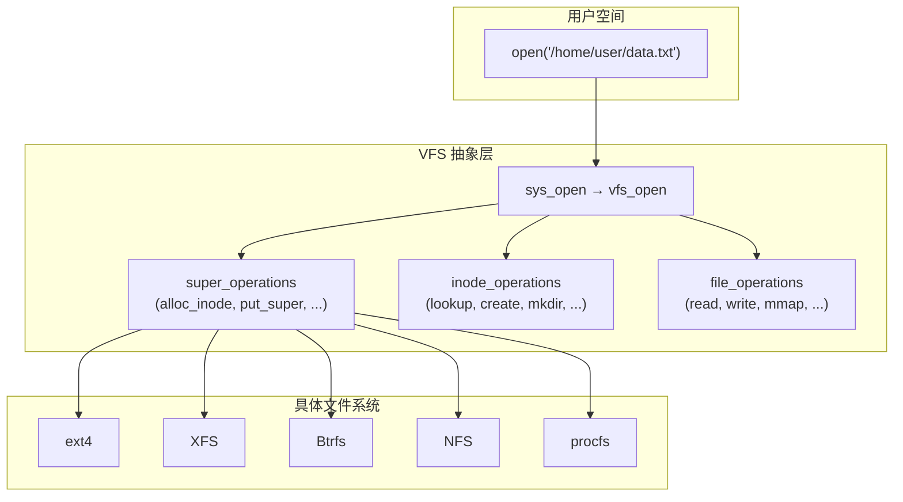

## 文件系统核心概念

文件系统是操作系统中负责持久化存储管理的核心子系统。它将底层块设备的线性地址空间抽象为用户可理解的目录树结构，为数据的组织、检索、共享和保护提供统一接口。本节从最基础的概念出发，建立理解后续各文件系统实现的共同认知框架。

### 1. 什么是文件系统

从用户视角看，文件系统是一个层次化的命名空间——你通过路径名（如 `/home/user/data.txt`）来访问数据。从内核视角看，文件系统是一组数据结构和算法的集合，负责将逻辑上的"文件"映射到物理存储介质上的"数据块"。



文件系统需要解决的核心问题：

| 问题 | 含义 | 解决方案 |
|------|------|----------|
| 持久化 | 内存数据断电后如何保留 | 将数据写入非易失性存储介质 |
| 命名空间 | 如何用人类可理解的方式组织数据 | 目录树 + 文件名 |
| 共享 | 多进程如何安全地访问同一数据 | 文件锁、权限控制、原子操作 |
| 空间管理 | 磁盘空间如何分配和回收 | 位图、空闲链表、B-tree |
| 可靠性 | 断电/崩溃后数据如何恢复 | 日志（journal）、COW、校验和 |

### 2. 存储层次结构：从扇区到文件

理解文件系统必须先理解存储设备的层次结构。数据在磁盘上以扇区（Sector）为最小寻址单位，在文件系统中以块（Block）为最小分配单位。

存储层次（从物理到逻辑）:

物理层:
    磁盘/SSD
    └── 扇区 (Sector): 512 字节（传统）或 4Kn (4096 字节, 新标准）
        └── 这是硬件层面的最小读写单位

文件系统层:
    块 (Block / Fragment): 通常 4KB
        └── 文件系统的最小分配单位
        └── ext4/XFS 默认 4KB，可选 1KB-64KB
        └── 块大小影响：最大文件大小、最大文件系统大小、小文件空间浪费

逻辑层:
    文件 (File)
        └── 由 inode 管理，包含一或多个块
        └── 文件 = inode（元数据）+ 数据块（实际内容）

**块大小的选择**是一个经典的权衡：

| 块大小 | 优点 | 缺点 | 适用场景 |
|--------|------|------|----------|
| 1KB | 小文件空间浪费少 | 大文件碎片严重，元数据开销大 | 大量小文件（邮件服务器） |
| 4KB | 平衡点，匹配内存页大小 | 中等空间浪费 | 通用场景（默认选择） |
| 64KB | 大文件顺序 IO 高效 | 小文件浪费严重（一个 1B 文件占 64KB） | 大文件专用（视频存储） |

> **经验法则**：块大小应与底层硬件的物理特性对齐。SSD 的页面大小通常为 4KB-16KB，NVMe 的最优 IO 大小为 4KB 的整数倍。将文件系统块大小设为 4KB 几乎总是一个安全的起点。

### 3. 元数据与数据的分离

文件系统中一个关键的设计决策是**元数据（Metadata）与数据（Data）的分离存储**。这是理解所有文件系统工作原理的基础。

一个文件的组成:

inode (元数据)                    数据块 (实际内容)
┌──────────────────┐            ┌──────────────────┐
│ inode 号: 12345   │            │                  │
│ 文件类型: 普通文件 │            │  Hello, World!   │
│ 权限: rw-r--r--   │            │                  │
│ 所有者: uid=1000  │            └──────────────────┘
│ 大小: 13 字节     │
│ 时间戳:           │            ┌──────────────────┐
│   atime: ...      │            │                  │
│   mtime: ...      │            │  更多数据...      │
│   ctime: ...      │            │                  │
│ 块指针: [50001]───┼───────────>└──────────────────┘
│ ...              │
└──────────────────┘

**inode（索引节点）** 是文件系统中最重要的数据结构之一。每个文件（包括目录、符号链接、设备文件等）都有且仅有一个 inode，其中存储了文件的所有元数据——但**不包含文件名**。

文件名存储在**目录项（directory entry）** 中，目录项本质上是一个"文件名 → inode 号"的映射表：

目录 /home/user/ 的数据块内容:
┌──────────────┬────────────┐
│ 文件名        │ inode 号    │
├──────────────┼────────────┤
│ .            │ 1000       │  (当前目录)
│ ..           │ 100        │  (父目录)
│ data.txt     │ 12345      │  (指向文件的 inode)
│ documents    │ 12346      │  (指向子目录的 inode)
│ readme.md    │ 12347      │
└──────────────┴────────────┘

这种分离设计的意义：

- **硬链接**：多个文件名可以指向同一个 inode。删除一个文件名只是删除目录项，inode 只有在引用计数归零时才真正释放。
- **重命名**：`mv` 操作只需修改目录项，不需要移动实际数据。
- **性能**：目录遍历时只需读取目录的数据块（包含文件名映射），不需要逐个读取 inode。

### 4. 文件描述符：进程与文件的桥梁

当进程调用 `open()` 打开一个文件时，内核创建一个**文件对象（struct file）**，并将文件描述符（file descriptor, fd）返回给用户空间。fd 是一个非负整数，作为进程打开文件表的索引。

进程打开文件的完整链路:

用户空间                              内核空间
┌──────────────┐                ┌─────────────────────┐
│ fd=3 ────────┼───────┐       │ struct file          │
│ fd=4 ────────┼─────┐ │       │   f_pos = 0 (当前偏移)│
│ fd=5 ────────┼───┐ │ │       │   f_flags = O_RDONLY │
│              │   │ │ │       │   f_op → ext4_file_ops│
└──────────────┘   │ │ │       └──────────┬────────────┘
                   │ │ │                  │
                   │ │ │                  ▼
                   │ │ │       ┌─────────────────────┐
                   │ │ │       │ dentry (目录项)       │
                   │ │ │       │   d_name = "data.txt"│
                   │ │ │       │   d_inode → inode     │
                   │ │ │       └──────────┬────────────┘
                   │ │ │                  │
                   │ │ │                  ▼
                   │ │ │       ┌─────────────────────┐
                   │ │ │       │ inode (索引节点)       │
                   │ │ │       │   i_ino = 12345      │
                   │ │ │       │   i_size = 4096      │
                   │ │ │       │   i_mapping → 页缓存  │
                   │ │ │       └─────────────────────┘
                   │ │ │
                   ▼ ▼ ▼
        struct files_struct (进程的打开文件表)
        ┌─────────────────────────┐
        │ fd 0 → stdin  (file)    │
        │ fd 1 → stdout (file)    │
        │ fd 2 → stderr (file)    │
        │ fd 3 → data.txt (file)  │──→ file A
        │ fd 4 → data.txt (file)  │──→ file B (同文件不同偏移)
        │ fd 5 → log.txt  (file)  │──→ file C
        └─────────────────────────┘

关键要点：

- **同一个文件可以被多次打开**：每次 `open()` 创建独立的 `struct file`，拥有独立的读写位置（`f_pos`）。多个进程（或同一进程多次打开）可以同时操作同一个文件而互不干扰。
- **文件描述符表是进程私有的**：进程 A 的 fd=3 和进程 B 的 fd=3 指向完全不同的 `struct file`。
- **标准输入/输出/错误**：fd 0/1/2 分别对应 stdin/stdout/stderr，这是所有 POSIX 进程的约定。

### 5. 路径解析：从路径名到 inode

当用户访问 `/home/user/data.txt` 时，内核需要将这个路径字符串逐步解析为最终的 inode。这个过程称为**路径解析（path resolution）**。

路径解析流程:

1. 从根目录 "/" 开始
   → 读取根 dentry → 获取根 inode → 读取根目录的数据块

2. 解析 "home"
   → 在根目录的数据块中查找 "home" → 获得 inode 号 100
   → 读取 inode 100 → 读取 /home 的数据块

3. 解析 "user"
   → 在 /home 的数据块中查找 "user" → 获得 inode 号 1000
   → 读取 inode 1000 → 读取 /home/user 的数据块

4. 解析 "data.txt"
   → 在 /home/user 的数据块中查找 "data.txt" → 获得 inode 号 12345
   → 读取 inode 12345 → 完成路径解析

每一步都涉及: 目录数据块读取 + inode 读取 = 至少 2 次磁盘 IO

**路径解析的性能优化**是文件系统设计中的关键考量：

- **Dentry 缓存（dcache）**：Linux 内核将最近使用的 dentry 缓存在内存中，避免重复的磁盘查找。dcache 命中时，路径解析的每一步只需要一次哈希表查找（O(1)），而不需要磁盘 IO。
- **负向缓存（negative dentry）**：如果查找一个不存在的文件名，也会缓存这个"不存在"的结果，避免对不存在的文件反复进行磁盘查找。
- **inode 缓存**：最近使用的 inode 也缓存在内存中（inode cache），避免重复读取。



### 6. 文件操作语义：open/read/write/close 的真实含义

理解文件系统操作的精确语义，是编写正确程序和排查问题的基础。

#### 6.1 open() — 打开文件

`open()` 不仅仅是检查文件是否存在，它完成了一系列操作：

open("/home/user/data.txt", O_RDONLY):
    1. 路径解析 → 找到最终 inode
    2. 权限检查 → 检查进程是否有权访问（uid/gid + 权限位 + ACL）
    3. 创建 struct file → 初始化 f_pos = 0, f_flags = O_RDONLY
    4. 调用文件系统的 open 方法 → ext4_file_open()
       → 可能检查文件系统特定约束（如加密文件的密钥是否可用）
    5. 分配 fd → 在进程的 fdtable 中找到空闲槽位
    6. 返回 fd 给用户空间

常见打开标志及其影响：

| 标志 | 含义 | 对文件系统的影响 |
|------|------|-----------------|
| `O_RDONLY` | 只读 | 不创建脏页，不影响写回 |
| `O_WRONLY` / `O_RDWR` | 只写/读写 | 可能触发日志事务 |
| `O_CREAT` | 不存在则创建 | 分配新 inode + 目录项 |
| `O_TRUNC` | 截断到 0 字节 | 释放所有数据块，更新 inode |
| `O_DIRECT` | 绕过页缓存 | 直接 IO，需要对齐到块大小 |
| `O_SYNC` | 每次写入同步到磁盘 | 极高延迟，极低吞吐 |
| `O_APPEND` | 追加模式 | 每次写前定位到文件末尾 |

#### 6.2 read() — 读取文件

read(fd, buf, count) 的完整流程:

1. 通过 fd 查找 struct file → 获取当前 f_pos
2. 权限检查（f_mode & FMODE_READ）
3. 调用 file->f_op->read_iter()
4. 文件系统实现（以 ext4 为例）:
   a. 计算逻辑块号 = f_pos / block_size
   b. 查找逻辑块 → 物理块的映射（extent tree / 间接块）
   c. 检查页缓存:
      - 命中 → 直接 copy_to_user()，零磁盘 IO
      - 未命中 → 从磁盘读取到页缓存，再 copy_to_user()
   d. 更新 f_pos += 实际读取字节数
5. 返回实际读取的字节数

**页缓存（Page Cache）** 是文件系统性能的核心。Linux 内核将最近读取的文件数据缓存在内存的页缓存中，后续读取可以直接从内存返回，避免磁盘 IO。

```python
# 演示页缓存的效果
import os, time

# 第一次读取：从磁盘读取
start = time.time()
with open('/tmp/largefile', 'rb') as f:
    data = f.read()  # 磁盘 IO
print(f"首次读取: {time.time() - start:.3f}s")

# 第二次读取：从页缓存返回
start = time.time()
with open('/tmp/largefile', 'rb') as f:
    data = f.read()  # 内存读取，快 100-1000 倍
print(f"再次读取: {time.time() - start:.6f}s")
```

#### 6.3 write() — 写入文件

写入操作比读取复杂得多，因为它涉及数据一致性保障：

write(fd, buf, count) 的完整流程:

1. 通过 fd 查找 struct file → 获取当前 f_pos
2. 权限检查（f_mode & FMODE_WRITE）
3. 调用 file->f_op->write_iter()
4. 文件系统实现（以 ext4 为例）:
   a. 计算逻辑块号
   b. 如果是延迟分配（默认）:
      - 将数据写入页缓存的脏页
      - 标记脏页，不立即分配磁盘块
   c. 如果是立即分配:
      - 通过多块分配器（mballoc）分配连续块
      - 将数据写入页缓存
   d. 更新 inode 元数据（大小、时间戳等）
   e. 对于 O_SYNC/数据完整性要求:
      - 触发日志事务提交
      - 等待数据落盘
5. 更新 f_pos += 实际写入字节数

**写入路径中的"脏页回写"**是文件系统性能的关键机制：

写入 → 页缓存（脏页） → 回写线程 → 磁盘
       ↑                    │
       │    脏页积累到阈值    │
       │    或 超时到期       │
       │                    │
       │    回写线程批量写入  │
       └────────────────────┘
       合并小写入为大 IO，显著提升吞吐

回写由内核的多个参数控制：

| 参数 | 默认值 | 含义 |
|------|--------|------|
| `vm.dirty_ratio` | 20% | 脏页占可用内存的比例达到此值时，进程被阻塞进行同步写回 |
| `vm.dirty_background_ratio` | 10% | 脏页比例达到此值时，后台回写线程开始工作 |
| `vm.dirty_expire_centisecs` | 3000 (30s) | 脏页超过此时间后被强制写回 |
| `vm.dirty_writeback_centisecs` | 500 (5s) | 回写线程的扫描间隔 |

#### 6.4 close() — 关闭文件

close(fd) 的完整流程:

1. 从 fdtable 中移除该 fd 的条目
2. 减少 struct file 的引用计数（f_count--）
3. 如果引用计数归零（最后一个关闭者）:
   a. 调用 file->f_op->release()
   b. 释放 struct file 结构
   c. 如果是排他锁（POSIX lock），自动释放
4. 注意：close() 不保证数据落盘！
   → 需要显式调用 fsync() 或使用 O_SYNC

> **常见误区**：很多人以为 `close()` 会将数据写入磁盘。实际上，`close()` 只是释放文件描述符，数据可能仍在页缓存中等待回写。如果在 `close()` 之后立即断电，未回写的数据可能丢失。要保证数据持久化，必须调用 `fsync(fd)` 或在打开时使用 `O_SYNC`。

### 7. 文件类型与特殊文件

Linux 文件系统中的"文件"不仅仅指普通文件。inode 的 `i_mode` 字段的高 4 位标识了文件类型：

| 类型 | 位模式 | 含义 | 示例 |
|------|--------|------|------|
| 普通文件 | `S_IFREG` | 存储数据的文件 | `/etc/passwd` |
| 目录 | `S_IFDIR` | 包含文件名→inode 映射的特殊文件 | `/home` |
| 符号链接 | `S_IFLNK` | 指向另一个路径的间接引用 | `/usr/bin/python → python3` |
| 块设备 | `S_IFBLK` | 按块（扇区）访问的设备 | `/dev/sda` |
| 字符设备 | `S_IFCHR` | 按字节流访问的设备 | `/dev/tty` |
| 命名管道 | `S_IFIFO` | 进程间通信的单向通道 | `mkfifo mypipe` |
| 套接字 | `S_IFSOCK` | 网络通信端点 | `/var/run/docker.sock` |

**目录**本身也是一个文件——它的数据块存储的是"文件名→inode号"的映射表。理解这一点，就理解了为什么删除目录需要递归地删除其中所有文件名（目录项），以及为什么空目录仍然占用 inode。

**符号链接**的 inode 中不存储数据块指针，而是将目标路径字符串直接存储在 inode 的扩展空间或专门的数据块中。访问符号链接时，内核读取目标路径并重新执行路径解析。

**硬链接与符号链接的区别**：

硬链接:
    文件 A (inode 12345) ←── 文件 B (inode 12345)
    两个文件名指向同一个 inode
    删除文件 A → inode 引用计数减一 → 仍可通过文件 B 访问
    删除文件 B → 引用计数归零 → inode 和数据块被释放

符号链接:
    文件 A (inode 12345) ──→ 存储 "/target/path"
    文件 B (inode 12346) ──→ 独立的 inode，数据内容是目标路径
    删除目标文件 → 符号链接变为悬空链接（dangling link）
    访问悬空链接 → 返回 -ENOENT

### 8. 文件系统的挂载与命名空间

Linux 通过**挂载（mount）** 机制将不同的文件系统组织到统一的目录树中。每个文件系统被挂载到某个挂载点（mount point），形成一棵完整的目录树。

一棵典型的 Linux 目录树:

/ (rootfs)
├── /bin          → 内核初始文件系统
├── /dev          → devtmpfs (设备文件)
├── /etc          → 内核初始文件系统
├── /home         → /dev/sda2 (ext4, 用户数据)
├── /proc         → procfs (内核虚拟文件系统)
├── /sys          → sysfs (内核虚拟文件系统)
├── /tmp          → tmpfs (内存文件系统)
├── /var          → /dev/sda3 (ext4, 可变数据)
└── /mnt/nas      → 192.168.1.100:/share (NFS)

挂载操作:
    mount -t ext4 /dev/sda2 /home
    mount -t nfs 192.168.1.100:/share /mnt/nas
    mount -t tmpfs tmpfs /tmp

**VFS（虚拟文件系统）** 是实现这种统一性的关键抽象层。VFS 定义了一组通用接口（super_block、inode、dentry、file），每种具体文件系统只需实现这些接口，就能无缝接入 Linux 的文件系统框架。



**挂载点的绑定**：当一个文件系统被挂载到某个目录时，该目录的 inode 会被替换为新文件系统的根 inode。此后，路径解析到该点时会切换到新文件系统的 VFS 实现。`/proc`、`/sys`、`/dev` 等虚拟文件系统就是通过这种方式将内核数据结构以文件的形式暴露给用户空间。

### 9. 文件系统一致性与崩溃恢复

文件系统操作通常涉及多个磁盘写入。例如，创建一个文件至少需要更新 3 处数据：inode 位图、inode 结构本身、目录数据块。如果在这些写入之间发生断电，文件系统可能处于不一致状态。

创建文件的多步操作:

    步骤 1: 分配 inode → 写入 inode 位图
    步骤 2: 初始化 inode → 写入 inode 结构
    步骤 3: 添加目录项 → 写入父目录数据块
    步骤 4: 更新父目录 inode 的 mtime/ctime

    如果步骤 3 完成后、步骤 4 完成前断电:
    → inode 已分配但目录项未更新 → "幽灵 inode"（空间泄漏）
    → 目录中没有文件名指向它，但 inode 被标记为已使用

**日志（Journaling）** 是解决这一问题的标准方案。其核心思想是：在修改实际数据之前，先将"要做什么"记录到日志区。崩溃恢复时，只需重放日志即可恢复一致性。

日志写入流程（ext4 ordered 模式）:

    1. 数据写入页缓存
    2. 日志事务开始:
       a. 元数据变更写入日志区 (journal)
       b. 等待数据块落盘 (data flush)
       c. 写入 commit record（标记事务完整）
    3. 将元数据从日志区写回最终位置
    4. 回收日志空间

崩溃恢复:
    1. 扫描日志区，找到最后一个完整的 commit record
    2. 重放该事务的所有元数据变更
    3. 丢弃未提交的事务
    4. 文件系统恢复到某个一致状态

三种日志模式的对比：

| 模式 | 日志内容 | 数据安全性 | 性能 | 适用场景 |
|------|----------|-----------|------|----------|
| journal | 元数据 + 数据 | 最高（数据写两次） | 最慢 | 数据完整性要求极高的环境 |
| ordered | 仅元数据（保证数据先于元数据落盘） | 高 | 中等 | 绝大多数生产环境（默认） |
| writeback | 仅元数据（数据落盘时机不确定） | 中等（可能出现旧数据） | 最快 | 性能优先的场景 |

### 10. 文件锁机制

多进程并发访问同一文件时，需要文件锁来保证数据一致性。Linux 支持两种主要的文件锁机制：

**POSIX 文件锁（fcntl lock）**：

POSIX 锁的特点:
    - 细粒度: 可以锁定文件的任意字节范围
    - 进程级: 同一进程内的所有线程共享锁
    - 自动释放: 进程退出时自动释放所有锁
    - 强制锁: 内核强制执行，其他进程的 IO 会被阻塞

示例（C 语言）:
    struct flock fl;
    fl.l_type = F_WRLCK;      // 写锁
    fl.l_whence = SEEK_SET;
    fl.l_start = 0;           // 从文件开头
    fl.l_len = 1024;          // 锁定 1024 字节
    fcntl(fd, F_SETLKW, &fl); // F_SETLKW = 阻塞等待获取锁

**flock 锁（BSD 风格）**：

flock 锁的特点:
    - 粒度粗: 锁定整个文件，不能指定字节范围
    - 文件描述符级: 不同 fd 可以独立加锁
    - 不继承: fork 后子进程不继承父进程的 flock
    - 建议锁: 仅作为协调约定，内核不强制执行

示例:
    flock(fd, LOCK_EX);   // 排他锁
    flock(fd, LOCK_SH);   // 共享锁
    flock(fd, LOCK_UN);   // 解锁

| 特性 | POSIX lock | flock |
|------|-----------|-------|
| 锁粒度 | 字节范围 | 整个文件 |
| 绑定对象 | 进程（所有 fd 共享） | 文件描述符 |
| 锁类型 | 强制锁（内核执行） | 建议锁（约定） |
| fork 继承 | 不继承 | 不继承 |
| NFS 支持 | 部分支持 | 不支持 |

> **生产建议**：对于数据库和关键应用，推荐使用 POSIX lock 进行细粒度并发控制。对于简单的进程间协调，flock 更简洁。避免依赖建议锁来保证数据安全——建议锁只在所有参与者都遵守协议时才有效。

### 11. 从用户空间到磁盘的完整路径

将前面的概念串联起来，一次完整的 IO 操作经历的层次：

应用层: write(fd, "hello", 5)
    │
    ▼
系统调用层: sys_write() → vfs_write()
    │  1. 通过 fd 查找 struct file
    │  2. 权限检查
    │  3. 调用 file->f_op->write_iter()
    │
    ▼
VFS 抽象层: 分发到具体文件系统的实现
    │
    ▼
具体文件系统 (ext4/XFS/Btrfs):
    ├── Buffered IO → 页缓存
    │   ├── 小写入合并到已有脏页
    │   ├── 脏页达到阈值或超时 → 触发回写
    │   └── 回写时分配磁盘块（延迟分配）
    ├── Direct IO → 绕过页缓存，直接写入块层
    └── mmap → 页错误触发，写入页缓存
    │
    ▼
块层 (Block Layer):
    ├── IO 合并: 相邻小 IO 合并为大 IO
    ├── IO 调度: mq-deadline / bfq / kyber / none
    └── 生成 request → 加入设备请求队列
    │
    ▼
设备驱动 (NVMe / SCSI / virtio-blk):
    │  将 request 转换为设备特定命令
    │
    ▼
硬件: 磁盘控制器 → 物理存储介质

理解这条完整路径，是后续进行文件系统性能调优的基础。路径中的每一层都存在优化空间——选择合适的 IO 调度器、调整回写参数、配置合适的块大小、使用 Direct IO 还是 Buffered IO——这些决策都建立在对这条路径的深入理解之上。

### 12. 核心概念速查表

| 概念 | 定义 | 关键数据结构 |
|------|------|-------------|
| 文件系统 | 将块设备抽象为目录树的软件层 | super_block, inode, dentry, file |
| inode | 文件的元数据容器（不含文件名） | struct inode |
| 目录项 (dentry) | 文件名到 inode 的映射 | struct dentry |
| 文件对象 (file) | 进程打开文件的运行时状态 | struct file |
| 页缓存 (Page Cache) | 内存中的文件数据缓存 | struct address_space |
| 日志 (Journal) | 崩溃恢复的重放日志 | JBD2 (ext4) |
| 块 (Block) | 文件系统的最小分配单位 | 通常 4KB |
| 扇区 (Sector) | 硬件的最小读写单位 | 512B 或 4Kn 4096B |
| 挂载 (Mount) | 将文件系统绑定到目录树 | struct vfsmount |
| 文件锁 | 多进程并发访问的同步机制 | struct file_lock |
