## 文件系统技术演进

### 1. 演进全景概述

文件系统是操作系统中最古老、最核心的子系统之一。从 1960 年代 IBM 大型机上的简单目录结构，到今天支撑全球互联网基础设施的分布式文件系统，文件系统技术经历了半个多世纪的演进。每一次重大变革都由硬件能力的突破和应用需求的升级共同驱动。

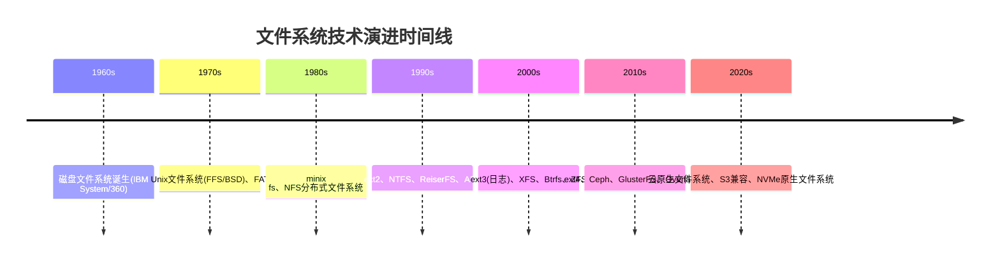

理解文件系统技术演进的核心意义在于：每一代文件系统解决的问题，恰恰是上一代留下的技术债务。掌握这条演进脉络，不仅能理解当前文件系统的设计哲学，还能预判未来的发展方向。

**三条演进主线：**

1. **可靠性演进**：从无保护 → 日志化 → 校验和 → 端到端数据完整性，每一步都在缩小数据丢失的可能性
2. **规模演进**：从单机 → 网络共享 → 分布式集群 → 全球统一命名空间，文件系统的边界不断扩展
3. **性能演进**：从适配机械磁盘（磁头寻道优化）→ 利用 SSD 并行性（多队列 I/O）→ 绕过内核（io_uring/DAX），I/O 路径不断精简

### 2. 第一代：无日志的简单文件系统（1960s—1980s）

第一代文件系统诞生于存储介质极度稀缺的年代。1956 年 IBM 305 RAMAC 配备了世界上第一块硬盘，容量仅 5MB，重量超过一吨。在这样的硬件条件下，文件系统的设计目标极为朴素：高效利用每一字节的存储空间。

#### 2.1 Unix 早期文件系统（FS）

1974 年，Ken Thompson 和 Dennis Ritchie 在 Unix V1 中引入了第一个广泛使用的文件系统。其核心设计极为简洁：

- **超级块（Superblock）**：存储文件系统全局元数据（块大小、块总数、空闲块列表）
- **i 节点（inode）数组**：顺序存储在磁盘开头，每个 inode 描述一个文件的元信息
- **数据块区**：存储实际文件内容

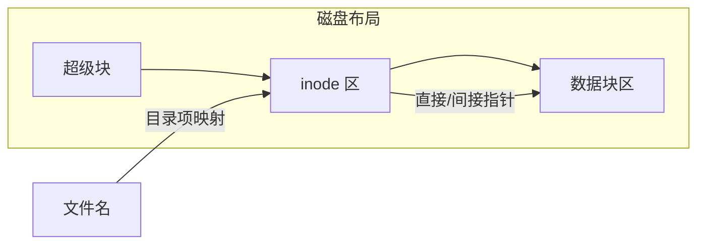

**inode 内部结构详解：**

每个 inode 包含 128 或 256 字节（取决于文件系统版本），其内部字段包括：

| 字段 | 大小 | 说明 |
|------|------|------|
| i_mode | 2 bytes | 文件类型（普通/目录/链接）和权限（rwx） |
| i_uid | 2 bytes | 所有者用户 ID |
| i_size | 4 bytes | 文件大小（字节） |
| i_atime | 4 bytes | 最后访问时间 |
| i_mtime | 4 bytes | 最后修改时间 |
| i_ctime | 4 bytes | inode 变更时间 |
| i_blocks | 4 bytes | 文件占用的数据块数 |
| i_block[15] | 60 bytes | 数据块指针数组（12 直接 + 1 间接 + 1 双间接 + 1 三间接） |

指针数组的设计巧妙地支持了不同大小的文件：前 12 个直接指针覆盖 0-48KB（以 4KB 块大小计），间接指针可寻址到约 4GB，双间接到约 4TB，三间接理论上可达数 PB。这种多级指针方案成为后续所有文件系统元数据设计的基础。

**关键限制：**

| 限制 | 具体表现 | 影响 |
|------|----------|------|
| 固定 inode 数量 | mkfs 时预分配，不可动态增长 | 小文件浪费大量空间 |
| 碎片严重 | 文件块分散在磁盘各处 | 机械磁盘寻道代价极高 |
| 全盘 fsck | 崩溃后需扫描整个磁盘 | 数 TB 磁盘恢复需数小时 |
| 文件名长度短 | 14 字符限制（目录项中 inode+name=16 字节） | 严重限制用户体验 |
| 无权限位粒度 | 仅有 owner/group/others 三类权限 | 无法满足多用户细粒度访问控制 |

#### 2.2 快速文件系统（FFS/BSD Fast Filesystem）

1984 年，Marshall Kirk McKusick 在 BSD Unix 中引入 FFS，是文件系统设计的第一个里程碑：

- **柱面组（Cylinder Group）**：将磁盘按物理柱面划分区域，将 inode 和数据块就近存放，大幅减少磁头寻道
- **大文件优化**：大文件的数据块跨柱面组分配，避免占用单组过多空间
- **磁盘块大小可配**：支持 4KB 块大小（相比早期 512 字节），提升大文件 I/O 效率
- **符号链接**：引入软链接机制，突破硬链接的跨文件系统限制

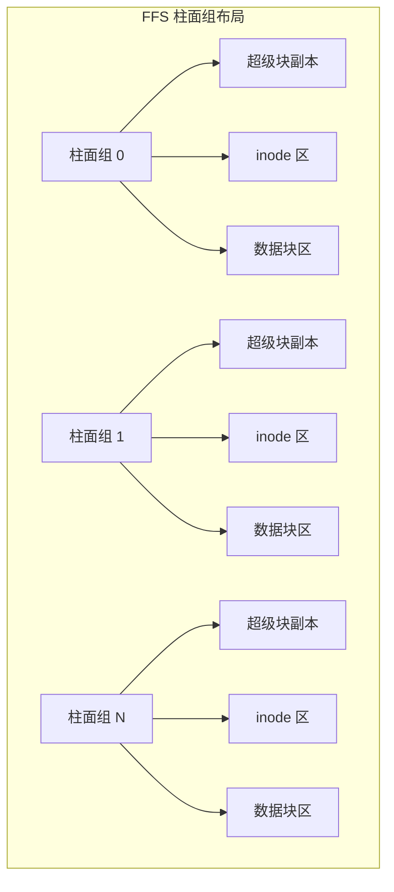

FFS 的核心洞察是：**文件系统的性能高度依赖磁盘的物理布局**。将逻辑上相关的数据在物理上靠近存放，是后续所有优化的基础思路。这一洞察至今仍然适用——即使在 SSD 时代，数据的局部性（locality）依然是 I/O 性能的关键因素。

#### 2.3 FAT 文件系统家族

FAT（File Allocation Table）是另一个独立演进的分支，由 Microsoft 在 1977 年为软盘设计，后演进为 FAT12→FAT16→FAT32→exFAT：

| 版本 | 最大卷大小 | 最大文件大小 | 分配表宽度 | 诞生年份 |
|------|-----------|-------------|-----------|---------|
| FAT12 | 32 MB | 32 MB | 12 bit | 1980 |
| FAT16 | 2 GB | 2 GB | 16 bit | 1984 |
| FAT32 | 2 TB | 4 GB | 32 bit | 1996 |
| exFAT | 128 PB | 16 EB | 64 bit | 2006 |

FAT 的设计哲学是极度简单：一个链式分配表，所有元数据集中存储。这使得 FAT 在嵌入式设备和可移动存储上至今仍有生命力，但其缺乏日志、不支持权限管理的缺点使其无法用于现代通用计算。

**FAT 的链式分配原理：** 文件的数据块不像 Unix 文件系统那样通过 inode 的指针数组间接引用，而是在 FAT 表中形成一个链表——每个表项指向下一个数据块的编号，文件的最后一个表项标记为结束符。这种设计极其简单，但也意味着：(1) 文件的随机访问性能差（必须从链头顺序遍历）；(2) FAT 表损坏会导致整个文件丢失；(3) 碎片化难以控制。

#### 2.4 其他早期文件系统

除 Unix FS 和 FAT 外，这一时期还有一些值得关注的文件系统：

- **CP/M 文件系统**（1974）：Gary Kildall 为 CP/M 操作系统设计，引入了"文件名.扩展名"的命名约定，影响了 DOS/Windows 至今的文件命名习惯
- **Amiga OFS/FFS**（1985）：Amiga 的 Original File System 和 Fast File System，首次引入了目录缓存（Directory Cache）机制
- **HPFS**（1988）：IBM 为 OS/2 设计的高性能文件系统，引入了 B+ 树目录索引和 254 字符长文件名

#### 2.5 第一代文件系统的共同问题

所有第一代文件系统面临同一个致命缺陷：**非原子性的元数据更新**。文件操作通常涉及多个磁盘写入（数据块写入 + inode 更新 + 目录项更新），如果在这些写入之间发生崩溃，文件系统将进入不一致状态。唯一的修复手段是全盘扫描（fsck），这在大容量磁盘时代是不可接受的。

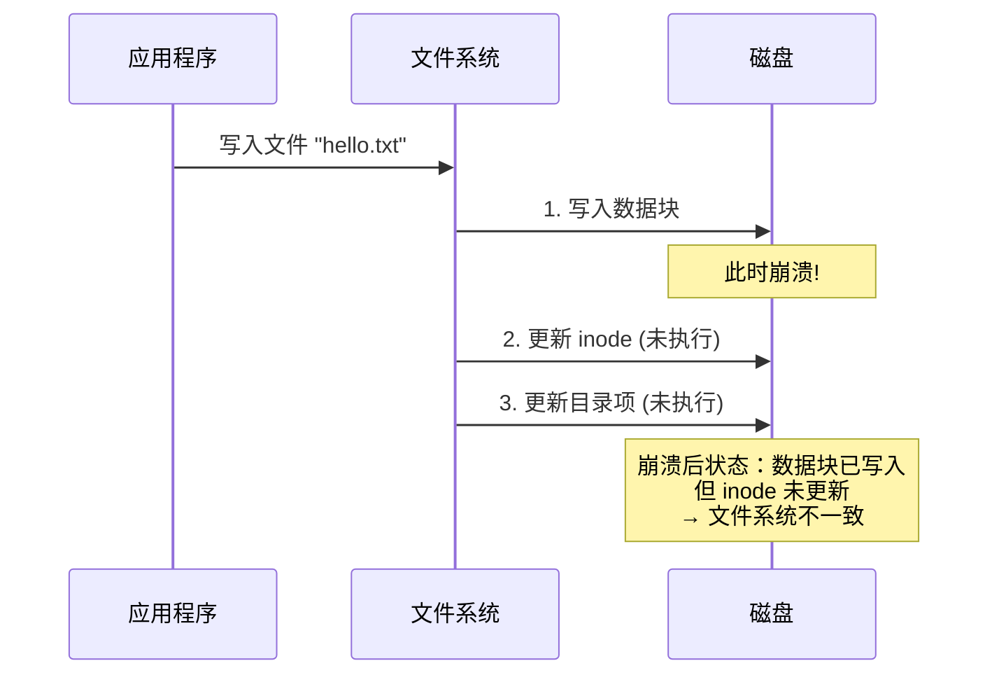

### 3. 第二代：日志文件系统的崛起（1990s—2000s）

#### 3.1 日志（Journaling）的核心思想

日志文件系统通过 **Write-Ahead Logging（WAL）** 原理解决了一致性问题：在将实际数据写入最终位置之前，先将所有变更记录到一个专用的日志区域（journal）。崩溃恢复时，只需重放日志即可恢复一致性，无需全盘扫描。

WAL 原理最早由 Jim Gray 在 1978 年提出（"Notes on Database Operating Systems"），用于数据库事务管理。将其引入文件系统是 1990 年代最重要的创新之一——本质上是将数据库的事务日志思想下沉到了操作系统层面。

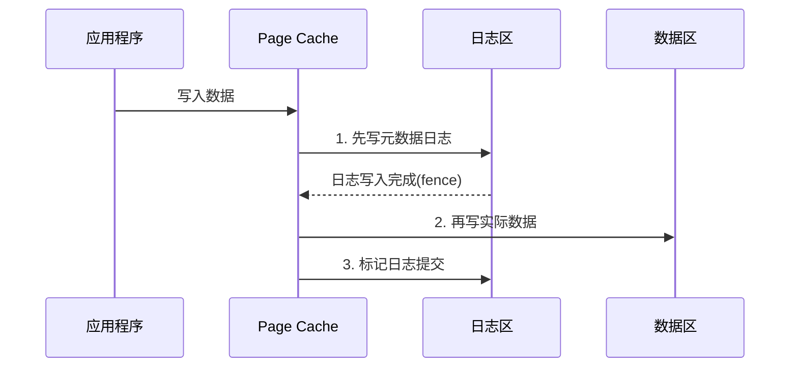

**日志模式对比：**

| 模式 | 记录内容 | 安全性 | 性能 | 代表文件系统 |
|------|---------|--------|------|-------------|
| Data=writeback（元数据日志） | 仅元数据变更 | 中（数据可能丢失） | 最快 | ext3/writeback, ReiserFS |
| Data=ordered（有序日志） | 元数据 + 保证数据先写 | 高 | 中等 | ext3/ordered, ext4 |
| Data=journal（完全日志） | 元数据 + 数据全部写日志 | 最高 | 最慢 | ext3/journal, JFS |

ordered 模式是目前的事实标准：它不将数据写入日志（避免日志膨胀），但保证数据块在元数据提交之前已落盘。这在性能和安全性之间取得了最佳平衡。

#### 3.2 ext3：日志化的里程碑

1999 年，Stephen Tweedie 将日志功能引入 ext2，形成 ext3。这是 Linux 文件系统历史上最关键的升级：

- **向后兼容**：ext2 可以无损在线升级为 ext3（只需添加日志设备）
- **三种日志模式**：writeback / ordered / journal，用户可按场景选择
- **在线 fsck**：崩溃后挂载即可使用，fsck 在后台进行
- **大文件支持**：最大支持 2 TB 卷和 2 TB 文件（32 位块寻址）

ext3 的向后兼容性是一个被低估的设计决策。当时 ext2 已广泛部署，任何不兼容的升级都会阻碍采用。通过"仅添加日志设备"的方式，ext3 实现了零风险迁移，这成为后续文件系统升级的典范。

#### 3.3 ext4：现代日志文件系统的巅峰

2008 年，ext4 正式合入 Linux 2.6.28，解决了 ext3 的诸多架构限制：

| 特性 | ext3 | ext4 | 意义 |
|------|------|------|------|
| 最大卷大小 | 2 TB | 1 EB | 支持超大存储 |
| 最大文件大小 | 2 TB | 16 TB | 满足大文件场景 |
| 块分配方式 | 位图 | 多块分配器(MBG) | 连续分配，减少碎片 |
| 延迟分配 | 无 | Delayed Allocation | 减少碎片，提升写入性能 |
| 校验和 | 无 | inode/checksum | 元数据损坏检测 |
| 持久预分配 | 无 | fallocate() | 数据库/VM磁盘预分配 |
| 日志校验 | 无 | CRC32 日志校验 | 防止日志损坏导致的静默数据损坏 |
| 大子目录 | 32K 个子目录 | 64K 个子目录 | 大规模目录支持 |

**ext4 的 delayed allocation 机制**是其最重要的性能优化之一。传统文件系统在数据写入 page cache 时立即决定磁盘块分配，而 ext4 会将分配决策延迟到最后时刻（刷盘前），从而让内核有更多信息来做出最优的连续分配决策，显著减少文件碎片。

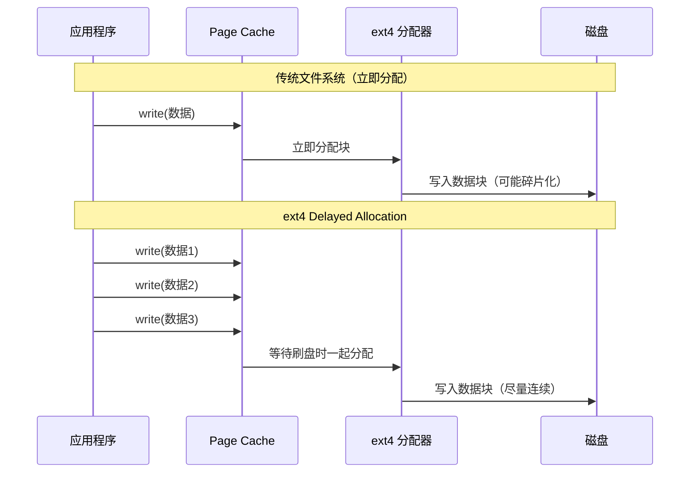

**ext4 与 XFS 的选择：** 在实际生产中，ext4 和 XFS 是最常用的两种文件系统。简单来说：ext4 适合通用场景（启动分区、一般服务器），XFS 适合大文件和高并发 I/O 场景（数据库、虚拟机镜像、视频处理）。RHEL 7+ 默认使用 XFS，Ubuntu 仍默认使用 ext4。

#### 3.4 ReiserFS：创新但短命的先驱

Hans Reiser 在 2001 年将 ReiserFS 合入 Linux 内核，引入了多项创新：

- **Tail Packing（尾部打包）**：将小文件直接存入 inode 内部或多个小文件共享一个块，消除小文件的空间浪费
- **B* 树索引**：用 B* 树替代传统目录的线性列表，大目录查找从 O(n) 提升到 O(log n)
- **事务模型**：支持原子化的命名空间操作

然而 ReiserFS 在 ext3/ext4 的持续演进下逐渐失去竞争力，加上作者的法律问题，最终在 Linux 3.3 被标记为废弃。ReiserFS 的教训是：技术创新不足以维持市场份额——生态系统和社区支持同样关键。

#### 3.5 XFS：面向高性能的大文件系统

XFS 诞生于 1993 年的 SGI IRIX，1999 年移植到 Linux，以处理超大文件和高吞吐 I/O 见长：

- **B+ 树管理所有结构**：inode、空闲空间、目录项全部用 B+ 树索引
- **Allocation Groups（分配组）**：将磁盘分为多个独立的分配区域，允许多线程并行分配空间而无需全局锁
- **延迟元数据日志**：元数据变更批量提交，减少日志 I/O 次数
- **reflink（CoW 复制）**：Linux 4.9 起支持，秒级创建大文件副本
- **在线碎片整理**：xfs_fsr 可在不卸载的情况下整理碎片

XFS 在大数据和容器场景中广泛应用。RHEL 7 将默认文件系统从 ext4 切换为 XFS，标志着其在企业级的全面认可。

**XFS 的 Allocation Group 设计：** 这是 XFS 高并发性能的关键。传统文件系统使用全局的空闲空间管理，多线程写入时必须争夺全局锁。XFS 将磁盘划分为多个 Allocation Group（默认每个 1GB），每个 AG 独立管理自己的 inode 和数据块分配。多个线程可以同时在不同的 AG 上分配空间，无需任何全局锁。这种设计天然适配多核 CPU 和并行 I/O 工作负载。

#### 3.6 JFS：IBM 的企业级方案

JFS（Journaled File System）从 AIX 移植到 Linux，具有以下特点：

- **EXT3/4 中最小的日志开销**：日志仅记录元数据变更
- **动态 inode 分配**：无需 mkfs 时预分配 inode 池
- **extent-based 分配**：减少大文件的元数据开销
- **低内存占用**：适用于资源受限的服务器环境

JFS 在 Linux 社区中的采用率不高，但在需要低资源消耗的企业环境中仍有价值。IBM 在 2009 年将 JFS 代码捐赠给社区后，维护力度逐渐减弱。

#### 3.7 NTFS：Windows 的日志文件系统

NTFS（New Technology File System）是 Windows NT 系列操作系统的默认文件系统，自 1993 年随 Windows NT 3.1 引入，至今仍是 Windows 的核心存储组件：

- **事务日志（USN Journal）**：支持文件系统级事务，可回滚文件操作
- **MFT（主文件表）**：类似 Unix inode 的元数据结构，但将文件名、安全描述符等信息直接嵌入
- **替代数据流（ADS）**：一个文件可以关联多个数据流，用于扩展元数据（也被恶意软件滥用）
- **压缩与加密**：支持透明文件压缩（LZNT1）和 EFS 加密
- **硬链接与软链接**：支持跨分区硬链接和符号链接

NTFS 在 Windows 生态中无可替代，但其在 Linux 中的兼容性一直是个痛点——Linux 的 ntfs-3g 驱动性能有限，原生的 ntfs3 驱动（由 Paragon 开发，2021 年合入 Linux 5.15）终于弥补了这一空白。

### 4. 跨越单机：分布式文件系统（1980s—2010s）

随着网络技术的发展和计算规模的增长，单机文件系统已无法满足多节点协作的需求。分布式文件系统应运而生，将文件共享的边界从单台机器扩展到整个网络。

#### 4.1 NFS：网络文件系统先驱

1984 年，Sun Microsystems 推出 NFS（Network File System），首次实现了透明的远程文件访问：

**NFS 架构核心组件：**

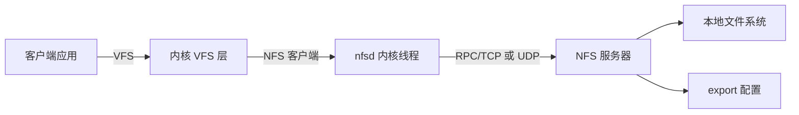

| NFS 版本 | 年份 | 关键改进 |
|----------|------|---------|
| NFSv2 | 1984 | 基本远程文件操作，UDP 传输 |
| NFSv3 | 1993 | 支持 TCP、大文件、异步写入、READDIRPLUS |
| NFSv4 | 2000 | 状态ful 协议、委托(delegation)、ACL、复合操作 |
| NFSv4.1 | 2010 | pNFS 并行访问、会话管理、状态持久 |
| NFSv4.2 | 2016 | 服务器端复制、稀疏文件、Labeled NFS |

NFS 的最大贡献是证明了 **网络透明性** 的可行性——远程文件访问可以像本地文件一样工作。但 NFS 的无状态设计（NFSv2/v3）和缺乏强一致性保证限制了其在高一致性场景下的应用。

**NFS 的缓存一致性问题：** NFS 客户端会缓存文件数据和元数据到本地内存中。当多个客户端同时修改同一文件时，可能出现缓存不一致。NFS 通过以下机制缓解：(1) close-to-open 语义——关闭文件时刷新缓存，打开文件时使缓存失效；(2) delegation 机制（NFSv4）——服务器将文件操作权委托给客户端，减少服务器交互，但需要在冲突时召回 delegation。即便如此，NFS 仍然不适合需要强一致性的数据库等场景。

#### 4.2 AFS：大规模分布式文件系统

1984 年，Carnegie Mellon 大学推出 Andrew File System（AFS），为大规模校园网络设计：

- **客户端缓存**：将整个文件内容缓存到本地磁盘（非内存），断网后仍可读
- **Cell 架构**：支持跨地域的 Cell 组织，每个 Cell 有独立的认证和命名空间
- **卷复制**：通过 Backup Read-Only Volume 实现高可用

AFS 的缓存粒度是整个文件（而非块级），这简化了缓存一致性协议，但对频繁修改的小文件不友好。OpenAFS 是其开源延续。AFS 的设计思想深刻影响了后续的分布式文件系统，尤其是其"以文件为粒度的缓存"理念在现代 CDN 和内容分发中仍有回响。

#### 4.3 CIFS/SMB：Windows 的文件共享协议

Server Message Block（SMB）是 Microsoft 为 DOS/Windows 设计的局域网文件共享协议：

| SMB 版本 | 对应 Windows | 关键特性 |
|----------|-------------|---------|
| SMB 1.0 | Windows 3.1 | 基本文件共享，严重性能问题 |
| SMB 2.0 | Windows Vista | 重编协议，减少 chatter，性能大幅提升 |
| SMB 2.1 | Windows 7 | Large MTU、Leasing |
| SMB 3.0 | Windows 8 | 加密、多通道(Multi-Channel)、SMB Direct(RDMA) |
| SMB 3.1.1 | Windows 10 | AES-128 加密、预认证完整性检查 |

SMB 1.0 因严重的安全漏洞（WannaCry 利用的 EternalBlue 漏洞即针对 SMB 1.0）已被 Microsoft 官方废弃。SMB 3.0+ 在性能和安全性上已接近本地文件系统。

**Samba：Linux 的 SMB 实现：** Samba 项目（1994 年诞生）让 Linux 能够与 Windows 机器无缝共享文件和打印机。现代 Samba 4.x 实现了完整的 SMB 3.1.1 协议，支持 Active Directory 域控制器功能，是 Linux 在企业 Windows 环境中存活的关键基础设施。

#### 4.4 Google File System（GFS）：开启分布式新纪元

2003 年，Google 发表 GFS 论文，彻底改变了分布式存储的格局。其核心假设和设计决策至今影响深远：

**GFS 的关键设计假设：**

| 假设 | 含义 | 对设计的影响 |
|------|------|-------------|
| 组件故障是常态 | 数千台机器，故障每天发生 | 自动检测与恢复 |
| 文件通常很大 | 平均 100MB+，GB 级常见 | 优化大文件 I/O |
| 追加多于随机写 | 一次写入后多次读取 | 追加操作优化 |
| 高吞吐优先 | 批处理场景为主 | 宽带比低延迟更重要 |

**GFS 架构：**

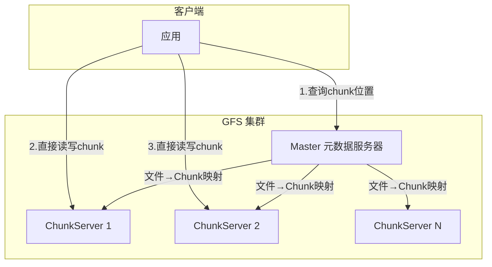

- **64MB Chunk**：大粒度数据块，减少元数据量
- **3 副本**：每个 Chunk 三副本，不同机架分布
- **单 Master**：元数据集中管理，简化设计
- **追加一致性模型**：多次追加保证至少一次（at-least-once），不保证 exactly-once

GFS 论文的最大贡献不仅是其技术设计，更是证明了 **软件层面的一致性** 可以替代昂贵的硬件 RAID，开启了"商用硬件 + 智能软件"的分布式存储范式。

#### 4.5 Panasas PanFS 与 Lustre 的早期竞争

在 GFS 之前，Panasas（1999）和 Lustre（2001）已经开始了高性能分布式文件系统的探索。Panasas 的 ActiveStor 使用专有硬件和 OSN（Object Storage Node）架构，而 Lustre 则基于开源模型。这两者在 HPC 领域的实践为后来的 Ceph、GlusterFS 等系统提供了宝贵经验。

### 5. 第三代：现代分布式与云原生文件系统（2010s—至今）

#### 5.1 HDFS：Hadoop 生态的存储基石

HDFS（Hadoop Distributed File System）是 GFS 的开源实现，针对 Hadoop 生态优化：

**HDFS vs GFS 关键差异：**

| 维度 | GFS | HDFS |
|------|-----|------|
| 语言 | C++ | Java |
| Master | 单节点 | 单 NameNode（后演进为 HA + 联邦） |
| Chunk 大小 | 64MB | 128MB（默认） |
| 追加模型 | Record append + Byte range | Append-only |
| 适用场景 | Google 内部批处理 | 开源大数据生态 |

HDFS 的 NameNode 单点问题是其最大瓶颈。社区通过以下路径解决：

1. **HDFS HA（High Availability）**：Active/Standby NameNode + JournalNode 共享日志
2. **HDFS Federation**：多个 NameNode 分管不同的命名空间（namespace）
3. **HDFS Erasure Coding**：用纠删码替代 3 副本，存储开销从 300% 降至约 150%

**HDFS 的小文件问题：** HDFS 每个文件在 NameNode 中占用约 150 字节的内存。当集群中存在数百万个小文件时，NameNode 的内存会成为瓶颈，且 MapReduce 任务的 split 数量暴增导致性能下降。解决方案包括：HAR（Hadoop Archive）、SequenceFile、CombineFileInputFormat，以及将小文件合并到 HBase 等方案。

#### 5.2 Ceph：统一存储的集大成者

Ceph（2007 年诞生，2012 年并入 Red Hat）代表了分布式文件系统的最新范式：

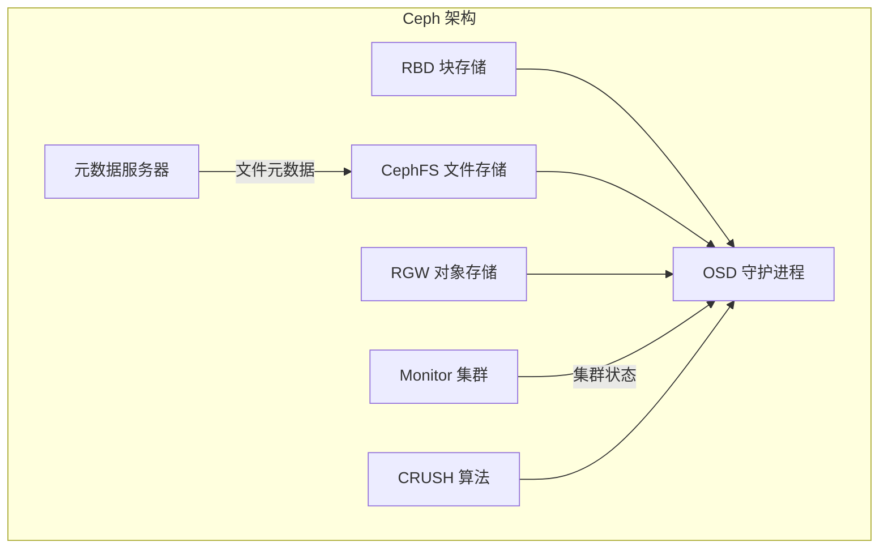

**Ceph 的三大创新：**

1. **CRUSH 算法**：去中心化的数据放置算法，客户端自行计算数据存储位置，无需查表，消除元数据服务器瓶颈
2. **统一存储**：一套 Ceph 集群同时提供块（RBD）、文件（CephFS）、对象（RGW）三种接口
3. **自修复**：OSD 自动检测故障、重新均衡数据，无需人工干预

| Ceph 特性 | 传统 SAN/NAS | Ceph |
|-----------|-------------|------|
| 扩展性 | 受限于控制器 | 线性扩展到数千节点 |
| 单点故障 | 控制器是瓶颈 | 无单点故障 |
| 接口 | 块或文件或对象 | 三合一 |
| 成本 | 专用硬件 | 商用硬件 |
| 一致性 | 依赖硬件 | CRUSH + OSD 智能协调 |

**CRUSH 算法详解：** CRUSH（Controlled Replication Under Scalable Hashing）是 Ceph 的核心创新。传统分布式存储依赖中央服务器维护"数据在哪"的映射表，这在大规模集群中成为瓶颈。CRUSH 让客户端自己根据数据的 CRUSH ID 和集群的拓扑结构，通过确定性算法计算出数据应存储的位置。这种去中心化设计意味着：(1) 客户端不需查询任何服务器即可定位数据；(2) 集群扩缩容时数据自动均衡；(3) 故障域（机架、机柜、机房）可以灵活配置。

#### 5.3 GlusterFS：无中心的弹性文件系统

GlusterFS 采用 **无中心元数据服务器** 的全对称架构：

- **弹性哈希算法（ECO）**：通过哈希计算文件位置，无需中央元数据服务器
- **Volume 逻辑卷**：支持分布式、复制、条带、分布+复制等多种 Volume 类型组合
- **FUSE 用户态实现**：通过 FUSE 挂载，无需内核模块，易于跨平台

**GlusterFS Volume 类型选择：**

| Volume 类型 | 特点 | 适用场景 |
|-------------|------|---------|
| Distribute | 文件分散到多个 brick | 大容量存储，无需冗余 |
| Replicate | N 副本冗余 | 高可用存储 |
| Disperse | 纠删码冗余 | 高可用 + 高存储效率 |
| Distribute-Replicate | 分布式 + 复制 | 生产环境标准选择 |
| Stripe | 文件条带化到多个 brick | 大文件并行读写 |

GlusterFS 在容器存储领域也有应用，Red Hat 的 OpenShift 曾将其作为内置存储方案。但随着 Ceph 的成熟，GlusterFS 的市场份额逐渐被挤压，Red Hat 已于 2022 年宣布终止对 GlusterFS 的商业支持。

#### 5.4 Lustre：高性能计算（HPC）的标配

Lustre 是全球 Top500 超算中使用最广泛的并行文件系统：

- **MDS（元数据服务器）**：管理目录和文件元数据
- **OST（对象存储目标）**：存储实际数据，支持多 OST 并行读写
- **MGT（管理服务器）**：管理集群配置和节点注册
- **并行 I/O**：客户端可以同时从多个 OST 并行读写同一文件

Lustre 的优势在于极端的吞吐性能（可达 TB/s 级聚合带宽），适用于气象模拟、基因测序、石油勘探等 HPC 场景。但其运维复杂度较高，不适合通用云计算。

**Lustre 在 Top500 超算中的应用：** 截至 2024 年，Top500 中超过 60% 的超算使用 Lustre 或其衍生版本。例如，Frontier（全球排名第一的超算，2.1 ExaFLOPS）使用 Lustre 管理超过 700PB 的存储。Lustre 在极端规模下的表现证明了并行文件系统设计的有效性。

#### 5.5 BeeGFS：新兴的 HPC 文件系统

BeeGFS（原名 FhGFS）由德国弗劳恩霍夫高性能计算中心开发，是 Lustre 的主要竞争者：

- **全对称架构**：元数据和数据分布在任意节点上
- **自动条带化**：大文件自动分散到多个存储节点
- **易于部署**：安装配置比 Lustre 简单得多
- **RDMA 支持**：利用 InfiniBand 实现超低延迟

BeeGFS 在中等规模 HPC 环境中增长迅速，尤其受到研究机构和中小型超算集群的青睐。

### 6. 容器时代的文件系统演进（2013—至今）

#### 6.1 Union File System（联合文件系统）

容器技术的兴起催生了对轻量级、可叠加文件系统的需求。联合文件系统将多个目录层叠加为一个统一的视图：

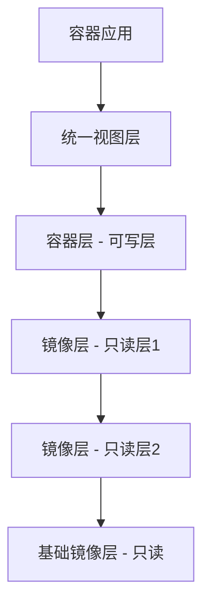

**OverlayFS 演进历程：**

| 版本 | Linux 内核版本 | 关键特性 |
|------|---------------|---------|
| OverlayFS v1 | 3.18 | 仅支持 2 层（lower + upper） |
| OverlayFS v2 | 4.0 | 支持多 lower 层、元数据复制优化 |
| 原生支持 | 4.0+ | 合入主线内核，Docker/OCI 默认驱动 |

**OverlayFS 的 copy-up 机制：** 当容器需要修改来自只读层的文件时，OverlayFS 会将该文件从只读层复制到可写层，然后在可写层上进行修改。这个过程对应用透明，但首次修改大文件时会有短暂延迟。copy-up 是按需的（lazy），只有在实际需要写入时才触发，这保证了容器启动速度不受镜像层数的影响。

**overlay2 的内部实现：** overlay2 是 Docker 默认使用的存储驱动，它管理两个核心目录：lowerdir（只读层）和 upperdir（可写层）。当应用读取文件时，overlay2 按照 upperdir → lowerdir 的优先级查找；当应用写入文件时，copy-up 将文件从 lowerdir 复制到 upperdir，然后在 upperdir 上修改。删除文件时，overlay2 在 upperdir 创建一个"whiteout"标记文件来遮蔽 lowerdir 中的文件。

#### 6.2 Device Mapper (dm) 与 Devicemapper

Docker 早期在 RHEL/CentOS 上使用 Device Mapper 作为存储驱动：

- **dm-thin provisioning**：按需分配存储块，避免预分配浪费
- **dm-blt**：Docker 定制的快照管理方案
- **direct-lvm**：生产环境推荐模式，绕过 loop 设备直接操作 LVM

随着 OverlayFS 在内核中的成熟，Devicemapper 逐渐退出主流，但在需要精细块级管理的场景中仍有价值。

#### 6.3 块存储文件系统选型指南

容器场景下的文件系统选型需要权衡性能、稳定性和功能：

| 驱动 | 读性能 | 写性能 | 稳定性 | 适用场景 |
|------|--------|--------|--------|---------|
| OverlayFS (overlay2) | 极快 | 快 | 极高 | Docker/OCI 标准选择 |
| Btrfs | 快 | 中 | 高 | 需要快照/压缩的场景 |
| ZFS on Linux | 快 | 快 | 极高 | 数据完整性要求极高 |
| Device Mapper | 快 | 中 | 高 | RHEL 传统环境 |
| VFS | 慢 | 慢 | 极高 | 测试环境（不存储数据） |

### 7. 持续演进中的前沿技术

#### 7.1 Copy-on-Write（写时复制）文件系统

COW 文件系统将"原地修改"变为"写新位置+原子切换指针"，天然具备快照、压缩、去重、校验等能力：

**Btrfs 关键特性：**

| 特性 | 实现原理 | 使用方式 |
|------|---------|---------|
| 快照 | COW 共享未修改的块 | `btrfs subvolume snapshot` |
| 在线压缩 | zlib/lzo/zstd 压缩写入 | `mount -o compress=zstd` |
| 子卷管理 | 每个子卷独立的命名空间和快照 | `btrfs subvolume create` |
| 校验和 | 每个数据块和元数据块 CRC32C 校验 | 自动启用 |
| RAID | 内置 RAID 0/1/5/6/10 支持 | `btrfs balance convert=raid1` |
| 在线碎片整理 | 在线整理文件碎片 | `btrfs filesystem defragment` |

**Btrfs 的 RAID 5/6 仍存在已知的 write hole 问题**，生产环境建议使用 RAID 1 或 RAID 10，或等待修复。write hole 的本质是：当 RAID 5/6 写入数据时，需要同时更新数据块和校验和块，如果在两者之间崩溃，校验和将与数据不一致。Btrfs 的解决方案（部分写入恢复）目前尚未完全可靠。

**ZFS 关键特性：**

| 特性 | Btrfs | ZFS | 说明 |
|------|-------|-----|------|
| 校验和 | CRC32C | SHA-256/Blake3 等 | ZFS 算法选择更多 |
| RAID-Z | 仅 RAID 5/6 | RAIDZ1/2/3 | ZFS 的 RAID-Z 更成熟 |
| 去重 | 实验性 | 可选开启（内存消耗大） | ZFS 去重更稳定 |
| 内存要求 | 低（默认 1GB 足够） | 推荐 1GB/TB 数据 | ZFS ARC 需要大量内存 |
| 许可证 | GPL | CDDL（与 GPL 不兼容） | ZFS 不能直接合入 Linux 内核 |

**ZFS 的诞生故事：** ZFS 由 Sun Microsystems 的 Jeff Bonwick 团队于 2001 年发布，其设计目标是"最后一个文件系统"——通过将存储管理、文件系统和卷管理合并为一个统一的软件栈，消除传统方案中各层之间的不一致问题。ZFS 的 128 位地址空间（理论上支持 2^128 个 ZB）意味着它永远不会耗尽地址空间。OpenZFS 项目（2013 年）让 ZFS 在 Linux 和 macOS 上得以延续。

#### 7.2 NVMe 与文件系统的协同演进

NVMe SSD 将存储延迟从 HDD 的 5-10ms 降低到 SSD 的 50-100μs，再降低到 NVMe 的 10-20μs。这种数量级的提升要求文件系统重新审视其设计假设：

| HDD 时代假设 | NVMe 时代现实 | 文件系统影响 |
|-------------|-------------|-------------|
| I/O 调度是必要的 | NVMe 延迟极低，调度开销 > I/O 本身 | 使用 none/noop 调度器 |
| 合并写入是关键优化 | 随机写和顺序写延迟差距缩小 | 延迟分配仍有碎片价值，但收益减小 |
| 数据完整性由磁盘保证 | SSD 坏块管理复杂 | 校验和（ZFS/Btrfs）价值更大 |
| 单队列足够 | NVMe 支持 64K 队列，每队列 64K 命令 | 文件系统需要多队列 I/O 支持 |

**io_uring 与文件系统的融合**是当前最活跃的前沿领域。io_uring 由 Jens Axboe 于 2019 年在 Linux 5.1 中引入，通过共享内存环形缓冲区实现零拷贝系统调用，将文件 I/O 的上下文切换开销降至接近零。

io_uring 的核心创新包括：(1) **提交/完成队列**——用户空间和内核空间通过共享的环形缓冲区交换 I/O 请求和完成事件，无需传统系统调用的上下文切换；(2) **内核侧轮询**——内核可以持续检查提交队列，完全消除中断开销；(3) **链接操作**——多个 I/O 操作可以链式执行，内核批量处理。

XFS 和 ext4 已支持 io_uring 的异步文件操作。io_uring 的 `IORING_OP_READ` 和 `IORING_OP_WRITE` 可以绕过 VFS 层的部分开销。未来可能催生全新的文件系统 I/O 路径设计——当前的 VFS → 文件系统 → 块层 → 设备驱动的四层栈可能被精简为更扁平的路径。

#### 7.3 持久内存（PMem）与文件系统

Intel Optane 持久内存（已停产但技术方向明确）代表了介于 DRAM 和 SSD 之间的新型存储层级：

- **DAX（Direct Access）**：绕过页缓存，应用直接访问持久内存，消除内核 I/O 路径开销
- **ext4 DAX 模式**：`mount -o dax` 后，文件 I/O 不经过 page cache，延迟降至纳秒级
- **XFS DAX 模式**：XFS 也支持 DAX，且在某些基准测试中表现优于 ext4 DAX
- **元数据操作仍然是瓶颈**：即使数据路径绕过了内核，元数据操作（创建文件、重命名等）仍需走内核路径

**DAX 的工作原理：** 传统文件 I/O 路径是 应用 → page cache → 块层 → 设备驱动，每次读写都涉及内核页缓存的管理开销。DAX 模式将持久内存直接映射到进程地址空间，应用通过指针直接读写持久内存，完全绕过 page cache。这意味着一次文件读取的延迟从微秒级（经过页缓存）或毫秒级（经过块层）降至纳秒级（直接内存访问）。

#### 7.4 分布式元数据管理

传统 GFS/HDFS 的单 Master/NameNode 元数据管理方案在大规模集群中成为瓶颈。现代方案包括：

| 方案 | 代表系统 | 元数据管理策略 |
|------|---------|---------------|
| 集中式 | HDFS Federation | 多 NameNode 分管不同命名空间 |
| 分布式 | CephFS | MDS 集群 + 动态子树分片 |
| 去中心化 | GlusterFS | 一致性哈希，无元数据服务器 |
| 混合式 | JuiceFS | 元数据存 Redis/MySQL/TiKV + 数据存对象存储 |

JuiceFS 作为较新的方案，将元数据存储在用户已有的数据库（Redis、TiKV、MySQL 等）中，数据存储在对象存储（S3、COS 等）上，大幅降低了分布式文件系统的运维门槛。JuiceFS 特别适合云原生场景：开发者无需管理存储服务器，只需配置元数据引擎和对象存储后端即可获得一个完整的 POSIX 兼容文件系统。

#### 7.5 云原生文件系统

随着 Kubernetes 成为事实上的容器编排标准，文件系统也需要适配云原生工作负载：

- **CSI（Container Storage Interface）**：标准化了容器运行时与存储系统的接口，使文件系统驱动可以作为插件动态加载
- **EFS（AWS）/Filestore（GCP）/Azure Files**：云服务商提供的托管文件存储服务，底层通常是定制的分布式文件系统
- **Longhorn（Rancher）**：基于 iSCSI 的 Kubernetes 原生分布式块存储
- **OpenEBS**：基于容器的存储平台，支持多种存储引擎（Jiva、cStor、LocalPV）

**云原生文件系统的趋势：** 存储正在从"基础设施"变为"服务"。开发者不再关心底层是 ext4 还是 XFS，只需声明所需的服务等级（IOPS、吞吐、持久性），由平台自动选择和管理底层存储。这种抽象层次的提升是文件系统演进的最新阶段。

### 8. 技术选型决策框架

面对如此多的文件系统选择，实际项目中应如何决策？

#### 8.1 场景驱动选型矩阵

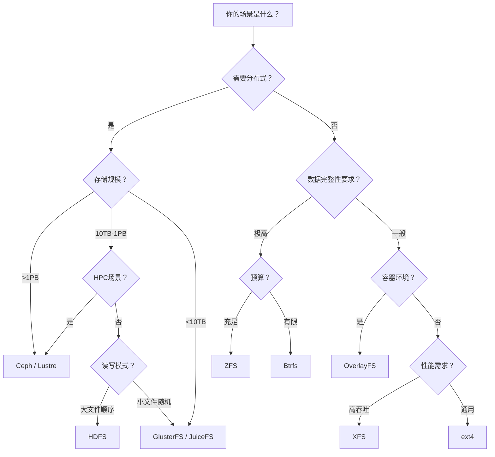

#### 8.2 主流文件系统综合对比

| 维度 | ext4 | XFS | Btrfs | ZFS | Ceph | Lustre |
|------|------|-----|-------|-----|------|--------|
| 最大卷 | 1 EB | 8 EB | 16 EB | 256 ZB | PB 级 | PB 级 |
| 最大文件 | 16 TB | 8 EB | 16 EB | 16 EB | PB 级 | PB 级 |
| 日志 | 有序 | 延迟元数据 | COW | COW | COW | 混合 |
| 快照 | 不支持 | 不支持 | 原生 | 原生 | 原生 | 有限 |
| 压缩 | 不支持 | 不支持 | 原生 | 原生 | 可选 | 可选 |
| 校验和 | 元数据 | 不支持 | 全量 | 全量 | 可选 | 可选 |
| 去重 | 不支持 | 不支持 | 实验性 | 可选 | 可选 | 不支持 |
| 扩展性 | 单机 | 单机 | 单机 | 单机 | 分布式 | 分布式 |
| 复杂度 | 低 | 低 | 中 | 中高 | 高 | 高 |

#### 8.3 文件系统迁移实战指南

在实际项目中，文件系统的迁移（如 ext2→ext3、ext3→ext4、ext4→XFS）是常见需求。以下是安全迁移的核心原则：

**在线升级（推荐）：**

| 迁移路径 | 方法 | 风险等级 | 注意事项 |
|----------|------|---------|---------|
| ext2 → ext3 | `tune2fs -j /dev/sdX` | 极低 | 只需添加日志，不影响数据 |
| ext3 → ext4 | `tune2fs -O extents,dir_index,flex_bg` | 低 | 启用 ext4 特性，可回滚 |
| ext4 → XFS | 不支持在线转换 | 高 | 必须备份→格式化→恢复 |

**离线转换（高风险）：**

- **转换前**：完整备份数据，验证备份可恢复
- **转换中**：使用 Live USB/CD 启动，确保源分区未挂载
- **转换后**：立即验证文件完整性和系统启动能力

### 9. 常见误区与最佳实践

#### 9.1 误区澄清

**误区一：ext4 "够用了"，不需要考虑其他文件系统**

虽然 ext4 是 Linux 默认文件系统且足够稳定，但在特定场景下其他文件系统可能更优。例如：
- 大量小文件场景 → Btrfs 的 tail packing 或 XFS 的 B+ 树索引
- 需要快照和数据完整性 → ZFS 或 Btrfs
- 高吞吐并行 I/O → XFS 或 Lustre
- 虚拟机磁盘 → XFS（延迟分配减少碎片）或 raw device 直通

**误区二：ZFS 是 Btrfs 的全面升级**

ZFS 和 Btrfs 虽然同属 COW 文件系统，但设计哲学不同：
- ZFS 更成熟稳定，RAID-Z 生产就绪，但内存需求高且许可证限制
- Btrfs 集成度更高（内核原生），子卷管理更灵活，但 RAID 5/6 仍有问题
- Btrfs 的发送/接收（send/receive）增量同步功能在备份场景中优于 ZFS
- ZFS 的去重功能生产就绪（但消耗大量 RAM），Btrfs 去重仍为实验性

**误区三：分布式文件系统可以完全替代本地文件系统**

分布式文件系统增加了网络延迟和复杂性。对于不需要跨节点共享的数据，本地文件系统仍然是性能和可靠性的最佳选择。

**误区四：RAID 等于备份**

无论使用哪种文件系统，RAID 提供的是冗余（防止单盘故障），不是备份（防止误删、勒索软件、逻辑错误）。RAID 可以防止硬件故障导致的数据丢失，但无法防止人为错误或软件缺陷导致的数据损坏。3-2-1 备份原则（3 份副本、2 种介质、1 份异地）仍然适用。

**误区五：SSD 不需要碎片整理**

虽然 SSD 的随机读写性能远优于 HDD，但文件碎片仍然会影响 SSD 的性能。碎片化的文件需要更多的 I/O 请求来读取完整的文件内容，这会增加 I/O 调度开销和 NAND 闪存的写放大。不过 SSD 不需要传统意义上的碎片整理（移动物理块位置），而是需要通过 TRIM 告知 SSD 哪些块已不再使用。

#### 9.2 文件系统维护最佳实践

| 操作 | 工具 | 频率 | 说明 |
|------|------|------|------|
| 碎片整理 | `e4defrag` / `xfs_fsr` | 每月 | ext4/XFS 在线碎片整理 |
| 空间回收 | `fstrim` / `discard` | 每周 | SSD TRIM 维护 |
| 完整性检查 | `fsck` / `btrfs scrub` | 每季度 | ext4 离线检查；Btrfs 在线扫描 |
| 空间使用分析 | `ncdu` / `duf` | 随时 | 识别大文件和空间浪费 |
| 快照管理 | `snapper` / `timeshift` | 每日 | 定期快照和清理策略 |
| 性能监控 | `iostat` / `iotop` | 实时 | 监控 I/O 等待和带宽 |

**常用文件系统诊断命令：**

```bash
# 查看文件系统类型和挂载选项
df -Th

# 查看 inode 使用情况（inode 耗尽也会导致无法写入）
df -i

# 查看块设备信息
lsblk -f

# ext4 文件系统信息
tune2fs -l /dev/sda1

# XFS 文件系统信息
xfs_info /dev/sda1

# Btrfs 文件系统信息
btrfs filesystem show
btrfs filesystem df /

# ZFS 文件系统状态
zpool status
zfs list

# 检测文件系统碎片程度
# ext4
e4defrag -c /mount/point
# XFS
xfs_db -r -c "frag" /dev/sda1

# 在线 TRIM
fstrim -v /mount/point
```

### 10. 总结与展望

文件系统技术的演进可以用三条主线来概括：

1. **可靠性演进**：从无保护 → 日志化 → 校验和 → 端到端数据完整性（ZFS/Btrfs），每一步都在缩小数据丢失的可能性
2. **规模演进**：从单机 → 网络共享 → 分布式集群 → 全球统一命名空间，文件系统的边界不断扩展
3. **性能演进**：从适配机械磁盘（磁头寻道优化）→ 利用 SSD 并行性（多队列 I/O）→ 绕过内核（io_uring/DAX），I/O 路径不断精简


未来，文件系统的演进将围绕三个方向继续推进：
- **智能化**：AI 驱动的数据放置、自动碎片整理和容量预测。例如，利用机器学习预测工作负载模式，动态调整数据布局和缓存策略
- **融合化**：块、文件、对象存储的统一接口进一步融合，软件定义存储成为主流。Ceph 已经证明了这种融合的可行性，未来的趋势是将这种能力下沉到操作系统层面
- **硬件协同**：CXL 扩展内存、NVMe over Fabrics、持久内存等新硬件将重塑文件系统的底层假设。当存储延迟降至与内存同量级时，文件系统的分层架构可能被彻底重构

掌握文件系统的技术演进，不仅是理解"过去发生了什么"，更是理解"为什么当前的设计是这样的"——这种历史视角是成为优秀系统工程师的必备素质。
