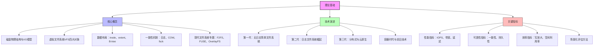
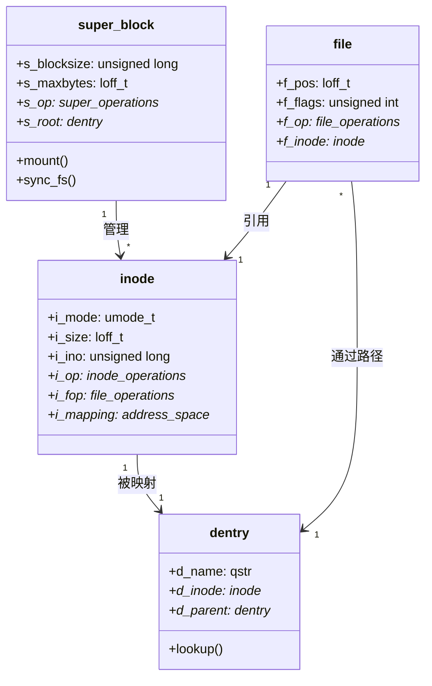
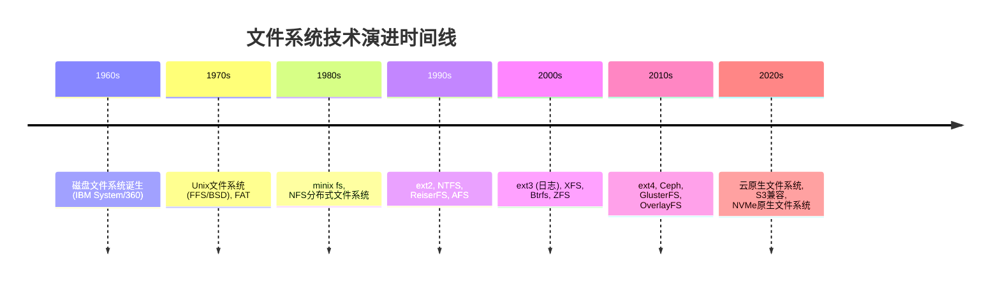
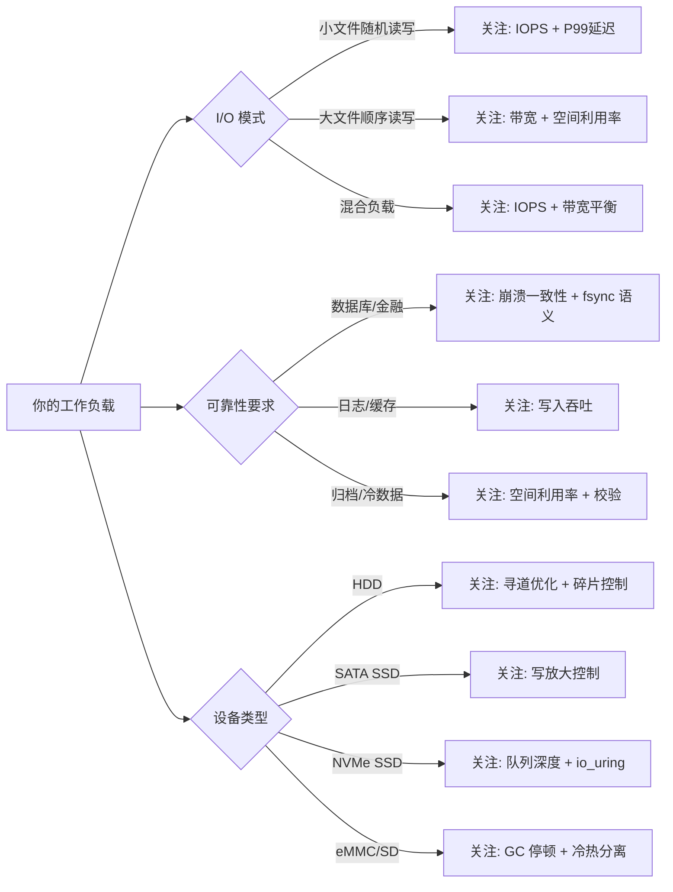
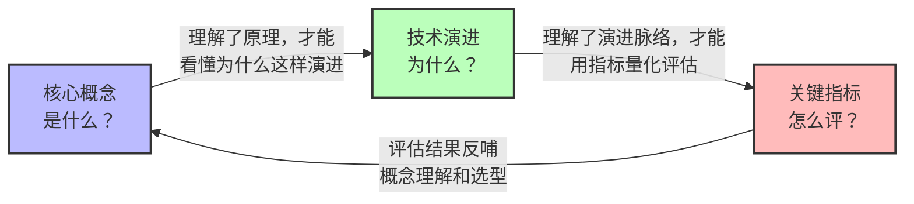

# 理论基础

文件系统是操作系统中最复杂、最精密的子系统之一。它向上为应用程序提供简洁统一的文件操作接口，向下管理着磁盘上数十亿个字节的物理存储空间。理解文件系统的理论基础，意味着理解这套"从逻辑到物理"的映射是如何完成的——这不仅是系统程序员的核心能力，也是每一位追求深度的工程师理解计算机系统的必经之路。

本章的理论基础分为三个核心主题，从数据结构到历史演进再到度量体系，构建一个**从微观到宏观、从静态到动态**的完整认知框架：

---

## 核心概念：文件系统的微观解剖

文件系统的本质是一个**分层抽象系统**。要理解它为什么这样设计，需要从最底层的物理约束开始，逐层向上剖析。

### 为什么需要从磁盘物理结构讲起

许多教程直接从 VFS 接口开始讲解，跳过了磁盘物理层。这就像讲解数据库时不提磁盘 I/O 特性一样，会让后续的许多设计决策失去根基。理解文件系统，必须先理解它的"对手"——磁盘的物理约束：

| 物理约束 | 具体表现 | 对文件系统设计的影响 |
|----------|---------|---------------------|
| 机械寻道延迟 | HDD 磁头移动 5-10ms，SSD 无此问题 | 块组/柱面组设计，将相关数据物理上邻近存放 |
| 最小读写单位 | 扇区 512B / 4KB（Advanced Format） | 块大小的选择直接影响空间利用率和 I/O 效率 |
| 顺序读远快于随机读 | HDD 顺序读 200MB/s，随机读仅 1-2MB/s | extent 分配、预读策略、日志顺序写入 |
| 写入不能覆盖已擦除区域 | SSD 必须先擦除再写入（erase-before-write） | COW 设计、日志结构文件系统、写放大优化 |
| 掉电即丢数据 | 缓存中的数据在断电后丢失 | 日志机制、写屏障（write barrier）、fsync 语义 |

这些约束不是"背景知识"，而是贯穿整个文件系统理论的**设计驱动力**。ext4 的 extent tree、XFS 的分配组、F2FS 的冷热分离——每一个设计决策都是对这些物理约束的回应。

### VFS 四大对象：面向对象思想在 C 语言中的实践

Linux 内核用纯 C 语言实现了一个优雅的面向对象架构——虚拟文件系统（VFS）。它通过四个核心数据结构定义了所有文件系统的公共接口：

| 对象 | 角色 | 类比 | 关键职责 |
|------|------|------|---------|
| **super_block** | 文件系统实例 | 工厂 | 管理全局元数据（块大小、空闲空间、挂载选项） |
| **inode** | 文件元数据 | 产品规格书 | 存储一个文件的所有属性（权限、大小、时间戳、块指针），但不包含文件名 |
| **dentry** | 路径节点 | 目录卡片 | 将文件名映射到 inode，维护目录树结构，是 dcache 的核心 |
| **file** | 打开的文件实例 | 订单 | 记录进程与文件的交互状态（打开模式、读写位置、锁信息） |

这四个对象的关系可以用一句话概括：**进程通过 fd 表找到 file，file 通过 dentry 找到 inode，inode 通过 super_block 找到文件系统**。

理解这四个对象的关键在于把握**共享与隔离**的边界：同一个 inode 可以被多个 file 引用（多进程打开同一文件），但每个 file 有独立的 f_pos（读写位置）；同一个 inode 可以对应多个 dentry（硬链接），但 dcache 保证路径查找的高效性。

### 数据布局：从间接块到 extent tree 的演进

文件系统最核心的任务是将逻辑块号（文件内的第 N 个块）映射到物理块号（磁盘上的实际位置）。这个映射机制的效率直接决定了文件系统的 I/O 性能。

**间接块方案（ext2/ext3）**：用 12 个直接指针 + 3 级间接指针覆盖最大 4TB 的文件。简单直观，但读取大文件深处的数据块可能需要 4 次磁盘 I/O（三级间接寻址），且碎片严重时性能急剧下降。

**Extent 方案（ext4）**：用连续块区间 `[起始逻辑块, 长度, 起始物理块]` 替代逐块指针。一个 extent 可以描述最多 128MB 的连续数据（128MB / 4KB = 32768 块），将大文件的元数据开销降低数个数量级。当 extent 数量超出 inode 内联空间时，ext4 构建 B-tree 索引，查找复杂度为 O(log n)。

**B-tree 方案（XFS/Btrfs）**：XFS 用 B+ 树管理所有元数据结构（inode、空闲空间、目录），Btrfs 用 COW B-tree 实现快照和端到端校验。这是更彻底的树形化方案，适合超大规模文件系统。

### 一致性机制：数据安全的三道防线

文件系统的一致性问题是操作系统领域最经典的工程挑战之一。一次简单的 `write()` 可能涉及多个磁盘写入（数据块 + inode + 目录项 + 位图），如果中途掉电，文件系统将进入不一致状态。历史上的解决方案形成了三道防线：

| 防线 | 机制 | 原理 | 恢复时间 | 性能代价 |
|------|------|------|---------|---------|
| 第一道 | **日志（Journaling）** | 先写变更日志，再写最终位置，崩溃后重放日志 | 秒级 | 写放大 1.5-3x |
| 第二道 | **COW（写时复制）** | 修改写入新位置，原子切换指针，天然原子性 | 无需恢复 | 碎片增加，需要 GC |
| 第三道 | **校验和（Checksum）** | 检测静默数据损坏（bit rot），触发修复 | 无需恢复（预防性） | 额外 CPU 和存储开销 |

ext4 依赖日志（第一道），Btrfs/ZFS 三道防线全有。选择哪种方案，本质上是在**性能、安全性和复杂度**之间做出权衡。

### 现代文件系统专题

理论基础的最后一部分聚焦于正在重塑文件系统格局的三大技术方向：

**F2FS（Flash-Friendly File System）**：专为闪存设备设计的文件系统。传统文件系统针对 HDD 的顺序读写特性优化，而 F2FS 针对 SSD/eMMC 的特性——冷热数据分离（hot/warm/colddata 分区）减少垃圾回收开销，多头写入（Multi-head logging）提升并发写入性能，日志结构设计天然适配闪存的擦写特性。

**FUSE（用户态文件系统）**：将文件系统实现从内核态移到用户态。虽然性能不及内核态文件系统，但带来了极大的开发灵活性——sshfs、ntfs-3g、macFUSE 等工具都基于 FUSE。在容器和云原生场景中，FUSE 是实现存储抽象层的关键技术。

**OverlayFS（联合文件系统）**：将多个目录层叠加为统一视图，是 Docker/OCI 容器的默认存储驱动。理解 OverlayFS 的 copy-up 机制和层叠语义，是理解容器存储隔离的基础。

---

## 技术演进：从 Unix FS 到云原生

文件系统的演进史不是一份枯燥的编年表，而是一部**问题驱动的工程进化史**。每一代文件系统解决的，都是上一代留下的技术债务。

### 演进脉络的核心逻辑

理解技术演进的关键是把握**每一代解决了什么问题、又留下了什么新问题**：

**第一代（1960s-1980s）：无日志的简单文件系统**
- 代表：Unix FS、FFS、FAT
- 解决的问题：将磁盘抽象为文件和目录
- 留下的问题：崩溃后文件系统不一致，需要全盘 fsck（TB 级磁盘恢复需数小时）
- 核心洞察：FFS 证明了"物理布局决定性能"——将相关数据在磁盘上邻近存放，是所有后续优化的起点

**第二代（1990s-2000s）：日志文件系统的崛起**
- 代表：ext3/ext4、XFS、JFS、ReiserFS
- 解决的问题：崩溃一致性——通过 WAL（Write-Ahead Logging）实现秒级恢复
- 留下的问题：日志写放大、大元数据管理瓶颈、缺乏数据完整性校验
- 核心创新：ext4 的 extent tree + delayed allocation 彻底解决了 ext2 的碎片问题；XFS 的 allocation group 实现了元数据操作的并行化

**第三代（2000s-2010s）：分布式文件系统**
- 代表：NFS、GFS、HDFS、Ceph、GlusterFS
- 解决的问题：单机存储的容量和性能瓶颈
- 留下的问题：分布式一致性、元数据服务器瓶颈、运维复杂度
- 核心范式转移：GFS 证明了"商用硬件 + 智能软件"可以替代昂贵的专用存储设备，开启了软件定义存储时代

**第四代（2010s-至今）：容器时代与云原生**
- 代表：OverlayFS、Btrfs、ZFS、F2FS、JuiceFS
- 解决的问题：容器隔离、闪存优化、数据完整性
- 新兴方向：io_uring 革新存储栈、持久内存（PMem/DAX）绕过内核 I/O 路径、分布式元数据的去中心化

### 技术选型的底层逻辑

理解演进脉络的最终目的是指导技术选型。本节通过场景驱动的决策框架，帮助读者在具体项目中做出合理选择：

| 场景特征 | 推荐文件系统 | 理由 |
|----------|------------|------|
| 通用服务器，稳定优先 | ext4 | 默认选择，社区支持最广泛，ordered 日志平衡安全与性能 |
| 大文件高吞吐（数据库、视频） | XFS | 分配组并行化，延迟日志优化，大文件 B+ 树索引 |
| 需要快照/压缩/校验 | Btrfs 或 ZFS | COW 天然快照，端到端校验和 |
| SSD/eMMC 闪存设备 | F2FS | 冷热分离减少 GC，日志结构适配闪存特性 |
| 容器存储 | OverlayFS | Docker/OCI 默认驱动，层叠语义天然匹配镜像模型 |
| HPC 超算场景 | Lustre | TB/s 级聚合带宽，多 OST 并行读写 |

---

## 关键指标：量化评估文件系统性能

"没有度量就没有优化"——评估文件系统性能不能凭感觉，必须基于可量化的指标体系。本节将文件系统的关键指标分为四个维度：

### 性能指标

| 指标 | 含义 | 度量方法 | 典型工具 |
|------|------|---------|---------|
| **IOPS** | 每秒 I/O 操作数 | `fio --rw=randread --bs=4k` | fio, iozone |
| **顺序带宽** | 每秒数据传输量 | `dd if=/dev/zero of=test bs=1M count=1024` | dd, fio, bonnie++ |
| **随机读延迟** | 单次随机读的响应时间 | `fio --rw=randread --bs=4k --lat_percentiles` | fio (P50/P99/P999) |
| **元数据性能** | 文件创建/删除/查找速度 | `fio --rw=creat --fsync_on_close=1` | filebench, mdtest |

### 可靠性指标

| 指标 | 含义 | 评估方法 |
|------|------|---------|
| **崩溃一致性** | 掉电后文件系统恢复到一致状态的能力 | 崩溃注入测试（crashmonkey, pjd-fstest） |
| **数据完整性** | 静默数据损坏（bit rot）的检测与修复能力 | 校验和覆盖范围（元数据/数据/全量） |
| **最大文件系统大小** | 单个文件系统能管理的最大容量 | 超大存储场景的硬性约束 |
| **最大文件大小** | 单个文件的最大尺寸 | 大文件场景（视频、数据库文件）的硬性约束 |

### 效率指标

| 指标 | 含义 | 影响因素 |
|------|------|---------|
| **写放大因子（WAF）** | 实际物理写入量 / 逻辑写入量 | 日志模式、COW 碎片、SSD FTL |
| **空间利用率** | 有效数据 / 总分配空间 | 块大小、inode 开销、元数据占比 |
| **碎片度** | 文件数据块的离散程度 | 分配策略（extent vs 间接块）、delayed allocation |

### 场景化评估方法论

脱离工作负载谈性能毫无意义。不同场景关注的指标优先级完全不同：

例如，一个 MySQL 数据库服务器关注的指标优先级是：**崩溃一致性 > 随机写 IOPS > P99 延迟 > 顺序读带宽**，而一个视频转码服务器则是：**顺序读写带宽 > 空间利用率 > IOPS**。

---

## 三部分的关联关系

理论基础的三个部分不是孤立的知识模块，而是层层递进的认知路径：

- **核心概念**是基础：不理解 inode 和 extent，就无法理解为什么 ext4 比 ext2 在大文件场景下快一个数量级
- **技术演进**是脉络：不理解从无日志到日志、从单机到分布式的演进逻辑，就无法在技术选型时做出有依据的判断
- **关键指标**是工具：不掌握量化评估方法，就无法验证优化效果，也无法在不同文件系统之间做出客观比较

---

## 阅读建议

**初学者路径**：核心概念 → 技术演进 → 关键指标。先建立文件系统的微观认知（"一个文件在磁盘上长什么样"），再看历史演进（"为什么变成了现在这样"），最后学会评估（"怎么判断哪个更好"）。

**有经验的读者**：可以直接跳到感兴趣的部分。核心概念中的 VFS 四大对象和一致性机制是面试高频考点；技术演进中的决策框架可以直接用于项目选型；关键指标中的场景化评估方法论可以帮助建立系统化的性能分析思路。

**前置知识**：操作系统基础（进程、虚拟内存、中断机制）、C 语言基础（理解内核数据结构）、块设备基本概念（扇区、块、磁道、寻道时间）。

---

## 与后续章节的衔接

理论基础为后续章节提供了必要的知识铺垫：

| 后续章节 | 依赖的理论基础 |
|---------|--------------|
| 核心技巧（调优参数、IO 调度器） | VFS 读写路径、关键指标体系 |
| 实战案例（高并发文件服务） | inode 与数据块管理、一致性机制 |
| 常见误区（fsync 语义、延迟分配） | 日志模式对比、write barrier 原理 |
| 练习方法（FUSE、debugfs） | VFS 接口设计、磁盘布局结构 |

掌握理论基础后，后续章节的实操内容将不再是"知其然"，而是"知其所以然"——每一次调优操作背后都有明确的原理支撑。
