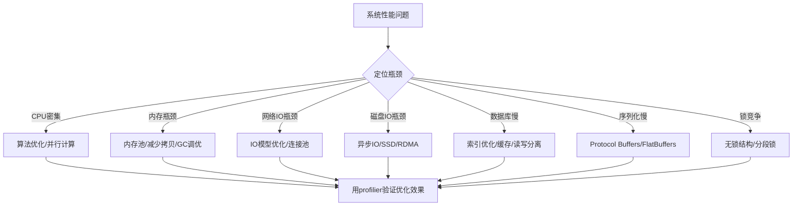

## 常见误区

在学习和实践IO模型的过程中，开发者常常因为经验不足、概念混淆或过度工程化而踩坑。本节系统梳理IO模型领域最常见的认知陷阱和设计错误，每个误区都配有**错误代码 → 正确代码**的对比、真实生产事故案例，以及可直接落地的纠正方案。

---

### 误区一：认为"阻塞IO一定比非阻塞IO慢"

**错误认知**：许多开发者一看到"阻塞"就联想到"低效"，认为在所有场景下非阻塞IO都优于阻塞IO，甚至在简单场景中也要强行使用非阻塞IO + 事件循环。

**为什么这是错的**：

阻塞IO和非阻塞IO的性能差异取决于**并发量级**和**单次操作耗时**：

| 场景 | 阻塞IO | 非阻塞IO |
|------|--------|----------|
| 单连接、长耗时操作（如大文件读写） | ✅ 简单可靠，无额外开销 | ❌ 需要轮询或结合epoll，徒增复杂度 |
| 数千并发连接、短操作（如Web请求） | ❌ 需要1:1线程模型，线程切换开销巨大 | ✅ 单线程即可处理大量连接 |
| 数百并发连接、中等耗时操作 | ⚠️ 取决于线程池大小和调度策略 | ⚠️ 取决于事件循环实现质量 |

**真实案例**：

某团队将一个内部RPC服务从阻塞IO（Java BIO + 线程池）迁移到非阻塞IO（Netty NIO），并发从200提升到2000。但当他们把这个"优化"应用到另一个**只有5个并发连接的配置同步服务**时，性能反而下降了40%——因为非阻塞模式下的状态机管理、缓冲区拷贝、事件回调等开销远超简单的线程阻塞等待。

```c
// 场景：读取一个10GB的日志文件，单线程处理
// ❌ 错误：使用非阻塞IO + 轮询，徒增复杂度
int fd = open("huge_log.txt", O_RDONLY | O_NONBLOCK);
char buf[4096];
while (1) {
    ssize_t n = read(fd, buf, sizeof(buf));
    if (n > 0) {
        process(buf, n);
    } else if (n == 0) {
        break;  // EOF
    } else {
        if (errno == EAGAIN || errno == EWOULDBLOCK) {
            // 没有数据可读，非阻塞IO返回EAGAIN
            // 这里做什么？干等着？还是要结合epoll？
            // 单文件场景下完全多此一举
            usleep(1000);  // 轮询等待，浪费CPU
        }
    }
}

// ✅ 正确：单文件大文件读取，直接用阻塞IO
int fd = open("huge_log.txt", O_RDONLY);
char buf[4096];
ssize_t n;
while ((n = read(fd, buf, sizeof(buf))) > 0) {
    process(buf, n);
}
close(fd);
```

**纠正原则**：

- **阻塞IO + 线程池**是简单场景的合理选择，不要为了"技术先进性"而引入不必要的复杂度
- **非阻塞IO的价值在于高并发**：当你需要在单个线程中管理数千个连接时，它才是最优解
- 选择IO模型的核心依据是**并发量级 × 单次操作耗时**，而非"哪个更新/更高级"

---

### 误区二：epoll写完就万事大吉——忽略ET模式的致命陷阱

**错误认知**：许多开发者从select/poll迁移到epoll后，认为性能提升是理所当然的，却不知道**ET（边缘触发）模式下的不当使用会导致数据丢失**。

**为什么这是错的**：

epoll有两种触发模式：

- **LT（水平触发）**：只要文件描述符上有数据可读/可写，每次epoll_wait都会通知。这是默认模式，相对安全。
- **ET（边缘触发）**：只在文件描述符状态**发生变化**时通知一次。如果你没有一次性读完所有数据，**后续不再通知**，直到新的数据到达。

ET模式性能更高（减少系统调用次数），但要求开发者**必须在每次通知时读完所有数据**（循环读取直到EAGAIN）。忽略这个要求会导致数据静默丢失，且极难调试。

```c
// ❌ 错误：ET模式下只读一次
// epoll_wait返回EPOLLIN后只调用一次read
void handle_event(int epollfd, int fd) {
    char buf[1024];
    ssize_t n = read(fd, buf, sizeof(buf));  // 只读了1024字节
    if (n > 0) {
        process(buf, n);
    }
    // 如果内核缓冲区有4096字节数据，只读了1024
    // 剩余的3072字节永远不会被通知！
    // 只有当新的数据到达时才会再次触发EPOLLIN
}

// ✅ 正确：ET模式下必须循环读取直到EAGAIN
void handle_event(int epollfd, int fd) {
    char buf[1024];
    while (1) {
        ssize_t n = read(fd, buf, sizeof(buf));
        if (n > 0) {
            process(buf, n);
        } else if (n == 0) {
            // 对端关闭连接
            close(fd);
            epoll_ctl(epollfd, EPOLL_CTL_DEL, fd, NULL);
            break;
        } else {
            if (errno == EAGAIN || errno == EWOULDBLOCK) {
                // 已经读完所有数据，退出循环
                break;
            }
            // 其他错误
            perror("read");
            close(fd);
            epoll_ctl(epollfd, EPOLL_CTL_DEL, fd, NULL);
            break;
        }
    }
}
```

**真实案例**：

某即时通讯系统使用epoll ET模式处理WebSocket连接。开发团队在读取事件处理中只调用了一次`recv`。在高并发时段（约5000条消息/秒），部分用户出现消息丢失——消息已发送但接收端从未收到。排查发现，当单个TCP缓冲区中积压了多条WebSocket帧时，只读取了第一条帧，剩余帧被静默丢弃。这个问题在开发和测试环境几乎无法复现（因为消息量低，缓冲区很少积压），只在生产环境高并发下出现。

**ET模式安全编程模板**：

```c
// 通用的ET模式读取函数
int read_until_eagain(int fd, buffer_t *buf) {
    ssize_t total = 0;
    while (1) {
        ssize_t n = read(fd, buf->data + total, buf->capacity - total);
        if (n > 0) {
            total += n;
            if (total == buf->capacity) {
                // 缓冲区满了，可能还有更多数据
                // 需要扩容或分批处理
                return buffer_grow(buf);
            }
        } else if (n == 0) {
            return total > 0 ? total : CLOSED;
        } else {
            if (errno == EAGAIN || errno == EWOULDBLOCK) {
                return total;  // 正常：数据已读完
            }
            if (errno == EINTR) {
                continue;  // 被信号中断，重试
            }
            return ERROR;
        }
    }
}
```

**纠正原则**：

- 使用ET模式时，**永远循环读取/写入直到返回EAGAIN**
- 对写入事件同样适用：要循环写入直到`write`返回EAGAIN或全部写完
- 如果不确定能否保证"读完所有数据"，**优先使用LT模式**——它的性能在绝大多数场景下足够好
- ET模式对UDP同样重要：每次`recvfrom`必须循环直到EAGAIN，否则会丢失后续数据报

---

### 误区三：select/poll已过时，应该全面替换为epoll

**错误认知**：很多开发者认为select和poll已经完全被淘汰，在所有场景下都应该直接使用epoll。

**为什么这是错的**：

select/poll在以下场景中仍然是合理选择：

| 维度 | select | poll | epoll |
|------|--------|------|-------|
| 可移植性 | ✅ 所有POSIX系统 | ✅ 大多数POSIX系统 | ❌ 仅Linux（macOS有kqueue） |
| fd数量上限 | ❌ 默认1024（FD_SETSIZE） | ✅ 无硬限制 | ✅ 无硬限制 |
| 大量fd时性能 | ❌ O(n)线性扫描 | ❌ O(n)线性扫描 | ✅ O(1)事件通知 |
| 少量fd时性能 | ✅ 内核实现简单，开销低 | ✅ 同左 | ⚠️ 有红黑树维护开销 |
| 跨平台网络库 | ✅ 必须支持 | ✅ 必须支持 | ❌ 不可用 |

**关键洞察**：像libevent、libuv、Go的netpoller等跨平台库，在底层对所有IO多路复用机制做了抽象。如果你在写跨平台库，select/poll是**必须保留**的后端。即使只在Linux上运行，如果你的fd数量稳定在几十个以内，select的性能完全够用，且代码可读性更好。

```c
// 场景：跨平台UDP服务器，同时监听3个socket
// 在Linux上用epoll没问题，但macOS/FreeBSD需要kqueue
// Windows需要IOCP

// ✅ 正确做法：使用select作为跨平台兼容层
// （fd数量少，性能无差异）
fd_set readfds;
struct timeval tv;

while (1) {
    FD_ZERO(&amp;readfds);
    FD_SET(sock1, &amp;readfds);
    FD_SET(sock2, &amp;readfds);
    FD_SET(sock3, &amp;readfds);
    
    tv.tv_sec = 1;
    tv.tv_usec = 0;
    
    int maxfd = MAX(sock1, MAX(sock2, sock3)) + 1;
    int nready = select(maxfd, &amp;readfds, NULL, NULL, &amp;tv);
    
    if (nready > 0) {
        if (FD_ISSET(sock1, &amp;readfds)) handle_udp(sock1);
        if (FD_ISSET(sock2, &amp;readfds)) handle_udp(sock2);
        if (FD_ISSET(sock3, &amp;readfds)) handle_udp(sock3);
    }
}
```

**各平台IO多路复用机制速查**：

| 操作系统 | 首选机制 | 兼容机制 |
|---------|---------|---------|
| Linux | epoll | select, poll |
| macOS / FreeBSD | kqueue | select, poll |
| Windows | IOCP | select（Winsock） |
| Solaris | /dev/poll | select, poll |
| 跨平台库 | 底层统一抽象（如libuv） | — |

**纠正原则**：

- **不要教条式地淘汰select/poll**——它们在少量fd、跨平台、兼容性要求高的场景中仍有价值
- **高并发Linux服务器**毫无疑问应使用epoll（或io_uring）
- 如果你不需要跨平台，且明确运行在Linux上，直接用epoll即可
- 使用成熟的网络库（如libevent、libuv、asio）可以自动选择最优后端

---

### 误区四：混淆IO多路复用与异步IO

**错误认知**：许多开发者将epoll/kqueue等IO多路复用机制等同于"异步IO"，认为使用了epoll就是在做异步IO。

**为什么这是错的**：

这是一个**本质性的概念错误**。IO多路复用和异步IO是两种完全不同的编程范式：

同步IO（包括IO多路复用）：
  应用程序 ──通知内核──▶ 内核准备数据
  应用程序 ◀──数据就绪── 内核
  应用程序 ──发起read──▶ 内核（此时数据已在缓冲区，直接拷贝到用户空间）
  应用程序 ◀──数据返回── 内核
  （整个过程中，read系统调用仍然是应用主动发起的）

异步IO（AIO）：
  应用程序 ──提交请求──▶ 内核（指定回调或完成通知方式）
  应用程序 ◀──可以做其他事── 内核（后台完成数据拷贝）
  内核完成数据拷贝后 ──通知──▶ 应用程序（信号/回调/完成事件）
  （整个read过程由内核独立完成，应用无需等待）

| 维度 | IO多路复用（epoll） | 异步IO（io_uring） |
|------|---------------------|-------------------|
| 应用是否主动read | ✅ 是（read仍然是同步调用） | ❌ 否（内核完成所有操作） |
| 数据拷贝发生在 | 系统调用期间（应用被阻塞） | 内核后台（应用可并行工作） |
| 编程模型 | 事件循环 + 回调/状态机 | 提交队列 + 完成队列 |
| 理论性能上限 | 受限于read/write系统调用开销 | 更高（批量提交，减少上下文切换） |

**真实案例对比**：

```c
// ===== 使用epoll的IO多路复用（同步IO）=====
// epoll通知"fd可读"后，应用仍需自己调用read
struct epoll_event events[MAX_EVENTS];
int nfds = epoll_wait(epfd, events, MAX_EVENTS, -1);

for (int i = 0; i < nfds; i++) {
    int fd = events[i].data.fd;
    if (events[i].events &amp; EPOLLIN) {
        // epoll只是通知"可以读了"
        // read系统调用仍然是同步的：应用在这里等待数据拷贝
        char buf[4096];
        ssize_t n = read(fd, buf, sizeof(buf));  // 同步！应用被阻塞在这
        process(buf, n);
    }
}

// ===== 使用io_uring的异步IO =====
// 提交read请求后，应用可以继续处理其他事情
struct io_uring_sqe *sqe = io_uring_get_sqe(&amp;ring);
io_uring_prep_read(sqe, fd, buf, 4096, 0);
sqe->user_data = (uint64_t)context;
io_uring_submit(&amp;ring);  // 提交后立即返回，无需等待

// 可以在循环中继续提交更多请求
// 然后统一收割完成事件
struct io_uring_cqe *cqe;
io_uring_wait_cqe(&amp;ring, &amp;cqe);  // 此时read可能已经完成了
process_result(cqe);
io_uring_cqe_seen(&amp;ring, cqe);
```

**纠正原则**：

- **epoll是IO多路复用（同步IO），不是异步IO**——这是一个需要严格区分的概念
- 真正的异步IO在Linux上有三条路径：POSIX AIO（已废弃）、Linux native AIO（io_submit）、**io_uring**（推荐）
- 在大多数Web服务器场景中，epoll的IO多路复用已经足够高效，不必追求真正的异步IO
- io_uring代表了Linux异步IO的未来方向，但学习曲线较陡，建议逐步引入

---

### 误区五：认为io_uring可以无脑替代epoll

**错误认知**：io_uring是Linux最新、最强的IO接口，应该在所有场景中替代epoll。

**为什么这是错的**：

io_uring确实代表了Linux IO的未来方向，但在当前阶段，它并不适合所有场景：

| 维度 | epoll | io_uring |
|------|-------|----------|
| 内核版本要求 | Linux 2.6+（极广泛） | Linux 5.1+，最佳体验需5.19+/6.0+ |
| 生产可用性 | ✅ 久经考验 | ⚠️ 仍在快速迭代，API可能变化 |
| 学习成本 | 中等 | 高（SQ/CQ环、注册缓冲区、轮询模式等概念） |
| 适用场景 | 网络IO为主 | 磁盘IO + 网络IO + 文件系统操作 |
| 典型框架支持 | Nginx、Redis、MySQL | 部分（Nginx实验性支持，SearXNG等） |

**io_uring的核心优势在磁盘IO**：epoll只能监控文件描述符的就绪状态，无法直接发起异步磁盘读写。io_uring可以将磁盘IO也纳入异步框架，这对于数据库引擎、日志系统、存储引擎等场景有革命性意义。

但对于纯粹的网络IO服务器（如Nginx、Redis），epoll已经足够高效，io_uring带来的提升并不显著（通常<10%），而引入的复杂度和兼容性风险却很高。

```c
// io_uring的学习曲线示例：初始化一个io_uring实例
// 仅设置阶段就需要约30行代码，而epoll只需epoll_create1(0)一行

#include <liburing.h>

struct io_uring ring;

// io_uring初始化
int init_io_uring(struct io_uring *ring) {
    struct io_uring_params params = {0};
    
    // 可选：启用IOPOLL模式（内核态轮询，适用于块设备）
    // params.flags = IORING_SETUP_IOPOLL;
    
    // 可选：启用SQPOLL模式（内核线程轮询SQ，无需submit系统调用）
    // params.flags |= IORING_SETUP_SQPOLL;
    // params.sq_thread_idle = 2000;  // 2秒空闲后休眠
    
    int ret = io_uring_queue_init_params(256, ring, &amp;params);
    if (ret < 0) {
        fprintf(stderr, "io_uring_queue_init failed: %s\n", strerror(-ret));
        return ret;
    }
    
    // 可选：预注册文件描述符（减少每次操作的内核开销）
    // int fds[] = {fd1, fd2, fd3};
    // io_uring_register_files(ring, fds, 3);
    
    return 0;
}

// 对比：epoll初始化只需要一行
int epfd = epoll_create1(0);
```

**真实案例**：

某团队将他们的Go HTTP代理服务从epoll（通过netpoller）迁移到io_uring，期望获得50%的性能提升。结果：

1. Go的io_uring库生态不成熟，遇到了多个bug
2. 内核版本要求导致无法在CentOS 7上部署
3. 最终性能提升仅约8%
4. 回滚花了一周时间

**纠正原则**：

- **网络IO密集型服务**（Web服务器、API网关）：epoll仍然是最稳妥的选择
- **磁盘IO密集型应用**（数据库、文件系统、日志处理）：io_uring有显著优势，值得投入
- **新项目评估io_uring前**：确认内核版本 ≥ 5.19，评估团队学习成本，做好回滚方案
- 保持关注io_uring生态发展，等框架和语言绑定成熟后再大规模采用

---

### 误区六：忽略TCP_NODELAY和SO_REUSEADDR

**错误认知**：开发者专注于IO模型的选择，却忽略了套接字层面的关键选项配置，导致性能问题或端口复用失败。

**为什么这是错的**：

IO模型的选择只解决了"如何高效地管理多个文件描述符"，但单个TCP连接的性能还受套接字选项的直接影响：

**Nagle算法的隐患**：

TCP默认启用Nagle算法——它会把小的数据包合并发送以提高带宽利用率。但对于交互式应用（如数据库协议、游戏服务器、SSH），这会导致延迟翻倍（最多增加200ms的等待时间）。

```c
// ❌ 错误：不设置TCP_NODELAY
int sockfd = socket(AF_INET, SOCK_STREAM, 0);
// 使用默认配置：Nagle算法开启
connect(sockfd, ...);
send(sockfd, "query1", 6, 0);   // 立即发送
send(sockfd, "query2", 6, 0);   // query1还没收到ACK，Nagle会等200ms合并发送！

// ✅ 正确：交互式应用关闭Nagle算法
int sockfd = socket(AF_INET, SOCK_STREAM, 0);
int flag = 1;
setsockopt(sockfd, IPPROTO_TCP, TCP_NODELAY, &amp;flag, sizeof(flag));
connect(sockfd, ...);
send(sockfd, "query1", 6, 0);   // 立即发送
send(sockfd, "query2", 6, 0);   // 立即发送，无需等待ACK
```

**SO_REUSEADDR的必要性**：

服务器重启时，如果上一次的TCP连接还处于TIME_WAIT状态（默认持续60秒），绑定同一端口会失败："Address already in use"。SO_REUSEADDR允许重用处于TIME_WAIT状态的地址。

```c
// ❌ 错误：不设置SO_REUSEADDR
int sockfd = socket(AF_INET, SOCK_STREAM, 0);
// 重启服务器时绑定端口可能失败
bind(sockfd, (struct sockaddr*)&amp;addr, sizeof(addr));  // EADDRINUSE!

// ✅ 正确：服务器套接字始终设置SO_REUSEADDR
int sockfd = socket(AF_INET, SOCK_STREAM, 0);
int opt = 1;
setsockopt(sockfd, SOL_SOCKET, SO_REUSEADDR, &amp;opt, sizeof(opt));
bind(sockfd, (struct sockaddr*)&amp;addr, sizeof(addr));  // 成功
listen(sockfd, 128);
```

**常用套接字选项速查**：

| 选项 | 作用 | 适用场景 | 默认值 |
|------|------|---------|--------|
| `TCP_NODELAY` | 禁用Nagle算法，小包立即发送 | 数据库、游戏、SSH | 关闭（启用Nagle） |
| `SO_REUSEADDR` | 允许绑定TIME_WAIT状态的地址 | 所有服务器 | 关闭 |
| `SO_REUSEPORT` | 多进程/线程监听同一端口（内核负载均衡） | 多Worker服务器 | 关闭 |
| `SO_SNDBUF/SO_RCVBUF` | 调整发送/接收缓冲区大小 | 高吞吐场景 | 系统默认（通常128KB-256KB） |
| `SO_KEEPALIVE` | 启用TCP保活探测 | 长连接服务 | 关闭（7200秒） |
| `IPPROTO_TCP/TCP_KEEPIDLE` | 空闲多久后开始保活探测 | 自定义保活策略 | 7200秒 |

```c
// 完整的服务器套接字配置模板
int create_server_socket(uint16_t port) {
    int sockfd = socket(AF_INET, SOCK_STREAM, 0);
    if (sockfd < 0) return -1;
    
    int opt = 1;
    setsockopt(sockfd, SOL_SOCKET, SO_REUSEADDR, &amp;opt, sizeof(opt));
    setsockopt(sockfd, SOL_SOCKET, SO_REUSEPORT, &amp;opt, sizeof(opt));
    
    // 高吞吐场景：增大缓冲区
    int buf_size = 4 * 1024 * 1024;  // 4MB
    setsockopt(sockfd, SOL_SOCKET, SO_SNDBUF, &amp;buf_size, sizeof(buf_size));
    setsockopt(sockfd, SOL_SOCKET, SO_RCVBUF, &amp;buf_size, sizeof(buf_size));
    
    struct sockaddr_in addr = {
        .sin_family = AF_INET,
        .sin_port = htons(port),
        .sin_addr.s_addr = INADDR_ANY,
    };
    
    if (bind(sockfd, (struct sockaddr*)&amp;addr, sizeof(addr)) < 0) {
        close(sockfd);
        return -1;
    }
    
    listen(sockfd, SOMAXCONN);
    return sockfd;
}
```

**纠正原则**：

- 所有TCP服务器套接字**必须设置SO_REUSEADDR**
- 交互式/低延迟应用**必须设置TCP_NODELAY**
- 高吞吐场景考虑调整`SO_SNDBUF/SO_RCVBUF`（但不要超过系统自动调优的范围）
- 使用SO_REUSEPORT时注意：它需要内核支持（Linux 3.9+），且仅在多进程模型中有意义

---

### 误区七：过度优化——在瓶颈未定位前就上io_uring和epoll

**错误认知**：当系统出现性能问题时，第一反应就是"换更快的IO模型"——从阻塞IO迁移到epoll，或者直接上io_uring。

**为什么这是错的**：这是一个典型的**未定位瓶颈就优化**的反模式。IO模型只是系统性能的一个维度，生产系统的瓶颈可能出现在任何环节：



**真实案例**：

某电商系统的商品详情页接口响应时间从50ms恶化到500ms。CTO要求"全面升级IO模型，用epoll重写"。开发团队花了3周将Tomcat从NIO迁移到Netty（epoll后端），性能几乎没有改善。

最终用`async-profiler`分析发现：**瓶颈根本不在IO层，而在一个N+1查询**——商品详情接口在循环中逐个查询SKU信息，每个SKU触发一次数据库查询。改用批量查询后，响应时间直接从500ms降到20ms，比迁移IO模型的效果好25倍。

```java
// ❌ 错误：未定位瓶颈，盲目迁移IO模型
// 开发者花了3周时间从BIO迁移到NIO，但问题不在IO层

// ✅ 正确：先用profiler定位瓶颈
// 使用async-profiler
// ./profiler.sh -d 30 -f profile.html <pid>

// 定位到瓶颈：N+1查询
// ❌ 原始代码
public ProductDetail getProductDetail(long productId) {
    Product product = productDao.getById(productId);
    List<Sku> skus = skuDao.listByProductId(productId);  // 第1次查询
    List<Review> reviews = new ArrayList<>();
    for (Sku sku : skus) {
        reviews.addAll(reviewDao.listBySkuId(sku.getId()));  // N次查询！
    }
    return new ProductDetail(product, skus, reviews);
}

// ✅ 修复：批量查询替代循环查询
public ProductDetail getProductDetail(long productId) {
    Product product = productDao.getById(productId);
    List<Sku> skus = skuDao.listByProductId(productId);
    List<Long> skuIds = skus.stream().map(Sku::getId).collect(toList());
    List<Review> reviews = reviewDao.listBySkuIds(skuIds);  // 1次批量查询
    return new ProductDetail(product, skus, reviews);
}
```

**性能优化的正确流程**：

1. 建立基准 → 压测获取当前QPS、延迟P99、吞吐量
2. 定位瓶颈 → profiler + 监控数据（不是猜测）
3. 验证假设 → 用最小改动验证"修复瓶颈X是否能提升整体性能"
4. 实施优化 → 只改必要的部分
5. 回归测试 → 确保优化没有引入新问题
6. 持续监控 → 确认优化效果在生产环境稳定

**纠正原则**：

- **"过早优化是万恶之源"**——先用profiler和监控工具定位瓶颈
- IO模型迁移是**架构级变更**，风险高、成本大，不要作为"第一选择"
- 用数据驱动优化决策：修改前后的QPS、延迟P99、吞吐量对比
- 80%的性能问题不在IO层——常见瓶颈是算法、数据库查询、锁竞争、GC等

---

### 误区八：单Reactor单线程模型可以无限扩展

**错误认知**：Redis、Nginx等使用单Reactor模型的系统如此成功，因此单Reactor模型适用于所有场景。

**为什么这是错的**：

单Reactor单线程模型的优势在于**无锁设计和简单性**，但它有一个致命限制：**单个Reactor线程的所有操作（连接接受、读取、解析、计算、写入）都在同一个线程中串行执行**。一旦任何一个环节出现耗时操作，整个Reactor就被阻塞。

| 模型 | 优势 | 适用场景 | 典型应用 |
|------|------|---------|---------|
| 单Reactor单线程 | 简单、无锁、低延迟 | CPU轻量 + 内存操作 | Redis（内存数据库） |
| 单Reactor + 工作者线程池 | 计算密集操作可分发到线程池 | 混合型负载 | Memcached |
| 主从Reactor | 高并发 + 可扩展 | 网络密集 + 计算密集 | Nginx、Netty |
| 多Reactor多线程 | 最大并行度 | 超高并发 | Netty默认模式 |

```c
// Redis的单线程模型为什么可行？
// 因为Redis的核心操作是纯内存操作，单次操作在微秒级
// 一个事件循环可以处理每秒数十万次操作
//
// 但如果你在事件循环中加入以下任何操作，整个系统就会卡住：
// - 磁盘写入（fsync: 几毫秒到几十毫秒）
// - 复杂计算（JSON序列化大对象: 几毫秒）
// - 第三方HTTP调用（网络延迟: 几十到几百毫秒）
// - 同步数据库查询（几毫秒到几百毫秒）

// ❌ 错误：在单Reactor中做耗时操作
void on_request(connection_t *conn) {
    // 这个操作可能耗时几毫秒到几百毫秒
    // 在此期间，所有其他连接的事件处理都被阻塞
    char *result = call_third_party_api(conn->request);
    
    // 这个操作可能触发磁盘IO
    append_to_log_file(conn->request);
    
    send_response(conn, result);
}

// ✅ 正确：耗时操作分发到工作线程池
void on_request(connection_t *conn) {
    // 快速操作留在Reactor线程
    parse_request(conn);
    
    // 耗时操作分发到线程池
    thread_pool_submit(worker_pool, async_process, conn);
    
    // Reactor线程立即返回，继续处理其他事件
}

void async_process(void *arg) {
    connection_t *conn = (connection_t*)arg;
    
    // 在工作线程中执行耗时操作
    char *result = call_third_party_api(conn->request);
    append_to_log_file(conn->request);
    
    // 通过管道/eventfd通知Reactor线程发送响应
    notify_reactor(conn, result);
}
```

**Redis的教训**：Redis 6.0引入了**多线程IO**（io-threads），允许在多个线程中并行处理网络读写。这正是因为单线程在高并发网络IO场景下已经成为了瓶颈。Redis的作者Salvatore Sanfilippo在设计文档中明确指出：多线程IO的引入不是因为Redis的核心逻辑需要并行，而是因为**网络读写本身成为了热点**。

**纠正原则**：

- 单Reactor单线程适用于**纯内存操作 + 低CPU消耗**的场景
- 如果业务包含任何耗时操作（磁盘IO、外部API调用、复杂计算），**必须引入工作线程池**
- 高并发场景（>10万连接）建议使用**主从Reactor**模型
- 不要因为Redis成功就照搬其架构——你的业务场景很可能与Redis不同

---

### 误区九：忽略文件描述符泄露和系统限制

**错误认知**：文件描述符是无限的资源，创建了就创建了，不需要特别管理。

**为什么这是错的**：

Linux系统中每个进程的文件描述符有硬限制（通常1024或65535），每个TCP连接消耗一个fd，每个打开的文件也消耗一个fd。fd泄露会导致：

1. **进程无法创建新连接**：达到`RLIMIT_NOFILE`限制后，`socket()`/`accept()`返回`EMFILE`
2. **系统级fd耗尽**：所有进程共享`/proc/sys/fs/file-nr`中的全局限制
3. **连接泄露**：客户端看到服务端不响应，但服务端不知道有"僵尸连接"

```c
// ❌ 错误：fd泄露的典型模式
int handle_connection(int client_fd) {
    int file_fd = open("config.json", O_RDONLY);
    // ...处理逻辑...
    
    // 忘记关闭 file_fd！
    // 如果这个函数被调用1024次（默认限制），进程将无法接受新连接
    
    close(client_fd);  // 只关闭了client_fd，泄露了file_fd
    return 0;
}

// ✅ 正确：使用RAII或defer模式确保fd不泄露
// C语言中使用goto统一清理
int handle_connection(int client_fd) {
    int result = -1;
    int file_fd = -1;
    
    file_fd = open("config.json", O_RDONLY);
    if (file_fd < 0) goto cleanup;
    
    // ...处理逻辑...
    result = 0;
    
cleanup:
    if (file_fd >= 0) close(file_fd);
    close(client_fd);
    return result;
}

// 现代C语言可以使用__attribute__((cleanup))自动关闭
void auto_close(int *fd) { if (*fd >= 0) close(*fd); }

int handle_connection(int client_fd) {
    __attribute__((cleanup(auto_close)))
    int file_fd = open("config.json", O_RDONLY);
    
    __attribute__((cleanup(auto_close)))
    int temp_fd = open("temp.dat", O_RDWR | O_CREAT);
    
    // 函数返回时，file_fd和temp_fd自动关闭
    // 无需手动cleanup
    return 0;
}
```

**系统级监控**：

```bash
# 查看系统级fd使用情况
cat /proc/sys/fs/file-nr
# 输出示例：  12345    0    655350
#              已用  未使用  最大限制

# 查看进程级fd使用情况
ls -la /proc/<pid>/fd | wc -l

# 查看进程级fd限制
cat /proc/<pid>/limits | grep "open files"
# 输出示例：Max open files  65535  65535  files

# 实时监控fd使用
watch -n 1 'ls -la /proc/<pid>/fd 2>/dev/null | wc -l'
```

**纠正原则**：

- **每次`open()`/`socket()`都必须有对应的`close()`**——这是铁律
- 使用`ulimit -n`增大进程级fd限制（生产环境通常设置为65535或更高）
- 在服务器代码中加入fd泄露检测：定期打印`/proc/self/fd`的数量，如果持续增长则告警
- 使用Valgrind的`--track-fds=yes`选项检测fd泄露

---

### 误区十：不区分用户态缓冲区和内核态缓冲区的拷贝开销

**错误认知**：read/write只是简单的数据传输，不涉及性能问题。

**为什么这是错的**：标准的Linux IO路径涉及**两次数据拷贝**：

磁盘/网卡 ──DMA拷贝──▶ 内核缓冲区 ──CPU拷贝──▶ 用户态缓冲区

在高吞吐场景下，这两次拷贝可能消耗大量的CPU时间和内存带宽。理解这个开销有助于做出正确的技术选型：

| 技术 | 拷贝次数 | 适用场景 |
|------|---------|---------|
| 标准read/write | 2次（DMA + CPU） | 通用场景 |
| sendfile（零拷贝） | 0次CPU拷贝（仅DMA） | 文件→网络传输 |
| mmap + write | 1次CPU拷贝 | 需要用户态修改数据 |
| splice | 0次CPU拷贝 | 管道→管道/管道→socket |
| io_uring + fixed buffers | 减少映射开销 | 高频小IO |

```c
// 场景：将文件内容发送给网络客户端（如Web服务器提供静态文件）
// 文件大小：10MB

// ❌ 低效：标准read + write（2次CPU拷贝 + 2次系统调用）
void send_file_standard(int client_fd, const char *filename) {
    int file_fd = open(filename, O_RDONLY);
    char buf[65536];
    ssize_t n;
    
    while ((n = read(file_fd, buf, sizeof(buf))) > 0) {
        // 数据路径：磁盘 → 内核页缓存 → buf（用户空间）→ socket发送缓冲区
        // 两次CPU拷贝：1) 内核→用户  2) 用户→内核
        write(client_fd, buf, n);
    }
    close(file_fd);
}

// ✅ 高效：sendfile零拷贝（0次CPU拷贝 + 1次系统调用）
void send_file_zero_copy(int client_fd, const char *filename) {
    int file_fd = open(filename, O_RDONLY);
    
    struct stat st;
    fstat(file_fd, &amp;st);
    
    // 数据路径：磁盘 → 内核页缓存 → 网卡
    // 完全不经过用户空间！CPU拷贝次数：0
    off_t offset = 0;
    sendfile(client_fd, file_fd, &amp;offset, st.st_size);
    
    close(file_fd);
}

// ✅ 更高效：sendfile + SG-DMA（如果网卡支持scatter-gather DMA）
// 数据甚至不需要在内核内存中线性化，直接从页缓存的分散页面DMA到网卡
```

**各框架中的零拷贝实现**：

- **Nginx**：`sendfile on;`（默认启用）+ `tcp_nopush on;`合并头部和文件数据
- **Java NIO**：`FileChannel.transferTo()`底层调用sendfile
- **Netty**：`DefaultFileRegion` + `FileRegion`接口
- **Go**：`sendfile`系统调用通过`io.Copy`自动触发（内核4.14+）

```nginx
# Nginx零拷贝配置
sendfile        on;
tcp_nopush      on;     # 合并HTTP头部和文件数据，减少包数量
tcp_nodelay     on;     # keepalive连接上禁用Nagle

# 注意：sendfile不能用于需要修改数据内容的场景
# 如：gzip压缩、Range请求（部分读取）需要回退到标准IO
```

**纠正原则**：

- 静态文件服务**必须启用sendfile**（Nginx默认已启用）
- 如果你自建Web服务器，优先使用sendfile/splice而非read+write
- 零拷贝仅在**数据不需要经过用户态处理**时有效——如果需要修改数据（如压缩、加密），必须使用标准路径
- io_uring通过注册固定缓冲区和链式操作，进一步减少了系统调用开销

---

### 误区速查表

| 编号 | 误区 | 正确认知 | 影响程度 |
|------|------|---------|---------|
| 1 | 非阻塞IO一定比阻塞IO快 | 选择取决于并发量级和单次操作耗时 | ⭐⭐⭐ |
| 2 | epoll ET模式读一次就够了 | ET必须循环读到EAGAIN，否则数据丢失 | ⭐⭐⭐⭐⭐ |
| 3 | select/poll已过时应全面淘汰 | 跨平台和少量fd场景仍需select/poll | ⭐⭐ |
| 4 | epoll是异步IO | epoll是IO多路复用（同步IO），io_uring才是异步IO | ⭐⭐⭐⭐ |
| 5 | io_uring可以无脑替代epoll | io_uring内核要求高、学习曲线陡，网络IO场景epoll足够 | ⭐⭐⭐ |
| 6 | 忽略TCP_NODELAY/SO_REUSEADDR | 套接字选项直接影响延迟和可用性 | ⭐⭐⭐⭐ |
| 7 | 先迁移IO模型再排查瓶颈 | 用profiler定位瓶颈，80%的问题不在IO层 | ⭐⭐⭐⭐⭐ |
| 8 | 单Reactor模型万能 | 含耗时操作必须引入工作线程池 | ⭐⭐⭐⭐ |
| 9 | fd可以随便创建不管理 | fd泄露导致系统无法接受新连接 | ⭐⭐⭐ |
| 10 | read/write没有性能开销 | 两次CPU拷贝在高吞吐场景下代价显著 | ⭐⭐⭐ |

---

### 自我检查清单

在你的IO模型实践中，对照以下清单逐项检查：

**认知层面**：
- [ ] 能否准确区分阻塞IO、非阻塞IO、IO多路复用、异步IO的边界？
- [ ] 是否理解epoll LT和ET模式的触发条件差异？
- [ ] 是否知道select/poll/epoll/kqueue各自的适用平台和场景？

**编码层面**：
- [ ] ET模式下是否循环读写直到EAGAIN？
- [ ] 服务器套接字是否设置了SO_REUSEADDR？
- [ ] 交互式应用是否设置了TCP_NODELAY？
- [ ] 文件描述符是否有完善的关闭路径（含错误分支）？

**架构层面**：
- [ ] 选择IO模型时是否基于并发量级和业务特征，而非"技术先进性"？
- [ ] 性能优化前是否先用profiler定位了瓶颈？
- [ ] 单Reactor中是否避免了阻塞操作？耗时操作是否分发到工作线程池？
- [ ] 高吞吐场景是否考虑了零拷贝（sendfile/splice）？

**运维层面**：
- [ ] 是否监控了进程级和系统级的fd使用量？
- [ ] 是否设置了合理的fd限制（ulimit -n）？
- [ ] 是否有fd泄露的检测和告警机制？

---

### 本节小结

IO模型的常见误区可以归纳为三类：

1. **概念混淆**：将IO多路复用等同于异步IO（误区四），或者认为阻塞IO一定低效（误区一）
2. **过度工程化**：盲目追求最新技术（误区三、误区五），或在未定位瓶颈时就迁移架构（误区七）
3. **细节遗漏**：忽略ET模式的编程要求（误区二），忽略套接字选项配置（误区六），忽略fd管理（误区九），忽略拷贝开销（误区十）

避免这些误区的核心方法是：**理解原理 → 数据驱动 → 逐步迭代**。不要凭直觉选择技术方案，用profiler和监控工具获取真实数据，在理解IO模型底层机制的基础上做出有据可依的决策。
