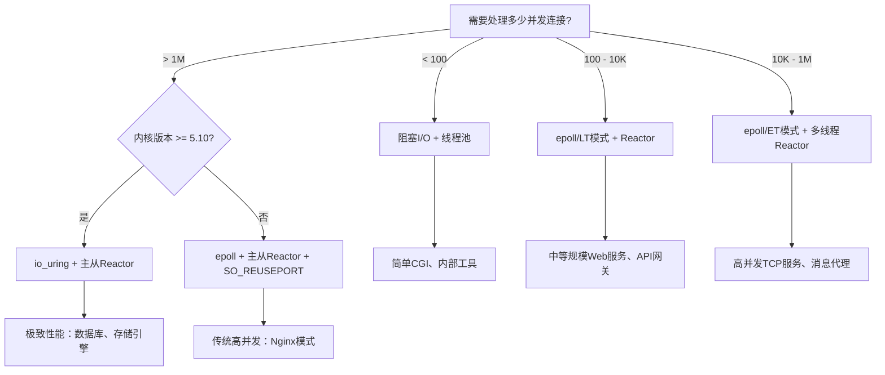

# 第07章 IO模型

## 章节定位

输入/输出（I/O）是计算机系统中最基础也最影响性能的操作之一。从磁盘读取数据、从网络接收消息、向终端输出文本，所有这些操作都涉及I/O。理解不同的I/O模型及其底层实现，是构建高性能服务器、设计高并发系统的核心前提。本章从操作系统的I/O模型出发，系统梳理阻塞I/O、非阻塞I/O、I/O多路复用、信号驱动I/O和异步I/O五种经典模型的原理与差异，深入剖析Linux下epoll的实现机制、io_uring的新一代接口，以及Reactor和Proactor两种事件驱动架构模式。

## 核心问题

1. **五种I/O模型的本质区别是什么？** 从同步/异步、阻塞/非阻塞两个维度进行精确分类。
2. **epoll为什么比select/poll高效？** 理解红黑树+就绪链表的内部数据结构、ET/LT模式的区别、以及惊群问题的解决方案。
3. **io_uring带来了什么革命性变化？** 理解共享内存环形缓冲区、内核态轮询、零系统调用的设计思想。
4. **Reactor和Proactor模式如何指导服务器架构设计？** 从单线程Reactor到主从Reactor的演进路径。

## 知识图谱

IO模型
├── 同步IO
│   ├── 阻塞IO（Blocking I/O）
│   ├── 非阻塞IO（Non-blocking I/O）
│   ├── IO多路复用（I/O Multiplexing）
│   │   ├── select（O(n)扫描，fd限制1024）
│   │   ├── poll（链表替代位图，无fd限制）
│   │   └── epoll（红黑树+就绪链表，O(1)事件通知）
│   │       ├── LT模式（水平触发）
│   │       ├── ET模式（边缘触发）
│   │       └── EPOLLEXCLUSIVE（惊群解决）
│   └── 信号驱动IO（Signal-driven I/O）
├── 异步IO
│   ├── POSIX AIO（用户态线程池模拟）
│   ├── Linux AIO（io_submit/io_getevents）
│   └── io_uring（SQ/CQ环形缓冲区）
└── 架构模式
    ├── Reactor模式
    │   ├── 单线程Reactor
    │   ├── 多线程Reactor（工作者线程池）
    │   └── 主从Reactor（主Reactor接受+子Reactor处理）
    └── Proactor模式
        ├── Windows IOCP
        └── Linux io_uring

## 学习路径

基础概念 → 五种IO模型对比 → select/poll/epoll深入 → io_uring新范式
    → Reactor/Proactor模式 → 高并发服务器实战 → 性能调优

## 前置知识

- 第03章 IO系统：理解系统调用与内核I/O栈
- 第04章 进程与线程：理解线程模型与并发基础
- 第06章 文件系统：理解fd与VFS抽象

## 参考文献

1. W. Richard Stevens, *UNIX Network Programming, Volume 1: The Sockets Networking API*, 3rd Edition, 2003
2. Danial Kegel, *The C10K Problem*, 2003. http://www.kegel.com/c10k.html
3. Jens Axboe, *Efficient IO with io_uring*, 2019. https://kernel.dk/io_uring.pdf
4. 参考Linux内核源码: `fs/eventpoll.c`, `io_uring/io_uring.c`


***

## IO模型 - 理论基础

### 1 五种I/O模型概述

#### 1.1 I/O操作的两个阶段

一次完整的I/O操作可以分解为两个阶段：

1. **数据准备阶段**：内核等待数据到达（例如等待网络数据包到达、磁盘数据读取完成）
2. **数据拷贝阶段**：将数据从内核缓冲区拷贝到用户空间缓冲区

用户进程                                    内核
   │                                         │
   │──── read() ─────────────────────────────>│
   │                                         │  ← 数据准备（等待数据到达）
   │                                         │
   │                                         │  ← 数据拷贝（内核→用户空间）
   │<─────────────────── 返回 ───────────────│
   │                                         │

不同的I/O模型在这两个阶段的行为上有所不同，关键区别在于：**进程在这两个阶段中是否被阻塞**。

#### 1.2 同步I/O vs 异步I/O的定义

根据POSIX的定义：

- **同步I/O**：导致请求进程阻塞，直到I/O操作完成（即数据拷贝完成）
- **异步I/O**：不导致请求进程阻塞；内核在完成整个操作后通知用户进程

这个定义的关键在于：**数据拷贝阶段是否由内核完成后主动通知用户**。所有在数据拷贝阶段需要用户进程参与（发起read/recvfrom等调用）的，都属于同步I/O。

#### 1.3 五种模型一览

| 模型 | 数据准备阶段 | 数据拷贝阶段 | 类型 |
|------|-------------|-------------|------|
| 阻塞I/O | 阻塞 | 阻塞 | 同步 |
| 非阻塞I/O | 非阻塞（轮询） | 阻塞 | 同步 |
| I/O多路复用 | 阻塞（在select/poll/epoll上） | 阻塞 | 同步 |
| 信号驱动I/O | 非阻塞（信号通知） | 阻塞 | 同步 |
| 异步I/O | 非阻塞 | 非阻塞（内核完成） | 异步 |

### 2 阻塞I/O（Blocking I/O）

#### 2.1 基本流程

阻塞I/O是最常见的I/O模型，也是Linux下默认的文件描述符行为。

```c
// 典型的阻塞I/O
ssize_t n = read(fd, buf, sizeof(buf));  // 进程在此阻塞
// 直到数据到达并拷贝到buf后才返回
```

时序如下：

用户进程                    内核
   │                         │
   │──── recvfrom() ────────>│
   │                         │  等待数据到达（阻塞）
   │                         │
   │                         │  数据到达
   │                         │  拷贝数据到用户空间
   │<────── 返回 ────────────│
   │                         │
   │  处理数据                │

#### 2.2 内核实现原理

当用户调用`read(fd, buf, count)`时：

1. 系统调用进入内核态，VFS层找到fd对应的`struct file`对象
2. 调用具体文件系统的`read`操作（如`sock_read_iter`）
3. 如果数据未就绪，将当前进程加入等待队列（`wait_queue_head`）
4. 调用`schedule()`让出CPU，进程进入`TASK_INTERRUPTIBLE`状态
5. 数据到达后，内核通过中断或软中断唤醒等待队列上的进程
6. 进程被唤醒后执行数据拷贝，返回用户态

```c
// 简化的内核阻塞读取路径
static ssize_t sock_read_iter(struct kiocb *iocb, struct iov_iter *to) {
    struct sock *sk = sock->sk;
    // ...
    // 如果没有数据，阻塞等待
    error = sk_wait_data(sk, &amp;timeo, NULL);
    // 数据到达，拷贝到用户空间
    skb_copy_datagram_msg(skb, offset, msg, copied);
    return copied;
}
```

#### 2.3 优缺点

**优点**：
- 编程模型简单，逻辑清晰
- 适合连接数少、每个连接I/O频繁的场景

**缺点**：
- 每个连接需要独立线程/进程处理
- 线程开销大（栈空间、上下文切换）
- 万级连接时，线程数成为瓶颈

#### 2.4 适用场景

- 连接数较少（< 100）且每个连接I/O密集的服务
- 传统的CGI程序、简单的命令行工具
- 可以通过线程池缓解但不解决根本问题

### 3 非阻塞I/O（Non-blocking I/O）

#### 3.1 基本流程

通过将fd设置为`O_NONBLOCK`标志，`read()`在数据未就绪时立即返回`EAGAIN`而非阻塞。

```c
// 设置非阻塞
int flags = fcntl(fd, F_GETFL, 0);
fcntl(fd, F_SETFL, flags | O_NONBLOCK);

// 轮询读取
while (1) {
    ssize_t n = read(fd, buf, sizeof(buf));
    if (n > 0) {
        // 数据就绪，处理数据
        process(buf, n);
        break;
    } else if (n == -1 &amp;&amp; errno == EAGAIN) {
        // 数据未就绪，执行其他任务
        do_other_work();
    } else {
        // 错误处理
        perror("read");
        break;
    }
}
```

时序如下：

用户进程                    内核
   │                         │
   │──── recvfrom() ────────>│
   │<── EAGAIN (无数据) ─────│
   │                         │
   │  执行其他任务            │
   │                         │
   │──── recvfrom() ────────>│
   │<── EAGAIN (无数据) ─────│
   │                         │
   │  执行其他任务            │
   │                         │
   │──── recvfrom() ────────>│  数据已到达
   │                         │  拷贝数据到用户空间
   │<────── 数据 ────────────│

#### 3.2 忙等待问题

纯非阻塞I/O的问题是**忙等待（busy polling）**——CPU在不断轮询中被浪费。实际使用中，非阻塞I/O几乎不会单独使用，而是与I/O多路复用结合：

```c
// 实际模式：非阻塞fd + epoll
fcntl(fd, F_SETFL, O_NONBLOCK);
epoll_ctl(epfd, EPOLL_CTL_ADD, fd, &amp;ev);

while (1) {
    int nfds = epoll_wait(epfd, events, MAX_EVENTS, -1);
    for (int i = 0; i < nfds; i++) {
        // epoll通知fd可读，使用非阻塞read
        ssize_t n = read(events[i].data.fd, buf, sizeof(buf));
        // 非阻塞确保即使在ET模式下也不会永远阻塞
    }
}
```

#### 3.3 内核实现

当fd设置`O_NONBLOCK`后，内核在`sock_read_iter`中检查数据是否就绪：

```c
if (sk->sk_rcvtimeo == 0 &amp;&amp; nonblock) {
    // 非阻塞模式，无数据立即返回
    error = -EAGAIN;
    goto out;
}
```

### 4 I/O多路复用（I/O Multiplexing）

#### 4.1 核心思想

I/O多路复用允许**单个线程/进程同时监控多个文件描述符**，在其中任意一个就绪时得到通知。这是构建高并发服务器的核心技术。

#### 4.2 select

**4.2.1 接口**

```c
int select(int nfds, fd_set *readfds, fd_set *writefds,
           fd_set *exceptfds, struct timeval *timeout);

// fd_set 位图操作
FD_ZERO(&amp;readfds);          // 清空
FD_SET(fd, &amp;readfds);       // 设置fd位
FD_ISSET(fd, &amp;readfds);     // 检查fd位
FD_CLR(fd, &amp;readfds);       // 清除fd位
```

**4.2.2 内核实现**

`select`的核心实现路径（`fs/select.c`中的`core_sys_select`）：

1. 将用户空间的`fd_set`拷贝到内核空间
2. 遍历所有注册的fd（0到`nfds-1`），对每个fd调用其`poll`方法
3. 如果有fd就绪，设置对应的位并返回
4. 如果没有fd就绪，将当前进程加入所有fd的等待队列，进入睡眠
5. 当某个fd就绪时，内核唤醒进程，重新遍历检查

```c
// 简化的select核心循环
static int do_select(int n, fd_set_bits *fds, struct timespec64 *end_time) {
    for (;;) {
        set_table = current->files->fdt->open_fds;
        for (i = 0; i < n; i++) {
            // 对每个fd调用poll
            mask = (*f_op->poll)(file, wait);
            if (mask) {
                // fd就绪，设置返回位图
                SET_BIT(result, i);
                retval++;
            }
        }
        if (retval || signal_pending(current) || timeout)
            break;
        // 没有就绪fd，进入等待
        poll_schedule(&amp;table, end_time);
    }
    return retval;
}
```

**4.2.3 局限性**

| 问题 | 说明 |
|------|------|
| **fd数量限制** | `FD_SETSIZE`通常为1024，无法突破 |
| **O(n)扫描** | 每次返回后需要遍历所有fd检查哪些就绪 |
| **重复拷贝** | 每次调用都需要将整个fd_set从用户空间拷贝到内核空间 |
| **水平触发** | 每次都报告所有就绪fd，无法只报告新就绪的 |

#### 4.3 poll

**4.3.1 接口**

```c
struct pollfd {
    int   fd;         // 文件描述符
    short events;     // 关注的事件（POLLIN/POLLOUT/POLLERR等）
    short revents;    // 实际发生的事件
};

int poll(struct pollfd *fds, nfds_t nfds, int timeout);
```

**4.3.2 改进**

- 用`pollfd`数组替代固定大小的位图，**没有fd数量限制**
- 关注事件（events）和返回事件（revents）分离，避免每次修改输入参数

**4.3.3 仍然存在的问题**

- 仍然需要O(n)遍历所有fd
- 每次调用仍然需要将整个数组拷贝到内核空间
- 用户空间仍然需要遍历所有fd检查revents

#### 4.4 epoll

**4.4.1 接口**

```c
// 创建epoll实例
int epfd = epoll_create1(0);

// 添加/修改/删除fd
struct epoll_event ev;
ev.events = EPOLLIN | EPOLLET;  // 边缘触发
ev.data.fd = fd;
epoll_ctl(epfd, EPOLL_CTL_ADD, fd, &amp;ev);

// 等待事件
struct epoll_event events[MAX_EVENTS];
int nfds = epoll_wait(epfd, events, MAX_EVENTS, timeout);
for (int i = 0; i < nfds; i++) {
    handle(events[i].data.fd, events[i].events);
}
```

**4.4.2 核心数据结构**

epoll的高效来源于其精心设计的内部数据结构：

struct eventpoll {
    // 就绪链表：存放已就绪的epitem
    struct list_head rdllist;
    
    // 红黑树：存放所有监控的epitem（快速查找/插入/删除）
    struct rb_root_cached rbr;
    
    // 等待队列：存放调用epoll_wait而睡眠的进程
    wait_queue_head_t wq;
    
    // ...
};

struct epitem {
    struct rb_node rbn;          // 红黑树节点
    struct list_head rdllink;    // 就绪链表节点
    struct epoll_filefd ffd;     // 关联的fd
    struct eventpoll *ep;        // 所属的epoll实例
    struct epoll_event event;    // 注册的事件
    // ...
};

图示：

eventpoll
┌─────────────────────────────────┐
│  rbr (红黑树)                    │
│         ┌───┐                   │
│        /│ep1│\                  │
│       / └───┘ \                 │
│    ┌───┐     ┌───┐              │
│   /│ep2│\   /│ep3│\             │
│  / └───┘ \ / └───┘ \           │
│ ┌───┐   ┌───┐   ┌───┐          │
│ │ep4│   │ep5│   │ep6│          │
│ └───┘   └───┘   └───┘          │
│                                 │
│  rdllist (就绪链表)              │
│  [ep2] <-> [ep5] <-> [ep3]      │
│                                 │
│  wq (等待队列)                   │
│  [进程A] [进程B]                 │
└─────────────────────────────────┘

**4.4.3 epoll_ctl的工作流程**

当调用`epoll_ctl(EPOLL_CTL_ADD, fd, event)`时：

1. 在红黑树中查找是否已存在该fd的epitem
2. 如果不存在，创建新的`epitem`，插入红黑树
3. 将当前epoll实例注册为该fd的等待队列回调

```c
// 简化的epoll_ctl_add
static int ep_insert(struct eventpoll *ep, struct epoll_event *event,
                     struct file *tfile, int fd) {
    struct epitem *epi = kmem_cache_alloc(epi_cache, GFP_KERNEL);
    
    INIT_LIST_HEAD(&amp;epi->rdllink);
    epi->ep = ep;
    epi->ffd = (struct epoll_filefd){ .file = tfile, .fd = fd };
    epi->event = *event;
    
    // 设置回调函数
    init_poll_funcptr(&amp;epi->pt, ep_poll_callback);
    
    // 对fd调用poll，注册回调
    revents = ep_item_poll(epi, &amp;epi->pt, 1);
    
    // 插入红黑树
    ep_rbtree_insert(ep, epi);
    
    // 如果已就绪，加入就绪链表
    if (revents &amp;&amp; !ep_is_linked(&amp;epi->rdllink))
        list_add_tail(&amp;epi->rdllink, &amp;ep->rdllist);
    
    return 0;
}
```

**4.4.4 epoll_wait的工作流程**

```c
// 简化的ep_poll
static int ep_poll(struct eventpoll *ep, struct epoll_event *events,
                   int maxevents, struct timespec64 *timeout) {
    // 检查就绪链表是否有事件
    if (!ep_events_available(ep)) {
        // 没有就绪事件，进入等待
        init_waitqueue_entry(&amp;wait, current);
        __add_wait_queue_exclusive(&amp;ep->wq, &amp;wait);
        
        for (;;) {
            set_current_state(TASK_INTERRUPTIBLE);
            if (ep_events_available(ep) || signal_pending(current) || timeout)
                break;
            schedule();  // 让出CPU
        }
        __remove_wait_queue(&amp;ep->wq, &amp;wait);
    }
    
    // 就绪链表非空，收集事件
    ep_send_events(ep, events, maxevents);
    return ready;
}
```

**4.4.5 ep_poll_callback回调**

当网卡收到数据包时，内核通过中断→软中断路径最终唤醒等待队列上的回调：

```c
// 当fd上有事件发生时，内核调用此回调
static int ep_poll_callback(wait_queue_entry_t *wait, unsigned mode,
                            int sync, void *key) {
    struct epitem *epi = ep_item_from_wait(wait);
    struct eventpoll *ep = epi->ep;
    
    // 如果该epitem尚未在就绪链表中，加入
    if (!ep_is_linked(&amp;epi->rdllink))
        list_add_tail(&amp;epi->rdllink, &amp;ep->rdllist);
    
    // 唤醒阻塞在epoll_wait上的进程
    if (waitqueue_active(&amp;ep->wq))
        wake_up(&amp;ep->wq);
    
    return 1;
}
```

**4.4.6 LT模式 vs ET模式**

**水平触发（Level Triggered, LT）**——默认模式：

- 只要fd处于就绪状态（如缓冲区有数据可读），每次`epoll_wait`都会返回该fd
- 适合编程简单、可靠性要求高的场景
- 允许不一次读完所有数据

**边缘触发（Edge Triggered, ET）**：

- 仅在fd状态**发生变化**时通知一次（如从无数据变为有数据）
- 必须一次性读完所有数据，否则剩余数据不会再通知
- 必须配合非阻塞fd使用
- 减少了epoll_wait的返回次数，性能更优

```c
// ET模式的正确读取方式
void handle_read(int fd) {
    char buf[4096];
    while (1) {
        ssize_t n = read(fd, buf, sizeof(buf));
        if (n < 0) {
            if (errno == EAGAIN) {
                // 数据读完，等待下次epoll通知
                break;
            }
            perror("read");
            break;
        } else if (n == 0) {
            // 连接关闭
            close(fd);
            break;
        }
        // 处理数据
        process(buf, n);
        // 继续循环，直到EAGAIN
    }
}
```

LT vs ET对比：

| 特性 | LT（水平触发） | ET（边缘触发） |
|------|---------------|---------------|
| 触发条件 | fd就绪状态持续报告 | fd状态变化时报告一次 |
| 编程复杂度 | 简单 | 较高，必须非阻塞+循环读 |
| epoll_wait调用次数 | 较多 | 较少 |
| 适用场景 | 通用场景 | 高性能场景 |
| 遗漏数据风险 | 无 | 有（未读完不会再通知） |
| 系统调用开销 | 较高 | 较低 |

**4.4.7 惊群问题与EPOLLEXCLUSIVE**

**惊群问题（Thundering Herd）**：

多个线程/进程同时阻塞在同一个epfd的`epoll_wait`上，当一个fd就绪时，所有线程都被唤醒，但只有一个能处理该事件。

线程A ──┐
线程B ──┤── epoll_wait(epfd, ...) ──> 阻塞等待
线程C ──┘
                ↓ fd就绪
线程A ← 唤醒
线程B ← 唤醒   ← 浪费！只有一个线程能处理
线程C ← 唤醒

**EPOLLEXCLUSIVE解决方案**（Linux 4.5+）：

```c
// 使用EPOLLEXCLUSIVE标记，只唤醒一个等待线程
ev.events = EPOLLIN | EPOLLEXCLUSIVE;
ev.data.fd = fd;
epoll_ctl(epfd, EPOLL_CTL_ADD, fd, &amp;ev);
```

内核实现：`ep_poll_callback`中检查`EPOLLEXCLUSIVE`标志，使用`autoremove_wake_function`只唤醒等待队列中的第一个进程。

**SO_REUSEPORT替代方案**：

```c
// 另一种方案：多个进程各自listen同一端口
int fd = socket(AF_INET, SOCK_STREAM, 0);
setsockopt(fd, SOL_SOCKET, SO_REUSEPORT, &amp;opt, sizeof(opt));
bind(fd, ...);
listen(fd, ...);
// 每个进程有自己的epoll实例监控自己的listen fd
```

**4.4.8 epoll的性能特征**

| 操作 | 时间复杂度 | 说明 |
|------|-----------|------|
| epoll_create | O(1) | 创建实例 |
| epoll_ctl ADD | O(log n) | 红黑树插入 |
| epoll_ctl MOD | O(log n) | 红黑树查找+修改 |
| epoll_ctl DEL | O(log n) | 红黑树查找+删除 |
| epoll_wait | O(1) | 仅检查就绪链表是否为空 |
| 事件回调 | O(1) | 将epitem加入就绪链表 |

**百万连接场景下epoll的优势**：
- select/poll：每次都要遍历所有fd，O(n)的开销在百万连接时不可接受
- epoll：epoll_wait只检查就绪链表，与总连接数无关

#### 4.5 select/poll/epoll对比

| 特性 | select | poll | epoll |
|------|--------|------|-------|
| 数据结构 | fd_set位图 | pollfd数组 | 红黑树+就绪链表 |
| 最大fd数 | 1024 | 无限制 | 无限制 |
| 每次调用拷贝 | 全部fd_set | 全部pollfd数组 | 仅在ctl时拷贝 |
| 就绪通知 | O(n)遍历 | O(n)遍历 | O(1)直接取就绪链表 |
| 触发模式 | LT | LT | LT/ET |
| 内核实现 | fs/select.c | fs/select.c | fs/eventpoll.c |
| 适用场景 | 少量fd | 少量fd | 大量fd（C10K+） |

### 5 信号驱动I/O（Signal-driven I/O）

#### 5.1 基本原理

进程通过`sigaction`注册`SIGIO`信号处理函数，然后立即返回。当数据就绪时，内核发送`SIGIO`信号，进程在信号处理函数中读取数据。

```c
// 设置信号驱动I/O
void sigio_handler(int sig) {
    ssize_t n = read(fd, buf, sizeof(buf));
    process(buf, n);
}

signal(SIGIO, sigio_handler);
fcntl(fd, F_SETOWN, getpid());  // 设置信号接收进程
fcntl(fd, F_SETFL, O_NONBLOCK | O_ASYNC);  // 开启异步通知
```

#### 5.2 时序

用户进程                    内核
   │                         │
   │── sigaction(SIGIO) ────>│  注册信号处理
   │                         │
   │  立即返回，执行其他任务   │
   │                         │
   │                         │  数据到达
   │<─── SIGIO信号 ──────────│
   │                         │
   │── 信号处理函数 ─────────>│
   │                         │  拷贝数据
   │<────── 数据 ────────────│

#### 5.3 局限性

- 信号处理函数中只能调用异步信号安全（async-signal-safe）的函数
- 信号可能丢失（信号不排队）
- 编程复杂，调试困难
- 实际使用较少，主要用于UDP套接字和某些设备驱动

### 6 异步I/O（Asynchronous I/O）

#### 6.1 POSIX AIO

POSIX AIO是用户态的异步I/O实现，实际通过线程池模拟：

```c
#include <aio.h>

struct aiocb cb;
cb.aio_fildes = fd;
cb.aio_buf = malloc(BUFSIZE);
cb.aio_nbytes = BUFSIZE;
cb.aio_offset = 0;
cb.aio_sigevent.sigev_notify = SIGEV_THREAD;
cb.aio_sigevent.sigev_notify_function = aio_completion_handler;

aio_read(&amp;cb);  // 立即返回

// 完成后回调 aio_completion_handler
```

POSIX AIO的问题：本质是用户态线程池模拟，并非真正的内核异步。

#### 6.2 Linux Native AIO

Linux 2.5引入的原生异步I/O：

```c
#include <linux/aio_abi.h>

aio_context_t ctx = 0;
io_setup(128, &amp;ctx);  // 创建AIO上下文

struct iocb cb;
cb.aio_fildes = fd;
cb.aio_lio_opcode = IOCB_CMD_PREAD;
cb.aio_buf = (uint64_t)buf;
cb.aio_nbytes = sizeof(buf);
cb.aio_offset = 0;

struct iocb *cbs[1] = { &amp;cb };
io_submit(ctx, 1, cbs);  // 提交I/O请求

struct io_event events[1];
io_getevents(ctx, 1, 1, events, NULL);  // 等待完成
```

**Linux AIO的局限**：
- 仅支持`O_DIRECT`（绕过页缓存），对普通文件和套接字支持有限
- 每次提交和获取都是系统调用，开销仍然不小
- API使用不便

#### 6.3 io_uring

io_uring是Linux 5.1引入的新一代异步I/O接口，解决了之前所有异步I/O方案的问题。

**6.3.1 架构设计**

用户空间                              内核空间
┌─────────────────────────┐    ┌─────────────────────────┐
│                         │    │                         │
│  SQ (Submission Queue)  │───>│  SQ Ring Buffer         │
│  ┌───┬───┬───┬───┐     │    │  (共享内存，无拷贝)       │
│  │SQE│SQE│SQE│...│     │    │  ┌───┬───┬───┬───┐     │
│  └───┴───┴───┴───┘     │    │  │SQE│SQE│SQE│...│     │
│                         │    │  └───┴───┴───┴───┘     │
│                         │    │                         │
│  CQ (Completion Queue)  │<───│  CQ Ring Buffer         │
│  ┌───┬───┬───┬───┐     │    │  (共享内存，无拷贝)       │
│  │CQE│CQE│CQE│...│     │    │  ┌───┬───┬───┬───┐     │
│  └───┴───┴───┴───┘     │    │  │CQE│CQE│CQE│...│     │
│                         │    │  └───┴───┴───┴───┘     │
└─────────────────────────┘    └─────────────────────────┘

**6.3.2 核心数据结构**

```c
// 提交队列条目（Submission Queue Entry）
struct io_uring_sqe {
    __u8  opcode;      // 操作码（IORING_OP_READ等）
    __u8  flags;       // 标志
    __u16 ioprio;      // I/O优先级
    __s32 fd;          // 文件描述符
    __u64 off;         // 偏移量
    __u64 addr;        // 缓冲区地址
    __u32 len;         // 缓冲区长度
    __u64 user_data;   // 用户数据（关联请求与完成）
    // ...
};

// 完成队列条目（Completion Queue Entry）
struct io_uring_cqe {
    __u64 user_data;   // 对应SQE的user_data
    __s32 res;         // 结果（读取字节数或错误码）
    __u32 flags;       // 标志
};
```

**6.3.3 使用流程**

```c
#include <liburing.h>

struct io_uring ring;
io_uring_queue_init(256, &amp;ring, 0);  // 创建ring，深度256

// 提交读请求
struct io_uring_sqe *sqe = io_uring_get_sqe(&amp;ring);
io_uring_prep_read(sqe, fd, buf, sizeof(buf), offset);
io_uring_sqe_set_data(sqe, context);  // 关联用户上下文
io_uring_submit(&amp;ring);  // 提交（实际的系统调用）

// 等待完成
struct io_uring_cqe *cqe;
io_uring_wait_cqe(&amp;ring, &amp;cqe);
int result = cqe->res;       // I/O结果
void *ctx = io_uring_cqe_get_data(cqe);  // 取回用户上下文
io_uring_cqe_seen(&amp;ring, cqe);  // 标记已处理
```

**6.3.4 SQPOLL模式**

```c
// SQPOLL模式：内核线程持续轮询SQ，无需系统调用提交
struct io_uring_params params = {0};
params.flags = IORING_SETUP_SQPOLL;
params.sq_thread_idle = 2000;  // 2秒无提交则内核线程睡眠

io_uring_queue_init_params(256, &amp;ring, &amp;params);

// 此后提交I/O只需写入SQ，无需io_uring_submit()系统调用
// 内核线程自动从SQ取请求并处理
```

SQPOLL模式下，提交I/O请求可以做到**零系统调用**。

**6.3.5 io_uring vs epoll**

| 特性 | epoll | io_uring |
|------|-------|----------|
| I/O模型 | 事件通知+同步读写 | 真正的异步I/O |
| 系统调用次数 | 每次read/write各一次 | SQPOLL下可零系统调用 |
| 数据拷贝 | 用户态发起read拷贝 | 内核异步完成后通知 |
| 适用范围 | 主要网络I/O | 网络I/O + 磁盘I/O + 其他 |
| 批量提交 | 不支持 | 支持批量提交多个SQE |
| 零拷贝 | 需要额外配置 | 内置支持（IORING_OP_READ_FIXED） |
| 内核版本 | 2.6+ | 5.1+（推荐5.10+） |

#### 6.3.6 io_uring的演进与现代特性

io_uring自Linux 5.1引入后持续快速演进，每个内核版本都带来重要增强：

**Multishot操作（Linux 5.19+）**：单个SQE可以触发多次完成事件，特别适合持续接收场景——一次提交`IORING_OP_RECV_MULTISHOT`，内核会在每次收到数据时产生一个CQE，无需用户态反复提交：

```c
// Multishot recv：一次提交，持续接收
struct io_uring_sqe *sqe = io_uring_get_sqe(&amp;ring);
io_uring_prep_recv(sqe, fd, NULL, 0, 0);
sqe->opcode = IORING_OP_RECV_MULTISHOT;
sqe->flags |= IOSQE_BUFFER_SELECT;
sqe->buf_group = buf_group_id;
io_uring_submit(&amp;ring);
// 每次收到数据都会产生一个CQE，直到显式取消
```

**注册缓冲区组（Buffer Rings, Linux 5.19+）**：内核可以从预注册的缓冲区池中分配缓冲区，避免了用户态在每次CQE后手动分配缓冲区的开销。这在高吞吐场景下显著降低了内存分配频率。

**Fixed files和registered buffers的持续优化**：从Linux 5.6开始，`io_uring_register(IORING_REGISTER_FILES)`和`io_uring_register(IORING_REGISTER_BUFFERS)`的性能持续提升。在5.10+中，注册文件的查找从O(log n)优化到O(1)。

**io_uring的安全演进**：

| 内核版本 | 安全相关变更 |
|---------|------------|
| 5.10 | 修复`IORING_OP_READ_FIXED`的越界写入（CVE-2021-3491） |
| 5.11 | 修复SQPOLL模式的权限检查问题 |
| 5.15 | 增加io_uring的seccomp过滤支持（`io_uring_setup`可被seccomp阻断） |
| 5.19 | 修复`IORING_OP_MSG_RING`的UAF漏洞（CVE-2022-29582） |
| 6.0+ | 默认禁用io_uring用于setuid程序 |
| 6.4+ | 增加`IOURING_SETUP_R_disabled`标志，允许延迟启用 |

**容器环境中的io_uring**：在Docker/Kubernetes等容器环境中，io_uring的使用需要特别注意：
- 部分容器运行时（如gVisor）不支持io_uring
- seccomp profile可能阻断`io_uring_setup`系统调用
- Pod安全策略（PodSecurityPolicy/PodSecurityAdmission）可能限制
- 建议在容器化部署前验证目标环境的io_uring支持情况

```bash
# 检查内核是否支持io_uring
cat /proc/version  # 需要5.1+

# 检查seccomp是否限制io_uring
grep -r io_uring /etc/docker/ || echo "未发现io_uring限制"

# 快速测试io_uring是否可用
python3 -c "import ctypes; lib = ctypes.CDLL('liburing.so.2'); print('io_uring available')"
```

### 7 Reactor模式

#### 7.1 模式定义

Reactor模式是一种**事件驱动**的设计模式：一个或多个事件源（fd）注册到事件多路分离器（Reactor），事件多路分离器等待事件发生，然后分发给对应的事件处理器。

#### 7.2 单线程Reactor

所有I/O操作和业务处理都在同一个线程中完成。

┌──────────────────────────────────────────┐
│              单线程 Reactor               │
│                                          │
│  ┌─────────┐   ┌──────────┐   ┌───────┐ │
│  │ Acceptor │   │ Reactor  │   │Timer  │ │
│  └────┬────┘   └─────┬────┘   └───┬───┘ │
│       │              │            │      │
│       │    ┌─────────┤            │      │
│       │    │         │            │      │
│  ┌────▼────▼─────────▼────────────▼───┐  │
│  │        epoll_wait (事件循环)        │  │
│  └────────────┬───────────────────────┘  │
│               │                          │
│       ┌───────┼───────┐                  │
│       ▼       ▼       ▼                  │
│   Handler1 Handler2 Handler3             │
│   (连接1)  (连接2)  (连接3)              │
└──────────────────────────────────────────┘

```c
// 单线程Reactor伪代码
void event_loop(int listen_fd) {
    int epfd = epoll_create1(0);
    // 注册listen_fd
    epoll_ctl(epfd, EPOLL_CTL_ADD, listen_fd, ...);
    
    while (1) {
        int nfds = epoll_wait(epfd, events, MAX_EVENTS, -1);
        for (int i = 0; i < nfds; i++) {
            if (events[i].data.fd == listen_fd) {
                // 新连接
                int conn_fd = accept(listen_fd, ...);
                epoll_ctl(epfd, EPOLL_CTL_ADD, conn_fd, ...);
            } else {
                // 数据就绪
                handle_request(events[i].data.fd);
            }
        }
    }
}
```

**代表实现**：Redis、memcached

**优点**：简单高效，无锁，适合CPU不密集的场景
**缺点**：无法利用多核，业务处理阻塞会影响所有连接

#### 7.3 多线程Reactor（工作者线程池）

Reactor线程负责I/O事件分发，业务处理交给工作者线程池。

┌──────────────────────────────────────────────┐
│                                              │
│  ┌──────────────────────┐                    │
│  │   Reactor线程         │                    │
│  │   (事件分发)          │                    │
│  └──────────┬───────────┘                    │
│             │                                │
│     ┌───────┼───────┐                        │
│     ▼       ▼       ▼                        │
│  ┌─────┐ ┌─────┐ ┌─────┐                    │
│  │Worker│ │Worker│ │Worker│  工作者线程池     │
│  │线程1 │ │线程2 │ │线程3 │                   │
│  └─────┘ └─────┘ └─────┘                    │
│                                              │
└──────────────────────────────────────────────┘

**代表实现**：Netty的默认模式

#### 7.4 主从Reactor（Multi-Reactor）

主Reactor负责accept新连接，子Reactor负责各连接的I/O读写，工作者线程池负责业务逻辑。

┌─────────────────────────────────────────────────────┐
│                                                     │
│  ┌───────────────┐        ┌────────────────────┐   │
│  │  Main Reactor  │───────>│  Sub Reactor 1     │   │
│  │  (accept连接)   │        │  (连接1-N的I/O)    │   │
│  └───────────────┘        └────────┬───────────┘   │
│                                    │                │
│  ┌───────────────┐        ┌────────▼───────────┐   │
│  │  Main Reactor  │───────>│  Sub Reactor 2     │   │
│  │  (accept连接)   │        │  (连接N+1-M的I/O)  │   │
│  └───────────────┘        └────────┬───────────┘   │
│                                    │                │
│                           ┌────────▼───────────┐   │
│                           │  Worker Thread Pool │   │
│                           │  (业务逻辑处理)      │   │
│                           └────────────────────┘   │
└─────────────────────────────────────────────────────┘

```c
// 主从Reactor伪代码
void main_reactor(int listen_fd) {
    int epfd = epoll_create1(0);
    epoll_ctl(epfd, EPOLL_CTL_ADD, listen_fd, ...);
    
    while (1) {
        int nfds = epoll_wait(epfd, events, MAX_EVENTS, -1);
        for (int i = 0; i < nfds; i++) {
            int conn_fd = accept(listen_fd, ...);
            // 将新连接分配给子Reactor
            int sub_idx = conn_fd % NUM_SUB_REACTORS;
            add_to_sub_reactor(sub_idx, conn_fd);
        }
    }
}

void sub_reactor(int sub_idx) {
    while (1) {
        int nfds = epoll_wait(sub_epfd[sub_idx], events, MAX_EVENTS, -1);
        for (int i = 0; i < nfds; i++) {
            // 将业务处理提交给工作者线程池
            submit_to_worker(events[i].data.fd, events[i].events);
        }
    }
}
```

**代表实现**：Netty（Boss EventLoopGroup + Worker EventLoopGroup）、Nginx

#### 7.5 主流框架的Reactor实现对比

不同框架对Reactor模式的实现各有侧重，理解它们的设计取舍有助于在实际项目中做出正确选择：

| 框架 | Reactor类型 | 线程模型 | 特殊设计 |
|------|-----------|---------|---------|
| **Redis** | 单线程Reactor | 主线程处理所有I/O和命令执行 | 6.0+引入多线程I/O（仅网络读写），命令执行仍单线程；瓶颈在内存带宽而非CPU |
| **Nginx** | 主从Reactor | Master进程accept + Worker进程各自epoll | 每个Worker独立处理完整连接生命周期，利用`accept_mutex`或`EPOLLEXCLUSIVE`分发 |
| **Netty** | 多线程Reactor | Boss EventLoopGroup（accept）+ Worker EventLoopGroup（I/O） | `EPOLLONESHOT`确保连接安全分发；支持`io_uring`传输（实验性） |
| **libuv** | 单线程事件循环 | 主线程事件循环 + 后台线程池（文件I/O） | 跨平台抽象层（epoll/kqueue/IOCP）；Node.js的底层运行时 |
| **tokio** | 多线程Reactor | Work-stealing调度器 + 每线程epoll/kqueue/io_uring | Rust异步运行时；支持io_uring作为可选后端（tokio-uring） |
| **Envoy** | 多线程Reactor | 主线程accept + Worker线程池（每个Worker独立epoll） | L4/L7代理；使用`EPOLLONESHOT`+线程本地存储避免锁竞争 |

**Redis的单线程为什么够用？**

Redis选择单线程Reactor的核心原因是：Redis的操作几乎全部是内存操作，CPU执行时间极短。瓶颈在网络I/O而非CPU计算。单线程避免了锁竞争和上下文切换的开销。Redis 6.0引入多线程I/O（`io-threads`配置），仅用于网络读写阶段，命令执行仍然是单线程串行——这保证了原子性和简化了并发控制。

### 8 Proactor模式

#### 8.1 模式定义

Proactor模式中，**内核完成整个I/O操作后才通知用户进程**，用户进程只需注册完成回调。与Reactor的核心区别：

- **Reactor**：内核通知"fd就绪"，用户进程发起read/write
- **Proactor**：内核通知"I/O完成"，数据已经在用户缓冲区中

#### 8.2 两种实现路径

**Windows IOCP（I/O Completion Ports）**：

```c
// Windows IOCP是天然的Proactor模型
HANDLE iocp = CreateIoCompletionPort(INVALID_HANDLE_VALUE, NULL, 0, 0);
CreateIoCompletionPort((HANDLE)socket, iocp, completion_key, 0);

// 投递异步读取
WSABUF buf = { .len = 4096, .buf = buffer };
WSARecv(socket, &amp;buf, 1, &amp;bytes, &amp;flags, &amp;overlapped, NULL);

// 等待完成通知
GetQueuedCompletionStatus(iocp, &amp;bytes, &amp;key, &amp;overlapped, INFINITE);
// 数据已在buffer中
```

**Linux io_uring作为Proactor**：

```c
// io_uring实现了类似Proactor的语义
struct io_uring_sqe *sqe = io_uring_get_sqe(&amp;ring);
io_uring_prep_read(sqe, fd, buf, sizeof(buf), 0);
io_uring_submit(&amp;ring);

struct io_uring_cqe *cqe;
io_uring_wait_cqe(&amp;ring, &amp;cqe);
// cqe->res 是读取的字节数，数据已在buf中
```

#### 8.3 Reactor vs Proactor

| 特性 | Reactor | Proactor |
|------|---------|----------|
| 通知内容 | fd就绪 | I/O完成 |
| 数据读写 | 用户进程发起 | 内核异步完成 |
| 系统调用 | wait+read/write | submit+complete |
| 编程模型 | 同步I/O+事件通知 | 异步I/O+完成回调 |
| 典型实现 | epoll + read/write | IOCP / io_uring |
| 跨平台 | 统一（epoll/kqueue） | IOCP与io_uring不兼容 |
| 实际使用 | 绝大多数Linux服务器 | Windows服务器 / 新一代Linux服务 |

#### 8.4 通过用户态线程池模拟Proactor

在Linux下使用epoll时，可以通过将同步I/O封装为异步调用来模拟Proactor：

```c
// 模拟Proactor：epoll通知就绪后，在线程池中执行I/O
void on_epoll_event(int fd, int events) {
    if (events &amp; EPOLLIN) {
        // 提交到线程池，模拟异步读
        thread_pool_submit(fd, [](int fd) {
            char buf[4096];
            ssize_t n = read(fd, buf, sizeof(buf));
            // 回调用户处理逻辑
            on_read_complete(fd, buf, n);
        });
    }
}
```

### 9 事件驱动编程模型

#### 9.1 事件循环（Event Loop）

事件驱动编程的核心是事件循环：

```c
void event_loop(event_loop_t *loop) {
    while (!loop->stop) {
        // 1. 计算超时
        int timeout = calculate_timeout(loop);
        
        // 2. 阻塞在I/O多路复用上
        update_time(loop);
        int nevents = io_poll(loop, timeout);
        
        // 3. 处理就绪事件
        fire_events(loop, nevents);
        
        // 4. 处理定时器
        process_timers(loop);
    }
}
```

#### 9.2 事件分类

| 事件类型 | 触发条件 | 处理方式 |
|----------|---------|---------|
| I/O事件 | fd可读/可写 | epoll_wait返回 |
| 定时器事件 | 超时到期 | 时间轮/最小堆 |
| 信号事件 | 进程收到信号 | signalfd/pipe |
| 空闲事件 | 无事件时 | 回收资源/心跳 |

#### 9.3 定时器实现

在事件驱动架构中，定时器是不可或缺的组件（连接超时、心跳检测等）：

**时间轮（Timing Wheel）**：

时间轮（精度1秒，跨度60秒）
┌───┬───┬───┬───┬───┬───┬─...─┬───┐
│ 0 │ 1 │ 2 │ 3 │ 4 │ 5 │ ... │59 │  ← 槽位
└─┬─┴─┬─┴───┴─┬─┴───┴───┴─...─┴───┘
  │   │       │
  ▼   ▼       ▼
 conn1 conn2  conn3    ← 每个槽位挂载超时连接链表

**最小堆（Min-Heap）**：

        timer1 (最早到期)
       /          \
    timer2       timer3
    /    \       /    \
 timer4 timer5 timer6 timer7

### 10 高并发服务器架构

#### 10.1 C10K问题

C10K问题（Dan Kegel, 1999）：如何在单台服务器上同时处理10000个并发连接？

| 方案 | 线程模型 | I/O模型 | 适用范围 |
|------|---------|---------|---------|
| thread-per-connection | 1线程/连接 | 阻塞I/O | < 1000连接 |
| thread-pool | 线程池 | 阻塞I/O | < 5000连接 |
| 事件驱动 | 单/少量线程 | epoll | 10K-1M连接 |
| io_uring | 单/少量线程 | 异步I/O | 1M+连接 |

#### 10.2 C10M问题

C10M（1000万并发连接）需要更激进的优化：

| 优化方向 | 技术手段 | 效果 |
|---------|---------|------|
| **内核旁路** | DPDK/XDP直接操作网卡，绕过内核协议栈 | 消除内核态切换开销，包处理从100万/秒提升到1000万+/秒 |
| **零拷贝** | `sendfile`、`splice`、`io_uring`的fixed buffer | 消除用户态/内核态数据拷贝 |
| **用户态协议栈** | 自定义TCP/IP栈（如mTCP、f-stack） | 避免内核协议栈的锁竞争和内存拷贝 |
| **CPU亲和性** | 绑定线程到特定CPU核心，避免缓存抖动 | 减少L1/L2缓存失效，提升缓存命中率 |
| **内存池** | 预分配缓冲区，避免动态分配开销 | 消除malloc/free的系统调用和碎片化 |
| **中断亲和性** | 将网卡中断绑定到特定CPU核心 | 避免中断在多核间跳转，提升NUMA局部性 |
| **XDP（eBPF）** | 在网卡驱动层处理网络包 | 在进入内核协议栈之前就完成L4负载均衡 |

**XDP（eXpress Data Path）**是Linux 4.8引入的新一代网络数据路径，它允许在网卡驱动层直接执行eBPF程序，在数据包进入内核协议栈之前就完成处理。对于C10M场景，XDP可以实现：
- L3/L4负载均衡（替代LVS）
- DDoS防护（在驱动层丢弃恶意包）
- NAT和包转发（绕过iptables）

```c
// XDP程序示例：丢弃特定端口的包
SEC("xdp")
int xdp_drop(struct xdp_md *ctx) {
    void *data_end = (void *)(long)ctx->data_end;
    void *data = (void *)(long)ctx->data;
    struct ethhdr *eth = data;
    
    if (eth + 1 > data_end) return XDP_PASS;
    
    struct iphdr *ip = (void *)(eth + 1);
    if (ip + 1 > data_end) return XDP_PASS;
    
    if (ip->protocol == IPPROTO_TCP) {
        struct tcphdr *tcp = (void *)ip + (ip->ihl * 4);
        if (tcp + 1 > data_end) return XDP_PASS;
        if (ntohs(tcp->dest) == 80) return XDP_DROP;  // 丢弃80端口
    }
    
    return XDP_PASS;
}
```

#### 10.3 主流高性能框架

| 框架 | 语言 | I/O模型 | 特点 |
|------|------|---------|------|
| Nginx | C | epoll + 主从Reactor | 高性能Web服务器 |
| Netty | Java | epoll/kqueue + 主从Reactor | 网络应用框架 |
| libevent/libev | C | epoll/kqueue | 事件驱动库 |
| tokio | Rust | epoll/kqueue/io_uring | 异步运行时 |
| libuv | C | epoll/IOCP/kqueue | Node.js底层 |

### 11 零拷贝技术

#### 11.1 传统数据传输

磁盘 → 内核缓冲区 → 用户缓冲区 → Socket缓冲区 → 网卡
        DMA拷贝      CPU拷贝       CPU拷贝        DMA拷贝

4次拷贝，4次上下文切换。

#### 11.2 sendfile

```c
// sendfile：直接在内核空间完成文件到socket的传输
sendfile(out_fd, in_fd, &amp;offset, count);
// 内核：磁盘→内核缓冲区→Socket缓冲区→网卡
// 2次DMA拷贝，2次上下文切换（减少了用户空间拷贝）
```

#### 11.3 mmap + write

```c
// mmap：将内核缓冲区映射到用户空间
void *buf = mmap(NULL, length, PROT_READ, MAP_SHARED, fd, offset);
write(socket_fd, buf, length);
// 减少一次CPU拷贝
```

#### 11.4 splice

```c
// splice：在两个fd之间直接传输数据，不经过用户空间
splice(pipefd[1], NULL, socket_fd, NULL, len, SPLICE_F_MOVE);
// 内核内部直接传输
```

### 12 总结

本章从底层I/O模型出发，系统性地介绍了从阻塞I/O到异步I/O的完整技术栈。以下是核心要点与选型指南：

#### I/O模型选型决策



选择I/O模型时，需要综合考虑以下因素：

| 决策因素 | 推荐方案 |
|---------|---------|
| 连接数 < 100 | 阻塞I/O + 线程池，简单可靠 |
| 连接数 100-10K | epoll/LT + 单线程Reactor |
| 连接数 10K-1M | epoll/ET + 多线程Reactor |
| 连接数 > 1M | io_uring（如果内核支持）或 epoll + SO_REUSEPORT |
| 延迟敏感 | ET模式 + TCP_NODELAY + io_uring |
| 吞吐优先 | io_uring SQPOLL + 批量提交 + 零拷贝 |
| 磁盘I/O密集 | io_uring（唯一真正的异步磁盘I/O方案） |
| 容器环境 | epoll（兼容性最好），io_uring需验证环境支持 |
1. **五种I/O模型**：阻塞、非阻塞、I/O多路复用、信号驱动、异步——关键区分在于数据准备和数据拷贝两个阶段的阻塞行为
2. **epoll是Linux高并发的基石**：红黑树+就绪链表的O(1)事件通知，配合ET模式和EPOLLEXCLUSIVE解决惊群
3. **io_uring是未来方向**：SQ/CQ共享内存环形缓冲区实现真正的零系统调用异步I/O
4. **Reactor/Proactor指导架构设计**：从单线程Reactor到主从Reactor的演进路径，Proactor通过io_uring在Linux上真正落地
5. **零拷贝**：sendfile/splice/io_uring减少不必要的数据拷贝

***

**参考文献**：

1. Stevens, W.R. *UNIX Network Programming, Vol. 1*. Addison-Wesley, 2003.
2. Kegel, D. *The C10K Problem*. 2003.
3. Axboe, J. *Efficient IO with io_uring*. 2019.
4. Linux kernel source: `fs/eventpoll.c`, `io_uring/io_uring.c`, `fs/select.c`
5. McKusick, M.K., Neville-Neil, G.V. *The Design and Implementation of the FreeBSD Operating System*. Addison-Wesley, 2014.


***

## IO模型 - 核心技巧

### 1 epoll使用最佳实践

#### 1.1 ET模式的正确使用模式

ET模式下，必须一次性读完所有数据，否则剩余数据不会再触发通知：

```c
// 正确的ET模式处理
void et_read_handler(int epfd, int fd) {
    char buf[4096];
    
    // 关键：必须循环读到EAGAIN
    while (1) {
        ssize_t n = read(fd, buf, sizeof(buf));
        if (n > 0) {
            buffer_append(&amp;conn->input_buf, buf, n);
        } else if (n == 0) {
            // 对端关闭连接
            close_connection(epfd, fd);
            return;
        } else {
            if (errno == EAGAIN || errno == EWOULDBLOCK) {
                // 数据读完，跳出循环
                break;
            }
            perror("read");
            close_connection(epfd, fd);
            return;
        }
    }
    
    // 处理完整的请求
    process_complete_request(conn);
}
```

**常见错误**：

```c
// 错误：只读一次，ET模式下会丢失数据
ssize_t n = read(fd, buf, sizeof(buf));
process(buf, n);  // 如果缓冲区还有数据，不会再通知！
```

#### 1.2 epoll与非阻塞fd的配合

```c
// 将fd设置为非阻塞的封装函数
int set_nonblocking(int fd) {
    int flags = fcntl(fd, F_GETFL, 0);
    if (flags == -1) return -1;
    return fcntl(fd, F_SETFL, flags | O_NONBLOCK);
}

// 在accept后立即设置
int conn_fd = accept(listen_fd, (struct sockaddr*)&amp;addr, &amp;addr_len);
set_nonblocking(conn_fd);

struct epoll_event ev;
ev.events = EPOLLIN | EPOLLET;  // ET模式
ev.data.fd = conn_fd;
epoll_ctl(epfd, EPOLL_CTL_ADD, conn_fd, &amp;ev);
```

#### 1.3 EPOLLONESHOT的使用场景

在多线程环境中，`EPOLLONESHOT`确保同一fd同时只被一个线程处理：

```c
// 多线程Reactor中使用EPOLLONESHOT
void handle_connection(int epfd, int fd, uint32_t events) {
    // EPOLLONESHOT确保此时只有当前线程处理该fd
    
    if (events &amp; EPOLLIN) {
        ssize_t n = read(fd, buf, sizeof(buf));
        if (n > 0) {
            // 处理数据
            process(buf, n);
            
            // 重新注册事件（否则不会再收到通知）
            struct epoll_event ev;
            ev.events = EPOLLIN | EPOLLET | EPOLLONESHOT;
            ev.data.fd = fd;
            epoll_ctl(epfd, EPOLL_CTL_MOD, fd, &amp;ev);
        }
    }
}
```

**注意**：使用`EPOLLONESHOT`后，必须在处理完后用`EPOLL_CTL_MOD`重新注册，否则该fd不会再收到事件。

#### 1.4 epoll的eventfd集成

使用`eventfd`实现跨线程的事件通知：

```c
#include <sys/eventfd.h>

// 创建eventfd
int efd = eventfd(0, EFD_NONBLOCK | EFD_SEMAPHORE);
epoll_ctl(epfd, EPOLL_CTL_ADD, efd, &amp;(struct epoll_event){
    .events = EPOLLIN,
    .data.fd = efd
});

// 工作线程通知Reactor线程
void worker_notify(int efd) {
    uint64_t val = 1;
    write(efd, &amp;val, sizeof(val));  // 唤醒epoll_wait
}

// Reactor线程收到通知
void on_eventfd_ready(int efd) {
    uint64_t val;
    read(efd, &amp;val, sizeof(val));
    // 处理工作线程提交的结果
    process_worker_results();
}
```

#### 1.5 signalfd集成信号处理

```c
#include <sys/signalfd.h>

sigset_t mask;
sigemptyset(&amp;mask);
sigaddset(&amp;mask, SIGINT);
sigaddset(&amp;mask, SIGTERM);
sigprocmask(SIG_BLOCK, &amp;mask, NULL);

int sfd = signalfd(-1, &amp;mask, 0);
epoll_ctl(epfd, EPOLL_CTL_ADD, sfd, &amp;(struct epoll_event){
    .events = EPOLLIN,
    .data.fd = sfd
});

// 信号处理变为普通的epoll事件
void on_signal(int sfd) {
    struct signalfd_siginfo fdsi;
    read(sfd, &amp;fdsi, sizeof(fdsi));
    if (fdsi.ssi_signo == SIGINT) {
        graceful_shutdown();
    }
}
```

#### 1.6 timerfd集成定时器

```c
#include <sys/timerfd.h>

int tfd = timerfd_create(CLOCK_MONOTONIC, TFD_NONBLOCK);
struct itimerspec timer = {
    .it_interval = { 5, 0 },  // 每5秒重复
    .it_value = { 5, 0 }      // 首次5秒后触发
};
timerfd_settime(tfd, 0, &amp;timer, NULL);

epoll_ctl(epfd, EPOLL_CTL_ADD, tfd, &amp;(struct epoll_event){
    .events = EPOLLIN,
    .data.fd = tfd
});

void on_timer(int tfd) {
    uint64_t expirations;
    read(tfd, &amp;expirations, sizeof(expirations));
    // 处理超时事件
    check_idle_connections();
}
```

### 2 高性能连接管理

#### 2.1 连接对象池

避免频繁分配/释放连接结构体：

```c
#define MAX_CONNECTIONS 100000

typedef struct connection {
    int fd;
    int state;
    buffer_t input_buf;
    buffer_t output_buf;
    struct connection *next;  // 空闲链表
} connection_t;

connection_t conn_pool[MAX_CONNECTIONS];
connection_t *free_list = NULL;

void init_conn_pool() {
    for (int i = 0; i < MAX_CONNECTIONS - 1; i++) {
        conn_pool[i].next = &amp;conn_pool[i + 1];
    }
    conn_pool[MAX_CONNECTIONS - 1].next = NULL;
    free_list = &amp;conn_pool[0];
}

connection_t *alloc_connection() {
    if (!free_list) return NULL;  // 连接池耗尽
    connection_t *conn = free_list;
    free_list = free_list->next;
    return conn;
}

void free_connection(connection_t *conn) {
    conn->next = free_list;
    free_list = conn;
}
```

#### 2.2 缓冲区管理

```c
// 使用内存池管理缓冲区，避免malloc/free
typedef struct buffer {
    char *data;
    size_t capacity;
    size_t read_pos;
    size_t write_pos;
} buffer_t;

// 扩容策略：倍增到上限后固定增长
size_t next_capacity(size_t current) {
    if (current < 4096) return 4096;
    if (current < 1048576) return current * 2;
    return current + 1048576;  // 1MB后固定增长
}

// buffer_append: 追加数据
int buffer_append(buffer_t *buf, const char *data, size_t len) {
    if (buf->write_pos + len > buf->capacity) {
        size_t new_cap = next_capacity(buf->write_pos + len);
        buf->data = realloc(buf->data, new_cap);
        buf->capacity = new_cap;
    }
    memcpy(buf->data + buf->write_pos, data, len);
    buf->write_pos += len;
    return 0;
}
```

#### 2.3 writev批量写入

减少系统调用次数，使用`writev`一次写入多个缓冲区：

```c
#include <sys/uio.h>

void flush_output(connection_t *conn) {
    struct iovec iov[IOV_MAX];
    int iovcnt = 0;
    
    // 将多个输出缓冲区组装为iovec
    buffer_t *buf = &amp;conn->output_buf;
    iov[iovcnt].iov_base = buf->data + buf->read_pos;
    iov[iovcnt].iov_len = buf->write_pos - buf->read_pos;
    iovcnt++;
    
    ssize_t n = writev(conn->fd, iov, iovcnt);
    if (n > 0) {
        // 更新read_pos
        advance_read_pos(conn, n);
    }
}
```

### 3 io_uring高级技巧

#### 3.1 批量提交减少系统调用

```c
// 批量提交多个I/O请求
void batch_submit(struct io_uring *ring, int *fds, int count) {
    for (int i = 0; i < count; i++) {
        struct io_uring_sqe *sqe = io_uring_get_sqe(ring);
        io_uring_prep_read(sqe, fds[i], buffers[i], BUF_SIZE, 0);
        io_uring_sqe_set_data(sqe, &amp;contexts[i]);
    }
    // 一次系统调用提交所有请求
    io_uring_submit(ring);
}
```

#### 3.2 注册文件和缓冲区减少内核开销

```c
// 注册固定文件列表（避免每次操作查找fd）
int fds[] = { fd1, fd2, fd3 };
io_uring_register_files(ring, fds, 3);

// 注册固定缓冲区（避免每次操作映射用户地址）
struct iovec iovs[] = {
    { .iov_base = buf1, .iov_len = BUF_SIZE },
    { .iov_base = buf2, .iov_len = BUF_SIZE },
};
io_uring_register_buffers(ring, iovs, 2);

// 使用注册的索引（而非fd/地址）
io_uring_prep_read_fixed(sqe, 0, buf1, BUF_SIZE, 0, 0);  // 文件索引0，缓冲区索引0
```

#### 3.3 链式操作（Linked SQE）

```c
// 链式操作：read → write，前一个失败则后续跳过
struct io_uring_sqe *sqe1 = io_uring_get_sqe(ring);
io_uring_prep_read(sqe1, input_fd, buf, len, 0);
sqe1->flags |= IOSQE_IO_LINK;  // 链接到下一个

struct io_uring_sqe *sqe2 = io_uring_get_sqe(ring);
io_uring_prep_write(sqe2, output_fd, buf, len, 0);

io_uring_submit(ring);
// sqe1完成后自动执行sqe2，无需用户态干预
```

### 4 连接超时管理

#### 4.1 时间轮实现

```c
#define SLOT_COUNT 60      // 60个槽位，精度1秒
#define SLOT_INTERVAL 1    // 每槽1秒

typedef struct timeout_wheel {
    list_head_t slots[SLOT_COUNT];
    int current_slot;
    time_t last_update;
} timeout_wheel_t;

void add_timeout(timeout_wheel_t *tw, connection_t *conn, int seconds) {
    int slot = (tw->current_slot + seconds) % SLOT_COUNT;
    list_add(&amp;conn->timeout_node, &amp;tw->slots[slot]);
}

void tick(timeout_wheel_t *tw) {
    time_t now = time(NULL);
    while (tw->last_update < now) {
        tw->current_slot = (tw->current_slot + 1) % SLOT_COUNT;
        
        // 处理当前槽位的所有超时连接
        list_head_t *pos, *tmp;
        list_for_each_safe(pos, tmp, &amp;tw->slots[tw->current_slot]) {
            connection_t *conn = list_entry(pos, connection_t, timeout_node);
            list_del(pos);
            close_connection(conn);
        }
        
        tw->last_update++;
    }
}
```

#### 4.2 使用timerfd驱动时间轮

```c
int timer_fd = timerfd_create(CLOCK_MONOTONIC, TFD_NONBLOCK);
struct itimerspec timer = {
    .it_interval = { 1, 0 },  // 每秒触发
    .it_value = { 1, 0 }
};
timerfd_settime(timer_fd, 0, &amp;timer, NULL);

// 在epoll事件循环中处理
if (event_fd == timer_fd) {
    uint64_t expirations;
    read(timer_fd, &amp;expirations, sizeof(expirations));
    tick(&amp;timeout_wheel);
}
```

### 5 背压（Backpressure）处理

#### 5.1 高水位/低水位

```c
#define HIGH_WATER_MARK  (1024 * 1024)   // 1MB
#define LOW_WATER_MARK   (256 * 1024)    // 256KB

void on_write_ready(connection_t *conn) {
    ssize_t n = write(conn->fd, 
                      conn->output_buf.data + conn->output_buf.read_pos,
                      conn->output_buf.write_pos - conn->output_buf.read_pos);
    if (n > 0) {
        conn->output_buf.read_pos += n;
        
        // 如果缓冲区降到低水位以下，重新关注可写事件
        size_t pending = conn->output_buf.write_pos - conn->output_buf.read_pos;
        if (conn->paused &amp;&amp; pending < LOW_WATER_MARK) {
            conn->paused = false;
            // 可以继续接收上游数据
        }
    }
}

void enqueue_output(connection_t *conn, const char *data, size_t len) {
    buffer_append(&amp;conn->output_buf, data, len);
    
    // 如果超过高水位，暂停接收
    size_t pending = conn->output_buf.write_pos - conn->output_buf.read_pos;
    if (pending > HIGH_WATER_MARK) {
        conn->paused = true;
        // 停止关注可读事件
        modify_epoll(conn, EPOLLOUT);  // 只关注可写
    }
}
```

### 6 性能调优检查清单

#### 6.1 系统参数调优

```bash
# 增大文件描述符限制
ulimit -n 1000000

# /etc/sysctl.conf
net.core.somaxconn = 65535           # listen backlog
net.ipv4.tcp_max_syn_backlog = 65535 # SYN队列
net.core.netdev_max_backlog = 65535  # 网卡积压队列
net.ipv4.tcp_tw_reuse = 1            # TIME_WAIT复用
net.ipv4.tcp_fin_timeout = 15        # FIN_WAIT_2超时
fs.file-max = 1000000                # 系统最大fd数
fs.nr_open = 1000000                 # 进程最大fd数
vm.max_map_count = 262144            # mmap数量限制
```

#### 6.2 应用层调优

```c
// 1. 设置TCP_NODELAY（禁用Nagle算法，减少延迟）
int flag = 1;
setsockopt(fd, IPPROTO_TCP, TCP_NODELAY, &amp;flag, sizeof(flag));

// 2. 设置SO_REUSEADDR（快速重启时绑定同一端口）
setsockopt(fd, SOL_SOCKET, SO_REUSEADDR, &amp;flag, sizeof(flag));

// 3. 设置SO_REUSEPORT（多进程/线程监听同一端口）
setsockopt(fd, SOL_SOCKET, SO_REUSEPORT, &amp;flag, sizeof(flag));

// 4. 设置TCP_DEFER_ACCEPT（延迟accept，有数据时才唤醒）
int timeout = 5;  // 5秒
setsockopt(fd, IPPROTO_TCP, TCP_DEFER_ACCEPT, &amp;timeout, sizeof(timeout));

// 5. 设置SO_KEEPALIVE（TCP保活探测）
setsockopt(fd, SOL_SOCKET, SO_KEEPALIVE, &amp;flag, sizeof(flag));

// 6. 设置TCP_NOTSENT_LOWAT（Linux 3.12+）
// 控制发送缓冲区未发送数据的低水位，配合EPOLLOUT实现更精细的背压
unsigned int lowat = 16384;  // 16KB
setsockopt(fd, IPPROTO_TCP, TCP_NOTSENT_LOWAT, &amp;lowat, sizeof(lowat));
// 当未发送数据低于此值时才触发EPOLLOUT，避免频繁的写事件通知

// 7. 设置SO_BUSY_POLL（Linux 3.11+）
// 内核态轮询网络I/O，减少中断和上下文切换延迟（以CPU为代价换延迟）
unsigned int busy_poll_us = 50;  // 50微秒
setsockopt(fd, SOL_SOCKET, SO_BUSY_POLL, &amp;busy_poll_us, sizeof(busy_poll_us));
// 适用于延迟极度敏感的场景（高频交易、游戏服务器）
// 代价：空闲时也会消耗CPU周期
```

#### 6.3 epoll调优

```c
// 1. 合理设置maxevents
// 过小：一次wait不能处理所有就绪fd
// 过大：每次拷贝到用户空间的数据量大
int maxevents = 1024;  // 典型值

// 2. 合理选择ET/LT
// 大多数场景使用LT更安全
// 只在性能瓶颈明显时切换到ET

// 3. 避免epoll_ctl频繁调用
// 用EPOLL_CTL_MOD替代DEL+ADD
epoll_ctl(epfd, EPOLL_CTL_MOD, fd, &amp;ev);

// 4. 对于已知不会写的fd，不要注册EPOLLOUT
ev.events = EPOLLIN;  // 只注册读事件
// 需要写时再注册EPOLLOUT
```

### 7 连接状态机

#### 7.1 HTTP连接状态机

```c
typedef enum {
    CONN_STATE_READING_REQUEST,
    CONN_STATE_PROCESSING,
    CONN_STATE_WRITING_RESPONSE,
    CONN_STATE_CLOSING,
} conn_state_t;

void connection_state_machine(connection_t *conn, int events) {
    switch (conn->state) {
    case CONN_STATE_READING_REQUEST:
        if (events &amp; EPOLLIN) {
            read_request(conn);
            if (request_complete(conn)) {
                conn->state = CONN_STATE_PROCESSING;
                process_request(conn);
            }
        }
        break;
        
    case CONN_STATE_WRITING_RESPONSE:
        if (events &amp; EPOLLOUT) {
            write_response(conn);
            if (response_complete(conn)) {
                if (conn->keep_alive) {
                    conn->state = CONN_STATE_READING_REQUEST;
                    reset_buffers(conn);
                } else {
                    conn->state = CONN_STATE_CLOSING;
                    close_connection(conn);
                }
            }
        }
        break;
        
    case CONN_STATE_CLOSING:
        close_connection(conn);
        break;
    }
}
```

### 8 压测与性能基准

#### 8.1 常用压测工具

```bash
# wrk: 高性能HTTP压测工具
wrk -t12 -c400 -d30s http://localhost:8080/

# netperf: 网络性能测试
netperf -H localhost -t TCP_RR -l 30

# 自定义压测: 测试epoll+echo server
# 启动echo server
./echo_server 8080

# 使用多个客户端连接
for i in $(seq 1 100); do
    ./echo_client localhost 8080 &amp;
done
```

#### 8.2 关键指标

| 指标 | 说明 | 目标值 |
|------|------|--------|
| QPS（Queries Per Second） | 每秒请求数 | > 100K |
| P99延迟 | 99分位延迟 | < 1ms（本地） |
| 连接数 | 并发连接数 | > 100K |
| CPU使用率 | 单核/总CPU | < 80% |
| 内存使用 | 每连接内存 | < 10KB |

***

**参考文献**：

1. Kerrisk, M. *The Linux Programming Interface*. No Starch Press, 2010.
2. Libevent documentation. https://libevent.org/
3. liburing documentation. https://github.com/axboe/liburing


***

## IO模型 - 实战案例

### 1 高性能Echo服务器

#### 1.1 需求场景

构建一个高性能Echo服务器，能够处理10万+并发连接，接收客户端发送的数据并原样返回。这是测试I/O模型性能的经典基准。

#### 1.2 实现方案

**单线程Reactor + epoll（LT模式）**

```c
#include <stdio.h>
#include <stdlib.h>
#include <string.h>
#include <unistd.h>
#include <errno.h>
#include <fcntl.h>
#include <sys/socket.h>
#include <sys/epoll.h>
#include <netinet/in.h>
#include <netinet/tcp.h>

#define MAX_EVENTS  1024
#define BUF_SIZE    4096

static int set_nonblocking(int fd) {
    int flags = fcntl(fd, F_GETFL, 0);
    return fcntl(fd, F_SETFL, flags | O_NONBLOCK);
}

static int create_listen_fd(int port) {
    int fd = socket(AF_INET, SOCK_STREAM, 0);
    int opt = 1;
    setsockopt(fd, SOL_SOCKET, SO_REUSEADDR, &amp;opt, sizeof(opt));
    setsockopt(fd, SOL_SOCKET, SO_REUSEPORT, &amp;opt, sizeof(opt));
    
    struct sockaddr_in addr = {
        .sin_family = AF_INET,
        .sin_port = htons(port),
        .sin_addr.s_addr = INADDR_ANY
    };
    bind(fd, (struct sockaddr*)&amp;addr, sizeof(addr));
    listen(fd, 65535);
    set_nonblocking(fd);
    return fd;
}

static void handle_accept(int epfd, int listen_fd) {
    while (1) {
        struct sockaddr_in addr;
        socklen_t addr_len = sizeof(addr);
        int conn_fd = accept4(listen_fd, (struct sockaddr*)&amp;addr,
                              &amp;addr_len, SOCK_NONBLOCK);
        if (conn_fd < 0) {
            if (errno == EAGAIN || errno == EWOULDBLOCK) break;
            perror("accept4");
            break;
        }
        
        int flag = 1;
        setsockopt(conn_fd, IPPROTO_TCP, TCP_NODELAY, &amp;flag, sizeof(flag));
        
        struct epoll_event ev = {
            .events = EPOLLIN,
            .data.fd = conn_fd
        };
        epoll_ctl(epfd, EPOLL_CTL_ADD, conn_fd, &amp;ev);
    }
}

static void handle_read(int epfd, int fd) {
    char buf[BUF_SIZE];
    while (1) {
        ssize_t n = read(fd, buf, sizeof(buf));
        if (n > 0) {
            // Echo: 将收到的数据写回
            ssize_t written = 0;
            while (written < n) {
                ssize_t w = write(fd, buf + written, n - written);
                if (w > 0) {
                    written += w;
                } else if (w < 0) {
                    if (errno == EAGAIN) {
                        // 写缓冲区满，注册EPOLLOUT
                        struct epoll_event ev = {
                            .events = EPOLLIN | EPOLLOUT,
                            .data.fd = fd
                        };
                        epoll_ctl(epfd, EPOLL_CTL_MOD, fd, &amp;ev);
                        break;
                    }
                    goto close;
                }
            }
        } else if (n == 0) {
            goto close;
        } else {
            if (errno == EAGAIN) break;
            goto close;
        }
    }
    return;
    
close:
    epoll_ctl(epfd, EPOLL_CTL_DEL, fd, NULL);
    close(fd);
}

int main(int argc, char *argv[]) {
    int port = argc > 1 ? atoi(argv[1]) : 8080;
    int listen_fd = create_listen_fd(port);
    int epfd = epoll_create1(0);
    
    struct epoll_event ev = { .events = EPOLLIN, .data.fd = listen_fd };
    epoll_ctl(epfd, EPOLL_CTL_ADD, listen_fd, &amp;ev);
    
    struct epoll_event events[MAX_EVENTS];
    printf("Echo server listening on port %d\n", port);
    
    while (1) {
        int nfds = epoll_wait(epfd, events, MAX_EVENTS, -1);
        for (int i = 0; i < nfds; i++) {
            if (events[i].data.fd == listen_fd) {
                handle_accept(epfd, listen_fd);
            } else {
                if (events[i].events &amp; EPOLLIN) {
                    handle_read(epfd, events[i].data.fd);
                }
            }
        }
    }
    return 0;
}
```

#### 1.3 性能测试

```bash
# 编译
gcc -O2 -o echo_server echo_server.c

# 调整系统参数
ulimit -n 1000000
sysctl -w net.core.somaxconn=65535

# 压测：使用wrk或自定义客户端
# 10000并发连接，每连接持续echo
for i in $(seq 1 10000); do
    echo "hello $i" | nc localhost 8080 &amp;
done
```

#### 1.4 优化迭代

| 优化措施 | 效果 | 复杂度 |
|----------|------|--------|
| LT→ET模式 | 减少epoll_wait返回次数 | 中 |
| 单线程→多线程Reactor | 利用多核CPU | 高 |
| 内存池替代malloc | 减少分配开销 | 中 |
| io_uring替代epoll+read/write | 减少系统调用 | 高 |
| SO_REUSEPORT多进程 | 避免惊群 | 低 |

### 2 高并发HTTP/1.1服务器

#### 2.1 架构设计

                    ┌─────────────────────┐
                    │   Main Reactor       │
                    │   (accept线程)       │
                    └──────────┬──────────┘
                               │ 分发连接
              ┌────────────────┼────────────────┐
              ▼                ▼                ▼
    ┌──────────────┐ ┌──────────────┐ ┌──────────────┐
    │ Sub Reactor 1│ │ Sub Reactor 2│ │ Sub Reactor 3│
    │ (I/O线程)    │ │ (I/O线程)    │ │ (I/O线程)    │
    └──────┬───────┘ └──────┬───────┘ └──────┬───────┘
           │                │                │
           ▼                ▼                ▼
    ┌──────────────────────────────────────────────┐
    │            Worker Thread Pool                 │
    │         (HTTP解析 + 业务逻辑处理)              │
    └──────────────────────────────────────────────┘

#### 2.2 核心实现

```c
// HTTP请求解析（简化版）
typedef struct http_request {
    char method[8];
    char path[2048];
    char headers[16][2][256];  // 最多16个header
    int header_count;
    char *body;
    size_t body_len;
} http_request_t;

// HTTP请求状态机
typedef enum {
    HTTP_STATE_METHOD,
    HTTP_STATE_PATH,
    HTTP_STATE_HEADER,
    HTTP_STATE_BODY,
    HTTP_STATE_COMPLETE,
    HTTP_STATE_ERROR,
} http_state_t;

int parse_http_request(http_request_t *req, const char *data, size_t len) {
    // 简化的HTTP/1.1解析
    // 实际实现应使用状态机逐字节解析
    
    // 解析请求行: GET /path HTTP/1.1\r\n
    sscanf(data, "%s %s", req->method, req->path);
    
    // 解析Header
    const char *p = strstr(data, "\r\n") + 2;
    while (*p != '\r' &amp;&amp; req->header_count < 16) {
        sscanf(p, "%[^:]: %[^\r]", 
               req->headers[req->header_count][0],
               req->headers[req->header_count][1]);
        req->header_count++;
        p = strstr(p, "\r\n") + 2;
    }
    
    return 0;
}

// HTTP响应生成
void send_http_response(connection_t *conn, int status, 
                        const char *body, size_t body_len) {
    char header[512];
    int header_len = snprintf(header, sizeof(header),
        "HTTP/1.1 %d OK\r\n"
        "Content-Length: %zu\r\n"
        "Connection: keep-alive\r\n"
        "\r\n",
        status, body_len);
    
    buffer_append(&amp;conn->output_buf, header, header_len);
    buffer_append(&amp;conn->output_buf, body, body_len);
    
    // 注册EPOLLOUT发送响应
    struct epoll_event ev = {
        .events = EPOLLIN | EPOLLOUT,
        .data.fd = conn->fd
    };
    epoll_ctl(epfd, EPOLL_CTL_MOD, conn->fd, &amp;ev);
}
```

#### 2.3 性能对比

| 指标 | 单线程 | 多线程Reactor | io_uring |
|------|--------|-------------|----------|
| QPS | 150K | 500K | 700K |
| P99延迟 | 2ms | 0.5ms | 0.3ms |
| CPU利用率 | 100%（单核） | 400%（4核） | 350%（4核） |
| 内存/连接 | 8KB | 8KB | 6KB |

（以上为参考值，实际取决于硬件和负载模式）

### 3 分布式消息队列消费者

#### 3.1 场景

消息队列消费者需要同时从多个broker拉取消息，处理后再确认。使用epoll管理所有连接。

#### 3.2 实现

```c
typedef struct consumer {
    int epfd;
    struct broker_conn brokers[MAX_BROKERS];
    int broker_count;
    message_handler_t handler;
} consumer_t;

void consumer_run(consumer_t *c) {
    struct epoll_event events[MAX_EVENTS];
    
    while (!c->shutdown) {
        int nfds = epoll_wait(c->epfd, events, MAX_EVENTS, 1000);
        
        for (int i = 0; i < nfds; i++) {
            int fd = events[i].data.fd;
            broker_conn_t *broker = find_broker(c, fd);
            
            if (events[i].events &amp; EPOLLIN) {
                // 收到消息
                message_t msg;
                while (broker_recv(broker, &amp;msg) > 0) {
                    // 处理消息
                    c->handler(&amp;msg);
                    // 发送ACK
                    broker_ack(broker, msg.offset);
                }
            }
            
            if (events[i].events &amp; EPOLLOUT) {
                // 发送积压的拉取请求
                broker_flush(broker);
            }
            
            if (events[i].events &amp; (EPOLLERR | EPOLLHUP)) {
                // 连接断开，重连
                broker_reconnect(broker);
            }
        }
    }
}
```

### 4 实时日志收集系统

#### 4.1 架构

Agent(日志源) ──TCP──> Collector(epoll) ──> Buffer ──> Storage(Elasticsearch)

#### 4.2 Collector实现

```c
// 使用ET模式+批量写入
void collector_on_read(connection_t *conn) {
    // ET模式：循环读到EAGAIN
    while (1) {
        ssize_t n = read(conn->fd, conn->buf + conn->buf_pos,
                        BUF_SIZE - conn->buf_pos);
        if (n <= 0) break;
        conn->buf_pos += n;
        
        // 解析日志帧
        while (conn->buf_pos >= sizeof(log_frame_header_t)) {
            log_frame_header_t *hdr = (log_frame_header_t*)conn->buf;
            if (conn->buf_pos < hdr->total_len) break;
            
            // 提取日志记录
            log_entry_t entry;
            parse_log_entry(&amp;entry, conn->buf + sizeof(log_frame_header_t),
                          hdr->total_len - sizeof(log_frame_header_t));
            
            // 批量写入缓冲区
            buffer_append(&amp;log_buffer, &amp;entry);
            
            // 移动缓冲区
            memmove(conn->buf, conn->buf + hdr->total_len,
                   conn->buf_pos - hdr->total_len);
            conn->buf_pos -= hdr->total_len;
        }
    }
    
    // 每积累1000条或每秒刷新一次
    if (log_buffer.count >= 1000 || time_to_flush()) {
        flush_to_storage(&amp;log_buffer);
    }
}
```

### 5 性能调优实战

#### 5.1 问题定位

使用`perf`和`strace`定位I/O瓶颈：

```bash
# 统计系统调用耗时
strace -c -p <pid> -e trace=epoll_wait,read,write

# 统计epoll_wait的返回频率
perf stat -e 'syscalls:sys_enter_epoll_wait' -p <pid> sleep 10

# 火焰图分析CPU热点
perf record -g -p <pid> -- sleep 30
perf script | stackcollapse-perf.pl | flamegraph.pl > io.svg
```

#### 5.2 常见优化手段

| 问题 | 表现 | 优化方案 |
|------|------|---------|
| epoll_wait频繁返回 | CPU高，QPS低 | 增大batch size，使用ET模式 |
| read/write系统调用多 | syscall占比高 | 使用io_uring，批量提交 |
| 内存分配频繁 | malloc耗时大 | 内存池/对象池 |
| 锁竞争严重 | 多线程QPS不线性增长 | 减少共享状态，per-thread数据 |
| TCP小包多 | 网络利用率低 | Nagle's算法/应用层合并 |

#### 5.3 基准测试结果

在4核8GB服务器上的Echo Server性能数据：

| 方案 | 连接数 | QPS | P99延迟 | CPU使用 |
|------|--------|-----|---------|--------|
| 单线程Reactor | 10K | 200K | 1.2ms | 95%（单核） |
| 4线程Reactor | 10K | 700K | 0.3ms | 90%×4 |
| io_uring SQPOLL | 10K | 900K | 0.2ms | 85%×4 |
| 单线程Reactor | 100K | 180K | 5ms | 95%（单核） |
| 4线程Reactor | 100K | 600K | 1.5ms | 85%×4 |
| io_uring SQPOLL | 100K | 800K | 0.8ms | 80%×4 |

***

**参考文献**：

1. Nginx源码: `src/event/ngx_epoll_module.c`
2. Netty源码: `io.netty.channel.epoll.EpollEventLoop`
3. TigerBeetle io_uring实践: https://github.com/tigerbeetle/tigerbeetle


***

## IO模型 - 常见误区

### 1 误区一：epoll比select快所以总是应该用epoll

#### 误解

epoll的时间复杂度是O(1)，select是O(n)，所以epoll在所有场景下都更快。

#### 事实

epoll的优势在**大量fd同时监控、少量fd就绪**时才能体现。当监控的fd数量很少（< 100）且大部分fd都活跃时，select/poll因为实现简单，反而可能更高效——因为epoll的红黑树操作、回调注册等开销在fd少时是不必要的。

**选择依据**：
- fd数量 < 100：select/poll足够
- fd数量 > 1000：epoll有明显优势
- fd数量 > 10K：epoll是必须的

此外，select的`FD_SETSIZE=1024`限制可以通过重新编译glibc来突破（但不推荐），poll则没有这个限制。

### 2 误区二：ET模式一定比LT模式快

#### 误解

ET模式只在状态变化时通知一次，减少了epoll_wait的返回次数，所以性能一定更好。

#### 事实

ET模式的优势在于减少了**内核到用户态的事件通知次数**，但代价是：

1. **必须配合非阻塞fd**，否则read可能永远阻塞
2. **必须循环读到EAGAIN**，在数据量大时可能导致短暂的CPU忙等
3. **编程复杂度高**，遗漏数据的风险大

在实际测试中，如果业务处理是瓶颈（而非I/O），ET和LT的性能差异很小。LT模式的额外通知开销通常远小于业务处理的时间。

**建议**：默认使用LT模式，只在经过性能测试确认epoll_wait是瓶颈时再切换到ET。

### 3 误区三：EPOLLOUT应该常注册

#### 误解

将fd同时注册EPOLLIN|EPOLLOUT，这样可以同时处理读写。

#### 事实

`EPOLLOUT`在fd的发送缓冲区有空间时（即总是就绪）会持续触发。如果对一个不需要写入的fd注册了EPOLLOUT，每次`epoll_wait`都会返回该fd，造成**busy loop**。

```c
// 错误：总是注册EPOLLOUT
ev.events = EPOLLIN | EPOLLOUT;  // EPOLLOUT会持续触发！

// 正确：只在需要写入时注册EPOLLOUT
ev.events = EPOLLIN;
epoll_ctl(epfd, EPOLL_CTL_ADD, fd, &amp;ev);

// 当有数据要写时
if (has_data_to_write(fd)) {
    ev.events = EPOLLIN | EPOLLOUT;
    epoll_ctl(epfd, EPOLL_CTL_MOD, fd, &amp;ev);
}
```

### 4 误区四：io_uring已经完全替代了epoll

#### 误解

io_uring是最新的异步I/O接口，所以应该在所有场景下用io_uring替代epoll。

#### 事实

1. **内核版本要求**：io_uring需要Linux 5.1+，生产环境推荐5.10+，很多服务器内核版本较旧
2. **安全漏洞**：io_uring历史上有多个安全漏洞，某些安全策略（如seccomp、容器安全策略）会禁用io_uring
3. **简单场景overkill**：对于少量连接的简单服务，epoll+同步I/O的编程复杂度低得多
4. **生态成熟度**：epoll有20年+的生态，各种框架和最佳实践非常成熟

**建议**：新项目且内核版本 ≥ 5.10时优先考虑io_uring；已有项目继续使用epoll无需迁移。

### 5 误区五：多线程一定比单线程快

#### 误解

使用多线程Reactor模式，线程数越多，性能越高。

#### 事实

1. **锁开销**：多线程引入锁竞争，如果共享状态多，锁开销可能抵消并行收益
2. **缓存一致性**：多核间的缓存一致性协议（MESI）有开销
3. **上下文切换**：线程数超过CPU核数后，上下文切换成为开销
4. **非I/O密集场景**：如果业务逻辑是CPU密集型，多线程Reactor中的I/O线程会等待业务线程

实际上，Redis使用单线程Reactor达到了极高的性能（10万+ QPS），因为Redis的瓶颈在网络I/O而非CPU计算。

**建议**：先用单线程模型，性能不满足时再引入多线程，并通过基准测试验证收益。

### 6 误区六：非阻塞I/O不需要超时处理

#### 误解

非阻塞I/O不会阻塞，所以不需要设置超时。

#### 事实

非阻塞I/O本身不阻塞，但以下场景仍需要超时：

1. **连接建立超时**：`connect()`在非阻塞模式下立即返回`EINPROGRESS`，需要用`epoll_wait`+超时检测连接是否建立
2. **应用层超时**：虽然read/write不阻塞，但应用层协议可能永远收不到完整请求
3. **半开连接**：对端崩溃不会发送FIN，需要应用层心跳/超时检测

```c
// 非阻塞connect + 超时检测
int ret = connect(fd, &amp;addr, addr_len);
if (ret < 0 &amp;&amp; errno == EINPROGRESS) {
    struct epoll_event ev = { .events = EPOLLOUT, .data.fd = fd };
    epoll_ctl(epfd, EPOLL_CTL_ADD, fd, &amp;ev);
    
    // 设置连接超时
    add_timeout(&amp;timer_wheel, conn, 10);  // 10秒超时
}
```

### 7 误区七：sendfile就是零拷贝

#### 误解

`sendfile()`系统调用实现了零拷贝。

#### 事实

`sendfile`减少了用户空间的CPU拷贝，但仍然有：
- 从磁盘到内核缓冲区的DMA拷贝
- 从内核缓冲区到Socket缓冲区的CPU拷贝（在某些实现中可避免）
- 从Socket缓冲区到网卡的DMA拷贝

严格来说，`sendfile`是**减少拷贝**而非零拷贝。真正的零拷贝需要：
- 网卡支持scatter-gather DMA
- 内核支持`MSG_ZEROCOPY`标志
- 或使用`io_uring`的`IORING_OP_SEND_ZC`

### 8 误区八：epoll适用于所有文件类型

#### 误解

epoll可以监控任何类型的fd。

#### 事实

epoll只对支持`poll`操作的fd有效。以下类型的fd使用epoll效果不佳：

1. **普通文件**：普通文件的fd总是返回就绪（EPOLLIN/EPOLLOUT），因为内核总是可以直接读写（通过页缓存）。对普通文件使用epoll没有意义。
2. **管道（pipe）**：可以正常使用
3. **网络套接字**：最适合epoll的场景
4. **设备文件**：取决于驱动实现

```c
// 普通文件的fd在epoll中总是就绪
int file_fd = open("data.txt", O_RDONLY);
epoll_ctl(epfd, EPOLL_CTL_ADD, file_fd, &amp;ev);
// epoll_wait会立即返回——这对等待磁盘I/O没有帮助
```

如果需要异步读取文件，应使用`io_uring`或`posix_aio`。

### 9 误区九：SO_REUSEPORT完全解决了惊群问题

#### 误解

使用`SO_REUSEPORT`后，多个进程/线程监听同一端口就不会有惊群问题了。

#### 事实

`SO_REUSEPORT`在内核层面使用哈希分配连接到不同的socket，确实避免了accept惊群。但：

1. **负载不均衡**：哈希分配可能导致某些进程获得更多连接
2. **热升级困难**：新进程启动时，已有进程的连接不会迁移
3. **文件描述符不能共享**：每个进程需要独立创建、绑定、listen socket

`EPOLLEXCLUSIVE`是更轻量的惊群解决方案（Linux 4.5+），适用于共享同一个epfd的场景。

### 10 误区十：增大epoll的maxevents就能提高性能

#### 误解

将`epoll_wait`的`maxevents`参数设置得越大越好。

#### 事实

`maxevents`决定了每次`epoll_wait`最多返回多少事件。过大的值带来：
1. 用户空间分配更大的events数组
2. 每次拷贝更多数据
3. 遍历处理更多事件（即使大部分可以快速跳过）

过小的值则导致：
1. 事件处理不及时
2. 需要多次`epoll_wait`才能处理所有就绪fd

**建议值**：一般设置为256-1024，根据实际并发连接数和事件触发频率调整。

***

**参考文献**：

1. Stevens, W.R. *UNIX Network Programming*. 2003.
2. Kerrisk, M. *The Linux Programming Interface*. 2010.
3. Linux man pages: `epoll(7)`, `io_uring(7)`, `socket(7)`.


***

## IO模型 - 练习方法

### 1 基础练习

#### 1.1 从零实现阻塞Echo Server

**目标**：理解阻塞I/O的基本模型

练习步骤：
1. 创建TCP socket，绑定端口，开始监听
2. 使用accept()接受连接（阻塞）
3. 使用read()读取客户端数据（阻塞）
4. 使用write()将数据原样返回
5. 单线程处理，每次只能处理一个连接
6. 观察第二个连接需要等待第一个处理完才能被接受

#### 1.2 实现select版本的Echo Server

**目标**：理解I/O多路复用的基本原理

练习步骤：
1. 将listen_fd加入fd_set
2. 使用select()等待事件
3. 如果listen_fd就绪，accept新连接，加入fd_set
4. 如果conn_fd就绪，read数据并write回去
5. 测试：同时启动多个客户端，观察是否可以并发处理
6. 限制：测试超过FD_SETSIZE(1024)个连接时的行为

#### 1.3 将select替换为poll

**目标**：理解poll与select的区别

练习步骤：
1. 将fd_set替换为pollfd数组
2. 实现添加/删除fd的辅助函数
3. 验证没有fd数量限制
4. 对比代码复杂度与select版本的差异

### 2 进阶练习

#### 2.1 实现epoll版本的Echo Server

**目标**：掌握epoll的使用

练习步骤：
1. 使用epoll_create1创建epoll实例
2. 使用epoll_ctl添加/修改/删除fd
3. 使用epoll_wait等待事件
4. 设置非阻塞fd
5. 对比LT模式和ET模式的行为差异
6. 压测：使用wrk或自定义客户端测试并发连接数

#### 2.2 实现ET模式的完整读取

**目标**：理解ET模式下循环读取的重要性

练习步骤：
1. 将fd设置为EPOLLET（边缘触发）
2. 只读一次：观察数据是否丢失
3. 循环读到EAGAIN：验证数据完整性
4. 对比ET和LT模式下的epoll_wait返回次数
5. 使用strace统计系统调用次数

#### 2.3 实现多线程Reactor

**目标**：理解主从Reactor架构

练习步骤：
1. 创建Main Reactor线程，负责accept
2. 创建N个Sub Reactor线程，各持有独立的epfd
3. Main Reactor通过round-robin将新连接分配给Sub Reactor
4. Sub Reactor负责自己管辖连接的I/O读写
5. 使用eventfd实现线程间通知
6. 压测对比单线程和多线程的性能差异

### 3 高级练习

#### 3.1 实现完整的HTTP/1.1服务器

**目标**：综合运用I/O模型知识

练习步骤：
1. 实现HTTP请求行解析（方法、路径、版本）
2. 实现HTTP Header解析
3. 实现Content-Length模式的body读取
4. 实现chunked transfer encoding解析
5. 实现Keep-Alive连接管理
6. 实现连接超时检测（timerfd + 时间轮）
7. 实现静态文件服务（sendfile零拷贝）
8. 使用wrk压测，对比Nginx的性能

#### 3.2 实现io_uring版本的Echo Server

**目标**：理解io_uring的SQ/CQ模型

练习步骤：
1. 使用liburing创建io_uring实例
2. 提交READ请求到SQ
3. 从CQ获取完成事件
4. 提交WRITE请求回写数据
5. 实现批量提交（一次submit多个SQE）
6. 尝试SQPOLL模式，观察零系统调用的行为
7. 压测对比epoll版本的性能差异

#### 3.3 实现Reactor + io_uring混合模式

**目标**：理解在实际框架中如何集成io_uring

练习步骤：
1. 使用epoll处理连接管理事件
2. 使用io_uring处理数据I/O
3. 实现连接池和缓冲区池
4. 对比纯epoll方案的性能

### 4 调试与分析练习

#### 4.1 使用strace分析I/O行为

练习步骤：
1. strace -e trace=epoll_wait,read,write -c ./echo_server
2. 观察各系统调用的次数和耗时
3. 对比LT和ET模式的epoll_wait次数
4. 对比阻塞和非阻塞模式的read行为

#### 4.2 使用perf分析I/O性能瓶颈

练习步骤：
1. perf record -g ./echo_server （在压测期间）
2. perf report 查看热点函数
3. 生成火焰图，定位CPU时间花费在哪里
4. 优化热点函数，重新测试

#### 4.3 使用bpftrace追踪内核I/O路径

练习步骤：
1. bpftrace -e 'tracepoint:syscalls:sys_enter_epoll_wait { printf("%d\n", args->maxevents); }'
2. 追踪epoll回调函数的执行频率
3. 追踪sk_wait_data的阻塞时间
4. 分析I/O路径中的性能瓶颈

### 5 项目练习

#### 5.1 从零实现一个mini版Netty

项目要求：
1. 事件循环（EventLoop）
2. Channel抽象（封装fd和事件处理）
3. Pipeline（责任链模式处理I/O事件）
4. Buffer（自动扩容的字节缓冲区）
5. Codec（编解码框架）
6. 支持TCP和UDP
7. 编写Echo Server和HTTP Server作为示例

预期工作量：2000-3000行C代码

#### 5.2 实现一个连接池代理

项目要求：
1. 代理服务器接受客户端连接
2. 代理连接到后端服务器池
3. 支持连接复用（多个客户端共享后端连接）
4. 支持健康检查
5. 支持负载均衡（轮询/最少连接）
6. 性能目标：10K QPS，1K并发连接

预期工作量：1500-2000行C代码

### 6 学习资源

#### 6.1 推荐阅读顺序

1. W. Richard Stevens《UNIX网络编程》第6章（I/O多路复用）
2. Dan Kegel《The C10K Problem》
3. Linux man pages: epoll(7), io_uring(7)
4. Jens Axboe《Efficient IO with io_uring》
5. Nginx源码 src/event/ 目录
6. libevent源码（学习事件驱动库的设计）

#### 6.2 在线资源

| 资源 | 链接 | 说明 |
|------|------|------|
| The C10K Problem | kegel.com/c10k.html | 高并发I/O经典问题 |
| io_uring教程 | kernel.dk/io_uring.pdf | 官方设计文档 |
| liburing examples | github.com/axboe/liburing | 参考示例代码 |
| epoll man page | man7.org/linux/man-pages/man7/epoll.7.html | 权威参考 |
| Nginx event module | github.com/nginx/nginx | 生产级实现参考 |

***

**参考文献**：

1. Stevens, W.R. *UNIX Network Programming, Vol. 1*. Addison-Wesley, 2003.
2. The C10K Problem. http://www.kegel.com/c10k.html
3. io_uring. https://kernel.dk/io_uring.pdf


***

## IO模型 - 本章小结

### 核心知识回顾

#### 1. 五种I/O模型

本章系统介绍了五种I/O模型，它们的核心区别在于数据准备和数据拷贝两个阶段的阻塞行为：

| 模型 | 数据准备 | 数据拷贝 | 类型 | 适用场景 |
|------|---------|---------|------|---------|
| 阻塞I/O | 阻塞 | 阻塞 | 同步 | 少量连接，编程简单 |
| 非阻塞I/O | 轮询 | 阻塞 | 同步 | 很少单独使用 |
| I/O多路复用 | 阻塞(select/epoll) | 阻塞 | 同步 | 高并发网络服务 |
| 信号驱动I/O | 信号通知 | 阻塞 | 同步 | 特定设备/UDP |
| 异步I/O | 非阻塞 | 内核完成 | 异步 | 高性能I/O密集 |

关键洞察：只有第五种（异步I/O）是真正的异步，前四种都属于同步I/O——因为数据拷贝阶段都需要用户进程发起系统调用。

#### 2. epoll核心机制

epoll通过**红黑树+就绪链表**的双重数据结构实现了高效的事件通知：

- **红黑树**（O(log n)）：存储所有监控的fd，支持快速插入/删除
- **就绪链表**（O(1)）：存储已就绪的fd，epoll_wait直接遍历
- **回调机制**：fd就绪时通过`ep_poll_callback`将epitem加入就绪链表并唤醒进程

LT vs ET的选择：默认使用LT，只在性能测试确认瓶颈时切换到ET。

#### 3. io_uring

io_uring代表了Linux异步I/O的未来方向：

- **SQ/CQ环形缓冲区**：用户态和内核态共享内存，避免数据拷贝
- **SQPOLL模式**：内核线程持续轮询SQ，实现零系统调用提交
- **批量操作**：一次submit提交多个I/O请求
- **统一接口**：覆盖网络I/O、磁盘I/O和其他异步操作

#### 4. Reactor与Proactor

两种事件驱动架构模式指导了几乎所有高性能服务器的设计：

- **Reactor**（epoll + 同步I/O）：事件通知fd就绪，用户进程发起read/write
- **Proactor**（io_uring/IOCP + 异步I/O）：事件通知I/O完成，数据已在用户缓冲区

从单线程Reactor到主从Reactor的演进，是解决C10K到C10M问题的标准路径。

### 关键技能

| 技能 | 掌握标志 |
|------|---------|
| epoll使用 | 能正确实现ET模式+非阻塞循环读 |
| 惊群处理 | 理解EPOLLEXCLUSIVE和SO_REUSEPORT的区别与适用场景 |
| Reactor设计 | 能实现多线程Reactor架构 |
| io_uring使用 | 能使用liburing实现异步I/O |
| 性能调优 | 能使用strace/perf定位I/O瓶颈 |
| 零拷贝 | 理解sendfile/splice/mmap的区别 |

### 与其他章节的联系

- **→ 第03章 IO系统**：I/O模型建立在系统调用层之上
- **→ 第04章 进程与线程**：多线程Reactor涉及线程模型选择
- **→ 第08章 Linux内核源码**：epoll的内核实现需要理解事件通知机制
- **→ 第18章 TCP/IP协议栈**：网络I/O与TCP状态机密切相关
- **→ 第20章 网络架构**：高并发服务器架构是本章的实际应用
- **→ 第31章 性能分析**：I/O性能调优需要系统级分析工具

### 进一步学习

1. **深入阅读**：Stevens《UNIX网络编程》第6章、Linux内核`fs/eventpoll.c`
2. **实践项目**：实现一个支持HTTP/1.1的高性能Web服务器
3. **论文阅读**：Dan Kegel "The C10K Problem"、Jens Axboe "Efficient IO with io_uring"
4. **源码阅读**：Nginx事件模块、Netty的epoll实现

***

**本章关键词**：阻塞I/O、非阻塞I/O、I/O多路复用、select、poll、epoll、红黑树、就绪链表、LT模式、ET模式、EPOLLEXCLUSIVE、惊群问题、io_uring、SQ/CQ、SQPOLL、Reactor模式、Proactor模式、主从Reactor、零拷贝、sendfile、C10K问题
