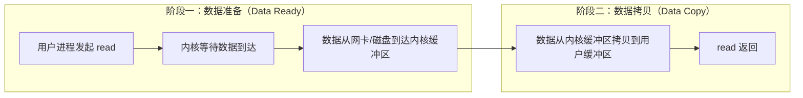
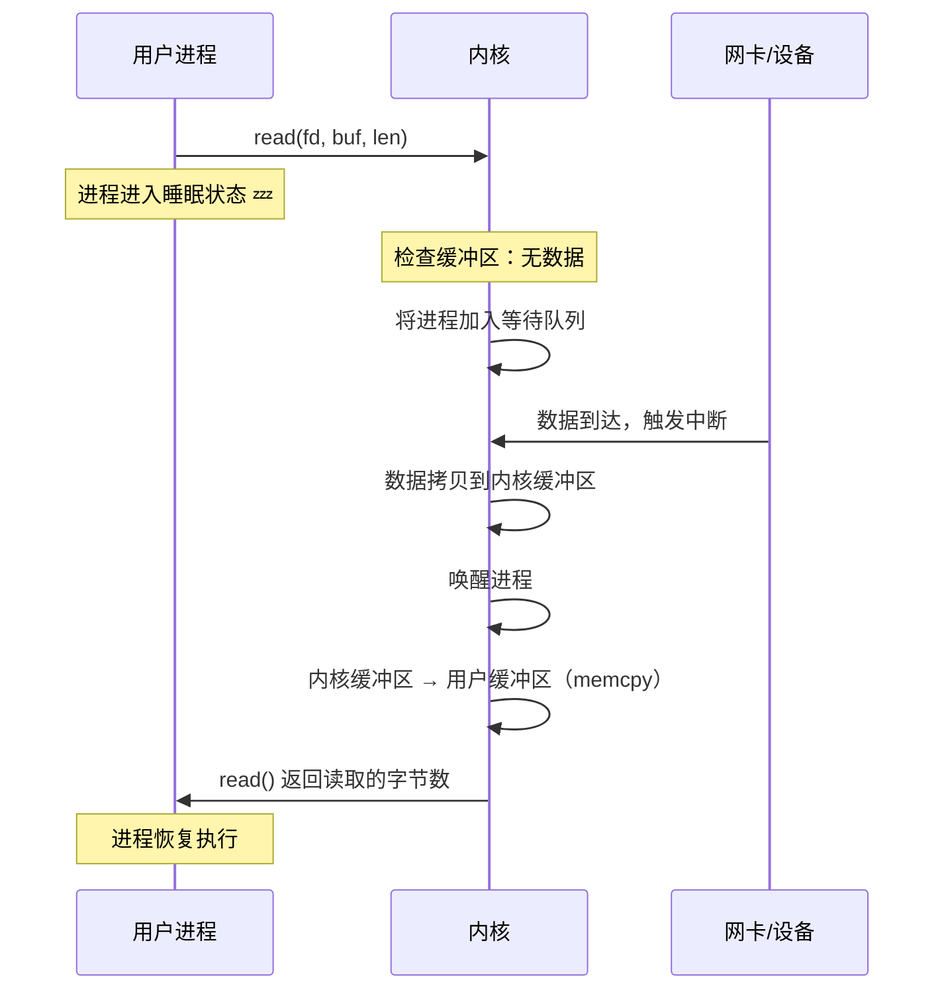
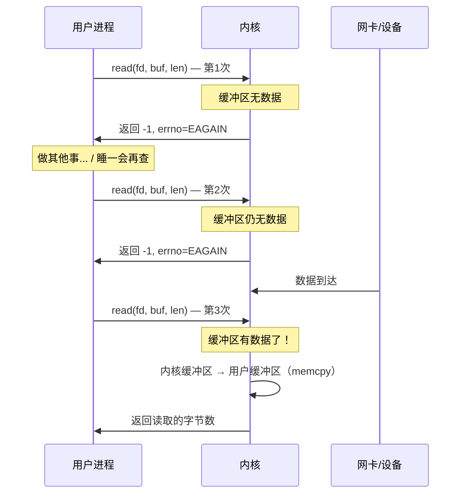
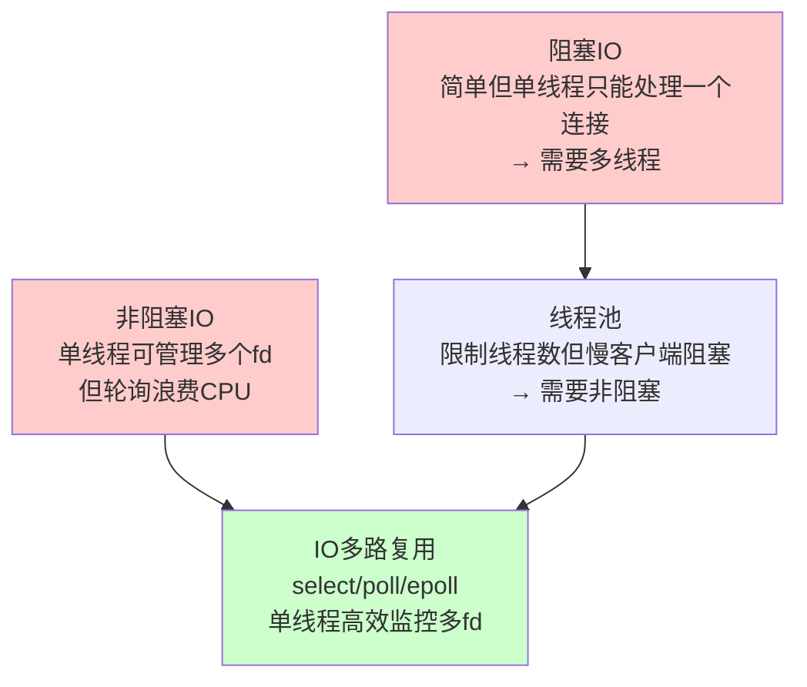

## 技巧1：阻塞IO vs 非阻塞IO

阻塞IO（Blocking I/O）和非阻塞IO（Non-blocking I/O）是Linux五种经典IO模型中最基础的两种。它们构成了理解IO多路复用、信号驱动IO和异步IO的认知基石。本篇将从内核原理出发，通过完整的C语言和Python实现，深入对比两种模型在行为、性能和适用场景上的本质差异。

---

### 1. 前置知识：IO操作的两阶段模型

在深入阻塞和非阻塞IO之前，必须先理解所有IO操作都包含的两个阶段。这是W. Richard Stevens在《UNIX网络编程》中提出的经典模型：



| 阶段 | 描述 | 涉及的内核操作 |
|------|------|---------------|
| 数据准备 | 内核等待外部数据到达（网络包到达网卡、磁盘扇区读取完成等） | 网卡中断 → DMA → socket接收缓冲区 |
| 数据拷贝 | 内核将数据从内核空间（如socket缓冲区）复制到用户进程的缓冲区 | `memcpy()` 从内核态到用户态 |

**关键认知**：五种IO模型的区别仅在于这两个阶段中，用户进程的"等待方式"不同。阻塞IO和非阻塞IO的区别集中在**阶段一**——数据尚未就绪时，进程如何应对。

---

### 2. 阻塞IO（Blocking I/O）

#### 2.1 基本原理

阻塞IO是最直观的IO模型。当用户进程发起一个IO系统调用（如`read()`、`recv()`）时，如果数据尚未就绪，**内核会将该进程挂起（睡眠），直到数据准备完毕并完成拷贝后才返回**。在整个等待期间，进程不会消耗CPU时间片，而是被放入等待队列中。



#### 2.2 内核实现细节

以Linux内核为例，当用户调用`read()`时，内核的调用链如下：

用户空间: read(fd, buf, len)
    ↓ 系统调用
内核空间: sys_read() → vfs_read()
    ↓
    → __vfs_read() → call_read_iter()
    → sock_read_iter() (网络socket)
    → tcp_recvmsg()
        ↓
    → sk_wait_data()  // 关键：阻塞等待
        → wait_event_interruptible(sk_sleep(sk), ...)
            → schedule()  // 进程让出CPU，进入睡眠

`sk_wait_data()`是阻塞的核心。它调用`schedule()`将当前进程从运行队列移除，放入socket的等待队列。进程状态从`TASK_RUNNING`变为`TASK_INTERRUPTIBLE`，直到数据到达时被唤醒。

#### 2.3 完整C语言示例：阻塞IO Echo Server

```c
#include <stdio.h>
#include <stdlib.h>
#include <string.h>
#include <unistd.h>
#include <errno.h>
#include <sys/socket.h>
#include <netinet/in.h>
#include <arpa/inet.h>

#define PORT 8080
#define BUF_SIZE 4096

int main() {
    int server_fd, client_fd;
    struct sockaddr_in server_addr, client_addr;
    socklen_t addr_len = sizeof(client_addr);
    char buf[BUF_SIZE];
    ssize_t n;

    /* 1. 创建socket */
    server_fd = socket(AF_INET, SOCK_STREAM, 0);
    if (server_fd < 0) {
        perror("socket");
        exit(EXIT_FAILURE);
    }

    /* 2. 设置socket选项 */
    int opt = 1;
    setsockopt(server_fd, SOL_SOCKET, SO_REUSEADDR, &amp;opt, sizeof(opt));

    /* 3. 绑定地址 */
    memset(&amp;server_addr, 0, sizeof(server_addr));
    server_addr.sin_family = AF_INET;
    server_addr.sin_addr.s_addr = INADDR_ANY;
    server_addr.sin_port = htons(PORT);

    if (bind(server_fd, (struct sockaddr *)&amp;server_addr,
             sizeof(server_addr)) < 0) {
        perror("bind");
        exit(EXIT_FAILURE);
    }

    /* 4. 开始监听 */
    if (listen(server_fd, 128) < 0) {
        perror("listen");
        exit(EXIT_FAILURE);
    }

    printf("Blocking IO server listening on port %d\n", PORT);

    /* 5. 主循环：一次处理一个客户端 */
    while (1) {
        /* accept() 是阻塞的 —— 没有新连接时进程睡眠 */
        client_fd = accept(server_fd,
                           (struct sockaddr *)&amp;client_addr,
                           &amp;addr_len);
        if (client_fd < 0) {
            perror("accept");
            continue;
        }

        printf("Client connected: %s:%d\n",
               inet_ntoa(client_addr.sin_addr),
               ntohs(client_addr.sin_port));

        /* 逐个处理客户端请求（一问一答模式） */
        while (1) {
            /*
             * read() 是阻塞的 —— 没有数据时进程睡眠
             * 当客户端关闭连接时返回 0
             * 出错时返回 -1
             */
            n = read(client_fd, buf, BUF_SIZE);
            if (n < 0) {
                perror("read");
                break;
            }
            if (n == 0) {
                /* 客户端关闭了连接 */
                printf("Client disconnected\n");
                break;
            }

            /* 回显数据 */
            ssize_t written = 0;
            while (written < n) {
                ssize_t w = write(client_fd, buf + written, n - written);
                if (w < 0) {
                    perror("write");
                    break;
                }
                written += w;
            }
        }

        close(client_fd);
    }

    close(server_fd);
    return 0;
}
```

#### 2.4 阻塞IO的行为特征

| 特征 | 说明 |
|------|------|
| 进程状态 | 数据未就绪时，进程处于 `TASK_INTERRUPTIBLE` 状态（可被信号中断） |
| CPU占用 | 极低 — 进程睡眠时不消耗CPU时间片 |
| 延迟特性 | 响应延迟 = 等待时间 + 拷贝时间，无轮询开销 |
| 并发能力 | 单线程只能处理一个连接的IO — 要并发必须多线程/多进程 |
| 编程模型 | 最简单 — 顺序执行，符合人类线性思维 |

#### 2.5 阻塞IO的致命缺陷

**问题一：单连接独占线程**

阻塞IO模型下，一个线程在处理某个连接的`read()`时被阻塞，就无法处理其他连接。要支持N个并发连接，就需要N个线程（或进程），这带来巨大的资源开销：

| 并发连接数 | 线程数 | 线程栈内存（默认8MB） | 上下文切换开销 |
|-----------|--------|---------------------|---------------|
| 100 | 100 | 800 MB | 可接受 |
| 1,000 | 1,000 | 8 GB | 严重 |
| 10,000 | 10,000 | 80 GB | 系统崩溃 |

这就是C10K问题的根源之一。

**问题二：无法同时处理"等待"和"计算"**

假设服务器需要同时等待客户端数据和处理计算任务。阻塞IO下，线程在`read()`时被挂起，无法执行计算任务。反之亦然。

**问题三：慢客户端拖垮整个线程**

一个客户端发送数据极慢（如移动端弱网），会持续阻塞该线程，即使其他客户端已就绪也无法处理。

---

### 3. 非阻塞IO（Non-blocking I/O）

#### 3.1 基本原理

非阻塞IO的核心思想是：**将文件描述符设置为非阻塞模式后，如果数据未就绪，`read()`不会阻塞，而是立即返回`-1`，并将`errno`设置为`EAGAIN`（或`EWOULDBLOCK`）**。进程可以自由地轮询检查或执行其他任务。



#### 3.2 如何设置非阻塞模式

非阻塞IO的关键操作是通过`fcntl()`系统调用修改文件描述符的状态标志：

```c
#include <fcntl.h>
#include <unistd.h>

int set_nonblocking(int fd) {
    int flags = fcntl(fd, F_GETFL, 0);    // 获取当前标志
    if (flags == -1) {
        perror("fcntl F_GETFL");
        return -1;
    }
    flags |= O_NONBLOCK;                    // 添加非阻塞标志
    if (fcntl(fd, F_SETFL, flags) == -1) {  // 设置新标志
        perror("fcntl F_SETFL");
        return -1;
    }
    return 0;
}
```

`F_GETFL`和`F_SETFL`是`fcntl()`的两个命令：
- `F_GETFL`（Get Flags）：获取文件描述符的当前状态标志（如`O_RDONLY`、`O_NONBLOCK`、`O_APPEND`等）
- `F_SETFL`（Set Flags）：设置文件描述符的状态标志

除了`fcntl()`，socket创建时也可以直接设置非阻塞：

```c
// 方法二：创建socket时直接指定
int fd = socket(AF_INET, SOCK_STREAM | SOCK_NONBLOCK, 0);
// SOCK_NONBLOCK 在 Linux 2.6.27+ 可用
```

#### 3.3 `EAGAIN`与`EWOULDBLOCK`的关系

在Linux系统中，`EAGAIN`和`EWOULDBLOCK`具有**相同的值（11）**，是同一错误码的两个名字：

```c
// Linux: /usr/include/asm-generic/errno.h
#define EAGAIN     11   /* Try again */
#define EWOULDBLOCK EAGAIN  /* Operation would block */
```

**语义区别**（虽然值相同，但含义不同）：
- `EAGAIN`：资源暂时不可用，稍后重试 — 用于普通文件、管道等
- `EWOULDBLOCK`：操作会导致阻塞，但fd被设为非阻塞 — 用于socket、管道等

在实际编程中，两者通常一起检查：

```c
if (n < 0) {
    if (errno == EAGAIN || errno == EWOULDBLOCK) {
        /* 数据还没准备好，稍后重试 */
        // 非致命错误，不要关闭连接
    } else {
        /* 真正的错误 */
        perror("read");
        close(fd);
    }
}
```

#### 3.4 完整C语言示例：非阻塞IO Echo Server

```c
#include <stdio.h>
#include <stdlib.h>
#include <string.h>
#include <unistd.h>
#include <errno.h>
#include <fcntl.h>
#include <sys/socket.h>
#include <netinet/in.h>
#include <arpa/inet.h>
#include <time.h>

#define PORT 8080
#define BUF_SIZE 4096
#define MAX_CLIENTS 1024

/* 设置fd为非阻塞模式 */
static int set_nonblocking(int fd) {
    int flags = fcntl(fd, F_GETFL, 0);
    if (flags == -1) return -1;
    return fcntl(fd, F_SETFL, flags | O_NONBLOCK);
}

/* 客户端状态结构 */
typedef struct {
    int fd;
    int active;
    char buf[BUF_SIZE];
    size_t buf_len;       /* 缓冲区中已读取的字节数 */
    time_t last_active;   /* 最后活动时间 */
} client_t;

static client_t clients[MAX_CLIENTS];
static int client_count = 0;

/* 添加客户端 */
static int add_client(int fd) {
    if (client_count >= MAX_CLIENTS) return -1;
    clients[client_count].fd = fd;
    clients[client_count].active = 1;
    clients[client_count].buf_len = 0;
    clients[client_count].last_active = time(NULL);
    client_count++;
    return 0;
}

/* 移除客户端 */
static void remove_client(int idx) {
    close(clients[idx].fd);
    clients[idx] = clients[client_count - 1];
    client_count--;
}

int main() {
    int server_fd;
    struct sockaddr_in server_addr;
    int opt = 1;

    /* 1. 创建并设置服务器socket */
    server_fd = socket(AF_INET, SOCK_STREAM, 0);
    setsockopt(server_fd, SOL_SOCKET, SO_REUSEADDR, &amp;opt, sizeof(opt));

    /* 关键：将监听socket也设为非阻塞 */
    set_nonblocking(server_fd);

    memset(&amp;server_addr, 0, sizeof(server_addr));
    server_addr.sin_family = AF_INET;
    server_addr.sin_addr.s_addr = INADDR_ANY;
    server_addr.sin_port = htons(PORT);

    if (bind(server_fd, (struct sockaddr *)&amp;server_addr,
             sizeof(server_addr)) < 0) {
        perror("bind");
        exit(EXIT_FAILURE);
    }

    if (listen(server_fd, 128) < 0) {
        perror("listen");
        exit(EXIT_FAILURE);
    }

    printf("Non-blocking IO server on port %d\n", PORT);

    /* 2. 主循环：轮询所有fd */
    while (1) {
        /* --- 尝试接受新连接 --- */
        while (1) {
            struct sockaddr_in client_addr;
            socklen_t addr_len = sizeof(client_addr);
            int client_fd = accept(server_fd,
                                   (struct sockaddr *)&amp;client_addr,
                                   &amp;addr_len);
            if (client_fd < 0) {
                if (errno == EAGAIN || errno == EWOULDBLOCK) {
                    break;  /* 没有更多待接受的连接 */
                }
                perror("accept");
                break;
            }

            set_nonblocking(client_fd);
            if (add_client(client_fd) == 0) {
                printf("New client: %s:%d (total: %d)\n",
                       inet_ntoa(client_addr.sin_addr),
                       ntohs(client_addr.sin_port),
                       client_count);
            } else {
                printf("Max clients reached, rejecting %s:%d\n",
                       inet_ntoa(client_addr.sin_addr),
                       ntohs(client_addr.sin_port));
                close(client_fd);
            }
        }

        /* --- 处理所有已连接客户端的IO --- */
        int i = 0;
        while (i < client_count) {
            char tmp[BUF_SIZE];
            ssize_t n = read(clients[i].fd, tmp, BUF_SIZE);

            if (n > 0) {
                /* 成功读到数据，回显 */
                clients[i].last_active = time(NULL);
                ssize_t written = 0;
                while (written < n) {
                    ssize_t w = write(clients[i].fd,
                                      tmp + written, n - written);
                    if (w < 0) {
                        if (errno == EAGAIN || errno == EWOULDBLOCK) {
                            break;  /* 写缓冲区满，稍后重试 */
                        }
                        remove_client(i);
                        goto next_client;
                    }
                    written += w;
                }
            } else if (n == 0) {
                /* 客户端关闭连接 */
                printf("Client fd=%d disconnected\n", clients[i].fd);
                remove_client(i);
                continue;  /* 注意：不需要i++，因为remove_client交换了元素 */
            } else {
                if (errno == EAGAIN || errno == EWOULDBLOCK) {
                    /* 数据还没到，正常 — 非阻塞IO的预期行为 */
                } else {
                    /* 真正的错误 */
                    perror("read");
                    remove_client(i);
                    continue;
                }
            }

            i++;
            next_client:;
        }

        /*
         * 注意：纯非阻塞IO轮询会100%占用CPU！
         * 实际应用中应加入 usleep() 或使用 select/poll/epoll
         */
        usleep(1000);  /* 暂停1ms，降低CPU占用（但这只是权宜之计） */
    }

    close(server_fd);
    return 0;
}
```

#### 3.5 非阻塞IO的行为特征

| 特征 | 说明 |
|------|------|
| 进程状态 | 始终保持`TASK_RUNNING`，不会被挂起 |
| CPU占用 | **极高** — 如果不加sleep轮询，会100%占用CPU |
| 延迟特性 | 响应延迟取决于轮询间隔（polling interval） |
| 并发能力 | 单线程可管理多个fd（通过轮询），但轮询本身浪费资源 |
| 编程模型 | 需要手动管理状态机，处理`EAGAIN`，复杂度高于阻塞IO |

---

### 4. 深度对比：阻塞IO vs 非阻塞IO

#### 4.1 系统调用行为对比

```c
/* 同样的 read() 调用，在两种模式下的不同表现 */

/* ===== 阻塞模式 ===== */
ssize_t n = read(fd, buf, 1024);
// 如果没有数据：进程睡眠...（几毫秒到几分钟）
// 直到数据到达才返回
// 返回值：> 0（读取的字节数）| 0（EOF）| -1（错误）

/* ===== 非阻塞模式 ===== */
ssize_t n = read(fd, buf, 1024);
// 如果没有数据：立即返回 -1
// errno == EAGAIN 或 EWOULDBLOCK
// 需要自己决定何时重试
```

#### 4.2 性能对比

下表展示了两种模型在不同场景下的性能表现：

| 指标 | 阻塞IO（多线程） | 非阻塞IO（轮询） |
|------|------------------|------------------|
| 连接数=100时延迟 | ~0.1ms（线程直接阻塞） | ~0.05ms（取决于轮询间隔） |
| 连接数=1000时延迟 | ~0.1ms（但线程数爆炸） | ~0.5ms（轮询开销增大） |
| 连接数=10000时 | 不可行（线程资源耗尽） | 不可行（CPU 100%） |
| CPU利用率（空闲时） | ~0%（进程睡眠） | 100%（忙等轮询） |
| 内存开销（1000连接） | ~8GB（线程栈） | ~几MB（仅fd和缓冲区） |
| 上下文切换 | 频繁（线程间切换） | 无（单线程轮询） |

#### 4.3 行为差异的内核视角

```mermaid
graph TD
    subgraph "阻塞IO — read() 调用"
        A1[read() 调用] --> B1{内核缓冲区有数据?}
        B1 -->|是| C1[拷贝数据到用户空间]
        C1 --> D1[返回字节数]
        B1 -->|否| E1[进程状态 → TASK_INTERRUPTIBLE]
        E1 --> F1[schedule - 让出CPU]
        F1 --> G1[网卡中断唤醒进程]
        G1 --> C1
    end

    subgraph "非阻塞IO — read() 调用"
        A2[read() 调用] --> B2{内核缓冲区有数据?}
        B2 -->|是| C2[拷贝数据到用户空间]
        C2 --> D2[返回字节数]
        B2 -->|否| E2[立即返回 -1]
        E2 --> F2[errno = EAGAIN]
    end
```

#### 4.4 何时选择哪种模型

| 场景 | 推荐模型 | 原因 |
|------|---------|------|
| 单客户端嵌入式设备 | 阻塞IO | 简单可靠，CPU资源有限 |
| SSH/Telnet服务器 | 阻塞IO + 多进程 | 每个会话独立，阻塞不影响其他会话 |
| 数据库连接池 | 阻塞IO | 连接数有限且可控，阻塞语义清晰 |
| 游戏服务器 | 非阻塞IO + epoll | 低延迟要求，需要同时处理大量连接 |
| Web服务器 | 非阻塞IO + epoll | 高并发，短连接为主 |
| MQTT Broker | 非阻塞IO + epoll | 海量长连接，消息延迟敏感 |

---

### 5. 阻塞IO的线程模型演进

既然阻塞IO的致命缺陷是"单线程只能处理一个连接"，自然的解决方案就是为每个连接分配一个线程。

#### 5.1 Thread-per-Connection 模型

```c
#include <pthread.h>

void *client_handler(void *arg) {
    int client_fd = *(int *)arg;
    free(arg);

    char buf[4096];
    ssize_t n;

    /* 每个线程独立处理一个客户端 */
    while ((n = read(client_fd, buf, sizeof(buf))) > 0) {
        write(client_fd, buf, n);
    }

    close(client_fd);
    return NULL;
}

int main() {
    /* ... socket创建、绑定、监听（同前） ... */

    while (1) {
        int client_fd = accept(server_fd, NULL, NULL);
        if (client_fd < 0) continue;

        pthread_t tid;
        int *fd_ptr = malloc(sizeof(int));
        *fd_ptr = client_fd;

        /* 为每个连接创建一个新线程 */
        if (pthread_create(&amp;tid, NULL, client_handler, fd_ptr) != 0) {
            perror("pthread_create");
            close(client_fd);
            free(fd_ptr);
        }
        pthread_detach(tid);  /* 分离线程，自动回收资源 */
    }
}
```

#### 5.2 模型的局限性与进化

Thread-per-Connection（每个连接一个线程）
    ↓ 缺陷：线程数量随连接数线性增长
线程池模型（固定数量的工作线程）
    ↓ 缺陷：线程池大小有限，无法处理突发连接
非阻塞IO + IO多路复用（单线程监控多fd）
    ↓ 缺陷：select/poll有fd数量限制
epoll/kqueue（高效的事件通知机制）
    ↓ 缺陷：仍需用户态处理所有IO
异步IO / io_uring（内核完成所有操作）

线程池模型是阻塞IO的改良版：

```c
/* 简化的线程池模型 */
#define POOL_SIZE 64

pthread_t pool[POOL_SIZE];
pthread_mutex_t queue_lock = PTHREAD_MUTEX_INITIALIZER;
pthread_cond_t queue_cond = PTHREAD_COND_INITIALIZER;
int task_queue[MAX_CLIENTS];
int queue_head = 0, queue_tail = 0;

void *worker_thread(void *arg) {
    while (1) {
        int client_fd;

        /* 从任务队列取任务（阻塞等待） */
        pthread_mutex_lock(&amp;queue_lock);
        while (queue_head == queue_tail) {
            pthread_cond_wait(&amp;queue_cond, &amp;queue_lock);
        }
        client_fd = task_queue[queue_head++];
        pthread_mutex_unlock(&amp;queue_lock);

        /* 处理客户端（阻塞IO） */
        char buf[4096];
        ssize_t n;
        while ((n = read(client_fd, buf, sizeof(buf))) > 0) {
            write(client_fd, buf, n);
        }
        close(client_fd);
    }
    return NULL;
}

int main() {
    /* 创建线程池 */
    for (int i = 0; i < POOL_SIZE; i++) {
        pthread_create(&amp;pool[i], NULL, worker_thread, NULL);
    }

    while (1) {
        int client_fd = accept(server_fd, NULL, NULL);
        if (client_fd < 0) continue;

        /* 将任务加入队列 */
        pthread_mutex_lock(&amp;queue_lock);
        task_queue[queue_tail++] = client_fd;
        pthread_cond_signal(&amp;queue_cond);
        pthread_mutex_unlock(&amp;queue_lock);
    }
}
```

**线程池的权衡**：
- 线程数固定（如64），不会随连接数增长
- 但如果所有线程都在处理慢客户端，新连接仍然会被阻塞
- 这就是为什么高并发场景最终走向了非阻塞IO + 事件驱动

---

### 6. 非阻塞IO的编程陷阱与正确实践

#### 6.1 陷阱一：忘记检查`EAGAIN`

```c
/* ❌ 错误：把 EAGAIN 当作致命错误 */
n = read(fd, buf, sizeof(buf));
if (n < 0) {
    perror("read");
    close(fd);  /* 不应该关闭连接！ */
}

/* ✅ 正确：区分 EAGAIN 和真正的错误 */
n = read(fd, buf, sizeof(buf));
if (n < 0) {
    if (errno == EAGAIN || errno == EWOULDBLOCK) {
        /* 数据未就绪，稍后重试 — 不是错误 */
        return;  /* 或标记为待重试 */
    }
    /* 其他错误才关闭连接 */
    perror("read");
    close(fd);
}
```

#### 6.2 陷阱二：非阻塞`write()`的部分写入

非阻塞的`write()`可能只写入了部分数据（返回值小于请求写入的长度），必须循环写入：

```c
/* ❌ 错误：假设 write 一次性写完 */
ssize_t w = write(fd, buf, total_len);
if (w < 0) { /* error */ }

/* ✅ 正确：处理部分写入 */
ssize_t written = 0;
while (written < total_len) {
    ssize_t w = write(fd, buf + written, total_len - written);
    if (w > 0) {
        written += w;
    } else if (w < 0) {
        if (errno == EAGAIN || errno == EWOULDBLOCK) {
            /* 写缓冲区已满，等待可写事件后重试 */
            break;
        }
        /* 真正的错误 */
        perror("write");
        return -1;
    }
}
/* written < total_len 时，需要注册 POLLOUT 事件 */
```

#### 6.3 陷阱三：信号中断导致`EINTR`

即使在非阻塞模式下，系统调用也可能被信号中断：

```c
ssize_t n = read(fd, buf, sizeof(buf));
if (n < 0) {
    if (errno == EINTR) {
        /* 被信号中断，应该重试，不是错误 */
        goto retry_read;
    }
    if (errno == EAGAIN || errno == EWOULDBLOCK) {
        /* 数据未就绪 */
    } else {
        /* 真正的错误 */
    }
}
```

#### 6.4 陷阱四：忙等轮询（Busy Polling）浪费CPU

纯非阻塞IO的轮询如果不加任何休眠，会将CPU推到100%：

```c
/* ❌ 忙等：CPU 100% */
while (1) {
    n = read(fd, buf, sizeof(buf));
    if (n > 0) { process(buf, n); }
    /* 没有任何 sleep — 一直在空转 */
}

/* ✅ 带超时的轮询 */
struct timeval tv;
while (1) {
    tv.tv_sec = 0;
    tv.tv_usec = 10000;  /* 10ms */

    fd_set read_fds;
    FD_ZERO(&amp;read_fds);
    FD_SET(fd, &amp;read_fds);

    int ready = select(fd + 1, &amp;read_fds, NULL, NULL, &amp;tv);
    if (ready > 0 &amp;&amp; FD_ISSET(fd, &amp;read_fds)) {
        n = read(fd, buf, sizeof(buf));
        if (n > 0) process(buf, n);
    }
    /* ready == 0 表示超时，可以做其他事 */
}
```

**注意**：一旦开始用`select()`来辅助非阻塞IO，实际上你已经在使用IO多路复用了——这就是模型演进的自然路径。

#### 6.5 陷阱五：粘包问题的处理

非阻塞`read()`可能读取到半条消息（TCP是流协议，没有消息边界）。需要自己实现消息分帧：

```c
/* 简单的长度前缀协议 */
typedef struct {
    int msg_len;
    char payload[];
} __attribute__((packed)) message_t;

/* 在客户端结构中维护读缓冲区 */
typedef struct {
    int fd;
    char read_buf[65536];
    size_t read_pos;     /* 缓冲区写入位置 */
    size_t parse_pos;    /* 解析位置 */
} connection_t;

/* 读取并尝试解析完整消息 */
int try_parse_message(connection_t *conn, message_t **out_msg) {
    ssize_t n = read(conn->fd,
                     conn->read_buf + conn->read_pos,
                     sizeof(conn->read_buf) - conn->read_pos);

    if (n > 0) {
        conn->read_pos += n;
    } else if (n == 0) {
        return -1;  /* 连接关闭 */
    } else {
        if (errno != EAGAIN &amp;&amp; errno != EWOULDBLOCK) {
            return -1;  /* 真正的错误 */
        }
    }

    /* 尝试解析 */
    while (conn->parse_pos + sizeof(int) <= conn->read_pos) {
        int msg_len = *(int *)(conn->read_buf + conn->parse_pos);
        size_t total = sizeof(int) + msg_len;

        if (conn->parse_pos + total > conn->read_pos) {
            break;  /* 数据不够，等待更多数据 */
        }

        *out_msg = (message_t *)(conn->read_buf + conn->parse_pos);
        conn->parse_pos += total;
        return 0;  /* 成功解析一条消息 */
    }

    return 1;  /* 数据不够，继续等待 */
}
```

---

### 7. Python中的阻塞IO与非阻塞IO

#### 7.1 Python阻塞IO

Python的socket默认就是阻塞模式：

```python
import socket

def blocking_server(host='0.0.0.0', port=8080):
    """阻塞IO echo server"""
    server = socket.socket(socket.AF_INET, socket.SOCK_STREAM)
    server.setsockopt(socket.SOL_SOCKET, socket.SO_REUSEADDR, 1)
    server.bind((host, port))
    server.listen(128)

    print(f"Blocking server on {host}:{port}")

    while True:
        # accept() 阻塞 — 等待新连接
        client, addr = server.accept()
        print(f"Connection from {addr}")

        try:
            while True:
                # recv() 阻塞 — 等待数据
                data = client.recv(4096)
                if not data:
                    print(f"Client {addr} disconnected")
                    break
                # 回显
                client.sendall(data)
        finally:
            client.close()

if __name__ == '__main__':
    blocking_server()
```

#### 7.2 Python非阻塞IO

```python
import socket
import time

def nonblocking_server(host='0.0.0.0', port=8080):
    """非阻塞IO echo server — 演示用，实际应使用selectors"""
    server = socket.socket(socket.AF_INET, socket.SOCK_STREAM)
    server.setsockopt(socket.SOL_SOCKET, socket.SO_REUSEADDR, 1)
    server.setblocking(False)  # 关键：设为非阻塞
    server.bind((host, port))
    server.listen(128)

    clients = {}  # fd -> (socket, buffer)

    print(f"Non-blocking server on {host}:{port}")

    while True:
        # --- 尝试接受新连接 ---
        while True:
            try:
                client, addr = server.accept()
                client.setblocking(False)
                clients[client.fileno()] = (client, b'')
                print(f"New: {addr}")
            except BlockingIOError:
                break  # 没有更多新连接

        # --- 处理所有客户端 ---
        for fd in list(clients.keys()):
            sock, buf = clients[fd]
            try:
                data = sock.recv(4096)
                if data:
                    sock.sendall(data)  # 回显
                else:
                    print(f"Client {fd} disconnected")
                    sock.close()
                    del clients[fd]
            except BlockingIOError:
                pass  # 数据还没到，正常

        # 避免CPU 100%
        time.sleep(0.001)  # 1ms

if __name__ == '__main__':
    nonblocking_server()
```

#### 7.3 Python的推荐方式：selectors模块

Python 3.4+的`selectors`模块封装了底层的`epoll`/`kqueue`/`select`，是处理非阻塞IO的标准方式：

```python
import selectors
import socket

sel = selectors.DefaultSelector()  # Linux下自动选择epoll

def accept(sock, mask):
    """新连接到来时的处理函数"""
    conn, addr = sock.accept()
    print(f"Connected: {addr}")
    conn.setblocking(False)
    sel.register(conn, selectors.EVENT_READ, read)

def read(conn, mask):
    """数据可读时的处理函数"""
    data = conn.recv(4096)
    if data:
        conn.sendall(data)  # 回显
    else:
        print(f"Disconnected: {conn.getpeername()}")
        sel.unregister(conn)
        conn.close()

# 创建服务器
server = socket.socket(socket.AF_INET, socket.SOCK_STREAM)
server.setsockopt(socket.SOL_SOCKET, socket.SO_REUSEADDR, 1)
server.bind(('0.0.0.0', 8080))
server.listen(128)
server.setblocking(False)

# 注册监听socket的可读事件
sel.register(server, selectors.EVENT_READ, accept)

print("Server using selectors (epoll on Linux) on port 8080")

# 事件循环
while True:
    events = sel.select(timeout=None)  # 阻塞等待事件
    for key, mask in events:
        callback = key.data
        callback(key.fileobj, mask)
```

`selectors`模块隐藏了`EAGAIN`、`EWOULDBLOCK`等底层细节，让非阻塞IO的编程体验接近阻塞IO的简洁性，同时保持了事件驱动的高性能。

---

### 8. 性能测试与调优

#### 8.1 用`strace`观察系统调用行为

通过`strace`可以直观看到两种模型的系统调用差异：

```bash
# 阻塞IO：read() 会阻塞，在strace中表现为长时间停留
strace -e trace=read,write -T ./blocking_server

# 非阻塞IO：read() 立即返回，可以看到 EAGAIN
strace -e trace=read,write -T ./nonblocking_server
```

输出对比：

# 阻塞模式 — read 耗时 2.5 秒
read(5, "hello", 4096)          = 5 <2.503284>
write(5, "hello", 5)            = 5 <0.000045>

# 非阻塞模式 — read 立即返回，返回 EAGAIN
read(5, 0x7ffd2a3b4c00, 4096)   = -1 EAGAIN (Resource temporarily unavailable) <0.000012>
read(5, 0x7ffd2a3b4c00, 4096)   = -1 EAGAIN (Resource temporarily unavailable) <0.000010>
read(5, "hello", 4096)          = 5 <0.000015>  # 数据到达

#### 8.2 用`perf`分析IO瓶颈

```bash
# 对比两种模型的CPU使用情况
perf stat -e context-switches,cpu-migrations,page-faults ./blocking_server &amp;
perf stat -e context-switches,cpu-migrations,page-faults ./nonblocking_server &amp;

# 查看热点函数
perf top -p <pid>
```

#### 8.3 用`ss`和`/proc`监控socket状态

```bash
# 查看所有socket的状态
ss -anp | head -20

# 查看TCP连接统计
cat /proc/net/snmp | grep Tcp

# 查看socket缓冲区大小
cat /proc/sys/net/core/rmem_default    # 接收缓冲区默认大小
cat /proc/sys/net/core/wmem_default    # 发送缓冲区默认大小
cat /proc/sys/net/ipv4/tcp_rmem        # TCP接收缓冲区范围
```

---

### 9. 常见误区与纠正

| 误区 | 事实 | 正确做法 |
|------|------|---------|
| "非阻塞IO一定比阻塞IO快" | 非阻塞IO的"快"来自轮询间隔的缩短，但轮询本身消耗CPU。在低并发场景下，阻塞IO的延迟更低（无需轮询） | 根据并发量选择：低并发用阻塞IO，高并发用非阻塞IO + 事件驱动 |
| "非阻塞IO不需要多线程" | 非阻塞IO确实可以在单线程中管理多个fd，但CPU密集型任务仍需要多线程 | 非阻塞IO + 线程池是常见组合 |
| "`EAGAIN`就是错误" | `EAGAIN`是非阻塞IO的正常返回，表示"数据暂时没准备好" | 区分`EAGAIN`和真正的错误码 |
| "阻塞IO的线程会被OS自动回收" | 线程需要正确join或detach，否则资源泄漏 | 使用`pthread_detach()`或`pthread_join()` |
| "socket默认是阻塞的" | 这是对的，但需要注意继承关系——`dup()`创建的新fd继承阻塞/非阻塞属性 | 显式设置每个fd的模式 |
| "`O_NONBLOCK`只对socket有效" | `O_NONBLOCK`对所有文件描述符有效：普通文件、管道、FIFO、设备文件等 | 对管道和FIFO也可以使用非阻塞模式 |

---

### 10. 从阻塞/非阻塞到IO多路复用的自然演进

阻塞IO和非阻塞IO各有缺陷。将两者结合使用，就自然引出了IO多路复用的需求：



**演进逻辑**：
1. **阻塞IO + 多线程**：简单可靠，但线程数受限于系统资源
2. **非阻塞IO + 轮询**：单线程可管理多fd，但CPU空转
3. **非阻塞IO + select/poll/epoll**：解决了轮询浪费CPU的问题 — 这就是IO多路复用

IO多路复用是本章下一篇（技巧2）的核心内容。掌握阻塞IO和非阻塞IO是理解IO多路复用的前提。

---

### 11. 实际框架中的应用

现代高性能框架无一例外地基于非阻塞IO构建：

| 框架/系统 | 底层IO模型 | 说明 |
|-----------|-----------|------|
| Nginx | 非阻塞IO + epoll（ET模式） | 主从Reactor架构，事件驱动 |
| Redis | 非阻塞IO + epoll | 单线程事件循环（6.0+引入多线程IO） |
| Node.js | 非阻塞IO + epoll/kqueue | libuv事件循环，异步非阻塞 |
| Go netpoller | 非阻塞IO + epoll | goroutine调度器与epoll集成 |
| Netty (Java) | 非阻塞IO + epoll | Reactor模式，ChannelPipeline |
| Tornado (Python) | 非阻塞IO + epoll | 协程 + 事件循环 |

以Redis为例，其核心事件循环的简化逻辑：

// Redis ae.c — 事件循环的核心
while (!stop) {
    // 1. 计算最近的定时事件何时触发
    tvp = nearestTimer();

    // 2. 调用 epoll_wait 等待IO事件（非阻塞fd）
    n = aeApiPoll(tvp);

    // 3. 处理所有就绪的IO事件
    for (i = 0; i < n; i++) {
        // 回调处理函数
        event->rfileProc(event->fd, event->clientData, mask);
    }

    // 4. 处理定时事件（如过期键删除）
    processTimeEvents();
}

---

### 12. 本篇小结

| 维度 | 阻塞IO | 非阻塞IO |
|------|--------|---------|
| 核心行为 | 数据未就绪时进程睡眠 | 数据未就绪时立即返回`EAGAIN` |
| CPU占用 | 低（进程睡眠时不占CPU） | 高（忙等轮询时CPU 100%） |
| 编程复杂度 | 简单 | 中等（需处理`EAGAIN`、部分写入、状态机） |
| 并发能力 | 需要多线程/多进程 | 单线程可管理多fd |
| 内存开销 | 高（每线程8MB栈） | 低（仅fd和缓冲区） |
| 适用场景 | 低并发、长连接、简单服务 | 高并发、事件驱动、现代框架 |
| 演进方向 | → 线程池 → IO多路复用 | → epoll → io_uring |

**核心要点**：

1. **阻塞IO不是"坏的"** — 在简单场景下它是最清晰、最可靠的选择
2. **非阻塞IO不是"万能的"** — 它的轮询开销需要通过IO多路复用来解决
3. **`EAGAIN`是正常行为** — 不是错误，而是非阻塞IO的预期返回
4. **模型演进是自然的** — 从阻塞→多线程→非阻塞→IO多路复用，每一步都是为了解决上一步的缺陷
5. **现代框架的基石** — 所有高性能网络框架都基于非阻塞IO构建

---

### 参考文献

1. W. Richard Stevens, Stephen A. Rago, *Advanced Programming in the UNIX Environment*, 3rd Edition, 2013 — `fcntl()`和文件描述符标志的权威参考
2. W. Richard Stevens, Bill Fenner, Andrew M. Rudoff, *UNIX Network Programming, Volume 1*, 3rd Edition, 2003 — 五种IO模型的经典定义
3. Michael Kerrisk, *The Linux Programming Interface*, 2010 — 非阻塞IO和`EAGAIN`的详细说明
4. Linux man pages: `fcntl(2)`, `read(2)`, `write(2)`, `socket(7)` — 系统调用手册
5. Linux内核源码: `fs/read_write.c`, `net/ipv4/tcp.c` — `read()`和TCP接收的内核实现
