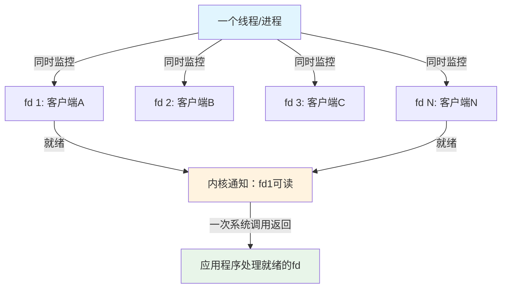
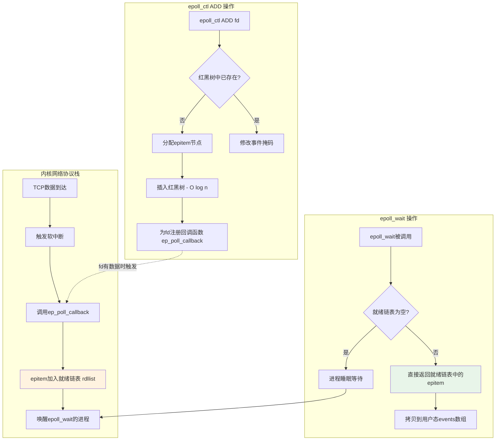
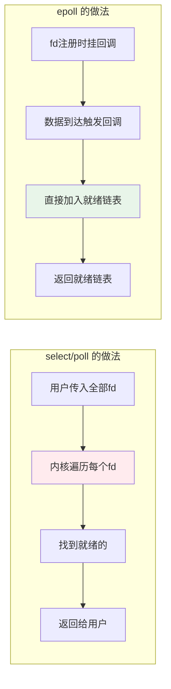
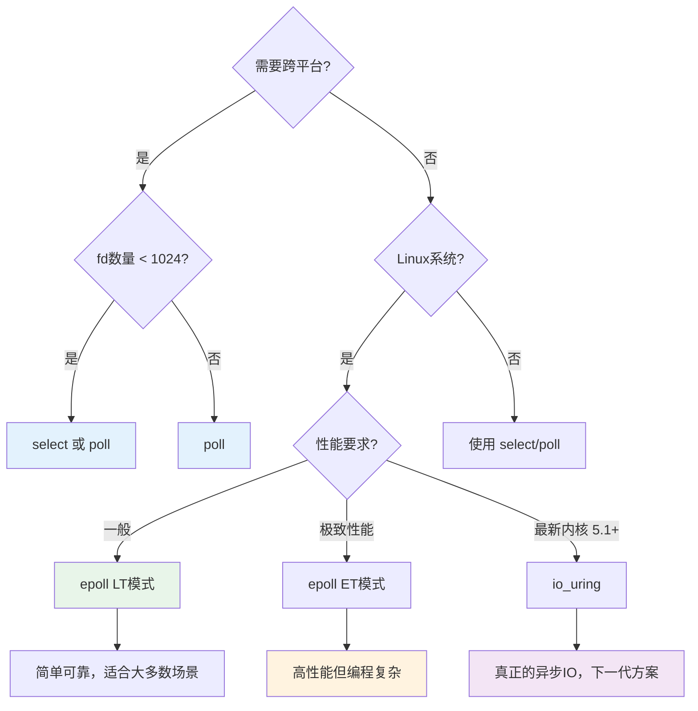

# 技巧2 IO多路复用：select / poll / epoll

## 为什么需要IO多路复用

在上一篇中，我们理解了阻塞IO和非阻塞IO的工作方式。它们各自有一个核心问题：

- **阻塞IO**：一个线程只能处理一个连接。要处理1000个并发连接，需要1000个线程。线程的内存开销（每个线程默认8MB栈空间）和上下文切换成本使得这条路走不通。
- **非阻塞IO**：虽然不会阻塞，但需要不断轮询（polling）所有fd，CPU在大量空转中浪费，`EAGAIN`错误的处理也让代码变得复杂。

**I/O多路复用（I/O Multiplexing）** 的核心思想是：**用一个进程/线程同时监控多个文件描述符（fd），当任何一个fd就绪（可读/可写/异常）时，内核通知应用程序去处理**。这就是所谓的"多路复用"——一条线程复用了对多个连接的处理能力。



从操作系统的视角看，I/O多路复用解决的是 **C10K问题**（单机同时处理10000个并发连接）。1999年 Danial Kegel 提出这个挑战时，传统的"一连接一线程"模型已经力不从心。select/poll/epoll 三种方案正是Linux系统对这个问题从萌芽到成熟的回答。

## 三种方案全景对比

先给出全局视图，后续逐一深入：

| 维度 | select | poll | epoll |
|------|--------|------|-------|
| **首次引入** | 1983年（4.2BSD） | 1986年（System V） | 2002年（Linux 2.6内核） |
| **数据结构** | 位图（fd_set） | pollfd结构体数组 | 红黑树 + 就绪链表 |
| **fd上限** | FD_SETSIZE（默认1024） | 无硬限制（受RLIMIT_NOFILE） | 无硬限制 |
| **每次调用开销** | 拷贝fd_set到内核（2次遍历） | 拷贝pollfd数组到内核 | 无需重复拷贝 |
| **就绪通知复杂度** | O(n) 遍历全部fd | O(n) 遍历全部fd | O(1) 回调直接加入就绪链表 |
| **触发方式** | 水平触发（LT） | 水平触发（LT） | LT + ET（边缘触发） |
| **跨平台** | 所有POSIX系统 | 所有POSIX系统 | 仅Linux |
| **典型使用者** | Windows select() | Solaris / 旧系统 | Nginx、Redis、Node.js |

## select：最古老的多路复用

### API详解

```c
#include <sys/select.h>

int select(int nfds, 
           fd_set *readfds,    // 监控可读的fd集合
           fd_set *writefds,   // 监控可写的fd集合
           fd_set *exceptfds,  // 监控异常的fd集合
           struct timeval *timeout);  // 超时时间

// 返回值：就绪的fd数量，-1表示错误，0表示超时
```

**fd_set 操作宏：**

```c
FD_ZERO(&amp;readfds);      // 清空集合
FD_SET(fd, &amp;readfds);   // 将fd加入集合
FD_CLR(fd, &amp;readfds);   // 从集合中移除fd
FD_ISSET(fd, &amp;readfds); // 检查fd是否在集合中
```

### 完整示例：用select实现echo服务器

```c
#include <stdio.h>
#include <stdlib.h>
#include <string.h>
#include <unistd.h>
#include <sys/socket.h>
#include <sys/select.h>
#include <netinet/in.h>
#include <arpa/inet.h>

#define PORT 8080
#define BUF_SIZE 1024

int main() {
    int server_fd, client_fd;
    struct sockaddr_in addr;
    fd_set read_fds, master_fds;
    int max_fd;
    char buf[BUF_SIZE];

    // 创建TCP监听socket
    server_fd = socket(AF_INET, SOCK_STREAM, 0);
    
    int opt = 1;
    setsockopt(server_fd, SOL_SOCKET, SO_REUSEADDR, &amp;opt, sizeof(opt));
    
    addr.sin_family = AF_INET;
    addr.sin_addr.s_addr = INADDR_ANY;
    addr.sin_port = htons(PORT);
    bind(server_fd, (struct sockaddr *)&amp;addr, sizeof(addr));
    listen(server_fd, 128);

    // 初始化master_fds，加入server_fd
    FD_ZERO(&amp;master_fds);
    FD_SET(server_fd, &amp;master_fds);
    max_fd = server_fd;

    printf("select echo server listening on port %d\n", PORT);

    while (1) {
        // select会修改read_fds，所以每次循环都要从master_fds拷贝
        read_fds = master_fds;

        // 关键：select的timeout在Linux上会被修改为剩余时间
        struct timeval tv = {1, 0};  // 1秒超时

        int ready = select(max_fd + 1, &amp;read_fds, NULL, NULL, &amp;tv);
        if (ready < 0) {
            perror("select");
            break;
        }

        // 遍历所有fd，检查谁就绪了
        for (int fd = 0; fd <= max_fd; fd++) {
            if (!FD_ISSET(fd, &amp;read_fds)) continue;

            if (fd == server_fd) {
                // 有新连接
                client_fd = accept(server_fd, NULL, NULL);
                FD_SET(client_fd, &amp;master_fds);
                if (client_fd > max_fd) max_fd = client_fd;
                printf("new connection: fd=%d\n", client_fd);
            } else {
                // 有数据可读
                int n = read(fd, buf, BUF_SIZE);
                if (n <= 0) {
                    // 客户端断开
                    close(fd);
                    FD_CLR(fd, &amp;master_fds);
                    printf("client disconnected: fd=%d\n", fd);
                } else {
                    write(fd, buf, n);  // echo回去
                }
            }
        }
    }

    close(server_fd);
    return 0;
}
```

### select的内部实现原理

select在内核中的工作流程：

1. **拷贝fd_set到内核**：用户态的fd_set通过`copy_from_user`拷贝到内核空间。fd_set本质是一个位图（bitmap），每个bit对应一个fd编号。
2. **遍历检查**：内核遍历所有被监控的fd，检查每个fd对应的socket缓冲区状态（是否有数据可读、是否有空间可写）。
3. **设置就绪标记**：对就绪的fd，在对应的位图bit上置1。
4. **超时等待**：如果没有任何fd就绪，进程进入睡眠，直到有fd就绪或超时。
5. **拷贝回用户态**：将修改后的fd_set通过`copy_to_user`拷贝回去。
6. **用户态遍历**：用户程序用`FD_ISSET`逐个检查哪些fd就绪了。

```mermaid
sequenceDiagram
    participant U as 用户程序
    participant K as 内核
    
    U->>K: select(nfds, &amp;read_fds, ..., &amp;timeout)
    Note over U,K: 1. copy_from_user: 拷贝fd_set到内核
    Note over K: 2. 遍历全部fd，检查状态
    Note over K: 3. 没有就绪 → 进程睡眠
    Note over K: 4. fd就绪 → 唤醒进程
    Note over U,K: 5. copy_to_user: 拷贝修改后的fd_set
    K-->>U: 返回就绪fd数量
    Note over U: 6. FD_ISSET逐个检查
```

### select的五大局限

| 局限 | 原因 | 影响 |
|------|------|------|
| **fd上限1024** | `fd_set`用位图实现，`FD_SETSIZE`编译时常量默认1024（可通过重定义扩大，但内核仍有限制） | 无法处理万级并发 |
| **每次调用拷贝fd_set** | 用户态→内核态→用户态三次遍历+两次拷贝 | O(n)开销随fd数增长 |
| **内核需遍历全部fd** | 位图无法索引，只能线性扫描 | 10000个fd只有10个就绪也要扫10000次 |
| **fd_set被修改** | select会修改传入的fd_set（清掉未就绪的位） | 每次调用前必须重新初始化 |
| **不支持ET模式** | 只有水平触发 | 已就绪的fd会反复通知 |

## poll：select的改良版

### API详解

```c
#include <poll.h>

int poll(struct pollfd *fds, nfds_t nfds, int timeout);

struct pollfd {
    int fd;            // 文件描述符
    short events;      // 请求的事件（输入）
    short revents;     // 实际发生的事件（输出）
};

// 常用事件标志
// POLLIN    - 数据可读（包括对端关闭）
// POLLOUT   - 写缓冲区有空间
// POLLERR   - 发生错误
// POLLHUP   - 对端关闭连接
// POLLNVAL  - fd无效
```

### poll vs select 的关键差异

```c
// select: 三个独立的fd集合，每次调用前必须重置
fd_set read_fds, write_fds;
FD_ZERO(&amp;read_fds);
FD_SET(fd, &amp;read_fds);
select(..., &amp;read_fds, &amp;write_fds, ...);
// read_fds已被修改，下次调用前必须重新FD_ZERO + FD_SET

// poll: events输入，revents输出，结构体不会被"破坏"
struct pollfd fds[2];
fds[0].fd = fd1;
fds[0].events = POLLIN;
fds[1].fd = fd2;
fds[1].events = POLLIN | POLLOUT;
poll(fds, 2, timeout);
// fds[0].revents 和 fds[1].revents 包含实际事件
// fds本身的events字段不变，下次调用无需重新设置
```

### 完整示例：用poll实现echo服务器

```c
#include <stdio.h>
#include <stdlib.h>
#include <string.h>
#include <unistd.h>
#include <sys/socket.h>
#include <poll.h>
#include <netinet/in.h>

#define PORT 8080
#define MAX_CLIENTS 1024
#define BUF_SIZE 1024

int main() {
    int server_fd;
    struct sockaddr_in addr;
    char buf[BUF_SIZE];

    server_fd = socket(AF_INET, SOCK_STREAM, 0);
    int opt = 1;
    setsockopt(server_fd, SOL_SOCKET, SO_REUSEADDR, &amp;opt, sizeof(opt));
    
    addr.sin_family = AF_INET;
    addr.sin_addr.s_addr = INADDR_ANY;
    addr.sin_port = htons(PORT);
    bind(server_fd, (struct sockaddr *)&amp;addr, sizeof(addr));
    listen(server_fd, 128);

    // pollfd数组：第一个元素是server_fd，其余是客户端
    struct pollfd fds[MAX_CLIENTS + 1];
    int nfds = 1;

    fds[0].fd = server_fd;
    fds[0].events = POLLIN;
    // revents不需要手动初始化，poll会填写

    printf("poll echo server listening on port %d\n", PORT);

    while (1) {
        int ready = poll(fds, nfds, 1000);  // 1秒超时
        if (ready < 0) {
            perror("poll");
            break;
        }

        // 检查server_fd是否有新连接
        if (fds[0].revents &amp; POLLIN) {
            int client_fd = accept(server_fd, NULL, NULL);
            if (nfds < MAX_CLIENTS + 1) {
                fds[nfds].fd = client_fd;
                fds[nfds].events = POLLIN;
                nfds++;
                printf("new connection: fd=%d, total=%d\n", client_fd, nfds - 1);
            } else {
                close(client_fd);
                printf("max clients reached, rejecting fd=%d\n", client_fd);
            }
        }

        // 检查客户端fd
        for (int i = 1; i < nfds; i++) {
            if (fds[i].revents &amp; POLLIN) {
                int n = read(fds[i].fd, buf, BUF_SIZE);
                if (n <= 0) {
                    close(fds[i].fd);
                    // 将最后一个元素移到当前位置，紧凑数组
                    fds[i] = fds[nfds - 1];
                    nfds--;
                    i--;  // 重新检查当前位置
                    printf("client disconnected: total=%d\n", nfds - 1);
                } else {
                    write(fds[i].fd, buf, n);
                }
            }
        }
    }

    close(server_fd);
    return 0;
}
```

### poll解决了什么，没解决什么

**解决了：**
- 去掉了FD_SETSIZE=1024的限制。pollfd是数组，大小由调用者决定，受`RLIMIT_NOFILE`（通常1024-65535）限制。
- 输入输出分离。events是请求，revents是结果，不会互相干扰，无需每次重新设置。

**没解决：**
- 内核仍然需要遍历全部fd检查状态 → O(n)
- 每次调用仍然需要把整个pollfd数组从用户态拷贝到内核态
- 没有边缘触发，只有水平触发

**本质：poll是select的接口改良，不是性能革命。** 在fd数量较少（< 500）时，poll和select的性能差异不大。真正的飞跃要等epoll。

## epoll：Linux的高性能方案

epoll是Linux 2.6内核（2002年）引入的I/O多路复用机制，由 Davide Libenzi 开发。它从根本上解决了select/poll的O(n)遍历问题。

### 三个系统调用

epoll的API分为三个独立的系统调用，各司其职：

```c
#include <sys/epoll.h>

// 1. 创建epoll实例
int epoll_create(int size);      // size已废弃，传任意值即可
int epoll_create1(int flags);    // 推荐使用，flags=0或EPOLL_CLOEXEC

// 2. 控制（添加/修改/删除监控的fd）
int epoll_ctl(int epfd,          // epoll实例的fd
              int op,            // EPOLL_CTL_ADD / MOD / DEL
              int fd,            // 要监控的文件描述符
              struct epoll_event *event);  // 事件配置

// 3. 等待事件
int epoll_wait(int epfd,
               struct epoll_event *events,  // 就绪事件数组（输出）
               int maxevents,               // 数组大小
               int timeout);                // 超时时间（毫秒，-1无限等待）

struct epoll_event {
    uint32_t events;    // 事件掩码
    epoll_data_t data;  // 用户自定义数据（通常存fd或指针）
};

// events常用标志
EPOLLIN      // 可读
EPOLLOUT     // 可写
EPOLLRDHUP   // 对端关闭连接（半关闭）
EPOLLERR     // 错误
EPOLLHUP     // 挂起
EPOLLET      // 边缘触发（默认是水平触发）
EPOLLEXCLUSIVE // 排他模式（解决惊群）
```

### 完整示例：用epoll实现高性能echo服务器

```c
#include <stdio.h>
#include <stdlib.h>
#include <string.h>
#include <unistd.h>
#include <sys/socket.h>
#include <sys/epoll.h>
#include <netinet/in.h>
#include <errno.h>

#define PORT 8080
#define MAX_EVENTS 64
#define BUF_SIZE 1024

int main() {
    int server_fd, epfd;
    struct sockaddr_in addr;
    struct epoll_event ev, events[MAX_EVENTS];
    char buf[BUF_SIZE];

    // 1. 创建监听socket
    server_fd = socket(AF_INET, SOCK_STREAM, 0);
    int opt = 1;
    setsockopt(server_fd, SOL_SOCKET, SO_REUSEADDR, &amp;opt, sizeof(opt));
    
    addr.sin_family = AF_INET;
    addr.sin_addr.s_addr = INADDR_ANY;
    addr.sin_port = htons(PORT);
    bind(server_fd, (struct sockaddr *)&amp;addr, sizeof(addr));
    listen(server_fd, 128);

    // 2. 创建epoll实例
    epfd = epoll_create1(EPOLL_CLOEXEC);
    if (epfd < 0) {
        perror("epoll_create1");
        exit(1);
    }

    // 3. 将server_fd加入epoll监控
    ev.events = EPOLLIN;
    ev.data.fd = server_fd;
    epoll_ctl(epfd, EPOLL_CTL_ADD, server_fd, &amp;ev);

    printf("epoll echo server listening on port %d\n", PORT);

    int conn_count = 0;

    while (1) {
        // 4. 等待事件——只有就绪的fd才会出现在events数组中！
        int nfds = epoll_wait(epfd, events, MAX_EVENTS, 1000);
        if (nfds < 0) {
            if (errno == EINTR) continue;
            perror("epoll_wait");
            break;
        }

        // 5. 只遍历就绪的fd，不是全部fd
        for (int i = 0; i < nfds; i++) {
            if (events[i].data.fd == server_fd) {
                // 新连接
                int client_fd = accept(server_fd, NULL, NULL);
                ev.events = EPOLLIN;
                ev.data.fd = client_fd;
                epoll_ctl(epfd, EPOLL_CTL_ADD, client_fd, &amp;ev);
                conn_count++;
                printf("new connection: fd=%d, total=%d\n", client_fd, conn_count);
            } else {
                // 数据可读
                int fd = events[i].data.fd;
                int n = read(fd, buf, BUF_SIZE);
                if (n <= 0) {
                    epoll_ctl(epfd, EPOLL_CTL_DEL, fd, NULL);
                    close(fd);
                    conn_count--;
                    printf("client disconnected: fd=%d, total=%d\n", fd, conn_count);
                } else {
                    write(fd, buf, n);
                }
            }
        }
    }

    close(epfd);
    close(server_fd);
    return 0;
}
```

### epoll的内核实现：红黑树 + 就绪链表

这是epoll高效的核心秘密。内核为每个epoll实例维护两个关键数据结构：

```c
// Linux内核源码: fs/eventpoll.c
struct eventpoll {
    struct list_head rdllist;           // 就绪链表：存放有事件的epitem
    struct rb_root_cached rbr;          // 红黑树：存放所有监控的epitem
    wait_queue_head_t wq;               // 等待队列：epoll_wait睡眠的进程
    // ...
};

struct epitem {
    struct rb_node rbn;                 // 红黑树节点
    struct list_head rdllink;           // 就绪链表节点
    struct epoll_filefd ffd;            // 关联的fd + file指针
    struct epoll_event event;           // 注册的事件掩码
    // ...
};
```

工作流程：



**关键洞察：**

1. **epoll_ctl 是 O(log n)**：红黑树的插入/删除/查找都是对数复杂度。而select/poll每次调用都是O(n)的完整拷贝。
2. **epoll_wait 是 O(就绪数)**：只返回有事件的fd，不需要遍历全部监控的fd。10000个fd只有5个就绪，就只处理5个。
3. **回调机制是关键**：当epoll_ctl注册一个fd时，内核会为这个fd的socket注册一个回调函数 `ep_poll_callback`。当TCP层收到数据时，协议栈会调用这个回调，将对应的epitem直接加入就绪链表。这个过程是O(1)的链表插入。



### LT模式 vs ET模式

epoll支持两种触发方式，这是select/poll都不具备的能力：

#### 水平触发（Level-Triggered，LT）—— 默认模式

只要fd处于就绪状态（如读缓冲区有数据），**每次epoll_wait都会通知**。

```c
// LT模式（默认，不需要额外标志）
ev.events = EPOLLIN;  // 等价于 EPOLLIN | 水平触发
ev.data.fd = client_fd;
epoll_ctl(epfd, EPOLL_CTL_ADD, client_fd, &amp;ev);
```

**行为示例**：假设客户端发了100字节，服务器的读缓冲区有100字节数据。
- 第一次 epoll_wait → 返回 EPOLLIN ✓
- 服务器只读了50字节，缓冲区还剩50字节
- 第二次 epoll_wait → 仍然返回 EPOLLIN ✓（因为缓冲区不为空）
- 服务器读完剩余50字节
- 第三次 epoll_wait → 不再返回该fd ✓（缓冲区已空）

**优点**：编程简单，不容易漏事件。即使你只read了一部分数据，下一次epoll_wait还会通知你。

**缺点**：如果应用处理数据慢，同一个fd会被反复通知，有额外的系统调用开销。

#### 边缘触发（Edge-Triggered，ET）

**只有在fd状态发生变化时才通知一次**。从"无数据"变为"有数据"会通知一次，之后即使你没有读完数据，也不会再通知。

```c
// ET模式：必须加 EPOLLET 标志
ev.events = EPOLLIN | EPOLLET;
ev.data.fd = client_fd;
epoll_ctl(epfd, EPOLL_CTL_ADD, client_fd, &amp;ev);
```

**行为示例**：同样100字节数据。
- 第一次 epoll_wait → 返回 EPOLLIN ✓（状态从无数据变为有数据）
- 服务器只读了50字节
- 第二次 epoll_wait → **不返回该fd** ✗（状态没有"变化"）
- 只有当新的数据到达、缓冲区再次变化时才会通知

**ET模式的强制要求**：

1. **fd必须设为非阻塞**：因为ET只通知一次，如果read阻塞了，就永远等不到下一次通知。
2. **必须一次性读完/写完**：用循环读取直到返回 EAGAIN。

```c
// ET模式下的正确读取方式
void set_nonblocking(int fd) {
    int flags = fcntl(fd, F_GETFL, 0);
    fcntl(fd, F_SETFL, flags | O_NONBLOCK);
}

// 在epoll_wait返回EPOLLIN后
void handle_et_read(int fd) {
    char buf[1024];
    while (1) {
        int n = read(fd, buf, sizeof(buf));
        if (n == -1) {
            if (errno == EAGAIN || errno == EWOULDBLOCK) {
                // 已经读完了，可以安全返回
                break;
            }
            perror("read");
            break;
        }
        if (n == 0) {
            // 对端关闭
            break;
        }
        // 处理数据
        process_data(buf, n);
    }
}
```

#### LT vs ET 对比总结

| 维度 | LT（水平触发） | ET（边缘触发） |
|------|---------------|---------------|
| **通知时机** | 只要fd就绪就持续通知 | 仅在状态变化时通知一次 |
| **fd模式** | 阻塞/非阻塞均可 | **必须非阻塞** |
| **读取要求** | 可以一次只读一部分 | **必须读到EAGAIN** |
| **写入要求** | 可以一次只写一部分 | **必须写到EAGAIN** |
| **编程难度** | 低（容错性强） | 高（容易遗漏事件） |
| **性能** | 有冗余通知开销 | 更少的epoll_wait返回和系统调用 |
| **适用场景** | 通用场景，Nginx默认ET | 高性能场景，需要极致吞吐 |

#### EPOLLEXCLUSIVE：解决惊群问题

当多个线程/进程同时调用epoll_wait监控同一个epoll实例时，一个事件到来会唤醒所有等待的线程，但只有一个能处理——这就是**惊群效应（Thundering Herd）**。

Linux 4.5 引入了 `EPOLLEXCLUSIVE` 标志来解决这个问题：

```c
// EPOLLEXCLUSIVE：只唤醒一个等待的线程
ev.events = EPOLLIN | EPOLLEXCLUSIVE;
ev.data.fd = listen_fd;
epoll_ctl(epfd, EPOLL_CTL_ADD, listen_fd, &amp;ev);
```

更常见的解决方案是：**每个worker线程有自己的epoll实例**，而不是共享一个。这也是Nginx和Redis采用的模式。

## 从select到epoll的性能演进

用一个具体场景来感受三者的性能差异：**10000个TCP连接，每个连接每秒发一个1KB的请求，服务器处理后echo回去**。

| 指标 | select | poll | epoll |
|------|--------|------|-------|
| **每次调用拷贝数据量** | ~128字节（fd_set） | ~80000字节（10000 × 8字节pollfd） | 0（无需拷贝） |
| **内核遍历fd数** | 10000 | 10000 | 仅就绪的（典型<100） |
| **每次调用耗时** | ~50μs | ~80μs | ~2μs |
| **10000连接的QPS** | ~50K | ~40K | ~500K |
| **CPU利用率** | 80%（大量遍历） | 85%（拷贝+遍历） | 20%（高效通知） |

> 以上数据为典型参考值，实际取决于硬件、内核版本和工作负载。

**为什么poll在高fd数时甚至比select慢？** 因为pollfd结构体每个8字节，10000个连接就是80KB的数据每次调用都要拷贝。而fd_set只有128字节（1024位）。在select的1024 fd限制内，select的拷贝开销反而更小。

## Python中的IO多路复用

### 方式一：select模块（跨平台）

```python
import select
import socket

server = socket.socket(socket.AF_INET, socket.SOCK_STREAM)
server.setsockopt(socket.SOL_SOCKET, socket.SO_REUSEADDR, 1)
server.bind(('0.0.0.0', 8080))
server.listen(128)
server.setblocking(False)  # 非阻塞

read_fds = [server]  # 监控可读的fd列表

print("select server listening on 8080")

while True:
    # select返回三个列表：可读、可写、异常
    readable, _, exceptional = select.select(read_fds, [], [], 1.0)
    
    for s in readable:
        if s is server:
            client, addr = s.accept()
            client.setblocking(False)
            read_fds.append(client)
            print(f"new connection from {addr}")
        else:
            data = s.recv(1024)
            if data:
                s.sendall(data)
            else:
                read_fds.remove(s)
                s.close()
                print("client disconnected")
```

### 方式二：selectors模块（推荐）

Python 3.4+ 的 `selectors` 模块是对select/poll/epoll的高层封装，**自动选择当前平台最优的底层机制**（Linux上自动用epoll）：

```python
import selectors
import socket

sel = selectors.DefaultSelector()  # Linux上自动选epoll

server = socket.socket(socket.AF_INET, socket.SOCK_STREAM)
server.setsockopt(socket.SOL_SOCKET, socket.SO_REUSEADDR, 1)
server.bind(('0.0.0.0', 8080))
server.listen(128)
server.setblocking(False)

# 注册server的可读事件，绑定回调
sel.register(server, selectors.EVENT_READ, data=None)

def accept_connection(sock):
    client, addr = sock.accept()
    print(f"new connection from {addr}")
    client.setblocking(False)
    # 给每个客户端绑定一个独立的回调
    sel.register(client, selectors.EVENT_READ, data={"addr": addr})

def handle_client(key, mask):
    sock = key.fileobj
    data = key.data
    buf = sock.recv(1024)
    if buf:
        sock.sendall(buf)
    else:
        print(f"client {data['addr']} disconnected")
        sel.unregister(sock)
        sock.close()

print("selectors (epoll) server listening on 8080")
while True:
    events = sel.select(timeout=1.0)
    for key, mask in events:
        if key.data is None:
            accept_connection(key.fileobj)
        else:
            handle_client(key, mask)
```

### 方式三：asyncio（基于epoll的协程框架）

```python
import asyncio

async def handle_client(reader, writer):
    addr = writer.get_extra_info('peername')
    print(f"new connection from {addr}")
    
    while True:
        data = await reader.read(1024)
        if not data:
            break
        writer.write(data)
        await writer.drain()
    
    print(f"client {addr} disconnected")
    writer.close()

async def main():
    server = await asyncio.start_server(handle_client, '0.0.0.0', 8080)
    print("asyncio server listening on 8080")
    async with server:
        await server.serve_forever()

asyncio.run(main())
```

asyncio在Linux上底层就是epoll + 事件循环 + 协程调度。这是现代Python网络编程的推荐方式。

## 常见陷阱与最佳实践

### 陷阱一：select中fd_set必须每次重新初始化

```c
// 错误：只在循环外初始化一次
fd_set read_fds;
FD_ZERO(&amp;read_fds);
FD_SET(server_fd, &amp;read_fds);
while (1) {
    // select会修改read_fds！第二次循环时fd_set已被破坏
    select(max_fd + 1, &amp;read_fds, NULL, NULL, &amp;tv);
}

// 正确：每次循环都从master_fds拷贝
fd_set master_fds, read_fds;
FD_ZERO(&amp;master_fds);
FD_SET(server_fd, &amp;master_fds);
while (1) {
    read_fds = master_fds;  // 每次循环重新拷贝
    select(max_fd + 1, &amp;read_fds, NULL, NULL, &amp;tv);
}
```

### 陷阱二：ET模式下不读到EAGAIN

```c
// 错误：ET模式下只读一次
if (events[i].events &amp; EPOLLIN) {
    read(fd, buf, sizeof(buf));  // 可能只读了一部分
    // 剩余数据永远不会被通知！
}

// 正确：循环读取直到EAGAIN
if (events[i].events &amp; EPOLLIN) {
    while (1) {
        int n = read(fd, buf, sizeof(buf));
        if (n == -1 &amp;&amp; errno == EAGAIN) break;
        if (n <= 0) break;  // 错误或对端关闭
        process(buf, n);
    }
}
```

### 陷阱三：忘记处理EPOLLHUP和EPOLLERR

```c
// 错误：只检查EPOLLIN
if (events[i].events &amp; EPOLLIN) { ... }

// 正确：同时处理错误和关闭
uint32_t ev = events[i].events;
if (ev &amp; (EPOLLERR | EPOLLHUP | EPOLLRDHUP)) {
    // 连接出错或关闭，必须清理
    epoll_ctl(epfd, EPOLL_CTL_DEL, fd, NULL);
    close(fd);
    return;
}
if (ev &amp; EPOLLIN) { /* 处理读 */ }
if (ev &amp; EPOLLOUT) { /* 处理写 */ }
```

### 陷阱四：accept时处理所有新连接（惊群）

```c
// 非epoll情况下的常见问题
// Linux 2.6+ 的 accept 会自动处理惊群（使用互斥锁）
// 但如果你用 EPOLLONESHOT，需要手动重新 arm
ev.events = EPOLLIN | EPOLLONESHOT;
epoll_ctl(epfd, EPOLL_CTL_ADD, fd, &amp;ev);
// 处理完事件后必须重新注册
epoll_ctl(epfd, EPOLL_CTL_MOD, fd, &amp;ev);
```

### 陷阱五：listen socket的accept处理不完整

```c
// 错误：accept只调用一次
if (events[i].data.fd == server_fd) {
    int client_fd = accept(server_fd, NULL, NULL);
    // 在高并发下，可能有多个连接同时到达
    // 只accept一个会导致剩余连接排队
}

// 正确：循环accept直到EAGAIN
if (events[i].data.fd == server_fd) {
    while (1) {
        int client_fd = accept(server_fd, NULL, NULL);
        if (client_fd == -1) {
            if (errno == EAGAIN || errno == EWOULDBLOCK) break;
            perror("accept");
            break;
        }
        // 注册新连接
        ev.events = EPOLLIN | EPOLLET;
        ev.data.fd = client_fd;
        epoll_ctl(epfd, EPOLL_CTL_ADD, client_fd, &amp;ev);
    }
}
```

## 如何选择：决策指南



**实际项目中的选择：**

| 场景 | 推荐方案 | 理由 |
|------|---------|------|
| Nginx | epoll ET | 高性能HTTP服务器，需要极致吞吐 |
| Redis | epoll LT | 单线程模型，编程简洁性优先 |
| Node.js | libuv（封装epoll/kqueue） | 跨平台，自动选择最优后端 |
| Python asyncio | epoll（自动） | selectors.DefaultSelector自动选择 |
| 跨平台CLI工具 | select | 简单，兼容性好 |
| 超高并发网关（>10万连接） | epoll ET + 线程池 | 性能和可维护性的平衡 |

## 监控与调试

### 用strace观察系统调用

```bash
# 跟踪select/poll/epoll系统调用
strace -e trace=select,poll,epoll_wait -p <pid>

# 看每次调用返回了多少个就绪fd
strace -e trace=epoll_wait -T -p <pid> 2>&amp;1 | head -20

# 输出示例：
# epoll_wait(3, [{events=EPOLLIN, data={fd=5, ...}}], 64, 1000) = 1 <0.000023>
# epoll_wait(3, [{events=EPOLLIN, data={fd=5, ...}}, {events=EPOLLIN, data={fd=8, ...}}], 64, 1000) = 2 <0.000156>
```

### 查看系统级epoll统计

```bash
# 查看当前系统epoll实例数
cat /proc/sys/fs/epoll/max_user_watches

# 查看进程打开的fd数量
ls /proc/<pid>/fd | wc -l

# 查看fd限制
ulimit -n              # 当前shell的软限制
cat /proc/<pid>/limits # 特定进程的限制
```

### 调优参数

```bash
# 增大系统级fd限制
echo 200000 > /proc/sys/fs/file-max

# 增大epoll监视器数量（每个fd占约90字节内核内存）
echo 500000 > /proc/sys/fs/epoll/max_user_watches

# 增大进程级fd限制
# 在 /etc/security/limits.conf 中添加：
# *  soft  nofile  65535
# *  hard  nofile  65535

# TCP相关调优
echo 65535 > /proc/sys/net/core/somaxconn          # 监听队列长度
echo 1 > /proc/sys/net/ipv4/tcp_tw_reuse            # TIME_WAIT复用
echo 10000 > /proc/sys/net/ipv4/tcp_max_syn_backlog # SYN队列长度
```

## 本节要点回顾

1. **select** 是最古老的多路复用方案，接口简单但有FD_SETSIZE=1024限制和O(n)遍历问题，适合fd数量少的跨平台场景。
2. **poll** 去掉了fd数量限制，输入输出分离更合理，但内核仍然是O(n)遍历，没有本质性能提升。
3. **epoll** 通过红黑树 + 就绪链表 + 回调机制实现了O(1)事件通知，是Linux高并发网络编程的基石。
4. **LT vs ET**：LT简单可靠但有冗余通知，ET高效但必须非阻塞 + 读写到EAGAIN。
5. **选择原则**：跨平台且连接少用select/poll，Linux高并发用epoll，追求极致用io_uring。
