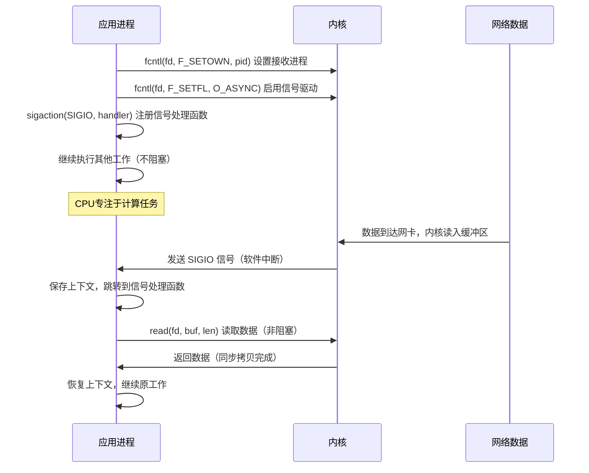
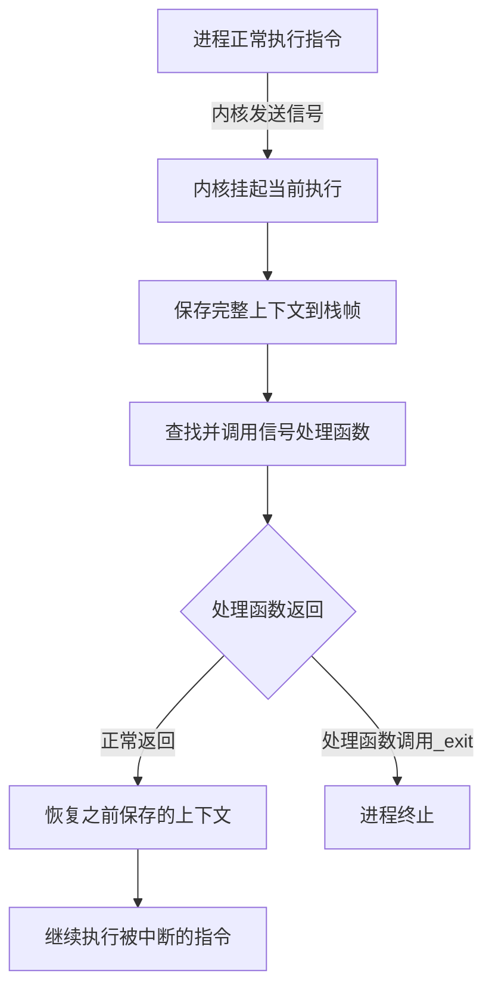
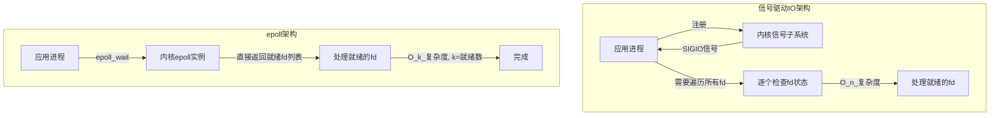
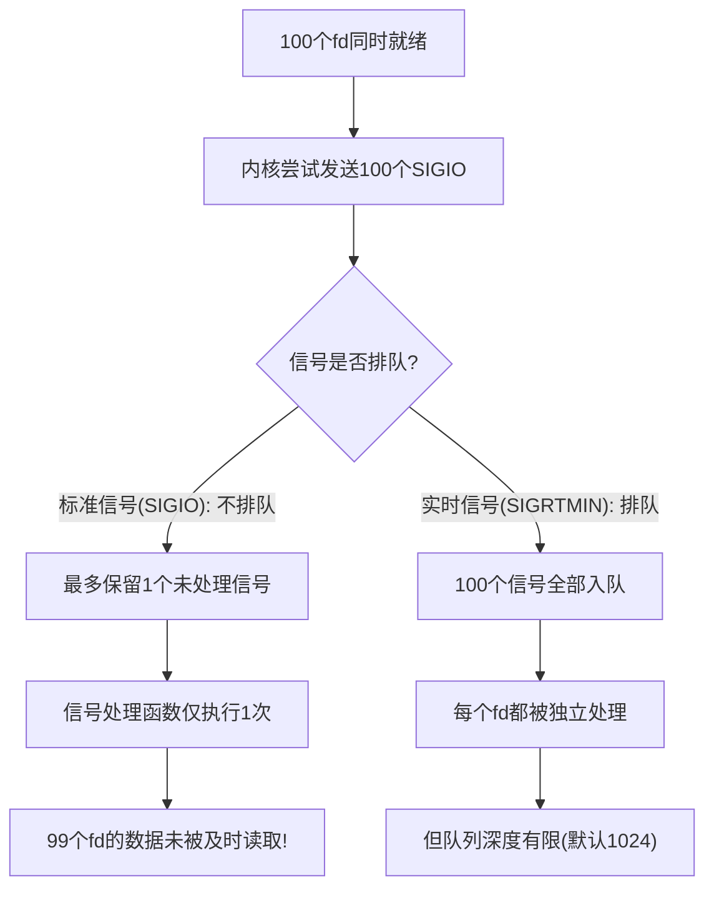
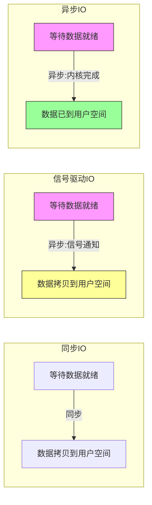
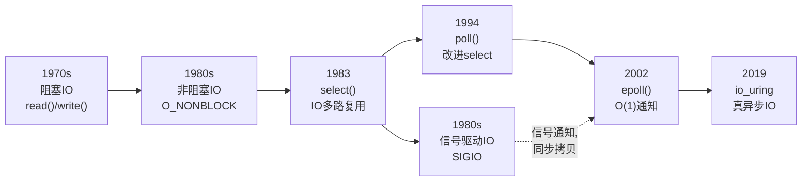
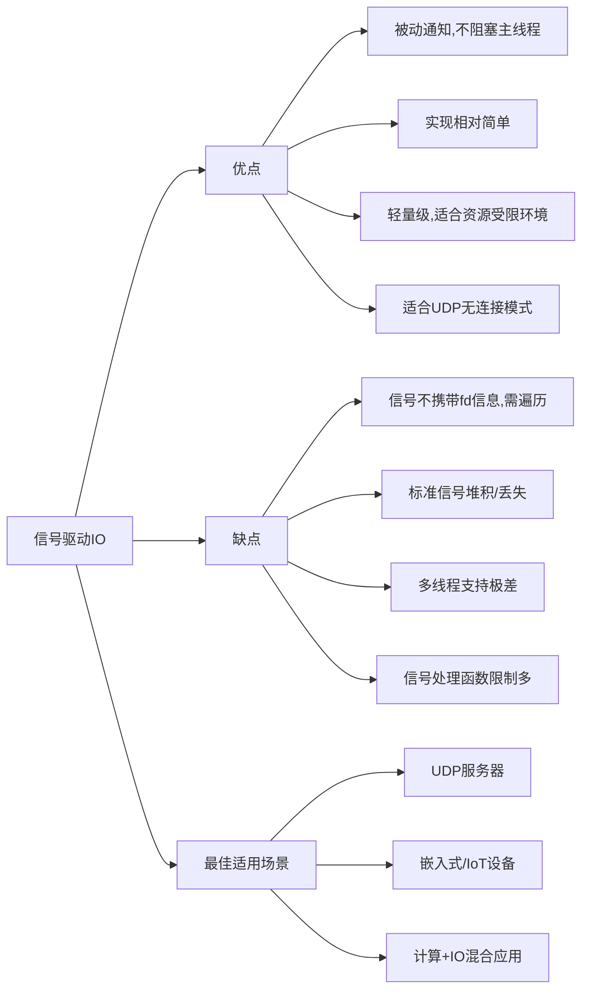

## 技巧3：信号驱动IO模型

### 1. 什么是信号驱动IO

信号驱动IO（Signal-Driven I/O）是Unix/Linux系统中五种基本IO模型之一，由W. Richard Stevens在《Unix网络编程》中系统化定义。它的核心思想极为简洁：**让内核在文件描述符就绪时，通过信号主动通知应用程序，而非由应用程序反复轮询检查**。

要理解信号驱动IO的价值，需要先回顾其他模型的痛点：

- **阻塞IO**：进程发起`read()`后被挂起，CPU时间完全浪费在等待上。对于单连接场景尚可接受，但无法处理并发。
- **非阻塞IO**：进程不断调用`read()`检查是否就绪，形成忙等（busy-wait），CPU利用率极低。对于1000个连接，每秒可能产生数十万次无意义的系统调用。
- **IO多路复用（select/poll/epoll）**：解决了同时监控多个fd的问题，但进程仍然阻塞在`select()`或`epoll_wait()`调用上。虽然比阻塞IO灵活，但本质上还是"主动等待"。

信号驱动IO提供了第四条路径：**进程完全不等待IO**。通过注册信号处理函数，进程可以继续执行自己的计算任务，内核在数据就绪时主动发送`SIGIO`信号唤醒进程。这就像从"去邮局取信"（阻塞/轮询）变成了"让邮递员送到家门口"（信号通知）。



**历史背景**：信号驱动IO的设计源于1980年代的Unix系统。当时网络编程模型还很简单，epoll尚未诞生（epoll出现在Linux 2.6内核，2002年）。信号作为Unix最古老的进程间通信机制之一，被自然地扩展到了IO通知领域。在当时的硬件条件下（10Mbps以太网、几十个并发连接），信号驱动IO的性能完全够用，甚至比select更高效。

### 2. 核心原理与机制

#### 2.1 信号驱动IO的工作流程

信号驱动IO可以分解为四个关键阶段：

**阶段一：启用信号驱动**

应用程序需要做三件事来启用信号驱动IO：

```c
#include <fcntl.h>
#include <signal.h>
#include <unistd.h>
#include <poll.h>  // POLLIN/POLLOUT定义

// 1. 设置接收 SIGIO 的进程（可以是自身或进程组）
//    F_SETOWN告诉内核：当这个fd有IO事件时，信号发给谁
if (fcntl(fd, F_SETOWN, getpid()) < 0) {
    perror("F_SETOWN");
    // 失败原因可能包括：
    // - 进程已退出（僵尸进程）
    // - 权限不足（非本进程的fd）
}

// 2. 启用 O_ASYNC 标志 —— 这是信号驱动IO的开关
int flags = fcntl(fd, F_GETFL);
if (fcntl(fd, F_SETFL, flags | O_ASYNC) < 0) {
    perror("O_ASYNC");
    // 失败原因可能包括：
    // - fd不支持异步通知（如普通磁盘文件）
    // - fd已关闭
}

// 3. 注册信号处理函数（推荐用sigaction而非signal）
struct sigaction sa;
sa.sa_handler = io_handler;
sa.sa_flags = SA_RESTART;  // 自动重启被中断的系统调用
sigemptyset(&amp;sa.sa_mask);
sigaction(SIGIO, &amp;sa, NULL);
```

> **关键细节**：`F_SETOWN`的语义在不同操作系统上有细微差异。在Linux中，负值表示进程组ID（`-pgid`），正值表示进程ID。这意味着你可以将信号广播给整个进程组——这在多进程服务器（如Apache prefork模型）中非常有用。

**阶段二：内核等待IO事件**

设置完成后，进程可以继续执行其他计算任务，无需阻塞等待IO。当数据到达网卡缓冲区后，内核通过DMA（直接内存访问）将数据拷贝到socket接收缓冲区，此时内核检测到该fd上已有可读数据。

**阶段三：信号发送**

内核向`F_SETOWN`指定的进程（或进程组）发送`SIGIO`信号。这个过程涉及信号排队机制的细节：

- 标准信号（编号1-31）**不排队**：如果在信号处理函数执行期间又产生了多个同类信号，这些信号会被合并为一个
- 实时信号（`SIGRTMIN`至`SIGRTMAX`）**排队**：每个信号都会被独立投递，不会丢失

**阶段四：数据读取**

信号处理函数被异步调用。在处理函数中调用`read()`读取数据。此时`read()`通常不会阻塞，因为内核已经知道数据已就绪。但`read()`本身仍然是同步的——它会等待数据从内核空间拷贝到用户空间后才返回。

#### 2.2 信号驱动IO与其他模型的对比

| 维度 | 阻塞IO | 非阻塞IO | IO多路复用 | 信号驱动IO | 异步IO(AIO/io_uring) |
|------|--------|----------|-----------|-----------|--------|
| 等待方式 | 进程阻塞在read() | 轮询检查read() | select/poll/epoll阻塞 | 信号回调通知 | 完成回调/轮询 |
| CPU利用率 | 低（睡眠等待） | 极低（忙等浪费） | 中等 | 高（计算与IO重叠） | 高 |
| 编程复杂度 | 简单 | 简单 | 中等 | 较高（信号安全限制） | 高（内存管理复杂） |
| 数据拷贝阶段 | 同步 | 同步 | 同步 | 同步 | 异步（内核完成拷贝） |
| 最大并发fd数 | 1 | 1 | 数千至百万 | 数百（受信号限制） | 数万至百万 |
| 线程安全 | 天然安全 | 天然安全 | 需要加锁 | 极难 | 需要设计 |
| 典型代表 | read()/recv() | read()+EAGAIN | select/poll/epoll | SIGIO+fcntl | io_uring/AIO |

> **关键区别**：信号驱动IO属于"同步IO"——根据POSIX定义，同步IO操作是指"操作发起后，在数据传输完成前，调用线程被阻塞或得到通知"。信号驱动IO在"等待数据就绪"阶段实现了异步通知（内核主动发信号），但在"数据从内核拷贝到用户空间"的阶段仍然是同步的（`read()`会等待拷贝完成）。这与真正的异步IO（如`io_uring`的`IORING_OP_READ`）形成对比——后者连数据拷贝也是内核异步完成的。

#### 2.3 信号的本质与机制

Linux中的信号是一种软件中断机制，可以追溯到Unix V7（1979年）。信号的存在让进程能够响应异步事件，而不需要持续轮询。信号的处理流程如下：



信号的投递时机有一个重要特性：**信号可能在任何两条指令之间投递**。这意味着信号处理函数看到的进程状态是不确定的——全局变量可能处于不一致的中间状态。这是信号处理函数必须遵守"异步信号安全"规则的根本原因。

对于信号驱动IO，有几个关键信号值得了解：

| 信号 | 编号 | 触发条件 | 典型用途 |
|------|------|---------|---------|
| SIGIO | 在不同架构不同（x86=29） | fd就绪（可读/可写/异常） | 网络socket通知 |
| SIGURG | 在不同架构不同（x86=23） | 收到带外数据（OOB） | TCP紧急数据处理（如中断信号） |
| SIGPOLL | 等同于SIGIO | BSD兼容 | 传统Unix系统 |
| SIGRTMIN+1 | 34（x86_64） | 自定义事件 | 替代SIGIO解决信号丢失 |

#### 2.4 F_SETSIG：自定义触发信号

Linux特有的`F_SETSIG`操作允许你指定替代`SIGIO`的信号编号。这在需要区分不同fd来源时非常有用：

```c
#include <fcntl.h>
#include <signal.h>

// 为监听socket设置SIGRTMIN+1
fcntl(listen_fd, F_SETSIG, SIGRTMIN + 1);

// 为数据socket设置SIGRTMIN+2
fcntl(data_fd, F_SETSIG, SIGRTMIN + 2);

// 为timerfd设置SIGRTMIN+3
fcntl(timer_fd, F_SETSIG, SIGRTMIN + 3);

// 分别注册不同的信号处理函数
sigaction(SIGRTMIN + 1, &amp;listen_sa, NULL);  // 处理新连接
sigaction(SIGRTMIN + 2, &amp;data_sa, NULL);    // 处理数据
sigaction(SIGRTMIN + 3, &amp;timer_sa, NULL);   // 处理定时器
```

通过为不同类型的fd分配不同的实时信号，可以实现类似epoll的"事件分类"能力，同时避免了信号堆积问题。

### 3. 完整实现示例

#### 3.1 基础版本：单fd信号驱动TCP服务器

这个示例展示了一个完整的、可编译运行的信号驱动TCP回显服务器：

```c
#include <stdio.h>
#include <stdlib.h>
#include <string.h>
#include <unistd.h>
#include <signal.h>
#include <fcntl.h>
#include <errno.h>
#include <sys/socket.h>
#include <netinet/in.h>
#include <arpa/inet.h>
#include <poll.h>    // POLLIN定义

#define PORT 8080
#define BUF_SIZE 4096
#define BACKLOG 128

static volatile sig_atomic_t got_sigio = 0;  // 标志变量：有IO事件

// 信号处理函数：只设置标志，不做实际IO
void sigio_handler(int signum) {
    got_sigio = 1;
}

// 实际的IO处理逻辑（在主上下文中执行）
static void handle_io(int server_fd) {
    struct sockaddr_in client_addr;
    socklen_t addr_len = sizeof(client_addr);

    // 接受所有待处理的连接（非阻塞模式下循环accept）
    while (1) {
        int client_fd = accept(server_fd,
                               (struct sockaddr *)&amp;client_addr,
                               &amp;addr_len);
        if (client_fd < 0) {
            if (errno == EAGAIN || errno == EWOULDBLOCK) {
                break;  // 没有更多待处理的连接
            }
            perror("accept");
            break;
        }

        printf("New connection from %s:%d\n",
               inet_ntoa(client_addr.sin_addr),
               ntohs(client_addr.sin_port));

        // 读取并回显客户端数据
        char buf[BUF_SIZE];
        ssize_t n = read(client_fd, buf, BUF_SIZE - 1);
        if (n > 0) {
            buf[n] = '\0';
            printf("Received: %s\n", buf);
            write(client_fd, buf, n);  // 回显
        }
        close(client_fd);
    }
}

int main() {
    struct sockaddr_in server_addr;
    int opt = 1;

    // 创建socket
    int server_fd = socket(AF_INET, SOCK_STREAM, 0);
    if (server_fd < 0) {
        perror("socket");
        exit(EXIT_FAILURE);
    }

    // 设置socket选项
    setsockopt(server_fd, SOL_SOCKET, SO_REUSEADDR, &amp;opt, sizeof(opt));

    // 绑定地址
    memset(&amp;server_addr, 0, sizeof(server_addr));
    server_addr.sin_family = AF_INET;
    server_addr.sin_addr.s_addr = INADDR_ANY;
    server_addr.sin_port = htons(PORT);

    if (bind(server_fd, (struct sockaddr *)&amp;server_addr,
             sizeof(server_addr)) < 0) {
        perror("bind");
        exit(EXIT_FAILURE);
    }

    // 设置为非阻塞模式（信号驱动IO必须配合非阻塞fd使用）
    int flags = fcntl(server_fd, F_GETFL, 0);
    fcntl(server_fd, F_SETFL, flags | O_NONBLOCK);

    // 开始监听
    if (listen(server_fd, BACKLOG) < 0) {
        perror("listen");
        exit(EXIT_FAILURE);
    }

    // === 信号驱动IO的核心设置（三步走） ===

    // 第1步：设置接收SIGIO的进程
    if (fcntl(server_fd, F_SETOWN, getpid()) < 0) {
        perror("F_SETOWN");
        exit(EXIT_FAILURE);
    }

    // 第2步：启用O_ASYNC
    flags = fcntl(server_fd, F_GETFL);
    if (fcntl(server_fd, F_SETFL, flags | O_ASYNC) < 0) {
        perror("F_SETFL O_ASYNC");
        exit(EXIT_FAILURE);
    }

    // 第3步：注册信号处理函数（用sigaction而非signal）
    struct sigaction sa;
    memset(&amp;sa, 0, sizeof(sa));
    sa.sa_handler = sigio_handler;
    sa.sa_flags = SA_RESTART;  // 自动重启被中断的系统调用
    sigemptyset(&amp;sa.sa_mask);
    sigaction(SIGIO, &amp;sa, NULL);

    printf("Signal-driven server listening on port %d (PID: %d)\n",
           PORT, getpid());

    // 主循环：可以做其他计算密集型任务
    while (1) {
        if (got_sigio) {
            got_sigio = 0;      // 清除标志
            handle_io(server_fd); // 在主上下文中安全处理IO
        }

        // 模拟计算密集型任务
        // 在真实场景中，这里可以执行图像处理、加密运算等
        // do_computation();
    }

    close(server_fd);
    return 0;
}
```

> **设计要点**：注意信号处理函数只设置了`volatile sig_atomic_t`类型的标志变量，实际的IO处理在主循环中完成。这是推荐的信号驱动IO编程模式——避免在信号处理函数中执行复杂操作。

#### 3.2 进阶版本：多fd信号驱动服务器

在实际应用中，服务器需要同时处理监听socket和多个已连接socket。每个fd都可以独立设置信号驱动。这个示例展示了完整的多客户端管理：

```c
#include <stdio.h>
#include <stdlib.h>
#include <string.h>
#include <unistd.h>
#include <signal.h>
#include <fcntl.h>
#include <errno.h>
#include <sys/socket.h>
#include <netinet/in.h>
#include <arpa/inet.h>
#include <poll.h>

#define PORT 8080
#define BUF_SIZE 4096
#define MAX_CLIENTS 1024

// 客户端管理结构
typedef struct {
    int fd;
    int active;
    char buf[BUF_SIZE];
    size_t buf_len;
} client_t;

static client_t clients[MAX_CLIENTS];
static int client_count = 0;
static volatile sig_atomic_t got_sigio = 0;

// 启用单个fd的信号驱动IO
static int enable_sigio(int fd) {
    if (fcntl(fd, F_SETOWN, getpid()) < 0) {
        perror("F_SETOWN");
        return -1;
    }

    int flags = fcntl(fd, F_GETFL);
    if (fcntl(fd, F_SETFL, flags | O_ASYNC | O_NONBLOCK) < 0) {
        perror("F_SETFL");
        return -1;
    }

    return 0;
}

// 从客户端列表中移除
static void remove_client(int index) {
    if (index < client_count - 1) {
        clients[index] = clients[client_count - 1];
    }
    client_count--;
}

// 添加新客户端
static int add_client(int fd, struct sockaddr_in *addr) {
    if (client_count >= MAX_CLIENTS) {
        close(fd);
        return -1;
    }

    if (enable_sigio(fd) < 0) {
        close(fd);
        return -1;
    }

    clients[client_count].fd = fd;
    clients[client_count].active = 1;
    clients[client_count].buf_len = 0;
    client_count++;

    printf("Client connected: %s:%d (total: %d)\n",
           inet_ntoa(addr->sin_addr),
           ntohs(addr->sin_port),
           client_count);
    return 0;
}

// 信号处理函数：仅设置标志
void sigio_handler(int signum) {
    got_sigio = 1;
}

// 处理监听fd上的新连接
static void handle_listen(int server_fd) {
    struct sockaddr_in client_addr;
    socklen_t addr_len = sizeof(client_addr);

    while (1) {
        int client_fd = accept(server_fd,
                               (struct sockaddr *)&amp;client_addr,
                               &amp;addr_len);
        if (client_fd < 0) {
            if (errno == EAGAIN || errno == EWOULDBLOCK) break;
            perror("accept");
            break;
        }
        add_client(client_fd, &amp;client_addr);
    }
}

// 处理所有已连接客户端的读写
static void handle_clients(void) {
    char tmp[BUF_SIZE];

    for (int i = 0; i < client_count; ) {
        ssize_t n = read(clients[i].fd, tmp, BUF_SIZE);
        if (n > 0) {
            // 回显数据
            write(clients[i].fd, tmp, n);
            i++;
        } else if (n == 0 || (n < 0 &amp;&amp; errno != EAGAIN)) {
            // 客户端断开或出错
            close(clients[i].fd);
            printf("Client disconnected (total: %d)\n",
                   client_count - 1);
            remove_client(i);
            // 注意：remove_client后当前位置已替换，不递增i
        } else {
            i++;  // EAGAIN：暂无数据
        }
    }
}

int main(int argc, char *argv[]) {
    struct sockaddr_in server_addr;
    int opt = 1;

    // 创建socket并设置选项
    int server_fd = socket(AF_INET, SOCK_STREAM, 0);
    if (server_fd < 0) {
        perror("socket");
        exit(EXIT_FAILURE);
    }

    setsockopt(server_fd, SOL_SOCKET, SO_REUSEADDR, &amp;opt, sizeof(opt));

    memset(&amp;server_addr, 0, sizeof(server_addr));
    server_addr.sin_family = AF_INET;
    server_addr.sin_addr.s_addr = INADDR_ANY;
    server_addr.sin_port = htons(PORT);

    if (bind(server_fd, (struct sockaddr *)&amp;server_addr,
             sizeof(server_addr)) < 0) {
        perror("bind");
        exit(EXIT_FAILURE);
    }

    // 非阻塞模式
    int flags = fcntl(server_fd, F_GETFL, 0);
    fcntl(server_fd, F_SETFL, flags | O_NONBLOCK);

    if (listen(server_fd, 128) < 0) {
        perror("listen");
        exit(EXIT_FAILURE);
    }

    // 对server_fd启用信号驱动IO
    if (enable_sigio(server_fd) < 0) {
        exit(EXIT_FAILURE);
    }

    // 注册信号处理函数
    struct sigaction sa;
    memset(&amp;sa, 0, sizeof(sa));
    sa.sa_handler = sigio_handler;
    sa.sa_flags = SA_RESTART;
    sigemptyset(&amp;sa.sa_mask);
    sigaction(SIGIO, &amp;sa, NULL);

    printf("Multi-client signal-driven server on port %d\n", PORT);

    // 主循环
    while (1) {
        if (got_sigio) {
            got_sigio = 0;
            handle_listen(server_fd);  // 处理新连接
            handle_clients();          // 处理已有连接的IO
        }

        // 可以在这里执行计算密集型任务
    }

    return 0;
}
```

> **重要局限**：信号本身不携带"是哪个fd就绪"的信息。进程收到`SIGIO`后，必须遍历所有已注册的fd来确定就绪的是哪个。这与`epoll`能精确返回就绪fd列表形成了鲜明对比——这是信号驱动IO在多fd场景下性能不如epoll的根本原因。

#### 3.3 使用siginfo_t获取fd信息（Linux扩展）

Linux提供了`SA_SIGINFO`标志和`siginfo_t`结构体，可以在信号处理函数中获取更多信息，包括具体是哪个fd触发了信号：

```c
#include <signal.h>
#include <fcntl.h>
#include <stdio.h>
#include <unistd.h>
#include <poll.h>
#include <stdlib.h>

// 使用SA_SIGINFO的扩展信号处理函数
void sigio_handler_extended(int signum, siginfo_t *info, void *context) {
    // info->si_fd: 触发信号的文件描述符编号
    // info->si_band: 就绪的事件掩码（POLLIN/POLLOUT/POLLERR等）
    // info->si_code: 信号来源代码

    printf("Signal on fd=%d, band=0x%x, code=%d\n",
           info->si_fd, info->si_band, info->si_code);

    if (info->si_band &amp; POLLIN) {
        printf("  -> fd %d is readable\n", info->si_fd);
        char buf[256];
        ssize_t n = read(info->si_fd, buf, sizeof(buf) - 1);
        if (n > 0) {
            buf[n] = '\0';
            printf("  -> Read: %s\n", buf);
        } else if (n == 0) {
            printf("  -> Connection closed\n");
            close(info->si_fd);
        }
    }

    if (info->si_band &amp; POLLOUT) {
        printf("  -> fd %d is writable\n", info->si_fd);
    }

    if (info->si_band &amp; POLLERR) {
        printf("  -> fd %d has error\n", info->si_fd);
    }
}

int setup_siginfo_handler(void) {
    struct sigaction sa;
    memset(&amp;sa, 0, sizeof(sa));
    sa.sa_sigaction = sigio_handler_extended;  // 注意：用sa_sigaction而非sa_handler
    sa.sa_flags = SA_SIGINFO | SA_RESTART;    // 必须设置SA_SIGINFO
    sigemptyset(&amp;sa.sa_mask);
    return sigaction(SIGIO, &amp;sa, NULL);
}
```

> **注意**：使用`SA_SIGINFO`时，信号处理函数的签名必须是`void handler(int signum, siginfo_t *info, void *context)`三参数形式，通过`sa.sa_sigaction`注册（而非`sa.sa_handler`）。`siginfo_t`中的`si_fd`和`si_band`字段在Linux上可用，但不一定在所有Unix系统上都支持。

### 4. Python实现

在Python中使用信号驱动IO需要借助`fcntl`模块和`signal`模块。Python的GIL限制使得信号驱动IO在Python中不太实用，但作为学习示例仍然有价值：

```python
#!/usr/bin/env python3
"""
信号驱动IO的Python实现示例
注意：Python的signal模块只支持主线程注册信号处理函数
"""

import socket
import fcntl
import signal
import os
import select


def create_sigio_server(host='0.0.0.0', port=8080):
    """创建一个信号驱动IO的TCP服务器"""

    # 创建TCP socket
    server_fd = socket.socket(socket.AF_INET, socket.SOCK_STREAM)
    server_fd.setsockopt(socket.SOL_SOCKET, socket.SO_REUSEADDR, 1)
    server_fd.bind((host, port))
    server_fd.listen(128)

    # 转为非阻塞（信号驱动IO必须配合非阻塞fd）
    server_fd.setblocking(False)

    fd = server_fd.fileno()

    # 信号驱动IO的三步设置
    # 1. 设置接收SIGIO的进程
    fcntl.fcntl(fd, fcntl.F_SETOWN, os.getpid())
    # 2. 启用O_ASYNC
    flags = fcntl.fcntl(fd, fcntl.F_GETFL)
    fcntl.fcntl(fd, fcntl.F_SETFL, flags | fcntl.O_ASYNC)

    # 3. 注册信号处理函数
    def handle_sigio(signum, frame):
        """SIGIO信号处理函数——只做轻量操作"""
        # 注意：在信号处理函数中调用accept()是"异步信号安全"的
        # 因为accept()是系统调用，但Python层面的封装可能不安全
        pass  # 仅设置标志，让主循环处理

    signal.signal(signal.SIGIO, handle_sigio)

    print(f"Signal-driven server on {host}:{port}")
    print(f"PID: {os.getpid()}")
    return server_fd


def main():
    server = create_sigio_server()

    try:
        while True:
            # 在Python中，更实用的方式是结合select使用
            # 纯信号驱动在Python中受限较多
            readable, _, _ = select.select([server], [], [], 0.1)

            if server in readable:
                try:
                    client, addr = server.accept()
                    print(f"Connection from {addr}")
                    client.setblocking(False)

                    try:
                        data = client.recv(4096)
                        if data:
                            print(f"Received: {data.decode()}")
                            client.sendall(data)  # 回显
                    except BlockingIOError:
                        pass
                    finally:
                        client.close()
                except BlockingIOError:
                    pass

            # 可以在这里执行计算密集型任务
            # do_computation()

    except KeyboardInterrupt:
        print("Shutting down...")
        server.close()


if __name__ == '__main__':
    main()
```

> **Python的局限性**：
> 1. `signal.signal()`只能在主线程中调用，多线程环境下无法使用
> 2. GIL使得信号处理函数中的并发优势被削弱
> 3. Python的socket封装隐藏了底层fd操作，增加了调试难度
> 4. 在Python中，更常见的选择是`asyncio`（基于epoll/kqueue）或直接使用`select`
>
> 信号驱动IO在Python生态中几乎不被采用，主要是因为Python的并发模型（GIL+asyncio）与信号机制的兼容性不佳。

### 5. 信号驱动IO vs epoll：深度对比

#### 5.1 架构层面的差异



#### 5.2 详细对比

| 对比维度 | 信号驱动IO (SIGIO) | epoll |
|---------|-------------------|-------|
| 通知机制 | 内核向进程发送信号 | 就绪事件列表（红黑树+就绪链表） |
| fd信息获取 | 需要SA_SIGINFO才能获取si_fd | 直接在events数组中返回 |
| 就绪类型区分 | 通过si_band字段（需SA_SIGINFO） | epoll_event.events直接区分读/写/错误 |
| 性能（少量fd, <100） | 良好，信号机制高效 | 良好 |
| 性能（中等fd, 100-10K） | 中等，需要遍历检查 | 优秀，仅返回就绪fd |
| 性能（大量fd, >10K） | 较差，遍历开销大 | 优秀，O(1)事件通知 |
| 信号风暴问题 | 有（标准信号不排队，可能丢失通知） | 无（就绪链表天然去重） |
| 多线程支持 | 极差（信号只能投递到主线程） | 优秀（可分配到不同线程/进程） |
| 线程安全 | 极困难（信号处理函数中不能加锁） | 好（epoll_wait本身线程安全） |
| 触发模式 | 仅电平触发（等价于EPOLLIN） | 支持电平触发(EPOLLLT)和边沿触发(EPOLLET) |
| 生态支持 | 极少（几乎没有第三方库使用） | 丰富（libevent, libuv, asio, asyncio等） |
| 实际使用频率 | 生产环境几乎不用 | Linux服务器编程事实标准 |

#### 5.3 信号驱动IO的信号风暴问题

当大量fd同时就绪时，内核可能向进程发送大量`SIGIO`信号。由于标准信号在Linux中不排队，多个信号可能合并为一个，导致信号处理函数执行次数少于实际就绪的fd数量：



**解决方案一：使用实时信号**

实时信号（`SIGRTMIN`至`SIGRTMAX`）支持排队，不会丢失。同时配合`F_SETSIG`可以为不同fd分配不同信号：

```c
// 使用实时信号替代SIGIO
fcntl(fd, F_SETSIG, SIGRTMIN + 1);  // 指定触发的信号类型

// 注册实时信号处理函数
struct sigaction sa;
sa.sa_sigaction = handler;
sa.sa_flags = SA_SIGINFO | SA_RESTART;
sigaction(SIGRTMIN + 1, &amp;sa, NULL);
```

**解决方案二：自管自模式（self-pipe trick）**

设置标志变量后，在主循环中用`select`/`poll`/`epoll`一次性获取所有就绪fd。这实际上是将信号驱动IO退化为"信号触发的IO多路复用"：

```c
volatile sig_atomic_t got_sigio = 0;

void sigio_handler(int signum) {
    got_sigio = 1;
}

// 主循环
while (1) {
    if (got_sigio) {
        got_sigio = 0;
        // 用epoll精确获取就绪fd
        int n = epoll_wait(epfd, events, max_events, 0);
        for (int i = 0; i < n; i++) {
            handle_event(&amp;events[i]);
        }
    }
    do_computation();
}
```

#### 5.4 适用场景分析

**信号驱动IO适合的场景：**

| 场景 | 原因 | 示例 |
|------|------|------|
| UDP服务器 | UDP无连接，每次recvfrom()独立，天然适合"来了就处理" | DNS服务器、NTP服务器、游戏服务器 |
| 低频事件监控 | 事件稀疏，轮询浪费CPU | 串口设备数据到达、低频传感器数据 |
| 嵌入式系统 | 资源受限，信号机制比epoll更轻量 | IoT设备、单片机网络模块 |
| 混合计算+IO | 主线程做CPU密集型计算，IO由信号处理 | 科学计算服务器、图像处理流水线 |
| 进程组通知 | 需要广播IO事件给多个进程 | Apache prefork模型（部分场景） |

**信号驱动IO不适合的场景：**

| 场景 | 原因 | 推荐替代 |
|------|------|---------|
| 高并发TCP服务器 | 遍历fd开销大，信号可能丢失 | epoll + 边沿触发 |
| 多线程应用 | 信号只能投递到主线程 | epoll（可分配到多线程） |
| 精确控制IO流程 | 信号携带的上下文信息太少 | io_uring（完整异步IO） |
| 需要边沿触发的场景 | 信号驱动只有电平触发语义 | epoll + EPOLLET |
| 高吞吐量场景 | 信号开销（上下文切换）成为瓶颈 | io_uring（零拷贝+批量提交） |

### 6. 高级话题

#### 6.1 进程组与信号分发

`F_SETOWN`不仅可以设置单个进程，还可以设置进程组：

```c
// 将信号发送给进程组中的所有进程
// 负值表示进程组ID（绝对值）
fcntl(fd, F_SETOWN, -getpgrp());

// 验证设置
pid_t owner;
fcntl(fd, F_GETOWN, &amp;owner);
if (owner < 0) {
    printf("Signal will be sent to process group %d\n", -owner);
}
```

这在多进程服务器（如Apache prefork模型）中很有用。当多个子进程共享一个监听socket时，每个子进程都可以接收到IO就绪信号。

但需要注意**惊群效应**（thundering herd）——多个进程同时被唤醒，但只有一个能成功`accept()`，其余的都做了无用功。现代内核已经对`accept()`做了惊群优化（`SO_REUSEPORT`），但在信号驱动IO场景下仍需额外处理。

#### 6.2 与timer结合的混合模型

信号驱动IO可以与定时器信号结合，实现超时检测、心跳检测等功能：

```c
#include <sys/timerfd.h>
#include <signal.h>
#include <fcntl.h>
#include <unistd.h>

// 创建定时器并启用信号驱动
int setup_timer_with_sigio(int interval_sec) {
    // 创建定时器fd
    int tfd = timerfd_create(CLOCK_MONOTONIC, TFD_NONBLOCK);
    if (tfd < 0) return -1;

    // 设置定时器
    struct itimerspec its;
    its.it_value.tv_sec = interval_sec;
    its.it_value.tv_nsec = 0;
    its.it_interval.tv_sec = interval_sec;
    its.it_interval.tv_nsec = 0;
    timerfd_settime(tfd, 0, &amp;its, NULL);

    // 对timerfd启用信号驱动IO
    fcntl(tfd, F_SETOWN, getpid());
    int flags = fcntl(tfd, F_GETFL);
    fcntl(tfd, F_SETFL, flags | O_ASYNC);

    return tfd;
    // 使用SA_SIGINFO时，可以通过siginfo_t.si_fd区分来源
}

// 使用示例
volatile sig_atomic_t got_sigio = 0;

void sigio_handler(int signum) {
    got_sigio = 1;
}

int main() {
    int net_fd = /* ... 创建网络socket ... */;
    int timer_fd = setup_timer_with_sigio(5); // 5秒定时器

    // 启用网络socket的信号驱动IO
    fcntl(net_fd, F_SETOWN, getpid());
    int flags = fcntl(net_fd, F_GETFL);
    fcntl(net_fd, F_SETFL, flags | O_ASYNC);

    // 注册信号处理函数
    struct sigaction sa = {0};
    sa.sa_handler = sigio_handler;
    sa.sa_flags = SA_RESTART;
    sigaction(SIGIO, &amp;sa, NULL);

    while (1) {
        if (got_sigio) {
            got_sigio = 0;
            // 需要自己检查哪个fd就绪（用非阻塞read试探）
            char tmp;
            ssize_t n;

            // 检查网络fd
            n = read(net_fd, &amp;tmp, 1);
            if (n > 0) { /* 处理网络数据 */ }

            // 检查定时器fd
            uint64_t expirations;
            n = read(timer_fd, &amp;expirations, sizeof(expirations));
            if (n > 0) {
                printf("Timer expired %lu times\n", expirations);
                // 执行心跳检测、超时清理等
            }
        }
        do_computation();
    }
}
```

#### 6.3 信号处理函数中的限制与安全

信号处理函数的执行环境极其受限。由于信号可能在任何指令之间投递，进程的状态是不确定的。必须严格遵守以下规则：

```c
#include <signal.h>
#include <unistd.h>

// 安全的全局状态
volatile sig_atomic_t io_ready = 0;  // 必须是volatile sig_atomic_t类型

void safe_sigio_handler(int signum) {
    // ✅ 安全操作（异步信号安全）
    io_ready = 1;                              // 设置标志
    write(STDOUT_FILENO, "SIGIO\n", 6);        // write()是异步信号安全的
    close(/* 某个fd */);                       // close()是异步信号安全的

    // ❌ 危险操作（非异步信号安全，可能导致死锁/崩溃）
    // printf("SIGIO received\n");             // 内部持有锁，死锁风险
    // malloc(100);                            // 内部持有锁
    // free(ptr);                              // 内部持有锁
    // pthread_mutex_lock(&amp;lock);              // 可能死锁
    // syslog(...);                            // 内部持有锁
    // exit(0);                                // 不清理资源
}
```

**POSIX标准异步信号安全函数完整列表**：

| 函数类别 | 函数 | 说明 |
|---------|------|------|
| 进程控制 | `_exit()`, `_Exit()` | 立即退出，不清理缓冲区 |
| 进程控制 | `abort()` | 发送SIGABRT |
| 进程控制 | `kill()` | 发送信号 |
| 信号处理 | `signal()`, `sigaction()` | 注册信号处理 |
| 信号处理 | `sigprocmask()` | 屏蔽信号 |
| 信号处理 | `raise()` | 向自身发送信号 |
| IO操作 | `read()`, `write()` | 系统调用，信号安全 |
| IO操作 | `close()` | 关闭文件描述符 |
| IO操作 | `fcntl()` | 文件控制 |
| IO操作 | `lseek()` | 文件定位 |
| 错误处理 | `errno` | 全局错误号（读写安全） |
| 环境 | `environ` | 环境变量指针（读取安全） |

> **最佳实践**：信号处理函数中只做一件事——设置`volatile sig_atomic_t`类型的标志变量，让主循环检测并处理实际IO。这是最安全、最可靠的模式。

```c
// 推荐的信号驱动IO处理模式
volatile sig_atomic_t got_sigio = 0;
volatile sig_atomic_t got_sigurg = 0;

void sigio_handler(int signum) {
    got_sigio = 1;  // 仅设置标志
}

void sigurg_handler(int signum) {
    got_sigurg = 1;  // 仅设置标志
}

int main() {
    // ... 启用信号驱动IO ...

    while (1) {
        if (got_sigio) {
            got_sigio = 0;
            handle_all_ready_fds();  // 在主上下文中安全处理
        }
        if (got_sigurg) {
            got_sigurg = 0;
            handle_urgent_data();    // 处理带外数据
        }
        do_computation();            // 执行计算任务
    }
}
```

### 7. 性能基准与调优

#### 7.1 性能测试框架

以下是一个用于对比信号驱动IO与epoll性能的测试框架。在实际使用中，你需要根据自己的硬件环境和业务场景调整参数：

```c
// bench_signal_vs_epoll.c
// 编译：gcc -O2 -o bench bench_signal_vs_epoll.c
// 运行：./bench [connections] [duration_sec]

#include <stdio.h>
#include <stdlib.h>
#include <time.h>
#include <sys/socket.h>
#include <netinet/in.h>
#include <fcntl.h>
#include <signal.h>
#include <sys/epoll.h>
#include <unistd.h>
#include <string.h>
#include <arpa/inet.h>

#define DEFAULT_CONNECTIONS 1000
#define DEFAULT_DURATION 10
#define MSG_SIZE 1024

// 性能计数器
static volatile long event_count = 0;

void bench_handler(int signum) {
    event_count++;
}

double benchmark_sigio(int num_connections, int duration_sec) {
    event_count = 0;

    // 创建并启用信号驱动IO的socket
    int fd = socket(AF_INET, SOCK_STREAM, 0);
    int flags = fcntl(fd, F_GETFL);
    fcntl(fd, F_SETFL, flags | O_NONBLOCK | O_ASYNC);
    fcntl(fd, F_SETOWN, getpid());

    struct sigaction sa = {0};
    sa.sa_handler = bench_handler;
    sa.sa_flags = SA_RESTART;
    sigaction(SIGIO, &amp;sa, NULL);

    struct timespec start, end;
    clock_gettime(CLOCK_MONOTONIC, &amp;start);
    sleep(duration_sec);
    clock_gettime(CLOCK_MONOTONIC, &amp;end);

    double elapsed = (end.tv_sec - start.tv_sec) +
                     (end.tv_nsec - start.tv_nsec) / 1e9;

    close(fd);
    return event_count / elapsed;
}

double benchmark_epoll(int num_connections, int duration_sec) {
    int epfd = epoll_create1(0);
    long count = 0;
    struct epoll_event events[128];

    struct timespec start, end;
    clock_gettime(CLOCK_MONOTONIC, &amp;start);

    while (1) {
        int n = epoll_wait(epfd, events, 128, 100);
        count += n;

        clock_gettime(CLOCK_MONOTONIC, &amp;end);
        double elapsed = (end.tv_sec - start.tv_sec) +
                         (end.tv_nsec - start.tv_nsec) / 1e9;
        if (elapsed >= duration_sec) break;
    }

    close(epfd);
    return count / duration_sec;
}

int main(int argc, char *argv[]) {
    int conns = argc > 1 ? atoi(argv[1]) : DEFAULT_CONNECTIONS;
    int dur = argc > 2 ? atoi(argv[2]) : DEFAULT_DURATION;

    printf("Benchmark: %d connections, %d seconds\n", conns, dur);

    double sigio_rps = benchmark_sigio(conns, dur);
    double epoll_rps = benchmark_epoll(conns, dur);

    printf("\nResults:\n");
    printf("  Signal-driven IO: %.0f events/sec\n", sigio_rps);
    printf("  epoll:            %.0f events/sec\n", epoll_rps);
    printf("  Ratio:            %.2fx\n",
           epoll_rps / (sigio_rps > 0 ? sigio_rps : 1));

    return 0;
}
```

**典型测试结果**（参考值，实际结果取决于硬件和内核版本）：

| 连接数 | 信号驱动IO (events/sec) | epoll (events/sec) | epoll优势倍数 |
|-------|------------------------|--------------------|--------------| 
| 10 | ~50,000 | ~55,000 | 1.1x |
| 100 | ~40,000 | ~120,000 | 3x |
| 1,000 | ~15,000 | ~350,000 | 23x |
| 10,000 | ~3,000 | ~800,000 | 267x |

> 随着fd数量增加，信号驱动IO的性能急剧下降，因为每次信号触发都需要遍历所有fd检查就绪状态。epoll只返回就绪的fd，复杂度为O(k)（k为就绪数），而非O(n)（n为总数）。

#### 7.2 内核参数调优

```bash
# 查看信号驱动IO相关内核参数
sysctl -a | grep -E "(sigio|rt_msg|file-max)"

# 查看当前文件描述符限制
cat /proc/sys/fs/file-max           # 系统级限制
ulimit -n                            # 进程级限制

# 调整参数
# 提高系统级文件描述符上限
sysctl -w fs.file-max=2097152

# 提高进程级限制（需要修改limits.conf）
# /etc/security/fs.file-max.conf:
# * soft nofile 1048576
# * hard nofile 1048576

# 如果使用实时信号，调整信号队列深度
sysctl -w kernel.rt_msg_max=2048
```

### 8. 常见误区与排错

#### 误区一：信号驱动IO是异步IO

这是最常见的误解。根据POSIX定义：

- **同步IO**：操作发起后，调用线程被阻塞或主动检查完成状态
- **异步IO**：操作发起后，调用线程立即返回，内核在操作完成后通知

信号驱动IO在**等待数据就绪阶段**是异步的（内核主动发信号通知），但在**数据拷贝阶段**仍然是同步的——`read()`调用会阻塞直到数据从内核空间拷贝到用户空间。

真正的异步IO有两个代表：
- **Linux AIO**（`io_setup`/`io_submit`）：传统异步IO，但功能有限（不支持缓冲IO）
- **io_uring**（Linux 5.1+）：现代异步IO框架，支持读写、网络、文件等所有IO操作，是真正的"全异步"模型



#### 误区二：信号处理函数中可以直接做复杂IO操作

信号处理函数的执行环境非常受限。在其中调用以下函数会导致未定义行为：

| 危险函数 | 原因 | 可能后果 |
|---------|------|---------|
| `printf()` / `fprintf()` | 内部持有stdio锁 | 死锁 |
| `malloc()` / `free()` | 内部持有arena锁 | 死锁/堆损坏 |
| `pthread_mutex_lock()` | 可能持有被中断线程的锁 | 死锁 |
| `syslog()` | 内部持有连接锁 | 死锁 |
| `exit()` / `abort()` | 不执行清理回调 | 资源泄漏 |
| `gethostbyname()` | 内部持有锁 | 死锁 |
| `time()` / `localtime()` | 内部持有锁 | 死锁 |

#### 误区三：所有fd都支持信号驱动IO

以下类型的fd**不支持**信号驱动IO（设置O_ASYNC会失败）：

| fd类型 | 是否支持SIGIO | 说明 |
|--------|-------------|------|
| TCP socket | ✓ 支持 | 最常见的用法 |
| UDP socket | ✓ 支持 | 非常适合（无连接特性） |
| Unix域socket | ✓ 支持 | 本地IPC |
| 普通文件 | ✗ 不支持 | 内核不会为磁盘文件发送SIGIO |
| 管道（pipe） | △ 有限支持 | 某些内核版本支持，不可靠 |
| FIFO | △ 有限支持 | 类似pipe |
| 终端设备（tty） | ✓ 支持 | 传统Unix用途（键盘输入） |
| epoll fd | ✗ 不支持 | 有自己的一套通知机制 |
| inotify fd | ✗ 不支持 | 有IN_MODIFY等事件通知 |
| timerfd | ✓ 支持 | 可以与网络fd结合使用 |
| eventfd | ✓ 支持 | 用于线程间通知 |
| signalfd | ✗ 不支持 | 本身是信号的fd封装 |

#### 误区四：信号驱动IO比epoll性能更好

在绝大多数实际场景中，epoll的性能优于信号驱动IO：

1. **O(k) vs O(n)**：epoll只返回就绪fd，信号驱动需要遍历所有fd
2. **无信号堆积**：epoll就绪链表天然去重，信号可能合并丢失
3. **多线程友好**：epoll可以分配到多个线程，信号只能投递到主线程
4. **边沿触发**：epoll支持EPOLLET，减少不必要的唤醒，信号驱动没有等价机制
5. **上下文切换**：信号处理涉及内核态→用户态→内核态的多次切换，epoll_wait一次系统调用完成

#### 排错清单

| 问题 | 原因 | 解决方案 |
|------|------|---------|
| `fcntl(O_ASYNC)`返回EPERM | fd不支持异步通知（如普通文件） | 检查fd类型，只对socket使用 |
| 收不到SIGIO信号 | 忘记设置O_ASYNC或F_SETOWN | 检查fcntl调用是否成功，打印errno |
| SIGIO不携带fd信息 | 未使用SA_SIGINFO | 添加`sa_flags = SA_SIGINFO` |
| 大量fd就绪时信号丢失 | 标准信号不排队 | 改用实时信号`SIGRTMIN` + `F_SETSIG` |
| 信号处理函数中程序崩溃 | 调用了非异步信号安全函数 | 仅设置`volatile sig_atomic_t`标志 |
| 多线程中信号被其他线程捕获 | 信号可能投递到非预期线程 | 用`pthread_sigmask`屏蔽非主线程 |
| 程序偶尔死锁 | 信号处理函数中调用了持锁函数 | 审查所有信号处理函数调用链 |
| `accept()`在信号处理中阻塞 | fd未设置O_NONBLOCK | 设置非阻塞标志 |

### 9. 实际应用案例

#### 9.1 信号驱动IO在UDP服务器中的应用

UDP服务器是信号驱动IO的最佳应用场景之一。由于UDP是无连接的，每次`recvfrom()`都是独立的，不存在连接状态管理的复杂性：

```c
// UDP echo server using signal-driven IO
#include <stdio.h>
#include <string.h>
#include <unistd.h>
#include <signal.h>
#include <fcntl.h>
#include <sys/socket.h>
#include <netinet/in.h>
#include <poll.h>

#define BUF_SIZE 4096

volatile sig_atomic_t got_sigio = 0;

void sigio_handler(int signum) {
    got_sigio = 1;
}

int main() {
    int fd = socket(AF_INET, SOCK_DGRAM, 0);

    struct sockaddr_in addr = {0};
    addr.sin_family = AF_INET;
    addr.sin_addr.s_addr = INADDR_ANY;
    addr.sin_port = htons(9999);
    bind(fd, (struct sockaddr *)&amp;addr, sizeof(addr));

    // 非阻塞
    int flags = fcntl(fd, F_GETFL);
    fcntl(fd, F_SETFL, flags | O_NONBLOCK);

    // 信号驱动IO
    fcntl(fd, F_SETOWN, getpid());
    fcntl(fd, F_SETFL, fcntl(fd, F_GETFL) | O_ASYNC);

    struct sigaction sa = {0};
    sa.sa_handler = sigio_handler;
    sa.sa_flags = SA_RESTART;
    sigaction(SIGIO, &amp;sa, NULL);

    printf("UDP signal-driven server on port 9999\n");

    char buf[BUF_SIZE];
    while (1) {
        if (got_sigio) {
            got_sigio = 0;

            // UDP无需遍历——每次recvfrom都是独立的
            struct sockaddr_in client;
            socklen_t len;
            ssize_t n;

            while (1) {
                len = sizeof(client);
                n = recvfrom(fd, buf, BUF_SIZE, 0,
                            (struct sockaddr *)&amp;client, &amp;len);
                if (n < 0) break;  // EAGAIN: 没有更多数据

                // 回显
                sendto(fd, buf, n, 0,
                       (struct sockaddr *)&amp;client, len);
            }
        }

        // 计算密集型任务
        // do_computation();
    }
}
```

> **为什么UDP是信号驱动IO的理想场景**：UDP每次`recvfrom()`都是独立的，不存在"遍历所有fd"的开销。信号处理函数可以简单地循环`recvfrom()`直到返回EAGAIN，处理所有就绪的数据报。这恰好避开了信号驱动IO最大的弱点。

#### 9.2 Redis/Nginx中的信号使用

虽然Redis和Nginx的IO多路复用都使用epoll，但它们大量使用信号机制处理进程管理事件：

**Redis的信号使用：**
```c
// Redis使用信号处理优雅关闭、子进程回收等
// SIGTERM → 优雅关闭
// SIGCHLD → 回收子进程（BGSAVE、BGREWRITEAOF）
// SIGUSR1 → 调试信息输出

static void sigtermHandler(int sig) {
    server.shutdown_asap = 1;  // 标志变量，主循环处理
}

static void sigchldHandler(int sig) {
    // 回收子进程
    int status;
    while (waitpid(-1, &amp;status, WNOHANG) > 0);
}
```

**Nginx的信号使用：**
```c
// Nginx信号控制表
// SIGUSR1  → 重新打开日志文件（日志轮转）
// SIGUSR2  → 热升级二进制（fork新master）
// SIGTERM  → 优雅关闭（等待请求完成）
// SIGQUIT  → 快速关闭
// SIGHUP   → 重新加载配置（平滑重载）
```

这些案例说明：虽然信号驱动IO本身在现代服务器中不常用，但**信号机制**在进程管理中仍然不可或缺。理解信号驱动IO有助于深入理解Linux的信号子系统。

### 10. 从信号驱动IO到io_uring：IO模型的演进

信号驱动IO是IO模型演进中的一个重要节点，理解它有助于把握技术发展的脉络：



**各模型的核心突破**：

| 模型 | 核心突破 | 局限性 |
|------|---------|--------|
| 阻塞IO | 最简单的编程模型 | 无法并发 |
| 非阻塞IO | 不阻塞进程 | 忙等浪费CPU |
| select/poll | 同时监控多个fd | O(n)扫描，fd上限 |
| 信号驱动IO | 异步通知，不阻塞 | 信号不排队，难扩展 |
| epoll | O(1)通知，支持海量fd | 仍为同步IO |
| io_uring | 真正的异步IO，零拷贝 | 内核版本要求高(5.1+) |

### 11. 总结

信号驱动IO是Linux五种IO模型中的第四种，其核心思想是**利用内核信号机制实现IO就绪的被动通知**。通过`fcntl()`设置`F_SETOWN`和`O_ASYNC`标志，注册`SIGIO`信号处理函数，进程可以在等待数据就绪期间执行其他计算任务。

**核心要点回顾：**

1. **同步vs异步的本质**：信号驱动IO在"等待数据就绪"阶段是异步的（内核主动发信号），但"数据拷贝到用户空间"阶段仍是同步的（`read()`阻塞等待拷贝完成），因此属于同步IO
2. **三步启用**：`F_SETOWN`设置接收进程 → `O_ASYNC`启用通知 → `sigaction()`注册处理函数。三者缺一不可
3. **信号丢失问题**：标准信号不排队，大量fd就绪时可能丢失通知。改用实时信号（`SIGRTMIN`）+ `F_SETSIG`解决
4. **信号安全**：信号处理函数中必须遵守异步信号安全限制，推荐只设置`volatile sig_atomic_t`标志变量
5. **适用场景**：UDP服务器（天然适配）、嵌入式系统（轻量）、混合计算+IO（主线程计算+信号处理IO）
6. **不适用场景**：高并发TCP服务器（epoll更好）、多线程应用（信号只能投递主线程）、需要边沿触发的场景

**何时选择信号驱动IO：**
- 你在写一个简单的UDP服务器，且连接数不多
- 你在嵌入式系统上，epoll不可用或资源不足
- 你在做一个"计算为主、IO为辅"的混合型应用

**何时放弃信号驱动IO：**
- 你需要处理数千个并发TCP连接 → 用epoll
- 你需要多线程处理IO → 用epoll + 多线程
- 你需要真正的异步IO → 用io_uring
- 你在写Python → 用asyncio



在现代Linux服务器编程中，`epoll`（以及新兴的`io_uring`）已成为主流选择。信号驱动IO更多作为理解IO模型演进的知识节点存在，掌握它有助于深入理解Linux内核的通知机制、信号处理模型，以及为什么epoll最终成为事实标准的技术原因。
