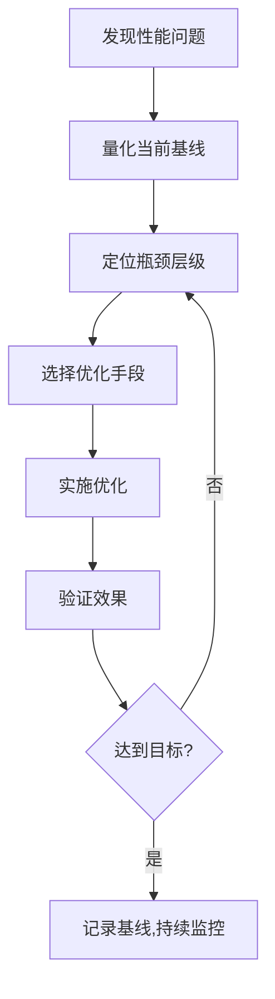
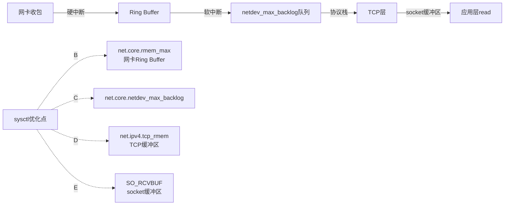
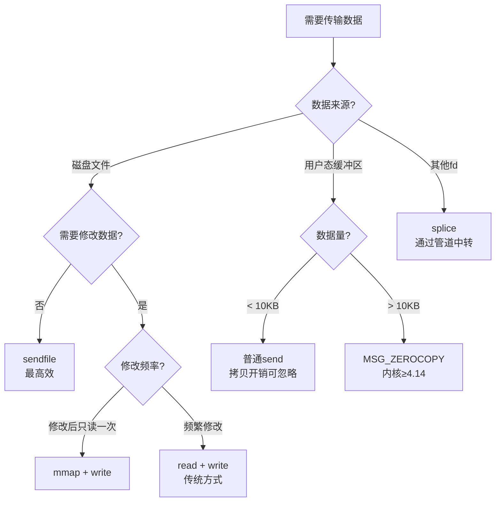

# IO子系统性能优化清单

## 引言：为什么需要一份系统化的优化清单

IO性能优化不是一个点的问题，而是一个面的问题。从应用程序的系统调用路径，到内核协议栈的参数配置，再到网卡和磁盘的硬件特性，任何一个环节的瓶颈都可能成为整体性能的天花板。

一份好的优化清单不是简单的参数列表，而是包含**三层逻辑**的决策体系：

- **诊断层**：如何发现瓶颈在哪里？用什么工具？看什么指标？
- **优化层**：发现瓶颈后，有哪些具体手段可以缓解或消除？
- **验证层**：优化是否生效？有没有引入副作用？如何持续监控？

本清单按照IO子系统的数据路径组织：**应用层→系统调用层→内核协议栈→硬件层**，每一层都给出可直接落地的优化手段、可量化的预期效果和生产环境验证方法。

## 优化方法论：先量化再优化

在动手调参数之前，必须建立一个正确的优化工作流：



**核心原则**：

1. **没有量化就没有优化**。优化前先用基准测试工具（`wrk`、`ab`、`fio`）建立可复现的性能基线。
2. **一次只改一个变量**。同时修改多个参数会导致无法确定哪个修改有效，甚至引入相互冲突的副作用。
3. **关注P99而非平均值**。平均延迟可能看起来很好，但P99/P999延迟才是用户体验的关键指标。
4. **瓶颈迁移是常态**。解决一个瓶颈后，系统可能在另一个层级出现新瓶颈——这是正常的，需要迭代优化。

```bash
# 基线测量示例：用wrk压测HTTP服务
# 安装：apt-get install wrk
wrk -t4 -c1000 -d30s --latency http://localhost:8080/api/endpoint
# 关注输出中的 Latency Distribution（P50/P90/P99/P99.9）
# 和 Requests/sec（吞吐量）

# 基线测量示例：用fio测试磁盘IO
fio --name=baseline --rw=randread --bs=4k --numjobs=4 \
    --size=1G --runtime=30 --ioengine=io_uring
# 关注 IOPS、latency（avg/min/max/P99）
```

## 第一层：应用层优化

应用层优化是投入产出比最高的一层。不改内核参数、不换硬件，仅通过代码层面的优化就能获得显著性能提升。

### 1.1 连接池化：消除连接建立开销

每次新建TCP连接需要三次握手（1.5个RTT），加上TLS握手（2个RTT），对于内网1ms RTT的环境，建立一条连接就需要3.5ms。在高QPS场景下，连接建立的开销可能占到总延迟的30%-50%。

```python
# Python连接池示例（使用urllib3）
from urllib3 import HTTPPoolManager

# 关键参数：maxsize(最大连接数)、block(是否阻塞等待)
pool = HTTPPoolManager(
    maxsize=100,          # 连接池大小
    block=True,           # 超出时阻塞等待而非创建新连接
    timeout=30,           # 连接超时
    retries=3,            # 自动重试
)

# 从池中获取连接（自动复用TCP连接）
response = pool.request('GET', 'http://backend:8080/api/data')
```

**连接池大小的确定**：不是越大越好。连接池过大会浪费内存和fd资源，过小会导致请求排队。推荐公式：

最优连接数 = (QPS × 平均请求耗时) + 安全余量
例如：1000 QPS × 50ms = 50个活跃连接，加上20%余量 ≈ 60个

### 1.2 批量处理：合并小IO为大IO

单次系统调用有固定开销（用户态→内核态切换约100ns-1μs），小数据量的高频IO会严重浪费CPU时间。批量合并的核心思路是将多次小操作合并为一次大操作。

```c
// 反面示例：逐条写入（每次系统调用）
for (int i = 0; i < 10000; i++) {
    write(fd, &amp;records[i], sizeof(record));  // 10000次系统调用
}

// 正面示例：批量写入（一次性写入）
// 方案1：聚合缓冲区
struct iovec iov[10000];
for (int i = 0; i < 10000; i++) {
    iov[i].iov_base = &amp;records[i];
    iov[i].iov_len = sizeof(record);
}
writev(fd, iov, 10000);  // 1次系统调用，writev自动处理scatter/gather

// 方案2：用户态聚合后写入
char *batch_buf = malloc(10000 * sizeof(record));
memcpy(batch_buf, records, 10000 * sizeof(record));
write(fd, batch_buf, 10000 * sizeof(record));  // 1次系统调用
```

**批量IO的量化效果**：

| 操作模式 | 系统调用次数 | 吞吐量 | 适用场景 |
|----------|------------|--------|---------|
| 逐条写入 | N | ~10K ops/s | 低频操作，数据不可合并 |
| writev聚合 | 1 | ~500K ops/s | 多段数据，保持各段边界 |
| 用户态批量 | 1 | ~800K ops/s | 数据可合并，允许memcpy开销 |
| io_uring批量 | 1次提交N个 | ~2M ops/s | 高频异步IO场景 |

### 1.3 减少内存拷贝：缓冲区管理

每一次`read`/`write`都涉及至少一次用户态↔内核态的数据拷贝。减少拷贝次数是应用层优化的重要方向。

```c
// 传统方式：多次拷贝
char kernel_buf[4096];      // read: 内核→用户 拷贝
char app_buf[4096];         // memcpy: 用户→用户 拷贝
memcpy(app_buf, kernel_buf, n);
write(conn_fd, app_buf, n); // write: 用户→内核 拷贝

// 优化方式：直接使用readv/writev避免中间缓冲区
struct iovec iov[2];
iov[0].iov_base = header;   // 响应头
iov[0].iov_len = header_len;
iov[1].iov_base = body;     // 响应体
iov[1].iov_len = body_len;
writev(conn_fd, iov, 2);    // 内核直接从两段用户缓冲区DMA，1次拷贝

// 更进一步：使用splice在内核态传递数据，零用户态拷贝
int pipefd[2];
pipe(pipefd);
splice(client_fd, NULL, pipefd[1], NULL, len, SPLICE_F_MOVE);
splice(pipefd[0], NULL, file_fd, NULL, len, SPLICE_F_MOVE);
```

### 1.4 合理设置缓冲区大小

缓冲区大小直接影响IO吞吐量和延迟。太小会导致频繁的系统调用，太大会浪费内存并增加延迟（数据填满缓冲区才能返回）。

```c
// 发送缓冲区大小的选择策略
// 小数据（<1KB）：小缓冲区减少延迟
setsockopt(fd, SOL_SOCKET, SO_SNDBUF, &amp;(int){4096}, sizeof(int));

// 大数据流（>64KB）：大缓冲区提升吞吐
setsockopt(fd, SOL_SOCKET, SO_SNDBUF, &amp;(int){262144}, sizeof(int));

// 自动调优（推荐）：让内核根据实际使用情况动态调整
// Linux默认启用TCP自动缓冲区调优（net.ipv4.tcp_moderate_rcvbuf=1）
// 应用层不要手动设置，除非有明确的性能需求
```

## 第二层：系统调用层优化

### 2.1 文件描述符限制的逐层突破

fd限制是高并发场景的第一道墙。Linux的fd限制分为三层，每层都需要正确配置：

| 限制层级 | 控制文件 | 查看方式 | 调整方式 | 注意事项 |
|---------|---------|---------|---------|---------|
| 系统全局 | `/proc/sys/fs/file-max` | `cat /proc/sys/fs/file-max` | `sysctl -w fs.file-max=1048576` | 所有进程的fd总和上限 |
| 进程级 | `ulimit -n` | `ulimit -n` | `/etc/security/limits.conf` | 每个进程的fd上限 |
| epoll级 | `/proc/sys/fs/epoll/max_user_watches` | `cat /proc/sys/fs/epoll/max_user_watches` | `sysctl -w fs.epoll.max_user_watches=1048576` | 每个用户在所有epoll实例中监控的fd总数 |
| 单文件上限 | `/proc/sys/fs/nr_open` | `cat /proc/sys/fs/nr_open` | `sysctl -w fs.nr_open=1048576` | ulimit的上限不能超过此值 |

```bash
# 百万连接场景的完整fd配置
# 1. 先设系统级上限（否则ulimit无法调大）
sysctl -w fs.nr_open=2097152
sysctl -w fs.file-max=2097152

# 2. 再设进程级限制
# 临时生效（当前shell）：
ulimit -n 1048576

# 永久生效：
cat >> /etc/security/limits.conf << 'EOF'
*  soft  nofile  1048576
*  hard  nofile  1048576
root soft  nofile  1048576
root hard  nofile  1048576
EOF

# 3. 设置epoll容量
sysctl -w fs.epoll.max_user_watches=1048576

# 4. 验证
cat /proc/$(pidof your_server)/limits | grep "open files"
```

### 2.2 epoll 高级调优技巧

#### 技巧A：epoll_wait超时策略

`epoll_wait`的超时参数不是简单的"等多久"，它决定了事件循环的**响应延迟**与**CPU占用**之间的权衡：

| 超时设置 | 行为 | 延迟 | CPU占用 | 适用场景 |
|---------|------|------|---------|---------|
| `-1`（阻塞） | 有事件就绪才返回 | 0（事件驱动） | 最低（无事件时休眠） | 大部分网络服务器 |
| `0`（非阻塞） | 立即返回，不管有无事件 | 0 | 最高（busy loop） | 仅用于与定时器配合的特殊场景 |
| `N` 毫秒 | 最多等N毫秒 | ≤ N ms | 中等 | 需要定期执行定时任务的场景 |

```c
// 最佳实践：动态调整超时
// 基础事件循环 + 定时器管理器
int calculate_timeout(timer_manager *tm) {
    int next_timer_ms = timer_manager_next_deadline(tm);
    if (next_timer_ms < 0) return -1;  // 无定时器，阻塞等待
    return next_timer_ms;              // 等到下一个定时器到期
}

while (1) {
    int timeout = calculate_timeout(&amp;timer_mgr);
    int nfds = epoll_wait(epfd, events, MAX_EVENTS, timeout);
    // ... 处理IO事件
    timer_manager_fire_expired(&amp;timer_mgr);  // 触发到期的定时器
}
```

#### 技巧B：EPOLLONESHOT 防止事件重复触发

在多线程Reactor模型中，同一个fd的事件可能被分发到多个线程同时处理，导致数据竞争。`EPOLLONESHOT`确保每次就绪事件只触发一次，处理完后需要重新arm：

```c
// EPOLLONESHOT的使用模式
// 1. 注册时添加EPOLLONESHOT
ev.events = EPOLLIN | EPOLLET | EPOLLONESHOT;
epoll_ctl(epfd, EPOLL_CTL_ADD, fd, &amp;ev);

// 2. 事件触发后，在处理函数中重新arm
void handle_connection(int epfd, int fd) {
    char buf[4096];
    ssize_t n = read(fd, buf, sizeof(buf));
    if (n > 0) {
        process_data(buf, n);
    }

    // 重新arm，确保下次还能收到事件
    struct epoll_event ev = {
        .events = EPOLLIN | EPOLLET | EPOLLONESHOT,
        .data.fd = fd
    };
    epoll_ctl(epfd, EPOLL_CTL_MOD, fd, &amp;ev);
}
```

#### 技巧C：eventfd 和 timerfd 纳入epoll管理

`eventfd`和`timerfd`是Linux提供的特殊fd，可以将线程间通信和定时器统一纳入epoll事件循环：

```c
#include <sys/eventfd.h>
#include <sys/timerfd.h>

// eventfd：高效的线程间通知机制
// 比pipe轻量（只需要1个fd而非2个），支持原子计数
int efd = eventfd(0, EFD_NONBLOCK | EFD_CLOEXEC);

// 线程A写入（通知事件发生）
uint64_t val = 1;
write(efd, &amp;val, sizeof(val));  // 或 eventfd_write(efd, 1)

// epoll循环中处理
if (events[i].data.fd == efd) {
    uint64_t count;
    read(efd, &amp;count, sizeof(count));  // 读取后计数清零
    printf("收到 %lu 个通知\n", count);
}

// timerfd：精确的定时器（替代alarm/setitimer）
int tfd = timerfd_create(CLOCK_MONOTONIC, TFD_NONBLOCK | TFD_CLOEXEC);
struct itimerspec its = {
    .it_value = { .tv_sec = 1, .tv_nsec = 0 },       // 首次触发：1秒后
    .it_interval = { .tv_sec = 0, .tv_nsec = 500000000 }  // 周期：500ms
};
timerfd_settime(tfd, 0, &amp;its, NULL);

struct epoll_event ev = { .events = EPOLLIN, .data.fd = tfd };
epoll_ctl(epfd, EPOLL_CTL_ADD, tfd, &amp;ev);
```

#### 技巧D：EPOLLEXCLUSIVE 消除惊群

多进程/多线程共享epoll时，一个fd就绪会唤醒所有等待的线程，但只有一个能成功处理——其余都是无效唤醒，浪费CPU。三种解决方案：

| 方案 | 内核版本 | 原理 | 优点 | 缺点 |
|------|---------|------|------|------|
| EPOLLEXCLUSIVE | ≥ 4.5 | epoll_wait只唤醒一个等待者 | 最通用，无需修改架构 | 老内核不支持 |
| SO_REUSEPORT | ≥ 3.9 | 多进程各自listen、各自epoll | 内核负载均衡，无锁竞争 | 需要多进程架构 |
| 应用层去重 | 任意 | 接受重复唤醒，在应用层用原子操作去重 | 兼容所有内核 | 无效唤醒浪费CPU |

```c
// 方案1（推荐）：EPOLLEXCLUSIVE
ev.events = EPOLLIN | EPOLLEXCLUSIVE;
epoll_ctl(epfd, EPOLL_CTL_ADD, listen_fd, &amp;ev);

// 方案2：SO_REUSEPORT（Nginx使用此方案）
int opt = 1;
setsockopt(listen_fd, SOL_SOCKET, SO_REUSEPORT, &amp;opt, sizeof(opt));
// 多个进程分别 bind+listen 同一端口
// 每个进程有自己的epoll实例，内核自动在进程间分配新连接
```

### 2.3 fd生命周期管理

不当的fd管理会导致fd泄漏（进程达到上限后无法接受新连接）或提前关闭（使用已关闭fd导致EBADF或数据错误）。

```c
// fd管理的最佳实践

// 1. 所有fd在创建时设置CLOEXEC
int fd = open(path, O_RDONLY | O_CLOEXEC);
int sfd = socket(AF_INET, SOCK_STREAM | SOCK_CLOEXEC, 0);
int efd = eventfd(0, EFD_NONBLOCK | EFD_CLOEXEC);

// 2. 统一的fd注册/注销接口
typedef struct {
    int fd;
    uint32_t events;
    void *data;      // 关联的上下文
    int active;      // 是否已注册到epoll
} fd_entry_t;

int fd_register(int epfd, fd_entry_t *entry) {
    struct epoll_event ev = { .events = entry->events, .data.ptr = entry };
    int ret = epoll_ctl(epfd, EPOLL_CTL_ADD, entry->fd, &amp;ev);
    if (ret == 0) entry->active = 1;
    return ret;
}

int fd_unregister(int epfd, fd_entry_t *entry) {
    if (!entry->active) return 0;
    int ret = epoll_ctl(epfd, EPOLL_CTL_DEL, entry->fd, NULL);
    close(entry->fd);
    entry->active = 0;
    return ret;
}

// 3. 错误处理路径也要关闭fd（避免泄漏）
int connect_to_server(const char *host, int port) {
    int fd = socket(AF_INET, SOCK_STREAM | SOCK_CLOEXEC, 0);
    if (fd < 0) return -1;

    struct sockaddr_in addr = { ... };
    if (connect(fd, (struct sockaddr *)&amp;addr, sizeof(addr)) < 0) {
        close(fd);  // 连接失败，必须关闭
        return -1;
    }
    return fd;  // 调用者负责关闭
}
```

## 第三层：内核协议栈参数调优

### 3.1 TCP参数优化：完整清单

以下参数按优先级排列，标注了每个参数的**默认值**、**推荐值**和**适用场景**：

#### 第一优先级：高并发必备

| 参数 | 默认值 | 推荐值 | 含义 | 为什么调 |
|------|-------|--------|------|---------|
| `net.core.somaxconn` | 128 | 65536 | listen backlog上限 | 默认值太小，高并发时新连接被拒 |
| `net.ipv4.tcp_max_syn_backlog` | 1024 | 65536 | SYN队列长度 | 防止SYN Flood和突发连接 |
| `net.ipv4.tcp_tw_reuse` | 0 | 1 | 复用TIME_WAIT连接 | 快速回收端口，避免端口耗尽 |
| `net.ipv4.tcp_fin_timeout` | 60 | 15 | FIN_WAIT2超时(秒) | 加速关闭不活跃连接 |
| `fs.file-max` | 视内存 | 1048576 | 系统全局fd上限 | 百万连接的前提 |
| `fs.epoll.max_user_watches` | 视内存 | 1048576 | epoll监控容量 | 大量epoll注册的前提 |

```bash
# 一键配置高并发参数
cat >> /etc/sysctl.conf << 'EOF'
# 高并发IO优化
net.core.somaxconn = 65536
net.ipv4.tcp_max_syn_backlog = 65536
net.ipv4.tcp_tw_reuse = 1
net.ipv4.tcp_fin_timeout = 15
fs.file-max = 1048576
fs.epoll.max_user_watches = 1048576
net.core.netdev_max_backlog = 65536
EOF
sysctl -p
```

#### 第二优先级：TCP缓冲区调优

TCP缓冲区大小直接决定了数据吞吐量和内存占用之间的平衡：

```bash
# tcp_rmem/tcp_wmem 三个值的含义：
# 最小值  默认值  最大值
# 内核在自动调优时会根据网络条件在[最小值, 最大值]之间动态调整

# 高吞吐场景（连接少，每连接数据量大）
sysctl -w net.ipv4.tcp_rmem="4096 131072 16777216"
sysctl -w net.ipv4.tcp_wmem="4096 65536 16777216"

# 高并发场景（连接多，每连接数据量小）
sysctl -w net.ipv4.tcp_rmem="4096 4096 65536"
sysctl -w net.ipv4.tcp_wmem="4096 4096 65536"

# 全局缓冲区上限
sysctl -w net.core.rmem_max=16777216
sysctl -w net.core.wmem_max=16777216

# TCP全局内存管理（单位：页，1页=4KB）
# 格式：pressure_min pressure_threshold pressure_max
# 低于min不回收，高于max强制回收，中间按比例回收
sysctl -w net.ipv4.tcp_mem="786432 1048576 1572864"
```

#### 第三优先级：连接管理精调

```bash
# TCP keepalive：及时发现和清理死连接
net.ipv4.tcp_keepalive_time = 600    # 首次探测前的空闲时间（秒）
net.ipv4.tcp_keepalive_intvl = 30    # 两次探测的间隔（秒）
net.ipv4.tcp_keepalive_probes = 3    # 最大探测次数
# 总超时 = 600 + 30×3 = 690秒 ≈ 11.5分钟发现死连接

# 客户端端口范围（发起大量外连时需要）
net.ipv4.ip_local_port_range = 1024 65535
# 可用端口数 = 65535 - 1024 = 64511
# 如果需要更多客户端连接，可以：
sysctl -w net.ipv4.ip_local_port_range="10240 65535"  # 扩展到55295个

# TIME_WAIT状态优化
net.ipv4.tcp_max_tw_buckets = 20000   # TIME_WAIT最大数量，超出直接销毁
net.ipv4.tcp_syncookies = 1           # SYN Cookie防护（生产环境建议开启）

# 网络设备队列（高PPS场景）
net.core.netdev_max_backlog = 65536   # 网卡接收队列长度
net.core.netdev_budget = 600          # 每次软中断处理的包数
net.core.netdev_budget_usec = 8000    # 软中断处理的时间限制(μs)
```

### 3.2 网络栈调优的可视化



### 3.3 避免iptables/nftables成为瓶颈

netfilter连接跟踪（conntrack）是内核中最常见的IO瓶颈之一。每个经过iptables的连接都需要在conntrack表中查找和更新：

```bash
# 检查conntrack使用情况
cat /proc/net/nf_conntrack | wc -l
# 或
conntrack -C  # 已用连接数
sysctl net.netfilter.nf_conntrack_max  # 最大容量

# 优化方案1：调大conntrack表
sysctl -w net.netfilter.nf_conntrack_max=2097152
sysctl -w net.netfilter.nf_conntrack_buckets=524288  # hash桶数

# 优化方案2：缩短conntrack超时
sysctl -w net.netfilter.nf_conntrack_tcp_timeout_established=300  # 默认432000(5天!)
sysctl -w net.netfilter.nf_conntrack_tcp_timeout_time_wait=30     # 默认120

# 优化方案3：对不需要跟踪的流量跳过conntrack
# 在iptables规则中对内网流量使用NOTRACK
iptables -t raw -A PREROUTING -s 10.0.0.0/8 -j NOTRACK
iptables -t raw -A OUTPUT -d 10.0.0.0/8 -j NOTRACK
```

## 第四层：零拷贝技术

零拷贝（Zero-Copy）是减少CPU在数据搬运上开销的关键技术。在文件传输（HTTP静态文件、日志转发、数据库复制）等场景中效果尤为显著。

### 4.1 零拷贝技术全景对比

| 技术 | 内核版本 | 用户态拷贝 | 内核态拷贝 | 系统调用数 | 适用场景 |
|------|---------|-----------|-----------|-----------|---------|
| 传统read+write | 任意 | 2次 | 2次 | 2次 | 通用，需要修改数据 |
| mmap+write | 任意 | 0次 | 3次 | 2次 | 需要修改数据，大数据传输 |
| sendfile | ≥ 2.1 | 0次 | 2次（DMA→DMA） | 1次 | 文件→socket传输 |
| splice | ≥ 2.6.17 | 0次 | 2次（管道中转） | 1次 | 任意fd→任意fd |
| tee | ≥ 2.6.17 | 0次 | 2次（管道中转+复制） | 1次 | 需要同时写两个fd |
| MSG_ZEROCOPY | ≥ 4.14 | 0次 | 1次（DMA直接） | 1次 | 大块用户态数据发送 |

### 4.2 sendfile：文件→网络传输的标准方案

`sendfile`是Web服务器（Nginx、Apache）传输静态文件的核心技术。它在内核态直接完成文件→socket的数据传输，数据不经过用户态：

```c
#include <sys/sendfile.h>

// 基础用法
off_t offset = 0;
ssize_t sent = sendfile(conn_fd, file_fd, &amp;offset, file_size);
// 内核通过DMA直接将文件页缓存数据写入网卡
// 没有任何用户态内存参与

// 带偏移和大小的精确传输（用于Range请求/断点续传）
off_t start = 1024;  // 起始偏移
size_t len = 4096;   // 传输长度
sendfile(conn_fd, file_fd, &amp;start, len);

// Nginx中的实际使用模式
// 1. open(file) 获取文件fd
// 2. fstat(file_fd) 获取文件大小
// 3. sendfile(conn_fd, file_fd, &amp;offset, file_size)
// 4. 如果发送量超过SG_MAX_SEGMENT(65535)，自动分段发送
```

**sendfile的限制**：只能用于"文件→socket"的传输。如果需要在发送前修改数据（如添加HTTP头），必须使用传统方式或mmap。

### 4.3 splice：灵活的内核态管道传输

`splice`通过管道（pipe）作为中转，在任意两个fd之间传输数据，不经过用户态：

```c
// splice：文件→管道→socket
int pipefd[2];
pipe(pipefd);

// 第一步：文件fd → 管道（数据在内核页缓存中，只是引用转移）
splice(file_fd, NULL, pipefd[1], NULL, file_size, SPLICE_F_MOVE);

// 第二步：管道 → socket（DMA直接传输到网卡）
splice(pipefd[0], NULL, conn_fd, NULL, file_size, SPLICE_F_MOVE);

// 实际应用：Nginx的pipe cache机制
// 当sendfile不可用时（如需要添加header），Nginx使用splice作为替代
// 先将文件数据splice到临时pipe，再通过pipe发送
```

### 4.4 MSG_ZEROCOPY：大块用户态数据的零拷贝

`MSG_ZEROCOPY`允许用户态直接将缓冲区地址交给内核，内核通过DMA直接从用户内存传输到网卡，避免了用户→内核的拷贝：

```c
// MSG_ZEROCOPY使用流程
#include <linux/errqueue.h>

// 1. 启用MSG_ZEROCOPY
int val = 1;
setsockopt(fd, SOL_SOCKET, MSG_ZEROCOPY, &amp;val, sizeof(val));

// 2. 发送数据（不拷贝，内核直接引用用户缓冲区）
send(fd, large_buffer, large_size, 0);

// 3. 等待发送完成通知（重要！否则缓冲区不能重用）
struct msghdr msg = {0};
struct sock_extended_err *serr;
struct cmsghdr *cmsg;
char control[100];

// 阻塞等待发送完成
recvmsg(fd, &amp;msg, MSG_ERRQUEUE);
cmsg = CMSG_FIRSTHDR(&amp;msg);
serr = (struct sock_extended_err *)CMSG_DATA(cmsg);
// serr->ee_errno == 0 表示发送成功
// serr->ee_info 是实际发送的字节数

// 注意：发送完成通知是按发送顺序的（FIFO）
// 大数据传输通常需要分块发送（每块64KB-1MB）
// 顺序等待每个块的完成通知
```

**MSG_ZEROCOPY的适用条件**：
- 数据量 > 10KB（小数据的拷贝开销可以忽略）
- 内核 ≥ 4.14
- 发送方不需要修改数据
- 能接受等待发送完成通知的延迟

### 4.5 零拷贝选型决策树



## 第五层：io_uring — 下一代异步IO

io_uring（Linux 5.1引入）是Linux IO性能优化的终极武器。它通过共享内存环形缓冲区实现了真正的零系统调用异步IO。

### 5.1 io_uring的核心优势

| 特性 | epoll | io_uring |
|------|-------|---------|
| 系统调用频率 | 每次IO操作1次read/write | 批量提交，多次操作1次系统调用 |
| 异步磁盘IO | 不直接支持（需线程池模拟） | 原生支持（包括O_DIRECT和buffered） |
| 零系统调用模式 | 不支持 | IORING_SETUP_SQPOLL（内核态轮询） |
| 操作类型 | 仅read/write/accept等 | read/write/connect/accept/fsync/open/close/stat... |
| 内核版本 | ≥ 2.6 | ≥ 5.1（推荐 ≥ 5.10） |

### 5.2 io_uring生产环境接入指南

```c
#include <liburing.h>

// 初始化io_uring（生产环境配置）
struct io_uring ring;
struct io_uring_params params = {0};

// SQPOLL模式：内核线程轮询提交队列，完全消除系统调用
params.flags = IORING_SETUP_SQPOLL;
params.sq_thread_idle = 2000;        // 2秒无请求则内核线程睡眠（省CPU）
params.sq_thread_cpu = 0;            // 绑定到CPU 0（避免调度抖动）

// 队列深度：根据并发量设置
// 1024适合大多数场景，百万连接场景可以设到4096-8192
int ret = io_uring_queue_init_params(1024, &amp;ring, &amp;params);
if (ret < 0) {
    perror("io_uring_queue_init");
    // SQPOLL需要特权，回退到普通模式
    params.flags = 0;
    io_uring_queue_init_params(1024, &amp;ring, &amp;params);
}

// 批量提交读请求
struct io_uring_sqe *sqe;
for (int i = 0; i < batch_size; i++) {
    sqe = io_uring_get_sqe(&amp;ring);
    if (!sqe) break;  // 提交队列满

    io_uring_prep_read(sqe, fds[i], bufs[i], buf_size, 0);
    io_uring_sqe_set_data(sqe, &amp;contexts[i]);  // 附加上下文
}
io_uring_submit(&amp;ring);  // 1次系统调用提交所有请求

// 批量收割完成事件
struct io_uring_cqe *cqes[256];
int completed = io_uring_peek_batch_cqe(&amp;ring, cqes, 256);
for (int i = 0; i < completed; i++) {
    void *ctx = io_uring_cqe_get_data(cqes[i]);
    int result = cqes[i]->res;

    if (result < 0) {
        handle_error(ctx, -result);  // res是负数表示错误
    } else {
        process_completion(ctx, result);
    }

    io_uring_cqe_seen(&amp;ring, cqes[i]);  // 标记为已处理
}
```

### 5.3 io_uring vs epoll 选型建议

| 场景 | 推荐方案 | 理由 |
|------|---------|------|
| 纯网络IO，内核 < 5.10 | epoll | 成熟稳定，调试工具完善，社区支持好 |
| 纯网络IO，内核 ≥ 5.10 | io_uring | 更少系统调用，更高吞吐，更低延迟 |
| 网络 + 磁盘混合IO | io_uring | 统一接口，真正异步磁盘IO，避免线程池开销 |
| 低延迟要求（< 1ms P99） | io_uring + SQPOLL | 零系统调用，内核态轮询，消除调度延迟 |
| 需要兼容老内核（< 5.1） | epoll | 广泛支持，是最安全的选择 |
| 项目维护周期长、团队经验不足 | epoll | 学习曲线低，文档和示例丰富 |

### 5.4 io_uring常见陷阱

```c
// 陷阱1：SQPOLL需要CAP_SYS_ADMIN或io_uring_group
// 普通用户启用SQPOLL会失败，需要：
//   echo 0 > /proc/sys/kernel/io_uring_disabled  (内核6.1+)
// 或者给进程设置io_uring capability

// 陷阱2：不要在io_uring操作中调用close
// 正确做法：在收割完成事件后再close
io_uring_cqe_seen(&amp;ring, cqe);
close(fd);  // 在完成事件处理后关闭

// 陷阱3：缓冲区生命周期
// 提交请求后，缓冲区在完成事件收割前不能释放或重用
// 否则会导致数据损坏
char *buf = malloc(4096);
io_uring_prep_read(sqe, fd, buf, 4096, 0);
io_uring_submit(&amp;ring);
// ... 在收割完成事件之前，buf不能free或重用

// 陷阱4：链接操作（ IOSQE_IO_LINK ）的错误处理
// 链接的多个操作中，一个失败会导致后续操作被跳过
// 被跳过的操作返回 -ECANCELED
sqe1 = io_uring_get_sqe(&amp;ring);
io_uring_prep_read(sqe1, fd1, buf1, size, 0);
sqe2 = io_uring_get_sqe(&amp;ring);
io_uring_prep_write(sqe2, fd2, buf2, size, 0);
sqe2->flags |= IOSQE_IO_LINK;  // sqe2链接到sqe1
// 如果sqe1失败，sqe2返回-ECANCELED，必须正确处理
```

## 第六层：内存与CPU优化

### 6.1 百万连接的内存预算

精确计算内存预算是高并发系统设计的基础：

单连接内存构成（内核态）：
┌─────────────────────────────────────────────┐
│  TCP收缓冲区    tcp_rmem[1]    87KB (默认)  │
│  TCP发缓冲区    tcp_wmem[1]    64KB (默认)  │
│  sk_buff头部                     ~256B      │
│  文件描述符结构体 struct file    ~256B      │
│  TCP控制块      struct tcp_sock ~2KB        │
│  epoll项       struct epitem    ~64B        │
├─────────────────────────────────────────────┤
│  默认单连接 ≈ 155KB                          │
│  百万连接   ≈ 155GB（不可接受！）             │
└─────────────────────────────────────────────┘

优化后单连接内存：
┌─────────────────────────────────────────────┐
│  TCP收缓冲区    tcp_rmem[0]    4KB (最小值) │
│  TCP发缓冲区    tcp_wmem[0]    4KB (最小值) │
│  sk_buff头部                     ~256B      │
│  其他内核结构                     ~3KB      │
├─────────────────────────────────────────────┤
│  优化后单连接 ≈ 8KB                          │
│  百万连接     ≈ 8GB（可接受）                 │
└─────────────────────────────────────────────┘

```bash
# 降低TCP缓冲区默认值（连接多但每连接数据量小的场景）
sysctl -w net.ipv4.tcp_rmem="4096 4096 65536"
sysctl -w net.ipv4.tcp_wmem="4096 4096 65536"

# 应用层也可以通过setsockopt精细控制
// 对于连接数多但数据量小的场景
int min_buf = 4096;
setsockopt(fd, SOL_SOCKET, SO_RCVBUF, &amp;min_buf, sizeof(min_buf));
setsockopt(fd, SOL_SOCKET, SO_SNDBUF, &amp;min_buf, sizeof(min_buf));
```

### 6.2 CPU缓存友好的数据布局

在高频IO操作中，CPU缓存命中率直接影响性能。频繁访问的热数据应该集中在连续内存中：

```c
// 反面示例：分散的连接状态（cache miss多）
typedef struct {
    int fd;
    char buf[4096];      // 冷数据：不是每次都需要
    char response[8192]; // 冷数据
    struct sockaddr addr;// 冷数据
    // ... 更多字段
} connection_t;
connection_t conns[100000];  // 每个结构体很大，cache line利用率低

// 正面示例：热/冷数据分离
typedef struct {
    int fd;
    uint32_t events;
    void *context;
    // 仅热数据放在同一cache line（64字节）
} conn_hot_t;

typedef struct {
    char buf[4096];
    char response[8192];
    struct sockaddr addr;
    // 冷数据单独存放
} conn_cold_t;

conn_hot_t hot_conns[100000];   // 热数据紧凑排列
conn_cold_t cold_conns[100000]; // 冷数据按需访问
```

### 6.3 减少系统调用：用户态批处理

系统调用是用户态和内核态之间的边界，每次切换约100ns-1μs。减少系统调用次数是性能优化的通用原则：

```c
// 技巧1：使用writev代替多次write
struct iovec iov[3];
iov[0].iov_base = status_line;  iov[0].iov_len = status_len;
iov[1].iov_base = headers;      iov[1].iov_len = headers_len;
iov[2].iov_base = body;         iov[2].iov_len = body_len;
writev(fd, iov, 3);  // 1次系统调用代替3次

// 技巧2：使用readv代替多次read
struct iovec riov[2];
riov[0].iov_base = header_buf;  riov[0].iov_len = 256;
riov[1].iov_base = body_buf;    riov[1].iov_len = 4096;
readv(fd, riov, 2);  // 1次系统调用读取头和体

// 技巧3：使用TCP_CORK减少小包
// 设置TCP_CORK后，小数据会积攒到MSS或达到一定阈值再发送
int cork = 1;
setsockopt(fd, IPPROTO_TCP, TCP_CORK, &amp;cork, sizeof(cork));
// 写入多个小片段...
writev(fd, iov, n);
// 关闭CORK，触发发送
cork = 0;
setsockopt(fd, IPPROTO_TCP, TCP_CORK, &amp;cork, sizeof(cork));
```

## 第七层：监控与诊断

### 7.1 IO性能诊断工具箱

| 工具 | 用途 | 关键指标 | 安装方式 |
|------|------|---------|---------|
| `iostat -x 1` | 磁盘IO分析 | %util, await, r/s, w/s | `sysstat`包 |
| `iotop -o` | 进程级IO分析 | 按IO排序的进程列表 | `apt install iotop` |
| `ss -tin` | TCP连接详情 | cwnd, rtt, retrans | 内置 |
| `ss -s` | 连接状态统计 | ESTAB/TIME-WAIT数量 | 内置 |
| `strace -c -p PID` | 系统调用统计 | 系统调用次数和耗时 | 内置 |
| `perf stat -e cache-misses` | CPU缓存分析 | 缓存命中率 | `linux-tools-$(uname -r)` |
| `perf record -g -p PID` | 性能采样 | CPU热点函数 | `linux-tools-$(uname -r)` |
| `nethogs` | 进程级网络IO | 按进程的带宽使用 | `apt install nethogs` |

```bash
# 实战：诊断IO瓶颈的完整流程

# 第1步：快速概览系统状态
echo "=== 系统负载 ==="
uptime
echo "=== 内存 ==="
free -h
echo "=== 磁盘IO ==="
iostat -x 1 3  # 采样3次
echo "=== 网络连接 ==="
ss -s

# 第2步：定位高IO进程
iotop -o -d 1 -n 3  # 按IO排序，采样3次

# 第3步：分析特定进程的系统调用
strace -c -p $(pidof your_server) -e trace=network
# 输出示例：
# % time     seconds  usecs/call     calls    errors syscall
#  45.23     0.12345          12     10240           read
#  32.11     0.08765           8     10240           write
#  12.34     0.03345          33      1024           epoll_wait
#  10.32     0.02789          27      1024           accept

# 第4步：分析TCP连接健康状况
ss -tin state established | head -20
# 关注字段：
# cwnd:N    拥塞窗口大小（越大吞吐越高）
# rtt:0.123 RTT延迟（ms）
# retrans:0 重传次数（>0说明网络有问题）
```

### 7.2 Prometheus + Grafana 监控方案

```yaml
# node_exporter 关键系统指标
# 连接数
- job_name: 'io_monitoring'
  static_configs:
    - targets: ['localhost:9100']
  # 关键指标：
  # node_netstat_Tcp_CurrEstab        - 当前TCP连接数
  # node_netstat_Tcp_RetransSegs       - TCP重传段数（网络质量）
  # node_netstat_Tcp_InErrs           - TCP接收错误数
  # node_filefd_allocated             - 已分配的fd数量
  # node_filefd_maximum               - fd最大值
  # node_disk_io_time_seconds_total   - 磁盘IO时间
  # node_disk_read_bytes_total        - 磁盘读取量
  # node_disk_written_bytes_total     - 磁盘写入量

# 应用层自定义指标（通过/metrics端点暴露）
io_connections_active             # 活跃连接数
io_connections_total              # 总连接数（含历史）
io_epoll_wait_calls_total         # epoll_wait调用次数
io_epoll_wait_duration_seconds    # epoll_wait延迟分布
io_read_bytes_total               # 读取字节数
io_write_bytes_total              # 写入字节数
io_read_latency_seconds           # 读操作延迟分布
io_write_latency_seconds          # 写操作延迟分布
io_batch_size                     # 批量操作大小
io_zero_copy_bytes_total          # 零拷贝传输字节数
```

### 7.3 关键告警阈值

| 指标 | 告警阈值 | 含义 | 处理方式 |
|------|---------|------|---------|
| fd使用率 | > 80% | 即将达到fd上限 | 扩容或优化fd回收 |
| TCP TIME_WAIT | > 10000 | 连接回收慢 | 调整tcp_tw_reuse和tcp_fin_timeout |
| conntrack使用率 | > 80% | 连接跟踪表快满 | 调大nf_conntrack_max或跳过conntrack |
| TCP重传率 | > 1% | 网络质量差 | 检查网络链路、调整TCP拥塞控制 |
| epoll_wait平均延迟 | 突然缩短 | 可能是CPU忙等待 | 检查事件循环是否在busy poll |
| 磁盘%util | > 90% | 磁盘IO饱和 | 升级SSD、优化读写模式、加缓存 |
| 内核softirq时间 | > 20% | 网络栈处理压力大 | 检查RSS/RPS配置、减少中断合并 |

```bash
# 自动化监控脚本示例
#!/bin/bash
# io_health_check.sh - IO健康检查

PID=$(pidof your_server)
if [ -z "$PID" ]; then
    echo "CRITICAL: 服务器进程不存在"
    exit 2
fi

# 检查fd使用率
FD_USED=$(ls /proc/$PID/fd | wc -l)
FD_MAX=$(cat /proc/$PID/limits | grep "open files" | awk '{print $4}')
FD_PCT=$((FD_USED * 100 / FD_MAX))

if [ $FD_PCT -gt 80 ]; then
    echo "WARNING: fd使用率 ${FD_PCT}% (${FD_USED}/${FD_MAX})"
elif [ $FD_PCT -gt 95 ]; then
    echo "CRITICAL: fd使用率 ${FD_PCT}% (${FD_USED}/${FD_MAX})"
    exit 2
else
    echo "OK: fd使用率 ${FD_PCT}% (${FD_USED}/${FD_MAX})"
fi

# 检查TCP连接状态
TIMEWAIT=$(ss -ant | grep TIME-WAIT | wc -l)
if [ $TIMEWAIT -gt 10000 ]; then
    echo "WARNING: TIME_WAIT连接数 ${TIMEWAIT}"
fi
```

## 常见误区与纠正

| 误区 | 正确理解 | 后果 | 纠正方法 |
|------|---------|------|---------|
| "调大缓冲区一定更快" | 缓冲区过大增加延迟（数据积攒）和内存占用 | 延迟增加，内存浪费 | 根据数据量和并发量选择合适的缓冲区大小 |
| "关闭TCP Nagle算法一定更快" | TCP_NODELAY消除小包延迟，但增加网络包数量和CPU开销 | 网络包数增多，小流量场景CPU浪费 | 仅在对延迟敏感的场景开启（如Redis、游戏服务器） |
| "epoll一定比select快" | fd数量少于100时select可能更快（无红黑树开销） | 过早优化增加不必要的复杂度 | 先测量，再决定是否切换 |
| "ET模式一定比LT好" | ET编程复杂度高，遗漏EAGAIN循环会导致数据丢失 | 引入难以调试的bug | 除非有明确的性能需求，否则用LT模式 |
| "io_uring可以直接替换epoll" | io_uring需要内核5.1+，学习曲线陡峭 | 在老系统上无法使用，代码重构成本高 | 根据内核版本和团队能力决定是否引入 |
| "百万连接需要百万线程" | 线程模型的并发上限远低于事件驱动模型 | 内存爆炸（每线程8MB栈），性能急剧下降 | 使用epoll/io_uring的事件驱动模型 |
| "sysctl参数调了就不用管了" | 不同工作负载下最优参数不同 | 参数不再适合当前场景 | 定期重新基准测试，根据业务变化调整 |

## 最佳实践总结

### 优化优先级排序

第一优先级（投入产出比最高）：
  ├── 合理的连接池配置
  ├── 正确的fd限制设置
  ├── TCP缓冲区按场景调优
  └── 关闭不必要的iptables/conntrack规则

第二优先级（显著性能提升）：
  ├── epoll ET模式 + 非阻塞IO
  ├── 批量处理（writev/iov）
  ├── 零拷贝（sendfile/splice）
  └── TCP_CORK减少小包

第三优先级（极致性能）：
  ├── io_uring替代epoll
  ├── SQPOLL内核态轮询
  ├── SO_REUSEPORT多进程
  └── CPU亲和性绑定

持续性工作：
  ├── 监控体系建设（Prometheus + Grafana）
  ├── 定期基准测试（wrk + fio）
  ├── 告警阈值维护
  └── 容量规划与评估

### 优化决策流程

1. **先建立基线**：用wrk/fio等工具量化当前性能
2. **再定位瓶颈**：用top/iostat/ss/strace定位瓶颈层级
3. **从应用层开始**：连接池、批量处理、缓冲区管理
4. **再到内核参数**：sysctl调优、TCP缓冲区、fd限制
5. **最后考虑架构**：零拷贝、io_uring、多进程
6. **每次只改一个**：验证效果后再改下一个

> **核心原则**：性能优化是一个持续的过程，不是一次性的工作。建立监控→发现瓶颈→优化→验证→监控的闭环，才能持续保持系统的高性能状态。
