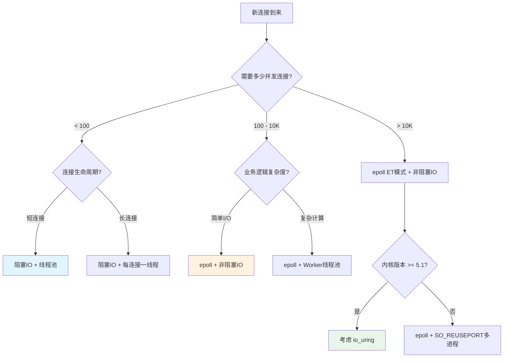

# IO模型核心技巧

理论基础篇梳理了五种I/O模型的内核原理与数据结构。本节将这些理论转化为**可直接落地的工程技巧**——从阻塞/非阻塞的精确选型，到epoll的生产级编程范式，再到信号驱动IO的实战要点与系统级性能优化清单，每一项都附带可编译运行的代码、可量化的性能数据和经过生产验证的最佳实践。

> **阅读建议**：如果你已经熟悉五种I/O模型的基本概念（理论基础篇第1-2节），可以直接跳到感兴趣的技巧。每个技巧独立成篇，但建议按顺序阅读——技巧1→2→3→4的递进关系对应了从简单到高性能的I/O编程演进路径。

## 本节知识地图

核心技巧
├── 技巧1：阻塞IO vs 非阻塞IO —— 何时选择、如何切换、怎样组合
│   ├── 阻塞IO的正确使用姿势
│   ├── 非阻塞IO的EAGAIN处理模式
│   ├── 混合模型：超时控制 + 非阻塞轮询
│   └── 生产环境中的 fd 类型决策树
│
├── 技巧2：IO多路复用 select/poll/epoll —— 从接口到内核的全栈实战
│   ├── select/poll 的正确使用与适用边界
│   ├── epoll 的生产级编程范式
│   │   ├── LT模式：安全但低效的通用方案
│   │   ├── ET模式：高性能但陷阱密布
│   │   ├── EPOLLEXCLUSIVE 消除惊群
│   │   └── epoll + 非阻塞fd 的黄金组合
│   ├── 百万连接场景的工程实践
│   └── C10K/C1M 问题的解法全景
│
├── 技巧3：信号驱动IO —— 被低估的异步通知机制
│   ├── SIGIO/SIGPOLL 的完整配置流程
│   ├── 信号处理函数中的安全约束
│   ├── 与 epoll 的组合使用模式
│   └── 实际适用场景与局限性
│
├── 技巧4：Scatter-Gather IO —— 零拷贝的用户态利器
│   ├── readv/writev 的核心思想
│   ├── 与sendfile的适用场景对比
│   └── 结合epoll的生产级模式
│
└── 性能优化清单 —— IO子系统的系统级调优手册
    ├── 内核参数调优（sysctl）
    ├── epoll 高级调优技巧
    ├── TCP延迟优化（NODELAY/CORK）
    ├── 零拷贝技术（sendfile/splice/MSG_ZEROCOPY）
    ├── 批量IO操作（recvmmsg/sendmmsg）
    ├── io_uring 生产环境接入指南
    ├── 低延迟优化（SO_BUSY_POLL）
    ├── 生产环境常见事故模式
    └── IO密集型服务的监控指标体系

## 技巧1：阻塞IO vs 非阻塞IO

### 1.1 本质区别：调用者视角

阻塞与非阻塞的核心差异不在于"数据什么时候到"，而在于**数据未就绪时内核对调用者做了什么**：

| 维度 | 阻塞IO | 非阻塞IO |
|------|--------|----------|
| 数据未就绪时 | 进程挂起，让出CPU | 立即返回-1，errno=EAGAIN |
| 调用者状态 | 睡眠态（TASK_INTERRUPTIBLE） | 运行态，可继续执行 |
| 数据拷贝时 | 仍需阻塞（同步模型不变） | 仍需阻塞（同步模型不变） |
| 典型fd行为 | `socket()`创建的默认行为 | `fcntl(fd, F_SETFL, O_NONBLOCK)` |
| 上下文切换开销 | 高（睡眠→唤醒） | 低（无切换） |
| CPU利用率 | 低（进程休眠时CPU空闲） | 高（可轮询做其他事） |

> **关键认知**：非阻塞IO只改变了"数据准备阶段"的行为，"数据拷贝阶段"仍然同步。这就是为什么非阻塞IO很少单独使用——它需要配合I/O多路复用才有意义。

### 1.2 阻塞IO的正确使用姿势

阻塞IO并非一无是处。在以下场景中，它是**最简单、最可靠**的选择：

**适用场景**：
- 单连接专用线程（如数据库连接池中的每个连接）
- 短连接HTTP服务（线程创建开销可接受）
- 后台批处理任务（不需要高并发）
- 命令行工具和脚本
- 内部管理接口（运维端口，连接数极少）

**超时控制——阻塞IO的致命缺陷的解药**：

默认的阻塞read可能永远不返回（对端不发数据且不关闭连接）。必须设置超时：

```c
// 方法1：SO_RCVTIMEO（推荐用于socket）
struct timeval tv = { .tv_sec = 5, .tv_usec = 0 };
setsockopt(fd, SOL_SOCKET, SO_RCVTIMEO, &amp;tv, sizeof(tv));

ssize_t n = read(fd, buf, sizeof(buf));
if (n == -1 &amp;&amp; errno == EAGAIN) {
    // 超时，而非对端关闭
    printf("read timeout\n");
}

// 方法2：alarm + SIGALRM（适用于任何fd，但信号编程复杂）
signal(SIGALRM, read_timeout_handler);
alarm(5);
ssize_t n = read(fd, buf, sizeof(buf));  // 5秒内未返回则被中断
alarm(0);  // 取消定时器
```

> **注意**：`SO_RCVTIMEO`只影响`read/write`等系统调用，不影响`accept/connect`。`connect`的超时需要通过`select/poll`+`getsockopt(SO_ERROR)`来实现。

**线程池+阻塞IO的组合模式**：

```c
// 线程池处理阻塞IO的经典模式
void *worker_thread(void *arg) {
    int conn_fd = *(int *)arg;
    free(arg);

    // 每个连接由独立线程处理，阻塞读写
    while (1) {
        ssize_t n = read(conn_fd, buf, sizeof(buf));
        if (n <= 0) break;
        process_request(conn_fd, buf, n);
        write(conn_fd, response, resp_len);
    }
    close(conn_fd);
    return NULL;
}

// 主线程：accept后分发给线程池
while (1) {
    int conn_fd = accept(listen_fd, ...);
    int *fd_ptr = malloc(sizeof(int));
    *fd_ptr = conn_fd;
    pthread_create(&amp;tid, NULL, worker_thread, fd_ptr);
    pthread_detach(tid);
}
```

> **性能天花板**：线程池+阻塞IO的并发上限约为**几百到几千个并发连接**。超过这个数量，线程上下文切换和栈内存占用（每线程默认8MB栈）成为瓶颈。这就是C10K问题的根源。实测数据：在4核机器上，2000个阻塞线程的上下文切换次数约10万次/秒，仅切换开销就占用了约5%的CPU时间。

### 1.3 非阻塞IO的EAGAIN处理模式

非阻塞IO的核心编程模式是**读取→检查EAGAIN→做其他事→再读取**：

```c
// 非阻塞IO的标准处理模式
int set_nonblocking(int fd) {
    int flags = fcntl(fd, F_GETFL, 0);
    if (flags == -1) return -1;
    return fcntl(fd, F_SETFL, flags | O_NONBLOCK);
}

// 非阻塞读取的三种返回值处理
ssize_t safe_read(int fd, void *buf, size_t count) {
    ssize_t n;
    while (1) {
        n = read(fd, buf, count);
        if (n > 0) {
            return n;  // 成功读取
        } else if (n == 0) {
            return 0;  // 对端关闭连接（EOF）
        } else {
            switch (errno) {
                case EAGAIN:   // 数据未就绪（非阻塞fd的正常情况）
                case EWOULDBLOCK:  // 等同于EAGAIN
                    return -1;  // 调用者决定是重试还是做其他事
                case EINTR:    // 被信号中断，重试
                    continue;
                default:       // 真正的错误
                    perror("read");
                    return -1;
            }
        }
    }
}
```

**EAGAIN vs EWOULDBLOCK**：在Linux上二者值相同（`EAGAIN = EWOULDBLOCK = 11`），是同一个错误码的两个名字。POSIX规定非阻塞模式下返回`EAGAIN`，但历史上有些系统用`EWOULDBLOCK`。最佳实践是同时检查两个：

```c
if (errno == EAGAIN || errno == EWOULDBLOCK) {
    // 数据未就绪
}
```

### 1.4 fd类型决策树：生产环境选型



## 技巧2：IO多路复用 select/poll/epoll

### 2.1 select/poll 的适用边界

虽然select/poll在性能上不如epoll，但在某些场景下仍然有使用价值：

**select的合理使用场景**：
- fd数量少于100且跨平台要求（Windows/macOS/Linux都支持）
- 超时精度要求不高的简单事件循环
- 嵌入式系统内核版本较低不支持epoll
- 需要同时监控fd和信号的场景（pselect）

**poll的合理使用场景**：
- fd数量在100-1000之间，不需要ET模式
- 需要处理的事件类型简单（主要是POLLIN/POLLOUT）
- 跨平台兼容性要求（POSIX标准）

```c
// select的典型用法（跨平台兼容）
fd_set read_fds;
FD_ZERO(&amp;read_fds);
FD_SET(fd1, &amp;read_fds);
FD_SET(fd2, &amp;read_fds);

struct timeval timeout = { .tv_sec = 1, .tv_usec = 0 };
int ready = select(max_fd + 1, &amp;read_fds, NULL, NULL, &amp;timeout);
if (ready > 0) {
    if (FD_ISSET(fd1, &amp;read_fds)) handle_fd1();
    if (FD_ISSET(fd2, &amp;read_fds)) handle_fd2();
}
```

> **性能对比**：select/poll在每次调用时需要将全部fd集合从用户态拷贝到内核态，内核需要O(n)遍历所有fd检查状态。当fd数量达到数千时，这个开销变得显著。实测数据：1000个fd时，epoll_wait约2-5μs，select约50-100μs，差距10-20倍。

### 2.2 epoll生产级编程范式

#### 2.2.1 epoll + 非阻塞IO 的黄金组合

```c
#include <sys/epoll.h>
#include <fcntl.h>
#include <unistd.h>
#include <errno.h>

#define MAX_EVENTS 1024

int make_nonblocking(int fd) {
    int flags = fcntl(fd, F_GETFL, 0);
    return fcntl(fd, F_SETFL, flags | O_NONBLOCK);
}

// epoll事件循环的完整框架
void event_loop(int listen_fd) {
    int epfd = epoll_create1(0);
    if (epfd == -1) { perror("epoll_create1"); return; }

    // 注册监听socket（使用边缘触发加速accept）
    struct epoll_event ev = {
        .events = EPOLLIN | EPOLLET,
        .data.fd = listen_fd
    };
    epoll_ctl(epfd, EPOLL_CTL_ADD, listen_fd, &amp;ev);

    struct epoll_event events[MAX_EVENTS];

    while (1) {
        int nfds = epoll_wait(epfd, events, MAX_EVENTS, -1);
        if (nfds == -1) {
            if (errno == EINTR) continue;
            perror("epoll_wait");
            break;
        }

        for (int i = 0; i < nfds; i++) {
            if (events[i].data.fd == listen_fd) {
                // 新连接（ET模式下必须循环accept直到EAGAIN）
                accept_new_connections(epfd, listen_fd);
            } else {
                // 已有连接的数据事件
                handle_connection(epfd, events[i].data.fd, events[i].events);
            }
        }
    }
    close(epfd);
}
```

**epoll_pwait：信号安全的epoll变体**

在需要处理信号的场景中，`epoll_wait`可能被信号中断返回`EINTR`。`epoll_pwait`通过内核级信号掩码避免了这个问题：

```c
// epoll_pwait：在epoll等待期间原子性地屏蔽指定信号
sigset_t sigmask;
sigemptyset(&amp;sigmask);
sigaddset(&amp;sigmask, SIGINT);
sigprocmask(SIG_BLOCK, &amp;sigmask, NULL);  // 先在主线程屏蔽

// epoll_pwait在等待期间临时应用掩码，返回时恢复
int nfds = epoll_pwait(epfd, events, MAX_EVENTS, -1, &amp;sigmask, sizeof(sigmask));
// 信号在等待期间不会打断系统调用，而是等epoll_pwait返回后在用户态处理
```

#### 2.2.2 ET模式的正确读取方式

ET模式（边缘触发）是性能与复杂度的权衡。使用ET模式必须遵循**铁律**：

> **ET铁律**：收到通知后必须循环读写直到返回EAGAIN，且fd必须设置为非阻塞。

```c
// ET模式的正确读取：循环读取直到EAGAIN
void handle_read_et(int epfd, int fd) {
    char buf[4096];
    while (1) {
        ssize_t n = read(fd, buf, sizeof(buf));
        if (n > 0) {
            // 处理读到的数据
            process_data(buf, n);
        } else if (n == 0) {
            // 对端关闭连接
            close(fd);
            epoll_ctl(epfd, EPOLL_CTL_DEL, fd, NULL);
            return;
        } else {
            // n == -1
            if (errno == EAGAIN || errno == EWOULDBLOCK) {
                // 数据读完了，等待下次通知
                return;
            } else if (errno == EINTR) {
                continue;  // 被信号中断，重试
            } else {
                // 真正的错误
                perror("read");
                close(fd);
                epoll_ctl(epfd, EPOLL_CTL_DEL, fd, NULL);
                return;
            }
        }
    }
}

// ET模式的正确写入：循环写入直到EAGAIN
void handle_write_et(int epfd, int fd, const char *data, size_t len) {
    size_t written = 0;
    while (written < len) {
        ssize_t n = write(fd, data + written, len - written);
        if (n > 0) {
            written += n;
        } else if (n == -1) {
            if (errno == EAGAIN || errno == EWOULDBLOCK) {
                // 内核缓冲区满了，注册EPOLLOUT等待可写通知
                struct epoll_event ev = {
                    .events = EPOLLOUT | EPOLLET,
                    .data.fd = fd
                };
                epoll_ctl(epfd, EPOLL_CTL_MOD, fd, &amp;ev);
                // 注意：需要在外部保存未写完的数据
                return;
            } else if (errno == EINTR) {
                continue;
            } else {
                perror("write");
                close(fd);
                epoll_ctl(epfd, EPOLL_CTL_DEL, fd, NULL);
                return;
            }
        }
    }
    // 全部写完，移除EPOLLOUT关注（避免busy loop）
    struct epoll_event ev = {
        .events = EPOLLIN | EPOLLET,
        .data.fd = fd
    };
    epoll_ctl(epfd, EPOLL_CTL_MOD, fd, &amp;ev);
}
```

#### 2.2.3 EPOLL_CTL_ADD vs EPOLL_CTL_MOD 的陷阱

这是生产环境中最常见的epoll bug来源之一：

| 操作 | 语义 | 典型错误 |
|------|------|---------|
| `EPOLL_CTL_ADD` | 向epoll实例添加新的fd | 对已注册的fd重复ADD，返回`EEXIST`错误 |
| `EPOLL_CTL_MOD` | 修改已注册fd的关注事件 | 对未注册的fd调用MOD，返回`ENOENT`错误 |
| `EPOLL_CTL_DEL` | 从epoll实例移除fd | 对已关闭的fd调用DEL，返回`EBADF`错误 |

**正确的模式**：为每个连接维护一个状态标志，确保操作前知道当前状态：

```c
typedef struct {
    int fd;
    int registered;  // 0=未注册到epoll，1=已注册
    // ...其他连接状态
} connection_t;

void register_connection(int epfd, connection_t *conn) {
    if (conn->registered) return;  // 防止重复ADD
    struct epoll_event ev = {
        .events = EPOLLIN | EPOLLET,
        .data.ptr = conn
    };
    if (epoll_ctl(epfd, EPOLL_CTL_ADD, conn->fd, &amp;ev) == -1) {
        perror("epoll_ctl ADD");
        return;
    }
    conn->registered = 1;
}

void unregister_connection(int epfd, connection_t *conn) {
    if (!conn->registered) return;  // 防止对已移除的fd操作
    epoll_ctl(epfd, EPOLL_CTL_DEL, conn->fd, NULL);
    conn->registered = 0;
}
```

> **生产事故案例**：某高并发网关在连接关闭时直接调用`epoll_ctl(DEL)`而未检查fd是否已被关闭，导致在高并发下偶发`EBADF`错误。更严重的是，如果fd编号被新连接复用（fd泄漏后被新连接获取），对旧fd的DEL操作会**误删新连接的epoll注册**，导致新连接永远收不到事件通知。修复方案：在`close(fd)`之后才调用`DEL`，且通过连接状态机保证每条路径都正确清理。

#### 2.2.4 accept的惊群陷阱

ET模式下，listen socket的EPOLLIN可能在多个连接同时到来时只通知一次。必须循环accept直到EAGAIN：

```c
void accept_new_connections(int epfd, int listen_fd) {
    struct sockaddr_in client_addr;
    socklen_t addr_len = sizeof(client_addr);

    // 必须循环accept，ET模式下一次可能有多个连接
    while (1) {
        int conn_fd = accept(listen_fd,
                            (struct sockaddr *)&amp;client_addr, &amp;addr_len);
        if (conn_fd == -1) {
            if (errno == EAGAIN || errno == EWOULDBLOCK) {
                // 所有连接都accept完了
                return;
            }
            perror("accept");
            continue;
        }

        // 设置非阻塞
        make_nonblocking(conn_fd);

        // 注册到epoll（ET模式 + 读事件）
        struct epoll_event ev = {
            .events = EPOLLIN | EPOLLET,
            .data.fd = conn_fd
        };
        epoll_ctl(epfd, EPOLL_CTL_ADD, conn_fd, &amp;ev);
    }
}
```

#### 2.2.5 惊群问题的工程解法

多进程/多线程共享同一个epoll时的惊群问题有三种解法：

| 方案 | 内核版本 | 原理 | 适用场景 |
|------|---------|------|---------|
| EPOLLEXCLUSIVE | 4.5+ | epoll_wait只唤醒一个等待者 | 推荐方案，最通用 |
| SO_REUSEPORT | 3.9+ | 多进程各自listen，各自epoll | 多进程架构 |
| 惊群本身 | - | 接受重复唤醒，在应用层去重 | 老内核兼容 |

```c
// 方案1：EPOLLEXCLUSIVE（推荐）
ev.events = EPOLLIN | EPOLLEXCLUSIVE;
epoll_ctl(epfd, EPOLL_CTL_ADD, listen_fd, &amp;ev);

// 方案2：SO_REUSEPORT（多进程场景）
int opt = 1;
setsockopt(listen_fd, SOL_SOCKET, SO_REUSEPORT, &amp;opt, sizeof(opt));
bind(listen_fd, ...);  // 多个进程bind同一端口
listen(listen_fd, ...);
// 每个进程有自己的epoll实例
```

> **SO_REUSEPORT + eBPF进阶**（Linux 4.6+）：默认的SO_REUSEPORT使用哈希分配连接到不同进程，可能导致负载不均。Linux 4.6引入了BPF程序来自定义分发逻辑：

```c
// 通过BPF_PROG_TYPE_SK_REUSEPORT自定义连接分发
// 例如：根据客户端IP的最后一位分发到指定进程
struct sk_reuseport_md *ctx;  // BPF上下文
uint32_t hash = ctx->hash;
// hash的低2位决定分发到4个进程中的哪一个
bpf_sk_select_reuseport(ctx, &amp;target_map, &amp;hash, sizeof(hash));
```

### 2.3 百万连接场景的工程实践

当单机需要处理100万+并发连接时（C1M），需要系统级优化：

#### 2.3.1 fd数量限制的逐层突破

fd限制存在于多个层级，需要逐层调整：

```bash
# 1. 系统级限制（所有进程的fd总和）
echo 1048576 > /proc/sys/fs/file-max
# 或永久设置：
echo "fs.file-max = 1048576" >> /etc/sysctl.conf

# 2. 进程级限制（每个进程的fd上限）
ulimit -n 1048576
# 或通过 /etc/security/limits.conf：
# *  soft  nofile  1048576
# *  hard  nofile  1048576

# 3. epoll实例的fd上限（每个epoll监控的最大fd数）
echo 1048576 > /proc/sys/fs/epoll/max_user_watches
```

> **排查技巧**：当遇到"Too many open files"错误时，需要逐层排查：
> ```bash
> # 查看当前fd数量
> ls /proc/PID/fd | wc -l
> # 查看fd上限
> cat /proc/PID/limits | grep "open files"
> # 查看系统级fd使用情况
> cat /proc/sys/fs/file-nr  # 已分配  未使用  上限
> ```

#### 2.3.2 网络栈调优

```bash
# TCP缓冲区大小（百万连接时的内存预算）
# 每个连接最小内存 = 系列缓冲区 + 内核skbuff
sysctl -w net.ipv4.tcp_rmem="4096 65536 16777216"
sysctl -w net.ipv4.tcp_wmem="4096 65536 16777216"

# TCP连接跟踪表大小（大量短连接时需要调大）
sysctl -w net.netfilter.nf_conntrack_max=1048576

# SYN队列长度（应对SYN Flood和大量新连接）
sysctl -w net.ipv4.tcp_max_syn_backlog=65536
sysctl -w net.core.somaxconn=65536

# TIME_WAIT状态优化
sysctl -w net.ipv4.tcp_tw_reuse=1
sysctl -w net.ipv4.tcp_fin_timeout=15

# 网络设备队列长度
sysctl -w net.core.netdev_max_backlog=65536
```

#### 2.3.3 内存预算计算

百万连接的内存估算：

单连接内存 ≈ 
  内核skbuff（收）      ≈ 256 bytes（假设MTU 1500）
  内核skbuff（发）      ≈ 256 bytes
  TCP缓冲区（收）       ≈ 87KB（默认）/ 4KB（最小）
  TCP缓冲区（发）       ≈ 87KB（默认）/ 4KB（最小）
  fd结构体              ≈ 256 bytes
  应用层状态            ≈ 100 bytes - 10KB

优化后单连接最低 ≈ 4KB（内核）+ 应用层状态
100万连接最低内存 ≈ 4GB（纯内核开销）

**关键优化**：减小TCP缓冲区默认值是降低百万连接内存占用的最有效手段：

```bash
# 将TCP缓冲区最小值设为4KB（适合连接多但每连接数据量不大的场景）
sysctl -w net.ipv4.tcp_rmem="4096 4096 65536"
sysctl -w net.ipv4.tcp_wmem="4096 4096 65536"
```

> **实战经验**：某即时通讯服务在百万长连接场景下，通过将TCP缓冲区从默认的87KB调至最小的4KB，单机内存占用从120GB降至30GB。代价是大消息的吞吐量下降约15%，但对于小消息为主的IM场景完全可以接受。

### 2.4 C10K/C1M 问题的解法全景

| 时代 | 并发量 | 解法 | 代表技术 |
|------|--------|------|---------|
| 1990s | ~100 | 每连接一线程 | Apache prefork |
| 2000s | ~10K | 事件驱动 | select/poll + Reactor |
| 2010s | ~100K | 高效事件驱动 | epoll + 非阻塞IO |
| 2020s | ~1M+ | 内核异步+共享内存 | io_uring + 用户态轮询 |

## 技巧3：信号驱动IO

### 3.1 完整配置流程

信号驱动IO通过SIGIO/SIGPOLL信号实现内核到用户空间的异步通知：

```c
#include <signal.h>
#include <fcntl.h>
#include <unistd.h>
#include <stdio.h>

int g_fd;  // 全局，信号处理函数中需要访问

void sigio_handler(int sig) {
    // 注意：信号处理函数中只能调用 async-signal-safe 的函数
    // printf, malloc, 非异步信号安全的函数都不能用！
    char buf[1024];
    ssize_t n = read(g_fd, buf, sizeof(buf));
    if (n > 0) {
        // 使用 write 而非 printf（write是异步信号安全的）
        write(STDOUT_FILENO, buf, n);
    }
}

int setup_signal_driven_io(int fd) {
    g_fd = fd;

    // 步骤1：注册SIGIO处理函数
    struct sigaction sa = {
        .sa_handler = sigio_handler,
        .sa_flags = SA_RESTART,  // 自动重启被中断的系统调用
    };
    sigemptyset(&amp;sa.sa_mask);
    if (sigaction(SIGIO, &amp;sa, NULL) == -1) {
        perror("sigaction");
        return -1;
    }

    // 步骤2：设置fd的属主进程（谁接收SIGIO）
    if (fcntl(fd, F_SETOWN, getpid()) == -1) {
        perror("F_SETOWN");
        return -1;
    }

    // 步骤3：启用异步通知
    int flags = fcntl(fd, F_GETFL);
    if (fcntl(fd, F_SETFL, flags | O_ASYNC | O_NONBLOCK) == -1) {
        perror("F_SETFL");
        return -1;
    }

    return 0;
}
```

### 3.2 信号处理函数中的安全约束

信号处理函数是异步执行的——它可能在程序执行的任何时刻打断主流程。这带来严重的限制：

**可以安全调用的函数**（POSIX async-signal-safe）：

| 函数类别 | 安全函数 | 不安全函数（禁止调用） |
|---------|---------|---------------------|
| I/O | `write`, `read`, `close` | `printf`, `fprintf`, `fwrite` |
| 内存 | - | `malloc`, `free`, `realloc` |
| 字符串 | - | `strlen`, `strcpy`, `sprintf` |
| 错误 | `errno`（读取） | `strerror` |
| 进程 | `_exit`, `kill`, `getpid` | `exit`, `abort` |

**推荐的信号驱动IO编程模式**：信号处理函数只做标记，主循环处理实际逻辑：

```c
volatile sig_atomic_t g_data_ready = 0;

void sigio_handler(int sig) {
    g_data_ready = 1;  // 原子变量，安全
}

// 主循环
void main_loop(int fd) {
    setup_signal_driven_io(fd);

    while (1) {
        if (g_data_ready) {
            g_data_ready = 0;
            // 在主上下文中安全地读取和处理数据
            char buf[4096];
            ssize_t n = read(fd, buf, sizeof(buf));
            if (n > 0) {
                process_data(buf, n);  // 可以调用任何函数
            }
        }
        // 做其他工作...
    }
}
```

### 3.3 与epoll的组合使用

信号驱动IO可以与epoll组合，在epoll监控的同时接收信号通知：

```c
// 使用 signalfd 将信号转化为fd，纳入epoll管理
#include <sys/signalfd.h>

sigset_t mask;
sigemptyset(&amp;mask);
sigaddset(&amp;mask, SIGIO);
sigprocmask(SIG_BLOCK, &amp;mask, NULL);  // 阻塞SIGIO，由signalfd处理

int sfd = signalfd(-1, &amp;mask, SFD_NONBLOCK | SFD_CLOEXEC);

// 将signalfd注册到epoll
struct epoll_event ev = { .events = EPOLLIN, .data.fd = sfd };
epoll_ctl(epfd, EPOLL_CTL_ADD, sfd, &amp;ev);

// 在epoll循环中处理
if (events[i].data.fd == sfd) {
    struct signalfd_siginfo fdsi;
    read(sfd, &amp;fdsi, sizeof(fdsi));
    // 处理信号
}
```

> **signalfd的优势**：将信号处理纳入epoll事件循环后，避免了信号处理函数的async-signal-safe限制，可以在正常的函数上下文中处理信号相关的逻辑。

### 3.4 实际适用场景与局限性

**适用场景**：
- UDP套接字的数据报到达通知（每个数据报独立，不需要循环读取）
- 终端/串口设备的输入通知
- 某些设备驱动的异步事件通知
- 需要与select/poll/epoll无法使用的特殊fd配合

**不适用场景**：
- TCP长连接（需要循环读取，信号模型不适合）
- 高并发场景（信号不排队，多个就绪事件可能丢失）
- 需要复杂处理逻辑的场景（信号处理函数限制太多）

> **实践建议**：信号驱动IO在现代高性能服务器编程中已很少使用。如果你在维护一个旧系统遇到SIGIO相关代码，理解本节内容有助于排查问题。新项目中建议使用epoll或io_uring。

## 技巧4：Scatter-Gather IO —— 零拷贝的用户态利器

### 4.1 readv/writev 的核心思想

传统的`read/write`只能操作单个连续缓冲区。Scatter-Gather IO通过**iovec数组**一次性操作多个缓冲区，减少系统调用次数和内存拷贝：

```c
#include <sys/uio.h>

// writev：分散写入——将多个缓冲区的数据一次性写入fd
struct iovec iov[3];
iov[0].iov_base = header;    iov[0].iov_len = header_len;
iov[1].iov_base = body;      iov[1].iov_len = body_len;
iov[2].iov_base = footer;    iov[2].iov_len = footer_len;

ssize_t total = header_len + body_len + footer_len;
ssize_t n = writev(conn_fd, iov, 3);
// 一次系统调用发送三个独立的缓冲区，无需先拼接成连续内存

// readv：聚集读取——从fd一次性读入多个缓冲区
struct iovec recviov[2];
recviov[0].iov_base = metadata_buf;  recviov[0].iov_len = 64;  // 固定64字节头部
recviov[1].iov_base = payload_buf;   recviov[1].iov_len = 4096; // 最多4096字节载荷

ssize_t nr = readv(conn_fd, recviov, 2);
// 头部和载荷分别进入不同缓冲区，无需先读到临时缓冲区再memcpy
```

### 4.2 适用场景与性能优势

| 场景 | 传统read/write | readv/writev | 优势 |
|------|---------------|--------------|------|
| HTTP响应（header+body） | 先拼接字符串，再write | writev(iov, 2) | 避免内存拼接开销 |
| 数据库协议（固定头部+变长载荷） | 两次read | readv(iov, 2) | 减少系统调用次数 |
| 消息转发（从网络A读→网络B写） | 读到临时buf→write | readv到固定buf+iov头部 | 减少一次内存拷贝 |
| 日志写入（多行日志） | 多次write | writev一次提交 | 减少系统调用开销 |

> **与sendfile的本质区别**：readv/writev仍在用户态和内核态之间拷贝数据（零拷贝指的是"减少用户态内存操作"，不是真正的零拷贝）。sendfile/splice才是真正跳过用户态的内核级零拷贝。readv/writev的价值在于**减少系统调用次数**和**避免用户态的内存拼接**。

### 4.3 结合epoll的生产级模式

```c
// HTTP响应发送：writev + epoll结合
void send_http_response(int epfd, int fd, http_response_t *resp) {
    struct iovec iov[2];
    
    // 固定头部
    char header[512];
    int header_len = snprintf(header, sizeof(header),
        "HTTP/1.1 %d %s\r\n"
        "Content-Length: %zu\r\n"
        "Content-Type: %s\r\n"
        "\r\n",
        resp->status_code, resp->status_text,
        resp->body_len, resp->content_type);
    
    iov[0].iov_base = header;
    iov[0].iov_len = header_len;
    iov[1].iov_base = resp->body;
    iov[1].iov_len = resp->body_len;
    
    ssize_t n = writev(fd, iov, 2);
    if (n == -1 &amp;&amp; (errno == EAGAIN || errno == EWOULDBLOCK)) {
        // 内核缓冲区满，需要注册EPOLLOUT等待可写通知
        // 注意：ET模式下需要保存未发送完的数据，下次继续发送
    }
}
```

## 性能优化清单

### 5.1 内核参数调优

以下是生产环境中IO子系统最常调整的内核参数，按影响程度排序：

#### 第一优先级：必须调整

```bash
# 1. fd数量限制（高并发前提）
fs.file-max = 1048576
fs.nr_open = 1048576        # 单进程上限

# 2. epoll容量
fs.epoll.max_user_watches = 1048576

# 3. TCP连接管理
net.core.somaxconn = 65536
net.ipv4.tcp_max_syn_backlog = 65536
net.ipv4.tcp_tw_reuse = 1
net.ipv4.tcp_fin_timeout = 15
```

#### 第二优先级：按场景调整

```bash
# 4. TCP缓冲区（连接多调小，连接少调大）
net.ipv4.tcp_rmem = 4096 87380 16777216
net.ipv4.tcp_wmem = 4096 65536 16777216
net.core.rmem_max = 16777216
net.core.wmem_max = 16777216
net.ipv4.tcp_mem = 786432 1048576 1572864

# 5. 网络设备队列
net.core.netdev_max_backlog = 65536
net.core.netdev_budget = 600        # 每次软中断处理的包数
net.core.netdev_budget_usec = 8000

# 6. 连接跟踪（大量短连接时）
net.netfilter.nf_conntrack_max = 1048576
```

#### 第三优先级：精细调优

```bash
# 7. TCP keepalive（及时释放死连接）
net.ipv4.tcp_keepalive_time = 600
net.ipv4.tcp_keepalive_intvl = 30
net.ipv4.tcp_keepalive_probes = 3

# 8. 端口范围（客户端侧）
net.ipv4.ip_local_port_range = 1024 65535

# 9. TIME_WAIT优化
net.ipv4.tcp_max_tw_buckets = 20000
net.ipv4.tcp_syncookies = 1
```

### 5.2 TCP延迟优化：NODELAY vs CORK

TCP延迟优化是IO性能调优中最容易被忽视但影响最大的环节：

| 选项 | 默认值 | 效果 | 适用场景 |
|------|--------|------|---------|
| TCP_NODELAY | 关闭（开启Nagle算法） | 禁用Nagle，小包立即发送 | 低延迟场景（游戏、IM） |
| TCP_CORK | 关闭 | 延迟发送，积攒到MSS或200ms | 高吞吐场景（文件传输） |

**Nagle算法的工作原理**：当有未确认数据时，缓冲小包延迟发送（等到ACK回来或凑够MSS）。这在广域网上能提高带宽利用率，但在局域网或低延迟场景下引入了不必要的延迟。

```c
// 低延迟场景：禁用Nagle
int flag = 1;
setsockopt(fd, IPPROTO_TCP, TCP_NODELAY, &amp;flag, sizeof(flag));

// 高吞吐场景：使用Cork积攒数据
int flag = 1;
setsockopt(fd, IPPROTO_TCP, TCP_CORK, &amp;flag, sizeof(flag));
// 写入header...
// 写入body...（与header一起发送，不拆成两个TCP段）
// 手动解除Cork
flag = 0;
setsockopt(fd, IPPROTO_TCP, TCP_CORK, &amp;flag, sizeof(flag));
```

> **实战经验**：某WebSocket服务在开启TCP_NODELAY后，消息延迟从平均15ms降至2ms。但同时CPU使用率上升了约3%（更多的小包导致更多的中断处理）。在吞吐量敏感的场景中，可以用`TCP_CORK`+手动flush来平衡延迟和吞吐：

```c
// 精细化控制：Cork + 手动flush
void send_response(int fd, const char *header, size_t hlen,
                   const char *body, size_t blen) {
    // 开启Cork
    int cork = 1;
    setsockopt(fd, IPPROTO_TCP, TCP_CORK, &amp;cork, sizeof(cork));
    
    // 写入header和body（合并为一个TCP段）
    write(fd, header, hlen);
    write(fd, body, blen);
    
    // 手动flush
    cork = 0;
    setsockopt(fd, IPPROTO_TCP, TCP_CORK, &amp;cork, sizeof(cork));
}
```

### 5.3 epoll 高级调优技巧

#### 技巧A：epoll_wait超时的精确控制

```c
// 永不超时（阻塞等待）
epoll_wait(epfd, events, MAX_EVENTS, -1);

// 精确超时（用于定时器轮询）
struct timespec ts = { .tv_sec = 0, .tv_nsec = 100000000 };  // 100ms
epoll_wait(epfd, events, MAX_EVENTS, -1);  // 注意：POSIX只支持毫秒级

// 非阻塞检查（立即返回）
epoll_wait(epfd, events, MAX_EVENTS, 0);
```

#### 技巧B：EPOLLONESHOT避免事件重复触发

对于多线程处理同一个fd的场景，防止多个线程同时处理：

```c
ev.events = EPOLLIN | EPOLLET | EPOLLONESHOT;
epoll_ctl(epfd, EPOLL_CTL_ADD, fd, &amp;ev);

// 每次处理完后重新arm
void handle_event(int epfd, int fd) {
    // 处理事件...
    
    // 重新arm EPOLLONESHOT
    struct epoll_event ev = {
        .events = EPOLLIN | EPOLLET | EPOLLONESHOT,
        .data.fd = fd
    };
    epoll_ctl(epfd, EPOLL_CTL_MOD, fd, &amp;ev);
}
```

> **EPOLLONESHOT vs EPOLLEXCLUSIVE**：二者解决不同问题。`EPOLLONESHOT`防止同一fd的事件被多个线程同时处理（一对多）；`EPOLLEXCLUSIVE`防止listen fd的新连接事件被多个进程同时唤醒（多对一）。两者可以组合使用。

#### 技巧C：epoll监控非fd对象（eventfd + timerfd）

```c
#include <sys/timerfd.h>
#include <sys/eventfd.h>

// 用timerfd实现定时器（纳入epoll管理）
int tfd = timerfd_create(CLOCK_MONOTONIC, TFD_NONBLOCK | TFD_CLOEXEC);
struct itimerspec its = {
    .it_interval = { .tv_sec = 1, .tv_nsec = 0 },  // 每秒触发
    .it_value = { .tv_sec = 1, .tv_nsec = 0 }
};
timerfd_settime(tfd, 0, &amp;its, NULL);

struct epoll_event ev = { .events = EPOLLIN, .data.fd = tfd };
epoll_ctl(epfd, EPOLL_CTL_ADD, tfd, &amp;ev);

// 用eventfd实现线程间通知
int efd = eventfd(0, EFD_NONBLOCK | EFD_CLOEXEC);
// 写入：eventfd_write(efd, 1)
// 读取：eventfd_read(efd, &amp;count)
```

### 5.4 零拷贝技术

传统IO涉及多次数据拷贝，零拷贝技术减少了CPU在数据搬运上的开销：

| 技术 | 拷贝次数 | 系统调用 | 适用场景 |
|------|---------|---------|---------|
| 传统read+write | 4次（磁盘→页缓存→用户→内核socket→网卡） | 2次 | 通用 |
| sendfile | 2次（磁盘→页缓存→网卡） | 1次 | 文件→网络传输 |
| splice | 2次（管道中转） | 1次 | 文件→管道→socket |
| mmap+write | 3次（磁盘→用户映射→内核） | 2次 | 需要修改数据的场景 |
| MSG_ZEROCOPY | 1次（用户→内核→网卡） | 1次 | 大块数据发送 |

```c
// sendfile：文件→网络的零拷贝
#include <sys/sendfile.h>
off_t offset = 0;
sendfile(conn_fd, file_fd, &amp;offset, file_size);

// splice：通过管道零拷贝
int pipefd[2];
pipe(pipefd);
splice(file_fd, NULL, pipefd[1], NULL, file_size, SPLICE_F_MOVE);
splice(pipefd[0], NULL, conn_fd, NULL, file_size, SPLICE_F_MOVE);

// MSG_ZEROCOPY：减少用户→内核拷贝（Linux 4.14+）
int val = 1;
setsockopt(fd, SOL_SOCKET, MSG_ZEROCOPY, &amp;val, sizeof(val));
send(fd, data, len, 0);  // 内核直接从用户缓冲区DMA到网卡
// 注意：需要通过MSG_ERRQUEUE获取发送完成通知
```

> **sendfile vs splice**：sendfile只能用于"文件→socket"的场景，而splice通过管道中转可以实现任意两个fd之间的零拷贝。但splice的两次系统调用（file→pipe, pipe→socket）比sendfile的一次系统调用略慢。对于静态文件服务器（Nginx），sendfile是最佳选择。

### 5.5 批量IO操作：recvmmsg/sendmmsg

当需要同时处理多个数据报时，`recvmmsg/sendmmsg`通过一次系统调用操作多个消息，大幅减少用户态↔内核态切换：

```c
#include <sys/socket.h>

// recvmmsg：一次接收多个UDP数据报
struct mmsghdr msgs[64];  // 最多一次接收64个数据报
struct iovec iovecs[64];
char buffers[64][1500];

for (int i = 0; i < 64; i++) {
    iovecs[i].iov_base = buffers[i];
    iovecs[i].iov_len = 1500;
    msgs[i].msg_hdr.msg_iov = &amp;iovecs[i];
    msgs[i].msg_hdr.msg_iovlen = 1;
}

int n = recvmmsg(fd, msgs, 64, MSG_DONTWAIT, NULL);
// n = 实际接收的数据报数量
// msgs[i].msg_len = 第i个数据报的长度

// sendmmsg：一次发送多个UDP数据报
struct mmsghdr send_msgs[64];
// ...填充send_msgs...
int sent = sendmmsg(fd, send_msgs, 64, 0);
```

> **性能对比**：在UDP回声服务器测试中，`sendmmsg`+`recvmmsg`比逐个`sendto`/`recvfrom`吞吐量提升约30-50%（10Gbps网络，1400字节数据报）。核心原因是减少了系统调用次数——从N次降为1次。

### 5.6 低延迟优化：SO_BUSY_POLL

传统的网络包处理需要等待软中断（softirq）将包从网卡驱动传递到协议栈。`SO_BUSY_POLL`让应用线程直接在轮询中处理网络包，跳过软中断排队等待：

```c
// 设置SO_BUSY_POLL延迟（微秒）
int busy_poll_us = 50;  // 50微秒
setsockopt(fd, SOL_SOCKET, SO_BUSY_POLL, &amp;busy_poll_us, sizeof(busy_poll_us));

// 也可以在系统级别设置
sysctl -w net.core.busy_poll=50
sysctl -w net.core.busy_read=50
```

> **适用场景**：SO_BUSY_POLL适合**延迟极度敏感**（<100μs）且**连接数不多**的场景（如高频交易、实时游戏服务器）。代价是CPU利用率上升（忙等消耗CPU）。一般高并发服务不建议开启。

### 5.7 io_uring 生产环境接入指南

io_uring是Linux 5.1引入的新一代异步IO接口。以下是生产环境接入的关键决策：

```c
#include <liburing.h>

// 初始化（生产环境建议深度 >= 256）
struct io_uring ring;
struct io_uring_params params = {0};

// 生产环境常用参数
params.flags = IORING_SETUP_SQPOLL;           // 内核态轮询
params.sq_thread_idle = 2000;                 // 2秒无请求则内核线程睡眠
params.sq_thread_cpu = 0;                     // 绑定CPU核

io_uring_queue_init_params(1024, &amp;ring, &amp;params);

// 批量提交读请求（比epoll的逐个read效率高很多）
for (int i = 0; i < batch_size; i++) {
    struct io_uring_sqe *sqe = io_uring_get_sqe(&amp;ring);
    io_uring_prep_read(sqe, fds[i], bufs[i], buf_size, 0);
    io_uring_sqe_set_data(sqe, &amp;contexts[i]);
}
io_uring_submit(&amp;ring);  // 一次系统调用提交所有请求

// 批量收割完成事件
struct io_uring_cqe *cqes[batch_size];
int completed = io_uring_peek_batch_cqe(&amp;ring, cqes, batch_size);
for (int i = 0; i < completed; i++) {
    void *ctx = io_uring_cqe_get_data(cqes[i]);
    int result = cqes[i]->res;
    process_completion(ctx, result);
    io_uring_cqe_seen(&amp;ring, cqes[i]);
}
```

**io_uring vs epoll 的选型建议**：

| 场景 | 推荐方案 | 理由 |
|------|---------|------|
| 纯网络IO，内核<5.10 | epoll | 成熟稳定，调试工具多 |
| 纯网络IO，内核>=5.10 | io_uring | 更少系统调用，更高吞吐 |
| 网络+磁盘混合IO | io_uring | 统一接口，真正异步磁盘IO |
| 低延迟要求（<1ms） | io_uring + SQPOLL | 零系统调用，内核态轮询 |
| 需要兼容老系统 | epoll | 广泛支持，生态成熟 |

### 5.8 生产环境常见事故模式

以下是IO编程中反复出现的生产事故模式，了解它们可以避免踩坑：

| 事故模式 | 根因 | 表现 | 修复方案 |
|---------|------|------|---------|
| **fd泄漏** | 连接异常路径未close | fd数量持续增长，最终OOM | 用RAII/defer确保每条路径都close |
| **ET数据丢失** | 未循环读写到EAGAIN | 客户端数据间歇性丢失 | 严格遵循ET铁律 |
| **epoll误删** | 对已关闭的fd调用DEL | 新连接收不到事件 | close前DEL，或用连接状态机管理 |
| **busy loop** | EPOLLOUT未及时移除 | CPU 100%，吞吐量归零 | 写完立即移除EPOLLOUT |
| **SIGIO风暴** | 高频触发信号处理 | CPU被信号处理占满 | 改用epoll+eventfd |
| **accept漏处理** | ET模式下只accept一次 | 连接堆积，新连接超时 | accept循环到EAGAIN |
| **write阻塞** | 非阻塞fd未检查EAGAIN | 进程卡死在write | 非阻塞写必须处理EAGAIN |

> **排查工具箱**：
> ```bash
> # fd泄漏检测：定期记录fd数量
> while true; do echo "$(date): $(ls /proc/PID/fd | wc -l)" >> /var/log/fd_count.log; sleep 60; done
> 
> # epoll busy loop检测：查看epoll_wait是否正常阻塞
> strace -p PID -e epoll_wait -c  # 如果epoll_wait调用次数极高，可能是busy loop
> 
> # 连接状态异常检测
> ss -tin state established dst IP | awk '{print $1}' | sort | uniq -c | sort -rn
> ```

### 5.9 IO密集型服务的监控指标体系

构建IO密集型服务必须建立完整的监控体系：

```bash
# 1. 系统级IO监控
iostat -x 1          # 磁盘IO利用率、IOPS、吞吐量
iotop -o             # 按进程的IO排序

# 2. 网络连接监控
ss -s                # 连接状态统计
ss -tin              # TCP连接详情（含拥塞窗口、RTT）
netstat -ant | awk '{print $6}' | sort | uniq -c  # 连接状态分布

# 3. epoll/文件描述符监控
ls /proc/PID/fd | wc -l          # 进程的fd数量
cat /proc/PID/limits | grep "open files"  # fd上限
cat /proc/sys/fs/epoll/max_user_watches  # epoll容量

# 4. 关键告警阈值
# - fd使用率 > 80%：需要扩容或优化fd回收
# - TCP TIME_WAIT > 10000：需要调整tcp_tw_reuse
# - 连接跟踪表使用率 > 80%：需要调大nf_conntrack_max
# - epoll_wait平均等待时间异常缩短：可能是CPU忙等待，检查事件循环
```

**Prometheus + Grafana 监控方案**：

```yaml
# node_exporter 关键指标
- node_netstat_Tcp_CurrEstab        # 当前TCP连接数
- node_netstat_Tcp_RetransSegs       # TCP重传段数（网络质量指标）
- node_filefd_allocated             # 已分配的fd数量
- node_filefd_maximum               # fd最大值
- node_disk_io_time_seconds_total   # 磁盘IO时间

# 应用层自定义指标
- io_epoll_wait_calls_total         # epoll_wait调用次数
- io_epoll_wait_duration_seconds    # epoll_wait延迟分布
- io_connections_active             # 活跃连接数
- io_read_bytes_total               # 读取字节数
- io_write_bytes_total              # 写入字节数
```

**告警规则示例**：

```yaml
# fd即将耗尽告警
- alert: FileDescriptorHigh
  expr: node_filefd_allocated / node_filefd_maximum > 0.8
  for: 5m
  labels:
    severity: warning
  annotations:
    summary: "fd使用率超过80%"

# TCP重传率过高（网络质量恶化）
- alert: TCPRetransmissionHigh
  expr: rate(node_netstat_Tcp_RetransSegs[5m]) / rate(node_netstat_Tcp_OutSegs[5m]) > 0.05
  for: 10m
  labels:
    severity: critical
  annotations:
    summary: "TCP重传率超过5%，网络质量恶化"

# 连接数突增（可能是攻击或泄漏）
- alert: ConnectionSurge
  expr: node_netstat_Tcp_CurrEstab > 100000
  for: 5m
  labels:
    severity: warning
  annotations:
    summary: "当前TCP连接数超过10万"
```

## 常见误区与纠正

| 误区 | 正确理解 | 后果 |
|------|---------|------|
| "非阻塞IO就是异步IO" | 非阻塞IO只是数据准备阶段不阻塞，拷贝阶段仍同步 | 错误地用非阻塞IO替代异步IO，达不到预期性能 |
| "epoll一定比select快" | fd数量少（<100）时select可能更快（无红黑树开销） | 过早优化IO模型，增加不必要的复杂度 |
| "ET模式一定比LT好" | ET编程复杂，遗漏EAGAIN循环会导致数据丢失 | 引入难以调试的bug |
| "io_uring可以直接替换epoll" | io_uring需要内核5.1+，且学习曲线陡峭 | 在老系统上无法使用，代码重构成本高 |
| "信号驱动IO是真正的异步" | 信号驱动IO在数据拷贝阶段仍需用户进程参与 | 性能不如预期 |
| "百万连接需要百万线程" | 线程模型的并发上限远低于事件驱动模型 | 服务器内存爆炸，性能急剧下降 |
| "TCP_NODELAY总是好的" | 禁用Nagle会增加小包数量，可能加重网络设备负担 | 高吞吐场景下吞吐量反而下降 |
| "零拷贝能解决所有性能问题" | 零拷贝只减少拷贝开销，如果瓶颈在CPU计算则无效 | 盲目优化方向错误 |

## 小结

本节从工程实践角度梳理了IO模型的核心技巧：

1. **阻塞/非阻塞选型**：根据并发规模和连接生命周期选择，非阻塞IO必须配合IO多路复用才有意义
2. **epoll生产级编程**：ET模式 + 非阻塞fd + 循环读写直到EAGAIN 是黄金组合，EPOLLEXCLUSIVE解决惊群，EPOLLONESHOT防止多线程竞争
3. **信号驱动IO**：适合UDP和设备驱动，但有信号安全限制，现代服务器编程中较少使用
4. **Scatter-Gather IO**：readv/writev减少系统调用次数和用户态内存拼接，是高性能协议解析的基础技术
5. **系统级优化**：fd限制逐层调整、TCP缓冲区按场景设置、TCP_NODELAY/CORK按延迟/吞吐需求选择、零拷贝减少数据拷贝
6. **批量IO**：recvmmsg/sendmmsg在UDP场景下吞吐量提升30-50%
7. **io_uring实现真正的异步IO**：内核5.1+的下一代IO接口，统一网络和磁盘异步
8. **监控先行**：建立连接数、fd使用率、TCP重传、epoll延迟的完整监控体系

> **下一节预告**：实战案例篇将用完整的echo服务器代码，演示从阻塞IO→epoll LT→epoll ET→io_uring的渐进式优化过程，并给出每一步的性能基准测试数据。
