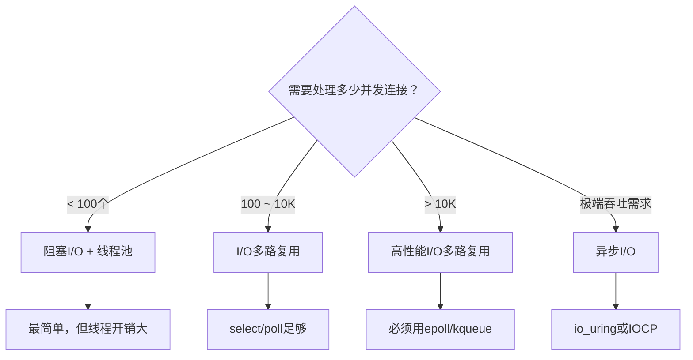
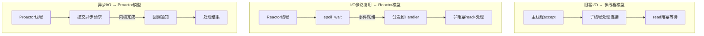

# I/O模型核心概念

## 1 什么是I/O：从用户视角到内核视角

### 1.1 I/O的本质定义

在计算机科学中，I/O（Input/Output，输入/输出）指的是**计算机与外部世界之间的数据交换过程**。这个定义看似简单，但它涵盖了极其广泛的操作：

| I/O类型 | 典型操作 | 设备/通道 |
|---------|---------|----------|
| 磁盘I/O | 文件读写、数据库查询 | 硬盘、SSD、NVMe |
| 网络I/O | HTTP请求、数据库连接、RPC调用 | 网卡、交换机 |
| 终端I/O | 键盘输入、屏幕输出 | TTY、虚拟终端 |
| 管道I/O | 进程间通信（IPC） | 管道、命名管道 |
| 内存映射I/O | mmap、共享内存 | 虚拟内存系统 |

从用户程序的角度看，I/O似乎很简单——调用`read()`或`write()`就行。但从操作系统内核的角度看，每一次I/O操作都涉及复杂的硬件交互、缓冲区管理和进程调度。**理解I/O模型的关键，在于理解这两个视角之间的鸿沟。**

### 1.2 内核空间与用户空间的隔离

现代操作系统采用**保护模式**，将内存划分为两个隔离区域：

┌─────────────────────────────────────┐
│           用户空间 (User Space)       │
│  应用程序、C库、运行时                │
│  地址范围：0x00000000 ~ 0xBFFFFFFF   │
│  权限：受限，不能直接访问硬件          │
├─────────────────────────────────────┤
│         系统调用接口 (syscall)         │
│  open/read/write/close/ioctl...     │
├─────────────────────────────────────┤
│           内核空间 (Kernel Space)     │
│  VFS、文件系统、网络协议栈、驱动程序    │
│  地址范围：0xC0000000 ~ 0xFFFFFFFF   │
│  权限：最高特权级，可访问所有硬件       │
└─────────────────────────────────────┘

这个隔离设计带来了一个根本性问题：**用户程序无法直接访问I/O设备**。每一次I/O操作都必须通过**系统调用**陷入内核态，由内核代为完成。这意味着：

1. **上下文切换开销**：用户态→内核态→用户态的切换，每次约消耗100-1000纳秒
2. **数据拷贝开销**：数据需要在内核缓冲区和用户缓冲区之间搬运
3. **等待开销**：当数据未就绪时，进程必须等待——问题是，**怎么等**？

**I/O模型的核心问题就是：在等待数据就绪和数据拷贝完成的过程中，用户进程应该采取什么策略？**

### 1.3 文件描述符：I/O的统一抽象

Linux遵循"一切皆文件"的哲学，通过**文件描述符（File Descriptor，fd）** 统一抽象所有I/O资源：

```c
// 每个进程维护一个文件描述符表
struct files_struct {
    struct fdtable __rcu *fdt;  // fdtable指针
    struct fdtable fdtab;       // 默认fdtable（内嵌，避免小表动态分配）
    // ...
};

struct fdtable {
    unsigned int max_fds;       // 当前fd表最大容量
    struct file __rcu **fd;     // fd → struct file* 的映射数组
    // ...
};
```

不同类型的I/O资源映射为不同类型的内核对象，但对外暴露统一的`read()`/`write()`接口：

fd=0  →  /dev/pts/0 (stdin)     →  struct file → struct tty_fileops
fd=1  →  /dev/pts/0 (stdout)    →  struct file → struct tty_fileops
fd=3  →  /tmp/data.bin          →  struct file → ext4_file_operations
fd=4  →  socket (TCP连接)        →  struct file → socket_file_ops
fd=5  →  pipe (管道)            →  struct file → pipe_file_operations

这个统一抽象意味着**I/O模型的讨论适用于所有类型的I/O操作**——无论是读文件、收网络数据还是管道通信，底层的阻塞/非阻塞行为本质上是相同的。

### 1.4 缓冲区：I/O性能的关键

内核为每种I/O资源维护缓冲区，这是理解I/O两阶段模型的物理基础：

**网络I/O缓冲区**：
┌────────────────────────────────────────────┐
│                网卡 (NIC)                    │
│  ┌──────────┐                               │
│  │ 接收队列  │ → DMA将数据从网卡搬运到内存    │
│  └──────────┘                               │
└────────────────────────────────────────────┘
         │ 硬件中断 → 软中断(NET_RX_SOFTIRQ)
         ▼
┌────────────────────────────────────────────┐
│              内核协议栈                       │
│  ┌──────────────────────────────────────┐  │
│  │ sk_buff 链表 (接收缓冲区)             │  │
│  │ [skb1] <-> [skb2] <-> [skb3]         │  │
│  │ 每个skb包含：MAC头 + IP头 + TCP头 + 数据 │  │
│  └──────────────────────────────────────┘  │
│  tcp_rcv_established() 处理TCP数据          │
└────────────────────────────────────────────┘
         │ 数据拷贝 (skb_copy_datagram_msg)
         ▼
┌────────────────────────────────────────────┐
│              用户空间缓冲区                   │
│  char buf[1024];                           │
│  read(fd, buf, sizeof(buf));               │
└────────────────────────────────────────────┘

**磁盘I/O缓冲区**：
┌────────────────────────────────────────────┐
│              Page Cache (页缓存)             │
│  ┌────┐ ┌────┐ ┌────┐ ┌────┐              │
│  │page│ │page│ │page│ │page│  ← 内核维护    │
│  └────┘ └────┘ └────┘ └────┘              │
│  文件数据在磁盘和页缓存之间按页(4KB)管理      │
└────────────────────────────────────────────┘
         │ 数据拷贝 (copy_to_user)
         ▼
┌────────────────────────────────────────────┐
│              用户空间缓冲区                   │
│  char buf[4096];                           │
│  read(fd, buf, sizeof(buf));               │
└────────────────────────────────────────────┘

理解缓冲区的存在，是理解为什么I/O可以分为"数据准备"和"数据拷贝"两个阶段的物理基础。

## 2 I/O操作的两个阶段

一次完整的I/O操作（以`read()`为例）可以分解为两个清晰的阶段。这个两阶段模型是理解所有I/O模型差异的基石。

### 2.1 阶段一：数据准备（Data Preparation）

在这个阶段，**内核等待外部事件发生**——可能是等待网络数据包到达网卡，也可能是等待磁盘控制器完成DMA传输。这个过程的时间取决于外部设备的速度，通常比CPU操作慢几个数量级。

对于**网络I/O**，数据准备阶段包括：
1. 数据包到达网卡，触发DMA传输到内核内存
2. 网卡触发硬件中断
3. 内核执行中断处理程序和软中断（`NET_RX_SOFTIRQ`）
4. 数据包在协议栈中逐层处理（以太网→IP→TCP）
5. TCP层将数据放入socket的接收缓冲区

对于**磁盘I/O**，数据准备阶段包括：
1. 向磁盘控制器发送读请求
2. 磁盘执行寻道、旋转、读取操作（机械硬盘：毫秒级）
3. 数据通过DMA传输到内核页缓存

### 2.2 阶段二：数据拷贝（Data Copy）

当数据在内核缓冲区就绪后，需要将数据从**内核空间拷贝到用户空间**。这是CPU参与的操作，虽然比数据准备快，但在高吞吐场景下仍然可观。

```c
// 数据拷贝的内核路径（网络I/O）
// net/ipv4/tcp.c → net/core/datagram.c
int skb_copy_datagram_msg(struct sk_buff *skb, int offset,
                          struct iov_iter *msg, int len) {
    // 遍历用户空间的iovec数组
    // 对每个用户缓冲区执行 copy_to_user()
    return copy_to_iter(skb->data + offset, len, msg);
}
```

### 2.3 两阶段的时间特征

理解两个阶段的时间特征对于选择I/O模型至关重要：

| 阶段 | 操作 | 典型耗时 | CPU参与度 | 主要瓶颈 |
|------|------|---------|----------|---------|
| 数据准备 | 等待外部事件 | μs ~ ms级 | 低（中断处理） | I/O设备速度 |
| 数据拷贝 | 内核→用户空间拷贝 | ns ~ μs级 | 高（CPU搬运） | 内存带宽 |

关键观察：
- 数据准备阶段通常是**瓶颈所在**，耗时远大于数据拷贝
- 数据拷贝阶段虽然较快，但涉及内存拷贝，仍有优化空间（零拷贝技术）
- 不同I/O模型的核心区别在于：**在这两个阶段中，用户进程是否被阻塞**

### 2.4 用时序图理解两阶段

以read(fd, buf, n) 为例：

数据准备阶段                    数据拷贝阶段
┌──────────────────┐         ┌──────────────┐
│ 内核等待数据到达    │         │ 数据从内核     │
│ - 网卡DMA接收     │         │ 拷贝到用户buf  │
│ - 中断处理        │ ──────→ │ - copy_to_user│
│ - 协议栈处理      │         │ - 返回用户态   │
│ - 放入内核缓冲区   │         │               │
└──────────────────┘         └──────────────┘
       ↓                            ↓
   无法进行其他计算              CPU密集搬运
   （进程可以阻塞或轮询）        （进程必须等待）

## 3 五种I/O模型

根据POSIX标准和W. Richard Stevens在《UNIX网络编程》中的经典分类，操作系统提供了五种基本I/O模型。它们在两个阶段的阻塞行为上有本质区别。

### 3.1 同步I/O与异步I/O的精确定义

在讨论具体模型之前，必须先厘清一个经常被混淆的概念对——**同步I/O和异步I/O**。

POSIX（IEEE Std 1003.1）的精确定义：

> **同步I/O**：导致请求线程阻塞，直到I/O操作完成。包括`read()`、`write()`、`sendmsg()`、`recvmsg()`等。

> **异步I/O**：不导致请求线程阻塞。内核在I/O操作完成后通过信号或回调通知用户进程。

判断标准非常明确：**数据拷贝阶段是否需要用户进程主动参与（发起read/write系统调用）？**

- 如果数据拷贝阶段需要用户进程发起系统调用（如`read()`），即使数据在内核已经就绪——**这是同步I/O**
- 如果内核在完成数据准备**和**数据拷贝后，主动通知用户进程结果——**这是异步I/O**

```c
// 同步I/O：用户进程必须发起read()来获取数据
ssize_t n = read(fd, buf, sizeof(buf));
// ↑ 这个系统调用在数据拷贝完成后才返回
// 用户进程在拷贝过程中是阻塞的（或忙等待的）

// 异步I/O：内核完成一切后通知用户
struct iocb cb = { .aio_fildes = fd, .aio_buf = buf, .aio_nbytes = n };
io_submit(ctx, 1, &amp;cb);
// ↑ 立即返回，内核在后台完成读取+拷贝
// 用户进程通过io_getevents()或信号获取完成通知
```

### 3.2 五种模型全景对比

| 模型 | 数据准备阶段 | 数据拷贝阶段 | 本质类型 | 阻塞语义 |
|------|-------------|-------------|---------|---------|
| 阻塞I/O | 进程阻塞 | 进程阻塞 | 同步 | 两阶段均阻塞 |
| 非阻塞I/O | 轮询（EAGAIN） | 进程阻塞 | 同步 | 准备非阻塞，拷贝阻塞 |
| I/O多路复用 | 在select/poll/epoll上阻塞 | 进程阻塞 | 同步 | 多路等待+拷贝阻塞 |
| 信号驱动I/O | 信号通知（非阻塞） | 进程阻塞 | 同步 | 信号触发+拷贝阻塞 |
| 异步I/O | 非阻塞 | 内核完成 | 异步 | 全程非阻塞 |

### 3.3 模型一：阻塞I/O（Blocking I/O）

**核心行为**：用户进程调用`read()`后，内核在数据未就绪时将进程挂起，直到数据准备完成并拷贝到用户空间后才返回。

```c
// 阻塞I/O的典型代码
char buf[1024];
ssize_t n = read(fd, buf, sizeof(buf));
// ↑ 进程在此行被挂起（调度出去）
// ↑ 直到数据到达 + 数据拷贝完成后才返回
process(buf, n);
```

时序图：

用户进程                          内核
   │                               │
   │─── read(fd, buf, 1024) ──────>│
   │                               │ ① 数据准备：等待网卡接收
   │       进程阻塞（让出CPU）        │    中断处理
   │       ◄───── 挂起 ─────►      │    协议栈处理
   │                               │    放入socket缓冲区
   │                               │ ② 数据拷贝：copy_to_user
   │<──── 返回n字节 ───────────────│
   │                               │
   │  继续执行                      │

**内核实现路径**：

```c
// 简化的内核阻塞读取（net/ipv4/tcp.c）
static ssize_t tcp_read_iter(struct kiocb *iocb, struct iov_iter *to) {
    struct sock *sk = iocb->ki_filp->private_data;
    long timeo = sock_rcvtimeo(sk, flags &amp; MSG_DONTWAIT);

    // 如果数据未就绪，进入等待
    sk_wait_data(sk, &amp;timeo, skb);
    //     ↑ 进程被加入等待队列
    //     ↑ schedule()让出CPU
    //     ↑ 直到数据到达被中断唤醒

    // 数据就绪，拷贝到用户空间
    skb_copy_datagram_msg(skb, 0, to, copied);
    return copied;
}
```

**优点**：编程模型最简单，适合连接数少且每个连接需要可靠顺序处理的场景。

**缺点**：每个连接占用一个线程/进程，万级连接时线程开销成为瓶颈。

**适用场景**：传统CGI程序、简单命令行工具、连接数<100的服务。

### 3.4 模型二：非阻塞I/O（Non-blocking I/O）

**核心行为**：将fd设置为`O_NONBLOCK`后，`read()`在数据未就绪时立即返回`EAGAIN`，不会阻塞进程。用户进程需要不断轮询来检查数据是否就绪。

```c
// 设置非阻塞
int flags = fcntl(fd, F_GETFL, 0);
fcntl(fd, F_SETFL, flags | O_NONBLOCK);

// 非阻塞轮询读取
while (1) {
    ssize_t n = read(fd, buf, sizeof(buf));
    if (n > 0) {
        process(buf, n);
        break;                    // 数据读完，退出循环
    } else if (n == -1 &amp;&amp; errno == EAGAIN) {
        do_other_work();          // 数据未就绪，先干别的
        usleep(1000);             // 短暂休眠后重试
    } else {
        perror("read");           // 真正的错误
        break;
    }
}
```

时序图：

用户进程                          内核
   │                               │
   │─── read(fd, buf) ────────────>│  数据未就绪
   │<── 返回-1, EAGAIN ────────────│  立即返回
   │                               │
   │  执行其他工作...               │
   │                               │
   │─── read(fd, buf) ────────────>│  数据未就绪
   │<── 返回-1, EAGAIN ────────────│  立即返回
   │                               │
   │  执行其他工作...               │
   │                               │  数据到达
   │─── read(fd, buf) ────────────>│  数据已就绪
   │                               │  数据拷贝
   │<──── 返回n字节 ───────────────│
   │                               │
   │  处理数据                      │

**核心问题：忙等待（Busy Polling）**

纯非阻塞I/O的最大问题是**CPU空转**——进程在无限循环中不断发起系统调用检查数据是否就绪，即使数据远未到达，CPU也在消耗时间。在现代操作系统中，CPU时间是最宝贵的资源，忙等待意味着其他进程得不到调度。

因此，**非阻塞I/O几乎不会单独使用**，它通常与I/O多路复用结合——用epoll/kqueue等机制高效地等待数据就绪通知，然后用非阻塞读取确保ET模式下不会遗漏数据。

```c
// 实际模式：非阻塞fd + epoll（ET模式）
fcntl(fd, F_SETFL, O_NONBLOCK);

struct epoll_event ev = { .events = EPOLLIN | EPOLLET, .data.fd = fd };
epoll_ctl(epfd, EPOLL_CTL_ADD, fd, &amp;ev);

while (1) {
    int nfds = epoll_wait(epfd, events, MAX_EVENTS, -1);
    for (int i = 0; i < nfds; i++) {
        // epoll通知fd可读，但必须循环读取直到EAGAIN
        ssize_t n;
        while ((n = read(events[i].data.fd, buf, sizeof(buf))) > 0) {
            process(buf, n);
        }
        // n == -1 &amp;&amp; errno == EAGAIN → 数据读完
    }
}
```

**适用场景**：与I/O多路复用组合使用，构建高性能事件驱动服务器。

### 3.5 模型三：I/O多路复用（I/O Multiplexing）

**核心行为**：用户进程调用`select()`/`poll()`/`epoll_wait()`，同时监控多个fd。进程在这些系统调用上阻塞，但一旦任意一个fd就绪，系统调用立即返回，然后用户进程用`read()`读取数据。

这是**Linux高性能服务器的核心I/O模型**，后续章节将深入分析select/poll/epoll的实现差异。

```c
// I/O多路复用：同时监控多个fd
struct epoll_event events[MAX_EVENTS];

while (1) {
    // 阶段1：在epoll_wait上阻塞，等待任意fd就绪
    int nfds = epoll_wait(epfd, events, MAX_EVENTS, -1);

    // 阶段2：遍历就绪的fd，逐个读取
    for (int i = 0; i < nfds; i++) {
        ssize_t n = read(events[i].data.fd, buf, sizeof(buf));
        process(buf, n);
    }
}
```

时序图：

用户进程                    内核
   │                         │
   │── epoll_wait() ────────>│
   │                         │  检查所有fd
   │  进程阻塞                │
   │  ◄─── 等待中 ──►        │
   │                         │  fd=3 有数据到达
   │<── 返回nfds=1 ──────────│  唤醒进程
   │                         │
   │── read(fd=3) ──────────>│  数据拷贝
   │<── 返回n字节 ───────────│
   │                         │
   │── epoll_wait() ────────>│  继续监控
   │  ...                    │

**关键特征**：
- 进程在`epoll_wait()`上阻塞时，能同时监控成千上万个fd
- 这是**同步I/O**——数据拷贝仍然需要用户进程发起`read()`系统调用
- 优势不在于"异步"，而在于"用一个线程高效处理多个连接"

**适用场景**：Web服务器（nginx）、缓存系统（Redis）、网络代理（HAProxy）等需要处理大量并发连接的场景。

### 3.6 模型四：信号驱动I/O（Signal-driven I/O）

**核心行为**：用户进程通过`signal()`注册`SIGIO`信号处理函数，然后继续执行其他任务。当fd上有数据到达时，内核向进程发送`SIGIO`信号，进程在信号处理函数中调用`read()`读取数据。

```c
// 信号驱动I/O的典型代码
#include <signal.h>
#include <fcntl.h>

void sigio_handler(int signo) {
    char buf[1024];
    ssize_t n = read(sigio_fd, buf, sizeof(buf));
    process(buf, n);
}

// 注册信号处理函数
signal(SIGIO, sigio_handler);

// 设置fd为信号驱动模式
fcntl(fd, F_SETFL, O_ASYNC | O_NONBLOCK);
fcntl(fd, F_SETOWN, getpid());  // 指定接收信号的进程

// 现在可以执行其他任务，SIGIO会在数据到达时触发
while (1) {
    do_other_work();
    pause();  // 等待信号
}
```

时序图：

用户进程                          内核
   │                               │
   │  注册SIGIO处理函数 + 设置O_ASYNC │
   │                               │
   │  执行其他工作...               │
   │                               │
   │                               │  数据到达，处理完成
   │<── SIGIO信号 ─────────────────│  内核发送信号
   │                               │
   │  信号处理函数执行               │
   │─── read(fd) ─────────────────>│
   │                               │  数据拷贝
   │<──── 返回n字节 ───────────────│
   │                               │
   │  继续执行其他工作...            │

**优点**：在数据准备阶段完全不阻塞进程，由内核主动通知。

**缺点**：
- 数据拷贝阶段仍然同步（需要用户在信号处理函数中调用`read()`）
- 信号处理函数有诸多限制（不能使用`malloc`、不能阻塞等）
- 多个信号可能排队导致信号丢失
- 在高并发场景下，信号机制的性能和可靠性不如I/O多路复用

**适用场景**：低并发的UDP服务、某些特殊的网络监控场景。实践中较少使用，大多数场景已被epoll取代。

### 3.7 模型五：异步I/O（Asynchronous I/O）

**核心行为**：用户进程发起I/O请求后立即返回，内核在数据准备**和**数据拷贝都完成后，通过信号或回调通知用户进程。这是唯一真正意义上的异步I/O模型。

```c
// Linux AIO（io_submit/io_getevents）
#include <linux/aio_abi.h>

// 1. 创建AIO上下文
aio_context_t ctx = 0;
io_setup(128, &amp;ctx);

// 2. 提交异步读取请求
struct iocb cb = {
    .aio_fildes = fd,
    .aio_buf = (uint64_t)buf,
    .aio_nbytes = 1024,
    .aio_lio_opcode = IOCB_CMD_PREAD,
};
struct iocb *cbs[1] = { &amp;cb };
io_submit(ctx, 1, cbs);
// ↑ 立即返回，内核在后台完成读取+拷贝

// 3. 获取完成事件（轮询或eventfd通知）
struct io_event events[1];
io_getevents(ctx, 1, 1, events, NULL);
// ↑ 事件已就绪，数据已在buf中
process(buf, events[0].res);
```

时序图：

用户进程                          内核
   │                               │
   │─── io_submit(读取请求) ──────>│
   │<── 立即返回 ──────────────────│  请求入队
   │                               │
   │  继续执行其他任务               │  ① 数据准备
   │  （不被I/O阻塞）              │  ② 数据拷贝到用户buf
   │                               │
   │  ... 完成后 ...               │
   │<── SIGIO / 信号通知 ──────────│  通知用户
   │                               │
   │─── io_getevents() ──────────>│
   │<── 返回完成事件 ──────────────│  数据已在buf中
   │                               │
   │  处理数据（无需再read()）       │

**关键区别**：这是唯一在数据拷贝阶段也不阻塞用户的模型。内核完成了全部工作，用户进程拿到的是**已经准备好的数据**。

**Linux异步I/O的实现历史**：

| 实现 | 时期 | 限制 | 评价 |
|------|------|------|------|
| POSIX AIO（glibc） | 早期 | 用户态线程池模拟 | 伪异步，开销大 |
| Linux AIO（io_submit） | 2.5+ | 仅支持O_DIRECT | 实用性受限 |
| io_uring | 5.1+ | 无显著限制 | 真正的高性能异步I/O |

## 4 五种模型的决策框架

### 4.1 如何选择I/O模型

选择哪种I/O模型取决于四个维度的权衡：



### 4.2 性能特征对比

| 维度 | 阻塞I/O | 非阻塞I/O | I/O多路复用 | 信号驱动 | 异步I/O |
|------|---------|----------|-----------|---------|--------|
| 编程复杂度 | ★☆☆☆☆ | ★★★☆☆ | ★★★☆☆ | ★★★★☆ | ★★★★☆ |
| 最大并发 | 低 | 中 | 高 | 中 | 极高 |
| CPU利用率 | 低 | 低（忙等待） | 高 | 中 | 极高 |
| 系统调用次数 | 每次I/O 1次 | 轮询N次 | wait 1次 + 读N次 | 信号触发 | 提交+获取 |
| 数据准备等待 | 阻塞 | 轮询 | 多路等待 | 信号通知 | 内核完成 |
| 数据拷贝 | 阻塞 | 阻塞 | 阻塞 | 阻塞 | 内核完成 |

### 4.3 真实世界的模型选择

大多数高性能服务器并非使用单一模型，而是**混合使用**：

| 服务器/框架 | 主I/O模型 | 辅助模型 | 处理方式 |
|------------|----------|---------|---------|
| nginx | epoll (LT+ET) | 非阻塞I/O | 事件驱动+非阻塞读写 |
| Redis | epoll | 非阻塞I/O | 单线程事件循环 |
| Node.js | epoll (libuv) | 非阻塞I/O | 单线程Reactor |
| Java NIO | epoll/kqueue | 非阻塞I/O | Selector+Channel |
| Go netpoller | epoll | goroutine阻塞语义 | M:N线程模型 |
| libuv | epoll/kqueue/IOCP | 非阻塞I/O | 跨平台事件循环 |

值得注意的是**Go语言的goroutine模型**——Go运行时在内部使用epoll，但对程序员暴露的是阻塞式API。goroutine在底层被挂起和恢复，让程序员用同步的写法获得异步的性能。

## 5 I/O模型与并发模型的关系

### 5.1 从I/O模型到架构模式

I/O模型的选择直接影响服务器的并发架构设计：



### 5.2 Reactor模式：I/O多路复用的架构化

Reactor模式是I/O多路复用模型的标准化架构范式，被nginx、Redis、Netty等广泛采用：

┌────────────────────────────────────────────────┐
│                   Reactor                       │
│                                                │
│  ┌──────────┐    ┌──────────┐    ┌──────────┐ │
│  │ Demultiplexer│──→│ Dispatcher│──→│ Handler  │ │
│  │ (epoll_wait) │   │ (路由分发) │   │ (业务处理)│ │
│  └──────────┘    └──────────┘    └──────────┘ │
│       │                              ↑         │
│       │                              │         │
│       ▼                              │         │
│  ┌──────────┐              ┌──────────┐       │
│  │ Event Loop│──────────────│ Acceptor │       │
│  │ (事件循环) │              │ (接受连接) │       │
│  └──────────┘              └──────────┘       │
└────────────────────────────────────────────────┘

### 5.3 Proactor模式：异步I/O的架构化

Proactor模式是异步I/O模型的标准化架构范式，目前在Linux上由io_uring提供支持：

┌────────────────────────────────────────────────┐
│                   Proactor                      │
│                                                │
│  ┌──────────┐    ┌──────────┐    ┌──────────┐ │
│  │ Initiator │──→│ OS/内核   │──→│ Completion│ │
│  │ (提交请求) │   │ (异步执行) │   │ Handler  │ │
│  └──────────┘    └──────────┘    └──────────┘ │
│       ↑                              │         │
│       │                              │         │
│       │    ┌──────────┐              │         │
│       └────│ Completion│──────────────┘         │
│            │ Queue     │                        │
│            └──────────┘                         │
└────────────────────────────────────────────────┘

### 5.4 Reactor vs Proactor：核心差异

| 特征 | Reactor | Proactor |
|------|---------|----------|
| I/O模型 | 同步I/O（I/O多路复用） | 异步I/O |
| 谁做数据拷贝 | 用户线程（read/write） | 内核（io_submit/IOCP） |
| 系统调用模式 | epoll_wait + read | io_submit（批量） |
| 编程模型 | 回调/事件驱动 | 回调/Completion |
| Linux实现 | epoll | io_uring |
| Windows实现 | select | IOCP |
| 当前成熟度 | 非常成熟 | 快速成熟中 |

## 6 关键性能指标

评估I/O模型性能时，需要关注以下核心指标：

### 6.1 延迟（Latency）

**端到端延迟** = 数据准备延迟 + 数据拷贝延迟 + 应用处理延迟

| I/O模型 | 延迟组成 | 典型值 |
|---------|---------|-------|
| 阻塞I/O | 等待+拷贝+处理 | 取决于I/O设备 |
| I/O多路复用 | 多路等待+拷贝+处理 | 略高于阻塞I/O |
| 异步I/O | 通知延迟+处理 | 最低（无拷贝等待） |

### 6.2 吞吐量（Throughput）

吞吐量衡量单位时间内完成的I/O操作数量。关键影响因素：

- **并发连接数**：I/O多路复用和异步I/O支持远高于阻塞I/O的并发
- **上下文切换频率**：线程越多，切换开销越大
- **系统调用频率**：每次系统调用约100ns开销
- **内存拷贝次数**：零拷贝技术可显著提升吞吐

### 6.3 CPU利用率

CPU利用率模型：

阻塞I/O（多线程）：
  [线程1: ███░░░███░░░███]  ← 大量时间在等待（线程挂起）
  [线程2: ░░░███░░░███░░░]
  [线程3: █░░░███░░░███░░]
  CPU在线程切换上浪费30-50%

I/O多路复用（单线程）：
  [单线程: ████████████████]  ← 全部时间在处理有效数据
  CPU利用率可达90%+

异步I/O（零拷贝）：
  [处理线程: ████████████████]  ← 无需等待+无需拷贝
  CPU利用率可达95%+

### 6.4 资源开销对比

| 资源 | 阻塞I/O（10K连接） | I/O多路复用 | 异步I/O |
|------|-------------------|-----------|--------|
| 线程数 | ~10,000 | 1~N | 1~N |
| 内存消耗 | ~80GB（8MB/线程） | ~100MB | ~100MB |
| 上下文切换 | 极高 | 低 | 极低 |
| 系统调用 | 中 | 高（多路轮询） | 低（批量提交） |

## 7 常见误区与正确认知

### 误区一："非阻塞I/O就是异步I/O"

**错误认知**：设置了`O_NONBLOCK`后，I/O就是异步的。

**正确认知**：非阻塞I/O仍然属于同步I/O。`O_NONBLOCK`只改变了数据准备阶段的行为（从阻塞变为立即返回`EAGAIN`），但数据拷贝阶段仍然需要用户进程发起`read()`系统调用并等待完成。真正的异步I/O要求内核完成数据拷贝后才通知用户。

### 误区二："I/O多路复用是异步的"

**错误认知**：`epoll_wait()`能同时监控多个fd，所以是异步I/O。

**正确认知**：I/O多路复用是同步I/O的增强形式。`epoll_wait()`在数据准备阶段高效地等待多个fd，但当`epoll_wait()`返回后，用户仍然需要调用`read()`来完成数据拷贝。I/O多路复用的核心价值不是"异步"，而是"用一个线程高效处理多个连接"。

### 误区三："epoll_wait返回后数据已经在用户缓冲区了"

**错误认知**：`epoll_wait()`返回意味着数据已经可读，调用`read()`就能立即获取数据。

**正确认知**：`epoll_wait()`返回只意味着内核缓冲区中有数据可读（数据准备完成），但`read()`还需要执行数据拷贝（从内核缓冲区到用户缓冲区）。在大多数场景下这个拷贝很快，但在极高吞吐场景下（如10Gbps网络），拷贝本身可能成为瓶颈——这就是零拷贝技术（`sendfile()`、`splice()`）存在的原因。

### 误区四："select比epoll慢很多所以不能用"

**错误认知**：select在所有场景下都不如epoll，应该永远用epoll。

**正确认知**：select在fd数量较少（< 500）且活跃连接比例低的场景下，性能与epoll相当，甚至因为内核实现更简单而略快。select的劣势主要体现在fd数量多（> 1000）的场景。跨平台兼容性方面，select在所有POSIX系统上都可用，而epoll是Linux专属。

### 误区五："Go语言的阻塞I/O模型效率低"

**错误认知**：Go的`net.Conn.Read()`看起来是阻塞的，所以每个连接需要一个OS线程，效率不如事件驱动模型。

**正确认知**：Go运行时在底层使用了M:N线程模型（goroutine到OS线程的映射）。当goroutine执行阻塞I/O时，Go运行时将其调度到其他goroutine上，底层使用epoll实现高效的等待。程序员看到的是阻塞API，但性能等价于事件驱动模型。

## 8 本节小结

I/O模型的核心问题是：**在I/O操作的两个阶段（数据准备+数据拷贝）中，用户进程应该采取什么策略？**

I/O模型知识框架：

                    ┌──────────────┐
                    │  I/O两阶段    │
                    │ 准备 + 拷贝   │
                    └──────┬───────┘
                           │
          ┌────────────────┼────────────────┐
          │                │                │
    ┌─────▼─────┐   ┌──────▼──────┐  ┌──────▼──────┐
    │ 同步I/O    │   │ 同步I/O增强  │  │ 异步I/O     │
    │ 阻塞/非阻塞 │   │ 多路复用     │  │ 内核完成    │
    │ 信号驱动    │   │ epoll/kqueue │  │ io_uring    │
    └─────┬─────┘   └──────┬──────┘  └──────┬──────┘
          │                │                │
          ▼                ▼                ▼
    ┌──────────┐   ┌──────────┐   ┌──────────┐
    │多线程模型  │   │Reactor   │   │Proactor  │
    │线程池模型  │   │事件循环   │   │完成通知   │
    └──────────┘   └──────────┘   └──────────┘

掌握这些核心概念后，后续章节将深入分析每种模型的内核实现细节、性能特征和最佳实践。理解"为什么"比记住"是什么"更重要——当你理解了I/O两阶段模型和同步/异步的本质区别，就能在面对新的技术（如io_uring、eBPF）时，快速判断它的本质归属和适用场景。

## 参考文献

1. W. Richard Stevens, *UNIX Network Programming, Volume 1: The Sockets Networking API*, 3rd Edition, 2003 — 第6章"I/O Multiplexing: The select and poll Functions"
2. Dan Kegel, *The C10K Problem*, 2003 — http://www.kegel.com/c10k.html
3. Linux内核源码: `fs/read_write.c`, `include/linux/fs.h`, `net/ipv4/tcp.c`
4. Robert Love, *Linux Kernel Development*, 3rd Edition, 2010 — 等待队列与进程调度
