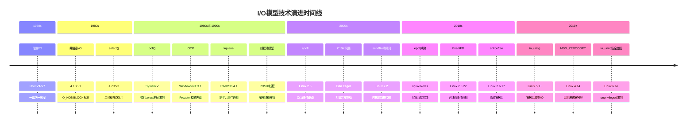
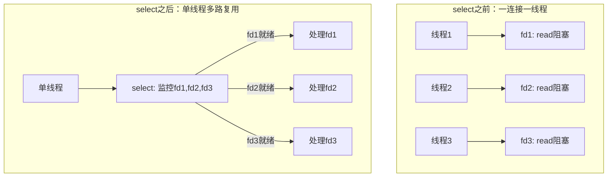

# I/O模型技术演进

## 1. 演进总览

I/O模型的发展史，本质上是一部**操作系统应对不断增长的并发需求**的进化史。从1970年代Unix诞生时的单一阻塞读写，到2019年Linux引入io_uring，每一次范式跃迁都源于一个共同的矛盾：**应用程序需要处理的连接数/文件数，远超操作系统原始设计的预期**。



### 演进的核心驱动力

每一次I/O模型的跃迁都不是凭空发生的，而是由三股力量共同推动：

```mermaid
graph TD
    A[驱动演进的三股力量] --> B[硬件性能跃迁]
    A --> C[应用规模爆发]
    A --> D[内核设计哲学转变]

    B --> B1[CPU速度 >> I/O设备速度]
    B --> B2[NVMe让存储延迟降至μs级]
    B --> B3[100GbE网卡让网络带宽暴增]

    C --> C1[C10K → C10M → C100M]
    C --> C2[互联网用户指数增长]
    C --> C3[微服务拆分增加内部通信]

    D --> D1["简单即美" → "性能至上"]
    D --> D2[内核态优化 → 用户态协作]
    D --> D3[同步阻塞 → 异步无阻塞]
```

## 2. 第一阶段：阻塞时代（1970s-1980s初）

### 2.1 设计背景

早期Unix系统（V1-V7，1971-1979）的设计目标是**多用户分时共享**，而非高并发网络服务。在那个时代：

- 一台PDP-11小型机同时服务十几个终端用户
- 网络尚处于ARPANET阶段，TCP/IP尚未标准化（1981年RFC 793才定义TCP）
- 文件I/O和终端I/O是主要的I/O形式
- 进程（非线程）是基本的并发单元——POSIX线程标准要到1995年才发布
- 物理内存极其有限，典型的PDP-11只有64KB-256KB内存

在这种环境下，"一个请求一个进程"的阻塞模型完全够用：

```c
// 1970s风格的服务器：简单、直接、够用
while (1) {
    int client_fd = accept(server_fd, NULL, NULL);
    if (fork() == 0) {
        // 子进程处理单个客户端
        char buf[1024];
        int n = read(client_fd, buf, sizeof(buf));  // 阻塞等待
        process_request(buf, n);
        write(client_fd, response, resp_len);
        close(client_fd);
        exit(0);
    }
    close(client_fd);  // 父进程关闭不需要的fd
}
```

### 2.2 阻塞I/O的内核实现

在内核层面，阻塞I/O的实现依赖于**等待队列（wait queue）**机制。当用户进程调用`read()`时，内核执行以下步骤：

用户进程调用 read(fd)
    │
    ▼
系统调用入口 → VFS层 → 具体文件系统/网络协议栈
    │
    ▼
检查数据是否就绪
    ├── 就绪 → 拷贝数据到用户空间 → 返回
    └── 未就绪 → 将进程加入 socket->sk_sleep 等待队列
                  → 设置进程状态为 TASK_INTERRUPTIBLE
                  → 调用 schedule() 让出CPU
                  → 进程进入睡眠状态，不再占用CPU时间片
                  → 数据到达时由中断处理程序唤醒
                  → 软中断(NET_RX_SOFTIRQ)将数据放入socket缓冲区
                  → wake_up() 唤醒等待队列上的进程
                  → 进程重新被调度 → 数据拷贝 → 返回

**关键数据结构**：每个socket在内核中对应一个`struct sock`，其中的`sk_sleep`是等待队列头。当`read()`发现数据未就绪时，调用`sk_wait_data()`将当前进程挂起：

```c
// 简化的内核阻塞等待路径
// net/core/sock.c
int sk_wait_data(struct sock *sk, long *timeo, const struct sk_buff *skb) {
    // 1. 将当前进程加入等待队列
    prepare_to_wait(&amp;sk->sk_sleep, &amp;wait, TASK_INTERRUPTIBLE);
    // 2. 设置超时时间
    *timeo = schedule_timeout(*timeo);
    // 3. 如果被唤醒（数据到达），timeo > 0
    //    如果超时，timeo == 0
    finish_wait(&amp;sk->sk_sleep, &amp;wait);
    return *timeo;
}
```

### 2.3 C10问题的萌芽

阻塞模型在扩展性上的问题可以归纳为"C10问题"的早期形态：

| 限制因素 | 具体表现 | 瓶颈原因 |
|---------|---------|---------|
| 进程数上限 | 早期Unix每个用户进程约2-4MB内存 | 物理内存有限（KB-MB级） |
| 进程创建开销 | fork()需要复制页表、文件描述符表 | 每次连接都fork代价高 |
| 上下文切换开销 | 进程切换需要保存/恢复完整寄存器状态 | 频繁切换导致CPU时间浪费 |
| 文件描述符限制 | 默认每个进程最多256个fd | FD_SETSIZE限制 |
| CPU利用率低 | 大部分时间进程在睡眠等待I/O | CPU空闲但无法服务新请求 |

这些问题在100个并发连接时并不明显，但当互联网在1990年代爆发式增长时，它们变成了致命瓶颈。一个简单的计算就能说明问题：如果每个连接需要一个fork()，而fork()在PDP-11上需要约50ms，那么每秒最多只能处理20个新连接——这对于早期的Web服务器来说就已经捉襟见肘。

## 3. 第二阶段：非阻塞与多路复用的诞生（1980s）

### 3.1 非阻塞I/O的引入

1983年，BSD 4.1引入了`O_NONBLOCK`标志，让进程可以在I/O未就绪时立即获得`EAGAIN`返回值，而非无限制地阻塞。

```c
// BSD 4.1 引入的关键创新
int flags = fcntl(fd, F_GETFL, 0);
fcntl(fd, F_SETFL, flags | O_NONBLOCK);

// 非阻塞读取：数据未就绪时立即返回
ssize_t n = read(fd, buf, sizeof(buf));
if (n == -1 &amp;&amp; errno == EAGAIN) {
    // 数据还没到，做其他事
}
```

**核心意义**：非阻塞I/O将"什么时候数据准备好"的决定权从内核交还给了用户程序。这是一次根本性的范式转变——从"内核主导等待"变成"用户主导检查"。

但单纯的非阻塞I/O会导致**忙等待（busy polling）**——CPU空转轮询，效率极低：

非阻塞I/O的CPU使用模式：
┌─────────────────────────────────────────────────┐
│  read(fd) → EAGAIN → busy work → read(fd)       │
│  → EAGAIN → busy work → read(fd) → EAGAIN       │
│  → busy work → read(fd) → EAGAIN → ...          │
│                                                   │
│  问题：即使没有数据可读，CPU也在不断发起系统调用  │
│  每次系统调用的开销 ≈ 100ns                       │
│  如果每秒轮询100万次 → 仅轮询就消耗100ms CPU时间  │
└─────────────────────────────────────────────────┘

因此，**非阻塞I/O几乎不会单独使用**，它需要与I/O多路复用结合——用select/epoll高效地等待事件通知，然后用非阻塞读取处理数据。

### 3.2 select()的革命性创新

1983年，BSD 4.2引入了`select()`系统调用，这是I/O模型史上最重要的创新之一。它解决了一个根本性问题：**如何在一个线程中同时等待多个I/O事件**。

```c
// select的核心思想：用一次系统调用同时监控多个fd
fd_set readfds;
FD_ZERO(&amp;readfds);
FD_SET(fd1, &amp;readfds);  // 监控fd1
FD_SET(fd2, &amp;readfds);  // 监控fd2
FD_SET(fd3, &amp;readfds);  // 监控fd3

// 阻塞等待，直到任意一个fd就绪
int ready = select(max_fd + 1, &amp;readfds, NULL, NULL, NULL);

// 检查哪些fd就绪
if (FD_ISSET(fd1, &amp;readfds)) handle_fd1();
if (FD_ISSET(fd2, &amp;readfds)) handle_fd2();
if (FD_ISSET(fd3, &amp;readfds)) handle_fd3();
```

**select的设计哲学**：

1. **事件驱动**：不再轮询每个fd，而是让内核在有事件时通知
2. **单线程多路复用**：一个进程可以同时处理多个连接
3. **统一抽象**：socket、pipe、终端等所有fd类型都可以用select监控



**select的内核实现**：当用户调用`select()`时，内核执行以下步骤：

1. 将fd_set从用户空间拷贝到内核空间
2. 对每个fd调用其file_operations->poll()方法
   - 网络socket → tcp_poll()：检查接收缓冲区是否有数据
   - 管道 → pipe_poll()：检查管道缓冲区
   - 终端 → tty_poll()：检查输入缓冲区
3. 如果没有fd就绪，将当前进程加入所有fd的等待队列
4. 调用schedule()让出CPU
5. 当任意fd就绪，中断处理程序唤醒等待进程
6. 内核再次遍历所有fd，收集就绪的fd
7. 将结果fd_set拷贝回用户空间

### 3.3 select的致命缺陷

select虽然革命性，但存在几个根本性的限制，这些限制在C10K问题面前被彻底暴露：

**限制一：fd数量硬上限**

```c
// select使用fd_set位图，大小在编译时确定
#define FD_SETSIZE 1024  // 典型值（glibc默认）

// fd_set 实际是一个位数组
typedef struct {
    __fd_mask __fds_bits[__FD_SETSIZE / __NFDBITS];
} fd_set;
// __NFDBITS = 8 * sizeof(__fd_mask) = 64（64位系统）
// 因此 __fds_bits 数组有 1024/64 = 16 个元素
// 整个 fd_set 仅 128 字节，但它只能表示1024个fd的状态
```

1024个fd的限制在C10K问题面前远远不够。虽然可以通过重编译内核提高FD_SETSIZE，但这会导致二进制不兼容（依赖glibc的程序需要全部重编译），不是可扩展的解决方案。

**限制二：每次调用的O(n)开销**

select调用流程：
1. 将fd_set从用户空间拷贝到内核空间        → O(n)  memcpy
2. 内核遍历所有fd，调用各自的poll方法       → O(n)  每个fd一次函数调用
3. 如果没有就绪，进程睡眠，被唤醒后再次遍历 → O(n)
4. 将结果fd_set从内核空间拷贝回用户空间     → O(n)  memcpy
5. 用户遍历返回的fd_set，检查哪些就绪       → O(n)  位图扫描

每次`select`调用都需要这些O(n)操作。当fd数量达到10000时，假设每次poll调用耗时1μs，仅步骤2就需要10ms——这在实时性要求高的场景下是不可接受的。

**限制三：每次调用都需要重建监控集合**

```c
// 每次循环都需要重新设置fd_set
while (1) {
    fd_set readfds;
    FD_ZERO(&amp;readfds);           // 清空
    FD_SET(fd1, &amp;readfds);       // 重建
    FD_SET(fd2, &amp;readfds);       // 重建
    FD_SET(fd3, &amp;readfds);       // 重建
    select(n, &amp;readfds, ...);    // 调用
    // fd_set被select修改了（只保留就绪的fd）
    // 下次必须重建！
}
```

这个设计的根本原因是：select使用同一个fd_set既作为输入（要监控哪些fd）又作为输出（哪些fd就绪），导致每次调用后输入被破坏。

## 4. 第三阶段：poll、kqueue与平台化探索（1980s末-2000s）

### 4.1 poll()的改进

System V引入的`poll()`用`pollfd`数组替代了`fd_set`位图，解决了select的fd数量限制问题：

```c
struct pollfd fds[3];
fds[0].fd = fd1;  fds[0].events = POLLIN;
fds[1].fd = fd2;  fds[1].events = POLLIN;
fds[2].fd = fd3;  fds[2].events = POLLIN;

int ret = poll(fds, 3, -1);  // 阻塞等待
// fds[i].revents 包含实际发生的事件（与events分离）
```

**改进点对比**：

| 特性 | select | poll |
|------|--------|------|
| fd数量限制 | 1024（FD_SETSIZE） | 无理论限制（受系统内存约束） |
| 数据结构 | 位图（fd_set） | pollfd数组 |
| 输入/输出分离 | 否（fd_set被修改） | 是（events/revents分离） |
| 内核实现 | 遍历位图 | 遍历数组 |
| 类型安全 | 位操作，类型不安全 | 结构体，类型安全 |

**仍然存在的问题**：poll虽然取消了fd数量限制，但O(n)遍历的本质没有改变。每次调用仍然需要将整个数组拷贝到内核，内核仍然需要遍历所有fd调用每个的poll方法。在fd数量达到数万时，性能下降与select类似。

### 4.2 kqueue：BSD世界的答案

1998年，FreeBSD 4.1引入了`kqueue`（kernel queue），这是BSD/macOS世界对select/poll缺陷的回应。kqueue在设计理念上比epoll更早，但因为FreeBSD/Linux的生态差异，影响力不及epoll。

```c
// kqueue的基本用法（FreeBSD/macOS）
int kq = kqueue();

struct kevent change;
// 注册事件：监控fd的读就绪
EV_SET(&amp;change, fd, EVFILT_READ, EV_ADD | EV_ENABLE, 0, 0, NULL);
kevent(kq, &amp;change, 1, NULL, 0, NULL);  // 注册

// 等待事件
struct kevent events[16];
int nevents = kevent(kq, NULL, 0, events, 16, NULL);
for (int i = 0; i < nevents; i++) {
    // events[i].ident → 触发的fd
    // events[i].filter → 触发的过滤器类型
    // events[i].flags → 事件标志
    handle_event(&amp;events[i]);
}
```

**kqueue相比select/poll的创新**：

1. **统一的事件抽象**：kqueue不只监控fd的读写，还能监控：
   - 文件变化（`EVFILT_VNODE`）：文件创建、删除、修改、属性变化
   - 进程信号（`EVFILT_SIGNAL`）：替代signal()的更可靠方式
   - 子进程状态（`EVFILT_PROC`）：进程退出、fork等
   - 定时器（`EVFILT_TIMER`）：替代alarm()的精确计时
   - 内存映射变化（`EVFILT_MEMORY`）：部分实现支持

2. **事件过滤机制**：通过`EV_ADD`、`EV_DELETE`、`EV_ENABLE`、`EV_DISABLE`等标志精确控制事件行为

3. **变化通知**：kevent()既返回新事件，也允许通过`EV_CLEAR`标志清除已处理的事件

**kqueue vs epoll对比**：

| 特性 | kqueue | epoll |
|------|--------|-------|
| 引入时间 | 1998（FreeBSD 4.1） | 2002（Linux 2.6） |
| 监控对象 | fd、进程、信号、文件变化、定时器 | 仅fd |
| API风格 | 统一的kevent()接口 | 分离的epoll_ctl + epoll_wait |
| 跨平台 | FreeBSD/macOS/Solaris | 仅Linux |
| 边缘触发 | 支持（EV_CLEAR） | 支持（EPOLLET） |
| 性能 | 接近epoll | 接近kqueue |
| 生态影响 | 较小（BSD生态） | 极大（Linux生态） |

kqueue的"监控对象多样性"在设计上优于epoll——它能用同一个机制监控文件变化和进程事件，而Linux需要分别用inotify和signalfd来实现。但由于Linux在服务器市场的统治地位，epoll成为事实标准，kqueue退居为macOS/FreeBSD开发者的选择。

### 4.3 Windows的异步路线：IOCP

与此同时，微软在Windows NT（1993年）中引入了**I/O Completion Port（IOCP）**，走了一条完全不同的路线——真正的异步I/O：

传统同步模型（Unix）：           IOCP模型（Windows）：
用户线程发起read()              用户线程发起ReadFile()
    → 等待数据到达                  → 立即返回
    → 等待数据拷贝                  → 内核在后台完成读取+拷贝
    → 拷贝完成，处理数据            → 完成后放入完成端口队列
                                    → 工作线程从队列取出结果处理

**IOCP的Proactor模式**与epoll的Reactor模式有本质区别：

Reactor模式（epoll/kqueue）：
  ┌─────────┐    通知事件    ┌─────────┐
  │ 事件循环  │ ───────────→ │ 事件处理  │
  │ (等待就绪)│              │ (读取数据)│
  └─────────┘              └─────────┘
  内核只通知"数据就绪"，应用自己负责读取

Proactor模式（IOCP）：
  ┌─────────┐    发起请求    ┌─────────┐
  │ 异步提交  │ ───────────→ │ 内核执行  │
  └─────────┘              └─────────┘
       ↑                         │
       │    完成通知              │
       │ ←───────────────────────┘
  内核完成整个I/O操作后通知应用结果

IOCP是**Proactor模式**的工业级实现，它预示了未来I/O模型的发展方向。但IOCP是Windows专属技术，在Linux世界长期没有对标方案——直到io_uring的出现。

### 4.4 POSIX AIO的失败尝试

POSIX标准定义了`aio_read()`/`aio_write()`等异步I/O接口，期望统一各平台的异步I/O模型。Linux的早期glibc实现却走了弯路：

```c
// POSIX AIO接口
struct aiocb cb;
cb.aio_fildes = fd;
cb.aio_buf = buf;
cb.aio_nbytes = sizeof(buf);
aio_read(&amp;cb);  // 发起异步读取

// 等待完成
aio_error(&amp;cb);  // 检查状态
aio_return(&amp;cb); // 获取返回值
```

**Linux早期POSIX AIO的问题**——glibc实现在用户空间用线程池模拟异步：

glibc aio_read() 的实际执行路径：
1. 创建一个新线程（或从线程池取出一个）
2. 在该线程中调用同步read()
3. read()完成后，设置完成标志
4. 用户通过aio_error()/aio_return()查询结果

问题：
- 每个异步操作消耗一个系统线程
- 线程创建开销 ≈ 几十μs（clone系统调用 + 栈分配）
- 线程调度开销 ≈ 几μs
- 每个线程默认栈大小8MB
- 1000个并发AIO操作 = 1000个线程 = 8GB栈内存
- 完全没有"异步"的优势

2001年，Linux 2.5引入了内核态的AIO接口（`io_submit`/`io_getevents`），但它只支持直接I/O（`O_DIRECT`），对普通缓存I/O无效——而绝大多数应用都使用缓存I/O。这使得Linux的异步I/O在io_uring出现之前一直处于半残状态。

**这段历史的教训**：标准定义（POSIX AIO）并不等于有效实现。异步I/O的真正实现需要从内核设计层面支持，而非在用户空间用线程模拟。

## 5. 第四阶段：epoll的崛起与C10K时代（2000s）

### 5.1 C10K问题的提出

1999年，Dan Kegel提出了著名的**C10K问题**：如何让一台服务器同时处理10,000个并发连接？这个问题直接推动了I/O多路复用技术的重大突破。

C10K问题的本质是：传统的"一连接一线程"模型在10,000个连接时需要10,000个线程，每个线程至少需要8MB栈空间（Linux默认），总共需要80GB内存——这在2000年前后的硬件条件下是不可能的。

C10K问题的量化分析（2000年前后典型配置）：
硬件：Pentium III 1GHz, 512MB RAM, 100Mbps网卡

模型          线程数    内存消耗    上下文切换      最大并发
一连接一线程    10,000   ~40GB      极高            受限于内存
select模型      1       ~8MB       无              受限于1024fd
poll模型        1       ~8MB       无              受限于O(n)遍历
epoll模型       1       ~8MB       无              受限于系统内存

C10K问题还有一个被忽视的维度：**文件描述符数量**。每个TCP连接需要至少一个fd，加上监听fd、管道fd等，10,000个连接远超select的1024限制。这意味着在select时代，C10K在理论层面就是不可行的。

### 5.2 epoll的设计创新

2002年，Davide Libenzi发布了epoll补丁，2004年合并入Linux 2.6内核主线。epoll通过三个关键设计突破了select/poll的限制：

**创新一：事件注册与等待分离**

```c
// select/poll：每次调用都重新注册
while (1) {
    // 重新构建fd集合
    FD_ZERO(&amp;readfds);
    FD_SET(fd1, &amp;readfds);  // 每次循环都要重新设置
    select(...);             // 注册+等待 一体化
}

// epoll：注册一次，多次等待
epoll_ctl(epfd, EPOLL_CTL_ADD, fd1, &amp;ev);  // 仅注册一次
epoll_ctl(epfd, EPOLL_CTL_ADD, fd2, &amp;ev);  // 仅注册一次
while (1) {
    epoll_wait(epfd, events, MAX, -1);  // 只等待，不再注册
}
```

这个分离的意义在于：当fd数量为N，每秒有K个事件时，select/poll每秒需要做N次O(n)扫描，而epoll只需要做K次O(1)查询。当N=10000，K=100时，性能差距是100倍。

**创新二：内核维护红黑树**

select/poll的工作方式：
    用户空间                        内核空间
    ┌──────────┐    拷贝fd_set     ┌──────────────┐
    │ fd_set   │ ──────────────→   │ 遍历所有fd    │
    │ [位图]    │                   │ 调用每个的poll │
    └──────────┘    拷贝结果        └──────────────┘
                  ←─────────────
    每次调用都需要完整的用户→内核→用户 数据拷贝
    拷贝量 = O(n)

epoll的工作方式：
    用户空间                        内核空间
    ┌──────────┐                   ┌──────────────┐
    │ epoll_wait│ ──等待事件──→    │ 红黑树存储fd  │
    │           │                   │ 就绪链表通知  │
    └──────────┘ ←──返回就绪────   └──────────────┘
                        只返回就绪的fd，不遍历全部
    拷贝量 = O(就绪fd数) ≈ O(1)

epoll在内核中维护一棵**红黑树（rbtree）**存储所有监控的fd，以及一个**就绪链表（rdllist）**存储有事件的fd。添加fd到红黑树是O(log n)，查询就绪fd是O(1)——因为就绪fd已经通过回调机制被加入链表，无需遍历。

**创新三：回调机制替代轮询**

当fd上有事件发生时，内核通过回调函数（`ep_poll_callback`）将就绪的`epitem`直接加入就绪链表，而非等待用户主动查询：

```c
// 内核回调：fd就绪时自动触发
// fs/eventpoll.c
static int ep_poll_callback(wait_queue_entry_t *wait, unsigned mode,
                            int sync, void *key) {
    struct epitem *epi = ep_item_from_wait(wait);
    struct eventpoll *ep = epi->ep;

    // 直接加入就绪链表（O(1)操作）
    if (!ep_is_linked(&amp;epi->rdllink))
        list_add_tail(&amp;epi->rdllink, &amp;ep->rdllist);

    // 增加就绪计数
    if (waitqueue_active(&amp;ep->wq))
        wake_up(&amp;ep->wq);

    return 1;
}
```

### 5.3 epoll的性能对比

| 操作 | select | poll | epoll |
|------|--------|------|-------|
| 添加fd | O(1) | O(1) | O(log n) |
| 删除fd | O(1) | O(1) | O(log n) |
| 事件等待 | O(n) | O(n) | O(1)* |
| 内存开销 | O(n) | O(n) | O(1) per fd |
| fd上限 | 1024 | 无限制 | 无限制 |
| 内核拷贝 | 每次全量 | 每次全量 | 仅注册时 |

*O(1)指就绪事件的获取是O(1)，因为通过回调直接加入就绪链表。

### 5.4 LT模式与ET模式

epoll支持两种触发模式，对编程模型有根本性影响：

**水平触发（Level Triggered, LT）**：只要fd处于就绪状态，每次`epoll_wait`都会返回。这是epoll的默认模式，与select/poll行为兼容。

```c
// LT模式：只要可读就一直通知
// 如果你一次没读完，下次epoll_wait还会通知你
while (1) {
    epoll_wait(epfd, events, MAX, -1);
    for (int i = 0; i < nfds; i++) {
        n = read(events[i].data.fd, buf, sizeof(buf));
        // 假设只读了100字节，还有50字节没读
        // LT模式：下次epoll_wait会再次通知这个fd
    }
}
```

**边缘触发（Edge Triggered, ET）**：只在fd状态变化时通知一次。必须配合非阻塞I/O使用，否则可能丢失事件。

```c
// ET模式：只在状态变化时通知
// 必须一次性读完所有数据，否则可能丢失事件
while (1) {
    epoll_wait(epfd, events, MAX, -1);
    for (int i = 0; i < nfds; i++) {
        // 必须循环读取直到返回EAGAIN
        while ((n = read(events[i].data.fd, buf, sizeof(buf))) > 0) {
            process(buf, n);
        }
        // n == -1 &amp;&amp; errno == EAGAIN 表示数据已全部读完
    }
}
```

| 特性 | LT模式 | ET模式 |
|------|--------|--------|
| 触发条件 | fd就绪（可读/可写） | fd状态从"未就绪"变为"就绪" |
| 编程复杂度 | 低 | 高（必须一次读完） |
| 系统调用次数 | 多（重复通知） | 少（仅变化时通知） |
| 性能 | 一般 | 更高（减少了一半系统调用） |
| 与select/poll兼容 | 是 | 否 |
| 是否必须非阻塞 | 否（但推荐） | 是 |

**ET模式的工作原理图**：

数据到达时间线：
  t0     t1     t2     t3     t4
  │      │      │      │      │
  ▼      ▼      ▼      ▼      ▼
  [50B]  [30B]  [20B]  [空]   [40B]

LT模式的epoll_wait返回：
  t0: 返回fd (有50B可读)
  t1: 返回fd (有30B可读)    ← 即使没读t0的数据也会通知
  t2: 返回fd (有20B可读)
  t3: 不返回 (无新数据)
  t4: 返回fd (有40B可读)

ET模式的epoll_wait返回：
  t0: 返回fd (状态变化: 0→50B)  ← 必须读完这50B
  t1: 返回fd (状态变化: 0→30B)  ← 如果t0没读完，这里可能丢失
  t2: 返回fd (状态变化: 0→20B)
  t3: 不返回
  t4: 返回fd (状态变化: 0→40B)

### 5.5 惊群问题（Thundering Herd）

在多线程/多进程服务器中，多个工作进程可能同时阻塞在同一个epoll实例的`epoll_wait`上。当一个fd就绪时，内核会唤醒**所有**等待的进程，但只有一个进程能成功处理该事件——其他进程被无效唤醒，造成CPU浪费。

**解决方案的演进**：

| 方案 | 时期 | 原理 | 效果 |
|------|------|------|------|
| 加锁（EPOLLONESHOT） | 早期 | epoll_wait返回后加锁处理，只有一个线程能获取锁 | 有效但有锁开销 |
| 每线程独立epoll实例 | 早期 | 每个线程创建自己的epoll，监控相同fd | 有效但内存翻倍 |
| SO_REUSEPORT | Linux 3.9+ | 内核层面在多个socket之间负载均衡 | 内核级最优解 |
| EPOLLEXCLUSIVE | Linux 4.5+ | epoll层面只唤醒一个等待进程 | 轻量级方案 |

```c
// EPOLLEXCLUSIVE：解决epoll惊群
struct epoll_event ev;
ev.events = EPOLLIN | EPOLLEXCLUSIVE;
ev.data.fd = listen_fd;
epoll_ctl(epfd, EPOLL_CTL_ADD, listen_fd, &amp;ev);

// 现在多个线程的epoll_wait在listen_fd上等待时
// 内核只唤醒其中一个，避免惊群
```

```c
// SO_REUSEPORT：内核级负载均衡
int optval = 1;
setsockopt(listen_fd, SOL_SOCKET, SO_REUSEPORT, &amp;optval, sizeof(optval));
// 多个进程/线程各自bind到同一个端口
// 内核使用一致性哈希将新连接分配到不同socket
```

### 5.6 主流服务器的I/O模型选择

2000年代后期，基于epoll的事件驱动模型成为高性能服务器的标准选择：

| 服务器 | I/O模型 | 架构 | 单机并发 | 关键设计 |
|--------|---------|------|---------|---------|
| nginx | epoll (LT) | 主从Reactor | 50万+连接 | 多worker进程，每个worker独立epoll |
| Redis | epoll (ET) | 单线程事件循环 | 10万+ QPS | 单线程避免锁，6.0后引入多线程I/O |
| Node.js | epoll/libuv | 单线程Reactor | 10万+并发 | libuv抽象层，跨平台 |
| HAProxy | epoll (LT) | 事件驱动 | 100万+连接 | 多进程模型，每个进程独立epoll |
| Netty | epoll (ET) | 主从Reactor | 百万级连接 | Java NIO，Boss/Worker线程组 |

### 5.7 零拷贝技术的并行演进

在I/O模型演进的同时，另一个维度的优化也在进行——**减少数据拷贝次数**。每次内核态与用户态之间的数据拷贝都消耗CPU和内存带宽，零拷贝技术通过让数据在内核态内部流转来消除这些拷贝。

**演进路径**：

传统I/O（4次拷贝）：
  网卡 → 内核缓冲区 → 用户缓冲区 → 内核socket缓冲区 → 网卡
  (DMA)  (CPU拷贝)     (CPU拷贝)    (DMA拷贝)

sendfile（2次拷贝）：Linux 2.1引入
  磁盘 → 内核页缓存 → 网卡
  (DMA)    (DMA拷贝)  ← 数据不经过用户空间

splice（零拷贝）：Linux 2.6.17引入
  磁盘 → 页缓存 → 管道 → socket → 网卡
  (DMA)  (零拷贝，页间引用)  (DMA)  ← 内核内部指针传递

MSG_ZEROCOPY：Linux 4.14引入
  用户缓冲区 → 内核 → 网卡
  (注册用户缓冲区，DMA直接读取) ← 无需CPU拷贝

```c
// sendfile：高效的文件→网络传输
// 适用于Web服务器发送静态文件
#include <sys/sendfile.h>
sendfile(out_fd, in_fd, &amp;offset, count);
// 内核直接在页缓存和socket缓冲区之间传递数据
// 避免了数据进入用户空间

// splice：管道零拷贝
// 适用于文件→文件、文件→socket等任意组合
#include <fcntl.h>
splice(in_fd, &amp;offset, pipe_fd, NULL, len, SPLICE_F_MOVE);
splice(pipe_fd, NULL, out_fd, NULL, len, SPLICE_F_MOVE);
// 数据在内核页/缓冲区之间通过管道传递
// 完全不涉及用户空间拷贝
```

## 6. 第五阶段：io_uring的新范式（2019-至今）

### 6.1 为什么需要新范式？

尽管epoll已经非常高效，但它仍然存在根本性限制：

epoll的架构局限：

用户态 ─────────────────────────────────────────
  epoll_wait() ──→ 系统调用 ──→ 内核态
                       ↑
                    每次都需
                    要切换！（~100ns）

内核态 ─────────────────────────────────────────
  检查就绪链表 → 返回事件列表 → 上下文切换回用户态

问题分解：
1. 等待事件：epoll_wait() 是一次系统调用
2. 读取数据：read()/recv() 是另一次系统调用
3. 发送数据：write()/send() 又是一次系统调用
4. 每次系统调用都有 ~100ns 的用户态↔内核态切换开销

量化分析（10,000个并发连接，每秒每个连接1次读写）：
  epoll_wait: 10,000 次 × 100ns = 1ms
  read/write: 20,000 次 × 100ns = 2ms
  总系统调用开销：3ms/秒
  
  看似不多，但当IOPS需求达到百万级时：
  1,000,000 次I/O × 200ns = 200ms/秒
  仅系统调用就消耗了20%的CPU时间！

### 6.2 io_uring的设计思想

2019年，Jens Axboe向Linux内核提交了io_uring补丁（Linux 5.1），其核心设计思想借鉴了数据库和高性能网络领域的**共享内存队列**模式：

io_uring架构：

用户态 ──────────────────────────────────────────
  ┌─────────────┐              ┌─────────────┐
  │ 提交队列(SQ)│              │ 完成队列(CQ) │
  │ 内存映射     │              │ 内存映射     │
  └──────┬──────┘              └──────▲──────┘
         │                            │
         │    共享内存（mmap）          │
         ▼                            │
内核态 ──────────────────────────────────────────
  ┌─────────────┐              ┌─────────────┐
  │ 读取SQ条目   │              │ 写入CQ条目   │
  │ 执行I/O操作  │──────────────→│ 通知用户     │
  └─────────────┘              └─────────────┘

关键创新：
1. 用户态和内核态通过mmap共享内存，SQ/CQ无需数据拷贝
2. 批量提交：一次系统调用提交多个I/O请求（SQE数组）
3. 内核轮询：可以完全消除系统调用开销（IOPOLL/SQPOLL模式）
4. 提交与完成解耦：可以先提交100个请求，再统一收割100个结果

### 6.3 io_uring核心机制

**提交队列条目（SQE）**：

```c
// io_uring的基本用法
struct io_uring ring;
io_uring_queue_init(256, &amp;ring, 0);

// 准备一个读请求（填充SQE）
struct io_uring_sqe *sqe = io_uring_get_sqe(&amp;ring);
io_uring_prep_read(sqe, fd, buf, buf_len, offset);
sqe->user_data = (uint64_t)context;  // 关联用户上下文

// 批量提交（一次系统调用提交所有SQE）
io_uring_submit(&amp;ring);

// 等待完成（从CQ中取出完成事件）
struct io_uring_cqe *cqe;
io_uring_wait_cqe(&amp;ring, &amp;cqe);
// cqe->res 包含操作结果（读取的字节数，或负的errno）
// cqe->user_data 是之前设置的上下文
io_uring_cqe_seen(&amp;ring, cqe);  // 标记已处理
```

**三种工作模式**：

| 模式 | 系统调用 | 特点 | 适用场景 |
|------|---------|------|---------|
| 常规模式 | io_uring_enter() | 类似传统异步I/O，需要系统调用提交/等待 | 通用场景，兼容性最好 |
| 内核轮询（IOPOLL） | 无需系统调用 | 内核线程主动检查SQ并完成I/O | 高IOPS场景（如NVMe数据库） |
| 用户轮询（SQPOLL） | 无需系统调用 | 内核线程持续轮询SQ，用户通过内存检查CQ | 超低延迟场景（如交易系统） |

```c
// 启用内核轮询模式
struct io_uring_params params = {};
params.flags = IORING_SETUP_IOPOLL;  // 内核轮询
io_uring_queue_init_params(256, &amp;ring, &amp;params);

// 提交后无需io_uring_wait_cqe
// 内核完成I/O后直接写入CQ，用户通过io_uring_peek_cqe检查
// 适用于NVMe等支持IOPOLL的设备

// 启用用户轮询模式（SQPOLL）
params.flags = IORING_SETUP_SQPOLL;
params.sq_thread_idle = 2000;  // 2ms无提交则内核线程休眠
io_uring_queue_init_params(256, &amp;ring, &amp;params);
// 内核创建一个专用线程持续轮询SQ
// 用户只需往SQ写入条目，无需任何系统调用
```

### 6.4 io_uring的功能覆盖

io_uring不仅替代了epoll的事件通知功能，还直接在内核态完成了I/O操作：

| 功能 | 传统方式 | io_uring方式 | 收益 |
|------|---------|-------------|------|
| 事件通知 | epoll_wait() | io_uring_peek_cqe() | 减少系统调用 |
| 网络读取 | epoll_wait() + recv() | 单个SQE | 合并为一次操作 |
| 网络发送 | epoll_wait() + send() | 单个SQE | 合并为一次操作 |
| 文件读写 | pread/pwrite | io_uring_prep_read/write | 批量提交 |
| 文件同步 | fsync | io_uring_prep_fsync | 异步化 |
| 网络accept | epoll_wait() + accept() | io_uring_prep_accept | 减少系统调用 |
| 网络连接 | connect() | io_uring_prep_connect | 异步化 |
| 文件注册 | 无 | io_uring_register_files() | 减少fd查找开销 |
| 缓冲区注册 | 无 | io_uring_register_buffers() | 预注册内存，零拷贝 |

**批量操作示例**：一次提交256个文件读取

```c
// 一次性提交256个文件读取请求
struct io_uring ring;
io_uring_queue_init(256, &amp;ring, 0);

for (int i = 0; i < 256; i++) {
    struct io_uring_sqe *sqe = io_uring_get_sqe(&amp;ring);
    io_uring_prep_read(sqe, fds[i], bufs[i], 4096, 0);
    sqe->user_data = i;  // 标识是第几个请求
}
// 一次系统调用提交256个请求
io_uring_submit(&amp;ring);

// 统一收割256个完成事件
for (int i = 0; i < 256; i++) {
    struct io_uring_cqe *cqe;
    io_uring_wait_cqe(&amp;ring, &amp;cqe);
    int idx = cqe->user_data;
    int bytes = cqe->res;
    process(bufs[idx], bytes);
    io_uring_cqe_seen(&amp;ring, cqe);
}
```

### 6.5 io_uring vs epoll 性能对比

典型高并发场景下的系统调用次数对比：

场景：10,000个并发连接，每个连接一个读请求

epoll模型：
  10,000 × epoll_wait() = 10,000 次系统调用
  10,000 × read()       = 10,000 次系统调用
  总计：~20,000 次系统调用

io_uring常规模式：
  1 × io_uring_enter(submit)  = 1 次系统调用
  1 × io_uring_enter(wait)    = 1 次系统调用
  总计：~2 次系统调用

io_uring IOPOLL模式：
  总计：0 次系统调用（内核轮询完成一切）

| 指标 | epoll | io_uring (常规) | io_uring (IOPOLL) |
|------|-------|----------------|-------------------|
| 系统调用开销 | 高（每次I/O两次） | 低（批量提交） | 无 |
| 上下文切换 | 频繁 | 极少 | 无 |
| 吞吐量提升基准 | 1x | 2-3x | 3-5x |
| 延迟降低 | 基准 | 30-50% | 50-70% |
| CPU效率 | 高 | 极高 | 极高 |
| 编程复杂度 | 中等 | 较高 | 高 |

### 6.6 io_uring的生态采用

截至2025年，io_uring已经在多个关键基础设施中落地：

| 软件 | 采用方式 | 版本 | 场景 |
|------|---------|------|------|
| fio（磁盘性能测试） | io_uring引擎 | 3.0+ | 存储基准测试 |
| SPDK（存储开发套件） | io_uring bdev | 20.10+ | NVMe存储加速 |
| libuv（Node.js底层） | io_uring后端 | 1.45+ | 异步I/O |
| seastar（ScyllaDB框架） | io_uring支持 | 22.11+ | 数据库存储引擎 |
| rust-uring | Rust绑定 | 活跃开发 | Rust异步I/O |
| io-uring-async | Go绑定 | 社区库 | Go异步I/O |
| PostgreSQL | 实验性支持 | 16+ | 文件I/O加速 |
| SQLite | io_uring VFS | 实验性 | 数据库I/O |

### 6.7 io_uring的安全考量

io_uring的高性能伴随着安全风险。由于它在内核中直接执行I/O操作，一旦被恶意利用，攻击面比传统系统调用更大：

io_uring的安全历史：
- 2020-2023年：多个提权漏洞（CVE-2021-3491, CVE-2022-29582等）
- 攻击向量：通过精心构造的SQE触发内核内存越界
- 根本原因：io_uring的代码路径复杂，覆盖了几乎所有I/O操作

Linux内核的应对：
- 6.6+：默认禁用非特权用户的io_uring（/proc/sys/kernel/unprivileged_userns_clone相关）
- 引入io_uring限制：RLIMIT_NOFILE限制SQ/CQ大小
- 容器环境（Docker/K8s）中默认禁用io_uring
- 部分Linux发行版（如Android）完全禁用io_uring

## 7. 驱动演进的核心力量

### 7.1 硬件驱动

I/O模型的每一次演进都与硬件发展紧密相关：

1970s：PDP-11（16位，64KB内存）
  └→ 一请求一线程模型足够
  └→ CPU速度 ≈ I/O设备速度（都是毫秒级）

1980s-1990s：x86 PC（32位，256MB-1GB内存）
  └→ 线程开销可承受，但连接数受限
  └→ 网络从10Mbps发展到100Mbps

2000s：多核x86（64位，4-16GB内存）
  └→ epoll + 多核架构成为主流
  └→ SSD开始出现，I/O延迟从ms降至μs

2010s：NVMe SSD（微秒级I/O延迟）
  └→ 系统调用开销成为瓶颈（100ns vs 10μs存储延迟）
  └→ 需要io_uring来消除系统调用开销

2020s：RDMA / CXL / 持久内存
  └→ 绕过内核的用户态I/O成为可能
  └→ I/O延迟降至ns级（与内存访问相当）

### 7.2 应用需求驱动

C10K问题（1999）→ epoll
  "Web服务器需要处理1万并发连接"
  Dan Kegel的论文推动了Linux内核的epoll实现

C10M问题（2010）→ io_uring
  "数据中心需要处理1000万并发连接"
  需要消除系统调用开销，实现零切换I/O

C100M问题（进行中）→ 用户态网络栈
  "5G和边缘计算需要亿级连接"
  DPDK/SPDK绕过内核，在用户态直接处理网络/存储

### 7.3 操作系统设计哲学的转变

| 时代 | 设计哲学 | I/O模型体现 | 代表技术 |
|------|---------|------------|---------|
| 1970s-1980s | "简单即美" | 阻塞I/O，一进程一连接 | Unix read/write |
| 1990s | "可移植性" | select/poll标准化 | POSIX标准 |
| 2000s | "性能至上" | epoll（Linux专属但高效） | nginx/Redis |
| 2010s | "事件驱动" | Reactor模式成为标准 | libuv/asyncio |
| 2020s | "零拷贝零切换" | io_uring共享内存范式 | io_uring/DPDK |

## 8. 演进全景对比

| 维度 | 阻塞I/O | 非阻塞I/O | select/poll | epoll | io_uring |
|------|---------|----------|-------------|-------|----------|
| 时代 | 1970s | 1983 | 1983/1984 | 2002 | 2019 |
| 并发模型 | 一连接一线程 | 轮询（忙等待） | 单线程多路复用 | 单线程事件驱动 | 异步批量提交 |
| 系统调用次数/请求 | 1 | N（轮询） | 2 | 2 | 0-1 |
| fd数量限制 | 进程级 | 进程级 | 1024 | 无限制 | 无限制 |
| 内核数据结构 | 等待队列 | 无 | 位图/数组 | 红黑树+就绪链表 | 共享内存队列 |
| 编程复杂度 | 低 | 低 | 中 | 中高 | 高 |
| 典型C10K性能 | 不可行 | 不可行 | 勉强 | 优秀 | 极优 |
| 代表实现 | Unix read() | O_NONBLOCK | BSD select() | Linux epoll() | Linux io_uring |
| 跨平台 | 是 | 是 | 是 | 仅Linux | 仅Linux |

## 9. 未来趋势

### 9.1 用户态网络栈

DPDK（Data Plane Development Kit）和SPDK（Storage Performance Development Kit）代表了另一个方向——**绕过内核**，在用户态直接处理网络/存储I/O：

传统路径（内核网络栈）：
  应用程序 → 系统调用 → 内核协议栈 → 内核驱动 → 硬件
  延迟：~5-10μs
  优点：通用，所有应用都能用
  缺点：上下文切换 + 协议栈处理开销

DPDK路径（用户态网络栈）：
  应用程序 → 用户态驱动 → 硬件
  延迟：~1-2μs
  优点：极低延迟，极高吞吐
  缺点：需要专用网卡，绕过TCP/IP协议栈（需用户态实现）

io_uring路径（折中方案）：
  应用程序 → io_uring → 内核优化路径 → 硬件
  延迟：~2-4μs
  优点：保持内核协议栈，减少系统调用
  缺点：仍需上下文切换，不如DPDK快

### 9.2 Rust生态的I/O框架

Rust语言的崛起带来了新的I/O框架生态，它们在类型安全和零成本抽象方面提供了新的可能：

| 框架 | 底层机制 | 特点 | 适用场景 |
|------|---------|------|---------|
| tokio | epoll/kqueue | 异步运行时，生态最成熟 | 通用异步应用 |
| glommio | io_uring | 线程-per-core架构，超低延迟 | 存储密集型应用 |
| monoio | io_uring | 字节跳动开源，协程模型 | 高性能网络服务 |
| io-uring-async | io_uring | Rust原生异步封装 | 需要精确控制的场景 |
| block_on | io_uring | 阻塞式异步，简化编程模型 | 对延迟要求极高的场景 |

### 9.3 硬件级异步

CXL（Compute Express Link）和持久内存（PMem）正在模糊内存和存储的边界，未来的I/O模型可能不再区分"读文件"和"读内存"：

当前模型：
  应用程序 ──I/O请求──→ 存储设备
  （显式的I/O操作，需要专门的I/O模型）
  延迟：10μs（NVMe SSD）

未来模型（CXL + PMem）：
  应用程序 ──内存访问──→ 持久化内存
  （I/O退化为内存访问，不再需要传统I/O模型）
  延迟：100ns（与DRAM同级）
  
  CXL的层级：
  ┌─────────────────────────────────────┐
  │ CPU ←→ CXL交换机 ←→ 持久内存        │
  │        (CXL 2.0)   (CXL 3.0)       │
  │  延迟：~100ns      延迟：~150ns      │
  └─────────────────────────────────────┘
  当延迟降到ns级，I/O模型的优化空间将趋近于零

## 10. 关键启示

### 10.1 演进的规律

1. **每次跃迁都源于瓶颈突破**：不是"更好的技术替代旧技术"，而是"旧技术在新规模下失效"。阻塞I/O在10个连接时完全够用，select在1000个连接时也很好——只有当规模突破临界点，新技术才有存在的必要。

2. **向内核借力 → 与内核协作 → 绕过内核**：用户态和内核态的关系在不断重塑。从完全依赖内核（阻塞I/O），到与内核高效协作（epoll），到绕过内核直接操作硬件（DPDK）。

3. **同步的终结需要硬件配合**：真正的异步I/O（io_uring）依赖于NVMe等高速设备的普及。当存储延迟从ms降到μs，系统调用开销才成为不可忽视的瓶颈。

4. **抽象层次不断提升**：从裸fd操作 → select多路复用 → 事件驱动 → 异步批量队列。每一次抽象都隐藏了更多底层细节，让开发者能专注于业务逻辑。

### 10.2 技术选型建议

你的场景需要什么I/O模型？

并发连接 < 100，I/O不密集
  → 阻塞I/O + 线程池（最简单，维护成本最低）
  → 典型：内部管理后台、CLI工具

并发连接 100-10,000
  → epoll + Reactor模式（如nginx/Redis的架构）
  → 典型：Web API服务、缓存系统

并发连接 10,000-1,000,000
  → epoll(ET) + 主从Reactor + 工作线程池
  → 典型：反向代理、即时通讯、游戏服务器

存储I/O密集型（如数据库）
  → io_uring (IOPOLL) 获得最大收益
  → 典型：MySQL/PostgreSQL、Redis持久化、日志系统

延迟敏感型（如交易系统）
  → io_uring (SQPOLL) + 用户态轮询
  → 典型：高频交易、实时风控

极致性能（如DPDK网络转发）
  → 用户态网络栈（DPDK/SPDK）
  → 典型：路由器、防火墙、负载均衡器

跨平台需求
  → libuv/asyncio等高级框架（内部封装了平台特定的多路复用）
  → 典型：Node.js/Python/Go应用

### 10.3 一句话总结每个时代

| 时代 | 核心矛盾 | 解决方案 | 一句话 |
|------|---------|---------|--------|
| 1970s | 一个进程只能处理一个连接 | fork + 阻塞read | "一个萝卜一个坑" |
| 1980s | CPU在等待I/O时空转 | select多路复用 | "一个人盯多个摊位" |
| 1990s | 跨平台标准化需求 | poll标准化 | "统一接口规范" |
| 2000s | 万级连接的O(n)扫描瓶颈 | epoll O(1)事件驱动 | "从翻遍全班点名到按铃叫人" |
| 2010s | 系统调用成为性能瓶颈 | io_uring共享内存 | "把办公桌搬到内核隔壁" |
| 2020s | 内核协议栈成为延迟瓶颈 | DPDK/SPDK用户态 | "不走大门走后门" |

---

> **本节小结**：I/O模型的演进是一条从"简单阻塞"到"异步无阻塞"的清晰路径。每一次技术突破都是对前一代瓶颈的回应：select解决了单连接线程开销问题，epoll解决了select的O(n)扫描问题，io_uring则解决了epoll的系统调用开销问题。理解这条演进路径，不仅能帮助你在当前项目中做出正确的技术选型，更能让你预见未来的架构趋势——当硬件延迟持续降低，软件层面的优化空间将越来越小，最终可能需要从架构层面重新定义I/O的含义。
