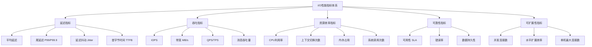

# I/O模型关键指标

## 1. 指标体系总览

评估一个I/O模型的性能优劣，不能只看单一维度。延迟低但吞吐量小不行，吞吐量大但CPU占用过高也不行。一套完整的I/O性能评估体系需要覆盖以下维度：



## 2. 延迟指标

延迟（Latency）是用户感知最直接的性能指标——从发出请求到收到响应花了多长时间。在I/O模型的语境下，延迟反映的是"操作系统和硬件处理一次I/O请求的速度"。

### 2.1 延迟的组成

一次I/O操作的延迟由多个阶段组成，理解每段耗时有助于定位瓶颈：

用户态延迟 + 系统调用开销 + 内核态处理 + 驱动/硬件延迟 = 总延迟

具体分解：
┌─────────────────────────────────────────────────────────┐
│  用户态处理（数据准备、协议解析）           ~0.1-1μs     │
│  系统调用切换（用户态→内核态）             ~50-100ns    │
│  VFS层查找（路径解析、inode定位）           ~0.1-1μs     │
│  文件系统操作（日志写入、块分配）           ~1-10μs      │
│  块设备队列调度（I/O调度器排序）            ~0.5-5μs     │
│  硬件传输（SSD读写/网络包收发）            ~10μs-10ms   │
│  内核态→用户态数据拷贝                     ~0.1-1μs     │
└─────────────────────────────────────────────────────────┘

不同I/O模型在上述各阶段的开销差异，正是它们性能不同的根本原因：

| I/O模型 | 系统调用次数 | 上下文切换 | 内核态耗时 | 典型延迟范围 |
|---------|-------------|-----------|-----------|-------------|
| 阻塞I/O | 每次1次 | 高（阻塞唤醒） | 正常 | 10μs-100ms |
| 非阻塞I/O | 轮询N次 | 无阻塞 | 轮询浪费CPU | 取决于轮询频率 |
| select/poll | 1次监控+1次读写 | 低 | O(n)遍历开销 | 10μs-10ms |
| epoll | 1次监控+1次读写 | 极低 | O(1)事件获取 | 5μs-10ms |
| io_uring | 批量提交（可选0次） | 接近零 | 共享内存零拷贝 | 1μs-5ms |

### 2.2 平均延迟 vs 尾延迟

平均延迟容易误导人。一个系统平均延迟1ms，但P99延迟50ms、P99.9延迟500ms——对绝大多数用户来说体感是"偶尔很卡"。

**P99/P99.9延迟**才是衡量用户体验的真实标准：

| 指标 | 含义 | 实际意义 |
|------|------|---------|
| P50（中位数） | 50%请求在此延迟内完成 | 典型用户体验 |
| P90 | 90%请求在此延迟内完成 | 大部分用户体验 |
| P99 | 99%请求在此延迟内完成 | 关键SLA标准 |
| P99.9 | 99.9%请求在此延迟内完成 | 高可用系统标准 |
| Max | 最长延迟 | 极端情况，需排查 |

在I/O模型选择中，epoll和io_uring相比select/poll的优势不仅体现在平均延迟上，更体现在尾延迟上——因为它们避免了O(n)遍历的最坏情况。

### 2.3 延迟抖动（Jitter）

延迟抖动是指延迟的波动幅度。即使平均延迟很低，如果抖动大（比如在0.1ms到50ms之间跳动），对实时音视频、金融交易等场景的影响比高平均延迟更严重。

低抖动（理想）：  1.0  1.1  0.9  1.2  1.0  0.8  1.1  (标准差 ≈ 0.1ms)
高抖动（问题）：  1.0  5.0  0.5  30.0  1.2  0.3  45.0 (标准差 ≈ 17ms)

I/O模型对抖动的影响主要来自：
- **锁竞争**：多线程模型中锁的等待时间不可预测
- **GC停顿**：Java/Go等语言的垃圾回收会导致周期性高延迟
- **调度延迟**：Linux CFS调度器在负载高时响应变慢
- **NUMA远端内存访问**：跨NUMA节点的内存访问延迟是本地的2-3倍

### 2.4 首字节时间（TTFB）

首字节时间是从发起请求到收到第一个字节的延迟，是Web场景中最关键的延迟指标之一：

TTFB = DNS解析 + TCP握手 + TLS握手 + 服务器处理 + 首包传输

典型值：
  内网服务间调用：  0.1-1ms
  CDN边缘节点：    1-10ms
  跨区域调用：     50-200ms
  跨洋调用：       100-500ms

对于I/O模型优化而言，TTFB中"服务器处理"这一段是可以通过I/O模型选型来优化的。使用io_uring的异步处理可以将服务器端处理延迟从数十微秒降低到数微秒级别。

## 3. 吞吐指标

吞吐量（Throughput）衡量的是系统在单位时间内能处理多少I/O操作。这是I/O模型选型的另一个核心维度。

### 3.1 IOPS（每秒I/O操作数）

IOPS是衡量存储I/O性能最核心的指标，表示每秒能完成的I/O操作次数：

典型IOPS参考值（随机4K读取）：

存储介质              顺序读IOPS    随机读IOPS    随机写IOPS
─────────────────────────────────────────────────────────
HDD (7200RPM)        100-200       80-120        80-120
HDD (15000RPM)       200-300       150-200       150-200
SATA SSD              5,000-10,000  50,000-90,000 30,000-50,000
NVMe SSD             10,000-20,000 100,000-1,000,000 100,000-500,000
Optane (持久内存)     50,000+       1,000,000+    500,000+

IOPS与I/O模型的关系：当IOPS需求极高时（如数据库事务处理），系统调用开销成为瓶颈。epoll相比select在高并发场景下的优势正是减少了每次I/O操作的系统调用次数。io_uring更进一步，通过批量提交将多个I/O操作合并为一次系统调用，IOPS可以提升30%-100%。

### 3.2 带宽（Bandwidth）

带宽衡量的是单位时间内传输的数据量，通常以MB/s或Gb/s表示：

典型带宽参考值：

接口/介质                  顺序读带宽        顺序写带宽
───────────────────────────────────────────────────
SATA III (6Gbps)          ~550 MB/s         ~500 MB/s
PCIe 3.0 x4 NVMe         ~3,500 MB/s       ~3,000 MB/s
PCIe 4.0 x4 NVMe         ~7,000 MB/s       ~5,000 MB/s
PCIe 5.0 x4 NVMe         ~14,000 MB/s      ~10,000 MB/s
10GbE 网络               ~1,200 MB/s       ~1,200 MB/s
25GbE 网络               ~3,125 MB/s       ~3,125 MB/s
100GbE 网络              ~12,500 MB/s      ~12,500 MB/s

带宽受限时，I/O模型的优化重点在于减少数据拷贝次数：
- **零拷贝技术**：`sendfile()`/`splice()`避免用户态↔内核态的数据拷贝
- **io_uring的固定缓冲区**（`IORING_REGISTER_BUFFERS`）：缓冲区在内核注册后可直接访问，消除每次操作的注册/注销开销
- **RDMA**：远程直接内存访问，绕过操作系统内核直接读写远端内存

### 3.3 QPS/TPS

在应用层，我们更常用QPS（Queries Per Second）和TPS（Transactions Per Second）来衡量吞吐量：

不同I/O模型下的典型QPS参考（简单HTTP静态文件服务，小文件）：

I/O模型              单核QPS        8核QPS        瓶颈
────────────────────────────────────────────────────
阻塞I/O + 多线程     2,000-5,000   10,000-30,000  线程数/上下文切换
select/poll          5,000-10,000  20,000-50,000  O(n)遍历
epoll (LT)           10,000-20,000 80,000-150,000 系统调用开销
epoll (ET)           15,000-30,000 100,000-200,000 系统调用开销
io_uring             20,000-40,000 150,000-300,000 CPU处理能力

这些数字来自Nginx、HAProxy等实际服务器的基准测试，反映了I/O模型对应用层吞吐的直接影响。

## 4. 资源效率指标

高性能不仅意味着"快"，还意味着"省"。同样的性能水平，消耗更少资源的方案更优。

### 4.1 CPU利用率

CPU利用率是I/O模型效率最直接的体现：

CPU时间分配对比：

阻塞I/O + 多线程模型：
  ├── 有效处理：30%
  ├── 上下文切换：40%
  ├── 锁竞争等待：20%
  └── 其他开销：10%

epoll事件驱动模型：
  ├── 有效处理：70%
  ├── epoll_wait系统调用：5%
  ├── 事件分发：15%
  └── 其他开销：10%

io_uring异步模型：
  ├── 有效处理：80%
  ├── SQ/CQ内存操作：3%
  ├── 事件处理：10%
  └── 其他开销：7%

一个常见的误区是"CPU利用率越高越好"。实际上，CPU利用率超过70%时，调度延迟和锁竞争会急剧增加，导致延迟飙升。健康的I/O系统应该让CPU利用率保持在50%-70%之间，预留headroom应对突发流量。

### 4.2 上下文切换

上下文切换是I/O模型选型中容易被忽视的关键指标：

上下文切换的代价：
  线程级切换（同进程内）：     1-10μs
  进程级切换（跨进程）：       10-100μs
  进程+TLB刷新：              50-200μs

每秒上下文切换次数参考值：
  少于 10,000次/秒：          健康
  10,000-100,000次/秒：       需要关注
  超过 100,000次/秒：          严重性能问题

通过`vmstat 1`或`pidstat -w 1`可以实时监控上下文切换：

```bash
# 查看系统级上下文切换
vmstat 1 5
# 关注 cs（context switches）列

# 查看进程级上下文切换
pidstat -w -p <pid> 1
# cswch: 自愿上下文切换（通常是I/O等待）
# nvcswch: 非自愿上下文切换（时间片用完被调度）
```

不同I/O模型的上下文切换特征：

| I/O模型 | 每请求切换次数 | 切换原因 | 可优化性 |
|---------|---------------|---------|---------|
| 阻塞I/O | 2次（阻塞+唤醒） | 内核调度 | 低 |
| 非阻塞I/O | 0次 | — | 无需优化 |
| select/poll | 2次（监控阻塞+唤醒） | 内核调度 | 低 |
| epoll | 1次（epoll_wait阻塞） | 内核调度 | 低 |
| io_uring | 0次（轮询模式）或1次 | 可选 | 高 |

### 4.3 内存占用

内存消耗是I/O模型在高并发场景下的关键限制因素：

每连接内存消耗对比：

模型                   每连接内存    10万连接总内存
────────────────────────────────────────────────
阻塞I/O + 线程池       8-10MB       ~1TB（不可行）
select/poll            ~1KB         ~100MB
epoll                  ~100B        ~10MB
io_uring               ~200B        ~20MB
协程（goroutine）       ~2-4KB       ~200-400MB

io_uring的内存消耗略高于epoll，因为它需要维护提交队列（SQ）和完成队列（CQ）的内核映射内存，但换来的吞吐提升是值得的。

## 5. 可靠性指标

### 5.1 可用性

可用性通常用"几个9"来表示，每个9对应不同的年度停机时间：

| 可用性等级 | 年度停机时间 | 月度停机时间 | 适用场景 |
|-----------|------------|------------|---------|
| 99%（2个9） | 3.65天 | 7.31小时 | 内部工具 |
| 99.9%（3个9） | 8.76小时 | 43.8分钟 | 普通线上服务 |
| 99.95%（4.3个9） | 4.38小时 | 21.9分钟 | 电商核心服务 |
| 99.99%（4个9） | 52.6分钟 | 4.38分钟 | 金融/支付系统 |
| 99.999%（5个9） | 5.26分钟 | 26.3秒 | 电信/医疗核心 |

I/O模型对可用性的影响主要体现在两个方面：
- **单点故障风险**：单线程事件循环（如Redis、Node.js）的I/O模型天然存在单点问题，主循环阻塞即服务中断
- **故障恢复速度**：io_uring的批量操作可以在故障恢复时更快地重建状态

### 5.2 错误率

I/O错误率需要区分操作类型：

读操作错误（罕见但致命）：
  - EIO：硬件I/O错误
  - ENOENT：文件不存在（路径问题）
  - EACCES：权限不足

写操作错误（需要特别关注）：
  - ENOSPC：磁盘空间不足
  - EDQUOT：配额超限
  - EFBIG：文件过大

网络I/O错误：
  - ECONNRESET：连接被远端重置
  - ETIMEDOUT：操作超时
  - ECONNREFUSED：连接被拒绝
  - ENOBUFS：内核网络缓冲区不足

监控建议：
  - 读错误率 < 0.01%：正常范围
  - 写错误率 < 0.001%：正常范围
  - 网络错误率 < 0.1%：正常范围

## 6. 可扩展性指标

### 6.1 并发连接数上限

不同I/O模型能支撑的最大并发连接数差异巨大，这直接决定了系统的扩展能力：

最大并发连接数理论上限：

I/O模型              单进程上限     多进程上限      主要限制因素
──────────────────────────────────────────────────────────────
阻塞I/O              100-1,000     10,000         线程/进程数
select               1,024         10,000         FD_SETSIZE
poll                 100,000+      100,000+       O(n)遍历性能
epoll                1,000,000+    10,000,000+    系统内存
io_uring             1,000,000+    10,000,000+    系统内存

### 6.2 扩展效率

扩展效率衡量的是"增加资源后性能提升的比例"：

垂直扩展（加CPU/内存）：
  阻塞I/O：扩展效率低，线程数增加到一定程度后性能反而下降
  epoll：扩展效率中等，受限于单线程处理能力
  io_uring：扩展效率高，可以充分利用多核

水平扩展（加机器）：
  无状态服务：扩展效率接近线性
  有状态服务：受限于数据一致性和分区策略

## 7. 各模型指标综合对比

下表综合对比了五种I/O模型在各项关键指标上的表现：

| 指标维度 | 阻塞I/O | 非阻塞I/O | select/poll | epoll | io_uring |
|---------|---------|----------|------------|-------|---------|
| **平均延迟** | 中等 | 低（轮询时高） | 中等 | 低 | 极低 |
| **P99尾延迟** | 高 | 不稳定 | 高 | 低 | 极低 |
| **IOPS** | 低 | 低 | 中 | 高 | 极高 |
| **带宽利用** | 中 | 低 | 中 | 高 | 极高 |
| **CPU效率** | 低 | 极低（忙等） | 中 | 高 | 极高 |
| **上下文切换** | 高 | 无 | 中 | 低 | 极低 |
| **内存/连接** | 8-10MB | ~1KB | ~1KB | ~100B | ~200B |
| **最大并发** | 1K | 10K | 1K | 1M+ | 1M+ |
| **编程复杂度** | 低 | 中 | 中 | 高 | 极高 |
| **调试难度** | 低 | 中 | 中 | 高 | 极高 |
| **跨平台** | 是 | 是 | 是 | 仅Linux | 仅Linux |

### 7.1 选型决策树

需要选择I/O模型？

├── 并发量 < 100？
│   └── 阻塞I/O + 线程池（简单可靠）
│
├── 并发量 100-10,000？
│   ├── 需要跨平台？
│   │   ├── 是 → select/poll 或平台特定方案（IOCP）
│   │   └── 否 → epoll
│   └── 开发效率优先？
│       └── 使用高级框架（libuv/asyncio），它们内部封装了epoll
│
├── 并发量 10,000-1,000,000？
│   ├── Linux？
│   │   ├── 吞吐优先 → io_uring
│   │   └── 延迟优先 → epoll (ET) + 优化
│   └── 非Linux？
│       └── 平台最佳实践（IOCP/kqueue）
│
└── 并发量 > 1,000,000？
    └── io_uring + 分布式架构

## 8. 实际测量方法

### 8.1 系统级测量工具

```bash
# 1. 使用 fio 测量存储IOPS和带宽
fio --name=randread --ioengine=io_uring --rw=randread \
    --bs=4k --size=1G --numjobs=1 --runtime=60 \
    --filename=/dev/nvme0n1

# 2. 使用 perf 测量系统调用和上下文切换
perf stat -e context-switches,syscalls:sys_enter_read \
    -p <pid> -- sleep 10

# 3. 使用 bpftrace 追踪I/O延迟分布
bpftrace -e 'tracepoint:block:block_rq_complete {
    @usecs = hist(args->nr_sector / 2 * 1000 / (args->dev / 1000));
}'

# 4. 使用 iostat 监控设备级I/O指标
iostat -xz 1
# 关注：r/s（读IOPS）、w/s（写IOPS）、await（平均等待时间）、%util（利用率）
```

### 8.2 应用级测量方法

```c
// 精确测量单次I/O操作的延迟（纳秒级）
#include <time.h>

struct timespec start, end;
clock_gettime(CLOCK_MONOTONIC, &amp;start);

// 执行I/O操作
ssize_t n = read(fd, buf, size);

clock_gettime(CLOCK_MONOTONIC, &amp;end);
long latency_ns = (end.tv_sec - start.tv_sec) * 1000000000L
                + (end.tv_nsec - start.tv_nsec);

// 使用HISTOGRAM记录延迟分布（bpftrace方式）
// 或在用户态使用HDR Histogram库
```

### 8.3 基准测试注意事项

测量I/O性能时常见的陷阱：

- **预热不足**：SSD有缓存，前几秒的数据可能从DRAM缓存读取，不反映真实性能
- **测试数据不匹配**：随机读4K和顺序读1M是完全不同的工作负载
- **缓存污染**：操作系统页缓存会大幅降低实际I/O次数
- **测试时长不够**：至少运行60秒以上，排除启动和缓存预热的影响
- **并发模型不匹配**：单线程测试无法反映高并发场景下的锁竞争和上下文切换

```bash
# 推荐的基准测试流程
# 1. 绕过页缓存（直接I/O）
fio --ioengine=io_uring --direct=1 --bs=4k --rw=randread ...

# 2. 排除SSD缓存（预填充）
fio --name=fill --rw=write --size=90% --filename=/dev/nvme0n1

# 3. 多线程模拟真实并发
fio --numjobs=8 --iodepth=32 --group_reporting ...

# 4. 记录完整的延迟分布，不仅看平均值
fio --write_bw_log=fio_test --write_lat_log=fio_test ...
```

## 9. 常见误区与纠正

### 误区一：延迟越低越好

延迟低但吞吐量小的I/O模型未必更优。在批量数据处理（如日志写入、备份）场景下，高带宽和高吞吐比低延迟更重要。I/O模型的选择必须匹配业务特征。

### 误区二：IOPS高就是好

IOPS在随机小I/O场景下有意义，但顺序大I/O场景下应关注带宽。一个能处理1M IOPS的4K随机读系统，顺序读带宽可能只有4GB/s，而一个顺序优化的NVMe SSD轻松超过10GB/s。

### 误区三：epoll一定比select快

在fd数量小于100且活跃连接比例高的场景下，select的简单遍历可能比epoll的回调机制更快，因为epoll有红黑树查找的固定开销（O(log n)），而select的位图扫描在小规模下开销极小。只有在大规模并发（>1000 fd）或活跃连接比例低时epoll才体现优势。

### 误区四：io_uring在所有场景都优于epoll

io_uring的优势在于高吞吐和低系统调用开销，但它的编程模型更复杂（需要管理SQ/CQ ring），对于简单的网络服务器场景，epoll的编程模型可能更实用。io_uring在需要大量文件I/O的场景（如数据库、视频转码）优势更明显。

### 误区五：只看系统级指标，忽略应用级指标

系统工具（iostat、vmstat）给出的是设备级和系统级数据，但最终用户体验取决于应用层的端到端延迟。一个IOPS很高的系统，如果应用层存在锁竞争或序列化瓶颈，用户感知到的延迟仍然很高。

## 10. 指标监控最佳实践

一个生产级的I/O监控体系应该包含以下层次：

监控层次              关注指标                    工具/方法
────────────────────────────────────────────────────────
硬件层               I/O延迟、队列深度、错误率    smartctl、smartmon
设备层               IOPS、带宽、利用率           iostat、blktrace
操作系统层           上下文切换、页缓存命中率      vmstat、perf
网络层               连接数、重传率、缓冲区       ss、nstat
应用层               QPS、P99延迟、错误率         Prometheus + Grafana
用户层               页面加载时间、API响应时间     APM（SkyWalking/Jaeger）

监控的黄金法则：**在每一层设置告警阈值，在故障发生时能快速定位到具体层次**。例如P99延迟告警触发后，依次检查：应用层锁竞争 → 系统层上下文切换 → 设备层I/O队列 → 硬件层磁盘健康状态。
