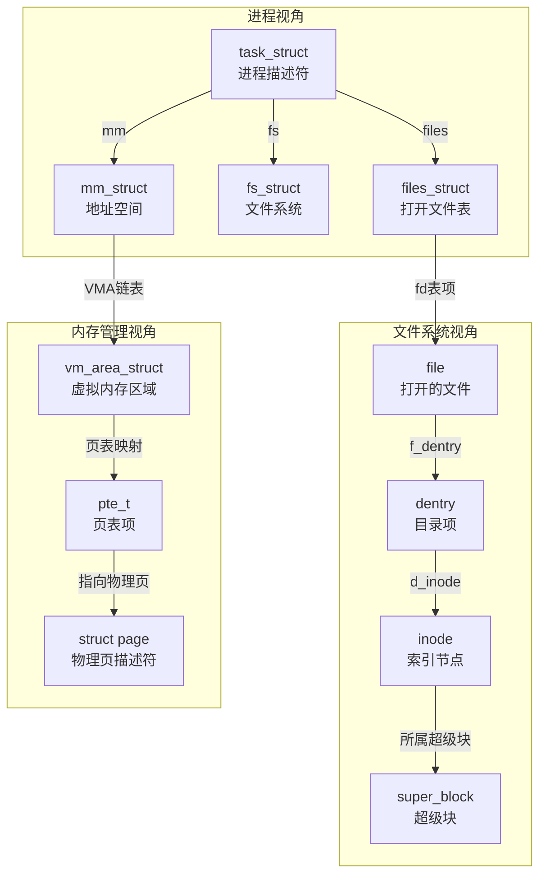

# 第08章 Linux内核源码分析

## 章节定位

Linux内核是世界上规模最大、最活跃的开源协作项目之一。截至6.x内核，其代码库已超过**2800万行C代码**，涵盖进程调度、内存管理、文件系统、网络协议栈、设备驱动、安全子系统等数十个子系统。Linus Torvalds自1991年发布0.01版本以来，Linux内核已运行在从嵌入式IoT设备到全球Top500超级计算机的几乎所有计算平台上。

**本章在全书中的位置**：前面的章节建立了硬件基础（CPU架构、内存系统、存储I/O）、并发模型（进程、线程、锁）和系统编程能力（系统调用、IPC、文件系统）。本章是这些知识的**汇聚点**——我们将看到操作系统如何将硬件抽象、并发控制、资源管理融为一体，形成一个完整的服务平台。同时，本章的内核视角也为后续章节（设备驱动、性能调优、安全攻防）提供了不可替代的底层基础。

本章不是泛泛而谈的"操作系统概念介绍"，而是**以源码为线索，追踪关键路径的完整执行流程**。我们将从系统调用入口出发，逐层深入进程管理、内存管理、VFS、网络子系统、中断处理和同步原语六大核心模块，帮助读者建立从"看到一行代码"到"理解整个子系统"的系统性认知。

**本章的目标读者**：
- 想从"会用Linux"进化到"理解Linux"的系统程序员
- 需要排查内核级Bug或进行性能调优的高级工程师
- 对操作系统实现原理有好奇心的计算机科学学习者
- 驱动开发者、嵌入式开发者、安全研究员

**你将收获**：
1. 能够在源码级别解释一个系统调用的完整执行路径
2. 理解进程创建（fork）、程序加载（exec）、进程退出（exit）的内核实现
3. 掌握CFS调度器的vruntime公平性算法和红黑树组织
4. 追踪一次内存分配从kmalloc到伙伴系统到SLUB到物理页的完整路径
5. 追踪一个网络数据包从网卡中断到用户缓冲区的完整旅程
6. 理解spinlock、RCU、seqlock等内核同步原语的设计权衡
7. 能够使用ftrace、eBPF、kprobes等工具在运行系统上观测内核行为

---

## 核心问题

本章围绕以下六个关键问题展开，每个问题对应一个子系统的深入剖析：

| 编号 | 核心问题 | 涉及子系统 | 难度 |
|:----:|----------|------------|:----:|
| Q1 | 系统调用如何从用户态到达内核态？ | syscall入口、中断描述符表、上下文切换 | ★★☆ |
| Q2 | fork/exec/exit的内核实现路径是什么？ | 进程管理、task_struct、COW | ★★★ |
| Q3 | CFS调度器如何保证公平性？ | 调度器、vruntime、红黑树、时间片 | ★★★ |
| Q4 | 内存分配的完整路径是什么？ | kmalloc → 伙伴系统 → SLUB → 物理页 | ★★★ |
| Q5 | 一个网络数据包从网卡到达用户缓冲区经历了什么？ | sk_buff、NAPI、协议栈、socket | ★★★★ |
| Q6 | 内核如何保证并发安全？ | spinlock、RCU、seqlock、原子操作 | ★★★★ |

---

## 知识图谱

以下是Linux内核核心子系统的全景图，也是本章的导航地图。每个节点都对应源码中的具体目录和文件：

Linux内核源码（以6.x为例，2800万行+）
│
├─ 系统调用入口
│   ├─ x86_64: syscall/sysenter指令 → entry_SYSCALL_64
│   ├─ ARM64: SVC指令 → el0_svc
│   ├─ 系统调用表: arch/x86/entry/syscalls/syscall_64.tbl
│   └─ 参数传递: rdi/rsi/rdx/r10/r8/r9 → pt_regs
│
├─ 进程管理（kernel/sched/ + kernel/fork.c + kernel/exit.c）
│   ├─ task_struct — 进程描述符（~6KB/进程，含调度、内存、文件、信号等全部信息）
│   ├─ fork() → kernel_clone() → copy_process()
│   │   └─ 关键: dup_mm()实现COW，copy_files()复制fd表
│   ├─ exec() → do_execveat_common() → load_elf_binary()
│   │   └─ 关键: 替换地址空间，加载ELF段，设置入口点
│   ├─ exit() → do_exit() → 释放资源 → schedule()不再返回
│   └─ CFS调度器（SCHED_NORMAL）
│       ├─ sched_entity.vruntime — 虚拟运行时间
│       ├─ 红黑树组织 — O(log n)选择vruntime最小进程
│       └─ nice值 → 权重 → vruntime增长速率映射
│
├─ 内存管理（mm/）
│   ├─ 伙伴系统（page_alloc.c）— 物理页分配，2^order个连续页
│   ├─ SLUB分配器（slub.c）— 小对象分配（kmalloc/kfree）
│   ├─ 缺页中断（fault.c）— COW、demand paging、mmap懒加载
│   ├─ 页表管理 — 4级页表: PGD → PUD → PMD → PTE
│   ├─ 内存映射（mmap.c）— VMA管理，文件映射/匿名映射
│   └─ 页缓存（filemap.c）— 磁盘I/O缓存，read/write的性能关键
│
├─ VFS虚拟文件系统（fs/）
│   ├─ 四大对象: super_block / inode / dentry / file
│   ├─ file_operations — 每种文件系统实现的函数指针表
│   ├─ 页缓存集成 — read/write先查page cache
│   └─ 具体实现: ext4/（日志）、proc/（伪文件系统）、sysfs/
│
├─ 网络子系统（net/）
│   ├─ sk_buff — 网络数据包的核心结构（含协议头、数据、元数据）
│   ├─ 收包路径: 网卡中断 → NAPI轮询 → netif_receive_skb → 协议栈
│   ├─ 发包路径: send → socket层 → TCP/UDP → IP → 邻居子系统 → 驱动
│   ├─ TCP/IP协议栈: tcp_v4_rcv() → tcp_rcv_established() → socket
│   └─ socket层: sock → sk_buff的队列管理
│
├─ 中断处理（kernel/softirq.c + kernel/irq/）
│   ├─ 上半部（hardirq）— 硬中断上下文，禁止本地中断，极快返回
│   ├─ 下半部: softirq → tasklet → workqueue（延迟程度递增）
│   └─ 中断亲和性: IRQ affinity，将中断绑定到特定CPU
│
├─ 同步原语（include/linux/spinlock.h + kernel/rcu/）
│   ├─ spinlock — 忙等锁，适用于短临界区+不可睡眠上下文
│   ├─ mutex — 睡眠锁，可持有期间睡眠
│   ├─ RCU（读-拷贝-更新）— 读无锁，写延迟释放，适用于读多写少
│   ├─ seqlock — 读写计数器，写者不阻塞读者，适用于统计计数
│   └─ 原子操作 — atomic_t / atomic64_t，硬件级别原子指令
│
├─ 安全子系统（security/）
│   ├─ SELinux — 强制访问控制（MAC），安全策略标签
│   ├─ AppArmor — 路径-based访问控制，Ubuntu默认
│   └─ seccomp — 系统调用过滤，容器安全基石
│
└─ 内核调试（tools/ + Documentation/）
    ├─ printk / pr_info / pr_debug — 内核日志
    ├─ ftrace — 函数级追踪，/sys/kernel/debug/tracing/
    ├─ eBPF / BCC / bpftrace — 可编程观测工具，安全沙箱内运行
    ├─ kprobes — 运行时动态插桩
    └─ crash / kdump — 内核crash dump离线分析

---

## 学习路径

建议按照以下顺序阅读本章各节。每一节都建立在前一节的基础上，跳过前置内容会导致理解困难：

                    ┌─────────────────────────────┐
                    │  第0步: 环境准备              │
                    │  获取源码、编译内核、搭建调试环境 │
                    └──────────────┬──────────────┘
                                   │
                    ┌──────────────▼──────────────┐
                    │  第1步: 内核架构概览           │
                    │  宏内核 vs 微内核、模块机制     │
                    │  源码目录结构、Kconfig/Makefile │
                    └──────────────┬──────────────┘
                                   │
                    ┌──────────────▼──────────────┐
                    │  第2步: 系统调用入口           │
                    │  syscall指令、参数传递、IDT    │
                    │  → 理解用户态→内核态的桥梁     │
                    └──────────────┬──────────────┘
                                   │
              ┌────────────────────┼────────────────────┐
              │                    │                    │
    ┌─────────▼─────────┐ ┌───────▼───────┐ ┌─────────▼─────────┐
    │  第3步: 进程管理    │ │  第4步: 内存管理│ │  第5步: VFS       │
    │  task_struct       │ │  伙伴系统      │ │  super/inode/dentry│
    │  fork/exec/exit    │ │  SLUB分配器    │ │  file_operations  │
    │  CFS调度器         │ │  缺页中断      │ │  页缓存           │
    └─────────┬─────────┘ └───────┬───────┘ └─────────┬─────────┘
              │                    │                    │
              └────────────────────┼────────────────────┘
                                   │
                    ┌──────────────▼──────────────┐
                    │  第6步: 网络子系统             │
                    │  sk_buff、NAPI、协议栈、socket │
                    │  → 综合运用进程+内存+VFS知识   │
                    └──────────────┬──────────────┘
                                   │
                    ┌──────────────▼──────────────┐
                    │  第7步: 中断与同步             │
                    │  hardirq/softirq/tasklet      │
                    │  spinlock/RCU/seqlock         │
                    │  → 理解内核并发安全的权衡       │
                    └──────────────┬──────────────┘
                                   │
                    ┌──────────────▼──────────────┐
                    │  第8步: 内核调试工具           │
                    │  ftrace、eBPF/bpftrace、kprobes│
                    │  → 将知识转化为实际排查能力     │
                    └─────────────────────────────┘

**预计学习时间**：完整学完本章约需 **40-60小时**（含源码阅读和动手实践）。

| 阶段 | 内容 | 建议时间 | 产出 |
|------|------|----------|------|
| 环境搭建 | 获取源码、编译内核、GDB调试 | 4-6小时 | 可调试的内核环境 |
| 架构概览 | 宏内核理解、源码导航能力 | 2-3小时 | 能快速定位源码位置 |
| 系统调用 | 完整追踪一个syscall | 4-6小时 | 能手绘syscall执行流程 |
| 进程管理 | fork/exec/exit/CFS | 8-10小时 | 能解释进程生命周期 |
| 内存管理 | 伙伴系统/SLUB/缺页 | 8-10小时 | 能解释一次malloc的内核路径 |
| VFS | 文件系统四层抽象 | 4-6小时 | 能追踪一次read()的完整路径 |
| 网络子系统 | 收包/发包完整路径 | 6-8小时 | 能追踪一个包的完整旅程 |
| 中断与同步 | 中断处理+锁机制 | 4-6小时 | 能选择合适的同步原语 |
| 调试工具 | ftrace/eBPF实战 | 4-6小时 | 能用工具排查内核问题 |

---

## 前置知识

学习本章之前，建议先掌握以下内容。如果你在阅读过程中遇到困难，很可能是因为前置知识存在缺口：

| 前置知识 | 对应章节 | 为什么需要 |
|----------|----------|-----------|
| CPU特权级（Ring 0/Ring 3）、中断机制、上下文切换 | 第01章 CPU架构与执行模型 | 理解用户态→内核态切换的硬件基础 |
| 虚拟内存、页表层次结构、TLB、缓存层次 | 第02章 内存系统 | 理解内核内存管理的硬件约束 |
| 进程/线程的区别、进程状态机、进程间通信 | 第04章 进程与线程 | 理解task_struct的设计动机 |
| 堆/栈分配、malloc实现、内存对齐 | 第05章 内存管理 | 对比用户态和内核态的内存管理差异 |
| TCP/IP协议栈基础、socket编程 | 第18-20章（网络部分） | 理解网络子系统各层的职责划分 |

**硬件基础知识检查清单**（自查是否需要补充）：
- [ ] 能解释什么是"特权级"以及为什么需要Ring 0/Ring 3隔离
- [ ] 能描述一次中断的完整硬件处理流程
- [ ] 理解虚拟地址到物理地址的转换过程（页表walk）
- [ ] 知道什么是COW（Copy-on-Write）以及它的使用场景
- [ ] 理解什么是原子操作以及为什么需要它

---

## 快速开始：10分钟建立内核直觉

如果你不想按部就班地从头读起，可以先通过以下三个快速实验建立对内核的直观感受。每个实验都不需要编译内核，只需要一台Linux机器：

### 实验一：用strace看一个系统调用的"一生"

```bash
# 安装strace（大多数发行版已预装）
sudo apt install strace  # Debian/Ubuntu

# 跟踪ls命令的所有系统调用
strace ls /tmp 2>&amp;1 | head -50

# 关键观察：
# - openat() 打开目录
# - getdents64() 读取目录项
# - write() 输出到stdout
# - 每个系统调用都有返回值和耗时
```

这个实验让你看到：用户态程序的每一个I/O操作最终都通过系统调用进入内核。后续章节将带你追踪 `openat()` 在内核中的完整执行路径。

### 实验二：用/proc窥探内核数据结构

```bash
# 查看当前进程的task_struct摘要
cat /proc/self/status | grep -E 'State|Pid|PPid|VmSize'

# 查看系统内存布局
cat /proc/meminfo | head -20

# 查看某个进程的文件描述符
ls -la /proc/$$/fd

# 查看调度器统计
cat /proc/schedstat | head -5
```

这些 `/proc` 文件直接暴露了内核数据结构的内容。后续"进程管理"和"内存管理"章节将解释每个字段的含义和实现。

### 实验三：用bpftrace追踪一个内核函数

```bash
# 安装bpftrace
sudo apt install bpftrace  # 需要内核 >= 4.9

# 追踪所有fork系统调用（实时显示）
sudo bpftrace -e '
tracepoint:syscalls:sys_enter_fork {
    printf("fork() called by %s (pid=%d)\n", comm, pid);
}'
```

在另一个终端运行 `sleep 1 &`，你会看到fork被调用。这个实验让你感受eBPF的威力——无需修改内核代码，就能在运行时观测任意内核函数。

---

## 本章结构

本章共包含以下小节，每个小节对应内核的一个核心子系统：

| 小节 | 文件 | 内容概要 | 预计阅读 |
|------|------|----------|----------|
| 理论基础 | [01-核心概念](理论基础/01-核心概念.md) | 内核架构概览、宏内核 vs 微内核、模块机制、源码目录结构 | 30分钟 |
| | [02-技术演进](理论基础/02-技术演进.md) | Linux内核版本演进、关键子系统的架构变迁 | 20分钟 |
| | [03-关键指标](理论基础/03-关键指标.md) | 内核性能评估的关键指标和度量方法 | 20分钟 |
| 核心技巧 | [01-内核编译与模块加载](核心技巧/01-技巧1内核编译与模块加载.md) | 从源码到可运行内核的完整流程、内核模块编写 | 45分钟 |
| | [02-系统调用流程分析](核心技巧/02-技巧2系统调用流程分析.md) | 追踪syscall从用户态到内核态的完整路径 | 45分钟 |
| | [03-进程调度器CFS](核心技巧/03-技巧3进程调度器CFS.md) | CFS的vruntime算法、红黑树组织、调度时机 | 45分钟 |
| | [04-性能优化清单](核心技巧/04-性能优化清单.md) | 内核级性能分析方法和优化策略 | 30分钟 |
| 实战案例 | [03-实战案例](03-实战案例.md) | 真实场景下的内核源码分析实战 | 60分钟 |
| 常见误区 | [04-常见误区](04-常见误区.md) | 内核学习和源码阅读中的常见认知错误 | 20分钟 |
| 练习方法 | [05-练习方法](05-练习方法.md) | 内核源码阅读的方法论和练习项目 | 30分钟 |
| 本章小结 | [06-本章小结](06-本章小结.md) | 全章知识回顾、关键要点总结 | 15分钟 |

---

## 内核源码阅读方法论

阅读内核源码不同于阅读普通应用代码。内核代码具有以下特殊性，需要采用专门的阅读策略：

### 为什么内核源码难读

1. **代码量巨大**：2800万行代码，没有人能读完所有代码，必须选择性深入
2. **高度优化**：大量使用宏、内联函数、编译器属性（`__always_inline`、`likely/unlikely`），可读性让位于性能
3. **并发复杂**：大量无锁数据结构和内存屏障，逻辑被并发控制"淹没"
4. **硬件耦合**：大量体系结构相关代码（`#ifdef CONFIG_X86_64`），抽象层多
5. **隐式约定**：大量未文档化的API使用约定（如"调用者必须持有xxx锁"）
6. **版本演进快**：内核每2-3个月发布新版本，数据结构字段和函数签名持续变化，阅读时务必确认内核版本

### 高效阅读的六个策略

**策略一：自顶向下，从调用链入手**

不要从main()开始读。选择一个具体的用户态操作（如`read()`系统调用），从入口函数开始，沿着调用链逐层深入。每个函数只关注它做什么，不深究实现细节，遇到子函数标记后继续往下走，直到触达"叶节点"函数，再回头逐层展开。

read(fd, buf, count)
  → sys_read()
    → vfs_read()
      → ext4_file_read_iter()
        → generic_file_read_iter()
          → filemap_read()
            → __filemap_get_folio()
              → find_get_page()     ← 这里到底查了什么？

**策略二：关注数据结构，忽略控制流**

内核的核心逻辑往往体现在数据结构的设计中。`task_struct`的设计决定了进程管理的所有行为，`sk_buff`的设计决定了网络栈的处理方式。先读懂核心数据结构，再看操作这些数据结构的函数。

**策略三：用ftrace/eBPF验证你的理解**

读完代码后，用ftrace或bpftrace在运行系统上验证你的理解是否正确：

```bash
# 追踪fork系统调用的完整调用链
sudo bpftrace -e 'tracepoint:syscalls:sys_enter_fork { printf("fork called by %s (pid=%d)\n", comm, pid); }'

# 追踪CFS调度事件
sudo perf sched record -- sleep 5
sudo perf sched latency
```

**策略四：用GDB单步调试内核**

搭建QEMU + GDB环境，可以单步调试内核代码。这比纯静态阅读有效10倍：

```bash
# 启动QEMU（带调试符号）
qemu-system-x86_64 -kernel bzImage -append "nokaslr" -s -S

# 另一个终端，GDB连接
gdb vmlinux
(gdb) target remote :1234
(gdb) break sys_read
(gdb) continue
```

**策略五：参考LWN.net的深度文章**

LWN.net（Linux Weekly News）积累了30年的内核技术文章，是理解内核子系统设计意图的最佳外部资源。几乎每个重大内核变更都有对应的LWN文章。

**策略六：对照Documentation/目录**

内核源码自带`Documentation/`目录，包含子系统的设计文档、API说明和开发者指南。虽然质量参差不齐，但对理解设计意图非常有价值。

### 在线源码浏览工具

对于不想本地搭建环境的读者，在线源码浏览器是快速入门的好选择：

| 工具 | URL | 特点 |
|------|-----|------|
| Elixir Cross Reference | https://elixir.bootlin.com/linux/latest | 支持符号交叉引用、定义/引用跳转 |
| Linux Cross Reference | https://lxr.linux.no/ | 经典版本，支持多版本对比 |
| GitHub Code Search | https://github.com/torvalds/linux | GitHub原生搜索，支持正则 |

---

## 关键数据结构速查

以下是本章涉及的内核核心数据结构，理解它们是理解所有子系统的基础：

### task_struct — 进程描述符

每个进程/线程对应一个`task_struct`实例，是内核中最大的数据结构之一（约6KB）。它包含了进程的全部信息：

```c
// include/linux/sched.h（关键字段节选）
struct task_struct {
    volatile long state;          // TASK_RUNNING / TASK_INTERRUPTIBLE / __TASK_STOPPED / EXIT_ZOMBIE
    int on_cpu;                   // 是否正在CPU上执行
    int prio;                     // 动态优先级（调度器维护）
    int static_prio;              // 静态优先级（用户通过nice设置）
    unsigned int policy;          // 调度策略: SCHED_NORMAL / SCHED_FIFO / SCHED_RR
    struct sched_entity se;       // CFS调度实体（含vruntime、权重）

    pid_t pid;                    // 进程ID
    pid_t tgid;                   // 线程组ID（= 主线程pid）
    char comm[TASK_COMM_LEN];    // 进程名（最多16字符）

    struct mm_struct *mm;         // 用户空间内存描述符（内核线程为NULL）
    struct fs_struct *fs;         // 文件系统信息（当前目录、根目录）
    struct files_struct *files;   // 打开的文件描述符表（数组，fd号为下标）

    struct task_struct *real_parent;  // 真实父进程
    struct task_struct *parent;       // 养父进程（ptrace调试时指向调试器）
    struct list_head children;        // 子进程链表
    struct list_head sibling;         // 兄弟进程链表

    struct signal_struct *signal;     // 信号状态（共享）
    struct sighand_struct *sighand;   // 信号处理函数表（共享）
    sigset_t blocked;                 // 被阻塞的信号集

    void *stack;                      // 内核栈指针（通常8KB或16KB）
    struct thread_struct thread;      // CPU相关上下文（寄存器保存等）
};
```

**关键理解**：`task_struct`是一个**统一的描述符**——Linux不区分进程和线程，都用`task_struct`描述。区别仅在于：进程有独立的`mm_struct`（地址空间），线程共享父线程的`mm_struct`。

### sk_buff — 网络数据包

```c
// include/linux/skbuff.h（关键字段节选）
struct sk_buff {
    // === 数据指针 ===
    unsigned char *head;      // 分配的缓冲区起始
    unsigned char *data;      // 当前协议层数据起始
    unsigned int tail;        // 当前协议层数据结束
    unsigned int end;         // 分配的缓冲区结束

    // === 元数据 ===
    unsigned int len;         // 当前层的数据长度
    unsigned int data_len;    // 分片数据长度
    __u16 protocol;           // 协议类型（ETH_P_IP等）
    __u16 queue_mapping;      // 发送队列映射

    // === 协议头指针（按协议层分层） ===
    struct ethhdr *mac_header;    // 以太网头
    struct iphdr *network_header; // IP头
    struct tcphdr *transport_header; // TCP/UDP头

    // === 生命周期管理 ===
    void (*destructor)(struct sk_buff *skb);
    struct net_device *dev;       // 关联的网络设备
    union { ... } tstamp;         // 时间戳
};
```

**关键理解**：`sk_buff`采用了**零拷贝**设计——数据在各协议层之间传递时不需要拷贝，只需要移动`data`指针并添加/剥离协议头。这是网络栈高性能的基础。

### 四大核心结构体关系图



---

## 常见学习误区

在开始深入阅读源码之前，了解以下常见误区可以避免走弯路：

### 误区一："我需要读懂所有代码"

**现实**：没有人能读懂Linux内核的所有代码。即便是内核核心维护者，通常也只精通自己负责的子系统。正确策略是**选择一条清晰的调用链**（如read系统调用），沿着它深入，而非试图从头到尾通读。

### 误区二："先学完理论再看代码"

**现实**：内核源码本身就是最好的文档。理论学习和源码阅读应该**交替进行**。每理解一个概念，立即去源码中找到它的实现。纯粹的理论学习容易陷入抽象概念的迷宫。

### 误区三："用户态的经验可以类推到内核"

**现实**：内核编程有许多违反直觉的约束。例如：
- 内核代码**不能使用标准库**（没有malloc，使用kmalloc；没有printf，使用printk）
- 中断上下文中**不能睡眠**（不能调用可能阻塞的函数）
- 内核栈**非常有限**（通常只有8KB或16KB，不能递归过深）
- 所有内核代码运行在**同一地址空间**（一个模块的Bug可以崩溃整个系统）

### 误区四："调试内核和调试应用一样简单"

**现实**：内核Bug的排查难度远高于用户态。内核没有valgrind、没有AddressSanitizer的完整支持、不能轻易加断点（会死锁）。必须掌握ftrace、eBPF、kdump等专门工具。

### 误区五："关注最新版本的代码就好"

**现实**：理解内核设计的**历史演进**同样重要。例如，理解为什么从O(n)调度器到O(log n)的CFS再到O(1)的EEVDF，需要了解每个调度器试图解决的问题。内核的很多设计决策都是在特定历史约束下做出的。

### 误区六："内核代码都很'优雅'"

**现实**：内核代码是高度工程化的产物，充满了性能优化的trick、向后兼容的workaround、以及应对硬件怪癖的条件编译。初学者经常被宏展开、`#ifdef`嵌套和`likely()`/`unlikely()`标注搞得头晕。这是正常的——内核开发者的目标是正确性和性能，不是代码的"可读性"。接受这一点，把注意力放在数据结构和调用链上。

---

## 内核开发的现代趋势

理解内核的历史很重要，但也要关注正在发生的变革。以下是近年来影响内核开发方向的关键趋势：

### Rust进入内核

从Linux 6.1开始，Rust被正式纳入内核构建系统。这是内核历史上最重大的语言变革：
- **动机**：C代码中的内存安全Bug（use-after-free、buffer overflow）是内核漏洞的主要来源，约占安全漏洞的70%
- **进展**：6.1引入Rust基础设施和少量驱动（drivers/net/ethernet/netronome/nic/），6.x持续增加Rust驱动
- **影响**：新驱动可以选择用Rust编写，但不会重写现有C代码

### BPF生态的爆发

eBPF已经从一个简单的包过滤器演变为内核中的**可编程虚拟机**：
- **观测**：bpftrace、BCC提供毫秒级的内核动态追踪
- **网络**：XDP（eXpress Data Path）在网卡驱动层直接处理数据包，绕过整个协议栈
- **安全**：seccomp-bpf实现系统调用过滤，Cilium用BPF替代iptables
- **调度**：sched_ext允许用BPF编写自定义调度策略，无需修改内核代码

### 调度器的持续演进

CFS在Linux 6.6中被**EEVDF**（Earliest Eligible Virtual Deadline First）取代：
- CFS的问题：对交互式任务的响应不够友好，组调度（cgroup）的公平性保证有缺陷
- EEVDF的改进：引入虚拟截止时间概念，在保证公平性的同时提升延迟敏感任务的响应
- 这是理解"内核设计是持续演进的"最佳案例

### 容器化对内核的影响

容器技术（Docker、Kubernetes）推动了内核在命名空间（namespace）和cgroup方面的大量改进：
- **cgroup v2**（Linux 5.2+）：统一了资源控制接口，成为容器运行时的标准
- **eBPF + cgroup**：实现容器级别的网络策略、资源限制、可观测性
- **用户态内核**：gVisor、Kata Containers等在用户态实现部分内核接口

---

## 参考资源

### 核心书籍

| 书名 | 作者 | 侧重 | 适合阶段 |
|------|------|------|----------|
| *Linux Kernel Development*, 3rd Ed. | Robert Love | 入门级内核开发，覆盖面广 | 初次接触内核 |
| *Understanding the Linux Kernel*, 3rd Ed. | Bovet & Cesati | 深入机制分析，以2.6内核为基准 | 有一定基础后深入 |
| *Professional Linux Kernel Architecture* | Wolfgang Mauerer | 全面深入，涵盖大量数据结构细节 | 进阶参考 |
| *Linux Device Drivers*, 3rd Ed. | Corbet, Rubini, Kroah-Hartman | 设备驱动开发 | 驱动开发方向 |
| *Understanding the Linux Virtual Memory Manager* | Mel Gorman | 内存管理专题深入 | 内存子系统专精 |

### 在线资源

| 资源 | URL | 说明 |
|------|-----|------|
| Linux内核源码 | https://github.com/torvalds/linux | 官方仓库，代码是最终权威 |
| LWN.net | https://lwn.net/Kernel/ | 30年积累的内核技术文章，理解设计意图的最佳外部资源 |
| 内核新文档 | https://www.kernel.org/doc/html/latest/ | 内核自带文档的在线版本 |
| Elixir Cross Reference | https://elixir.bootlin.com/linux/latest/source | 在线源码浏览器，支持符号交叉引用 |
| The Linux Kernel Module Programming Guide | https://sysprog21.github.io/lkmpg/ | 内核模块编程指南（在线免费） |
| 内核邮件列表归档 | https://lore.kernel.org/lkml/ | 所有内核开发讨论的存档 |
| BPF Performance Tools | https://www.brendangregg.com/bpf-performance-tools-book.html | Brendan Gregg的BPF性能分析指南 |
| eBPF.io | https://ebpf.io/ | eBPF官方文档和教程 |

### 工具环境

| 工具 | 用途 | 安装/使用 |
|------|------|-----------|
| cscope / ctags / ccls | 源码导航、符号跳转 | `apt install cscope` 或配置VS Code + clangd |
| VS Code + clangd | 现代IDE体验 | 安装clangd插件，配置`.clangd`文件指向内核compile_commands.json |
| ftrace | 函数级追踪 | `/sys/kernel/debug/tracing/` |
| bpftrace | 可编程动态追踪 | `apt install bpftrace` |
| perf | 性能分析 | `apt install linux-tools-common` |
| crash | 内核crash dump分析 | 配合kdump使用 |
| QEMU + GDB | 内核调试 | 需要编译带调试符号的内核 |
| addr2line | 地址→源码行号转换 | `addr2line -e vmlinux 0xffffffff81234567` |

**VS Code内核开发环境配置**（推荐）：

```bash
# 1. 生成compile_commands.json（在内核源码目录）
make clang_COMPILE_commands.json
# 或使用 bear 工具
sudo apt install bear
make CC=clang bear

# 2. VS Code安装插件
# - clangd（C/C++语言支持，比微软的C/C++插件更快更准）
# - Hex Editor（查看二进制数据）
# - Binary View（查看struct布局）

# 3. 项目根目录创建.clangd文件
cat > .clangd << 'EOF'
CompileFlags:
  Add: [-ferror-limit=0]
  Remove: [-mno-ret-protection]
EOF
```

---

## 动手前的最后检查

在开始阅读源码之前，完成以下检查清单，确保你已经准备就绪：

### 环境检查

- [ ] 已获取内核源码（推荐6.x LTS版本，如6.6或6.12）
- [ ] 能够成功编译内核（`make -j$(nproc)`无报错）
- [ ] 安装了源码导航工具（cscope/ctags或VS Code + clangd）
- [ ] 能够访问 `/proc` 和 `/sys` 文件系统
- [ ] 已安装 bpftrace 和 perf（用于验证理解）

### 知识检查

- [ ] 能解释什么是系统调用以及它与普通函数调用的区别
- [ ] 知道 task_struct 是什么，它存储了哪些信息
- [ ] 理解虚拟内存和物理内存的关系
- [ ] 知道VFS是什么，为什么需要它
- [ ] 能画出TCP/IP协议栈的分层图

### 心态准备

- [ ] 接受"不可能读懂所有代码"的事实
- [ ] 准备好在源码、文档、在线资源之间反复跳转
- [ ] 准备好动手验证每个假设（"读代码→猜机制→用工具验证"循环）
- [ ] 耐心——内核的学习曲线是陡峭的，前两周会很痛苦，但突破后会豁然开朗

---

## 本章导读

接下来，我们将从**内核架构概览**开始，先建立全局视野，再逐个子系统深入。每一节都遵循相同的结构：

1. **理论基础**：这个子系统解决什么问题？核心概念是什么？
2. **源码路径**：关键函数的调用链是什么？源码在哪个目录？
3. **关键实现**：核心数据结构和算法的具体实现
4. **调试验证**：如何用工具验证你的理解
5. **常见问题**：这个子系统的典型Bug和排查方法

准备好你的内核源码（推荐6.x版本），我们开始。
