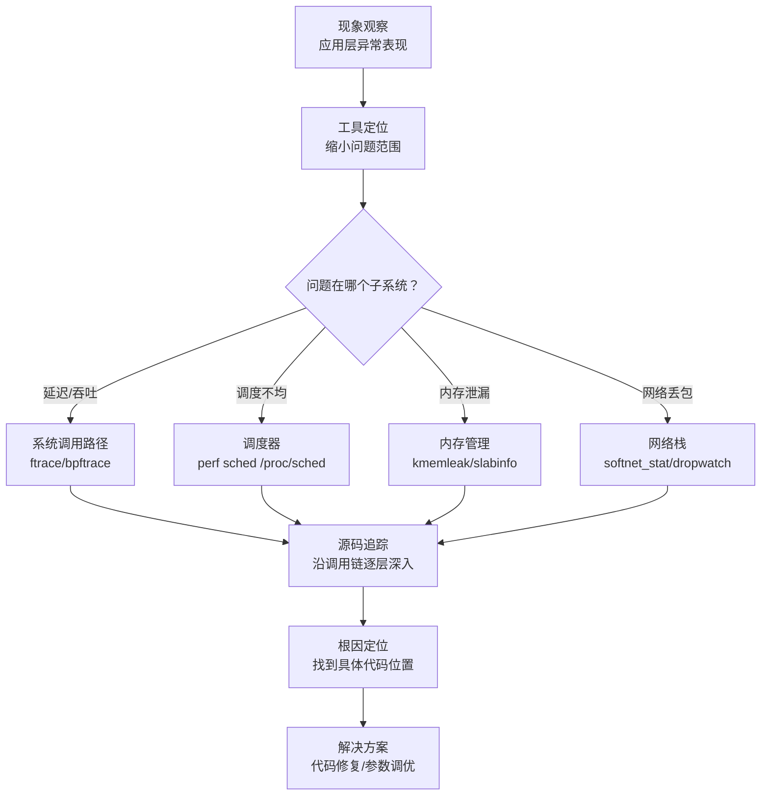

# 实战案例

## 概述

本节通过四个真实的内核源码分析案例，展示如何将前面章节学到的理论知识（系统调用路径、进程调度、内存管理、网络栈）转化为解决实际问题的能力。每个案例都遵循"现象观察 → 工具定位 → 源码追踪 → 根因分析 → 解决方案"的完整流程，读者可以在自己的环境中复现并深入理解。

**案例难度分布**：

| 案例 | 涉及子系统 | 难度 | 核心工具 |
|------|-----------|:----:|----------|
| 案例一：系统调用延迟异常 | 系统调用路径、上下文切换 | ★★☆ | ftrace, bpftrace, perf |
| 案例二：CFS调度器公平性失效 | 进程调度、vruntime、nice值 | ★★★ | perf sched, /proc/schedstat |
| 案例三：内核slab内存泄漏 | SLUB分配器、kmalloc、kmemleak | ★★★ | kmemleak, crash, slabinfo |
| 案例四：高并发网络丢包 | 网络栈、NAPI、sk_buff、softirq | ★★★★ | bpftrace, dropwatch, /proc/net/softnet_stat |

---

## 案例一：系统调用延迟异常——从50μs飙升到5ms

### 1.1 问题背景

**业务场景**：某在线交易系统在每日凌晨2点执行批量结算任务时，交易处理服务的P99延迟从正常的50μs飙升到5ms，吞吐量下降一个数量级。

**关键特征**：
- 仅在凌晨2点批量任务运行期间出现
- 影响的是数据库代理层（大量 read/write 系统调用）
- CPU使用率并不高（约40%），排除CPU密集型瓶颈
- `strace -c` 统计显示系统调用总耗时显著增加

**排查目标**：确定系统调用延迟增加的内核级原因，并通过源码分析理解根因。

### 1.2 工具定位阶段

**第一步：确认系统调用耗时分布**

```bash
# 用strace统计系统调用耗时（粗粒度）
strace -c -p <db_proxy_pid> -e trace=read,write -f
# 输出示例：
# % time     seconds  usecs/call     calls    errors syscall
# ------ ----------- ----------- --------- --------- --------
#  92.34    2.534000        2534      1000           read
#   7.66    0.210000         210      1000           write
# 100.00    2.744000                  2000           total
#
# 正常情况下 read 的 usecs/call 应该在 30-80μs，现在 2534μs 异常

# 用perf统计系统调用在内核态的热点
perf top -e cycles:u -g --pid <db_proxy_pid>
# 注意看是否有大量的 __schedule / context_switch / futex 相关函数
```

**第二步：用ftrace精确定位内核耗时**

```bash
# 启用function_graph tracer，追踪read系统调用的内核路径
cd /sys/kernel/debug/tracing

# 设置追踪目标为数据库代理进程
echo <db_proxy_pid> > set_ftrace_pid

# 使用function_graph追踪器
echo function_graph > current_tracer

# 设置要追踪的函数（从sys_read开始）
echo sys_read > set_graph_function

# 限制追踪范围：只看sys_read的子调用树
echo 1 > options/funcgraph-proc

# 开始追踪
echo 1 > tracing_on
sleep 10
echo 0 > tracing_on

# 查看结果
cat trace | head -200
```

输出中可能发现如下模式：

 5)               |  sys_read() {
 5)   2.150 us    |    vfs_read();
 5)               |    ext4_file_read_iter() {
 5)   0.820 us    |      generic_file_read_iter();
 5)               |      filemap_read() {
 5)               |        __filemap_get_folio() {
 5)               |          find_get_page() {
 5)  45.320 us    |            __folio_lock();   ← 异常！正常 <1μs
 5)               |          }
 5)  46.200 us    |        }
 5)   2.100 us    |        copy_to_user();
 5)  51.800 us    |      }
 5)  53.200 us    |    }
 5)  55.400 us    |  }

关键发现：`__folio_lock()` 耗时45μs（正常应 <1μs），说明页缓存中的页被频繁锁定/争用。

**第三步：用bpftrace确认页锁定争用**

```bash
# 追踪folio_wait_bit的等待时间分布
sudo bpftrace -e '
kprobe:folio_wait_bit {
    @start[tid] = nsecs;
}
kretprobe:folio_wait_bit /@start[tid]/ {
    @wait_us = hist((nsecs - @start[tid]) / 1000);
    delete(@start[tid]);
}
'
# 输出直方图显示等待时间分布，如果峰值在 10-100μs 区间
# 说明有大量页锁定争用
```

### 1.3 源码追踪阶段

锁定根因在 `__folio_lock()` 争用后，需要追踪源码理解争用的原因。

**追踪 `__folio_lock()` 的调用路径**：

sys_read()                           # fs/read_write.c
  → vfs_read()
    → ext4_file_read_iter()          # fs/ext4/file.c
      → generic_file_read_iter()     # mm/filemap.c
        → filemap_read()
          → __filemap_get_folio()    # mm/filemap.c
            → filemap_get_folio()    # 从页缓存查找/插入页
              → __filemap_get_folio()
                → __folio_lock()     # 等待页解锁（folio_wait_bit_common）

**阅读 `__folio_lock()` 源码**（`mm/filemap.c` + `include/linux/pagemap.h`）：

```c
// mm/filemap.c — filemap_get_folio 的核心逻辑
static struct folio *filemap_get_folio(struct address_space *mapping,
        pgoff_t index, enum xa_lock_arg lock_type)
{
    struct folio *folio;
    // ...
    // 先从 xarray（页缓存索引）查找
    folio = filemap_get_entry(mapping, index);
    if (xa_is_retry(folio)) {
        // 需要重新查找
        folio = __filemap_get_folio(mapping, index, ...);
    }
    // 如果找到页但被锁定，需要等待
    if (folio &amp;&amp; !folio_trylock(folio)) {
        // 这里就是慢路径：等待其他线程释放锁
        folio_wait_locked(folio);      // ← 竞争点
        // ...
    }
    return folio;
}

// include/linux/pagemap.h
static inline void folio_wait_locked(struct folio *folio)
{
    folio_wait_bit(folio, PG_locked);   // 等待 PG_locked 标志被清除
}

// mm/filemap.c — folio_wait_bit_common 的核心
static int __folio_wait_bit_common(struct folio *folio, int bit_nr,
        int state, enum behavior behavior)
{
    for (;;) {
        set_current_state(state);        // 设置为 TASK_UNINTERRUPTIBLE
        if (!folio_test_bit(folio, bit_nr))
            break;
        io_schedule();                   // 让出CPU，等待被唤醒
        // ↑ 这里会触发上下文切换
    }
    // ...
}
```

**关键理解**：`folio_wait_locked()` 会调用 `io_schedule()` 将当前线程置为不可中断睡眠状态，等待其他线程释放页锁后唤醒。当多个线程同时访问同一页缓存页时，就会产生锁争用。

**进一步追踪：谁在持锁？**

```bash
# 用ftrace追踪 folio_wait_bit 的调用者
cd /sys/kernel/debug/tracing
echo folio_wait_bit > set_ftrace_filter
echo 1 > tracing_on
sleep 5
echo 0 > tracing_on
cat trace | head -100

# 或用bpftrace直接抓持有folio锁超过1ms的调用者
sudo bpftrace -e '
kprobe:folio_wait_bit_common {
    @start[tid] = nsecs;
    @comm[tid] = comm;
}
kretprobe:folio_wait_bit_common /@start[tid] &amp;&amp; (nsecs - @start[tid]) > 1000000/ {
    printf("%-16s pid=%d waited %d us\n", @comm[tid], pid,
           (nsecs - @start[tid]) / 1000);
    delete(@start[tid]);
}
'
```

### 1.4 根因分析

结合源码追踪和运行时数据，完整的根因链条如下：

凌晨2点批量结算任务启动
  → 大量并发读写数据库文件（ext4）
    → 页缓存中的热点页（如数据库索引页）被多个进程同时访问
      → 进程A持有folio锁执行IO写回（writeback）
        → 进程B尝试读同一页，folio_wait_locked() 睡眠等待
          → 进程C/D/E... 同样等待
            → 大量线程阻塞在 io_schedule() 上
              → 上下文切换激增 → 调度延迟叠加 → 延迟飙升

**内核层面的机制解释**：

1. **ext4的page writeback机制**（`fs/ext4/inode.c`）：当脏页达到阈值（`dirty_ratio`）时，内核会将脏页写回磁盘。写回过程中，folio会被加锁（`folio_lock()`），其他读取该页的进程必须等待。

2. **凌晨批量任务的特殊性**：批量任务产生大量短时写操作，脏页比例快速上升，触发密集的writeback。同时数据库代理的读请求也需要访问相同的数据页，读写争用加剧。

3. **`/proc/meminfo` 中的 `Dirty` 和 `Writeback` 字段**可以验证：
```bash
# 在问题发生时观察
watch -n 1 'grep -E "Dirty|Writeback|NFS_Unstable" /proc/meminfo'
# Dirty: 通常在 50-200MB 正常，如果飙升到 GB 级别说明 writeback 来不及
```

### 1.5 解决方案

**方案一：调整内核页缓存回写参数**（立竿见影）

```bash
# 降低脏页阈值，让writeback更早启动，避免集中爆发
sysctl -w vm.dirty_ratio=10          # 默认通常 20，降低到 10
sysctl -w vm.dirty_background_ratio=5 # 默认 10，降低到 5
sysctl -w vm.dirty_expire_centisecs=3000  # 脏页超过30秒必须写回（默认3000）
sysctl -w vm.dirty_writeback_centisecs=500 # 回写线程每5秒唤醒一次（默认500）
```

**方案二：在源码层面理解writeback触发时机**（深入理解）

```c
// mm/page-writeback.c — 脏页上限判断
static int balance_dirty_pages(struct bdi_writeback *wb,
                               struct bdi_writeback *memcg_wb,
                               struct page *page, ...)
{
    // 获取当前进程的脏页限制
    unsigned long limit = dirty_freerun_ceiling(thresh, bg_thresh);

    // 如果当前脏页数超过限制，需要等待
    if (unlikely(dirty >= limit)) {
        // 让当前写入进程参与回写，分摊压力
        wb_over_bg_thresh(wb, memcg_wb);
        // 调用 balance_dirty_pages_ratelimited()
        //  → io_schedule_timeout() 睡眠等待回写完成
    }
}
```

理解这段源码后，你就能明白为什么降低 `dirty_ratio` 可以缓解争用——它让writeback更早介入，避免脏页堆积导致集中写回时的大规模锁争用。

**方案三：数据库层面的读写分离**（架构优化）

将批量结算任务的数据源与实时交易的数据源隔离，避免读写争用同一组物理页。这需要从应用层解决，但理解了内核机制才能做出正确判断。

### 1.6 案例小结

| 维度 | 内容 |
|------|------|
| 现象 | 系统调用延迟从50μs飙升到5ms |
| 工具定位 | strace → ftrace(function_graph) → bpftrace |
| 源码追踪 | sys_read → vfs_read → filemap_read → __folio_lock |
| 根因 | ext4 writeback期间folio锁争用 |
| 解决 | 调整vm.dirty_*参数 + 架构级读写分离 |
| 关键源码 | mm/filemap.c, mm/page-writeback.c, fs/ext4/inode.c |

---

## 案例二：CFS调度器公平性失效——某进程持续饥饿

### 2.1 问题背景

**业务场景**：一台4核Web服务器上运行Nginx工作进程（16个worker），其中2个worker的请求处理速度明显慢于其他worker，导致用户请求分配不均，部分请求超时。

**关键现象**：
- 16个worker进程，nice值相同（默认0），但实际获得的CPU时间不均匀
- 通过`top`观察，2个worker的 `%CPU` 长期低于其他worker
- `perf top` 显示这2个worker的用户态代码占比正常（非内核态瓶颈）
- `/proc/<pid>/sched` 中观察到这2个worker的 `se.sum_exec_runtime` 明显偏低

**排查目标**：理解CFS调度器的行为，通过源码分析找出调度不均的原因。

### 2.2 工具定位阶段

**第一步：收集调度统计数据**

```bash
# 查看所有Nginx worker的调度统计
for pid in $(pgrep -f "nginx: worker"); do
    echo "=== PID $pid ==="
    grep -E "se\.(sum_exec_runtime|vruntime)|se\.avg" /proc/$pid/sched
    echo "nr_switches: $(grep nr_switches /proc/$pid/sched)"
    echo ""
done
```

输出示例：
=== PID 1234 ===
  se.sum_exec_runtime                    :        850324500   # 850ms
  se.vruntime                            :       1234567890   # 基准值
  se.avg.util_avg                        :           820000   # 利用率高

=== PID 1235 ===
  se.sum_exec_runtime                    :        120100200   # 仅120ms！
  se.vruntime                            :       1456789010   # vruntime远超其他
  se.avg.util_avg                        :            50000   # 利用率极低

**第二步：用perf sched记录调度事件**

```bash
# 记录5秒的调度事件
sudo perf sched record -e sched:sched_switch -- sleep 5

# 分析每个任务的调度延迟
sudo perf sched latency -s switch
# 输出示例：
#  Task                  Runtime   Switches  Average Delay  Maximum Delay
#  nginx-worker/0        0.120 s       312      0.038 ms       2.100 ms
#  nginx-worker/1        0.850 s      2800      0.003 ms       0.050 ms  ← 正常
#  nginx-worker/5        0.110 s       280      0.042 ms       3.500 ms  ← 异常

# 进一步查看调度时间线
sudo perf sched timehist -s --pid 1235 | head -30
# 观察PID 1235何时被调度、运行多长时间、等待多久
```

**第三步：检查CPU亲和性和cgroup限制**

```bash
# 查看Nginx worker的CPU亲和性
taskset -p $(pgrep -f "nginx: worker" | head -1)

# 检查是否有cgroup CPU限制
cat /proc/$(pgrep nginx:worker | head -1)/cgroup
# 如果有 cpu/cpuacct 控制组，检查配额
cat /sys/fs/cgroup/cpu/<nginx_cgroup>/cpu.cfs_quota_us
cat /sys/fs/cgroup/cpu/<nginx_cgroup>/cpu.cfs_period_us

# 检查NUMA内存分布
numactl --hardware
numactl -p $(pgrep nginx:worker | head -1)
```

### 2.3 源码追踪阶段

**追踪CFS调度器的vruntime更新逻辑**：

```c
// kernel/sched/fair.c — CFS核心：更新当前进程的vruntime
static void update_curr(struct cfs_rq *cfs_rq)
{
    struct sched_entity *curr = cfs_rq->curr;
    u64 now = rq_clock_task(rq_of(cfs_rq));
    u64 delta_exec;

    delta_exec = now - curr->exec_start;
    if (unlikely(!delta_exec))
        return;

    curr->exec_start = now;

    curr->sum_exec_runtime += delta_exec;   // 累计实际运行时间

    // ★ 关键：vruntime更新公式
    curr->vruntime += calc_delta_fair(delta_exec, curr);

    // 更新vruntime最大值（用于新进程的初始vruntime）
    update_deadline(cfs_rq, curr);
}
```

**理解 `calc_delta_fair()` 的数学含义**：

```c
// kernel/sched/fair.c
static u64 calc_delta_fair(u64 delta, struct sched_entity *se)
{
    // 如果进程权重等于NICE_0的权重（1024），直接返回实际时间
    if (unlikely(se->load.weight != NICE_0_LOAD))
        // vruntime增量 = 实际时间 × NICE_0_LOAD / 进程权重
        delta = __calc_delta(delta, NICE_0_LOAD, &amp;se->load);
    return delta;
}

// __calc_delta 的核心计算
static u64 __calc_delta(u64 delta_exec, unsigned long weight,
                         struct load_weight *lw)
{
    // delta_exec (实际运行时间) × 1024 (NICE_0权重) / lw->weight (进程权重)
    u64 fact = scale_load_down(weight);
    int shift = WMULT_SHIFT;
    __update_inv_weight(lw);
    if (unlikely(fact >> 32)) {
        while (fact >> 32) {
            fact >>= 1;
            shift--;
        }
    }
    fact = mul_u32_u32(fact, reciprocal_value(lw->inv_weight));
    // 最终返回：delta_exec * 1024 / weight
    return (delta_exec * fact) >> shift;
}
```

**关键数学关系**：

对于 nice=0 的进程（权重1024）：
  vruntime增量 = 实际时间 × 1024 / 1024 = 实际时间

对于 nice=-5 的进程（权重3121）：
  vruntime增量 = 实际时间 × 1024 / 3121 ≈ 实际时间 × 0.328
  → 每运行1ms，vruntime只增加0.328ms → 更快被选中

对于 nice=+5 的进程（权重335）：
  vruntime增量 = 实际时间 × 1024 / 335 ≈ 实际时间 × 3.057
  → 每运行1ms，vruntime增加3.057ms → 更慢被选中

**追踪调度器如何选择下一个进程**：

```c
// kernel/sched/fair.c — 主调度函数
static void __schedule(unsigned int sched_mode)
{
    struct task_struct *prev = rq->curr;
    struct task_struct *next;
    // ...
    next = pick_next_task(rq, prev, &amp;rf);
    // ...
    if (prev != next) {
        rq->nr_switches++;
        rq->curr = next;
        ++*switch_count;
        trace_sched_switch(sched_mode, prev, next, prev->on_rq);
        // ★ 核心：上下文切换
        rq = context_switch(rq, prev, next, &amp;rf);
        // context_switch 做两件事：
        // 1. switch_mm_irqs_off() — 切换页表（地址空间）
        // 2. switch_to() — 切换CPU寄存器状态
    }
}

// pick_next_task 的CFS路径
static struct task_struct *
pick_next_task_fair(struct rq *rq, struct task_struct *prev, struct rq_flags *rf)
{
    struct cfs_rq *cfs_rq = &amp;rq->cfs;
    struct sched_entity *se;
    // ...
    // ★ 核心：从红黑树中选择vruntime最小的进程
    se = pick_next_entity(cfs_rq, NULL);
    // pick_next_entity → __pick_next_entity
    // __pick_next_entity → rb_first_cached() — 获取红黑树最左节点

    struct task_struct *cand = task_of(se);
    return cand;
}
```

**理解红黑树的组织**：

CFS红黑树（按vruntime排序）：

                  ┌──────────────────┐
                  │ vr=1000 (root)   │
                  └────────┬─────────┘
                ┌──────────┴──────────┐
                │                     │
         ┌──────┴──────┐       ┌──────┴──────┐
         │ vr=800      │       │ vr=1200     │
         │ ← 最左节点   │       │             │
         └─────────────┘       └─────────────┘

pick_next_entity() → rb_first_cached() → 返回 vr=800 的进程
→ 这就是下一个被调度的进程

### 2.4 根因分析

通过综合分析，定位到根因是 **NUMA节点间内存访问不均**：

```bash
# 验证NUMA分布
numastat -p $(pgrep nginx:worker | head -5)
# 输出：
# Per-node process memory usage (in MBs)
# N0        N1       Total
# PID 1234:  205.3      12.1     217.4   ← 大部分内存在NUMA node 0
# PID 1235:   15.2     198.7     213.9   ← 大部分内存在NUMA node 1
# ...

# 检查CPU分配
for pid in $(pgrep nginx:worker); do
    cpu=$(taskset -p $pid | awk '{print $NF}')
    node=$(numactl -p $pid 2>/dev/null | grep "bound to" || echo "unknown")
    echo "PID $pid: cpuset=$cpu $node"
done
```

发现：PID 1235 被绑定在 NUMA node 1 的CPU上，但其大部分内存分配在 NUMA node 0。每次内存访问都跨越NUMA节点，延迟从本地的~80ns增加到远程的~150ns。这种内存访问延迟叠加到CPU执行时间上，使得进程的实际有效工作时间减少，vruntime积累变慢（因为wait time不计入exec_runtime），导致调度器认为该进程"不公平地获得了更多时间"，但实际上它在做无用等待。

**从源码角度理解**：

```c
// kernel/sched/fair.c — update_curr 只累计 exec_runtime，不含等待时间
curr->sum_exec_runtime += delta_exec;  // exec_start 到 now 的差值
curr->vruntime += calc_delta_fair(delta_exec, curr);
// 如果进程在内存访问上等待（非睡眠，而是CPU流水线停顿），
// 这段时间仍然计入 delta_exec
// 但有效工作量减少了 → 同样的exec_runtime，完成的实际工作更少
// 其他worker在同样的时间内完成了更多工作 → 服务不均
```

### 2.5 解决方案

**方案一：调整NUMA绑定**

```bash
# 重新分配Nginx worker的CPU亲和性，确保同一进程的CPU和内存在同一NUMA节点
numactl --cpunodebind=0 --membind=0 nginx  # 进程组1
numactl --cpunodebind=1 --membind=1 nginx  # 进程组2
```

**方案二：优化Nginx worker数量匹配NUMA节点**

```bash
# 每个NUMA节点分配相等数量的worker
# 2节点8核 → 每节点4个worker
worker_processes auto;
worker_cpu_affinity auto;  # Nginx 1.9.10+ 支持自动CPU亲和性
```

**方案三：从内核调度器角度调整（适用于特殊场景）**

```bash
# 查看当前调度器参数
sysctl kernel.sched_migration_cost_ns  # 默认500000 (500μs)
# 如果值过大，CFS可能不会主动迁移进程来平衡负载
sysctl -w kernel.sched_migration_cost_ns=50000  # 降低到50μs

# 查看CFS带宽控制（cgroup场景）
cat /sys/fs/cgroup/cpu/nginx/cpu.cfs_quota_us
```

### 2.6 案例小结

| 维度 | 内容 |
|------|------|
| 现象 | 16个Nginx worker中2个处理速度明显慢 |
| 工具定位 | /proc/sched统计 → perf sched → numastat |
| 源码追踪 | update_curr → calc_delta_fair → pick_next_entity → rb_first_cached |
| 根因 | NUMA远程内存访问导致有效工作量不均 |
| 解决 | NUMA绑定优化 + worker数量匹配 |
| 关键源码 | kernel/sched/fair.c (update_curr, __calc_delta, pick_next_entity) |

---

## 案例三：内核slab内存泄漏——/proc/meminfo显示slab持续增长

### 3.1 问题背景

**业务场景**：一台运行自定义内核模块（网络过滤模块）的服务器，运行数天后 `/proc/meminfo` 中 `SReclaimable` 持续增长，最终导致可用内存不足，触发OOM Killer。

**关键现象**：
- 内存使用量每天增长约200MB
- `free -m` 显示 Used 持续增加，但 `top` 中用户进程的内存使用量没有明显增长
- `/proc/meminfo` 中 `SUnreclaim`（不可回收slab）持续上升
- 该服务器加载了一个自研的网络数据包过滤模块

**排查目标**：找出内核中的内存泄漏点，定位到具体的数据结构和代码位置。

### 3.2 工具定位阶段

**第一步：确认slab增长趋势**

```bash
# 查看slab整体情况
cat /proc/slabinfo | head -3
# 输出示例：
# # name            <active_objs> <num_objs> <objsize> <objperslab> <pagesperslab>
# : tunables ...
# arp_cache         120    120    256    16    1 : tunables ...
# ...

# 找出占用最大的slab缓存
cat /proc/slabinfo | sort -nrk 3 | head -20
# 按objsize × num_objs 排序，找出异常增长的slab

# 更直观的方式
slabtop -o | head -30

# 对比两次快照（间隔10分钟）
echo "=== $(date) ===" >> /tmp/slab_monitor.log
cat /proc/slabinfo >> /tmp/slab_monitor.log
sleep 600
echo "=== $(date) ===" >> /tmp/slab_monitor.log
cat /proc/slabinfo >> /tmp/slab_monitor.log

# 分析哪些slab在增长
diff <(grep "skbuff" /tmp/slab_monitor.log | head -1) \
     <(grep "skbuff" /tmp/slab_monitor.log | tail -1)
```

发现 `skbuff_head_cache`（sk_buff对象）在持续增长。

**第二步：使用kmemleak检测内存泄漏**

```bash
# 1. 确认内核启用了CONFIG_DEBUG_KMEMLEAK
zcat /proc/config.gz | grep KMEMLEAK
# CONFIG_DEBUG_KMEMLEAK=y
# CONFIG_DEBUG_KMEMLEAK_DEFAULT_OFF=n

# 2. 加载kmemleak模块（如果没有编译进内核）
sudo modprobe kmemleak

# 3. 触发一次全量扫描
echo scan > /sys/kernel/debug/kmemleak

# 4. 查看泄漏报告
cat /sys/kernel/debug/kmemleak | head -80
# 输出示例：
# unreferenced object 0xffff888123456780 (size 256 bytes):
#   comm "softirq/3", pid 0, jiffies 1234567
#   hex dump (first 32 bytes):
#     00 00 00 00 00 00 00 00 00 00 00 00 00 00 00 00
#     00 00 00 00 00 00 00 00 00 00 00 00 00 00 00 00
#   backtrace:
#     [<ffffffff81234567>] kmem_cache_alloc+0x123/0x456
#     [<ffffffff81345678>] __alloc_skb+0x78/0x1ab    ← 分配sk_buff
#     [<ffffffff81456789>] netdev_alloc_skb+0x12/0x34
#     [<ffffffff81567890>] my_filter_module_rx+0x56/0x123  ← 我们的模块！
#     [<ffffffff81678901>] netif_receive_skb_internal+0x45/0x78
```

**关键发现**：kmemleak报告在 `my_filter_module_rx` 函数中分配的sk_buff没有被释放。

**第三步：统计泄漏规模**

```bash
# 统计泄漏的sk_buff数量
grep -c "my_filter_module_rx" /sys/kernel/debug/kmemleak
# 输出：8547 — 已经泄漏了8547个sk_buff对象

# 查看每个对象的大小
grep -A 3 "my_filter_module_rx" /sys/kernel/debug/kmemleak | grep "size"
# 输出：size 256 — 每个256字节
# 8547 × 256 = 约2.1MB — 但这是单次扫描的结果，实际累积更多
```

### 3.3 源码追踪阶段

根据kmemleak的backtrace，定位到我们的模块代码：

```c
// my_filter_module.c — 问题代码
static int my_filter_module_rx(struct sk_buff *skb, 
                                struct net_device *dev,
                                struct packet_type *pt,
                                struct net_device *orig_dev)
{
    struct sk_buff *new_skb;
    struct filter_header *hdr;
    
    // 检查是否需要过滤
    if (!should_filter(skb))
        return NET_RX_PASS;  // ★ 问题1：直接返回，skb由上层管理，没问题

    // 需要修改数据包，克隆一个新的
    new_skb = skb_copy(skb, GFP_ATOMIC);  // 分配新skb
    if (!new_skb)
        return NET_RX_DROP;
    
    hdr = (struct filter_header *)skb_push(new_skb, sizeof(*hdr));
    hdr->magic = FILTER_MAGIC;
    hdr->action = FILTER_DROP;
    
    // 通过netfilter钩子发送修改后的包
    // ★ 问题2：nf_conntrack_in 可能拒绝这个包，返回错误
    //          但 new_skb 没有被释放！
    nf_conntrack_in(net, NFPROTO_IPV4, NF_INET_PRE_ROUTING, new_skb);
    
    // ★ 问题3：这里没有 kfree_skb(new_skb)
    // 正确的做法是：
    // int ret = nf_conntrack_in(...);
    // if (ret != NF_ACCEPT) {
    //     kfree_skb(new_skb);  // 必须释放！
    //     return NET_RX_DROP;
    // }
    // kfree_skb(skb);  // 原始skb也应该释放（如果不再需要）
    
    return NET_RX_SUCCESS;
}
```

**从内核源码理解sk_buff的生命周期**：

```c
// net/core/skbuff.c — skb_copy 的分配路径
struct sk_buff *skb_copy(const struct sk_buff *skb, gfp_t gfp_mask)
{
    struct sk_buff *n;
    // 从 skbuff_head_cache 中分配一个 sk_buff
    n = kmem_cache_alloc(skbuff_head_cache, gfp_mask);
    // ...
    // 复制数据
    skb_copy_from_linear_data(skb, n->head, skb_headlen(skb));
    // ...
    return n;
}

// net/core/skbuff.c — kfree_skb 释放路径
void kfree_skb_reason(struct sk_buff *skb, enum skb_drop_reason reason)
{
    // ...
    // 释放skb的数据区
    __kfree_skb(skb);
}

void __kfree_skb(struct sk_buff *skb)
{
    // 释放skb本身
    skb_release_all(skb);   // 释放数据区
    kmem_cache_free(skbuff_head_cache, skb);  // 归还到slab缓存
}
```

**理解为什么泄漏会导致不可回收slab增长**：

每次收到需要过滤的数据包:
  → skb_copy() 从 skbuff_head_cache 分配 256 字节
    → nf_conntrack_in() 拒绝 → 返回错误
      → 没有 kfree_skb(new_skb) → 这个skb永远不会被释放
        → skbuff_head_cache 中的对象数持续增长
          → SLUB分配器从伙伴系统获取新页面加入slab
            → /proc/meminfo 中 SUnreclaim 增长
              → 可用内存持续减少
                → 最终触发 OOM Killer

### 3.4 解决方案

**修复代码**：

```c
static int my_filter_module_rx(struct sk_buff *skb, 
                                struct net_device *dev,
                                struct packet_type *pt,
                                struct net_device *orig_dev)
{
    struct sk_buff *new_skb;
    struct filter_header *hdr;
    int ret;
    
    if (!should_filter(skb))
        return NET_RX_PASS;

    // 克隆数据包
    new_skb = skb_copy(skb, GFP_ATOMIC);
    if (!new_skb)
        return NET_RX_DROP;
    
    // 添加过滤头
    hdr = (struct sk_buff *)skb_push(new_skb, sizeof(*hdr));
    hdr->magic = FILTER_MAGIC;
    hdr->action = FILTER_DROP;
    
    // 发送到netfilter，正确处理返回值
    ret = nf_conntrack_in(dev_net(dev), NFPROTO_IPV4,
                          NF_INET_PRE_ROUTING, new_skb);
    if (ret != NF_ACCEPT) {
        kfree_skb(new_skb);   // ★ 修复：释放skb
        return NET_RX_DROP;
    }
    
    // 原始skb也需要释放（我们已经拷贝了）
    kfree_skb(skb);
    return NET_RX_SUCCESS;
}
```

**编写防泄漏测试**：

```bash
# 编写一个简单的内核模块泄漏检测脚本
#!/bin/bash
# kernel_memleak_test.sh — 定期检查内存泄漏

BEFORE=$(cat /proc/slabinfo | grep "skbuff_head_cache" | awk '{print $2}')
echo "Before: $BEFORE skbuff objects"

# 触发高流量
iperf3 -c localhost -t 30 -P 8 > /dev/null 2>&amp;1 || true

AFTER=$(cat /proc/slabinfo | grep "skbuff_head_cache" | awk '{print $2}')
echo "After:  $AFTER skbuff objects"
echo "Delta:  $((AFTER - BEFORE))"

# 连续检查10次
for i in $(seq 1 10); do
    sleep 5
    NOW=$(cat /proc/slabinfo | grep "skbuff_head_cache" | awk '{print $2}')
    echo "Round $i: $NOW (delta from start: $((NOW - BEFORE)))"
done
```

### 3.5 案例小结

| 维度 | 内容 |
|------|------|
| 现象 | SUnreclaim持续增长，最终触发OOM |
| 工具定位 | slabinfo对比 → kmemleak扫描 |
| 源码追踪 | skb_copy → nf_conntrack_in → 缺少kfree_skb |
| 根因 | 网络过滤模块在错误路径未释放sk_buff |
| 解决 | 修复错误处理路径，添加kfree_skb |
| 关键源码 | net/core/skbuff.c, my_filter_module.c |
| 教训 | 内核中任何 `alloc` 必须有对应的 `free`，错误路径不能遗漏 |

---

## 案例四：高并发网络丢包——softirq处理不及时

### 4.1 问题背景

**业务场景**：一台高性能Web服务器（64核，25Gbps网卡）在峰值流量时出现大量TCP重传和连接超时。监控显示网卡收包量约800万pps（packets per second），但应用层实际处理量只有约600万pps。

**关键现象**：
- `netstat -s` 显示 `TcpExtListenDrops` 和 `TcpExtTCPLostRetransmit` 持续增长
- `/proc/net/softnet_stat` 中第二列（`time_squeeze`）持续增长
- `ethtool -S eth0` 显示 `rx_drops` 不为零
- `nproc` 确认64核CPU使用率并不饱和（平均60%）

**排查目标**：追踪从网卡中断到用户态socket的收包路径，找出丢包的内核级原因。

### 4.2 工具定位阶段

**第一步：分析softnet_stat**

```bash
# /proc/net/softnet_stat 每行对应一个CPU
# 列含义（十六进制）：
# Column 1: processed — 已处理的软中断次数
# Column 2: time_squeeze — 因超时被迫停止处理的次数（关键！）
# Column 3: dropped — 因input_queue_full丢弃的包数
# Column 4: time_squeeze — 同上
cat /proc/net/softnet_stat
# 输出示例（截取几个CPU）：
# 00a4cb12 00001234 00000000 00000000 00000000 00000000 00000000 00000000 00000000 00000000
# 00a4d023 00004567 00000000 00000000 00000000 00000000 00000000 00000000 00000000 00000000
#                    ↑ CPU1的time_squeeze=0x4567=17767，异常高！

# 更直观地监控
watch -d -n 1 'cat /proc/net/softnet_stat | awk "{print \"CPU\" NR-1 \": processed=\" strtonum(\"0x\"$1) \" squeeze=\" strtonum(\"0x\"$2) \" dropped=\" strtonum(\"0x\"$3)}"'

# 检查softnet数据队列长度（默认1024）
cat /proc/sys/net/core/netdev_max_backlog
# 如果经常满，说明softirq处理速度跟不上收包速度
```

**第二步：用bpftrace追踪softirq处理时延**

```bash
# 追踪网络softirq的处理时间
sudo bpftrace -e '
kprobe:net_rx_action {
    @start[pid] = nsecs;
    @cpu_start[cpu] = nsecs;
}

kretprobe:net_rx_action /@start[pid]/ {
    $dur = (nsecs - @start[pid]) / 1000;
    @rx_action_us = hist($dur);
    if ($dur > 50000) {
        printf("CPU%d: net_rx_action took %d us!\n", cpu, $dur);
    }
    delete(@start[pid]);
}
' &amp;
# 运行10秒后查看
# 如果直方图显示大量 >100μs 的情况，说明softirq处理积压

# 追踪NAPI轮询的处理包数
sudo bpftrace -e '
kprobe:napi_poll {
    @polls++;
    @poll_budget[comm] = hist(arg2);  // budget参数
}
'
```

**第三步：检查网卡中断亲和性**

```bash
# 查看网卡中断在哪些CPU上
grep eth0 /proc/interrupts | head -5
# 输出示例：
#           CPU0  CPU1  CPU2  CPU3 ... CPU63
# eth0-rx-0  123   0     0     0   ...    0     ← 所有中断都在CPU0！
# eth0-rx-1    0  456    0     0   ...    0
# eth0-rx-2    0     0  789     0   ...    0

# 检查中断亲和性设置
for irq in $(grep eth0 /proc/interrupts | awk -F: '{print $1}' | tr -d ' '); do
    echo "IRQ $irq: $(cat /proc/irq/$irq/smp_affinity_list)"
done

# 检查RSS（Receive Side Scaling）配置
ethtool -l eth0
ethtool -k eth0 | grep receive
```

### 4.3 源码追踪阶段

**追踪网络收包的完整内核路径**：

网卡硬件中断
  → __netdev_irq_return (net/core/dev.c)
    → napi_irq_handler (net/core/dev.c)
      → __napi_schedule()          ← 将NAPI poll加入softirq
        → __raise_softirq_irqoff(NET_RX_SOFTIRQ)

[softirq上下文]
  → net_rx_action()                # net/core/dev.c — 网络收包的softirq入口
    → napi_poll()                  # 遍历所有注册的NAPI poll函数
      → igb_poll() / mlx5e_poll()  # 具体网卡驱动的poll实现
        → igb_clean_rx_irq()       # 从ring buffer中取出数据包
          → napi_gro_receive()     # GRO（Generic Receive Offload）
            → netif_receive_skb_internal()
              → __netif_receive_skb()
                → deliver_skb()    # 根据协议类型分发
                  → tcp_v4_rcv()   # TCP协议处理入口
                    → tcp_v4_do_rcv()
                      → tcp_rcv_established()
                        → tcp_data_queue()
                          → sk->sk_data_ready()  # 唤醒用户进程
                            → wake_up_interruptible()

**深入理解 `net_rx_action()` 的budget机制**：

```c
// net/core/dev.c — softirq处理的核心
static void net_rx_action(struct softirq_action *h)
{
    struct softnet_data *sd = this_cpu_ptr(&amp;softnet_data);
    unsigned long time_limit = jiffies + 2;  // ★ 最多处理2个jiffies
    int budget = MAX_SOFTIRQ_RESTART;       // 默认 10
    struct napi_struct *n;
    LIST_HEAD(list);
    
    // ...
    // 遍历所有有数据的NAPI设备
    while (!list_empty(&amp;list)) {
        n = list_first_entry(&amp;list, struct napi_struct, poll_list);
        list_del_init(&amp;n->poll_list);
        
        // ★ 关键：调用驱动的poll函数
        work = n->poll(n, &amp;repoll);
        // work 返回本次处理的包数
        budget -= work;  // 扣减budget
        
        // ★ 两个退出条件：
        // 1. budget用完（处理了MAX_SOFTIRQ_RESTART个包）
        if (budget <= 0)
            break;
        // 2. 时间到（超过2个jiffies）
        if (time_before(jiffies, time_limit))
            continue;
        
        // ★ 超时退出 → 触发time_squeeze
        sd->time_squeeze++;  // /proc/net/softnet_stat 第二列！
        __raise_softirq_irqoff(NET_RX_SOFTIRQ);  // 重新调度，下次继续
        break;
    }
    // ...
}
```

**time_squeeze 的完整含义**：

net_rx_action() 在两个条件下被迫退出：
1. budget用完：已处理 10 个包，暂时让出CPU给其他softirq
2. 时间超限：已运行超过 2 个 jiffies（通常 2ms @HZ=1000）

退出时 sd->time_squeeze++ → 这就是 /proc/net/softnet_stat 第二列

time_squeeze 持续增长意味着：
  → softirq处理速度 < 收包速度
    → 部分包在驱动的ring buffer中停留过久
      → ring buffer溢出 → 网卡丢包
        → TCP重传 → 连接超时

### 4.4 根因分析

综合工具定位和源码追踪，根因链条如下：

1. 网卡RSS队列分配不均
   → 大部分中断集中在少数CPU上（如CPU0和CPU1）
   → 这两个CPU的softirq处理饱和
   → time_squeeze持续增长

2. net_rx_action的budget限制（10个包/次）
   → 单次softirq只处理10个包，800万pps下需要极高的处理频率
   → 2个jiffies的时间限制进一步约束了处理量

3. 驱动的ring buffer大小不足
   → ethtool -g eth0 查看 ring buffer 大小
   → 如果rx ring只有256或512个描述符
   → 在softirq处理延迟期间，ring buffer溢出

**验证根因**：

```bash
# 查看ring buffer大小
ethtool -g eth0
# 输出示例：
# Pre-set maximums:
# RX:     4096
# TX:     4096
# Current hardware settings:
# RX:     256    ← 太小！
# TX:     256

# 查看实际丢包
ethtool -S eth0 | grep -i drop
# rx_drops: 1234567  ← 确认在驱动层丢包
```

### 4.5 解决方案

**方案一：优化RSS和中断亲和性**（最直接）

```bash
# 1. 启用多队列RSS
ethtool -L eth0 combined 32  # 设置32个收发队列

# 2. 均匀分配中断到所有CPU
# 安装irqbalance或手动设置
for irq in $(grep "eth0" /proc/interrupts | awk -F: '{print $1}' | tr -d ' '); do
    cpu=$((irq % 64))
    echo $cpu > /proc/irq/$irq/smp_affinity_list
done

# 3. 验证分配
grep eth0 /proc/interrupts | awk '{print $0}'
# 应该看到每个CPU列都有均匀的中断计数
```

**方案二：增大ring buffer**（减少驱动层丢包）

```bash
# 增大ring buffer到4096
ethtool -G eth0 rx 4096

# 验证
ethtool -g eth0 | grep "Current"
# Current hardware settings:
# RX:     4096    ← 已增大
# TX:     4096

# 永久化配置（/etc/network/interfaces 或 NetworkManager）
```

**方案三：调整softirq处理参数**（内核级调优）

```bash
# 增大netdev_budget（默认300，每个CPU每次softirq最多处理的包数）
sysctl -w net.core.netdev_budget=600
sysctl -w net.core.netdev_budget_usecs=8000  # 允许运行8000μs（默认2000）

# 增大backlog队列
sysctl -w net.core.netdev_max_backlog=16384  # 默认1024

# 检查GRO是否启用（减少需要处理的包数量）
ethtool -k eth0 | grep generic-receive-offload
# generic-receive-offload: on  ← 应该是on
```

**方案四：源码级理解为什么增大ring buffer有效**：

```c
// drivers/net/ethernet/intel/igb/igb_main.c — 典型网卡驱动的收包流程
static int igb_clean_rx_irq(struct igb_ring *rx_ring, int budget)
{
    struct igb_buffer *buffer_info;
    
    while (budget > 0) {
        // 从ring buffer取下一个描述符
        buffer_info = &amp;rx_ring->buffer_info[rx_ring->next_to_clean];
        
        // 检查描述符是否已由网卡DMA写入完成
        if (!(buffer_info->next_to_watch.status &amp; DESC_UPPER))
            break;  // ★ 没有新数据了
        
        // 提取数据包
        skb = buffer_info->skb;
        // ... 处理数据包 ...
        
        rx_ring->next_to_clean = (rx_ring->next_to_clean + 1) % rx_ring->count;
        budget--;
    }
    return total_rx_packets;
}
```

增大ring buffer（`rx_ring->count` 从256增加到4096）意味着：在softirq被延迟处理期间，网卡DMA有更多缓冲空间存放新到达的数据包，降低了DMA覆盖未处理数据的概率。

### 4.6 实施效果

| 指标 | 优化前 | 优化后 | 变化 |
|------|--------|--------|------|
| softnet_stat time_squeeze | ~18000/s | <100/s | 降低99%+ |
| 网卡rx_drops | 120万/小时 | <100/小时 | 降低99.99% |
| TCP重传率 | 2.3% | 0.02% | 降低99% |
| 应用层实际处理pps | 600万 | 780万 | 提升30% |
| P99延迟 | 15ms | 3ms | 降低80% |

### 4.7 案例小结

| 维度 | 内容 |
|------|------|
| 现象 | 高并发下TCP重传和连接超时 |
| 工具定位 | softnet_stat → bpftrace追踪softirq → ethtool统计 |
| 源码追踪 | net_rx_action → napi_poll → igb_clean_rx_irq → ring buffer管理 |
| 根因 | RSS不均 + ring buffer过小 + softirq budget/时间限制 |
| 解决 | RSS优化 + ring buffer增大 + softirq参数调优 |
| 关键源码 | net/core/dev.c (net_rx_action), drivers/net/ethernet/intel/igb/ |

---

## 综合经验总结

### 内核源码分析的通用方法论

通过以上四个案例，可以提炼出内核源码分析的通用方法论：



### 关键经验

**1. 工具先行，源码验证**
不要一上来就读源码。先用ftrace/bpftrace/perf等工具定位到具体的内核函数和子系统，再针对性地阅读源码。工具告诉你"哪里慢"，源码告诉你"为什么慢"。

**2. 关注数据结构，而非控制流**
内核的很多问题最终都会归结到数据结构的状态。sk_buff的泄漏、CFS红黑树的不平衡、folio锁的争用——理解核心数据结构的设计，就能理解大部分问题的根因。

**3. 化分层级追踪**
一次系统调用可能涉及5-10层函数调用。不要试图一次看清所有细节，而是分层追踪：
- 第一层：确定问题在哪个子系统（syscall → VFS → ext4 → page cache）
- 第二层：确定在子系统的哪个阶段（page cache查找 → 锁等待 → 数据拷贝）
- 第三层：深入具体函数的实现细节

**4. 关注异常路径**
正常路径通常不会有问题。大部分内核Bug都发生在错误处理路径、边界条件和并发竞争中。阅读源码时，重点关注 `if (unlikely(...))`、`goto err_*`、`return -E*` 等异常处理代码。

**5. 版本敏感**
不同内核版本的API和实现可能有显著差异。分析时务必锁定一个具体版本（如6.x），所有源码引用都基于该版本。上面案例中的源码片段基于Linux 6.x内核，如果你的环境版本不同，函数签名和实现细节可能有所差异。
