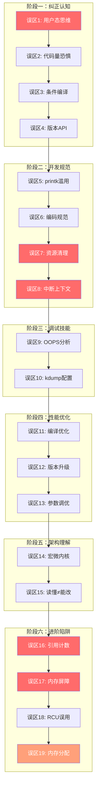

## 常见误区

学习和分析Linux内核源码的过程中，开发者——尤其是从用户态转向内核态的开发者——往往会因思维惯性、知识盲区和错误假设而踩入大量陷阱。本节系统梳理内核源码分析中最常见的误区，按"阅读理解→开发实践→调试排查→性能优化→架构认知→内存与并发"六个维度组织，每个误区都给出错误认知、根因分析、正确做法和验证手段。

这些误区并非纸上谈兵——每一个都是真实项目中反复出现的致命错误。根据Linux内核社区的统计数据，超过60%的内核提交被拒绝或需要返工，根源往往不是功能实现错误，而是对内核机制的误解。掌握这些误区的正确理解方式，是高效分析内核源码的前提。

---

## 一、阅读理解类误区

### 误区1：用用户态思维理解内核代码

**错误认知**：将用户态的编程模型直接套用到内核代码上，认为内核函数的行为与用户态类似。

**典型表现**：
- 认为`printk()`像`printf()`一样立即刷新到终端
- 认为`malloc()`在内核中存在
- 认为内核代码可以随意使用浮点运算
- 认为内核中的字符串操作与用户态一致（使用`strcpy/strcmp`而非内核版本）
- 认为`NULL`解引用在内核中和用户态一样简单——在内核中，它可能直接导致整个系统崩溃而非仅终止一个进程

**根因分析**：

内核运行在Ring 0特权级，拥有完全不同的执行环境。用户态程序运行在受保护的沙箱中，操作系统为其屏蔽了硬件复杂性；而内核代码直接操控硬件，没有任何"上层"来兜底。这意味着：

| 维度 | 用户态 | 内核态 |
|------|--------|--------|
| 内存分配 | malloc/free（虚拟内存充足） | kmalloc/kfree（物理连续）、vmalloc（虚拟连续）、__get_free_page（页级分配） |
| 字符串操作 | strcpy/strcmp/strlen（无限长度） | strscpy/strnlen/kstrtoul（带长度限制，防缓冲区溢出） |
| 浮点运算 | 自由使用 | **严格禁止**（除特定向量扩展场景如AES-NI/AVX） |
| 错误处理 | errno + 异常（try/catch） | 返回错误码（负值如`-ENOMEM`），goto集中清理 |
| 栈空间 | 8MB（可调，ulimit -s） | 通常8KB或16KB（不可调，`CONFIG_8K_STACKS`） |
| 并发模型 | 多进程/多线程（pthread） | 中断抢占、softirq、tasklet、workqueue、RCU |
| 标准库 | glibc（完整） | 无标准库，仅内核lib/提供受限函数 |
| 调试手段 | gdb/strace/ltrace | ftrace/kprobes/kdump/crash/KASAN/KMEMLEAK |
| 动态内存 | 有完整的堆管理器 | 碎片化敏感，需考虑中断上下文的分配限制 |

**正确做法**：

1. **始终查阅`Documentation/`目录和内核头文件中的注释**，不凭用户态经验推测。内核头文件（`include/linux/`）中的注释是最权威的API说明
2. **使用内核专用API**——例如用`strscpy()`替代`strcpy()`（防止溢出），用`kstrtoul()`替代`strtoul()`（带错误返回值）
3. **内核栈极小（8KB/16KB）**，避免在栈上分配大数组。实际可用空间约6-7KB（还需扣除函数调用链开销），大缓冲区应使用`kmalloc()`。经验法则：栈上分配不超过256字节
4. **永远不要在内核中使用浮点运算**——虽然现代内核在某些向量扩展场景（如AES-NI、AVX）中允许使用FPU，但常规驱动和子系统代码中使用浮点会导致不可预期的寄存器污染和上下文丢失。具体机制是：内核不保存FPU状态，除非显式调用`kernel_fpu_begin()/kernel_fpu_end()`
5. **理解内核中的"errno"约定**：内核函数不设置全局errno，而是直接返回负的错误码（如`-EINVAL`、`-ENOMEM`），调用者通过`IS_ERR()`/`PTR_ERR()`检查

**验证方法**：
```bash
# 检查内核配置中的栈大小
zcat /proc/config.gz | grep CONFIG_8K_STACKS
# 或
grep CONFIG_8K_STACKS /boot/config-$(uname -r)

# 查看当前系统的实际内核栈大小
cat /proc/self/status | grep -i stack
# StkSigSize:    8192  (信号栈大小)

# 确认FPU在内核中的使用情况
grep -r "kernel_fpu_begin" /path/to/linux/kernel/ --include="*.c" | head -5
# 会发现只有加密子系统（crypto/）、向量运算等极少数场景使用
```

---

### 误区2：认为内核代码量"大"就等于"复杂"

**错误认知**：Linux内核6.x超过2800万行代码，令人望而生畏，认为需要理解所有代码才能分析某个子系统。

**根因分析**：

内核代码具有高度模块化的组织结构。以一个具体问题（如"系统调用如何到达内核"）为线索追踪时，实际需要阅读的代码路径通常只有几百到几千行。内核的代码膨胀主要来自：

- **驱动程序**（drivers/占代码量约60%）：大量硬件特定代码，与核心逻辑无关。例如，NVIDIA GPU驱动单独就有数百万行
- **体系结构适配**（arch/）：每种CPU架构独立的实现，x86_64的代码和ARM64的代码互不干扰
- **配置宏展开**：同一个文件可能通过`#ifdef`组合出几十种编译配置，实际编译时大部分代码被裁剪
- **文档和测试**：Documentation/和tools/testing/也占相当比例

以文件系统子系统为例：ext4的`fs/ext4/`目录看似庞大，但核心逻辑（分配、日志、元数据）集中在约15个关键文件中，总计不到3万行。理解这15个文件就足以掌握ext4的基本工作原理。

**正确做法**：

分析路径选择策略：
1. 以功能为线索，而非以文件为单位
   例：分析fork → 从sys_fork() → kernel_clone() → copy_process() → 逐层深入
   实际核心路径：约800行代码

2. 善用call graph工具
   $ make A=all callers.o FILE=kernel/fork.c
   $ pahole --structs kernel/fork.c  # 查看数据结构布局

3. 区分"核心路径"和"边缘路径"
   核心路径：每次调用都经过的代码（如do_page_fault的主流程）
   边缘路径：特殊条件分支（错误处理、配置选项、冷门架构）

4. 利用内核文档的导航
   Documentation/admin-guide/  → 面向用户的配置说明
   Documentation/core-api/     → 内核核心API文档
   Documentation/devicetree/   → 设备树绑定文档

**验证方法**：对任意内核子系统，先用`cscope`或`ctags`建立索引，再用`grep`或LXR（Linux Cross Reference）在线追踪调用链，确认实际需要阅读的代码量。

```bash
# 快速统计核心子系统的代码量
$ find kernel/sched/ -name "*.c" | xargs wc -l | tail -1
# 输出约1.5万行 — 这是整个调度器核心，远非不可理解

# 对比：drivers/总代码量
$ find drivers/ -name "*.c" | xargs wc -l | tail -1
# 数百万行 — 但你不需要全部理解
```

---

### 误区3：忽视条件编译，读到的代码未必会被编译

**错误认知**：认为`make`编译出的二进制包含了源码中看到的所有代码。

**根因分析**：

Linux内核大量使用条件编译（`#ifdef`/`#if defined`），同一个源文件在不同配置下可能产生完全不同的二进制。这不仅仅是"有些代码被排除"这么简单——同一个函数在不同配置下可能有完全不同的实现路径：

```c
// kernel/sched/core.c 中的条件编译片段
#ifdef CONFIG_SMP
    // 多处理器路径：涉及负载均衡、CPU亲和性、跨核迁移
    select_task_rq(p, SD_BALANCE_WAKE, cpu);
#else
    // 单处理器路径：直接唤醒即可，无负载均衡开销
    p->on_rq = TASK_ON_RQ_QUEUED;
#endif

#ifdef CONFIG_PREEMPT_RT
    // 实时内核：spinlock退化为可睡眠锁（RT_mutex）
    raw_spin_lock(&amp;rq->lock);
#else
    // 普通内核：真正的自旋锁
    spin_lock(&amp;rq->lock);
#endif

#ifdef CONFIG_CGROUP_SCHED
    // cgroup调度：受CPU带宽控制
    task_sched_runtime(p);
#endif
```

同一份源码，在`CONFIG_SMP=y`和`CONFIG_SMP=n`时，进程调度路径截然不同。如果你在分析调度器时没有注意这一点，可能会对一条永远不会执行的代码路径投入大量精力。

更隐蔽的情况是**嵌套条件编译**——一个`#ifdef`内部还有多个`#ifdef`，不同配置组合产生不同的代码路径矩阵。例如，`CONFIG_SMP=y` + `CONFIG_PREEMPT_RT=y`（PREEMPT_RT补丁内核）的代码路径，与`CONFIG_SMP=y` + `CONFIG_PREEMPT_RT=n`完全不同。

**正确做法**：

```bash
# 1. 查看当前系统的内核配置
zcat /proc/config.gz > /tmp/current_config

# 2. 分析代码前先确认关键配置
grep -E 'CONFIG_SMP|CONFIG_PREEMPT|CONFIG_HZ|CONFIG_CGROUP|CONFIG_64BIT' /tmp/current_config

# 3. 用编译器预处理输出确认实际编译的代码
$ cd /path/to/linux
$ make prepare
$ cpp -dM include/linux/autoconf.h > /tmp/defines.h
# 或者直接看 include/generated/autoconf.h（make后生成）

# 4. 针对特定文件生成预处理输出（精确到单个文件）
$ gcc -E -Iinclude -Iarch/x86/include -D__KERNEL__ \
    -include include/linux/autoconf.h \
    kernel/fork.c > /tmp/fork.i
# 在预处理输出中搜索实际展开的代码
# 例：搜索 kernel_clone 的实际实现
grep -A 50 "kernel_clone" /tmp/fork.i | head -60

# 5. 使用 sparse 工具检查条件编译的一致性
$ make C=2 CHECK=sparse kernel/fork.c
```

**关键提醒**：分析内核代码时，**务必先确认目标系统的内核配置**，否则很可能在分析一段实际不会被编译的代码路径。分析完成后，建议在代码旁标注对应的配置条件，例如："此路径仅在`CONFIG_SMP=y`时生效"。

---

### 误区4：混淆内核版本间的API变化

**错误认知**：在网上找到的内核代码片段可以直接在当前内核版本上使用。

**根因分析**：

Linux内核API在不同主版本间变化剧烈，即使是小版本也可能有重构。Linux内核社区没有用户态API那样的ABI稳定性承诺——内核内部接口可以随时修改，只要最终功能正确即可。典型的变化周期：

| 变化类型 | 示例 | 涉及版本 | 影响 |
|----------|------|----------|------|
| 函数重命名 | `init_timer()` → `timer_setup()` | 4.14-4.15 | 编译失败 |
| 参数顺序变更 | `request_irq()` 参数变化 | 2.6 → 4.x 多次调整 | 编译失败或静默错误 |
| 数据结构重构 | `task_struct`成员大改 | 5.14引入`struct siginfo`重构 | 模块二进制不兼容 |
| 调度器接口变化 | `sched_setscheduler()` → `sched_setattr()` | 3.14+ | 旧代码不编译 |
| 内存分配器变化 | SLUB内部结构调整 | 各版本持续 | 性能特征变化 |
| 新子系统引入 | io_uring（5.1）、eBPF verifier重构 | 持续演进 | API不稳定 |
| 安全机制变更 | KASLR、CFI、PAC/BTI引入 | 5.x-6.x | 影响调试和模块加载 |

**正确做法**：

```bash
# 1. 在线查阅权威源码（推荐Bootlin交叉引用）
# https://elixir.bootlin.com/linux/latest/source

# 2. 查看函数在哪个版本被引入/修改
$ git log --oneline --follow -- kernel/sched/core.c | head -20

# 3. 查看某个API的历史变更（精确到commit）
$ git log -p --follow -S 'timer_setup' -- include/linux/timer.h

# 4. 查看某版本的内核文档
$ git show v6.8:Documentation/core-api/  # 列出该版本的核心API文档

# 5. 查找API被删除的原因
$ git log --all --oneline -S 'init_timer' -- include/linux/timer.h
# 找到删除commit后，查看commit message中的理由
$ git show <commit_hash>  # 通常会说明为什么删除以及替代方案

# 6. 使用 ctags/cscope 在本地源码中追踪
$ ctags -R --languages=c --extras=+q
$ grep -rn "timer_setup" include/linux/timer.h
```

**建议**：分析内核源码时，明确锁定一个内核版本（如v6.8），所有分析基于该版本展开。在笔记和代码注释中标注版本号，避免跨版本混淆。如果需要对比不同版本的实现差异，使用`git diff v6.7..v6.8 -- kernel/sched/core.c`精确查看变更。

---

## 二、开发实践类误区

### 误区5：在内核中使用`printk`调试一切

**错误认知**：像在用户态使用`printf()`一样，在内核中随意添加`printk()`进行调试。

**根因分析**：

`printk()`在内核中的行为与`printf()`有本质差异：

1. **日志缓冲区有限**：内核日志缓冲区默认仅1MB（`CONFIG_LOG_BUF_SHIFT`决定大小，通常17即128KB到20即1MB），高速打印会导致旧日志被覆盖。在嵌入式系统中，缓冲区可能更小
2. **性能开销大**：每次`printk`涉及格式化、缓冲区写入、可能的串口输出（串口波特率115200时，一行100字节的日志需要约9ms），严重影响内核执行时序。在热路径（如调度器、网络收包）中添加printk，性能可能下降一个数量级
3. **可能引发死锁**：在持有某些锁（如`console_lock`）时调用`printk`会导致死锁。`printk`内部需要获取`console_lock`来输出到控制台，如果调用者已持有该锁，就会永久死锁
4. **在中断上下文中有限制**：某些情况下（如持有`ftrace_lock`时）不能调用`printk`，否则会递归死锁
5. **日志级别混淆**：不指定级别的`printk`默认为`KERN_WARNING`（4），会导致在生产环境中输出大量不必要的日志

**正确做法**：

```c
// 分级日志（按严重性和用途）—— 每个级别有明确的使用场景
pr_emerg("系统即将崩溃\n");     // 最高紧急级别，仅用于不可恢复的致命错误
pr_crit("关键子系统失效\n");    // 严重错误，系统可能无法继续运行
pr_err("设备初始化失败\n");      // 错误，但系统仍可运行
pr_warn("配置参数异常\n");       // 警告，不影响功能但值得关注
pr_info("模块已加载\n");         // 信息级别（建议替代printk(KERN_INFO)）
pr_debug("进入函数xxx\n");       // 调试（仅CONFIG_DEBUG开启时编译进二进制）
pr_devel("中间状态: %d\n", val); // 开发期日志（仅开发构建，-O0时生效）

// 条件打印（避免无条件输出）
if (debug_enabled)   // 通过sysfs或模块参数控制
    pr_debug("详细信息...\n");

// 动态跟踪宏（推荐！运行时可开关，无性能开销）
#include <linux/dynamic_debug.h>
// 定义：DEFINE_DYNAMIC_DEBUG_CLASS(drv, DYNAMIC_DEBUG_DRVINFO, ...);
// 使用：dyn_dbg(drv, "message %s\n", arg);
// 开关：echo 'file drivers/mydev.c +p' > /sys/kernel/debug/dynamic_debug/control

// 最佳选择：使用ftrace/eBPF替代printk
// ftrace几乎零开销，不修改代码即可追踪内核函数
$ echo function > /sys/kernel/debug/tracing/current_tracer
$ echo do_fork > /sys/kernel/debug/tracing/set_ftrace_filter
$ cat /sys/kernel/debug/tracing/trace
```

**工具对比**：

| 工具 | 开销 | 是否修改代码 | 适用场景 | 学习曲线 |
|------|------|------------|---------|---------|
| printk | 高（阻塞、格式化、串口输出） | 是 | 硬件故障、启动早期 | 低 |
| pr_debug/dev_dbg | 低（可编译时关闭） | 是 | 条件性调试 | 低 |
| dynamic_debug | 极低（运行时开关） | 是（一行声明） | 生产环境调试 | 中 |
| ftrace | 极低（tracefs接口） | 否 | 函数追踪、时序分析、延迟测量 | 中 |
| kprobes | 低 | 否 | 运行时动态探测任意函数 | 中高 |
| eBPF/BCC/bpftrace | 低 | 否 | 复杂的动态追踪、聚合、过滤 | 高 |
| KASAN | 中（1-2x内存开销） | 是（编译选项） | 内存错误检测 | 中 |
| KFENCE | 极低（采样式） | 是（编译选项） | 生产环境内存错误检测 | 低 |

---

### 误区6：忽略内核编码规范，代码提交被拒绝

**错误认知**：功能正确就行，代码风格是"小事"。

**根因分析**：

Linux内核社区对代码风格有**零容忍**态度。Linus Torvalds曾公开表示不会合并不符合编码规范的代码。内核维护者（Maintainer）在代码审查时，风格问题是最常见的拒绝理由。这不是审美偏好——内核代码需要数千名开发者协作维护，统一的编码风格是可维护性的基础。

**正确做法**：

```bash
# 1. 使用内核自带的checkpatch.pl检查
$ scripts/checkpatch.pl --no-tree -f my_driver.c
# 常见警告：
# WARNING: line over 100 characters
# WARNING: missing blank after typedef
# ERROR: space required after that open brace '{'

# 2. 使用sparse进行静态分析
$ make C=2 CHECK=sparse drivers/mydriver/
# 会检查：内核地址空间注释（__user/__kernel）、字节序、锁平衡等

# 3. 核心编码规范速查
# - 缩进用tab，不空格（tab = 8字符宽）
# - 函数左大括号不换行，else/else if同上
#   正确：if (x) {    错误：if (x)
#          return;           {
#                          return;
#                         }
# - 变量声明放在函数开头（C89风格），不混用声明和代码
# - 宏定义中多行用do { ... } while(0)包裹
# - 指针声明用 `int *ptr` 而非 `int* ptr`
# - 注释用 /* */，不用 //（C90兼容性）
# - 命名：小写+下划线，不用驼峰
# - 每个函数不超过48行（推荐），避免巨型函数
# - 不使用 typedef 定义结构体（内核风格要求明确类型）

# 4. 必读文档
# Documentation/process/coding-style.rst
# Documentation/process/submitting-patches.rst
# Documentation/process/submitting-drivers.rst
```

**常见的被拒绝原因TOP 10**：

| 排名 | 问题 | 正确做法 |
|------|------|---------|
| 1 | 行超过100字符限制 | 控制在80字符以内（`--max-line-length=100`） |
| 2 | 未使用`kernel`/`pr`/`dev`打印宏 | 使用`dev_err(&pdev->dev, ...)`等设备感知的打印宏 |
| 3 | 缺少`Signed-off-by`标签 | `git commit -s` 自动添加 |
| 4 | 提交信息格式错误 | 第一行是简短描述（不超过72字符），空一行后写详细说明 |
| 5 | 未添加/更新相关文档和测试 | 每个补丁应包含文档更新和kselftest用例 |
| 6 | 代码重复 | 提取公共函数或使用内核通用工具函数 |
| 7 | 全局变量滥用 | 使用结构体封装状态，通过`platform_data`传递 |
| 8 | 缺少反向Christmas tree声明 | 变量声明按行长度从长到短排列 |
| 9 | 内存泄漏未处理 | 所有分配必须有对应的释放路径 |
| 10 | 提交过多无关修改 | 每个补丁只做一件事（原子提交） |

---

### 误区7：在内核模块中忘记资源清理

**错误认知**：模块卸载时内核会自动回收资源。

**根因分析**：

与用户态程序退出时操作系统自动回收所有资源不同，内核模块卸载时**必须手动释放所有已分配的资源**。内核不会追踪模块分配了哪些资源——一旦模块卸载后资源未释放，将导致永久性内存泄漏、设备无法重新初始化、甚至内核崩溃。

更严重的是，未释放的中断处理函数、定时器、工作队列等异步资源，会在模块卸载后继续执行，访问已释放的内存，导致use-after-free崩溃。内核的`CONFIG_DEBUG_KMEMLEAK`和`CONFIG_DEBUG_OBJECTS`可以在一定程度上检测这类问题，但不能完全依赖。

**正确做法**：

```c
static int __init my_module_init(void) {
    int ret;

    // 按照与分配相反的顺序进行错误处理（goto模式）
    // 这是内核中唯一正确的错误处理模式
    ret = register_chrdev(MAJOR_NUM, "mydev", &amp;fops);
    if (ret)
        goto err_chrdev;

    ret = request_irq(IRQ_NUM, my_handler, IRQF_SHARED, "mydev", &amp;my_dev);
    if (ret)
        goto err_irq;

    ret = pci_enable_device(pdev);
    if (ret)
        goto err_pci;

    return 0;  // 成功

// 统一的错误清理路径（goto模式是内核标准做法）
err_pci:
    free_irq(IRQ_NUM, &amp;my_dev);
err_irq:
    unregister_chrdev(MAJOR_NUM, "mydev");
err_chrdev:
    return ret;
}

static void __exit my_module_exit(void) {
    // 与init完全对称的释放顺序
    // 1. 先停止异步操作
    del_timer_sync(&amp;my_timer);        // 同步等待定时器完成
    cancel_work_sync(&amp;my_work);       // 同步等待工作队列完成
    // 2. 再释放硬件资源
    pci_disable_device(pdev);
    free_irq(IRQ_NUM, &amp;my_dev);
    // 3. 最后注销内核接口
    unregister_chrdev(MAJOR_NUM, "mydev");
}
```

**必须检查清单**：

| 资源类型 | 分配函数 | 释放函数 | 常见遗漏 | 后果 |
|----------|---------|---------|---------|------|
| 内存 | kmalloc/vmalloc | kfree/vfree | 错误路径中忘记释放 | 内存泄漏 |
| IRQ | request_irq | free_irq | 模块卸载时忘记 | use-after-free崩溃 |
| 字符设备 | register_chrdev | unregister_chrdev | 未注销导致无法重新加载 | 设备节点残留 |
| 平台设备 | platform_device_register | platform_device_unregister | — | 驱动探测异常 |
| 定时器 | timer_setup | del_timer_sync | 卸载时未等待定时器完成 | 定时器回调访问已释放内存 |
| 工作队列 | create_workqueue | destroy_workqueue | 未cancel_work_sync | 延迟任务访问已释放内存 |
| DMA映射 | dma_map_single | dma_unmap_single | 未unmap导致IOMMU错误 | DMA错误，数据损坏 |
| sysfs节点 | device_create | device_destroy | 未销毁导致内核警告 | sysfs残留 |
| 互斥锁 | mutex_init | mutex_destroy | 通常无害但不规范 | KASAN可能报告 |
| IIO缓冲区 | iio_buffer_enable | iio_buffer_disable | 未disable | 数据流异常 |
| regmap | devm_regmap_init_i2c | 自动（devm系列） | 非devm版本需手动释放 | 寄存器访问异常 |

**进阶提示**：优先使用`devm_*`系列函数（device-managed），它们在设备移除时自动释放资源，大大降低遗忘风险。但注意：`devm_*`函数不能在模块卸载时使用（因为它们的生命周期绑定到`struct device`，而非模块）。

---

### 误区8：在中断上下文中执行耗时操作

**错误认知**：中断处理函数可以执行任意代码，和普通函数调用没有区别。

**根因分析**：

中断上下文有严格限制：

1. **不可睡眠**：中断处理函数中不能调用任何可能导致睡眠的函数（如`kmalloc(GFP_KERNEL)`、`mutex_lock()`、`msleep()`、`copy_to_user()`、`copy_from_user()`）。调用这些函数会导致调度器尝试调度，但中断上下文中不能调度，系统会panic
2. **栈空间有限**：中断处理函数在当前进程的内核栈上运行，栈空间仅8KB/16KB。如果中断处理函数本身调用链很深，可能直接栈溢出
3. **禁止抢占和中断**：硬中断处理（hardirq）期间，本CPU上的中断被屏蔽，不可调度。这意味着即使有更高优先级的中断也无法响应
4. **时间敏感**：硬中断处理时间过长会导致其他中断丢失、系统响应变慢。一般要求硬中断处理在微秒级完成
5. **中断嵌套**：Linux内核默认不支持中断嵌套（同类型中断），硬中断处理期间同类型中断被屏蔽。但不同类型的中断可以嵌套

**正确做法**：

```c
// 硬中断处理（上半部/top half）：只做最小工作
static irqreturn_t my_hardirq_handler(int irq, void *data) {
    struct my_device *dev = data;

    // 1. 读取硬件状态，确认是本设备的中断（中断共享时必须检查）
    u32 status = readl(dev->regs + IRQ_STATUS);
    if (!(status &amp; MY_IRQ_PENDING))
        return IRQ_NONE;  // 不是本设备的中断，让其他处理函数处理

    // 2. 屏蔽本设备中断（防止重入）
    writel(0, dev->regs + IRQ_ENABLE);

    // 3. 将耗时工作推迟到下半部
    tasklet_schedule(&amp;dev->my_tasklet);
    // 或：schedule_work(&amp;dev->my_work);
    // 或：irq_work_queue(&amp;dev->irq_work);  // 用于NMI上下文

    // 4. 清除中断状态（必须在屏蔽之后、返回之前）
    writel(status, dev->regs + IRQ_STATUS);

    return IRQ_HANDLED;
}

// 软中断/Tasklet（下半部/bottom half）：执行较长时间操作
// 注意：tasklet中仍然不能睡眠
static void my_tasklet_handler(unsigned long data) {
    struct my_device *dev = (struct my_device *)data;

    // 这里可以执行较长时间的操作（但不能睡眠）
    process_data(dev->buffer);

    // 重新启用设备中断
    writel(MY_IRQ_ENABLE, dev->regs + IRQ_ENABLE);
}

// 工作队列（下半部）：可以睡眠的复杂操作
static void my_work_func(struct work_struct *work) {
    struct my_device *dev = container_of(work, struct my_device, work);

    // workqueue中可以睡眠：可以使用kmalloc(GFP_KERNEL)、mutex_lock等
    mutex_lock(&amp;dev->lock);
    // ... 需要分配内存、访问文件系统等操作 ...
    process_complex_data(dev);
    mutex_unlock(&amp;dev->lock);
}
```

**上下文对比**：

| 特性 | 进程上下文 | 软中断/Tasklet | 硬中断上下文 |
|------|-----------|---------------|-------------|
| 可否睡眠 | 可以 | 不可以 | 不可以 |
| 可否使用mutex | 可以 | 不可以（用spin_lock） | 不可以（用spin_lock_irqsave） |
| 可否使用kmalloc(GFP_KERNEL) | 可以 | 不可以（用GFP_ATOMIC） | 不可以（用GFP_ATOMIC） |
| 可否访问用户空间 | 可以（copy_to_user） | 不可以 | 不可以 |
| 栈空间 | 完整内核栈（8-16KB） | 共享当前进程栈 | 共享当前进程栈 |
| 优先级 | 正常 | 略高（softirq） | 最高 |
| 典型耗时限制 | 无严格限制 | 毫秒级 | 微秒级 |
| 抢占性 | 可被抢占 | 不可被抢占 | 不可被抢占 |

**下半部选择指南**：

| 机制 | 适用场景 | 限制 |
|------|---------|------|
| tasklet | 简单的延迟处理，同一CPU上串行执行 | 不可睡眠，不支持并发 |
| workqueue | 需要睡眠的复杂操作，进程上下文执行 | 可以睡眠，开销较大 |
| threaded IRQ | 需要睡眠的中断处理，内核自动创建线程 | 每个IRQ一个线程 |
| softirq | 高频网络/块设备处理 | 静态分配，不可动态扩展 |

---

## 三、调试排查类误区

### 误区9：用OOPS信息直接判断为内核bug

**错误认知**：内核出现OOPS（Kernel Oops）就一定是代码有bug。

**根因分析**：

Kernel Oops的成因多种多样，并不总是内核代码本身的错误：

| 原因 | 示例 | 是否内核bug | 诊断方法 |
|------|------|-----------|---------|
| 驱动程序bug | 驱动传入非法指针 | 是（驱动层面） | 检查Call Trace |
| 硬件故障 | 内存条ECC错误导致数据损坏 | 否 | 检查MCE日志（`mcelog`） |
| 模块版本不匹配 | 模块与内核版本不兼容 | 是（配置问题） | `modprobe --version` vs `uname -r` |
| 电源管理异常 | CPU休眠唤醒时寄存器状态丢失 | 可能 | 检查ACPI日志 |
| 用户态非法请求 | 用户态通过/proc传递非法值 | 取决于内核是否应该校验 | 检查触发路径 |
| 竞态条件 | 高并发下未正确加锁 | 是（设计问题） | KCSAN/race detector |
| 内存损坏 | 邻近内存越界写入破坏关键数据 | 是（内存安全） | KASAN |

**实际OOPS输出示例与解读**：

[  234.567890] BUG: unable to handle kernel NULL pointer dereference at 0000000000000010
[  234.567891] #PF: supervisor read access in kernel mode
[  234.567892] #PF: error_code(0x0000) - not-present page

解读：
- "NULL pointer dereference at 0x10" → 空指针+偏移0x10，说明访问了某个结构体的第4个成员
- "supervisor read" → 内核态读操作（不是写，不是用户态）
- "not-present page" → 页面不存在（NULL指针未映射）

[  234.567893] PGD 0 P4D 0
[  234.567894] Oops: 0000 [#1] SMP PTI
[  234.567895] CPU: 2 PID: 1234 Comm: my_driver Tainted: G        W  O      6.8.0-custom #1
[  234.567896] RIP: 0010:my_driver_read+0x42/0x180 [my_driver]

解读：
- "CPU: 2" → 崩溃发生在CPU 2上
- "PID: 1234" → 触发进程的PID
- "Tainted: G W O" → G=非GPL模块、W=先前警告、O=外部模块（说明加载了第三方驱动）
- "RIP: 0010:my_driver_read+0x42/0x180" → 出错指令地址 = my_driver_read函数起始+0x42偏移，函数总长0x180

[  234.567897] RSP: 0018:ffffc9000049be08 EFLAGS: 00010246
[  234.567898] RAX: 0000000000000000 RBX: ffff888102345678 RCX: 0000000000000001
[  234.567899] RDX: 0000000000000010 RSI: 0000000000000000 RDI: ffff888102345678

解读：
- "RAX: 0" → 返回值寄存器为NULL，很可能是某个函数返回了NULL但未检查
- "RDX: 0x10" → 正是访问的偏移地址
- EFLAGS中的"Z"标志位（0x40）表示上一条比较结果为零

[  234.567900] Call Trace:
[  234.567901]  <TASK>
[  234.567902]  my_driver_read+0x42/0x180 [my_driver]
[  234.567903]  vfs_read+0xb5/0x2a0
[  234.567904]  ksys_read+0x67/0xe0
[  234.567905]  do_syscall_64+0x59/0x90
[  234.567906]  </TASK>

解读：
- 从下往上读：用户态read() → syscall → vfs_read → my_driver_read在0x42偏移处崩溃
- 这是一个用户态读取设备文件触发的内核崩溃

**正确做法**：

```bash
# 1. 完整提取OOPS信息
$ dmesg | grep -B 5 -A 50 "Oops\|BUG\|Unable to handle\|kernel NULL pointer"

# 2. 用addr2line定位源码位置（需要未strip的vmlinux）
$ addr2line -e vmlinux -f ffffff8000123456
# 输出函数名和行号

# 3. 查看反汇编确认具体指令
$ objdump -d vmlinux | grep -B 5 -A 20 "ffffff8000123450"
# 查看出错位置附近的汇编代码，确认是哪条指令导致的

# 4. 使用crash工具分析vmcore（如果配置了kdump）
$ crash vmlinux /var/crash/*/vmcore
crash> bt -l          # 带行号的调用栈
crash> struct my_struct ffff888102345678  # 查看数据结构
crash> dis my_driver_read+0x42  # 反汇编出错位置

# 5. 检查是否是已知问题
# https://bugzilla.kernel.org/ 搜索相关描述
# https://lore.kernel.org/ 搜索相关补丁讨论
# https://android.googlesource.com/kernel/common/ 搜索Android内核修复
```

**常见OOPS类型速查**：

| OOPS类型 | 典型信息 | 常见原因 | 诊断要点 |
|----------|---------|---------|---------|
| NULL pointer dereference | "NULL pointer dereference at 0x0" | 未检查返回值 | 检查Call Trace，确认哪个函数返回了NULL |
| general protection fault | "general protection fault" | 越界访问、栈溢出 | 检查RIP指向的指令，通常是数组越界 |
| kernel stack overflow | "Kernel panic - not syncing: stack overflow" | 递归调用、栈上大数组 | 检查Call Trace中的递归模式 |
| soft lockup | "BUG: soft lockup - CPU#X stuck for 22s" | 死循环、长期关中断 | 检查卡住的函数，通常是spin_lock忘记释放 |
| hung task | "INFO: task xxx blocked for more than 120 seconds" | 死锁、长时间IO | 检查进程状态和等待的锁 |

---

### 误区10：忽视内核崩溃转储（kdump/kexec）的配置

**错误认知**：OOPS日志足以分析所有内核问题，不需要配置kdump。

**根因分析**：

某些内核问题会导致系统完全死机（Panic后无法继续运行），此时`dmesg`日志已无法读取。只有通过kdump机制提前捕获崩溃转储（vmcore），才能在事后分析崩溃现场。

更关键的是，许多内核bug（如竞态条件、内存损坏）不会立即导致panic，而是静默地破坏数据。等到问题暴露时，原始现场已经消失。kdump + kexec的组合允许在panic的瞬间快速重启到一个干净的内核（捕获内核），转储完整的内存快照，然后在另一个系统上分析。

**正确做法**：

```bash
# 1. 安装kdump
$ sudo apt install linux-crashdump   # Debian/Ubuntu
$ sudo yum install kexec-tools       # CentOS/RHEL
$ sudo dnf install kexec-tools       # Fedora

# 2. 验证kdump配置
$ sudo kdump-config show
# 确认：
# - USE_KDUMP=1
# - REBOOT_ACTION=halt  (崩溃后停机而非重启，方便人工排查)
# - MEMORY_RESERVE 足够（通常256MB）

# 3. 配置崩溃时保留的内存大小（在 /etc/default/grub 中）
# GRUB_CMDLINE_LINUX="crashkernel=256M"
# 大内存系统（>64GB）建议：crashkernel=512M
# 修改后执行：sudo update-grub &amp;&amp; sudo reboot

# 4. 验证kdump服务
$ sudo systemctl status kdump
$ sudo kdumpctl status
# 确认 "kdump: operational"

# 5. 模拟崩溃测试（确保在测试环境！）
$ echo c > /proc/sysrq-trigger  # 触发panic

# 6. 分析vmcore
$ sudo crash /usr/lib/debug/boot/vmlinux-$(uname -r) /var/crash/*/vmcore

# crash工具中的常用命令及详细说明：
# bt            → 回溯崩溃时的调用栈（最常用）
# bt -l         → 带源码行号的调用栈
# bt -a         → 显示所有CPU的调用栈
# log           → 显示内核日志（类似dmesg）
# log -m        → 显示带时间戳的日志
# ps            → 显示进程列表（包括僵尸进程）
# ps -u <uid>   → 按用户过滤进程
# files         → 显示当前上下文已打开的文件
# files -d      → 显示文件描述符详细信息
# mod           → 显示已加载的模块
# dis           → 反汇编指定地址
# dis -l func   → 反汇编带行号
# struct        → 查看数据结构内容
# struct task_struct <address>  → 查看进程信息
# kmem -i       → 内存使用概览
# kmem <address> → 查看slab对象
# vm            → 显示虚拟内存信息
# swap          → 显示交换空间信息
# rd            → 读取内存内容
# rd -S <size> <address>  → 读取指定大小的内存
# sys           → 显示系统信息（内核版本、uptime等）
# runq          → 显示运行队列信息
# foreach bt    → 对所有进程执行bt
# quit          → 退出crash
```

**vmcore分析工作流**：

1. 打开vmcore
   crash> sys                    # 确认内核版本和uptime
   crash> log | tail -50         # 查看崩溃前的最后日志

2. 定位崩溃原因
   crash> bt -l                  # 崩溃时的调用栈
   crash> log | grep -i "error\|warning\|oops"  # 搜索异常信息

3. 检查系统状态
   crash> ps                     # 进程列表
   crash> kmem -i                # 内存使用情况
   crash> files                  # 打开的文件

4. 深入分析
   crash> struct <struct_name> <address>  # 查看数据结构
   crash> dis <function+offset>           # 反汇编关键函数
   crash> rd <address> 32                 # 查看内存内容

---

## 四、性能优化类误区

### 误区11：盲目追求内核编译优化等级

**错误认知**：将内核编译优化等级从`-O2`改为`-O3`或`-Ofast`可以提升性能。

**根因分析**：

Linux内核官方默认使用`-O2`优化等级，这不是随意选择：

1. **-O2是内核团队验证过的最高等级**：更高优化等级可能引入的问题包括：
   - `-O3`会激进地展开循环和内联函数，导致指令缓存（i-cache）压力增大，反而降低性能。在内核这种代码量极大的场景下，i-cache miss的代价远超循环展开的收益
   - `-Ofast`会放宽浮点运算精度（`-ffast-math`），可能导致内核浮点相关逻辑出错。虽然内核不常用浮点，但某些加密子系统和SIMD优化路径会受影响
   - 更高优化等级会显著增加编译时间（-O3编译时间比-O2多30-50%）
2. **内核已经针对性使用了LTO和PGO**：5.x内核引入了Link-Time Optimization（LTO），在链接阶段进行全局优化，效果优于单纯的编译选项调整
3. **-O2已经包含了绝大多数有用的优化**：-O3额外启用的优化（如`-ftree-loop-vectorize`、`-ftree-slp-vectorize`）在内核场景中收益有限

**正确做法**：

```bash
# 1. 使用内核推荐的编译选项
$ make -j$(nproc) EXTRA_CFLAGS=""    # 不额外覆盖优化选项

# 2. 如果要进行内核级性能优化，优先考虑以下方式：

# a. PGO（Profile-Guided Optimization）—— 基于实际运行数据优化
# 第一步：用典型工作负载收集性能数据
$ make llvm=1 LLVM=1 pgo.use=vmlinux.profdata
# 第二步：用收集的数据重新编译
$ make llvm=1 LLVM=1 pgo.build

# b. BOLT（Binary Optimization and Layout Tool）—— 二进制级优化
$ perf record -e cycles:u -j any,u -o perf.data -- vmlinux
$ llvm-bolt vmlinux -o vmlinux.bolt -data=perf.data -reorder-blocks=ext-tsp

# c. 内核配置调优（比编译优化影响更大）
$ make menuconfig  # 根据实际工作负载精简配置
# 关键：关闭不需要的驱动和子系统
# 减少代码量 = 更好的i-cache利用 = 性能提升

# d. 使用LTO（Link-Time Optimization）
$ make LLVM=1 LLVM_IAS=1  # Clang LTO
# LTO允许跨编译单元优化，通常提升2-5%
```

**性能影响对比**：

| 优化方式 | 性能提升 | 编译时间增加 | 风险 |
|----------|---------|------------|------|
| -O2 → -O3 | 0-3%（可能为负） | +30-50% | 可能引入编译器bug |
| -O2 → -Ofast | 0-5%（可能为负） | +30-50% | 浮点精度问题 |
| 启用LTO | 2-5% | +50-100% | 编译时间长 |
| PGO | 5-15% | +200% | 需要代表性工作负载 |
| BOLT | 3-10% | +100% | 需要perf数据 |
| 精简内核配置 | 5-20% | 减少 | 需要准确评估依赖 |

---

### 误区12：用"内核版本越新越好"指导升级

**错误认知**：新版本内核一定比旧版本性能更好、功能更全。

**根因分析**：

新内核确实会修复bug、引入新功能，但也可能引入新问题：

| 情况 | 示例 | 影响 |
|------|------|------|
| 调度器回归 | 某些版本的CFS在特定负载下表现退化 | 延迟增加 |
| 驱动兼容性 | 新内核移除了过时的驱动（如某些旧网卡） | 硬件不工作 |
| 配置变更 | 某些选项默认值改变 | 行为不一致 |
| 安全补丁引入开销 | Spectre/Meltdown缓解措施 | 性能下降5-30% |
| API变更 | 模块需要适配新接口 | 编译失败 |
| 内存管理变更 | 伙伴系统/SLUB调整 | 特定负载下性能变化 |
| 文件系统回归 | ext4/f2fs性能回退 | IO性能下降 |

**正确做法**：

1. 不盲目追新，选择LTS（Long Term Support）版本
   https://kernel.org/ → 查看标记为"longterm"的版本
   LTS版本提供2-6年的安全和bug修复支持

2. 升级前检查：
   a. changelog中与你硬件相关的驱动变更
   b. CONFIG选项的默认值变化
   c. 已知回归（regression）报告：https://bugzilla.kernel.org/
   d. 邮件列表中的讨论：https://lore.kernel.org/

3. 升级后验证：
   a. 基准测试对比（fio/netperf/schbench/sysbench）
   b. 硬件功能验证（网卡、存储、GPU、网络）
   c. 运行24-48小时稳定性测试（stress-ng + uptime检查）
   d. 检查内核日志中的新警告和错误

---

### 误区13：过度依赖/proc和/sys的默认值

**错误认知**：操作系统默认的内核参数已经是最优的。

**根因分析**：

内核默认参数是"通用"值，针对桌面/服务器混合场景折中。特定工作负载下往往需要针对性调优。默认值的设计哲学是"不出错"而非"最优"——它们需要在各种硬件配置和使用场景下都能稳定运行，因此往往保守。

例如：
默认值的问题场景：
- vm.swappiness=60 → 数据库服务器应该设为10-20（减少swap使用，保持热数据在内存）
- net.core.somaxconn=128 → 高并发Web服务应该设为4096+（增大连接队列）
- fs.file-max=32768 → 大规模连接服务器需要设为100万+（增加文件描述符上限）
- vm.dirty_ratio=20 → 数据库应该设为5-10（减少脏页积压，降低IO风暴风险）
- net.ipv4.tcp_max_syn_backlog=1024 → 秒杀场景需要更大（增大SYN队列）
- vm.zone_reclaim_mode=1 → NUMA系统应该设为0（避免不必要的跨节点内存回收）

**正确做法**：

```bash
# 1. 分析当前系统的瓶颈
$ vmstat 1                    # 观察CPU、内存、IO概况
$ sar -n DEV 1                # 网络流量
$ cat /proc/interrupts        # 中断分布（检查是否集中在某个CPU）
$ mpstat -P ALL 1             # 各CPU利用率
$ cat /proc/vmstat | grep -E "pgfault|pgmajfault|pswpin|pswpout"  # 页面故障和swap

# 2. 针对性调优（以数据库服务器为例）
$ sudo sysctl -w vm.swappiness=10
$ sudo sysctl -w vm.dirty_ratio=5
$ sudo sysctl -w vm.dirty_background_ratio=2
$ sudo sysctl -w vm.zone_reclaim_mode=0
$ sudo sysctl -w net.core.somaxconn=4096
$ sudo sysctl -w net.ipv4.tcp_max_syn_backlog=4096
$ sudo sysctl -w net.core.netdev_max_backlog=65536

# 3. 持久化到 /etc/sysctl.conf 或 /etc/sysctl.d/99-custom.conf
# 重启后生效

# 4. 验证效果
$ perf stat -e cache-misses,cache-references,page-faults <workload>
# 对比调优前后的指标变化
```

**不同工作负载的调优重点**：

| 工作负载 | 关键参数 | 推荐值 |
|----------|---------|-------|
| 数据库（MySQL/PostgreSQL） | vm.swappiness, vm.dirty_ratio | swappiness=10, dirty_ratio=5 |
| Web服务器（Nginx/Apache） | net.core.somaxconn, net.ipv4.tcp_tw_reuse | somaxconn=4096, tw_reuse=1 |
| 大数据处理（Spark/Hadoop） | vm.swappiness, vm.overcommit_memory | swappiness=1, overcommit=0 |
| 实时应用 | vm.zone_reclaim_mode, NUMA策略 | reclaim_mode=0, numactl绑定 |
| 容器环境 | net.bridge.bridge-nf-call-iptables, fs.inotify.max_user_watches | 根据容器密度调整 |

---

## 五、架构认知类误区

### 误区14：混淆"宏内核"和"微内核"的优劣

**错误认知**：宏内核（Linux）不稳定、不安全，微内核（如MINIX、QNX、seL4）在各方面都更优越。

**根因分析**：

这是一个长期存在的误解。两种架构各有优劣，没有绝对的"更好"——选择取决于具体应用场景：

| 维度 | 宏内核（Linux） | 微内核（seL4/QNX） |
|------|----------------|-------------------|
| 性能 | 高（零拷贝、函数直接调用） | 低（IPC开销、上下文切换频繁） |
| 可靠性 | 驱动bug可能导致整个系统崩溃 | 服务隔离，单个服务崩溃不影响系统 |
| 安全性 | 依赖代码质量 | 形式化验证（seL4已通过数学证明） |
| 驱动生态 | 极其丰富（几乎所有硬件） | 驱动需在用户态重写，生态有限 |
| 实时性 | PREEMPT_RT补丁可接近实时 | 天然适合实时场景 |
| 开发复杂度 | 中等 | 高（IPC设计复杂） |
| 调试难度 | 低（工具链成熟） | 高（IPC追踪困难） |

Linux的策略是通过其他机制弥补宏内核的不足：
- **KASAN/KMSAN/KCSAN**：运行时内存/数据竞争检测
- **eBPF**：安全地在内核中运行沙箱程序
- **cgroups/namespace**：资源隔离和容器化
- **PREEMPT_RT**：实时性补丁使Linux满足工业实时需求
- **CFI（Control Flow Integrity）**：控制流完整性保护
- **KASLR + stack canary**：地址空间随机化和栈保护

---

### 误区15：认为"读懂内核源码"等于"能修改内核"

**错误认知**：只要能看懂内核代码，就能安全地修改内核。

**根因分析**：

读懂代码和正确修改代码之间存在巨大鸿沟，原因在于内核的隐含约束：

1. **并发安全**：内核代码几乎在任何执行点都可能被中断、被其他CPU执行。修改一处代码时，需要考虑所有可能的并发场景。例如，你以为只是简单地读取一个计数器，但可能在读取的瞬间被中断处理函数修改了
2. **内存序**：多核CPU的内存访问顺序与代码顺序不一致，需要正确使用`barrier()`、`READ_ONCE/WRITE_ONCE`等原语。即使代码看起来是顺序执行的，CPU和编译器都可能重排指令
3. **ABI兼容性**：用户态接口一旦发布就不能随意修改（即使函数签名改变一个参数都可能破坏用户态程序）。内核中的结构体布局一旦确定，就成为事实上的ABI
4. **性能约束**：内核中的热路径（如调度器、内存分配）对性能极其敏感，任何修改都需要benchmark验证。一个看似无害的`if`判断，在每秒执行百万次的路径上，可能造成可测量的性能回退
5. **调试困难**：内核bug往往难以复现——竞态条件可能在特定CPU负载、特定时序下才触发，且崩溃后的现场可能已被破坏

**正确做法**：

从读懂到能修改的进阶路径：

1. 理解并发模型
   - 阅读 Documentation/locking/ 目录
   - 理解 spin_lock/mutex/RCU/seqlock 的适用场景
   - 学习 lockdep（Lock Dependency Validator）——内核自带的死锁检测工具
   - 理解 READ_ONCE/WRITE_ONCE 的作用：防止编译器优化导致的数据竞争

2. 在虚拟机中实验
   - 使用QEMU/KVM运行自编译内核
   - 崩溃了重启即可，不影响真实系统
   $ qemu-system-x86_64 -kernel arch/x86/boot/bzImage \
       -append "root=/dev/sda console=ttyS0" -nographic
   - 使用 virtio 磁盘加速IO

3. 从小处着手
   - 第一步：修改printk输出（验证编译→启动→模块加载流程）
   - 第二步：修改sysfs参数（理解内核→用户态接口）
   - 第三步：修改简单的驱动行为（如LED闪烁频率）
   - 第四步：尝试核心子系统的修改（如调度策略参数）

4. 使用静态分析工具
   - sparse：类型检查（__user/__kernel注解）
   - smatch：数据流分析（空指针、资源泄漏）
   - coccinelle：语义补丁（自动代码转换和检查）
   $ make C=2 CHECK=sparse
   $ spatch --cocci-file=scripts/coccinelle/xxx.cocci my_file.c

5. 提交前必做
   - 全量编译测试（至少覆盖x86_64和arm64）
   - 内核自测试：$ make kselftest
   - checkpatch.pl检查（零警告）
   - 代码审查（发到LKML或相关子系统邮件列表）
   - 在QEMU中运行至少24小时无崩溃

**常见的"读懂但改错"场景**：

| 场景 | 读懂后的错误假设 | 正确做法 |
|------|----------------|---------|
| 读取共享变量 | "直接读就行" | 使用`READ_ONCE()`防止编译器优化 |
| 修改链表 | "加锁就行" | 确定锁的粒度，考虑RCU是否更合适 |
| 分配内存 | "kmalloc就行" | 考虑上下文：中断中用`GFP_ATOMIC`，进程上下文用`GFP_KERNEL` |
| 返回错误码 | "return -1就行" | 使用内核定义的错误码：`-EINVAL`、`-ENOMEM`等 |
| 调用sleep | "msleep(100)就行" | 确认当前上下文是否允许睡眠 |

---

## 六、内存与并发类误区（进阶）

### 误区16：忽视引用计数（refcount）的生命周期管理

**错误认知**：获取了对象的引用（`get`）后，只要调用对应的`put`释放就行。

**根因分析**：

引用计数是内核中最常用的对象生命周期管理机制，但也是最容易出错的：

1. **过早释放**：在仍持有引用时调用`put`，导致use-after-free。这在异步操作（中断、workqueue、RCU回调）中尤其常见——你以为函数返回后还会持有引用，但实际上异步路径已经释放了
2. **忘记释放**：获取引用后在某个错误路径上未释放，导致内存泄漏
3. **竞态条件**：两个路径同时对同一对象调用`get`和`put`，导致引用计数不一致。内核提供`refcount_t`（取代旧的`atomic_t`）来检测这类问题
4. **循环引用**：对象A引用B，B引用A，两者引用计数永远不为零，内存永远不会释放

**正确做法**：

```c
// 1. 引用计数的基本模式
struct my_obj *obj = get_obj();  // 引用计数+1
if (!obj)
    return -ENOMEM;

// ... 使用obj ...
do_something(obj);

put_obj(obj);  // 引用计数-1，如果为0则释放

// 2. 错误路径中也要释放引用
struct my_obj *obj = get_obj();
if (!obj)
    return -ENOMEM;

ret = do_first_step(obj);
if (ret)
    goto out;

ret = do_second_step(obj);
if (ret)
    goto out;

out:
    put_obj(obj);
    return ret;

// 3. 异步操作中的引用管理
// 传递给异步路径时，需要额外get
get_obj(obj);  // 异步路径的引用
schedule_work(&amp;obj->work);
// 异步路径完成后会put_obj

// 4. 检测refcount问题
// 启用 CONFIG_DEBUG_REFCOUNT_FULL
// 内核会在以下情况警告：
// - 对已经为0的对象调用get
// - 对已经为0的对象调用put（double-free）
// - 对未初始化的refcount操作
```

**调试refcount问题**：

```bash
# 启用refcount调试
# CONFIG_DEBUG_REFCOUNT_FULL=y
# CONFIG_KASAN=y  # 配合检测use-after-free

# 查看对象的引用计数
# 通过 /proc/slabinfo 或 /sys/kernel/slab/ 查看slab对象

# 使用kmemleak检测内存泄漏
$ echo scan > /sys/kernel/debug/kmemleak
$ cat /sys/kernel/debug/kmemleak
# 输出未释放的内存块及其分配调用栈
```

---

### 误区17：不理解内存屏障（Memory Barrier）的作用

**错误认知**：CPU会严格按照代码顺序执行指令，无需额外处理。

**根因分析**：

现代多核CPU为了性能，会对内存访问进行重排序（reordering），包括：

1. **编译器重排序**：编译器会重新排列不相关的内存访问以优化寄存器使用
2. **CPU乱序执行**：CPU的执行流水线可能提前执行后面的内存操作
3. **Store Buffer**：写操作先进入CPU的store buffer，不一定立即对其他CPU可见
4. **Invalidation Queue**：收到缓存失效请求后可能延迟处理

这些优化在单线程程序中是透明的，但在多核并发场景下会导致可见性问题——一个CPU写入的数据，另一个CPU可能读到旧值。

**正确做法**：

```c
// 1. 使用 READ_ONCE/WRITE_ONCE 防止编译器优化
int data = READ_ONCE(shared_variable);   // 防止编译器多次读取
WRITE_ONCE(shared_variable, new_value);   // 防止编译器合并写操作

// 2. 使用内存屏障控制CPU行为
// 写屏障：保证屏障前的写操作在屏障后的写操作之前对其他CPU可见
smp_wmb();

// 读屏障：保证屏障前的读操作在屏障后的读操作之前完成
smp_rmb();

// 全屏障：同时保证读写的顺序
smp_mb();

// 3. 实际场景：生产者-消费者模式
// 生产者
WRITE_ONCE(data, value);     // 先写数据
smp_wmb();                    // 写屏障：保证数据写入先于标志位
WRITE_ONCE(flag, 1);          // 再写标志

// 消费者
while (!READ_ONCE(flag))     // 读标志
    cpu_relax();
smp_rmb();                    // 读屏障：保证先读到标志再读数据
value = READ_ONCE(data);      // 读数据

// 4. 使用现成的同步原语（推荐）
// 大多数情况下，直接使用 spin_lock/mutex/RCU 即可
// 它们内部已经包含了必要的内存屏障
// 只有在极致性能优化时才需要手动使用内存屏障
```

**常见内存序问题**：

| 问题 | 表现 | 原因 | 解决方案 |
|------|------|------|---------|
| 数据竞争 | 读到半写入的数据 | 缺少同步 | 使用锁或原子操作 |
| 指令重排 | 先看到标志位更新，后看到数据更新 | 缺少内存屏障 | smp_wmb/smp_rmb |
| Store Buffer延迟 | 写入长时间不可见 | CPU store buffer | smp_mb或使用锁 |
| 伪共享 | 不同CPU访问同一cache line导致性能下降 | 编号对齐 | __read_mostly或padding |

---

### 误区18：误用RCU（Read-Copy-Update）机制

**错误认知**：RCU是一种万能的无锁机制，可以在所有场景下替代锁。

**根因分析**：

RCU是Linux内核中最重要的并发机制之一，广泛用于路由表、文件系统dentry缓存、模块管理等场景。但RCU有严格的使用约束：

1. **读侧临界区不能睡眠**：`rcu_read_lock()`和`rcu_read_unlock()`之间的代码不能睡眠。这是因为RCU读侧通过禁用抢占来实现，睡眠会导致抢占计数不平衡
2. **回调延迟不可预测**：RCU通过宽限期（grace period）来确保旧数据安全释放，但宽限期的长度取决于所有CPU是否经过一次静止状态（quiescent state）。在高负载系统上，宽限期可能很长
3. **不能用于写多读少的场景**：RCU的优势是读无锁，但写操作仍然需要锁或原子操作。如果写操作频繁，RCU的额外开销（内存复制、回调注册）可能得不偿失
4. **资源回收延迟**：RCU释放的内存不会立即回收，而是在宽限期结束后。这增加了内存占用

**正确做法**：

```c
// 1. 读侧：使用RCU读临界区
rcu_read_lock();
ptr = rcu_dereference(rcu_ptr);  // 安全地读取RCU保护的指针
if (ptr)
    do_something(ptr);
rcu_read_unlock();

// 2. 写侧：Copy-Update模式
new = kmalloc(sizeof(*new), GFP_KERNEL);
*new = *old;                    // 复制旧数据
new->field = new_value;         // 修改副本
rcu_assign_pointer(rcu_ptr, new);  // 原子地发布新指针
synchronize_rcu();              // 等待所有读者离开旧数据
kfree(old);                     // 安全释放旧数据

// 3. 使用 call_rcu 进行异步释放（避免阻塞）
call_rcu(&amp;old->rcu_head, my_free_callback);
// 在回调中释放内存：void my_free_callback(struct rcu_head *head) { kfree(...); }

// 4. 何时使用RCU vs 锁
// RCU适合：读多写少、读侧性能关键、数据遍历
// 锁适合：写多、需要严格一致性、短临界区
// 读写锁：RCU和锁之间的折中选择

// 5. 调试RCU问题
// CONFIG_PROVE_RCU=y → lockdep-style的RCU使用检查
// CONFIG_RCU_STALL_COMMON → 检测宽限期停滞
// trace_rcu_* → ftrace中的RCU追踪事件
```

---

### 误区19：混淆内核内存分配策略

**错误认知**：`kmalloc`和`vmalloc`只是分配方式不同，效果一样。

**根因分析**：

内核提供多种内存分配方式，它们在性能、物理连续性和使用场景上有本质区别：

| 分配方式 | 物理连续 | 虚拟连续 | 最大大小 | 可否在中断中使用 | 适用场景 |
|----------|---------|---------|---------|----------------|---------|
| kmalloc | 是 | 是 | 通常128KB（取决于order） | 是（GFP_ATOMIC） | 小块、频繁分配、DMA |
| vmalloc | 否 | 是 | 几乎无限 | 否 | 大块缓冲区、不需要DMA |
| __get_free_page | 是（页对齐） | 是 | 一页（4KB） | 是 | 页级分配、page cache |
| alloc_pages | 是 | 是 | 2^order页 | 是（GFP_ATOMIC） | 大块物理连续内存 |
| dma_alloc_coherent | 是（DMA安全） | 是 | 取决于平台 | 否 | DMA缓冲区 |
| memblock_alloc | 是 | 是 | 任意 | 否（仅启动时） | 启动早期内存分配 |

**正确做法**：

选择分配方式的决策树：

1. 需要DMA？ → dma_alloc_coherent / dma_map_single
2. 大小 < 128KB？ → kmalloc（物理连续，性能好）
3. 大小 > 128KB？ → vmalloc（虚拟连续即可，避免碎片化）
4. 仅需要一页？ → __get_free_page / alloc_page
5. 需要物理连续大块？ → alloc_pages + 合并检查
6. 在中断上下文中？ → 必须使用GFP_ATOMIC标志
7. 在进程上下文中？ → 使用GFP_KERNEL（可睡眠分配）

GFP标志选择：
- GFP_KERNEL     → 进程上下文，可睡眠，最常用
- GFP_ATOMIC     → 中断/软中断上下文，不可睡眠，可能失败
- GFP_NOWAIT     → 不等待，立即返回，适合延迟敏感路径
- GFP_NOIO       → 不触发IO（避免在IO路径中递归）
- GFP_NOFS       → 不触发文件系统操作
- __GFP_ZERO     → 分配后清零
- __GFP_RETRY_MAYFAIL → 尽力分配，允许失败

**调试内存分配问题**：

```bash
# 1. 启用KASAN检测use-after-free和缓冲区溢出
# CONFIG_KASAN=y
# 输出示例：BUG: KASAN: use-after-free in my_func+0x123/0x456

# 2. 启用slub_debug检测slab分配问题
# 内核启动参数：slub_debug=FZPU
# F=记录所有操作，Z=红区检测越界，P=中毒值检测，U=用户追踪

# 3. 使用kmemleak检测内存泄漏
$ echo scan > /sys/kernel/debug/kmemleak
$ cat /sys/kernel/debug/kmemleak

# 4. 查看slab使用情况
$ cat /proc/slabinfo
$ slabtop
```

---

## 误区速查表

| 编号 | 误区 | 核心纠正 | 影响级别 |
|------|------|---------|---------|
| 1 | 用户态思维理解内核代码 | 内核有完全不同的API和约束 | ★★★★★ |
| 2 | 被代码量吓退 | 以功能线索追踪，实际路径很短 | ★★★ |
| 3 | 忽视条件编译 | 先确认目标系统内核配置 | ★★★★ |
| 4 | 混淆内核版本API | 锁定版本，查阅文档确认 | ★★★★ |
| 5 | 用printk调试一切 | 优先用ftrace/eBPF/dynamic_debug | ★★★ |
| 6 | 忽视编码规范 | 用checkpatch.pl自检 | ★★★★ |
| 7 | 忘记模块资源清理 | 使用goto统一错误清理路径 | ★★★★★ |
| 8 | 中断上下文中耗时操作 | 区分上半部/下半部 | ★★★★★ |
| 9 | OOPS就认为是内核bug | 分析根因，可能是硬件/配置 | ★★★ |
| 10 | 不配置kdump | 生产环境必须配置 | ★★★★ |
| 11 | 盲目提升-O2为-O3 | 官方-O2已是最优平衡点 | ★★★ |
| 12 | 认为新版本一定更好 | LTS优先，升级前充分验证 | ★★★★ |
| 13 | 不调优内核参数 | 针对工作负载做sysctl调优 | ★★★★ |
| 14 | 宏内核vs微内核偏见 | 各有适用场景 | ★★ |
| 15 | 读懂代码≠能改代码 | 需理解并发/ABI/性能约束 | ★★★★★ |
| 16 | 引用计数管理不当 | 统一的get/put模式，错误路径也要释放 | ★★★★★ |
| 17 | 忽视内存屏障 | 使用READ_ONCE/WRITE_ONCE和smp屏障 | ★★★★★ |
| 18 | 误用RCU | 读侧不睡眠，写侧配合锁 | ★★★★ |
| 19 | 混淆内存分配策略 | 根据上下文和大小选择正确分配方式 | ★★★★ |

---

## 内核分析学习路线



**学习建议**：

1. **先打好基础（阶段一）**：纠正用户态思维是第一步，否则后续所有学习都会建立在错误假设之上
2. **再学规范（阶段二）**：编码规范和资源管理是参与内核社区的前提
3. **掌握调试（阶段三）**：不会调试就无法验证自己的理解是否正确
4. **进阶优化（阶段四）**：性能优化需要对内核机制有深入理解
5. **深入理解（阶段五+六）**：架构认知和内存/并发模型是高级内核开发者的必备知识

红色标记的误区影响最严重，应优先规避。建议每纠正一个误区后，立即在QEMU环境中验证，加深理解。
