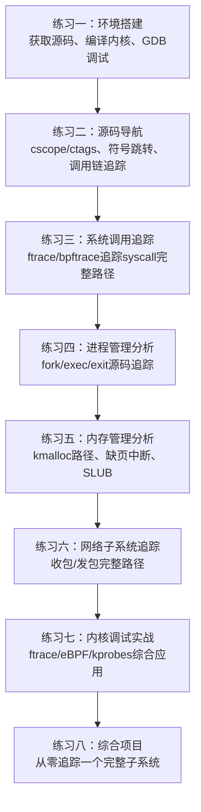

# Linux内核源码分析——练习方法

理论和源码阅读如果缺少动手验证，很快就会遗忘。本节提供一套**由浅入深、覆盖全子系统**的练习体系，每个练习都有明确的目标、可执行的步骤、真实的代码片段和可量化的检查标准。

建议读者按顺序完成：先搭环境，再练导航，然后逐个子系统追踪，最后做综合项目。预计完整完成所有练习需要 **20-30小时**。



---

## 练习一：环境搭建（预计90分钟）

**目标**：获得一套可以阅读、编译、调试Linux内核的完整开发环境。没有环境，后续所有练习都无法进行。

### 1.1 获取内核源码

```bash
# 方法一：git克隆（推荐，可切换版本）
mkdir -p ~/kernel &amp;&amp; cd ~/kernel
git clone --depth=1 https://git.kernel.org/pub/scm/linux/kernel/git/torvalds/linux.git
# --depth=1 只取最新提交，节省磁盘和时间（约2.5GB）
# 如需历史版本：
# git log --oneline --all | head -20
# git checkout v6.8

# 方法二：下载tar包
wget https://cdn.kernel.org/pub/linux/kernel/v6.x/linux-6.8.tar.xz
tar xf linux-6.8.tar.xz

# 验证源码完整性
cd linux
ls -la          # 确认 arch/ mm/ kernel/ fs/ net/ 等目录存在
wc -l kernel/fork.c   # 约7000+行
wc -l mm/slub.c       # 约6000+行
```

**检查点**：
- [ ] 源码目录结构完整（arch/、kernel/、mm/、fs/、net/ 均存在）
- [ ] 可以找到 `kernel/fork.c`、`mm/slub.c`、`net/core/skbuff.c` 等关键文件

### 1.2 编译内核（带调试符号）

编译一个带调试符号的内核是后续所有练习的基础——没有调试符号，GDB无法设置断点，`addr2line`无法转换地址。

```bash
cd ~/kernel/linux

# 步骤1：生成默认配置（基于当前运行内核的配置）
cp /boot/config-$(uname -r) .config
make olddefconfig

# 步骤2：确保开启调试信息
# 方法A：用scripts/config工具
scripts/config --enable CONFIG_DEBUG_INFO
scripts/config --enable CONFIG_DEBUG_INFO_DWARF5
scripts/config --enable CONFIG_GDB_SCRIPTS    # 生成GDB辅助脚本
scripts/config --enable CONFIG_FRAME_POINTER   # 开启帧指针（更好的栈回溯）
scripts/config --disable CONFIG_DEBUG_INFO_NONE

# 方法B：手动修改
grep -q "CONFIG_DEBUG_INFO=y" .config || \
  echo "CONFIG_DEBUG_INFO=y" >> .config

# 步骤3：编译（-j参数=CPU核心数，加速编译）
NPROC=$(nproc)
echo "Using $NPROC parallel jobs"
make -j${NPROC} 2>&amp;1 | tail -20

# 步骤4：验证编译产物
ls -lh arch/x86/boot/bzImage    # 可启动内核镜像
ls -lh vmlinux                   # 带调试符号的内核（通常300MB+）
file vmlinux                     # 应显示 "ELF 64-bit LSB executable... with debug_info"
```

**编译常见问题及解决**：

| 问题 | 原因 | 解决方案 |
|------|------|----------|
| `make: *** No targets specified` | 未进入源码目录 | `cd ~/kernel/linux` |
| 缺少`openssl-devel`/`libssl-dev` | 内核需要OpenSSL头文件 | `sudo apt install libssl-dev` |
| 缺少`flex`/`bison` | 语法分析器生成工具 | `sudo apt install flex bison` |
| 编译OOM | 内存不足 | 减少`-j`参数或加swap |
| `fatal error: python/Python.h` | Python开发头文件缺失 | `sudo apt install python3-dev` |

### 1.3 用QEMU+GDB调试内核

QEMU可以启动编译好的内核进行调试，无需重启物理机：

```bash
# 步骤1：安装QEMU
sudo apt install qemu-system-x86

# 步骤2：启动QEMU（带调试符号，暂停等待GDB连接）
cd ~/kernel/linux
qemu-system-x86_64 \
  -kernel arch/x86/boot/bzImage \
  -append "nokaslr root=/dev/sda1 console=ttyS0" \
  -nographic \
  -s -S \
  -m 2G \
  -smp 2 \
  -net nic -net user,hostfwd=tcp::2222-:22
# -s: 在TCP 1234端口打开GDB server
# -S: 启动后暂停，等待GDB发出continue命令
# nokaslr: 关闭内核地址空间布局随机化（便于调试）

# 步骤3：另一个终端，用GDB连接
cd ~/kernel/linux
gdb vmlinux
(gdb) target remote :1234      # 连接QEMU
(gdb) break start_kernel        # 在start_kernel设断点
(gdb) continue                  # 启动内核
# 内核会在start_kernel处停下
(gdb) next                      # 单步执行
(gdb) backtrace                 # 查看调用栈
(gdb) print init_task           # 查看0号进程的task_struct
(gdb) info registers            # 查看寄存器
```

**验证环境成功**：内核在 `start_kernel()` 处断下，`backtrace` 显示从 `head_64.S` 到 `start_kernel` 的调用链。

### 1.4 安装源码导航工具

```bash
# cscope: 符号交叉引用
sudo apt install cscope

# 在内核源码目录生成符号数据库
cd ~/kernel/linux
cscope -R -b -k    # -k: 内核模式（不解析/usr/include）
# 生成cscope.out后，可用cscope -d交互式搜索

# ctags: 快速跳转
sudo apt install universal-ctags
ctags -R --languages=C --kinds-C=+l --fields=+S -f tags .
# 在vim中可用 Ctrl-] 跳转到定义，Ctrl-t 返回

# VS Code + clangd（图形化IDE方案）
# 安装VS Code，然后安装clangd扩展
# 配置 .clangd 或 c_cpp_properties.json 指向内核include路径
```

**检查标准**：
- [ ] 编译的内核vmlinux包含调试符号（`file vmlinux`显示with debug_info）
- [ ] QEMU可以启动内核并在GDB中断下来
- [ ] cscope/ctags可以搜索内核符号（如搜索 `sys_read` 能找到定义）
- [ ] 能在GDB中查看 `task_struct` 结构体的成员

---

## 练习二：源码导航——从函数名到调用链（预计60分钟）

**目标**：掌握在2800万行内核代码中快速定位关键函数、追踪调用链的能力。这是后续所有源码分析练习的基础技能。

### 2.1 练习：追踪read()系统调用的完整路径

```bash
# 任务：找到read()系统调用从入口到返回的完整调用链
# 使用grep/grep -rn在源码中搜索

# 步骤1：找到系统调用入口
cd ~/kernel/linux
grep -rn "SYSCALL_DEFINE3(read" include/
# 输出: include/linux/syscalls.h
#   SYSCALL_DEFINE3(read, unsigned int, fd, char __user *, buf, size_t, count)
# SYSCALL_DEFINE3宏展开后生成 sys_read 函数

# 步骤2：找到sys_read的实现
grep -rn "SYSCALL_DEFINE3(read" fs/
# 输出: fs/read_write.c
# sys_read → vfs_read → ...

# 步骤3：追踪vfs_read的调用链
# 打开 fs/read_write.c，找到 vfs_read 函数
# 关键行：
#   retval = rw_verify_area(READ, file, pos, count);
#   if (file->f_op->read_iter)
#       retval = call_read_iter(file, &amp;kiocb, &amp;iter);

# 步骤4：理解函数指针跳转
# file->f_op->read_iter 是一个函数指针
# 对于ext4文件系统，指向 ext4_file_read_iter
grep -rn "ext4_file_read_iter" fs/ext4/

# 步骤5：继续追踪
# ext4_file_read_iter → generic_file_read_iter → filemap_read
grep -rn "generic_file_read_iter" mm/
grep -rn "filemap_read" mm/filemap.c
```

**整理后的调用链**：
用户态: read(fd, buf, count)
  → sys_read()                        # fs/read_write.c
    → vfs_read()                      # fs/read_write.c
      → ext4_file_read_iter()         # fs/ext4/file.c（ext4的read实现）
        → generic_file_read_iter()    # mm/filemap.c（通用文件读取）
          → filemap_read()            # mm/filemap.c（页缓存读取）
            → filemap_get_folio()     # 查找页缓存中的数据
              → readahead()           # 如果数据不在缓存，触发磁盘I/O

### 2.2 练习：用cscope搜索内核符号

```bash
cd ~/kernel/linux

# 任务1：查找谁调用了kmalloc
cscope -d -L1kmalloc
# 输出格式: 函数名 文件名 行号 调用位置
# kmalloc mm/slub.c 3800: return kmalloc(size, flags);

# 任务2：查找kmalloc在哪里被定义
cscope -d -L0kmalloc
# 返回 kmalloc 的定义位置

# 任务3：查找所有调用copy_process的函数
cscope -d -L2copy_process
# copy_process 被 kernel_clone 调用

# 任务4：查找sk_buff的所有成员被哪些文件引用
cscope -d -L4skb->data
# 这种搜索可以帮助理解sk_buff的data指针在协议栈中如何移动
```

### 2.3 练习：构建task_struct的字段关系图

**任务**：选择 `task_struct` 中的任意3个指针字段（如 `mm`、`files`、`sighand`），追踪它们指向的数据结构类型，画出关系图。

task_struct
  ├── mm → struct mm_struct
  │     ├── pgd → pgd_t (页表根)
  │     ├── mmap → vm_area_struct (VMA链表)
  │     └── mm_count → 引用计数
  │
  ├── files → struct files_struct
  │     ├── fdt → fdtable (文件描述符表)
  │     │     ├── fd[0] → struct file
  │     │     ├── fd[1] → struct file
  │     │     └── ...
  │     └── struct file → f_op → file_operations
  │
  └── sighand → struct sighand_struct
        └── action[32] → struct k_sigaction

**检查标准**：
- [ ] 能独立追踪 `read()` 系统调用从入口到ext4的完整调用链
- [ ] 能使用cscope搜索内核符号的定义和引用
- [ ] 能画出至少一个核心数据结构的关系图

---

## 练习三：系统调用追踪——用ftrace/bpftrace验证理解（预计90分钟）

**目标**：学会用动态追踪工具在运行中的内核上验证源码阅读的理解。这是从"读代码"到"验证代码"的关键跃迁。

### 3.1 用ftrace追踪系统调用

```bash
# ftrace是内核自带的函数追踪框架，不需要安装任何额外工具

# 步骤1：启用ftrace
sudo su
cd /sys/kernel/debug/tracing

# 步骤2：查看当前追踪器
cat current_tracer
# 输出: nop

# 步骤3：设置追踪函数
echo function_graph > current_tracer

# 步骤4：设置要追踪的函数（追踪vfs_read）
echo vfs_read > set_graph_function

# 步骤5：设置要追踪的入口点
echo sys_read > set_ftrace_filter

# 步骤6：开始追踪
echo 1 > tracing_on

# 步骤7：触发一次read操作（另一个终端）
cat /etc/hostname > /dev/null

# 步骤8：停止追踪
echo 0 > tracing_on

# 步骤9：查看追踪结果
cat trace
# 输出示例：
#  0)               |  sys_read() {
#  0)   0.845 us    |    vfs_read();
#  0)   0.123 us    |    fd_install();
#  0)   1.456 us    |  }
```

```bash
# 清理追踪设置
echo nop > current_tracer
echo > set_graph_function
echo > set_ftrace_filter
echo > trace
```

### 3.2 用bpftrace追踪fork系统调用

```bash
# bpftrace是eBPF前端，功能比ftrace更灵活

# 追踪所有fork系统调用，显示调用者和子进程PID
sudo bpftrace -e '
tracepoint:syscalls:sys_enter_clone {
    printf("clone called by %s (pid=%d, ppid=%d), flags=0x%x\n",
           comm, pid, ppid, args->flags);
}
tracepoint:syscalls:sys_exit_clone {
    printf("clone returned child_pid=%d\n", args->ret);
}'

# 输出示例：
# clone called by bash (pid=1234, ppid=1233), flags=0x1200011
# clone returned child_pid=1235
```

### 3.3 用bpftrace追踪kmalloc分配

```bash
# 追踪kmalloc的调用，显示请求的大小和实际分配的地址
sudo bpftrace -e '
kprobe:__kmalloc {
    @size = arg1;
}
kretprobe:__kmalloc /@size/ {
    printf("kmalloc: size=%d, return=%p\n", @size, retval);
    delete(@size);
}'

# 或者更简洁的版本（追踪kmalloc_trace）：
sudo bpftrace -e '
kprobe:kmalloc_trace {
    printf("%-16s pid=%-6d size=%-6d caller=%s\n",
           comm, pid, arg1, ksym(arg2));
}' | head -20
# 这会显示哪些进程在分配内核内存、分配多少、从哪个函数调用
```

### 3.4 用perf分析系统调用热点

```bash
# 记录5秒内的系统调用事件
sudo perf trace -e 'read,write,open,close,mmap' -p $$ -- sleep 5

# 生成系统调用的火焰图
sudo perf record -g -a -- sleep 10
sudo perf script > out.perf
# 使用FlameGraph工具生成SVG
git clone https://github.com/brendangregg/FlameGraph
./FlameGraph/stackcollapse-perf.pl out.perf > out.folded
./FlameGraph/flamegraph.pl out.folded > syscall_flamegraph.svg
# 用浏览器打开syscall_flamegraph.svg查看
```

**检查标准**：
- [ ] 能用ftrace追踪一个系统调用的内核函数调用链
- [ ] 能用bpftrace追踪fork/clone事件并显示进程信息
- [ ] 能用perf生成系统调用火焰图

---

## 练习四：进程管理分析（预计90分钟）

**目标**：从源码级别理解进程创建（fork）、程序加载（exec）和进程退出（exit）的完整内核路径。

### 4.1 追踪fork的内核路径

**任务**：用GDB单步跟踪一次fork调用，观察关键数据结构的变化。

```bash
# 步骤1：在QEMU+GDB环境中设置断点
gdb vmlinux
(gdb) target remote :1234
(gdb) break copy_process
(gdb) break dup_task_struct
(gdb) break sched_fork
(gdb) continue

# 步骤2：在QEMU内核的用户空间中执行
# （需要先挂载根文件系统或用initramfs）
# 当某个进程调用fork()时，GDB会在copy_process断下

(gdb) next                    # 单步执行
(gdb) print current->comm     # 查看当前进程名
(gdb) print current->pid      # 查看当前进程PID
(gdb) p/d sizeof(*p)          # 查看task_struct大小（约6KB）
```

**源码追踪笔记模板**：

```c
// 追踪目标：fork() → 子进程创建的完整路径
//
// 入口: sys_fork (kernel/fork.c)
//   → kernel_clone()               # 统一的进程创建入口
//     → copy_process()             # 核心：复制进程描述符
//       → dup_task_struct()        # 复制task_struct（结构体级别的浅拷贝）
//       → copy_creds()             # 复制进程凭证（uid/gid/capabilities）
//       → copy_mm()                # 复制地址空间（COW延迟复制）
//       → copy_files()             # 复制文件描述符表
//       → copy_fs()                # 复制文件系统信息（cwd/root）
//       → copy_sighand()           # 复制信号处理函数表
//       → copy_signal()            # 复制信号状态
//       → copy_namespaces()        # 复制命名空间（cgroup/net/pid等）
//       → sched_fork()             # 初始化调度相关字段
//         → 设置子进程vruntime = 父进程vruntime - sysctl_sched_latency
//         → 子进程初始权重 = 父进程权重
//       → alloc_pid()              # 分配PID（从pid_namespace分配）
//     → wake_up_new_task()         # 将子进程加入调度队列
```

### 4.2 用/proc验证进程创建

```bash
# 任务：在源码中理解的字段，用/proc验证

# 查看进程的task_struct字段对应的/proc信息
PID=$$
echo "PID: $PID"
cat /proc/$PID/status | head -20
# Name: 对应 task_struct.comm
# State: 对应 task_struct.state
# Pid: 对应 task_struct.pid
# PPid: 对应 task_struct.real_parent->pid

# 查看进程的内存布局（对应 mm_struct）
cat /proc/$PID/maps | head -10
# 每一行对应一个 vm_area_struct

# 查看进程打开的文件（对应 files_struct）
ls -la /proc/$PID/fd | head -10

# 查看进程的调度策略（对应 task_struct.policy）
cat /proc/$PID/sched | head -10
# nr_switches: 上下文切换次数
# se.sum_exec_runtime: 累计执行时间（纳秒）
# se.vruntime: 虚拟运行时间
```

### 4.3 用strace观察execve的参数传递

```bash
# strace可以完美展示execve的参数传递
strace -v -e execve bash -c "echo hello"
# 输出中的execve调用显示：
# - 可执行文件路径
# - argv数组（命令行参数）
# - envp数组（环境变量）

# 对照源码理解：
# sys_execve → do_execveat_common → bprm_mm_init → load_elf_binary
# load_elf_binary 解析ELF头，设置新的地址空间
```

**检查标准**：
- [ ] 能用GDB在copy_process处中断并观察参数
- [ ] 能将task_struct的字段与/proc中的信息一一对应
- [ ] 能解释fork后子进程vruntime的初始化逻辑

---

## 练习五：内存管理分析（预计90分钟）

**目标**：追踪一次内核内存分配从kmalloc到伙伴系统到SLUB到物理页的完整路径，理解缺页中断的触发和处理。

### 5.1 追踪kmalloc的完整路径

**任务**：用bpftrace追踪kmalloc调用链，理解内存分配的层级关系。

```bash
# 追踪kmalloc的调用栈，看它最终走到哪个底层函数
sudo bpftrace -e '
kprobe:__kmalloc {
    printf("%-16s pid=%-6d size=%-6d caller=%s\n",
           comm, pid, arg1, ksym(arg2));
    print(kstack);
    printf("\n");
}' | head -30
# 典型调用栈：
# __kmalloc
#   → kmalloc_slab           # SLUB: 在哪个slab缓存分配？
#   → __slab_alloc_node      # SLUB: 从freelist取对象
#     → __alloc_pages        # 伙伴系统: 如果slab缓存为空，分配新页
#       → get_page_from_freelist  # 伙伴系统核心: 从空闲链表取2^order页
```

**理论对照**：

用户空间: malloc(size)
  → glibc: _int_malloc()
    → brk/mmap 系统调用

内核空间: kmalloc(size, GFP_KERNEL)
  ├─→ size ≤ 8KB? → SLUB分配器
  │     → 根据size选择slab缓存（kmalloc-64, kmalloc-128, ...）
  │     → 从freelist取一个对象
  │     → 如果freelist为空 → 向伙伴系统申请新页
  │
  └─→ size > 8KB? → vmalloc 或 直接伙伴系统
        → 伙伴系统: 找到合适的order（2^order个连续页）
        → 如果没有合适的块 → 拆分更大的块（buddy splitting）
        → 如果没有空闲块 → 内存回收（kswapd / direct reclaim）

### 5.2 观察SLUB分配器的运行状态

```bash
# 查看当前SLUB缓存使用情况
sudo cat /proc/slabinfo
# 输出示例：
# name            <active_objs> <num_objs> <objsize> <objperslab> <pagesperslab>
# kmalloc-8192        2048      2048      8192      4      8
# kmalloc-4096        1024      1024      4096      8      8
# kmalloc-256         4096      4096       256     16      1

# 查看特定slab缓存的详细信息
sudo cat /sys/kernel/slab/kmalloc-256/objects
sudo cat /sys/kernel/slab/kmalloc-256/slab_size

# 用slabtop实时监控
sudo slabtop -o -s c | head -30
```

### 5.3 用crash工具查看物理页分配

```bash
# crash是离线内核调试工具，可以分析kdump生成的core dump
# 这里展示其功能（需要kdump环境）
sudo crash vmlinux /var/crash/123456/vmcore

# (crash) kmem -s               # 查看SLUB缓存统计
# (crash) kmem -i               # 查看整体内存使用
# (crash) kmem -p               # 查看伙伴系统页面分配情况
# (crash) struct page -H <addr> # 查看物理页描述符
# (crash) bt -a                  # 查看所有CPU的调用栈
```

### 5.4 触发并观察缺页中断

```bash
# 任务：触发一次缺页中断，用ftrace观察内核处理过程

# 步骤1：启用ftrace追踪缺页中断
sudo su
cd /sys/kernel/debug/tracing
echo function_graph > current_tracer
echo handle_mm_fault > set_graph_function
echo do_page_fault > set_ftrace_filter
echo 1 > tracing_on

# 步骤2：触发缺页中断（读取一个未映射的文件页）
dd if=/tmp/large_file of=/dev/null bs=4k count=100 &amp;
sleep 1
echo 0 > tracing_on
cat trace | head -40
# 你会看到：
# do_page_fault()
#   → handle_mm_fault()
#     → __handle_mm_fault()
#       → handle_pte_fault()
#         → do_fault()              # 文件页缺页
#           → filemap_fault()       # 从页缓存或磁盘读取

# 步骤3：清理
echo nop > current_tracer
echo > set_graph_function
echo > set_ftrace_filter
echo > trace
```

**检查标准**：
- [ ] 能用bpftrace追踪kmalloc的完整调用栈
- [ ] 能解释SLUB和伙伴系统的关系（SLUB从伙伴系统申请页，然后切割成小对象）
- [ ] 能用ftrace观察缺页中断的处理流程

---

## 练习六：网络子系统追踪（预计90分钟）

**目标**：追踪一个网络数据包从网卡中断到用户缓冲区的完整旅程，理解sk_buff在各协议层之间的传递方式。

### 6.1 用bpftrace追踪收包路径

```bash
# 追踪网络收包事件，观察数据包从网卡到协议栈的路径
sudo bpftrace -e '
kprobe:netif_receive_skb {
    printf("收包: dev=%s, len=%d, proto=0x%04x, comm=%s\n",
           str(args->dev->name), args->skb->len,
           args->skb->protocol, comm);
}'

# 更精确的追踪：在NAPI轮询点设探针
sudo bpftrace -e '
kprobe:napi_gro_receive {
    printf("NAPI收包: dev=%s, len=%d\n",
           str(((struct sk_buff *)arg1)->dev->name),
           ((struct sk_buff *)arg1)->len);
}'

# 追踪TCP收包路径
sudo bpftrace -e '
kprobe:tcp_v4_rcv {
    printf("TCP收包: 从 %s:%d → 本地, len=%d\n",
           ntop(arg0->saddr), arg0->source, ((struct sk_buff *)arg1)->len);
}'
```

### 6.2 观察sk_buff的协议栈传递

**任务**：在源码中追踪sk_buff从L2到L4的处理过程。

```bash
# 收包路径（从底到顶）：
# 1. 网卡中断 → net_rx_action()
#    → napi_poll() → 驱动的poll函数
#
# 2. NAPI轮询 → napi_gro_receive()
#    → netif_receive_skb()
#
# 3. 协议分发 → __netif_receive_skb_core()
#    → 根据skb->protocol分发：
#       ETH_P_IP → ip_rcv() → ip_rcv_finish()
#
# 4. IP层 → ip_rcv()
#    → NF_INET_PRE_ROUTING (netfilter钩子)
#    → ip_rcv_finish()
#    → ip_local_deliver() → ip_local_deliver_finish()
#
# 5. TCP层 → tcp_v4_rcv()
#    → tcp_rcv_established()  # 已建立连接的快速路径
#    → tcp_data_queue()       # 数据入队
#
# 6. 到达socket → sock_def_readable()
#    → 唤醒在recv()上等待的进程
```

### 6.3 用socket选项观察包的行为

```bash
# 任务：用tcpdump + 内核追踪联合分析

# 终端1：启动tcpdump
sudo tcpdump -i lo -nn -e port 8080 &amp;

# 终端2：启动一个简单的HTTP服务器
python3 -c "
from http.server import HTTPServer, SimpleHTTPRequestHandler
HTTPServer(('127.0.0.1', 8080), SimpleHTTPRequestHandler).serve_forever()
" &amp;

# 终端3：用bpftrace追踪socket收发
sudo bpftrace -e '
kprobe:tcp_sendmsg {
    printf("TCP发送: %s → len=%d\n", comm, arg2);
}
kprobe:tcp_recvmsg {
    printf("TCP接收: %s ← len=%d\n", comm, arg2);
}'

# 终端4：发送请求
curl http://127.0.0.1:8080/
# 观察三个终端的输出对应关系
```

### 6.4 追踪sk_buff的零拷贝设计

```bash
# 任务：在源码中理解sk_buff的数据指针移动

# 核心结构：
# head: 分配的缓冲区起始地址（固定）
# data: 当前协议层数据起始（随协议层变化而移动）
# tail: 当前数据结束（随协议层变化而移动）
# end:  分配的缓冲区结束（固定）

# 发包时（从上到下）：
#   tcp_sendmsg()     → 构造传输层数据
#   ip_output()       → push_pullskb_head() 添加IP头
#   dev_queue_xmit()  → 添加以太网头
#   无需拷贝数据，只移动指针 + 添加协议头

# 搜索数据指针移动的代码：
grep -rn "skb_push\|skb_pull\|skb_put" net/ | head -20
# skb_push: 向头部添加数据（添加协议头）
# skb_pull: 从头部剥离数据（解析协议头）
# skb_put:  向尾部追加数据
```

**检查标准**：
- [ ] 能用bpftrace追踪网络收包事件
- [ ] 能画出数据包从网卡到socket的完整调用链
- [ ] 能解释sk_buff零拷贝设计的核心思想

---

## 练习七：内核调试实战（预计120分钟）

**目标**：掌握ftrace、eBPF、kprobes等内核调试工具的实际应用，能够排查真实的内核级问题。

### 7.1 用ftrace分析函数耗时

```bash
# 任务：找出哪个内核函数在read系统调用中耗时最长

sudo su
cd /sys/kernel/debug/tracing

# 设置function_graph追踪器
echo function_graph > current_tracer

# 设置要追踪的函数范围（只追踪vfs_read及其子调用）
echo vfs_read > set_graph_function
echo 1 > set_function_graph_depth    # 限制追踪深度

# 设置过滤条件（只追踪耗时超过100μs的调用）
echo 1 > tracing_on

# 执行一些文件读取操作
dd if=/dev/zero of=/tmp/test bs=1k count=1000
cat /tmp/test > /dev/null

echo 0 > tracing_on

# 查看结果
cat trace | grep -E "^[[:space:]]+[0-9]+\)" | sort -t'|' -k2 -rn | head -20
# 按耗时排序，找出最慢的函数

# 清理
echo nop > current_tracer
echo > set_graph_function
echo > set_function_graph_depth
echo > trace
```

### 7.2 用kprobes动态插桩

```bash
# kprobes允许在任何内核函数的入口/出口动态插入探针

# 在do_page_fault入口设探针
sudo bpftrace -e '
kprobe:do_page_fault {
    @fault_count = count();
    @fault_by_comm[comm] = count();
}
interval:s:5 {
    printf("过去5秒缺页次数: %d\n", @fault_count);
    print(@fault_by_comm);
    clear(@fault_count);
    clear(@fault_by_comm);
}'
# 运行5秒后，显示各进程的缺页次数统计
# 杀掉后（Ctrl+C），可以分析哪些进程缺页最多
```

### 7.3 模拟并排查一个内核级问题

**任务**：创建一个有内存泄漏的内核模块，然后用kmemleak检测。

```c
// leaky_module.c — 漏洞模拟模块
#include <linux/module.h>
#include <linux/slab.h>

static int __init leaky_init(void)
{
    // 故意泄漏：分配内存但不释放
    void *p = kmalloc(256, GFP_KERNEL);
    printk(KERN_INFO "leaky_module: allocated %p\n", p);
    return 0;
}

static void __exit leaky_exit(void)
{
    // 忘记kfree(p)!
    printk(KERN_INFO "leaky_module: unloaded (memory leaked)\n");
}

module_init(leaky_init);
module_exit(leaky_exit);
MODULE_LICENSE("GPL");
```

```bash
# 步骤1：编译并加载模块
make -C /lib/modules/$(uname -r)/build M=$(pwd) modules
sudo insmod leaky_module.ko

# 步骤2：使用kmemleak检测泄漏
sudo sh -c 'echo scan > /sys/kernel/debug/kmemleak'
sleep 2
sudo cat /sys/kernel/debug/kmemleak
# 输出会显示泄漏的内存地址和分配调用栈

# 步骤3：在源码中定位泄漏位置
# kmemleak的调用栈会指向 kmalloc() 调用点
# 用addr2line转换（如果需要）：
# addr2line -e leaky_module.ko 0x... 

# 步骤4：修复（添加kfree）并重新验证
sudo rmmod leaky_module
# 修改源码，添加kfree(p)
sudo insmod leaky_module.ko
sudo sh -c 'echo scan > /sys/kernel/debug/kmemleak'
sudo cat /sys/kernel/debug/kmemleak
# 输出应为空，表示无泄漏
```

### 7.4 用perf stat分析内核态开销

```bash
# 分析一个计算密集型任务的内核态/用户态CPU占比
sudo perf stat -e \
  cycles,instructions,cache-misses,cache-references,cs \
  -- dd if=/dev/zero of=/tmp/test bs=4k count=100000

# 关键指标解读：
# instructions: 执行的指令数
# cache-misses: 缓存未命中（高值可能表示内存访问模式不好）
# cs: 上下文切换次数（高值可能表示进程调度频繁）
# user/sys比率: sys时间高说明内核态开销大

# 对比不同I/O模式
echo 3 > /proc/sys/vm/drop_caches
sudo perf stat -e cycles,instructions,cs -- \
  dd if=/dev/zero of=/tmp/test bs=4k count=100000 oflag=direct
# oflag=direct: 绕过页缓存，直接写磁盘
```

**检查标准**：
- [ ] 能用ftrace追踪函数耗时并找出热点
- [ ] 能用kprobes在运行内核上动态插桩
- [ ] 能用kmemleak检测并定位内存泄漏
- [ ] 能用perf分析内核态开销

---

## 练习八：综合项目——从零分析一个子系统（预计2-3小时）

**目标**：将前面所有技能综合运用，独立分析一个完整的内核子系统。选择以下任一项目完成。

### 项目A：分析ext4文件系统的日志机制

**步骤**：
1. **定位源码**：找到 `fs/ext4/` 目录，理解主要文件职责
2. **追踪写入路径**：`write() → vfs_write → ext4_write → ext4_da_write → ...`
3. **理解日志机制**：在源码中找到journal相关代码（`fs/jbd2/`）
4. **用ftrace验证**：追踪 `ext4_journal_start`、`ext4_journal_stop` 的调用时机
5. **量化分析**：对比开启/关闭日志时的写入性能差异

**产出物**：一份分析报告，包含ext4日志的完整写入路径、关键数据结构关系图、性能对比数据。

### 项目B：分析eBPF子系统的加载路径

**步骤**：
1. **理解eBPF架构**：阅读 `kernel/bpf/` 目录下的核心文件
2. **追踪一个eBPF程序的加载**：从用户态 `bpf()` 系统调用到内核验证器
3. **理解验证器**：在 `kernel/bpf/verifier.c` 中找到验证逻辑
4. **用bpftrace追踪eBPF自身的运行**：观察验证器如何检查程序安全性
5. **对比不同eBPF程序类型**：`BPF_PROG_TYPE_KPROBE` vs `BPF_PROG_TYPE_SOCKET_FILTER`

**产出物**：一份eBPF加载路径分析报告，包含验证器决策流程图。

### 项目C：分析CFS调度器的时间片分配

**步骤**：
1. **理解nice值到权重的映射**：在 `kernel/sched/fair.c` 中找到权重表
2. **用/proc/schedstat观察调度行为**：对比不同nice值进程的vruntime增长
3. **用perf sched分析调度延迟**：`perf sched record` → `perf sched latency`
4. **修改nice值**：用 `renice` 调整进程优先级，观察vruntime变化
5. **分析调度延迟与nice值的关系**：收集数据，建立量化模型

**产出物**：一份调度器分析报告，包含nice值-权重-vruntime的量化关系、调度延迟数据图表。

**检查标准**：
- [ ] 完成了至少一个综合项目
- [ ] 有完整的源码调用链追踪记录
- [ ] 有工具验证的输出数据
- [ ] 产出物包含图表/数据/分析结论

---

## 练习路线图与时间规划


| 阶段 | 练习 | 预计时间 | 核心技能 |
|------|------|----------|----------|
| 基础阶段 | 练习一：环境搭建 | 90分钟 | 内核编译、QEMU、GDB |
| | 练习二：源码导航 | 60分钟 | cscope、grep、函数指针追踪 |
| | 练习三：系统调用追踪 | 90分钟 | ftrace、bpftrace、perf |
| 子系统分析 | 练习四：进程管理 | 90分钟 | fork/exec/exit源码追踪 |
| | 练习五：内存管理 | 90分钟 | kmalloc路径、SLUB、缺页中断 |
| | 练习六：网络子系统 | 90分钟 | sk_buff、NAPI、协议栈 |
| 综合应用 | 练习七：调试实战 | 120分钟 | kprobes、kmemleak、perf stat |
| | 练习八：综合项目 | 120-180分钟 | 子系统分析、报告撰写 |
| **合计** | | **约12-14小时** | |

---

## 常见问题与排错

### Q1：编译内核时 `make` 报错找不到头文件

**原因**：缺少编译依赖。
**解决**：
```bash
# Debian/Ubuntu
sudo apt install build-essential libncurses-dev bison flex \
  libssl-dev libelf-dev dwarves bc

# CentOS/RHEL
sudo yum groupinstall "Development Tools"
sudo yum install ncurses-devel bison flex openssl-devel \
  elfutils-libelf-devel bc
```

### Q2：GDB无法在内核函数上设断点

**原因**：内核编译时未开启调试符号。
**解决**：检查编译配置：
```bash
grep CONFIG_DEBUG_INFO .config
# 应该输出: CONFIG_DEBUG_INFO=y
# 如果没有，重新编译：scripts/config --enable CONFIG_DEBUG_INFO &amp;&amp; make -j$(nproc)
```

### Q3：ftrace的tracing_on写入失败

**原因**：权限不足或debugfs未挂载。
**解决**：
```bash
# 确认debugfs已挂载
mount | grep debugfs
# 如果没有：
sudo mount -t debugfs none /sys/kernel/debug

# 确认有权限
sudo su  # ftrace需要root权限
```

### Q4：bpftrace报错 "Kernel features not sufficient"

**原因**：内核未开启eBPF相关配置。
**解决**：
```bash
# 检查必要配置
grep CONFIG_BPF_SYSCALL /boot/config-$(uname -r)
grep CONFIG_BPF_JIT /boot/config-$(uname -r)
# 都应该为=y
# 如果不是，需要重新编译内核并开启这些选项
```

### Q5：QEMU启动内核后无法交互

**原因**：缺少根文件系统，内核启动后panic。
**解决**：
```bash
# 使用initramfs或下载一个最小根文件系统
wget https://dl-cdn.alpinelinux.org/alpine/v3.19/releases/x86_64/alpine-virt-3.19.1-x86_64.iso
# 或使用buildroot生成自定义initramfs

# 临时方案：内核配置中加入 panic=1 让其自动重启
-append "nokaslr console=ttyS0 panic=1"
```

---

## 推荐学习资源

| 资源 | 用途 | 适合阶段 |
|------|------|----------|
| Elixir Cross Reference (elixir.bootlin.com) | 在线源码浏览和符号跳转 | 随时查阅 |
| LWN.net | 内核子系统设计深度文章 | 进阶阅读 |
| kernel.org/doc/html/latest | 内核官方文档 | 参考手册 |
| The Linux Kernel Module Programming Guide | 内核模块编程入门 | 练习一前后 |
| Brendan Gregg's BPF Performance Tools | eBPF/perf性能分析实战 | 练习三/七 |
| Crash Dump Analysis Notes | crash工具使用教程 | 练习七 |
