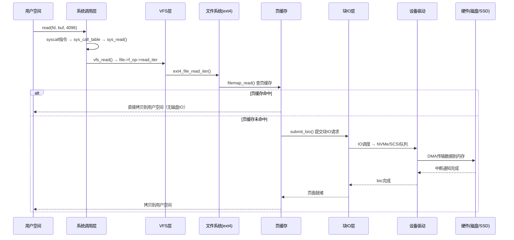

# 第08章 本章小结：Linux内核源码分析

## 一、核心洞察：本章的一句话总结

**Linux内核源码分析的本质是"从用户空间的what到内核空间的how"**——理解一个系统调用如何穿越用户态/内核态边界，理解进程如何被调度、内存如何被管理、IO如何被执行，是所有系统级性能优化和问题排查的根基。内核不是黑盒，它是一份可以阅读、可以修改、可以调试的C代码，约2800万行代码构成了操作系统最核心的逻辑。

理解这一点至关重要，因为：当你的应用出现性能瓶颈时，瓶颈往往不在你的代码里，而在内核为你服务的方式中——上下文切换开销、页面错误处理、IO调度策略、锁竞争路径，这些都是可以通过阅读内核源码来理解并优化的。

**本章六大核心问题的完整回答：**

| 核心问题 | 一句话回答 | 对应源码 |
|----------|-----------|---------|
| 系统调用如何从用户态到达内核态？ | `syscall`指令触发IDT中断 → `entry_SYSCALL_64` → `sys_call_table[nr](regs)` 分发到处理函数 | `arch/x86/entry/` |
| fork/exec/exit的内核实现是什么？ | fork用COW复制地址空间，exec替换ELF程序，exit释放所有资源后不再返回 | `kernel/fork.c`、`fs/exec.c`、`kernel/exit.c` |
| CFS调度器如何保证公平性？ | 按权重计算vruntime，红黑树选最左节点（最小vruntime），"公平"=权重比例而非均分 | `kernel/sched/fair.c` |
| 内存分配的完整路径是什么？ | kmalloc → SLUB分配器 → 伙伴系统 → 物理页帧；缺页中断处理COW和demand paging | `mm/slub.c`、`mm/page_alloc.c` |
| 网络数据包从网卡到用户缓冲区经历了什么？ | 网卡中断 → NAPI轮询收包 → sk_buff协议栈处理 → socket缓冲区 → 用户read() | `net/core/skbuff.c`、`net/ipv4/tcp.c` |
| 内核如何保证并发安全？ | spinlock用于短临界区，RCU用于读多写少，seqlock用于统计计数，原子操作用于标志位 | `kernel/spinlock.c`、`kernel/rcu/` |

## 二、道法术器贯通：从哲学到工具

### 2.1 道（设计哲学）

Linux内核的设计哲学贯穿本章所有内容，核心可以概括为三大原则：

| 哲学 | 核心思想 | 体现领域 | 权衡 |
|------|----------|----------|------|
| 一切皆文件 | 用统一的文件描述符接口抽象所有资源（设备、管道、socket） | VFS层、/dev、/proc、/sys | 统一接口带来灵活性，但增加了间接层开销 |
| 机制与策略分离 | 内核提供机制（如调度器框架），用户空间决定策略（如调度类优先级） | CFS调度器、netfilter、namespaces | 灵活性高，但正确组合策略需要深入理解 |
| 最小特权原则 | 用户态进程只能访问被明确授权的资源；内核模块遵循 least privilege | capabilities、seccomp、SELinux | 安全性强，但配置不当会导致权限不足 |

这三大原则并非孤立存在。"一切皆文件"让你可以通过`read()/write()`操作几乎任何资源，这降低了学习成本但模糊了不同类型资源的性能特征差异。"机制与策略分离"让内核可以支持完全不同的调度策略（SCHED_NORMAL、SCHED_FIFO、SCHED_DEADLINE）而不需要修改调度器核心代码，但这也意味着你需要理解每种策略的适用场景才能做出正确的选择。

**宏内核 vs 微内核**是理解Linux架构的第一步。Linux采用宏内核（monolithic kernel）设计——所有子系统（进程管理、内存管理、文件系统、网络、设备驱动）运行在内核态的同一地址空间。这与微内核（如Minix、seL4）形成鲜明对比：

| 特性 | 宏内核（Linux） | 微内核（Minix/seL4） |
|------|----------------|---------------------|
| 性能 | 高——函数调用无IPC开销 | 较低——进程间通信有上下文切换开销 |
| 安全隔离 | 弱——一个模块Bug可崩溃整个内核 | 强——驱动故障被隔离在用户态 |
| 模块化 | 通过内核模块机制实现动态扩展 | 天然模块化，每个服务独立进程 |
| 适用场景 | 服务器、桌面、嵌入式（性能优先） | 安全关键系统（航空、医疗） |

### 2.2 法（核心方法论）

本章建立了四个核心分析方法，适用于所有内核源码分析场景：

**方法一：自顶向下追踪法**

从用户空间的系统调用入口开始，沿着内核函数调用链一路追踪到底层实现。这是理解内核行为最可靠的方法。

用户空间: write(fd, buf, len)
    ↓ syscall指令陷入内核
系统调用层: sys_write() → vfs_write()
    ↓ 文件系统层
文件系统: ext4_file_write_iter() → ext4_write_begin()
    ↓ 块IO层
块层: submit_bio() → IO调度
    ↓ 设备驱动
驱动: NVMe队列提交 → 硬件中断

**关键提示**：阅读时不要试图一次读懂所有函数。标记不理解的子函数继续往下走，直到到达"叶节点"函数，再回头逐层展开。这种"先广后深"的策略比逐行阅读效率高10倍。

**方法二：关键数据结构法**

内核的每个子系统都围绕核心数据结构构建。掌握这些数据结构就掌握了该子系统的全部行为。

| 子系统 | 核心数据结构 | 关键字段 | 作用 |
|--------|------------|---------|------|
| 进程管理 | `task_struct` | `policy`、`prio`、`se`（调度实体） | 描述进程所有属性，是内核最大的结构体 |
| 内存管理 | `vm_area_struct` | `vm_start`、`vm_end`、`vm_flags` | 描述进程虚拟地址空间的一个区域 |
| 文件系统 | `inode` | `i_mode`、`i_op`、`i_fop`、`i_mapping` | 描述文件的元数据和操作函数表 |
| 块IO | `bio` | `bi_iter`（起始扇区）、`bi_io_vec`（数据页） | 描述一次块IO请求 |
| 网络 | `sk_buff` | `head`、`data`、`tail`、`network_header` | 网络数据包的容器，零拷贝设计 |
| 调度器 | `sched_entity` | `vruntime`、`load`、`on_rq` | CFS调度器的调度实体 |

**方法三：事件驱动分析法**

内核大量使用中断、softirq、workqueue等异步机制。分析这类代码必须沿着事件的生命周期追踪：

硬件中断 → 硬中断处理程序 → 软中断(softirq) → tasklet/workqueue → 用户可见的效果
    ↓                                          ↓
  上半部(不可睡眠)                        下半部(可睡眠)
  快速响应硬件                             处理耗时操作

**方法四：对比验证法**

对同一问题，对比不同内核版本的实现差异，理解设计演进的驱动力。例如：
- CFS（Linux 2.6.23+）对比O(1)调度器 → 理解公平调度的动机
- EEVDF（Linux 6.6+）替代CFS → 理解延迟敏感型负载的新需求
- multi-queue IO调度器（Linux 3.13+）对比single-queue → 理解NVMe时代的IO扩展性需求
- eBPF替代iptables（Linux 4.x+）→ 理解数据包处理的性能需求

### 2.3 术（具体技术）

#### 2.3.1 进程生命周期：fork/exec/exit

Linux不区分进程和线程，统一用`task_struct`描述。区别仅在于：进程有独立的`mm_struct`（地址空间），线程共享父线程的`mm_struct`。

进程生命周期
    ┌──────────┐
    │  创建     │ ← fork() / clone()
    │ TASK_NEW │    核心: copy_process() → dup_mm()(COW)
    └────┬─────┘    fork返回两次: 父进程得子进程PID, 子进程得0
         ↓
    ┌──────────┐
    │  运行     │ ← execve() 替换程序
    │ RUNNING  │    核心: do_execveat_common() → load_elf_binary()
    └────┬─────┘    替换地址空间, 加载ELF段, 设置入口点
         ↓
    ┌──────────┐
    │  退出     │ ← exit() / _exit()
    │ EXIT     │    核心: do_exit() → 释放所有资源
    └────┬─────┘    进入EXIT_ZOMBIE等待父进程wait()
         ↓
    ┌──────────┐
    │  回收     │ ← wait4() 父进程回收
    │ DEAD     │    释放task_struct, 彻底消失
    └──────────┘

**fork的COW机制**：fork并不立即复制父进程的整个地址空间。通过写时复制（Copy-on-Write），父进程和子进程共享物理页，只有当某一方试图写入时，才触发缺页中断并复制该页。这使得fork在大多数场景下的开销接近O(1)。

#### 2.3.2 内存管理：从kmalloc到物理页

内核内存分配采用三层架构，每层解决不同粒度的问题：

kmalloc(size, GFP_KERNEL)          ← 小对象分配（< 页大小）
    ↓
SLUB分配器 (mm/slub.c)            ← 按对象大小分组的slab缓存
    ↓ 从缓存中分配或向伙伴系统申请新页
伙伴系统 (mm/page_alloc.c)        ← 物理页帧分配（2^order个连续页）
    ↓
struct page                        ← 物理页描述符（每个物理页一个）

**SLUB分配器的工作方式**：SLUB为每种常用大小（8B、16B、32B...一直到页大小）维护一个slab缓存。每个缓存由多个slab组成，每个slab是一组连续的物理页，被划分为等大小的对象槽。分配时从partial list中找到有空闲对象的slab，O(1)完成分配。

**伙伴系统的工作方式**：物理内存被划分为多个order（0到MAX_ORDER），每个order管理2^n个连续页帧。分配时寻找最小满足需求的order，如果该order没有空闲块则向更高order分裂。释放时尝试与"伙伴"合并，递归向上。

**缺页中断**是内核内存管理的关键机制——demand paging使得进程的虚拟内存可以超出物理内存：

| 缺页类型 | 触发条件 | 处理方式 |
|----------|---------|---------|
| 次要缺页（minor） | 页面在页缓存中但未映射到进程页表 | 建立页表映射，无需磁盘IO |
| 主要缺页（major） | 页面不在物理内存中 | 从磁盘读入页面，建立映射 |
| COW缺页 | 写入COW共享页 | 复制该页到新物理帧，更新页表 |
| 匿名缺页 | 访问未分配的匿名映射区域 | 分配零页或交换空间页 |

#### 2.3.3 VFS：统一的文件操作抽象

VFS（Virtual File System）是Linux文件系统的核心抽象层。它定义了四个核心对象：

| 对象 | 作用 | 关键操作表 |
|------|------|-----------|
| `super_block` | 描述一个已挂载的文件系统 | `super_operations`（读写inode、分配inode） |
| `inode` | 描述一个文件的元数据 | `inode_operations`（创建、删除、重命名文件） |
| `dentry` | 描述目录项缓存，加速路径查找 | 无操作表，由VFS内部管理 |
| `file` | 描述一个已打开的文件实例 | `file_operations`（read、write、mmap、ioctl） |

当用户调用`read(fd, buf, count)`时，VFS层的分发逻辑是：

```c
// fs/read_write.c — VFS层的read实现
ssize_t vfs_read(struct file *file, char __user *buf, size_t count, loff_t *pos)
{
    // file->f_op 是具体文件系统的 file_operations 指针表
    // ext4文件系统注册了: .read_iter = ext4_file_read_iter
    ret = file->f_op->read_iter(kiocb, iter);
}
```

**页缓存**是VFS性能的关键——read/write操作首先查询页缓存，命中则直接返回用户空间，未命中才发起磁盘IO。这就是为什么重复读取同一文件会快得多。

#### 2.3.4 网络子系统：sk_buff与协议栈

网络子系统是内核最复杂的子系统之一。核心数据结构`sk_buff`采用了零拷贝设计——数据在各协议层之间传递时不需要拷贝，只需要移动`data`指针并添加/剥离协议头：

收包路径（从网卡到用户空间）:
┌─────┐   ┌──────────┐   ┌────────────┐   ┌──────────┐   ┌──────┐
│ 网卡 │ → │ 硬中断   │ → │ NAPI轮询   │ → │ 协议栈   │ → │socket│
│中断  │   │ 确认接收 │   │ 批量处理   │   │ TCP/IP   │   │缓冲区│
└─────┘   └──────────┘   └────────────┘   └──────────┘   └──┬───┘
                                                              ↓
                                                         用户read()

发包路径（从用户空间到网卡）:
用户write() → socket层 → TCP/UDP → IP → 邻居子系统 → 驱动 → 网卡发送

**NAPI（New API）**是收包路径的关键优化——当网卡中断频率过高时，内核会切换到轮询模式（busy polling），批量处理多个数据包后才重新启用中断。这避免了"中断风暴"导致的CPU时间浪费。

#### 2.3.5 中断处理：上半部与下半部

内核将中断处理分为两部分，这是理解所有异步事件处理的基础：

硬件中断触发
    ↓
┌──────────────────────────────────┐
│ 上半部（hardirq）                  │
│ • 执行在中断上下文，不可睡眠       │
│ • 禁止本地CPU中断                 │
│ • 只做最紧急的工作（如确认中断、   │
│   将数据拷贝到softirq队列）       │
│ • 执行时间 < 100微秒              │
└──────────────────────────────────┘
    ↓ 触发softirq
┌──────────────────────────────────┐
│ 下半部（softirq / tasklet）        │
│ • 执行在软中断上下文，可被硬中断打断│
│ • 处理耗时操作（如协议栈处理）     │
│ • 所有CPU上同时运行同一个softirq   │
│ • 不可睡眠                        │
└──────────────────────────────────┘
    ↓ 如需睡眠操作
┌──────────────────────────────────┐
│ 工作队列（workqueue）              │
│ • 执行在进程上下文，可以睡眠       │
│ • 由内核worker线程执行            │
│ • 适合需要阻塞等待的操作          │
└──────────────────────────────────┘

#### 2.3.6 同步原语：并发安全的权衡

内核中的并发控制是选择正确的锁而非"什么都能用"：

| 同步原语 | 适用场景 | 能否睡眠 | 开销 | 典型用途 |
|----------|---------|---------|------|---------|
| spinlock | 短临界区，不可睡眠上下文 | 否 | 低（忙等） | 保护共享数据结构的快速访问 |
| mutex | 可能睡眠的临界区 | 是 | 中（上下文切换） | 需要长时间持锁的操作 |
| RCU | 读多写少，读者无锁 | 是（写者） | 极低（读者零开销） | 路由表、文件系统dentry缓存 |
| seqlock | 统计计数，写者不阻塞读者 | 否（读侧） | 极低 | 内核时间戳、jiffies |
| 原子操作 | 简单计数器/标志位 | 否 | 最低（硬件指令） | 引用计数、状态标志 |
| 信号量 | 多个资源的互斥访问 | 是 | 高 | 资源池管理 |

**RCU的核心思想**：读者完全不需要加锁，直接访问共享数据。写者更新数据时，先复制一份进行修改，然后通过`rcu_assign_pointer()`原子替换指针。旧数据在所有读者的RCU宽限期（grace period）结束后才被释放。这使得读操作的开销几乎为零。

### 2.4 器（工具与环境）

| 工具 | 用途 | 关键命令/操作 | 掌握程度 |
|------|------|-------------|---------|
| GCC/GCC交叉编译 | 内核编译 | `make -j$(nproc) bzImage && make modules` | 必须掌握 |
| insmod/modprobe | 内核模块管理 | `sudo insmod hello.ko && sudo rmmod hello` | 必须掌握 |
| strace | 系统调用追踪 | `strace -e trace=open,read,write -p <pid>` | 必须掌握 |
| ftrace | 内核函数追踪 | `echo function > /sys/kernel/debug/tracing/current_tracer` | 必须掌握 |
| perf | 性能剖析 | `perf top`、`perf record -g -p <pid>` | 必须掌握 |
| /proc文件系统 | 运行时内核信息 | `/proc/cpuinfo`、`/proc/<pid>/status`、`/proc/<pid>/maps` | 必须掌握 |
| /sys文件系统 | 设备/驱动信息 | `/sys/block/`、`/sys/module/`、`/sys/class/` | 建议掌握 |
| QEMU | 内核调试环境 | `qemu-system-x86_64 -kernel bzImage -initrd initrd.img` | 建议掌握 |
| GDB + KGDB | 内核源码调试 | `gdb vmlinux` + `target remote :1234` | 建议掌握 |
| bpftrace/eBPF | 可编程动态追踪 | `bpftrace -e 'tracepoint:syscalls:sys_enter_read { ... }'` | 建议掌握 |
| crash | 崩溃转储分析 | `crash vmlinux vmcore` | 进阶掌握 |

**insmod vs modprobe 的区别**：`insmod`直接加载指定的.ko文件，不处理模块依赖。`modprobe`会自动分析`/lib/modules/$(uname -r)/modules.dep`，递归加载所有依赖模块。生产环境几乎总是使用`modprobe`。

## 三、核心概念速查

### 3.1 内核编译核心流程

```bash
# 完整内核编译流程（5步）
# 1. 获取源码
wget https://cdn.kernel.org/pub/linux/kernel/v6.x/linux-6.x.tar.xz
tar xf linux-6.x.tar.xz &amp;&amp; cd linux-6.x

# 2. 安装依赖
sudo apt-get install build-essential libncurses-dev bison flex libssl-dev libelf-dev

# 3. 配置内核（三选一）
make menuconfig        # 交互式TUI配置
make oldconfig         # 基于当前配置更新
make localmodconfig    # 基于当前加载的模块生成精简配置（推荐）

# 4. 编译
make -j$(nproc) bzImage    # 编译内核镜像
make -j$(nproc) modules    # 编译内核模块

# 5. 安装
sudo make modules_install  # 安装模块到 /lib/modules/
sudo make install          # 安装内核镜像
sudo update-grub           # 更新引导加载程序
```

**编译优化提示**：`make localmodconfig`只编译当前系统实际加载的模块，可以将编译时间从数小时缩短到几十分钟，同时减少内核镜像大小30-50%。

### 3.2 系统调用完整路径（以read()为例）

```c
// 用户空间调用
ssize_t read(int fd, void *buf, size_t count);

// ===== 内核空间追踪 =====

// 1. 系统调用入口（x86_64）
// arch/x86/entry/common.c
DEFINE_IDTENTRY_RAW(syscall_64)
{
    entry_SYSCALL_64();
}

// 2. 系统调用分发
// arch/x86/entry/common.c
static void syscall_dispatch(int nr, struct pt_regs *regs)
{
    sys_call_table[nr](regs);  // 根据调用号查表调用对应处理函数
}

// 3. read系统调用实现
// fs/read_write.c
SYSCALL_DEFINE3(read, unsigned int, fd, char __user *, buf, size_t, count)
{
    struct fd f = fdget_pos(fd);        // 获取文件描述符
    ret = vfs_read(f.file, buf, count, &amp;pos);  // 调用VFS层
    fdput_pos(f);
    return ret;
}

// 4. VFS层分发
// fs/read_write.c
ssize_t vfs_read(struct file *file, char __user *buf, size_t count, loff_t *pos)
{
    ret = file->f_op->read_iter(kiocb, iter);  // 调用具体文件系统的read函数
}

// 5. 具体文件系统（以ext4为例）
// fs/ext4/file.c
static const struct file_operations ext4_file_operations = {
    .read_iter = ext4_file_read_iter,
    // ...
};

// 6. 块IO提交
// fs/ext4/inode.c
ext4_readpages()
    → mpage_readpages()
        → submit_bio()  // 提交到块层
```

### 3.3 CFS调度器核心公式

**虚拟运行时间计算：**

vruntime += 实际运行时间 × (NICE_0_LOAD / 进程权重)

其中：
- NICE_0_LOAD = 1024（nice=0的基准权重）
- 进程权重：nice=-20时为88761，nice=0时为1024，nice=19时为15
- 差距约87倍：最高优先级进程的vruntime增长速度是最低优先级的1/87

**时间片计算：**

时间片 = 调度延迟 × (进程权重 / 所有就绪进程权重之和)

默认调度延迟(sched_latency_ns) = 6ms（6个tick，每tick 1ms）
最小时间片(sched_min_granularity_ns) = 0.75ms

**调度决策：**

调度器总是选择vruntime最小的进程运行
    ↓
vruntime存储在红黑树中（最左节点=最小vruntime）
    ↓
红黑树插入/删除/查找均为O(log n)
    ↓
调度决策本身开销极小，瓶颈通常在上下文切换

**"完全公平"的真正含义**：CFS不是"所有进程获得相同CPU时间"。"公平"指的是每个进程获得的CPU时间与其权重成正比。nice=0的进程获得的时间是nice=19进程的约87倍。公式化表达：对于所有进程，`实际CPU时间 / 权重 = 常数`。

### 3.4 SLUB分配器与伙伴系统

**SLUB分配器层级**：

kmalloc(128, GFP_KERNEL)
    ↓ 查找 size=128 的kmem_cache
kmem_cache（slab缓存）
    ↓ 每个cache包含多个slab
slab = 一组连续物理页（通常1-4页）
    ↓ 每个slab划分为等大小的对象槽
free pointer链表 → 分配O(1)

**伙伴系统层级**：

物理内存 4GB
    ↓ 按order划分
order 0: 4KB页帧    × 1048576个
order 1: 8KB块      × 524288个
order 2: 16KB块     × 262144个
...
order 10: 4MB块     × 1024个

分配: 8KB → 从order 1空闲链表取一块
释放: 连续两个order-1块 → 合并为order-2块（递归向上）

### 3.5 内核性能关键指标

| 指标 | 含义 | 查看方式 | 健康范围 | 优化方向 |
|------|------|---------|---------|---------|
| 上下文切换率 | 进程/线程切换频率 | `vmstat 1`中的`cs`列 | <10K/秒（常规负载） | 减少线程数、优化锁策略 |
| 中断率 | 硬件中断频率 | `cat /proc/interrupts` | 稳定、无异常飙升 | 检查硬件、优化驱动 |
| 运行队列长度 | 等待CPU的进程数 | `vmstat 1`中的`r`列 | < 2×CPU核心数 | 增加核心或优化调度策略 |
| 软中断率 | 软中断处理频率 | `cat /proc/softirqs` | 均匀分布、无单一CPU热点 | 调整RPS/RFS或CPU亲和性 |
| 页错误率 | 缺页异常频率 | `sar -B 1`中的`pgfault` | 稳定、无突增 | 优化内存使用、调整swappiness |
| IO等待率 | CPU等待IO完成的时间比例 | `top`中的`wa%` | <5%（常规负载） | 优化IO模式、使用SSD、减少同步IO |

## 四、知识图谱：概念间的关联网络

```mermaid
graph TD
    KERN["Linux内核源码分析"] --> COMP["内核编译与模块加载"]
    KERN --> SYSCALL["系统调用流程分析"]
    KERN --> PROC["进程生命周期"]
    KERN --> MEM["内存管理"]
    KERN --> VFS["VFS虚拟文件系统"]
    KERN --> NET["网络子系统"]
    KERN --> SYNC["同步原语"]
    KERN --> PERF["性能优化清单"]

    COMP --> CC["make menuconfig / localmodconfig"]
    COMP --> MOD["insmod / modprobe"]
    COMP --> KMOD["/proc/modules"]

    SYSCALL --> STRACE["strace系统调用追踪"]
    SYSCALL --> FTRACE["ftrace函数追踪"]
    SYSCALL --> EBPF["eBPF / bpftrace"]

    PROC --> FORK["fork() + COW"]
    PROC --> EXEC["execve() + ELF加载"]
    PROC --> EXIT["exit() + wait()"]
    PROC --> CFS["CFS调度器"]
    CFS --> VRUN["vruntime虚拟运行时间"]
    CFS --> RBTREE["红黑树调度队列"]
    CFS --> LOAD["负载均衡"]

    MEM --> BUDDY["伙伴系统(页帧分配)"]
    MEM --> SLUB["SLUB分配器(kmalloc)"]
    MEM --> PAGE_FAULT["缺页中断(COW/demand paging)"]
    MEM --> PAGE_CACHE["页缓存(read/write加速)"]

    VFS --> INODE["inode索引节点"]
    VFS --> FILEOP["file_operations操作表"]
    VFS --> BIO["bio块IO请求"]

    NET --> SKB["sk_buff零拷贝"]
    NET --> NAPI["NAPI轮询收包"]
    NET --> PROTO["TCP/IP协议栈"]

    SYNC --> SPIN["spinlock(忙等锁)"]
    SYNC --> RCU["RCU(读无锁)"]
    SYNC --> MUTEX["mutex(睡眠锁)"]
    SYNC --> SEQ["seqlock(计数器)"]

    SYSCALL -->|用户态→内核态切换| CONTEXT["上下文切换"]
    CONTEXT -->|影响| PERF
    CFS -->|调度决策| CONTEXT
    FORK -->|触发| PAGE_FAULT
    PAGE_FAULT -->|COW| BUDDY
    SLUB -->|请求新页| BUDDY
    VFS -->|读写| PAGE_CACHE
    PAGE_CACHE -->|未命中| BIO
    SKB -->|收包| NAPI
    NAPI -->|数据传递| PROTO
```



## 五、跨子系统关联：一次read()的完整旅程

当你的应用调用`read(fd, buf, 4096)`时，这条调用链横跨了本章讨论的几乎所有子系统：



这条路径中，每个环节都可能成为性能瓶颈：
- **系统调用层**：频繁的syscall导致上下文切换开销
- **页缓存**：未命中率高意味着大量磁盘IO
- **块IO层**：IO调度策略影响吞吐量和延迟
- **设备驱动**：驱动Bug可能导致数据损坏或性能退化

## 六、常见误区与纠正

### 误区1：内核源码太复杂，不可能读懂

**纠正**：不需要读懂全部2800万行代码。内核是高度模块化的，每个子系统（调度器、内存管理、文件系统、网络）都是相对独立的。选一个你关心的子系统，从核心数据结构和关键入口函数开始，配合`ftrace`动态追踪，远比静态阅读高效。推荐从`kernel/sched/fair.c`（CFS调度器，约4000行核心代码）开始，这是理解内核最好的入门路径之一。

### 误区2：strace只用于调试，不用于性能分析

**纠正**：strace的`-c`选项可以统计每个系统调用的调用次数和耗时，是快速定位系统级性能问题的利器。例如：发现大量`futex()`调用暗示锁竞争，大量`epoll_wait()`返回0暗示空轮询，大量`mmap()`暗示频繁映射操作。但注意strace本身有约10-100倍的附加开销，只用于诊断而非持续监控。

### 误区3：CFS是"完全公平"的，所以所有进程获得相同CPU时间

**纠正**：CFS是"完全公平"的（根据权重分配），不是"完全平均"的。nice=0的进程获得的时间是nice=19的进程的约87倍。"公平"指的是每个进程获得的CPU时间与其权重成正比，即`实际CPU时间/权重`对于所有进程是相同的。

### 误区4：编译内核必须从源码编译所有模块

**纠正**：内核支持模块化编译。可以将不常用的驱动和功能编译为模块（`=m`），按需加载。核心功能编译进内核镜像（`=y`），可节省启动时间和内存。`make localmodconfig`可以基于当前加载的模块生成精简配置，只编译实际在用的模块。

### 误区5：上下文切换次数越低越好

**纠正**：过高的上下文切换确实损害性能（每次切换约1-10微秒开销+缓存失效），但过低的上下文切换可能意味着线程化不足，CPU利用率低。关键是看上下文切换是否与业务负载匹配。Web服务器10K-50K/秒是正常的，而批处理作业可能只需要<1K/秒。

### 误区6：/proc和/sys是只读的信息展示

**纠正**：/proc和/sys中很多文件是可写的，写入可以动态调整内核参数。例如：
```bash
# 动态调整调度器参数
echo 5000000 > /proc/sys/kernel/sched_latency_ns

# 动态调整swappiness
echo 10 > /proc/sys/vm/swappiness

# 开启/关闭IP转发
echo 1 > /proc/sys/net/ipv4/ip_forward
```
但修改前务必理解参数含义，错误的内核参数可能导致系统不稳定。修改结果重启后失效，要持久化需写入`/etc/sysctl.conf`或`/etc/sysctl.d/`目录。

### 误区7：用户态的经验可以完全类推到内核

**纠正**：内核编程有许多违反直觉的约束。例如：
- 内核代码**不能使用标准库**（没有malloc，使用kmalloc；没有printf，使用printk）
- 中断上下文中**不能睡眠**（不能调用可能阻塞的函数）
- 内核栈**非常有限**（通常只有8KB或16KB，不能递归过深）
- 所有内核代码运行在**同一地址空间**（一个模块的Bug可以崩溃整个系统）

## 七、自检清单：你真的掌握了吗？

### 基础层面（必须掌握）

- [ ] 能说出内核编译的完整流程（配置→编译→安装→验证）
- [ ] 能解释`insmod`和`modprobe`的区别（前者不处理依赖，后者自动加载依赖模块）
- [ ] 能用`strace`追踪一个程序的系统调用并解释关键调用的含义
- [ ] 能解释用户态→内核态切换的完整路径（syscall指令→系统调用表→处理函数）
- [ ] 能解释CFS调度器中`vruntime`的含义和计算方式
- [ ] 能区分`/proc`和`/sys`的作用（进程运行时信息 vs 设备/驱动/内核参数）
- [ ] 能解释`task_struct`是什么，包含哪些关键信息
- [ ] 能说出fork/exec/exit三者的区别和各自的内核实现关键步骤
- [ ] 能解释COW（Copy-on-Write）机制及其在fork中的作用

### 进阶层面（建议掌握）

- [ ] 能解释VFS层如何将`read()`分发到具体的文件系统实现
- [ ] 能解释CFS红黑树调度队列的工作原理，为什么最左节点总是被选中
- [ ] 能用`ftrace`追踪内核函数调用链，理解`function_graph` tracer的输出
- [ ] 能解释内核模块的`init_module()`和`cleanup_module()`的生命周期
- [ ] 能解释`sk_buff`在TCP/IP协议栈中的处理流程，理解零拷贝设计
- [ ] 能区分硬中断（hardirq）和软中断（softirq）的处理时机和限制
- [ ] 能用`perf top`识别内核态的热点函数
- [ ] 能解释SLUB分配器和伙伴系统各自的职责和协作方式
- [ ] 能解释缺页中断的四种类型及各自的触发条件
- [ ] 能根据场景选择合适的同步原语（spinlock vs mutex vs RCU vs seqlock）

### 实战层面（力求掌握）

- [ ] 能独立编译一个自定义配置的内核并成功启动
- [ ] 能编写一个简单的内核模块（如hello world），编译加载并查看输出
- [ ] 能用ftrace + perf组合定位一个应用的系统级性能瓶颈
- [ ] 能用crash工具分析内核崩溃转储，定位crash的内核函数
- [ ] 能通过调整内核参数（sysctl）优化特定场景的性能
- [ ] 能阅读内核源码中的核心数据结构定义，理解字段含义
- [ ] 能追踪一次read()从用户空间到磁盘的完整调用链
- [ ] 能用bpftrace写简单的追踪脚本，监控内核事件

## 八、下一步学习建议

### 8.1 本章在全书中的位置

第08章 Linux内核源码分析 ← 你在这里
    ↓ 理解了内核如何工作
第09章 存储介质
    ↓ 理解了数据物理存储的硬件基础
第10章 进程管理与调度
    ↓ 更深入的进程/线程管理
第11章 WAL与持久化
    ↓ 理解数据如何安全持久化

本章建立了内核全局视野。后续章节会在此基础上，聚焦数据库相关的内核机制——存储IO路径、进程调度对数据库的影响、WAL的持久化保障等。带着本章的知识去阅读后续章节，你会发现很多看似复杂的数据库机制，其底层都是内核提供的标准能力的组合。

### 8.2 推荐进阶阅读

**经典教材（理论深度）：**

| 书籍 | 作者 | 侧重方向 | 推荐理由 |
|------|------|---------|---------|
| 《Linux内核设计与实现》(LKD) | Robert Love | 内核核心机制 | 入门首选，清晰简洁，覆盖进程/内存/中断/同步 |
| 《Linux设备驱动程序》(LDD3) | Corbet等 | 设备驱动开发 | 理解驱动框架和字符/块/网络设备 |
| 《深入理解Linux内核》 | Bovet & Cesati | 内核数据结构和算法 | 深入分析task_struct、内存管理、VFS |
| 《Understanding the Linux Virtual Memory Manager》 | Mel Gorman | 内存管理专题 | 伙伴系统、SLUB、页缓存的权威分析 |
| 《Professional Linux Kernel Architecture》 | Wolfgang Mauerer | 内核架构全景 | 最全面的内核架构参考 |

**源码阅读辅助：**

| 工具/资源 | 用途 | 地址 |
|----------|------|------|
| elixir.bootlin.com | 在线内核源码浏览器（支持交叉引用） | https://elixir.bootlin.com |
| lxr.linux.no | Linux Cross Reference | https://lxr.linux.no |
| Elixir Bootlin的"Search" | 按函数名/结构体名搜索内核源码 | https://elixir.bootlin.com/linux/latest/A/ident/ |
| cscope / VS Code + clangd | 本地源码导航，支持跳转到定义和引用 | `apt install cscope` |

**在线课程与文档：**

| 资源 | 说明 | 适合阶段 |
|------|------|---------|
| MIT 6.S081: Operating System Engineering | 通过xv6实验理解内核核心机制 | 入门 |
| LWN.net（Linux Weekly News） | 30年积累的内核技术文章，理解设计意图的最佳外部资源 | 进阶 |
| kernel.org/doc/ | 官方内核文档 | 全阶段 |
| LKML（Linux Kernel Mailing List） | 内核开发者的讨论列表 | 高级 |
| The Linux Kernel Module Programming Guide | 内核模块编程指南（在线免费） | 入门→进阶 |

### 8.3 动手实践建议

**立即可做（1小时内）：**

1. 运行`strace ls /tmp`，观察`ls`命令触发了哪些系统调用，尝试解释每个调用的作用
2. 查看`cat /proc/cpuinfo | head -20`，了解你的CPU型号和特性
3. 运行`lsmod | head -20`，查看当前加载了哪些内核模块
4. 运行`strace -c ls /tmp`，查看系统调用统计（`-c`选项）

**本周完成（5小时内）：**

1. 完成本章5个练习中的至少3个
2. 编译一个最小内核模块（hello world），理解`module_init()`/`module_exit()`的生命周期
3. 用`ftrace`追踪一次`read()`系统调用的内核函数调用链
4. 用`perf top`观察你运行程序时内核态的热点函数
5. 用`bpftrace`写一个简单的脚本，追踪所有open()系统调用

**持续精进：**

1. 阅读《Linux内核设计与实现》(LKD)，配合内核源码
2. 在elixir.bootlin.com上浏览CFS调度器源码（`kernel/sched/fair.c`）
3. 尝试用QEMU启动自编译内核，用GDB进行内核调试
4. 关注LWN.net的内核新特性分析，跟踪内核演进
5. 选择一个你感兴趣的子系统（如网络、内存管理），完整追踪其核心代码路径

## 九、关键概念索引

按字母顺序排列，方便快速查阅：

| 概念 | 所属子系统 | 一句话解释 |
|------|-----------|-----------|
| bio | 块IO | 块IO请求的数据结构，描述一次磁盘读写 |
| buddy system | 内存管理 | 物理页帧分配器，按2^n个连续页组织空闲内存 |
| CFS | 调度器 | Completely Fair Scheduler，Linux默认的进程调度器（6.6+被EEVDF替代） |
| COW | 内存管理 | Copy-on-Write，写时复制，fork时共享物理页直到写入 |
| crash | 调试 | 内核崩溃转储分析工具，配合kdump使用 |
| demand paging | 内存管理 | 按需分配页面，首次访问时触发缺页中断才分配物理页 |
| ELF | 可执行文件 | Executable and Linkable Format，Linux可执行文件格式 |
| eBPF | 调试/网络 | 可编程的内核沙箱虚拟机，用于安全地扩展内核功能 |
| ext4 | 文件系统 | Linux最主流的日志文件系统 |
| file_operations | VFS | VFS层的文件操作函数表，将通用操作分发到具体文件系统 |
| ftrace | 调试 | 内置的函数追踪框架，无需额外安装 |
| hardirq | 中断处理 | 硬中断处理程序，执行在中断上下文，不可睡眠 |
| insmod | 模块管理 | 加载单个内核模块（不处理依赖） |
| inode | VFS | 索引节点，描述文件元数据（大小、权限、位置） |
| kernel module | 模块管理 | 可动态加载/卸载的内核代码段 |
| kmalloc | 内存管理 | 内核空间小对象内存分配函数 |
| mutex | 同步原语 | 睡眠锁，可持有期间睡眠，适用于可能阻塞的临界区 |
| NAPI | 网络 | New API，网卡中断和轮询的混合收包机制 |
| perf | 调试 | Linux性能剖析工具，支持采样、追踪、计数 |
| RCU | 同步原语 | Read-Copy-Update，读无锁写延迟释放，适用于读多写少 |
| seqlock | 同步原语 | 顺序锁，读写计数器，写者不阻塞读者，适用于统计计数 |
| sk_buff | 网络 | 网络数据包的容器结构，零拷贝设计 |
| SLUB | 内存管理 | 内核小对象分配器，按大小分组的slab缓存 |
| softirq | 中断处理 | 软中断处理，执行在软中断上下文，不可睡眠但可被硬中断打断 |
| spinlock | 同步原语 | 自旋锁，忙等锁，适用于短临界区+不可睡眠上下文 |
| strace | 调试 | 系统调用追踪工具 |
| super_block | VFS | 超级块，描述一个已挂载文件系统的元信息 |
| task_struct | 进程管理 | 进程/线程的内核数据结构，包含所有进程属性 |
| VFS | 文件系统 | Virtual File System，虚拟文件系统层，统一文件操作接口 |
| vruntime | 调度器 | CFS调度器的虚拟运行时间，决定进程调度优先级 |
| vm_area_struct | 内存管理 | 虚拟内存区域描述符，描述进程地址空间的一个连续区间 |
| workqueue | 中断处理 | 工作队列，执行在进程上下文的延迟处理机制，可以睡眠 |
| /proc | 信息查看 | 进程/内核运行时信息的虚拟文件系统 |
| /sys | 信息查看 | 设备/驱动/内核参数的虚拟文件系统 |
