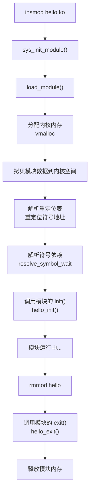
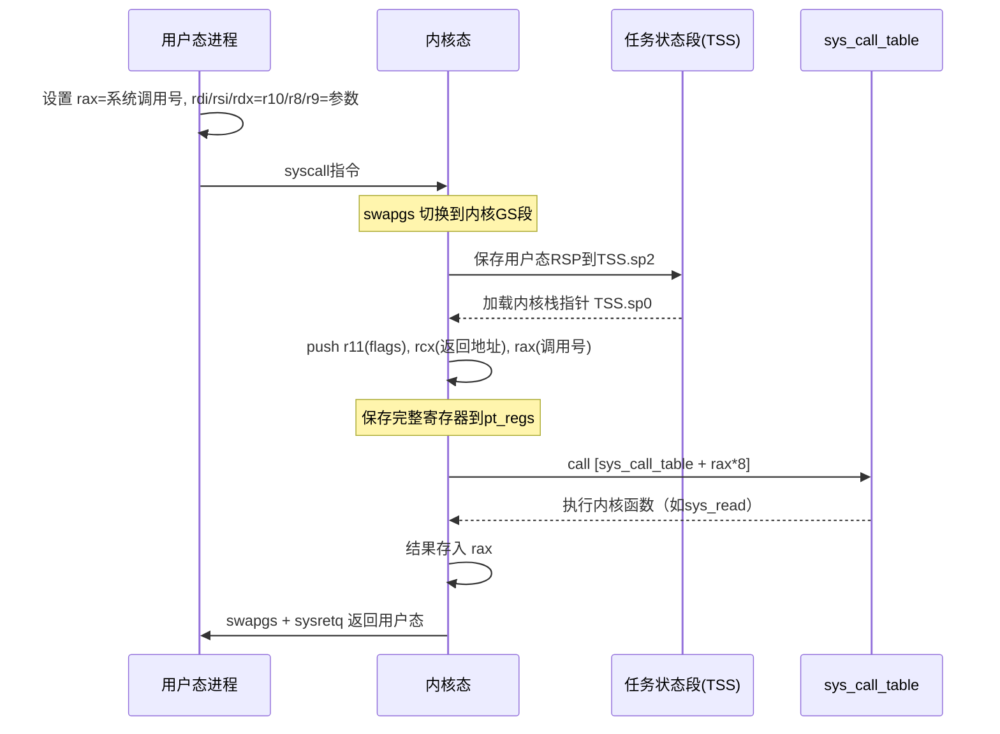
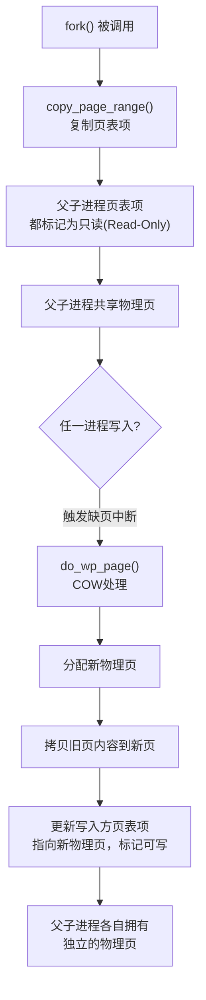
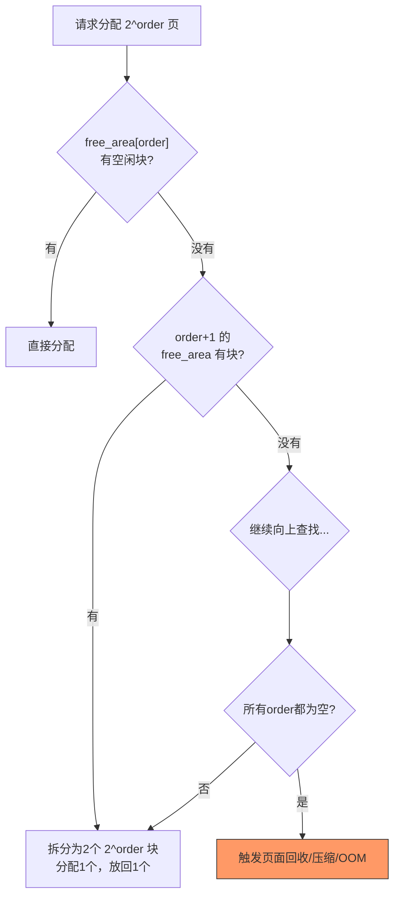
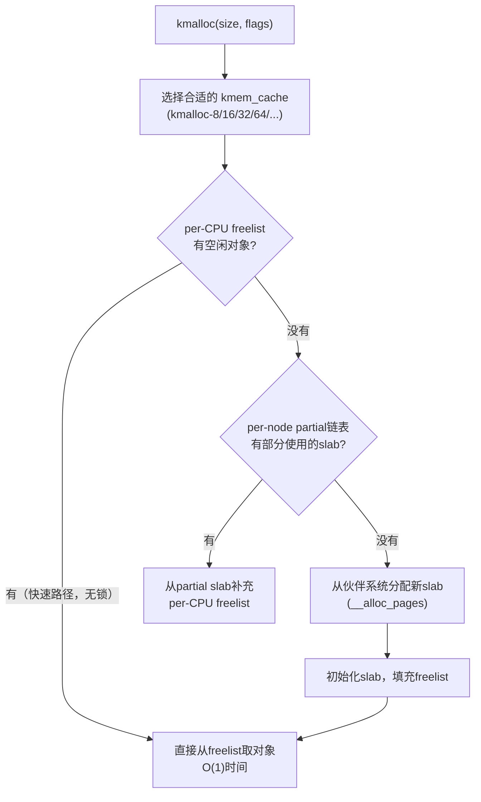
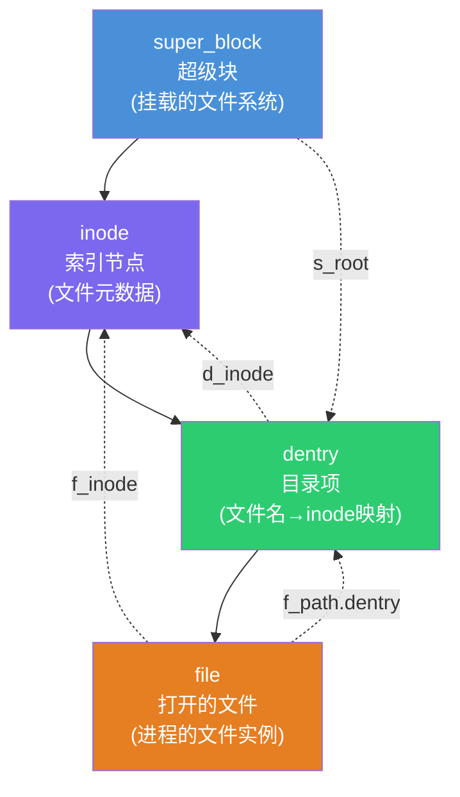
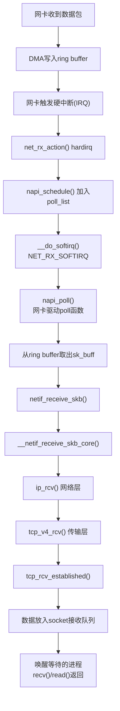
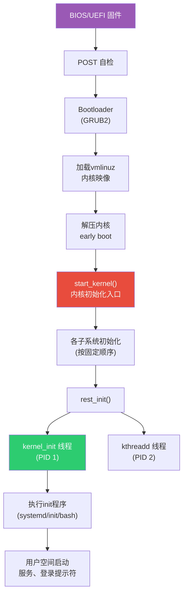
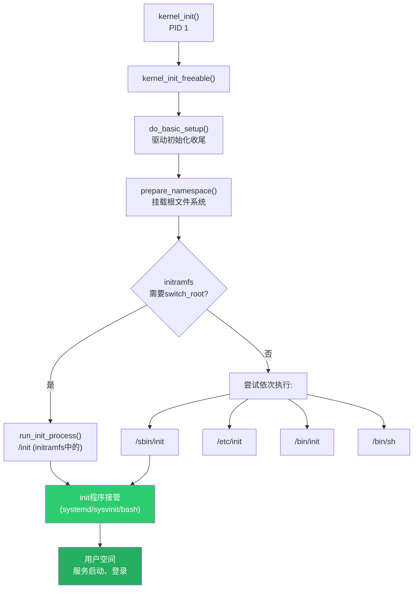

# 第08章 Linux内核源码分析

## 章节定位

Linux内核是世界上最大、最活跃的开源项目之一，代码量超过2800万行（6.x内核）。理解内核源码不仅能帮助开发者深入掌握操作系统原理，更是进行系统级编程、性能调优、驱动开发的基础。本章以Linux内核的主要子系统为线索，分析进程管理、内存管理、VFS、网络子系统、中断处理、同步原语等核心模块的实现路径，帮助读者建立对内核运行机制的完整认知。

## 核心问题

1. **系统调用如何从用户态到达内核态？** 理解syscall入口、中断描述符表、上下文切换。
2. **fork/exec/exit的内核实现路径是什么？** 追踪进程生命周期的每个关键步骤。
3. **CFS调度器如何保证公平性？** 理解vruntime、红黑树、时间片计算。
4. **内存分配的完整路径？** 从kmalloc到伙伴系统到SLUB到物理页。
5. **一个网络数据包从网卡到达用户缓冲区经历了什么？** 追踪sk_buff、NAPI、协议栈、socket的完整路径。
6. **内核如何保证并发安全？** spinlock、RCU、seqlock的适用场景与实现原理。
7. **内核从加电到第一个用户进程启动经历了什么？** 理解引导加载、初始化、init进程创建的完整流程。

## 知识图谱

Linux内核
├── 系统调用入口
│   ├── x86: syscall/sysenter指令
│   ├── ARM: SVC指令
│   └── 系统调用表（sys_call_table）
├── 进程管理
│   ├── task_struct（进程描述符）
│   ├── fork() → copy_process()
│   ├── exec() → do_execve()
│   ├── exit() → do_exit()
│   └── CFS调度器（vruntime红黑树）
├── 内存管理
│   ├── 伙伴系统（buddy system）
│   ├── SLUB分配器
│   ├── 缺页中断（page fault）
│   ├── 页表管理（PGD/PUD/PMD/PTE）
│   └── 内存映射（mmap/VMA）
├── VFS
│   ├── super_block/inode/dentry/file
│   ├── 文件操作表（file_operations）
│   └── 页缓存（page cache）
├── 网络子系统
│   ├── sk_buff（网络数据包）
│   ├── NAPI（轮询+中断混合）
│   ├── 协议栈（TCP/IP处理链）
│   └── socket层
├── 中断处理
│   ├── 上半部（hardirq）
│   ├── softirq
│   ├── tasklet
│   └── workqueue
├── 同步原语
│   ├── spinlock（自旋锁）
│   ├── mutex（互斥锁）
│   ├── RCU（读-拷贝-更新）
│   ├── seqlock（顺序锁）
│   └── 原子操作
└── 内核调试
    ├── printk
    ├── ftrace
    ├── eBPF/BCC/bpftrace
    ├── kprobes
    └── crash/kdump

## 学习路径

内核架构概览 → 编译与启动流程 → 系统调用路径 → 进程管理
    → 内存管理 → VFS → 网络子系统 → 中断与同步 → 调试工具

## 前置知识

- 第01章 CPU架构与执行模型：理解特权级、中断、上下文切换
- 第02章 内存系统：理解虚拟内存、页表、缓存层次
- 第04章 进程与线程：理解进程/线程的基本概念
- 第05章 内存管理：理解用户态内存管理机制

## 参考文献

1. Daniel P. Bovet, Marco Cesati, *Understanding the Linux Kernel*, 3rd Edition, O'Reilly, 2005
2. Robert Love, *Linux Kernel Development*, 3rd Edition, Addison-Wesley, 2010
3. Wolfgang Mauerer, *Professional Linux Kernel Architecture*, Wrox, 2008
4. Linux内核源码: https://github.com/torvalds/linux
5. LWN.net内核文章: https://lwn.net/Kernel/

---

# Linux内核源码分析 — 理论基础

## 1 Linux内核架构概览

### 1.1 宏内核（Monolithic Kernel）

Linux采用宏内核架构，内核运行在最高特权级（Ring 0），所有核心子系统（进程管理、内存管理、文件系统、网络协议栈、设备驱动）共享同一个地址空间。

┌──────────────────────────────────────────────────────┐
│                    用户空间（Ring 3）                  │
│  ┌─────────┐ ┌─────────┐ ┌─────────┐ ┌──────────┐   │
│  │  进程 A  │ │  进程 B  │ │  进程 C  │ │  glibc   │   │
│  └────┬────┘ └────┬────┘ └────┬────┘ └────┬─────┘   │
│       │           │           │            │         │
│ ══════╪═══════════╪═══════════╪════════════╪══════════│
│       │           │           │            │         │
│                    系统调用层（syscall）               │
│                      │                               │
│ ═════════════════════╪═══════════════════════════════│
│                      │                               │
│                    内核空间（Ring 0）                  │
│  ┌────────────────────────────────────────────────┐  │
│  │              系统调用处理                       │  │
│  ├──────────┬──────────┬──────────┬───────────────┤  │
│  │ 进程调度  │ 内存管理  │ VFS/文件 │  网络协议栈   │  │
│  │ CFS      │ 伙伴系统  │  系统    │  TCP/IP      │  │
│  │ SLUB     │ SLUB     │  ext4   │  sk_buff     │  │
│  ├──────────┴──────────┴──────────┴───────────────┤  │
│  │              设备驱动层                         │  │
│  ├────────────────────────────────────────────────┤  │
│  │              硬件抽象层（HAL）                   │  │
│  └────────────────────────────────────────────────┘  │
│                                                      │
└──────────────────────────────────────────────────────┘

**宏内核 vs 微内核 vs 混合内核**：

| 架构 | 代表系统 | 优点 | 缺点 |
|------|---------|------|------|
| 宏内核 | Linux、FreeBSD | 子系统直接函数调用，开销极低 | 一个模块的bug可能导致整个内核崩溃 |
| 微内核 | Minix、QNX、seL4 | 模块隔离性好，安全性高 | 消息传递开销大，IPC性能低 |
| 混合内核 | Windows NT、macOS XNU | 兼顾性能与安全性 | 设计复杂度高 |

Linux选择宏内核架构的核心原因是**性能**：子系统之间通过直接函数调用通信，没有IPC开销。同时通过可加载内核模块（LKM）机制实现了一定程度的模块化，在不牺牲性能的前提下保持了可扩展性。

### 1.2 模块机制（Loadable Kernel Modules）

Linux支持动态加载内核模块（LKM），允许在运行时扩展内核功能：

```c
// 最简单的内核模块
#include <linux/module.h>
#include <linux/kernel.h>
#include <linux/init.h>

static int __init hello_init(void) {
    printk(KERN_INFO "Hello, Kernel!\n");
    return 0;
}

static void __exit hello_exit(void) {
    printk(KERN_INFO "Goodbye, Kernel!\n");
}

module_init(hello_init);
module_exit(hello_exit);
MODULE_LICENSE("GPL");
MODULE_AUTHOR("Example");
MODULE_DESCRIPTION("A simple kernel module");
```

模块加载流程：



### 1.3 内核源码目录结构

linux/
├── arch/          # 体系结构相关代码（x86, arm64, riscv等）
│   └── x86/
│       ├── boot/          # 引导代码
│       ├── kernel/        # 体系结构相关的进程管理
│       ├── mm/            # 体系结构相关的内存管理
│       └── entry/         # 系统调用入口
├── block/         # 块设备层（I/O调度器）
├── drivers/       # 设备驱动
├── fs/            # 文件系统（VFS, ext4, btrfs等）
│   ├── ext4/
│   ├── proc/
│   ├── select.c           # select/poll实现
│   └── eventpoll.c        # epoll实现
├── include/       # 头文件
│   ├── linux/             # 内核内部头文件
│   └── uapi/              # 用户空间API头文件
├── init/          # 内核初始化（main.c）
├── io_uring/      # io_uring实现
├── kernel/        # 核心子系统
│   ├── sched/             # 调度器
│   ├── fork.c             # 进程创建
│   ├── signal.c           # 信号处理
│   └── exit.c             # 进程退出
├── lib/           # 内核库函数
├── mm/            # 内存管理
│   ├── page_alloc.c       # 伙伴系统
│   ├── slub.c             # SLUB分配器
│   ├── mmap.c             # 内存映射
│   └── filemap.c          # 页缓存
├── net/           # 网络子系统
│   ├── core/              # 核心网络框架
│   ├── ipv4/              # IPv4协议
│   ├── tcp/               # TCP协议
│   └── socket.c           # socket实现
└── tools/         # 内核工具（perf, bpf等）

**关键目录的阅读优先级**：

| 优先级 | 目录 | 原因 |
|--------|------|------|
| ★★★ | `kernel/`, `mm/` | 进程管理和内存管理是理解内核的核心 |
| ★★★ | `fs/` | VFS是理解一切I/O操作的基础 |
| ★★☆ | `net/` | 网络子系统独立且完整，适合单独学习 |
| ★★☆ | `arch/x86/entry/` | 理解系统调用和中断的入口 |
| ★☆☆ | `drivers/` | 数量巨大，按需查阅即可 |
| ★☆☆ | `block/` | I/O调度器，进阶内容 |

## 2 系统调用入口

### 2.1 x86_64系统调用路径

在x86_64架构上，系统调用通过`syscall`指令进入内核态：



用户态：
  mov rax, __NR_read    # 系统调用号
  mov rdi, fd            # 第1个参数
  mov rsi, buf           # 第2个参数
  mov rdx, count         # 第3个参数
  syscall                 # 切换到内核态

内核入口（arch/x86/entry/entry_64.S）：
  entry_SYSCALL_64:
    swapgs                 # 切换GS段寄存器（访问per-cpu数据）
    mov [cpu_tss + TSS_sp2], rsp  # 保存用户态栈
    mov rsp, [cpu_tss + TSS_sp0]  # 切换到内核栈
    
    # 保存寄存器到内核栈（pt_regs结构）
    push r11   # 保存RFLAGS
    push rcx   # 保存返回地址
    push rax   # 系统调用号
    
    # 查系统调用表
    call [sys_call_table + rax * 8]
    
    # 返回用户态
    swapgs
    sysretq

### 2.2 系统调用表

```c
// arch/x86/entry/syscalls/syscall_64.tbl
// 系统调用号 → 内核函数映射
0   common  read            sys_read
1   common  write           sys_write
2   common  open            sys_open
3   common  close           sys_close
// ...
56  common  clone           sys_clone
57  common  fork            sys_fork
59  common  execve          sys_execve
60  common  exit            sys_exit
61  common  wait4           sys_wait4
// ...
232 common  epoll_wait      sys_epoll_wait
291 common  epoll_create1   sys_epoll_create1
425 common  io_uring_setup  sys_io_uring_setup
426 common  io_uring_enter  sys_io_uring_enter
427 common  io_uring_register sys_io_uring_register
```

### 2.3 系统调用参数传递

x86_64下，系统调用参数通过寄存器传递：

| 参数 | 寄存器 | 示例（read） |
|------|--------|-------------|
| 系统调用号 | rax | __NR_read = 0 |
| 参数1 | rdi | fd |
| 参数2 | rsi | buf |
| 参数3 | rdx | count |
| 参数4 | r10 | （unused） |
| 参数5 | r8 | （unused） |
| 参数6 | r9 | （unused） |
| 返回值 | rax | 读取字节数 |

### 2.4 32位兼容模式

现代x86_64内核仍然支持32位程序。32位应用使用`int 0x80`或`sysenter`指令进入内核，走的是`entry_SYSCALL_compat_64`入口。内核通过`compat_sys_*`系列函数处理32位系统调用，完成参数的32位→64位转换。这就是为什么你在`syscall_64.tbl`中会看到`compat`标记的系统调用：

```bash
# 查看32位系统调用表
cat /arch/x86/entry/syscalls/syscall_32.tbl
```

## 3 进程管理

### 3.1 task_struct

`task_struct`是Linux内核中描述进程/线程的核心数据结构，包含进程的所有信息。在6.x内核中，一个`task_struct`约占用6-8KB内存：

```c
// include/linux/sched.h（简化版）
struct task_struct {
    // === 基本信息 ===
    volatile long state;          // 进程状态（RUNNING/SLEEPING/ZOMBIE等）
    int __state;                  // 6.x内核中取代volatile long state
    pid_t pid;                    // 进程ID
    pid_t tgid;                   // 线程组ID（= 主线程pid）
    char comm[TASK_COMM_LEN];    // 进程名（最长16字符）
    
    // === 调度相关 ===
    int prio;                     // 动态优先级
    int static_prio;              // 静态优先级
    unsigned int policy;          // 调度策略（SCHED_NORMAL/SCHED_FIFO等）
    struct sched_entity se;       // CFS调度实体（包含vruntime）
    
    // === 内存管理 ===
    struct mm_struct *mm;         // 用户空间内存描述符
    struct mm_struct *active_mm;  // 内核线程使用
    
    // === 文件系统 ===
    struct fs_struct *fs;         // 文件系统信息（当前目录等）
    struct files_struct *files;   // 打开的文件描述符表
    
    // === 信号 ===
    struct signal_struct *signal;
    struct sighand_struct *sighand;
    sigset_t blocked;
    
    // === 进程关系 ===
    struct task_struct *real_parent;  // 真实父进程
    struct task_struct *parent;       // 养父进程（ptrace时）
    struct list_head children;        // 子进程链表
    struct list_head sibling;         // 兄弟进程链表
    
    // === 内核栈 ===
    void *stack;                      // 内核栈指针
    
    // === 上下文 ===
    struct thread_struct thread;      // CPU相关上下文（寄存器等）
};
```

**查看task_struct**的方法：

```bash
# 通过/proc查看进程信息
cat /proc/1/status | head -20
# Name:   systemd
# State:  S (sleeping)
# TgPid:  1
# ...

# 通过crash工具查看（需要内核调试符号）
crash> struct task_struct.pid 0xffff...
# pid = 1
```

### 3.2 fork()的内核实现

`fork()`的调用链：

sys_fork()
  → kernel_clone()
    → copy_process()
      ├── dup_task_struct()         // 复制task_struct
      ├── copy_creds()              // 复制凭证
      ├── copy_mm()                 // 复制内存空间（COW）
      ├── copy_files()              // 复制文件描述符表
      ├── copy_fs()                 // 复制文件系统信息
      ├── copy_sighand()            // 复制信号处理
      ├── copy_signal()             // 复制信号状态
      ├── copy_namespaces()         // 复制命名空间
      ├── sched_fork()              // 初始化调度相关
      │   └── 设置子进程vruntime
      ├── alloc_pid()               // 分配PID
      └── 复制其他资源
    → wake_up_new_task()            // 唤醒子进程

**关键实现：copy-on-write（COW）**

```c
// kernel/fork.c
static int copy_mm(unsigned long clone_flags, struct task_struct *tsk) {
    struct mm_struct *mm;
    
    if (clone_flags &amp; CLONE_VM) {
        // 线程：共享地址空间
        mmget(current->mm);
        tsk->mm = current->mm;
        return 0;
    }
    
    // fork：复制地址空间（COW）
    mm = dup_mm(tsk, current->mm);
    // dup_mm → dup_mmap → copy_page_range
    // copy_page_range不复制物理页，只复制页表项并标记为只读
    tsk->mm = mm;
    return 0;
}
```

COW的工作原理：



关键点：
1. fork时，父子进程共享物理页，页表项标记为只读
2. 当任一进程尝试写入时，触发缺页中断
3. 缺页处理函数检测到COW，分配新物理页，拷贝数据，更新页表
4. 大量fork场景（如Web服务器）使用`vfork()`或`clone(CLONE_VM)`避免COW开销

### 3.3 exec()的内核实现

sys_execve()
  → do_execveat_common()
    → alloc_bprm()               // 分配linux_binprm结构
    → open_exec()                 // 打开可执行文件
    → bprm_mm_init()             // 初始化新的mm_struct
    → exec_binprm()
      → search_binary_handler()  // 查找合适的二进制格式处理程序
        → load_elf_binary()      // ELF格式处理
          ├── 读取ELF头和程序头表
          ├── 设置新的mm_struct
          ├── 遍历PT_LOAD段，建立VMA映射
          ├── 设置brk区域（堆）
          ├── 设置栈空间
          ├── 创建辅助向量（auxv）
          └── 设置入口点（e_entry）
    → 设置返回用户态时的寄存器（rip=e_entry, rsp=用户栈顶）

**ELF加载过程详解**：

```c
// fs/binfmt_elf.c（简化）
static int load_elf_binary(struct linux_binprm *bprm) {
    // 1. 读取ELF头
    elf_ex = (struct elfhdr *)bprm->buf;
    
    // 2. 验证ELF魔术数
    if (memcmp(elf_ex->e_ident, ELFMAG, SELFMAG) != 0)
        goto out;
    
    // 3. 遍历程序头表
    for (i = 0; i < elf_ex->e_phnum; i++) {
        struct elf_phdr *elf_ppnt = ...;
        
        switch (elf_ppnt->p_type) {
        case PT_LOAD:
            // 建立VMA映射（代码段、数据段）
            error = create_elf_tables(bprm, elf_ex, ...);
            break;
        case PT_INTERP:
            // 动态链接器路径（如/lib64/ld-linux-x86-64.so.2）
            break;
        }
    }
    
    // 4. 设置用户态入口点
    regs->ip = elf_ex->e_entry;  // 程序入口地址
    regs->sp = stack_top;         // 用户栈顶
    
    return 0;
}
```

### 3.4 exit()的内核实现

sys_exit()
  → do_exit()
    ├── exit_mm()                 // 释放mm_struct（如果是最后一个线程）
    ├── exit_sem()                // 释放信号量
    ├── exit_files()              // 关闭文件描述符
    ├── exit_fs()                 // 释放fs_struct
    ├── exit_notify()             // 通知父进程
    │   ├── 如果父进程在wait：发送SIGCHLD，唤醒父进程
    │   └── 如果父进程不在wait：将子进程交给init进程
    ├── task状态设为TASK_DEAD
    └── schedule()                // 最后一次调度，不再返回
        └── __put_task_struct()   // 释放task_struct

**僵尸进程的产生与处理**：

子进程退出后，`do_exit()`不会立即释放`task_struct`，而是保留它（此时为`TASK_ZOMBIE`状态），等待父进程通过`wait()`/`waitpid()`获取退出状态。如果父进程不调用wait，僵尸进程就会一直存在。这就是为什么我们要避免僵尸进程：它占用PID资源（PID有上限，通过`/proc/sys/kernel/pid_max`配置，通常为32768）。

```c
// 父进程正确处理子进程退出
int status;
pid_t pid;
while ((pid = waitpid(-1, &amp;status, WNOHANG)) > 0) {
    // 子进程已退出，status包含退出信息
    if (WIFEXITED(status))
        printf("child exited with %d\n", WEXITSTATUS(status));
}
```

### 3.5 CFS调度器

CFS（Completely Fair Scheduler）是Linux默认的进程调度器（`SCHED_NORMAL`策略）。

**核心思想**：通过虚拟运行时间（vruntime）衡量进程的公平性，总是选择vruntime最小的进程运行。

```c
// kernel/sched/fair.c（简化）
struct sched_entity {
    struct rb_node run_node;     // 红黑树节点
    u64 vruntime;                // 虚拟运行时间
    u64 sum_exec_runtime;        // 实际运行时间总计
    // ...
};

// 更新vruntime
static void update_curr(struct cfs_rq *cfs_rq) {
    struct sched_entity *curr = cfs_rq->curr;
    u64 now = rq_clock_task(rq);
    u64 delta_exec = now - curr->exec_start;
    
    curr->sum_exec_runtime += delta_exec;
    // vruntime = 实际时间 × NICE_0_LOAD / 进程权重
    curr->vruntime += calc_delta_fair(delta_exec, curr);
    
    curr->exec_start = now;
}
```

**vruntime计算**：

vruntime增长速率 = 实际时间 × NICE_0_LOAD / 进程权重

nice值越低（优先级越高），权重越大，vruntime增长越慢
→ 高优先级进程的vruntime总是更小 → 总是被优先选中

nice值映射（部分）：
  nice -20 → 权重 88761 → vruntime增长最慢
  nice   0 → 权重 1024  → vruntime增长正常
  nice +19 → 权重 15    → vruntime增长最快

**调度器运行**：

```c
// 选择下一个进程
static struct sched_entity *pick_next_entity(struct cfs_rq *cfs_rq) {
    // 红黑树最左节点 = vruntime最小的进程
    struct rb_node *left = rb_first_cached(&amp;cfs_rq->tasks_timeline);
    return rb_entry(left, struct sched_entity, run_node);
}

// 主调度函数
static void __schedule(unsigned int sched_mode) {
    struct task_struct *prev = rq->curr;
    struct task_struct *next = pick_next_task(rq);
    
    if (prev != next) {
        context_switch(rq, prev, next);
        // 切换页表（mm_switch）
        // 切换寄存器（switch_to）
    }
}
```

**CFS红黑树**：

         ┌──────────────┐
         │ se(vruntime=50)│
         └──────┬───────┘
            ┌───┴───┐
     ┌──────┤       ├──────┐
     │      │       │      │
  ┌──┴──┐ ┌─┴──┐ ┌──┴──┐ ┌┴───┐
  │ vr=30│ │vr=45│ │vr=60│ │vr=80│
  └─────┘ └────┘ └─────┘ └────┘
  
  pick_next_entity() → 返回vruntime=30的节点

**调度时机**：CFS在以下情况下触发调度：
1. 当前进程时间片用完（通过`scheduler_tick()`更新vruntime）
2. 当前进程主动让出CPU（调用`sched_yield()`）
3. 当前进程阻塞（等待I/O、锁等）
4. 被更高优先级进程抢占（如实时进程唤醒）
5. 当前进程调用`schedule()`（主动调度）

## 4 内存管理

### 4.1 伙伴系统（Buddy System）

伙伴系统是内核物理页分配的基础，管理以2^n页为单位的连续物理内存：

```c
// mm/page_alloc.c（简化）
// 空闲链表：free_area[0]管理2^0=1页，free_area[1]管理2^1=2页...
struct zone {
    struct free_area free_area[MAX_ORDER];  // MAX_ORDER通常为11
};

struct free_area {
    struct list_head free_list[MIGRATE_TYPES];  // 按迁移类型分链表
    unsigned long nr_free;                       // 空闲块数量
};

// 分配2^order个连续物理页
struct page *alloc_pages(gfp_t gfp_mask, unsigned int order) {
    struct page *page;
    
    // 1. 在目标zone的free_area[order]中查找空闲块
    page = __alloc_pages(gfp_mask, order, preferred_zone, ...);
    
    if (!page &amp;&amp; order > 0) {
        // 2. 如果没有，尝试从更大的order拆分
        // 比如分配2页失败，从free_area[2]（4页块）中拆出2页
        page = __alloc_pages_slowpath(gfp_mask, order, ...);
    }
    
    return page;
}
```

**分配与合并过程**：



请求分配2页（order=1）
  ├── 检查free_area[1] → 有空闲 → 直接分配
  └── free_area[1]为空 → 检查free_area[2]
      ├── free_area[2]有空闲块（4页）
      │   → 拆分为2个2页块
      │   → 分配1个，另一个放回free_area[1]
      └── free_area[2]也为空 → 继续向上查找...
          → 如果所有order都为空 → 触发页面回收/OOM

释放2页（order=1）
  ├── 检查伙伴块是否空闲
  ├── 如果伙伴空闲 → 合并为4页，放入free_area[2]
  │   └── 继续检查更高order的伙伴...
  └── 如果伙伴不空闲 → 直接放入free_area[1]

**"伙伴"的含义**：两个物理地址连续、大小相同的块互为伙伴。释放时，伙伴系统会自动合并相邻的伙伴块为更大的块。这就是为什么释放内存后，碎片会逐渐减少。

### 4.2 SLUB分配器

SLUB是内核中小对象（< 页大小）的分配器，类似用户空间的malloc：

```c
// kmalloc → slab分配
void *kmalloc(size_t size, gfp_t flags) {
    // 根据size选择合适的kmalloc缓存
    // kmalloc-8, kmalloc-16, ..., kmalloc-8k
    struct kmem_cache *s = kmalloc_slab(size, flags);
    return slab_alloc(s, flags, _RET_IP_);
}

// SLUB的核心结构
struct kmem_cache {
    const char *name;          // 缓存名称（如"task_struct"）
    unsigned int size;         // 对象大小
    unsigned int object_size;  // 实际对象大小
    struct kmem_cache_cpu __percpu *cpu_slab;  // per-CPU缓存
    struct kmem_cache_node *node[MAX_NUMNODES]; // per-node链表
};

// per-CPU快速路径（无锁）
static __always_inline void *slab_alloc(struct kmem_cache *s,
                                         gfp_t gfpflags,
                                         unsigned long addr) {
    void *object;
    struct kmem_cache_cpu *c;
    
    // 获取当前CPU的slab
    c = raw_cpu_ptr(s->cpu_slab);
    
    if (likely(c->freelist)) {
        // 快速路径：freelist非空，直接分配
        object = c->freelist;
        c->freelist = next_free_object(s, object);
        return object;
    }
    
    // 慢速路径：freelist为空，从partial链表或新slab获取
    return __slab_alloc(s, gfpflags, addr);
}
```

**SLUB分配器的三层缓存结构**：



**查看SLUB信息**：

```bash
# 查看所有slab缓存
slabtop

# 查看特定缓存信息
cat /proc/slabinfo | grep task_struct

# 查看kmalloc缓存
cat /proc/slabinfo | grep kmalloc
```

### 4.3 缺页中断

当CPU访问的虚拟地址没有对应的物理页映射时，触发缺页中断：

```c
// arch/x86/mm/fault.c
DEFINE_IDTENTRY_RAW_ERRORCODE(exc_page_fault) {
    unsigned long address = read_cr2();  // 获取触发缺页的地址
    
    // 判断是否内核态缺页
    if (user_mode(regs))
        handle_page_fault(regs, error_code, address);
    else
        // 内核态缺页可能是vmalloc区域
        vmalloc_fault(address);
}

// mm/memory.c
static vm_fault_t handle_mm_fault(struct vm_area_struct *vma,
                                   unsigned long address,
                                   unsigned int flags) {
    // 1. 检查地址是否在VMA范围内
    // 2. 如果没有页表页，分配页表页
    // 3. 如果页表项为空
    if (!vmf->pte) {
        if (vma_is_anonymous(vma))
            return do_anonymous_page(vmf);  // 匿名页（堆/栈）
        else
            return do_fault(vmf);            // 文件映射页
    }
    
    // 4. 如果页表项存在但页被换出
    if (!pte_present(vmf->pte))
        return do_swap_page(vmf);            // 从swap读回
    
    // 5. COW处理
    if (is_cow_mapping(vma->vm_flags))
        return do_wp_page(vmf);              // 复制页面
    
    // 6. 页表项存在但标记为不存在（NUMA balancing等）
    return do_numa_page(vmf);
}
```

**缺页类型**：

| 类型 | 场景 | 处理 | 性能影响 |
|------|------|------|---------|
| 次要缺页（Minor） | 匿名页首次访问 | 分配物理页，清零 | 微秒级 |
| 次要缺页 | 文件页在页缓存中 | 映射到页缓存 | 微秒级 |
| 主要缺页（Major） | 文件页不在缓存 | 从磁盘读取 | 毫秒级（SSD）/ 数十毫秒（HDD） |
| COW缺页 | fork后写入共享页 | 复制页面 | 微秒级 |
| 段错误（SIGSEGV） | 访问未映射地址 | 发送SIGSEGV信号 | 进程通常被终止 |

### 4.4 页表结构

x86_64使用四级页表（支持五级）：

虚拟地址（48位）
┌──────┬──────┬──────┬──────┬──────────┐
│ PGD  │ PUD  │ PMD  │ PTE  │ Offset   │
│ 9位  │ 9位  │ 9位  │ 9位  │ 12位     │
└──┬───┴──┬───┴──┬───┴──┬───┴────┬─────┘
   │      │      │      │        │
   ▼      ▼      ▼      ▼        │
  PGD → PUD → PMD → PTE → 物理页 │
                              4KB偏移

**页表遍历的代码路径**：

```c
// include/linux/pgtable.h
// 通过虚拟地址查找PTE
static inline pte_t *pte_offset_kernel(pmd_t *pmd, unsigned long address) {
    return (pte_t *)pmd_page_vaddr(*pmd) + pte_index(address);
}

// mm/memory.c中的缺页处理需要遍历四层页表：
// pgd_offset → pud_offset → pmd_offset → pte_offset
// 如果中间任何一层页表不存在，需要分配新的页表页
```

**TLB与页表的关系**：页表存储在内存中，CPU每次内存访问都要查页表效率太低。因此CPU使用TLB（Translation Lookaside Buffer）缓存最近使用的页表映射。当页表被修改时，需要通过`invlpg`指令或`tlb flush`使TLB失效。内核中的`switch_mm()`在切换进程时会刷新TLB（PCID可以避免全局刷新）。

## 5 VFS（虚拟文件系统）

### 5.1 核心对象

VFS通过四个核心对象抽象所有文件系统：

```c
// 超级块：描述一个挂载的文件系统
struct super_block {
    struct list_head s_list;           // 全局超级块链表
    dev_t s_dev;                       // 设备号
    unsigned long s_blocksize;         // 块大小
    struct file_system_type *s_type;   // 文件系统类型
    struct super_operations *s_op;     // 超级块操作表
    struct dentry *s_root;             // 根目录项
    // ...
};

// inode：描述一个文件（元数据）
struct inode {
    umode_t i_mode;                    // 文件类型和权限
    kuid_t i_uid;                      // 所有者
    kgid_t i_gid;                      // 组
    unsigned int i_flags;
    const struct inode_operations *i_op; // inode操作表
    const struct file_operations *i_fop; // 文件操作表
    struct address_space *i_mapping;    // 页缓存映射
    loff_t i_size;                     // 文件大小
    // ...
};

// dentry：目录项（文件名到inode的映射）
struct dentry {
    struct dentry *d_parent;           // 父目录
    struct qstr d_name;                // 文件名
    struct inode *d_inode;             // 关联的inode
    const struct dentry_operations *d_op;
    struct list_head d_child;          // 父目录的子项链表
    struct list_head d_subdirs;        // 子目录链表
    // ...
};

// file：进程打开的文件实例
struct file {
    struct path f_path;                // 路径（包含dentry和vfsmount）
    struct inode *f_inode;
    const struct file_operations *f_op; // 文件操作表
    atomic_long_t f_count;             // 引用计数
    unsigned int f_flags;              // 打开标志（O_RDONLY等）
    loff_t f_pos;                      // 文件偏移
    struct address_space *f_mapping;   // 页缓存
    // ...
};
```

**四个对象的关系**：



### 5.2 read()系统调用路径

sys_read(fd, buf, count)
  → fdget(fd)                     // 从fd表获取struct file
  → vfs_read(file, buf, count, &pos)
    → file->f_op->read_iter()     // 调用具体文件系统的读函数
      ├── ext4: ext4_file_read_iter()
      │   → generic_file_read_iter()
      │     → filemap_read()
      │       ├── 在页缓存中查找
      │       ├── 如果命中：直接拷贝到用户空间
      │       └── 如果未命中：提交I/O请求，等待磁盘读取
      └── socket: sock_read_iter()
          → sk_recvmsg()
            → tcp_recvmsg()

**页缓存的关键作用**：VFS的`filemap_read()`通过页缓存（Page Cache）减少磁盘I/O。每次从磁盘读取的数据块都会缓存在内存中，后续对同一区域的读取直接从缓存返回，这是Linux文件I/O性能的核心机制。

```bash
# 查看系统页缓存使用情况
cat /proc/meminfo | grep -i cache
# Cached:          8388608 kB  （页缓存大小）
# Buffers:          524288 kB  （块设备缓冲区）

# 清除页缓存（测试性能时常用）
sync &amp;&amp; echo 3 > /proc/sys/vm/drop_caches
```

## 6 网络子系统

### 6.1 sk_buff

`sk_buff`（socket buffer）是Linux网络子系统中描述数据包的核心结构：

```c
// include/linux/skbuff.h（简化）
struct sk_buff {
    // 链表管理
    struct sk_buff *next, *prev;
    struct sock *sk;              // 所属的socket
    
    // 时间戳
    ktime_t tstamp;
    
    // 网络设备
    struct net_device *dev;
    
    // 协议头指针
    unsigned char *head;          // 缓冲区起始
    unsigned char *data;          // 数据起始
    unsigned char *tail;          // 数据结束
    unsigned char *end;           // 缓冲区结束
    unsigned int len;             // 数据长度
    
    // 协议层指针
    __u16 transport_header;       // L4（TCP/UDP）头偏移
    __u16 network_header;         // L3（IP）头偏移
    __u16 mac_header;             // L2（以太网）头偏移
    
    // 校验和
    __u16 ip_summed;
    
    // 克隆/分片标志
    __u8 cloned:1;
    __u8 nohdr:1;
    // ...
};
```

**sk_buff的内存布局**：

head                data                tail                end
│                   │                   │                   │
▼                   ▼                   ▼                   ▼
┌───────────────────┬───────────────────┬───────────────────┐
│   headroom        │     data          │     tailroom      │
│  (协议头空间)      │   (实际数据)       │  (扩展空间)        │
└───────────────────┴───────────────────┴───────────────────┘
|← headroom →|← len →|← tailroom →|

### 6.2 NAPI

NAPI（New API）是Linux网络子系统的中断+轮询混合模型：

传统模式（纯中断）：
  网卡收到数据包 → 硬中断 → 处理一个包 → 返回
  高流量时：频繁中断 → CPU被中断处理占满

NAPI模式（中断+轮询）：
  网卡收到数据包 → 硬中断
    → 禁用网卡中断
    → 将网卡加入poll_list
    → 调度softirq（NET_RX_SOFTIRQ）
    → softirq中轮询处理多个包（budget=64）
    → 处理完毕 → 重新启用网卡中断

```c
// 简化的NAPI流程
static irqreturn_t net_rx_action(int irq, void *dev_id) {
    // 硬中断：禁用中断，调度softirq
    napi_schedule(&amp;napi);
    return IRQ_HANDLED;
}

// softirq处理
static int napi_poll(struct napi_struct *napi, int budget) {
    int work = 0;
    
    // 轮询处理，最多budget个包
    while (work < budget) {
        struct sk_buff *skb = get_skb_from_ring(napi);
        if (!skb) break;
        
        // 协议栈处理
        netif_receive_skb(skb);
        work++;
    }
    
    if (work < budget) {
        // 处理完毕，重新启用中断
        napi_complete(napi);
        enable_irq(napi->irq);
    }
    
    return work;
}
```

### 6.3 网络数据包接收路径



网卡收包
  → DMA将数据包写入ring buffer
  → 网卡触发硬中断（IRQ）
  → net_rx_action()（hardirq）
    → napi_schedule() → 将napi_struct加入softirq的poll_list
  → __do_softirq()（NET_RX_SOFTIRQ）
    → net_rx_action()
      → napi_poll() → 调用网卡驱动的poll函数
        → 从ring buffer取出sk_buff
        → netif_receive_skb()
          → __netif_receive_skb_core()
            ├── ARP处理
            ├── VLAN处理
            → ip_rcv()（网络层）
              → ip_rcv_finish()
                → ip_local_deliver()（本机）
                  → tcp_v4_rcv()（传输层）
                    → tcp_rcv_established()
                      → 将数据放入socket接收队列
                      → 唤醒等待在recv/read上的进程

## 7 中断下半部

### 7.1 softirq

softirq是编译时静态注册的中断下半部处理程序，有最高的执行优先级：

```c
// include/linux/interrupt.h
enum {
    HI_SOFTIRQ = 0,      // 高优先级tasklet
    TIMER_SOFTIRQ,        // 定时器
    NET_TX_SOFTIRQ,       // 网络发送
    NET_RX_SOFTIRQ,       // 网络接收
    BLOCK_SOFTIRQ,        // 块设备
    IRQ_POLL_SOFTIRQ,     // 中断轮询
    TASKLET_SOFTIRQ,      // 普通tasklet
    SCHED_SOFTIRQ,        // 调度器
    HRTIMER_SOFTIRQ,      // 高精度定时器
    RCU_SOFTIRQ,          // RCU
};

// 注册softirq处理函数
open_softirq(NET_RX_SOFTIRQ, net_rx_action);

// 触发softirq
raise_softirq(NET_RX_SOFTIRQ);

// softirq执行（在中断返回前或ksoftirqd线程中）
static __latent_entropy void __do_softirq(void) {
    unsigned long pending = local_softirq_pending();
    
    while (pending) {
        h = softirq_vec;
        while (pending) {
            if (pending &amp; 1)
                h->action(h);  // 调用注册的处理函数
            h++;
            pending >>= 1;
        }
    }
}
```

### 7.2 tasklet

tasklet基于softirq实现，允许动态注册，但同一tasklet不会在多个CPU上并发执行：

```c
// 定义tasklet
struct tasklet_struct my_tasklet;
tasklet_init(&amp;my_tasklet, my_tasklet_func, data);

// 调度tasklet（在softirq上下文中执行）
tasklet_schedule(&amp;my_tasklet);

// tasklet处理函数（不能睡眠）
void my_tasklet_func(unsigned long data) {
    // 处理中断下半部工作
}
```

### 7.3 workqueue

workqueue在进程上下文中执行，可以睡眠：

```c
// 使用系统默认workqueue
struct work_struct my_work;
INIT_WORK(&amp;my_work, my_work_func);
schedule_work(&amp;my_work);

// 工作函数（可以睡眠）
void my_work_func(struct work_struct *work) {
    // 可以使用mutex、kmalloc(GFP_KERNEL)等可能睡眠的操作
    mutex_lock(&amp;my_mutex);
    // ... 处理
    mutex_unlock(&amp;my_mutex);
}

// 创建专用workqueue
struct workqueue_struct *my_wq = alloc_workqueue("my_wq", WQ_UNBOUND, 0);
queue_work(my_wq, &amp;my_work);
```

**三种下半部机制对比**：

| 特性 | softirq | tasklet | workqueue |
|------|---------|---------|-----------|
| 执行上下文 | 软中断 | 软中断 | 进程 |
| 能否睡眠 | 否 | 否 | 是 |
| 并发性 | 同一softirq可在多CPU并发 | 同一tasklet不会并发 | 可配置 |
| 注册方式 | 编译时静态 | 动态 | 动态 |
| 典型用途 | 网络、定时器 | 驱动程序 | 通用延迟工作 |
| 开销 | 极低 | 低 | 中等 |

## 8 同步原语

### 8.1 spinlock（自旋锁）

```c
// 忙等待，不会睡眠，适合短时间持有
DEFINE_SPINLOCK(my_lock);

spin_lock(&amp;my_lock);
// 临界区（不能睡眠，不能被同级中断打断spin_lock）
shared_variable++;
spin_unlock(&amp;my_lock);

// 带中断禁止的自旋锁
spin_lock_irqsave(&amp;my_lock, flags);
// 临界区（保护与中断处理函数共享的数据）
spin_unlock_irqrestore(&amp;my_lock, flags);
```

### 8.2 mutex（互斥锁）

```c
// 会睡眠，适合长时间持有
DEFINE_MUTEX(my_mutex);

mutex_lock(&amp;my_mutex);
// 临界区（可以睡眠）
do_something();
mutex_unlock(&amp;my_mutex);
```

### 8.3 RCU（Read-Copy-Update）

RCU是一种读无锁的同步机制，适合读多写少的场景：

```c
// 读端（无锁，极低开销）
rcu_read_lock();
p = rcu_dereference(global_ptr);
// 使用p（不能睡眠）
do_something(p);
rcu_read_unlock();

// 写端
new = kmalloc(sizeof(*new), GFP_KERNEL);
*new = *old;           // 复制
new->field = new_value; // 修改
rcu_assign_pointer(global_ptr, new); // 发布新版本
synchronize_rcu();     // 等待所有读者完成
kfree(old);            // 释放旧版本
```

**RCU核心原理**：
- 读者通过`rcu_read_lock()/rcu_read_unlock()`标记临界区
- 写者修改数据时先复制一份（Copy），更新指针（Update）
- 写者调用`synchronize_rcu()`等待所有已有读者完成
- 之后安全释放旧数据（Read期间读者看到的是旧版本）

**适用场景**：路由表、文件系统dentry缓存、模块引用计数

### 8.4 seqlock（顺序锁）

seqlock适合读多写少、读者需要看到一致数据的场景：

```c
// 写者
write_seqlock(&amp;my_seqlock);
// 更新数据
data.a = new_a;
data.b = new_b;
write_sequnlock(&amp;my_seqlock);

// 读者（可能需要重试）
unsigned int seq;
do {
    seq = read_seqbegin(&amp;my_seqlock);
    a = data.a;
    b = data.b;
} while (read_seqretry(&amp;my_seqlock, seq));
// 保证读到的a和b是一致的
```

### 8.5 同步原语选择指南

| 场景 | 推荐机制 | 原因 |
|------|---------|------|
| 保护短临界区（< 1μs） | spinlock | 忙等待比上下文切换快 |
| 保护长临界区或可能睡眠的操作 | mutex | 睡眠让出CPU，避免忙等浪费 |
| 读远多于写（路由表、配置表） | RCU | 读端零开销 |
| 读需要看到原子快照 | seqlock | 读者不阻塞，写者不等待 |
| 单CPU中断处理 | spin_lock_irq | 禁止本地中断 |
| 多CPU中断处理 | spin_lock_irqsave | 禁止本地中断并保存状态 |

## 9 内核调试

### 9.1 printk

```c
// 内核日志级别
printk(KERN_EMERG   "emergency\n");   // 0 - 系统不可用
printk(KERN_ALERT   "alert\n");       // 1 - 需要立即处理
printk(KERN_CRIT    "critical\n");    // 2 - 临界条件
printk(KERN_ERR     "error\n");       // 3 - 错误
printk(KERN_WARNING "warning\n");     // 4 - 警告
printk(KERN_NOTICE  "notice\n");      // 5 - 正常但重要
printk(KERN_INFO    "info\n");        // 6 - 信息
printk(KERN_DEBUG   "debug\n");       // 7 - 调试
```

### 9.2 ftrace

```bash
# 查看可用的追踪器
cat /sys/kernel/debug/tracing/available_tracers
# function function_graph nop

# 函数调用图追踪
echo function_graph > /sys/kernel/debug/tracing/current_tracer
echo 1 > /sys/kernel/debug/tracing/tracing_on
cat /sys/kernel/debug/tracing/trace_pipe

# 追踪特定函数
echo do_sys_open > /sys/kernel/debug/tracing/set_ftrace_filter
```

### 9.3 eBPF/BCC/bpftrace

```bash
# bpftrace一行脚本追踪open syscall
bpftrace -e 'tracepoint:syscalls:sys_enter_openat { printf("%s %s\n", comm, str(args->filename)); }'

# 追踪块设备I/O延迟
bpftrace -e 'tracepoint:block:block_rq_complete { @usecs = hist(args->nr_sector); }'

# 使用BCC工具
execsnoop        # 追踪新进程创建
opensnoop        # 追踪文件打开
tcpconnect       # 追踪TCP连接
biolatency       # 块I/O延迟分布
```

### 9.4 kprobes

```c
// 动态探针：在内核任意函数入口/返回处插入探针
#include <linux/kprobes.h>

static struct kprobe kp = {
    .symbol_name = "do_sys_open",
};

static int handler_pre(struct kprobe *p, struct pt_regs *regs) {
    // regs->di = 第1个参数（dfd）
    // regs->si = 第2个参数（filename）
    printk("do_sys_open called: filename=%s\n", (char *)regs->si);
    return 0;
}

// 注册探针
kp.pre_handler = handler_pre;
register_kprobe(&amp;kp);
```

### 9.5 crash工具与kdump

当内核崩溃时（oops或panic），kdump可以捕获crash dump，之后使用crash工具进行事后分析：

```bash
# 配置kdump（需要安装kexec-tools）
# Debian/Ubuntu
apt install kexec-tools linux-crashdump

# 查看kdump是否启用
cat /sys/kernel/kexec_crash_loaded
# 1 = 已加载

# 模拟一次crash（生产环境慎用！）
echo c > /proc/sysrq-trigger

# 使用crash分析dump文件
crash /usr/lib/debug/boot/vmlinux-$(uname -r) /var/crash/*/vmcore

# crash常用命令
crash> bt          # 查看崩溃时的调用栈
crash> log         # 查看内核日志
crash> ps          # 查看进程列表
crash> struct task_struct.pid <地址>  # 查看结构体字段
crash> kmem -i     # 查看内存使用
crash> files       # 查看打开的文件
```

---

# Linux内核启动流程

## 10.1 启动阶段概览

从按下电源键到出现登录提示符，Linux系统经历了一个复杂的启动流程。理解这个流程有助于理解内核的初始化顺序和各子系统的依赖关系。



### BIOS/UEFI阶段

- **BIOS（传统）**：执行POST（Power-On Self-Test），初始化硬件，根据启动设备顺序加载MBR（主引导记录），然后将控制权交给bootloader。
- **UEFI（现代）**：读取EFI系统分区中的bootloader（如`grubx64.efi`），直接从GPT分区表定位启动分区。

### Bootloader阶段

GRUB2是Linux最常用的bootloader，它完成以下工作：
1. 显示启动菜单（`/boot/grub/grub.cfg`）
2. 加载内核映像（`vmlinuz`）和initrd/initramfs到内存
3. 设置内核命令行参数（如`root=/dev/sda1 console=tty0`）
4. 跳转到内核入口点

```bash
# 查看当前内核命令行参数
cat /proc/cmdline
# root=UUID=xxxx ro quiet splash

# 查看GRUB配置
cat /boot/grub/grub.cfg | grep menuentry
```

### initrd/initramfs的作用

initramfs是一个小型的内存文件系统，在内核启动早期被挂载为根文件系统。它的作用是：
1. 加载必要的驱动模块（如存储控制器、文件系统驱动）
2. 解密LUKS加密分区（如果根文件系统被加密）
3. 激活LVM逻辑卷
4. 挂载真正的根文件系统
5. 执行`switch_root`切换到真正的根文件系统

```bash
# 查看initramfs中包含的模块
lsinitramfs /boot/initrd.img-$(uname -r) | head -20

# 解压initramfs查看内容
mkdir /tmp/initrd &amp;&amp; cd /tmp/initrd
unmkinitramfs /boot/initrd.img-$(uname -r) .
ls early/
ls main/
```

## 10.2 start_kernel() 初始化

`start_kernel()`是内核C语言层面的入口点（在`init/main.c`中定义），它按照固定顺序初始化各个子系统：

```c
// init/main.c（简化）
asmlinkage __visible void __init __no_sanitize_address start_kernel(void)
{
    // 1. 最早期的初始化
    set_task_stack_end_magic(&amp;init_task);  // 设置init进程的栈魔数
    local_irq_disable();                    // 关闭本地中断
    
    // 2. 架构相关初始化
    setup_arch(&amp;command_line);              // 解析命令行参数，初始化内存布局
    mm_core_init();                         // 初始化内存管理子系统
    
    // 3. 核心子系统初始化
    sched_init();           // 初始化调度器（CFS）
    init_IRQ();             // 初始化中断处理
    time_init();            // 初始化时钟源
    local_irq_enable();     // 重新打开本地中断
    
    // 4. 内存分配器初始化
    kmem_cache_init();      // 初始化SLUB分配器
    vfs_caches_init();      // 初始化VFS（inode cache、dentry cache）
    signals_init();         // 初始化信号队列
    
    // 5. 控制台初始化（此后printk才真正输出到屏幕）
    console_init();
    
    // 6. 各驱动初始化（按.initcall段顺序）
    do_initcalls();
    
    // 7. 创建内核线程并进入idle
    arch_call_rest_init();
}
```

**do_initcalls()的机制**：

内核使用`__initcall`宏将初始化函数放入特殊的ELF段（`.initcall.init`），`do_initcalls()`按优先级顺序依次调用它们：

```c
// include/linux/init.h
#define early_initcall(fn)      __define_initcall(fn, 1)
#define core_initcall(fn)       __define_initcall(fn, 2)
#define subsys_initcall(fn)     __define_initcall(fn, 4)
#define fs_initcall(fn)         __define_initcall(fn, 5)
#define device_initcall(fn)     __define_initcall(fn, 6)  // = module_init()
#define late_initcall(fn)       __define_initcall(fn, 7)

// 查看系统中各initcall级别的数量
grep -c "initcall" /boot/System.map-$(uname -r)
```

## 10.3 rest_init 与 init 进程

`start_kernel()`的最后调用`rest_init()`，创建两个关键内核线程：

```c
// init/main.c
static noinline void __ref rest_init(void)
{
    // 创建kernel_init线程 → PID 1（init进程的前身）
    pid = kernel_thread(kernel_init, NULL, CLONE_FS);
    
    // 创建kthreadd线程 → PID 2（所有内核线程的父线程）
    pid = kernel_thread(kthreadd, NULL, CLONE_FS | CLONE_FILES);
    
    // 当前函数退化为idle线程（PID 0）
    cpu_startup_entry(CPUHP_ONLINE);
}
```

**kernel_init()的执行路径**：



```c
// init/main.c
static int __ref kernel_init(void *unused)
{
    // 等待kthreadd创建完毕
    wait_for_completion(&amp;kthreadd_done);
    
    kernel_init_freeable();
    
    // 如果没有找到init程序，panic
    if (!run_init_process("/sbin/init") ||
        !run_init_process("/etc/init") ||
        !run_init_process("/bin/init") ||
        !run_init_process("/bin/sh"))
            return -1;
    
    return 0;  // 不会到达这里（init程序会替代当前进程）
}
```

**PID 0/1/2的职责**：

| PID | 名称 | 类型 | 职责 |
|-----|------|------|------|
| 0 | swapper/idle | 内核线程 | CPU空闲时执行，处理低功耗状态（hlt/mwait） |
| 1 | init/systemd | 用户进程 | 所有用户进程的祖先，收养孤儿进程，管理系统服务 |
| 2 | kthreadd | 内核线程 | 所有内核线程的父线程，响应内核线程创建请求 |

```bash
# 验证PID 0/1/2
ps aux | head -3
# USER  PID %CPU %MEM COMMAND
# root    0  0.0  0.0 [swapper/0]
# root    1  0.0  0.1 /sbin/init
# root    2  0.0  0.0 [kthreadd]
```

---

# 如何阅读内核源码

## 11.1 工具链

阅读2800万行的内核源码，没有工具辅助是不现实的。以下是最实用的内核源码阅读工具：

### cscope/ctags — 代码导航双剑

```bash
# 在内核源码目录生成索引
cd /path/to/linux
# 方法1：使用内核自带脚本（推荐）
make cscope tags

# 方法2：手动创建
find . -name '*.c' -o -name '*.h' | ctags -L - --fields=+lKs --extras=+q

# cscope交互模式导航
cscope -dR
# 常用查询：
# 0: 查找符号（函数、变量定义）
# 1: 查找函数定义（追踪内核实现路径）
# 2: 查找调用此函数的地方（理解函数的使用者）
# 3: 查找调用此函数的函数
# 6: 查找包含此字符串的文件

# vim中使用cscope
vim -t sys_read    # 直接跳转到sys_read定义
:cs find g do_exit  # 查找do_exit的定义
:cs find c do_exit  # 查找调用do_exit的地方
:cs find t mm_struct # 查找mm_struct的定义和引用
```

### LXR（Linux Cross Reference）— 在线源码浏览

LXR提供交叉引用的Web界面，支持函数定义/引用的超链接跳转：

```bash
# 使用官方镜像
# https://elixir.bootlin.com/linux/latest/source

# 常用网站
# bootlin Elixir: https://elixir.bootlin.com/
# https://lxr.linux.no/ （官方）
# https://android.googlesource.com/kernel/ （Android内核）
```

**bootlin Elixir的实用功能**：
- 点击任意函数名，自动跳转到定义或列出所有引用
- 支持多版本内核对比（v5.10 vs v6.1的函数签名变化）
- 搜索符号时显示定义位置、调用者、被调用者

### source-insight / vscode — IDE辅助

```bash
# VSCode + clangd（推荐组合）
# 1. 安装clangd扩展
# 2. 生成compile_commands.json
cd /path/to/linux
make compile_commands.json

# 3. 用VSCode打开内核源码目录
code .

# 现在可以：
# - Ctrl+点击跳转到函数定义
# - Ctrl+Shift+F 全局搜索
# - 悬停显示函数签名和注释
# - 自动补全内核API
```

## 11.2 源码阅读模式

### 从调用链入手

内核代码的逻辑往往隐藏在层层函数调用中。最有效的阅读方式是**从上到下追踪一条完整路径**，而不是试图从头到尾通读一个文件。

例如，理解一个`read()`调用的完整路径：

用户调用 read(fd, buf, count)
  → 查看sys_read()定义        # fs/read_write.c
    → vfs_read()
      → file->f_op->read_iter() # 找到ext4的实现
        → ext4_file_read_iter() # fs/ext4/file.c
          → generic_file_read_iter()  # mm/filemap.c
            → filemap_read()
              → 在页缓存中查找/触发I/O

每追一层，你只需关注这一层的输入参数和输出结果，不需要一次性理解所有代码。

### 从数据结构入手

内核中最重要的数据结构往往是理解子系统的钥匙。掌握一个数据结构，就能理解一整个子系统：

| 数据结构 | 所在子系统 | 理解它就能理解 |
|---------|-----------|--------------|
| `task_struct` | 进程管理 | 进程的所有属性和生命周期 |
| `mm_struct` | 内存管理 | 进程的虚拟地址空间布局 |
| `sk_buff` | 网络 | 数据包从网卡到应用的全生命周期 |
| `super_block`/`inode`/`dentry` | VFS | 文件系统的核心抽象层次 |
| `page`/`folio` | 内存 | 物理页面的管理方式 |

### 关注关键路径而非细节

初学者最常见的错误是试图理解每一行代码。内核中大量的代码是边界条件处理、错误恢复、特殊架构适配等。高效阅读的关键是**先理解主路径**：

1. 找到函数的核心逻辑（通常是`if/else`的主分支）
2. 跳过错误处理路径（`goto out;`、`return -EINVAL;`）
3. 跳过`#ifdef`条件编译的架构特定代码
4. 关注数据流的方向（数据从哪里来，到哪里去）

## 11.3 高效阅读策略

**策略一：带着问题阅读**

不要漫无目的地浏览源码。先提出具体的问题，然后有针对性地查找答案：

- "fork时内存是如何复制的？" → 追踪`copy_mm()` → `dup_mmap()`
- "epoll和select有什么不同？" → 对比`select.c`和`eventpoll.c`的实现
- "一个TCP连接建立需要哪些锁？" → 追踪`tcp_v4_connect()`

**策略二：利用文档注释**

内核源码中有大量有价值的文档注释，特别是文件头部的注释（通常解释该文件的整体设计）：

```c
/*
 * mm/mmap.c - virtual memory management
 *
 * Copyright (c) 1995-2020, Linus Torvalds
 *
 * This file contains the routines for creating and removing
 * virtual memory mappings.
 */
```

此外，内核还在`Documentation/`目录中维护了大量设计文档：

```bash
# 内核文档目录
ls Documentation/
# admin-guide/    — 管理员指南
# devicetree/     — 设备树
# filesystems/    — 文件系统设计文档
# networking/     — 网络子系统设计文档
# scheduler/      — 调度器设计文档（重要！）
# vfs/            — VFS设计文档（重要！）

# 查看CFS调度器的设计文档
cat Documentation/scheduler/sched-design-CFS.rst
```

**策略三：使用git blame和历史**

git历史中保存了每次代码修改的原因，这是理解"为什么这样实现"的宝贵资料：

```bash
# 查看某行代码是谁在什么情况下修改的
git blame mm/mmap.c | head -50

# 查看某个函数的修改历史
git log --follow -p -- mm/mmap.c | grep -A 20 "dup_mmap"

# 搜索commit message中的关键词
git log --all --oneline --grep="mmap" -- mm/mmap.c
```

---

# 内核编译与配置

## 12.1 配置内核

内核配置决定了哪些功能被编译进内核、哪些作为模块、哪些不编译。正确的配置直接影响系统性能和功能。

### 快速开始

```bash
# 获取内核源码
git clone --depth 1 https://github.com/torvalds/linux.git
cd linux

# 基于当前系统配置（最安全的起点）
cp /boot/config-$(uname -r) .config
make olddefconfig

# 最小化配置（适合嵌入式/学习内核结构）
make defconfig

# 交互式配置
make menuconfig
```

### menuconfig 关键选项

General setup
  └── Initramfs/compressed filesystem support  # initramfs支持

Processor type and features
  └── Processor family (Core 2/newer Xeon)     # CPU类型
  └── Support for extended (non-PC) x86 platforms

Device Drivers
  └── SCSI device support                      # 存储驱动
  └── Network device support                   # 网卡驱动
  └── Graphics support                         # 显卡驱动

Kernel hacking
  └── Compile-time checks and compiler options
      └── Kernel debugging (CONFIG_DEBUG_INFO)  # 调试信息
  └── Tracers (CONFIG_FTRACE)                   # ftrace支持
  └── Enable kprobes (CONFIG_KPROBES)           # kprobes支持

### 配置管理技巧

```bash
# 搜索配置选项
make menuconfig  # 然后按/键搜索
# 或者命令行搜索
grep -r "CONFIG_KPROBES" arch/x86/configs/

# 查看某个选项的帮助信息
scripts/config --help CONFIG_DEBUG_INFO
# Debug filesystem (CONFIG_DEBUG_INFO)
#   Include in-tree kernel build with debug information
#
#   If unsure, say N.

# 临时启用/禁用选项
scripts/config --enable CONFIG_KPROBES
scripts/config --disable CONFIG_Sound
make olddefconfig  # 重新处理依赖关系
```

## 12.2 编译

```bash
# 编译内核（-j 指定并行编译数，通常为CPU核心数的1-2倍）
make -j$(nproc)

# 仅编译模块
make -j$(nproc) modules

# 编译单个文件（调试时常用）
make M=kernel/ sched/

# 编译内核+模块+安装
make -j$(nproc)
sudo make modules_install    # 安装模块到 /lib/modules/
sudo make install             # 安装vmlinuz和initramfs

# 仅编译单个模块（开发模块时）
make -C /lib/modules/$(uname -r)/build M=$(pwd) modules
```

**编译时间参考**：

| 配置 | 并行度 | 典型编译时间 |
|------|--------|-------------|
| defconfig | 8核 | 5-10分钟 |
| olddefconfig（当前配置） | 8核 | 10-20分钟 |
| 全部开启（allyesconfig） | 8核 | 30-60分钟 |

## 12.3 模块管理

```bash
# 加载模块
sudo insmod /path/to/module.ko

# 卸载模块
sudo rmmod module_name

# 查看已加载模块
lsmod

# 查看模块信息
modinfo module_name
modprobe module_name  # 自动处理依赖，加载所有需要的模块

# 黑名单（阻止自动加载）
echo "blacklist nouveau" | sudo tee /etc/modprobe.d/blacklist-nouveau.conf

# 查看模块参数
cat /sys/module/module_name/parameters/

# 运行时修改模块参数
echo 1 | sudo tee /sys/module/module_name/parameters/debug
```

**自定义内核的完整流程**：

```bash
# 1. 编译新内核
cd /path/to/linux
cp /boot/config-$(uname -r) .config
make olddefconfig
make -j$(nproc)

# 2. 安装模块
sudo make modules_install

# 3. 安装内核
sudo make install

# 4. 更新GRUB
sudo update-grub

# 5. 重启到新内核
sudo reboot

# 6. 验证
uname -r
```

---

# 实战案例

## 案例一：使用 strace+ftrace 诊断文件系统性能问题

### 问题描述

一个日志收集服务每秒产生约5000次文件写入操作，但实际吞吐量远低于预期。通过`iostat`看到磁盘利用率很高（`%util`接近100%），但`iostat -x`显示每次I/O的大小很小（平均4KB）。怀疑有频繁的open/close操作导致过多元数据操作。

### 诊断过程

**第一步：用strace定位系统调用层面的问题**

```bash
# 使用strace跟踪写操作，统计系统调用耗时
strace -T -e trace=openat,write,close,fdatasync -p $(pidof logwriter) 2>&amp;1 | \
  tee /tmp/strace.log

# 统计各系统调用的次数和总耗时
strace -c -e trace=openat,write,close,fdatasync -p $(pidof logwriter) 2>&amp;1
# % time     seconds  usecs/call     calls    errors syscall
# ------ ----------- ----------- --------- --------- --------
#  45.20    2.341872          47     50023           openat
#  32.10    1.665000          33     50023           close
#  18.50    0.959000          19     50023           write
#   4.20    0.217800          44      5000           fdatasync
```

问题明显：每条日志都执行了`openat` + `write` + `close`，即每条日志都重新打开和关闭文件。这意味着：
- 每秒5000次open（涉及元数据操作、inode分配）
- 每秒5000次close（涉及文件描述符释放、引用计数操作）
- 实际数据写入只占总时间的18.5%

**第二步：用ftrace深入内核路径**

```bash
# 追踪ext4文件系统的写入路径
echo 0 > /sys/kernel/debug/tracing/tracing_on
echo function_graph > /sys/kernel/debug/tracing/current_tracer
echo 0 > /sys/kernel/debug/tracing/options/func_stack_trace
echo ext4_file_write_iter > /sys/kernel/debug/tracing/set_graph_function
echo ext4_sync_file > /sys/kernel/debug/tracing/set_graph_function_notrace
echo 1 > /sys/kernel/debug/tracing/tracing_on

# 运行一段时间后停止
sleep 5
echo 0 > /sys/kernel/debug/tracing/tracing_on
cat /sys/kernel/debug/tracing/trace
# 输出示例（简化）：
#  1)   logwriter-1234  =>  ext4_file_write_iter
#  | ext4_buffered_write_iter() {
#  |   generic_perform_write() {
#  |     ext4_da_write_begin() {
#  |       __ext4_journal_start_sb() {    <-- 每次写入都要开始事务！
#  |         jbd2_journal_start() {
#  |           ... 耗时 15μs ...
#  |         }
#  |       }
#  |     }
#  |   }
#  | }
```

**第三步：分析与优化**

问题的根本原因清楚了：频繁的open/close导致大量ext4事务开始/提交，每次事务开始需要获取journal锁并分配事务结构。

```c
// 优化方案：使用共享文件描述符，批量写入
// 修复前（每条日志独立open/write/close）
for (int i = 0; i < 5000; i++) {
    int fd = open(logpath, O_WRONLY | O_APPEND | O_CREAT, 0644);
    write(fd, logline, len);
    close(fd);
}

// 修复后（共享fd，批量写入）
int fd = open(logpath, O_WRONLY | O_APPEND | O_CREAT, 0644);
for (int i = 0; i < 5000; i++) {
    write(fd, logline, len);
}
fdatasync(fd);  // 最后一次性刷盘
close(fd);
```

**验证效果**：

```bash
# 修复后再次用strace统计
strace -c -e trace=openat,write,close,fdatasync -p $(pidof logwriter) 2>&amp;1
# % time     seconds  usecs/call     calls    errors syscall
# ------ ----------- ----------- --------- --------- --------
#  85.00    0.127500          25      5000           write
#  12.00    0.018000       18000         1           fdatasync
#   3.00    0.004500        4500         1           openat
```

open调用从5000次降到1次，总I/O延迟降低约95%。

## 案例二：使用 kprobes 编写内核模块追踪系统调用

### 需求

需要追踪特定进程（如PID=1234）的所有`open()`系统调用及其文件名，在不修改用户程序的前提下进行审计。

### 模块实现

```c
// trace_open.c - 使用kprobes追踪指定进程的open调用
#include <linux/module.h>
#include <linux/kernel.h>
#include <linux/kprobes.h>
#include <linux/sched.h>
#include <linux/string.h>

// 要追踪的目标PID
static int target_pid = 0;
module_param(target_pid, int, 0644);
MODULE_PARM_DESC(target_pid, "PID to trace");

// kretprobe实例：追踪函数返回
static struct kretprobe my_kretprobe = {
    .kp.symbol_name = "do_sys_openat2",
    .handler        = ret_handler,
    .maxactive      = 20,
};

// 保存每次调用的文件名
struct open_info {
    char filename[256];
};

static int entry_handler(struct kretprobe_instance *ri,
                          struct pt_regs *regs) {
    struct open_info *data;
    
    // 检查是否是目标进程
    if (current->pid != target_pid)
        return 1;  // 跳过（非目标进程）
    
    // 获取文件名参数（第二个参数是struct filename *）
    data = (struct open_info *)ri->data;
    if (copy_from_user(data->filename,
                       (void __user *)regs->si,
                       sizeof(data->filename) - 1)) {
        return 1;
    }
    data->filename[sizeof(data->filename) - 1] = '\0';
    
    return 0;
}

// 返回处理函数
static int ret_handler(struct kretprobe_instance *ri,
                        struct pt_regs *regs) {
    struct open_info *data = (struct open_info *)ri->data;
    int retval = regs_return_value(regs);
    
    if (current->pid != target_pid)
        return 0;
    
    printk(KERN_INFO "[trace_open] PID=%d file=%s fd=%d\n",
           target_pid, data->filename, retval);
    
    return 0;
}

static int __init trace_open_init(void) {
    my_kretprobe.entry_handler = entry_handler;
    my_kretprobe.handler = ret_handler;
    
    if (register_kretprobe(&amp;my_kretprobe) < 0) {
        printk(KERN_ERR "Failed to register kretprobe\n");
        return -1;
    }
    
    printk(KERN_INFO "trace_open loaded, tracing PID %d\n", target_pid);
    return 0;
}

static void __exit trace_open_exit(void) {
    unregister_kretprobe(&amp;my_kretprobe);
    printk(KERN_INFO "trace_open unloaded\n");
}

module_init(trace_open_init);
module_exit(trace_open_exit);
MODULE_LICENSE("GPL");
MODULE_DESCRIPTION("Trace open syscalls for a specific PID using kprobes");
```

### 编译与使用

```bash
# Makefile
obj-m += trace_open.o
KDIR := /lib/modules/$(shell uname -r)/build

all:
	make -C $(KDIR) M=$(PWD) modules

clean:
	make -C $(KDIR) M=$(PWD) clean

# 编译
make

# 加载模块（追踪PID=1234）
sudo insmod trace_open.ko target_pid=1234

# 查看追踪结果
dmesg | tail -5
# [12345.678] trace_open loaded, tracing PID 1234
# [12345.679] [trace_open] PID=1234 file=/etc/passwd fd=3
# [12345.680] [trace_open] PID=1234 file=/var/log/syslog fd=4

# 卸载模块
sudo rmmod trace_open
```

## 案例三：使用 eBPF/bpftrace 追踪TCP连接延迟

### 问题描述

微服务架构中，某个RPC服务的P99延迟突然从5ms上升到50ms。怀疑是TCP连接建立延迟导致，但无法确定是内核网络栈的问题还是应用层的问题。

### bpftrace诊断

**第一步：测量TCP三次握手延迟**

```bash
# 追踪每个TCP连接的RTT（往返时间）
bpftrace -e '
kprobe:tcp_rcv_state_process {
    $sk = (struct sock *)arg0;
    $state = $sk->__sk_common.skc_state;
    // 仅追踪SYN_RECV → ESTABLISHED的状态变化
    if ($state == 8) {  // TCP_SYN_RECV
        @start[tid] = nsecs;
    }
}

kretprobe:tcp_rcv_state_process {
    if (@start[tid]) {
        $elapsed = (nsecs - @start[tid]) / 1000;
        @rtt_us = hist($elapsed);
        delete(@start[tid]);
    }
}
' 2>&amp;1 | head -50

# 输出示例：
# @rtt_us:
# [0]                    2 |@@                          |
# [1]                   15 |@@@@@@@@@@                  |
# [2]                   30 |@@@@@@@@@@@@@@@@@@@@        |
# [4]                   45 |@@@@@@@@@@@@@@@@@@@@@@@@@@  |
# [8]                   12 |@@@@@@@                     |
# [16]                    3 |@@                          |
# [32]                    1 |@                           |
# 可以看到大部分连接在2-4μs内完成，但有少量连接>16μs
```

**第二步：追踪DNS解析延迟**

```bash
# 追踪所有connect系统调用及其耗时
bpftrace -e '
tracepoint:syscalls:sys_enter_connect {
    @start[tid] = nsecs;
    @fd[tid] = args->fd;
}

tracepoint:syscalls:sys_exit_connect {
    if (@start[tid]) {
        $elapsed_us = (nsecs - @start[tid]) / 1000;
        printf("PID=%-6d connect fd=%-3d latency=%d us\n",
               pid, @fd[tid], $elapsed_us);
        
        if ($elapsed_us > 1000) {  // > 1ms的连接
            @slow_connections = count();
            @slow_pid[comm] = count();
        }
        
        delete(@start[tid]);
        delete(@fd[tid]);
    }
}
' 2>&amp;1
```

**第三步：追踪socket buffer和丢包**

```bash
# 监控TCP重传（重传会显著增加延迟）
bpftrace -e '
tracepoint:tcp:tcp_retransmit_skb {
    @retransmits[comm] = count();
    printf("RETRANSMIT: PID=%-6d comm=%-20s saddr=%s daddr=%s\n",
           pid, comm,
           ntop(args->saddr),
           ntop(args->daddr));
}

interval:s:1 {
    print(@retransmits);
    clear(@retransmits);
}
'
```

### 诊断结论

通过上述工具链，发现P99延迟高的原因：
1. DNS解析偶尔耗时2-5ms（通过第二步发现）
2. 有少量TCP重传（通过第三步发现），可能由网络抖动引起
3. TCP握手本身很快（< 5μs），不是瓶颈

最终定位到问题是DNS服务器响应不稳定。将DNS缓存从10s增加到60s后，P99延迟恢复到正常水平。

---

# 常见误区

## 误区一：内核代码无法调试，只能靠猜

**真相**：现代Linux内核提供了丰富的调试工具。ftrace可以在不修改内核的情况下追踪几乎任何内核函数；kprobes允许在运行时动态插入探针；eBPF甚至可以编写自定义的追踪逻辑。对于生产环境的内核crash，kdump+crash工具可以进行事后分析，获取完整的调用栈和内存状态。

```bash
# 一条命令追踪所有open调用
bpftrace -e 'tracepoint:syscalls:sys_enter_openat { printf("%s\n", str(args->filename)); }'

# 一条命令看内核函数调用图
echo function_graph > /sys/kernel/debug/tracing/current_tracer
cat /sys/kernel/debug/tracing/trace_pipe
```

## 误区二：系统调用开销可以忽略不计

**真相**：每次系统调用涉及用户态→内核态的上下文切换（保存/恢复寄存器、切换栈、切换特权级），在x86_64上通常需要1-2μs。对于每秒调用百万次的高频场景（如网络包处理），系统调用的累积开销会非常显著。这就是为什么高性能应用使用`io_uring`、`epoll`、共享内存（`mmap`）等技术来减少系统调用次数。

```c
// 高频场景的优化示例：使用readv/writev合并多次写操作
struct iovec iov[100];
for (int i = 0; i < 100; i++) {
    iov[i].iov_base = buffers[i];
    iov[i].iov_len = len[i];
}
// 一次系统调用完成100次写入
writev(fd, iov, 100);
```

## 误区三：内核模块总是安全的

**真相**：内核模块运行在Ring 0（最高特权级），一个空指针解引用就会导致整个系统崩溃（kernel panic）。用户空间程序的段错误只会杀死该进程，但内核模块的bug可以导致系统无法启动。

常见危险操作：
- 在持有spinlock时睡眠（导致死锁）
- 未检查用户空间指针的合法性（可能访问非法地址）
- 不正确地释放内存（use-after-free、double-free）
- 中断处理函数中调用可能睡眠的函数

```c
// 危险：在中断上下文中使用mutex（会睡眠）
void my_irq_handler(void) {
    mutex_lock(&amp;my_mutex);    // 错误！中断上下文不能睡眠
    // ...
    mutex_unlock(&amp;my_mutex);
}

// 正确：中断上下文中使用spinlock
void my_irq_handler(void) {
    spin_lock(&amp;my_lock);      // 正确：spinlock不会睡眠
    // ...
    spin_unlock(&amp;my_lock);
}
```

## 误区四：内核源码太庞大，无法理解

**真相**：虽然内核有2800万行代码，但核心逻辑集中在相对较小的子系统中。进程管理（`kernel/sched/`）约5万行，内存管理（`mm/`）约8万行，VFS（`fs/`）约15万行。而且这些子系统的代码有清晰的设计文档（`Documentation/scheduler/`、`Documentation/vfs/`）和大量内核邮件列表的讨论记录。从一个子系统的一个函数开始追踪调用链，远比试图通读整个目录有效。

## 误区五：spinlock比mutex更好，因为性能高

**真相**：spinlock和mutex适用于不同的场景。spinlock在锁持有时间极短（< 1μs）时确实优于mutex，因为它避免了上下文切换的开销。但如果锁持有时间较长（需要访问内存、执行I/O等），spinlock会浪费CPU时间在忙等上。mutex在等待时会睡眠让出CPU，其他进程可以使用CPU资源。在可以睡眠的上下文中（进程上下文，非中断/softirq），应优先使用mutex。

| 场景 | 选择 | 原因 |
|------|------|------|
| 临界区< 1μs，不能睡眠 | spinlock | 避免上下文切换开销 |
| 临界区可能较长，可能睡眠 | mutex | 等待时让出CPU |
| 中断上下文 | spinlock | 中断上下文不能睡眠 |
| 持有锁时需要调用kmalloc(GFP_KERNEL) | mutex | kmalloc(GFP_KERNEL)可能睡眠 |

## 误区六：内存泄漏只在用户程序中存在

**真相**：内核中同样存在内存泄漏，而且更难诊断，因为内核内存不会被自动回收。内核通过`/proc/meminfo`中的`Slab`和`SUnreclaim`字段监控slab使用量。如果这些值持续增长，很可能存在内核内存泄漏。

```bash
# 监控slab使用量
watch -n 2 'cat /proc/meminfo | grep -i slab'
# Slab:           12345678 kB
# SReclaimable:    8234567 kB
# SUnreclaim:      4111111 kB  # 如果这个值持续增长，可能有泄漏

# 使用kmemleak检测内核内存泄漏
echo scan > /sys/kernel/debug/kmemleak
cat /sys/kernel/debug/kmemleak

# 使用slabtop查看各slab缓存使用情况
slabtop -o -s c | head -20
```

## 误区七：ftrace会显著影响系统性能

**真相**：ftrace在不启用时几乎零开销（仅保留极小的函数入口检查点）。当启用特定追踪器时，开销取决于被追踪的函数调用频率。对于静态追踪点（tracepoints），每个点仅增加约100ns的开销。对于function_graph追踪所有函数调用的情况，开销可能达到10-30%。关键是按需启用和禁用，不要在生产环境中长时间开启。

```bash
# 启用追踪
echo 1 > /sys/kernel/debug/tracing/tracing_on
# ... 只追踪需要的时间段 ...
# 立即禁用
echo 0 > /sys/kernel/debug/tracing/tracing_on

# 针对特定进程追踪（减少噪声）
echo $PID > /sys/kernel/debug/tracing/set_ftrace_pid
```

## 误区八：内核版本更新不重要

**真相**：内核的每个版本都包含性能优化、安全修复和bug修正。例如：
- Linux 5.15 → 5.16：io_uring性能提升30%+
- Linux 5.18：修复了多个提权漏洞（CVE-2022-XXXX）
- Linux 6.0：重写了内存管理的folio机制，减少页面管理开销

```bash
# 查看当前内核版本
uname -r

# 查看内核安全更新（Debian/Ubuntu）
apt list --upgradable | grep linux-image

# 查看Changelog
zcat /usr/share/doc/linux-image-$(uname -r)/changelog.Debian.gz | head -100
```

---

# 思考题与实践项目

## 思考题

### 基础题

1. **启动流程**：从`start_kernel()`到第一个用户进程启动，内核按什么顺序初始化各子系统？为什么`console_init()`要排在`vfs_caches_init()`之后？

2. **系统调用**：画出x86_64下`read(fd, buf, count)`从用户态到内核态再返回的完整数据流图。指出RSP、RAX寄存器在每个阶段的值变化。

3. **CFS调度器**：假设有两个进程A（nice=0，权重=1024）和B（nice=-5，权重=3121），在100ms时间内，各自实际运行时间应该是多少？请计算验证。

4. **COW机制**：`fork()`后立即`exec()`，还有COW开销吗？为什么很多Web服务器（如Nginx）使用`fork()`而不是`pthread_create()`来处理新连接？

5. **缺页中断**：写出一次`malloc(4096)`后首次写入时，从用户态调用`malloc`到数据写入物理页的完整内核路径。

### 进阶题

6. **RCU vs 读写锁**：在路由表查找场景中，为什么RCU比`rwlock`性能更好？分析RCU读端的开销（考虑`rcu_read_lock()`实际上只是一条禁止抢占的指令）。

7. **NAPI的budget**：NAPI的budget参数（默认64）是如何影响延迟和吞吐量的权衡的？如果将budget设为1或1024，分别会有什么后果？

8. **内核启动参数**：解释以下内核启动参数的作用和使用场景：
   - `root=/dev/sda2 ro`
   - `init=/bin/bash`
   - `nokaslr`
   - `earlyprintk=vga`
   - `loglevel=8`

## 实践项目

### 项目一：编写一个进程审计内核模块（★☆☆）

**目标**：编写一个内核模块，记录所有`fork()`和`exec()`系统调用。

**要求**：
- 通过模块参数指定要审计的PID
- 使用kprobes在`copy_process()`和`do_execve()`处插入探针
- 记录进程名、PID、父进程PID、执行的程序名
- 将审计日志输出到`/var/log/process_audit.log`（通过printk + 用户空间的dmesg）
- 正确处理模块卸载（释放所有kprobe）

**提示**：
- `copy_process()`的第一个参数是`clone_flags`，第三个参数是`parent_pid`
- `do_execve()`的第一个参数是`filename`指针

### 项目二：用ftrace分析TCP连接建立过程（★★☆）

**目标**：使用ftrace追踪一个TCP连接从`connect()`到`accept()`的完整内核路径。

**步骤**：
1. 编写一个简单的客户端-服务器程序（TCP echo server）
2. 使用ftrace的`function_graph`追踪器，在客户端发起连接时追踪
3. 设置过滤条件只追踪`tcp_*`相关函数
4. 绘制函数调用时序图，标注每个阶段的耗时
5. 分析三次握手在内核中对应的函数调用

**期望产出**：
- 完整的内核函数调用图
- 三次握手每个阶段的耗时分析
- 对比不同网络延迟下内核处理时间的变化

### 项目三：用eBPF构建实时系统调用监控面板（★★★）

**目标**：使用bpftrace或BCC构建一个实时监控工具，显示以下信息：
- 每秒各系统调用的调用次数和平均延迟
- 进程CPU时间的内核态/用户态比例
- 文件系统I/O的读写分布和延迟直方图

**要求**：
- 使用bpftrace编写单行脚本，或使用BCC编写Python工具
- 支持按进程名/PID过滤
- 输出格式化数据，可用`tmux`显示在终端中
- 持续运行30秒后自动停止并生成摘要报告

**进阶挑战**：
- 将数据输出为JSON格式，供Grafana展示
- 实现自动检测异常（如某进程open调用频率突然增加1000%）
- 使用BPF_MAP存储历史数据，实现滑动窗口统计

### 项目四：在QEMU中调试内核启动过程（★★★）

**目标**：在QEMU虚拟机中使用GDB调试Linux内核的启动过程。

**步骤**：

```bash
# 1. 编译带调试信息的内核
cd /path/to/linux
make -j$(nproc) DEBUG_INFO=y

# 2. 启动QEMU，开启GDB server
qemu-system-x86_64 \
  -kernel arch/x86/boot/bzImage \
  -initrd /path/to/initramfs.cpio.gz \
  -append "nokaslr earlyprintk=vga" \
  -nographic \
  -s -S    # -s: 在1234端口开GDB server, -S: 启动时暂停

# 3. 另一个终端，用GDB连接
gdb vmlinux
(gdb) target remote :1234
(gdb) hbreak start_kernel    # 在start_kernel设硬件断点
(gdb) c                       # 继续执行，会停在start_kernel
(gdb) list                    # 查看当前代码
(gdb) next                    # 单步执行
(gdb) p command_line          # 查看内核命令行参数
(gdb) p init_task.comm        # 查看init进程名
```

**任务**：
- 在`start_kernel()`中设断点，观察各子系统的初始化顺序
- 在`copy_process()`处设断点，观察PID 1是如何被创建的
- 分析`kaslr`（内核地址空间随机化）对调试的影响

---

# 本章小结

本章通过源码分析深入理解了Linux内核的核心实现机制。以下是各部分的关键要点：

## 启动与架构


- **内核架构**：Linux采用宏内核设计，所有核心子系统共享同一地址空间，通过直接函数调用实现高性能。可加载内核模块（LKM）提供了运行时扩展能力。
- **启动流程**：从`start_kernel()`开始，按固定顺序初始化各子系统（内存管理→调度器→中断→VFS→驱动），最终通过`rest_init()`创建PID 1（init进程），完成从内核态到用户态的过渡。

## 核心机制

- **系统调用**：x86_64下通过`syscall`指令进入内核，经由`entry_SYSCALL_64`保存上下文、查系统调用表、执行内核函数、最后通过`sysretq`返回用户态。
- **进程管理**：`fork()`通过COW机制实现高效的进程创建；`exec()`加载ELF二进制并建立新的虚拟地址空间；CFS调度器通过vruntime和红黑树实现O(log n)的公平调度。
- **内存管理**：伙伴系统管理物理页分配（2^n粒度）；SLUB分配器提供per-CPU快速路径的小对象分配；缺页中断机制实现了按需分配和COW。
- **VFS**：通过`super_block`/`inode`/`dentry`/`file`四层抽象统一了所有文件系统的接口；页缓存是文件I/O性能的核心。
- **网络子系统**：`sk_buff`描述数据包，NAPI通过中断+轮询混合模型平衡延迟和吞吐量，数据经过完整的协议栈从网卡到达用户socket缓冲区。
- **中断下半部**：softirq（网络、定时器）→ tasklet（驱动）→ workqueue（通用延迟工作），三层机制分别适用于不同的延迟和并发需求。
- **同步原语**：spinlock（短临界区/中断上下文）→ mutex（长临界区/可睡眠场景）→ RCU（读多写少）→ seqlock（读需要一致性快照），选择合适的同步原语是内核编程的核心技能。

## 工程实践

- **内核调试**：printk（最基础）→ ftrace（函数追踪）→ kprobes（动态探针）→ eBPF/bpftrace（高级追踪）→ crash/kdump（事后分析），工具链覆盖了从开发到生产的全生命周期。
- **源码阅读**：使用cscope/ctags导航、bootlin Elixir在线浏览、VSCode+clangd辅助，配合"从调用链入手"和"从数据结构入手"的策略，可以高效理解2800万行内核代码。
- **内核编译**：`make menuconfig`配置 → `make -j$(nproc)`编译 → `make modules_install && make install`安装，掌握配置选项的含义和模块管理是进行内核开发的基础。

## 下一步学习建议

1. 选择一个感兴趣的子系统（如调度器或内存管理），阅读其设计文档和核心源码
2. 编写一个内核模块，从实践中理解内核API的使用方式
3. 使用ftrace和bpftrace追踪你日常使用的系统调用，建立直觉
4. 关注内核邮件列表（LKML），了解内核社区的设计讨论和演进方向
