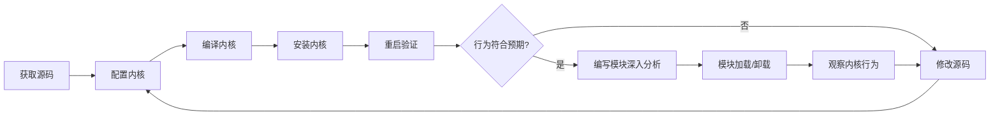
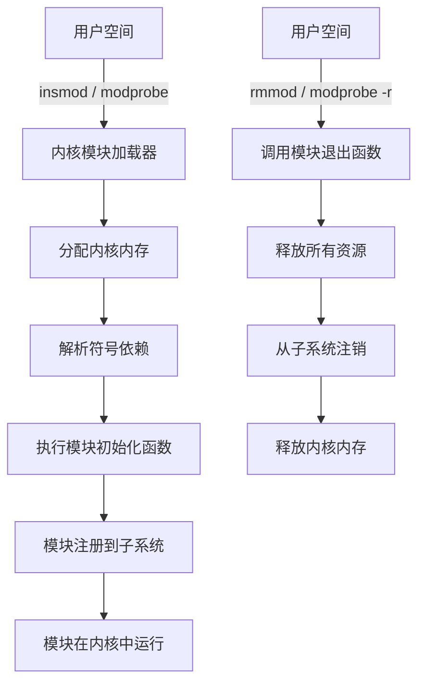

# 技巧1：内核编译与模块加载

## 为什么内核编译是源码分析的第一步

内核源码分析不是"读代码"那么简单——你需要让代码跑起来、改它、观察它对系统的实际影响。编译内核是打开这扇门的钥匙：

- **建立代码与行为的直觉**：只有亲手编译过，你才能理解 `Makefile` 中的依赖关系、`Kconfig` 的条件编译逻辑，以及 `CONFIG_XXX` 开关如何决定内核行为
- **定制分析环境**：默认发行版内核开启了大量你不需要的模块，关掉无关代码能大幅降低阅读复杂度
- **验证假设**：改一行代码、重新编译、重启观察——这是理解内核机制最直接的方法



## 1. 环境准备

### 1.1 硬件要求

| 资源 | 最低要求 | 推荐配置 | 说明 |
|------|----------|----------|------|
| CPU | 2核 | 4核+ | `make -j$(nproc)` 并行编译，核心越多越快 |
| 内存 | 4GB | 8GB+ | 全量编译内核约需 2-4GB，OOM 会导致编译失败 |
| 磁盘 | 20GB 可用 | 50GB+ SSD | 内核源码 ~1.5GB，编译产物 ~5-10GB，SSD 显著加速 I/O |
| 网络 | 有 | 有 | 下载源码和依赖包 |

### 1.2 软件依赖安装

不同发行版的包名略有差异，以下给出 Debian/Ubuntu 和 RHEL/CentOS 两套命令。

**Debian/Ubuntu：**

```bash
# 基础编译工具链
sudo apt-get update
sudo apt-get install -y build-essential libncurses-dev bison flex \
    libssl-dev libelf-dev dwarves bc cpio

# 辅助工具
sudo apt-get install -y git fakeroot wget xz-utils zip unzip \
    flex bison libssl-dev libelf-dev

# 可选：QEMU 用于内核调试（后面会用到）
sudo apt-get install -y qemu-system-x86 gdb

# 确认工具链版本
gcc --version   # 需要 GCC 5.1+
make --version  # 需要 GNU Make 3.82+
flex --version  # 需要 2.5.35+
bison --version # 需要 2.8+
```

**RHEL/CentOS/Fedora：**

```bash
sudo dnf groupinstall -y "Development Tools"
sudo dnf install -y ncurses-devel bison flex \
    elfutils-libelf-devel openssl-devel bc dwarves

# Fedora 还需要
sudo dnf install -y qemu-system-x86 gdb
```

### 1.3 内核参数调优

编译内核本身是 I/O 密集型操作，尤其在处理 `CONFIG_IKCONFIG`（生成 `config.gz`）和 `CONFIG_IKHEADERS` 时。适当调优可避免编译过程中的 I/O 瓶颈：

```bash
# 增大文件句柄上限（并行编译需要同时打开大量文件）
echo "fs.file-max = 2097152" | sudo tee -a /etc/sysctl.conf

# 增大 inotify 限制（监控大量源文件时有用）
echo "fs.inotify.max_user_watches = 524288" | sudo tee -a /etc/sysctl.conf

sudo sysctl -p
```

## 2. 获取内核源码

### 2.1 选择内核版本

| 场景 | 推荐版本策略 | 原因 |
|------|-------------|------|
| 学习内核机制 | 当前运行版本 +1 | 与实际环境差异最小，易于对比 |
| 分析特定子系统 | 该子系统最近重大重构的版本 | 例如分析 BPF 则选 5.x+ |
| 复现 CVE | 受影响的精确版本 | commit 对比才能理解漏洞本质 |
| 跟踪最新发展 | 最新 mainline | 理解开发前沿 |

查看当前运行内核：

```bash
uname -r        # 例如 6.1.0-25-amd64
cat /etc/os-release  # 发行版信息
```

### 2.2 下载源码

**方法一：官方镜像下载（推荐初学者）**

```bash
# 从 kernel.org 下载稳定版
cd /usr/src
sudo wget https://cdn.kernel.org/pub/linux/kernel/v6.x/linux-6.10.tar.xz
sudo tar -xf linux-6.10.tar.xz
cd linux-6.10
```

**方法二：Git 克隆（推荐需要追踪历史的场景）**

```bash
# 浅克隆——只拉最新一个 tag，节省空间和时间
cd /usr/src
sudo git clone --depth 1 https://git.kernel.org/pub/scm/linux/kernel/git/stable/linux.git linux-stable
cd linux-stable

# 如果需要查看历史 commit
sudo git fetch --unshallow
```

**方法三：发行版内核源码（最低摩擦）**

```bash
# Debian/Ubuntu：直接下载带补丁的源码包
apt-get source linux-image-$(uname -r)
# 这会生成 linux-source-X.X.X 目录，已包含发行版补丁
```

### 2.3 源码目录结构速览

拿到源码后，先花 5 分钟了解顶层结构，后续分析时能快速定位：

linux-6.10/
├── arch/           # 体系结构相关代码（x86, arm64, riscv 等）
│   ├── x86/        # x86 架构专属代码
│   └── Makefile    # 顶层 Makefile 按 arch 递归
├── block/          # 块设备 I/O 层
├── drivers/        # 设备驱动（最大子目录，占内核代码 ~40%）
├── fs/             # 文件系统
├── include/        # 头文件（内核 API 的核心定义）
│   └── linux/      # 内核内部头文件
├── init/           # 内核初始化入口（main.c → start_kernel）
├── kernel/         # 核心子系统（进程调度、信号、时间等）
│   └── module/     # 模块加载子系统（load_module 的核心实现）
├── lib/            # 内核库函数（string, sort, rbtree 等）
├── mm/             # 内存管理
├── net/            # 网络协议栈
├── scripts/        # 编译脚本（Kconfig, checkpatch 等）
├── Makefile        # 顶层 Makefile（理解编译系统的关键）
├── Kconfig         # 顶层 Kconfig（配置入口）
└── Documentation/  # 内核文档（极其丰富，常被忽略）

## 3. 内核配置

配置是编译前最关键的步骤——它决定了哪些代码被编译进内核、哪些编译为模块、哪些直接排除。

### 3.1 配置选项概览

| Kconfig 选项 | 含义 | 对源码分析的影响 |
|-------------|------|-----------------|
| `y`（built-in） | 编译进内核映像 | 可以直接在内核源码中打断点调试 |
| `m`（module） | 编译为可加载模块（.ko 文件） | 需要 insmod/modprobe 加载后才能调试 |
| `n`（disabled） | 不编译 | 代码完全排除，减少分析干扰 |

### 3.2 配置命令对比

```bash
# 基于当前运行内核的配置——最安全的起点
cp /boot/config-$(uname -r) .config
make olddefconfig          # 自动填充新选项为默认值

# 图形化配置（推荐交互式调整）
make menuconfig             # 基于 ncurses 的终端界面
make nconfig                # 更现代的 ncurses 界面
make xconfig                # Qt 图形界面（需要安装 qt5）

# 极简配置——只编译当前架构的默认选项
make defconfig

# 本地优化配置——开启 GCC 优化但不开启调试
make localmodconfig         # 只编译当前已加载模块对应的驱动！
```

**关键推荐：`make localmodconfig`**

对于源码分析场景，`localmodconfig` 是最实用的配置方式。它只编译当前系统实际加载的模块（通过 `/proc/modules` 获取），大幅缩小代码范围。执行后会输出被跳过的模块列表，你可以根据分析需要手动添加。

```bash
# localmodconfig 的完整流程
cp /boot/config-$(uname -r) .config
make localmodconfig 2>&amp;1 | tee /tmp/localmodconfig.log
# 检查哪些模块被跳过了
grep "is not set" /tmp/localmodconfig.log
# 如果需要某个被跳过的模块，手动启用
scripts/config --module SND_HDA_INTEL
make olddefconfig
```

### 3.3 面向源码分析的关键配置项

以下配置对内核源码分析特别有价值：

```bash
# 开启内核调试信息（几乎必开）
scripts/config --enable CONFIG_DEBUG_INFO
scripts/config --enable CONFIG_DEBUG_INFO_DWARF5
scripts/config --enable CONFIG_GDB_SCRIPTS      # 生成 gdb 辅助脚本

# 开启内核内部检查（帮助理解内核行为）
scripts/config --enable CONFIG_PROVE_LOCKING     # 锁依赖检测
scripts/config --enable CONFIG_DEBUG_LOCK_ALLOC
scripts/config --enable CONFIG_KASAN             # 内存错误检测
scripts/config --enable CONFIG_KASAN_INLINE      # 内联模式（性能更好）

# 开启内核追踪
scripts/config --enable CONFIG_FTRACE            # 函数追踪
scripts/config --enable CONFIG_FUNCTION_TRACER
scripts/config --enable CONFIG_STACK_TRACER
scripts/config --enable CONFIG_TRACING           # ftrace 前端

# 开启内核日志增强
scripts/config --enable CONFIG_DYNAMIC_DEBUG     # 动态调试开关
scripts/config --enable CONFIG_PRINTK_TIME       # 日志显示时间戳

# 关闭不需要的特性（减少编译时间和干扰）
scripts/config --disable CONFIG_SOUND            # 如果不分析音频子系统
scripts/config --disable CONFIG_WIRELESS         # 如果不分析无线驱动
scripts/config --disable CONFIG_BLUETOOTH        # 如果不分析蓝牙
scripts/config --disable CONFIG_DRM              # 如果不分析显卡驱动

# 最后刷新依赖
make olddefconfig
```

### 3.4 配置验证

```bash
# 查看最终配置中所有开启的调试选项
grep -E "CONFIG_(DEBUG_INFO|KASAN|FTRACE|PROVE_LOCKING|DYNAMIC_DEBUG)" .config

# 检查配置是否合法
make listnewconfig   # 列出未定义的选项
```

## 4. 编译内核

### 4.1 标准编译流程

```bash
# 步骤1：清理旧编译产物（首次编译可跳过）
make clean          # 清除 .o 文件，保留 .config
make mrproper       # 完全清理，回到初始状态（.config 也会删除）
make distclean      # mrproper + 删除编辑器备份和补丁文件

# 步骤2：编译
make -j$(nproc) 2>&amp;1 | tee /tmp/kernel_build.log
# -j$(nproc)：并行编译，使用所有 CPU 核心
# tee 保存完整日志，便于排查错误

# 步骤3：编译模块
make modules -j$(nproc) 2>&amp;1 | tee /tmp/modules_build.log

# 步骤4：安装模块到 /lib/modules/
sudo make modules_install
# 会安装到 /lib/modules/<kernel-version>/

# 步骤5：安装内核
sudo make install
# 会复制 bzImage 到 /boot/，生成 initramfs，更新 grub
```

### 4.2 编译时间参考

| 硬件配置 | -j 选项 | `make` 时间 | `make modules` 时间 |
|----------|---------|-------------|---------------------|
| 2核 4GB HDD | -j4 | ~45min | ~15min |
| 4核 8GB SSD | -j8 | ~15min | ~5min |
| 8核 16GB NVMe | -j16 | ~8min | ~3min |
| 32核 64GB NVMe | -j64 | ~2min | ~40s |

### 4.3 增量编译技巧

内核支持增量编译——只有被修改的文件才会重新编译：

```bash
# 修改某个文件后，只重新编译受影响的部分
make -j$(nproc)

# 如果修改了头文件（影响面大），先标记所有依赖为 dirty
# 然后增量编译
touch include/linux/sched.h
make -j$(nproc)

# 只编译单个文件（快速验证修改）
make drivers/net/ethernet/intel/e1000e/netdev.o
# 注意：需要写相对路径，从内核源码根目录出发
```

### 4.4 常见编译错误及解决

| 错误信息 | 原因 | 解决方法 |
|----------|------|----------|
| `fatal error: openssl/ssl.h: No such file` | 缺少 OpenSSL 开发头文件 | `sudo apt-get install libssl-dev` |
| `BTF is not enabled for vmlinux` | 编译 BPF 相关模块时缺少 BTF 支持 | 确保 `CONFIG_DEBUG_INFO_BTF=y` |
| `Kernel panic - not syncing: VFS: Unable to mount root fs` | initramfs 未生成或根分区设备号不对 | `sudo update-initramfs -c -k <version>` |
| `modpost: "symbol" undefined` | 模块间符号依赖未满足 | 检查 `EXPORT_SYMBOL` 和 `MODULE_DEVICE_TABLE` |
| `error: implicit declaration of function` | 头文件缺失或 API 变更 | 确认内核版本，检查 `include/` 目录 |
| `internal compiler error` | GCC 版本不兼容 | 升级 GCC 或使用 `CC=clang` 换用 Clang |

### 4.5 使用 Clang 编译内核

从 Linux 5.0 开始，内核官方支持 Clang 编译。Clang 的错误提示通常比 GCC 更友好，适合源码分析场景：

```bash
# 安装 Clang 工具链
sudo apt-get install -y clang lld llvm

# 使用 Clang 编译
make -j$(nproc) CC=clang LD=ld.lld AR=llvm-ar NM=llvm-nm OBJCOPY=llvm-objcopy

# 或者使用 make 选项
make -j$(nproc) CC=clang LLVM=1
# LLVM=1 会自动使用 clang, ld.lld, llvm-ar 等
```

## 5. 安装与启动新内核

### 5.1 安装步骤

```bash
# 编译完成后，安装模块和内核
sudo make modules_install
sudo make install

# 手动更新 initramfs（如果 make install 未自动执行）
sudo update-initramfs -c -k $(make kernelrelease)

# 更新 GRUB 引导菜单
sudo update-grub          # Debian/Ubuntu
sudo grub2-mkconfig -o /boot/grub2/grub.cfg  # RHEL/CentOS
```

### 5.2 安全重启

修改内核配置有导致系统无法启动的风险。在重启前务必做好准备：

```bash
# 确认 GRUB 中有旧内核作为回退
ls /boot/vmlinuz-*

# 编辑 GRUB 配置，确保旧内核可选
sudo vim /etc/default/grub
# GRUB_DEFAULT=0              # 默认启动最新内核
# GRUB_SAVEDEFAULT=true       # 保存上次选择
# GRUB_TIMEOUT=10             # 等待 10 秒让用户选择

sudo update-grub
```

### 5.3 无法启动时的恢复

如果新内核启动失败，GRUB 菜单中选择旧内核即可恢复。如果连 GRUB 都无法显示：

```bash
# 方法1：在 GRUB 菜单按 'e' 编辑启动参数
# 找到 linux /boot/vmlinuz... 行，修改为旧内核版本

# 方法2：使用 Live USB 启动，chroot 进系统
sudo mount /dev/sdaX /mnt
sudo mount --bind /dev /mnt/dev
sudo mount --bind /proc /mnt/proc
sudo chroot /mnt
update-grub

# 方法3：回退编译（最暴力但最可靠）
cd /usr/src/linux-X.X.X
sudo make modules_install
sudo make install
sudo update-grub
```

### 5.4 验证新内核

重启后验证内核是否正确安装：

```bash
# 确认内核版本
uname -r
# 期望输出：6.10.0（你编译的版本）

# 检查内核配置是否生效
zcat /proc/config.gz | grep CONFIG_DEBUG_INFO
# 或者直接查看编译时的 .config 文件

# 检查 dmesg 中的启动日志
dmesg | head -20
dmesg | grep -i "error\|warning\|fail"
```

## 6. 内核模块机制

### 6.1 模块原理

内核模块（Loadable Kernel Module，LKM）是可以在运行时动态加载/卸载的内核代码段。与 built-in（`y`）不同，模块不占用内核映像的空间，按需加载。



### 6.2 模块关键数据结构

理解模块加载，需要认识内核中的几个核心数据结构：

```c
// struct module —— 每个加载的模块对应一个实例
// 源码位置：include/linux/module.h
struct module {
    enum module_state state;    // 模块状态：COMING/GOING/LIVE
    struct list_head list;      // 挂入全局模块链表 modules
    char name[MODULE_NAME_LEN]; // 模块名，如 "e1000e"

    // 模块内存布局（代码段、数据段、BSS 段的地址和大小）
    struct module_layout core_layout;
    struct module_layout init_layout;

    // 符号表——内核通过这些表解析模块引用的外部符号
    const struct kernel_symbol *golfsyms;     // GPL-only 符号
    const struct kernel_symbol *gpl_golfsyms;
    struct mod_kallsym *kallsyms;             // 内核符号表（用于 kallsyms 查找）
    unsigned int num_gpl_golfsyms;
    unsigned int num_syms;

    // 模块参数——用户可通过 /sys/module/<name>/parameters/ 设置
    const struct kernel_param *kp;
    unsigned int num_kp;

    // 引用计数——防止正在使用的模块被卸载
    atomic_t refcnt;

    // ... 省略数百个字段，完整定义见 include/linux/module.h
};

// struct kernel_param —— 模块参数描述符
struct kernel_param {
    const char *name;
    const struct kernel_param_ops *ops;  // get/set 操作
    u16 perm;                             // sysfs 权限（0644 = rw-r--r--）
    u8 flags;
    void *arg;                            // 指向实际的变量
};

// 模块状态机
// MODULE_STATE_COMING  → 模块正在加载（init 还未执行）
// MODULE_STATE_LIVE    → 模块已激活（init 执行完毕，正常运行）
// MODULE_STATE_GOING   → 模块正在卸载（exit 已调用，资源正在释放）
```

### 6.3 模块加载的内核源码路径

从用户执行 `insmod` 到模块代码开始运行，内核内部经历以下阶段。理解这条路径对源码分析至关重要——当你想追踪某个机制的实现时，知道从哪个函数开始看能省去大量时间：

用户空间：insmod /path/to/module.ko
    ↓ syscall
内核入口：sys_init_module()          ← fs/open.c
    ↓
load_module()                        ← kernel/module/main.c  ← 核心函数
    ├── 解析 ELF 格式
    │   ├── 读取 .ko 文件的 section header
    │   ├── 提取 .text (代码)、.data (数据)、.rodata (只读数据)、.bss (未初始化)
    │   └── 验证 ELF magic number 和版本
    ├── 分配内核内存
    │   ├── module_alloc()  → 通过 vmalloc 分配可执行内存
    │   └── 创建 struct module 实例
    ├── 符号解析
    │   ├── resolve_symbol_wait()   ← kernel/module/main.c
    │   ├── 遍历内核导出符号表（/proc/kallsyms）
    │   └── 解决模块间的依赖（如模块 A 引用模块 B 的函数）
    ├── 代码重定位
    │   ├── apply_relocations()     ← kernel/module/relocation.c
    │   └── 修补绝对地址引用
    ├── 验证
    │   ├── verify_elf_section_permissions()  ← 安全检查
    │   └── module_sig_check()     ← 模块签名验证（如开启 CONFIG_MODULE_SIG）
    └── 初始化
        ├── do_init_module()        ← kernel/module/main.c
        │   ├── 调用模块的 init 函数
        │   ├── 模块状态 → MODULE_STATE_LIVE
        │   └── 释放 __init 段内存（节约内核内存）
        └── 模块出现在 /sys/module/<name>/ 和 /proc/modules 中

### 6.4 运行时内核模块接口

模块加载后，内核暴露了多个接口供用户空间查询和调试模块状态：

```bash
# /proc/modules —— 所有已加载模块的列表
# 格式：名称 大小 引用计数 被依赖的模块列表 场所(builtin/符号地址)
cat /proc/modules
# e1000e 290816 0 - Live 0xffffffffc0800000
# │       │     │  │     └── 加载地址（可用 kallsyms 查找）
# │       │     │  └── Live=已加载, Loading=正在加载, Unloading=正在卸载
# │       │     └── 依赖计数（被多少其他模块引用）
# │       └── 内存占用（字节）
# └── 模块名

# /sys/module/<name>/ —— 每个模块的 sysfs 接口
ls /sys/module/e1000e/
# initstate  模块状态（live / coming / going）
# refcnt     引用计数
# taint      模块是否使内核 tainted
# sections   ELF section 信息
# parameters 模块参数（如果定义了的话）
ls /sys/module/e1000e/parameters/
# InterruptMode  IntMode  RxDescriptors  TxDescriptors ...

# 实时监控模块加载/卸载
sudo cat /sys/kernel/debug/tracing/trace_pipe | grep -E "module_|insmod|rmmod"
```

### 6.5 模块引用计数

引用计数是内核防止正在使用的模块被意外卸载的安全机制：

```c
// 在驱动代码中常见的引用计数操作
// 当设备被打开时增加引用计数
static int my_open(struct inode *inode, struct file *file)
{
    if (!try_module_get(THIS_MODULE))  // 原子操作：如果模块正在卸载则返回 false
        return -ENODEV;
    return 0;
}

// 当设备关闭时减少引用计数
static int my_release(struct inode *inode, struct file *file)
{
    module_put(THIS_MODULE);  // 原子操作：减少引用计数
    return 0;
}
```

```bash
# 查看模块的引用计数
cat /sys/module/<name>/refcnt

# 查看哪些模块依赖某个模块
cat /proc/modules | grep <name>
# 或者更清晰的方式：
modprobe --show-depends <name>   # 显示依赖链

# 强制卸载（危险！可能导致内核崩溃）
sudo rmmod -f <name>
# 仅在调试场景使用，生产环境绝对不要这样做
```

## 7. 编写和调试内核模块

### 7.1 最小可运行模块

```c
// hello.c —— 最简单的内核模块
#include <linux/init.h>      // __init, __exit 宏
#include <linux/module.h>    // MODULE_LICENSE, MODULE_AUTHOR
#include <linux/kernel.h>    // printk, KERN_INFO

// 模块初始化函数：insmod 时执行
static int __init hello_init(void)
{
    printk(KERN_INFO "Hello, kernel world!\n");
    printk(KERN_INFO "Module loaded by: %s\n", current->comm);
    return 0;  // 0 表示成功，非零表示失败（模块不会被加载）
}

// 模块退出函数：rmmod 时执行
static void __exit hello_exit(void)
{
    printk(KERN_INFO "Goodbye, kernel world!\n");
}

// 注册初始化和退出函数
module_init(hello_init);
module_exit(hello_exit);

// 必须声明许可证，否则内核会发出 "tainted kernel" 警告
MODULE_LICENSE("GPL");
MODULE_AUTHOR("Your Name");
MODULE_DESCRIPTION("A minimal kernel module for learning");
MODULE_VERSION("1.0");
```

### 7.2 Makefile

```makefile
# Makefile —— 模块编译
obj-m += hello.o        # hello.ko 由 hello.c 编译而来

# 如果模块由多个源文件组成：
# obj-m += mymodule.o
# mymodule-objs := file1.o file2.o

KDIR ?= /lib/modules/$(shell uname -r)/build

all:
	make -C $(KDIR) M=$(PWD) modules

clean:
	make -C $(KDIR) M=$(PWD) clean

# 安装到 /lib/modules/
install:
	sudo cp hello.ko /lib/modules/$(shell uname -r)/extra/
	sudo depmod -a
```

`make -C $(KDIR) M=$(PWD) modules` 这条命令的含义：
- `-C $(KDIR)`：切换到内核构建目录（`/lib/modules/<version>/build`）
- `M=$(PWD)`：告诉内核构建系统，模块源码在当前目录
- `modules`：构建目标是可加载模块

### 7.3 编译、加载、验证

```bash
# 编译
make
# 输出: make -C /lib/modules/6.1.0-25-amd64/build M=/home/user/hello modules
#        CC [M] /home/user/hello/hello.o
#        MODPOST /home/user/hello/Module.symvers
#        CC [M] /home/user/hello/hello.mod.o
#        LD [M] /home/user/hello/hello.ko

# 检查模块信息
modinfo hello.ko
# filename:       hello.ko
# license:        GPL
# description:    A minimal kernel module for learning
# author:         Your Name
# vermagic:       6.1.0-25-amd64 SMP preempt mod_unload

# 加载模块（需要 root 权限）
sudo insmod hello.ko

# 检查模块是否已加载
lsmod | grep hello
# hello                 16384  0
# （大小 16384 字节，0 个引用计数）

# 查看内核日志
dmesg | tail -5
# [12345.678901] Hello, kernel world!
# [12345.678902] Module loaded by: insmod

# 卸载模块
sudo rmmod hello

# 确认已卸载
lsmod | grep hello  # 无输出
dmesg | tail -3
# [12350.123456] Goodbye, kernel world!
```

### 7.4 模块参数（module_param）

模块参数是模块与用户空间交互的重要机制，允许在加载模块时传入配置值。这是理解驱动编程的关键概念：

```c
// params.c —— 演示模块参数的使用
#include <linux/init.h>
#include <linux/module.h>
#include <linux/moduleparam.h>  // module_param, MODULE_PARM_DESC
#include <linux/kernel.h>

// 声明模块参数
// module_param(变量名, 类型, 权限)
// 类型：bool, int, uint, long, ulong, charp(字符串指针), invbool(反转bool)

static int mode = 0;
module_param(mode, int, 0644);  // 0644 = rw-r--r--（可通过 sysfs 读写）
MODULE_PARM_DESC(mode, "Operating mode: 0=auto, 1=manual, 2=test");

static char *device_name = "eth0";
module_param(device_name, charp, 0644);
MODULE_PARM_DESC(device_name, "Network device name");

static int speed = 1000;
module_param(speed, int, 0444);  // 0444 = r--r--r--（只读，加载后不可改）
MODULE_PARM_DESC(speed, "Link speed in Mbps");

// 数组参数
static int ports[4] = {0, 1, 2, 3};
module_param_array(ports, int, NULL, 0644);
MODULE_PARM_DESC(ports, "Port mapping array");

static int __init params_init(void)
{
    pr_info("params: mode=%d, device=%s, speed=%d\n", mode, device_name, speed);
    pr_info("params: ports[0..3] = %d, %d, %d, %d\n",
            ports[0], ports[1], ports[2], ports[3]);
    return 0;
}

static void __exit params_exit(void)
{
    pr_info("params: unloaded\n");
}

module_init(params_init);
module_exit(params_exit);
MODULE_LICENSE("GPL");
MODULE_DESCRIPTION("Module parameters demo");
```

```bash
# 加载时传参（命令行参数优先于默认值）
sudo insmod params.ko mode=2 device_name="wlan0" speed=5000 ports=10,20,30,40

# 查看和修改参数（加载后通过 sysfs）
cat /sys/module/params/parameters/mode        # 读取当前值
echo 1 | sudo tee /sys/module/params/parameters/mode  # 运行时修改（需要 0644 权限）

# 查看所有模块参数
cat /sys/module/params/parameters/ports
```

### 7.5 实用模块示例：procfs 交互

在源码分析中，编写一个通过 `/proc` 文件系统与用户空间交互的模块非常实用——你可以用它来暴露内核内部数据结构的实时状态：

```c
// proc_demo.c —— 通过 /proc 文件系统暴露内核信息
#include <linux/init.h>
#include <linux/module.h>
#include <linux/proc_fs.h>
#include <linux/seq_file.h>    // seq_file API（推荐的 /proc 输出方式）

#define PROC_NAME "kernel_info"

static int counter = 0;  // 模块内部状态

// seq_file 的 show 回调——每次读取 /proc 文件时调用
static int info_show(struct seq_file *m, void *v)
{
    struct timespec64 ts;

    seq_printf(m, "=== Kernel Module Info ===\n");
    seq_printf(m, "Module counter: %d\n", counter++);
    seq_printf(m, "Current PID: %d\n", current->pid);
    seq_printf(m, "Current task: %s\n", current->comm);

    // 获取系统运行时间
    ktime_get_real_ts64(&amp;ts);
    seq_printf(m, "System uptime: %lld.%09ld seconds\n", ts.tv_sec, ts.tv_nsec);

    // 显示当前内存状态
    seq_printf(m, "MemFree: %lu kB\n", si_meminfo_val(SI_MEMFREE));
    return 0;
}

// open 回调——用户打开 /proc 文件时调用
static int info_open(struct inode *inode, struct file *file)
{
    return single_open(file, info_show, NULL);
}

static const struct proc_ops info_ops = {
    .proc_open    = info_open,
    .proc_read    = seq_read,      // seq_file 标准读取函数
    .proc_lseek   = seq_lseek,     // 支持 lseek
    .proc_release = single_release, // single_open 的配套释放函数
};

static int __init proc_demo_init(void)
{
    // 创建 /proc/kernel_info 文件
    proc_create(PROC_NAME, 0644, NULL, &amp;info_ops);
    pr_info("proc_demo: created /proc/%s\n", PROC_NAME);
    return 0;
}

static void __exit proc_demo_exit(void)
{
    remove_proc_entry(PROC_NAME, NULL);
    pr_info("proc_demo: removed /proc/%s\n", PROC_NAME);
}

module_init(proc_demo_init);
module_exit(proc_demo_exit);
MODULE_LICENSE("GPL");
MODULE_DESCRIPTION("Procfs demo for kernel analysis");
```

```bash
# 编译加载后
cat /proc/kernel_info
# === Kernel Module Info ===
# Module counter: 0
# Current PID: 1234
# Current task: cat
# System uptime: 123456.789012345 seconds
# MemFree: 524288 kB

# 多次读取可以看到 counter 递增——这就是模块在内核中维护状态的直观体现
```

### 7.6 模块调试

**printk 调试（最基础但最可靠）：**

```c
#include <linux/printk.h>

// 日志级别定义（从高到低）：
// KERN_EMERG   "0"   系统崩溃
// KERN_ALERT   "1"   必须立即处理
// KERN_CRIT    "2"   严重错误
// KERN_ERR     "3"   一般错误
// KERN_WARNING "4"   警告
// KERN_NOTICE  "5"   正常但值得注意
// KERN_INFO    "6"   一般信息
// KERN_DEBUG   "7"   调试信息

// 使用示例
pr_info("module loaded, pid=%d, comm=%s\n", current->pid, current->comm);
pr_err("failed to allocate memory, size=%zu\n", size);
pr_debug("entering function %s\n", __func__);

// 动态调试：编译时启用 CONFIG_DYNAMIC_DEBUG
// 启用某个文件的 debug 输出：
// echo 'module hello +p' > /sys/kernel/debug/dynamic_debug/control
// 或者
// echo 'file hello.c +p' > /sys/kernel/debug/dynamic_debug/control
```

**日志级别控制：**

```bash
# 查看当前控制台日志级别
cat /proc/sys/kernel/printk
# 4    4    1    7
# │    │    │    └── default_console_loglevel（新进程默认值）
# │    │    └── minimum_console_loglevel
# │    └── default_message_loglevel（printk 默认级别）
# └── console_loglevel（当前控制台显示级别）

# 临时提升日志级别以看到所有输出
echo 8 > /proc/sys/kernel/printk
# 或使用 dmesg -w 实时查看（不受级别限制）
dmesg -w
```

**动态调试（Dynamic Debug）：**

```bash
# 启用所有模块的 debug 输出
echo 'module hello +p' > /sys/kernel/debug/dynamic_debug/control

# 查看当前启用的动态调试点
grep -c "enabled" /sys/kernel/debug/dynamic_debug/control

# 按文件/函数/模块精确控制
echo 'file hello.c line 15 +p' > /sys/kernel/debug/dynamic_debug/control
echo 'func hello_init +p' > /sys/kernel/debug/dynamic_debug/control

# 关闭
echo 'module hello -p' > /sys/kernel/debug/dynamic_debug/control
```

**追踪调试（ftrace）：**

```bash
# 启用函数追踪
cd /sys/kernel/debug/tracing

# 追踪特定模块的函数调用
echo "hello:*" > set_ftrace_filter
echo function > current_tracer
echo 1 > tracing_on

# 执行操作后查看追踪结果
cat trace
cat trace | head -30

# 追踪所有函数调用（注意：数据量很大）
echo function > current_tracer
echo 1 > tracing_on
cat trace_pipe  # 实时输出
```

## 8. modprobe 与 insmod 的区别

很多初学者混淆这两个工具。理解它们的区别对日常模块管理至关重要：

| 特性 | insmod | modprobe |
|------|--------|----------|
| 依赖处理 | 不处理，只加载指定模块 | 自动解析并加载所有依赖模块 |
| 路径 | 需要指定完整 .ko 文件路径 | 自动在 `/lib/modules/<version>/` 中查找 |
| 用法 | `insmod /path/to/module.ko` | `modprobe module_name` |
| 卸载 | `rmmod module_name`（不处理依赖） | `modprobe -r module_name`（级联卸载依赖） |
| 符号解析 | 依赖模块必须已加载 | 自动按顺序加载依赖 |
| 适用场景 | 开发调试，加载自编译模块 | 系统管理，加载标准内核模块 |

**modprobe 的依赖解析原理：**

```bash
# modprobe 通过 /lib/modules/<version>/modules.dep 知道依赖关系
cat /lib/modules/$(uname -r)/modules.dep | grep usb-storage
# kernel/drivers/usb/storage/usb-storage.ko: kernel/drivers/scsi/scsi_mod.ko kernel/drivers/usb/core/usbcore.ko

# 手动生成依赖文件（安装新模块后执行）
sudo depmod -a

# 搜索模块（modprobe 用模块名，insmod 需要完整路径）
modprobe -n -v usb-storage  # dry-run，显示会加载哪些模块
```

**模块黑名单（Blacklisting）：**

有时需要阻止内核自动加载某个模块（例如有 bug 的驱动、冲突的模块）。这通过 `/etc/modprobe.d/` 下的配置文件实现：

```bash
# 创建黑名单配置文件
sudo tee /etc/modprobe.d/blacklist-custom.conf << 'EOF'
# 禁止自动加载有问题的无线驱动
blacklist brcmsmac
blacklist b43

# 替换模块：当请求加载 A 时自动加载 B
install nouveau /bin/false
# install 伪命令 + /bin/false 会导致加载失败，从而阻止该模块
EOF

# 验证黑名单是否生效
modprobe -n -v brcmsmac   # dry-run，应该显示 "blacklisted"
modprobe --show-depends brcmsmac  # 也会显示被阻止

# 临时在当前会话禁用（不修改配置文件）
sudo rmmod brcmsmac       # 立即卸载
# 或在 GRUB 启动参数中添加：modprobe.blacklist=brcmsmac
```

## 9. 实用技巧与常见陷阱

### 9.1 快速定位编译问题

```bash
# 编译失败时，精确定位错误
make -j1 2>&amp;1 | grep -E "error:|undefined|fatal"
# -j1 串行编译，错误信息更清晰

# 查看某个 .o 文件的编译命令
make V=1 drivers/net/ethernet/intel/e1000e/netdev.o
# V=1 显示完整编译命令，便于理解编译选项
```

### 9.2 模块加载失败排查

```bash
# 检查模块信息
modinfo /path/to/module.ko | grep vermagic
vermagic: 6.10.0 SMP preempt mod_unload

# 对比当前内核
uname -r
# 6.1.0-25-amd64

# 版本不匹配 → insmod 会报 "Invalid module format"
# 解决：用对应内核版本的 headers 编译模块

# 查看模块符号依赖
modprobe --show-depends <module>
# 或者
modinfo -F depends <module>
# 输出类似：scsi_mod, usbcore, libusual
```

**vermagic 与模块兼容性：**

`vermagic` 是嵌入在每个 .ko 文件中的版本魔数字符串，包含内核版本、SMP 配置、 preempt 模式等信息。内核在加载模块时会严格比对 vermagic，不匹配则拒绝加载：

```bash
# 查看模块的 vermagic
modinfo hello.ko | grep vermagic
# vermagic: 6.1.0-25-amd64 SMP preempt mod_unload

# 查看 vermagic 的组成
# 内核版本(6.1.0-25-amd64) + SMP(多核) + preempt(抢占模式) + mod_unload(支持卸载)

# 自定义 EXTRAVERSION（在源码根目录的 Makefile 中修改）
# 原始：VERSION = 6  PATCHLEVEL = 1  SUBLEVEL = 0  EXTRAVERSION =
# 修改：EXTRAVERSION = -mycustom
# 编译后 vermagic 变为：6.1.0-mycustom-amd64 SMP preempt mod_unload

# 强制加载不匹配的模块（危险！可能导致数据损坏）
sudo insmod -f hello.ko
# -f (--force) 跳过 vermagic 检查
```

### 9.3 常见陷阱

| 陷阱 | 现象 | 解决 |
|------|------|------|
| `CONFIG_MODVERSIONS` 启用 | 符号 CRC 不匹配，insmod 拒绝加载 | 开启 `CONFIG_MODVERSIONS=n` 或使用 `-f` 强制加载 |
| `CONFIG_SMP` 不匹配 | 模块在多核系统上不稳定 | 确保模块编译时的 SMP 配置与当前内核一致 |
| `__init` 函数被重复调用 | 模块初始化函数在 init 后内存被释放 | 确保 init 函数内完成所有一次性初始化 |
| `__exit` 函数在 built-in 中 | 编译 built-in 时报函数未定义 | `__exit` 函数在 built-in 模式下被丢弃 |
| 忘记 `module_exit()` | rmmod 时报 "module is in use" | 必须注册 exit 函数以正确清理资源 |
| 非 GPL 许可证 | 模块无法使用 GPL-only 符号 | 使用 `MODULE_LICENSE("GPL")` 或兼容许可证 |
| 忘记 `try_module_get()` | 模块在设备使用中被卸载，内核崩溃 | 打开设备时 `try_module_get(THIS_MODULE)`，关闭时 `module_put()` |
| 模块参数权限设为 0666 | 任何用户可修改内核模块参数，安全风险 | 敏感参数使用 0644 或 0444（只读） |
| init 函数耗时过长 | 模块加载卡住，`insmod` 长时间无响应 | 将耗时操作移到内核线程（`kthread_run`）中异步执行 |

### 9.4 高效开发工作流

对于频繁修改模块的开发场景，以下工作流能显著提高效率：

```bash
# 1. 在内核源码中建立模块的软链接
ln -s /home/user/my-module /usr/src/linux/drivers/my-module

# 2. 只编译模块（不重编内核）
make -C /lib/modules/$(uname -r)/build M=/home/user/my-module modules

# 3. 快速卸载-重编译-重加载循环
make -C /lib/modules/$(uname -r)/build M=/home/user/my-module modules &amp;&amp; \
sudo rmmod my_module &amp;&amp; \
sudo insmod /home/user/my-module/my_module.ko

# 4. 使用 dmesg 观察输出
dmesg -w | grep "my_module"
```

## 10. 与源码分析结合

### 10.1 关闭不相关子系统

在分析特定子系统（如调度器、内存管理）时，关闭不相关的子系统可以大幅减少干扰代码：

```bash
# 分析调度器：关闭声卡、显卡、网络驱动等
make menuconfig
# Device Drivers  --->
#   [*] Sound card support  → [ ]  # 关闭
#   Graphics support  → [ ]        # 关闭
#   Network device support  → [ ]  # 关闭

# 这样 drivers/ 目录下的大部分代码不会被编译
# 编译时间从 15 分钟缩短到 3 分钟
# 内核映像从 10MB 缩小到 2MB
```

### 10.2 用 QEMU 测试内核

修改内核后不想重启物理机？QEMU 是最佳选择：

```bash
# 创建测试用的根文件系统
dd if=/dev/zero of=rootfs.ext4 bs=1M count=2048
mkfs.ext4 rootfs.ext4
mkdir -p /tmp/rootfs
sudo mount rootfs.ext4 /tmp/rootfs
sudo debootstrap --include=openssh-server bookworm /tmp/rootfs
sudo umount /tmp/rootfs

# 使用 QEMU 启动编译的内核
qemu-system-x86_64 \
    -kernel /usr/src/linux/arch/x86/boot/bzImage \
    -drive file=rootfs.ext4,format=raw \
    -append "root=/dev/sda rw console=ttyS0" \
    -nographic \
    -m 2G \
    -smp 4

# QEMU + GDB 调试内核
qemu-system-x86_64 \
    -kernel /usr/src/linux/arch/x86/boot/bzImage \
    -drive file=rootfs.ext4,format=raw \
    -append "root=/dev/sda rw console=ttyS0 nokaslr" \
    -nographic \
    -s -S    # -s: 启动 gdb server (端口 1234), -S: 启动时暂停

# 另一个终端：连接 GDB
cd /usr/src/linux
gdb vmlinux
(gdb) target remote :1234
(gdb) break start_kernel
(gdb) continue
(gdb) bt          # 查看调用栈
(gdb) disassemble # 反汇编当前函数
(gdb) info registers  # 查看寄存器
```

**QEMU 常用调试选项速查：**

| 选项 | 作用 | 使用场景 |
|------|------|----------|
| `-s -S` | 启动 GDB server 并暂停 | 需要从第一条指令开始单步调试 |
| `nokaslr` | 禁用内核地址空间随机化 | 需要设置固定地址断点 |
| `-nographic` | 无图形界面，串口输出到终端 | 服务器环境、脚本化测试 |
| `-m 2G` | 分配 2GB 内存 | 模拟不同内存条件 |
| `-smp 4` | 4 个 CPU 核心 | 测试 SMP 相关问题 |
| `-enable-kvm` | 启用硬件加速 | 需要接近原生速度运行 |
| `-append` | 内核启动参数 | 控制 root 分区、console、debug 选项 |

### 10.3 使用 kallsyms 查找内核符号

`/proc/kallsyms` 列出了内核和已加载模块的所有符号（函数和全局变量），对源码分析至关重要：

```bash
# 查看所有符号（需要 root，否则地址显示为 0）
sudo cat /proc/kallsyms | head -20
# ffffffff81000000 T _text
# ffffffff81000000 T startup_64
# ...

# 按名字搜索特定函数
sudo cat /proc/kallsyms | grep "schedule$"
# ffffffff810a1234 T __sched schedule          ← 调度器核心函数
# ffffffff810a1567 T __sched schedule_timeout  ← 带超时的调度

# 搜索模块中的符号
sudo cat /proc/kallsyms | grep " e1000e"
# ffffffffc0800100 T e1000e_open     [e1000e]
# ffffffffc0800200 T e1000e_close    [e1000e]
# │               │ │                └── 所属模块
# │               │ └── T=全局函数, d=本地函数, D=全局数据
# │               └── 符号类型
# └── 符号地址（可直接用于 GDB）

# 按地址查找是哪个函数
sudo cat /proc/kallsyms | grep "ffffffff810a1234"

# 配合 GDB 使用
gdb vmlinux
(gdb) info symbol 0xffffffff810a1234
# __sched schedule + 0 in section .text
(gdb) list *0xffffffff810a1234
# 显示该地址对应的源码位置
```

### 10.4 使用 pahole 分析内核数据结构

`pahole`（Poke-A-Hole）可以展示内核结构体的内存布局，对理解内核数据结构至关重要：

```bash
sudo apt-get install dwarves

# 从内核 ELF 中提取结构体信息
pahole -C task_struct vmlinux
# 输出结构体每个字段的偏移、大小、对齐方式

# 查找结构体中导致缓存行抖动的字段
pahole --cacheline_size=64 -C task_struct vmlinux

# 比较不同内核版本中同一结构体的变化
pahole -C task_struct /path/to/old/vmlinux > old_task_struct.txt
pahole -C task_struct /path/to/new/vmlinux > new_task_struct.txt
diff old_task_struct.txt new_task_struct.txt
```

### 10.5 kallsyms + pahole + GDB 联合分析实战

以下是一个完整的实战工作流——通过这三个工具联合分析内核数据结构在运行时的状态：

```bash
# 步骤1：用 pahole 查看 task_struct 的字段偏移
pahole -C task_struct vmlinux | grep "state\|comm\|pid"
# const struct cpumask __percpu *cpus_mask;                     /*     0:    8 */
# unsigned int state;                                          /*   112:     4 */
# int on_cpu;                                                  /*   116:     4 */
# int on_rq;                                                   /*   120:     4 */
# int prio;                                                    /*   124:     4 */
# ...
# char comm[TASK_COMM_LEN];  /* TASK_COMM_LEN = 16 */          /* 1632:    16 */

# 步骤2：用 kallsyms 找到当前进程的 task_struct 地址
sudo cat /proc/kallsyms | grep " runqueues$"
# ffffffff82a1b000 D runqueues  ← 进程调度队列的基地址

# 步骤3：用 GDB 附加到 QEMU 实例，检查运行时数据
# (gdb) p *(struct task_struct *)0xffff888012345678
# (gdb) p ((struct task_struct *)0xffff888012345678)->comm
# (gdb) p ((struct task_struct *)0xffff888012345678)->state
```

## 11. 模块签名与 Secure Boot

现代发行版默认开启 Secure Boot，内核会拒绝加载未签名的模块。在源码分析环境中必须处理这个问题：

### 11.1 理解模块签名机制

```bash
# 查看内核是否启用了模块签名
grep CONFIG_MODULE_SIG /boot/config-$(uname -r)
# CONFIG_MODULE_SIG=y          # 启用模块签名
# CONFIG_MODULE_SIG_FORCE=y   # 强制要求签名（未签名模块无法加载）
# CONFIG_MODULE_SIG_SHA256=y  # 使用 SHA256 签名算法

# 查看模块是否已签名
modprobe --dump-modversions hello.ko | head -5
# 或者
file hello.ko
# hello.ko: ELF 64-bit LSB relocatable, ... stripped
# 如果有签名：在末尾会显示 "Module signature appended"
```

### 11.2 两种应对策略

**策略一：禁用签名验证（推荐调试环境）**

```bash
# 方法A：临时禁用（重启后恢复）
# 编辑 GRUB，添加内核参数：
sudo vim /etc/default/grub
# GRUB_CMDLINE_LINUX="module.sig_enforce=0"

# 方法B：编译自定义内核时关闭签名
scripts/config --disable CONFIG_MODULE_SIG
scripts/config --disable CONFIG_MODULE_SIG_FORCE
make olddefconfig
make -j$(nproc)
```

**策略二：使用自签名密钥（推荐生产环境）**

```bash
# 生成签名密钥对
cd /usr/src/linux
openssl req -new -x509 -newkey rsa:4096 -keyout signing_key.pem \
    -outform DER -out signing_key.x509 -nodes -days 36500 \
    -subj "/CN=My Kernel Module Signing Key/"

# 配置内核使用自定义密钥
scripts/config --enable CONFIG_MODULE_SIG
scripts/config --set-str CONFIG_MODULE_SIG_KEY "certs/signing_key.x509"

# 编译内核（包含自签名密钥）
make -j$(nproc)
# 编译好的内核只信任这个密钥签名的模块

# 签名模块
scripts/sign-file sha256 signing_key.pem signing_key.x509 hello.ko

# 验证签名
modinfo hello.ko | grep sig
# sig:           <签名摘要>
```

### 11.3 UEFI Secure Boot 与 MOK

如果系统启用了 UEFI Secure Boot，自签名密钥还需要注册到 MOK（Machine Owner Key）数据库：

```bash
# 注册密钥到 MOK
sudo mokutil --import signing_key.x509
# 会提示设置一次性密码

# 重启后进入 MOK Manager 菜单
# 选择 "Enroll MOK" → 输入刚才设置的密码 → 确认

# 验证 MOK 注册状态
mokutil --list-enrolled
```

## 12. DKMS：动态内核模块支持

DKMS（Dynamic Kernel Module Support）是管理第三方模块的自动化框架——当内核升级时，DKMS 会自动重新编译所有注册的模块：

### 12.1 DKMS 工作原理


### 12.2 注册自己的模块到 DKMS

```bash
# 安装 DKMS
sudo apt-get install dkms  # Debian/Ubuntu
sudo dnf install dkms      # Fedora/RHEL

# 创建 DKMS 源码目录结构
sudo mkdir -p /usr/src/hello-1.0
sudo cp hello.c Makefile /usr/src/hello-1.0/

# 编写 dkms.conf
sudo tee /usr/src/hello-1.0/dkms.conf << 'EOF'
PACKAGE_NAME="hello"
PACKAGE_VERSION="1.0"
BUILT_MODULE_NAME[0]="hello"
DEST_MODULE_LOCATION[0]="/extra"
AUTOINSTALL="yes"
EOF

# 注册到 DKMS
sudo dkms add -m hello -v 1.0
sudo dkms build -m hello -v 1.0
sudo dkms install -m hello -v 1.0

# 验证
dkms status
# hello, 1.0, 6.10.0-custom, x86_64: installed

# 卸载
sudo dkms remove -m hello -v 1.0 --all

# 当内核升级后，DKMS 会自动编译：
# 重启后执行 dkms status 检查是否需要手动触发
sudo dkms autoinstall
```

## 13. 交叉编译与轻量级测试

### 13.1 交叉编译

分析 ARM64 等非 x86 架构的内核时需要交叉编译：

```bash
# 安装交叉编译工具链
sudo apt-get install -y gcc-aarch64-linux-gnu

# 交叉编译 ARM64 内核
make ARCH=arm64 CROSS_COMPILE=aarch64-linux-gnu- defconfig
make ARCH=arm64 CROSS_COMPILE=aarch64-linux-gnu- -j$(nproc)
# 输出: arch/arm64/boot/Image

# 交叉编译模块
make ARCH=arm64 CROSS_COMPILE=aarch64-linux-gnu- M=/path/to/module modules
```

### 13.2 轻量级根文件系统（用于 QEMU 测试）

```bash
# 使用 Buildroot 构建最小根文件系统
git clone https://github.com/buildroot/buildroot.git
cd buildroot
make qemu_aarch64_virt_defconfig
make menuconfig  # 按需添加 busybox, gdb 等
make -j$(nproc)
# 输出: output/images/rootfs.cpio.gz
```

### 13.3 一键构建测试脚本

将上述流程整合为自动化脚本，适合频繁修改-测试循环：

```bash
#!/bin/bash
# build_and_test.sh —— 编译模块 + QEMU 测试的一键脚本
set -euo pipefail

KERNEL_SRC=/usr/src/linux
MODULE_SRC=$(pwd)
MODULE_NAME="hello"

echo "=== Step 1: 编译模块 ==="
make -C ${KERNEL_SRC} M=${MODULE_SRC} modules 2>&amp;1 | tail -5

echo "=== Step 2: 检查模块信息 ==="
modinfo ${MODULE_NAME}.ko | grep -E "vermagic|license|description"

echo "=== Step 3: 加载模块（宿主机测试）==="
sudo rmmod ${MODULE_NAME} 2>/dev/null || true
sudo insmod ${MODULE_NAME}.ko
dmesg | tail -3

echo "=== Step 4: 卸载模块 ==="
sudo rmmod ${MODULE_NAME}
dmesg | tail -2

echo "=== DONE ==="
```

## 本节要点回顾

| 主题 | 核心要点 |
|------|---------|
| 环境准备 | build-essential + libncurses-dev + libelf-dev + bc + dwarves |
| 获取源码 | kernel.org 下载 / Git 浅克隆 / 发行版 source 包 |
| 配置 | `make localmodconfig` 是分析场景的首选 |
| 编译 | `make -j$(nproc)` 增量编译，Clang 替代 GCC 有更友好的错误提示 |
| 安装 | modules_install → install → update-grub，保留旧内核回退 |
| 模块机制 | insmod 解析 ELF → 分配内存 → 重定位符号 → 调用 init |
| 模块参数 | `module_param()` 定义参数，通过 `/sys/module/` 或 `insmod` 传入 |
| 运行时接口 | `/proc/modules` 查看模块列表，`/sys/module/<name>/` 查看模块状态 |
| 调试 | printk（日志级别）→ 动态调试（`+p`）→ ftrace → QEMU + GDB |
| 符号分析 | `/proc/kallsyms` 查找符号地址，`pahole` 分析结构体内存布局 |
| 模块签名 | Secure Boot 环境下需处理签名，调试环境可禁用验证 |
| DKMS | 管理第三方模块，内核升级后自动重新编译 |
| 效率 | 单文件编译、模块热重载循环、关闭无关子系统 |

内核编译不只是一个构建过程——它是你与内核源码建立直觉的第一步。当你亲手编译过、调试过、修改过，那些抽象的数据结构和函数调用就会变成具体的、可感知的行为。这就是"从读代码到懂内核"的关键跃迁。

掌握模块机制是源码分析的核心能力。通过编写自己的模块，你可以在不修改内核源码的前提下，观察内核内部数据结构的实时状态，验证你对某个子系统的理解是否正确。从最简单的 printk 到 procfs/sysfs 交互，从模块参数到引用计数，这些技能将成为你后续分析调度器、内存管理、文件系统等子系统的坚实基础。
