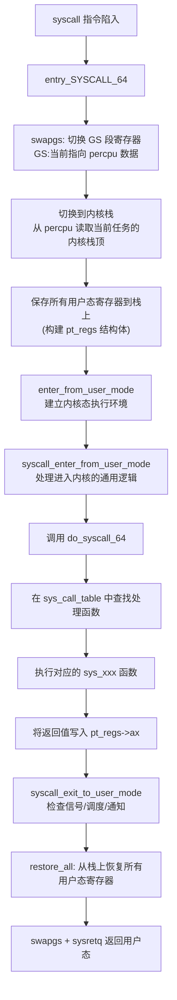

## 技巧2：系统调用流程分析

系统调用（System Call）是用户空间与内核空间之间的唯一合法桥梁。理解系统调用的完整执行流程，是阅读 Linux 内核源码的第一把钥匙——几乎所有内核子系统（文件系统、进程调度、内存管理、网络协议栈）都通过系统调用接口向用户态暴露能力。本节将从触发机制、入口分发、内核处理到返回用户态，完整拆解一次系统调用的生命周期，并提供可复现的源码阅读路径和调试手段。

### 1. 系统调用全景：为什么必须理解它

#### 1.1 系统调用的本质

应用程序运行在 CPU 的用户态（User Mode，Ring 3），无法直接访问硬件、修改页表或操作内核数据结构。当程序需要读写文件、创建进程、分配内存等操作时，必须通过**系统调用**陷入内核态（Kernel Mode，Ring 0），由内核代为执行。

整个过程可以概括为三步：

1. 用户程序将系统调用号和参数放入约定寄存器
2. 触发特定指令（`syscall`/`int 0x80`），CPU 切换到内核态
3. 内核根据调用号在系统调用表中找到处理函数，执行后返回结果

这个设计体现了微内核思想的延伸——操作系统将硬件管理、进程隔离、资源分配等核心能力封装在内核中，用户态程序只能通过这一受控的接口间接使用。Linux 选择了**宏内核**架构（所有子系统运行在内核态），系统调用是其与用户态之间的唯一闸口。

#### 1.2 系统调用与其他内核入口的区别

初学者容易混淆系统调用与其他内核执行路径，明确区分有助于建立正确的认知框架：

| 入口类型 | 触发方式 | 上下文 | 典型场景 | 是否可睡眠 |
|---------|---------|--------|---------|-----------|
| 系统调用 | `syscall`/`int 0x80` 指令 | 进程上下文 | `open()`、`read()`、`fork()` | 可以 |
| 硬件中断（IRQ） | 硬件电信号 | 中断上下文 | 网卡收包、磁盘 I/O 完成 | 不可以 |
| 软中断 / Tasklet | 内核延迟处理 | 中断上下文 | 网络 softirq、定时器回调 | 不可以 |
| 内核线程 | 调度器调度 | 进程上下文 | `kswapd`（内存回收）、`kworker` | 可以 |

关键区别：系统调用运行在**进程上下文**中，拥有完整的用户态堆栈和信号掩码，因此可以触发调度、等待 I/O、分配大块内存——这是中断上下文做不到的。中断上下文中使用 `GFP_ATOMIC` 标志分配内存，不能调用可能睡眠的函数（如 `kmalloc(GFP_KERNEL)`、`mutex_lock()`），否则会导致内核死锁。

#### 1.3 现代 x86_64 上的两条路径

在 x86_64 架构上，系统调用有两条历史路径：

- **`syscall` 指令**（现代路径，AMD64 引入）：通过 `MSR_LSTAR` 寄存器保存的入口地址直接跳转，不经过中断描述符表（IDT），速度更快。这是当前 64 位程序的默认路径
- **`int 0x80` 指令**（传统路径）：通过 IDT 中的 0x80 号中断描述符跳转，兼容 32 位程序，需要经过 IDT 查找和 CPL（当前特权级）切换，性能略低

现代 64 位用户态库（glibc）默认使用 `syscall` 指令，只有在 32 位兼容模式下才走 `int 0x80`。两者的关键差异不仅在于入口地址获取方式，还在于 `syscall` 指令不保存完整的中断帧（只保存 RIP→RCX、RFLAGS→R11），而 `int 0x80` 会通过中断门自动保存完整的 SS:RSP、CS:RIP 和 RFLAGS。

### 2. 触发阶段：从用户态到内核态

#### 2.1 用户态的调用链

以 `read(fd, buf, count)` 为例，用户代码调用 `read()` 时实际经历的层次：

用户代码:  read(fd, buf, count)
              ↓
glibc 封装: __read()          // glibc 的弱符号封装
              ↓
glibc 系统调用桩: syscall(__NR_read, fd, buf, count)
              ↓
汇编 stub:  mov rax, __NR_read    // 系统调用号放入 rax
            mov rdi, fd            // 第1个参数放入 rdi
            mov rsi, buf           // 第2个参数放入 rsi
            mov rdx, count         // 第3个参数放入 rdx
            syscall                // 触发陷入

**参数传递约定（x86_64 Linux ABI）：**

| 寄存器 | 用途 | 备注 |
|--------|------|------|
| `rax` | 系统调用号（输入）/ 返回值（输出） | 返回时 rax 被覆写为结果 |
| `rdi` | 第 1 个参数 | |
| `rsi` | 第 2 个参数 | |
| `rdx` | 第 3 个参数 | |
| `r10` | 第 4 个参数 | 注意不是 rcx，因为 `syscall` 指令会把 RIP 保存到 rcx |
| `r8` | 第 5 个参数 | |
| `r9` | 第 6 个参数 | |

Linux 系统调用最多支持 6 个参数。如果需要更多（如 `execveat`），需要将参数打包成结构体指针传递。这也是为什么 `clone3`（5.3 引入）采用结构体传参，替代了原来通过寄存器拼凑标志位的 `clone`。

#### 2.2 `syscall` 指令的硬件行为

`syscall` 指令在 CPU 硬件层面执行以下操作：

1. 将当前 `RIP`（下一条指令的地址，即返回地址）保存到 `RCX` 寄存器
2. 将当前 `RFLAGS` 保存到 `R11` 寄存器
3. 从 `MSR_LSTAR` 寄存器读取入口地址，跳转到内核的 `entry_SYSCALL_64`
4. 根据 `IA32_EFER.SCE` 位（SYSCALL Enable）检查是否启用，根据 `IA32_FMASK` 屏蔽指定的中断标志位（通常屏蔽 IF 位，禁止可屏蔽中断）

这一切在单条指令周期内完成，不涉及中断描述符表查找、特权级门检查等软件开销，比 `int 0x80` 快约一倍。

**`int 0x80` 的对比路径：**

1. CPU 在 IDT 中查找第 0x80 号描述符
2. 检查描述符的 DPL（描述符特权级）≥ CPL（当前特权级），否则触发 GP 异常
3. 从 TSS（任务状态段）加载内核栈指针（SS0:RSP0）
4. 依次压入 SS、RSP、RFLAGS、CS、RIP（形成中断栈帧）
5. 跳转到中断描述符中记录的处理函数入口

整个过程涉及多次内存访问（IDT 查表、TSS 读取、栈帧压入），开销显著高于 `syscall` 指令。

#### 2.3 查看系统调用号映射表

系统调用号定义在两个关键文件中：

- **通用头文件**：`include/uapi/asm-generic/unistd.h`（新版内核，定义通用调用号）
- **架构特定**：`arch/x86/entry/syscalls/syscall_64.tbl`（x86_64，映射调用号到函数名）

查看当前系统的映射：

```bash
# 查看 x86_64 系统调用号
ausyscall --dump 2>/dev/null || grep -E '^[0-9]+' /usr/include/x86_64-linux-gnu/asm/unistd_64.h

# 或直接从内核源码
grep 'read' arch/x86/entry/syscalls/syscall_64.tbl
# 输出: 0    common    read    sys_read
```

`syscall_64.tbl` 的格式为：`调用号  类型  调用名  函数名`。其中类型字段的含义：
- `common`：64 位和 32 位共用
- `64`：仅 64 位可用
- `x32`：x32 ABI 专用（32 位指针 + 64 位 long）
- `compat`：32 位兼容程序使用

也可以通过 `/proc` 在运行时观察：

```bash
# 查看某个进程最近一次系统调用的号和参数
cat /proc/<pid>/syscall
# 输出示例: 0 0x3 0x7ffc12340000 0x1000
# 含义: syscall 0(read), fd=3, buf=0x7ffc..., count=4096
```

#### 2.4 高频系统调用的绕过机制：vDSO 与 vsyscall

有些系统调用被调用得极其频繁（如 `gettimeofday()`、`clock_gettime()`），每次都要陷入内核态的开销不可接受。Linux 提供了两种绕过机制：

**vDSO（virtual Dynamic Shared Object）：** 现代方案。内核将一小段可以直接在用户态执行的代码映射到每个进程的地址空间（通常在 `0x7ffff7fc0000` 附近），这段代码能直接读取内核映射到用户态的只读数据（如时钟信息、CPU 信息），无需陷入内核。

```bash
# 查看进程的 vDSO 映射
cat /proc/<pid>/maps | grep vdso
# 输出: 7ffff7fc0000-7ffff7fc2000 r-xp 00000000 00:00 0  [vdso]

# 查看 vDSO 中导出的符号
objdump -T /proc/<pid>/exe 2>/dev/null  # 不太好用
# 更好的方法：用 gdb
gdb -batch -ex "sharedlibrary /lib64/ld-linux-x86-64.so.2" -ex "info sharedlibrary" <pid>
```

vDSO 的实现原理：内核在进程创建时（`arch/x86/entry/vdso/vma.c`），将编译好的 vDSO 共享库映射到进程的只读可执行段。该映射区域可以通过内核页表的用户态可见属性读取，但用户态无法修改。glibc 的 `__vdso_gettimeofday()` 函数会在调用 `gettimeofday()` 时优先尝试 vDSO，只有 vDSO 不可用时才回退到真正的系统调用。

**vsyscall（legacy）：** 旧方案。内核在固定的虚拟地址（`0xffffffffff600000`）映射了一个可执行页面，包含 `gettimeofday`、`time`、`clock_gettime` 三个函数。问题是地址固定，容易被 RET2VSYSCALL 攻击利用。从内核 5.12 开始默认禁用（`vsyscall=none`），5.15 之后完全移除。

```bash
# 检查当前系统的 vsyscall 状态
cat /proc/cmdline | grep -o 'vsyscall=[a-z]*'
# 或
cat /proc/sys/abi/vsyscall64  # 0=禁用, 1=模拟
```

### 3. 入口阶段：entry_SYSCALL_64 的执行流程

#### 3.1 入口函数的完整流程

当 `syscall` 指令跳转到内核后，首先执行的是 `entry_SYSCALL_64`（定义在 `arch/x86/entry/entry_64.S` 中）。这是用汇编语言编写的入口点，负责建立内核执行环境。

用 mermaid 流程图展示其核心步骤：



**`swapgs` 指令的作用：**

`swapgs` 是一条特殊的 MSR 交换指令，它将 `GS.base` 寄存器的值与 `MSR_GS_KERNEL_BASE` 的值互换。进入内核时，`GS.base` 被切换到指向当前 CPU 的 percpu 数据区（存放 `current` 指针、中断栈顶等关键信息）；返回用户态时再次 `swapgs`，恢复原始的 `GS.base`（指向用户态的 TLS 段）。

这避免了每次进入内核都要读取 GDT/IDT 来查找 percpu 数据，是性能优化的关键设计。`swapgs` 只在 x86 上存在，ARM64 使用 `TPIDR_EL1` 系统寄存器存放 percpu 基址，不需要类似的交换操作。

#### 3.2 关键数据结构：pt_regs

`pt_regs` 是系统调用流程中最核心的数据结构，它保存了陷入内核瞬间的所有 CPU 寄存器状态。定义在 `arch/x86/include/asm/ptrace.h` 中：

```c
struct pt_regs {
    /*
     * C ABI says these regs are callee-preserved. They are not saved on kernel entry
     * unless syscall needs a complete, fully filled "struct pt_regs".
     */
    unsigned long r15;
    unsigned long r14;
    unsigned long r13;
    unsigned long r12;
    unsigned long bp;
    unsigned long bx;
    /* These regs are callee-clobbered. Always saved on kernel entry. */
    unsigned long r11;
    unsigned long r10;
    unsigned long r9;
    unsigned long r8;
    unsigned long ax;
    unsigned long cx;
    unsigned long dx;
    unsigned long si;
    unsigned long di;
    unsigned long orig_ax;
    /* Return frame for iretq */
    unsigned long ip;
    unsigned long cs;
    unsigned long flags;
    unsigned long sp;
    unsigned long ss;
    /* top of stack page */
};
```

**`orig_ax` 字段特别重要：** 它保存了原始的系统调用号。在 x86_64 ABI 中，`rax` 在系统调用返回时被覆写为返回值，因此需要 `orig_ax` 来保留原始调用号，以便以下场景使用：
- **信号处理**：`do_signal()` 需要知道系统调用号来决定是否重启被信号中断的系统调用
- **ptrace 跟踪**：调试器需要读取原始调用号来记录系统调用历史
- **seccomp 过滤器**：需要知道调用号来进行策略匹配
- **audit 审计**：需要记录实际发生了哪个系统调用

**为什么寄存器保存顺序是这样的？**

结构体中寄存器的排列顺序并不是按照 x86_64 ABI 的编号，而是按照 `entry_64.S` 中 `PUSH_AND_CLEAR_REGS` 宏的实际压栈顺序。Callee-saved 寄存器（r15-bx）在前，callee-clobbered 寄存器（r11-di）在后。这个排列与汇编代码一一对应，方便调试时在栈上直接读取。

#### 3.3 do_syscall_64：分发核心

`do_syscall_64` 是从汇编入口到 C 语言处理函数的桥梁，定义在 `arch/x86/entry/common.c` 中：

```c
static noinstr void do_syscall_64(struct pt_regs *regs)
{
    unsigned long nr = regs->orig_ax;  // 取出系统调用号

    instrumentation_begin();

    if (likely(nr < NR_syscalls)) {    // 检查调用号合法性
        regs->ax = sys_call_table[nr](   // 调用对应的处理函数
            regs->di, regs->si, regs->dx,
            regs->r10, regs->r8, regs->r9
        );
    }

    instrumentation_end();
}
```

这段代码虽然简短，但包含了几个关键设计：

- **`noinstr` 属性**：标记为不可被 instrumentation（如 kprobes、eBPF）插入探针，因为它处于入口的关键路径——如果探针代码本身需要系统调用，会导致无限递归
- **`likely()` 分支预测提示**：绝大多数系统调用号都是合法的，提示 CPU 预测走成功分支
- **直接从 `pt_regs` 取参数**：用户态参数已经通过寄存器保存在 `pt_regs` 中，无需额外复制。函数调用时参数通过寄存器传递（rdi/rsi/rdx/r10/r8/r9），恰好对应 `pt_regs` 中的字段偏移
- **`NR_syscalls` 边界检查**：防止恶意用户态传入越界调用号，避免内核崩溃

#### 3.4 系统调用表（sys_call_table）

`sys_call_table` 是一个函数指针数组，在内核启动时初始化，定义在 `arch/x86/entry/syscall_64.tbl`，通过脚本自动生成 `arch/x86/include/generated/call-table.h`：

```c
const syscall_fn_t sys_call_table[__NR_syscall_max+1] = {
    [0] = sys_read,
    [1] = sys_write,
    [2] = sys_open,
    [3] = sys_close,
    // ... 数百个条目
    [548] = sys_hello_kernel,  // 你的自定义系统调用
};
```

系统调用表在运行时是**只读**的（通过 `__ro_after_init` 标记），防止被 rootkit 篡改。但如果内核开启了 `CONFIG_SECURITY_LOCKDOWN_LSM`，连运行时修改都会被阻止。

### 4. 处理阶段：sys_read 的完整执行路径

以 `read` 系统调用为例，追踪其在内核中的处理流程。

#### 4.1 系统调用表注册

在 `arch/x86/entry/syscalls/syscall_64.tbl` 中：

0    common    read        sys_read

对应的 C 声明在 `include/linux/syscalls.h` 中：

```c
SYSCALL_DEFINE3(read, unsigned int, fd, char __user *, buf, size_t, count)
{
    return ksys_read(fd, buf, count);
}
```

#### 4.2 SYSCALL_DEFINE 宏的秘密

`SYSCALL_DEFINE` 宏系列是内核定义系统调用的标准方式。数字后缀（0-6）表示参数个数：

| 宏 | 用途 | 示例 |
|----|------|------|
| `SYSCALL_DEFINE0(name)` | 无参数系统调用 | `getpid()`、`getuid()` |
| `SYSCALL_DEFINE1(name, ...)` | 1 个参数 | `close(fd)` |
| `SYSCALL_DEFINE2(name, ...)` | 2 个参数 | `pipe(fds)` |
| `SYSCALL_DEFINE3(name, ...)` | 3 个参数 | `read(fd, buf, count)` |
| `SYSCALL_DEFINE4(name, ...)` | 4 个参数 | `pread64(fd, buf, count, pos)` |
| `SYSCALL_DEFINE5(name, ...)` | 5 个参数 | `wait4(pid, stat, opt, rusage)` |
| `SYSCALL_DEFINE6(name, ...)` | 6 个参数 | `clone(flags, stack, ...)` |

`SYSCALL_DEFINE3(read, ...)` 展开后的等效代码大致如下：

```c
long sys_read(unsigned int fd, char __user *buf, size_t count)
{
    long ret;

    // 1. 系统调用审计（audit）
    if (unlikely(syscall_work &amp; SYSCALL_WORK_SYSCALLAudit))
        syscall_trace_enter();

    // 2. __user 指针合法性检查（CONFIG_DEBUG_VM 模式下生效）
    __scm_check_address(buf);

    // 3. 执行实际逻辑
    ret = ksys_read(fd, buf, count);

    // 4. 错误号转负值（内核约定：负返回值表示错误）
    return ret;
}
```

核心要点：

- **`__user` 注解**：这是一个 sparse（稀疏）静态分析工具的注解，标记来自用户空间的指针。内核的 `__user` 检查器（`make C=1` 编译时启用）会检测对这类指针的非法直接解引用，帮助开发者发现潜在的内核崩溃和信息泄露
- **返回值约定**：内核函数返回正数表示成功（字节数），返回负数（如 `-EBADF`）表示错误。glibc 的系统调用桩会检测返回值是否在 `-MAX_ERRNO`（-4095）到 -1 之间，如果是则设置 `errno` 并返回 -1
- **`SYSCALL_WORK_SYSCALLAudit`**：审计钩子允许安全审计子系统记录所有系统调用的参数和返回值，对安全合规场景至关重要

#### 4.3 ksys_read → vfs_read 的调用链

sys_read()
  → ksys_read()
    → fdget_pos(fd)           // 获取文件描述符对应的 file 结构体（增加引用计数）
    → vfs_read(file, buf, count, &pos)   // 进入 VFS 层
      → rw_verify_area(READ, file, pos, count)  // 权限检查 + 安全模块（LSM）
      → call_read_iter(file, &kiocb, &iter)     // 调用具体文件系统的 read 实现
        → file->f_op->read_iter(...)             // 函数指针分发（VFS 的核心多态机制）
          → ext4_file_read_iter()                // ext4 文件系统
          → proc_reg_read_iter()                 // /proc 伪文件系统
          → nfs_file_read()                      // NFS 网络文件系统
    → fdput_pos(fd)           // 释放文件描述符引用

这调用链体现了 Linux 内核经典的**分层架构**和**多态机制**：

| 层次 | 函数 | 职责 | 设计模式 |
|------|------|------|---------|
| 系统调用入口 | `sys_read` | 参数验证、审计、错误码转换 | 门面模式（Facade） |
| VFS 通用层 | `vfs_read` | 权限检查、锁管理、通用逻辑 | 模板方法（Template Method） |
| 具体文件系统 | `ext4_file_read_iter` | 磁盘布局解析、块分配、缓存管理 | 策略模式（Strategy） |

`file->f_op->read_iter` 是一个函数指针，在文件打开时（`open()` 系统调用）根据文件系统的类型赋值。这是 Linux 内核实现**多态**的核心手段——没有 C++ 的虚函数表，但通过函数指针实现了同样的效果。

#### 4.4 `__user` 指针与 copy_to_user

内核不能直接解引用用户态指针，原因有二：

1. **安全**：用户态指针可能指向内核地址空间，直接解引用会导致内核崩溃或信息泄露（如著名的 Meltdown 攻击就利用了类似的越权读取）
2. **页面错误处理**：用户态页面可能尚未调入物理内存，内核需要通过缺页异常机制安全地触发换入，而非直接访问导致内核 Oops

因此，向用户态写数据必须使用 `copy_to_user()`：

```c
// 简化的内核源码逻辑: include/linux/uaccess.h
static inline unsigned long
copy_to_user(void __user *to, const void *from, unsigned long n)
{
    // 1. 检查地址范围是否在用户地址空间内（TASK_SIZE 以下）
    // 2. 启用 SMAP：stac 指令（Set Access Prevention）
    //    ——临时允许内核访问用户态内存页
    // 3. 执行内存复制（可能触发缺页异常）
    // 4. 禁用 SMAP：clac 指令（Clear Access Prevention）
    // 5. 如果发生页面错误，安全地处理并返回未复制的字节数
}
```

同理，从用户态读数据使用 `copy_from_user()`。在 `read` 系统调用中，最终就是将内核缓冲区的数据通过 `copy_to_user()` 写回用户提供的 `buf`。

**`access_ok()` 检查**：在执行 `copy_to_user` 之前，内核会调用 `access_ok()` 验证目标地址范围：

```c
#define access_ok(addr, size) \
    likely(__range_not_ok(addr, size, user_addr_max()) == 0)
```

这个检查确保用户态指针 + 大小不会超过用户空间的边界（`TASK_SIZE`，x86_64 上通常是 `0x7fffffffffff`），防止用户态传入内核地址范围的指针来读取内核数据。

### 5. 返回阶段：从内核态回到用户态

#### 5.1 返回路径

系统调用处理函数执行完毕后，返回值被写入 `pt_regs->ax`，然后沿原路返回：

sys_xxx() 返回值 → pt_regs->ax
  → syscall_exit_to_user_mode()
    → 检查 TIF_SIGPENDING: 是否有信号待处理
    → 检查 TIF_NEED_RESCHED: 是否需要调度
    → 检查 seccomp 过滤器是否命中
    → 检查 TIF_NOTIFY_RESUME: 用户态通知（如 futex）
    → exit_to_user_mode_loop()
  → syscall_return_slowpath()
    → 处理 ptrace 跟踪点（PTRACE_SYSCALL）
    → 处理审计记录
  → restore_all: 从栈上恢复所有寄存器
  → swapgs + sysretq: 切回用户态

#### 5.2 信号处理时机

系统调用返回是内核检查和投递信号的**关键时机**之一。在 `syscall_exit_to_user_mode_work()` 中：

```c
static void syscall_exit_to_user_mode_work(struct pt_regs *regs)
{
    // 1. 处理即将投递的信号（包括终止进程的致命信号）
    if (thread_flags &amp; TIF_SIGPENDING)
        do_signal(regs);

    // 2. 如果设置了重调度标志，让出 CPU
    if (thread_flags &amp; TIF_NEED_RESCHED)
        schedule();

    // 3. 处理用户态通知（如 futex 唤醒、perf 事件）
    exit_to_user_mode_loop(regs, ti_work);
}
```

这就是为什么信号只在系统调用返回、中断返回等"边界点"才会被投递，而不是在内核执行路径中间突然触发。如果在内核中间触发信号，可能导致数据结构处于不一致状态。

`TIF_SIGPENDING` 标志由 `send_signal()` 设置，`do_signal()` 负责找到待处理的信号并调用 `handle_signal()` 来设置用户态的信号处理函数上下文（通过修改 `pt_regs` 中的 RIP 和 RSP，跳转到用户态的信号处理函数）。

#### 5.3 seccomp 过滤器

seccomp（Secure Computing）是系统调用返回路径上的一道安全关卡。`ptrace` 和 `seccomp` 都可以拦截系统调用，但机制不同：

- **ptrace**：每次系统调用入口/出口发送 `SIGSTOP`，调试器可以修改调用号和参数。用于调试，性能开销大
- **seccomp BPF**：在系统调用入口处运行 BPF 程序过滤调用号，可以决定允许、拒绝（返回错误码）或杀进程。性能开销极小（BPF JIT 编译后只有几条指令），广泛用于容器和沙箱

```c
// seccomp 过滤器的内核入口（简化）
static int __seccomp_filter(int this_syscall, const struct seccomp_data *sd)
{
    // 遍历 BPF 过滤器链
    for (; f; f = f->prev) {
        SECCOMP_RUN_FILTER(f, sd);  // JIT 编译的 BPF 代码
        // 返回 SECCOMP_RET_ALLOW: 放行
        // 返回 SECCOMP_RET_KILL_PROCESS: 终止进程
        // 返回 SECCOMP_RET_ERRNO: 返回错误码给用户态
        // 返回 SECCOMP_RET_TRACE: 通知 ptrace 调试器
    }
}
```

Docker 和 Kubernetes 默认就启用了 seccomp，限制容器内的系统调用范围（通常只允许约 50 个常用调用，阻止 `mount`、`reboot`、`ptrace` 等危险调用）。

#### 5.4 错误码的传递机制

Linux 内核用负数表示错误，`0` 表示成功：

| 值 | 含义 | 场景 |
|----|------|------|
| 正值 | 成功，值为结果 | `read()` 返回读取的字节数 |
| 0 | 成功（无数据） | `read()` 在管道末尾返回 0 |
| `-1` | glibc 通用错误返回 | glibc 将内核负返回值转为 -1 |
| `-EBADF` (-9) | 坏的文件描述符 | 对无效 fd 调用 read |
| `-EFAULT` (-14) | 地址错误 | 用户指针指向非法地址 |
| `-EINTR` (-4) | 被信号中断 | read 在等待数据时被信号打断 |
| `-EINVAL` (-22) | 无效参数 | count 参数为负数 |
| `-ENOMEM` (-12) | 内存不足 | 内核分配内存失败 |
| `-ENOSYS` (-38) | 功能未实现 | 系统调用号存在但未实现 |

**错误码的传递路径：**

内核 sys_xxx() 返回 -EBADF (-9)
  → pt_regs->ax = -9
  → 返回用户态
  → glibc syscall() 桩函数检查 rax 是否在 [-4095, -1] 范围
  → 是：设置 errno = 9, 返回 -1
  → 否：直接返回 rax 的值（成功时的正数结果）

内核内部通过 `IS_ERR()`、`PTR_ERR()`、`ERR_PTR()` 等宏处理指针错误码——将错误码编码在指针的高位（`0xfffffffffffff000` 以上），以返回 `ERR_PTR(-ENOMEM)` 的方式在一个返回值中同时传递指针和错误码：

```c
// include/linux/err.h
#define IS_ERR(x) unlikely((unsigned long)(void *)(x) >= (unsigned long)-MAX_ERRNO)
#define PTR_ERR(x) ((long)(void *)(x))
#define ERR_PTR(x) ((void *)((long)(x)))
```

### 6. 硬件级安全保护：SMAP 与 PAN

现代 CPU 提供了硬件级别的用户态/内核态内存隔离机制，防止内核意外（或被攻击利用）访问用户态内存：

#### 6.1 SMAP（Supervisor Mode Access Prevention）

x86 的 SMAP 特性（Intel Broadwell+ / AMD Zen+）在内核态默认禁止访问用户态地址空间的内存。如果内核尝试直接解引用用户态指针，会触发 `#PF`（页面错误），错误码的 AC 位被置 1。

内核通过 `stac`（Set AC，允许访问）和 `clac`（Clear AC，禁止访问）指令来临时开启/关闭这个保护。`copy_to_user()` 和 `copy_from_user()` 内部就是在 `stac`...`clac` 包围的安全窗口中执行内存复制。

```c
// 简化的 copy_to_user 实现
static inline unsigned long
copy_to_user(void __user *to, const void *from, unsigned long n)
{
    stac();                          // 允许访问用户态内存
    /* 复制操作 — 可能触发缺页异常 */
    __rep_movsq(to, from, n);
    clac();                          // 恢复保护
    return n;  // 简化处理
}
```

#### 6.2 PAN（Privileged Access Never）

ARM64 的 PAN 特性功能类似 SMAP，但在 ARMv8.1 中引入。ARM64 通过 `PAN` 系统寄存器位控制，禁止 EL1（内核态）直接访问 EL0（用户态）映射的页面。

**为什么这很重要？** 没有 SMAP/PAN 时，一个用户态指针被传入内核后，如果内核代码有 bug（如忘记检查 NULL、指针偏移错误），可能导致内核读取/写入任意用户态地址的内存，甚至被攻击者利用来修改内核数据。硬件保护将这类 bug 从"安静的数据损坏"变为"可检测的崩溃"，大幅提高了内核安全性。

### 7. 用 ftrace 追踪系统调用的完整流程

理论理解之后，必须通过实际工具验证。ftrace 是追踪内核函数调用的最佳工具。

#### 7.1 追踪单个系统调用的内核路径

```bash
# 1. 挂载 debugfs（如果尚未挂载）
mount -t debugfs nodev /sys/kernel/debug/

# 2. 进入追踪目录
cd /sys/kernel/debug/tracing

# 3. 追踪 sys_read 的完整调用栈（function_graph 模式）
echo function_graph > current_tracer
echo sys_read > set_graph_function
echo 1 > tracing_on

# 4. 在另一个终端运行测试程序
cat /tmp/testfile

# 5. 查看追踪结果（会显示调用树和每个函数的耗时）
cat trace
# 输出示例：
#  0)               |  sys_read() {
#  0)   0.345 us    |    ksys_read();
#  0)   0.892 us    |  }
#  0)               |  sys_write() {
#  0)   0.234 us    |    ksys_write();
#  0)   0.567 us    |  }

# 6. 清理
echo 0 > tracing_on
echo nop > current_tracer
echo > set_graph_function
```

**function_graph 追踪器的强大之处：** 它不仅显示函数调用关系，还显示每个函数的执行耗时（单位：微秒）。这对于定位系统调用路径上的性能瓶颈非常有用——如果某个文件系统函数耗时异常，就能快速定位到具体的子系统。

#### 7.2 使用 perf 统计系统调用

```bash
# 统计进程的所有系统调用及其耗时
perf stat -e 'syscalls:sys_enter_*' -p <pid> -- sleep 5

# 或用 record + report 查看热点系统调用
perf record -e 'syscalls:sys_enter_*' -p <pid> -- sleep 10
perf report

# 更精细的追踪：记录单个系统调用的参数
perf trace -e read -p <pid>
```

#### 7.3 使用 strace 追踪系统调用序列

```bash
# 追踪进程的所有系统调用
strace -f -e trace=read,write,open,close ./my_program

# 带时间戳和耗时统计
strace -T -c -p <pid>

# 输出示例：
# % time     seconds  usecs/call     calls    errors syscall
# ------ ----------- ----------- --------- --------- --------
#  85.32    0.042658         427       100           read
#  12.45    0.006225          62       100           write
#   2.23    0.001115         112        10           open
# ------ ----------- ----------- --------- --------- --------
# 100.00    0.049998                   210           total
```

**`strace` 的性能陷阱：** `strace` 通过 `ptrace(PTRACE_SYSCALL)` 实现，在每次系统调用的入口和出口都会发送 `SIGSTOP` 并等待调试器处理。这意味着每次系统调用至少额外触发两次上下文切换。对于高频系统调用场景（如数据库每秒数万次 read/write），`strace` 会使程序性能下降 10-100 倍。此时应使用 `perf trace` 或 ftrace，它们对程序行为的影响要小得多。

#### 7.4 使用 eBPF 实时监控系统调用延迟

```bash
# 使用 bcc 工具集
/usr/share/bcc/tools/syscallslatency    # 统计所有系统调用的延迟分布
/usr/share/bcc/tools/opensnoop          # 专门追踪 openat/openat2 家族
/usr/share/bcc/tools/funccount 'sys_*'  # 统计各系统调用调用次数

# 使用 bpftrace 一行命令追踪特定系统调用延迟
bpftrace -e 'tracepoint:raw_syscalls:sys_enter { @[comm] = count(); }'

# 追踪 read 系统调用的延迟直方图
bpftrace -e '
tracepoint:raw_syscalls:sys_enter /id == 0/ { @start[tid] = nsecs; }
tracepoint:raw_syscalls:sys_exit /id == 0/ {
    @usecs = hist((nsecs - @start[tid]) / 1000);
    delete(@start[tid]);
}'
```

eBPF 相比 strace 的优势：程序执行 BPF 虚拟机中的编译后字节码，不经过 `ptrace` 的上下文切换，性能开销通常在 1-5% 以内。

### 8. 跨架构对比：x86_64 vs ARM64

理解系统调用不能局限于 x86_64。ARM64 是当前最重要的非 x86 架构（广泛用于手机、服务器、嵌入式），其系统调用机制有显著差异：

| 特性 | x86_64 | ARM64 |
|------|--------|-------|
| 触发指令 | `syscall` | `svc #0`（Supervisor Call） |
| 调用号寄存器 | `rax` | `x8` |
| 参数寄存器 | rdi, rsi, rdx, r10, r8, r9 | x0, x1, x2, x3, x4, x5 |
| 返回值寄存器 | `rax` | `x0` |
| 入口函数 | `entry_SYSCALL_64` | `el0_sync_handler` → `el0_svc_common` |
| percpu 基址 | GS 段寄存器（swapgs） | `TPIDR_EL1` 系统寄存器 |
| 调用号表 | `syscall_64.tbl` | `include/uapi/asm-generic/unistd.h` |
| 最大调用数 | ~450+ | ~450+（共用 asm-generic 定义） |

**ARM64 的 SVC 路径：**

用户态: svc #0  →  CPU 异常（同步异常）  →  EL1t/EL1h
  → el0_sync_handler()
    → el0_svc_common()
      → invoke_syscall(regs, scno, sys_call_table)
        → sys_call_table[scno](x0, x1, x2, x3, x4, x5)

ARM64 使用同步异常机制（而不是像 x86 那样用特殊指令），CPU 从 EL0 切到 EL1 后进入 `vectors` 表（`arch/arm64/kernel/entry.S`），再分发到 `el0_sync` 向量。

**共享的抽象层：** 尽管入口不同，x86_64 和 ARM64 在 `do_syscall_64` / `invoke_syscall` 之后都进入了相同的 C 语言处理函数（`sys_read`、`sys_write` 等）。这是因为 Linux 从 3.x 版本开始将系统调用实现从架构代码中解耦，通用逻辑放在 `kernel/` 和 `fs/` 中，架构代码只负责入口和返回。这也是为什么你能从 `include/uapi/asm-generic/unistd.h` 中找到跨架构共用的调用号定义。

### 9. 32 位与 64 位系统调用的差异

| 特性 | 32 位 (int 0x80) | 64 位 (syscall) |
|------|-------------------|-----------------|
| 触发指令 | `int 0x80` | `syscall` |
| 调用号寄存器 | `eax` | `rax` |
| 参数寄存器 | `ebx, ecx, edx, esi, edi, ebp` | `rdi, rsi, rdx, r10, r8, r9` |
| 最大参数数 | 6 | 6 |
| 调用号范围 | 0-452 | 0-450+ |
| 性能开销 | ~100+ 时钟周期 | ~50 时钟周期 |
| 入口函数 | `entry_INT80_32` | `entry_SYSCALL_64` |
| 栈帧保存 | 完整中断栈帧（SS, ESP, EFLAGS, CS, EIP） | 仅 RIP→RCX, RFLAGS→R11 |

64 位内核还支持 `compat` 系统调用入口，允许 32 位程序在 64 位内核上运行，通过 `entry_SYSCALL_compat` 路径处理。这个路径在 64 位内核上将 32 位参数（如 32 位指针）进行符号扩展或零扩展后，调用同一个内核处理函数。

### 10. 常见误区与排查技巧

#### 10.1 误区一：系统调用号是固定的

不同架构的系统调用号不同，同一架构在不同内核版本间也可能新增或废弃系统调用（如 `stat` 在 x86_64 上没有，被 `newfstatat` 替代）。永远不要硬编码系统调用号，应该使用 `<asm/unistd.h>` 中的 `__NR_xxx` 宏。

```c
// 错误示范
long ret = syscall(0, fd, buf, count);  // 假设 read 是 0

// 正确示范
long ret = syscall(__NR_read, fd, buf, count);
```

#### 10.2 误区二：系统调用一定比用户态函数快

系统调用涉及完整的上下文切换（用户态→内核态→用户态），即使是最简单的系统调用也有数百纳秒的固定开销。在高频场景下，应考虑：

- **vDSO**：如 `gettimeofday()`、`clock_gettime()` 等时间函数已经通过 vDSO 避免了真正的系统调用
- **`io_uring`**：批量提交 I/O 操作，通过共享的环形缓冲区与内核通信，一次 `io_uring_enter` 系统调用可以提交数百个 I/O 请求，大幅减少系统调用次数
- **用户态内存分配**：`mmap` 一次映射大块内存后，在用户态使用 `brk`/`sbrk` 管理，避免频繁的 `brk` 系统调用
- **`getrandom()` 的非系统调用路径**：在熵池已初始化后，`getrandom()` 使用 vDSO 读取 CSPRNG 输出，无需系统调用

#### 10.3 误区三：strace 会改变程序行为

`strace` 通过 `ptrace` 机制实现，在每次系统调用的入口和出口都插入一次 `SIGSTOP`，可能显著改变程序的时序行为。对于涉及竞态条件或多线程的 bug，`strace` 可能隐藏或改变问题。此时应使用 `perf trace` 或 ftrace，它们对程序行为的影响更小。

另外，`strace -f` 跟踪多进程程序时，会对每个子进程单独 `ptrace`，可能导致 `fork()` 的时序发生显著变化。

#### 10.4 误区四：errno 是全局变量

在现代 glibc 中，`errno` 实际是线程局部存储（TLS），每个线程有独立的 `errno`。但在内核中，错误码通过 `regs->ax` 传递（负值），由 glibc 桩函数在返回用户态前写入 TLS 的 `errno` 位置。多线程程序中两个线程可以有不同的 `errno` 值，不会互相干扰。

#### 10.5 误区五：所有系统调用都在 syscall_64.tbl 中

一些系统调用不走 `syscall_64.tbl` 注册，而是通过其他机制实现：

- **vDSO 函数**：如 `clock_gettime`，在支持 vDSO 的系统上根本不是系统调用
- **io_uring**：通过共享内存的提交队列和完成队列异步执行 I/O，只有 `io_uring_setup`、`io_uring_enter`、`io_uring_register` 三个系统调用
- **perf_event_open**：虽然在表中，但其内部使用了特殊的 bypass 路径

### 11. 深入源码的阅读路径

如果希望进一步研究系统调用机制，推荐以下源码阅读顺序：

**第一阶段：理解入口**
1. `arch/x86/entry/entry_64.S` → `entry_SYSCALL_64`（汇编入口，理解寄存器保存和 swapgs）
2. `arch/x86/entry/common.c` → `do_syscall_64`（从汇编到 C 的桥梁）

**第二阶段：理解分发**
3. `arch/x86/entry/syscalls/syscall_64.tbl`（系统调用号映射表）
4. `include/linux/syscalls.h`（`SYSCALL_DEFINE` 宏定义和系统调用声明）
5. `include/uapi/asm-generic/unistd.h`（通用调用号定义）

**第三阶段：理解具体系统调用**
6. `fs/read_write.c` → `ksys_read`（文件读取的完整路径，经过 VFS 层）
7. `fs/open.c` → `do_sys_openat2`（文件打开的完整路径，涉及路径解析和权限检查）
8. `kernel/fork.c` → `kernel_clone`（进程创建的完整路径，涉及 mm_struct 和 task_struct 的复制）

**第四阶段：理解返回和信号**
9. `kernel/signal.c` → `do_signal` → `handle_signal`（信号处理，涉及用户态上下文修改）
10. `arch/x86/entry/common.c` → `syscall_exit_to_user_mode`（返回路径的完整逻辑）

**第五阶段：理解安全机制**
11. `kernel/seccomp.c` → `__seccomp_filter`（seccomp BPF 过滤器的执行路径）
12. `arch/x86/entry/vdso/` 目录（vDSO 的实现，包含 .S 和 .c 文件）
13. `include/linux/uaccess.h`（copy_to_user / copy_from_user 的实现，理解 SMAP 交互）

### 12. 实战练习

#### 练习一：添加自定义系统调用

在内核中添加一个打印 "Hello from kernel" 的系统调用，并从用户态调用它：

```bash
# 1. 在 syscall_64.tbl 中添加条目（选择一个未使用的调用号）
echo "548    common    hello_kernel    sys_hello_kernel" \
    >> arch/x86/entry/syscalls/syscall_64.tbl

# 2. 在 include/linux/syscalls.h 的末尾添加声明
# 注意：添加在 #endif 之前
cat >> include/linux/syscalls.h << 'EOF'
asmlinkage long sys_hello_kernel(void);
EOF

# 3. 在 kernel/sys.c 中实现
cat >> kernel/sys.c << 'EOF'
SYSCALL_DEFINE0(hello_kernel)
{
    pr_info("Hello from kernel! Current process: %s (pid=%d)\n",
            current->comm, current->pid);
    return 0;
}
EOF

# 4. 重新生成系统调用表（如果配置了 CONFIG_IA32_EMULATION 也需要检查）
make arch/x86/entry/syscalls/syscall_64.tbl

# 5. 编译内核
make -j$(nproc)

# 6. 安装并重启
sudo make modules_install
sudo make install
sudo reboot
```

重启后，编写用户态测试程序：

```c
// test_hello.c
#include <stdio.h>
#include <unistd.h>
#include <sys/syscall.h>

#define __NR_hello_kernel 548

int main() {
    long ret = syscall(__NR_hello_kernel);
    printf("syscall returned: %ld\n", ret);

    // 查看内核日志
    printf("Check dmesg for kernel output: dmesg | tail\n");
    return 0;
}
```

```bash
gcc -o test_hello test_hello.c
./test_hello
dmesg | tail  # 应该能看到 "Hello from kernel! Current process: test_hello (pid=xxx)"
```

**验证要点：**
- `strace ./test_hello` 可以看到系统调用号 548 和返回值 0
- `cat /proc/<pid>/syscall` 在程序运行时可以看到当前系统调用信息
- `perf trace ./test_hello` 可以看到系统调用而不影响程序行为

#### 练习二：用 ftrace 追踪 fork 的完整路径

```bash
#!/bin/bash
# track_fork.sh - 追踪 fork 系统调用的内核路径
TRACEDIR=/sys/kernel/debug/tracing

# 确保 debugfs 已挂载
mount -t debugfs nodev $TRACEDIR 2>/dev/null

echo 0 > $TRACEDIR/tracing_on
echo function_graph > $TRACEDIR/current_tracer
echo __x64_sys_fork > $TRACEDIR/set_graph_function
echo 15 > $TRACEDIR/max_graph_depth  # 追踪子函数调用深度
echo 1 > $TRACEDIR/tracing_on

# 编写并编译 fork 测试程序
cat > /tmp/fork_test.c << 'EOF'
#include <unistd.h>
#include <stdio.h>
#include <sys/wait.h>

int main() {
    printf("Before fork (pid=%d)\n", getpid());

    pid_t pid = fork();
    if (pid == 0) {
        // 子进程：打印信息后立即退出
        printf("Child: pid=%d, ppid=%d\n", getpid(), getppid());
        return 42;  // 子进程退出码
    } else if (pid > 0) {
        // 父进程：等待子进程
        printf("Parent: child_pid=%d\n", pid);
        int status;
        waitpid(pid, &amp;status, 0);
        printf("Parent: child exited with status=%d\n", WEXITSTATUS(status));
    } else {
        perror("fork failed");
        return 1;
    }
    return 0;
}
EOF
gcc -o /tmp/fork_test /tmp/fork_test.c
/tmp/fork_test

# 输出追踪结果
sleep 1
echo "--- Fork system call trace ---"
cat $TRACEDIR/trace | head -100

# 清理
echo 0 > $TRACEDIR/tracing_on
echo nop > $TRACEDIR/current_tracer
echo > $TRACEDIR/set_graph_function
echo 0 > $TRACEDIR/max_graph_depth
```

#### 练习三：用 eBPF 编写系统调用频率统计器

```python
#!/usr/bin/env python3
# syscall_counter.py - 用 bcc 统计进程的系统调用频率
# 依赖: pip3 install bcc (需要 root 权限)
from bcc import BPF

bpf_program = """
#include <uapi/linux/ptrace.h>
#include <linux/sched.h>

struct syscall_event_t {
    u64 pid;
    u32 syscall_nr;
    char comm[TASK_COMM_LEN];
};

BPF_PERF_OUTPUT(events);
BPF_HASH(count, u32, u64);

TRACEPOINT_PROBE(raw_syscalls, sys_enter) {
    u32 nr = args->id;
    u64 *val = count.lookup(&amp;nr);
    if (val) {
        __sync_fetch_and_add(val, 1);
    } else {
        u64 init = 1;
        count.update(&amp;nr, &amp;init);
    }

    struct syscall_event_t event = {};
    event.pid = bpf_get_current_pid_tgid();
    event.syscall_nr = nr;
    bpf_get_current_comm(&amp;event.comm, sizeof(event.comm));
    events.perf_submit(args, &amp;event, sizeof(event));
    return 0;
}
"""

b = BPF(text=bpf_program)

def print_event(cpu, data, size):
    event = b["events"].event(data)
    print(f"PID={event.pid} COMM={event.comm.decode()} SYSCALL={event.syscall_nr}")

b["events"].open_perf_buffer(print_event)

import time
print("Collecting syscall statistics for 10 seconds...")
print("Press Ctrl+C to stop\n")
start = time.time()
while time.time() - start < 10:
    b.perf_buffer_poll()

# 打印统计结果
print("\n--- Syscall frequency (top 15) ---")
count_map = b.get_table("count")
results = []
for k, v in count_map.items():
    results.append((k.value, v.value))
results.sort(key=lambda x: x[1], reverse=True)

for nr, cnt in results[:15]:
    print(f"  syscall {nr:>4d}: {cnt:>8d} calls")
```

### 13. 本节小结

系统调用流程分析是内核源码阅读的核心技能。掌握了从用户态陷入、入口分发、VFS 层分发到返回路径的完整流程，就具备了分析任何内核子系统入口的能力。核心要点回顾：

1. **触发**：用户态通过 `syscall`（x86_64）或 `svc`（ARM64）指令将控制权交给内核，参数通过约定的寄存器传递
2. **保存**：入口汇编代码通过 `swapgs` 切换 percpu，保存所有用户态寄存器到栈上的 `pt_regs` 结构体
3. **分发**：`do_syscall_64` 根据 `orig_ax` 在 `sys_call_table` 中查找并调用处理函数
4. **处理**：具体函数通过 VFS 等中间层的函数指针分发到实际实现（如 ext4、proc）
5. **返回**：在返回用户态之前检查信号、调度需求和 seccomp 过滤，然后恢复寄存器并通过 `sysretq` 返回
6. **优化**：vDSO 和 io_uring 等机制减少了不必要的系统调用开销
7. **调试**：ftrace、perf、strace、eBPF 是追踪系统调用的四大利器，各有适用场景
