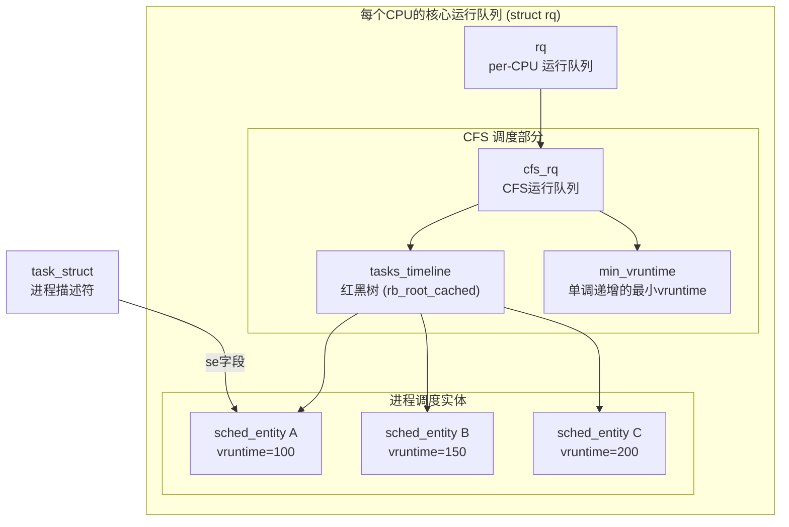
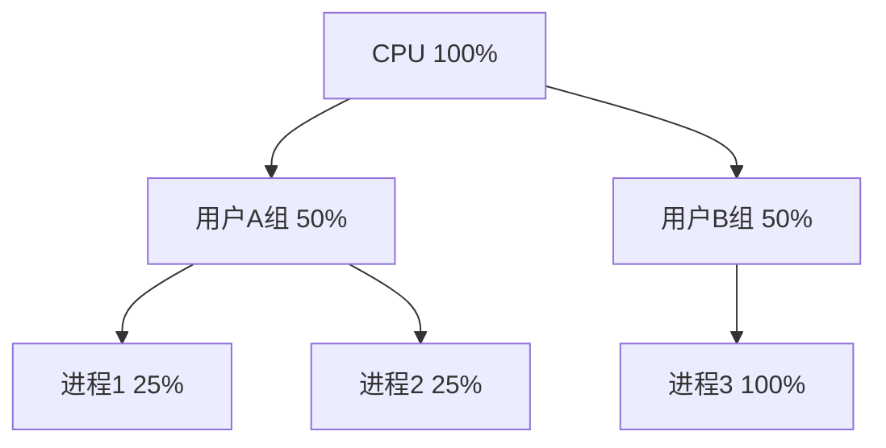

## 技巧3：进程调度器CFS

进程调度器是操作系统内核最核心的子系统之一——它决定每个可运行进程何时获得 CPU、获得多少 CPU 时间。Linux 内核的调度器经历了多次重大重构：从 2.4 的 O(n) 调度器，到 2.6 早期的 O(1) 调度器，再到 2.6.23 引入的 CFS（Completely Fair Scheduler，完全公平调度器），直至 6.6 引入的 EEVDF（Earliest Elapsed Virtual Deadline First）。CFS 是当前 Linux 内核中使用最广泛的调度器（`SCHED_NORMAL` / `SCHED_BATCH` 策略），理解它的设计原理和源码实现，是读懂进程管理子系统的关键一步。

本节将从 CFS 的设计动机出发，完整拆解 vruntime 公平性算法、红黑树组织、调度时机判断、负载均衡机制，并提供可复现的源码阅读路径和调试手段。

### 1. 调度器演进：为什么需要 CFS

#### 1.1 三个时代的调度器

Linux 调度器的演进历程本身就是操作系统设计权衡的经典案例：

| 时代 | 内核版本 | 算法 | 优点 | 致命缺陷 |
|------|---------|------|------|----------|
| O(n) 调度器 | 2.4 及以前 | 遍历所有任务计算权重 | 简单直观 | 任务数↑ → 调度延迟线性增长，千级进程时明显卡顿 |
| O(1) 调度器 | 2.6.0 – 2.6.22 | 双优先级队列 + 位图 | 恒定时间完成调度 | 交互性判断依赖启发式，不公平，多核负载均衡差 |
| CFS 调度器 | 2.6.23 – 6.5 | 虚拟运行时间 + 红黑树 | 公平、可预测、无需启发式 | 实现复杂度高 |
| EEVDF 调度器 | 6.6+ | 虚拟截止时间 | 延迟有界、可调度性保证 | 新引入，生态仍在适配 |

#### 1.2 O(1) 调度器的核心问题

O(1) 调度器使用两个固定优先级数组（active / expired），通过位图在 O(1) 时间内找到最高优先级任务。它的设计目标是高性能，但存在三个根本缺陷：

**缺陷一：交互性判断依赖启发式**。O(1) 通过追踪进程的 sleep 时间来判断它是"交互式"还是"批处理式"，并给予交互式进程更高的动态优先级。但这种启发式判断在多进程环境下极不可靠——一个 CPU 密集型进程的 sleep/wake 行为可能被误判为交互式，获得不应有的高优先级。

**缺陷二：不公平性**。同优先级的任务之间按 FIFO 顺序运行，而非按比例分配 CPU 时间。如果两个 nice=0 的进程竞争 CPU，先运行的进程可能独占 CPU 直到时间片用完，而不是与另一个进程交替执行。

**缺陷三：多核负载均衡差**。O(1) 的负载均衡算法基于简单的拉取（pull）操作，无法很好地处理不同 CPU 负载差异大的情况。

#### 1.3 CFS 的设计哲学

CFS 的核心思想极其简洁：**模拟理想的多任务处理器**。想象一台无限快的 CPU，所有可运行进程在同一瞬间都同时执行。但在现实中 CPU 只有一个（或有限几个），CFS 的策略是：让每个进程实际运行的时间与其"虚拟运行时间"（vruntime）成正比——vruntime 最小的进程最先被调度。

这个设计的关键优势：
- **无需启发式**：公平性由 vruntime 算法直接保证，不需要猜测进程是交互式还是批处理式
- **可预测**：每个进程获得的 CPU 时间比例由 nice 值决定，行为确定
- **O(log n) 调度复杂度**：通过红黑树维护进程队列，pick_next 为 O(log n)（实际接近 O(1)，因为常取最左节点）
- **天然支持 SMP**：通过负载均衡机制在 CPU 之间迁移进程

### 2. 核心概念：vruntime 与公平性

#### 2.1 虚拟运行时间（vruntime）

CFS 的核心创新是引入"虚拟运行时间"（virtual runtime）的概念。每个 `sched_entity`（调度实体）都有一个 `vruntime` 字段，记录该实体在 CPU 上运行的"虚拟时间"。

vruntime 的更新公式：

vruntime += delta_exec × (NICE_0_LOAD / weight)

其中：
- `delta_exec`：实际执行时间（纳秒）
- `NICE_0_LOAD`：nice=0 进程的标准权重（1024）
- `weight`：当前进程的权重（由 nice 值决定）

**关键理解**：权重越大的进程（nice 值越小），vruntime 增长越慢；权重越小的进程（nice 值越大），vruntime 增长越快。这意味着在相同的 wall-clock 时间内，高权重进程积累的 vruntime 更少，从而在红黑树中排名更靠前，获得更多 CPU 时间。

#### 2.2 nice 值、权重与时间比例

Linux 的 nice 值范围是 -20 到 19（共 40 级），通过查找表映射到权重值。权重定义在 `kernel/sched/core.c` 中：

```c
// kernel/sched/core.c — 权重查找表（节选）
const int sched_prio_to_weight[40] = {
 /* -20 */     88761,     71755,     56483,     46273,     36291,
 /* -15 */     29154,     23254,     18705,     14949,     11916,
 /* -10 */      9548,      7620,      6100,      4904,      3906,
 /*  -5 */      3121,      2501,      1991,      1586,      1277,
 /*   0 */      1024,       820,       655,       526,       423,
 /*   5 */       335,       272,       215,       172,       137,
 /*  10 */       110,        87,        70,        56,        45,
 /*  15 */        36,        29,        23,        18,        15,
};
```

这些权重值不是线性递减的，而是按几何级数排列。这保证了 nice 值每增加 1，进程获得的 CPU 时间比例大约减少 1.25 倍。具体来说：

| nice 值 | 权重 | 相对 nice=0 的 CPU 比例 | 实际含义 |
|---------|------|------------------------|---------|
| -20 | 88761 | 86.7x | 最高优先级前台任务 |
| -10 | 9548 | 9.3x | 高优先级交互进程 |
| 0 | 1024 | 1.0x（基准） | 默认优先级 |
| 10 | 110 | 0.11x | 低优先级批处理 |
| 19 | 15 | 0.015x | 最低优先级（nice 最大） |

两个进程的 CPU 时间比例计算公式：

比例_A : 比例_B = weight_A : weight_B

例如 nice=0（weight=1024）和 nice=5（weight=335）的进程竞争 CPU 时：
- 进程 A 获得：1024 / (1024 + 335) = 75.3% CPU 时间
- 进程 B 获得：335 / (1024 + 335) = 24.7% CPU 时间

#### 2.3 为什么是几何级数而非线性

如果 nice 值每增加 1 只减少固定的 CPU 比例（如 5%），那么 nice=-20 和 nice=0 之间的差距会远大于 nice=0 和 nice=19 之间的差距。几何级数保证了"每增加一个 nice 级别，性能下降约 25%"这一一致性感受，无论在哪个 nice 范围内，用户都能感知到等量的性能差异。

### 3. 关键数据结构

#### 3.1 sched_entity — 调度实体

每个可调度的执行单元（进程或线程）内嵌一个 `sched_entity`，它是 CFS 直接操作的对象：

```c
// include/linux/sched.h
struct sched_entity {
    struct load_weight      load;       // 权重（由 nice 值决定）
    struct rb_node          run_node;   // 红黑树节点
    struct list_head        group_node; // 组调度链表
    unsigned int            on_rq;      // 是否在运行队列上
    u64                     exec_start; // 本次执行的开始时间
    u64                     sum_exec_runtime;   // 总执行时间
    u64                     vruntime;           // 虚拟运行时间
    u64                     prev_sum_exec_runtime; // 上次统计的总执行时间
    u64                     nr_migrations;      // 跨 CPU 迁移次数

    struct sched_statistics statistics; // 调度统计数据

#ifdef CONFIG_FAIR_GROUP_SCHED
    int                     depth;      // 在调度组层次中的深度
    struct sched_entity     *parent;    // 父调度实体
    struct cfs_rq           *cfs_rq;    // 所属的运行队列
    struct cfs_rq           *my_q;      // 拥有的子运行队列（组调度）
#endif
};
```

**关键字段解析**：
- `vruntime`：红黑树的排序键值，决定进程的调度顺序
- `load.weight`：权重值，影响 vruntime 的增长速率
- `run_node`：红黑树节点，使 sched_entity 可以插入 CFS 运行队列的红黑树
- `on_rq`：标记进程是否在 CPU 的运行队列上（TASK_RUNNING 状态）
- `exec_start`：记录最近一次被调度上 CPU 的时间戳，用于计算 delta_exec

#### 3.2 cfs_rq — CFS 运行队列

每个 CPU 维护一个 `cfs_rq` 结构体，它是 CFS 调度器的核心数据结构：

```c
// kernel/sched/sched.h
struct cfs_rq {
    struct load_weight      load;       // 队列总权重
    unsigned int            nr_running; // 可运行进程数
    u64                     exec_clock; // 队列总执行时钟
    u64                     min_vruntime; // 队列最小 vruntime（单调递增）

    struct rb_root_cached   tasks_timeline; // 红黑树（缓存最左节点）

    struct sched_entity     *curr;      // 当前正在运行的实体
    struct sched_entity     *next;      // 下一个被唤醒的实体（跳过红黑树）
    struct sched_entity     *skip;      // 被跳过的实体（yield 操作）
    // ...
};
```

**关键字段解析**：
- `tasks_timeline`：`rb_root_cached` 类型的红黑树，`cached` 字段缓存了最左节点（vruntime 最小的进程），使得 pick_next 操作从 O(log n) 优化到接近 O(1)
- `min_vruntime`：单调递增的最小 vruntime 值，用于新进程或唤醒进程的 vruntime 初始化，防止"饥饿"或"插队"
- `nr_running`：队列中的可运行进程数，用于判断是否需要负载均衡
- `load`：队列总权重，用于 SMP 负载均衡时计算 CPU 间的负载差异

#### 3.3 调度类（sched_class）

Linux 内核使用调度类实现多种调度策略的可插拔架构：

```c
// include/linux/sched/class.h
struct sched_class {
    void (*enqueue_task)(struct rq *rq, struct task_struct *p, int flags);
    void (*dequeue_task)(struct rq *rq, struct task_struct *p, int flags);
    void (*yield_task)(struct rq *rq);
    void (*check_preempt_curr)(struct rq *rq, struct task_struct *p, int flags);
    struct task_struct *(*pick_next_task)(struct rq *rq);
    void (*put_prev_task)(struct rq *rq, struct task_struct *p);
    // ... 更多回调
};
```

调度类按优先级从高到低排列：

| 调度类 | 策略 | 优先级 | 用途 |
|--------|------|--------|------|
| `stop_sched_class` | — | 最高 | 内核内部 CPU 热插拔、迁移 |
| `dl_sched_class` | `SCHED_DEADLINE` | 最高用户态 | 硬实时截止时间调度 |
| `rt_sched_class` | `SCHED_FIFO` / `SCHED_RR` | 高 | 软实时任务 |
| `fair_sched_class` | `SCHED_NORMAL` / `SCHED_BATCH` | 普通 | CFS，绝大多数用户进程 |
| `idle_sched_class` | `SCHED_IDLE` | 最低 | CPU 空闲时运行 |

**关键设计**：高优先级调度类的所有实体被调度完之前，低优先级调度类的任务不会获得 CPU 时间。这意味着一个 `SCHED_FIFO` 进程会独占 CPU 直到它主动让出或被更高优先级任务抢占。

#### 3.4 三大数据结构的关系



### 4. 调度核心流程

#### 4.1 schedule() — 调度的总入口

无论调度器因何种原因被触发，最终都会调用 `schedule()` 函数：

```c
// kernel/sched/core.c（简化）
asmlinkage __visible void __sched schedule(void)
{
    struct task_struct *tsk = current; // 当前进程
    sched_submit_work(tsk);           // 提交未完成的 I/O 工作
    do {
        preempt_disable();            // 禁止抢占
        __schedule(SM_NONE);          // 核心调度逻辑
        sched_preempt_enable_no_resched(); // 重新允许抢占
    } while (need_resched());         // 如果还需要调度，继续循环
}
```

`__schedule()` 是真正执行调度决策的地方：

```c
static void __sched notrace __schedule(unsigned int sched_mode)
{
    struct task_struct *prev, *next;
    struct rq *rq;
    int cpu;

    cpu = smp_processor_id();
    rq = cpu_rq(cpu);
    prev = rq->curr;                  // 获取当前进程

    // 1. 更新当前进程的运行时间统计
    update_curr(cfs_rq_of(prev));

    // 2. 判断下一个要运行的进程
    next = pick_next_task(rq, prev, rf);

    // 3. 如果下一个进程不同于当前进程，执行上下文切换
    if (next != prev) {
        rq->nr_switches++;
        rq->curr = next;
        rq_unlock(rq, rf);
        context_switch(rq, prev, next, rf); // 切换页表、栈、寄存器
    }
}
```

#### 4.2 pick_next_task_fair — CFS 的进程选择

当调度类为 `fair_sched_class` 时，`pick_next_task` 回调调用 `pick_next_task_fair()`：

```c
// kernel/sched/fair.c（简化）
static struct task_struct *pick_next_task_fair(struct rq *rq, ...)
{
    struct cfs_rq *cfs_rq = &amp;rq->cfs;
    struct sched_entity *se;

    // 从红黑树中取出最左节点（vruntime 最小）
    se = __pick_first_entity(cfs_rq);

    // 如果是最左节点的 vruntime 比 min_vruntime 还小
    // 说明该进程已经等待太久，需要修正 vruntime
    if (se &amp;&amp; !entity_preempt(cfs_rq, se))
        se = first_fair(cfs_rq);

    // 通过 sched_entity 找到对应的 task_struct
    struct task_struct *p = task_of(se);
    return p;
}
```

`__pick_first_entity()` 直接使用红黑树缓存的最左节点：

```c
struct sched_entity *__pick_first_entity(struct cfs_rq *cfs_rq)
{
    struct rb_node *left = rb_first_cached(&amp;cfs_rq->tasks_timeline);
    if (!left)
        return NULL;
    return rb_entry(left, struct sched_entity, run_node);
}
```

**为什么是 O(1) 而非 O(log n)**：`rb_root_cached` 结构缓存了红黑树最左节点的位置。只要不发生插入/删除操作，`pick_next` 直接返回缓存的最左节点，无需遍历树。当红黑树结构变化时，缓存自动失效并重新定位。

#### 4.3 update_curr — vruntime 的更新

每次进程被调度上 CPU 或调度下 CPU 时，内核都会更新 vruntime：

```c
// kernel/sched/fair.c
static void update_curr(struct cfs_rq *cfs_rq)
{
    struct sched_entity *curr = cfs_rq->curr;
    u64 now = rq_clock_task(rq_of(cfs_rq)); // 获取当前时钟
    u64 delta_exec;

    delta_exec = now - curr->exec_start;     // 计算本次执行时间
    curr->exec_start = now;                  // 重置起始时间

    curr->sum_exec_runtime += delta_exec;    // 累加总执行时间
    update_min_vruntime(cfs_rq);             // 更新 min_vruntime

    // 核心：更新 vruntime
    update_curr_weight(cfs_rq, curr, delta_exec);
}

static void update_curr_weight(struct cfs_rq *cfs_rq,
                               struct sched_entity *curr, u64 delta_exec)
{
    u64 vruntime = curr->vruntime;

    // vruntime += delta_exec × (NICE_0_LOAD / weight)
    vruntime += calc_delta_fair(delta_exec, curr);

    // 防止 vruntime 溢出，同时保持与 min_vruntime 的合理差距
    curr->vruntime = max_vruntime(curr->vruntime, vruntime);
}
```

#### 4.4 入队与出队：进程状态变化时的处理

**出队（dequeue）**：当进程进入睡眠（TASK_INTERRUPTIBLE / TASK_UNINTERRUPTIBLE）或被终止时：

```c
// kernel/sched/fair.c（简化）
static void dequeue_entity(struct cfs_rq *cfs_rq, struct sched_entity *se, int flags)
{
    // 1. 更新 vruntime
    update_curr(cfs_rq_of(se));

    // 2. 从红黑树中移除
    __ dequeue_entity(cfs_rq, se);

    // 3. 更新统计信息
    update_stats_dequeue(cfs_rq, se, flags);

    // 4. 更新 min_vruntime
    update_min_vruntime(cfs_rq);
}
```

**入队（enqueue）**：当进程被唤醒（从睡眠变为可运行）时：

```c
static void enqueue_entity(struct cfs_rq *cfs_rq, struct sched_entity *se, int flags)
{
    // 1. 更新 vruntime（基于睡眠期间的时间）
    update_curr(cfs_rq_of(se));
    update_stats_enqueue(cfs_rq, se, flags);

    // 2. 修正 vruntime 防止"插队"
    if (flags &amp; ENQUEUE_WAKEUP)
        place_entity(cfs_rq, se, 0);

    // 3. 插入红黑树
    __ enqueue_entity(cfs_rq, se);

    // 4. 更新 min_vruntime
    update_min_vruntime(cfs_rq);
}
```

#### 4.5 place_entity — 唤醒时的 vruntime 修正

新创建或唤醒的进程不能直接使用当前的 vruntime，否则会抢占所有现有进程。`place_entity()` 负责设置合理的初始 vruntime：

```c
static void place_entity(struct cfs_rq *cfs_rq, struct sched_entity *se, int initial)
{
    u64 vruntime = cfs_rq->min_vruntime;

    // 对于唤醒的进程：给予少量补偿（"睡眠公平性"补偿）
    if (initial &amp;&amp; sched_feat(START_DEBIT))
        vruntime += sysctl_sched_latency; // 补偿一个调度延迟

    // 确保 vruntime 不低于 min_vruntime
    se->vruntime = max_vruntime(se->vruntime, vruntime);
}
```

**睡眠公平性**：进程在睡眠期间不消耗 CPU，其 vruntime 不增长。唤醒后如果直接使用当前 vruntime，会因为远低于其他进程的 vruntime 而独占 CPU。CFS 通过将唤醒进程的 vruntime 设为 `min_vruntime + latency` 来解决这个问题——既给予一定补偿（感谢你睡了这么久），又不至于让它独占 CPU。

### 5. 调度触发时机

#### 5.1 五种主要调度触发路径

理解何时触发调度与理解调度算法本身同样重要：

| 触发场景 | 触发函数 | 原因 |
|---------|---------|------|
| 时钟滴答（tick） | `scheduler_tick()` → `entity_tick()` → `check_preempt_tick()` | 检查当前进程是否已运行超过其时间片 |
| 进程唤醒 | `try_to_wake_up()` → `check_preempt_curr()` | 新唤醒的进程 vruntime 更小，抢占当前进程 |
| 进程主动让出 | `sched_yield()` | 将当前进程移到红黑树右侧，让出 CPU |
| 进程睡眠 | `schedule()` 直接调用 | 进程等待 I/O 或资源时主动让出 CPU |
| 多核负载均衡 | `load_balance()` | 定期检查各 CPU 负载差异，迁移进程 |

#### 5.2 时钟滴答与时间片检查

Linux 内核的调度时钟频率由 `CONFIG_HZ` 决定（通常为 250Hz、300Hz 或 1000Hz），每次时钟中断会调用 `scheduler_tick()`：

```c
// kernel/sched/core.c
void scheduler_tick(void)
{
    struct rq *rq = this_rq();
    struct task_struct *curr = rq->curr;

    // 1. 更新调度统计
    curr->sched_class->task_tick(rq, curr, 0);

    // 2. 触发多核负载均衡
    trigger_load_balance(rq);

    // 3. 更新 CPU 性能数据
    perf_event_task_tick();
}
```

对于 CFS 进程，`task_tick` 回调执行 `entity_tick()`，检查当前进程是否应该被抢占：

```c
static void entity_tick(struct cfs_rq *cfs_rq, struct sched_entity *curr, int queued)
{
    // 1. 更新运行统计
    update_curr(cfs_rq);
    update_load_avg(curr, UPDATE_TG);

    // 2. 如果队列中还有其他进程，检查是否需要切换
    if (cfs_rq->nr_running > 1)
        check_preempt_tick(cfs_rq, curr);
}

static void check_preempt_tick(struct cfs_rq *cfs_rq, struct sched_entity *curr)
{
    unsigned long ideal_runtime = sched_slice(cfs_rq, curr); // 当前进程应得的时间片
    u64 delta_exec = curr->sum_exec_runtime - curr->prev_sum_exec_runtime;

    // 如果已运行时间超过理想时间片，标记需要重调度
    if (delta_exec > ideal_runtime) {
        resched_curr(rq_of(cfs_rq)); // 设置 TIF_NEED_RESCHED 标志
        return;
    }

    // 如果已运行时间远小于理想时间片，也检查（防止红黑树不平衡）
    if (delta_exec < ideal_runtime / 2)
        return;

    // 检查 vruntime 是否已经超过 min_vruntime + 理想时间片
    struct sched_entity *se = __pick_first_entity(cfs_rq);
    if (se &amp;&amp; curr->vruntime < se->vruntime)
        return;

    resched_curr(rq_of(cfs_rq));
}
```

`sched_slice()` 计算当前进程在一次调度周期中应得的 CPU 时间：

```c
static u64 sched_slice(struct cfs_rq *cfs_rq, struct sched_entity *se)
{
    // 一个调度周期 = 所有可运行进程各运行一次所需的时间
    u64 slice = sysctl_sched_latency;

    // 如果进程数太多，缩减每个进程的时间片
    // 保证总调度延迟不超过 sysctl_sched_latency
    if (unlikely(cfs_rq->nr_running > sched_nr_latency))
        slice = div_u64(slice * se->load.weight,
                        cfs_rq->load.weight);

    return slice;
}
```

#### 5.3 关键可调参数

CFS 的行为受几个内核可调参数控制：

| 参数 | 默认值 | 含义 |
|------|--------|------|
| `sysctl_sched_latency` | 6ms (6000000ns) | 调度周期——所有进程至少运行一次的最长时间 |
| `sysctl_sched_min_granularity` | 0.75ms | 最小时间粒度——每个进程至少运行的时间 |
| `sysctl_sched_wakeup_granularity` | 1ms | 唤醒抢占粒度——唤醒进程需要比当前进程小多少 vruntime 才能抢占 |
| `sysctl_sched_latency_ns` | 同上 | 纳秒版本 |
| `sysctl_sched_migration_cost` | 0.5ms | 进程迁移的预估开销 |

**调度延迟的含义**：`sysctl_sched_latency = 6ms` 意味着如果有 N 个可运行进程，CFS 保证在 6ms 内所有进程都至少运行一次。当 N > 8（6ms / 0.75ms）时，每个进程的时间片会被缩减到 `sysctl_sched_min_granularity`，但总调度延迟仍然不超过 6ms。

**运行时调整**：

```bash
# 查看当前值
sysctl kernel.sched_latency_ns
sysctl kernel.sched_min_granularity_ns
sysctl kernel.sched_wakeup_granularity_ns

# 调整（对桌面交互性敏感的场景可以减小 latency）
sudo sysctl -w kernel.sched_latency_ns=4000000
sudo sysctl -w kernel.sched_min_granularity_ns=500000

# 永久生效写入 /etc/sysctl.conf
echo "kernel.sched_latency_ns = 4000000" | sudo tee -a /etc/sysctl.conf
```

### 6. SMP 负载均衡

#### 6.1 为什么需要负载均衡

在多核系统上，每个 CPU 维护独立的运行队列。如果不进行负载均衡，可能出现一个 CPU 忙碌而另一个 CPU 空闲的情况。CFS 通过三种机制实现负载均衡：

| 机制 | 触发频率 | 方式 | 适用场景 |
|------|---------|------|---------|
| 主动均衡（active balance） | 时钟滴答时检查 | 从繁忙 CPU 拉取进程到空闲 CPU | 轻度不均衡 |
| 周期性均衡（periodic balance） | `sched_balance_interval` | 定期扫描所有 CPU 的负载 | 常规不均衡 |
| 按需均衡（on-demand） | 进程唤醒时 | 唤醒进程选择最空闲的 CPU | 新进程分配 |

#### 6.2 负载均衡的核心算法

`load_balance()` 是负载均衡的入口函数：

```c
// kernel/sched/fair.c（简化）
static int load_balance(int this_cpu, struct rq *this_rq,
                        struct sched_domain *sd, enum cpu_idle_type idle,
                        int *continue_balancing)
{
    // 1. 找到最繁忙的 CPU
    int busiest_cpu = find_busiest_group(sd, &amp;busiest_group);

    // 2. 从最繁忙 CPU 拉取进程
    int ld_moved = detach_tasks(&amp;tasks, busiest_rq);

    // 3. 将拉取的进程放入当前 CPU
    attach_one_task(this_rq, task);

    return ld_moved;
}
```

`find_busiest_group()` 使用调度域（sched_domain）层次结构来查找负载差异最大的 CPU 组。调度域按硬件拓扑组织：

MT (SMT 超线程域)
  └─ MC (多核域，同一物理 CPU 的多个核心)
      └─ DIE (同一 die 上的所有核心)
          └─ NUMA (跨 NUMA 节点)

先在最细粒度的域（SMT）内均衡，再逐级扩大范围，这样可以优先将进程调度到缓存亲和性最好的 CPU 上。

#### 6.3 每负载均衡（per-load-balancer）与 NUMA

从 5.13 内核开始，CFS 引入了 per-CPU load tracking，使用 PELT（Per-Entity Load Tracking）算法精确追踪每个调度实体和运行队列的负载：

```c
// kernel/sched/pelt.c
static void update_load_avg(struct sched_entity *se, long flags)
{
    // 使用指数衰减平均（EMA）计算负载
    // 衰减因子: 与调度器时钟周期相关
    // 更新 entity 的 avg.load_avg（加权平均负载）
    // 更新 entity 的 avg.runnable_avg（可运行平均负载）
}
```

PELT 的核心公式：

load(t) = load(t-1) × decay_factor + current_load × (1 - decay_factor)

其中 `decay_factor = e^(-1/T_half)`，`T_half` 约为 32ms（对于负载追踪）。

### 7. 从用户态观察 CFS 行为

#### 7.1 使用 perf 调度分析

```bash
# 录制 10 秒的调度事件
sudo perf sched record -- sleep 10

# 查看调度延迟统计（每个任务的平均等待时间）
sudo perf sched latency

# 输出示例：
#  Task                     Runtime ms  Switches  Latency ms
#  --------              ----------  --------  -----------
#  stress-ng-cpu              5000.23       142       0.123
#  bash                      1234.56        89       0.456
#  sshd                       456.78        34       1.234

# 查看调度时间线（哪个进程在哪个 CPU 上运行）
sudo perf sched timehist

# 查看上下文切换详情
sudo perf sched map
```

#### 7.2 使用 ftrace 追踪 CFS 内部函数

```bash
cd /sys/kernel/debug/tracing

# 追踪 CFS 核心函数的调用
echo 1 > /sys/kernel/debug/tracing/events/sched/sched_switch/enable
echo 1 > /sys/kernel/debug/tracing/events/sched/sched_wakeup/enable
echo 1 > /sys/kernel/debug/tracing/events/sched/sched_migrate_task/enable

# 开始录制
echo 1 > tracing_on
sleep 5
echo 0 > tracing_on

# 查看结果
cat trace | head -50
# 输出示例：
# stress-ng-cpu-1234 [002] 12345.678901: sched_switch:
#   prev_comm=stress-ng-cpu prev_pid=1234 prev_prio=120
#   next_comm=bash next_pid=5678 next_prio=120
```

#### 7.3 使用 bpftrace 追踪 vruntime 变化

```bash
# 追踪 CFS 的 vruntime 更新
sudo bpftrace -e '
kprobe:enqueue_entity {
    printf("enqueue: pid=%d vruntime=%lld\n",
           ((struct task_struct *)curtask)->pid,
           ((struct sched_entity *)
            &amp;((struct task_struct *)curtask)->se)->vruntime);
}'
```

#### 7.4 查看调度器参数

```bash
# 查看所有调度器相关参数
sudo sysctl -a | grep sched

# 查看特定进程的调度策略
chrt -p <pid>
# 输出示例：
# pid 1234's current scheduling policy: SCHED_OTHER
# pid 1234's current scheduling priority: 0

# 查看调度器统计信息（需要 CONFIG_SCHED_DEBUG）
cat /proc/schedstat
cat /proc/<pid>/sched
```

#### 7.5 查看 CFS 的红黑树

```bash
# 查看某个 CPU 的 CFS 运行队列信息（需要 CONFIG_SCHED_DEBUG）
cat /proc/sched_debug

# 输出包含：
# - 每个 CPU 的 cfs_rq 信息（nr_running, load, min_vruntime）
# - 每个进程的 vruntime、调度策略、优先级
```

### 8. 与实时调度的对比

CFS 处理的是普通进程（`SCHED_NORMAL` / `SCHED_BATCH`），而实时调度器处理的是需要严格时间保证的任务：

| 特性 | CFS (SCHED_NORMAL) | SCHED_FIFO | SCHED_RR | SCHED_DEADLINE |
|------|---------------------|------------|----------|----------------|
| 优先级范围 | nice -20 ~ 19 | 1 ~ 99 | 1 ~ 99 | — |
| 调度算法 | vruntime + 红黑树 | 先来先服务 | 轮转 | EDF (最早截止时间) |
| 时间片 | 按权重分配 | 无限制 | 有时间片 | runtime/period |
| 可被抢占 | 可被 RT 抢占 | 同优先级可抢占 | 时间片到轮转 | 最高优先级 |
| CPU 密集型 | 适合 | 需主动让出 | 需主动让出 | 需预算控制 |
| 典型场景 | 桌面应用、Web服务 | 音频处理 | 实时控制 | 硬实时系统 |

**关键约束**：`SCHED_FIFO` 和 `SCHED_RR` 进程一旦运行，CFS 进程就无法获得 CPU 时间。一个死循环的 `SCHED_FIFO` 进程会完全霸占 CPU。因此，实时调度策略需要谨慎使用，通常配合 `RLIMIT_RTPRIO` 资源限制。

```c
// 设置进程为 SCHED_FIFO 优先级 50
#include <sched.h>

struct sched_param param;
param.sched_priority = 50;
sched_setscheduler(0, SCHED_FIFO, &amp;param);

// 警告：设置后如果不主动让出 CPU，系统会卡死！
// 必须在关键工作完成后调用 sched_yield() 或 sleep()
```

### 9. CFS 的组调度（Group Scheduling）

#### 9.1 为什么需要组调度

在没有组调度的情况下，如果用户 A 有 100 个进程、用户 B 有 1 个进程，A 会获得 100/101 的 CPU 时间，而 B 只有 1/101。这显然不公平。

组调度将调度层次化：首先在用户组之间公平分配 CPU 时间，然后在每个组内再公平分配。



#### 9.2 实现机制

每个用户的所有进程被组织到一个 `task_group` 中，对应的 `sched_entity` 作为"组实体"插入父级 `cfs_rq` 的红黑树：

```c
// kernel/sched/sched.h
struct task_group {
    struct cfs_subsys css;              // cgroup 子系统
    struct sched_entity **se;           // 每个 CPU 的组调度实体
    struct cfs_rq **cfs_rq;            // 每个 CPU 的组运行队列
    struct sched_entity **tg_cfs_rq;   // 组在父级 cfs_rq 上的实体
    struct load_weight **load;         // 组权重
};
```

组调度与 cgroup CPU 控制器紧密集成：

```bash
# 使用 cgroup v2 限制进程组的 CPU 使用
# 创建名为 "mygroup" 的控制组
sudo mkdir /sys/fs/cgroup/mygroup

# 限制该组最多使用 50% 的 CPU
echo "50000 100000" | sudo tee /sys/fs/cgroup/mygroup/cpu.max

# 将进程放入该组
echo <pid> | sudo tee /sys/fs/cgroup/mygroup/cgroup.procs
```

### 10. CFS 的常见误区

#### 10.1 误区一：CFS 保证"绝对公平"

CFS 保证的是**时间比例公平**，而非"每个进程获得相同 CPU 时间"。nice=-20 的进程天然比 nice=19 的进程获得更多 CPU 时间。即使同 nice 值的进程，如果一个进程频繁睡眠（I/O 密集型），它在唤醒后会获得"睡眠补偿"，可能比一直在 CPU 上运行的进程获得更高比例的 CPU 时间。

#### 10.2 误区二：nice 值是线性关系

nice 值从 -20 到 19 共 40 级，但每级之间的性能差异不是线性的。nice 每增加 1，进程的 CPU 权重减少约 1/1.25，即减少约 20%。这意味着 nice=0 到 nice=1 的差异与 nice=18 到 nice=19 的差异在比例上是一样的。

#### 10.3 误区三：时间片是固定值

CFS 没有固定的时间片。每个进程的时间片取决于它的权重和队列中可运行进程的总数。具体来说：

时间片 = 调度周期 × (自身权重 / 队列总权重)

当有 2 个 nice=0 进程时，每个进程的时间片约为 3ms；当有 100 个 nice=0 进程时，每个进程的时间片约为 0.06ms。CFS 通过 `sysctl_sched_min_granularity`（默认 0.75ms）保证每个进程至少运行这么长时间。

#### 10.4 误区四：vruntime 可以被用户态修改

vruntime 完全由内核维护，用户态无法直接访问或修改。用户只能通过 `nice()` 或 `setpriority()` 系统调用修改 nice 值（从而改变权重），间接影响 vruntime 的增长速率。

#### 10.5 误区五：SCHED_BATCH 不影响 CPU 分配

`SCHED_BATCH` 是 CFS 的变体，标记为非交互式批处理任务。它的主要区别是：不会被唤醒抢占（只有在进程主动让出或时间片用完时才调度），并且在唤醒后不会获得"睡眠补偿"。这使得批处理任务不会干扰交互式任务的响应性。

### 11. 深入源码的阅读路径

#### 第一阶段：理解调度器框架

1. `kernel/sched/core.c` → `schedule()` — 调度的总入口
2. `kernel/sched/core.c` → `__schedule()` — 调度决策的核心
3. `include/linux/sched.h` → `task_struct` — 理解调度相关的字段

#### 第二阶段：理解 CFS 核心算法

4. `kernel/sched/fair.c` → `update_curr()` — vruntime 更新逻辑
5. `kernel/sched/fair.c` → `pick_next_task_fair()` — 进程选择
6. `kernel/sched/fair.c` → `enqueue_entity()` / `dequeue_entity()` — 入队/出队
7. `kernel/sched/fair.c` → `place_entity()` — 唤醒时 vruntime 修正
8. `kernel/sched/fair.c` → `check_preempt_tick()` — 时间片检查

#### 第三阶段：理解负载均衡

9. `kernel/sched/fair.c` → `load_balance()` — 负载均衡入口
10. `kernel/sched/fair.c` → `find_busiest_group()` — 查找最繁忙 CPU
11. `kernel/sched/fair.c` → `detach_tasks()` — 进程迁移
12. `kernel/sched/pelt.c` → `update_load_avg()` — PELT 负载追踪

#### 第四阶段：理解实时调度

13. `kernel/sched/rt.c` → `pick_next_task_rt()` — RT 进程选择
14. `kernel/sched/deadline.c` → `pick_next_task_dl()` — Deadline 进程选择
15. `kernel/sched/sched.h` → `struct sched_class` — 调度类接口

#### 推荐外部资源

| 资源 | URL | 说明 |
|------|-----|------|
| CFS 设计文档 | `Documentation/scheduler/sched-design-CFS.rst` | 内核自带的 CFS 设计说明 |
| LWN: CFS 调度器 | https://lwn.net/Articles/230574/ | Ingo Molnar 的 CFS 原始介绍 |
| LWN: EEVDF 调度器 | https://lwn.net/Articles/925371/ | 6.6 内核引入的 EEVDF 详解 |
| sched-design-CFS.txt | 内核源码 `Documentation/scheduler/` | 官方设计文档 |
| Elixir Cross Reference | https://elixir.bootlin.com/linux/latest/source/kernel/sched/fair.c | 在线浏览 CFS 源码 |

### 12. 实战练习

#### 练习一：观察 nice 值对 CPU 分配的影响

```bash
# 终端 1：启动两个 CPU 密集型任务，nice=0 和 nice=10
taskset -c 0 nice -n 0 dd if=/dev/urandom of=/dev/null bs=1M &amp;
PID_A=$!
taskset -c 0 nice -n 10 dd if=/dev/urandom of=/dev/null bs=1M &amp;
PID_B=$!

# 等待 5 秒让它们运行稳定
sleep 5

# 终端 2：查看两个进程的 CPU 使用率
top -p $PID_A,$PID_B -d 1 -n 5

# 预期结果：nice=0 的进程约 90% CPU，nice=10 约 10% CPU
# 理论比例: 110:10 = 11:1

# 清理
kill $PID_A $PID_B
```

#### 练习二：追踪 CFS 调度事件

```bash
# 使用 perf 录制调度事件并分析
sudo perf sched record -a -- sleep 5

# 查看调度延迟
sudo perf sched latency --sort max
# 输出示例：
# Task               Runtime ms   Switches  Latency ms
# sshd                 123.45         23       0.023
# bash                 456.78         45       0.012
# ...

# 查看时间线
sudo perf sched timehist -i perf.data

# 查看上下文切换图
sudo perf sched map -i perf.data
```

#### 练习三：修改调度参数观察行为变化

```bash
# 查看当前调度延迟
sysctl kernel.sched_latency_ns
# 输出: kernel.sched_latency_ns = 6000000 (6ms)

# 减小调度延迟（更频繁切换，交互响应更好，但吞吐降低）
sudo sysctl -w kernel.sched_latency_ns=3000000

# 运行基准测试对比
sysbench cpu --time=10 --threads=4 run > /tmp/cpu_test_3ms.txt

# 恢复默认值
sudo sysctl -w kernel.sched_latency_ns=6000000
sysbench cpu --time=10 --threads=4 run > /tmp/cpu_test_6ms.txt

# 对比两个结果的上下文切换次数
grep "total number of events" /tmp/cpu_test_3ms.txt /tmp/cpu_test_6ms.txt
# 3ms 的调度延迟会产生更多上下文切换
```

#### 练习四：使用 cgroup 限制进程组 CPU

```bash
# 创建 CPU 限制组（cgroup v2）
sudo mkdir -p /sys/fs/cgroup/limited_group

# 限制最多使用 20% CPU（每 100ms 周期内只允许运行 20ms）
echo "20000 100000" | sudo tee /sys/fs/cgroup/limited_group/cpu.max

# 启动一个 CPU 密集型进程放入该组
dd if=/dev/urandom of=/dev/null bs=1M &amp;
PID=$!
echo $PID | sudo tee /sys/fs/cgroup/limited_group/cgroup.procs

# 观察 CPU 使用率（应被限制在 20% 左右）
top -p $PID -d 1

# 清理
kill $PID
sudo rmdir /sys/fs/cgroup/limited_group
```

### 13. 小结

CFS 的设计体现了操作系统调度器从"启发式猜测"到"数学化公平"的范式转变。理解 CFS 需要抓住三个核心要点：

1. **vruntime 是公平性的数学表达**：权重越大的进程 vruntime 增长越慢，始终排在红黑树左侧，获得更多 CPU 时间
2. **红黑树是调度器的骨架**：所有可运行进程按 vruntime 排序存储在红黑树中，pick_next 操作取最左节点
3. **调度时机由"边界点"决定**：时钟滴答检查时间片、进程唤醒检查抢占、进程睡眠主动让出——调度只在这些边界点发生

从源码角度看，CFS 的核心实现集中在 `kernel/sched/fair.c`（约 10,000 行），其中 `update_curr()`、`enqueue_entity()`、`pick_next_task_fair()`、`check_preempt_tick()` 四个函数构成了 CFS 的主干。建议结合 ftrace 或 bpftrace 在运行系统上追踪这些函数的调用，将静态的代码理解转化为动态的行为认知。
