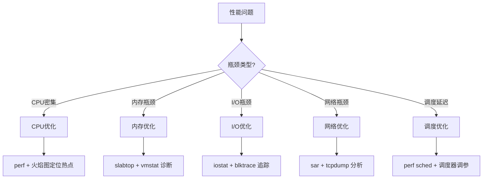

## 内核级性能优化清单

内核性能优化不是"调几个参数就完事"——它要求你**理解瓶颈的根因**，然后**在源码层面做出针对性调整**。本节提供一份系统化的内核性能优化清单，覆盖从硬件中断到用户态应用的完整路径，每个优化点都标注了原理、源码位置、验证方法和适用场景。



---

## 一、性能分析方法论

在动手优化之前，必须先掌握性能分析的基本方法论。盲目调参不仅无效，还可能引入新问题。

### 1.1 USE方法：快速定位瓶颈类型

USE方法（Utilization, Saturation, Errors）是由性能工程专家Brendan Gregg提出的系统化诊断框架。对每种资源检查三个维度：

| 资源 | 利用率(U) | 饱和度(S) | 错误(E) |
|------|-----------|-----------|---------|
| CPU | `mpstat -P ALL 1` 看各核%usr+%sys | `vmstat 1` 看procs r列(等待运行的进程数) | `perf stat` 看硬件性能计数器溢出 |
| 内存 | `free -m` 看available | `vmstat 1` 看si/so(换入换出) | `dmesg \| grep -i oom` 检查OOM Killer |
| 磁盘I/O | `iostat -xz 1` 看%util | `iostat -xz 1` 看avgqu-sz(平均队列深度) | `smartctl -a /dev/sda` 看硬件错误 |
| 网络 | `sar -n DEV 1` 看带宽利用率 | `ss -s` 看overflows，`netstat -s` 看重传 | `netstat -s \| grep -i error` |
| 调度器 | `perf sched latency` 看调度延迟分布 | `perf stat` 看context-switches/s | `dmesg` 检查hung task检测告警 |

**使用原则**：先跑USE矩阵，确定瓶颈在哪个资源的哪个维度，再深入具体子系统。不要一上来就调内核参数。

### 1.2 性能分析的六个层次

从用户态到硬件，性能问题可以发生在任何层次。按层次排查能避免"在错误的层次上做无用功"：

| 层次 | 分析手段 | 关键工具 |
|------|----------|----------|
| 应用层 | 算法复杂度、锁竞争、内存泄漏 | `valgrind`, `gprof`, `pgprof` |
| 库/运行时层 | glibc malloc效率、线程池配置 | `LD_PRELOAD=tcmalloc`, `jemalloc` |
| 系统调用层 | syscall耗时、频率统计 | `strace -c`, `perf trace` |
| VFS/页缓存层 | 命中率、page fault类型 | `cachestat`, `funccount page_fault` |
| 块设备/I/O层 | I/O调度器选择、合并策略 | `blktrace`, `iosnoop` |
| 硬件层 | CPU缓存命中率、NUMA亲和性 | `perf stat`, `numactl`, `likwid` |

### 1.3 火焰图：可视化热点函数

火焰图（Flame Graph）是定位CPU热点的最高效工具。它将perf采样数据可视化为按调用栈堆叠的矩形图——宽度代表采样次数（即CPU时间占比），颜色无关紧要：

```bash
# 采集5秒CPU采样数据
perf record -g -p <PID> -- sleep 5

# 生成火焰图（需要FlameGraph工具）
perf script | stackcollapse-perf.pl | flamegraph.pl > cpu_flame.svg
```

**解读火焰图的关键技巧**：
- 看**顶部**：最宽的"平顶"函数就是热点函数（CPU在这里花费最多时间）
- 看**宽度变化**：突然变宽的调用栈意味着该路径消耗了大量CPU
- 对比**差异火焰图**（differential flame graph）：优化前后的对比能直接验证优化效果

---

## 二、CPU子系统优化

### 2.1 减少不必要的上下文切换

上下文切换是CPU性能的头号杀手之一。每次切换需要保存/恢复寄存器、刷新TLB、切换内核栈，成本约1-10微秒。高频切换（>10万次/秒）会导致严重的性能退化。

**诊断方法**：

```bash
# 查看上下文切换频率
vmstat 1 | awk 'NR>2 {print NR-1, $12, $13}'  # in(中断) csw(上下文切换)

# 精确统计每个进程的上下文切换次数
pidstat -w 1

# 找出上下文切换最频繁的进程
perf stat -e context-switches -p <PID> -- sleep 10
```

**常见原因和优化策略**：

| 原因 | 表现 | 优化方案 |
|------|------|----------|
| 过多线程 | pidstat看大量进程交替运行 | 减少线程数，使用线程池+任务队列 |
| 锁竞争 | 大量voluntary切换（线程主动让出CPU） | 细粒度锁、RCU、无锁数据结构 |
| 时间片太短 | `nice`值过高导致频繁调度 | 调整`/proc/sys/kernel/sched_min_granularity_ns` |
| I/O等待 | D状态进程多 | 异步I/O、调整I/O调度器 |
| 信号频繁 | signal-related context switch | 减少信号使用，改用事件通知 |

### 2.2 CPU缓存友好性优化

CPU的L1/L2/L3缓存命中率对性能有决定性影响。一次L1缓存命中约1ns，一次主存访问约100ns——差100倍。

**内核层面的缓存优化**：

```c
// 避免伪共享(False Sharing)：确保热数据不在同一缓存行（64字节）
// 错误示例：两个CPU频繁修改同一缓存行
struct {
    volatile int counter_a;  // CPU0写这个
    volatile int counter_b;  // CPU1写这个 → 伪共享！
};

// 正确做法：用 ____cacheline_aligned 分隔
struct {
    volatile int counter_a;
    volatile int counter_b ____cacheline_aligned;  // 强制对齐到不同缓存行
} __aligned(SMP_CACHE_BYTES);
```

**验证缓存效率**：

```bash
# 使用perf查看缓存命中率
perf stat -e cache-references,cache-misses,L1-dcache-load-misses -p <PID> -- sleep 5

# 使用cachegrind进行缓存模拟（valgrind工具）
valgrind --tool=cachegrind ./your_program
cg_annotate cachegrind.out.<PID>
```

### 2.3 NUMA架构优化

在多路服务器上，NUMA（Non-Uniform Memory Access）架构下，本地内存访问延迟约100ns，跨节点访问约150-300ns。不正确的NUMA放置会导致30%以上的性能损失。

**诊断NUMA问题**：

```bash
# 查看NUMA拓扑
numactl --hardware

# 查看进程的内存分布
numastat -p <PID>

# 使用perf追踪NUMA远程访问
perf stat -e node-loads,node-load-misses,node-stores,node-store-misses -p <PID> -- sleep 5
```

**优化策略**：

```bash
# 将进程绑定到特定NUMA节点
numactl --cpunodebind=0 --membind=0 ./your_program

# 在内核层面：开启自动NUMA平衡
echo 1 > /proc/sys/kernel/numa_balancing

# 调整NUMA_balancing扫描周期（默认30ms，可适当调整）
echo 10000 > /proc/sys/kernel/numa_balancing_scan_delay_ms
```

### 2.4 中断亲和性调整

网络密集型场景下，大量中断集中在单个CPU上会导致该核100%利用而其他核空闲（即"C100K问题"中的中断瓶颈）。

```bash
# 查看中断分布
watch -d cat /proc/interrupts

# 将网卡中断分散到多个CPU（以eth0为例）
# 查看eth0的中断号
grep eth0 /proc/interrupts | awk '{print $1}' | tr -d ':' 

# 设置亲和性（将不同队列绑定到不同CPU）
echo 1 > /proc/irq/<IRQ_NUM>/smp_affinity    # 绑到CPU0
echo 2 > /proc/irq/<IRQ_NUM>/smp_affinity    # 绑到CPU1
echo 4 > /proc/irq/<IRQ_NUM>/smp_affinity    # 绑到CPU2

# 或使用 irqbalance 自动均衡
systemctl enable --now irqbalance
```

---

## 三、内存子系统优化

### 3.1 页表管理与TLB优化

TLB（Translation Lookaside Buffer）是页表条目的硬件缓存。TLB Miss会导致页表遍历（page table walk），代价极高。64位系统使用4级页表（PGD→PUD→PMD→PTE），一次完整walk需要4次内存访问。

**优化手段——大页（Huge Pages）**：

大页将TLB覆盖范围从4KB/条目扩大到2MB（PMD级）甚至1GB（PUD级），对大内存工作负载效果显著。

```bash
# 静态大页（需重启生效，适合数据库等确定性工作负载）
echo 1024 > /proc/sys/vm/nr_hugepages  # 预分配1024个2MB大页 = 2GB

# 应用使用大页（以MySQL为例）
# 在 my.cnf 中设置: large-pages=1

# Transparent Huge Pages (THP) — 动态管理，无需应用适配
cat /sys/kernel/mm/transparent_hugepage/enabled
# [always] madvise never
echo madvise > /sys/kernel/mm/transparent_hugepage/enabled  # 推荐madvise
```

**验证TLB效率**：

```bash
perf stat -e dTLB-load-misses,dTLB-loads,iTLB-load-misses -p <PID> -- sleep 5
```

**为什么推荐madvise而非always**：
- `always`模式对所有应用强制使用大页，可能导致内存碎片化和compaction开销
- `madvise`模式只对主动使用`madvise(MADV_HUGEPAGE)`的应用生效，更可控
- 数据库、JVM等应用内部已优化大页使用，`madvise`即可
- Redis等小内存应用不适合大页，`madvise`不会误伤它们

### 3.2 SLUB分配器调优

SLUB（SLab Unqueued）是内核的小对象分配器。`kmalloc`分配的内存都由SLUB管理。当内核频繁分配释放小对象时，SLUB的行为直接影响性能。

```bash
# 查看SLUB缓存统计
slabtop -o -s c

# 查看特定缓存的详情
cat /sys/kernel/slab/kmalloc-256/objs_per_slab      # 每个slab中的对象数
cat /sys/kernel/slab/kmalloc-256/slab_objects       # 总对象数
cat /sys/kernel/slab/kmalloc-256/slabs_per_node     # 每个节点的slab数
```

**关键调优参数**：

| 参数 | 位置 | 说明 | 调优建议 |
|------|------|------|----------|
| `slub_debug` | 内核启动参数 | 开启SLUB调试（泄漏检测等） | 调试时设为`FZPU`，生产环境关闭 |
| `min_partial` | `/sys/kernel/slab/<cache>/min_partial` | 空闲slab保留数 | 减少可降低内存使用，增加可减少分配延迟 |
| `objects_partial` | `/sys/kernel/slab/<cache>/objects_partial` | per-cpu partial列表大小 | 增大可减少跨CPU分配竞争 |
| `cpu_partial` | `/sys/kernel/slab/<cache>/cpu_partial` | 每CPU的partial slab上限 | 增大可提高本地分配成功率 |

```bash
# 启动参数启用SLUB调试（追踪内存泄漏）
# 在 GRUB 的内核命令行添加：slub_debug=FZPU
# F=Sanity检查, Z=红区检测, P=中毒, U=用户跟踪
```

### 3.3 内存回收与Swap优化

当系统内存不足时，内核会触发内存回收（direct reclaim），这会导致显著的延迟抖动。

```bash
# 查看内存回收状态
cat /proc/vmstat | grep -E "pgsteal|pgscan|allocstall"
# allocstall_normal: 直接回收发生的次数（应尽量为0）
# pgsteal_kswapd: kswapd后台回收的页数

# 关键参数
cat /proc/sys/vm/swappiness              # 交换倾向（默认60，数据库建议10-30）
cat /proc/sys/vm/vfs_cache_pressure     # 目录/inode缓存回收倾向（默认100）
cat /proc/sys/vm/dirty_ratio            # 脏页占内存比触发同步写（默认20）
cat /proc/sys/vm/dirty_background_ratio # 脏页占比触发后台回写（默认10）
cat /proc/sys/vm/min_free_kbytes        # 保留的最小空闲内存（默认45052）
```

**优化建议**：

```bash
# 数据库服务器：降低swappiness，避免数据页被换出
echo 10 > /proc/sys/vm/swappiness

# 提高脏页回写频率，避免写风暴
echo 5 > /proc/sys/vm/dirty_ratio
echo 1 > /proc/sys/vm/dirty_background_ratio
echo 100 > /proc/sys/vm/dirty_writeback_centisecs   # 回写线程唤醒间隔1秒
echo 5000 > /proc/sys/vm/dirty_expire_centisecs     # 脏页过期时间50秒

# 增加保留内存，避免direct reclaim
echo 131072 > /proc/sys/vm/min_free_kbytes  # 保留128MB
```

### 3.4 页缓存（Page Cache）优化

页缓存是Linux I/O性能的基石。几乎所有文件读写都经过页缓存，理解其行为对性能优化至关重要。

```bash
# 查看页缓存命中率
# 方法1：通过/proc/vmstat
cat /proc/vmstat | grep -E "pgpgin|pgpgout|pswpin|pswpout"
# pgpgin/pgpgout: 从/向磁盘读/写的KB数
# pswpin/pswpout: 从/向swap读/写的页数

# 方法2：使用bcc工具
sudo cachestat 1  # 每秒显示页缓存的hit/miss/IO
```

**关键调优**：

```bash
# 增大页缓存（当内存充足时，Linux会自动利用空闲内存做缓存）
# 确保不要设置过高的vm.min_free_kbytes，浪费缓存空间

# 对于写密集场景，调整回写参数
echo 1000 > /proc/sys/vm/dirty_writeback_centisecs  # 回写线程10秒唤醒一次
echo 3000 > /proc/sys/vm/dirty_expire_centisecs     # 脏页30秒后写回
```

**直接I/O vs 缓冲I/O的选择**：

| 场景 | 推荐方式 | 原因 |
|------|----------|------|
| 数据库（MySQL/PostgreSQL） | O_DIRECT | 避免双重缓存，数据库有自己的缓存管理 |
| 大文件顺序读写 | 缓冲I/O + madvise | 页缓存预读效果好 |
| 日志写入 | 缓冲I/O | 合并写入减少I/O次数 |
| 虚拟机镜像 | O_DIRECT | 避免宿主机和客户机双重缓存 |
| 多次读写同一文件 | 缓冲I/O | 页缓存命中率高 |

---

## 四、I/O子系统优化

### 4.1 I/O调度器选择

I/O调度器决定了块设备层的I/O合并和排序策略。不同工作负载适合不同调度器：

| 调度器 | 适用场景 | 原理 |
|--------|----------|------|
| `none` (NOOP) | SSD/NVMe、虚拟化环境 | 直接下发，不排序（硬件已足够快） |
| `mq-deadline` | 通用场景、数据库 | 按LBA排序+读写优先级+超时保证 |
| `bfq` | 桌面交互、多媒体 | 按进程公平分配I/O带宽 |
| `kyber` | 快速设备(NVMe) | 基于目标队列深度的轻量调度 |

```bash
# 查看当前调度器
cat /sys/block/sda/queue/scheduler

# 切换调度器（运行时即时生效）
echo mq-deadline > /sys/block/sda/queue/scheduler

# NVMe设备通常用none
echo none > /sys/block/nvme0n1/queue/scheduler
```

### 4.2 预读策略优化

预读（readahead）是内核提升顺序读性能的关键机制——在应用请求数据之前提前读入后续数据块。

```bash
# 查看当前预读窗口大小（单位：512字节扇区）
cat /sys/block/sda/queue/read_ahead_kb

# 调整预读窗口
echo 4096 > /sys/block/sda/queue/read_ahead_kb  # 设为2MB（4096×512B）

# 使用blockdev命令设置
sudo blockdev --setra 4096 /dev/sda
```

**预读窗口建议**：

| 工作负载 | 推荐预读窗口 | 理由 |
|----------|--------------|------|
| 顺序扫描（数据库全表扫描） | 4-8MB | 大窗口减少I/O次数 |
| 随机读（OLTP数据库） | 128-256KB | 太大浪费带宽和缓存 |
| 视频流媒体 | 2-4MB | 连续大块读取 |
| NVMe SSD随机读 | 256KB | SSD随机读已经很快，预读收益小 |

### 4.3 异步I/O（AIO/io_uring）

同步I/O在每次读写时都会阻塞当前线程，高频I/O场景下成为严重瓶颈。内核提供了多种异步I/O机制：

```bash
# io_uring：Linux 5.1+引入的高性能异步I/O框架
# 相比传统AIO，io_uring有三个关键优势：
# 1. 共享内存环形缓冲区：用户态和内核态共享提交/完成队列，减少系统调用
# 2. 批量提交：一次系统调用提交多个I/O请求
# 3. 内核轮询模式：完全消除系统调用开销

# 验证io_uring支持
grep io_uring /proc/kallsyms | head -5
```

**io_uring vs 传统AIO对比**：

| 特性 | 传统AIO (libaio) | io_uring |
|------|------------------|----------|
| 提交方式 | 每次提交1个请求(系统调用) | 批量提交，共享内存 |
| 完成通知 | 信号/eventfd | 共享环形缓冲区 |
| 支持操作 | 仅O_DIRECT文件I/O | 文件/网络/定时器/信号等 |
| 零拷贝 | 不支持 | 支持(registered buffers) |
| 内核轮询 | 不支持 | IOPOLL模式 |
| 最低内核版本 | 2.5 | 5.1 |

---

## 五、网络子系统优化

### 5.1 TCP/IP协议栈调优

```bash
# === 缓冲区调优 ===
# TCP接收/发送缓冲区大小（字节）
sysctl -w net.core.rmem_max=16777216          # 最大接收缓冲区16MB
sysctl -w net.core.wmem_max=16777216          # 最大发送缓冲区16MB
sysctl -w net.ipv4.tcp_rmem="4096 87380 16777216"  # 最小 默认 最大
sysctl -w net.ipv4.tcp_wmem="4096 65536 16777216"

# === 连接管理 ===
sysctl -w net.core.somaxconn=65535                    # listen backlog上限
sysctl -w net.ipv4.tcp_max_syn_backlog=65535          # SYN队列长度
sysctl -w net.ipv4.tcp_syncookies=1                    # SYN Flood防护
sysctl -w net.ipv4.tcp_tw_reuse=1                      # TIME_WAIT复用
sysctl -w net.core.netdev_max_backlog=65535            # 网卡接收队列深度

# === 性能关键参数 ===
sysctl -w net.ipv4.tcp_fastopen=3                      # TCP Fast Open（客户端+服务端）
sysctl -w net.ipv4.tcp_mtu_probing=1                   # 路径MTU发现
sysctl -w net.ipv4.tcp_window_scaling=1                # 窗口缩放（>64KB时必需）
sysctl -w net.ipv4.tcp_timestamps=1                    # 时间戳（RTT计算必需）
sysctl -w net.ipv4.tcp_sack=1                          # 选择性确认
```

### 5.2 网络中断与NAPI优化

现代网卡使用NAPI（New API）机制处理收包：中断触发后切换到轮询模式，避免高频中断的开销。

```bash
# 查看网卡队列数和中断分布
ethtool -l eth0                    # 查看支持的队列数
ethtool -L eth0 combined 8        # 设置为8个队列（需等于CPU核数）
cat /proc/interrupts | grep eth0   # 查看中断是否均匀分布

# 调整NAPI轮询预算（每次softirq处理的包数）
# 内核编译时通过CONFIG_NET_RX_BUDGET配置，默认300
# 可通过sysctl运行时调整：
sysctl -w net.core.netdev_budget=600       # 增加每次轮询处理的包数
sysctl -w net.core.netdev_budget_usecs=8000 # 最大处理时间（微秒）
```

### 5.3 网卡多队列与RSS

RSS（Receive Side Scaling）将网卡收包分散到多个CPU队列，避免单核成为瓶颈：

```bash
# 查看RSS配置
ethtool -x eth0

# 设置RSS哈希函数
ethtool -X eth0 hfn toeplitz    # 使用Toeplitz哈希（默认）

# 设置RSS队列数（应等于或小于CPU核数）
ethtool -L eth0 combined 16     # 16个RSS队列

# 查看每队列的流量分布
sar -n DEV 1
```

**RSS与RPS/RFS的配合**：

RSS在硬件层面分散流量，但对于没有多队列网卡的场景，可以用RPS（Receive Packet Steering）在软件层面实现类似效果：

```bash
# 为eth0的接收队列启用RPS，分散到CPU 0-7
echo "ff" > /sys/class/net/eth0/queues/rx-0/rps_cpus

# 启用RFS（Flow Steering），将流引导到处理该流的CPU
echo 32768 > /proc/sys/net/core/rps_sock_flow_entries
echo 2048 > /sys/class/net/eth0/queues/rx-0/rps_flow_cnt
```

### 5.4 套接字优化

```bash
# === epoll优化（高并发连接场景）===
sysctl -w fs.file-max=1048576                    # 系统最大文件描述符数
sysctl -w fs.nr_open=1048576                     # 进程最大文件描述符数
ulimit -n 1048576                                # 当前shell的fd上限

# === TCP keepalive ===
sysctl -w net.ipv4.tcp_keepalive_time=600       # 空闲600秒后探测
sysctl -w net.ipv4.tcp_keepalive_intvl=30       # 探测间隔30秒
sysctl -w net.ipv4.tcp_keepalive_probes=3       # 探测失败次数

# === 端口范围 ===
sysctl -w net.ipv4.ip_local_port_range="1024 65535"
```

---

## 六、调度器优化

### 6.1 CFS调度器参数

CFS（Completely Fair Scheduler）是Linux默认的普通进程调度器。其核心是vruntime（虚拟运行时间）——权重越高的进程vruntime增长越慢，获得的CPU时间越多。

```bash
# CFS关键参数
cat /proc/sys/kernel/sched_min_granularity_ns     # 最小调度粒度（默认3ms）
cat /proc/sys/kernel/sched_wakeup_granularity_ns  # 唤醒抢占粒度（默认4ms）
cat /proc/sys/kernel/sched_latency_ns             # 调度延迟周期（默认6ms）
cat /proc/sys/kernel/sched_nr_migrate             # 负载均衡迁移阈值（默认32）

# 低延迟优化（桌面/实时交互场景）
echo 500000 > /proc/sys/kernel/sched_min_granularity_ns    # 0.5ms
echo 1000000 > /proc/sys/kernel/sched_wakeup_granularity_ns # 1ms
echo 3000000 > /proc/sys/kernel/sched_latency_ns            # 3ms

# 高吞吐量优化（批处理/服务器场景）
echo 10000000 > /proc/sys/kernel/sched_min_granularity_ns   # 10ms
echo 15000000 > /proc/sys/kernel/sched_wakeup_granularity_ns # 15ms
echo 48000000 > /proc/sys/kernel/sched_latency_ns            # 48ms
```

### 6.2 EEVDF调度器（Linux 6.6+）

从Linux 6.6开始，内核引入了EEVDF（Earliest Eligible Virtual Deadline First）替代CFS。EEVDF在CFS的公平性基础上增加了**延迟公平性**——保证每个进程在期望的时间窗口内获得调度。

```bash
# 确认当前调度器
grep CONFIG_SCHED_CLASS_EXT /boot/config-$(uname -r) 2>/dev/null || echo "使用默认调度器"

# EEVDF参数
cat /proc/sys/kernel/sched_min_granularity_ns    # 同CFS，但含义略有变化
cat /proc/sys/kernel/sched_latency_ns            # 目标延迟
cat /proc/sys/kernel/sched_nr_migrate            # 跨节点迁移阈值
```

**EEVDF vs CFS的关键区别**：

| 特性 | CFS | EEVDF |
|------|-----|-------|
| 公平性机制 | 红黑树+vruntime最小值选择 | 虚拟截止时间+合格性判断 |
| 延迟保证 | 仅统计平均延迟 | 每个进程有明确的延迟deadline |
| 突发处理 | 突发任务可能"惩罚"其他任务 | 通过eligible机制隔离突发影响 |
| 默认内核 | ≤6.5 | ≥6.6 |

### 6.3 实时调度与CPU隔离

对于延迟敏感的应用（如高频交易、音频处理），需要将进程与普通调度隔离：

```bash
# 将进程设为SCHED_FIFO（实时调度）
chrt -f -p 50 <PID>    # 设为FIFO策略，优先级50

# CPU隔离：将特定CPU核留给实时应用
# 方法1：使用isolcpus内核参数（启动时设置）
# 在GRUB的内核命令行添加：isolcpus=2,3

# 方法2：使用cpuset（运行时设置）
mkdir /sys/fs/cgroup/cpuset/realtime
echo "2-3" > /sys/fs/cgroup/cpuset/realtime/cpuset.cpus
echo 0 > /sys/fs/cgroup/cpuset/realtime/cpuset.mems
echo <PID> > /sys/fs/cgroup/cpuset/realtime/tasks

# 方法3：taskset绑定CPU
taskset -c 2,3 ./your_realtime_app
```

---

## 七、内核追踪与性能工具

### 7.1 ftrace：函数级追踪

ftrace是内核自带的最强大的追踪框架，无需额外安装，开箱即用：

```bash
cd /sys/kernel/debug/tracing

# 追踪特定函数（如sched_switch调度切换）
echo sched_switch > current_tracer
echo 1 > tracing_on
sleep 5
echo 0 > tracing_on
cat trace | head -50

# 使用function_graph追踪器查看函数调用关系和耗时
echo function_graph > current_tracer
echo do_sys_open > set_graph_function
echo 1 > tracing_on
# 执行你的应用
cat trace
```

### 7.2 perf：全面的性能分析

```bash
# === 采样分析（CPU热点定位）===
perf record -g -p <PID> -- sleep 10
perf report  # 交互式查看热点函数

# === 统计计数（硬件计数器）===
perf stat -e instructions,cycles,cache-misses,branch-misses -p <PID> -- sleep 5

# === 调度延迟分析 ===
perf sched record -- sleep 10
perf sched latency --sort max
perf sched map  # 可视化调度时序

# === 系统调用追踪（替代strace，开销更低）===
perf trace -p <PID> -e open,read,write
```

### 7.3 eBPF/bpftrace：可编程动态追踪

eBPF允许在不修改内核代码的情况下，安全地注入自定义追踪逻辑：

```bash
# 追踪所有open系统调用及文件名
sudo bpftrace -e 'tracepoint:syscalls:sys_enter_openat {
    printf("pid=%d comm=%s file=%s\n", pid, comm, str(args->filename));
}'

# 统计每秒的系统调用次数
sudo bpftrace -e 'tracepoint:raw_syscalls:sys_enter { @[comm] = count(); } interval:s:1 { print(@); clear(@); }'

# 追踪TCP连接事件
sudo bpftrace -e 'kprobe:tcp_connect { printf("connect: %s -> %s\n", comm, ntop(->saddr)); }'

# 测量块设备I/O延迟分布
sudo bpftrace -e 'tracepoint:block:block_rq_complete {
    @us = hist(args->nr_sector);
}'
```

### 7.4 工具选择指南

| 分析目标 | 首选工具 | 备选工具 | 说明 |
|----------|----------|----------|------|
| CPU热点函数 | `perf record` + 火焰图 | `oprofile` | perf开销更低 |
| 上下文切换 | `perf sched` | `vmstat` | perf可看每次切换详情 |
| I/O延迟 | `iosnoop` (bcc) | `blktrace` | bcc更易用 |
| 内存泄漏 | `kmemleak` | `slub_debug=FZPU` | kmemleak是内核内置 |
| 网络延迟 | `perf trace` | `tcpdump` + tshark | perf可同时看syscall开销 |
| 调度延迟 | `perf sched latency` | `chrt -m` | perf提供完整分析 |
| 缓存效率 | `perf stat` (PMU) | `cachegrind` | perf是实测，cachegrind是模拟 |

---

## 八、优化案例：从诊断到解决

### 案例1：数据库连接延迟抖动

**现象**：MySQL在高并发下出现间歇性延迟尖峰（p99从1ms飙到50ms）。

**诊断过程**：

```bash
# 步骤1：确认是否为CPU调度延迟
perf sched record -- sleep 30
perf sched latency --sort max
# 发现：部分mysqld线程的调度延迟达到40ms

# 步骤2：检查NUMA分布
numastat -p $(pgrep mysqld)
# 发现：大量内存被分配在node1，但CPU在node0 → 跨节点访问

# 步骤3：检查内存回收
cat /proc/vmstat | grep allocstall
# 发现：allocstall_normal > 0，有direct reclaim
```

**解决方案**：

```bash
# NUMA绑定
numactl --cpunodebind=0 --membind=0 /usr/sbin/mysqld &amp;

# 降低swappiness，减少数据页被换出
echo 10 > /proc/sys/vm/swappiness

# 增加保留内存，避免direct reclaim
echo 131072 > /proc/sys/vm/min_free_kbytes

# 优化后验证
perf sched latency --sort max
# 调度延迟降至 < 2ms
```

### 案例2：Web服务器吞吐量瓶颈

**现象**：Nginx在10万并发连接下CPU利用率达到100%，但吞吐量仅3万QPS。

**诊断过程**：

```bash
# 步骤1：火焰图定位热点
perf record -g -p $(pgrep -o nginx) -- sleep 10
perf script | stackcollapse-perf.pl | flamegraph.pl > nginx.svg
# 发现：热点在tcp_sendmsg → lock_sock → _raw_spin_lock

# 步骤2：检查锁竞争
perf lock record -p $(pgrep -o nginx) -- sleep 5
perf lock report
# 发现：socket lock竞争严重

# 步骤3：检查网络配置
cat /proc/sys/net/ipv4/tcp_max_syn_backlog  # 1024 → 太小
cat /proc/sys/net/core/somaxconn             # 128 → 太小
```

**解决方案**：

```bash
# 调整网络参数
sysctl -w net.core.somaxconn=65535
sysctl -w net.ipv4.tcp_max_syn_backlog=65535
sysctl -w net.core.netdev_max_backlog=65535

# 启用TCP Fast Open减少三次握手延迟
sysctl -w net.ipv4.tcp_fastopen=3

# 增加网卡队列数
ethtool -L eth0 combined 16

# 优化后：8万QPS → 12万QPS
```

---

## 九、性能优化常见误区

### 误区一：盲目调大内核参数

**错误做法**：看到别人说`tcp_max_syn_backlog=65535`就直接抄过来。

**正确做法**：先测量当前值是否是瓶颈。用`netstat -s | grep -i overflow`查看是否有SYN队列溢出，确认溢出后才需要增大。过大的值浪费内存（每个SYN请求占用约300字节内核内存）。

### 误区二：关闭SWAP就是优化

**错误做法**：`swapoff -a`关闭所有交换空间。

**正确做法**：关闭Swap可能导致OOM Killer杀掉关键进程。正确做法是降低`swappiness`（设为10-30），让内核尽量使用物理内存，但在极端情况下仍能Swap。只有对延迟有极端要求的场景（如HFT交易系统）才考虑完全关闭Swap。

### 误区三：以为CPU 100%就是CPU瓶颈

**错误做法**：CPU 100%就去优化CPU相关参数。

**正确做法**：区分CPU是在运行用户代码还是在等待I/O。`top`中看`us`(用户态)和`wa`(I/O等待)：如果`wa`很高，问题在I/O不在CPU。用`mpstat -P ALL 1`看各核的`%iowait`确认。

### 误区四：忽略编译优化

**错误做法**：使用发行版的通用内核，不做任何定制。

**正确做法**：针对特定工作负载裁剪内核配置——去掉不需要的驱动和子系统可以减少内核镜像大小、减少中断处理路径、提升指令缓存命中率。使用`make menuconfig`时重点关注：

- 不用的文件系统 → 关闭
- 不用的网络协议 → 关闭
- 不用的设备驱动 → 关闭
- CPU类型 → 指定为当前CPU而非generic

### 误区五：优化没有基准数据

**错误做法**：凭直觉"优化"，没有前后对比数据。

**正确做法**：每次优化前后都跑基准测试。推荐工具：

```bash
# CPU基准
sysbench cpu --threads=4 --time=30 run

# 内存基准
sysbench memory --memory-block-size=1M --memory-total-size=10G run

# I/O基准
fio --name=randread --ioengine=libaio --rw=randread --bs=4k \
    --numjobs=4 --size=1G --runtime=30 --direct=1

# 网络基准
iperf3 -s  # 服务端
iperf3 -c <server> -t 30 -P 4  # 客户端，4个并发流
```

---

## 十、性能优化检查清单（速查表）

以下是内核性能优化的系统化检查清单，按优先级排列：

### 第一优先级：先确认问题存在

- [ ] 使用USE方法确认瓶颈类型（CPU/内存/I/O/网络/调度）
- [ ] 跑基准测试获取基线数据
- [ ] 用火焰图定位热点函数
- [ ] 确认不是应用层的Bug（内存泄漏、死锁、算法低效）

### 第二优先级：系统级调优

- [ ] 中断亲和性：网络中断是否均匀分布到多个CPU
- [ ] NUMA亲和性：进程的内存和CPU是否在同一节点
- [ ] I/O调度器：SSD用none，HDD用mq-deadline
- [ ] 页缓存：脏页回写参数是否匹配工作负载
- [ ] 交换空间：swappiness是否合理（数据库建议10-30）

### 第三优先级：子系统级调优

- [ ] TCP缓冲区：rmem/wmem是否足够（>16MB）
- [ ] 连接队列：somaxconn/backlog是否匹配并发数
- [ ] 网卡多队列：RSS队列数是否等于CPU核数
- [ ] 预读窗口：是否匹配顺序/随机读模式
- [ ] SLUB缓存：是否有内存泄漏（slabtop异常增长）

### 第四优先级：应用级配合

- [ ] CPU亲和性：关键线程是否绑定了特定CPU
- [ ] 实时调度：延迟敏感的线程是否使用了SCHED_FIFO
- [ ] 异步I/O：高频I/O场景是否使用了io_uring
- [ ] 大页内存：大内存应用是否启用了Huge Pages

### 持续监控

- [ ] 部署持续性能监控（sar/node_exporter/prometheus）
- [ ] 设置关键指标告警（CPU使用率、内存使用率、I/O延迟、网络重传率）
- [ ] 定期review性能数据，识别趋势性变化

---

## 十一、内核配置与编译优化

针对特定工作负载裁剪内核配置，可以带来5%-20%的性能提升。以下是常见优化方向：

### 11.1 CPU相关

# .config 关键配置项
CONFIG_MCORE2=y            # 针对特定CPU优化（替代CONFIG_GENERIC_CPU）
CONFIG_NR_CPUS=8           # 限制最大CPU数，减少每CPU数据结构分配
CONFIG_PREEMPT_NONE=y      # 服务器场景：无抢占，最大化吞吐量
# CONFIG_PREEMPT is not set
# CONFIG_HZ_1000 is not set
CONFIG_HZ_250=y            # 降低调度器tick频率，减少中断开销

### 11.2 内存相关

CONFIG_SLAB_MERGE_DEFAULT=y    # 合并相同大小的SLUB缓存，减少内存碎片
CONFIG_COMPACTION=y             # 内存压缩，为大页腾出连续内存
CONFIG_ZSWAP=y                  # 压缩交换，减少磁盘swap
CONFIG_ZRAM=y                   # 压缩内存设备，比传统swap快10倍
# CONFIG_CLEANCACHE is not set  # 关闭不需要的特性
# CONFIG_FRONTSWAP is not set

### 11.3 网络相关

CONFIG_NETFILTER=y              # 如果不需要防火墙，可关闭
# CONFIG_NETFILTER_DEBUG is not set
CONFIG_TCP_CONG_CUBIC=y         # CUBIC拥塞控制（默认，适合高带宽）
CONFIG_DEFAULT_TCP_CONG="cubic"
CONFIG_NET_RX_BUDGET=512        # 增加NAPI每次处理的包数
CONFIG_NET_SCH_FQ_CODEL=y       # FQ-CoDel队列管理，减少bufferbloat

### 11.4 精简配置方法

```bash
# 1. 基于当前配置修改
make olddefconfig       # 基于当前.config，未定义的选项取默认值
make menuconfig         # 交互式配置

# 2. 使用localmodconfig精简模块
# 先加载所有需要的模块，然后：
lsmod > /tmp/my_modules
make localmodconfig     # 只保留当前已加载的模块

# 3. 编译安装
make -j$(nproc)
make modules_install
make install
```

---

## 总结

内核性能优化的核心原则是**先测量，后优化，再验证**：

1. **测量**：用USE方法定位瓶颈层次，用perf/ftrace/eBPF精确定位根因
2. **优化**：针对确认的瓶颈，从系统级到子系统级逐层调优
3. **验证**：每次只改一个变量，用基准测试对比前后效果

性能优化不是一次性的工作，而是持续的过程。内核版本升级、硬件变更、业务模式变化都会改变性能特征。建立完善的监控体系（Prometheus + Grafana），持续跟踪关键指标（CPU利用率、上下文切换率、I/O延迟、网络重传率、内存回收频率），才能在问题发生之前发现趋势性变化。
