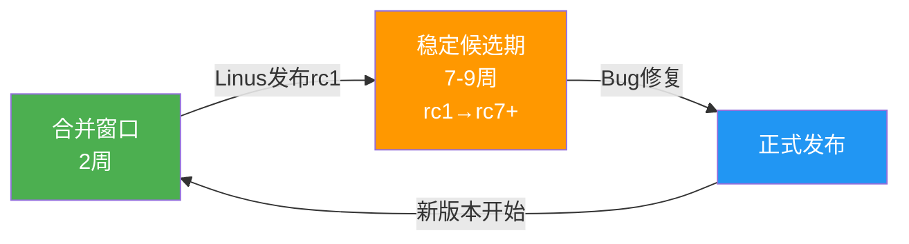

## 技术演进：Linux内核版本演进与关键子系统变迁

理解内核的**历史演进**是阅读源码的关键前提。Linux内核的每一个设计决策都不是凭空产生的——它们是特定历史约束、硬件条件和工程需求共同作用的结果。知道"为什么这样设计"，比知道"代码怎么写"更重要。本节将从版本时间线、关键子系统变迁、构建系统演进三个维度，梳理Linux内核30余年的技术发展脉络。

### 1. 版本发布时间线

Linux内核从1991年Linus Torvalds发布的0.01版本起步，历经30余年发展，代码库从约1万行增长到超过2800万行。以下是影响最深远的里程碑版本：

| 版本 | 发布时间 | 代码行数 | 关键变化 |
|------|----------|----------|----------|
| 0.01 | 1991-09 | ~1万 | 第一个公开版本，仅支持x86，单进程 |
| 1.0 | 1994-03 | ~17万 | 首个正式版，支持多进程、网络协议栈(TCP/IP) |
| 2.0 | 1996-06 | ~40万 | SMP支持、模块化加载、ELF二进制格式 |
| 2.2 | 1999-01 | ~80万 | 线程支持（LinuxThreads）、细粒度锁 |
| 2.4 | 2001-01 | ~150万 | NUMA感知、块设备层重写、O(1)调度器 |
| 2.6 | 2003-12 | ~350万 | **O(1)调度器→预emptive内核、NPTL线程库、sysfs、内核抢占** |
| 2.6.23 | 2007-10 | ~600万 | **CFS调度器**取代O(1) |
| 3.0 | 2011-07 | ~1350万 | Btrfs稳定、ARM架构合并、cgroups v1 |
| 3.10 | 2013-07 | ~1700万 | **eBPF雏形**、Docker依赖的cgroups/namespace |
| 4.0 | 2015-04 | ~1950万 | **内核热补丁(kpatch/livepatch)**、zswap压缩交换 |
| 4.15 | 2018-01 | ~2200万 | **Spectre/Meltdown缓解**（KPTI、retpoline） |
| 5.0 | 2019-03 | ~2300万 | **EEVDF调度器候选**、多队列块设备层(blk-mq)默认 |
| 5.15 | 2021-10 | ~2600万 | cgroups v2默认、SCHED_EXT实验性支持 |
| 6.0 | 2022-10 | ~2800万 | Rust语言支持（实验性）、ARM64 MTE |
| 6.6 | 2023-10 | ~3000万 | **EEVDF调度器**取代CFS、实时调度改进 |
| 6.12 | 2024-11 | ~3200万 | **sched_ext**合并、Rust驱动框架扩展 |

> **阅读建议**：不需要记住每个版本的细节。关键是理解**每个大版本解决的核心问题**：2.6解决的是桌面响应性（内核抢占），3.x解决的是虚拟化和容器支持，5.x/6.x解决的是可编程性和安全硬化。

### 2. 内核版本号的含义

Linux使用`主版本号.次版本号.修订号`的三段式版本号（如`6.6.52`）：

- **次版本号**为偶数（6.0、6.2、6.4）→ **稳定版**，生产环境使用
- **次版本号**为奇数（6.1、6.3、6.5）→ **开发版**，实验性特性在此合并
- **修订号**（如6.6.52中的52）→ **稳定版补丁**，仅包含Bug修复，无新特性

```bash
# 查看当前运行内核版本
uname -r
# 输出示例: 6.6.0-generic

# 查看完整版本信息
cat /proc/version
# 输出示例: Linux version 6.6.0 (gcc version 13.2.0) ...

# 从源码查看版本号定义
head -5 Makefile
# VERSION = 6
# PATCHLEVEL = 6
# SUBLEVEL = 0
# EXTRAVERSION =
# NAME = Hurr durr I'ma ninja sloth
```

2018年Linus引入了`SUBLEVEL`后置修订号（偶数.偶数.奇数.偶数），使得稳定版补丁可以独立递增，不再需要等待下一个偶数次版本。

### 3. 调度器演进：从O(n)到EEVDF

调度器是内核中最频繁被修改的子系统之一，其演进路径直接反映了Linux从单机到多核、从桌面到数据中心的转变。

```mermaid
graph LR
    A["O(n)调度器<br/>0.01-2.4<br/>每次调度扫描全部进程"] -->|O(n)不可扩展| B["O(1)调度器<br/>2.6.0-2.6.22<br/>位图+优先级数组"]
    B -->|公平性不足| C["CFS调度器<br/>2.6.23-6.5<br/>vruntime+红黑树"]
    C -->|延迟尾部问题| D["EEVDF调度器<br/>6.6+<br/>虚拟截止时间+公平"]
```

**O(n)调度器（0.01-2.4）**

最早的调度器实现极其简单：每次调度遍历所有就绪进程，计算优先级和时间片，选出最佳者。复杂度O(n)，当进程数增长到数百时，调度延迟显著增加。这个调度器在桌面场景下勉强可用，但在服务器负载下表现糟糕。

```c
// 早期O(n)调度器的核心逻辑（简化）
for_each_process(p) {
    if (p->state == TASK_RUNNING) {
        if (p->counter > best->counter)
            best = p;
    }
}
// 每次调度都扫描全部进程 → O(n)
```

**O(1)调度器（2.6.0-2.6.22，2003-2007）**

Ingo Molnár设计的O(1)调度器是Linux进入多核时代的奠基之作。核心思想是用**位图（bitmap）**标记哪些优先级有就绪进程，用**优先级数组**按优先级分桶存放进程链表。调度时直接找最高非空优先级的进程，复杂度O(1)。

```c
// O(1)调度器数据结构（简化）
struct prio_array {
    unsigned int nr_active;     // 当前活跃进程数
    unsigned long bitmap[5];    // 5个64位=320位位图，标记各优先级是否有进程
    struct list_head queue[140]; // 140个优先级队列(0-99实时 + 100-139普通)
};
```

但O(1)调度器有一个致命缺陷：**交互进程的判断依赖启发式**（"如果一个进程经常让出CPU就认为它是交互进程"），在某些负载下会导致不公平——CFS就是为了解决这个问题。

**CFS调度器（2.6.23-6.5，2007-2023）**

CFS（Completely Fair Scheduler，完全公平调度器）由Ingo Molnár设计，其核心理念是**"理想的多任务处理器"**——每个进程获得相同的CPU时间，当一个进程多用了CPU时间时，补偿其他进程少用的时间。具体实现：

- 每个进程维护一个`vruntime`（虚拟运行时间），代表该进程已获得的CPU份额
- `vruntime`增长速率与进程权重（由nice值决定）成反比：权重越高，增长越慢
- 调度时选择`vruntime`最小的进程执行
- 用**红黑树**组织所有就绪进程，查找`vruntime`最小者只需O(log n)

```c
// CFS核心：vruntime计算
// nice=-20（最高优先级）→ 权重11103 → vruntime增长慢 → 获得更多CPU
// nice=0（默认）       → 权重3581  → vruntime增长中等
// nice=19（最低优先级）→ 权重15    → vruntime增长极快 → 获得极少CPU

static void update_curr(struct cfs_rq *cfs_rq) {
    u64 now = rq_clock_task(rq_of(cfs_rq));
    u64 delta_exec = now - curr->exec_start;  // 实际执行时间
    curr->exec_start = now;
    curr->sum_exec_runtime += delta_exec;
    
    // 按权重将实际时间转换为虚拟时间
    curr->vruntime += calc_delta_fair(delta_exec, curr);
}
```

**EEVDF调度器（6.6+，2023至今）**

EEVDF（Earliest Eligible Virtual Deadline First）是CFS的替代者，由Peter Zijlstra和Vincent Guittot设计。EEVDF解决了CFS的一个痛点：**延迟尾部问题**。在CFS下，一个刚唤醒的进程可能因为`vruntime`偏小而立即获得CPU（抢占所有进程），或者因为`vruntime`偏大而长时间等待。EEVDF引入了"虚拟截止时间"概念：

- 每个调度实体有一个**eligible**资格判定和**virtual deadline**截止时间
- 调度时选择eligible中deadline最早的实体
- 这天然支持**延迟敏感型**负载（如交互进程），无需CFS那样的启发式调整

```c
// EEVDF关键概念
struct sched_entity {
    u64 vruntime;          // 虚拟运行时间（与CFS相同）
    u64 deadline;          // 虚拟截止时间（EEVDF新增）
    u64 min_vruntime;      // 最小vruntime基准
    // eligible: vruntime <= cfs_rq->avg_vruntime
    // deadline: vruntime + (slice * weight_0 / weight)
};
```

### 4. 内存管理演进

Linux内存管理子系统的演进围绕三个核心问题：**如何高效管理物理页**、**如何支持更大内存**、**如何减少不必要的拷贝**。

**伙伴系统（Buddy System）**

伙伴系统自Linux诞生之初就存在，负责物理页的分配和回收。其核心思想是将空闲页面按2的幂次分组（order 0: 1页、order 1: 2页、...order 10: 1024页），分配时查找满足需求的最小order，如果更大则逐级拆分；回收时检查"伙伴"是否也空闲，合并为更大块。

```c
// 伙伴系统核心数据结构
struct free_area {
    struct list_head free_list[MIGRATE_TYPES]; // 按迁移类型分组的空闲链表
    unsigned long nr_free;                      // 当前order的空闲块数
};

// 2^MAX_ORDER-1 个free_area，MAX_ORDER=11
// 即最大可分配连续2048页(8MB on x86_64)
struct zone {
    struct free_area free_area[MAX_ORDER];
    // ...
};
```

伙伴系统的关键改进点：

| 时期 | 改进 | 解决的问题 |
|------|------|-----------|
| 2.6早期 | NUMA感知的伙伴系统 | 避免跨NUMA节点分配导致的远程访问开销 |
| 2.6.24+ | 页迁移（page migration） | 内存碎片化时可通过迁移页面获得高阶连续块 |
| 3.x | MIGRATE_TYPES分类 | 按用途（不可移动/可移动/可回收）组织空闲列表，减少碎片 |
| 4.5+ | 可拆分页块（split page blocks） | 将大页按需拆分为小页，缓解碎片问题 |
| 5.14+ | 持久化大页（THP-shmem） | 共享内存支持透明大页，减少页表walk开销 |

**SLAB→SLUB分配器**

内核需要频繁分配小对象（如`task_struct`、`inode`），直接使用伙伴系统分配1页太浪费。内核引入了 slab 系列分配器：

- **SLAB（1999，Andrew Morton）**：在伙伴系统之上构建对象缓存池，预分配常用大小的对象。但实现复杂、调试困难、内存开销大。
- **SLUB（2007，Christoph Lameter）**：简化了SLAB的实现，移除了SLAB的多队列和per-cpu缓存的复杂层级，用更少的代码实现相近的性能。**从2.6.23起SLUB成为默认分配器。**

```c
// SLUB分配器核心流程
void *kmalloc(size_t size, gfp_t flags) {
    // 1. 根据size找到对应的kmem_cache（如kmalloc-64、kmalloc-128...）
    struct kmem_cache *s = kmalloc_slab(size, flags);
    // 2. 优先从per-cpu freelist分配（无锁、最快路径）
    object = get_cpu_freelist(s);
    if (object) return object;
    // 3. per-cpu为空时，从partial list补充
    object = get_partial(s);
    if (object) return object;
    // 4. partial也为空，向伙伴系统申请新页面
    object = allocate_new_slab(s);
    return object;
}
```

**内存管理关键里程碑**

| 时期 | 特性 | 意义 |
|------|------|------|
| 2.0 | NUMA支持 | 感知内存层级差异，减少远程内存访问 |
| 2.2 | mlock() | 锁定内存页避免被换出，实时系统必需 |
| 2.4 | 大页支持（HugeTLB） | 减少TLB miss，数据库/虚拟化场景性能提升20-30% |
| 2.6 | 内核页表一致性 | 解决多核TLB一致性问题 |
| 3.x | 透明大页（THP） | 自动将连续4KB页合并为2MB大页，无需应用修改 |
| 3.14 | 内存压缩（zswap） | 交换时先压缩再写盘，减少I/O |
| 4.14 | 用户态页表隔离（KPTI） | 缓解Meltdown漏洞，但有1-30%性能开销 |
| 5.17 | maple tree替代红黑树 | VMA管理改用maple tree，减少锁竞争 |
| 6.0+ | folios | 统一page和compound page，简化内存管理API |

### 5. 网络子系统演进

**从单队列到多队列**

早期网卡只有单个收发队列，所有CPU竞争同一队列的锁。现代多队列网卡（RSS/RPS/RFS）和多队列网络栈的引入解决了这个问题：

| 时期 | 改进 | 性能影响 |
|------|------|----------|
| 2.6早期 | NAPI（New API） | 将中断驱动改为轮询模式，避免高流量下的中断风暴 |
| 3.3 | RPS（Receive Packet Steering） | 软件级接收包CPU分发，即使网卡硬件不支持RSS |
| 3.11 | RFS（Receive Flow Steering） | 将包引导到处理该连接的CPU，提升缓存命中率 |
| 3.14 | XDP（eXpress Data Path） | 在驱动层直接处理包，绕过整个协议栈，10M+ PPS |
| 5.x | GRO/GSO改进 | 通用接收/分段卸载，减少协议栈处理次数 |
| 6.x | AF_XDP | 用户态收发包接口，零拷贝，DPDK的内核替代方案 |

**NAPI的工作原理**

NAPI是网络栈最重要的性能优化之一。传统中断模式下，每个到达的包都会触发硬中断，在高流量下导致CPU频繁中断而无法正常处理数据。NAPI改为"中断→轮询"模式：

传统模式:  每个包 → 硬中断 → 软中断处理 → 下一个包...
NAPI模式:  第1个包 → 硬中断 → 关闭中断 → 轮询处理队列 → 队列空 → 开中断

```c
// NAPI核心API
// 驱动层注册poll回调
void netif_napi_add(struct net_device *dev, struct napi_struct *napi,
                    int (*poll)(struct napi_struct *, int budget));

// poll回调处理一批包
static int driver_poll(struct napi_struct *napi, int budget) {
    // budget最多为netdev_budget(默认300)
    // 每次poll最多处理budget个包
    // 处理完毕返回已处理数量
    work_done = process_packets(napi, budget);
    if (work_done < budget)
        napi_complete(napi);  // 标记完成，允许重新开中断
    return work_done;
}
```

**XDP：绕过协议栈的极速路径**

XDP允许在网络驱动层、在任何内核协议栈处理之前，对包进行过滤、转发或修改。这对于负载均衡（如Facebook的Katran）、DDoS防护等场景至关重要：

```c
// XDP程序示例（eBPF）
SEC("xdp")
int xdp_drop(struct xdp_md *ctx) {
    void *data = (void *)(long)ctx->data;
    void *data_end = (void *)(long)ctx->data_end;
    
    struct ethhdr *eth = data;
    if (eth + 1 > data_end) return XDP_PASS;
    
    // 丢弃特定源IP的流量
    if (eth->h_proto == htons(ETH_P_IP)) {
        struct iphdr *ip = (void *)(eth + 1);
        if (ip + 1 > data_end) return XDP_PASS;
        if (ip->saddr == DROP_IP)
            return XDP_DROP;  // 在驱动层直接丢弃
    }
    return XDP_PASS;
}
// 可达到14M+ PPS（单核），是iptables的数十倍性能
```

### 6. 文件系统演进

Linux支持的文件系统数量在所有操作系统中最多，但核心演进围绕**日志可靠性**和**性能**两条主线：

| 时期 | 文件系统 | 核心特点 | 地位 |
|------|----------|----------|------|
| 1.0 | Minix FS | 仿照Minix OS的简单文件系统 | 早期使用，已淘汰 |
| 1.1 | ext | 支持2GB卷、长文件名 | ext2的前身 |
| 2.0 | ext2 | 灵活的inode布局、快速fsck | 长期作为默认FS |
| 2.4 | ext3 | **日志功能**（journaling），防止断电数据丢失 | 默认FS，稳定可靠 |
| 2.6 | ReiserFS | 基于B*树的高效小文件存储 | 后因开发者入狱而衰落 |
| 2.6.12 | XFS | 高性能64位文件系统，适合大文件 | 企业级存储首选 |
| 2.6.28 | **Btrfs** | CoW、快照、校验、在线压缩、RAID | 实验性→逐步稳定 |
| 3.0 | **ext4** | extent取代间接块、延迟分配、日志校验 | 2008年起默认FS |
| 3.15 | F2FS | 闪存感知的文件系统，减少写放大 | 嵌入式/移动端 |
| 5.x+ | bcachefs | 基于bcache的CoW文件系统，RAID原生 | 2023年合并，实验中 |

**ext3→ext4的关键改进**

```c
// ext3的问题：间接块映射
// 一个大文件需要多级间接指针：inode→direct(12)→indirect→double indirect→triple
// 每增加一级间接指针，就要多一次磁盘读取

// ext4的改进：extent树
struct ext4_extent {
    __le32 ee_block;    // 逻辑块号
    __le16 ee_len;      // extent长度（连续块数）
    __le16 ee_start_hi; // 物理块号高16位
    __le32 ee_start_lo; // 物理块号低32位
};
// 一个extent描述一段连续的物理块，128字节的extent可以描述160万个连续块
// 对于顺序写入的大文件，一个extent就够了，消除间接指针开销
```

**Btrfs的设计哲学**

Btrfs采用了与ext4截然不同的设计哲学——写时复制（Copy-on-Write）：

- **所有写入都是追加的**：不就地修改数据块，而是写到新位置，然后原子更新元数据指针
- **B-tree组织一切**：inode、目录、extent、校验和都存储在不同的B-tree中
- **数据校验**：每个数据块都有CRC32C校验和，可检测静默数据损坏
- **原子快照**：只需复制根B-tree的指针，即可创建子卷的即时快照

```bash
# Btrfs快照的创建是O(1)操作
btrfs subvolume snapshot /data /data/snap_$(date +%Y%m%d)

# 查看Btrfs文件系统信息
btrfs filesystem usage /data
```

### 7. 构建系统演进

内核构建系统从最初的简单Makefile演变为今天的Kconfig+Kbuild体系，经历了三次重大重构：

| 时期 | 构建系统 | 特点 |
|------|----------|------|
| 0.01-2.5 | 手写Makefile | 每个目录一个Makefile，手动维护依赖关系 |
| 2.6 | **Kbuild** | 统一构建框架，自动依赖跟踪，模块签名 |
| 2.6.18 | **Kconfig** | 图形化内核配置（menuconfig/xconfig），依赖自动解析 |
| 4.x+ | 增量构建优化 | `make -j$(nproc)`并行编译、ccache支持、thin LTO |
| 5.x+ | `make W=1` | 启用额外警告，驱动开发者调试用 |

```bash
# 现代内核构建流程
make menuconfig          # 交互式配置，生成 .config
make -j$(nproc)          # 并行编译（-j参数=CPU核心数）
make modules             # 编译内核模块
make modules_install     # 安装模块到 /lib/modules/
make install             # 安装内核镜像和System.map
make bindeb-pkg          # 打包为deb安装包

# 增量编译（只编译修改的文件）
make -j$(nproc) 2>&amp;1 | tail  # 观察编译输出

# 清理构建产物
make clean    # 删除.o和中间文件，保留.config
make mrproper # 删除所有构建产物，包括.config
```

### 8. 开发流程演进

Linux内核的开发流程是全球最大的分布式协作模式之一：

**早期（1991-2005）：邮件列表+tarball**

Linus从开发者那里收到补丁，手动审查后合并到自己的树中。每2-3个月发布一个新版本。Linus曾经只信任Linus Torvalds本人来合并代码。

**Git时代（2005至今）：Linus Tree + 子系统树 + 开发者树**

2005年BitKeeper免费授权被收回后，Linus在两周内写出了Git。Git彻底改变了内核开发流程：

开发者本地 → 子系统维护者树（如net-next, drm） → Linus主线树 → 稳定版
  ↕ patch         ↕ pull request                    ↕ release
邮件列表         邮件列表                           2周合并窗口

**关键时间窗口**（以6.x系列为例）：



- **合并窗口（Merge Window）**：新版本发布后开启，持续约2周。子系统维护者通过`git pull`将各自的变更推送到Linus的主线树。这期间接受新特性、重构、架构变更。
- **稳定候选期（-rc期）**：合并窗口关闭后进入7-9周的rc（Release Candidate）阶段，只接受Bug修复。通常发布rc1到rc7，每个rc间隔1周。
- **正式发布**：rc期结束，发布正式版。偶数次版本（如6.8）为生产可用版。

```bash
# 开发者常用的Git工作流
git clone https://git.kernel.org/pub/scm/linux/kernel/git/torvalds/linux.git

# 创建补丁系列
git format-patch -3    # 最近3个提交生成补丁文件
# 通过邮件发送
git send-email --to=maintainer@example.com 0001-*.patch

# 应用他人的补丁
git am 0001-fix-bug.patch
```

**内核编码规范**（Documentation/process/coding-style.rst）

内核有一套严格的编码规范，违反规范的补丁会被拒绝：

| 规范 | 要求 | 示例 |
|------|------|------|
| 缩进 | 8个空格（不是4个） | `if (x) {` → 内部用8空格缩进 |
| 行宽 | 限制80列 | 超过时在运算符后换行 |
| 命名 | 小写+下划线，禁止驼峰 | `my_function()` ✓，`myFunction()` ✗ |
| 花括号 | 函数体另起一行，其他不换行 | `if (x) {`（同行）vs `void func()\n{` |
| goto | **鼓励使用**goto做错误清理 | 与反模式不同，内核goto是最佳实践 |
| 注释 | 解释**为什么**而非**做什么** | `/* skip empty entries */` ✓ |

```c
// 内核代码风格示例
static int my_function(struct device *dev, int flags)
{
    struct my_struct *ms;
    int ret;

    ms = kzalloc(sizeof(*ms), GFP_KERNEL);
    if (!ms)
        return -ENOMEM;

    ret = do_something(ms, flags);
    if (ret)
        goto err_free;  // 内核风格：goto清理

    ret = do_another(ms);
    if (ret)
        goto err_free;

    return 0;

err_free:
    kfree(ms);
    return ret;
}
```

### 9. 安全硬化演进

Linux内核的安全机制随攻击手段的升级而不断强化：

| 时期 | 安全特性 | 防御目标 |
|------|----------|----------|
| 2.6 | SELinux、capabilities | 强制访问控制，替代传统DAC |
| 2.6.28 | **ASLR**（地址空间布局随机化） | 防止内存地址预测攻击 |
| 4.x | seccomp-bpf | 限制进程可用的系统调用，沙箱隔离 |
| 4.12 | **KASLR**（内核地址空间随机化） | 防止内核地址泄漏 |
| 4.14 | **Stack Protector/CANARY** | 缓冲区溢出检测 |
| 4.15 | **KPTI**（页表隔离） | 缓解Meltdown漏洞 |
| 5.x | **CFI**（控制流完整性） | 防止ROP/JOP攻击 |
| 5.x | **Lockdown LSM** | 限制内核自身能力（防止内核态绕过） |
| 6.x | **kCFI**（内核CFI） | 更高效的内联控制流保护 |

```c
// seccomp-bpf示例：限制进程只能使用3个系统调用
struct sock_filter filter[] = {
    // 加载系统调用号
    BPF_STMT(BPF_LD | BPF_W | BPF_ABS, offsetof(struct seccomp_data, nr)),
    // 如果是read(0)、write(1)、exit_group(231)则允许
    BPF_JUMP(BPF_JMP | BPF_JEQ | BPF_K, __NR_read, 0, 1),
    BPF_STMT(BPF_RET | BPF_K, SECCOMP_RET_ALLOW),
    BPF_JUMP(BPF_JMP | BPF_JEQ | BPF_K, __NR_write, 0, 1),
    BPF_STMT(BPF_RET | BPF_K, SECCOMP_RET_ALLOW),
    // 其他系统调用一律拒绝
    BPF_STMT(BPF_RET | BPF_K, SECCOMP_RET_KILL),
};
prctl(PR_SET_NO_NEW_PRIVS, 1, 0, 0, 0);  // 先禁用提权
prctl(PR_SET_SECCOMP, SECCOMP_MODE_FILTER, &amp;prog);  // 安装过滤器
```

### 10. 未来趋势与新兴方向

**Rust语言支持**

从6.0开始，Linux内核正式支持使用Rust编写驱动和模块。Rust的内存安全保证可以在编译期消除一大类内核Bug（空指针、悬垂引用、数据竞争）：

```rust
// Rust内核模块示例（简化）
// drivers/rust/rust_chrdev.rs
use kernel::prelude::*;

module! {
    type: RustExample,
    name: "rust_example",
    license: "GPL",
}

struct RustExample;

impl kernel::Module for RustExample {
    fn init(_module: &amp;'static ThisModule) -> Result<Self> {
        pr_info!("Hello from Rust kernel module!\n");
        Ok(RustExample)
    }
}

impl Drop for RustExample {
    fn drop(&amp;mut self) {
        pr_info!("Goodbye from Rust kernel module!\n");
    }
}
```

Rust在内核中的进展：

- 6.1：Rust基础支持合并（编译器工具链、构建系统集成）
- 6.2-6.6：逐步添加Rust抽象层（内存分配器、引用计数、锁）
- 6.7+：首个Rust驱动合并（NVM驱动），更多的Rust子系统抽象正在开发

**sched_ext：可编程调度器**

sched_ext允许通过eBPF程序自定义CPU调度策略，而无需修改内核代码。这意味着：
- 游戏/音视频等延迟敏感应用可以自定义调度逻辑
- 不同容器可以使用不同的调度策略
- 调度策略的迭代不需要重新编译内核

**eBPF生态的扩展**

eBPF已经从最初的网络过滤工具演变为通用的内核可编程框架：

| 应用领域 | 工具/框架 | 功能 |
|----------|-----------|------|
| 网络 | XDP, TC-BPF | 高性能包处理、负载均衡 |
| 安全 | Seccomp, LSM-BPF | 系统调用过滤、安全策略 |
| 可观测性 | bpftrace, BCC | 内核函数追踪、性能分析 |
| 存储 | btrfs-bpf | 文件系统事件监控 |
| 调度 | sched_ext | 可编程调度策略 |
| 容器 | Cilium | 基于eBPF的容器网络 |

### 11. 版本选择指南

面对如此多的内核版本，实际选型时的决策框架：

| 场景 | 推荐版本 | 理由 |
|------|----------|------|
| 生产服务器（稳定性优先） | 最新的LTS版本 | 维护期2-6年，安全补丁持续 |
| 桌面/开发机（性能优先） | 最新稳定版 | 性能优化和硬件支持最好 |
| 嵌入式/IoT | 与BSP匹配的版本 | 厂商提供支持，不追求新版本 |
| 安全研究 | 最新稳定版+调试选项 | 需要完整的安全特性和调试工具 |

```bash
# 查看当前发行版的LTS内核版本
cat /etc/os-release  # 查看发行版
apt show linux-image-generic  # Debian/Ubuntu
yum info kernel    # CentOS/RHEL

# 查看内核支持周期
# https://kernel.org/category/releases.html
# LTS: 通常2-6年支持
# 最新: 每2-3个月发布，仅支持到下一个版本
```

### 12. 本节小结

理解Linux内核的技术演进，需要把握以下核心脉络：

1. **调度器**：从O(n)→O(1)→CFS→EEVDF，演进方向是**公平性**和**延迟控制**的平衡
2. **内存管理**：从简单伙伴系统→NUMA感知→大页→THP→folios，演进方向是**减少管理开销**和**适配新硬件**
3. **网络**：从中断驱动→NAPI→多队列→XDP，演进方向是**从内核移到硬件/用户态**
4. **文件系统**：从ext→ext2→ext3→ext4/Btrfs，演进方向是**可靠性**和**功能丰富度**
5. **安全性**：从SELinux→KASLR→KPTI→CFI，演进方向是**纵深防御**
6. **开发模式**：从tarball→Git→子系统树，演进方向是**分布式协作效率**
7. **语言支持**：纯C→Rust驱动，演进方向是**编译期安全保证**

每一个"为什么"都藏在历史中。当你在源码中看到一个看似奇怪的设计时，去查它的提交历史（`git log --follow <file>`），往往能找到设计者在commit message中写的解释——这就是内核版本演进知识的最直接应用。

> **延伸阅读**：
> - Linus Torvalds的内核变更公告：https://lkml.org/lkml/
> - LWN.net的版本特性总结：搜索 "Linux X.Y development statistics"
> - 内核newbies.org的版本变更摘要：https://kernelnewbies.org/LinuxChanges
> - Greg Kroah-Hartman的内核开发演讲（YouTube搜索 "greg KH kernel"）
