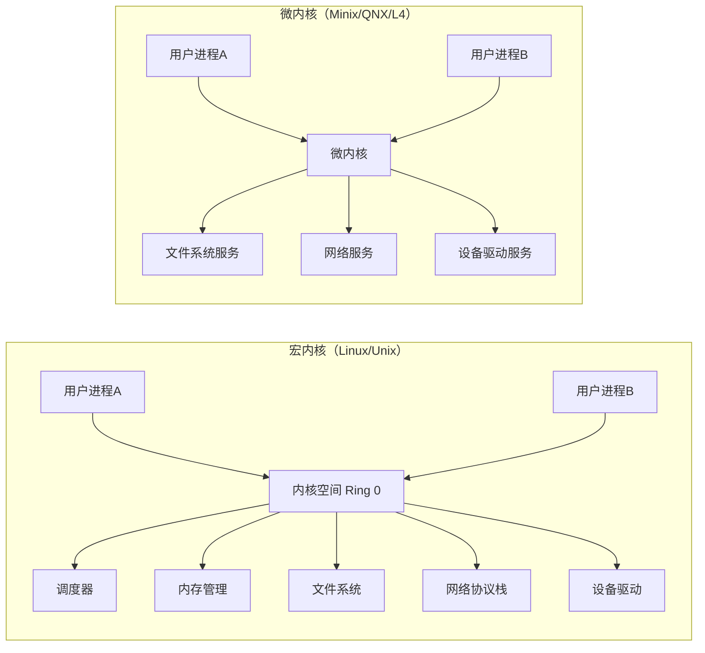
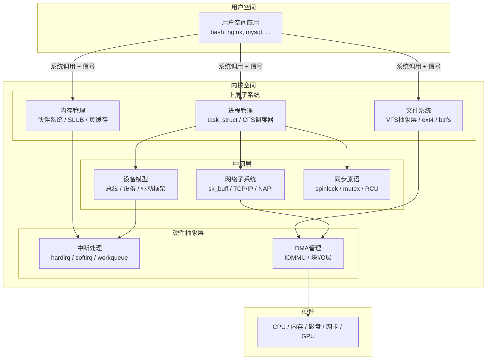
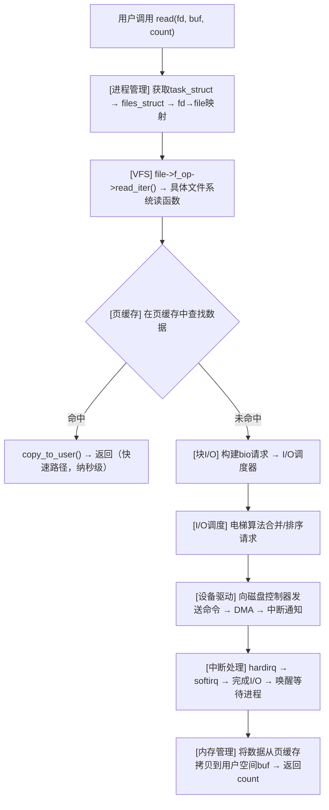

# Linux内核源码分析——理论基础

Linux内核是人类历史上规模最大的协作软件工程之一，截至6.x版本已超过2800万行C代码，涵盖进程管理、内存管理、文件系统、网络协议栈、设备驱动、安全机制等数十个子系统。理解内核源码不仅是操作系统课程的终极实践，更是系统级编程、性能调优、驱动开发和安全研究的必经之路。本节从理论层面建立分析内核源码所需的认知框架——为什么研究内核源码、内核的设计哲学是什么、各子系统解决的核心问题是什么、以及如何高效地阅读和理解数千万行代码。

---

## 1 为什么研究内核源码

### 1.1 操作系统理论与实现的鸿沟

教科书（如《Operating System Concepts》《现代操作系统》）用抽象模型解释操作系统原理——进程是执行流、内存是地址空间、文件是字节序列。但真实实现远比模型复杂：

| 教科书模型 | 内核真实实现 | 鸿沟所在 |
|-----------|-------------|---------|
| 进程 = PCB + 程序计数器 | `task_struct`包含600+字段，涵盖调度、内存、文件、信号、命名空间、cgroup等 | 一个结构体承载了整个进程的生命周期状态 |
| 虚拟内存 = 页表映射 | 伙伴系统→SLUB→页缓存→COW→NUMA balancing→OOM killer | 从分配到回收的完整链路跨越5个子系统 |
| 文件 = inode + 数据块 | VFS抽象层→ext4/jfs/btrfs具体实现→页缓存→块I/O调度→电梯算法 | 一次read()经过7层抽象 |
| 中断 = ISR处理 | 上半部→softirq→tasklet→workqueue→NAPI轮询 | 为了解决中断上下文不能睡眠的约束，设计了4种延迟机制 |

**内核源码分析的价值**在于填补这一鸿沟：你不仅知道"是什么"，还知道"为什么这样实现"以及"为什么不能用别的方式实现"。

### 1.2 从用户态到内核态的思维转换

用户空间编程遵循"请求-响应"模型：调用`malloc()`获取内存，调用`read()`读取文件。但内核编程面对的是完全不同的约束：

**约束一：无标准库可用。** 内核不能链接glibc，所有库函数需自行实现或使用内核提供的`lib/`目录下的简化版本（如`kprintf`代替`printf`，`kmalloc`代替`malloc`）。内核自带的`lib/`目录提供排序（`lib/sort.c`）、压缩（`lib/lzo/`）、CRC校验（`lib/crc32.c`）、CRC32C（`lib/crc32c.c`）等基础功能，但远不及用户态glibc的完整性。

**约束二：不能使用浮点运算。** 上下文切换时FPU/SSE/AVX寄存器不会自动保存到进程内核栈，内核使用浮点会导致其他进程的浮点寄存器数据被覆盖。这一约束的根源是：内核的上下文切换路径追求极致性能，保存FPU状态需要数百条额外指令。如果某个子系统确实需要浮点（如某些密码学运算），必须手动调用`kernel_fpu_begin()`/`kernel_fpu_end()`临时启用FPU并保存状态。

**约束三：不能睡眠的上下文。** 中断处理、softirq、持有spinlock时都不能调用可能睡眠的函数（如`kmalloc(GFP_KERNEL)`、`mutex_lock`、`msleep`）。违反此约束会导致"在中断上下文中睡眠"内核oops（内核oops不会直接panic，但会导致当前CPU被禁用或系统不稳定）。判断一个函数是否可以睡眠的经验法则：如果该函数内部会调用`schedule()`或等待完成量（completion），则不能在不可睡眠的上下文中调用。

**约束四：并发是常态而非例外。** SMP系统上，同一段内核代码可能在多个CPU上同时执行。用户空间用`pthread_mutex`就够了，内核需要区分中断上下文、softirq上下文、进程上下文，选择不同的同步原语：

| 执行上下文 | 可否睡眠 | 可用同步原语 | 典型场景 |
|-----------|---------|-------------|---------|
| 进程上下文（可睡眠） | 可以 | `mutex`、`semaphore`、`down_read/write` | 大部分内核代码 |
| 进程上下文（持spinlock） | 不可以 | `spin_lock`、`read_lock` | 自旋锁保护的临界区 |
| softirq/tasklet上下文 | 不可以 | `spin_lock_bh`、`spin_lock_irqsave` | 网络收包、定时器处理 |
| hardirq上下文 | 不可以 | `spin_lock_irq`、`spin_lock_irqsave` | 硬中断处理程序 |

**约束五：内核栈极其有限。** 每个进程的内核栈通常只有8KB（32位系统）或16KB（64位系统）。这意味着内核函数调用链不能过深，也不能在栈上分配大数组。内核中常见的大缓冲区（如网络数据包缓冲区、文件系统元数据缓冲区）都通过`kmalloc()`从堆上分配，而非栈上声明。

理解这些约束是阅读内核源码的前提——你看到的每一行代码都是在这些约束下做出的设计选择。

### 1.3 内核分析的实际应用

| 应用领域 | 需要的内核知识 | 典型场景 |
|---------|---------------|---------|
| 性能调优 | 调度器、内存管理、I/O路径 | 优化数据库延迟、Web服务器吞吐量 |
| 驱动开发 | 设备模型、中断处理、DMA | 编写网卡驱动、存储控制器驱动 |
| 安全研究 | 系统调用、权限模型、内核漏洞利用 | 提权漏洞分析、容器逃逸研究 |
| 容器/虚拟化 | namespace、cgroup、KVM | Docker底层实现、Kubernetes资源隔离 |
| 内核调试 | ftrace、eBPF、kprobes | 生产环境性能诊断、内核bug定位 |
| 嵌入式开发 | 内核裁剪、设备树、启动流程 | IoT设备定制、实时系统开发 |
| 云原生基础设施 | io_uring、eBPF、XDP | 高性能网络代理、可观测性平台 |
| 高频交易 | 内核旁路（DPDK）、CPU亲和性、中断亲和性 | 微秒级延迟优化、锁竞争消除 |

---

## 2 内核设计哲学

### 2.1 宏内核 vs 微内核：Linux的选择

操作系统内核架构有两种经典范式：



**对比分析：**

| 维度 | 宏内核 | 微内核 |
|------|--------|--------|
| 性能 | 子系统间函数调用（纳秒级） | IPC消息传递（微秒级），开销高10-100倍 |
| 可靠性 | 一个子系统Bug可能崩溃整个内核 | 子系统隔离，单个驱动崩溃不影响内核 |
| 灵活性 | 所有子系统编译在一起，裁剪困难 | 子系统独立运行，按需加载 |
| 开发难度 | 相对简单，直接函数调用 | IPC协议设计复杂，调试困难 |
| 代表系统 | Linux、FreeBSD、Solaris | QNX（汽车/工业）、L4（嵌入式）、seL4（形式化验证） |

Linux选择宏内核的主要原因：

1. **性能优势**：子系统间调用是函数调用（纳秒级），而非IPC消息传递（微秒级）。对于网络协议栈、文件系统这种高频调用路径，性能差异显著。一个典型的HTTP请求在内核中会触发数百次子系统间调用，IPC开销会使其延迟增加数十倍。

2. **历史惯性**：Linux从1991年开始就是宏内核架构，数十年的代码积累不可能推倒重来。内核社区曾多次讨论向微内核迁移，但性能代价和工程成本使其不可行。

3. **折中方案——模块化**：通过LKM（Loadable Kernel Modules）机制实现动态加载，在保持宏内核性能的同时获得一定灵活性。设备驱动、文件系统、网络协议都可以编译为`.ko`模块。一个典型的Linux发行版，内核核心代码约300万行，而模块代码超过2000万行。

4. **现代演进**：Linux也在借鉴微内核思想——`eBPF`允许在用户空间安全地运行内核逻辑，`FUSE`将文件系统实现移到用户空间，`DPDK/SPDK`将网络/存储数据面移到用户空间，`virtio`将设备模拟移到用户空间。这种"宏内核+用户空间扩展"的模式正在成为主流。

### 2.2 "一切皆文件"的设计原则

Unix/Linux最深刻的设计哲学之一：**一切皆文件（Everything is a File）**。

| 对象 | 文件接口 | 设备文件 | 说明 |
|------|---------|---------|------|
| 普通文件 | `read()/write()` | - | 磁盘上的数据 |
| 目录 | `readdir()` | - | 文件名到inode的映射 |
| 管道 | `read()/write()` | `pipe` | 进程间通信 |
| Socket | `read()/write()/send()/recv()` | - | 网络通信 |
| 设备 | `read()/write()/ioctl()` | `/dev/*` | 硬件设备 |
| 进程信息 | `read()/write()` | `/proc/*` | 内核数据结构的用户态视图 |
| 内核参数 | `read()/write()` | `/sys/*` | 设备模型、内核参数 |
| 事件通知 | `poll()/epoll()` | `/dev/eventfd` | 事件驱动编程 |

这一设计的威力在于：**统一的系统调用接口（open/read/write/close）可以操作任何类型的资源**。用户程序不需要为网络通信、设备控制、进程查询学习不同的API——一切都是文件描述符上的操作。

在内核源码中，这一原则体现为VFS（虚拟文件系统）层的抽象。每个文件系统类型通过`file_operations`结构体提供统一的操作接口：

```c
// include/linux/fs.h
struct file_operations {
    struct module *owner;
    loff_t (*llseek)(struct file *, loff_t, int);
    ssize_t (*read)(struct file *, char __user *, size_t, loff_t *);
    ssize_t (*write)(struct file *, const char __user *, size_t, loff_t *);
    ssize_t (*read_iter)(struct kiocb *, struct iov_iter *);
    ssize_t (*write_iter)(struct kiocb *, struct iov_iter *);
    __poll_t (*poll)(struct file *, struct poll_table_struct *);
    long (*unlocked_ioctl)(struct file *, unsigned int, unsigned long);
    int (*mmap)(struct file *, struct vm_area_struct *);
    int (*open)(struct inode *, struct file *);
    int (*release)(struct inode *, struct file *);
    int (*fsync)(struct file *, loff_t, loff_t, int datasync);
    // ... 更多操作
};
```

**阅读源码的启示**：当你追踪一个`read()`系统调用时，VFS层通过`file->f_op->read_iter`分发到具体文件系统的实现函数。这意味着从VFS代码看，你看到的是通用路径；要理解实际行为，必须找到`file_operations`的具体赋值——这通常在文件系统的`inode_operations`或`super_operations`中。

### 2.3 机制与策略分离

内核设计的另一个核心原则：**机制（mechanism）与策略（policy）分离**。

- **机制**：内核提供"怎么做"的能力。例如，调度器提供优先级、时间片、公平性算法等机制。
- **策略**：用户空间决定"做什么"。例如，`nice`值、`SCHED_FIFO`/`SCHED_RR`策略由用户程序设置。

这一分离的典型体现：

| 内核提供的机制 | 用户空间的策略 |
|-------------|--------------|
| CFS调度算法 | `nice`值、cgroup CPU配额 |
| 伙伴系统+SLUB | `vm.overcommit_ratio`、`ulimit` |
| VFS抽象层 | `mount`选项、文件系统选择 |
| 网络协议栈 | `iptables`/`nftables`规则、`tc`流量控制 |
| 内存映射（mmap） | `mmap`/`munmap`的调用时机和大小 |
| Netfilter钩子 | 用户态的`nftables`规则集 |

**为什么这一原则重要**：理解机制与策略分离，你就不会试图在内核代码中找到"如何配置TCP拥塞控制算法"的答案——那是策略，由用户空间通过`sysctl`或`ip route`设置。内核只提供TCP拥塞控制的算法框架（`tcp_congestion_ops`结构体），具体选择哪个算法（`cubic`、`bbr`、`vegas`等）由管理员决定。

### 2.4 缓存无处不在

Linux内核的性能优化核心思想：**缓存一切可以缓存的东西**。内核中存在多级缓存：

| 缓存层级 | 缓存对象 | 实现位置 | 淘汰策略 | 典型大小 |
|---------|---------|---------|---------|---------|
| CPU缓存 | 内存数据 | 硬件（L1/L2/L3） | 硬件自动 | L1=64KB, L2=512KB, L3=8-64MB |
| 页缓存（Page Cache） | 文件数据 | `mm/filemap.c` | LRU + 双链表（inactive/active） | 可达系统内存的50%+ |
| dentry缓存 | 目录项（文件名→inode） | `fs/dcache.c` | LRU，可回收 | 动态调整 |
| inode缓存 | inode元数据 | `fs/inode.c` | LRU | 动态调整 |
| SLUB缓存 | 内核小对象（task_struct/sk_buff等） | `mm/slub.c` | per-CPU freelist + partial list | 按对象大小分cache |
| socket缓存 | 网络数据包 | `net/core/skbuff.c` | 引用计数 | 由系统内存和网络负载决定 |
| TLB | 页表映射 | 硬件（MMU） | 硬件自动，flush | 典型64-1536条目 |

**阅读源码的启示**：当你看到一个`read()`系统调用时，不要只想到"从磁盘读数据"。实际路径可能是：页缓存命中→直接返回（纳秒级）；页缓存未命中→提交I/O→等待磁盘→填充页缓存→返回（毫秒级）。理解缓存层次是分析性能问题的关键。一个常见的性能误判是：优化了磁盘I/O路径，但数据其实一直命中页缓存，优化毫无效果。

---

## 3 内核源码阅读方法论

### 3.1 阅读前的准备

#### 环境搭建

阅读内核源码需要可搜索、可跳转的工具链：

```bash
# 推荐工具组合

# 1. 在线搜索（首选）：Elixir Cross-Reference
#    https://elixir.bootlin.com/linux/latest/source
#    支持：符号定义/引用跳转、文件浏览、版本切换、API文档

# 2. 本地源码下载
git clone --depth=1 https://github.com/torvalds/linux   # 只取最新版本，约2GB
# 如需特定版本：
git clone --branch v6.6 --depth=1 https://github.com/torvalds/linux

# 3. 本地索引（大项目必备）
cd linux
# ctags：快速跳转到函数/结构体定义
make tags     # 生成 tags 文件（vi/vim 用）
make cscope   # 生成 cscope 数据库（cscope 用）

# 4. IDE 配置
# VS Code + clangd 插件：提供LSP级别的代码补全、跳转、引用查找
# 需要先生成 compile_commands.json：
# make compile_commands.json  （5.x+内核支持）
# 或使用 bear 工具：
# bear -- make -j$(nproc)
```

#### 选择切入点

不要试图从`main.c`开始顺序阅读——2800万行代码的线性阅读是不现实的。推荐的切入策略：

| 策略 | 适用场景 | 示例 | 优点 | 缺点 |
|------|---------|------|------|------|
| **自顶向下** | 理解架构 | 从系统调用入口出发，追踪一条完整的调用链 | 能快速建立全局视野 | 容易在底层细节中迷失 |
| **自底向上** | 理解具体机制 | 从数据结构（task_struct/sk_buff）出发，追踪它的创建、使用、销毁 | 对单个子系统理解深刻 | 初期缺乏全局观 |
| **问题驱动** | 解决实际问题 | "为什么fork()这么快？"→ 追踪COW实现 | 动机明确，效率高 | 可能忽略相关上下文 |
| **事件驱动** | 理解生命周期 | "一个网络包从网卡到应用经历了什么？"→ 追踪完整路径 | 能看到子系统间协作 | 路径可能跨越10+文件 |

**新手建议**：先用"自顶向下"策略建立全局视野（1-2天），再选择一个子系统用"事件驱动"策略深入分析（1-2周）。

### 3.2 内核源码的阅读技巧

#### 技巧一：从数据结构出发

内核代码的核心是数据结构。每个子系统都围绕一个或几个核心数据结构展开：

进程管理 → task_struct（进程描述符，~600字段，约6KB）
          ├── sched_entity（CFS调度实体）
          ├── mm_struct（地址空间）
          ├── files_struct（打开文件表）
          └── signal_struct（信号状态）

内存管理 → mm_struct → vm_area_struct → page
          ├── 线性区管理（VMA链表/红黑树）
          ├── 页表映射（PGD→PUD→PMD→PTE）
          └── 物理页管理（zone→free_area→page）

文件系统 → super_block → inode → dentry → file
          ├── 超级块：文件系统全局信息
          ├── inode：文件元数据（大小、权限、时间）
          ├── dentry：目录项缓存（路径→inode映射）
          └── file：打开的文件实例

网络子系统 → sk_buff → sock → net_device
            ├── sk_buff：网络数据包（含协议头指针）
            ├── sock：socket连接状态
            └── net_device：网络设备

设备模型 → device → device_driver → bus_type
          ├── 设备：硬件设备抽象
          ├── 驱动：设备操作实现
          └── 总线：设备发现和绑定

**方法**：找到核心数据结构后，在Elixir中搜索它的所有字段，理解每个字段的用途。然后搜索哪些函数读写这些字段——你就找到了该子系统的核心逻辑。例如，搜索`task_struct`的`state`字段被哪些函数修改，你会找到调度器的核心路径。

#### 技巧二：追踪调用链而非孤立函数

一个系统调用从用户态到硬件的完整路径往往跨越数十个函数。追踪调用链的关键是找到**分岔点**——函数根据条件选择不同路径的地方。

示例：read()的分岔点
sys_read()                           ← 系统调用入口
  └→ vfs_read()                      ← VFS层通用处理
       └→ file->f_op->read_iter()    ← 关键分岔：不同文件系统走不同路径
            ├── 普通文件 → generic_file_read_iter()
            │    └→ 页缓存查找
            │         ├── 命中 → 直接copy_to_user()（快速路径，纳秒级）
            │         └── 未命中 → filemap_read() → 提交I/O（慢速路径，毫秒级）
            ├── 设备文件 → 特定驱动的read函数
            │    └→ 可能触发硬件I/O
            └── socket → sock_read_iter()
                 └→ TCP/UDP接收缓冲区

**实用技巧**：在Elixir中，按`Shift`点击函数名可以跳转到定义；点击"References"可以查看所有调用者。这样你能在几秒内理解一个函数的调用上下文。

#### 技巧三：关注宏和内联函数

内核大量使用宏和内联函数来隐藏架构差异：

```c
// 数据拷贝宏（不同架构有不同实现）
copy_to_user(dst, src, len)     // 内核态→用户态数据拷贝（包含权限检查）
copy_from_user(dst, src, len)   // 用户态→内核态数据拷贝（包含权限检查）
get_user(var, ptr)              // 从用户态读取单个值（8/16/32/64位）
put_user(val, ptr)              // 向用户态写入单个值

// 条件编译（根据内核配置选择代码路径）
#ifdef CONFIG_SMP                // 多处理器支持
#ifdef CONFIG_PREEMPT            // 抢占式调度
#ifdef CONFIG_DEBUG_SLAB         // SLUB调试模式
#ifdef CONFIG_64BIT              // 64位系统

// 编译器属性（提示编译器优化）
__init          // 初始化代码，启动后释放内存
__exit          // 退出代码，built-in时不编译
__user          // 用户空间指针，sparse工具检查
__kernel        // 内核空间指针
__must_check    // 返回值必须检查
__always_inline // 强制内联（即使开了-O0）
likely/unlikely // 分支预测提示
__read_mostly   // 热数据放在一起，提高缓存命中率
```

**阅读建议**：遇到宏时，在Elixir中搜索其定义，理解它在当前架构上的展开形式。特别是`copy_to_user`/`copy_from_user`——这两个宏在x86上会展开为带有`access_ok()`权限检查的`rep movsb`指令。

#### 技巧四：利用内核文档

内核源码自带大量文档（`Documentation/`目录），是理解子系统的权威参考：

| 文档路径 | 内容 | 推荐度 |
|---------|------|-------|
| `Documentation/scheduler/sched-design-CFS.rst` | CFS调度器设计文档 | ★★★★★ |
| `Documentation/mm/page_alloc.rst` | 伙伴系统说明 | ★★★★★ |
| `Documentation/mm/slub.rst` | SLUB分配器说明 | ★★★★ |
| `Documentation/networking/` | 网络子系统文档合集 | ★★★★ |
| `Documentation/ABI/` | 内核用户空间接口文档（sysfs/procfs参数） | ★★★★ |
| `Documentation/core-api/` | 内核核心API文档 | ★★★★ |
| `Documentation/driver-api/` | 驱动开发API文档 | ★★★ |
| `Documentation/process/` | 内核开发流程、编码规范 | ★★★★★ |
| `Documentation/admin-guide/` | 系统管理员指南（内核参数等） | ★★★ |

#### 技巧五：追踪git历史理解设计演进

内核代码的每一行都有可追溯的修改历史。遇到不理解的设计选择时，用`git log`追踪它的演进：

```bash
# 查看某个文件的修改历史
git log --oneline mm/slub.c | head -20

# 查看某个函数是什么时候引入的
git log -p -S 'slab_alloc' -- mm/slub.c | head -100

# 查看某个commit为什么引入这个改动（commit message是设计意图的最佳来源）
git show <commit-hash>
```

**内核commit message的质量极高**——每个改动都必须说明"为什么做这个改动"，而非仅仅"做了什么"。优秀的commit message本身就是理解设计意图的最佳文档。例如，搜索"rename"相关的commit，你会发现内核中大量看似随意的重命名其实都伴随着功能变更或接口规范化。

#### 技巧六：用ftrace/eBPF验证你的理解

阅读源码是静态理解，ftrace/eBPF是动态验证。两结合才能真正掌握内核行为：

```bash
# 追踪一个read()系统调用的完整内核调用栈
sudo bpftrace -e '
kprobe:vfs_read {
    printf("vfs_read called from %s (pid=%d)\n", comm, pid);
    print(kstack);
}'

# 追踪页缓存命中/未命中
sudo perf stat -e 'dentry:*' -a -- sleep 5

# 用ftrace查看函数调用时间
echo function_graph > /sys/kernel/debug/tracing/current_tracer
echo sys_read > /sys/kernel/debug/tracing/set_graph_function
echo 1 > /sys/kernel/debug/tracing/tracing_on
# 执行一些read操作
cat /proc/cpuinfo > /dev/null
echo 0 > /sys/kernel/debug/tracing/tracing_on
cat /sys/kernel/debug/tracing/trace
```

### 3.3 内核代码约定与注解体系

阅读内核源码时，你会频繁遇到各种注解和约定。理解它们能大幅降低阅读障碍：

#### 函数命名约定

| 命名模式 | 含义 | 示例 |
|---------|------|------|
| `do_xxx()` | 实际实现函数 | `do_fork()`、`do_execve()` |
| `sys_xxx()` | 系统调用入口 | `sys_read()`、`sys_write()` |
| `__xxx()` | 内部辅助函数，调用者需满足前置条件 | `__alloc_pages()`（需持锁） |
| `xxx_init()` / `xxx_exit()` | 初始化/清理函数 | `slub_init()`、`exit_mm()` |
| `xxx_alloc()` / `xxx_free()` | 资源分配/释放 | `kmalloc()`、`kfree()` |
| `xxx_add()` / `xxx_del()` | 链表/哈希表操作 | `list_add()`、`hlist_del()` |
| `xxx_show()` / `xxx_store()` | sysfs属性读写 | `sched_show()`、`sched_store()` |
| `xxx_lock()` / `xxx_unlock()` | 锁操作 | `spin_lock()`、`mutex_unlock()` |

#### 内核注解（Annotations）

```c
// 内存区域注解
__user      // 用户空间指针（sparse工具检查，防内核直接解引用）
__kernel    // 内核空间指针
__ro_after_init  // 初始化后只读的数据（安全加固）

// 生命周期注解
__init      // 仅初始化阶段使用的代码（启动后释放，节省内存）
__exit      // 仅模块卸载时使用的代码（built-in内核不编译此段）

// 可移植性注解
__le32      // 小端32位整数（网络字节序）
__be32      // 大端32位整数（网络字节序）
__cpu       // per-CPU数据（每个CPU有独立副本）

// 编译器属性
__must_check    // 返回值必须检查（忽略编译器警告）
__always_inline  // 强制内联
__printf(a, b)  // 格式字符串检查（类似__attribute__((format(printf,a,b)))）
```

#### 内核错误处理模式

内核代码几乎不使用`goto`进行跳转——除了**错误清理模式**。这是内核中最常见的代码模式：

```c
// 典型的内核错误处理：goto清理模式
static int my_driver_probe(struct pci_dev *pdev, const struct pci_device_id *id)
{
    struct my_device *dev;
    int err;

    // 分配资源
    dev = kzalloc(sizeof(*dev), GFP_KERNEL);
    if (!dev)
        return -ENOMEM;

    // 初始化资源1
    err = init_resource1(dev);
    if (err)
        goto err_free_dev;

    // 初始化资源2
    err = init_resource2(dev);
    if (err)
        goto err_free_r1;

    // 初始化资源3
    err = init_resource3(dev);
    if (err)
        goto err_free_r2;

    // 注册到子系统
    err = register_device(dev);
    if (err)
        goto err_free_r3;

    return 0;  // 成功

// 按照分配的逆序释放资源
err_free_r3:
    cleanup_resource3(dev);
err_free_r2:
    cleanup_resource2(dev);
err_free_r1:
    cleanup_resource1(dev);
err_free_dev:
    kfree(dev);
    return err;
}
```

**为什么不使用`if-else`嵌套**：内核编码规范（`Documentation/process/coding-style.rst`第7章）明确禁止多层`if-else`嵌套进行错误处理，因为那会导致代码缩进层层递进，可读性极差。`goto`在这里不是"坏味道"，而是最佳实践。

### 3.4 常见的阅读障碍与对策

| 阅读障碍 | 原因 | 对策 |
|---------|------|------|
| "这个结构体字段太多，不知道哪些重要" | task_struct有600+字段 | 只关注与当前子系统相关的字段，忽略其余。用grep搜索该字段被哪些函数使用来判断重要性 |
| "到处是`#ifdef`，看不清逻辑主线" | 条件编译适配不同配置 | 先在脑中关闭所有调试选项，只看主路径。用`make menuconfig`查看配置项含义 |
| "这个函数调用了另一个函数，越追越深" | 内核函数调用链很深 | 画调用图，标记深度，超过5层先记下返回地址。用`cscope`快速跳转 |
| "不理解这个锁为什么要这样加" | 锁的语义取决于并发场景 | 画出多个CPU的执行时序图，分析竞争条件。用lockdep（`CONFIG_PROVE_LOCKING`）验证锁顺序 |
| "汇编代码看不懂" | 体系结构相关代码用汇编 | 先跳过汇编部分，理解其功能描述，需要时再深入。重点掌握`entry_64.S`中的系统调用入口 |
| "宏展开后看不懂" | 代码被宏隐藏了真实逻辑 | 在Elixir中搜索宏定义，手动展开理解。用`make -n`查看实际编译命令 |
| "不知道这个函数的返回值怎么处理" | 内核函数返回负数表示错误 | 记住：负数返回值=错误码（`-ENOMEM`、`-EINVAL`等），正值=成功（如字节数）。检查`include/uapi/asm-generic/errno-base.h`查看所有错误码 |

---

## 4 内核源码导航：Kbuild与Kconfig系统

理解内核的构建系统是高效导航源码的前提。Kbuild不只是"把代码编译成内核"——它决定了哪些代码被编译、代码如何组织、模块如何加载。

### 4.1 Kconfig：内核配置系统

每个目录下的`Kconfig`文件定义了该目录的配置选项：

```bash
# 典型的 Kconfig 文件（fs/ext4/Kconfig 的简化版）
config EXT4_FS
    tristate "Fourth extended filesystem support"
    depends on BLK_DEV
    select CRC32
    select EXT4_FS_XATTR
    help
      Ext4 is a journaling file system for Linux. It is backward
      compatible with ext3, which was the previous default file system.

config EXT4_FS_POSIX_ACL
    bool "EXT4 POSIX Access Control Lists"
    depends on EXT4_FS
    select FS_POSIX_ACL
    help
      POSIX Access Control Lists (ACLs) support for ext4.
```

配置选项有三种类型：
- `bool`：二选一（Y/N），直接编译进内核或不编译
- `tristate`：三选一（Y/M/N），Y=编译进内核，M=编译为模块，N=不编译
- `string`：字符串值（如模块参数）

```bash
# 查看配置依赖关系
scripts/config --state EXT4_FS        # 查看是否启用
scripts/config --enable EXT4_FS       # 等同于在menuconfig中选Y

# 图形化配置
make menuconfig    # 终端图形界面
make nconfig       # 新版终端界面
make xconfig       # Qt图形界面（需要安装依赖）
```

### 4.2 Makefile：代码编译组织

每个目录下的`Makefile`告诉Kbuild如何编译该目录的源文件：

```bash
# 典型的 Makefile（fs/ext4/Makefile 的简化版）
obj-$(CONFIG_EXT4_FS)        += ext4.o
obj-$(CONFIG_EXT4_FS_XATTR)  += xattr.o
obj-$(CONFIG_EXT4_FS_POSIX_ACL) += acl.o

# 对于模块：
# CONFIG_EXT4_FS=m → 编译为 ext4.ko 模块
# CONFIG_EXT4_FS=y → 编译进 vmlinux

# 多文件模块的组合：
ext4-y := bitmap.o dir.o file.o ialloc.o inode.o \
         namei.o super.o symlink.o
ext4-$(CONFIG_EXT4_FS_XATTR) += xattr.o xattr_user.o xattr_trusted.o
```

### 4.3 如何快速定位目标代码

当你想分析某个功能时，推荐的定位步骤：

1. 确定功能属于哪个子系统
   例：分析TCP拥塞控制 → 网络子系统 → net/ 目录

2. 查看该目录的 Kconfig 找到相关配置项
   make menuconfig → Networking support → TCP congestion control

3. 查看 Makefile 确定源文件
   net/ipv4/Makefile → obj-$(CONFIG_TCP_CONG_CUBIC) += tcp_cubic.o

4. 阅读核心源文件
   net/ipv4/tcp_cubic.c → 拥塞控制算法实现

5. 追踪调用关系
   tcp_congestion_ops 结构体 → tcp_cubic_ops 实例 → 函数指针赋值

---

## 5 内核子系统全景图

Linux内核可以分为以下核心子系统，它们通过紧密协作完成操作系统的全部职责：



### 5.1 各子系统解决的核心问题

| 子系统 | 核心问题 | 关键数据结构 | 关键算法/机制 | 源码位置 |
|--------|---------|-------------|-------------|---------|
| 进程管理 | 如何在有限CPU上调度多个执行流？ | `task_struct`、`rq`、`cfs_rq` | CFS（vruntime + 红黑树）、实时调度、EEVDF | `kernel/sched/`、`kernel/fork.c` |
| 内存管理 | 如何为多个进程提供独立、安全的地址空间？ | `mm_struct`、`vm_area_struct`、`page` | 伙伴系统、SLUB、页表、COW、NUMA | `mm/` |
| 文件系统 | 如何持久化存储并高效检索数据？ | `super_block`、`inode`、`dentry` | VFS抽象、日志、B+树索引、页缓存 | `fs/` |
| 网络子系统 | 如何可靠地在机器间传输数据？ | `sk_buff`、`sock`、`net_device` | NAPI、TCP拥塞控制、协议栈分层 | `net/` |
| 设备模型 | 如何统一管理形形色色的硬件设备？ | `device`、`device_driver`、`bus_type` | 总线-设备-驱动模型、设备树（DT） | `drivers/` |
| 同步机制 | 如何在并发环境下保证数据一致性？ | `spinlock_t`、`mutex`、`rcu_data` | 自旋锁、互斥锁、RCU、原子操作 | `kernel/locking/` |
| 中断处理 | 如何及时响应硬件事件而不阻塞系统？ | `irq_desc`、`softirq_vec` | 上半部/下半部分离、NAPI、workqueue | `kernel/softirq.c`、`kernel/irq/` |
| 安全模块 | 如何在内核层面实施访问控制？ | `task_security_struct` | SELinux/AppArmor（LSM框架） | `security/` |

### 5.2 子系统间的协作关系

内核子系统不是孤立运作的，一个完整的操作往往跨越多个子系统。以`read()`系统调用为例：



理解子系统间的协作关系是内核源码分析的高级技能——你不再孤立地看某个子系统，而是能看到数据在内核中流动的完整路径。

---

## 6 内核版本与代码组织

### 6.1 内核版本演进

Linux内核采用`主版本.次版本.修订号`的版本格式，自2011年3.0版本起取消了奇数次版本（开发版）的惯例：

| 版本 | 发布年份 | 里程碑特性 | 对源码阅读的影响 |
|------|---------|-----------|----------------|
| 1.0 | 1994 | 首个正式版，支持网络 | 代码简洁，适合理解内核本质 |
| 2.0 | 1996 | 多处理器支持（SMP） | 引入并发控制复杂性 |
| 2.2 | 1999 | 细粒度锁、更好的SMP | 锁粒度开始细化 |
| 2.4 | 2001 | 内核抢占、NUMA支持、USB | O(1)调度器，代码开始膨胀 |
| 2.6 | 2003 | CFS（2.6.23）、SLUB、inotify | 现代内核架构定型 |
| 3.0 | 2011 | cgroup、Android支持 | 模块化程度大幅提升 |
| 4.0 | 2015 | live patching（热补丁） | 安全补丁不停机 |
| 5.0 | 2019 | io_uring、eBPF改进、MPTCP | 异步I/O新范式 |
| 6.0 | 2022 | Rust语言支持（实验性）、改进的调度器 | 内核语言多元化 |
| 6.6+ | 2023-2026 | EEVDF调度器（6.6）、更多Rust代码、sched_ext | 调度器可编程化 |

**阅读建议**：本文分析基于6.x内核源码。不同版本的实现可能有差异，但核心设计思想是一致的。查阅源码时建议使用Elixir在线浏览特定版本。初学者推荐从6.1（LTS版本）入手——代码成熟度高，文档和社区支持最完善。

### 6.2 源码目录结构详解

linux/
├── arch/              # 体系结构相关代码（~10%代码量）
│   ├── x86/           # x86_64 + i386
│   │   ├── boot/      # 引导加载程序（setup.c, compressed/）
│   │   ├── entry/     # 系统调用入口（entry_64.S）
│   │   ├── kernel/    # 体系结构相关的进程管理、信号处理
│   │   ├── mm/        # 页表管理、TLB flush、内存拷贝
│   │   └── include/   # 体系结构相关的内联函数
│   ├── arm64/         # ARM64（与x86结构类似）
│   └── riscv/         # RISC-V（新兴架构）
│
├── block/             # 块设备层（I/O调度器、请求合并）
│   ├── blk-core.c     # 块I/O核心
│   ├── blk-mq.c       # 多队列块I/O框架（NVMe/SSD时代的主力）
│   ├── elevator.c     # I/O调度器框架
│   └── mq-deadline.c  # deadline调度器（默认）
│
├── drivers/           # 设备驱动（~50%代码量，最大子目录）
│   ├── net/           # 网卡驱动
│   ├── scsi/          # SCSI/SAS/SATA存储驱动
│   ├── nvme/          # NVMe驱动
│   ├── gpu/           # GPU驱动（drm子系统）
│   └── usb/           # USB设备驱动
│
├── fs/                # 文件系统（~15%代码量）
│   ├── ext4/          # ext4文件系统
│   ├── btrfs/         # Btrfs（写时复制、快照）
│   ├── proc/          # /proc伪文件系统
│   ├── sysfs/         # /sys伪文件系统
│   ├── select.c       # select()实现
│   ├── poll.c         # poll()实现
│   └── eventpoll.c    # epoll实现
│
├── include/           # 头文件
│   ├── linux/         # 内核内部头文件（核心数据结构定义）
│   ├── uapi/          # 用户空间API头文件（系统调用号等）
│   └── asm-generic/   # 体系结构无关的通用定义
│
├── init/              # 内核初始化
│   └── main.c         # start_kernel() → 内核启动入口
│
├── io_uring/          # io_uring异步I/O框架（5.1+引入）
│   ├── io_uring.c     # 核心实现
│   ├── io-sq.c        # 提交队列管理
│   └── io-cq.c        # 完成队列管理
│
├── kernel/            # 内核核心子系统
│   ├── sched/         # 调度器（CFS、RT、deadline、EEVDF）
│   │   ├── fair.c     # CFS调度器
│   │   ├── rt.c       # 实时调度器
│   │   ├── deadline.c # Deadline调度器
│   │   └── core.c     # 调度器核心
│   ├── fork.c         # 进程创建（fork/clone）
│   ├── exit.c         # 进程退出
│   ├── signal.c       # 信号处理
│   ├── locking/       # 锁机制（spinlock、mutex、RCU）
│   └── bpf/           # eBPF运行时
│
├── lib/               # 内核库函数（排序、压缩、CRC等）
│
├── mm/                # 内存管理（~8%代码量）
│   ├── page_alloc.c   # 伙伴系统
│   ├── slub.c         # SLUB分配器
│   ├── mmap.c         # 内存映射
│   ├── filemap.c      # 页缓存核心
│   ├── vmscan.c       # 页面回收（kswapd、直接回收）
│   ├── oom_kill.c     # OOM killer
│   └── hugetlbpage.c  # 大页支持
│
├── net/               # 网络子系统
│   ├── core/          # 网络核心（sk_buff管理、设备注册）
│   ├── ipv4/          # IPv4协议实现
│   ├── tcp/           # TCP协议（拥塞控制、重传）
│   ├── udp/           # UDP协议
│   ├── unix/          # Unix域socket
│   └── socket.c       # socket层
│
├── security/          # 安全模块（SELinux、AppArmor、LSM框架）
│
└── tools/             # 用户空间工具
    ├── perf/          # 性能分析工具
    └── bpf/           # eBPF工具和示例

### 6.3 关键文件速查表

| 你想了解... | 关键文件 | 关键函数/入口 |
|------------|---------|-------------|
| 内核启动流程 | `init/main.c` | `start_kernel()` → `rest_init()` → `kernel_init()` |
| 系统调用入口 | `arch/x86/entry/entry_64.S` | `entry_SYSCALL_64` |
| 进程创建 | `kernel/fork.c` | `kernel_clone()` → `copy_process()` |
| CFS调度器 | `kernel/sched/fair.c` | `update_curr()`、`pick_next_entity()` |
| 伙伴系统 | `mm/page_alloc.c` | `__alloc_pages()` → `__alloc_pages_noprof()` |
| SLUB分配器 | `mm/slub.c` | `slab_alloc()` → `__slab_alloc()` |
| 缺页处理 | `mm/memory.c` | `handle_mm_fault()` → `do_fault()` / `do_wp_page()` |
| VFS | `fs/open.c`、`fs/read_write.c`、`fs/namei.c` | `do_sys_open()`、`vfs_read()`、`path_openat()` |
| ext4 | `fs/ext4/` 目录 | `ext4_file_read_iter()`、`ext4_sync_file()` |
| epoll | `fs/eventpoll.c` | `ep_poll()`、`ep_send_events()` |
| TCP | `net/ipv4/tcp.c`、`net/ipv4/tcp_input.c` | `tcp_v4_rcv()`、`tcp_rcv_established()` |
| 网卡收包 | `drivers/net/` + `net/core/dev.c` | `netif_receive_skb()` → `__netif_receive_skb_core()` |
| 中断处理 | `kernel/softirq.c`、`kernel/irq/` | `__do_softirq()`、`handle_irq_event()` |
| RCU | `kernel/rcu/` | `rcu_read_lock()`、`call_rcu()` |
| eBPF | `kernel/bpf/` | `bpf_prog_load()`、`bpf_prog_run()` |

---

## 7 内核版本演进与关键架构变迁

### 7.1 调度器的三次革命

Linux调度器的演进是理解内核设计思想变迁的最佳案例：

| 时代 | 调度器 | 时间复杂度 | 核心思想 | 源码位置 |
|------|--------|-----------|---------|---------|
| 2.4.x | O(n)调度器 | O(n) | 每次调度遍历所有进程，计算goodness评分 | 已移除 |
| 2.6.0-2.6.22 | O(1)调度器 | O(1) | 140个优先级数组+位图，硬件指令辅助 | 已移除 |
| 2.6.23-6.5 | CFS | O(log n) | 红黑树按vruntime排序，总是选最左节点 | `kernel/sched/fair.c` |
| 6.6+ | EEVDF | O(log n) | 虚拟截止时间+公平性，在CFS基础上改进延迟 | `kernel/sched/fair.c` |

**为什么从O(1)到CFS**：O(1)调度器在交互式桌面系统上表现不佳——它需要手动判断"交互式进程"和"批处理进程"，判断规则复杂且容易出错。CFS的创新在于：不需要区分进程类型，通过vruntime自动实现公平性。高优先级进程vruntime增长慢，自然获得更多CPU时间。

### 7.2 内存分配器的演进

| 分配器 | 引入版本 | 核心思想 | 适用场景 |
|--------|---------|---------|---------|
| SLAB | 2.0 | 对象缓存，per-CPU array | 通用小对象分配 |
| SLUB | 2.6.22 | 简化SLAB，去掉了per-CPU array和队列锁 | 现代内核默认 |
| SLOB | 2.6.16 | 极简实现，适合嵌入式 | 嵌入式系统 |
| SLQB | 2.6.28 | 尝试，后被放弃 | 实验性 |
| Mempool | 2.4 | 预留内存池，保证在内存压力下仍能分配 | 关键路径（块I/O、网络） |

### 7.3 网络子系统的演进

| 阶段 | 特性 | 解决的问题 |
|------|------|-----------|
| 2.4之前 | 传统中断驱动收包 | 网卡中断→中断上下文处理→返回 |
| 2.4+ | NAPI（轮询+中断混合） | 高流量下中断风暴问题 |
| 3.x+ | 多队列网络（multi-queue） | 多CPU并行收发包 |
| 4.x+ | XDP（eXpress Data Path） | 用户空间可编程数据面 |
| 5.x+ | io_uring网络 | 异步I/O统一收发接口 |

---

## 8 学习路径与资源

### 8.1 推荐学习路径（四阶段）

阶段一：建立全局认知（1-2周，约15小时）
├── 阅读 Robert Love《Linux Kernel Development》
├── 编译并启动自定义内核（make menuconfig → make → qemu）
├── 编写第一个内核模块（hello world）
├── 用strace追踪系统调用
└── 用Elixir浏览3-5个核心数据结构的定义

阶段二：深入核心子系统（4-8周，约60小时）
├── 进程管理：追踪fork()→exec()→exit()完整路径
├── 内存管理：理解伙伴系统→SLUB→页缓存的分层架构
├── 文件系统：从VFS出发追踪ext4的read/write路径
├── 网络子系统：追踪一个TCP包从网卡到socket的路径
├── 同步机制：理解spinlock/mutex/RCU的适用场景
└── 每个子系统完成后，用ftrace/eBPF验证你的理解

阶段三：工具与调试（2-4周，约20小时）
├── 掌握ftrace/eBPF动态追踪
├── 使用perf进行性能分析
├── 使用crash分析内核crash dump
├── 理解/proc、/sys接口
└── 搭建QEMU+GDB内核调试环境

阶段四：专题深入（持续）
├── 选择一个子系统深入研究（如调度器、内存管理、网络）
├── 阅读内核邮件列表讨论
├── 尝试向内核提交补丁
├── 阅读Brendan Gregg的性能分析方法论
└── 追踪LWN.net上的内核开发动态

### 8.2 每个阶段的验证标准

| 阶段 | 你做到了以下哪条，说明掌握到位了 |
|------|-------------------------------|
| 阶段一 | 能用`strace`解释一个简单程序的系统调用序列；能从`start_kernel()`讲到`init`进程启动 |
| 阶段二 | 能在白板上画出一个系统调用的完整内核路径（含关键函数名和数据结构） |
| 阶段三 | 能用ftrace定位一个内核函数的调用栈；能用perf分析一个性能瓶颈 |
| 阶段四 | 能读懂一个内核patch的意图；能向社区提交有质量的review |

### 8.3 参考资源

**必读书籍**：

| 书名 | 作者 | 特点 | 适合阶段 |
|------|------|------|---------|
| 《Linux Kernel Development》 | Robert Love | 简洁实用，覆盖核心子系统 | 入门→进阶 |
| 《Understanding the Linux Kernel》 | Bovet & Cesati | 深入源码，基于2.6内核 | 进阶 |
| 《Professional Linux Kernel Architecture》 | Wolfgang Mauerer | 最全面的内核分析 | 进阶→高级 |
| 《Linux设备驱动程序》 | Corbet等 | 驱动开发权威指南 | 驱动开发方向 |
| 《Understanding the Linux Virtual Memory Manager》 | Mel Gorman | 内存管理专题深入 | 内存子系统专精 |
| 《Linux性能优化实战》 | 倪朋飞 | 中文，实战导向 | 性能调优方向 |

**在线资源**：

| 资源 | 网址 | 用途 |
|------|------|------|
| Elixir Cross-Reference | elixir.bootlin.com | 在线搜索内核源码符号（支持多版本） |
| LWN.net | lwn.net/Kernel/ | 内核开发动态、技术深度文章（30年积累） |
| Linux Kernel Documentation | docs.kernel.org | 内核自带文档（最权威） |
| Brendan Gregg's Blog | brendangregg.com/blog | Linux性能分析方法论（火焰图发明者） |
| 内核邮件列表归档 | lore.kernel.org/lkml/ | 所有内核开发讨论的存档 |
| Linux Kernel Newbies | kernelnewbies.org | 内核新手友好的教程和FAQ |
| The LKMPG | sysprog21.github.io/lkmpg/ | 内核模块编程指南（在线免费） |

**内核开发工作流**：

| 工具/平台 | 用途 |
|----------|------|
| `git` | 内核源码版本管理（内核社区强制使用git） |
| `git format-patch` | 生成补丁格式（内核邮件列表要求的格式） |
| `scripts/checkpatch.pl` | 检查补丁是否符合内核编码规范 |
| `git send-email` | 通过邮件发送补丁（社区贡献的标准流程） |
| `b4` 工具 | 简化补丁提交和review流程（推荐新手使用） |

### 8.4 本节内容导航

本理论基础部分包含以下内容：

1. **核心概念**：内核的本质职责、宏内核架构、模块机制、内核地址空间布局、编程约束
2. **技术演进**：Linux内核从1.0到6.x的发展历程、关键子系统的架构变迁
3. **关键指标**：评估内核性能的核心度量标准与分析方法

这些内容为后续章节的源码分析提供了必要的理论准备。理解了这些基础概念后，在阅读具体的内核源码时，你将能够：

- 快速定位代码的功能和上下文
- 理解设计选择背后的权衡
- 将零散的代码片段组织成完整的知识体系
- 在不同子系统间建立关联和类比
- 追踪一个功能从用户空间到硬件的完整路径
