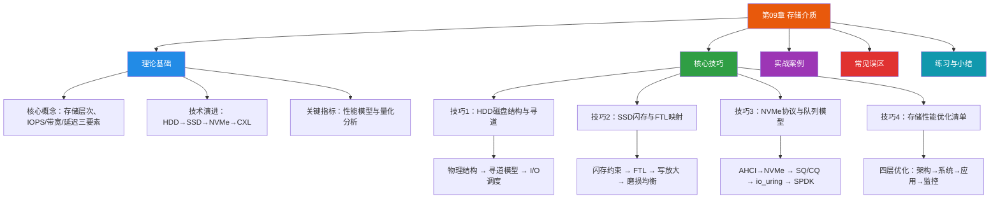

# 第09章 存储介质——章节概览

## 为什么存储介质如此重要

存储介质是计算机系统中最基础也最容易被忽视的子系统之一。然而，几乎所有大规模系统性能问题的根源，最终都会追溯到存储层。一个数据库查询为什么从毫秒级退化到秒级？一次大促活动为什么系统响应急剧恶化？根因往往不是CPU不够快、网络不够宽，而是I/O路径上的某个环节成了瓶颈。

理解存储介质的物理原理，不是"了解硬件细节"这么简单——它是做出正确架构决策的前提。选择HDD还是SSD？用LSM树还是B+树做存储引擎？日志写在本地NVMe还是远程网络存储？这些问题的答案，都取决于你对底层存储设备特性的理解深度。

### 存储层次的物理现实

现代计算机的存储体系呈金字塔结构，每一层的速度大约比下一层快一个数量级，容量则小一个数量级：

┌─────────────┐
│   寄存器     │  ~1ns, <1KB
├─────────────┤
│   L1 Cache  │  ~1-2ns, 32-64KB
├─────────────┤
│   L2 Cache  │  ~3-10ns, 256KB-1MB
├─────────────┤
│   L3 Cache  │  ~10-20ns, 数MB-数十MB
├─────────────┤
│   主存 DRAM  │  ~50-100ns, 数GB-数TB
├─────────────┤
│   PMEM/NVM  │  ~100ns-10μs, 数TB
├─────────────┤
│   SSD       │  ~10-100μs, 数TB
├─────────────┤
│   HDD       │  ~1-10ms, 数TB-数十TB
├─────────────┤
│   磁带/归档  │  ~秒-分钟, 无限
└─────────────┘

这个层次结构意味着：一次HDD随机读取（~8ms）的时间，CPU可以执行数百万条指令。一次DRAM访问（~100ns）的时间，SSD甚至还没来得及开始响应。存储引擎设计的核心挑战，就是在这些数量级差异之间找到最优的权衡点。

### 从历史看演进

存储介质的发展史，本质上是一部"用物理创新换性能空间"的历史：

| 时代 | 代表技术 | 关键突破 | 性能量级 |
|------|---------|---------|---------|
| 1956年 | IBM RAMAC 350 | 第一台磁盘存储系统 | ~0.008 MB/s |
| 1980年代 | 温彻斯特硬盘 | 密封式磁头-盘片组件 | ~5-10 MB/s |
| 2000年代 | SATA HDD | 串行接口标准化 | ~100-200 MB/s |
| 2010年代 | SATA SSD | 消除机械运动 | ~500 MB/s, ~100K IOPS |
| 2015年后 | NVMe SSD | PCIe直连，多队列并行 | ~7 GB/s, ~1M IOPS |
| 2020年后 | CXL + 持久化内存 | 内存语义的持久存储 | ~μs级延迟 |

每次技术跃迁不仅提升了性能，更改变了上层软件的设计范式。HDD时代催生了日志结构存储引擎（LSM树），SSD时代让B+树索引重获新生，NVMe时代则催生了用户态I/O框架（SPDK、io_uring）。

---

## 本章知识地图

本章按照"道→法→术→器"的层次组织，从物理原理出发，逐步深入到工程实践。以下是完整的知识体系地图：

---

## 章节结构导航

### 第一部分：理论基础

理论基础部分建立完整的知识框架，回答"是什么"和"为什么"的问题。

| 节 | 主题 | 核心内容 | 篇幅 |
|----|------|---------|------|
| 9.1 | 存储介质总览 | 存储层次结构、性能三要素（IOPS/带宽/延迟）、三者之间的量化关系 | 基础框架 |
| 9.2 | 机械硬盘（HDD） | 物理结构（盘片/磁头/电机）、磁盘组织（CHS/LBA）、访问延迟模型、IOPS计算、磁盘调度算法 | 深入物理层 |
| 9.3 | 固态硬盘（SSD） | NAND闪存原理（SLC/MLC/TLC/QLC）、FTL地址映射、垃圾回收、写放大与WAF、磨损均衡、内部并行架构 | 深入固件层 |
| 9.4 | NVMe协议 | AHCI到NVMe的范式跃迁、SQ/CQ环形队列、中断与轮询模式、io_uring集成、NVMe over Fabrics | 深入协议层 |

**阅读建议：** 如果你已有存储基础知识，可重点阅读9.4 NVMe协议和9.3.2 FTL部分——这是现代存储引擎设计中最关键的知识点。如果是初学者，建议从9.1开始按顺序阅读。

### 第二部分：核心技巧

核心技巧部分将理论转化为可操作的工程方法，回答"怎么做"的问题。每个技巧都遵循"道→法→术→器"的四层结构：

| 技巧 | 主题 | 核心能力 | 适用场景 |
|------|------|---------|---------|
| 技巧1 | HDD磁盘结构与寻道 | 理解机械寻道模型，利用顺序I/O优化 | 大数据量顺序读写、日志存储、冷数据归档 |
| 技巧2 | SSD闪存与FTL映射 | 掌握闪存物理约束，规避写放大陷阱 | 数据库存储引擎设计、写密集型应用优化 |
| 技巧3 | NVMe协议与队列模型 | 利用多队列并行，突破I/O瓶颈 | 高性能数据库、低延迟交易系统、实时分析 |
| 技巧4 | 性能优化清单 | 端到端I/O路径优化方法论 | 任何需要存储性能调优的系统 |

**每个技巧的结构：**

- **道**：理解本质原理（为什么这样做有效）
- **法**：核心策略方法（做什么）
- **术**：实操步骤与命令（怎么一步步做）
- **器**：工具速查表（用什么工具）
- **误区**：常见错误与纠正（避免踩坑）

### 第三部分：实战案例

实战案例将理论与技巧结合，展示真实系统中的存储设计决策。覆盖的场景包括：

- **数据库存储引擎选型**：LSM树 vs B+树在不同读写模式下的性能对比
- **高并发写入优化**：WAL日志设计、写入合并、批量提交
- **冷热数据分层**：如何根据数据生命周期自动迁移存储介质
- **分布式存储系统**：副本一致性、故障恢复、数据分布策略

### 第四部分：常见误区

存储领域存在大量"看起来合理但实际上错误"的直觉。常见误区包括：

| 误区类型 | 示例 | 正确理解 |
|---------|------|---------|
| 介质选择 | "SSD一定比HDD快" | 顺序读场景HDD带宽可达250MB/s，大文件吞吐并不差 |
| 性能预期 | "NVMe不需要调优" | NVMe设备需要匹配的软件栈才能发挥性能 |
| 寿命焦虑 | "SSD写多了会坏" | 现代TLC SSD标称600TBW，日均8GB可用200+年 |
| I/O模型 | "队列深度越高越好" | QD>64后IOPS收益递减，且增加延迟 |

### 第五部分：练习与小结

通过动手练习巩固知识，建立个人的存储性能调优经验库。练习包括：

- 用fio构建HDD/SSD/NVMe的完整性能基线
- 使用iostat和blktrace分析真实I/O模式
- 在Linux上配置I/O调度器并验证效果
- 用smartctl监控SSD健康状态并预测剩余寿命

---

## 学习路径建议

根据你的背景和目标，推荐以下学习路径：

### 路径一：快速上手（2-3小时）

适合需要快速建立存储基础知识的读者。

阅读顺序：9.1（存储总览）→ 技巧4（优化清单）→ 本章小结
目标：建立存储性能的全局视角，掌握最常用的优化方法

### 路径二：系统学习（6-8小时）

适合希望深入理解存储原理的读者。

阅读顺序：9.1 → 9.2 → 9.3 → 9.4 → 技巧1 → 技巧2 → 技巧3 → 技巧4
目标：建立完整的存储知识体系，能够独立进行存储性能分析和调优

### 路径三：工程实战（10+小时）

适合需要在生产系统中设计存储方案的高级工程师。

阅读顺序：全章通读 → 实战案例 → 动手练习 → 常见误区
目标：能够做出基于数据的存储架构决策，设计高性能存储引擎

---

## 前置知识

本章假设读者已经具备以下基础知识（参见本书第三章和第六章）：

- **操作系统I/O基础**：系统调用、缓冲I/O与直接I/O、文件描述符
- **文件系统概念**：inode、块分配、日志机制
- **基本的数据结构知识**：数组、链表、哈希表、B树

如果对这些概念不熟悉，建议先回顾相关章节后再阅读本章。

## 关键术语速查

| 术语 | 英文全称 | 含义 |
|------|---------|------|
| IOPS | I/O Operations Per Second | 每秒I/O操作数，衡量随机小I/O吞吐 |
| 带宽 | Throughput | MB/s或GB/s，衡量顺序大I/O传输速率 |
| 延迟 | Latency | 单次I/O从发起到完成的时间 |
| FTL | Flash Translation Layer | SSD控制器中的闪存转换层，管理LBA到物理页的映射 |
| WAF | Write Amplification Factor | 写放大系数，SSD实际写入量与主机请求写入量之比 |
| NVMe | Non-Volatile Memory Express | 新一代存储协议，通过PCIe直连CPU |
| SQ/CQ | Submission Queue / Completion Queue | NVMe的提交/完成环形队列 |
| TRIM | — | 通知SSD哪些数据块已不再使用，可用于垃圾回收 |
| PMEM | Persistent Memory | 持久化内存，兼具DRAM的字节寻址速度和闪存的持久性 |
| CXL | Compute Express Link | 新一代互连标准，支持内存语义的设备扩展 |
| ZNS | Zoned Namespace | NVMe ZNS，将闪存的擦除块暴露给主机，减少写放大 |
| io_uring | — | Linux 5.1+引入的高效异步I/O接口 |
| SPDK | Storage Performance Development Kit | 用户态NVMe驱动，绕过内核I/O栈 |

---

## 核心洞察

在进入详细内容之前，有三个核心洞察值得铭记，它们将贯穿本章始终：

**洞察一：存储介质的物理特性决定了软件设计的边界。** HDD的机械寻道延迟催生了日志结构存储引擎（LSM树），SSD的随机读性能优势让B+树索引在闪存时代重获竞争力，NVMe的多队列并行能力则要求软件栈从单队列设计转向并发友好架构。不了解底层硬件，就无法做出正确的软件设计决策。

**洞察二：IOPS、带宽、延迟是"不可能三角"的三个顶点。** 你不能同时最大化三者——高IOPS意味着小I/O（降低带宽），高带宽意味着大I/O（增加单次延迟），低延迟意味着减少排队（降低并发度）。系统设计的本质是在三者之间找到最适合业务场景的平衡点。

**洞察三：存储性能优化是一个端到端的系统工程。** 从应用层的I/O模式选择，到文件系统的挂载参数，到内核I/O调度器的配置，再到硬件层面的NUMA亲和性和中断均衡——任何一个环节的疏漏都可能成为瓶颈。性能优化不是"调一个参数"的事，而是需要沿着完整的I/O路径逐层排查。

---

*准备好深入了解了吗？让我们从存储层次结构和性能三要素开始，逐步构建完整的存储介质知识体系。*
