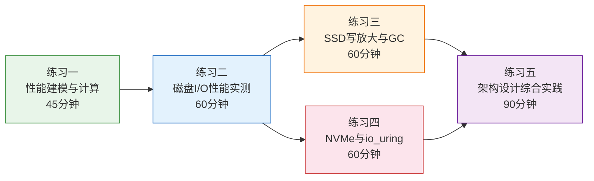
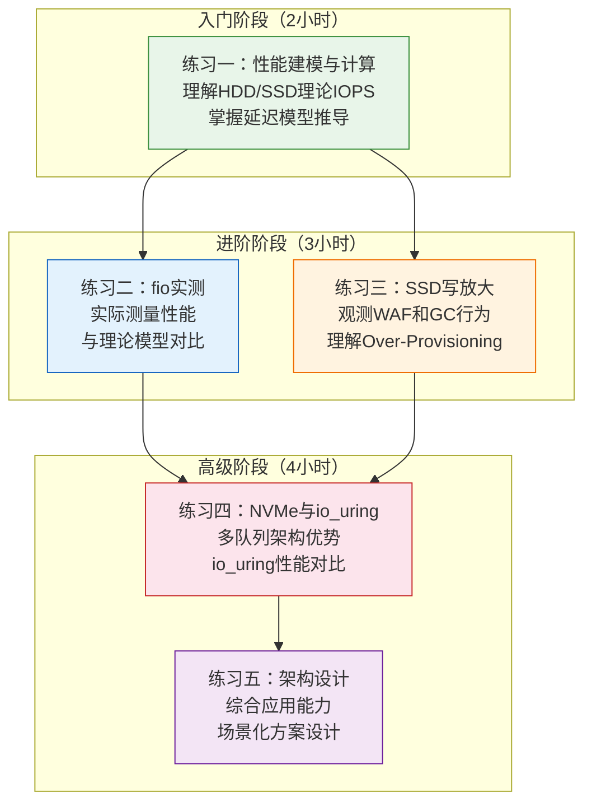

# 存储介质 — 练习方法

本章围绕"存储性能建模与实测验证"这一核心能力展开系统化训练。从理解磁盘物理结构、SSD闪存约束到NVMe多队列机制，每一层都需要动手实测才能真正内化。

以下五个练习由浅入深，覆盖五个能力维度：



---

## 前置准备

在开始练习之前，请确保环境满足以下要求：

### 硬件要求

| 练习 | 最低硬件 | 推荐硬件 | 说明 |
|------|---------|---------|------|
| 练习一 | 纸笔/计算器 | 任意 | 纯计算，无硬件依赖 |
| 练习二 | 任意一块磁盘（HDD或SSD） | 同时拥有HDD和SSD | 对比效果最佳 |
| 练习三 | SSD（≥120GB空闲空间） | 企业级SSD | 需要较大空间触发GC |
| 练习四 | NVMe SSD | NVMe Gen3/Gen4 | 需要NVMe设备测试多队列 |
| 练习五 | 无 | 任意 | 方案设计，不依赖硬件 |

### 软件环境准备

```bash
# 安装所有练习所需的工具
sudo apt-get update &amp;&amp; sudo apt-get install -y \
    fio \
    sysstat \
    blktrace \
    smartmontools \
    hdparm \
    iotop \
    bpftrace \
    python3

# 验证安装
fio --version &amp;&amp; echo "✓ fio 已安装"
iostat -V 2>/dev/null &amp;&amp; echo "✓ sysstat 已安装"
blkparse --version 2>/dev/null &amp;&amp; echo "✓ blktrace 已安装"
```

### 环境检查清单

```bash
# 1. 确认磁盘设备
lsblk -d -o NAME,SIZE,ROTA,TRAN,TYPE
# ROTA=1 表示旋转设备(HDD)，ROTA=0 表示非旋转设备(SSD)
# TRAN 列显示接口类型(sata/nvme/usb等)

# 2. 确认有足够空间进行测试（至少5GB可用）
df -h /tmp

# 3. 确认测试文件可以清理
echo "测试完成后执行以下命令清理："
echo "  rm -f /tmp/fio_test* /tmp/waf_test* /tmp/gc_test*"
echo "  rm -f /tmp/io_uring_test* /tmp/libaio_test*"
echo "  rm -f /tmp/blktrace_test* /tmp/usage_test*"
echo "  rm -f /tmp/fill_file* /tmp/fio_write"
```

---

## 练习一：存储介质性能建模与计算（预计45分钟）

**目标**：掌握HDD和SSD的延迟模型与IOPS计算方法，能独立推导出具体设备的理论性能上限。

**前置知识**：理解HDD的机械结构（盘片、磁头、寻道）、SSD的NAND闪存基本原理。

### 1.1 HDD延迟模型推导

#### 步骤一：计算单次HDD随机读延迟

给定一块7200RPM、平均寻道时间5ms的机械硬盘，读取一个4KB数据块，计算其理论随机读IOPS：

已知条件：
  转速 RPM = 7200
  平均寻道时间 T_seek = 5ms
  数据块大小 = 4KB
  持续传输速率 = 200 MB/s

计算过程：
  T_rotation = 30 / RPM = 30 / 7200 = 4.17ms    ← 平均旋转延迟（半圈）
  T_transfer = 4KB / 200MB/s = 4096 / (200 × 10⁶) = 0.02ms  ← 传输时间极短
  T_total = 5 + 4.17 + 0.02 = 9.19ms              ← 单次I/O总延迟
  IOPS = 1000 / 9.19 ≈ 109 IOPS                   ← 随机读IOPS上限

对比顺序读：
  IOPS_seq = 200MB/s / 4KB = 51,200 IOPS
  顺序/随机比 = 51200 / 109 ≈ 470倍               ← 顺序比随机快近500倍

**关键理解**：HDD随机I/O的瓶颈在于机械运动——磁头寻道（T_seek）和盘片旋转（T_rotation）占据了99%以上的时间，数据传输本身几乎可以忽略。这就是为什么HDD的随机读写性能极差。

#### 步骤二：计算不同转速HDD的性能差异

分别计算5400RPM、7200RPM、10000RPM、15000RPM硬盘的随机读IOPS，假设平均寻道时间分别为6ms、5ms、3.5ms、2.5ms，传输速率分别为180MB/s、220MB/s、260MB/s、300MB/s。将结果填入下表（参考值已标注）：

| 转速 | 寻道时间 | 旋转延迟 | 传输时间 | 总延迟 | 随机IOPS | 顺序IOPS |
|------|----------|----------|----------|--------|----------|----------|
| 5400 | 6.00ms | 5.56ms | 0.02ms | 11.58ms | ~86 | ~46,080 |
| 7200 | 5.00ms | 4.17ms | 0.02ms | 9.19ms | ~109 | ~56,320 |
| 10000 | 3.50ms | 3.00ms | 0.02ms | 6.52ms | ~153 | ~66,560 |
| 15000 | 2.50ms | 2.00ms | 0.01ms | 4.51ms | ~222 | ~76,800 |

**分析要点**：
- 从5400到15000 RPM，随机IOPS提升约2.6倍（86→222），但顺序IOPS仅提升1.7倍（46080→76800）
- 高转速HDD的收益主要来自旋转延迟的缩短，而非传输速率的提升
- 这就是为什么15000RPM的SAS硬盘曾经是企业级数据库的标配——数据库以随机I/O为主

#### 步骤三：SSD并发度模型

一块企业级SSD的随机读延迟为80μs，理论IOPS为12,500。若要达到50万IOPS，需要多少并发（队列深度）？

QD = IOPS × Latency = 500,000 × 80μs = 40

**验证与思考**：在实际SSD上，QD=40时能否达到50万IOPS？为什么理论值和实际值可能存在偏差？

偏差来源包括：
1. **SSD内部通道数有限**：典型企业级SSD有8-16个闪存通道，每个通道有独立的控制器
2. **Die内并行度**：每个Die（闪存颗粒）内部的plane数量有限，同时读取的page数量受限
3. **FTL开销**：闪存转换层需要维护映射表、执行垃圾回收，占用一部分内部带宽
4. **PCIe带宽瓶颈**：NVMe SSD的理论带宽上限受PCIe lane数限制（Gen3 x4 ≈ 3.5GB/s）
5. **读干扰**：频繁读取相邻page可能触发读取重试（Read Disturb），增加延迟

### 1.2 检查标准

- [ ] 能独立推导HDD延迟模型（T_seek + T_rotation + T_transfer）
- [ ] 理解RPM、寻道时间对IOPS的量化影响
- [ ] 能解释HDD顺序读写为何比随机快400-500倍
- [ ] 理解SSD队列深度与IOPS的非线性关系
- [ ] 能解释理论IOPS与实际IOPS的差异来源

---

## 练习二：磁盘I/O性能实测（预计60分钟）

**目标**：使用Linux工具实测HDD和SSD的IOPS、带宽和延迟，与理论模型进行对比验证。

**前置知识**：完成练习一；熟悉Linux命令行操作。

### 2.1 使用 fio 测试顺序与随机I/O

#### 环境准备

```bash
# 查看系统磁盘信息
lsblk -d -o NAME,SIZE,ROTA,TRAN,TYPE
# ROTA=1 表示旋转设备(HDD)，ROTA=0 表示非旋转设备(SSD)
# 输出示例：
# NAME   SIZE ROTA TRAN TYPE
# sda    500G    1 sata disk    ← HDD
# nvme0n1 1T  0 nvme disk      ← NVMe SSD
```

#### 测试一：随机读IOPS基线

```bash
# 随机读测试：4KB块大小，队列深度1，持续30秒
# -rw=randread: 随机读模式
# -ioengine=libaio: Linux异步I/O引擎（最常用的高性能引擎）
# -iodepth=1: 队列深度1，模拟单线程同步I/O场景
# -time_based: 持续运行指定时间（而非写完指定数据量）
# -group_reporting: 多job时合并报告
fio --name=randread_qd1 \
    --filename=/tmp/fio_test \
    --size=1G \
    --bs=4k \
    --rw=randread \
    --ioengine=libaio \
    --iodepth=1 \
    --runtime=30 \
    --time_based \
    --group_reporting \
    --output-format=json \
    --output=randread_qd1.json

# 提取关键指标
python3 -c "
import json
d = json.load(open('randread_qd1.json'))
r = d['jobs'][0]['read']
print(f\"IOPS: {r['iops']:.0f}\")
print(f\"带宽: {r['bw']:.0f} KB/s\")
print(f\"平均延迟: {r['lat_ns']['mean']/1000:.1f} μs\")
print(f\"P99延迟: {r['lat_ns']['percentile']['99.000000']/1000:.1f} μs\")
"
```

**预期结果参考**：

| 设备类型 | QD=1 随机读IOPS | 平均延迟 | P99延迟 |
|---------|----------------|---------|---------|
| 7200RPM HDD | ~100-150 | 7-10ms | 15-25ms |
| SATA SSD | ~8,000-12,000 | 80-120μs | 200-500μs |
| NVMe SSD | ~15,000-25,000 | 40-65μs | 100-200μs |

#### 测试二：队列深度对IOPS的影响

```bash
# 依次测试 QD=1, 4, 16, 32, 64, 128
for QD in 1 4 16 32 64 128; do
    fio --name="randread_qd${QD}" \
        --filename=/tmp/fio_test \
        --size=1G \
        --bs=4k \
        --rw=randread \
        --ioengine=libaio \
        --iodepth=${QD} \
        --numjobs=1 \
        --runtime=30 \
        --time_based \
        --group_reporting \
        --output-format=json \
        --output="qd${QD}.json"
done

# 汇总结果
echo "QD  | IOPS    | 平均延迟(μs) | P99延迟(μs)"
echo "----|---------|-------------|-----------"
for QD in 1 4 16 32 64 128; do
    python3 -c "
import json
d = json.load(open('qd${QD}.json'))
r = d['jobs'][0]['read']
print(f'${QD:3d} | {r[\"iops\"]:7.0f} | {r[\"lat_ns\"][\"mean\"]/1000:10.1f} | {r[\"lat_ns\"][\"percentile\"][\"99.000000\"]/1000:10.1f}')
" 2>/dev/null
done
```

**预期趋势**：
- **HDD**：QD增加几乎不提升IOPS（受机械延迟限制），延迟反而增加（排队时间叠加）
- **SSD**：QD从1增加到16-32时IOPS显著提升（利用内部并行），之后趋于饱和；延迟随QD增加而上升

#### 测试三：顺序读写带宽

```bash
# 顺序读带宽测试（1MB大块，充分利用磁盘吞吐）
fio --name=seqread \
    --filename=/tmp/fio_test \
    --size=2G \
    --bs=1M \
    --rw=read \
    --ioengine=libaio \
    --iodepth=32 \
    --runtime=30 \
    --time_based

# 顺序写带宽测试（含fsync确保数据落盘）
# --fsync=1: 每次写入后调用fsync，模拟数据库场景的持久化写入
fio --name=seqwrite \
    --filename=/tmp/fio_write \
    --size=2G \
    --bs=1M \
    --rw=write \
    --ioengine=libaio \
    --iodepth=32 \
    --fsync=1 \
    --runtime=30 \
    --time_based
```

### 2.2 使用 iostat 实时观测

```bash
# 实时观测磁盘I/O（每秒刷新一次，持续显示）
# -x: 扩展信息  -m: MB单位  -t: 显示时间戳
iostat -xmt 1
```

**关键字段解读**：

| 字段 | 含义 | 关注阈值 | 说明 |
|------|------|---------|------|
| r/s | 每秒读请求数（读IOPS） | - | 直接反映随机读性能 |
| w/s | 每秒写请求数（写IOPS） | - | 直接反映随机写性能 |
| rkB/s | 每秒读取KB数（读带宽） | - | 顺序读时关注此指标 |
| wkB/s | 每秒写入KB数（写带宽） | - | 顺序写时关注此指标 |
| rrqm/s | 读请求合并率 | 越高越好 | 文件系统预读和I/O调度器的合并效果 |
| wrqm/s | 写请求合并率 | 越高越好 | 写入合并减少了实际I/O次数 |
| await | 平均I/O等待时间(ms) | HDD<20ms, SSD<1ms | 包含排队延迟+硬件延迟 |
| svctm | 平均服务时间(ms) | - | 仅硬件延迟（不含排队） |
| %util | 设备利用率 | >90%为饱和 | 注意：NVMe设备此指标可能不准确 |

**重点关注**：
- `%util` 接近100%表示设备已饱和——I/O请求开始堆积在队列中
- `await` 远大于硬件延迟说明存在排队——`await ≈ svctm × (1 + QD/2)`（排队论估算）
- `rrqm/wrqm` 高说明I/O合并有效——减少实际磁盘操作次数，提升吞吐

### 2.3 对比分析与思考

将实测结果与练习一的理论计算进行对比：

| 指标 | 理论值 | 实测值 | 差异率 | 可能原因 |
|------|--------|--------|--------|----------|
| 随机读IOPS(QD=1) | ~109 (HDD) | | | |
| 随机读IOPS(QD=32) | | | | SSD内部并行提升 |
| 顺序读带宽 | ~200MB/s (HDD) | | | |
| P99延迟 | | | | |

**思考题**：

1. **为什么实测随机读IOPS通常低于理论值？**
   提示：文件系统元数据操作、页缓存管理、中断处理、上下文切换都会引入额外开销。`libaio` 引擎虽然避免了用户态→内核态的频繁切换，但内核内部的I/O调度和块层处理仍然存在。

2. **当%util=100%时，吞吐量是否还能继续提升？为什么？**
   提示：答案取决于设备类型。对于HDD，100%利用率意味着磁头满负荷工作，吞吐已到极限。对于NVMe SSD，由于其内部高度并行，%util=100%可能只是表示某个CPU核心的I/O处理已饱和，实际吞吐仍有提升空间（增加numjobs或iodepth）。

3. **在SSD上，增加队列深度为什么能提升IOPS？**
   提示：SSD内部有多个Die、每个Die有多个Plane，支持并行操作。当QD=1时，只有一个I/O在执行，其他通道空闲。增加QD后，多个I/O可以同时分配到不同通道/Die上执行，充分利用内部并行度。

### 2.4 清理环境

```bash
rm -f /tmp/fio_test* /tmp/fio_write /tmp/qd*.json
echo "✓ 测试文件已清理"
```

### 2.5 检查标准

- [ ] 能熟练使用fio进行多种I/O模式测试
- [ ] 能解读iostat输出的关键性能指标
- [ ] 能识别磁盘是否已达到性能饱和点
- [ ] 能分析理论值与实测值差异的原因
- [ ] 理解队列深度对SSD性能的关键影响

---

## 练习三：SSD写放大与垃圾回收实测（预计60分钟）

**目标**：深入理解SSD的写放大现象和垃圾回收机制，通过实测观察不同写入模式对SSD性能和寿命的影响。

**前置知识**：理解SSD的NAND闪存写入特性（先擦后写、Page/Block结构）、WAF（Write Amplification Factor）概念。

### 3.1 写放大观测

SSD的写放大（Write Amplification）是指实际写入闪存的数据量与主机写入的数据量之比。WAF=1表示无放大，WAF=3表示主机写1GB实际闪存写3GB。写放大直接消耗SSD的P/E寿命（Program/Erase Cycles）。

#### 步骤一：测量顺序写的写放大系数

```bash
# 使用fio进行纯顺序写入，测量实际写入量
# -direct=1: 绕过操作系统页缓存，直接写入设备
# -end_fsync=1: 测试结束时执行fsync，确保数据全部落盘
# -bs=128k: 大块顺序写，模拟典型的数据流写入场景
fio --name=waf_seq \
    --filename=/tmp/waf_test_seq \
    --size=1G \
    --bs=128k \
    --rw=write \
    --ioengine=libaio \
    --iodepth=32 \
    --direct=1 \
    --end_fsync=1

# 检查文件系统层面的实际写入量
# 注意：iostat反映的是经过文件系统后的写入量，不是SSD内部的闪存写入量
iostat -xmt 1 | grep w/s  # 观察写IOPS和写带宽
```

#### 步骤二：测量随机写的写放大系数

```bash
# 随机写入模式：4KB小块随机写，最易触发写放大
# 随机写导致每个Block中有效页面分散，GC时需要搬迁大量有效数据
fio --name=waf_rand \
    --filename=/tmp/waf_test_rand \
    --size=1G \
    --bs=4k \
    --rw=randwrite \
    --ioengine=libaio \
    --iodepth=32 \
    --direct=1 \
    --end_fsync=1

# 对比：检查SSD的SMART数据
# 需要smartmontools
sudo apt-get install -y smartmontools 2>/dev/null
sudo smartctl -a /dev/sda 2>/dev/null | grep -i "total_lbas_written\|wear_leveling\|percentage_used\|data_units_written"
```

**SMART关键指标说明**：

| SMART属性 | 含义 | 关注点 |
|-----------|------|--------|
| Data Units Written | 主机写入的512B扇区数 | 乘以512再除以10^12得TB数 |
| Total LBAs Written | 主机写入的LBA数 | 与Data Units Written类似 |
| Wear Leveling Count | 均磨损能力(剩余P/E次数) | 越低越接近寿命终点 |
| Percentage Used | 已消耗寿命百分比 | 100%表示设计寿命已用完（不等于报废） |

#### 步骤三：对比分析

| 写入模式 | 主机写入量 | 实际闪存写入量(估算) | WAF估算 | 原因分析 |
|----------|-----------|---------------------|---------|----------|
| 顺序写(128KB) | 1GB | ~1.0-1.2GB | ~1.0-1.2 | 顺序写入填充整个Block，GC搬迁少 |
| 随机写(4KB) | 1GB | ~3.0-10.0GB | ~3-10 | 随机写导致Block碎片化，GC搬迁大量有效页 |
| 混合写(70%读30%写) | 1GB | ~1.5-3.0GB | ~1.5-3 | 读不增加写放大，但写入部分仍有随机特征 |

**为什么WAF差距如此大？** 关键在于Block级别的"先擦后写"约束：
- 顺序写入时，新数据自然填满整个Block，GC几乎不需要搬迁有效数据
- 随机写入时，每个Block中只有部分Page有效，GC必须先读出有效Page、擦除Block、再写回——这些额外的读写就是写放大的来源

### 3.2 垃圾回收行为观测

```bash
# 持续写入直到触发GC，观察延迟突变（写悬崖现象）
# 使用高频率延迟采样来捕获GC触发时的延迟跳变
# -log_avg_msec=1000: 每秒采样一次延迟数据
# -write_bw_log / -write_lat_log / -write_iops_log: 生成日志文件供后续分析
fio --name=gc_test \
    --filename=/tmp/gc_test \
    --size=50G \
    --bs=4k \
    --rw=randwrite \
    --ioengine=libaio \
    --iodepth=1 \
    --lat_percentiles=1 \
    --percentile_list=50:90:99:99.9:99.99 \
    --log_avg_msec=1000 \
    --write_bw_log \
    --write_lat_log \
    --write_iops_log \
    --runtime=120 \
    --time_based

# 生成延迟分布图（需要gnuplot）
# fio自带的绘图脚本位于fio安装目录下的tools/plot/
# 或使用以下命令生成简易图表
# fio_generate_plots gc_test 1>/dev/null 2>&amp;1
# xdg-open lat.png  # 查看延迟随时间的变化

# 观察要点：
# 1. 前期延迟稳定在较低水平
# 2. 当SSD空间逐渐占满时，GC开始活跃
# 3. P99延迟会突然升高（"写悬崖"现象）
# 4. GC完成后延迟恢复，形成周期性波动
```

**写悬崖（Write Cliff）现象解析**：

当SSD的空闲Block减少到触发GC的阈值时，控制器需要在后台执行"边写边清理"操作。这会导致：
1. **前台I/O延迟激增**：GC需要读取有效Page、擦除Block、重写有效Page，这些操作与前台I/O竞争闪存通道
2. **带宽下降**：部分闪存通道被GC占用，可用于前台I/O的带宽减少
3. **P99延迟飙升**：最坏情况下，一个I/O请求可能等待GC完成一个完整Block的清理（数毫秒级别）

### 3.3 预留空间对性能的影响

Over-Provisioning（OP）是SSD出厂时预留的不可用空间，比例通常为7%-28%。更多OP意味着更多空闲Block供GC使用，减少写放大和性能波动。

```bash
# 对比不同磁盘占用率下的随机写性能
# 场景1：磁盘使用率30%（大量空闲空间，GC压力小）
fio --name=usage30 \
    --filename=/tmp/usage_test \
    --size=5G \
    --bs=4k \
    --rw=randwrite \
    --ioengine=libaio \
    --iodepth=32 \
    --direct=1 \
    --runtime=30 \
    --time_based

# 手动填充磁盘到80%后再测试
# 场景2：磁盘使用率80%（空闲空间减少，GC开始频繁）
dd if=/dev/zero of=/tmp/fill_file bs=1M count=60000 2>/dev/null
sync
fio --name=usage80 \
    --filename=/tmp/usage_test \
    --size=5G \
    --bs=4k \
    --rw=randwrite \
    --ioengine=libaio \
    --iodepth=32 \
    --direct=1 \
    --runtime=30 \
    --time_based

# 场景3：磁盘使用率95%（极度紧张，GC严重影响性能）
dd if=/dev/zero of=/tmp/fill_file2 bs=1M count=75000 2>/dev/null
sync
fio --name=usage95 \
    --filename=/tmp/usage_test \
    --size=5G \
    --bs=4k \
    --rw=randwrite \
    --ioengine=libaio \
    --iodepth=32 \
    --direct=1 \
    --runtime=30 \
    --time_based

# 对比三种场景的P99延迟和吞吐量
# 预期结论：磁盘越满，GC越频繁，性能下降越明显
```

**预期结果趋势**：

| 磁盘使用率 | 随机写IOPS | P99延迟 | 写放大 |
|-----------|-----------|---------|--------|
| 30% | 高（接近设备峰值） | 低且稳定 | ~1.0-1.2 |
| 80% | 中等 | 有周期性波动 | ~2-4 |
| 95% | 大幅下降 | 剧烈波动 | ~5-10+ |

**实际生产建议**：SSD使用率保持在70%以下，为企业级SSD预留至少7%的Over-Provisioning空间。

### 3.4 清理环境

```bash
rm -f /tmp/waf_test* /tmp/gc_test* /tmp/usage_test*
rm -f /tmp/fill_file* /tmp/gc_test_*.log
echo "✓ 测试文件已清理"
```

### 3.5 检查标准

- [ ] 理解WAF的含义和影响因素
- [ ] 能通过fio工具观测不同写入模式的性能差异
- [ ] 理解"写悬崖"现象的成因
- [ ] 能解释为什么SSD不能写满使用
- [ ] 理解Over-Provisioning对性能的保护作用
- [ ] 能估算SSD的预期使用寿命

---

## 练习四：NVMe多队列与io_uring性能对比（预计60分钟）

**目标**：深入理解NVMe的多队列架构优势，对比传统POSIX I/O与io_uring的性能差异。

**前置知识**：理解NVMe协议基础、CPU中断亲和性、Linux I/O栈架构。

### 4.1 NVMe队列深度与并行度

NVMe协议支持最多65535个提交队列（Submission Queue），每个队列最多655536个条目。这是相比AHCI（仅1个队列、32个条目）的核心优势——消除锁竞争，实现真正的硬件级并行。

```bash
# 查看NVMe设备信息
ls /dev/nvme* 2>/dev/null
sudo nvme id-ctrl /dev/nvme0n1 2>/dev/null | grep -i "sq\|cq\|mqes"
sudo nvme id-ns /dev/nvme0n1 2>/dev/null | grep -i "nsze\|ncap"

# 查看NVMe支持的队列数和最大队列深度
# MQES (Maximum Queue Entries Supported): 每队列最大条目数（实际值需+1）
# 支持的提交队列数：通常为CPU核心数（每个CPU核心一个队列，避免锁竞争）

# 使用fio测试NVMe在不同并行度下的性能
# 场景：每个numjobs创建独立的I/O上下文，模拟多核并发访问
for JOBS in 1 2 4 8 16; do
    fio --name="nvme_q${JOBS}" \
        --filename=/dev/nvme0n1 \
        --size=10G \
        --bs=4k \
        --rw=randread \
        --ioengine=libaio \
        --iodepth=32 \
        --numjobs=${JOBS} \
        --group_reporting \
        --runtime=30 \
        --time_based \
        --output-format=json \
        --output="nvme_q${JOBS}.json"
done

echo "并行job数 | 总IOPS    | 平均延迟(μs) | CPU使用率"
echo "----------|-----------|-------------|---------"
for JOBS in 1 2 4 8 16; do
    python3 -c "
import json
d = json.load(open('nvme_q${JOBS}.json'))
r = d['jobs'][0]['read']
cpu = d['jobs'][0].get('usr_cpu',0) + d['jobs'][0].get('sys_cpu',0)
print(f'    ${JOBS:2d}    | {r[\"iops\"]:9.0f} | {r[\"lat_ns\"][\"mean\"]/1000:10.1f} | {cpu:5.1f}%')
" 2>/dev/null
done
```

**预期趋势分析**：

| 并行job数 | 总IOPS变化 | 平均延迟变化 | 原因 |
|-----------|-----------|-------------|------|
| 1→2 | ~2x提升 | 略升 | 两个队列并行，吞吐翻倍 |
| 2→4 | ~1.5-2x提升 | 继续升 | 更多队列填充内部通道 |
| 4→8 | ~1.2-1.5x提升 | 升高 | 内部通道趋于饱和 |
| 8→16 | 趋于平稳 | 显著升高 | 已达设备极限，排队增加 |

**关键洞察**：NVMe的多队列设计让不同CPU核心可以直接访问不同队列，无需全局锁。但当所有队列的I/O总量超过设备内部并行度时，增益递减。

### 4.2 io_uring vs 传统libaio对比

io_uring是Linux 5.1+引入的异步I/O框架，核心优势在于：
1. **减少系统调用**：通过共享的提交队列（SQ）和完成队列（CQ），批量提交/收割I/O，避免每次I/O都执行`io_submit()`/`io_getevents()`系统调用
2. **零拷贝提交**：用户态和内核态通过mmap共享内存，减少数据拷贝
3. **轮询模式（Polling）**：内核可以轮询CQ而非等待中断，进一步降低延迟

```bash
# 使用fio的io_uring引擎测试
# 注意：需要Linux 5.1+和fio 3.2+支持io_uring
fio --name=io_uring_test \
    --filename=/tmp/io_uring_test \
    --size=2G \
    --bs=4k \
    --rw=randread \
    --ioengine=io_uring \
    --iodepth=128 \
    --runtime=30 \
    --time_based \
    --output-format=json \
    --output=iouring.json

# 对比libaio引擎（传统异步I/O）
fio --name=libaio_test \
    --filename=/tmp/libaio_test \
    --size=2G \
    --bs=4k \
    --rw=randread \
    --ioengine=libaio \
    --iodepth=128 \
    --runtime=30 \
    --time_based \
    --output-format=json \
    --output=libaio.json

# 对比结果
echo "引擎       | IOPS    | P99延迟(μs) | CPU使用率"
echo "-----------|---------|-------------|---------"
python3 -c "
import json
for engine, fname in [('io_uring', 'iouring.json'), ('libaio', 'libaio.json')]:
    try:
        d = json.load(open(fname))
        r = d['jobs'][0]['read']
        cpu = r['usr_cpu'] + r['sys_cpu']
        print(f'{engine:10s} | {r[\"iops\"]:7.0f} | {r[\"lat_ns\"][\"percentile\"][\"99.000000\"]/1000:10.1f} | {cpu:5.1f}%')
    except Exception as e:
        print(f'{engine:10s} | 测试失败: {e}')
"
```

**预期对比**：

| 指标 | libaio | io_uring | 改善幅度 |
|------|--------|----------|---------|
| IOPS | 基准 | +10-30% | 高QD下更明显 |
| P99延迟 | 基准 | -15-40% | 轮询模式改善最大 |
| CPU使用率 | 基准 | -20-40% | 批量处理减少系统调用 |

### 4.3 使用blktrace分析I/O路径

blktrace可以追踪I/O请求在内核中的完整生命周期，帮助理解延迟的各组成部分。

```bash
# 安装blktrace
sudo apt-get install -y blktrace

# 启动I/O追踪（后台运行，-d指定设备，-o输出文件前缀）
sudo blktrace -d /dev/sda -o trace &amp;

# 同时运行fio测试（混合读写，模拟真实负载）
fio --name=blktrace_test \
    --filename=/tmp/blktrace_test \
    --size=1G \
    --bs=4k \
    --rw=randrw \
    --rwmixread=70 \
    --ioengine=libaio \
    --iodepth=16 \
    --runtime=15 \
    --time_based

# 停止追踪
sudo kill %1
wait %1 2>/dev/null

# 解析追踪数据
blkparse -i trace.blktrace.0 | head -50

# 使用btt分析延迟分布
btt -i trace.blktrace.0
```

**btt输出关键字段解读**：

| 阶段 | 标识 | 含义 | 优化方向 |
|------|------|------|---------|
| Q→D | Q2D (Queued to Dispatch) | 调度延迟：请求在I/O调度队列中等待 | 调整调度器（deadline/noop/mq-deadline） |
| D→C | D2C (Dispatch to Complete) | 硬件延迟：设备实际处理I/O的时间 | 升级存储设备 |
| Q→C | Q2C (Queued to Complete) | 端到端延迟：从提交到完成的总时间 | Q2C = Q2D + D2C + 其他内核开销 |

**分析要点**：
- 如果Q2D过高，说明I/O调度器瓶颈——检查调度器类型和队列深度
- 如果D2C过高，说明硬件性能不足——考虑升级SSD或调整RAID配置
- 如果Q2D+D2C < Q2C，说明存在其他内核开销（中断处理、上下文切换等）

### 4.4 清理环境

```bash
rm -f /tmp/io_uring_test /tmp/libaio_test /tmp/blktrace_test*
rm -f /tmp/nvme_q*.json /tmp/iouring.json /tmp/libaio.json
sudo rm -f trace.blktrace.* trace.blktrace.*
echo "✓ 测试文件已清理"
```

### 4.5 检查标准

- [ ] 理解NVMe多队列如何消除锁竞争
- [ ] 能对比io_uring与libaio的性能差异并解释原因
- [ ] 理解io_uring减少系统调用次数的机制
- [ ] 能使用blktrace分析I/O延迟的各组成部分
- [ ] 能解释轮询模式（Polling）的适用场景与代价

---

## 练习五：存储引擎设计决策综合实践（预计90分钟）

**目标**：根据具体业务场景选择存储介质和设计存储策略，综合运用前四个练习的知识。

**核心能力**：将"道法术器"贯通——理解存储之"道"（数据访问模式的本质规律）、掌握设计之"法"（分层/分片/缓存的方法论）、运用优化之"术"（fio调优/调度器配置的技巧）、善用工具之"器"（NVMe/io_uring/blktrace）。

### 5.1 场景一：时序数据库（IoT传感器数据）

**需求**：
- 每秒写入10万条传感器数据（每条约100字节）
- 数据按时间顺序到达（天然的追加写入模式）
- 读取模式：最近1小时数据高频查询，历史数据偶尔查询
- 要求保留90天数据，预估总数据量约800GB

**请完成以下设计**：

| 设计维度 | 你的方案 | 理由 |
|----------|----------|------|
| 存储介质选择 | | |
| 写入策略 | | |
| 数据分层 | | |
| 索引设计 | | |
| 数据压缩 | | |

**分析要点**：
1. 时序数据是典型的"追加写入"场景，什么存储介质的顺序写性能最优？→ 考虑NVMe SSD的顺序写带宽可达3-7GB/s
2. 如何利用LSM树（Log-Structured Merge Tree）的设计思想？→ WAL+MemTable+SSTable的三层结构，写入先进MemTable（内存），满后刷盘为SSTable
3. 冷热数据分离应如何实现？→ 热数据（最近1小时）放NVMe SSD + DRAM缓存，温数据（1-7天）放SATA SSD，冷数据（7-90天）可迁移到HDD或对象存储

**参考答案要点**：
- **介质**：热数据→NVMe SSD（低延迟随机读），冷数据→HDD/对象存储（大容量低成本）
- **写入**：批量顺序写入，每10万条≈10MB，可按时间窗口（如1秒）聚合后一次性写入
- **分层**：按时间自动分片，热分区保留在SSD，冷分区自动迁移到廉价存储
- **索引**：倒排索引（按设备ID查询）+ 时间范围索引（按时间区间查询）
- **压缩**：Delta-of-Delta编码（时间戳差值压缩）+ Gorilla编码（浮点数压缩），压缩率可达10:1

### 5.2 场景二：OLTP交易系统（银行核心系统）

**需求**：
- 每秒处理5000笔交易（每笔约2KB的读写操作）
- 要求强一致性，每笔交易的P99延迟小于5ms
- 数据量约500GB，要求99.999%可用性（年停机<5.26分钟）
- 读写比约7:3

**请完成以下设计**：

| 设计维度 | 你的方案 | 理由 |
|----------|----------|------|
| 存储介质选择 | | |
| 事务日志设计 | | |
| 缓存策略 | | |
| 复制策略 | | |
| 故障恢复 | | |

**分析要点**：
1. 银行系统对WAL（Write-Ahead Logging）的要求是什么？→ 每笔交易的WAL必须在返回客户端"成功"之前持久化到磁盘（即必须fsync），否则宕机后可能丢数据
2. 如何保证日志写入的持久性？→ `O_DIRECT + O_SYNC` 或 `fsync()` 确保数据和元数据都落盘；使用带掉电保护的SSD（有电容保护的写缓存）
3. 读写比7:3意味着什么？→ 读远多于写，Buffer Pool（如InnoDB Buffer Pool）可以缓存热点数据页，减少磁盘读I/O
4. 如何设计双机热备方案以达到99.999%可用性？→ 主备复制 + 自动故障切换（如MySQL InnoDB Cluster / Patroni for PostgreSQL），RTO<30秒

**参考答案要点**：
- **介质**：WAL日志→带掉电保护的企业级SSD（低延迟fsync），数据文件→NVMe SSD（随机读IOPS高）
- **日志**：组提交（Group Commit）优化——将多个事务的WAL合并为一次fsync，减少磁盘操作次数
- **缓存**：Buffer Pool覆盖热点数据（70%读+30%写中的读大部分可命中缓存），脏页后台异步刷盘
- **复制**：同步复制保证数据不丢（RPO=0），异步复制延迟<100ms（RPO<1秒）
- **恢复**：WAL重放 + Checkpoint机制，崩溃后从最后一个Checkpoint开始重放WAL

### 5.3 场景三：大数据分析平台（OLAP）

**需求**：
- 每天ETL处理约2TB原始数据
- 查询以全表扫描和聚合为主，单次查询扫描10GB-100GB数据
- 查询延迟要求：小查询<10秒，大查询<5分钟
- 数据量随时间持续增长，需要支持数据压缩

**请完成以下设计**：

| 设计维度 | 你的方案 | 理由 |
|----------|----------|------|
| 存储介质选择 | | |
| 列式存储 vs 行式存储 | | |
| 数据压缩方案 | | |
| 并行读取策略 | | |
| 分区策略 | | |

**分析要点**：
1. 列式存储为什么适合OLAP场景？→ 查询只涉及少数几列时，只需读取对应列的数据（I/O减少50-90%），且同一列数据类型一致，压缩率更高
2. 列式存储中HDD的顺序读优势如何发挥？→ 列数据在磁盘上连续存储，大块顺序读（1MB+）可充分利用HDD的200MB/s带宽
3. 选择什么压缩算法？→ LZ4（快速解压，适合热数据）/ Zstd（高压缩率，适合冷数据）/ Snappy（Hadoop默认，平衡速度与压缩率）
4. 数据分区粒度如何影响查询性能？→ 分区过粗（如按月）→查询需扫描整个分区；分区过细（如按小时）→分区元数据管理开销大。建议按天分区+按小时子分区

**参考答案要点**：
- **介质**：热数据（最近7天）→NVMe SSD，温数据（7-30天）→SATA SSD，冷数据（30天+）→HDD或对象存储（S3/OSS）
- **列存储**：Apache Parquet/ORC格式，列式编码+谓词下推，跳过不需要的数据块
- **压缩**：LZ4（默认，解压速度>5GB/s）用于查询层，Zstd（压缩率高）用于归档层
- **并行**：MPP架构（如ClickHouse/Doris），将查询分发到多个节点并行执行
- **分区**：按时间分区（天/小时），按业务维度分区（如用户ID范围），分区裁剪减少扫描范围

### 5.4 方案评审与优化

完成三个场景的设计后，进行交叉评审。对照以下清单逐项检查：

**存储介质选型合理性**
- [ ] 是否根据IOPS/带宽/延迟需求选择了合适的介质？
- [ ] 是否考虑了成本约束？（NVMe SSD: HDD成本的5-10倍）
- [ ] 是否预留了扩展空间？（容量增长20-50%的余量）

**性能瓶颈分析**
- [ ] 是否识别出系统的主要I/O瓶颈？（写密集→关注WAF，读密集→关注IOPS/缓存）
- [ ] 写放大是否在可接受范围内？（WAF<3为优秀，>5需要优化）
- [ ] 排队延迟是否被有效控制？（P99 < 2× 平均延迟为健康）

**可靠性设计**
- [ ] 数据持久性是否有保障（WAL + fsync策略）？
- [ ] 故障恢复方案是否可执行？（RPO和RTO是否满足SLA）
- [ ] 是否有数据备份和恢复策略？（定期备份+恢复演练）

**维护性**
- [ ] 监控指标是否完备（IOPS、延迟、队列深度、磁盘利用率、SMART健康）？
- [ ] 容量规划是否合理？（基于增长率预估6-12个月后的容量需求）
- [ ] 是否需要定期维护？（SSD TRIM调度、HDD碎片整理、SMART监控）

### 5.5 检查标准

- [ ] 能根据业务场景选择合适的存储介质组合
- [ ] 能设计符合性能要求的I/O策略（顺序/随机、批量/单次）
- [ ] 能解释WAL在事务一致性保障中的作用
- [ ] 理解冷热数据分层的实现方法
- [ ] 能识别系统瓶颈并提出优化方案
- [ ] 能进行存储方案的可行性评审

---

## 常见问题与调试技巧

### 问题一：fio测试结果不稳定

**现象**：多次运行fio得到的IOPS和延迟差异很大（波动超过20%）。

**排查步骤**：

```bash
# 1. 检查是否有其他进程在竞争I/O
iostat -xmt 1 | grep -v "^\|Linux\|Device"
# 如果发现其他进程有持续的I/O活动，先停止它们

# 2. 检查CPU是否成为瓶颈（fio计算哈希值消耗CPU）
mpstat -P ALL 1
# 如果单核使用率接近100%，考虑增加numjobs分散CPU负载

# 3. 清除页缓存后再测试（确保测试不受缓存影响）
sync &amp;&amp; echo 3 | sudo tee /proc/sys/vm/drop_caches
# 注意：drop_caches只影响页缓存，不直接影响块设备层面

# 4. 检查电源管理是否导致CPU/磁盘降频
cat /sys/block/sda/device/scsi_disk*/power/runtime_power_management
# 如果显示autosuspend，可能导致磁盘间歇性休眠
# 临时禁用：echo "on" | sudo tee /sys/block/sda/device/scsi_disk*/power/runtime_power_management

# 5. 使用taskset绑定CPU核心，避免调度器迁移导致的缓存失效
taskset -c 0 fio --name=stable_test --filename=/tmp/fio_test \
    --size=1G --bs=4k --rw=randread --ioengine=libaio \
    --iodepth=32 --runtime=30 --time_based

# 6. 多次测试取中位数（而非平均值），排除极端值影响
for i in 1 2 3; do
    fio --name="run${i}" --filename=/tmp/fio_test \
        --size=1G --bs=4k --rw=randread --ioengine=libaio \
        --iodepth=32 --runtime=30 --time_based \
        --output-format=json --output="run${i}.json"
done
# 比较三次结果的一致性
```

### 问题二：SSD性能突然下降

**现象**：运行一段时间后SSD写入延迟剧增（从100μs飙升到数ms）。

**排查步骤**：

```bash
# 1. 检查磁盘空间使用率（过高会触发GC，这是最常见的原因）
df -h /dev/sda
# 如果使用率>85%，考虑清理数据或迁移部分数据

# 2. 查看SSD健康状态
sudo smartctl -a /dev/sda | grep -i "wear\|percentage\|temperature\|realloc\|media_error"
# 关注：
# - Wear Leveling Count < 10: SSD接近寿命终点
# - Reallocated Sector Count > 0: 有坏块被替换
# - Temperature > 70°C: 过热可能触发降速保护

# 3. 观察是否有写入风暴（后台GC或TRIM操作导致）
iostat -xmt 1
# 观察w/s和await的变化模式：周期性波动→GC活跃；持续高→写入负载过重

# 4. 检查是否触发了TRIM（某些SSD在TRIM时会降低性能）
dmesg | grep -i trim
# 批量TRIM（如fstrim）可能在短时间内造成大量写放大

# 5. 检查温度降频（Thermal Throttling）
sudo smartctl -a /dev/sda | grep -i temperature
# NVMe SSD在温度超过70-75°C时通常会触发降速保护
```

### 问题三：HDD随机写性能极差

**现象**：HDD随机写IOPS远低于预期（<50 IOPS）。

**排查步骤**：

```bash
# 1. 检查I/O调度器是否合适
cat /sys/block/sda/queue/scheduler
# HDD建议使用[mq-]deadline或bfq（合并写请求、减少磁头寻道）
# NVMe建议使用none（硬件已优化，调度器只会增加开销）

# 2. 检查请求合并率和队列参数
cat /sys/block/sda/queue/nr_requests     # 队列中允许的最大请求数
cat /sys/block/sda/queue/read_ahead_kb   # 预读窗口大小
# nr_requests太小会导致I/O请求过早提交到设备，降低合并效果

# 3. 增大预读窗口（对顺序读有帮助，对随机写影响有限）
echo 4096 | sudo tee /sys/block/sda/queue/read_ahead_kb

# 4. 切换到deadline调度器（确保读请求优先，避免写饥饿）
echo mq-deadline | sudo tee /sys/block/sda/queue/scheduler

# 5. 检查磁盘是否有坏道（坏道会导致重试，延迟剧增）
sudo badblocks -v /dev/sda 2>&amp;1 | tail -20
# 注意：badblocks是破坏性测试，不要在生产数据盘上运行！

# 6. 检查是否有碎片（HDD碎片化会加剧随机I/O的寻道距离）
sudo e4defrag -c /dev/sda 2>/dev/null  # ext4碎片统计
```

### 问题四：NVMe设备无法达到标称性能

**现象**：NVMe SSD的实测IOPS远低于厂商标称值。

**排查步骤**：

```bash
# 1. 确认PCIe链路速度（Gen3/Gen4）和lane数
sudo lspci -v -s $(lspci | grep -i nvme | awk '{print $1}') 2>/dev/null
# 或使用nvme命令
sudo nvme id-ctrl /dev/nvme0n1 2>/dev/null

# 2. 确认是否使用了正确的I/O引擎和足够大的队列深度
# 厂商标称通常基于io_uring + QD=128 + 多线程
fio --name=peak --filename=/dev/nvme0n1 --size=10G --bs=4k \
    --rw=randread --ioengine=io_uring --iodepth=128 \
    --numjobs=4 --runtime=30 --time_based --group_reporting

# 3. 检查是否启用了电源管理（低功耗模式会限制性能）
cat /sys/block/nvme0n1/power/runtime_power_management
# 建议设为disabled以获取最大性能

# 4. 检查NUMA亲和性（多CPU系统上跨NUMA访问NVMe会增加延迟）
numactl --hardware  # 查看NUMA拓扑
numactl --cpunodebind=0 --membind=0 fio ...  # 绑定到NVMe所在NUMA节点
```

### 调试工具速查表

| 工具 | 用途 | 安装命令 | 适用场景 |
|------|------|----------|---------|
| fio | 综合I/O性能测试 | `sudo apt install fio` | 基准测试、对比验证 |
| iostat | 实时I/O监控 | `sudo apt install sysstat` | 生产环境性能观察 |
| blktrace | I/O路径追踪 | `sudo apt install blktrace` | 深度延迟分析 |
| smartctl | SSD健康检查 | `sudo apt install smartmontools` | 寿命监控、故障排查 |
| hdparm | 磁盘参数与基准测试 | `sudo apt install hdparm` | HDD快速检测 |
| iotop | 进程级I/O监控 | `sudo apt install iotop` | 找出I/O大户 |
| bpftrace | 内核级I/O追踪 | `sudo apt install bpftrace` | 高级调试、自定义追踪 |
| nvme-cli | NVMe设备管理 | `sudo apt install nvme-cli` | NVMe专属工具链 |

```bash
# hdparm快速基准测试（仅适用于HDD）
sudo hdparm -Tt /dev/sda
# 输出解读：
# Timing cached reads:    表示CPU/缓存性能（与磁盘无关）
# Timing buffered disk reads: 表示磁盘顺序读性能（最接近标称值）

# iotop找出I/O大户
sudo iotop -oP
# 输出中查看哪个进程消耗了最多的磁盘I/O
# -o: 只显示有I/O活动的进程
# -P: 显示进程而非线程

# nvme-cli常用命令
sudo nvme smart-log /dev/nvme0n1     # 查看SMART日志
sudo nvme error-log /dev/nvme0n1     # 查看错误日志
sudo nvme list                        # 列出所有NVMe设备
sudo nvme format /dev/nvme0n1 -s1    # 安全擦除（慎用！）
```

---

## 推荐练习路径



- **入门阶段**：通过数学建模理解存储性能的基本规律，建立定量分析能力
- **进阶阶段**：使用fio等工具进行实测，验证理论模型，培养实验素养；同时深入SSD内部机制（WAF、GC），理解"为什么不能写满SSD"
- **高级阶段**：深入现代I/O技术栈（NVMe多队列、io_uring），理解硬件演进方向；最终综合运用所有知识进行存储方案设计，完成从"知道"到"能用"的能力跃迁

**总预计时长**：约5.5小时。建议分2-3天完成，每天1.5-2小时，避免疲劳影响学习效果。每完成一个练习后，回顾检查标准，确保达标再进入下一个。
