## 本章小结

本章从物理原理到工程实践，系统构建了存储介质的完整知识体系。从1956年IBM RAMAC 350到今天的NVMe SSD和CXL-attached PMEM，存储技术的每一次跃迁都深刻重塑了上层软件的设计哲学。本节将全章知识凝练为核心要点，并为读者的深入学习提供路线图。

---

### 一、核心知识点回顾

#### 1. 存储层次结构与性能模型

现代计算机的存储金字塔由寄存器→L1/L2/L3 Cache→DRAM→PMEM→SSD→HDD→磁带构成，每一层的速度比下层快约10倍，容量小约10倍。这个数量级差异意味着一次HDD随机读取（~8ms）的时间足够CPU执行数百万条指令，是存储引擎设计中最核心的约束条件。

**存储性能三要素**贯穿全章：

| 指标 | 定义 | 单位 | 典型场景关注点 |
|------|------|------|---------------|
| IOPS | 每秒I/O操作数 | 次/秒 | 随机小I/O（OLTP事务） |
| 带宽(Throughput) | 数据传输速率 | MB/s 或 GB/s | 顺序大I/O（数据仓库扫描） |
| 延迟(Latency) | 单次I/O耗时 | μs 或 ms | 延迟敏感型应用（金融交易） |

三者的量化关系：`并发度 = IOPS × 延迟`。一块7200RPM HDD的随机读IOPS约150，平均延迟约8ms，并发度仅~1.2——意味着该设备同一时刻几乎只能处理一个I/O请求。

#### 2. HDD——机械之美的极限

HDD的物理结构（盘片、磁头、寻道臂、主轴电机）决定了其I/O延迟模型：

T_total = T_seek + T_rotation + T_transfer
        ≈ 4ms + 4.17ms + 0.02ms = 8.19ms（7200RPM，4KB随机读）

**关键数据**：

| 转速 | 平均旋转延迟 | 平均寻道时间 | 随机读IOPS | 顺序/随机比 |
|------|-------------|-------------|-----------|------------|
| 5400 RPM | 5.56ms | ~6ms | ~85 | ~600× |
| 7200 RPM | 4.17ms | ~4ms | ~122 | ~400× |
| 10000 RPM | 3.00ms | ~3ms | ~155 | ~330× |
| 15000 RPM | 2.00ms | ~2.5ms | ~185 | ~400× |

**核心洞察：HDD的顺序I/O比随机I/O快约400-600倍。** 这一巨大差异直接催生了LSM-tree、WAL日志、日志结构文件系统等"将随机I/O转化为顺序I/O"的存储设计范式。

**I/O调度器**是减少HDD寻道开销的内核级机制：mq-deadline适用于数据库/实时系统，BFQ适用于桌面交互，none适用于SSD。关键调优参数包括read_expire（读超时）和writes_starved（写饥饿阈值）。

#### 3. SSD——半导体存储的崛起

SSD以NAND Flash为存储介质，通过FTL（闪存转换层）弥合了闪存物理约束与主机逻辑地址之间的鸿沟。

**NAND Flash物理约束**：
- **写前擦除**：不能原地覆写，必须先擦除整个Block（128KB-数MB），再按Page（4KB-16KB）写入
- **擦除次数有限**：SLC约10万次，TLC约3000次，QLC约1000次
- **读写不对称**：读取以Page为单位，擦除以Block为单位，粒度差32倍以上

**FTL三大核心功能**：
1. **地址映射**：LBA→PPA（物理页地址），页级映射1TB SSD需~1GB映射表缓存
2. **垃圾回收（GC）**：回收含无效页的Block，搬移有效页后擦除旧Block
3. **磨损均衡**：确保所有Block的擦除次数均匀分布

**写放大（WAF）**是衡量GC效率的核心指标：`WAF = 实际NAND写入量 / 主机写入量`。理想值为1.0，实际通常为1.5-3.0，劣化时>5.0。影响因素包括磁盘占用率（越满WAF越大）、写入模式（顺序写WAF远低于随机写）、预留空间（Over-Provisioning）。

**SSD内部并行架构**：多Die×多Plane×多通道，典型消费级16路并行，企业级64路以上。队列深度（QD）对性能影响巨大：QD=1时NVMe SSD仅~30K IOPS，QD=32时可达~500K IOPS——同一块盘性能差16倍。

#### 4. NVMe协议——存储I/O的高速公路

NVMe通过PCIe直连CPU，绕过了传统SATA/AHCI的SCSI软件栈：

| 特性 | AHCI/SATA | NVMe | 提升 |
|------|-----------|------|------|
| 最大队列数 | 1 | 65,535 | 65,535× |
| 每队列深度 | 32 | 65,536 | 2,048× |
| 最大带宽 | ~600 MB/s | ~7 GB/s(PCIe 4.0 x4) | ~12× |
| 软件栈延迟 | ~6-10μs | ~2-3μs | ~3× |

**SQ/CQ队列模型**是NVMe高性能的核心：主机在提交队列（SQ）中放入64字节NVMe命令，通过Doorbell寄存器通知设备；设备完成后在完成队列（CQ）中写入16字节完成条目，通过MSI-X中断通知主机。**Phase位机制**实现了无锁环形队列的生产者-消费者同步，无需原子操作。

**io_uring**（Linux 5.1+）提供了用户态高效I/O接口，SQPOLL模式消除了系统调用开销，延迟可低至2-5μs，与NVMe的SQ/CQ模型天然契合。

**NVMe-oF**将NVMe扩展到网络，RDMA传输延迟约10-15μs，TCP传输约50-100μs，使存储池化成为可能。

#### 5. 存储引擎设计启示

不同存储介质特性直接决定了存储引擎的设计选择：

| 设计维度 | LSM-tree(HDD优化) | B+tree(SSD优化) | 混合优化 |
|----------|-------------------|-----------------|---------|
| 写入模式 | 顺序追加写 | 原地更新(页分裂) | 顺序追加+后台压缩 |
| 读取模式 | 多层查找+布隆过滤器 | 树遍历(O(log n)) | 布隆过滤器+分层索引 |
| 写放大 | 高(compaction多层复制) | 低(原地更新) | 中等 |
| 读放大 | 高(可能查多层) | 低 | 中等(布隆过滤器优化) |
| 典型引擎 | LevelDB, Cassandra | InnoDB, LMDB | RocksDB, BadgerDB |

**面向HDD**：最小化随机I/O，使用大块顺序读写，合并小I/O为大I/O。
**面向SSD**：利用高随机读IOPS，减少写放大，使用Direct I/O避免双缓冲。
**面向NVMe**：充分利用多队列并行，考虑用户态I/O(SPDK/io_uring)，减小I/O粒度。

#### 6. 前沿存储技术

- **持久化内存（PMEM）**：Intel Optane 3D XPoint实现字节级可寻址、~100ns读延迟、无需擦除直接覆写。支持Memory Mode（扩展DRAM）和App Direct Mode（持久化存储），DAX机制绕过页缓存实现零拷贝。虽然Optane已停产，CXL-attached PMEM正在成为继任者。
- **ZNS（Zoned Namespaces）**：将SSD内部闪存区域直接暴露给主机，消除FTL的地址映射和GC开销，写放大降至1x，空间利用率接近100%，但增加了主机端软件复杂度。
- **计算型存储（Computational Storage）**：将FPGA/ARM处理器嵌入SSD，实现"将计算移到数据旁"，减少PCIe带宽消耗。代表产品包括Samsung SmartSSD和ScaleFlux CSD。
- **CXL（Compute Express Link）**：基于PCIe物理层的新一代互连标准，CXL.mem支持CPU直接访问设备内存，实现内存池化和多主机共享，正在深刻改变数据库的存储层次设计。

#### 7. 存储可靠性与RAID

**RAID级别选择**：

| RAID | 最少磁盘 | 容量利用率 | 写性能 | 容错 | 典型应用 |
|------|---------|-----------|--------|------|---------|
| RAID 0 | 2 | 100% | N倍 | 无 | 临时数据 |
| RAID 1 | 2 | 50% | 1× | 1盘 | 系统盘 |
| RAID 5 | 3 | (N-1)/N | 较低 | 1盘 | 文件服务器 |
| RAID 6 | 4 | (N-2)/N | 低 | 2盘 | 大容量存储 |
| RAID 10 | 4 | 50% | 2× | 每组1盘 | 数据库 |

RAID 5的**写入空洞（Write Hole）**问题需通过校验日志、写前日志或电池保护写缓存来解决。端到端数据保护（应用层CRC→文件系统校验→块层CRC→硬件ECC）是防止静默数据损坏的关键防线。

#### 8. 存储虚拟化与软件定义存储

- **三种存储类型**：块存储(低延迟/高IOPS)→文件存储(共享便捷)→对象存储(高吞吐/无限容量)
- **分布式存储**：Ceph(RADOS+CRUSH算法，块/文件/对象三接口)、GlusterFS(无元数据服务器)、MinIO(S3兼容对象存储)
- **存储分层**：热数据(NVMe SSD)→温数据(SATA SSD/HDD)→冷数据(HDD/磁带/对象存储)，bcache实现Linux原生存储分层
- **容器存储**：CSI标准接入Kubernetes，StorageClass+PVC+PV三层抽象

---

### 二、关键公式与模型速查

| 概念 | 公式/模型 | 说明 |
|------|-----------|------|
| HDD随机读延迟 | T = T_seek + T_rotation + T_transfer | 三部分延迟之和 |
| 旋转延迟 | T_rotation = 30/RPM (秒) | 平均等半圈时间 |
| HDD随机IOPS | IOPS = 1/T_total | 受寻道和旋转延迟主导 |
| HDD顺序IOPS | IOPS = 带宽/IO大小 | 约为随机的400-600倍 |
| SSD并发度 | QD = IOPS × Latency | 队列深度决定了硬件并行度 |
| Little定律 | 并发度 = 到达率 × 平均延迟 | 通用排队论模型 |
| 写放大系数 | WAF = 实际NAND写入/主机写入 | 理想=1.0，实际1.5-3.0 |
| 可用性 | A = MTBF/(MTBF+MTTR) | 99.9%=8.76h/年停机 |
| 延迟分解(NVMe) | 应用→VFS→块层→驱动→硬件 | 各层约0.5-2μs+硬件10-80μs |

---

### 三、最佳实践清单

**设计阶段**：
- [ ] 根据工作负载特征（读写比、I/O大小、延迟要求）选择存储介质
- [ ] HDD场景：设计顺序写优先架构（WAL、LSM-tree）
- [ ] SSD场景：减少写放大，使用Direct I/O避免双缓冲
- [ ] NVMe场景：设计多队列并行I/O，考虑io_uring
- [ ] 评估RAID级别，数据库推荐RAID 10，归档可选RAID 5/6
- [ ] 设计存储分层策略（热/温/冷数据迁移）

**实现阶段**：
- [ ] 4K对齐：分区和文件系统块大小对齐到物理扇区边界
- [ ] I/O调度器选择：HDD用mq-deadline，SSD/NVMe用none
- [ ] 端到端数据完整性：应用层校验和 + 文件系统校验
- [ ] WAL组提交：合并多个事务的WAL写入减少I/O次数
- [ ] 预留空间：写密集负载预留20-28% OP空间

**部署阶段**：
- [ ] fio基准测试验证硬件性能达到标称值80-90%
- [ ] iostat确认%util、await、队列长度处于正常范围
- [ ] 配置fstrim定时器（非实时discard）回收SSD空间
- [ ] 设置RAID监控告警（磁盘降级、重建进度）
- [ ] NVMe SMART监控：percentage_used>80%触发更换告警

**运维阶段**：
- [ ] 定期检查SSD健康状态（nvme smart-log / smartctl）
- [ ] 监控写放大系数，WAF>5需排查原因
- [ ] 监控RAID重建期间的性能影响
- [ ] 定期fstrim回收SSD空间（建议每周一次）
- [ ] 关注SSD温度（>70°C可能触发降速保护）

---

### 四、常见误区与纠正

| 误区 | 正确理解 | 纠正方法 |
|------|---------|---------|
| SSD没有顺序/随机之分 | SSD的写放大与写入模式高度相关，随机写WAF远高于顺序写 | 仍应尽量采用顺序写入模式 |
| SSD%util=100%表示饱和 | SSD可以并行处理I/O，%util参考意义有限 | 关注IOPS是否接近硬件上限，而非%util |
| 可以把SSD写满使用 | 磁盘越满GC越频繁，性能急剧下降 | 保留至少10-15%空闲空间 |
| NVMe不需要任何调度 | 高并发场景仍可能受益于I/O合并 | 低负载用none，高负载可尝试mq-deadline |
| RAID 5足够安全 | RAID 5在大磁盘上重建时间过长，重建期间二次故障风险高 | 10TB+磁盘建议RAID 6或RAID 10 |
| PMEM断电不丢失数据 | Memory Mode下DRAM充当缓存，断电数据丢失 | App Direct Mode才保证持久性 |
| TRIM实时执行最好 | 实时TRIM每次删除都产生额外I/O开销 | 使用fstrim定时器批量执行 |
| HDD随机IOPS可以通过并发提升 | HDD机械限制决定了并发收益极低 | 减少I/O次数比增加并发更有效 |

---

### 五、思考题

1. **HDD寻道模型**：为什么HDD的平均寻道时间约为全行程的1/3而非1/2？（提示：考虑起始位置的概率分布和寻道时间的平方根特性）

2. **SSD写悬崖**：解释SSD在磁盘接近写满时出现的"写悬崖"（Write Cliff）现象——为什么延迟会突然从几十微秒飙升到毫秒级？

3. **NVMe多队列**：假设一个8核CPU连接一块NVMe SSD，应该创建多少个I/O队列？每个队列的深度设为多少比较合理？为什么？

4. **存储引擎选型**：一个时序数据库，每秒写入10万条100字节的传感器数据，读取模式为"最近1小时高频查询+历史数据偶尔查询"，你会选择LSM-tree还是B+tree作为存储引擎？为什么？

5. **RAID选择**：一个拥有120块16TB HDD的存储集群，要求在任意两块盘同时故障时不丢失数据，同时单次重建时间不超过48小时。你会选择什么RAID级别？需要多少块盘？可用容量是多少？

6. **写放大优化**：你的应用每天向SSD写入约200GB数据，当前WAF约为4.0。请提出至少三种降低WAF的具体措施，并估算每种措施的预期效果。

7. **CXL对数据库的影响**：CXL 2.0支持内存池化后，一个多节点数据库集群的存储架构可能发生哪些变化？热/温/冷数据的放置策略如何调整？

---

### 六、下一步学习建议

**深入方向**：

1. **源码阅读**：阅读Linux内核块层源码（`block/`目录），理解I/O请求从submit到complete的完整生命周期；阅读RocksDB源码中Compaction和WAL的实现
2. **论文研究**：精读"Design Tradeoffs for SSD Performance"(ATC 2008)、"ZNS: Avoiding the Block Interface Tax"(ATC 2021)、"The Case for Simple, Shared RAMCloud"(SOSP 2011)
3. **动手实验**：在真实硬件上运行fio基准测试，对比HDD/SSD/NVMe的性能差异；使用blktrace追踪I/O路径各阶段的延迟分布
4. **架构设计**：尝试设计一个支持NVMe和HDD混合存储的分层存储引擎，包含自动数据温度识别和迁移机制

**推荐学习资源**：

| 类别 | 资源 | 适用层级 |
|------|------|---------|
| 入门 | 《操作系统导论》(OSTEP)存储章节 | 初级 |
| 基础 | NVMe Specification 2.0 (nvmexpress.org) | 中级 |
| 进阶 | "Systems Performance"(Brendan Gregg)第8章 | 中高级 |
| 深入 | "Operating Systems: Three Easy Pieces" + Linux内核文档 | 高级 |
| 前沿 | USENIX ATC/FAST会议论文集(存储相关) | 研究级 |
| 实操 | Linux man pages: fio(1), iostat(1), nvme-cli(8), mdadm(8) | 工程师 |

**关联章节回顾**：
- 第三章（I/O系统基础）：理解系统调用到硬件的I/O路径
- 第六章（文件系统）：理解文件系统如何利用底层存储介质特性
- 后续章节：存储介质知识将直接应用于数据库存储引擎设计、分布式系统数据持久化等主题

---

### 七、全章知识体系总览

```mermaid
graph TD
    A["存储介质知识体系"] --> B["理论基础"]
    A --> C["核心技巧"]
    A --> D["前沿技术"]
    A --> E["工程实践"]

    B --> B1["存储层次金字塔"]
    B --> B2["性能三要素: IOPS/带宽/延迟"]
    B --> B3["HDD: 寻道模型+磁盘调度"]
    B --> B4["SSD: NAND原理+FTL+GC+WAF"]
    B --> B5["NVMe: SQ/CQ+多队列+io_uring"]

    C --> C1["fio基准测试方法"]
    C --> C2["iostat/blktrace诊断"]
    C --> C3["I/O调度器选择与调优"]
    C --> C4["数据库I/O优化(WAL/DirectIO)"]

    D --> D1["PMEM: 3D XPoint+DAX+PMDK"]
    D --> D2["ZNS: 消除FTL开销"]
    D --> D3["计算型存储: 数据就近计算"]
    D --> D4["CXL: 内存池化与互连"]

    E --> E1["RAID: 冗余与可靠性"]
    E --> E2["软件定义存储: Ceph/GlusterFS"]
    E --> E3["存储分层: bcache自动迁移"]
    E --> E4["容器存储: CSI/K8s PV"]

    style A fill:#ff6b6b,color:#fff
    style B fill:#ffa94d,color:#fff
    style C fill:#69db7c,color:#000
    style D fill:#4dabf7,color:#fff
    style E fill:#ffd43b,color:#000
```

> **一句话总结**：理解存储介质的物理原理是设计高效存储系统的前提——HDD的机械特性催生了日志结构存储，SSD的闪存约束驱动了FTL和写放大优化，NVMe的多队列架构释放了硬件并行能力，而CXL和计算型存储正在开启下一个存储革命。掌握从硬件特性到软件设计的映射关系，是存储工程师最核心的能力。
