# 第九章 存储介质

## 章节概览

存储介质是数据库系统的物理基础，理解不同存储设备的工作原理、性能特征和访问模式，对于设计高效的存储引擎至关重要。本章将深入探讨从传统机械硬盘（HDD）到固态硬盘（SSD），再到新一代NVMe协议的技术演进，帮助读者建立完整的存储介质知识体系。

存储设备的性能特征直接决定了上层软件系统的设计选择。HDD的机械寻道特性催生了顺序写优先的日志结构存储引擎（如LSM树），而SSD的随机读性能优势则推动了B+树索引的持续优化。NVMe协议通过绕过传统SCSI栈，将I/O延迟降低了一个数量级，使得存储引擎可以更激进地利用并行I/O能力。

本章将从物理原理出发，分析各类存储介质的内部架构，包括HDD的磁头寻道与旋转延迟模型、SSD的闪存转换层（FTL）与写放大问题、NVMe的多队列命令提交机制。我们还将探讨持久化内存（PMEM）、存储可靠性与RAID、存储虚拟化等前沿话题，建立完整的存储技术知识体系。我们将建立量化的性能模型，帮助读者在系统设计中做出基于数据的决策，而非仅凭直觉。

通过本章学习，读者将能够：理解不同存储介质的物理工作原理；掌握IOPS、带宽、延迟等关键性能指标的计算方法；针对不同存储介质选择合适的I/O访问模式；在数据库存储引擎设计中充分利用底层硬件特性；理解持久化内存和新型存储技术对系统设计的影响；掌握存储可靠性保障和分层存储架构设计能力。

***

**关键词：** HDD、SSD、NVMe、PMEM、RAID、IOPS、闪存转换层（FTL）、写放大、I/O调度、存储性能模型、CXL、ZNS、计算存储

**前置知识：** 第三章IO系统基础、第六章文件系统基本概念

**参考文献：**
- Anderson, D. "You Don't Know Jack About Disks." ACM Queue, 2003.
- CAO, M. et al. "Linux I/O Schedulers." Linux kernel documentation.
- NVMe Specification 2.0, NVM Express, 2021.


***


# 第九章 存储介质 — 理论基础

## 9.1 存储介质总览

存储系统是计算机体系结构中最为复杂的子系统之一。从1956年IBM RAMAC 350——世界上第一台磁盘存储系统，到今天的NVMe SSD，存储介质经历了七十年的演进。理解存储介质的物理原理，是设计高效存储引擎的前提。

### 9.1.1 存储层次结构

现代计算机的存储层次结构形成一个金字塔：

┌─────────────┐
│   寄存器     │  ~1ns, <1KB
├─────────────┤
│   L1 Cache  │  ~1-2ns, 32-64KB
├─────────────┤
│   L2 Cache  │  ~3-10ns, 256KB-1MB
├─────────────┤
│   L3 Cache  │  ~10-20ns, 数MB-数十MB
├─────────────┤
│   主存 DRAM  │  ~50-100ns, 数GB-数TB
├─────────────┤
│   NVM/SSD   │  ~10-100μs, 数TB
├─────────────┤
│   HDD       │  ~1-10ms, 数TB-数十TB
├─────────────┤
│   磁带/归档  │  ~秒-分钟, 无限
└─────────────┘

以下用Mermaid图表示存储层次金字塔的容量-延迟关系：

```mermaid
graph TD
    subgraph 存储层次金字塔
        A["寄存器<br/>~1ns, &lt;1KB"] --> B["L1 Cache<br/>~1-2ns, 32-64KB"]
        B --> C["L2 Cache<br/>~3-10ns, 256KB-1MB"]
        C --> D["L3 Cache<br/>~10-20ns, 数MB-数十MB"]
        D --> E["主存 DRAM<br/>~50-100ns, 数GB-数TB"]
        E --> F["PMEM/NVM<br/>~100ns-10μs, 数TB"]
        F --> G["SSD<br/>~10-100μs, 数TB"]
        G --> H["HDD<br/>~1-10ms, 数TB-数十TB"]
        H --> I["磁带/归档<br/>~秒-分钟, 无限"]
    end
    style A fill:#ff6b6b,color:#fff
    style B fill:#ffa94d,color:#fff
    style C fill:#ffd43b,color:#000
    style D fill:#a9e34b,color:#000
    style E fill:#69db7c,color:#000
    style F fill:#4dabf7,color:#fff
    style G fill:#339af0,color:#fff
    style H fill:#228be6,color:#fff
    style I fill:#1864ab,color:#fff
```

每一层的速度大约比下一层快10倍，容量大约小10倍。这个数量级差异在存储引擎设计中具有决定性影响：一次HDD随机读取的时间足够CPU执行数百万条指令。

### 9.1.2 存储性能三要素

评估任何存储设备都需要关注三个核心指标：

1. **IOPS（I/O Operations Per Second）**：每秒能完成的I/O操作数，衡量随机小I/O的吞吐能力
2. **带宽（Throughput）**：MB/s或GB/s，衡量顺序大I/O的数据传输速率
3. **延迟（Latency）**：单次I/O从发起到完成的时间，单位通常为μs或ms

这三个指标之间的关系可以近似表示为：

并发度 = IOPS × 延迟（秒）

例如，一块HDD的随机读IOPS为150，平均延迟为8ms，则并发度约为1.2，意味着该设备在同一时刻基本只能处理一个I/O请求。

## 9.2 机械硬盘（HDD）

### 9.2.1 物理结构

机械硬盘由以下核心部件构成：

- **盘片（Platter）**：涂有磁性材料的铝合金或玻璃基板，数据存储在盘片表面的磁性颗粒上
- **磁头（Head）**：悬浮在盘片表面上方约3-5nm处（人类头发直径的万分之一），通过电磁感应读写数据
- **主轴电机（Spindle Motor）**：驱动盘片以恒定转速旋转，常见转速有5400RPM、7200RPM、10000RPM、15000RPM
- **寻道臂（Actuator Arm）**：搭载磁头在盘片半径方向移动
- **控制器（Controller）**：负责将主机的逻辑I/O请求转换为物理操作

### 9.2.2 磁盘组织

盘片表面的数据组织采用如下层次结构：

盘片(Platter)
  └── 面(Side/Surface)：每个盘片有上下两个面
       └── 磁道(Track)：同心圆环，一个面上有数万条磁道
            └── 扇区(Sector)：磁道上的一段弧，传统512字节，现代4096字节

多个盘片上相同半径位置的磁道构成一个**柱面（Cylinder）**。传统上磁盘厂商使用 CHS（Cylinder-Head-Sector）寻址，现代硬盘使用 LBA（Logical Block Addressing），将所有扇区线性编号。

### 9.2.3 访问延迟模型

HDD的I/O延迟由三部分组成：

T_access = T_seek + T_rotation + T_transfer

以下Mermaid图展示了HDD寻道模型的三阶段延迟构成：


**寻道时间（T_seek）**：磁头移动到目标磁道所需的时间。这是HDD延迟中最大的组成部分。

- 全行程寻道时间（Full Stroke）：最内圈到最外圈，典型值8-15ms
- 平均寻道时间：约全行程的1/3，典型值3-8ms
- 相邻磁道寻道：约0.2-1ms
- 由于磁头在不同位置时到达各磁道的距离不同，真实寻道时间的分布并不是均匀的

寻道时间的精确模型可以用以下公式近似（来自Seagate的技术白皮书）：

T_seek(d) ≈ a + b × √d

其中 d 是跨越的磁道数，a 和 b 是与具体硬盘相关的常数。这个平方根模型来源于音圈电机的寻道特性。

**旋转延迟（T_rotation）**：等待目标扇区旋转到磁头下方的时间。

- 平均旋转延迟 = 1 / (2 × RPM/60) = 30/RPM（秒）
- 7200 RPM：平均4.17ms
- 10000 RPM：平均3.00ms
- 15000 RPM：平均2.00ms

**传输时间（T_transfer）**：实际读写数据的时间。

T_transfer = 数据量 / 传输速率

现代HDD的持续传输速率约为100-250 MB/s。

### 9.2.4 IOPS计算

对于随机I/O，IOPS的计算公式为：

IOPS_random = 1 / (T_seek + T_rotation + T_transfer)

以7200RPM硬盘、4KB随机读为例：

IOPS = 1 / (4ms + 4.17ms + 0.02ms) ≈ 122 IOPS

对于顺序I/O，由于不需要寻道和等待旋转，IOPS主要由传输速率决定：

IOPS_sequential = 带宽 / 单次I/O大小 = 200MB/s / 4KB ≈ 50,000 IOPS

**关键洞察：HDD的顺序I/O比随机I/O快约400倍。** 这一巨大差异深刻影响了存储引擎的设计哲学——几乎所有面向HDD优化的存储引擎都致力于将随机I/O转化为顺序I/O。

### 9.2.5 磁盘调度算法

操作系统内核中的I/O调度器负责对磁盘请求进行重排序，以减少磁头移动距离：

**电梯算法（Elevator/SCAN）**：磁头像电梯一样在磁道上来回扫描，按磁道号顺序处理请求。简单但可能导致远端请求饥饿。

**完全公平队列（CFQ）**：Linux早期默认调度器，为每个进程维护独立的请求队列，按时间片轮转服务。

**截止时间调度器（Deadline）**：在电梯算法基础上增加请求的截止时间约束，防止饥饿。

**NOOP调度器**：不进行任何重排序，仅做简单的合并。适用于SSD和虚拟化环境。

**多队列调度器（blk-mq）**：Linux 3.13引入的现代I/O框架，为每个CPU核心维护独立的提交队列，消除单队列的锁竞争。这对NVMe SSD尤为重要。

```c
// Linux内核中blk-mq的核心抽象（简化）
struct blk_mq_ops {
    // 将请求提交给硬件
    blk_status_t (*queue_rq)(struct blk_mq_hw_ctx *hctx,
                             const struct blk_mq_queue_data *bd);
    // 完成回调
    void (*complete)(struct request *rq);
    // 初始化硬件队列
    int (*init_hctx)(struct blk_mq_hw_ctx *hctx, void *data,
                     unsigned int hctx_idx);
};
```

### 9.2.6 叠瓦式磁记录（SMR）技术

传统磁记录采用**CMR（Conventional Magnetic Recording）**方式，相邻磁道之间保留保护间隙（Guard Band），磁道互不干扰。但随着存储密度需求不断增长，保护间隙成为容量提升的瓶颈。

**SMR（Shingled Magnetic Recording）**借鉴了屋顶瓦片的叠放原理：写入磁道时故意让新磁道部分覆盖前一条磁道的边缘，从而将磁道宽度缩小20-30%，大幅提升面密度。

CMR（传统磁记录）:
  磁道1: |████████|    |████████|    |████████|
                ↑Guard Band  ↑Guard Band

SMR（叠瓦式磁记录）:
  磁道1: |████████|
  磁道2:   |████████|        ← 部分重叠（像瓦片一样）
  磁道3:     |████████|

**SMR的写入约束：** 由于磁道重叠，对某条磁道的覆写会破坏相邻磁道的数据。因此SMR磁盘引入了**区域（Zone）**的概念，每个Zone内的磁道必须按顺序写入，不能原地覆写。

SMR磁盘的Zone组织:
Zone A: [磁道1] [磁道2] [磁道3] [磁道4]  ← 必须按顺序追加写入
Zone B: [磁道5] [磁道6] [磁道7] [磁道8]
Zone C: [磁道9] [磁道10] [磁道11] [磁道12]

**SMR的三种实现方式：**

| 实现方式 | 描述 | 代表产品 | 适用场景 |
|---------|------|---------|---------|
| Drive-Managed (DM-SMR) | 磁盘内部固件透明管理，主机无感知 | WD Red SMR | NAS/备份（少量随机写） |
| Host-Managed (HM-SMR) | 主机需按Zone约束写入 | 企业级SMR盘 | 大规模归档存储 |
| Host-Aware (HA-SMR) | 兼容传统接口，但主机可优化 | 实验性产品 | 通用场景 |

**SMR对数据库的影响：**

- DM-SMR磁盘对主机透明，但其内部的写入缓存在突发写入时可能耗尽，导致性能骤降
- HM-SMR磁盘需要上层软件（如文件系统、数据库存储引擎）感知Zone约束
- ZNS SSD（详见9.6.2节）的设计理念与HM-SMR类似，将闪存的Zone约束暴露给主机
- 对于数据库WAL等顺序写入负载，SMR磁盘可以接受；但大量随机写入（如B+树页分裂）会导致严重的性能退化

```bash
# 检查磁盘是否为SMR
cat /sys/block/sda/queue/zoned
# none = CMR, host-managed = HM-SMR, host-aware = HA-SMR

# 使用zoned工具检查Zone信息
zoned -s /dev/sda  # 显示Zone状态
```

**SMR vs CMR选型建议：**

- 数据库数据文件：选择CMR（避免随机写入惩罚）
- 冷数据归档/备份：SMR提供更低的每GB成本
- 日志顺序写入：DM-SMR可以接受，但需注意写入突发
- 监控SMR磁盘的写入模式，确保不触发Zone内部的大量覆写

## 9.3 固态硬盘（SSD）

### 9.3.1 闪存基础

SSD的核心存储介质是NAND闪存（NAND Flash）。NAND闪存通过浮栅晶体管（Floating Gate Transistor）中存储的电荷量来表示数据。

**闪存类型演进：**

| 类型 | 每单元比特 | P/E循环 | 读延迟 | 典型应用 |
|------|-----------|---------|--------|---------|
| SLC | 1 | 100,000 | ~25μs | 企业级缓存 |
| MLC | 2 | 10,000 | ~50μs | 企业级存储 |
| TLC | 3 | 3,000 | ~75μs | 消费级SSD |
| QLC | 4 | 1,000 | ~100μs | 大容量存储 |

随着每单元存储比特数的增加，可靠性和耐久性显著下降，但单位容量的成本也大幅降低。

**NAND闪存的物理约束：**

1. **写前擦除（Erase-Before-Write）**：闪存不能像DRAM那样直接覆写，必须先将整个擦除块（Erase Block，通常128KB-数MB）擦除为全1，再按页（Page，通常4KB-16KB）写入
2. **擦除次数限制**：每个擦除块的P/E（Program/Erase）循环有上限，超过后数据可靠性无法保证
3. **读写不对称**：读取以页为单位（4KB），擦除以块为单位（128KB+），两者粒度相差32倍以上

### 9.3.2 闪存转换层（FTL）

闪存转换层（Flash Translation Layer）是SSD控制器中的核心固件，负责将主机的逻辑块地址（LBA）映射到闪存的物理页地址，并处理闪存的各种物理约束。

**FTL的核心功能：**

**地址映射**：维护LBA到物理页地址（PPA）的映射表。映射粒度通常为页级（Page-Level FTL），映射表存储在闪存中，启动时加载到DRAM。

LBA 1000 → PPA (Die=2, Plane=1, Block=500, Page=23)
LBA 1001 → PPA (Die=0, Plane=0, Block=1024, Page=7)

以下Mermaid图展示了FTL地址映射的工作流程：

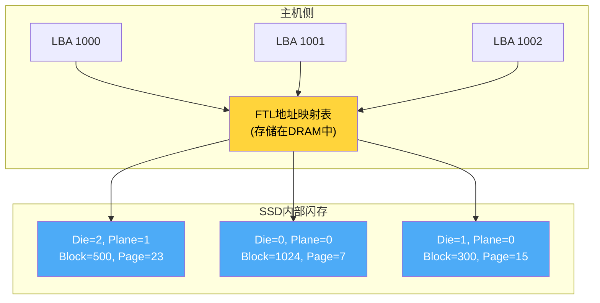

**垃圾回收（Garbage Collection）**：当空闲块不足时，FTL需要选择包含较多无效页的块，将有效页迁移到新块，然后擦除旧块。

```python
def garbage_collection():
    # 选择回收候选块：有效页最少的块
    victim_block = min(free_blocks, key=lambda b: b.valid_page_count)
    
    # 将有效页复制到新块
    new_block = allocate_free_block()
    for page in victim_block.pages:
        if page.is_valid:
            new_data = read_page(page)
            write_page(new_block.next_free_page(), new_data)
            update_mapping(page.lba, new_block.next_free_page())
    
    # 擦除旧块
    erase_block(victim_block)
    return_to_free_pool(victim_block)
```

**写放大（Write Amplification）**：垃圾回收导致的额外写入。写放大系数（WAF）定义为：

WAF = SSD实际写入量 / 主机请求写入量

理想情况下WAF=1（无额外写入），但实际上由于垃圾回收，WAF通常在2-10之间。影响WAF的因素包括：
- 空间利用率：磁盘越满，垃圾回收越频繁，WAF越大
- 写入模式：顺序写入的WAF远低于随机写入
- 预留空间（Over-Provisioning）：SSD通常预留7-28%的额外空间用于垃圾回收

**磨损均衡（Wear Leveling）**：确保所有擦除块的使用次数尽量均匀，防止部分块提前耗尽寿命。

### 9.3.3 SSD的I/O特性

**读取特性：**
- 随机读和顺序读的延迟差异很小（约2:1 vs HDD的400:1）
- 随机读IOPS可达数十万（企业级SSD可达百万级）
- 读取延迟稳定，典型值25-100μs

**写入特性：**
- 写入延迟通常高于读取（写入需要先编程闪存页）
- 写入存在"写悬崖"（Write Cliff）现象：当空闲块不足时，垃圾回收导致延迟剧增
- 写入带宽受闪存通道数限制

**并发特性：**
- SSD内部有多个Die/Plane，支持并行I/O
- 充分的I/O并发才能发挥SSD的全部性能
- 队列深度（Queue Depth）对SSD性能影响巨大

队列深度 vs IOPS（典型企业级SSD）：
QD=1:    ~20,000 IOPS
QD=4:    ~80,000 IOPS
QD=16:   ~200,000 IOPS
QD=32:   ~350,000 IOPS
QD=64:   ~500,000 IOPS
QD=128:  ~500,000 IOPS  （达到硬件瓶颈）

### 9.3.4 SSD内部并行架构

现代SSD的内部架构高度并行化：

SSD控制器
  ├── 通道0 ──── Die0 ──── Plane0 ── Block/Page
  │              └── Plane1 ── Block/Page
  ├── 通道1 ──── Die1 ──── Plane0
  │              └── Plane1
  ├── ...
  └── 通道N ──── DieN ──── Plane0
                 └── Plane1

- **Die级并行**：不同Die可以独立执行读/写/擦除操作
- **Plane级并行**：同一Die中的多个Plane可以同步操作（需要特殊命令支持）
- **通道级并行**：不同通道的数据传输互不干扰

总并行度 = 通道数 × 每通道Die数 × Plane数。典型的消费级SSD可能有4通道×4Die=16路并行，企业级可达64路以上。

## 9.4 NVMe协议

### 9.4.1 从SATA到NVMe

SATA（Serial ATA）协议最初为HDD设计，采用AHCI（Advanced Host Controller Interface）命令集。AHCI的设计基于以下假设：

1. 设备延迟高（HDD是毫秒级），CPU等待时间长不是问题
2. 只需要一个命令队列，深度为32
3. 命令处理需要多次CPU中断

这些假设在SSD时代成为严重的性能瓶颈：

| 特性 | AHCI/SATA | NVMe |
|------|-----------|------|
| 最大队列数 | 1 | 65,535 |
| 每队列深度 | 32 | 65,536 |
| 命令大小 | 32字节 | 64字节 |
| 最大带宽 | ~600 MB/s | ~7 GB/s (PCIe 4.0 x4) |
| 典型延迟 | ~6μs（软件栈） | ~2.8μs |
| CPU中断 | 每命令中断 | 批量中断/轮询 |

### 9.4.2 NVMe架构

NVMe（Non-Volatile Memory Express）通过PCIe总线直接连接CPU，绕过了传统的SATA/AHCI/SCSI软件栈：

传统路径：应用 → VFS → 块层 → SCSI层 → AHCI驱动 → SATA控制器 → SSD
NVMe路径：应用 → VFS → 块层 → NVMe驱动 → PCIe → SSD控制器

**提交队列与完成队列（SQ/CQ）：**

NVMe采用基于内存的环形队列机制：

主机内存                     设备内存
┌──────────┐              ┌──────────┐
│ Submit   │   doorbell   │          │
│ Queue    │────────────→ │ NVMe     │
│ (SQ)     │              │ 控制器   │
│          │ ←─────────── │          │
│ Complete │   interrupt   │          │
│ Queue    │              │          │
│ (CQ)     │              │          │
└──────────┘              └──────────┘

以下Mermaid图展示了NVMe SQ/CQ的完整交互流程：

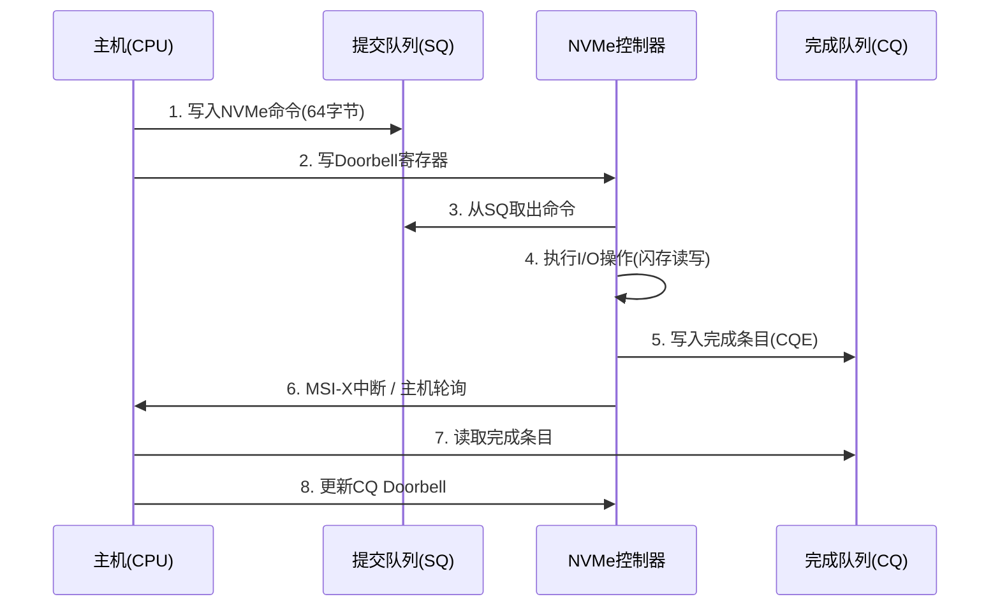

写入流程：
1. 主机在SQ中放入一个NVMe命令（64字节）
2. 写doorbell寄存器通知设备
3. 设备从SQ中取命令，执行I/O操作
4. 设备在CQ中放入完成条目
5. 通过中断或轮询通知主机
6. 主机处理完成条目

### 9.4.3 NVMe命令处理模型

NVMe支持两种I/O提交方式：

**基于中断的模式**：适合延迟敏感型工作负载，完成通知通过MSI-X中断触发。

**轮询模式（Polling Mode）**：适合超低延迟场景，主机主动轮询CQ的Phase位。消除了中断处理的开销，但会占用CPU。

```c
// NVMe轮询模式的伪代码
void nvme_poll(struct nvme_queue *q) {
    while (1) {
        struct nvme_completion *cqe = &amp;q->cqes[q->cq_head];
        
        // 检查Phase位，判断是否为新完成的命令
        if (cqe->status &amp; 0x1 == q->phase)
            break;
        
        // 处理完成的命令
        handle_completion(cqe);
        
        // 更新CQ头指针
        q->cq_head = (q->cq_head + 1) % q->queue_depth;
        if (q->cq_head == 0)
            q->phase ^= 1;
    }
    
    // 更新doorbell寄存器
    write_doorbell(q->cq_doorbell, q->cq_head);
}
```

Linux内核的io_uring（5.1+）提供了用户态的高效I/O接口，与NVMe的SQ/CQ模型天然契合：

```c
// 使用io_uring进行NVMe I/O
struct io_uring ring;
io_uring_queue_init(256, &amp;ring, 0);

// 提交读请求
struct io_uring_sqe *sqe = io_uring_get_sqe(&amp;ring);
io_uring_prep_read(sqe, fd, buf, 4096, offset);
io_uring_submit(&amp;ring);

// 等待完成
struct io_uring_cqe *cqe;
io_uring_wait_cqe(&amp;ring, &amp;cqe);
int result = cqe->res;
io_uring_cqe_seen(&amp;ring, cqe);
```

### 9.4.4 NVMe over Fabrics（NVMe-oF）
### 9.4.4 NVMe over Fabrics（NVMe-oF）

NVMe-oF将NVMe命令集扩展到网络传输，允许远程访问NVMe设备，同时保持接近本地NVMe的性能。它是构建高速共享存储网络的关键技术。

**NVMe-oF架构：**

传统网络存储路径:
应用 → VFS → 文件系统 → 块层 → iSCSI/FC驱动 → TCP/FC网络 → 存储控制器 → 闪存
延迟: ~200-500μs, 4-6层软件栈

NVMe-oF路径:
应用 → VFS → 块层 → NVMe-oF驱动 → RDMA/TCP网络 → NVMe控制器 → 闪存
延迟: ~10-50μs, 2-3层软件栈

**三种传输协议对比：**

| 传输协议 | 延迟 | 带宽 | 网络要求 | 典型场景 |
|---------|------|------|---------|---------|
| RDMA (InfiniBand) | ~10-15μs | 200-400 Gbps | InfiniBand交换机 | HPC、金融交易 |
| RDMA (RoCE v2) | ~15-25μs | 100-400 Gbps | 支持PFC的以太网 | 数据中心NVMe共享 |
| TCP | ~50-100μs | 25-100 Gbps | 标准以太网 | 跨机房存储、云存储 |
| FC (光纤通道) | ~30-60μs | 32-128 Gbps | FC交换机 | 传统SAN环境 |

**NVMe-oF的核心机制：**

NVMe-oF复用了NVMe的SQ/CQ（提交队列/完成队列）模型，将队列从本地PCIe扩展到网络远端：

本地NVMe:
  主机CPU → PCIe总线 → NVMe SSD控制器 → NAND闪存

NVMe-oF (RDMA):
  主机CPU → RDMA网卡 → InfiniBand/RoCE网络 → 远端RDMA网卡 → NVMe控制器 → NAND闪存
       ↑ 内存到内存传输，CPU几乎零开销

**RDMA传输的关键特性：**
- **零拷贝（Zero-Copy）**：数据直接在两台机器的内存之间传输，无需CPU参与数据拷贝
- **内核旁路（Kernel Bypass）**：RDMA操作在用户态完成，无需系统调用和上下文切换
- **远程直接内存访问**：发送方直接写入接收方的内存，接收方无需参与数据接收

```c
// NVMe-oF RDMA提交I/O的伪代码（简化）
struct nvme_of_request {
    struct ibv_send_wr wr;      // RDMA工作请求
    struct ibv_sge sge;         // 散列表项
    void *local_buf;            // 本地缓冲区
    uint64_t remote_offset;     // 远端NVMe设备上的LBA偏移
};

void nvme_of_read(struct nvme_of_queue *q, void *buf, 
                   uint64_t lba, uint32_t blocks) {
    // 1. 构造NVMe命令
    struct nvme_command cmd = {
        .opcode = NVME_CMD_READ,
        .nsid = q->ns_id,
        .slba = lba,
        .nlb = blocks - 1,
    };
    
    // 2. 通过RDMA Send发送命令到目标
    rdma_send(q->conn, &amp;cmd, sizeof(cmd));
    
    // 3. 目标通过RDMA Write将数据直接写入本地缓冲区
    //    （目标端发起，主机无需等待数据到达）
    
    // 4. 目标通过RDMA Send返回完成通知
}
```

**NVMe-oF连接管理：**

NVMe-oF发现与连接流程:
1. 主机通过NVMe-oF Discovery Service获取目标列表
2. 主机建立到目标的RDMA/TCP连接（Queue Pair）
3. 主机发送Connect命令创建I/O队列对
4. 双方交换队列属性（队列深度、命令大小等）
5. I/O命令通过SQ/CQ提交和完成

**NVMe-oF在数据库中的应用场景：**

- **存储池化**：多台数据库服务器共享NVMe存储池，按需分配容量和IOPS
- **存储解耦**：计算和存储分离，数据库实例可以独立扩缩容
- **快速备份恢复**：通过NVMe-oF直接访问远端快照，实现秒级恢复
- **多租户存储QoS**：通过NVMe-oF的带宽/延迟控制，为不同租户提供隔离的存储性能

```bash
# NVMe-oF RDMA目标配置示例（Linux kernel nvmet）
# 目标端
modprobe nvmet
modprobe nvmet-rdma

# 创建NVMe-oF子系统
echo -n "nqn.2023-01.io.example:db-storage" > /sys/kernel/config/nvmet/subsystems/subsys1/nqn

# 添加命名空间
echo 1 > /sys/kernel/config/nvmet/subsystems/subsys1/namespaces/1/enable
echo 512 > /sys/kernel/config/nvmet/subsystems/subsys1/namespaces/1/block_size
echo /dev/nvme0n1 > /sys/kernel/config/nvmet/subsystems/subsys1/namespaces/1/device_path

# 配置RDMA端口
mkdir -p /sys/kernel/config/nvmet/ports/1
echo rdma > /sys/kernel/config/nvmet/ports/1/addr_adrfam
echo 1 > /sys/kernel/config/nvmet/ports/1/enable

# 主机端连接
nvme connect -t rdma -n "nqn.2023-01.io.example:db-storage" \
    -a 192.168.1.100 -s 1
```

**NVMe-oF性能基准：**

| 场景 | 本地NVMe | NVMe-oF/RDMA | NVMe-oF/TCP |
|------|---------|-------------|-------------|
| 4KB随机读延迟 | ~15μs | ~25μs | ~80μs |
| 顺序读带宽 | ~7 GB/s | ~6.5 GB/s | ~3 GB/s |
| 4KB随机读IOPS | ~500K | ~450K | ~200K |

NVMe-oF使得存储可以被池化和共享，是软件定义存储（SDS）的重要技术基础。随着RDMA网络成本的持续降低和TCP性能的不断优化，NVMe-oF正在从高端HPC场景向通用数据中心普及。

## 9.5 性能对比与选型指南

### 9.5.1 综合性能对比

| 指标 | HDD (7200RPM) | SATA SSD | NVMe SSD | NVMe Optane |
|------|---------------|----------|----------|-------------|
| 随机读IOPS | ~150 | ~90,000 | ~500,000 | ~550,000 |
| 随机写IOPS | ~150 | ~80,000 | ~400,000 | ~500,000 |
| 顺序读带宽 | ~200 MB/s | ~550 MB/s | ~7,000 MB/s | ~2,500 MB/s |
| 随机读延迟 | ~8ms | ~100μs | ~15μs | ~10μs |
| 随机写延迟 | ~8ms | ~20μs | ~15μs | ~10μs |
| 耐久性(TBW/TB) | N/A | 600 | 1,200 | 100+ DWPD |
| 价格/GB | ~$0.03 | ~$0.08 | ~$0.10 | ~$2.00 |

### 9.5.2 延迟分解

理解端到端延迟的组成对于优化至关重要：

应用发起I/O → 系统调用 → VFS → 文件系统 → 块层 → 驱动 → 硬件 → 返回

各层延迟近似值（NVMe SSD，4KB随机读）：
- 用户态到内核态：~0.5μs
- VFS + 文件系统：~1-2μs
- 块层（含调度）：~0.5-1μs
- NVMe驱动：~0.5-1μs
- 硬件（SSD）：~10-80μs
- 中断/完成处理：~1-2μs

总计：~15-90μs

对于极致低延迟场景，可以使用SPDK（Storage Performance Development Kit）绕过内核：

用户态SPDK → NVMe驱动 → PCIe → 硬件

延迟：~10-15μs（消除内核开销）

### 9.5.3 存储引擎设计启示

不同存储介质的特性深刻影响存储引擎的设计选择：

**面向HDD的设计原则：**
- 最小化随机I/O，将随机写转化为顺序写（如WAL）
- 使用大块顺序读写（利用高带宽）
- 合并小I/O为大I/O（减少寻道次数）
- 预读（prefetch）和延迟写（buffer write）

**面向SSD的设计原则：**
- 利用高随机读IOPS，B+树等随机访问结构变得更可行
- 减少写放大，避免不必要的覆盖写
- 使用Direct I/O避免内核页缓存的双缓冲
- 关注SSD内部的GC行为，避免写入风暴

**面向NVMe的设计原则：**
- 充分利用多队列并行
- 考虑用户态I/O（SPDK/io_uring）
- 减小I/O粒度（4KB足够，无需大块优化）
- 关注CPU效率，避免I/O路径上的锁竞争

#### 存储引擎架构对比

以下表格对比了不同存储引擎针对目标存储介质的设计决策：

| 设计维度 | LSM-tree（HDD优化） | B+tree（SSD优化） | LSM-tree-on-SSD（混合优化） |
|----------|---------------------|-------------------|---------------------------|
| 数据结构 | 多层SSTable + MemTable | 平衡B+树 | 分层SSTable + 跳表索引 |
| 写入模式 | 顺序追加写 | 原地更新（页分裂） | 顺序追加 + 后台压缩 |
| 读取模式 | 多层查找 + 布隆过滤器 | 树遍历（通常3-4层） | 布隆过滤器 + 分层索引 |
| 空间放大 | 中等（compaction时临时放大） | 低（页填充约50-70%） | 中等（压缩后降低） |
| 写放大 | 高（compaction多层复制） | 低（原地更新） | 中等（Leveled compaction） |
| 读放大 | 高（可能查多层） | 低（O(log n)） | 中等（布隆过滤器优化） |
| 典型引擎 | LevelDB, Cassandra | InnoDB, LMDB | RocksDB, BadgerDB |

**具体引擎设计分析：**

- **RocksDB**：针对SSD/ NVMe优化的LSM-tree引擎。利用SSD的高随机读IOPS，通过布隆过滤器将读放大多层查找的概率降至极低。使用Direct I/O避免页缓存双缓冲，后台多线程compaction充分利用SSD并行能力。

- **InnoDB（MySQL）**：面向SSD优化的B+tree引擎。采用16KB页大小（对应SSD物理页的整数倍），使用Change Buffer延迟非唯一二级索引的更新，Buffer Pool直接管理数据页，O_DIRECT绕过OS页缓存。

- **LMDB**：内存映射B+tree引擎，针对NVMe优化。使用mmap将整个B+tree映射到虚拟地址空间，利用操作系统页缓存自动管理数据。写入时采用copy-on-write（CoW）策略，天然支持MVCC。适合读多写少的场景。

- **BoltDB**（Go语言）：灵感来自LMDB的内存映射B+tree。使用mmap进行读取，写入时采用CoW实现事务语义。优势是API简单、事务保证强，但不支持并发写入。

以下Mermaid图展示了存储引擎设计的决策流程：

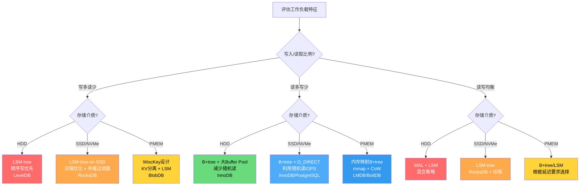

### 9.5.4 存储即服务的兴起

云计算时代，存储的部署模式发生了根本变化：

- **本地NVMe**：最低延迟，但不支持在线迁移和持久化保障
- **EBS/云盘**：通过网络连接的块存储，延迟增加但提供持久性和灵活性
- **对象存储**：S3等，高延迟但无限容量和极高耐久性

数据库设计需要根据部署环境选择不同的存储策略。例如，AWS Aurora使用日志即数据库（Log is Database）的设计，通过网络传输WAL日志来实现持久性，而非传统的写数据页。

## 9.6 前沿存储技术

### 9.6.1 计算型存储（Computational Storage）

计算型存储（Computational Storage, CS）将计算能力嵌入存储设备，实现"将计算移到数据旁"（Bring Compute to Data），从而大幅减少主机与存储设备之间的数据移动。

**传统模式的瓶颈：**

传统模式：存储 → PCIe/网络 → 主机CPU → 处理结果 → PCIe/网络 → 存储
数据移动量: O(全量数据)
CPU占用: 大量时间花在数据搬运而非计算

**计算型存储架构：**

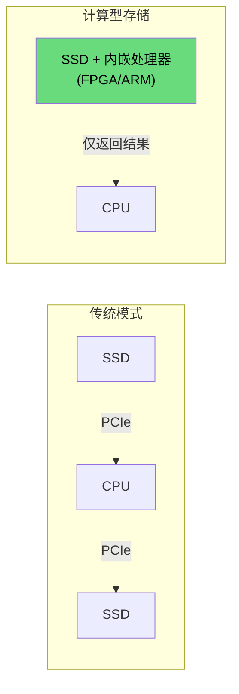

**计算型存储设备标准（CSD-N）：**

NVMe标准组织定义了CSD（Computational Storage Device）标准，包括：

- **CS（Computing Sleeve）**：可编程计算单元，支持在存储设备上执行自定义计算
- **NVM Command Set Extension**：扩展NVMe命令集，支持计算任务的提交和结果回收
- **资源管理**：支持多租户共享计算资源

**代表产品与应用：**

| 产品 | 计算单元 | 主要功能 | 应用场景 |
|------|---------|---------|---------|
| Samsung SmartSSD | Xilinx FPGA | 可编程数据过滤 | 数据库扫描下推 |
| ScaleFlux CSD 2000 | 内置压缩引擎 | 透明压缩/解压 | 压缩存储加速 |
| NGD Systems Catalina | ARM处理器 | 内嵌Linux计算 | 视频分析、AI推理 |
| Intel OPAE | FPGA框架 | 可编程加速 | 加密/解密卸载 |

**数据库场景的应用：**

- **扫描下推（Scan Offload）**：将`SELECT * FROM t WHERE col > 100`的过滤逻辑下推到SSD，仅返回匹配行，减少PCIe带宽消耗
- **加密卸载**：透明加解密在SSD内完成，不影响主机CPU性能
- **数据压缩**：写入时压缩、读取时解压，在SSD内部完成

### 9.6.2 分区命名空间（ZNS）

ZNS（Zoned Namespaces）是NVMe标准的新特性，将SSD内部的闪存区域直接暴露给主机，消除传统FTL中的地址映射和垃圾回收开销。

**传统SSD vs ZNS SSD架构对比：**

传统SSD：主机看到一个平坦的LBA空间，FTL处理所有复杂性
ZNS SSD：主机看到一系列区域，需要按区域的约束来写入

**Zone类型：**

- **顺序写区域（Sequential Write Required Zone）**：必须按顺序写入，不可覆写。写满后必须重置（擦除）才能再次使用
- **传统区域（Conventional Zone）**：可以随机读写，类似于传统块设备。用于存储元数据等需要随机访问的数据

**Zone状态机：**

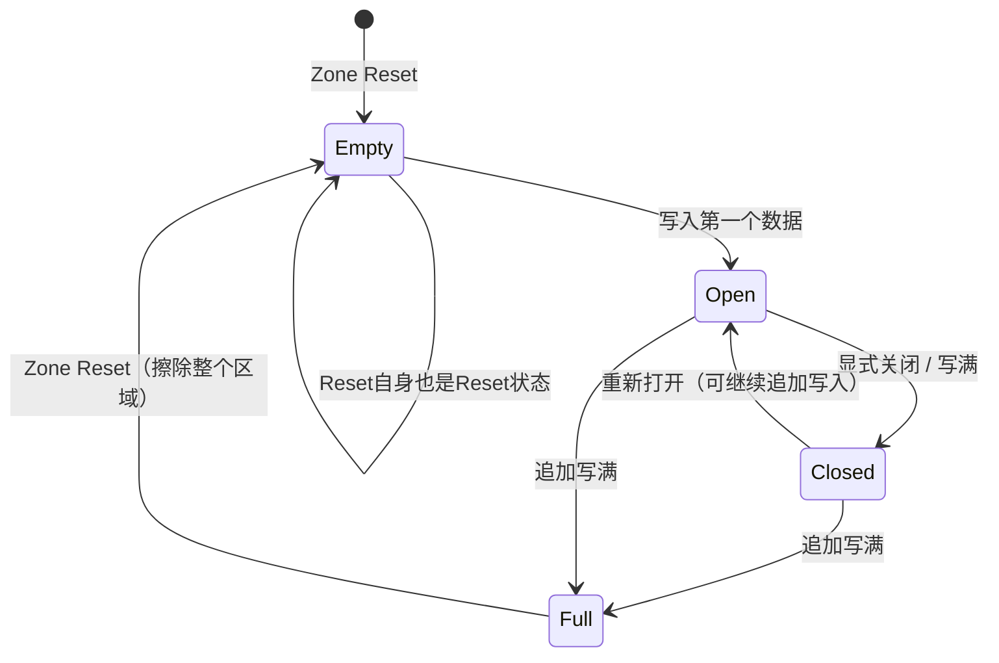

**ZNS vs 传统FTL权衡对比：**

| 维度 | 传统FTL（Block Device） | ZNS | 分析 |
|------|------------------------|-----|------|
| 写放大 | 2-10x（GC导致） | 1x（顺序写入，无GC） | ZNS显著降低写放大 |
| 空间利用率 | 需预留7-28% OP空间 | 接近100% | ZNS无需预留空间 |
| SSD DRAM | 需要大容量映射表缓存 | 仅需Zone状态表 | ZNS降低SSD硬件成本 |
| 延迟一致性 | GC期间延迟毛刺 | 无GC，延迟可预测 | ZNS提供更好的QoS |
| 主机端复杂度 | 低（FTL全部处理） | 高（主机需管理Zone） | ZNS增加了软件复杂度 |
| 兼容性 | 所有应用直接使用 | 需要文件系统/应用适配 | ZNS需要软件栈支持 |

**RocksDB ZNS集成：**

RocksDB从6.18版本开始支持ZNS SSD，通过Universal Compaction策略天然适配顺序写入约束：

```cpp
// RocksDB ZNS配置示例
Options options;
options.env = ZnsEnv::NewDefaultEnv();

// 启用ZNS感知的Compaction
options.compaction_style = kCompactionStyleUniversal;
options.compression = kNoCompression;  // 减少读放大
options.bottommost_compression = kZSTD;

// Zone大小通常为256MB或更大
options.write_buffer_size = 256 * 1024 * 1024;
options.max_write_buffer_number = 4;
```

### 9.6.3 CXL（Compute Express Link）与存储

CXL（Compute Express Link）是基于PCIe物理层的新一代高速互连标准，其内存池化能力正在深刻改变存储架构。

**CXL协议族：**

| 协议 | 名称 | 功能 | 类比 |
|------|------|------|------|
| CXL.io | I/O协议 | 传统PCIe设备交互（NVMe等） | PCIe |
| CXL.cache | 缓存协议 | 设备缓存主机内存 | CPU L3 Cache |
| CXL.mem | 内存协议 | 主机直接访问设备内存 | DIMM读写 |

**CXL版本演进：**

- **CXL 1.1/2.0**：支持CXL.cache和CXL.mem，允许CPU缓存远端设备内存，实现内存扩展
- **CXL 2.0新增**：CXL交换机（Switch）支持内存池化，多个主机可共享设备内存
- **CXL 3.0/3.1**：增强的多级交换、硬件分区、更细粒度的内存共享，支持异构内存拓扑

**CXL内存池化架构：**

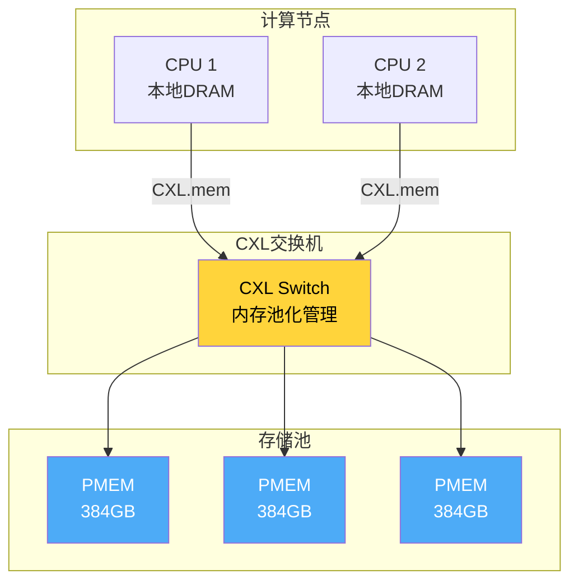

**CXL对数据库设计的影响：**

- **内存容量扩展**：CXL.mem允许数据库使用远超本地DRAM容量的持久化内存，无需修改应用代码即可获得TB级内存空间
- **数据放置优化**：热数据放本地DRAM，温数据放CXL-attached PMEM，冷数据放NVMe SSD，形成三级存储层次
- **内存池化**：多台数据库服务器共享CXL内存池，根据负载动态分配，提高资源利用率

### 9.6.4 存储级内存替代技术

除Intel 3D XPoint外，多种新型非易失性存储技术正在研发和商业化：

| 技术 | 原理 | 读延迟 | 写延迟 | 耐久性 | 状态 |
|------|------|--------|--------|--------|------|
| ReRAM（阻变存储器） | 金属氧化物电阻切换 | ~10ns | ~10-50ns | 10⁶-10¹² 次 | 小批量量产 |
| MRAM（磁阻存储器） | 磁隧道结极化翻转 | ~10ns | ~10ns | 10¹⁵ 次 | 量产（嵌入式） |
| FeFET（铁电场效应管） | 铁电极化翻转 | ~10ns | ~10ns | 10¹² 次 | 研发阶段 |
| STT-MRAM | 自旋转移矩磁阻 | ~5ns | ~10ns | 10¹⁵ 次 | 嵌入式量产 |
| FRAM（铁电RAM） | 铁电晶体极化 | ~50ns | ~50ns | 10¹⁴ 次 | 特定场景量产 |

这些技术的共同特点是：接近DRAM的读取延迟、远超NAND闪存的耐久性、非易失性。但目前在容量密度和成本上仍无法与NAND竞争，主要定位于嵌入式缓存、MRAM（如Everspin产品）和特殊工业场景。未来随着CXL生态成熟，这些技术可能通过CXL接口进入服务器存储层次。

***


**参考文献：**

1. Agrawal, N. et al. "Design Tradeoffs for SSD Performance." USENIX ATC, 2008.
2. Bjorling, M. et al. "LightNVM: The Linux Open-Channel SSD Subsystem." FAST, 2017.
3. Lee, S. et al. "A Case for Flash Translation Layer in Solid State Drives." IEEE Micro, 2009.
4. Axboe, J. "Efficient IO with io_uring." kernel.dk, 2019.
5. NVMe Base Specification 2.0. NVM Express, Inc., 2021.
6. 吕广强等.《深入理解Linux内核》. 机械工业出版社.
7. Ousterhout, J. et al. "The Case for Simple, Shared RAMCloud." SOSP, 2011.
8. Shinde, A. et al. "ZNS: Avoiding the Block Interface Tax for Flash-based SSDs." USENIX ATC, 2021.
9. CXL Consortium. "Compute Express Link Specification 3.0." 2023.
10. Samsung. "SmartSSD: Computational Storage Device." Samsung Technical Brief, 2021.
11. Han, S. et al. "Application-Named I/O: ZNS SSDs for Storage Disaggregation." ASPLOS, 2022.


***


## 9.7 持久化内存（PMEM）与存储级内存

持久化内存（Persistent Memory, PMEM）是近年来存储技术最具颠覆性的创新之一，它模糊了传统内存和存储之间的界限，为数据库系统设计带来了全新的可能性。

### 9.7.1 Intel Optane 3D XPoint技术原理

Intel Optane技术基于3D XPoint（三维交叉点）存储介质，其物理原理与NAND闪存截然不同：

**NAND闪存 vs 3D XPoint对比：**

| 维度 | NAND Flash | 3D XPoint |
|------|-----------|-----------|
| 存储原理 | 浮栅晶体管电荷存储 | 电阻状态切换（硫族化合物） |
| 最小寻址单元 | 页（4KB-16KB） | 字节级可寻址 |
| 读延迟 | ~25-100μs | ~100-300ns |
| 写延迟 | ~200-2000μs | ~150-500ns |
| 耐久性 | 1K-100K P/E循环 | ~10⁸ 写入次数 |
| 需要擦除 | 是（块级擦除） | 否（直接覆写） |
| 读写对称性 | 不对称 | 接近对称 |
| 功耗 | 中等 | 低 |

3D XPoint的核心优势在于：字节级可寻址、无需擦除即可直接覆写、极低延迟（比NAND快1000倍）。这使得它既可以作为存储使用，也可以作为持久化内存使用。

### 9.7.2 PMEM工作模式

Intel Optane DC Persistent Memory支持三种工作模式：

**Memory Mode（内存模式）**：
- PMEM作为系统DRAM的扩展，操作系统将其视为普通内存
- 数据在断电后丢失（DRAM充当缓存）
- 容量大（128GB-512GB/条）、成本低于DRAM
- 适合大内存数据库（如SAP HANA）

**App Direct Mode（应用直接模式）**：
- 应用通过内存映射（mmap）直接访问PMEM
- 数据在断电后持久保存
- 绕过页缓存，直接操作字节级持久化内存
- 需要应用感知PMEM（使用PMDK等库）
- 适合持久化内存数据库、键值存储

**AD Interleaved模式**：
- 多条PMEM条在CPU通道间交织，形成统一的持久化地址空间
- 提高带宽（接近所有通道带宽之和）
- 适合需要高带宽持久化存储的场景

### 9.7.3 DAX（Direct Access）——绕过页缓存

DAX（Direct Access）是Linux内核对PMEM的核心支持机制，允许应用直接访问持久化内存，完全绕过页缓存（Page Cache）：

**传统I/O路径 vs DAX路径：**

传统路径：应用 → read()/write() → 页缓存 → 块层 → 驱动 → 存储设备
DAX路径：应用 → mmap() → 直接访问PMEM（CPU load/store指令）

DAX的优势：
- **零拷贝**：数据直接从PMEM到应用地址空间，无需内核页缓存中转
- **无上下文切换**：read/write系统调用开销被消除
- **字节级寻址**：使用CPU的load/store指令而非I/O操作
- **缓存行友好**：CPU L1/L2/L3 Cache自动缓存PMEM数据

```bash
# 挂载DAX文件系统
mount -o dax /dev/pmem0 /mnt/pmem

# 或在/etc/fstab中配置
# /dev/pmem0  /mnt/pmem  ext4  defaults,dax  0 0
```

### 9.7.4 PMEM感知文件系统

| 文件系统 | DAX支持 | 特点 |
|---------|---------|------|
| ext4 DAX | 是（Linux 4.15+） | 成熟稳定，需`dax`挂载选项 |
| XFS DAX | 是（Linux 4.12+） | 更好的大文件性能 |
| NOVA | 原生设计 | 专为PMEM设计的文件系统，无日志开销 |
| F2FS DAX | 实验性 | 闪存友好文件系统扩展 |
| tmpfs DAX | 是 | 临时文件系统，适用于易失性PMEM使用 |

NOVA文件系统专为持久化内存优化：
- 使用细粒度锁（per-inode锁），充分利用PMEM低延迟特性
- 避免日志（journal），使用undo log或redo log保证一致性
- 延迟比ext4 DAX低20-50%

### 9.7.5 PMEM在数据库中的应用

#### PMDK（Persistent Memory Development Kit）

PMDK是Intel提供的持久化内存开发框架，核心库包括：

- **libpmem**：底层PMEM操作（memcpy的持久化版本）
- **libpmemobj**：对象级别持久化内存管理（事务、类型化对象）
- **libpmemblk**：块设备级别操作
- **libpmemlog**：日志结构操作

#### libpmemobj代码示例

以下示例展示如何使用PMDK实现一个持久化键值存储：

```c
#include <libpmemobj.h>
#include <stdio.h>
#include <string.h>

/* 定义持久化对象类型 */
struct kv_entry {
    uint64_t key;
    PMEMoid value_oid;
};

struct kv_root {
    PMEMoid root_oid;
    uint64_t count;
};

/* 事务性键值写入 */
int kv_put(PMEMobjpool *pop, uint64_t key, const char *value) {
    TOID(struct kv_root) root = POBJ_ROOT(pop, struct kv_root);

    TX_BEGIN(pop) {
        /* 分配新条目 */
        TOID(struct kv_entry) entry = TX_NEW(struct kv_entry);
        D_RW(entry)->key = key;

        /* 分配并复制值 */
        size_t len = strlen(value) + 1;
        D_RW(entry)->value_oid = tx_zalloc(len, sizeof(char));
        char *val_ptr = pmemobj_direct(D_RO(entry)->value_oid);
        memcpy(val_ptr, value, len);

        D_RW(root)->count++;
        printf("Inserted key=%lu, value=%s\n", key, value);
    } TX_END

    return 0;
}

/* 事务性键值读取 */
const char *kv_get(PMEMobjpool *pop, uint64_t key) {
    TOID(struct kv_root) root = POBJ_ROOT(pop, struct kv_root);
    printf("Database has %lu entries\n", D_RO(root)->count);
    /* 实际应用中需遍历链表/数组查找key */
    return NULL;
}

int main(int argc, char *argv[]) {
    const char *path = "/mnt/pmem/my_kv_store";

    /* 打开或创建持久化内存池 */
    PMEMobjpool *pop = pmemobj_create(
        path, "kv_store",
        PMEMOBJ_MIN_POOL, 0666);

    if (pop == NULL) {
        /* 如果已存在，打开现有池 */
        pop = pmemobj_open(path, "kv_store");
    }

    if (pop == NULL) {
        perror("pmemobj_create/open");
        return 1;
    }

    /* 插入数据 - 断电后数据仍然存在 */
    kv_put(pop, 1, "hello");
    kv_put(pop, 2, "world");

    pmemobj_close(&amp;pop);
    return 0;
}
```

编译和运行：

```bash
# 安装PMDK
git clone https://github.com/pmem/pmdk.git
cd pmdk &amp;&amp; make &amp;&amp; sudo make install

# 编译示例程序
gcc -o kv_store kv_store.c -lpmemobj -lpthread

# 挂载PMEM并运行
mount -o dax /dev/pmem0 /mnt/pmem
./kv_store

# 重启后再次运行，数据仍然存在
./kv_store
# Output: Database has 2 entries
```

#### Redis on PMEM

Redis社区已开始支持将数据持久化到PMEM：

```bash
# Redis持久化到PMEM配置
redis-server --appendonly yes \
             --appendfilename appendonly.aof \
             --aof-use-pmem-enabled yes \
             --pmem-directory /mnt/pmem/redis
```

优势：
- AOF日志写入PMEM，延迟从磁盘的~100μs降至~300ns
- RDB快照可以通过DAX直接映射到内存，恢复时间接近零
- Redis数据集可超过DRAM容量，利用PMEM扩展

### 9.7.6 Intel Optane停产与CXL-attached内存

2022年7月，Intel宣布停产Optane产品线，这对持久化内存生态产生了重大影响：

**停产影响：**
- Optane PMem 200系列为最后一代产品
- 现有部署仍可使用，但无后续产品规划
- PMDK开源社区继续维护，但Intel不再投入

**替代方案——CXL-attached内存：**

CXL（Compute Express Link）正在成为PMEM的继任者：

- CXL 2.0+支持通过CXL.mem协议连接持久化内存
- 多家厂商（Samsung、SK Hynix、Micron）正在开发CXL-attached PMEM
- 优势：标准化接口、内存池化、多主机共享
- 软件兼容性：操作系统通过CXL驱动透明管理，应用无需修改

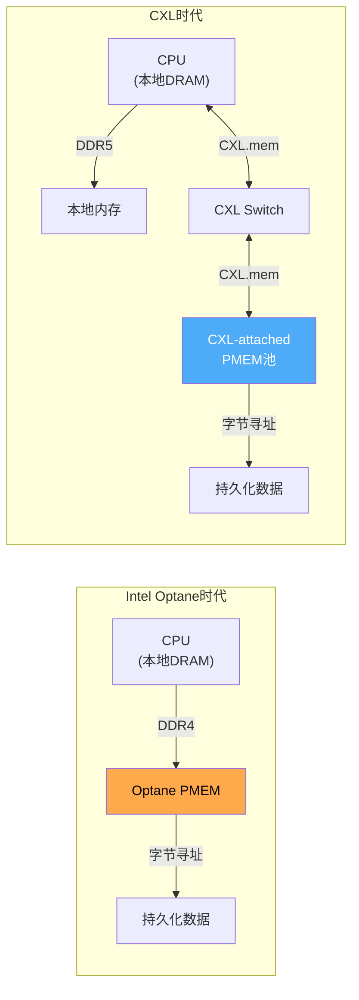


***


**参考文献：**

1. Intel. "Intel Optane Persistent Memory Technical Brief." 2020.
2. Intel. "Persistent Memory Programming with PMDK." 2021.
3. Condit, J. et al. "Better I/O through Byte-addressable, Persistent Memory." SOSP, 2009.
4. Coburn, J. et al. "NV-Heaps: Making Persistent Objects Fast and Safe with New Hardware." ASPLOS, 2011.
5. Volos, H. et al. "Aerie: A Flexible Environment for Programming Persistent Memory." ASPLOS, 2018.


***


## 9.8 存储可靠性与RAID

数据是现代信息系统的核心资产，存储可靠性直接决定了系统的可用性和数据安全性。本节将从硬件故障模型出发，系统介绍RAID技术、SSD可靠性管理以及端到端数据完整性保障。

### 9.8.1 存储可靠性基础

**可靠性度量指标：**

- **MTBF（Mean Time Between Failures）**：平均故障间隔时间，典型HDD为100万-200万小时
- **AFR（Annualized Failure Rate）**：年化故障率，AFR = 8760 / MTBF
- **MTTR（Mean Time To Repair）**：平均修复时间
- **可用性（Availability）**：A = MTBF / (MTBF + MTTR)

| 硬件类型 | 典型MTBF | AFR | 单盘年故障概率 |
|---------|---------|-----|--------------|
| 企业级HDD | 2,000,000小时 | 0.44% | ~0.44% |
| 消费级HDD | 1,000,000小时 | 0.88% | ~0.88% |
| 企业级SSD | 2,500,000小时 | 0.35% | ~0.35% |
| 消费级SSD | 1,500,000小时 | 0.58% | ~0.58% |

**关键认知：** 一个拥有1000块HDD的数据中心，每年预计有约4-9块硬盘故障。RAID是应对这种确定性故障的核心技术。

### 9.8.2 RAID级别详解

RAID（Redundant Array of Independent Disks）通过在多个物理磁盘上分布数据和校验信息，提供性能提升、数据冗余或两者兼得。

#### RAID 0：条带化（Striping）

文件数据:  [A][B][C][D][E][F][G][H]
                    ↓ 条带化
Disk 0:   [A] [C] [E] [G]
Disk 1:   [B] [D] [F] [H]

- **优点**：读写带宽翻倍（N块磁盘 = N倍带宽）
- **缺点**：无冗余，任何一块磁盘故障即丢失全部数据
- **可用容量**：N × 单盘容量
- **可靠性**：N块磁盘的故障概率是单盘的N倍（更差！）
- **适用场景**：临时数据、可再生数据的高性能计算

#### RAID 1：镜像（Mirroring）

写入数据:  [A][B][C][D]
                ↓ 镜像
Disk 0:   [A] [B] [C] [D]   ← 主副本
Disk 1:   [A] [B] [C] [D]   ← 镜像副本

- **优点**：极高的读性能（可从任一磁盘读取）、故障恢复简单
- **缺点**：50%容量浪费、写性能略降（需写两份）
- **可用容量**：N/2 × 单盘容量
- **可靠性**：单盘故障不影响数据
- **适用场景**：系统盘、关键数据库日志、配置文件

#### RAID 5：分布式奇偶校验

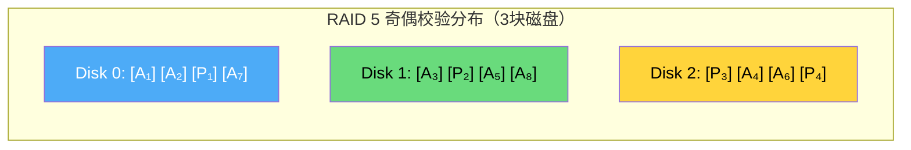

**奇偶校验计算（异或运算）：**

P = A₁ ⊕ A₂ ⊕ A₃

例：A₁ = 0x1A, A₂ = 0x2B, A₃ = 0x3C
P = 0x1A ⊕ 0x2B ⊕ 0x3C = 0x11

恢复示例（A₂丢失）：
A₂ = A₁ ⊕ A₃ ⊕ P = 0x1A ⊕ 0x3C ⊕ 0x11 = 0x2B ✓

- **优点**：容量利用率 = (N-1)/N、允许单盘故障、读性能好
- **缺点**：写入需读-修改-写（4次I/O）、重建期间性能严重下降
- **可用容量**：(N-1) × 单盘容量
- **适用场景**：文件服务器、通用存储、Web服务器

#### RAID 6：双重奇偶校验

Disk 0: [A₁] [A₂] [A₃] [A₄] [P₁] [P₂]  ...  [P₅]
Disk 1: [A₅] [A₆] [A₇] [P₁] [P₂] [A₁₄] ... [A₁₇]
Disk 2: [A₈] [A₉] [P₁] [P₂] [A₁₅] [A₁₆]... [A₁₈]
Disk 3: [A₁₀] [P₁] [P₂] [A₁₂] [A₁₃] [A₁₉]... [P₅]

P = 奇偶校验, Q = 里德-所罗门校验

- **优点**：允许同时两块磁盘故障、重建更安全
- **缺点**：容量利用率 = (N-2)/N、写入开销更大（6次I/O）
- **可用容量**：(N-2) × 单盘容量
- **适用场景**：大容量存储（RAID 5在大磁盘上重建时间过长的风险）

#### RAID 10：镜像+条带化

原始数据: [A][B][C][D][E][F][G][H]
                ↓
Mirror Group 1:          Mirror Group 2:
  Disk 0: [A][C][E][G]     Disk 2: [A][C][E][G]
  Disk 1: [A][C][E][G]     Disk 3: [A][C][E][G]

- **优点**：高性能（读写）、高可靠性（允许每组各一块磁盘故障）
- **缺点**：50%容量浪费
- **可用容量**：N/2 × 单盘容量
- **适用场景**：数据库数据文件、高IOPS应用

#### RAID级别综合对比

| RAID级别 | 最少磁盘数 | 容量利用率 | 写性能 | 读性能 | 容错 | 典型应用 |
|----------|-----------|-----------|--------|--------|------|---------|
| RAID 0 | 2 | 100% | N倍 | N倍 | 无 | 临时数据 |
| RAID 1 | 2 | 50% | 1× | 2× | 1盘 | 系统盘 |
| RAID 5 | 3 | (N-1)/N | 较低 | 高 | 1盘 | 文件服务器 |
| RAID 6 | 4 | (N-2)/N | 低 | 高 | 2盘 | 大容量存储 |
| RAID 10 | 4 | 50% | 2× | 2× | 每组1盘 | 数据库 |

### 9.8.3 RAID 5写入空洞（Write Hole）

RAID 5存在一个经典的一致性问题——**写入空洞**：

**问题描述：**
当RAID 5在写入数据块和更新校验块的过程中发生断电，可能导致数据块和校验块不一致。

正常状态：A₁ ⊕ A₂ ⊕ P = 0

写入A₁的新值时序：
1. 写入新A₁'  →  此时磁盘状态: A₁', A₂, P（不一致！）
2. 更新P为P'  →  此时磁盘状态: A₁', A₂, P'（一致）

如果在步骤1和步骤2之间断电：
磁盘状态: A₁', A₂, P → A₁' ⊕ A₂ ⊕ P ≠ 0（数据不一致！）
重建时使用错误的P恢复出错误的A₂！

**解决方案：**

- **校验日志（Journaling）**：在更新校验块之前，先将"待更新"信息写入日志。断电恢复时检查日志并完成或回滚
- **写前日志（Write-Ahead Log）**：类似WAL的方式，先记录意图，再执行实际操作
- **电池保护写缓存**：RAID控制器使用BBU（Battery Backup Unit）保护写缓存，断电时保持脏数据，恢复后重放
- **ZFS的RAID-Z**：采用动态条带宽度和完整性校验，从根本上避免写入空洞

### 9.8.4 软件RAID vs 硬件RAID

| 维度 | 软件RAID（mdadm） | 硬件RAID |
|------|-------------------|----------|
| 性能 | 占用CPU，现代CPU足够 | 专用ASIC/FPGA，性能更高 |
| 成本 | 免费（Linux内核自带） | 需要购买RAID卡（$200-$2000+） |
| 灵活性 | 配置灵活，可在线调整 | 受限于卡的固件功能 |
| 故障恢复 | 依赖主机CPU | 独立运行，主机CPU不受影响 |
| 缓存 | 无专用缓存 | 通常有DRAM缓存 + BBU |
| 恢容性 | 跨不同磁盘品牌/型号 | 通常需要相同型号磁盘 |
| 推荐场景 | 软件定义存储、开发测试 | 传统企业数据库、生产环境 |

### 9.8.5 实用mdadm命令

```bash
# 查看RAID状态
cat /proc/mdstat
mdadm --detail /dev/md0

# 创建RAID 5（3块磁盘 + 1块备用）
mdadm --create /dev/md0 \
    --level=5 \
    --raid-devices=3 \
    --spare-devices=1 \
    /dev/sdb /dev/sdc /dev/sdd /dev/sde

# 创建RAID 10（4块磁盘，2镜像组×2条带）
mdadm --create /dev/md0 \
    --level=10 \
    --raid-devices=4 \
    /dev/sdb /dev/sdc /dev/sdd /dev/sde

# 格式化并挂载
mkfs.ext4 /dev/md0
mount /dev/md0 /data

# 保存RAID配置
mdadm --detail --scan >> /etc/mdadm/mdadm.conf
update-initramfs -u

# 模拟磁盘故障
mdadm --fail /dev/md0 /dev/sdc

# 移除故障磁盘
mdadm --remove /dev/md0 /dev/sdc

# 添加新磁盘替换故障磁盘
mdadm --add /dev/md0 /dev/sdf

# 查看重建进度
watch cat /proc/mdstat
```

### 9.8.6 SSD特有的可靠性管理

**TRIM/Discard：**

TRIM命令通知SSD哪些数据块不再使用，帮助FTL提前回收空间：

```bash
# 查看文件系统是否启用discard
mount | grep discard

# 对现有分区启用discard
mount -o remount,discard /dev/nvme0n1p1

# 或通过fstrim定期执行（推荐）
fstrim -v /data
# Output: /data: 123456789120 bytes trimmed

# 设置cron定期执行fstrim
# 0 2 * * * /usr/sbin/fstrim -v /data
```

**写入耐久性监控：**

```bash
# 监控SSD寿命（NVMe）
nvme smart-log /dev/nvme0n1 | grep -E "percentage_used|data_units"

# 设置寿命告警脚本
#!/bin/bash
USED=$(nvme smart-log /dev/nvme0n1 | grep percentage_used | awk '{print $3}' | tr -d '%')
if [ "$USED" -gt 80 ]; then
    echo "WARNING: SSD寿命已使用${USED}%, 请考虑更换" | \
    mail -s "SSD寿命告警" admin@example.com
fi
```

### 9.8.7 数据完整性保障

**端到端数据保护（End-to-End Data Protection）：**

应用 → CRC校验写入 → 文件系统 → 块层CRC → 硬件CRC → 存储介质
应用 ← CRC校验读取 ← 文件系统 ← 块层CRC ← 硬件CRC ← 存储介质

每一层都可以独立验证数据完整性，防止静默数据损坏（Silent Data Corruption）：

- **应用层校验**：数据库页级别的校验和（如MySQL InnoDB的checksum）
- **文件系统校验**：ZFS的fletcher/checksum校验、Btrfs的校验和
- **块层校验**：Linux DM（Device Mapper）的integrity目标
- **硬件校验**：企业级SSD的LDPC ECC、NVMe的端到端数据保护

```bash
# Linux块层完整性配置
# 为NVMe设备启用数据完整性
dmsetup create integrity --table '0 $(blockdev --getsz /dev/nvme0n1n1) integrity /dev/nvme0n1n1 0'
```

### 9.8.8 纠删码（Erasure Coding）

纠删码（Erasure Coding, EC）是RAID的现代替代方案，在分布式存储系统中广泛使用。它通过数学编码将数据分片为m个数据块，并生成k个校验块，任意k个块丢失后仍可恢复原始数据。

**EC与传统RAID的对比：**

RAID 5 (4+1): 5块磁盘存储4块数据，空间利用率80%，容忍1块故障
RAID 6 (4+2): 6块磁盘存储4块数据，空间利用率67%，容忍2块故障
EC (4+2):     6个存储节点存储4块数据+2块校验，容忍2个节点故障
EC (10+4):    14个存储节点存储10块数据+4块校验，容忍4个节点故障

| 维度 | RAID 5/6 | 纠删码 |
|------|---------|--------|
| 最小单元 | 磁盘 | 存储节点/对象 |
| 编码方式 | XOR (RAID 5) / Reed-Solomon (RAID 6) | Reed-Solomon / LDPC / Cauchy |
| 容错能力 | 1-2块磁盘 | k个校验块（可配置） |
| 空间利用率 | 50-88% | 可配置（如4+2=67%） |
| 重建开销 | 需要读取所有磁盘 | 只需读取m个数据块 |
| 适用场景 | 本地RAID | 分布式存储（Ceph、HDFS、MinIO） |

**Reed-Solomon编码原理：**

原始数据: D₀, D₁, D₂, D₃  (4个数据块)

生成校验块:
P₀ = D₀ ⊕ D₁ ⊕ D₂ ⊕ D₃          (XOR校验)
P₁ = D₀ × G₁₁ ⊕ D₁ × G₁₂ ⊕ D₂ × G₁₃ ⊕ D₃ × G₁₄  (Reed-Solomon校验)

存储: [D₀] [D₁] [D₂] [D₃] [P₀] [P₁]  (分布在6个节点上)

丢失D₁和D₂后恢复:
通过D₀, D₃, P₀, P₁建立方程组，解出D₁和D₂

**EC的编码开销与延迟影响：**

编码延迟 ≈ m次读取 + 编码计算 + k次写入
解码延迟 ≈ m次读取 + 解码计算

实际开销:
- 编码: 额外5-15% CPU开销（取决于m+k的值）
- 写放大: (m+k)/m（如4+2配置，写放大1.5x）
- 重建: 只需读取m个块（vs RAID需要读取所有磁盘）

**EC在分布式存储中的实践：**

```bash
# Ceph配置纠删码池
# 创建纠删码Profile（4+2配置）
ceph osd erasure-code-profile create myprofile \
    k=4 m=2 \
    technique=reed_sol_van \
    crush-failure-domain=host

# 使用该Profile创建池
ceph osd pool create myecpool 128 128 erasure myprofile

# 验证EC池配置
ceph osd pool get myecpool erasure_code_profile
```

**EC vs 副本策略选择：**

| 策略 | 空间开销 | 写性能 | 读性能 | 容错 | 适用场景 |
|------|---------|--------|--------|------|---------|
| 3副本 | 3x | 高 | 高 | 2节点故障 | 热数据、小对象 |
| EC 4+2 | 1.5x | 中等 | 中等 | 2节点故障 | 温/冷数据 |
| EC 8+4 | 1.5x | 较低 | 较低 | 4节点故障 | 冷数据、归档 |

### 9.8.9 存储加密

数据在存储介质上的加密是保护敏感数据的核心手段。根据加密层次和实现方式的不同，可以分为以下几类：

**加密层次对比：**

| 加密层次 | 实现方式 | 透明性 | 性能影响 | 适用场景 |
|---------|---------|--------|---------|---------|
| 应用层加密 | 应用自行加密 | 需应用改造 | 无额外I/O | 最高安全要求 |
| 文件系统层加密 | fscrypt/eCryptfs | 按文件/目录透明 | 低 | 多用户文件系统 |
| 块层加密 | dm-crypt/LUKS | 整个块设备透明 | 低-中 | 磁盘全盘加密 |
| 硬件层加密 | SED (自加密驱动器) | 完全透明 | 极低 | 企业合规要求 |

**Linux dm-crypt/LUKS加密配置：**

```bash
# 创建加密分区（LUKS格式）
cryptsetup luksFormat /dev/nvme0n1p2

# 打开加密分区
cryptsetup luksOpen /dev/nvme0n1p2 encrypted_data

# 格式化并挂载
mkfs.ext4 /dev/mapper/encrypted_data
mount /dev/mapper/encrypted_data /mnt/secure_data

# 查看加密信息
cryptsetup luksDump /dev/nvme0n1p2

# 使用NVMe硬件加速加密（性能更好）
cryptsetup luksFormat --cipher aes-xts-plain64 --key-size 512 \
    --hash sha256 --use-random /dev/nvme0n1p2

# 自动挂载（/etc/crypttab）
# encrypted_data  UUID=<uuid>  none  luks,nofail
```

**NVMe SED（Self-Encrypting Drive）：**

NVMe SED工作原理:
1. 出厂时在硬件中生成唯一加密密钥（ATA Security/ NVMe Security）
2. 数据写入时硬件自动加密（AES-256-XTS）
3. 数据读取时硬件自动解密
4. 密钥销毁 = 整盘数据瞬间不可恢复（加密擦除）

优势: 零CPU开销，加密对软件完全透明
劣势: 密钥管理依赖硬件，无法跨设备迁移

```bash
# NVMe SED加密管理
# 查看安全功能
nvme id-ctrl /dev/nvme0n1 | grep -i sec

# 设置用户密码（启用加密）
nvme security-set-password /dev/nvme0n1 -p <admin_password>

# 加密擦除（销毁所有数据）
nvme security-erase /dev/nvme0n1 -p <admin_password>
```

**数据库加密实践：**

```sql
-- MySQL透明数据加密（TDE）
-- 1. 创建加密表空间
ALTER TABLESPACE ts1 ENCRYPTION = 'Y';

-- 2. 创建加密表
CREATE TABLE sensitive_data (
    id INT PRIMARY KEY,
    ssn VARCHAR(11),
    credit_card VARCHAR(19)
) ENCRYPTION = 'Y';

-- PostgreSQL pgcrypto扩展
CREATE EXTENSION pgcrypto;
INSERT INTO users (name, email) VALUES (
    'Alice',
    pgp_sym_encrypt('alice@example.com', 'secret_key')
);
SELECT pgp_sym_decrypt(email, 'secret_key') FROM users;
```

**加密对存储性能的影响：**

| 加密方式 | 随机读延迟增加 | 顺序读带宽影响 | CPU开销 |
|---------|--------------|--------------|---------|
| NVMe SED (AES-256) | <1μs | <2% | 0%（硬件加速） |
| dm-crypt + AES-NI | 2-5μs | 5-10% | 3-8% CPU |
| dm-crypt（无AES-NI） | 10-30μs | 30-50% | 20-40% CPU |
| 应用层加密 | 取决于实现 | 10-20% | 5-15% CPU |

***


**参考文献：**

1. Patterson, D. et al. "A Case for Redundant Arrays of Inexpensive Disks (RAID)." SIGMOD, 1988.
2. Corbett, P. et al. "Row-Diagonal Parity for Double Disk Failure Recovery." FAST, 2003.
3. Schroeder, B. et al. "Disk Failures in the Real World." FAST, 2007.
4. Linux Software RAID Guide. The Linux Documentation Project.
5. SNIA. "Data Integrity and Data Assurance Technical Work Group."
6. Weatherspoon, H. and Kubiatowicz, J. "Erasure Coding vs. Replication: A Quantitative Comparison." IPTPS, 2002.
7. Linn, J. "Generic Security Service Application Program Interface (GSS-API)." RFC 2743.


***


## 9.9 存储虚拟化与软件定义存储

存储虚拟化将物理存储资源抽象为逻辑存储服务，是现代数据中心和云计算的基础设施。软件定义存储（SDS）进一步将存储控制平面与数据平面分离，实现了存储资源的灵活编排。

### 9.9.1 存储虚拟化的基本概念

**三种存储类型：**

| 类型 | 接口 | 典型协议 | 典型应用 | 性能特征 |
|------|------|---------|---------|---------|
| 块存储 | 块设备（LUN/disk） | iSCSI, FC, NVMe-oF | 数据库数据文件 | 低延迟，高IOPS |
| 文件存储 | 文件系统（目录/文件） | NFS, SMB/CIFS | 共享文件、日志 | 中等延迟 |
| 对象存储 | REST API（对象/Bucket） | S3, Swift, OpenStack | 图片、备份、归档 | 高延迟，高吞吐 |

**虚拟化层次：**

应用层     → 文件/对象 API
─────────────────────────────
虚拟化层   → 存储虚拟化引擎（逻辑卷管理/分布式系统）
─────────────────────────────
物理层     → HDD / SSD / NVMe / 网络存储

### 9.9.2 分布式存储架构

#### Ceph

Ceph是最广泛使用的开源分布式存储系统，提供块、文件、对象三种存储接口：

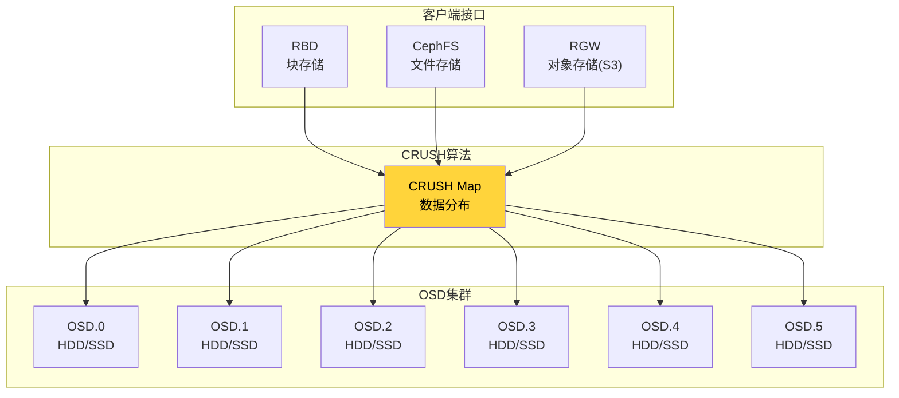

**核心架构：**
- **RADOS（Reliable Autonomic Distributed Object Store）**：底层对象存储引擎
- **CRUSH算法**：去中心化的数据分布算法，无需元数据服务器
- **Monitor集群**：维护集群状态（通常3个Monitor形成Paxos仲裁）
- **MDS（CephFS专用）**：元数据服务器

```bash
# Ceph集群基本操作
ceph -s                          # 集群状态
ceph osd tree                    # OSD拓扑
rbd create mypool/myimage --size 100G  # 创建RBD镜像
rbd map mypool/myimage           # 映射为本地块设备
mkfs.ext4 /dev/rbd0              # 格式化
mount /dev/rbd0 /mnt/rbd         # 挂载使用
```

#### GlusterFS

GlusterFS是无元数据服务器的分布式文件系统：

- **卷类型**：分布式卷（Distributed）、复制卷（Replicated）、分布式复制卷（Distributed-Replicated）、条带卷（Striped）
- **数据分片**：通过Hash算法将文件分布到不同Brick
- **自修复**：自动检测并修复不一致的副本

#### MinIO

MinIO是高性能的S3兼容对象存储：

```bash
# 启动MinIO（4节点集群）
minio server http://node{1...4}/data{1...2}

# 使用mc客户端操作
mc alias set myminio http://localhost:9000 minioadmin minioadmin
mc mb myminio/mybucket
mc cp file.txt myminio/mybucket/
```

### 9.9.3 存储分层自动化

现代存储系统需要根据数据的访问频率自动在不同存储介质间迁移数据：

**三级数据温度模型：**

| 数据温度 | 特征 | 存储介质 | 访问频率 | 迁移策略 |
|---------|------|---------|---------|---------|
| 热数据 | 高频访问、延迟敏感 | NVMe SSD | 每秒多次 | 留在当前层 |
| 温数据 | 中频访问、可接受ms级延迟 | SATA SSD / HDD | 每天数次 | 按需迁入/迁出 |
| 冷数据 | 低频或不访问 | HDD / 磁带 / 对象存储 | 每月<1次 | 定期下沉 |

```bash
# 使用bcache实现Linux存储分层（SSD缓存HDD）
# 创建缓存设备
make-bcache -C /dev/nvme0n1  # SSD作为缓存
make-bcache -B /dev/sda       # HDD作为后端

# 查看缓存状态
cat /sys/block/bcache0/bcache/cache_mode
# [writethrough] writeback writearound none

# 启用写回模式（更高性能，需要BBU或UPS）
echo writeback > /sys/block/bcache0/bcache/cache_mode

# 查看缓存命中率
cat /sys/block/bcache0/bcache/cache_set*/cache_miss_ratio
```

### 9.9.4 容器存储

在容器化环境中，存储通过CSI（Container Storage Interface）标准接入：

**Kubernetes存储模型：**

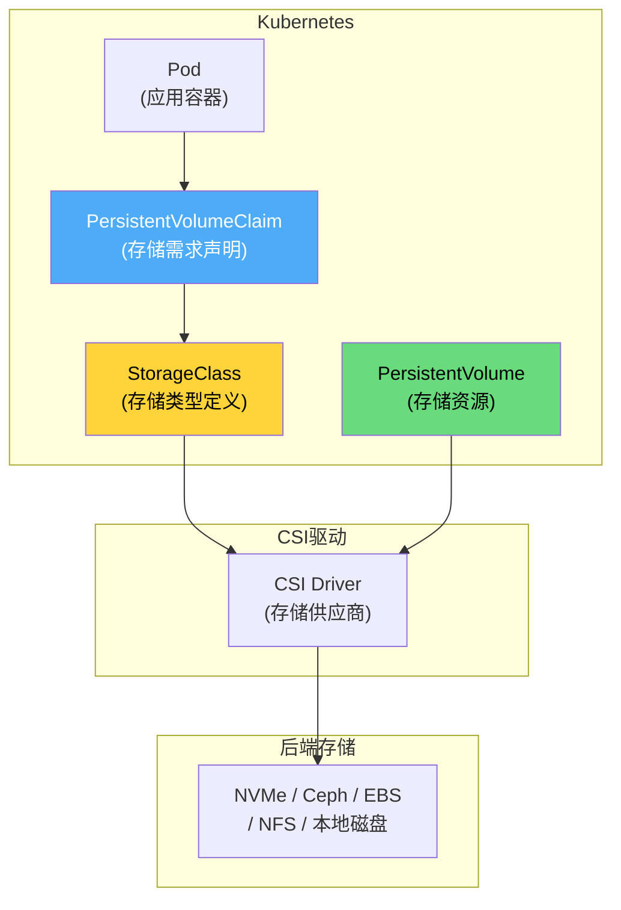

**Kubernetes存储配置示例：**

```yaml
# StorageClass定义
apiVersion: storage.k8s.io/v1
kind: StorageClass
metadata:
  name: fast-nvme
provisioner: ceph.rbd.csi.ceph.com
parameters:
  clusterID: abc123
  pool: nvme-pool
  imageFeatures: layering
  fsType: ext4
reclaimPolicy: Retain
volumeBindingMode: WaitForFirstConsumer
allowVolumeExpansion: true

---
# PersistentVolumeClaim
apiVersion: v1
kind: PersistentVolumeClaim
metadata:
  name: db-data-pvc
spec:
  accessModes:
    - ReadWriteOnce
  storageClassName: fast-nvme
  resources:
    requests:
      storage: 500Gi
```

**数据库在Kubernetes中的存储考虑：**
- 使用`ReadWriteOnce`访问模式确保单节点独占
- 配置`volumeBindingMode: WaitForFirstConsumer`确保存储与Pod调度在同一可用区
- 对于有状态数据库，使用StatefulSet配合headless Service
- 监控IOPS和延迟，因为CSI层会引入额外开销

### 9.9.5 虚拟化层的性能影响

存储虚拟化不可避免地引入额外开销：

| 虚拟化层 | 额外延迟 | CPU开销 | 优化建议 |
|---------|---------|---------|---------|
| 文件系统 | 1-5μs | 低 | 选择轻量级文件系统（XFS/NOVA） |
| 逻辑卷（LVM） | <1μs | 极低 | 可忽略 |
| 块设备（DM） | 1-3μs | 低 | 减少叠加层级 |
| 网络存储（NFS/iSCSI） | 10-100μs | 中等 | 使用RDMA/RoCE降低延迟 |
| 分布式（Ceph） | 50-200μs | 高 | 使用NVMe OSD + RDMA网络 |
| 容器（CSI） | 1-5μs | 低 | 直通存储减少层级 |

**优化原则：**
- 越靠近硬件性能敏感的场景，虚拟化层级应越少
- 对于数据库等低延迟场景，优先使用本地NVMe或NVMe-oF
- 容器化数据库应使用hostPath或本地PV避免CSI开销
- 分布式存储适合需要数据冗余和弹性扩展的场景

### 9.9.6 存储QoS（服务质量保障）

在多租户或混合负载环境中，存储QoS确保不同工作负载之间不会相互干扰。这对于数据库服务的SLA保障至关重要。

**存储QoS的三个维度：**

IOPS限制:   每个租户/应用的最大IOPS配额
带宽限制:   每个租户/应用的最大读写带宽（MB/s）
延迟保障:   P99延迟SLA（如<1ms）

**NVMe I/O调度器的QoS支持：**

```bash
# mq-deadline调度器的优先级设置
# 设置读写优先级（0-7，0最高）
echo 0 > /sys/block/nvme0n1/queue/io_sched/read_prio
echo 3 > /sys/block/nvme0n1/queue/io_sched/write_prio

# 设置权重（用于BFQ调度器）
echo 100 > /sys/block/sda/queue/io_sched/weight
```

**Linux cgroup v2的I/O控制器：**

```bash
# 为数据库进程设置I/O配额
# 创建cgroup
mkdir /sys/fs/cgroup/db_tier

# 限制IOPS（使用io.max）
echo "8:0 rbps=500000000 wbps=200000000 riops=50000 wiops=20000" \
    > /sys/fs/cgroup/db_tier/io.max

# 设置I/O权重（使用io.weight，相对权重）
echo "8:0 weight=200" > /sys/fs/cgroup/db_tier/io.weight

# 将数据库进程放入cgroup
echo $MYSQL_PID > /sys/fs/cgroup/db_tier/cgroup.procs

# 查看I/O统计
cat /sys/fs/cgroup/db_tier/io.stat
# 8:0 rbytes=1234567890 wbytes=9876543210 ios=12345 delays=...
```

**Ceph存储QoS配置：**

```bash
# Ceph RBD QoS配置
# 在Ceph配置文件中设置
[client]
rbd_qos_iops_limit = 10000          # IOPS上限
rbd_qos_bps_limit = 500000000       # 带宽上限 (500MB/s)
rbd_qos_iops_soft_limit = 8000      # 软限制（可超额但有延迟惩罚）
rbd_qos_bps_soft_limit = 400000000
rbd_qos_schedule_tick_offset = 0.1  # 调度周期 (ms)

# 动态调整QoS
rbd feature disable mypool/myimage journaling  # 禁用不必要的功能减少开销
```

**存储QoS的监控与告警：**

```bash
# 监控各租户的I/O延迟
iostat -xdm 1 | awk '$NF > 80 {print "ALERT: " $0}'

# 使用blktrace分析延迟分布
blktrace -d /dev/nvme0n1 -w 10 -o /tmp/trace
blkparse -i /tmp/trace -d /tmp/trace.bin
btt -i /tmp/trace.bin | head -20

# Prometheus监控配置示例
# - alert: StorageHighLatency
#   expr: avg_over_time(io_await_seconds[5m]) > 0.001
#   for: 5m
#   labels:
#     severity: warning
```

### 9.9.7 数据去重与压缩

数据去重（Deduplication）和压缩（Compression）是降低存储成本、提升存储效率的两大核心技术。在存储层透明地应用这些技术，可以大幅减少实际占用的物理空间。

**去重原理：**

原始数据: [Block A] [Block B] [Block C] [Block A'] [Block B']
                              ↓ 去重
实际存储: [Block A] [Block B] [Block C]
索引:     A→[0] B→[1] C→[2] A'→[0] B'→[1]  (引用已有块)

| 去重类型 | 粒度 | 去重率 | CPU开销 | 适用场景 |
|---------|------|--------|---------|---------|
| 文件级去重 | 整个文件 | 中等 | 低 | 备份系统（如Veeam） |
| 块级去重 | 固定大小块(4-8KB) | 高 | 中等 | 块存储、iSCSI |
| 可变块级去重 | 内容定义块(CDC) | 最高 | 高 | 压缩存储、日志 |

**存储层压缩算法对比：**

| 算法 | 压缩比 | 压缩速度 | 解压速度 | CPU开销 | 适用场景 |
|------|--------|---------|---------|---------|---------|
| LZ4 | 2:1 | 极快 | 极快 | 低 | 在线数据库、实时数据 |
| ZSTD | 3:1-5:1 | 快 | 极快 | 低-中 | 通用场景、RocksDB默认 |
| LZO | 2:1 | 快 | 快 | 低 | 日志压缩 |
| Snappy | 2:1 | 极快 | 极快 | 极低 | HBase、Cassandra |
| GZIP | 3:1-5:1 | 慢 | 中等 | 高 | 归档、冷数据 |
| ZPAQ | 5:1-10:1 | 很慢 | 慢 | 很高 | 长期归档 |

**数据库存储引擎中的压缩实践：**

```cpp
// RocksDB压缩配置
Options options;

// 默认压缩：LZ4（性能与压缩比平衡）
options.compression = kLZ4Compression;

// Level 0-1：不压缩（频繁写入，减少CPU开销）
// Level 2-3：LZ4压缩
// Level 4+：ZSTD压缩（冷数据，追求高压缩比）
options.compression_per_level = {
    kNoCompression,       // Level 0
    kNoCompression,       // Level 1
    kLZ4Compression,      // Level 2
    kLZ4Compression,      // Level 3
    kZSTD,                // Level 4
    kZSTD,                // Level 5
    kZSTD                 // Level 6
};

// ZSTD压缩级别调整
options.zstd_dict = true;          // 启用字典压缩
options.bottommost_compression = kZSTD;

// 压缩统计
options.report_bg_io_stats = true;
```

```bash
# ZFS文件系统透明压缩
# 创建压缩池（LZ4压缩）
zpool create -o compression=lz4 tank /dev/nvme0n1

# 查看压缩效果
zfs get compressratio tank
# NAME   PROPERTY       VALUE
# tank   compressratio  1.45x  (实际占用空间为原始的69%)

# 查看压缩统计
zfs get used,compressratio,logicalused tank
```

**去重+压缩的组合策略：**

典型存储分层压缩策略:
├── 热数据（NVMe SSD）: LZ4压缩 + 不去重
│   目标: 最低延迟，接受2:1压缩比
│
├── 温数据（SATA SSD/HDD）: ZSTD压缩 + 块级去重
│   目标: 平衡性能与空间，3:1-5:1压缩比
│
└── 冷数据（对象存储/磁带）: GZIP压缩 + 文件级去重
    目标: 最大空间节省，5:1-10:1压缩比

***


**参考文献：**

1. Weil, S. et al. "CRUSH: Controlled, Scalable, Decentralized Placement for Statistical Replication." OSDI, 2006.
2. Ghemawat, S. et al. "The Google File System." SOSP, 2003.
3. VMware. "Understanding Storage Virtualization." VMware Technical White Paper.
4. Kubernetes Documentation. "Persistent Volumes." https://kubernetes.io/docs/concepts/storage/
5. Ceph Documentation. "Ceph Architecture." https://docs.ceph.io/
6. Zhu, N. and Lu, L. "WiscKey: Separating Keys from Values in SSD-conscious Storage." FAST, 2016.
7. Facebook Engineering. "Zstandard: Fast Real-time Compression Algorithm." 2016.


***


# 第九章 存储介质 — 核心技巧

## 9.10 I/O基准测试方法

### 9.10.1 fio工具使用

fio（Flexible I/O Tester）是存储性能测试的标准工具，掌握它的使用是存储工程师的基本功。

**基础随机读测试：**

```bash
# 4KB随机读，队列深度32，测试60秒
fio --name=randread \
    --ioengine=io_uring \
    --direct=1 \
    --bs=4k \
    --iodepth=32 \
    --rw=randread \
    --size=10G \
    --runtime=60 \
    --time_based \
    --group_reporting \
    --filename=/dev/nvme0n1
```

**混合读写测试（模拟数据库工作负载）：**

```bash
# 70%读30%写，模拟OLTP
fio --name=oltp_workload \
    --ioengine=io_uring \
    --direct=1 \
    --bs=16k \
    --iodepth=64 \
    --rw=randrw \
    --rwmixread=70 \
    --size=50G \
    --runtime=300 \
    --time_based \
    --group_reporting \
    --numjobs=8 \
    --filename=/test_data
```

**延迟分布测试：**

```bash
# 关注延迟百分位数
fio --name=latency \
    --ioengine=io_uring \
    --direct=1 \
    --bs=4k \
    --iodepth=1 \
    --rw=randread \
    --size=1G \
    --runtime=60 \
    --time_based \
    --percentile_list=1:5:10:20:30:40:50:60:70:80:90:95:99:99.9:99.99:99.999 \
    --filename=/dev/nvme0n1
```

### 9.10.2 测试结果解读

fio输出中的关键字段：

randread: (groupid=0, jobs=1): err= 0: pid=1234
  read: IOPS=480k, BW=1875MiB/s (1966MB/s)
   iops: min=475000, max=490000, avg=480000.00
  lat (usec): min=2, max=1500, avg=66.30, stdev=12.45
  lat percentiles (usec):
    |  1.00th=[   30], 5.00th=[   45], 10.00th=[   50],
    | 20.00th=[   55], 30.00th=[   58], 40.00th=[   60],
    | 50.00th=[   63], 60.00th=[   66], 70.00th=[   70],
    | 80.00th=[   75], 90.00th=[   82], 95.00th=[   90],
    | 99.00th=[  110], 99.90th=[  150], 99.99th=[  250]

关键观察点：
- IOPS和带宽是否达到硬件标称值的80-90%
- P99延迟是否比P50延迟高太多（如果>10x，可能存在GC抖动或排队）
- stdev是否过大（过大说明延迟不稳定）

### 9.10.3 测试设计原则

1. **消除缓存干扰**：使用`direct=1`绕过页缓存；测试数据量应大于SSD的DRAM缓存（通常1-4GB）
2. **预填充数据**：对SSD，先全盘写入一遍再测读性能（新SSD读空白块不需要NAND访问）
3. **稳定态测试**：SSD在空盘状态和满盘状态性能差异很大，需要运行足够长时间（如24小时）来观察稳态性能
4. **隔离测试环境**：避免其他I/O负载干扰；关闭文件系统日志（如果可能）

## 9.11 理解和诊断I/O瓶颈

### 9.11.1 使用iostat监控

```bash
# 每秒输出一次，显示扩展统计
iostat -xdm 1

Device            r/s     w/s     rMB/s   wMB/s   rrqm/s  wrqm/s  await  r_await  w_await  aqu-sz  %util
nvme0n1       50000.00 20000.00  195.31   78.13    0.00    0.00    0.15   0.12    0.20     10.50   95.00
sda              50.00   100.00    0.78    3.91    2.00   25.00   12.30   8.50   14.20      1.85   100.00
```

关键指标解读：
- **await**：平均I/O完成时间（ms）。HDD上>10ms通常是正常的，NVMe上>1ms就值得关注
- **%util**：设备繁忙时间百分比。HDD上100%意味着请求队列积压；SSD上%util的参考意义有限（因为可以并行处理）
- **aqu-sz**：平均队列长度。反映并发I/O的排队情况
- **r_await/w_await**：分别关注读写延迟

### 9.11.2 使用blktrace追踪I/O路径

```bash
# 捕获I/O事件
blktrace -d /dev/nvme0n1 -o trace &amp;
# 执行工作负载
fio --name=test ...
# 停止捕获
kill %1
# 分析
blkparse -i trace -o parsed.txt
btt -i trace.blktrace.0
```

btt输出的延迟分解：

Q2C (Queue to Complete): 总延迟
Q2G (Queue to Get Request): 块层分配延迟
G2I (Get Request to Issue): 调度延迟
D2C (Driver to Complete): 硬件延迟
Q2D (Queue to Driver): 软件栈总延迟

### 9.11.3 使用perf追踪存储性能

```bash
# 追踪块I/O事件
perf trace -e block:block_rq_issue,block:block_rq_complete -p $(pidof mysqld)

# 追踪页缓存命中率
perf stat -e cache-references,cache-misses,dTLB-load-misses -p $(pidof mysqld)
```

## 9.12 I/O优化模式

### 9.12.1 对齐与分区优化

**分区对齐**：确保分区起始偏移与SSD的物理页/擦除块大小对齐，避免跨物理页的读-修改-写操作。

```bash
# 检查分区对齐
parted /dev/nvme0n1 align-check optimal 1

# 创建对齐的分区（1MB对齐）
parted -a optimal /dev/nvme0n1 mkpart primary 1MiB 100%
```

**文件系统块大小**：选择与典型I/O大小匹配的文件系统块大小。

```bash
# 4KB块大小（适用于OLTP，记录小）
mkfs.ext4 -b 4096 /dev/nvme0n1p1

# 对于数据仓库等大记录场景，使用更大的块
mkfs.xfs -b size=65536 /dev/nvme0n1p1
```

### 9.12.2 I/O调度器选择

```bash
# 查看当前调度器
cat /sys/block/nvme0n1/queue/scheduler

# SSD/NVMe推荐使用none（无调度）或mq-deadline
echo none > /sys/block/nvme0n1/queue/scheduler

# HDD推荐使用bfq（交互式场景）或mq-deadline（吞吐场景）
echo bfq > /sys/block/sda/queue/scheduler
```

### 9.12.3 内核参数调优

```bash
# 增大请求队列深度
echo 2048 > /sys/block/nvme0n1/queue/nr_requests

# 调整预读大小（HDD增大，SSD减小）
blockdev --setra 4096 /dev/sda    # HDD: 2MB预读
blockdev --setra 256 /dev/nvme0n1  # NVMe: 128KB预读

# 减少脏页回写间隔（减少突发写入）
echo 500 > /proc/sys/vm/dirty_expire_centisecs
echo 100 > /proc/sys/vm/dirty_writeback_centisecs

# 调整脏页比例
echo 5 > /proc/sys/vm/dirty_ratio
echo 2 > /proc/sys/vm/dirty_background_ratio
```

## 9.13 针对数据库的存储优化

### 9.13.1 数据库I/O分类

典型的数据库系统产生以下几类I/O：

1. **WAL顺序写**：最关键的I/O路径，直接决定事务提交延迟
2. **数据页随机读**：缓存未命中时触发，影响查询延迟
3. **数据页随机写**：脏页回写，可通过合并优化
4. **顺序扫描**：全表扫描和范围查询
5. **临时文件**：排序和哈希连接的溢出

### 9.13.2 WAL I/O优化

```c
// 高效的WAL写入模式
struct WALWriter {
    // 1. 使用O_DIRECT | O_SYNC绕过缓存
    int fd = open("wal.log", O_RDWR | O_DIRECT | O_SYNC);
    
    // 2. 对齐的写缓冲区
    void *buf = aligned_alloc(4096, WAL_BUFFER_SIZE);
    
    // 3. 组提交：多个事务的WAL合并为一次写入
    void flush_wal_batch(Transaction *txns[], int count) {
        size_t total_size = 0;
        for (int i = 0; i < count; i++) {
            total_size += serialize_wal_entry(buf + total_size, txns[i]);
        }
        // 对齐到扇区边界
        total_size = ALIGN_UP(total_size, 4096);
        write(fd, buf, total_size);  // 一次I/O完成多个事务的持久化
    }
};
```

### 9.13.3 数据文件I/O策略

**预读策略**：
```c
// 顺序扫描时启用预读
void sequential_scan_start(int fd) {
    posix_fadvise(fd, 0, 0, POSIX_FADV_SEQUENTIAL);
}

// 随机访问时禁用预读
void random_access_mode(int fd) {
    posix_fadvise(fd, 0, 0, POSIX_FADV_RANDOM);
}

// 即用即弃模式（如VACUUM扫描）
void scan_and_forget(int fd, off_t offset, size_t len) {
    posix_fadvise(fd, offset, len, POSIX_FADV_DONTNEED);
}
```

**Direct I/O使用**：

```c
// 使用Direct I/O避免双缓冲
int open_datafile(const char *path) {
    int fd = open(path, O_RDWR | O_DIRECT);
    
    // 但Direct I/O要求对齐的缓冲区和大小
    void *buf = aligned_alloc(4096, 4096 * READ_PAGES);
    
    // 读取必须是扇区大小的整数倍
    pread(fd, buf, 4096 * READ_PAGES, aligned_offset);
    
    return fd;
}
```

## 9.14 SSD寿命管理

### 9.14.1 监控SSD健康状态

```bash
# 查看SMART信息
smartctl -a /dev/nvme0n1

# 关键指标
# Percentage Used: 已使用的寿命百分比（100%表示设计寿命用尽）
# Media and Data Integrity Errors: 媒体错误数，应该为0
# Available Spare: 剩余备用块百分比
```

```bash
# NVMe特定的健康日志
nvme smart-log /dev/nvme0n1
```

输出示例：
Smart Log for NVME device:nvme0n1 namespace-id:ffffffff
critical_warning          : 0
temperature               : 42°C
available_spare           : 100%
available_spare_threshold : 10%
percentage_used           : 2%
data_units_read           : 12,345,678
data_units_written        : 56,789,012
power_on_hours            : 8,760

### 9.14.2 减少写放大

```python
# 应用层面减少不必要写入的策略

class WriteOptimizedBuffer:
    """合并小写入为大块写入"""
    def __init__(self, block_size=4096):
        self.buffer = {}
        self.block_size = block_size
    
    def write(self, offset, data):
        block_id = offset // self.block_size
        self.buffer[block_id] = data
        
        # 当积累到足够多的脏块时，批量写入
        if len(self.buffer) >= 32:
            self.flush()
    
    def flush(self):
        sorted_blocks = sorted(self.buffer.items())
        for block_id, data in sorted_blocks:
            actual_offset = block_id * self.block_size
            pwrite(self.fd, data, actual_offset)
        self.buffer.clear()
```

### 9.14.3 Over-Provisioning配置

企业级SSD通常支持用户配置额外的预留空间：

```bash
# 设置NVMe SSD的预留空间（例如设置28%）
nvme set-feature /dev/nvme0n1 -f 0x0c -v 280
```

更多的预留空间意味着：
- 垃圾回收更高效（有更多空闲块可用）
- 写放大更低（GC时需要迁移的有效页更少）
- 稳态性能更稳定
- 可用容量减少

推荐配置：
- 重度写入负载：20-28%预留
- 中等写入负载：10-15%预留
- 轻度写入负载：7%（厂商默认值）

***


**参考文献：**

1. Axboe, J. "fio - Flexible I/O Tester." https://github.com/axboe/fio
2. Linux kernel documentation: Block I/O layer.
3. SNIA Solid State Storage Performance Test Specification.
4. Samsung Enterprise SSD Best Practices Guide.


***


# 第九章 存储介质 — 实战案例

## 9.15 案例一：MySQL在不同存储介质上的性能差异

### 9.15.1 测试背景

某电商平台在数据库升级时需要评估从SATA SSD迁移到NVMe SSD的收益。使用sysbench模拟OLTP工作负载进行对比测试。

### 9.15.2 测试环境

硬件配置：
- CPU: Intel Xeon Gold 6248 (2.5GHz, 20C/40T) × 2
- 内存: 256GB DDR4-2933
- 存储对比组：
  - SATA SSD: Samsung 870 EVO 1TB (标称 560/530 MB/s, 98K/88K IOPS)
  - NVMe SSD: Samsung 980 PRO 1TB (标称 7000/5000 MB/s, 1M/1M IOPS)
  - HDD: Seagate Exos 7E10 10TB (7200RPM)
- 文件系统: XFS
- 数据库: MySQL 8.0.33, InnoDB

测试参数：
- 表数量: 64
- 每表行数: 100万
- 总数据量: ~20GB
- 并发线程: 64
- 测试时长: 3600秒

### 9.15.3 测试结果

**sysbench OLTP读写混合（70%读30%写）：**

| 指标 | HDD | SATA SSD | NVMe SSD |
|------|-----|----------|----------|
| TPS | 1,200 | 18,500 | 32,000 |
| 平均延迟(ms) | 53.3 | 3.5 | 2.0 |
| P99延迟(ms) | 180 | 8.5 | 4.2 |
| P999延迟(ms) | 350 | 25 | 12 |

**随机读测试（纯SELECT）：**

| 指标 | HDD | SATA SSD | NVMe SSD |
|------|-----|----------|----------|
| QPS | 2,500 | 95,000 | 180,000 |
| 平均延迟(ms) | 25.6 | 0.67 | 0.36 |

**分析：**
- NVMe SSD相比SATA SSD提升约70-90%，主要瓶颈从I/O转移到了MySQL的锁竞争和CPU开销
- HDD的性能差距是1-2个数量级级别
- NVMe SSD上的P99延迟大幅改善，对于在线服务的用户体验影响显著

### 9.15.4 调优建议

```ini
# MySQL InnoDB在NVMe SSD上的推荐配置
[mysqld]
# 增大I/O容量（NVMe可以处理更多并发I/O）
innodb_read_io_threads = 16
innodb_write_io_threads = 16
innodb_io_capacity = 20000
innodb_io_capacity_max = 40000

# 增大Buffer Pool（减少I/O需求）
innodb_buffer_pool_size = 128G  # 约为内存的50-75%
innodb_buffer_pool_instances = 16

# 使用O_DIRECT避免双缓冲
innodb_flush_method = O_DIRECT

# 调整日志写入策略
innodb_flush_log_at_trx_commit = 1  # 仍然保证持久性
innodb_log_buffer_size = 64M  # 增大日志缓冲减少刷盘频率
```

## 9.16 案例二：RocksDB在NVMe上的性能调优

### 9.16.1 问题描述

某分布式KV存储系统使用RocksDB作为底层存储引擎，在从SATA SSD迁移到NVMe SSD后，写入性能提升不明显（仅提升20%），远未达到预期。

### 9.16.2 根因分析

使用iostat和perf进行分析：

```bash
# iostat显示NVMe的利用率很低
iostat -xdm 1
# nvme0n1: %util = 15%, 说明大部分时间SSD是空闲的

# perf显示大量时间花在WAL的fsync上
perf record -g -p $(pidof rocksdb_server) -- sleep 30
perf report
# 45%的时间在fdatasync上
# 20%的时间在mutex竞争上
```

问题定位：**单线程WAL写入成为瓶颈**。虽然NVMe的延迟更低，但每次fsync仍然需要约15-20μs，以每秒20万次put计算，仅fsync就需要3-4秒，已接近CPU单核的极限。

### 9.16.3 优化方案

```cpp
// 1. 启用RocksDB的并行WAL（Pipeline WAL）
options.enable_pipelined_write = true;

// 2. 使用unordered_write减少写入路径的锁竞争
options.unordered_write = true;

// 3. 增大write_buffer_size减少flush频率
options.write_buffer_size = 256 * 1024 * 1024;  // 256MB
options.max_write_buffer_number = 6;

// 4. 调整level0_compaction_trigger减少compaction压力
options.level0_file_num_compaction_trigger = 4;
options.level0_slowdown_writes_trigger = 20;
options.level0_stop_writes_trigger = 36;

// 5. 使用Direct I/O
options.use_direct_reads = true;
options.use_direct_io_for_flush_and_compaction = true;

// 6. 增大max_background_compactions和max_background_flushes
options.max_background_jobs = 16;
```

### 9.16.4 优化效果

| 指标 | 优化前 | 优化后 | 提升 |
|------|--------|--------|------|
| 写入吞吐(MB/s) | 180 | 850 | 4.7x |
| 写入IOPS | 45,000 | 210,000 | 4.7x |
| NVMe利用率 | 15% | 72% | - |
| P99延迟(ms) | 5.2 | 0.8 | 6.5x |

关键收获：仅更换硬件是不够的，软件配置必须配合硬件能力进行调整。

## 9.17 案例三：云环境下的存储选型决策

### 9.17.1 场景分析

某SaaS公司计划将MySQL数据库迁移到AWS云环境，需要选择合适的存储类型：

- **io2 Block Express**：最高性能的EBS卷，IOPS高达256,000，延迟<0.5ms
- **io2**：通用高性能EBS卷，IOPS高达64,000
- **gp3**：通用SSD，基线3,000 IOPS，可额外购买
- **本地NVMe实例存储（i3/i4实例）**：最高性能但无持久性保障

### 9.17.2 成本分析

假设：数据库需要50,000 IOPS，存储1TB数据

方案A: io2 Block Express (256K IOPS上限)
  - 存储：$0.125/GB/月 × 1000GB = $125/月
  - IOPS：$0.065/IOPS/月 × 50,000 = $3,250/月
  - 总计：$3,375/月

方案B: gp3 + 额外IOPS
  - 存储：$0.08/GB/月 × 1000GB = $80/月
  - 额外IOPS：$0.005/IOPS/月 × 47,000 = $235/月
  - 总计：$315/月

方案C: i4i.xlarge（本地NVMe 468GB × 2）
  - 实例费用：约$0.85/hour × 730 = $620/月
  - 本地NVMe存储：免费
  - 但需要配置同步复制保障持久性

### 9.17.3 决策矩阵

| 维度 | io2 Block Express | gp3 | 本地NVMe |
|------|-------------------|-----|----------|
| 性能 | 极高 | 中等 | 最高 |
| 成本 | 最高 | 最低 | 中等 |
| 持久性 | 99.999% | 99.999% | 无（需复制） |
| 可用区绑定 | 否 | 否 | 是 |
| 快照支持 | 是 | 是 | 否 |
| 在线扩展 | 是 | 是 | 否 |

**最终选择**：
- 主数据库：gp3（性价比最优，50K IOPS可以通过预配置达到）
- 热数据缓存层：本地NVMe + Redis
- 备份：定期快照到S3

## 9.18 案例四：使用blktrace定位I/O延迟问题

### 9.18.1 问题现象

某数据库服务器的P99延迟周期性飙高，从正常的2ms升至50-100ms，持续5-10秒。监控显示CPU、内存均正常，怀疑是存储问题。

### 9.18.2 诊断过程

```bash
# 第一步：使用iostat捕获延迟毛刺
iostat -xdm 1 > iostat.log &amp;
# 发现await周期性从0.2ms升至15ms

# 第二步：blktrace精确定位
blktrace -d /dev/nvme0n1 -w 10 -o /tmp/trace
blkparse -i /tmp/trace -d /tmp/trace.bin

# 第三步：使用btt分析延迟分布
btt -i /tmp/trace.bin -o btt_output

# 第四步：查看Q2D（排队到驱动）和D2C（驱动到完成）延迟
```

btt输出显示D2C延迟（硬件延迟）在毛刺期间从正常的50μs升至10ms+，确认是硬件层面的问题。

### 9.18.3 根因定位

```bash
# 检查SSD的GC行为
nvme smart-log /dev/nvme0n1
# percentage_used: 75%（磨损程度高）
# available_spare: 25%（备用空间不足）

# 使用blktrace的时间戳分析
# 发现每次毛刺期间有大量的大块写入，模式与SSD内部GC一致
```

根因：SSD磨损程度高（75%寿命已用），备用块不足导致垃圾回收效率下降，GC期间的内部操作与前台I/O竞争，造成延迟飙升。

### 9.18.4 解决方案

1. **短期**：调整Over-Provisioning比例，释放部分空间给SSD用作GC缓冲
2. **短期**：减少前台写入压力，优化WAL的刷盘策略
3. **长期**：更换SSD，采用更大容量的型号（更大的容量意味着更多的备用块和更长的稳定态时间）
4. **架构层面**：实现读写分离，将延迟敏感的读操作路由到从库

***


**参考文献：**

1. MySQL Performance Blog: "MySQL on NVMe SSDs"
2. RocksDB Wiki: "Performance Tuning"
3. AWS Documentation: "Amazon EBS Volume Types"
4. Linux man pages: blktrace(8), btt(1), iostat(1)


***


# 第九章 存储介质 — 常见误区

## 9.19 误区一：SSD不需要I/O调度

**错误观点：** "SSD没有机械部件，不需要I/O调度器优化，应该使用noop/none调度器。"

**辨析：**

这个观点在大方向上是正确的，但过于简化。现代NVMe驱动使用的blk-mq框架实际上内置了多队列调度逻辑。虽然SSD不需要HDD那种减少寻道距离的调度，但仍然需要考虑：

1. **I/O合并**：相邻的小I/O可以合并为一个大I/O，减少命令处理开销
2. **优先级控制**：前台查询I/O应该优先于后台GC/Compaction I/O
3. **限流控制**：防止后台大量I/O淹没前台请求
4. **截止时间保障**：某些I/O（如WAL fsync）有严格的延迟要求

**正确做法：** 对于NVMe，使用`none`调度器（依赖硬件的多队列）通常是最佳选择。但对于SATA SSD和混合工作负载，`mq-deadline`可能更合适。

```bash
# 推荐配置
echo none > /sys/block/nvme0n1/queue/scheduler    # NVMe
echo mq-deadline > /sys/block/sda/queue/scheduler  # SATA SSD
```

## 9.20 误区二：%util=100%意味着设备已满负荷

**错误观点：** "`iostat`显示%util=100%，说明I/O设备已经达到极限，需要升级硬件。"

**辨析：**

`%util`的计算方式是设备在采样周期内有I/O请求在处理的时间百分比。对于HDD，由于同一时刻只能处理一个请求，%util确实能反映设备的繁忙程度。但对于SSD：

```c
// %util的计算方式（简化）
util = (设备有活动I/O的时间片) / 采样周期
```

SSD可以并行处理多个I/O请求。一个NVMe SSD在处理1个I/O请求时%util就是100%，但它可能同时还能处理数百个请求。因此：

- HDD：%util > 70% 值得关注，> 90% 基本饱和
- SATA SSD：%util的参考意义有限，应关注IOPS和延迟
- NVMe SSD：%util基本无参考价值

**正确做法：** 关注以下指标替代%util：
- **await/r_await/w_await**：平均延迟
- **aqu-sz**：平均队列长度（>1说明有排队）
- **IOPS和带宽**：是否接近硬件标称值
- **延迟的百分位数**：P99/P999是否可接受

## 9.21 误区三：SSD的寿命不够长，不适合写入密集场景

**错误观点：** "SSD有写入寿命限制，数据库这种写入密集的应用不应该使用SSD。"

**辨析：**

早期SLC SSD的P/E循环确实有限（约10万次），但现代TLC/QLC SSD通过以下技术大幅提升了实际耐久性：

1. **容量增大**：容量越大，写入放大越小（更多空间用于GC），P/E循环被分摊到更多存储单元上
2. **磨损均衡算法**：确保所有块均匀使用
3. **纠错码（ECC）**：现代SSD使用LDPC等强纠错码，即使部分NAND单元退化也能恢复数据

以一块1TB TLC SSD为例（TBW=600TB）：
每天写入量 = 600TB / (5年 × 365天) = 329GB/天
对于大多数数据库场景，这个写入量已经足够

即使是重度写入的场景（如日志系统），通过选择企业级SSD或增大容量也可以满足需求。

**正确做法：** 根据实际写入量选择合适等级的SSD，并监控SMART的`percentage_used`指标。

## 9.22 误区四：NVMe SSD都差不多，选最便宜的就行

**错误观点：** "都是NVMe协议，性能差异不大，应该选最便宜的产品。"

**辨析：**

NVMe SSD之间的性能差异可以非常大，主要体现在：

1. **稳态性能vs峰值性能**：便宜的SSD可能在空盘时性能很好，但填满后性能急剧下降（写悬崖）
2. **一致性**：企业级SSD的延迟抖动远小于消费级
3. **断电保护**：企业级SSD有电容保护，确保写入缓存在断电时不丢失
4. **QoS保障**：企业级SSD通常提供99.99%或99.999%的延迟SLA

消费级NVMe（空盘状态）：
  随机写IOPS: 500,000
  稳态随机写IOPS: 50,000  ← 下降90%！

企业级NVMe：
  随机写IOPS: 500,000
  稳态随机写IOPS: 450,000  ← 仅下降10%

**正确做法：** 生产环境的数据库应该使用企业级SSD，并关注稳态性能指标，而非仅看峰值性能。

## 9.23 误区五：Direct I/O总是比Buffered I/O快

**错误观点：** "既然页缓存会增加一次内存拷贝，那Direct I/O应该总是更快。"

**辨析：**

Direct I/O的优势和劣势：

**优势：**
- 避免双缓冲（数据库缓存+页缓存）
- 减少内存拷贝
- 减少页缓存管理的CPU开销
- 更可预测的I/O行为

**劣势：**
- 失去了页缓存的预读能力
- 失去了页缓存的I/O合并能力
- 每次I/O必须对齐到扇区大小
- 对于小的、稀疏的随机读，Buffered I/O可能更快（因为页缓存的局部性）

```c
// Direct I/O的对齐要求
void direct_io_read(int fd, void *buf, size_t size, off_t offset) {
    // 必须满足以下条件：
    assert((uintptr_t)buf % 512 == 0);     // 缓冲区地址对齐
    assert(offset % 512 == 0);              // 偏移量对齐
    assert(size % 512 == 0);                // 读取大小对齐
    pread(fd, buf, size, offset);
}
```

**正确做法：** 数据库通常使用Direct I/O管理自己的缓存，但这不是绝对的。如果数据库的缓存管理不如OS页缓存高效（如缓存策略不当），Buffered I/O反而可能更好。

## 9.24 误区六：HDD已经完全过时了

**错误观点：** "现在SSD这么便宜，HDD已经没有存在价值了。"

**辨析：**

HDD在以下场景中仍然不可替代：

1. **大容量冷数据存储**：每GB成本仅为SSD的1/3-1/5
2. **归档和备份**：数据量大、访问频率低
3. **顺序大块I/O**：HDD的顺序带宽（200+MB/s）并不比SATA SSD差太多

存储1PB数据的成本对比：
HDD (20TB/盘): 约50块 × $300 = $15,000
SSD (4TB/盘):  约250块 × $300 = $75,000

**正确做法：** 采用分层存储策略——热数据用NVMe SSD，温数据用SATA SSD/HDD，冷数据用归档存储。

***


**参考文献：**

1. Hedwig, M. et al. "The Truth About Disk Performance." ACM SIGMOD, 2006.
2. Narayanan, D. et al. "Write Off-Loading: Practical Power Management for Enterprise Storage." FAST, 2008.


***


# 第九章 存储介质 — 练习方法

## 9.25 基础练习

### 练习1：存储设备性能基线测试

**目标：** 掌握使用fio进行存储性能测试的方法，理解不同I/O模式下的性能差异。

**步骤：**

1. 在一台有NVMe SSD的机器上，使用fio测试以下场景：
   - 4KB随机读（QD=1, QD=32, QD=128）
   - 4KB随机写（QD=1, QD=32, QD=128）
   - 128KB顺序读
   - 128KB顺序写
   - 混合读写（70/30，4KB，QD=32）

2. 记录每种场景的IOPS、带宽、平均延迟和P99延迟

3. 绘制IOPS vs 队列深度（QD）的曲线

**思考题：**
- 为什么QD=1和QD=32的IOPS差距这么大？
- 顺序读和随机读的性能差距在SSD上是多大？与HDD相比如何？
- P99延迟和平均延迟的差距说明了什么？

### 练习2：使用iostat和blktrace分析I/O模式

**目标：** 掌握I/O监控工具的使用，能够诊断I/O性能问题。

**步骤：**

1. 启动一个数据库（MySQL或PostgreSQL），运行sysbench OLTP测试
2. 同时使用`iostat -xdm 1`监控I/O指标
3. 使用`blktrace`捕获I/O事件
4. 分析I/O模式：请求大小分布、读写比例、队列深度分布

**进阶：** 比较不同数据库配置（如InnoDB的`innodb_flush_method`设为`fsync` vs `O_DIRECT`）对I/O模式的影响。

## 9.26 进阶练习

### 练习3：设计一个简单的I/O基准测试框架

**目标：** 理解存储性能测试的工程实践。

**要求：**

用C或Rust实现一个简单的I/O测试工具，支持以下功能：
- 同步和异步I/O模式
- 可配置的I/O大小、队列深度、线程数
- 延迟直方图统计（百分位数）
- 吞吐量和IOPS实时报告

```c
// 伪代码框架
struct io_bench_config {
    char *filename;
    size_t block_size;
    int queue_depth;
    int num_threads;
    int duration_seconds;
    enum { READ, WRITE, RANDREAD, RANDWRITE, MIXED } pattern;
};

struct io_bench_result {
    uint64_t total_ops;
    double iops;
    double throughput_mbps;
    double avg_latency_us;
    double p50, p90, p99, p999;
    double max_latency_us;
};

void *io_worker_thread(void *arg);
void report_results(struct io_bench_result *results, int num_threads);
```

### 练习4：SSD写入放大实验

**目标：** 直观感受SSD写入放大的影响。

**步骤：**

1. 准备一块有SMART写入量监控的SSD
2. 记录初始的`data_units_written`
3. 用随机小I/O（4KB）写入1GB数据
4. 记录`data_units_written`的变化
5. 对比：用顺序大I/O（1MB）写入1GB数据后的`data_units_written`变化
6. 计算两种场景下的写入放大系数

**思考题：** 为什么随机小I/O的写放大远高于顺序大I/O？这与FTL的垃圾回收有什么关系？

## 9.27 高级练习

### 练习5：分层存储策略设计

**目标：** 综合运用存储介质知识设计分层存储架构。

**场景：** 你需要为一个电商系统设计存储架构，数据特征如下：
- 用户会话数据：10GB，读写频繁，延迟敏感
- 商品目录：100GB，读多写少，查询模式多样
- 订单历史：1TB，写入后主要读取最近数据
- 日志数据：10TB，追加写入，偶尔全量分析

**要求：**
- 为每类数据选择合适的存储介质（NVMe/SATA SSD/HDD）
- 设计数据生命周期管理策略（冷热分层）
- 估算各层存储的成本
- 说明数据迁移的触发条件和实现方式

### 练习6：阅读NVMe规范

**目标：** 深入理解NVMe协议的细节。

**任务：** 阅读NVMe Base Specification 2.0的以下章节：
1. Chapter 2: Architecture（NVMe架构概述）
2. Chapter 4: Admin Command Set（管理命令集）
3. Chapter 5: NVM Command Set（NVM命令集）
4. Chapter 6: Queue Pair（提交队列和完成队列）

**输出：** 撰写一份NVMe规范的技术笔记（2000字），重点解释：
- SQ/CQ的工作流程
- NVMe命令的格式
- doorbell机制的作用
- 如何实现I/O优先级

### 练习7：PMEM基准测试与DAX应用

**目标：** 体验持久化内存的性能特征，掌握DAX和PMDK的使用方法。

**前提条件：** 需要Intel Optane DC Persistent Memory（或模拟环境）。

**步骤：**

1. **环境准备**：
```bash
# 挂载PMEM设备为DAX模式
mkfs.ext4 -b 4096 /dev/pmem0
mount -o dax /dev/pmem0 /mnt/pmem

# 安装PMDK
git clone https://github.com/pmem/pmdk.git
cd pmdk &amp;&amp; make -j$(nproc) &amp;&amp; sudo make install
```

2. **使用fio测试PMEM性能**：
```bash
# PMEM顺序读（DAX模式，libaio引擎）
fio --name=pmem_seqread \
    --ioengine=libaio \
    --direct=1 \
    --bs=4k \
    --iodepth=32 \
    --rw=read \
    --size=4G \
    --runtime=60 \
    --time_based \
    --group_reporting \
    --filename=/mnt/pmem/testfile

# PMEM随机写
fio --name=pmem_randwrite \
    --ioengine=libaio \
    --direct=1 \
    --bs=4k \
    --iodepth=32 \
    --rw=randwrite \
    --size=4G \
    --runtime=60 \
    --time_based \
    --group_reporting \
    --filename=/mnt/pmem/testfile

# 对比传统文件系统（非DAX）的性能
fio --name=pmem_nodax \
    --ioengine=libaio \
    --direct=1 \
    --bs=4k \
    --iodepth=32 \
    --rw=randread \
    --size=4G \
    --runtime=60 \
    --time_based \
    --group_reporting \
    --filename=/mnt/pmem/testfile_nodax
```

3. **编写PMDK持久化键值存储**：参照9.7.5节的libpmemobj示例，实现一个简单的持久化键值存储，测试其读写延迟。

4. **持久性验证**：
```bash
# 写入数据
./kv_store
# 强制断电模拟（使用kill -9）

# 重启后验证数据完整性
./kv_store
```

**思考题：**
- PMEM DAX模式与普通NVMe SSD在4KB随机读延迟上差距多大？
- PMEM在哪些场景下比NVMe SSD有明显优势？哪些场景下优势不大？
- 如果没有PMEM硬件，可以用/tmpfs + DAX模拟部分测试

### 练习8：RAID配置与性能测试

**目标：** 掌握使用mdadm配置软件RAID的方法，理解不同RAID级别的性能特征差异。

**前提条件：** 需要至少4块可用磁盘（可以是loop设备模拟）。

**步骤：**

1. **创建测试环境**（使用文件模拟磁盘）：
```bash
# 创建4个2GB的模拟磁盘
dd if=/dev/zero of=/tmp/disk1.img bs=1M count=2048
dd if=/dev/zero of=/tmp/disk2.img bs=1M count=2048
dd if=/dev/zero of=/tmp/disk3.img bs=1M count=2048
dd if=/dev/zero of=/tmp/disk4.img bs=1M count=2048

# 设置为loop设备
losetup /dev/loop0 /tmp/disk1.img
losetup /dev/loop1 /tmp/disk2.img
losetup /dev/loop2 /tmp/disk3.img
losetup /dev/loop3 /tmp/disk4.img
```

2. **分别创建RAID 0、RAID 1、RAID 5、RAID 10**：
```bash
# RAID 0
mdadm --create /dev/md0 --level=0 --raid-devices=2 /dev/loop0 /dev/loop1

# RAID 1
mdadm --create /dev/md1 --level=1 --raid-devices=2 /dev/loop0 /dev/loop1

# RAID 5
mdadm --create /dev/md5 --level=5 --raid-devices=3 /dev/loop0 /dev/loop1 /dev/loop2

# RAID 10
mdadm --create /dev/md10 --level=10 --raid-devices=4 /dev/loop0 /dev/loop1 /dev/loop2 /dev/loop3
```

3. **使用fio对比性能**：
```bash
# 对每种RAID级别运行相同的fio测试
fio --name=raid_bench --ioengine=libaio --direct=1 \
    --bs=4k --iodepth=32 --rw=randread --size=512M \
    --runtime=60 --time_based --filename=/dev/md0

# 记录并对比IOPS和延迟
```

4. **测试容错**：对RAID 5/10模拟磁盘故障，观察重建行为：
```bash
mdadm --fail /dev/md5 /dev/loop2
cat /proc/mdstat  # 观察重建进度
mdadm --add /dev/md5 /dev/loop2  # 替换并重建
```

**思考题：**
- RAID 5的随机写性能为什么比RAID 0差很多？
- 在什么场景下应该选择RAID 10而非RAID 5？
- 软件RAID（mdadm）和硬件RAID卡在数据库场景下各有什么优劣？

### 练习9：多层存储架构设计

**目标：** 综合运用本章所学知识，为真实场景设计多层存储架构。

**场景：** 你是一家社交媒体公司的数据库架构师，公司有以下数据特征：

| 数据类型 | 数据量 | 读写比例 | 延迟要求 | 数据生命周期 |
|---------|--------|---------|---------|------------|
| 用户个人信息 | 50GB | 90%读/10%写 | <1ms | 永久 |
| 用户Timeline | 500GB | 70%读/30%写 | <5ms | 永久 |
| 用户上传媒体 | 5TB | 60%读/40%写 | <50ms | 3年 |
| 系统日志 | 10TB | 5%读/95%写 | <100ms | 90天 |
| 分析数据 | 50TB | 100%读 | <1s | 1年 |

**预算限制：** 年度存储预算$50,000。

**要求：**
1. 为每种数据选择存储介质和存储架构（本地/网络/云）
2. 设计数据分层迁移策略（定义热→温→冷迁移规则）
3. 估算各层的硬件成本
4. 设计可靠性保障方案（RAID/复制策略）
5. 画出完整的存储架构图（使用Mermaid或其他工具）
6. 评估端到端延迟：从应用到持久化存储的完整路径

**进阶要求：**
- 如果引入CXL-attached PMEM，哪些数据应该放在PMEM上？可以带来什么收益？
- 如果需要支持全球多区域部署，存储架构需要如何调整？
- 设计监控方案，如何识别数据温度变化并触发迁移？


***


**推荐阅读：**
- 《Systems Performance》by Brendan Gregg - 第9章存储系统性能
- 《Linux Kernel Development》by Robert Love - 块I/O子系统
- Intel Optane SSD技术白皮书
- Patterson, D. et al. "A Case for Redundant Arrays of Inexpensive Disks (RAID)." SIGMOD, 1988.


***


# 第九章 存储介质 — 本章小结

## 核心要点回顾

本章从存储介质的物理原理出发，系统介绍了HDD、SSD、NVMe、PMEM等主流存储技术的架构与性能特征，并深入探讨了存储可靠性、RAID技术和存储虚拟化等系统级话题。

**HDD的核心特征：** 机械寻道和旋转延迟是主要瓶颈，随机I/O与顺序I/O性能差距巨大（约400倍）。这一特性深刻影响了早期存储引擎的设计——WAL、LSM树等技术本质上都是将随机I/O转化为顺序I/O的策略。

**SSD的革命性变化：** 随机读性能不再受限于机械延迟，IOPS提升2-3个数量级。但闪存的物理约束（写前擦除、P/E次数限制、写放大）带来了新的工程挑战。FTL是SSD的核心智能所在，理解它的工作原理有助于编写对SSD友好的软件。

**NVMe的协议优势：** 通过PCIe直连和多队列架构，NVMe将软件栈延迟降低到2-3μs，接近闪存硬件本身的访问速度。io_uring等新技术进一步消除了用户态-内核态的I/O开销。

**PMEM的颠覆性潜力：** 持久化内存将存储延迟降低到纳秒级（~100ns），支持字节级寻址和DAX直接访问，彻底消除了传统I/O栈的开销。虽然Intel Optane已停产，但CXL-attached PMEM正在接替这一角色。

**存储可靠性保障：** RAID技术通过数据冗余保护硬件故障，RAID 5/6提供容量效率与容错的平衡，但需注意写入空洞问题。端到端数据完整性校验（CRC/checksum）防止静默数据损坏。

**存储虚拟化与软件定义存储：** Ceph、GlusterFS等分布式存储系统提供弹性扩展的块/文件/对象存储服务，容器化的CSI标准使得数据库在Kubernetes中也能获得持久化存储。

## 关键技术决策

1. **存储选型应基于量化数据**：使用fio等工具测量实际I/O模式下的性能，而非仅凭规格参数
2. **硬件能力需要软件配合**：从SATA升级到NVMe，如果软件配置不做调整，收益可能非常有限
3. **关注稳态而非峰值**：SSD的写悬崖和GC抖动可能导致延迟毛刺，需要关注P99/P999延迟
4. **分层存储是务实选择**：热数据用NVMe，温数据用SATA SSD，冷数据用HDD，平衡性能与成本
5. **可靠性需要系统性设计**：RAID解决单点故障，但不能替代备份；数据完整性需要端到端校验
6. **存储引擎设计应匹配硬件特性**：LSM-tree适合写密集+HDD/SSD，B+tree适合读密集+SSD/PMEM，内存映射适合PMEM

## 与其他章节的联系

存储介质是数据库系统设计的物理约束。后续章节中，我们将看到这些约束如何影响索引结构（第10章）、WAL设计（第11章）、缓存策略（第12章）以及整个数据库架构（第13-17章）。理解存储介质的特性，是设计高效存储引擎的第一步。

***


**延伸阅读：**
- Anderson, D. "You Don't Know Jack About Disks." ACM Queue, 2003.
- Ousterhout, J. "Are Disks Obsolete?" HotOS, 2019.
- Intel. "Intel Optane Persistent Memory: A New Class of Memory." 2019.
- CXL Consortium. "CXL 3.0 Specification Overview." 2023.
- Patterson, D. et al. "A Case for Redundant Arrays of Inexpensive Disks (RAID)." SIGMOD, 1988.
- Bjorling, M. et al. "ZNS: Avoiding the Block Interface Tax for Flash-based SSDs." USENIX ATC, 2021.
- Weil, S. et al. "Ceph: A Scalable, High-Performance Distributed File System." OSDI, 2006.
