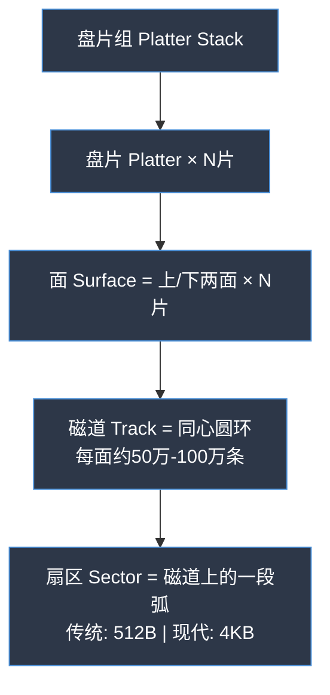
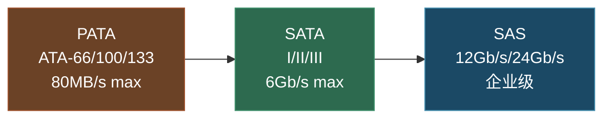
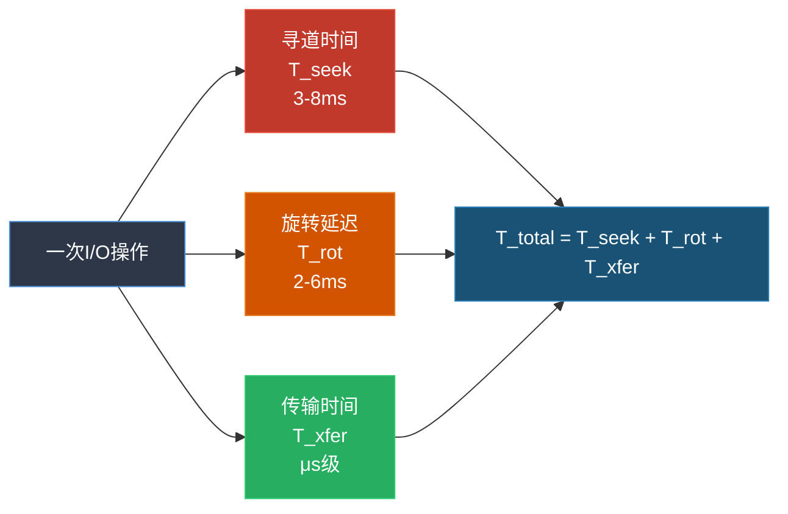
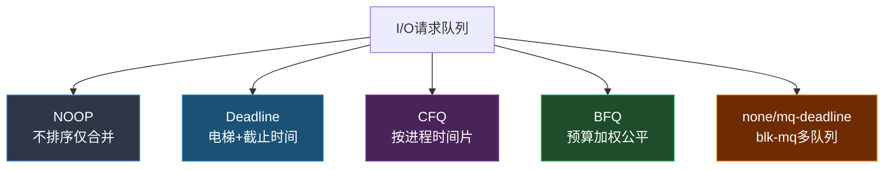
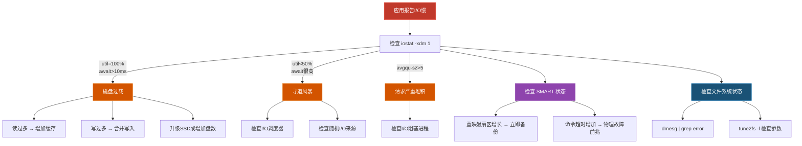
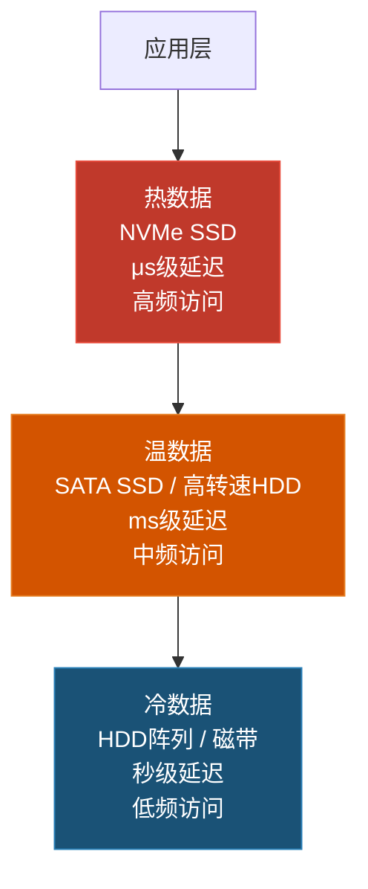

## 技巧1：HDD磁盘结构与寻道

在存储介质的知识体系中，机械硬盘（HDD）是理解一切I/O性能问题的起点。尽管SSD和NVMe正在逐步取代HDD在主存储领域的地位，但HDD在全球存储容量中仍占据超过60%的份额（IDC 2023数据），且其独特的机械特性深刻影响了整个存储软件栈的设计哲学。本节将从工程实践角度出发，带你深入理解HDD的物理结构、寻道机制、性能建模与优化策略，使你能够在真实系统中诊断I/O瓶颈并做出正确的设计决策。

---

### 1.1 HDD物理结构深度剖析

理解HDD的物理结构不是"了解就好"的科普知识——它直接决定了I/O延迟的分布特征，进而影响上层软件的设计选择。

#### 1.1.1 核心组件及其功能

一台现代HDD由以下精密机械部件协同工作：

**盘片（Platter）**

盘片是数据的物理载体。每块HDD包含1-10片盘片，材料为铝合金或玻璃基板，表面涂覆约10-20nm厚的钴基磁性合金薄膜。盘片直径主要有两种规格：

- 3.5英寸（企业级/NAS）：面积更大，可容纳更多磁道，单碟容量2-3TB
- 2.5英寸（笔记本/移动）：体积小，抗震性更好，单碟容量1-2TB

每个盘片的上下两个面都可存储数据，因此一块含4片盘片的硬盘有8个数据面（Surface）。

**磁头（Read/Write Head）**

磁头是HDD中最精密的部件。它悬浮在盘片表面上方仅3-5纳米处——这个距离大约是人类头发直径的万分之一，一粒灰尘落在盘片上就像一座山挡在磁头面前。如果以等比例放大到人类尺度，磁头离盘片的距离相当于一架波音747在地面0.8米高度飞行。

磁头的工作原理经历了三个时代：

| 技术 | 原理 | 读灵敏度 | 时代 |
|------|------|---------|------|
| AMR（各向异性磁阻） | 电阻随磁场方向变化 | ~10⁻⁶ | 1990s |
| GMR（巨磁阻） | 自旋相关散射导致电阻剧变 | ~10⁻⁸ | 2000s |
| TMR（隧道磁阻） | 量子隧穿效应 | ~10⁻⁹ | 2010s至今 |

> **物理原理延伸**：GMR效应的发现者阿尔贝·费尔（Albert Fert）和彼得·格林贝格（Peter Grünberg）因此获得了2007年诺贝尔物理学奖。TMR磁头利用MgO隧道势垒中的自旋相关隧穿，灵敏度比GMR再提升10倍，使得当前HDD的面密度已达到约1Tbit/in²。

现代TMR磁头的灵敏度使得在极小面积上存储高密度数据成为可能。

**主轴电机（Spindle Motor）**

主轴电机驱动盘片以恒定转速旋转。常见转速及其适用场景：

| 转速 | 平均旋转延迟 | 典型应用 | 功耗/噪声 |
|------|-------------|---------|----------|
| 5400 RPM | 5.56ms | NAS、归档存储 | 低（~5W） |
| 7200 RPM | 4.17ms | 通用桌面/服务器 | 中（~8W） |
| 10000 RPM | 3.00ms | 企业级数据库 | 较高（~12W） |
| 15000 RPM | 2.00ms | 高性能数据库（已停产） | 高（~18W） |

主轴电机采用液态轴承（Fluid Dynamic Bearing, FDB）技术，利用一层极薄的油膜支撑转子旋转，相比传统滚珠轴承具有更低的振动、噪声和更长的寿命。15000RPM HDD已在2016年前后停产，Seagate最后的产品线为Cheetah系列——取名猎豹正是为了体现其速度优势。

**寻道臂与音圈电机（Actuator Arm & VCM）**

寻道臂承载磁头在盘片半径方向做往复运动。驱动它的音圈电机（Voice Coil Motor）利用电磁力产生精确的角位移，控制磁头定位到目标磁道。整个寻道臂组件的运动类似于唱针在黑胶唱片上的移动，但精度要高出数个数量级。

现代HDD的磁头定位精度要求达到纳米级。以7200RPM、1TB盘片、100万条磁道计算，每条磁道的宽度仅约80nm，而磁头需要在盘片以每小时数百公里的线速度旋转时精确停留在这么窄的磁道上方——这是精密机械工程的巅峰之作。

**气流与密封与氦气封装**

HDD内部是完全密封的洁净环境。传统HDD内部充入空气，而现代大容量HDD转向氦气封装（Helium Sealing）——氦气密度仅为空气的1/7，显著减少盘片旋转时的空气阻力和湍流。

氦气封装带来的直接收益：

| 指标 | 空气封装 | 氦气封装 | 提升幅度 |
|------|---------|---------|---------|
| 最大盘片数 | 5-6片 | 7-10片 | +60% |
| 单盘容量上限 | 12TB | 20TB+ | +67% |
| 运行功耗 | ~8W | ~6W | -25% |
| 运行温度 | ~40°C | ~35°C | -12% |
| 振动容差 | 标准 | 提升50% | 更适合高密度部署 |

> **工程细节**：氦气封装不是简单的"把空气换成氦气"。由于氦气分子极小（直径约0.26nm），传统密封方式会导致氦气缓慢泄漏。Seagate的氦气HDD使用激光焊接密封+不锈钢壳体+专用透气膜技术，将氦气泄漏率控制在数十年内不影响性能。

#### 1.1.2 盘片数据组织结构

盘片表面的数据按以下层次组织：



**关键概念：柱面（Cylinder）**

多个盘片上相同半径位置的磁道在空间上构成一个虚拟的圆柱面。在CHS寻址时代，同一柱面内的磁道切换不需要移动磁头（仅切换电子通道），因此将相关数据放在同一柱面内可以显著减少寻道时间。虽然现代LBA寻址已不再直接使用CHS，但这一思想在数据库存储引擎的空间布局设计中仍有借鉴价值——将频繁关联访问的数据在物理上相邻存放。

**从CHS到LBA的演进**

| 寻址方式 | 最大容量 | 限制 |
|---------|---------|------|
| CHS (Cylinder-Head-Sector) | 8.4GB | 1024柱面 × 256磁头 × 63扇区 × 512B |
| LBA (Logical Block Addressing) | 理论无限 | 所有扇区线性编号0, 1, 2, ... |

现代操作系统和存储引擎只需要关心LBA编号，控制器固件负责将LBA映射到实际的物理位置。但理解CHS结构有助于理解为什么相邻LBA的物理分布可能是不连续的。

#### 1.1.3 高级格式化（Advanced Format）

传统硬盘使用512字节扇区，但现代HDD已全面转向4096字节扇区（4K扇区），原因包括：

- 磁性颗粒密度提升后，512字节扇区的物理尺寸已接近磁头读写的精度极限
- 更大的扇区提供更好的ECC（纠错码）效率——4K扇区可以将ECC校验码的比例从512B扇区的约15%降低到约5%，等效提升了用户可用空间
- 4K对齐对现代文件系统（ext4、NTFS、XFS）的性能至关重要

**4K对齐问题**：如果文件系统的分区起始位置未对齐到4K边界，一次逻辑读写可能需要读取两个物理扇区再合并，导致性能下降30%-50%。现代分区工具（GParted、fdisk）默认已处理对齐，但在旧系统迁移或虚拟化环境中仍需注意。

```bash
# 检查分区是否4K对齐
sudo fdisk -l /dev/sda | awk 'NR>3 &amp;&amp; $1~/sda[0-9]/ {printf "%s: start=%s, alignment=%s\n", $1, $2, ($2 % 8 == 0 ? "OK" : "NOT ALIGNED")}'
```

#### 1.1.4 接口演进：从PATA到SAS

HDD的物理接口决定了最大带宽和连接拓扑，是影响存储系统设计的重要因素：



| 接口 | 最大带宽 | 线缆特征 | 连接拓扑 | 典型应用 |
|------|---------|---------|---------|---------|
| PATA (IDE) | 133 MB/s | 80芯宽排线 | 主从双设备 | 旧式桌面（已淘汰） |
| SATA I | 1.5 Gb/s (150 MB/s) | 7pin细线 | 点对点 | 旧式HDD |
| SATA II | 3.0 Gb/s (300 MB/s) | 7pin细线 | 点对点 | 当前桌面HDD |
| SATA III | 6.0 Gb/s (600 MB/s) | 7pin细线 | 点对点 | 当前通用HDD/SSD |
| SAS-3 | 12 Gb/s (1200 MB/s) | 双端口 | 多路径/级联 | 企业级HDD |
| SAS-4 | 22.5 Gb/s (2250 MB/s) | 双端口 | 多路径/级联 | 高端企业存储 |

> **工程提示**：HDD的瓶颈从来不在接口带宽上——一块7200RPM HDD的持续读取速率约200MB/s，即使SATA II的300MB/s也绑绑有余。选择SAS的价值在于多路径冗余（双端口）和更强的企业级可靠性特性（如端到端数据保护），而非带宽。

---

### 1.2 HDD I/O延迟模型：量化分析

HDD的I/O延迟由三个部分组成，理解每个部分的量级和影响因素是性能优化的基础。



#### 1.2.1 寻道时间（Seek Time）

寻道时间是磁头从当前位置移动到目标磁道所需的时间，是HDD延迟中最大的组成部分。

**寻道时间的经验模型**

根据Seagate和WD的技术白皮书，寻道时间与跨越的磁道数d之间近似满足平方根关系：

T_seek(d) ≈ a + b × √d

其中a和b是与具体硬盘型号相关的常数。这个平方根关系来源于音圈电机的加速-减速特性：距离越远，平均速度越高，因此时间与距离不是线性关系。

典型值分布：

| 寻道类型 | 跨越磁道数 | 典型延迟 |
|---------|-----------|---------|
| 相邻磁道寻道 | 1-2 | 0.2-0.5ms |
| 短距寻道 | <100 | 1-3ms |
| 平均寻道 | 随机分布 | 3-8ms |
| 全行程寻道 | 全部磁道 | 8-15ms |

**实际寻道时间分布**：由于起始位置不同，到达各磁道的概率也不均匀，实际的平均寻道时间约为全行程的1/3，而非简单的1/2。这是因为磁头在盘片外圈起始时，到内圈的距离比到外圈近，这种空间分布的不对称性导致了1/3的经验比例。

#### 1.2.2 旋转延迟（Rotational Latency）

目标扇区旋转到磁头下方的等待时间。由于盘片匀速旋转，旋转延迟的统计特性很简单：

平均旋转延迟 = 30 / RPM（秒）

推导：一圈360°，磁头固定在某一角度，目标扇区可能在任何位置。假设均匀分布，平均需要等待半圈，即 (1/2) × (60/RPM) = 30/RPM 秒。

| 转速 | 平均旋转延迟 | 最差旋转延迟 |
|------|-------------|-------------|
| 5400 RPM | 5.56ms | 11.11ms |
| 7200 RPM | 4.17ms | 8.33ms |
| 10000 RPM | 3.00ms | 6.00ms |
| 15000 RPM | 2.00ms | 4.00ms |

旋转延迟是不可通过软件优化消除的物理等待时间——除非改变数据布局策略（见1.4节磁盘调度）。

#### 1.2.3 传输时间（Transfer Time）

实际读写数据的时间，取决于数据量和盘片的线速度：

T_transfer = 数据量 / 传输速率

HDD的持续传输速率从盘片外圈到内圈是递减的（外圈周长更长，单位时间经过的扇区更多）。以7200RPM的4TB HDD为例：

- 外圈传输速率：约200-250 MB/s
- 内圈传输速率：约120-150 MB/s
- 平均传输速率：约160-200 MB/s

> **为什么外圈更快？** 盘片以恒定角速度旋转（CAV模式），外圈半径大，弧长更长，因此单位时间内磁头经过的扇区数更多。这就是为什么很多文件系统和RAID控制器会把频繁访问的数据放在盘片外圈（所谓"外圈优先"策略）。

#### 1.2.4 端到端延迟计算示例

以一块7200RPM企业级HDD执行4KB随机读为例：

T_total = T_seek + T_rotation + T_transfer
        ≈ 4ms（平均寻道） + 4.17ms（平均旋转） + 0.02ms（4KB/200MB/s）
        ≈ 8.19ms

对应的随机读IOPS：

IOPS = 1 / 8.19ms ≈ 122 IOPS

而4KB顺序读I/O的IOPS：

IOPS = 200MB/s / 4KB ≈ 51,200 IOPS

**关键洞察：HDD的顺序I/O比随机I/O快约400倍。** 这个差距是HDD存储引擎设计中最核心的约束条件——所有面向HDD优化的系统（如LSM-tree、WAL日志、日志结构文件系统）都在试图将随机I/O转化为顺序I/O。

#### 1.2.5 HDD写缓存机制：不可忽视的隐藏层

除了盘片上的持久存储，每块HDD还内置了写缓存（Write Cache），它是理解HDD写入性能的关键一环：


**写缓存的工作流程**：

1. 主机发出写命令，数据先写入HDD内置的DRAM缓存（通常8-256MB），然后向主机返回"写完成"信号
2. HDD内部的控制器在后台将DRAM缓存中的脏数据刷写到盘片上
3. 由于DRAM写入延迟约100ns，远低于盘片写入延迟（毫秒级），主机感知到的写延迟极低

**写缓存的安全问题**：

- 如果HDD在DRAM缓存数据刷写到盘片之前突然断电，缓存中的数据会丢失
- 这就是为什么"带电池保护的RAID卡"在企业环境中如此重要——它确保断电时写缓存能被安全刷写
- SATA HDD的写缓存通常默认开启，可通过以下命令关闭（牺牲写入性能换取断电安全性）：

```bash
# 查看写缓存状态
sudo hdparm -W /dev/sda

# 关闭写缓存（安全模式，写入延迟增加10-100倍）
sudo hdparm -W 0 /dev/sda

# 重新开启写缓存（恢复性能）
sudo hdparm -W 1 /dev/sda
```

> **实践建议**：对于没有UPS保护的NAS设备，如果存储的是不可重建的数据（如家庭照片），可以考虑关闭写缓存以提高断电安全性。但对于有UPS保护或RAID卡电池的服务器，保持写缓存开启以获取最佳写入性能。

---

### 1.3 实操：使用Linux工具探测HDD内部特性

理论模型给出的是统计数据，而实际运维中我们需要针对具体硬盘型号测量真实的性能参数。

#### 1.3.1 获取硬盘物理参数

```bash
# 查看硬盘型号、固件版本、转速
sudo hdparm -I /dev/sda | grep -E "Model|Serial|Transport|Rotation|Sector"

# 更详细的SMART信息（包括寻道时间统计）
sudo smartctl -a /dev/sda | grep -E "Seek_Time|Spin_Up|Raw_Read|LBA|Sector"

# 查看硬盘的几何信息（逻辑CHS和物理CHS）
sudo fdisk -l /dev/sda 2>/dev/null | head -20

# 查看I/O调度器
cat /sys/block/sda/queue/scheduler

# 查看写缓存状态
sudo hdparm -W /dev/sda

# 查看APM（高级电源管理）设置
sudo hdparm -B /dev/sda
```

典型输出示例：

Model Family:     Seagate Exos X16
Device Model:     ST16000NM001G-2KK103
Rotation Rate:    7200 rpm
Sector Size:      512 bytes logical / 4096 bytes physical
SATA Version:     SATA 3.3, 6.0 Gb/s (current: 6.0 Gb/s)

#### 1.3.2 使用fio进行精确基准测试

fio（Flexible I/O Tester）是Linux下最专业的磁盘性能测试工具。以下是一组完整的HDD基准测试脚本：

**测试1：随机读IOPS基准**

```bash
# 4KB随机读，队列深度1（模拟单线程OLTP负载）
sudo fio --name=randread_qd1 \
    --filename=/dev/sda \
    --rw=randread \
    --bs=4k \
    --numjobs=1 \
    --iodepth=1 \
    --ioengine=libaio \
    --direct=1 \
    --runtime=60 \
    --time_based \
    --group_reporting \
    --output-format=json

# 输出示例（典型7200RPM HDD）：
# READ: bw=488KiB/s, iops=122, lat_ns avg=8194000
# 解读：随机读IOPS约122，平均延迟约8.2ms
```

**测试2：随机读IOPS随队列深度变化**

```bash
# 测试不同队列深度对随机读IOPS的影响
for qd in 1 2 4 8 16 32; do
    echo "=== Queue Depth: $qd ==="
    sudo fio --name=randread_qd${qd} \
        --filename=/dev/sda \
        --rw=randread \
        --bs=4k \
        --numjobs=1 \
        --iodepth=${qd} \
        --ioengine=libaio \
        --direct=1 \
        --runtime=30 \
        --time_based \
        --output-format=terse \
        | awk -F';' '{printf "IOPS: %s, Lat avg: %s ns\n", $8, $43}'
done
```

你会观察到HDD在队列深度增加时IOPS有小幅提升（通过I/O重排序减少寻道），但远不如SSD的线性增长：

QD=1:    ~122 IOPS
QD=4:    ~150 IOPS    (+23%, I/O调度器开始发挥作用)
QD=16:   ~165 IOPS    (+35%, 接近理论上限)
QD=32:   ~170 IOPS    (+39%, 饱和)

> **为什么HDD在高队列深度下提升有限？** HDD只有1个磁头，无法像SSD那样真正并行处理多个I/O。队列深度的提升只能让调度器更好地重排序请求以减少寻道，但磁头在同一时刻只能在一个位置。相比之下，SSD在QD=32时IOPS可达数百万——因为SSD的并行性来自闪存颗粒的多通道架构，而非调度优化。

**测试3：顺序读写带宽**

```bash
# 顺序读带宽（测试盘片最大传输速率）
sudo fio --name=seqread \
    --filename=/dev/sda \
    --rw=read \
    --bs=128k \
    --numjobs=1 \
    --iodepth=4 \
    --ioengine=libaio \
    --direct=1 \
    --runtime=60 \
    --time_based

# 顺序写带宽
sudo fio --name=seqwrite \
    --filename=/dev/sda \
    --rw=write \
    --bs=128k \
    --numjobs=1 \
    --iodepth=4 \
    --ioengine=libaio \
    --direct=1 \
    --runtime=60 \
    --time_based
```

**测试4：寻道时间专项测试**

```bash
# 使用seektic测试真实寻道时间分布
# 或者用fio的pattern模式模拟不同距离的寻道
sudo fio --name=seek_test \
    --filename=/dev/sda \
    --rw=randread \
    --bs=512 \
    --numjobs=1 \
    --iodepth=1 \
    --ioengine=libaio \
    --direct=1 \
    --size=100G \
    --offset_increment=0 \
    --runtime=30 \
    --time_based
```

#### 1.3.3 使用iostat进行运行时监控

在生产环境中，iostat是监控HDD健康状态和性能的首选工具：

```bash
# 每秒刷新，显示扩展磁盘统计
iostat -xdm 1

# 关键指标解读：
# %util: 磁盘利用率。HDD接近100%时已严重过载
# r_await/w_await: 读/写平均延迟。超过10ms说明HDD在高负载下
# avgqu-sz: 平均队列长度。HDD上超过2-3说明请求在堆积
# await: 综合平均延迟
# svctm: 平均服务时间（已废弃，仅供参考）
```

**iostat输出解读实例**：

Device  r/s    w/s   rMB/s  wMB/s  rrqm/s  wrqm/s  %util  r_await  w_await
sda    95.00  25.00   0.38   1.60    2.00   18.00   89.5    6.21     8.43

解读：

- 读IOPS 95 + 写IOPS 25 = 总IOPS 120，接近7200RPM HDD的极限
- %util 89.5% 说明磁盘几乎满负荷运行
- 写合并率高（wrqm/s=18），I/O调度器正在有效合并写请求
- 读延迟6.21ms略低于理论平均值8.19ms，说明顺序访问比例较高

> **%util的陷阱**：iostat的%util在HDD上的含义是"磁盘处于忙状态的时间比例"，而非"带宽利用率"。一块HDD即使%util=100%，实际带宽使用可能只有200MB/s，而HDD的最大带宽可能是250MB/s。真正的带宽瓶颈需要通过rMB/s+wMB/s与理论值对比来判断。

#### 1.3.4 使用hdparm测量缓存和传输速率

```bash
# 测试读取缓存速度（反映DRAM缓存性能）
sudo hdparm -T /dev/sda

# 测试磁盘直接读取速度（反映盘片真实传输速率）
sudo hdparm -t /dev/sda

# 典型结果：
# Timing cached reads:   12584 MB in  2.00 seconds = 6292.35 MB/sec  (DRAM缓存)
# Timing buffered disk reads: 482 MB in  3.00 seconds = 160.67 MB/sec  (盘片直接读取)
```

---

### 1.4 磁盘调度算法：从理论到实践

操作系统I/O调度器是减少HDD寻道开销的核心机制。理解各调度器的行为特征，才能在正确场景选择正确的策略。

#### 1.4.1 调度算法对比



| 算法 | 核心思想 | 优势 | 劣势 | 适用场景 |
|------|---------|------|------|---------|
| NOOP | 不排序，仅合并 | 延迟最低，无调度开销 | 不优化寻道 | SSD/虚拟化 |
| Deadline | 电梯+截止时间 | 防饥饿，保证延迟上限 | 可能牺牲全局最优 | 数据库/实时系统 |
| CFQ | 按进程分配时间片 | 公平性好 | 单队列瓶颈 | 桌面/通用 |
| BFQ | 预算加权公平队列 | 交互体验好 | 计算开销较大 | 桌面/移动设备 |
| none/mq-deadline | blk-mq多队列框架 | 无锁竞争，高并发 | 需要硬件支持 | NVMe/多核服务器 |

#### 1.4.2 查看和修改I/O调度器

```bash
# 查看当前调度器
cat /sys/block/sda/queue/scheduler
# 输出: [mq-deadline] kyber bfq none

# 切换调度器（临时，重启失效）
echo mq-deadline | sudo tee /sys/block/sda/queue/scheduler

# 永久修改（通过udev规则）
cat << 'EOF' | sudo tee /etc/udev/rules.d/60-io-scheduler.rules
# HDD使用mq-deadline
ACTION=="add|change", KERNEL=="sd[a-z]", ATTR{queue/rotational}=="1", \
    ATTR{queue/scheduler}="mq-deadline"
# SSD/NVMe使用none
ACTION=="add|change", KERNEL=="nvme[0-9]*", ATTR{queue/scheduler}="none"
EOF
sudo udevadm control --reload-rules
```

#### 1.4.3 Deadline调度器参数调优

```bash
# 查看当前参数
cat /sys/block/sda/queue/iosched/read_expire
cat /sys/block/sda/queue/iosched/write_expire
cat /sys/block/sda/queue/iosched/writes_starved

# 针对数据库负载调优（缩短读超时，优先保障读延迟）
echo 150 | sudo tee /sys/block/sda/queue/iosched/read_expire    # 读超时150ms（默认500ms）
echo 1500 | sudo tee /sys/block/sda/queue/iosched/write_expire  # 写超时1500ms（默认5000ms）
echo 5 | sudo tee /sys/block/sda/queue/iosched/writes_starved   # 5次读后必须写一次
```

#### 1.4.4 请求合并（I/O Merge）机制

HDD I/O调度器的一项重要工作是将相邻的I/O请求合并，减少总的寻道次数。Linux内核通过以下参数控制合并行为：

```bash
# 查看合并统计
cat /sys/block/sda/stat
# 输出格式（8字段）：读完成数 读合并数 读扇区数 读耗时 写完成数 写合并数 写扇区数 写耗时

# 检查合并率
iostat -xdm 1 | grep sda
# wrqm/s: 每秒写合并次数
# wrqm%:  写合并百分比（越高越好，HDD上通常30-60%）
```

高合并率意味着I/O调度器在有效地将小写入聚合成大写入，减少磁头移动。

---

### 1.5 HDD性能优化实战策略

#### 1.5.1 操作系统层面优化

**内核参数调优**

```bash
# /etc/sysctl.conf — 针对HDD优化的内核参数

# 预读窗口大小（单位：512B扇区，1024=512KB）
# HDD顺序读场景可适当增大
echo 1024 | sudo tee /sys/block/sda/queue/read_ahead_kb

# 减少脏页刷盘频率（增大允许积攒的脏数据量）
# 适合顺序写密集型负载
vm.dirty_ratio=40
vm.dirty_background_ratio=10
vm.dirty_expire_centisecs=3000

# I/O超时（秒），防止HDD故障卡住整个系统
vm.dirty_writeback_centisecs=500
```

**文件系统选择与挂载选项**

```bash
# ext4 — 推荐HDD使用，平衡性能与可靠性
sudo mount -o noatime,nodiratime,data=writeback,barrier=0 /dev/sda1 /data

# XFS — 大文件和高吞吐场景更优
sudo mount -o noatime,nodiratime,logbufs=8,logbsize=256k /dev/sda1 /data

# 各选项的作用：
# noatime/nodiratime: 不更新访问时间元数据，减少不必要的写操作
# data=writeback: 只保证元数据一致性（比data=ordered性能更好，但崩溃时可能丢最近的文件数据）
# barrier=0: 关闭写屏障（仅在有UPS保护时使用，否则有数据丢失风险）
```

#### 1.5.2 应用层面优化

**顺序I/O优先原则**

对于HDD，所有设计决策都应围绕一个核心原则：将随机I/O转化为顺序I/O。

```python
# 反面教材：随机写入
for record in records:
    file.seek(record.offset)
    file.write(record.data)  # 每次写入都可能触发一次寻道

# 正面教材：批量顺序写入
batch = sorted(records, key=lambda r: r.offset)  # 按磁盘地址排序
with open(filepath, 'wb') as f:
    for record in batch:
        f.seek(record.offset)
        f.write(record.data)  # 相邻写入，合并为顺序操作
```

**对齐I/O到物理扇区边界**

```python
# 确保I/O大小和偏移对齐到4K（4096字节）
BLOCK_SIZE = 4096

def aligned_read(fd, offset, size):
    # 对齐偏移到4K边界
    aligned_offset = (offset // BLOCK_SIZE) * BLOCK_SIZE
    # 对齐读取大小（向上取整到4K倍数）
    aligned_size = ((size + (offset - aligned_offset) + BLOCK_SIZE - 1) // BLOCK_SIZE) * BLOCK_SIZE
    
    fd.seek(aligned_offset)
    data = fd.read(aligned_size)
    # 返回原始请求的数据部分
    return data[offset - aligned_offset : offset - aligned_offset + size]
```

**I/O批处理与合并**

```bash
# 使用dd进行大块顺序写入（测试场景）
dd if=/dev/zero of=/data/testfile bs=1M count=1024 oflag=direct

# 使用fio模拟真实负载（生产环境禁止直接测试！）
# 80%顺序读 + 20%随机写的混合负载（模拟数据库场景）
fio --name=mixed_workload \
    --filename=/data/testfile \
    --rw=randrw \
    --rwmixread=80 \
    --bs=4k \
    --numjobs=4 \
    --iodepth=8 \
    --ioengine=libaio \
    --direct=1 \
    --size=10G \
    --runtime=300 \
    --time_based
```

#### 1.5.3 多盘架构优化

当单块HDD无法满足性能需求时，通过多盘架构扩展：

**RAID 0（条带化）：性能翻倍，无冗余**

写入数据 → [条带0] → HDD0
           [条带1] → HDD1
           [条带2] → HDD0
           [条带3] → HDD1

- 顺序带宽线性叠加：2块HDD × 200MB/s = 400MB/s
- 随机IOPS线性叠加：2块 × 122 IOPS = 244 IOPS
- 任一块故障，全部数据丢失

**RAID 1（镜像）：安全优先，随机读翻倍**

- 写入同时写入两块盘
- 随机读可以负载均衡到两块盘，IOPS翻倍
- 有效容量只有50%

**RAID 5/6（校验）：容量与安全的平衡**

HDD0: Data_A  Data_B  Parity_C
HDD1: Data_C  Parity_A Data_E
HDD2: Parity_B Data_D  Data_F

- RAID 5：1块冗余，容量利用率 (N-1)/N
- RAID 6：2块冗余，容量利用率 (N-2)/N
- 写入惩罚：每次写入需要4次I/O（读旧数据、读旧校验、写新数据、写新校验）
- **小随机写是RAID 5/6的致命弱点**：写入惩罚导致随机写IOPS下降50-75%

**JBOD（Just a Bunch of Disks）**

不做RAID，将多块盘作为独立设备使用。适合应用层自行管理数据分布的场景（如Ceph、HDFS）。

| RAID级别 | 最少盘数 | 容量利用率 | 冗余 | 顺序写 | 随机读 | 随机写 | 适用场景 |
|---------|---------|-----------|------|--------|--------|--------|---------|
| RAID 0 | 2 | 100% | 无 | 2× | 2× | 2× | 临时数据/缓存 |
| RAID 1 | 2 | 50% | 1块 | 1× | 2× | 0.5× | 系统盘/日志 |
| RAID 5 | 3 | (N-1)/N | 1块 | ~1× | N× | 0.25× | 读密集型 |
| RAID 6 | 4 | (N-2)/N | 2块 | ~1× | N× | 0.2× | 大容量存储 |
| RAID 10 | 4 | 50% | 每组1块 | 2× | 2× | 1× | 数据库/高IO |

---

### 1.6 HDD故障诊断与SMART分析

#### 1.6.1 SMART关键属性

S.M.A.R.T.（Self-Monitoring, Analysis and Reporting Technology）是HDD内建的健康监测系统。通过smartctl可以读取这些数据来预判硬盘故障。

```bash
# 完整SMART信息
sudo smartctl -a /dev/sda

# 关键监控属性（按重要性排序）：
```

| 属性ID | 属性名称 | 含义 | 告警阈值 |
|--------|---------|------|---------|
| 5 | Reallocated Sectors Count | 重映射扇区数（坏道替换） | >0 即需关注 |
| 187 | Reported Uncorrectable Errors | 不可纠正错误 | >0 即需关注 |
| 188 | Command Timeout | 命令超时次数 | 持续增长 |
| 197 | Current Pending Sector | 待重映射扇区 | >0 需监控 |
| 198 | Offline Uncorrectable | 离线不可纠正扇区 | >0 需监控 |
| 9 | Power-On Hours | 通电时间 | >40000小时风险上升 |
| 12 | Power Cycle Count | 通电循环次数 | 参考值 |

> **SMART数据的局限性**：SMART只能反映已知的退化模式。研究表明，约36%的硬盘故障是"突然死亡"型——SMART数据在故障前完全正常（Backblaze 2023数据）。因此SMART监控是必要的但不充分的——必须配合定期备份和RAID冗余。

```bash
# 自动化监控脚本示例
#!/bin/bash
DISK="/dev/sda"
ALERT_EMAIL="admin@example.com"

REALLOCATED=$(sudo smartctl -A $DISK | awk '/Reallocated_Sector_Ct/{print $10}')
PENDING=$(sudo smartctl -A $DISK | awk '/Current_Pending_Sector/{print $10}')
UNCORRECTABLE=$(sudo smartctl -A $DISK | awk '/Offline_Uncorrectable/{print $10}')

if [ "$REALLOCATED" -gt 0 ] 2>/dev/null || [ "$PENDING" -gt 0 ] 2>/dev/null; then
    echo "HDD WARNING: $DISK has issues!" | mail -s "HDD Alert" $ALERT_EMAIL
    echo "Reallocated: $REALLOCATED, Pending: $PENDING, Uncorrectable: $UNCORRECTABLE"
fi
```

#### 1.6.2 常见HDD性能问题诊断流程



---

### 1.7 常见误区与纠正

**误区1："HDD的随机读IOPS可以到500以上"**

纠正：单块7200RPM HDD的4KB随机读IOPS实际约100-150。一些基准测试显示的高IOPS通常是因为：测试数据全在缓存中（未绕过DRAM缓存）、使用了较大的块大小、或者测试时间太短未排除预热。使用`direct=1`（绕过OS缓存）和`size=100G`（确保测试覆盖全盘）才能得到真实数据。

**误区2："提高I/O调度器优先级就能解决HDD慢的问题"**

纠正：I/O调度器只能优化请求的执行顺序，无法突破HDD的物理极限。当磁盘utilization超过80%，调度器的优化空间非常有限。根本解决方案是：减少I/O总量（增加缓存）、将随机I/O转顺序I/O、或升级硬件。

**误区3："关闭文件系统日志可以显著提升HDD性能"**

纠正：对于写密集型负载，关闭日志（`tune2fs -O ^has_journal`）确实能减少一些写操作，但同时失去了崩溃一致性保证。更好的做法是将日志写到SSD上（如果系统有SSD可用），而不是完全关闭日志。

**误区4："HDD的磁头停放（Head Parking）总是好的"**

纠正：磁头停放虽然保护磁头在断电/撞击时不损伤盘片，但过于频繁的停放-起停周期会加速主轴电机磨损。NAS级HDD的磁头停放策略通常比桌面级更保守。可以通过`smartctl`的`Load_Cycle_Count`属性监控停放频率，如果异常偏高（>60万次/年），可以调整APM参数。

```bash
# 查看当前APM设置
sudo hdparm -B /dev/sda

# 设置为最大性能（减少磁头停放）
sudo hdparm -B 254 /dev/sda

# NAS场景推荐值（平衡保护与寿命）
sudo hdparm -B 128 /dev/sda
```

**误区5："顺序写入永远比随机写入快"**

纠正：在HDD上，这个说法基本正确，但有一个重要前提——顺序写入必须是持续的。如果顺序写入过程中被打断（例如同时有读请求），磁头需要在写入位置和读取位置之间来回跳跃，实际效果可能退化为随机I/O。在数据库WAL设计中，这就是为什么独立的写入线程和读取线程分离（写线程独占WAL文件）非常重要。

**误区6："HDD已经过时，没有优化的价值了"**

纠正：HDD在冷数据归档、大容量存储（NAS/监控）、备份等领域仍然是性价比之王。一块20TB企业级HDD的价格约$300，而等容量的SSD需要$2000+。对于写入不频繁的归档场景，HDD的TCO（总拥有成本）远低于SSD。关键是理解HDD的特性，针对其特性做正确的架构设计——而非简单地用SSD替换所有HDD。

---

### 1.8 进阶：HDD在现代存储架构中的定位

#### 1.8.1 HDD作为冷存储层

在分层存储架构中，HDD常作为冷数据层：



Linux的BCache和dm-cache可以在HDD前加一层SSD缓存：

```bash
# 使用bcache将SSD设为HDD的缓存层
sudo make-bcache -B /dev/sda -C /dev/nvme0n1
# -B: 后端设备（HDD）
# -C: 缓存设备（SSD）
```

#### 1.8.2 Shingled Magnetic Recording (SMR)

传统CMR（Conventional Magnetic Recording）磁道是独立的同心圆。SMR技术将磁道像屋瓦一样部分重叠，提升面密度25%以上。但SMR HDD有一个严重的性能问题：覆盖写入需要先擦除整条带（Band）再重写，导致随机写性能骤降。

```bash
# 检查硬盘是否为SMR
sudo smartctl -a /dev/sda | grep -i "shingled"
# 或查看型号列表（WD Red系列曾因SMR引发争议）
sudo hdparm -I /dev/sda | grep -i model
```

**SMR HDD绝对不能用于**：数据库、RAID阵列、频繁随机写入的场景。SMR HDD适合：归档存储、WORM（Write Once Read Many）场景、备份存储。

#### 1.8.3 多磁头并行读写（Multi-Actuator）

Seagate的Mach.2技术在单块HDD中使用两个独立的寻道臂，可以并行处理不同的I/O请求。这使得单块HDD的IOPS翻倍（从~150提升到~300），是HDD对抗SSD性能差距的重要创新。

---

### 1.9 本节小结

HDD的机械特性——寻道时间、旋转延迟、顺序/随机I/O的400倍差距——是理解一切存储系统设计决策的基础。核心要点回顾：

1. **物理结构决定性能特征**：盘片、磁头、寻道臂的机械运动产生了毫秒级延迟，这是HDD与SSD最根本的区别
2. **延迟三模型**：T_total = T_seek + T_rotation + T_transfer，其中寻道和旋转延迟占绝对主导
3. **顺序I/O优先**：所有HDD优化的核心原则都是将随机I/O转化为顺序I/O
4. **写缓存双刃剑**：HDD内置的DRAM写缓存极大降低了主机感知的写延迟，但断电时存在数据丢失风险
5. **I/O调度器**：选择正确的调度器并调优参数可以显著改善HDD在特定负载下的表现
6. **SMART监控**：定期检查重映射扇区和命令超时是预防数据丢失的关键
7. **分层存储**：在现代架构中，HDD更适合担任冷数据层而非热数据层
8. **SMR陷阱**：购买HDD时务必确认是否为SMR技术，SMR HDD在随机写入场景下性能灾难性下降

掌握这些知识后，你将能够在系统设计中做出基于硬件特性的理性决策，而不是仅凭"SSD比HDD快"这样的模糊直觉。在下一节中，我们将深入SSD的闪存架构和FTL映射机制，对比理解固态存储如何从根本上消除了机械延迟。
