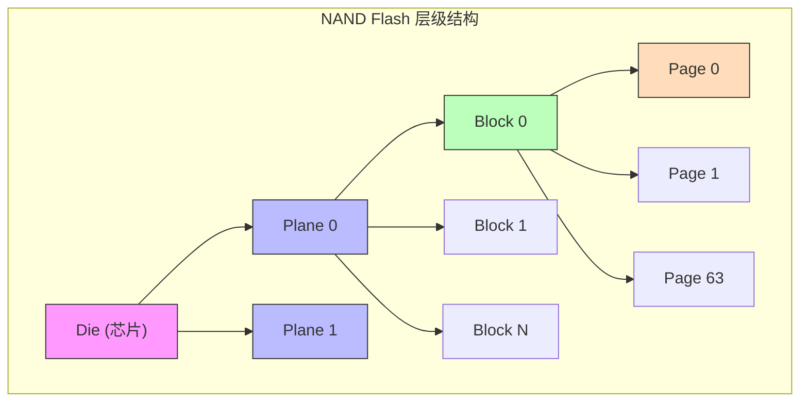
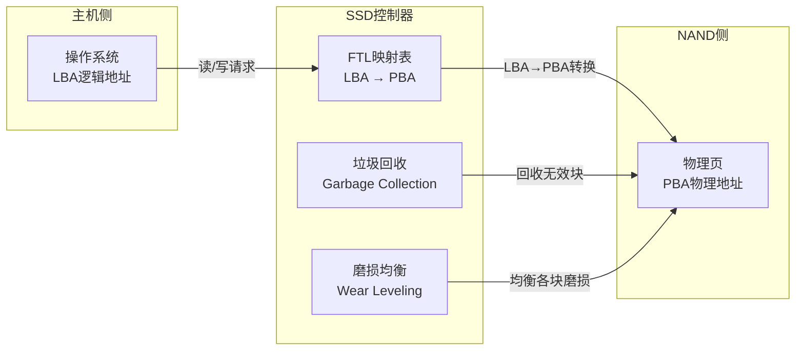
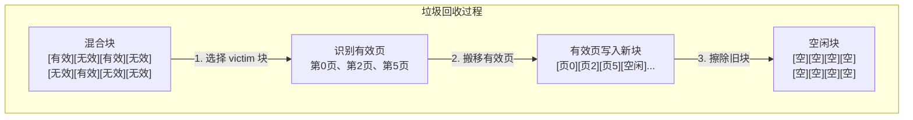
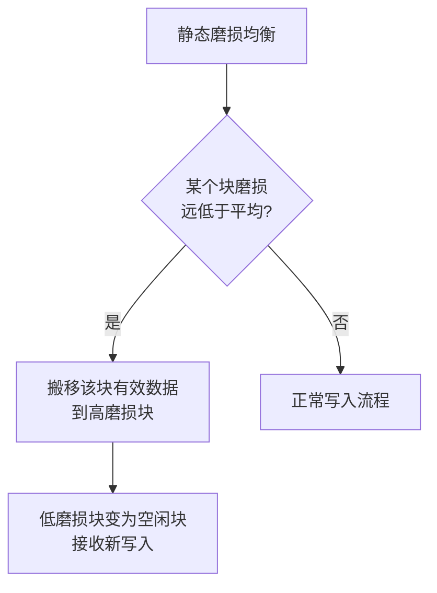
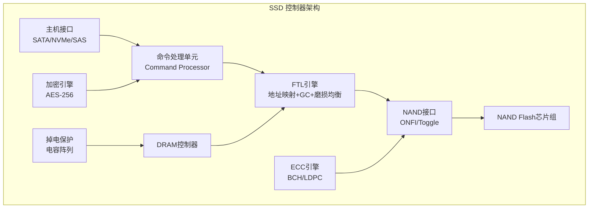
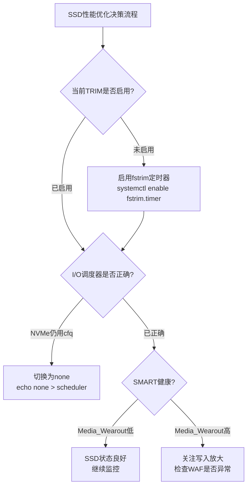

## 技巧2 SSD闪存与FTL映射

SSD（Solid State Drive，固态硬盘）凭借无机械运动部件的特性，在延迟、吞吐量和可靠性上全面超越传统HDD。但SSD的内部工作机制与HDD截然不同——它依赖NAND Flash存储芯片和Flash Translation Layer（FTL，闪存转换层）来完成从逻辑地址到物理地址的映射。理解这套机制，是做好SSD性能调优、寿命管理和故障排查的前提。

---

### 1. NAND Flash基础：从晶体管到存储单元

#### 1.1 浮栅晶体管原理

NAND Flash的最小存储单元是**浮栅晶体管**（Floating Gate Transistor）。与普通MOSFET不同，浮栅晶体管在控制栅（Control Gate）和沟道（Channel）之间增加了一层被绝缘体（Oxide）完全包围的导电层——浮栅（Floating Gate）。浮栅的绝缘层使其能够长期锁住电荷，即使断电后数据也不会丢失，这正是NAND Flash作为非易失性存储器的物理基础。

**写入（编程）过程：** 在控制栅上施加高电压（约15-20V），电子通过量子隧穿效应（Fowler-Nordheim Tunneling）穿越薄氧化层进入浮栅。浮栅中的电子会屏蔽控制栅的电场，使晶体管的阈值电压（Threshold Voltage, Vth）升高。浮栅中捕获的电子越多，Vth越高。编程过程是**逐页顺序进行**的——同一个块内的页必须按从低到高的顺序编程，不能跳页写入。

**擦除过程：** 在基板（Substrate）上施加高电压，电子从浮栅中被拉出，Vth降低。擦除操作以**块为单位**，一次擦除整个块中的所有页。擦除是NAND操作中最耗时的步骤（2-3ms），且对氧化层有较大应力，是限制NAND寿命的主要因素。

**读取过程：** 在控制栅上施加一个参考电压，检测晶体管是否导通。如果Vth高于参考电压则判定为"已编程"（存储了电荷），否则为"已擦除"。读取是NAND操作中最快的，典型延迟在25-75μs之间。

一个存储单元通过控制浮栅中电子的数量，可以呈现多个不同的Vth级别，每个级别对应一个比特组合：

| 类型 | 每单元比特数 | Vth级别数 | 典型制程 | 储存密度 | 耐久度(P/E Cycles) | 读取延迟 | 典型用途 |
|------|------------|----------|---------|---------|-------------------|---------|---------|
| SLC (Single-Level Cell) | 1 bit | 2 | 90-20nm | 1x | 50,000-100,000 | 25μs | 企业级缓存、工业控制 |
| MLC (Multi-Level Cell) | 2 bits | 4 | 70-20nm | 2x | 3,000-10,000 | 50μs | 企业级读密集 |
| TLC (Triple-Level Cell) | 3 bits | 8 | 50-15nm | 3x | 1,000-3,000 | 75μs | 消费级主流 |
| QLC (Quad-Level Cell) | 4 bits | 16 | 50-14nm | 4x | 500-1,000 | 100μs | 大容量冷存储 |
| PLC (Penta-Level Cell) | 5 bits | 32 | 实验阶段 | 5x | ~100 | 未公开 | 尚未量产 |

> **关键认知：** 每增加一个比特，Vth级别数翻倍，级别之间的间距缩小为1/3到1/4。这意味着读取时需要更精确的电压判断，编程时间更长，出错率更高——这是TLC/QLC耐久度和性能下降的根本原因。级别间距缩小还导致了"读取干扰"（Read Disturb）现象：频繁读取某个页会微量改变相邻页的Vth，虽然单次影响极小，但长期积累可能引发位翻转错误。

#### 1.2 NAND的组织层级

NAND Flash芯片内部有严格的层级结构：

Die (芯片)
  └── Plane (平面) × 1-4个
       └── Block (块) × 数千个
            └── Page (页) × 数百个
                 └── Cell (存储单元) × 每页数千个

**关键约束：**

- **读写单位：Page（页）**，典型大小4KB、8KB或16KB。读和写都以页为最小粒度。现代3D NAND的页大小趋向16KB甚至更大。
- **擦除单位：Block（块）**，典型大小256KB-4MB（64-256页）。擦除是NAND操作中最耗时的步骤（2-3ms）。
- **不能原地覆写**：要改写某个页的数据，必须先把整个块的有效数据搬走，擦除整个块，再重新写入。这就是SSD需要FTL的根本原因。
- **块内页必须顺序编程**：不能跳过未编程的页直接写入后面的页，否则可能导致数据损坏。这是NAND的硬件约束，FTL必须遵循。
- **Plane并行操作**：同一个Die内的不同Plane可以独立执行读写操作，FTL可以通过交错调度提升吞吐量。



#### 1.3 3D NAND：从平面到立体

传统2D NAND将存储单元排列在同一平面上，制程缩小到15nm以下后相邻单元间的干扰（Cell-to-Cell Interference）严重影响可靠性。3D NAND（也称V-NAND）将存储单元垂直堆叠，每层一个平面，堆叠层数从早期的24层发展到如今的200+层（如Samsung V-NAND第8代达到236层）。

3D NAND的优势：
- **不需要缩小制程**：每层使用较成熟的工艺，单元尺寸更大，干扰更小
- **堆叠密度线性增长**：增加层数即可提升容量
- **耐久度提升**：更大的单元间距意味着更高的Vth容错余量
- **编程干扰降低**：垂直方向的单元间距比平面方向更易控制

3D NAND面临的挑战：
- **层数越多，制造良率越低**：高深宽比蚀刻（High Aspect Ratio Etch）难度剧增，200+层的蚀刻深度可达8-10μm
- **散热问题**：垂直堆叠导致内部散热路径变长，高负载时核心温度更高
- **单元间串扰**：垂直堆叠引入新的干扰路径，需要更精细的编程干扰抑制算法

#### 1.4 SLC Cache：现代SSD的性能秘密

现代消费级SSD几乎全部使用TLC或QLC颗粒，但它们的原始写入速度很慢（TLC编程延迟约为SLC的3-5倍）。为了兼顾大容量和高性能，厂商普遍采用**SLC Cache（SLC缓存）**技术——将一部分TLC/QLC空间模拟成SLC模式运行，作为高速写入缓冲区。

**工作原理：** SLC模式下每个单元只存储1个bit，Vth只有两个级别，编程速度极快（约为TLC的5-10倍）。SSD控制器在固件中划出一块区域作为SLC Cache，新数据先写入这个区域，待空闲时再将数据从SLC Cache搬移到TLC/QLC的主存储区（这个过程称为"折叠"或"Folding"）。

**两种常见实现：**

| 实现方式 | 描述 | 优势 | 劣势 |
|---------|------|------|------|
| 固定SLC Cache | 从出厂起划出固定容量（如128GB）作为Cache | 性能稳定可预测 | Cache容量小，重度写入时容易耗尽 |
| 动态SLC Cache | 利用空闲的TLC/QLC空间动态充当Cache | Cache容量可变（空盘时最大） | 性能不可预测，写满后Cache缩小甚至消失 |

**实际影响：** 以一款1TB TLC SSD为例，假设动态SLC Cache在空盘时可达200GB。当你顺序写入数据时：

写入 0-200GB：   速度 3,500 MB/s（SLC Cache内）
写入 200-250GB：速度急剧下降到 800-1,200 MB/s（Cache耗尽，直接写TLC + 触发GC）
写入 250GB+：    速度波动在 500-1,500 MB/s（GC在后台持续运行）

这就是为什么很多SSD在持续大文件写入时会出现"先快后慢"的现象。购买SSD时，关注SLC Cache的容量和Cache耗尽后的持续写入速度（稳态速度），比关注峰值速度更有实际意义。

---

### 2. FTL：SSD的灵魂

#### 2.1 为什么需要FTL

如果直接将逻辑块地址（LBA）映射到NAND的物理页地址，会面临两个致命问题：

1. **不能原地覆写**：NAND要求"先擦后写"（Out-of-Place Update），新数据必须写到新的空闲页。
2. **擦除粒度不对齐**：逻辑上修改一个4KB页，物理上需要擦除整个256KB+的块。

FTL（Flash Translation Layer）是一个运行在SSD控制器固件中的软件层，它完成三个核心功能：



- **地址映射（Address Mapping）**：维护逻辑地址到物理地址的映射表，让操作系统看到一个"可以随意覆写"的虚拟块设备
- **垃圾回收（Garbage Collection）**：回收包含无效数据的块，腾出空闲块
- **磨损均衡（Wear Leveling）**：确保所有块的擦除次数均匀分布，最大化SSD整体寿命

此外，FTL还负责**坏块管理（Bad Block Management）**：当某个块因磨损或制造缺陷无法可靠存储数据时，FTL会将其标记为坏块并用预留的替换块取代，对操作系统完全透明。

#### 2.2 地址映射策略

FTL的映射策略决定了SSD的性能特征和内存开销。主要有三种：

**（1）页级映射（Page-level Mapping）**

每个逻辑页映射到一个物理页。映射表的每个条目对应一个页地址。写入新数据时，只需更新映射表中对应LBA的条目指向新的物理页地址，旧物理页被标记为无效。

- 优点：随机读写性能最优，写入灵活度最高
- 缺点：映射表极大。1TB SSD、4KB页大小需要 1TB/4KB × 4B ≈ 1GB 的映射表存储空间
- 适用：企业级SSD（有足够DRAM缓存映射表）

映射表大小计算：
容量 = 1TB = 1,099,511,627,776 bytes
页大小 = 4KB = 4,096 bytes
映射条目数 = 1TB / 4KB = 268,435,456 条
每条目大小 = 4 bytes（PBA地址）
映射表总大小 = 268,435,456 × 4 = 1,073,741,824 bytes ≈ 1GB

**（2）块级映射（Block-level Mapping）**

每个逻辑块映射到一个物理块。映射粒度粗，映射表极小。

- 优点：映射表极小，节省DRAM
- 缺点：随机写性能极差（即使只改一个页也需要整个块的搬移）
- 适用：早期低成本SSD（现已基本淘汰）

**（3）混合映射（Hybrid Mapping）**

结合页级和块级映射的优点，是消费级SSD的主流方案。常见实现方式：

- **日志结构映射（Log-structured Mapping）**：将热数据（频繁修改的数据）以页级映射写入日志块（Log Block），冷数据以块级映射存储在数据块（Data Block）中。当日志块满了，将其中的有效页合并到数据块中。这种设计减少了对NAND的随机写入，将随机写转化为顺序写。
- **懒式映射（Lazy FTL）**：只在块级映射的基础上维护一个小的日志区，减少页级映射表的大小。对于大部分块使用块级映射，只对最近频繁修改的区域使用页级映射。
- **DFTL（Demand-based FTL）**：根据访问频率动态调整映射粒度。热数据使用页级映射缓存在DRAM中，冷数据使用块级映射存储在NAND中。

**映射策略对比：**

| 策略 | 映射表大小(1TB/4KB) | 随机写性能 | 实现复杂度 | 典型应用 |
|------|-------------------|-----------|-----------|---------|
| 页级映射 | ~1GB | ★★★★★ | 中等 | 企业级SSD |
| 块级映射 | ~4MB | ★☆☆☆☆ | 简单 | 早期低成本SSD |
| 混合映射 | 10MB-200MB | ★★★★☆ | 较高 | 消费级SSD |

#### 2.3 映射表的持久化

映射表存在NAND中一个固定位置（通常在每个Plane的最前面几个块），称为映射元数据区。SSD上电时，控制器从NAND中加载映射表到DRAM中。运行时，所有地址转换在DRAM中完成，保证亚微秒级的查表速度。

当SSD断电时，映射表的更新通过**写前日志（Write-Ahead Log）**的方式持久化：每次更新映射表前，先将变更写入NAND的专用日志区。上电恢复时，重放日志即可重建最新的映射表状态。

**映射表缓存优化：** 由于完整的映射表可能超过DRAM容量（大容量SSD尤其如此），FTL通常采用LRU（Least Recently Used）策略，只将最常用的映射条目保留在DRAM中，其余映射存储在NAND中。当访问未缓存的映射条目时，需要从NAND读取，这会增加额外延迟。DRAM越大，缓存命中率越高，随机读性能越好——这也是企业级SSD配备大容量DRAM的原因之一。

---

### 3. 垃圾回收（Garbage Collection）

#### 3.1 为什么需要垃圾回收

由于NAND的"先擦后写"特性，SSD在覆写数据时不会原地修改，而是将新数据写入新的空闲页，并将旧页标记为无效。随着写入的累积，磁盘中会出现大量"混合块"——一个块中既有有效页也有无效页。

垃圾回收（GC）的职责是：回收这些混合块中的有效数据，将它们搬移到其他块中，然后擦除整个块以获得全新的空闲空间。



GC的核心挑战在于：搬移有效页本身会产生额外的NAND写入，这些写入不产生用户价值，纯粹是管理开销。GC效率直接决定了SSD的实际可用性能和寿命。

#### 3.2 GC触发时机

GC通常在以下时机触发：

- **前台GC（Foreground GC）**：当没有足够空闲页进行写入时，控制器被迫立即执行GC。这会造成写入延迟飙升（因为必须等GC完成才能写入），是导致SSD性能抖动的主要原因。用户感知为"写入突然卡顿"。
- **后台GC（Background GC）**：当空闲页数量低于某个阈值但仍有余量时，控制器在空闲期间主动执行GC。性能影响较小，但会消耗少量NAND带宽和功耗。
- **主动GC（Proactive GC）**：一些高端控制器（如Phison E18）会在系统空闲时主动整理碎片化严重的块，预防前台GC的发生。

#### 3.3 Victim块选择算法

GC需要选择哪个混合块来回收。选择算法直接影响SSD的写入放大（Write Amplification）：

- **贪心策略（Greedy）**：选择有效页最少的块。每次搬移的数据量最小，局部最优。缺点是可能忽略某些"有效页少但有效页变化快"的块，导致反复搬移。
- **成本效益策略（Cost-Benefit）**：选择 `（有效页比例 × 块年龄）/ (1 - 有效页比例)` 最小的块。综合考虑了搬移成本和块的冷热程度，对写入放大的控制优于贪心策略。
- **基于RSS（Reclaim Score）的策略**：综合考虑有效页数、擦除次数、最近访问时间等多维度评分。现代SSD控制器通常采用这种多因子综合评分方案。

#### 3.4 写入放大（Write Amplification Factor, WAF）

写入放大是衡量GC效率的核心指标：

WAF = 实际写入NAND的物理数据量 / 主机写入的逻辑数据量

- 理想WAF = 1.0（每次主机写入只导致一次NAND写入）
- 典型WAF = 1.5 - 3.0（消费级SSD在重写入负载下）
- 劣化WAF > 5.0（GC效率低下，SSD性能急剧下降）

高WAF意味着：
- NAND磨损加速，寿命缩短（WAF=3意味着实际磨损是标称寿命的3倍）
- 带宽被GC占用，用户可用带宽下降
- 延迟增加（前台GC导致写入阻塞）

**影响WAF的关键因素：**

| 因素 | 低WAF（有利） | 高WAF（不利） |
|------|-------------|-------------|
| 空闲空间比例 | OP空间充足，可用块多 | 磁盘几乎写满，可用块极少 |
| 写入模式 | 顺序写入，整块覆写 | 随机写入，大量小文件更新 |
| 数据局部性 | 热数据集中在少数块 | 冷热数据混杂在同一块中 |
| GC算法质量 | 智能victim选择+冷热分离 | 简单贪心策略 |
| TRIM支持 | 文件系统发送TRIM通知 | 无TRIM，GC需猜测无效页 |

---

### 4. 磨损均衡（Wear Leveling）

#### 4.1 均衡的必要性

每个NAND块的擦除次数是有限的（SLC约10万次，TLC约3000次）。如果某些块被反复擦写而其他块几乎不动，SSD会在部分块耗尽寿命后整体失效，即使总容量中大部分块仍然健康。

考虑一个极端例子：一个SSD有1000个块，其中200个块被频繁擦写（如日志文件、Swap分区），800个块几乎不动。如果200个块在3000次P/E后耗尽，SSD就会报坏块，尽管800个块还几乎全新。没有磨损均衡，SSD的有效寿命可能只有理论值的20%。

磨损均衡的目标是：让所有块的擦除次数尽可能均匀，最大化SSD的整体使用寿命。

#### 4.2 两大类均衡策略

**（1）动态磨损均衡（Dynamic Wear Leveling）**

只在空闲块中选择擦除次数最低的块来接收新写入。实现简单，但无法保证长期均衡——如果某个块一直被用作"热数据"，它的擦除次数会持续上升。

适用场景：写入量较小、数据分布较均匀的轻度负载。

**（2）静态磨损均衡（Static Wear Leveling）**

除了动态均衡外，还会定期检查：如果某个块的擦除次数远低于平均值，将其有效数据搬到擦除次数较高的块中，然后用低磨损块来接收新的写入。这保证了长期的均衡性。



适用场景：写入量大、有明显冷热数据差异的重度负载。

#### 4.3 磨损均衡的开销

静态均衡需要额外的数据搬移，这些搬移本身也会消耗NAND寿命。优秀的实现会控制搬移频率，确保均衡带来的寿命增益远大于搬移造成的额外磨损。一般来说，静态均衡的搬移开销控制在总写入量的1-3%以内。

#### 4.4 磨损均衡与GC的协同

磨损均衡和GC在实际运行中是**协同工作**的：GC负责回收无效块，而磨损均衡在GC选择目标块时介入——即使某个空闲块擦除次数最低，如果搬移开销过大，均衡算法可能会选择次优但均衡效果更好的块。这种协同是现代SSD固件的核心竞争力之一，不同厂商的实现差异显著。

---

### 5. 过量配置（Over-Provisioning）

#### 5.1 什么是OP

SSD控制器会保留一部分NAND容量，不暴露给主机。这部分隐藏容量称为Over-Provisioning（OP，过量配置）。

物理NAND容量 = 用户可见容量 + OP空间
典型比例：物理NAND 128GB → 用户可见 120GB（OP ≈ 6.25%）
企业级：物理NAND 400GB → 用户可见 200GB（OP = 50%）

OP的存在有三个来源：
1. **二进制/十进制换算差异**：厂商用1GB = 1,000,000,000 bytes计算，操作系统用1GiB = 1,073,741,824 bytes计算。1TB SSD实际可用约931GiB，这部分"差额"约7%自然形成OP。
2. **固件预留**：控制器额外保留的容量，用于坏块替换、元数据存储、GC缓冲等。
3. **用户手动配置**：部分企业级SSD支持用户自定义OP比例。

#### 5.2 OP的作用

1. **为GC提供缓冲**：GC需要搬移有效页，搬移到哪里？OP空间提供了额外的写入目标，避免在用户空间中与正常写入竞争。
2. **降低写入放大**：更多的空闲块意味着GC可以更高效地选择低有效页比例的块来回收。
3. **提升写入性能**：更多空闲页减少了前台GC的触发频率。
4. **延长寿命**：OP相当于增加了总擦写次数预算——更多的物理块分摊相同的用户写入量，每个块的平均擦除次数降低。

#### 5.3 OP效果量化

| OP比例 | 空盘可用块比例 | GC效率 | 适用场景 |
|-------|-------------|-------|---------|
| 7%（默认） | 中等 | 一般 | 轻度办公 |
| 15-20% | 较高 | 良好 | 开发工作站 |
| 28-50% | 充足 | 优秀 | 企业数据库 |
| 用户手动增加 | 视分区策略 | 可优化 | 按需调整 |

#### 5.4 手动增加OP

用户可以通过以下方式增加有效的OP空间：

```bash
# 方式一：不使用SSD的全部容量（最直接但浪费）
# 在分区时故意少分配50-100GB，剩余空间作为隐式OP

# 方式二：通过TRIM回收已删除文件占用的NAND块
# 查看当前磁盘使用情况
lsblk -o NAME,SIZE,USED,AVAIL,MOUNTPOINT

# 对整个磁盘执行TRIM（回收已删除文件占用的NAND块）
sudo fstrim -v /

# 定期自动TRIM（编辑fstab添加discard选项）
# /dev/sda1  /  ext4  defaults,discard  0 1

# 或使用systemd定时器（推荐，避免实时TRIM的性能影响）
sudo systemctl enable --now fstrim.timer
```

---

### 6. TRIM/DISCARD机制

#### 6.1 为什么需要TRIM

当操作系统删除文件或格式化分区时，文件系统标记这些空间为"空闲"，但不会通知SSD。SSD控制器仍然认为这些页是有效的——只有在GC时才会发现它们可以回收。这导致两个问题：

1. GC效率低下：搬移大量实际上已经无用的数据，浪费带宽和NAND寿命
2. 可用空间虚高：SSD报告有空间可用，但实际空闲NAND块不足

TRIM命令允许文件系统告诉SSD："这些LBA地址对应的数据已经不再使用了。"SSD收到TRIM后，可以立即将对应页标记为无效，大幅提升GC效率。

#### 6.2 TRIM的三种实现模式

| 模式 | 命令 | 行为 | 性能影响 | 推荐场景 |
|------|------|------|---------|---------|
| 实时TRIM | mount -o discard | 每次删除文件立即发送TRIM | 有延迟开销（每次删除操作多一次额外命令） | 快速SSD、不需要极致性能 |
| 延迟TRIM | fstrim命令 | 定期批量发送TRIM | 一次性开销，平时无影响 | 推荐方案，兼顾性能和空间回收 |
| 禁用TRIM | 不发送任何TRIM | SSD完全靠GC管理空间 | 最低延迟（不推荐） | 不推荐，长期影响性能和寿命 |

```bash
# 检查当前文件系统是否启用了discard
mount | grep sda

# 推荐方案：使用fstrim定时器
# 检查定时器状态
systemctl status fstrim.timer

# 手动执行一次全盘TRIM
sudo fstrim -av

# 输出示例：
# /: 42 GiB (45,120,307,200 bytes) trimmed
# /home: 156 GiB (167,578,025,984 bytes) trimmed
```

#### 6.3 TRIM与RAID的兼容性

TRIM在某些RAID配置中存在兼容性问题：

| RAID级别 | TRIM支持情况 | 说明 |
|---------|-------------|------|
| RAID 0 | ✅ 完全支持 | 条带化写入，TRIM可直接映射到各成员盘 |
| RAID 1 | ✅ 完全支持 | 镜像写入，TRIM同步到两块盘 |
| RAID 5 | ⚠️ 部分支持 | 需要mdadm 3.3+，RAID 5的奇偶校验使TRIM处理更复杂 |
| RAID 6 | ⚠️ 部分支持 | 同RAID 5 |
| 硬件RAID | ⚠️ 视控制器固件 | 部分老RAID卡不支持透传TRIM |

```bash
# 检查mdadm软件RAID是否支持TRIM
sudo mdadm --detail /dev/md0 | grep -i trim
# 或检查内核版本（Linux 4.2+对md RAID TRIM支持较好）

# 在md RAID上测试TRIM
sudo fstrim -v /mountpoint
```

#### 6.4 TRIM对大容量SSD的特殊考量

大容量SSD（2TB+）的TRIM操作可能耗时较长（数秒到数十秒）。在这期间如果触发大量写入，可能导致性能抖动。建议在系统负载低谷时段（如凌晨）通过cron定时执行fstrim。

---

### 7. SSD磨损寿命计算

#### 7.1 TBW（Total Bytes Written）

TBW是厂商承诺的SSD总写入量（单位TB），超过此值后SSD不再保证数据完整性。TBW与NAND类型、容量、OP比例和控制器算法相关：

| SSD型号级别 | 容量 | NAND类型 | 典型TBW | 日均10GB可使用 |
|------------|------|---------|---------|--------------|
| 入门级消费 | 500GB | TLC | 300 TBW | 82年 |
| 主流消费 | 1TB | TLC | 600 TBW | 164年 |
| 高端消费 | 2TB | TLC | 1,200 TBW | 164年 |
| 企业级读密集 | 1.6TB | TLC | 1,000-3,000 TBW | 68-205年 |
| 企业级写密集 | 800GB | MLC | 10,000-20,000 TBW | 685-1369年 |

#### 7.2 估算SSD剩余寿命

```bash
# 安装smartmontools
sudo apt-get install -y smartmontools

# 查看SSD健康信息（需要SMART支持）
sudo smartctl -a /dev/sda

# 关键字段解读：
# 241 Total_LBAs_Written   → 总共写入的LBA数量
# 242 Total_LBAs_Read      → 总共读取的LBA数量
# 233 Media_Wearout_Indicator → 磨损指标（100=新，0=报废）

# 计算已用寿命百分比
# 已写入TB = Total_LBAs_Written × 512 / (1024^4)
# 已用寿命 = 已写入TB / TBW × 100%
```

**实际smartctl输出示例：**

=== START OF READ SMART DATA SECTION ===
SMART Attributes Data Structure revision number: 1
Vendor Specific SMART Attributes with Thresholds:
ID# ATTRIBUTE_NAME          FLAG     VALUE WORST THRESH TYPE      UPDATED  WHEN_FAILED RAW_VALUE
  5 Reallocated_Sector_Ct   0x0033   100   100   010    Pre-fail  Always       -       0
  9 Power_On_Hours          0x0032   098   098   000    Old_age   Always       -       1536
 12 Power_Cycle_Count       0x0032   099   099   000    Old_age   Always       -       187
173 Wear_Leveling_Count     0x0033   097   097   000    Pre-fail  Always       -       245
177 Wear_Estimate_Remain_Pct 0x0033 095   095   000    Pre-fail  Always       -       95
233 Media_Wearout_Indicator 0x0033   095   095   000    Pre-fail  Always       -       95
241 Total_LBAs_Written     0x0032   000   000   000    Old_age   Always       -       4294967295
242 Total_LBAs_Read        0x0032   000   000   000    Old_age   Always       -       2147483648

**字段解读：**
- `Media_Wearout_Indicator = 95`：SSD已消耗约5%的总寿命，还剩95%
- `Wear_Leveling_Count = 245`：均衡计数器，值越高表示磨损越均匀
- `Total_LBAs_Written = 4,294,967,295`：已写入 4,294,967,295 × 512B ≈ 2TB

```bash
# 使用脚本自动计算
echo "=== SSD 寿命估算 ==="
# 获取写入的LBA总数
LBA_WRITTEN=$(sudo smartctl -A /dev/sda | awk '/241/{print $10}')
if [ -n "$LBA_WRITTEN" ]; then
    TB_WRITTEN=$(echo "scale=2; $LBA_WRITTEN * 512 / 1099511627776" | bc)
    echo "已写入: ${TB_WRITTEN} TB"
    echo "请对照您SSD型号的TBW值计算剩余寿命"
    echo "公式: 已用寿命 = ${TB_WRITTEN} / TBW × 100%"
fi
```

#### 7.3 日常使用中SSD的实际寿命

以1TB消费级SSD（TBW=600TB）为例，假设每天平均写入量：

| 使用场景 | 日均写入量 | 预计使用年限 |
|---------|-----------|-------------|
| 轻度办公（文档、浏览） | 5-10 GB/天 | 164-328 年 |
| 中度开发（编译、虚拟机） | 20-50 GB/天 | 33-82 年 |
| 重度使用（视频编辑、数据库） | 100-200 GB/天 | 8-16 年 |
| 企业数据库（高写入） | 500GB-1TB/天 | 1.6-3.2 年 |

> **结论：** 对于绝大多数消费级用户，SSD的实际寿命远超计算机本身的使用寿命。无需过度担忧SSD磨损，但仍应关注写入放大异常导致的非预期磨损加速。

---

### 8. 实操：Linux下监控和优化SSD

#### 8.1 识别SSD并确认TRIM状态

```bash
# 列出所有块设备，查看旋转状态（SSD为0，HDD为1）
lsblk -d -o NAME,ROTA,SIZE,MODEL
# 或
cat /sys/block/sda/queue/rotational   # 0=SSD, 1=HDD

# 检查TRIM是否支持
sudo hdparm -I /dev/sda | grep TRIM
# 输出中 "TRIM supported" 表示支持

# 检查文件系统是否启用了discard
mount | grep "iscard"

# 检查fstrim定时器是否运行
systemctl status fstrim.timer
```

#### 8.2 实时监控SSD I/O性能

```bash
# 安装sysstat工具包
sudo apt-get install -y sysstat

# 使用iostat监控SSD的I/O指标（每秒刷新）
iostat -x /dev/sda 1

# 关键指标解读：
# r/s, w/s      — 每秒读/写请求数（IOPS）
# rkB/s, wkB/s  — 每秒读/写吞吐量
# await         — 平均I/O等待时间（毫秒），SSD应 < 1ms
# svctm         — 平均服务时间
# %util         — 设备利用率，接近100%说明I/O饱和

# 使用iotop监控哪个进程在产生I/O
sudo iotop -oP

# 查看SSD队列深度
cat /sys/block/sda/queue/nr_requests
cat /sys/block/sda/queue/scheduler
```

#### 8.3 SSD内核参数优化

```bash
# 查看当前调度器
cat /sys/block/sdX/queue/scheduler
# SSD推荐：none（绕过IO调度器，直接下发）或 mq-deadline

# 临时切换调度器
echo none | sudo tee /sys/block/sda/queue/scheduler

# 永久设置（udev规则）
cat << 'EOF' | sudo tee /etc/udev/rules.d/60-ssd-scheduler.rules
# 为SSD设置none调度器
ACTION=="add|change", KERNEL=="sd[a-z]", ATTR{queue/rotational}=="0", ATTR{queue/scheduler}="none"
# 为HDD设置mq-deadline调度器
ACTION=="add|change", KERNEL=="sd[a-z]", ATTR{queue/rotational}=="1", ATTR{queue/scheduler}="mq-deadline"
EOF

# 优化队列深度（默认128，可适当增大以提升并发）
echo 256 | sudo tee /sys/block/sda/queue/nr_requests

# 禁用add_random（减少对熵池的消耗，SSD不涉及机械延迟）
echo 0 | sudo tee /sys/block/sda/queue/add_random

# 禁用read-ahead（对随机读为主的负载有帮助）
sudo blockdev --setra 0 /dev/sda
```

#### 8.4 NVMe SSD专用监控

```bash
# 安装nvme-cli工具
sudo apt-get install -y nvme-cli

# 查看NVMe SSD健康信息
sudo nvme smart-log /dev/nvme0

# 关键字段：
# temperature       — 温度（Kelvin）
# available_spare   — 可用备用块百分比（应 > 10%）
# percentage_used   — 已使用寿命百分比
# data_units_written — 写入的数据单元数（×512KB = 总写入量）
# media_errors      — 媒体错误数（应为0）

# 查看NVMe控制器信息
sudo nvme id-ctrl /dev/nvme0

# 查看NVMe命名空间信息
sudo nvme id-ns /dev/nvme0

# 查看NVMe温度日志
sudo nvme smart-log /dev/nvme0 | grep -i temp
```

**NVMe smart-log 输出解读示例：**

Smart Log for NVMe device nvm0n1
critical_warning    : 0
temperature         : 318 Kelvin (45 Celsius)
available_spare     : 100%
available_spare_threshold : 10%
percentage_used     : 1%
endurance group warning   : 0
data_units_read     : 125,829,120
data_units_written  : 83,886,080
host_reads          : 2,048,576
host_writes         : 1,024,288
controller_busy_time: 15,360
power_cycles        : 187
power_on_hours      : 1,536
unsafe_shutdowns    : 0
media_errors        : 0
num_err_log_entries : 0
warning_temp_time   : 0
critical_comp_time  : 0

解读要点：
- `percentage_used = 1%`：已消耗1%的设计寿命，还有99%
- `available_spare = 100%`：备用块全部可用，没有坏块替换发生
- `media_errors = 0`：无媒体错误，NAND健康
- `unsafe_shutdowns = 0`：无异常断电，映射表完整性有保障
- `data_units_written = 83,886,080`：已写入 83,886,080 × 512KB ≈ 40TB

#### 8.5 SSD性能基准测试

```bash
# 使用fio进行专业级基准测试
sudo apt-get install -y fio

# 顺序读测试
fio --name=seq_read --ioengine=libaio --direct=1 --bs=128k \
    --rw=read --size=4G --numjobs=1 --runtime=30 --group_reporting

# 顺序写测试
fio --name=seq_write --ioengine=libaio --direct=1 --bs=128k \
    --rw=write --size=4G --numjobs=1 --runtime=30 --group_reporting

# 随机读IOPS测试（4KB块大小，模拟数据库场景）
fio --name=rand_read_4k --ioengine=libaio --direct=1 --bs=4k \
    --rw=randread --size=4G --numjobs=4 --iodepth=32 \
    --runtime=30 --group_reporting

# 随机写IOPS测试（4KB块大小）
fio --name=rand_write_4k --ioengine=libaio --direct=1 --bs=4k \
    --rw=randwrite --size=4G --numjobs=4 --iodepth=32 \
    --runtime=30 --group_reporting

# 混合读写测试（70%读/30%写，模拟真实负载）
fio --name=mixed_rw --ioengine=libaio --direct=1 --bs=4k \
    --rw=randrw --rwmixread=70 --size=4G --numjobs=4 \
    --iodepth=32 --runtime=30 --group_reporting

# SLC Cache耗尽测试（持续写入直到性能下降）
fio --name=slc_cache_test --ioengine=libaio --direct=1 --bs=128k \
    --rw=write --size=256G --numjobs=1 --runtime=600 --group_reporting
```

**fio输出关键指标：**

rand_read_4k: (groupid=0, jobs=4): err= 0:
  read: IOPS=1024K, BW=3922MiB/s (4112MB/s)
   ↑↑↑   ↑↑↑        ↑↑↑
   错误   IOPS      吞吐量

**典型SSD性能参考值（NVMe Gen4）：**

| 测试项 | 入门级SATA | 中端NVMe | 高端NVMe Gen4 | 旗舰NVMe Gen5 |
|--------|-----------|---------|--------------|--------------|
| 顺序读 | 550 MB/s | 3,500 MB/s | 7,000 MB/s | 12,000 MB/s |
| 顺序写 | 520 MB/s | 3,000 MB/s | 5,500 MB/s | 10,000 MB/s |
| 随机读IOPS | 90K | 500K | 1,000K | 1,500K |
| 随机写IOPS | 80K | 400K | 800K | 1,200K |
| 4K随机读延迟 | 80μs | 20μs | 12μs | 8μs |

---

### 9. 常见误区与纠正

#### 误区1：SSD不需要碎片整理

**部分正确。** SSD没有机械寻道延迟，碎片不会影响读取性能。但频繁碎片整理会加速SSD磨损（大量不必要的写入）。现代Linux内核会自动检测SSD并对碎片整理做差异化处理（`e4defrag`对SSD跳过不必要的搬移）。**正确做法：不对SSD执行传统碎片整理，依赖TRIM回收空间。**

#### 误区2：SSD会突然死亡，数据无法恢复

**夸大了。** SSD的磨损是渐进式的，SMART的`Media_Wearout_Indicator`会提前预警。现代SSD还有预留空间作为坏块替换（Bad Block Replacement）。真正导致SSD突然故障的原因通常是控制器固件Bug或突然断电（掉电保护机制不完善的低端SSD）。

**数据恢复的特殊性：** SSD的数据恢复比HDD更困难。HDD可以开盘读取磁碟，而SSD的数据分布在多个NAND芯片中，且经过FTL的地址映射和GC的多次搬移，原始数据很难重建。此外，TRIM命令会立即擦除标记的数据，一旦发送就无法恢复。**正确做法：依赖SMART监控，定期备份关键数据，使用带掉电保护的企业级SSD存储关键数据。不要依赖"数据恢复"作为最后防线。**

#### 误区3：SSD写满后会立刻变慢

**不完全准确。** 当空闲块数量低于GC触发阈值时，SSD会进入"降速模式"——每次写入都需要先完成GC才能腾出空间。但这不是"写满"瞬间发生的，而是一个渐进过程。具体表现取决于SLC Cache大小和GC效率。**正确做法：保持至少10-20%的可用空间（包括OP和用户剩余空间），避免SSD进入降速区间。**

#### 误区4：关闭Swap可以延长SSD寿命

**值得商榷。** 关闭Swap确实减少了对SSD的写入量，但在内存不足时会导致OOM Killer杀进程或严重卡顿。现代Linux的`swappiness`参数（默认60）已经足够保守。而且SSD的随机读写性能远超HDD，Swap在SSD上的性能体验远好于HDD。**正确做法：保持Swap开启，适当降低swappiness（如`vm.swappiness=10`），优先让系统使用物理内存。对于数据库等有大量缓存的场景，可以考虑使用RAM盘存放Swap。**

#### 误区5：fio测试成绩等于实际性能

**不准确。** fio的测试结果是特定条件下的峰值性能。实际工作负载中，SSD性能受以下因素影响：
- 稳态性能（持续写入后性能会下降到稳态值，远低于新盘的爆发性能）
- 写入放大导致的GC开销
- 热量导致的降频（NVMe SSD在高负载下过热会触发热节流Thermal Throttling）
- 映射表缓存命中率
- SLC Cache耗尽后的降速

**正确做法：以稳态性能为参考基准，不要被厂商标称的峰值性能误导。测试时先用大容量数据填满SLC Cache再观察持续写入速度。**

---

### 10. 进阶：SSD控制器内部架构

#### 10.1 控制器核心组件

现代SSD控制器本质上是一个嵌入式SoC（System on Chip），包含：



- **命令处理单元**：解析和调度主机I/O命令，支持NCQ（Native Command Queuing）和多队列并行处理
- **FTL引擎**：执行地址映射、GC、磨损均衡。是控制器的"大脑"，其算法质量直接决定SSD性能和寿命
- **DRAM控制器**：管理映射表缓存和数据缓冲区。企业级SSD通常配备512MB-4GB DRAM
- **ECC引擎**：BCH或LDPC纠错码，修复NAND读取错误。现代SSD使用LDPC可纠正高达72-100 bits/1KB的错误
- **加密引擎**：硬件加速AES-256全盘加密（SED，Self-Encrypting Drive），对性能几乎无影响
- **掉电保护**：电容阵列在断电时提供足够电力，将DRAM中的映射表和缓冲数据刷入NAND

#### 10.2 LDPC纠错码的重要性

随着3D NAND层数增加，存储单元的Vth分布变得更宽、更模糊，原始误码率（Raw Bit Error Rate）上升。传统的BCH纠错码只能纠正有限数量的错误（典型为24-40 bits/1KB），而LDPC（Low-Density Parity-Check）码可以：

- 通过多次软判决读取（Soft-decision Read）纠正更多错误（最高72-100 bits/1KB）
- 采用渐进式纠错：先用硬判决快速解码，失败后再用软判决精确解码
- 与RAID-like的NAND内部数据保护机制配合使用
- 在SSD接近寿命极限时仍能维持数据完整性

LDPC的代价是解码延迟略高（需要更多计算周期），但在现代控制器的专用硬件加速下，对用户体验几乎没有影响。

#### 10.3 掉电保护（Power Loss Protection）

消费级SSD通常只有少量电容保护映射表的DRAM缓存。企业级SSD则有完整的掉电保护方案：

- **大容量钽电容阵列**：在断电后提供足够电力（通常5-20ms），将DRAM中所有脏数据（包括FTL映射表和写缓存数据）刷入NAND
- **保证数据完整性**：不仅保护映射表，还保护主机写入但尚未持久化到NAND的数据
- **写缓存策略差异**：企业级SSD在掉电保护下可以安全地使用Write-back模式（先写DRAM，再批量刷入NAND），大幅提升写入性能。消费级SSD通常只能使用Write-through模式（数据必须写入NAND后才向主机确认），性能较低

**如何判断SSD是否有掉电保护：** 查看规格书中的"Power Loss Protection"字段。消费级SSD中，Samsung 990 Pro、WD Black SN850X等高端型号通常有部分掉电保护（保护映射表但不保护写缓存），而企业级SSD如Samsung PM9A3、Intel D7-P5620则有完整的掉电保护方案。

---

### 11. 前沿：NVMe ZNS与未来方向

#### 11.1 ZNS（Zoned Namespace）概述

传统SSD的FTL是一个不透明的"黑盒"——主机无法控制数据在NAND上的物理放置位置，这导致了写入放大和性能不可预测等问题。NVMe ZNS（Zoned Namespace）协议将NAND的块/页结构部分暴露给主机，让文件系统或应用直接感知NAND的物理特性。

**核心思想：** 将SSD的命名空间划分为多个"Zone"（区域），每个Zone必须顺序写入、整体擦除。这与NAND Flash的物理约束完全一致，消除了FTL内部的GC和数据搬移。

传统SSD:    主机 → [不透明FTL] → NAND（FTL自行管理GC/WL）
ZNS SSD:    主机 → [感知Zone的文件系统] → NAND（主机协助管理）

#### 11.2 ZNS的优势

| 特性 | 传统SSD | ZNS SSD |
|------|---------|---------|
| 写入放大 | 1.5-5x | ~1.0x |
| GC开销 | 显著 | 几乎消除 |
| 延迟可预测性 | 差（GC抖动） | 好（确定性延迟） |
| OP需求 | 6-50% | 极低（<5%） |
| 磨损均衡 | 控制器负责 | 主机+控制器协同 |
| 适用场景 | 通用存储 | 大规模数据存储（Ceph、对象存储） |

#### 11.3 ZNS的适用场景

ZNS目前主要应用于大规模数据中心场景，如：
- **Ceph/对象存储**：数据天然按块写入，完美匹配Zone语义
- **日志结构文件系统**：如f2fs、btrfs的写入模式天然适合ZNS
- **数据库WAL**：顺序写入的日志文件直接映射到Zone

消费级ZNS SSD（如WD ZN540）已有产品但尚未普及，主要原因是需要应用层适配（修改文件系统或使用ZoneFS），生态成熟度不足。但随着QLC的普及和写入放大问题的加剧，ZNS或类似技术（如FDP - Flexible Data Placement）将成为SSD发展的重要方向。

---

### 12. 本节小结

SSD的核心秘密在于FTL这个"翻译层"——它将操作系统的逻辑地址空间映射到NAND Flash的物理地址空间，同时通过垃圾回收、磨损均衡和过量配置等机制，克服了NAND Flash"不能原地覆写"和"擦除粒度大"这两个根本限制。

| 核心机制 | 解决的问题 | 关键指标 |
|---------|-----------|---------|
| FTL地址映射 | LBA→PBA转换，支持原地覆写假象 | 映射表大小，查表延迟 |
| 垃圾回收(GC) | 回收无效页，释放空闲块 | 写入放大(WAF) |
| 磨损均衡 | 均衡各块擦除次数，延长整体寿命 | 最大/最小擦除次数比 |
| 过量配置(OP) | 为GC提供缓冲，降低WAF | OP比例(6%-50%) |
| TRIM | 通知SSD哪些数据已删除 | 空间回收效率 |
| SLC Cache | 缓冲写入，提升突发写入性能 | Cache大小、稳态速度 |



在Linux运维中，SSD优化的核心三件事：
1. **确保TRIM正常工作**（fstrim定时器 > fstab discard > 不用TRIM）
2. **使用正确的I/O调度器**（NVMe用none，SATA用none或mq-deadline）
3. **监控SMART健康指标**（定期检查wearout indicator和media_errors）

选购SSD时的关键认知：
1. **峰值速度不是全部**——关注SLC Cache耗尽后的稳态写入速度
2. **TBW是参考而非绝对值**——正常使用的磨损远低于标称值
3. **企业级vs消费级的核心差异**——掉电保护和持续写入性能，而非标称速度
4. **3D NAND层数不是越多越好**——层数增加带来容量但可能影响耐久度
