## 技巧3 NVMe协议与队列模型

NVMe（Non-Volatile Memory Express）是专为闪存存储设计的主机-设备通信协议，通过PCIe总线直连CPU，绕过了传统SATA/AHCI软件栈，将存储I/O延迟从百微秒级压缩到个位数微秒级。本技巧将从NVMe的协议架构出发，深入剖析队列模型的每一个设计细节，覆盖从命令提交到完成中断的全链路机制，并给出从命令行工具到内核调优的完整实操指南。

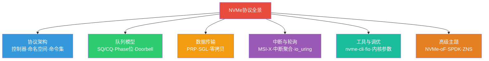

---

### 1. NVMe协议架构速览

在深入队列模型之前，先快速回顾NVMe的整体架构，为后续内容建立上下文。

#### 1.1 从AHCI到NVMe的演进

传统SATA接口使用AHCI（Advanced Host Controller Interface）命令集，最初为HDD设计。AHCI只有1个命令队列、每个队列深度32条命令，软件栈经过多层抽象（SCSI层→AHCI驱动→SATA控制器），每次I/O都需要多次上下文切换和中断处理。

NVMe从根本上重新设计了存储协议栈：

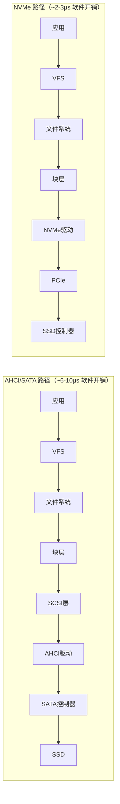

核心差异对比：

| 特性 | AHCI/SATA | NVMe | 提升倍数 |
|------|-----------|------|----------|
| 最大队列数 | 1 | 65,535 | 65,535× |
| 每队列深度 | 32 | 65,536 | 2,048× |
| 命令大小 | 32字节 | 64字节 | 2× |
| 最大带宽 | ~600 MB/s | ~7 GB/s（PCIe 4.0 x4） | ~12× |
| 软件栈延迟 | ~6-10μs | ~2-3μs | ~3× |
| 中断模式 | 每命令中断 | 批量中断/轮询 | — |
| CPU效率 | 每命令需多次上下文切换 | 内存映射，零拷贝 | — |
| 电源状态 | 有限（APM） | 5种L0-L5精细管理 | — |
| 多路径 | 无原生支持 | 原生多路径I/O | — |

这些数字背后的本质原因：AHCI是为**低速机械硬盘**设计的——HDD的寻道延迟在毫秒级，软件栈的几微秒开销微不足道。但NVMe SSD的硬件延迟已经压缩到微秒级，软件栈的每一微秒都变得至关重要。NVMe的设计哲学是：**让软件路径的延迟与硬件延迟处于同一量级**。

#### 1.2 NVMe命名空间与控制器

NVMe设备通过**控制器（Controller）**连接到主机。每个NVMe控制器管理一个或多个**命名空间（Namespace）**，命名空间类似于SCSI的LUN，是主机可见的独立逻辑存储单元。

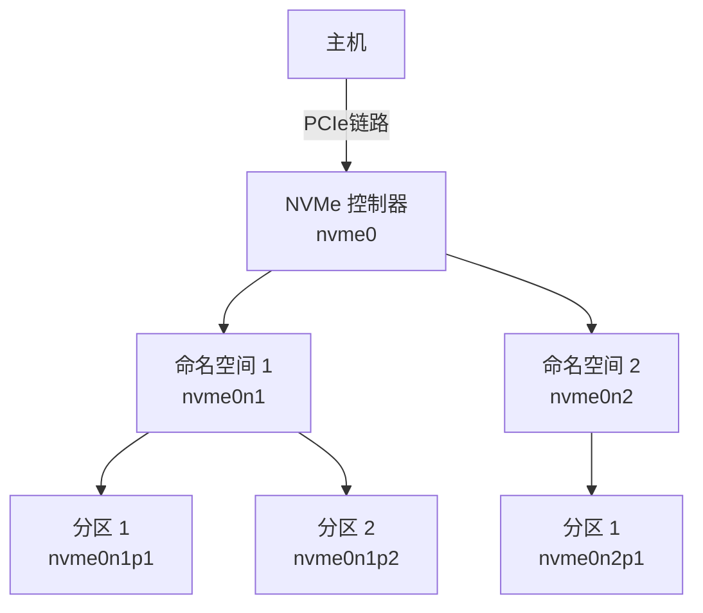

```bash
# 查看系统中的NVMe控制器
ls /dev/nvme*
# /dev/nvme0 /dev/nvme0n1 /dev/nvme0n1p1 /dev/nvme0n1p2
# 其中 nvme0 是控制器, n1 是命名空间, p1/p2 是分区
```

```bash
# 查看控制器详细信息
nvme id-ctrl /dev/nvme0
# 输出包含：型号、序列号、固件版本、最大队列数、最大数据传输大小等

# 查看命名空间信息
nvme id-ns /dev/nvme0n1
# 输出包含：容量、LBA格式、元数据大小、最佳I/O大小等
```

#### 1.3 NVMe功能子集

NVMe规范定义了多个命令集：

- **NVM命令集**：核心的数据读写命令（Flush、Read、Write、Compare等）
- **管理命令集**：设备管理（创建/删除命名空间、固件升级、SMART健康信息、自检等）
- **I/O命令集**：可扩展的命令集合，如Zoned Namespace（ZNS）、Key-Value、Attachments等

每个命令集通过**命令集标识符（Command Set Identifier, CSI）**区分，允许在同一个NVMe控制器上运行不同类型的工作负载。

---

### 2. 队列模型深度解析

NVMe队列模型是其高性能的核心所在。理解SQ/CQ对的工作机制，是从根本上优化NVMe存储性能的前提。

#### 2.1 提交队列与完成队列（SQ/CQ）

NVMe采用**内存中环形队列**作为主机与设备之间的通信机制。每对队列由一个提交队列（Submission Queue, SQ）和一个完成队列（Completion Queue, CQ）组成：

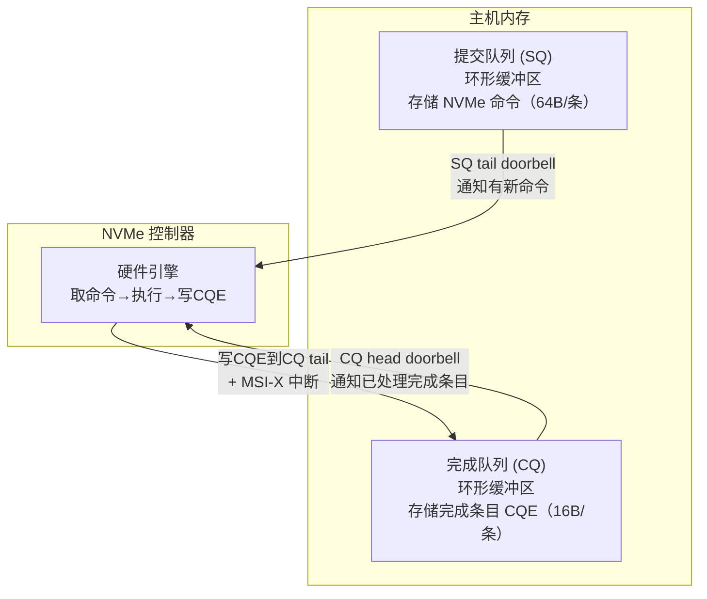

队列的关键属性：

| 属性 | 提交队列 (SQ) | 完成队列 (CQ) |
|------|-------------|-------------|
| 条目大小 | 64字节（NVMe命令） | 16字节（完成条目CQE） |
| 生产者 | 主机（写命令） | 控制器（写CQE） |
| 消费者 | 控制器（取命令） | 主机（读CQE） |
| Doorbell | tail doorbell（通知新命令） | head doorbell（通知已处理） |
| Phase位 | 无 | 有（用于同步） |

NVMe规范支持两类队列：

- **Admin队列**：唯一，用于设备管理命令（创建命名空间、SMART查询、固件升级等）。所有NVMe控制器必须支持一个Admin SQ/CQ对。
- **I/O队列**：多个，用于数据读写命令。队列数量由控制器能力决定，理论上最多65,535个，实际通常等于CPU核心数（受`io_queues`模块参数控制）。

```bash
# 查看NVMe控制器支持的最大队列数
nvme id-ctrl /dev/nvme0 | grep -E "^sq |^cq "
# sq 64  ← 最大I/O提交队列数
# cq 64  ← 最大I/O完成队列数

# 查看内核实际创建的队列数（受CPU核心数限制）
ls /sys/block/nvme0n1/mq/ | wc -l
```

#### 2.2 命令提交的完整流程

一个完整的NVMe I/O操作涉及以下步骤：

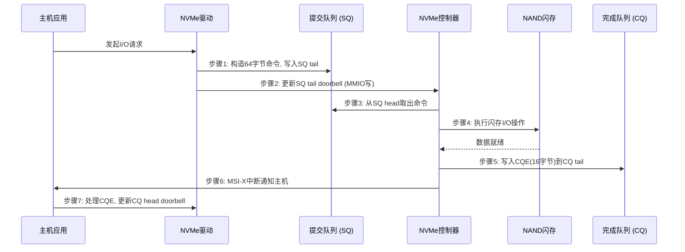

关键数据结构：

```c
// NVMe命令（64字节，提交到SQ）
struct nvme_command {
    __le32 cdw0;        // 命令标识（opcode + flags + 写入大小）
    __le32 nsid;        // 命名空间ID
    __le64 rsvd2;       // 保留
    __le64 metadata;    // 元数据指针
    __le64 prp1;        // 第一个物理区域页指针（数据地址）
    __le64 prp2;        // 第二个物理区域页指针（PRP列表或数据地址）
    __le32 cdw10;       // 命令特定字段
    __le32 cdw11;
    __le32 cdw12;
    __le32 cdw13;
    __le32 cdw14;
    __le32 cdw15;
};

// NVMe完成条目（16字节，写入CQ）
struct nvme_completion {
    union nvme_result result;  // 命令特定结果
    __le16 sq_head;            // SQ head指针（设备已消费的命令数）
    __le16 sq_id;              // 来源SQ的ID
    __u16  command_id;         // 与提交命令对应的ID
    __le16 status;             // 状态码 + Phase位
};
```

常见NVMe操作码（Opcode）：

| 操作码 | 命令 | 方向 | 说明 |
|--------|------|------|------|
| 0x00 | Flush | 写 | 强制将易失性缓存刷写到非易失介质，保证数据持久性 |
| 0x01 | Write | 写 | 将主机内存数据写入命名空间的指定LBA范围 |
| 0x02 | Read | 读 | 从命名空间指定LBA范围读取数据到主机内存 |
| 0x05 | Dsm (Deallocate) | 写 | 通知控制器释放指定LBA范围的物理空间（等效TRIM） |
| 0x0C | Compare | 读 | 将主机内存数据与命名空间数据逐字节比较 |
| 0x10 | Write Zeroes | 写 | 将指定LBA范围填充为零 |

#### 2.3 数据传输机制：PRP与SGL

NVMe命令中不直接携带数据，而是通过**指针**引用主机内存中的数据缓冲区。NVMe定义了两种数据传输机制：

**PRP（Physical Region Page，物理区域页）**：NVMe的默认数据传输方式。PRP是一个指向物理内存页（4KB对齐）的指针数组。每个NVMe命令最多携带两个PRP指针（PRP1和PRP2）：

- **小I/O（≤8KB）**：PRP1指向数据起始地址，PRP2不使用或指向第二个4KB页。零额外开销。
- **中等I/O（8KB-2MB）**：PRP1指向第一个4KB页，PRP2指向一个**PRP列表**——这个列表本身占用一个4KB页，最多包含512个PRP条目（每个8字节），可以描述最多2MB的连续或分散的物理内存。

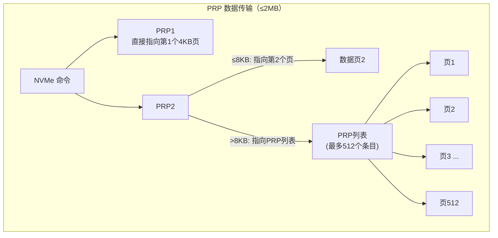

**SGL（Scatter-Gather List，分散聚集列表）**：NVMe 1.1引入，用于传输大于2MB的数据或需要更灵活的内存描述。SGL是一个链表结构，每个段（Segment）描述一段连续物理内存，段与段之间通过指针串联。SGL没有大小限制，理论上可以描述任意大小的数据传输。

| 特性 | PRP | SGL |
|------|-----|-----|
| 最大数据大小 | 2MB | 无限制 |
| 内存描述方式 | 页数组（4KB对齐） | 链表段（灵活对齐） |
| 适用场景 | 常规I/O（数据库、文件系统） | 大块传输、RAID重建 |
| 实现复杂度 | 简单 | 略复杂 |
| 内核默认使用 | 是 | 特殊场景（如NVMe-oF） |

Linux内核NVMe驱动默认使用PRP。当I/O大小超过单个PRP列表的2MB限制时，驱动会自动切换到SGL。对于绝大多数数据库和文件系统工作负载，PRP完全够用。

#### 2.4 Phase位机制

Phase位是NVMe队列模型中最精妙的设计之一，它解决了**无锁环形队列的生产者-消费者同步**问题：

```c
// Phase位的工作原理
// CQ被划分为若干槽位，每个槽位有一个Phase位
// 设备写入时翻转Phase位（0→1或1→0）

// 主机读取完成条目时检查Phase位：
void process_completions(struct nvme_queue *q) {
    while (1) {
        struct nvme_completion *cqe = &amp;q->cqes[q->cq_head];

        // Phase位匹配说明有新完成条目
        if ((cqe->status &amp; NVME_CQE_STATUS_PHASE) != q->phase)
            break;  // 没有更多完成条目

        // 处理完成的I/O
        uint16_t cmd_id = cqe->command_id;
        int status = le16_to_cpu(cqe->status) >> 1;

        // 调用应用层回调
        complete_io(cmd_id, status, cqe->result);

        // 更新head指针
        q->cq_head = (q->cq_head + 1) % q->queue_depth;

        // head绕回时翻转Phase位
        if (q->cq_head == 0)
            q->phase ^= 1;
    }

    // 通知设备已处理完CQE
    writeq(q->cq_head, q->cq_db);
}
```

Phase位的工作流程可以用一个环形图来理解：

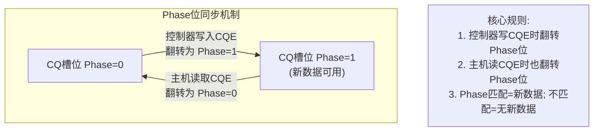

Phase位机制的优势：
- **无需原子操作**：主机和设备各自只修改一方（设备写CQE+翻转Phase，主机读CQE+翻转Phase），避免了CAS等昂贵的原子指令
- **无锁同步**：利用内存屏障保证可见性，Phase位天然提供了"新数据是否可用"的判断依据
- **零拷贝**：CQE直接写入主机内存的预分配缓冲区，无需中间缓冲

#### 2.5 Doorbell寄存器

Doorbell寄存器是PCIe配置空间中的MMIO寄存器，用于主机通知设备队列状态变化：

```c
// 更新SQ tail doorbell — 仅一次MMIO写入
static inline void nvme_ring_sq_db(struct nvme_queue *q) {
    // 内存屏障确保之前的SQ写入对设备可见
    wmb();
    writel(q->sq_tail, q->sq_db);
}
```

Doorbell寄存器在BAR空间中的布局：

| 队列 | 偏移计算 |
|------|---------|
| SQ0 tail | base + 0x1000 |
| CQ0 head | base + 0x1000 + (4096 × stride) |
| SQ1 tail | base + 0x1000 + (4096 × stride × 2) |
| CQ1 head | base + 0x1000 + (4096 × stride × 3) |
| SQn tail | base + 0x1000 + (4096 × stride × 2n) |
| CQn head | base + 0x1000 + (4096 × stride × (2n+1)) |

其中 `stride` 由控制器属性中的Doorbell Stride字段决定，通常为0（即4字节步进）。

Doorbell写入是MMIO操作，延迟约为100-300ns。在高频I/O场景下，可以使用以下优化：

- **Shadow Doorbell（阴影门铃）**：主机在内存中维护一个"影子"Doorbell值，控制器定期轮询内存而非每次中断都读MMIO，减少PCIe往返。
- **No Snoop优化**：通过PCIe TLP的No Snoop位，绕过CPU缓存一致性协议，减少MMIO写入的延迟。
- **批量提交**：将多个I/O命令写入SQ后，只在最后一个命令时更新一次Doorbell，将多次MMIO写入合并为一次。

#### 2.6 中断处理与批量化

NVMe使用**MSI-X中断**通知主机完成事件。为了避免高频中断导致的CPU过载，NVMe支持以下中断聚合策略：

**中断聚合（Interrupt Coalescing）**：控制器可以累积多个CQE后才触发一次中断，减少中断频率。通过管理命令`Set Features - Interrupt Coalescing`配置：

```bash
# 查看当前中断聚合设置
nvme get-feature /dev/nvme0 -f 0x08

# 设置：每累积16个完成事件或超过100μs触发中断
nvme set-feature /dev/nvme0 -f 0x08 -v 0x00000A10
# 高16位: 聚合阈值(16), 低16位: 聚合时间(10×100μs=1ms)
```

**轮询模式（Polling）**：对于超低延迟场景（如金融交易、内存数据库），可以绕过中断机制，由主机主动轮询CQ的Phase位。这消除了中断处理的开销（~1-2μs），代价是占用CPU周期。

Linux 5.1+的io_uring提供了高效的轮询接口：

```c
#include <liburing.h>

// 初始化io_uring — SQPOLL模式：内核线程自动提交SQE，减少用户态-内核态切换
struct io_uring ring;
io_uring_queue_init(256, &amp;ring, IORING_SETUP_SQPOLL);

// 提交异步读请求
void async_read(struct io_uring *ring, int fd, void *buf,
                size_t len, off_t offset) {
    struct io_uring_sqe *sqe = io_uring_get_sqe(ring);
    io_uring_prep_read(sqe, fd, buf, len, offset);
    sqe->user_data = (uint64_t)buf;  // 关联用户上下文
    io_uring_submit(ring);
}

// 轮询完成事件
void poll_completions(struct io_uring *ring) {
    struct io_uring_cqe *cqe;
    unsigned head;
    io_uring_for_each_cqe(ring, head, cqe) {
        void *buf = (void *)cqe->user_data;
        int result = cqe->res;
        handle_completion(buf, result);
    }
    io_uring_cq_advance(ring, head);
}
```

io_uring与NVMe的天然契合：
- io_uring的SQ/CQ结构直接映射到NVMe的SQ/CQ结构，减少了协议转换开销
- SQPOLL模式消除了系统调用开销，内核线程在共享内存中直接操作SQE
- 支持批量提交和批量收割，减少门铃写入次数
- 内核态轮询线程进一步降低延迟至~2-5μs
- 支持`IORING_SETUP_IOPOLL`模式，在内核态轮询NVMe CQ，完全绕过中断路径

---

### 3. nvme-cli工具实操

`nvme-cli`是Linux上管理NVMe设备的标准工具集，提供了从设备信息查询到高级功能配置的完整能力。

#### 3.1 安装与基础信息查询

```bash
# 安装nvme-cli
sudo apt-get install nvme-cli        # Debian/Ubuntu
sudo yum install nvme-cli            # CentOS/RHEL
sudo dnf install nvme-cli            # Fedora
```

```bash
# 列出所有NVMe控制器
nvme list
# 示例输出：
# Node         SN                   Model                Size   Usage  Format
# ----------   ------------------   ------------------   -----  -----  --------
# /dev/nvme0n1 S55CNS0T123456      Samsung 980 PRO      1.00TB  -      512B+0B

# 查看控制器详细信息
nvme id-ctrl /dev/nvme0 -H
# 关注字段：
#   sq (Maximum Outstanding Commands): 最大队列数
#   mdts (Maximum Data Transfer Size): 最大传输大小 = 2^(12+mdts) 字节
#   oncs (Optional NVM Command Support): 支持的可选命令

# 查看命名空间详细信息
nvme id-ns /dev/nvme0n1 -H
# 关注字段：
#   ncap (Namespace Capacity): 命名空间容量
#   dpc (Data Protection Capabilities): 数据保护能力
#   flbas (Formatted LBA Size): 格式化后的LBA大小

# 查看所有命名空间
nvme list-ns /dev/nvme0
```

#### 3.2 健康监控与SMART分析

```bash
# 查看NVMe SMART健康信息（最重要的运维命令）
nvme smart-log /dev/nvme0n1
```

典型输出及解读：

Smart Log for NVME device:nvme0n1 namespace-id:ffffffff
critical_warning          : 0        ← 0=正常，非0需立即关注
temperature               : 38°C     ← 工作温度（注意>70°C可能触发降速）
available_spare           : 100%     ← 剩余备用块比例，<10%需更换
available_spare_threshold : 10%      ← 厂商设定的警戒线
percentage_used           : 2%       ← 已使用的设计寿命百分比
endurance_group_warning   : 0
data_units_read           : 12345678 ← 已读取的数据量（单位：1000个512B块）
data_units_written        : 56789012 ← 已写入的数据量
data_units_read_out_of_range : 0     ← 超出范围的读操作数（应为0）
host_read_commands        : 987654321 ← 主机读命令总数
host_write_commands       : 543210987 ← 主机写命令总数
controller_busy_time      : 87654     ← 控制器忙碌时间（单位：分钟）
power_cycles              : 23        ← 上电循环次数
power_on_hours            : 8760      ← 累计通电时间
unsafe_shutdowns          : 1         ← 异常断电次数（应为0）
media_errors              : 0         ← 媒体错误数（应为0，非0需紧急处理）
num_err_log_entries       : 0         ← 错误日志条目数
Warning Temperature Time  : 0         ← 超过警告温度的累计时间（分钟）
Critical Comp Time        : 0         ← 超过临界温度的累计时间（分钟）

**关键指标监控阈值：**

| 指标 | 正常范围 | 警告阈值 | 危险阈值 | 说明 |
|------|---------|---------|---------|------|
| critical_warning | 0 | 非0即关注 | 非0即紧急 | 综合告警标志位 |
| temperature | 30-50°C | >65°C | >70°C | 高温触发热降速 |
| available_spare | >50% | <20% | <10% | 备用块耗尽=设备将死 |
| percentage_used | <80% | >80% | 100% | 设计寿命即将耗尽 |
| media_errors | 0 | >0 | >10 | 物理介质损坏 |
| unsafe_shutdowns | 0 | >0 | 频繁 | 异常断电，数据完整性风险 |

```bash
# 查看错误日志
nvme error-log /dev/nvme0n1

# 查看NVMe日志页面
nvme smart-log /dev/nvme0n1 -a    # 查看所有日志页面

# 持续监控脚本（每5分钟记录一次）
while true; do
    timestamp=$(date +%Y%m%d_%H%M%S)
    nvme smart-log /dev/nvme0n1 > "/var/log/nvme_smart_${timestamp}.txt"
    sleep 300
done
```

#### 3.3 队列与性能配置

```bash
# 查看当前I/O调度器
cat /sys/block/nvme0n1/queue/scheduler
# [none] 表示NVMe通常使用none调度器

# 查看当前队列参数
cat /sys/block/nvme0n1/queue/nr_requests      # 队列深度
cat /sys/block/nvme0n1/queue/read_ahead_kb    # 预读大小（KB）
cat /sys/block/nvme0n1/queue/rotational        # 是否旋转设备（SSD应为0）
cat /sys/block/nvme0n1/queue/max_sectors_kb   # 最大单次传输（KB）
cat /sys/block/nvme0n1/queue/io_poll           # 是否启用轮询模式（1=启用）
cat /sys/block/nvme0n1/queue/nomerges          # 禁用I/O合并（0=不禁止）
cat /sys/block/nvme0n1/queue/add_random        # 是否贡献随机数熵（SSD应为0）

# 查看PCIe链路信息
lspci -v -s $(lspci | grep -i nvme | awk '{print $1}')
# 关注：LnkCap（最大能力）和 LnkSta（当前状态）
# 如果LnkSta显示的速率/宽度低于LnkCap，说明PCIe降速
```

```bash
# 调整队列参数（运行时生效）
echo 1024 > /sys/block/nvme0n1/queue/nr_requests     # 增大队列深度
echo 0 > /sys/block/nvme0n1/queue/read_ahead_kb      # 禁用预读（随机访问场景）
echo 0 > /sys/block/nvme0n1/queue/add_random          # 关闭随机数贡献
echo 1 > /sys/block/nvme0n1/queue/io_poll             # 启用轮询模式
echo 0 > /sys/block/nvme0n1/queue/nomerges            # 允许I/O合并
```

#### 3.4 TRIM/Deallocate：释放SSD空间

TRIM（在NVMe中称为Deallocate）是SSD维护性能的关键操作。当文件系统删除文件时，只会标记逻辑块为"空闲"，而不会通知SSD释放对应的物理NAND块。TRIM将这个信息传递给SSD控制器，使FTL可以回收这些物理块用于未来的写入。

```bash
# 检查设备是否支持TRIM
nvme id-ctrl /dev/nvme0 -H | grep -i dealloc
# dpcm (Deallocate) = 1 表示支持

# 手动发送TRIM（对整个设备，危险！会删除所有数据）
# nvme dsm /dev/nvme0n1 -s 0 -e 0    # 不要轻易执行！

# 检查文件系统是否启用TRIM
# ext4:
tune2fs -l /dev/nvme0n1p1 | grep "Filesystem features" | grep -o "has_journal"
mount | grep nvme0n1 | grep -o "discard"
# 输出含 "discard" 表示在线TRIM已启用

# xfs:
xfs_info /dev/nvme0n1p1 | grep -o "discard"

# 推荐：使用fstrim定期批量TRIM（而非在线TRIM）
# 在线TRIM（mount -o discard）会在每次删除时发送TRIM命令，增加I/O开销
# 批量TRIM（fstrim）将多个TRIM请求合并，效率更高

# 手动执行批量TRIM
sudo fstrim -v /
# 输出示例：/: 456 GiB (489,123,456,000 bytes) trimmed

# 设置定期TRIM（systemd定时器）
sudo systemctl enable fstrim.timer
sudo systemctl start fstrim.timer
# 默认每周执行一次，可在 /etc/crypttab 或 /etc/systemd/system/fstrim.timer.d/ 中调整
```

#### 3.5 固件管理与命名空间操作

```bash
# 查看当前固件版本
nvme fw-log /dev/nvme0

# 下载固件镜像（示例）
nvme fw-download /dev/nvme0 -f /path/to/firmware.bin

# 激活新固件（需要重启生效）
nvme fw-activate /dev/nvme0 -s 1 -a 0
# -s: slot编号(0-3), -a: 激活方式(0=立即, 1=重置后)

# 创建新的命名空间
nvme create-ns /dev/nvme0 -s 1000000 -c 0 -f 1 -d 0 -n 2
# -s: 块数, -f: LBA格式(0=512B, 1=4KB), -n: 命名空间ID

# 删除命名空间
nvme delete-ns /dev/nvme0 -n 2

# 格式化命名空间（注意：会擦除所有数据）
nvme format /dev/nvme0n1 -l 1    # 使用LBA格式1（通常为4KB）
```

#### 3.6 设备自检与性能验证

```bash
# 运行设备自检（短期测试）
nvme device-self-test /dev/nvme0n1 -s 1
# -s 1: 短期自检（约2分钟）
# -s 2: 长期自检（可能数小时）

# 查看自检进度
nvme self-test-log /dev/nvme0n1

# 验证NVMe是否正确配置（综合检查脚本）
echo "=== NVMe 设备状态检查 ==="
echo "--- 控制器信息 ---"
nvme id-ctrl /dev/nvme0 | head -20

echo "--- 命名空间信息 ---"
nvme id-ns /dev/nvme0n1 | head -20

echo "--- 健康状态 ---"
nvme smart-log /dev/nvme0n1

echo "--- 队列配置 ---"
for param in scheduler nr_requests read_ahead_kb rotational io_poll max_sectors_kb; do
    echo "  $param: $(cat /sys/block/nvme0n1/queue/$param)"
done

echo "--- PCIe链路 ---"
lspci -v -s $(lspci | grep -i nvme | head -1 | awk '{print $1}') 2>/dev/null | grep -E "LnkCap|LnkSta"
```

---

### 4. 队列深度与性能调优

NVMe的多队列架构意味着队列深度（Queue Depth, QD）对性能有决定性影响。理解QD如何影响IOPS和延迟，是调优NVMe存储的关键。

#### 4.1 队列深度对IOPS的影响

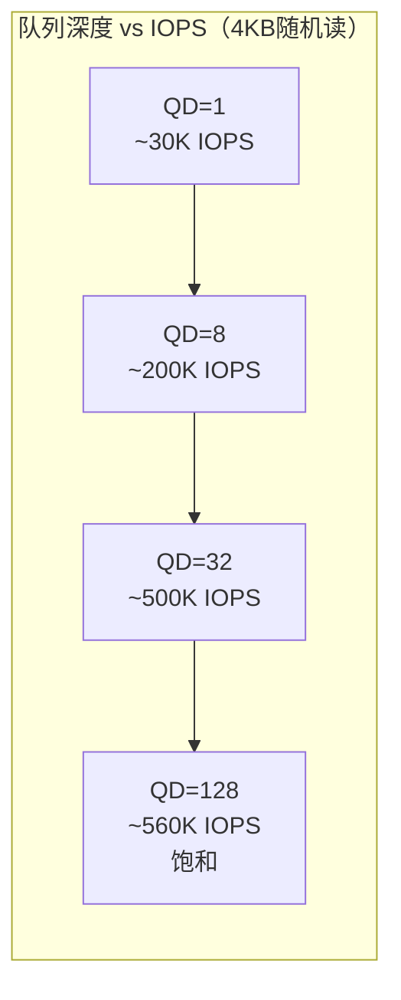

队列深度 vs IOPS（典型企业级NVMe SSD，4KB随机读）：

QD=1:     ~30,000 IOPS    ← 单线程同步I/O，受限于单次延迟
QD=2:     ~58,000 IOPS
QD=4:     ~110,000 IOPS
QD=8:     ~200,000 IOPS
QD=16:    ~350,000 IOPS
QD=32:    ~500,000 IOPS   ← 接近硬件并行极限
QD=64:    ~550,000 IOPS   ← 收益递减
QD=128:   ~560,000 IOPS   ← 饱和

关键洞察：
QD=1时IOPS仅30K，但QD=32时可达500K——同一块SSD，性能差16倍！
原因：SSD内部有多个Die/Plane/Channel可以并行处理I/O，
      QD太低时硬件的并行能力无法被利用。

SSD内部的并行度来源：

| 内部组件 | 典型数量 | 说明 |
|---------|---------|------|
| Channel（通道） | 4-16 | 每个通道可独立操作一组Die |
| Die（芯片） | 8-64 | 每个Die可独立执行命令 |
| Plane（平面） | 2-4 | 每个Die内的独立操作单元 |
| LUN（逻辑单元） | 1-2 per Die | 最小可独立操作的存储阵列 |

QD=1时，只有1个Die在工作；QD=32时，可以同时激活多个Channel和Die，充分利用硬件并行度。

#### 4.2 延迟与队列深度的权衡

队列深度 vs 延迟（同一SSD）：

QD=1:     平均延迟 ~30μs,  P99 ~50μs     ← 最低延迟
QD=8:     平均延迟 ~120μs, P99 ~200μs
QD=32:    平均延迟 ~500μs, P99 ~1ms      ← 延迟显著上升
QD=128:   平均延迟 ~2ms,   P99 ~5ms      ← 高延迟

权衡原则：
- 延迟敏感型（OLTP、实时交易）：QD=1-8，牺牲IOPS换取低延迟
- 吞吐敏感型（批处理、数据分析）：QD=32-128，牺牲延迟换取IOPS
- 通用负载：QD=8-32，寻找最佳平衡点

延迟上升的根本原因：当队列中有更多待处理I/O时，新提交的I/O必须等待前面的I/O完成，排队时间线性增长。这与银行排队的原理完全相同——队列越长，每个客户等待时间越久。

#### 4.3 fio验证实验

使用fio工具验证队列深度对性能的影响：

```bash
# 测试1：QD=1（同步I/O）
fio --name=qd1 --ioengine=io_uring --direct=1 --bs=4k \
    --iodepth=1 --rw=randread --size=10G --runtime=60 \
    --time_based --filename=/dev/nvme0n1

# 测试2：QD=32
fio --name=qd32 --ioengine=io_uring --direct=1 --bs=4k \
    --iodepth=32 --rw=randread --size=10G --runtime=60 \
    --time_based --filename=/dev/nvme0n1

# 测试3：QD=128（饱和测试）
fio --name=qd128 --ioengine=io_uring --direct=1 --bs=4k \
    --iodepth=128 --rw=randread --size=10G --runtime=60 \
    --time_based --filename=/dev/nvme0n1

# 测试4：多线程+QD=8（模拟实际数据库场景）
fio --name=multi_thread --ioengine=io_uring --direct=1 --bs=16k \
    --iodepth=8 --rw=randrw --rwmixread=70 \
    --numjobs=8 --size=10G --runtime=300 \
    --time_based --group_reporting --filename=/dev/nvme0n1
```

fio输出解读要点：
- **IOPS**：每秒完成的I/O操作数，是衡量吞吐能力的核心指标
- **lat (usec)**：延迟分布，关注avg（平均值）和p99（99分位值）
- **bw**：带宽（MB/s），顺序I/O场景下更有意义

#### 4.4 针对不同工作负载的QD配置

| 工作负载类型 | 推荐QD | 推荐I/O大小 | 典型场景 |
|-------------|--------|------------|---------|
| OLTP事务 | 1-8 | 4-16KB | MySQL/PG在线交易 |
| OLAP查询 | 8-32 | 64-256KB | 报表查询、数据仓库 |
| 日志写入 | 8-16 | 4KB | WAL、审计日志 |
| 大数据扫描 | 32-128 | 128KB-1MB | Hadoop/Spark读取 |
| 虚拟化 | 8-32 | 4-8KB | VM磁盘I/O |
| 备份/恢复 | 32-128 | 256KB-1MB | 全量备份、恢复 |

---

### 5. CPU与NVMe中断亲和性

在多核服务器上，NVMe中断的CPU分配直接影响I/O性能。Linux内核默认将NVMe中断分散到不同CPU核心，但自动分配可能不够优化。

#### 5.1 查看NVMe中断分布

```bash
# 查看NVMe设备的中断号
grep -i nvme /proc/interrupts
# 输出示例：
#           CPU0  CPU1  CPU2  CPU3  CPU4  CPU5  CPU6  CPU7
#  45:   12345     0     0     0     0     0     0     0  PCI-MSI nvme0q0
#  46:       0  8901     0     0     0     0     0     0  PCI-MSI nvme0q1
#  47:       0     0  7823     0     0     0     0     0  PCI-MSI nvme0q2
#  ...

# 查看中断亲和性
cat /proc/irq/46/smp_affinity
# 02 = 二进制00000010 = CPU1

# 使用irqbalance自动平衡（推荐在生产环境使用）
sudo systemctl enable irqbalance
sudo systemctl start irqbalance
```

#### 5.2 手动设置中断亲和性

```bash
# 将NVMe队列1的中断绑定到CPU2
echo 04 > /proc/irq/47/smp_affinity

# 将NVMe队列2的中断绑定到CPU3
echo 08 > /proc/irq/48/smp_affinity

# 最佳实践：每个NVMe队列绑定到一个CPU核心
# 避免：多个队列的中断集中到同一CPU
# 避免：队列中断被绑定到与数据库线程相同的CPU

# 脚本化：将NVMe中断均匀分配到CPU2-CPU7（跳过CPU0和CPU1）
NVME_IRQS=$(grep -i 'nvme.*q[0-9]' /proc/interrupts | awk -F: '{print $1}' | tr -d ' ')
CORES=(04 08 10 20 40 80)   # CPU2-CPU7的掩码
i=0
for irq in $NVME_IRQS; do
    if [ $i -gt 0 ]; then  # 跳过q0（管理队列）
        cpu_mask=${CORES[$((i % ${#CORES[@]}))]}
        echo "$cpu_mask" > /proc/irq/$irq/smp_affinity
        echo "IRQ $irq -> CPU mask $cpu_mask"
    fi
    i=$((i + 1))
done
```

#### 5.3 使用per-cpu队列减少锁竞争

现代NVMe驱动（blk-mq框架）为每个CPU核心维护独立的软件提交队列，避免了单队列的锁竞争：

```bash
# 查看NVMe的硬件队列数（通常等于CPU核心数，但不超过控制器限制）
ls /sys/block/nvme0n1/mq/    # 或通过debugfs查看

# 在NUMA架构中，确保NVMe设备与使用它的CPU在同一NUMA节点
numactl --cpunodebind=0 --membind=0 my_database_server

# 查看NUMA拓扑
numactl --hardware
lspci -v | grep -A 10 -i nvme | grep "NUMA node"
```

NUMA远端访问的性能惩罚：

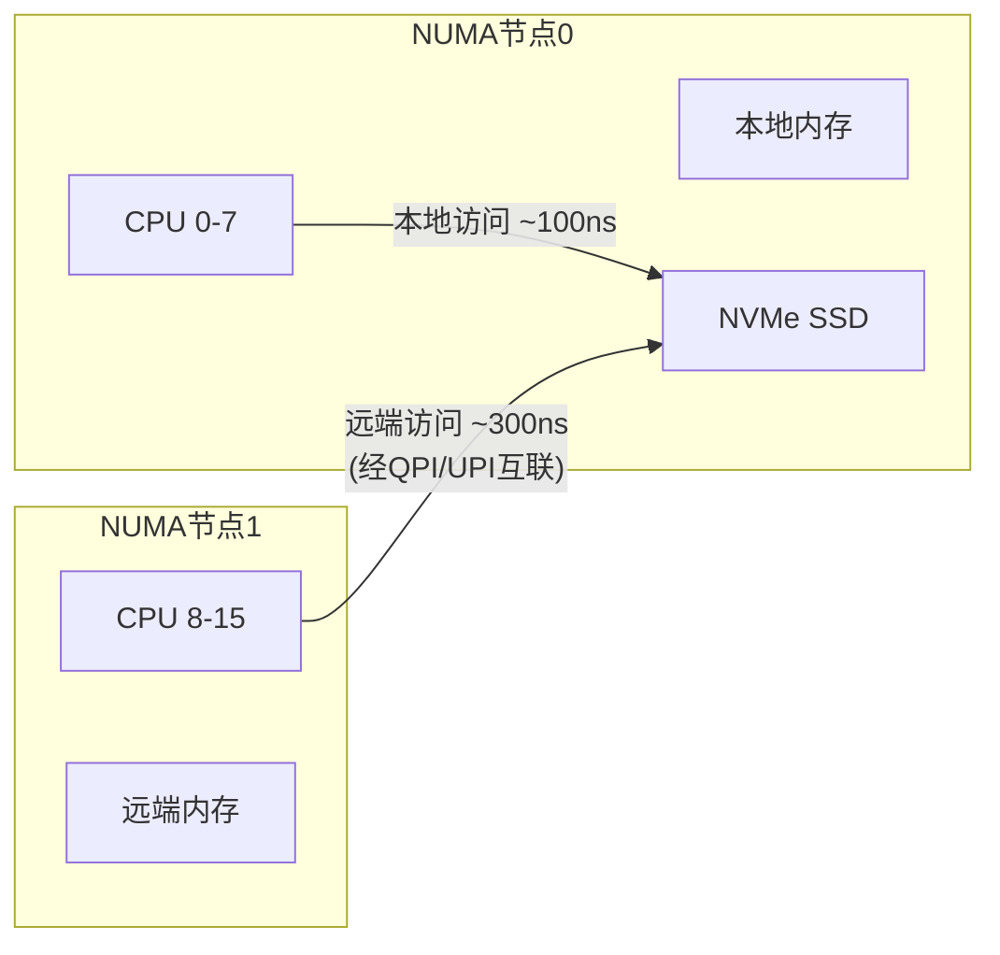

---

### 6. NVMe多队列与I/O并行

NVMe的多队列设计不仅仅是队列数量多——它的核心价值在于**消除锁竞争**和**实现无阻塞并行I/O**。

#### 6.1 传统单队列的瓶颈

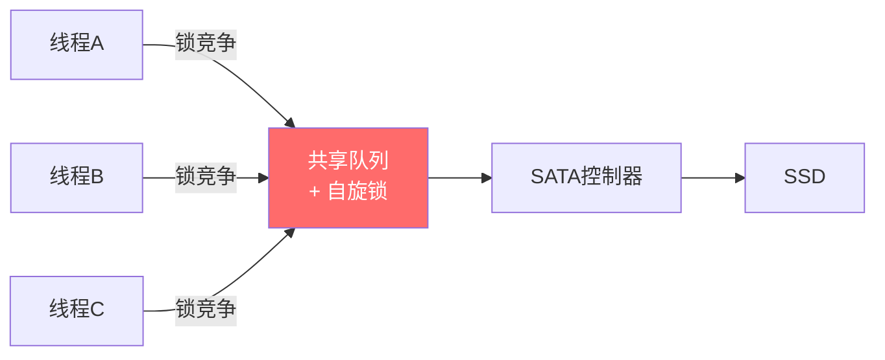

AHCI/SATA的单队列模型问题：
1. 自旋锁争用：多线程竞争同一把锁，CPU浪费在锁等待上
2. 串行提交：即使SSD内部可以并行处理，队列入口是串行的
3. 中断风暴：32个队列深度意味着最多32个同时在途的I/O

#### 6.2 NVMe多队列并行模型

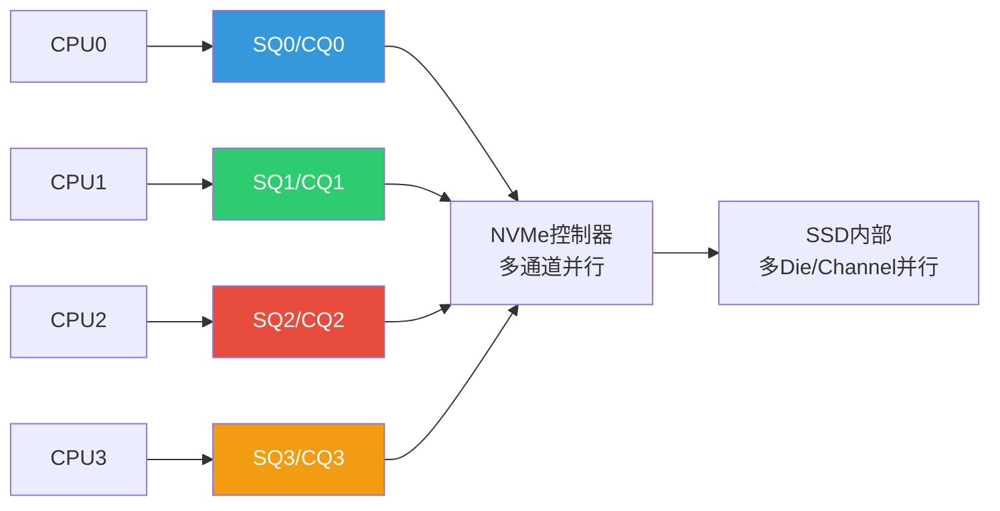

优势：
1. **无锁提交**：每个CPU有自己的SQ，不需要任何锁
2. **硬件并行**：控制器从多个SQ并行取命令，充分利用SSD内部通道
3. **中断分散**：每个队列有独立的MSI-X中断向量
4. **可扩展**：增加CPU核心数可以直接提升I/O并行度

#### 6.3 队列映射策略

```bash
# 查看NVMe控制器支持的最大队列数
nvme id-ctrl /dev/nvme0 | grep "^sq  "
# sq 64 表示最多64个I/O队列

# 查看当前活跃的队列数（等于CPU核心数，但不超过控制器限制）
# 通过debugfs查看
sudo cat /sys/kernel/debug/nvme/nvme0/queues

# NUMA感知的队列分配
# 查看NVMe设备连接的PCIe根复合体所在NUMA节点
cat /sys/block/nvme0n1/device/numa_node
# 0 = NUMA节点0
# 如果为-1，说明无法确定（可能是远端设备）

# 在应用层面，使用numactl确保进程和NVMe在同一NUMA节点
numactl --cpunodebind=0 --membind=0 ./my_io_intensive_app
```

---

### 7. 内核参数调优

#### 7.1 sysctl存储相关参数

```bash
# /etc/sysctl.conf 中的NVMe优化配置

# --- I/O调度参数 ---
# 增大异步I/O最大数量
fs.aio-max-nr = 1048576

# --- 脏页管理 ---
# 脏页占内存比例达到此值时，同步写入强制刷盘
vm.dirty_ratio = 5              # 默认10-20，降低以减少突发写入

# 脏页占内存比例达到此值时，后台线程开始异步回写
vm.dirty_background_ratio = 2   # 默认5-10，降低以更早开始回写

# 脏页过期时间（百分之一秒）
vm.dirty_expire_centisecs = 500  # 5秒，降低以更频繁回写

# 回写线程唤醒间隔（百分之一秒）
vm.dirty_writeback_centisecs = 100  # 1秒

# --- 页缓存参数 ---
# 最小空闲内存（MB），保留给I/O缓冲
vm.min_free_kbytes = 262144     # 256MB

# 交换倾向（0=尽量不交换，100=积极交换）
vm.swappiness = 10              # 对于数据库服务器，降低交换倾向

# 应用配置
sudo sysctl -p
```

#### 7.2 NVMe驱动模块参数

```bash
# 查看当前NVMe模块参数
modinfo nvme | grep parm

# 常用参数配置（/etc/modprobe.d/nvme.conf）
options nvme io_timeout=30           # I/O超时时间（秒），默认30
options nvme admin_timeout=60        # 管理命令超时，默认60
options nvme max_host_mem=128        # 控制器可用的最大主机内存（MB）
                                    # 用于控制器内部的缓冲和映射表缓存

# 重新加载模块以应用参数
sudo modprobe -r nvme
sudo modprobe nvme
# 注意：这会暂时断开所有NVMe设备，生产环境需谨慎！
```

#### 7.3 GRUB启动参数

```bash
# 编辑 /etc/default/grub
# GRUB_CMDLINE_LINUX 中添加：
nvme_core.multipath=1     # 启用NVMe多路径（多控制器场景）
nvme_core.default_ps_max_latency_us=0   # 禁用NVMe电源管理（低延迟场景）
nvme_core.io_timeout=30   # I/O超时

# 更新GRUB并重启
sudo update-grub
sudo reboot
```

---

### 8. NVMe电源管理与性能状态

NVMe定义了5个电源状态（Power States, PS0-PS4），每个状态在性能和功耗之间提供不同的权衡。这对于笔记本、边缘设备和数据中心的能效优化都至关重要。

| 电源状态 | 典型功耗 | 最大延迟 | 非操作状态延迟 | 说明 |
|---------|---------|---------|-------------|------|
| PS0 | 8-10W | 0μs（无限制） | 0μs | 全速运行，最高性能 |
| PS1 | 4-5W | 100μs | 50μs | 轻度节能，少量性能损失 |
| PS2 | 3W | 200μs | 100μs | 中度节能 |
| PS3 | 40mW | 2ms | 500μs | 深度睡眠，恢复较慢 |
| PS4 | 5mW | 10ms | 5ms | 最深睡眠，最长恢复时间 |

```bash
# 查看当前电源状态
nvme get-feature /dev/nvme0 -f 0x02
# 输出中包含当前电源状态（Power State）

# 查看各电源状态详情
nvme id-ctrl /dev/nvme0 -H | grep -A 5 "ps "
# 显示每个PS的功耗和延迟限制

# 禁用电源管理（低延迟场景必需）
# 通过GRUB参数：nvme_core.default_ps_max_latency_us=0
# 或通过运行时设置：
echo 0 > /sys/class/nvme/nvme0/power/control
# auto=允许自动电源管理, on=强制开启(最节能), off=禁用
```

**电源管理对性能的影响：**

- 数据库服务器：**必须禁用**电源管理（设置`default_ps_max_latency_us=0`），否则PS3/PS4的唤醒延迟（2-10ms）会导致严重的P99延迟毛刺
- 笔记本电脑：保持默认的自动电源管理，在I/O空闲时自动进入低功耗状态
- 云计算实例：根据实例类型决定——计算优化型禁用，通用型保持默认

---

### 9. 故障排查与常见问题

#### 9.1 NVMe设备性能突然下降

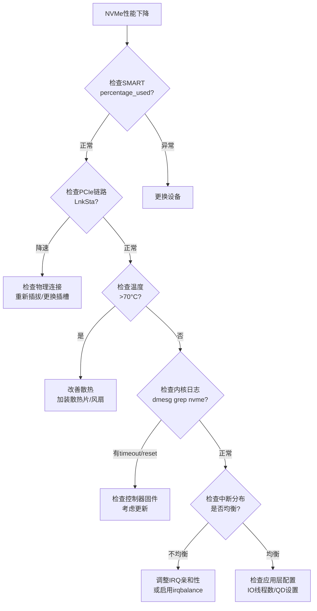

```bash
# 第一步：检查硬件健康状态
nvme smart-log /dev/nvme0n1 | grep -E "percentage_used|available_spare|media_errors"

# 第二步：检查PCIe链路是否降速
lspci -v -s $(lspci | grep -i nvme | head -1 | awk '{print $1}') | grep LnkSta
# 正常：Speed 16GT/s, Width x4
# 异常：Speed 8GT/s, Width x2 （降速！）

# 第三步：检查温度是否触发降速
nvme smart-log /dev/nvme0n1 | grep temperature
# >70°C 可能触发热降速（Thermal Throttling）

# 第四步：检查内核日志
dmesg | grep -i nvme
# 关注：timeout、error、reset 等关键字

# 第五步：检查中断分布是否均衡
grep -i nvme /proc/interrupts | awk '{print $2":"$NF}' | sort -t: -k2 -n
```

#### 9.2 常见错误及解决方案

| 错误现象 | 可能原因 | 解决方案 |
|---------|---------|---------|
| `nvme: controller is down` | PCIe链路断开、控制器固件崩溃 | `echo 1 > /sys/bus/pci/rescan` 重新扫描PCIe；或重启 |
| `I/O error` + `dmesg: NVME timeout` | I/O超时、设备无响应 | 检查`io_timeout`设置；更新固件；更换设备 |
| `ENOSPC` 但有剩余空间 | 空间保留（预留空间）、TRIM未启用 | `nvme format`重新格式化；检查OP空间 |
| 性能周期性毛刺（P99飙高） | SSD内部GC与前台I/O竞争 | 增加Over-Provisioning；降低写入速率 |
| `dmesg: NVME: I/O 42 QID 0 timeout` | 特定I/O路径异常 | 检查块设备状态；`echo -1 > /sys/block/nvme0n1/device/reset` |
| `Warning: NVMe namespace not ready` | 命名空间未就绪 | `nvme set-feature /dev/nvme0 -f 0x0c` 检查Feature |

```bash
# NVMe设备软重置（不丢失数据）
echo 1 > /sys/bus/pci/devices/$(lspci -D | grep -i nvme | head -1 | awk '{print $1}')/remove
echo 1 > /sys/bus/pci/rescan

# 完全重置（如果软重置失败）
nvme reset /dev/nvme0
```

#### 9.3 延迟毛刺诊断流程

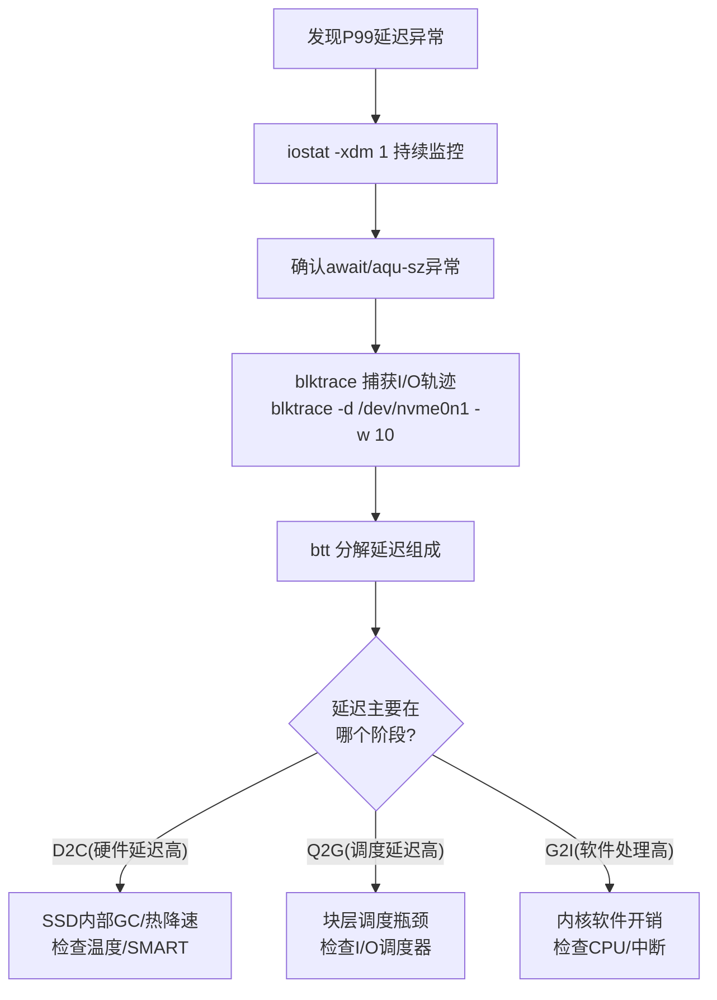

```bash
# 1. 使用iostat持续监控
iostat -xdm 1 | grep nvme

# 2. 发现await异常飙高时，用blktrace捕获
blktrace -d /dev/nvme0n1 -w 10 -o /tmp/nvme_trace

# 3. 分析延迟组成
blkparse -i /tmp/nvme_trace -d /tmp/nvme_trace.bin
btt -i /tmp/nvme_trace.bin

# 4. btt输出的关键延迟分解：
# Q2C: 队列到完成（总延迟）
# Q2G: 块层获取请求（调度延迟）
# G2I: 获取到下发（软件处理延迟）
# I2D: 下发到驱动（驱动延迟）
# D2C: 驱动到完成（硬件延迟 ← NVMe SSD主要看这里）

# 5. 使用perf定位CPU热点
perf record -g -e block:block_rq_issue -e block:block_rq_complete -- sleep 10
perf report
```

---

### 10. 高级主题：NVMe over Fabrics与SPDK

#### 10.1 NVMe-oF：远程NVMe访问

NVMe over Fabrics（NVMe-oF）将NVMe命令集扩展到网络传输，允许远程客户端以接近本地NVMe的性能访问远端存储设备。其核心思想是：**在网络上传输NVMe命令和CQE，而非SCSI命令**，从而保持NVMe的队列模型和低延迟特性。

| 传输类型 | 典型延迟 | 典型带宽 | 适用场景 |
|---------|---------|---------|---------|
| RDMA (RoCE v2) | 10-15μs | 100GbE | 数据中心内部高速互联 |
| iWARP | 15-25μs | 10/25GbE | 标准以太网环境 |
| TCP | 50-100μs | 25/100GbE | 通用以太网（最广泛部署） |
| FC (Fibre Channel) | 30-50μs | 32Gb FC | 现有SAN基础设施兼容 |

```bash
# 查看NVMe-oF相关内核模块
lsmod | grep nvme
# nvme_tcp    - TCP传输
# nvme_rdma   - RDMA传输
# nvme_fabrics - 核心框架

# 配置NVMe-oF target（服务端示例）
modprobe nvme-tcp
nvmet-tcp -p 4420 &amp;

# 配置NVMe-oF initiator（客户端示例）
nvme connect -t tcp -n nvme-tcp -a 192.168.1.100 -s 4420 -I -d nvme0

# 断开连接
nvme disconnect -d nvme0
```

NVMe-oF与传统SAN（iSCSI/FC）的本质区别：传统SAN在存储端需要额外的协议转换层（SCSI→NVMe→SCSI→网络→SCSI→NVMe），而NVMe-oF端到端使用NVMe命令集，消除了协议转换开销。

#### 10.2 SPDK：用户态NVMe驱动

SPDK（Storage Performance Development Kit）提供了完全用户态的NVMe驱动，绕过内核块层，将I/O延迟进一步压缩：

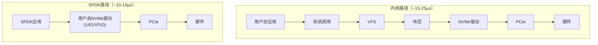

SPDK的核心组件：
- **用户态NVMe驱动**：基于UIO/VFIO的用户态PCIe设备访问，绕过内核驱动
- **轮询模式线程**：专用的I/O处理线程，100%CPU占用但零中断延迟
- **内存池**：预分配的大页内存（1GB Huge Pages），避免动态分配开销和缺页中断
- **I/O通道**：每个CPU核心有独立的I/O通道，完全无锁

```bash
# SPDK安装与基础使用
git clone https://github.com/spdk/spdk.git
cd spdk &amp;&amp; git submodule update --init
./scripts/pkgdep.sh    # 安装依赖
./configure
make

# 使用SPDK的perf工具测试NVMe性能
./test/nvme/perf/nvme_perf -q 32 -s 4096 -t 60 -c 1 -w randread \
    -r trtype=pcie -d /dev/nvme0n1
```

#### 10.3 ZNS：Zoned Namespace

Zoned Namespace（ZNS）是NVMe 2.0引入的新命令集，将SSD内部的闪存管理（垃圾回收、磨损均衡）暴露给主机，让文件系统或应用直接管理数据在闪存上的物理布局。

传统NVMe SSD通过FTL在后台进行垃圾回收（GC），这会导致**写放大**和**延迟毛刺**。ZNS的核心思想是：**让主机知道数据的物理放置规则，避免GC**。

传统NVMe SSD：
  主机写入LBA 100 → FTL映射到物理页A → 后台GC搬迁 → 写放大

ZNS SSD：
  主机写入Zone 0（按顺序写入） → 直接写到物理区域 → 无需GC

ZNS的关键概念：
- **Zone**：命名空间被划分为多个固定大小的Zone（如256MB）
- **顺序写入约束**：每个Zone内的写入必须是顺序的（不能随机写）
- **Zone重置**：删除Zone内所有数据时，向控制器发送Zone Reset命令
- **活跃Zone**：同一时刻只有少数Zone处于"活跃"状态（可写入）

ZNS的适用场景：
- **文件系统层**：btrfs和f2fs已有ZNS感知模式
- **数据库**：RocksDB的ZenFS插件直接管理ZNS Zone
- **对象存储**：追加写入模式天然适配ZNS的顺序写入约束

---

### 11. 最佳实践总结

#### 11.1 配置检查清单

□ I/O调度器：NVMe设备使用 'none'
□ 队列深度：根据负载类型调整 nr_requests
□ 预读大小：随机访问场景禁用或减小预读
□ 中断亲和性：均匀分配到不同CPU核心
□ NUMA对齐：确保数据库进程与NVMe在同一NUMA节点
□ 温度监控：定期检查smart-log，温度>65°C需要散热优化
□ 固件版本：保持最新稳定版（注意：新固件可能引入回归）
□ Over-Provisioning：重度写入场景预留20%+空间
□ TRIM配置：启用fstrim定时器，而非在线discard
□ 电源管理：数据库服务器禁用PS节能
□ dirty_ratio调优：降低脏页阈值，避免突发大量写入
□ PCIe链路：确认LnkSta为满速率满宽度（如PCIe 4.0 x4）

#### 11.2 性能基线建立

```bash
# 建立基线的fio命令（保存为nvme_baseline.sh）
#!/bin/bash
DEVICE=$1
echo "=== NVMe性能基线测试: $DEVICE ==="
echo "测试时间: $(date)"
echo ""

# 1. 4KB随机读 QD=1（延迟基线）
echo "--- 4KB Random Read QD=1 ---"
fio --name=randread_qd1 --ioengine=io_uring --direct=1 --bs=4k \
    --iodepth=1 --rw=randread --size=10G --runtime=60 \
    --time_based --filename=$DEVICE --output-format=json

# 2. 4KB随机读 QD=32（IOPS基线）
echo "--- 4KB Random Read QD=32 ---"
fio --name=randread_qd32 --ioengine=io_uring --direct=1 --bs=4k \
    --iodepth=32 --rw=randread --size=10G --runtime=60 \
    --time_based --filename=$DEVICE --output-format=json

# 3. 混合读写 QD=16（实际负载基线）
echo "--- 70/30 Mixed QD=16 ---"
fio --name=mixed --ioengine=io_uring --direct=1 --bs=16k \
    --iodepth=16 --rw=randrw --rwmixread=70 \
    --size=10G --runtime=120 --time_based \
    --group_reporting --filename=$DEVICE --output-format=json

# 4. 顺序读带宽基线
echo "--- Sequential Read ---"
fio --name=seqread --ioengine=io_uring --direct=1 --bs=1m \
    --iodepth=16 --rw=read --size=10G --runtime=60 \
    --time_based --filename=$DEVICE --output-format=json

echo "=== 基线测试完成 ==="
echo "将此结果保存，作为后续性能对比的参考基准"
```

#### 11.3 常见调优误区

| 误区 | 正确做法 | 原因 |
|------|---------|------|
| NVMe不需要I/O调度器 | 使用none调度器，但blk-mq仍需管理多队列 | none是最优选择，但不是"不需要管理" |
| QD越高IOPS越高 | 找到延迟与IOPS的平衡点 | QD过高导致延迟飙升，可能影响应用响应 |
| %util=100%说明SSD饱和 | 关注await和aqu-sz而非%util | NVMe可以并行处理，%util对NVMe几乎无意义 |
| Direct I/O总是更快 | 根据缓存策略选择 | 对于小而稀疏的读，Buffered I/O可能更好 |
| 升级NVMe就能提升性能 | 同步调整软件配置 | 硬件能力需要软件配合才能发挥 |
| 所有NVMe SSD性能相当 | 区分稳态与峰值、消费级与企业级 | 消费级SSD满盘后性能可能下降80%+ |
| 在线TRIM最高效 | 使用fstrim批量TRIM | 在线TRIM增加每次删除的I/O开销，批量合并更高效 |
| 禁用电源管理一定更好 | 根据场景决定 | 数据库禁用，笔记本保持自动管理以省电 |

---

### 12. 实际案例：从SATA升级到NVMe后的性能陷阱

#### 12.1 问题描述

某团队将MySQL从SATA SSD迁移到NVMe SSD后，发现写入性能仅提升20%，远低于预期（理论应提升5-10倍）。

#### 12.2 诊断过程

```bash
# iostat显示NVMe利用率很低
iostat -xdm 1
# nvme0n1: %util=15% → 说明大部分时间SSD在空闲

# perf显示瓶颈在CPU
perf record -g -p $(pidof mysqld) -- sleep 30
perf report
# 45%时间在fdatasync（单线程WAL写入）
# 20%时间在mutex竞争

# 根因：innodb_io_capacity仍设为200（适合SATA SSD）
# InnoDB的后台I/O线程以很低的频率刷脏页
```

#### 12.3 解决方案

```ini
# MySQL InnoDB配置调整
[mysqld]
# 将IO容量调整为NVMe的实际能力
innodb_io_capacity = 20000       # NVMe可达数万IOPS
innodb_io_capacity_max = 40000

# 增大I/O线程数
innodb_read_io_threads = 16
innodb_write_io_threads = 16

# 使用O_DIRECT避免双缓冲
innodb_flush_method = O_DIRECT

# 增大日志缓冲
innodb_log_buffer_size = 64M

# 配合调整Buffer Pool
innodb_buffer_pool_size = 128G
innodb_buffer_pool_instances = 16
```

#### 12.4 效果

| 指标 | 调整前 | 调整后 | 提升 |
|------|--------|--------|------|
| 写入IOPS | 45,000 | 210,000 | 4.7× |
| NVMe利用率 | 15% | 72% | — |
| P99延迟(ms) | 5.2 | 0.8 | 6.5× |

关键教训：NVMe的性能上限远高于SATA SSD，但如果不调整软件配置来充分驱动硬件，升级收益将非常有限。这就像给赛车装上F1引擎，但还用家用轿车的油门踏板——引擎能力再强，踏板踩不下去也无济于事。

---

**参考文献：**
1. NVM Express, Inc. "NVMe Base Specification 2.0." 2021.
2. NVM Express, Inc. "NVMe Command Set Specification." 2021.
3. Axboe, J. "Efficient IO with io_uring." kernel.dk, 2019.
4. SPDK.io - Storage Performance Development Kit Documentation.
5. SNIA. "NVMe and NVMe-oF Technical Tutorial." 2023.
6. Brendan Gregg. "Systems Performance: Enterprise and the Cloud." 2nd Edition, 2020.
7. Linux kernel documentation: drivers/nvme/host/ and Documentation/nvme/.
8. Open-ZFS Project. "Zoned Storage and ZNS SSDs." 2022.
9. Weste, N. et al. "CMOS VLSI Design: A Circuits and Systems Perspective." 4th Edition, 2010.（NAND Flash物理原理参考）
