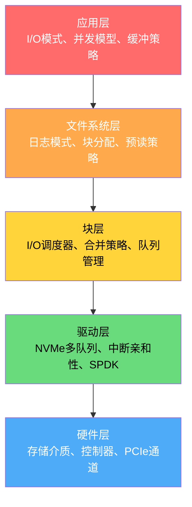

## 技巧4 存储I/O性能优化清单

存储I/O性能优化是一项系统工程——它不是调一个参数就能解决的单点问题，而是从硬件选型到应用代码的全栈协同。本清单将前面三个技巧（HDD磁盘结构与寻道、SSD闪存与FTL映射、NVMe协议与队列模型）的核心方法整合为一份可执行的优化检查表，按影响范围从大到小、调整成本从高到低排列，适用于任何涉及存储I/O的系统——无论是单机数据库、分布式存储，还是云原生微服务。

---

### 道：理解I/O性能的本质瓶颈

在动手优化之前，必须先建立一个关键认知：**存储I/O的瓶颈可以在多个层级发生，而每一层的优化手段完全不同。**



每一层都可能成为性能瓶颈，而诊断的关键在于**量化**——用数据定位瓶颈在哪一层，再选择对应的优化手段。盲目优化错误的层级，只会浪费时间甚至适得其反。

**优化的核心原则：**

1. **测量先行，优化在后**：没有基准数据的优化是盲目的。先用 `fio` 建立性能基线，再逐步调整。
2. **分层递进，由粗到细**：先做架构层面的决策（存储介质选型），再做系统级配置（调度器、NUMA），最后做应用级微调（对齐、并发）。
3. **场景驱动，拒绝万能方案**：OLTP（高IOPS、小I/O）和 OLAP（高带宽、大I/O）的优化方向截然相反，不存在放之四海而皆准的参数。

---

### 法：四层优化框架

#### 第一层：架构决策（影响最大，调整成本最高）

架构决策在系统设计阶段确定，一旦实施后再修改的成本极高。这是优化的第一优先级。

| 检查项 | 核心原理 | 具体操作 | 验证方法 |
|--------|---------|---------|---------|
| **存储介质选型** | HDD随机I/O约150 IOPS，SSD约50万 IOPS，差距3000倍。介质选错，后续所有优化事倍功半 | 用 `fio` 测试实际工作负载的I/O模式：随机读为主选NVMe SSD，顺序写为主可考虑HDD或SATA SSD | `fio --rw=randread --bs=4k` vs `fio --rw=read --bs=128k` 对比IOPS和带宽 |
| **分层存储架构** | 数据有冷热之分。热数据（近7天）占10%但承担90%的I/O，用SSD服务；冷数据用HDD存储，成本降低60%以上 | 设计数据生命周期策略：热数据→NVMe SSD，温数据→SATA SSD，冷数据→HDD/归档 | 监控各层的I/O密度分布 |
| **存储引擎选型** | LSM树将随机写转为顺序写（WAF低，写入快），但读放大较高；B+树读放大低，但写入需要随机I/O | 写密集场景（日志、时序）用LSM树（RocksDB/Pebble），读密集场景（OLTP）用B+树（InnoDB/PostgreSQL） | 用实际工作负载的读写比做基准测试对比 |
| **网络存储 vs 本地存储** | 本地NVMe延迟~10μs，云盘（如AWS gp3）延迟~200μs，差距20倍。但云盘提供持久性保障和弹性扩展 | 延迟敏感（<1ms）用本地NVMe，持久性优先用云盘，混合方案用本地缓存+云盘持久化 | 测量端到端P99延迟 |

**架构决策的评估流程：**

1. 量化工作负载特征
   ├── 读写比（如 OLTP: 70:30, 日志: 0:100）
   ├── I/O大小分布（4KB随机 vs 128KB顺序）
   ├── 并发度（QPS × 平均延迟 = 需要的队列深度）
   └── 数据量与增长率（决定存储容量和分层策略）

2. 评估延迟容忍度
   ├── P99延迟要求（如 <1ms → 本地NVMe）
   ├── 可接受的尾延迟（如 P999 <10ms）
   └── 是否需要持久性保证（如 WAL 需要 fsync）

3. 成本约束
   ├── 预算上限
   ├── 性价比目标（$/IOPS 或 $/GB）
   └── 是否需要弹性扩展（云 vs 自建）

#### 第二层：系统级配置（影响显著，调整成本中等）

系统级配置在操作系统层面调整，影响所有运行在该机器上的应用。

**2.1 I/O调度器选择**

不同存储介质需要不同的I/O调度器：

```bash
# 查看当前调度器
cat /sys/block/nvme0n1/queue/scheduler
# [none] kyber bfq mq-deadline  （方括号表示当前选中）

# HDD推荐：mq-deadline（减少寻道，防止饥饿）
echo mq-deadline | sudo tee /sys/block/sda/queue/scheduler

# NVMe推荐：none（绕过调度层，减少延迟）
echo none | sudo tee /sys/block/nvme0n1/queue/scheduler

# SATA SSD推荐：bfq（兼顾公平性和延迟）
echo bfq | sudo tee /sys/block/sda/queue/scheduler

# 持久化设置（重启后生效）
cat << 'EOF' | sudo tee /etc/udev/rules.d/60-io-scheduler.rules
# HDD: mq-deadline
ACTION=="add|change", KERNEL=="sd*", ATTR{queue/rotational}=="1", ATTR{queue/scheduler}="mq-deadline"
# SATA SSD: bfq
ACTION=="add|change", KERNEL=="sd*", ATTR{queue/rotational}=="0", ATTR{queue/scheduler}="bfq"
# NVMe: none
ACTION=="add|change", KERNEL=="nvme*", ATTR{queue/scheduler}="none"
EOF
```

**调度器选择速查表：**

| 存储介质 | 推荐调度器 | 原因 |
|---------|-----------|------|
| HDD | mq-deadline | 合并请求+截止时间防饥饿，减少磁头移动 |
| SATA SSD | bfq 或 mq-deadline | bfq提供进程级公平性，适合多应用共享 |
| NVMe SSD | none | 硬件内部已高度并行，调度层是纯开销 |
| 虚拟化环境 | none | 虚拟化层已有I/O调度，避免重复调度 |

**2.2 预读窗口调整**

```bash
# 查看当前预读窗口（单位：512字节扇区）
blockdev --getra /dev/sda
# 默认通常为256（即128KB）

# 顺序读密集场景（如数据仓库扫描）：增大到1-2MB
sudo blockdev --setra 4096 /dev/sda  # 2MB

# 随机读密集场景（如OLTP数据库）：减小到32-64KB
sudo blockdev --setra 64 /dev/sda    # 32KB

# NVMe SSD通常不需要调整预读
# 但对顺序扫描场景可以增大
blockdev --getra /dev/nvme0n1
sudo blockdev --setra 2048 /dev/nvme0n1  # 1MB
```

**预读效果量化：**

场景：全表扫描100GB数据（HDD）

预读窗口=128KB（默认）：
  有效带宽：~180 MB/s
  扫描时间：100GB / 180MB/s ≈ 556秒

预读窗口=2MB（优化后）：
  有效带宽：~230 MB/s（预读命中率提升）
  扫描时间：100GB / 230MB/s ≈ 435秒

提升：约22%

**2.3 NUMA亲和性**

在多CPU插槽的服务器上，跨NUMA节点访问NVMe设备会增加100-200ns的内存延迟。对延迟敏感的系统，必须保证I/O线程和NVMe设备在同一NUMA节点。

```bash
# 查看NVMe设备的NUMA节点
cat /sys/block/nvme0n1/device/numa_node
# 0  （表示NVMe设备连接到NUMA node 0）

# 查看NUMA拓扑
numactl --hardware
# available: 2 nodes (0-1)
# node 0 cpus: 0 1 2 3 4 5 6 7
# node 1 cpus: 8 9 10 11 12 13 14 15

# 绑定应用到正确的NUMA节点
numactl --cpunodebind=0 --membind=0 ./my_database

# 或使用 taskset 绑定CPU亲和性
taskset -c 0-7 ./my_database  # 绑定到CPU 0-7（NUMA node 0）

# 验证：确认I/O线程运行在正确的NUMA节点
numactl --show
# policy: default
# preferred node: current
# membind: 0
# cpubind: 0
```

**2.4 文件系统选择**

| 文件系统 | 最佳场景 | 核心优势 | 关键参数 |
|---------|---------|---------|---------|
| ext4 | 通用场景，中小文件 | 稳定成熟，默认日志模式开销低 | `noatime` 减少元数据写入 |
| XFS | 大文件、高并发写入 | 并行分配、扩展属性高效 | `allocsize=1m` 预分配大块 |
| btrfs | 需要快照、压缩的场景 | CoW快照、透明压缩、校验和 | `compress=zstd:3` 透明压缩 |
| ZFS | 企业级数据完整性 | 校验和、快照、RAID-Z、ARC缓存 | `recordsize=128K` 对齐大文件 |

```bash
# ext4优化挂载选项（适用于数据库）
mount -o noatime,nodiratime,data=writeback /dev/nvme0n1p1 /data

# XFS优化（适用于大文件写入）
mkfs.xfs -f -d agcount=128 /dev/nvme0n1p1
mount -o noatime,allocsize=1m /dev/nvme0n1p1 /data

# btrfs透明压缩（适用于冷数据存储）
mount -o compress=zstd:3,noatime /dev/sdb1 /cold-data
```

**2.5 TRIM配置**

TRIM（或Discard）通知SSD哪些数据块已无效，让FTL可以提前回收，减少垃圾回收压力。

```bash
# 查看当前TRIM是否启用
cat /etc/fstab | grep discard
# 如果没有 "discard" 选项，说明是按需手动执行

# 方法一：周期性fstrim（推荐，避免实时TRIM的延迟抖动）
sudo systemctl enable fstrim.timer
sudo systemctl start fstrim.timer
# 默认每周执行一次，对全盘执行TRIM

# 手动执行TRIM
sudo fstrim -v /
# /: 45 GiB (48246861824 bytes) trimmed

# 方法二：挂载时启用实时TRIM（对写入延迟有轻微影响）
# 在 /etc/fstab 中添加 discard 选项：
# /dev/nvme0n1p1 /data ext4 defaults,discard 0 2
```

**2.6 内核参数调优**

```bash
# 连接队列长度（高并发服务器必调）
echo "net.core.somaxconn = 65535" | sudo tee -a /etc/sysctl.conf

# 块设备队列深度上限
echo 1024 | sudo tee /sys/block/nvme0n1/queue/nr_requests

# 最大异步I/O数量（数据库常用）
echo 1048576 | sudo tee /proc/sys/fs/aio-max-nr

# 内存锁定限制（io_uring需要）
echo "* soft memlock unlimited" | sudo tee -a /etc/security/limits.conf
echo "* hard memlock unlimited" | sudo tee -a /etc/security/limits.conf

# 应用所有变更
sudo sysctl -p
```

#### 第三层：应用级优化（影响适中，调整成本较低）

应用级优化在代码和配置层面调整，影响特定应用的性能。

**3.1 Direct I/O vs Buffered I/O**

```c
// Buffered I/O（默认）：数据经过内核页缓存
// 优点：重复读写命中缓存，性能好
// 缺点：数据库场景下造成双缓冲（应用缓存 + 内核缓存），浪费内存
int fd = open("/data/myfile", O_RDWR);  // 默认Buffered I/O

// Direct I/O：绕过内核页缓存，直接读写磁盘
// 优点：避免双缓冲，延迟可预测
// 缺点：每次I/O都访问磁盘，没有缓存加速
int fd = open("/data/myfile", O_RDWR | O_DIRECT);  // Direct I/O

// 混合模式：元数据用Buffered，数据用Direct
// PostgreSQL的典型配置
int fd = open("/data/myfile", O_RDWR | O_DIRECT | O_NOATIME);
```

**Buffered vs Direct 选择指南：**

| 场景 | 推荐 | 原因 |
|------|------|------|
| 数据库（OLTP） | Direct I/O | 避免双缓冲，延迟可预测 |
| 数据库（OLAP扫描） | Buffered I/O | 顺序扫描可利用预读缓存 |
| 日志写入（WAL） | Direct I/O + fsync | 确保持久性，避免缓存延迟 |
| 视频流媒体 | Buffered I/O | 顺序读，缓存命中率高 |
| 临时文件处理 | Buffered I/O | 短生命周期，缓存效果好 |

**3.2 I/O合并策略**

内核的I/O合并器可以将相邻的小I/O合并为大I/O，显著减少操作次数：

```bash
# 查看合并统计
iostat -x -d nvme0n1 1

# 关键字段：
#  rrqm/s  — 每秒读合并数
#  wrqm/s  — 每秒写合并数
#  比值越高说明合并效果越好

# 验证合并效果：用fio测试不同I/O大小
# 4KB随机写（合并效果差）
fio --name=4k --bs=4k --rw=randwrite --direct=1 --filename=/dev/nvme0n1

# 64KB顺序写（合并效果好）
fio --name=64k --bs=64k --rw=write --direct=1 --filename=/dev/nvme0n1
```

**应用层批量提交的最佳实践：**

# 不好的模式：每次写入一条记录
for record in records:
    write(fd, &record, sizeof(record))  # 每次4KB I/O

# 好的模式：积累到一定量后批量写入
buffer = []
for record in records:
    buffer.append(record)
    if len(buffer) >= 1000:  # 积累1000条（~4MB）
        write(fd, buffer, len(buffer))  # 一次大I/O
        buffer.clear()
# 刷出剩余数据
if buffer:
    write(fd, buffer, len(buffer))

**3.3 异步I/O模型选择**

```bash
# 同步I/O（简单但阻塞）
read(fd, buf, 4096)  # 阻塞等待完成

# libaio（Linux原生异步I/O，适合数据库）
# 特点：提交和完成分离，支持批量操作
#include <libaio.h>
io_setup(128, &amp;ctx);  # 创建128个异步上下文
io_submit(ctx, 1, &amp;iocb);  # 非阻塞提交
io_getevents(ctx, 1, 1, events, timeout);  # 等待完成

# io_uring（Linux 5.1+，最高效的异步I/O）
# 特点：共享内存SQ/CQ，零系统调用提交，支持轮询
struct io_uring ring;
io_uring_queue_init(256, &amp;ring, IORING_SETUP_SQPOLL);
// 提交+完成都在用户态完成，延迟最低

# epoll（适合网络I/O，不适合块I/O）
// 注意：epoll不能用于文件描述符的异步读写
```

**异步I/O模型选择速查：**

| 模型 | 适用场景 | 延迟 | CPU开销 | 推荐场景 |
|------|---------|------|--------|---------|
| 同步I/O | 简单脚本、低并发 | 最高 | 最低 | 原型验证、调试 |
| libaio | 数据库、传统应用 | 中 | 中 | MySQL/PostgreSQL |
| io_uring | 高性能存储引擎 | 最低 | 低 | Rust存储引擎、SPDK |
| SPDK（用户态） | 超低延迟要求 | 极低 | 极低 | 金融交易、实时分析 |

**3.4 写入对齐**

```bash
# 查看设备的物理扇区大小
cat /sys/block/nvme0n1/queue/physical_block_size
# 4096  （4KB，现代SSD标准）

cat /sys/block/nvme0n1/queue/logical_block_size
# 4096

# 对齐写入可以避免 read-modify-write 循环
# 512B写入到4KB扇区设备：读4KB → 修改512B → 写回4KB（额外3次I/O）
# 4KB写入到4KB扇区设备：直接写4KB（1次I/O）

# 在应用代码中确保对齐
# Python示例
import os
SECTOR_SIZE = 4096
def aligned_write(fd, data):
    # 补齐到扇区大小的整数倍
    padded = data.ljust((len(data) + SECTOR_SIZE - 1) // SECTOR_SIZE * SECTOR_SIZE, b'\0')
    os.write(fd, padded)

# C语言示例
#include <stdlib.h>
void *aligned_buf;
posix_memalign(&amp;aligned_buf, 4096, 4096);  // 4KB对齐的缓冲区
write(fd, aligned_buf, 4096);
```

**3.5 并发控制优化**

```bash
# 确认NVMe设备支持的队列数
nvme id-ctrl /dev/nvme0 | grep "^sq"  # 查看SQ支持的队列数

# 减少锁竞争的策略：

# 策略1：每线程独立的I/O队列（NVMe天然支持）
# 线程0 → SQ0/CQ0 → NVMe Queue 0
# 线程1 → SQ1/CQ1 → NVMe Queue 1
# ...

# 策略2：使用无锁数据结构管理I/O请求
# 避免全局锁导致的串行化

# 策略3：分离读写路径
# 读线程组 → 读SQ池
# 写线程组 → 写SQ池
```

#### 第四层：监控与调优（持续改进）

监控是优化闭环的起点和终点。没有监控，优化就是一锤子买卖；有了监控，才能发现回归、验证效果、持续改进。

**4.1 实时I/O监控**

```bash
# 综合监控面板（推荐组合使用）
watch -n 1 'echo "=== 磁盘I/O ===" &amp;&amp; iostat -x -d nvme0n1 1 1 | tail -n +4 &amp;&amp; echo "=== 进程I/O ===" &amp;&amp; iotop -oP -b -n 1 | head -20'

# 关键指标解读
iostat -x -d nvme0n1 1

#   rrqm/s   — 读合并率（>100说明合并效果好）
#   wrqm/s   — 写合并率
#   r/s      — 每秒读IOPS
#   w/s      — 每秒写IOPS
#   rkB/s    — 每秒读带宽
#   wkB/s    — 每秒写带宽
#   avgrq-sz — 平均请求大小（扇区数）
#              4KB=8扇区，128KB=256扇区
#   avgqu-sz — 平均队列长度
#              SSD < 4 正常，> 8 可能拥塞
#   await    — 平均I/O等待时间（ms）
#              NVMe SSD < 0.1ms 优秀
#              SATA SSD < 1ms 优秀
#              HDD < 15ms 正常
#   %util    — 设备利用率
#              SSD此指标参考意义有限（内部并行）
#              HDD > 80% 需要关注
```

**4.2 基准测试标准化**

建立性能基线是监控的前提。推荐在系统上线前用以下fio配置建立基线：

```bash
#!/bin/bash
# storage-benchmark.sh — 标准化存储性能基线测试
set -e

DEVICE=${1:-/dev/nvme0n1}
RESULTS_DIR="/tmp/storage-benchmark-$(date +%Y%m%d-%H%M%S)"
mkdir -p "$RESULTS_DIR"

echo "=========================================="
echo "存储性能基线测试"
echo "设备: $DEVICE"
echo "时间: $(date)"
echo "=========================================="

# 测试1：4KB随机读IOPS（模拟OLTP）
echo "[1/6] 4KB随机读IOPS..."
fio --name=randread-4k --ioengine=io_uring --direct=1 --bs=4k \
    --rw=randread --size=1G --numjobs=4 --iodepth=32 \
    --runtime=60 --filename="$DEVICE" \
    --output-format=json --output="$RESULTS_DIR/01-randread-4k.json" 2>/dev/null

# 测试2：4KB随机写IOPS（模拟写密集OLTP）
echo "[2/6] 4KB随机写IOPS..."
fio --name=randwrite-4k --ioengine=io_uring --direct=1 --bs=4k \
    --rw=randwrite --size=1G --numjobs=4 --iodepth=32 \
    --runtime=60 --filename="$DEVICE" \
    --output-format=json --output="$RESULTS_DIR/02-randwrite-4k.json" 2>/dev/null

# 测试3：70/30混合读写（模拟典型OLTP）
echo "[3/6] 70/30混合读写..."
fio --name=mixed-8k --ioengine=io_uring --direct=1 --bs=8k \
    --rw=randrw --rwmixread=70 --size=2G --numjobs=8 --iodepth=32 \
    --runtime=60 --filename="$DEVICE" \
    --output-format=json --output="$RESULTS_DIR/03-mixed-8k.json" 2>/dev/null

# 测试4：128KB顺序读带宽（模拟大文件扫描）
echo "[4/6] 128KB顺序读带宽..."
fio --name=seqread-128k --ioengine=io_uring --direct=1 --bs=128k \
    --rw=read --size=4G --numjobs=1 --iodepth=1 \
    --runtime=60 --filename="$DEVICE" \
    --output-format=json --output="$RESULTS_DIR/04-seqread-128k.json" 2>/dev/null

# 测试5：128KB顺序写带宽（模拟日志写入）
echo "[5/6] 128KB顺序写带宽..."
fio --name=seqwrite-128k --ioengine=io_uring --direct=1 --bs=128k \
    --rw=write --size=4G --numjobs=1 --iodepth=1 \
    --runtime=60 --filename="$DEVICE" \
    --output-format=json --output="$RESULTS_DIR/05-seqwrite-128k.json" 2>/dev/null

# 测试6：混合读写延迟分布（模拟真实负载）
echo "[6/6] 延迟分布测试..."
fio --name=latency-mix --ioengine=io_uring --direct=1 --bs=4k \
    --rw=randrw --rwmixread=70 --size=1G --numjobs=1 --iodepth=1 \
    --runtime=60 --filename="$DEVICE" \
    --write_bw_log="$RESULTS_DIR/lat-bw" \
    --write_lat_log="$RESULTS_DIR/lat-lat" \
    --write_iops_log="$RESULTS_DIR/lat-iops" \
    --log_avg_msec=100 \
    --output-format=json --output="$RESULTS_DIR/06-latency-mix.json" 2>/dev/null

echo ""
echo "=========================================="
echo "测试完成！结果保存在: $RESULTS_DIR"
echo "=========================================="

# 摘要输出
for f in "$RESULTS_DIR"/*.json; do
    name=$(basename "$f" .json)
    iops=$(python3 -c "import json; d=json.load(open('$f')); print(d['jobs'][0]['read']['iops'] if 'read' in d['jobs'][0] else d['jobs'][0]['write']['iops'])" 2>/dev/null || echo "N/A")
    bw=$(python3 -c "import json; d=json.load(open('$f')); print(d['jobs'][0]['read']['bw'] if 'read' in d['jobs'][0] else d['jobs'][0]['write']['bw'])" 2>/dev/null || echo "N/A")
    lat=$(python3 -c "import json; d=json.load(open('$f')); print(d['jobs'][0]['read']['lat_ns']['mean'] if 'read' in d['jobs'][0] else d['jobs'][0]['write']['lat_ns']['mean'])" 2>/dev/null || echo "N/A")
    echo "$name: IOPS=$iops BW=${bw}KB/s LAT=${lat}ns"
done
```

**4.3 延迟追踪与诊断**

当性能低于预期时，需要精确定位延迟来源：

```bash
# 方法一：blktrace + blkparse（传统方式）
sudo blktrace -d /dev/nvme0n1 -o - | blkparse -i - -d trace.bin
# 分析输出中的 D（issue）到 C（complete）间隔，即为I/O延迟

# 方法二：bpftrace（现代方式，更高效）
# 追踪每个I/O的延迟
sudo bpftrace -e '
tracepoint:block:block_rq_issue {
    @start[args->dev, args->sector] = nsecs;
}
tracepoint:block:block_rq_complete /@start[args->dev, args->sector]/ {
    $lat = nsecs - @start[args->dev, args->sector];
    @usecs = hist($lat / 1000);
    delete(@start[args->dev, args->sector]);
}'
# 输出延迟直方图（微秒级别）

# 方法三：fio延迟日志（应用级）
fio --name=lat-test --bs=4k --rw=randread --direct=1 \
    --write_lat_log=/tmp/latency --log_avg_msec=100 \
    --runtime=30 --filename=/dev/nvme0n1
# 生成 latency_lat.1.log 文件，可用 gnuplot 绘图
```

**4.4 SSD健康监控**

```bash
# 读取SMART健康信息
sudo smartctl -a /dev/nvme0n1

# 关键指标及阈值：
#   Percentage Used     — 已用寿命百分比
#                        < 50%: 健康
#                        50-80%: 正常，需关注
#                        > 80%: 考虑更换
#   Data Units Written  — 累计写入量（×512KB = 总写入）
#   Available Spare     — 可用备用块
#                        < 10%: 需要预警
#   Unsafe Shutdowns    — 不安全关机次数
#                        过多会影响数据完整性

# 使用 nvme-cli（更详细）
sudo nvme smart-log /dev/nvme0n1
# 输出示例：
# temperature                     : 35 C
# available_spare                 : 100%
# available_spare_threshold       : 10%
# percentage_used                 : 5%
# data_units_written              : 123456789
# data_units_read                 : 987654321
# unsafe_shutdowns                : 2
# media_errors                    : 0

# 自动化监控脚本（设置告警阈值）
PERCENTAGE_USED=$(sudo smartctl -A /dev/nvme0n1 | grep "Percentage Used" | awk '{print $3}' | tr -d '%')
AVAIL_SPARE=$(sudo smartctl -A /dev/nvme0n1 | grep "Available Spare" | awk '{print $3}' | tr -d '%')

if [ "$PERCENTAGE_USED" -gt 80 ]; then
    echo "WARNING: SSD寿命已使用 ${PERCENTAGE_USED}%，建议更换"
fi
if [ "$AVAIL_SPARE" -lt 10 ]; then
    echo "CRITICAL: 可用备用块仅剩 ${AVAIL_SPARE}%"
fi
```

---

### 术：常见性能问题诊断流程

当系统出现I/O性能问题时，按照以下流程诊断：

第一步：确认问题是否在I/O层
├── 用 top/htop 看CPU使用率
│   └── CPU空闲但响应慢 → 可能是I/O等待（%wa 高）
├── 用 iostat -x 1 看磁盘利用率
│   └── %util 接近100% → I/O瓶颈确认
└── 用 iotop -o 看哪个进程在做大量I/O

第二步：定位I/O瓶颈类型
├── 随机IOPS不足（await 高，r/s/w/s 接近设备极限）
│   └── 解决：增大队列深度、使用NVMe、优化I/O模式
├── 带宽不足（rkB/s/wkB/s 接近设备极限）
│   └── 解决：增大I/O大小、使用多设备条带化
├── I/O合并率低（rrqm/s/wrqm/s 接近0）
│   └── 解决：增大预读窗口、应用层批量提交
└── 队列拥塞（avgqu-sz > 8）
    └── 解决：增加I/O并发、减少I/O竞争

第三步：选择优化手段
├── 架构层：存储介质升级（HDD→SSD→NVMe）
├── 系统层：调度器、预读、NUMA、文件系统
├── 应用层：Direct I/O、异步I/O、对齐写入
└── 代码层：I/O模式优化（随机→顺序）

第四步：验证优化效果
├── 重新运行fio基准测试
├── 对比优化前后的关键指标
├── 在生产环境灰度验证
└── 建立持续监控，防止回归

**典型问题与解决方案速查：**

| 现象 | 可能原因 | 诊断命令 | 解决方案 |
|------|---------|---------|---------|
| 数据库响应变慢 | I/O等待时间增加 | `iostat -x 1` 看 await | 增大队列深度或升级NVMe |
| 磁盘利用率100% | I/O负载过高 | `iostat -x 1` 看 %util | 分流I/O、升级存储 |
| SSD写入性能下降 | 空闲块不足，GC频繁 | `smartctl` 看写入量 | 增加预留空间、减少随机写 |
| 大文件读取慢 | 预读窗口太小 | `blockdev --getra` | 增大预读窗口到1-2MB |
| 多进程I/O争用 | 单队列瓶颈 | `cat scheduler` | NVMe用none，绑定NUMA |
| I/O延迟毛刺 | GC风暴、日志刷新 | `blktrace` 分析延迟 | TRIM优化、调整日志策略 |

---

### 器：存储性能优化工具全景

#### 诊断工具

| 工具 | 核心功能 | 关键命令 | 适用层级 |
|------|---------|---------|---------|
| `iostat` | 实时磁盘I/O统计 | `iostat -x -d 1` | 系统层 |
| `iotop` | 进程级I/O监控 | `sudo iotop -oP` | 应用层 |
| `blktrace` | I/O请求全链路追踪 | `blktrace -d /dev/sda -o -` | 块层 |
| `bpftrace` | 内核态动态追踪 | `bpftrace -e 'tracepoint:block:...'` | 块层/驱动层 |
| `smartctl` | SSD健康与寿命 | `smartctl -a /dev/nvme0n1` | 硬件层 |
| `nvme-cli` | NVMe设备管理 | `nvme smart-log /dev/nvme0n1` | 驱动层/硬件层 |
| `hdparm` | HDD硬件参数 | `hdparm -t /dev/sda` | 硬件层 |
| `numactl` | NUMA拓扑与绑定 | `numactl --hardware` | 系统层 |
| `perf` | CPU性能分析 | `perf record -e block:* -a` | 系统层 |

#### 基准测试工具

| 工具 | 核心功能 | 关键命令 |
|------|---------|---------|
| `fio` | 可控I/O基准测试 | `fio --bs=4k --rw=randread --ioengine=io_uring` |
| `diskspd` | Windows存储基准（跨平台参考） | `diskspd -b4K -d30 -o32 -t4 -r` |
| `iozone` | 文件系统基准测试 | `iozone -a -g 1G -i 0 -i 1` |
| `vdbench` | 企业级存储基准 | `vdbench -f config.f` |

#### 优化工具

| 工具 | 核心功能 | 关键命令 |
|------|---------|---------|
| `SPDK` | 用户态NVMe驱动（超低延迟） | `spdk_tgt` + `bdevperf` |
| `fstrim` | SSD TRIM回收 | `sudo fstrim -v /` |
| `blockdev` | 块设备参数调整 | `blockdev --setra 4096 /dev/sda` |
| `irqbalance` | 中断负载均衡 | `sudo systemctl enable irqbalance` |

---

### 常见误区与纠正

| 误区 | 真相 | 纠正方法 |
|------|------|---------|
| "SSD不需要任何调优" | SSD需要匹配的软件栈（NVMe多队列、io_uring、正确的调度器）才能发挥全部性能 | 使用 `none` 调度器 + io_uring + 高队列深度 |
| "队列深度越高越好" | QD>64后IOPS提升递减，且增加请求延迟。NVMe SSD在QD=32-64通常达到性能拐点 | 用fio测试QD-IOPS曲线，找到拐点值 |
| "TRIM对性能没影响" | 不执行TRIM会导致空闲块回收不及时，垃圾回收开销增加20-50% | 启用 `fstrim.timer`，每周自动执行 |
| "HDD已经过时了" | HDD在大容量顺序I/O场景性价比极高（$0.03/GB vs NVMe $0.08/GB），冷数据归档仍是HDD主场 | 采用分层存储：热数据SSD + 冷数据HDD |
| "Direct I/O总是更好" | Direct I/O绕过缓存，对顺序扫描场景性能可能更差（无法利用预读） | 数据库核心数据用Direct，顺序扫描用Buffered |
| "百分比利用率(%util)可以衡量SSD" | SSD内部高度并行，%util=100%不代表饱和（可能只用了50%的内部通道） | 对SSD关注IOPS和延迟，而非%util |
| "文件系统对性能影响不大" | 不同文件系统在大文件、小文件、并发写入场景差异可达30-50% | 根据工作负载选择：ext4通用，XFS大文件，btrfs快照 |
| "NUMA只在双路服务器上需要关注" | 单路服务器的NUMA效应较弱，但多NVMe设备仍可能跨NUMA节点 | 用 `numactl --hardware` 确认，绑定I/O线程到正确节点 |

---

### 优化效果量化参考

以下数据基于典型企业级NVMe SSD（如Samsung PM9A3），供优化效果评估参考：

基准配置（默认设置）：
  4KB随机读IOPS：     ~200,000
  4KB随机写IOPS：     ~80,000
  顺序读带宽：         ~3,500 MB/s
  顺序写带宽：         ~2,000 MB/s
  随机读延迟(P50)：    ~80μs
  随机读延迟(P99)：    ~150μs

优化后预期提升：
  + NVMe多队列(QD=32)：IOPS 提升 2-3倍
  + io_uring轮询模式：延迟降低 20-30%
  + NUMA绑定：P99延迟降低 10-20%
  + Direct I/O + 对齐：写入吞吐提升 10-15%
  + TRIM优化：持续写入性能稳定性提升 30-50%

---

### 总结

存储I/O性能优化是一个系统性的工程过程，核心方法论可以归纳为三句话：

1. **先测量，后优化**：用fio建立基线，用iostat/blktrace定位瓶颈，用数据驱动决策。
2. **由上到下，由粗到细**：架构决策 > 系统配置 > 应用优化 > 代码微调，每一层都要验证效果。
3. **场景驱动，拒绝万能方案**：OLTP和OLAP、HDD和NVMe、单机和分布式的优化策略各不相同。

本清单不是一次性操作手册，而是持续改进的检查表。建议在以下时机重新审视：

- **系统上线前**：执行完整基准测试，建立性能基线
- **性能退化时**：按诊断流程定位瓶颈，针对性优化
- **硬件升级后**：重新评估调度器、NUMA、队列深度等配置
- **业务模式变化时**：重新评估存储引擎选型和分层策略
