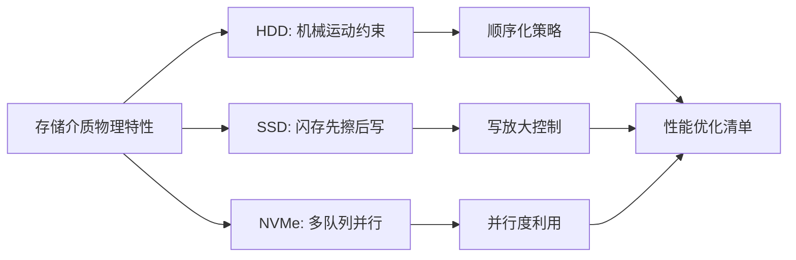
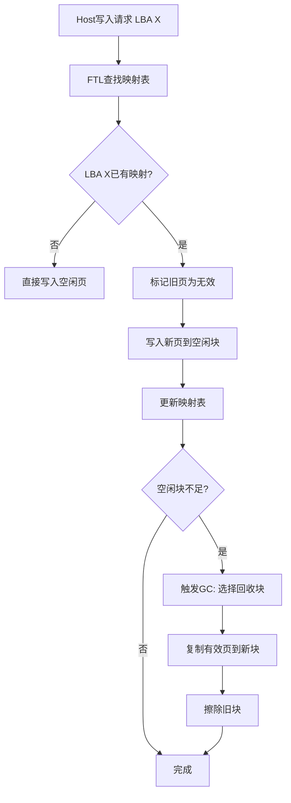
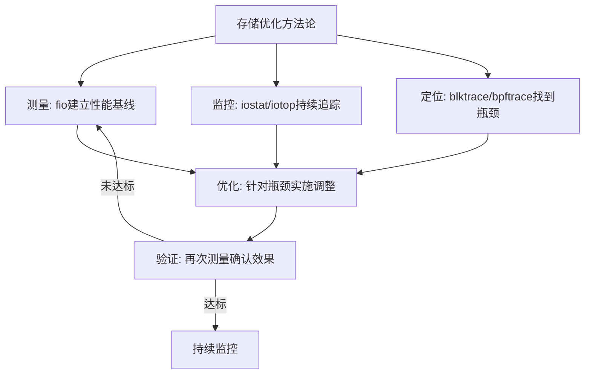

# 核心技巧

本节将存储介质的物理特性转化为可直接落地的工程实践。每个技巧聚焦一种存储介质的核心操作方法，涵盖工具使用、参数调优、问题诊断和性能基准测试。掌握这些技巧后，你将能够在真实系统中基于数据做出存储决策——而非仅凭直觉或厂商宣传。



---

## 技巧总览

| 技巧 | 核心能力 | 适用场景 | 详细页面 |
|------|---------|---------|---------|
| HDD磁盘结构与寻道 | 理解机械寻道模型，利用顺序I/O优化 | 大数据量顺序读写、日志存储、冷数据归档 | [深入学习](01-技巧1HDD磁盘结构与寻道.md) |
| SSD闪存与FTL映射 | 掌握闪存物理约束，规避写放大陷阱 | 数据库存储引擎设计、写密集型应用优化 | [深入学习](02-技巧2SSD闪存与FTL映射.md) |
| NVMe协议与队列模型 | 利用多队列并行，突破I/O瓶颈 | 高性能数据库、低延迟交易系统、实时分析 | [深入学习](03-技巧3NVMe协议与队列模型.md) |
| 性能优化清单 | 端到端I/O路径优化方法论 | 任何需要存储性能调优的系统 | [深入学习](04-性能优化清单.md) |

**阅读建议**：如果你时间有限，先通读本页的技巧总览和性能优化清单（技巧4），建立整体认知后再按需深入具体介质。如果你正在排查某个具体I/O问题，直接跳到对应介质的技巧。

---

## 技巧1：HDD磁盘结构与寻道

### 道：理解机械运动的本质

HDD的性能瓶颈完全由机械运动决定。一次完整的I/O操作需要三个物理动作协同完成：

| 动作 | 物理过程 | 时间量级 | 占比（随机4KB读） |
|------|---------|---------|-----------------|
| 寻道（Seek） | 磁头臂径向移动到目标磁道 | 3-15ms | 60-80% |
| 旋转延迟（Rotational Latency） | 等待目标扇区旋转到磁头下方 | 2-6ms（7200rpm≈4.17ms平均） | 15-30% |
| 数据传输（Transfer） | 磁头读取/写入数据 | 0.01-0.1ms | <1% |

**关键洞察**：传输时间在总延迟中占比不到1%，因此HDD优化的本质是"消灭机械运动次数"——每一次寻道都是8ms级别的代价，必须尽量避免。

这三大动作的时间量级相差悬殊——寻道和旋转是毫秒级，传输是微秒级——因此HDD的随机I/O性能本质上被机械运动所绑架。理解这一点是所有HDD优化策略的出发点：**一切优化的核心目标都是减少机械运动次数。**

### 法：I/O模式转换策略

基于HDD的物理特性，工程上形成了两大核心策略：

**策略一：随机写转顺序写（日志化）**

随机写是HDD最昂贵的操作——每次写入都需要完整的寻道+旋转周期。日志化（Journaling / Log-structuring）将多次随机写合并为一次顺序写：

随机写模式（4KB × 1000次）：
  寻道+旋转×1000 = 8ms × 1000 = 8000ms ≈ 8秒
  传输：4KB × 1000 = 4MB，约20ms
  总计：约8秒

顺序写模式（4MB × 1次）：
  寻道+旋转×1 = 8ms
  传输：4MB，约20ms
  总计：约28ms

加速比：约285倍

这就是WAL（Write-Ahead Logging）、LSM树等存储引擎设计的物理基础。MySQL InnoDB的doublewrite buffer、Redis的AOF rewrite、PostgreSQL的WAL——所有这些设计的底层逻辑都是同一个：**把随机写转化为顺序写**。

**策略二：预读与缓存（减少读寻道）**

顺序预读（Read-ahead）利用HDD顺序读的高带宽，在应用请求之前提前将后续数据读入内存。Linux内核的预读机制分为两层：

- **前进预读（Readahead）**：检测到顺序读模式后，自动将预读窗口从4KB逐步扩大到最大值（默认128KB-256KB），一旦检测到随机访问立即回退到4KB
- **异步预读（Asynchronous Readahead）**：在后台线程中执行，不阻塞当前I/O请求

```bash
# 查看当前预读窗口大小（单位：512字节扇区）
blockdev --getra /dev/sda
# 通常默认值为256（128KB）

# 对顺序读密集的场景增大预读窗口
sudo blockdev --setra 2048 /dev/sda  # 1MB

# 对随机读场景减小预读窗口，避免浪费带宽
sudo blockdev --setra 64 /dev/sda    # 32KB

# 持久化预读设置（重启后生效）
echo 'ACTION=="add|change", KERNEL=="sd*", ATTR{queue/rotational}=="1", ATTR{queue/read_ahead_kb}="1024"' | \
    sudo tee /etc/udev/rules.d/61-readahead.rules
```

**策略三：磁盘分区与数据布局**

HDD的外圈磁道比内圈磁道拥有更高的线速度（外圈周长大于内圈），因此同一盘片的外圈性能优于内圈：

典型7200rpm HDD的性能分布：
  外圈（0-25%容量）：顺序读写 ~200 MB/s，随机IOPS ~180
  中圈（25-75%容量）：顺序读写 ~150 MB/s，随机IOPS ~150
  内圈（75-100%容量）：顺序读写 ~100 MB/s，随机IOPS ~120

性能差异：外圈比内圈快约50-80%

工程启示：将高I/O负载的数据（数据库文件、日志）放在分区的前半部分（外圈），低频访问的数据（归档、备份）放在后半部分。

### 术：实操——HDD性能诊断与调优

**第一步：识别I/O模式**

使用 `iostat` 区分顺序与随机I/O：

```bash
# 每秒刷新一次，显示扩展磁盘统计
iostat -x -d sda 1

# 关键字段解读：
#   %util  — 磁盘利用率，接近100%表示I/O瓶颈
#   r/s    — 每秒读请求数
#   w/s    — 每秒写请求数
#   avgrq-sz — 平均请求大小（扇区数），>200通常表示顺序I/O
#   avgqu-sz — 平均队列长度，>2表示I/O拥塞
#   await  — 平均I/O等待时间（ms），HDD应<20ms
#   svctm  — 平均服务时间（ms），HDD约5-10ms
```

**诊断决策树**：

%util > 90%？
├─ 是 → 磁盘过载
│  ├─ await > 20ms → 随机I/O过多，考虑SSD迁移或日志化
│  └─ await < 20ms → 顺序I/O饱和，考虑增加磁盘或RAID
└─ 否 → 磁盘有余量
   ├─ avgqu-sz > 2 → 请求堆积，检查是否有进程大量提交小I/O
   └─ avgqu-sz < 2 → 性能正常

**第二步：使用 fio 进行基准测试**

```bash
# 安装fio
sudo apt-get install -y fio

# 测试1：4KB随机读IOPS（模拟数据库OLTP场景）
fio --name=randread --ioengine=libaio --direct=1 --bs=4k \
    --rw=randread --size=1G --numjobs=4 --runtime=60 \
    --filename=/dev/sda

# 测试2：顺序读带宽（模拟大文件扫描）
fio --name=seqread --ioengine=libaio --direct=1 --bs=128k \
    --rw=read --size=4G --numjobs=1 --runtime=60 \
    --filename=/dev/sda

# 测试3：顺序写吞吐（模拟日志写入）
fio --name=seqwrite --ioengine=libaio --direct=1 --bs=64k \
    --rw=write --size=2G --numjobs=1 --runtime=60 \
    --filename=/dev/sda

# 测试4：混合读写（模拟实际业务：70%读 + 30%写）
fio --name=mixed --ioengine=libaio --direct=1 --bs=8k \
    --rw=randrw --rwmixread=70 --size=1G --numjobs=4 \
    --runtime=60 --filename=/dev/sda
```

> ⚠️ **注意**：`--filename=/dev/sda` 会直接操作裸设备，测试前务必确认没有重要数据。生产环境建议使用文件而非裸设备测试。

**第三步：I/O调度器选择**

Linux内核提供了多种I/O调度器，HDD场景的选择直接影响性能：

| 调度器 | 适用场景 | 核心策略 | 延迟特点 |
|--------|---------|---------|---------|
| mq-deadline | HDD（推荐） | 按截止时间调度，防止饥饿 | 均衡，防止长尾延迟 |
| bfq | 桌面/交互 | 基于预算的公平调度 | 低延迟，适合交互场景 |
| none | SSD/NVMe | 无调度，直接下发 | 最低延迟 |
| kyber | SSD | 双队列深度控制 | 低延迟，适合快速设备 |

```bash
# 查看当前调度器
cat /sys/block/sda/queue/scheduler

# HDD推荐使用mq-deadline
echo mq-deadline | sudo tee /sys/block/sda/queue/scheduler

# 持久化设置（udev规则）
echo 'ACTION=="add|change", KERNEL=="sd*", ATTR{queue/rotational}=="1", ATTR{queue/scheduler}="mq-deadline"' | \
    sudo tee /etc/udev/rules.d/60-io-scheduler.rules

# 应用udev规则
sudo udevadm control --reload-rules &amp;&amp; sudo udevadm trigger
```

**第四步：预读窗口调优验证**

```bash
# 基准测试：默认预读（128KB）
fio --name=default_ra --ioengine=libaio --direct=1 --bs=128k \
    --rw=read --size=4G --numjobs=1 --runtime=30 \
    --filename=/dev/sda --output-format=json | jq '.jobs[0].read.bw'

# 调大预读到1MB
sudo blockdev --setra 2048 /dev/sda

# 基准测试：大预读（1MB）
fio --name=large_ra --ioengine=libaio --direct=1 --bs=128k \
    --rw=read --size=4G --numjobs=1 --runtime=30 \
    --filename=/dev/sda --output-format=json | jq '.jobs[0].read.bw'

# 对比两次带宽差异，确认预读优化效果
```

### 器：常用工具速查

| 工具 | 用途 | 关键命令 | 安装方式 |
|------|------|---------|---------|
| `iostat` | 实时磁盘I/O统计 | `iostat -x -d 1` | `apt install sysstat` |
| `fio` | 可控基准测试 | `fio --bs=4k --rw=randread` | `apt install fio` |
| `hdparm` | HDD硬件参数与简单测速 | `hdparm -t /dev/sda`（测读带宽） | `apt install hdparm` |
| `blockdev` | 块设备参数调整 | `blockdev --setra 2048 /dev/sda` | 内置 |
| `blktrace` | I/O请求追踪 | `blktrace -d /dev/sda -o - \| blkparse -i -` | `apt install blktrace` |
| `iotop` | 进程级I/O监控 | `sudo iotop -oP` | `apt install iotop` |
| `smartctl` | 硬盘健康监控 | `sudo smartctl -a /dev/sda` | `apt install smartmontools` |

### 常见误区与纠正

| 误区 | 真相 | 纄正方法 |
|------|------|---------|
| "HDD太慢，应该全部换SSD" | HDD在大容量顺序I/O场景性价比极高（$0.03/GB vs $0.10/GB），冷数据归档仍是HDD的主场 | 采用分层存储：热数据SSD + 冷数据HDD |
| "RAID 0可以线性提升IOPS" | RAID 0的IOPS提升取决于控制器和条带大小，4KB随机I/O下提升可能不到2倍 | 用fio实测对比，不要假设线性扩展 |
| "关闭预读总能提升性能" | 对顺序扫描（全表扫描、备份恢复），预读能将吞吐提升5-10倍 | 仅对纯随机读场景关闭预读 |
| "iostat的svctm可以准确反映HDD延迟" | svctm在高负载下不准确（基于%util反算），await更可靠 | 以await为主要延迟指标，svctm仅参考 |
| "磁盘使用率高=磁盘有问题" | %util=100%只是表示队列非空，不代表磁盘饱和——NVMe的%util经常100%但延迟极低 | 结合await和avgqu-sz综合判断 |

---

## 技巧2：SSD闪存与FTL映射

### 道：理解闪存的"先擦后写"约束

SSD的闪存芯片有三条硬性物理约束，它们是一切SSD优化策略的根基：

1. **写前擦除（Erased-before-Write）**：不能像DRAM那样原地覆写，必须先将整个擦除块（128KB-数MB）擦除为全1，再按页（4KB-16KB）写入
2. **读写粒度不对称**：读以页为单位（4KB），写以页为单位（4KB），擦除以块为单位（128KB+），粒度差32倍以上
3. **擦除次数有限**：SLC约10万次，MLC约1万次，TLC约3千次，QLC约1千次，超过后数据可靠性无法保证

这三条约束的直接后果是：**SSD上的每一次覆写都会引发一次"读旧页→写新块→擦旧块"的连锁操作，这就是写放大（Write Amplification）的根源。**

**NAND闪存类型对比**：

| 类型 | 每单元比特 | P/E次数 | 读延迟 | 写延迟 | 成本/GB | 适用场景 |
|------|-----------|---------|--------|--------|---------|---------|
| SLC | 1 | ~100,000 | ~25μs | ~200μs | $0.50+ | 企业缓存、极端写密集 |
| MLC | 2 | ~10,000 | ~50μs | ~500μs | $0.20 | 企业级SSD |
| TLC | 3 | ~3,000 | ~75μs | ~800μs | $0.08-0.12 | 消费级/企业级主流 |
| QLC | 4 | ~1,000 | ~100μs | ~2ms | $0.05-0.08 | 读密集、大容量存储 |

> **工程选择建议**：消费级TLC SSD在大多数场景下是最佳性价比选择。QLC适合读密集的大容量存储（如数据仓库的冷数据层），但写密集场景（如数据库WAL）应避免使用。

**FTL（Flash Translation Layer）的核心机制**

FTL是SSD控制器中的固件，负责将逻辑地址（LBA）映射到物理闪存页面。它的三大核心任务：

1. **地址映射**：维护LBA→物理页面的映射表（通常存储在DRAM中，每GB闪存需要约1MB映射表空间）
2. **垃圾回收（GC）**：将分散在不同块中的有效数据合并，回收无效块
3. **磨损均衡（Wear Leveling）**：确保所有擦除块的使用次数大致相同，避免局部先坏



### 法：规避写放大的三大策略

**策略一：对齐写入**

确保每次写入大小是闪存页大小的整数倍，避免部分页写入导致的read-modify-write开销：

```bash
# 查看SSD的物理参数（需要支持ATA IDENTIFY DEVICE的工具）
sudo hdparm -I /dev/nvme0n1 | grep -i sector
# Logical/Physical Sector Size: 512 / 4096  ← 4K原生扇区

# 使用fio测试对齐写入 vs 非对齐写入的差异
# 对齐写入（4KB边界）
fio --name=aligned --bs=4k --rw=randwrite --direct=1 \
    --filename=/dev/nvme0n1 --size=1G --runtime=30

# 非对齐写入（512B，触发read-modify-write）
fio --name=unaligned --bs=512 --rw=randwrite --direct=1 \
    --filename=/dev/nvme0n1 --size=1G --runtime=30
```

**实际影响示例**：对于4K原生扇区的SSD，512B写入需要先读取4KB页、修改512B、再写回4KB——写入放大理论值为8倍。对齐写入则无此开销。

**策略二：顺序写入优先**

顺序写入让FTL可以将数据连续分配到同一擦除块内，最大化块利用率，减少垃圾回收频率：

随机写（WAF约5-10）：
  LBA 1000 → Block A Page 3
  LBA 1001 → Block C Page 7    ← 跨块写入，碎片化严重
  LBA 1002 → Block B Page 1
  → 3个块各使用1页，剩余页全部浪费

顺序写（WAF约1-1.5）：
  LBA 1000 → Block A Page 0
  LBA 1001 → Block A Page 1    ← 连续写入同一块
  LBA 1002 → Block A Page 2
  → 1个块连续使用3页，无碎片

**策略三：预留空间管理**

SSD的预留空间（Over-Provisioning, OP）是垃圾回收的"工作缓冲区"：

```bash
# OP的计算公式
# OP = (物理闪存容量 - 可用逻辑容量) / 物理闪存容量
# 标准OP：7%（消费级）到 28%（企业级）

# 使用hdparm查看真实容量
sudo hdparm -N /dev/sda
# maxsectors = NNNNN  ← 实际可寻址扇区数

# 通过分区预留额外OP（假设500GB SSD，物理容量512GB）
# 仅分区450GB，剩余62GB作为OP
# 在分区时设置 end sector 为 450GB 对应的扇区号

# OP对性能的实测影响（随机写IOPS）：
# 7% OP（标准）：  ████████████████        ~50,000 IOPS
# 14% OP（中等）：  ██████████████████████  ~65,000 IOPS（+30%）
# 28% OP（企业）：  ██████████████████████████ ~80,000 IOPS（+60%）
```

**策略四：TRIM与垃圾回收协同**

TRIM是SSD生命周期管理的关键——当文件系统删除文件后，通过TRIM通知SSD哪些LBA已无效，让SSD可以在空闲时提前回收：

```bash
# 查看TRIM支持
lsblk -D /dev/nvme0n1
# DISC-GRAN 和 DISC-MAX 非零表示支持TRIM

# 手动TRIM（慎用，大容量SSD可能耗时数分钟）
sudo fstrim -v /
# /: 123.4 GiB (132549943296 bytes) trimmed

# 启用周期性TRIM（推荐）
sudo systemctl enable fstrim.timer
sudo systemctl start fstrim.timer
# 默认每周日凌晨执行一次

# 验证定时任务
sudo systemctl status fstrim.timer
```

> ⚠️ **注意**：不要对正在运行的数据库执行`blkdiscard`或频繁`fstrim`——大量TRIM操作会暂时降低SSD性能（控制器忙于更新映射表和回收块）。

### 术：实操——SSD健康监控与寿命预测

**第一步：读取SSD健康信息**

```bash
# 使用smartctl读取SMART属性
sudo apt-get install -y smartmontools
sudo smartctl -a /dev/nvme0n1

# 关键属性解读（NVMe SMART）：
#   Percentage Used        — 已用寿命百分比（0-100%，超过100%通常仍可使用）
#   Data Units Written     — 累计写入量（NVMe：1 unit = 512KB）
#   Data Units Read        — 累计读取量
#   Available Spare        — 可用备用块百分比（低于10%应考虑更换）
#   Available Spare Threshold — 厂商设定的备用块阈值
#   Media and Data Int. Errors — 数据完整性错误数（>0需警惕）
#   Unsafe Shutdowns       — 不安全关机次数（影响FTL元数据一致性）
#   Power Cycles           — 通电次数
#   Power On Hours         — 通电小时数
```

**第二步：计算写入放大系数**

```bash
# 使用fio测量WAF的完整流程

# 1. 清除缓存，确保写入落盘
sudo sh -c 'sync; echo 3 > /proc/sys/vm/drop_caches'

# 2. 记录当前SSD累计写入量
BEFORE=$(sudo smartctl -A /dev/nvme0n1 | grep "Data Units Written" | awk '{print $3}')
echo "测试前SSD写入量: $BEFORE units"

# 3. 执行1GB随机写入测试
fio --name=waf_test --bs=4k --rw=randwrite --direct=1 \
    --filename=/dev/nvme0n1 --size=1G --runtime=60 \
    --end_fsync=1 --fsync_on_close=1

# 4. 再次读取写入量
AFTER=$(sudo smartctl -A /dev/nvme0n1 | grep "Data Units Written" | awk '{print $3}')
echo "测试后SSD写入量: $AFTER units"

# 5. 计算WAF
# NVMe SMART中1个Data Unit = 512KB
HOST_WRITTEN_GB=1        # 我们写入了1GB
SSD_WRITTEN_GB=$(echo "scale=4; ($AFTER - $BEFORE) * 512 / 1048576" | bc)
WAF=$(echo "scale=2; $SSD_WRITTEN_GB / $HOST_WRITTEN_GB" | bc)
echo "主机写入: ${HOST_WRITTEN_GB} GB"
echo "SSD实际写入: ${SSD_WRITTEN_GB} GB"
echo "WAF = $WAF"
# WAF < 2.0 为优秀
# WAF 2.0-5.0 为正常范围
# WAF > 5.0 需要优化（检查是否大量小随机写）
```

**第三步：预测SSD寿命**

```bash
# 已写入数据量（TB）
TBW_CURRENT=$(sudo smartctl -A /dev/nvme0n1 | grep "Data Units Written" | awk '{print $3}' | \
    awk '{printf "%.2f", $1 * 512 / 1024 / 1024 / 1024}')

# 厂商标称TBW（查看规格书，例如 Samsung 970 EVO 1TB = 600 TBW）
RATED_TBW=600

# 剩余寿命百分比
REMAINING=$(echo "scale=1; 100 - $TBW_CURRENT / $RATED_TBW * 100" | bc)
echo "已写入: ${TBW_CURRENT} TB / ${RATED_TBW} TB"
echo "剩余寿命: ${REMAINING}%"

# 日均写入量与预计剩余天数
DAYS_POWERED_ON=$(sudo smartctl -A /dev/nvme0n1 | grep "Power On Hours" | awk '{print $3}')
DAILY_WRITE=$(echo "scale=2; $TBW_CURRENT * 1024 / $DAYS_POWERED_ON" | bc)  # GB/day
REMAINING_TB=$(echo "scale=2; ($RATED_TBW - $TBW_CURRENT) * 1024 / $DAILY_WRITE / 365" | bc)
echo "日均写入: ${DAILY_WRITE} GB"
echo "预计剩余寿命: ${REMAINING_TB} 年"
```

**第四步：SSD TRIM健康检查**

```bash
# 检查TRIM是否正常工作
# 1. 创建测试文件
dd if=/dev/zero of=/tmp/trim_test bs=1M count=100
sync

# 2. 删除文件
rm /tmp/trim_test
sync

# 3. 手动TRIM
sudo fstrim -v /
# 观察输出：/ xxx GiB trimmed

# 4. 对比TRIM前后的可用空间
df -h /
```

### 器：SSD优化工具集

| 工具 | 用途 | 关键命令 | 安装方式 |
|------|------|---------|---------|
| `smartctl` | SSD健康状态与SMART属性 | `sudo smartctl -a /dev/nvme0n1` | `apt install smartmontools` |
| `nvme-cli` | NVMe设备专用管理工具 | `nvme smart-log /dev/nvme0n1` | `apt install nvme-cli` |
| `fio` | 闪存感知的基准测试 | `fio --ioengine=io_uring` | `apt install fio` |
| `fstrim` | 手动触发TRIM | `sudo fstrim -v /` | `apt install util-linux` |
| `blkdiscard` | 全盘安全擦除（慎用） | `sudo blkdiscard /dev/nvme0n1` | 内置 |
| `hdparm` | 查看SSD物理参数 | `sudo hdparm -I /dev/nvme0n1` | `apt install hdparm` |

### 常见误区与纠正

| 误区 | 真相 | 纠正方法 |
|------|------|---------|
| "SSD不需要碎片整理" | SSD无需传统碎片整理（会白白消耗P/E次数），但文件系统碎片会影响TRIM效果和读放大 | 使用 `fstrim` 定期释放无效块，而非碎片整理 |
| "SSD寿命很短，不敢写" | 现代TLC SSD标称600 TBW，日均写入8GB可用200+年 | 正常使用即可，关注SMART中的Percentage Used |
| "TRIM自动执行就够了" | 部分Linux发行版默认每7天才执行一次TRIM | 启用周期性TRIM：`systemctl enable fstrim.timer` |
| "写入量越少SSD越好" | 过度减少写入可能增加读放大（数据分散在更多块中） | 平衡读写比，保持合理的写入量 |
| "QLC和TLC性能一样" | QLC的写入延迟是TLC的2-3倍，且随机写IOPS显著更低 | 写密集场景选TLC，读密集场景QLC可以接受 |
| "SSD的4K对齐不重要了" | 现代SSD大多默认4K对齐，但旧系统迁移或手动分区可能破坏对齐 | 用`fdisk -l`检查Start Sector是否为8的倍数 |

---

## 技巧3：NVMe协议与队列模型

### 道：理解从AHCI到NVMe的范式跃迁

AHCI协议为HDD设计，基于两个过时假设：(1) 设备延迟很高（毫秒级），软件栈开销可以忽略；(2) 一个命令队列足够。SSD将设备延迟压缩到微秒级后，软件栈本身成了瓶颈：

AHCI延迟分解（SATA SSD，4KB随机读）：
  软件栈开销：~8-12μs（VFS → SCSI层 → AHCI驱动 → 中断处理）
  硬件延迟：  ~80-100μs
  软件占比：  ~10-15%

NVMe延迟分解（NVMe SSD，4KB随机读）：
  软件栈开销：~2-3μs（VFS → NVMe驱动 → doorbell ring）
  硬件延迟：  ~10-80μs
  软件占比：  ~3-5%

NVMe的核心设计哲学是：**既然硬件延迟已经被压缩到极致，那就用最少的软件层级、最多的并行队列来匹配硬件能力。**

**NVMe相比AHCI的关键改进**：

| 维度 | AHCI (SATA) | NVMe | 改进倍数 |
|------|-------------|------|---------|
| 命令队列数 | 1 | 65,535 | 65,535x |
| 每队列深度 | 32 | 65,536 | 2,048x |
| 命令集 | 读/写/刷 | 读/写/写零/比较等 | 更丰富 |
| 中断方式 | 共享中断 | MSI-X（每队列独立中断） | 无竞争 |
| 最大带宽 | 600 MB/s (SATA III) | 7,000 MB/s (PCIe 4.0 x4) | 11.7x |
| 功耗管理 | 2种状态 | 5种状态（更精细） | 更节能 |

### 法：利用NVMe多队列并行的三重策略

**策略一：队列深度与IOPS的关系**

NVMe SSD的内部并行度需要通过足够的队列深度来激活：

队列深度 vs IOPS（典型企业级NVMe SSD，4KB随机读）：

QD=1:     ████                                    ~20,000 IOPS
QD=4:     ████████████████                         ~80,000 IOPS
QD=16:    ████████████████████████████             ~200,000 IOPS
QD=32:    ████████████████████████████████████      ~350,000 IOPS
QD=64:    ██████████████████████████████████████████████ ~500,000 IOPS
QD=128:   ██████████████████████████████████████████████ ~500,000 IOPS (饱和)

关键洞察：
  QD=1到QD=32是性能提升最陡峭的区间（斜率最大）
  QD>64后收益递减，且增加请求延迟
  最佳实践：数据库场景QD=16-64，超低延迟场景QD=1-4

**策略二：NUMA感知的队列分配**

在多CPU插槽的服务器上，跨NUMA节点访问NVMe设备会导致额外的内存延迟（约100-200ns额外开销）：

```bash
# 查看NVMe设备的NUMA节点
cat /sys/block/nvme0n1/device/numa_node
# 0 或 1

# 查看NVMe设备的中断亲和性
cat /proc/interrupts | grep nvme
# 确认中断分布在哪个NUMA节点的CPU上

# 绑定I/O线程到正确的NUMA节点
# 使用numactl确保I/O线程运行在与NVMe设备相同的NUMA节点
numactl --cpunodebind=0 --membind=0 ./io_thread

# 或使用taskset绑定CPU亲和性
taskset -c 0-15 ./io_thread  # 绑定到CPU 0-15（NUMA node 0）

# 查看系统NUMA拓扑
numactl --hardware
# node distances:
# node   0   1
#   0:  10  21   ← 跨节点延迟2倍
#   1:  21  10
```

**策略三：用户态I/O——绕过内核**

对于延迟要求低于20μs的场景，SPDK（Storage Performance Development Kit）提供完全绕过内核的用户态NVMe驱动：

内核态路径（延迟约15-20μs）：
  应用 → 系统调用 → VFS → 块层（合并/调度） → NVMe驱动 → 硬件
       ^^^^^^^^^^^^^^^^^^^^^^^^^^^^^^^^^^^^^^^^
       这些层级的开销在NVMe下占比过高

SPDK用户态路径（延迟约10-12μs）：
  应用 → 用户态NVMe驱动 → UIO/VFIO → PCIe BAR → 硬件
       ^^^^^^^^^^^^^^^^^^^^^^^^^^^^^^^^^^^^^^^^
       绕过内核，直接操作硬件

延迟节省：约5-8μs（约30-40%提升）
吞吐提升：约20-30%（减少上下文切换和锁竞争）

**SPDK适用场景**：数据库日志写入、实时分析引擎、存储虚拟化层（如Ceph OSD后端）。不适用场景：通用文件服务、开发测试环境。

### 术：实操——NVMe性能测试与调优

**第一步：识别NVMe设备和配置**

```bash
# 列出所有NVMe设备及其详细信息
nvme list

# 查看设备详细信息（包括固件版本、队列数、支持的特性）
nvme id-ctrl /dev/nvme0n1

# 查看NVMe命名空间信息
nvme id-ns /dev/nvme0n1

# 查看NVMe设备的NUMA节点和中断亲和性
cat /sys/block/nvme0n1/device/numa_node
cat /proc/interrupts | grep nvme

# 查看NVMe固件版本（某些固件有性能bug）
nvme fw-log /dev/nvme0n1
```

**第二步：使用fio进行NVMe专项测试**

```bash
# 测试1：单队列深度极限延迟（模拟延迟敏感场景）
fio --name=qd1 --ioengine=io_uring --direct=1 --bs=4k \
    --rw=randread --size=1G --numjobs=1 --iodepth=1 \
    --runtime=60 --filename=/dev/nvme0n1 \
    --lat_percentiles=1 --output-format=json

# 测试2：多队列深度最大IOPS（模拟数据库OLTP）
fio --name=qd32 --ioengine=io_uring --direct=1 --bs=4k \
    --rw=randread --size=1G --numjobs=8 --iodepth=4 \
    --runtime=60 --filename=/dev/nvme0n1

# 测试3：混合读写（模拟OLTP：70%读 + 30%写）
fio --name=mixed --ioengine=io_uring --direct=1 --bs=8k \
    --rw=randrw --rwmixread=70 --size=2G --numjobs=8 \
    --iodepth=4 --runtime=60 --filename=/dev/nvme0n1

# 测试4：大块顺序写（模拟日志/WAL写入）
fio --name=wal --ioengine=io_uring --direct=1 --bs=64k \
    --rw=write --size=4G --numjobs=1 --iodepth=1 \
    --runtime=60 --filename=/dev/nvme0n1

# 测试5：带宽极限测试（评估硬件上限）
fio --name=bandwidth --ioengine=io_uring --direct=1 --bs=128k \
    --rw=read --size=8G --numjobs=4 --iodepth=16 \
    --runtime=60 --filename=/dev/nvme0n1
```

**第三步：io_uring配置优化**

```bash
# 查看内核io_uring支持
uname -r  # 需要 5.1+，建议 5.10+ 获得完整特性

# 检查io_uring是否被禁用（某些安全策略会禁用）
cat /proc/sys/fs/io_uring_disabled
# 0=启用, 1=禁用

# 对数据库等低延迟应用，建议在应用代码中配置：
# - IORING_SETUP_SQPOLL: 内核轮询模式，减少系统调用开销
# - IORING_SETUP_IOPOLL: 完成事件轮询，减少中断开销
# - sq_thread_idle: 控制轮询线程的空闲超时
```

**第四步：中断亲和性调优**

```bash
# 查看NVMe中断分布
cat /proc/interrupts | grep nvme
# 输出示例：
#  42:  1234567  PCI-MSI nvme0q0
#  43:  2345678  PCI-MSI nvme0q1
#  44:  3456789  PCI-MSI nvme0q2

# 将NVMe中断分散到不同CPU核心（避免单核过载）
# 例如将irq 42绑定到CPU 2
echo 4 | sudo tee /proc/irq/42/smp_affinity  # 4 = 二进制100 = CPU 2

# 使用irqbalance自动均衡（适用于多NVMe设备）
sudo systemctl enable irqbalance
sudo systemctl start irqbalance

# 手动设置中断亲和性脚本（生产环境推荐）
# 查看NVMe中断号
NVME_IRQS=$(grep nvme /proc/interrupts | awk -F: '{print $1}' | tr -d ' ')
# 均匀分布到所有CPU
NR_CPUS=$(nproc)
IRQ_IDX=0
for irq in $NVME_IRQS; do
    CPU=$((IRQ_IDX % NR_CPUS))
    CPU_MASK=$(printf "%x" $((1 << CPU)))
    echo $CPU_MASK | sudo tee /proc/irq/$irq/smp_affinity > /dev/null
    IRQ_IDX=$((IRQ_IDX + 1))
done
```

### 器：NVMe工具生态

| 工具 | 用途 | 关键命令 | 安装方式 |
|------|------|---------|---------|
| `nvme-cli` | NVMe设备管理瑞士军刀 | `nvme smart-log /dev/nvme0n1` | `apt install nvme-cli` |
| `fio` | 基准测试（支持io_uring引擎） | `fio --ioengine=io_uring` | `apt install fio` |
| `SPDK` | 用户态NVMe驱动（超低延迟） | `spdk_tgt` + `bdevperf` | 需从源码编译 |
| `perf` | I/O路径性能分析 | `perf record -e block:* -a` | `apt install linux-tools-$(uname -r)` |
| `bpftrace` | 内核I/O追踪（BPF） | `bpftrace -e 'tracepoint:block:block_rq_complete { printf("lat: %d ns\n", args->nr_sector); }'` | `apt install bpftrace` |
| `numactl` | NUMA亲和性绑定 | `numactl --cpunodebind=0 ./app` | `apt install numactl` |

### 常见误区与纠正

| 误区 | 真相 | 纠正方法 |
|------|------|---------|
| "NVMe设备不需要调优" | NVMe设备需要匹配的软件栈（多队列、高并发）才能发挥性能 | 使用io_uring + 多线程 + 高队列深度 |
| "队列深度越高越好" | QD>64后IOPS提升递减，且增加请求延迟 | 用fio找到QD-IOPS曲线的拐点，通常QD=32-64最优 |
| "NVMe和SATA SSD在数据库中差异不大" | 在高并发OLTP场景，NVMe的IOPS是SATA SSD的5-10倍 | 高并发场景必须用NVMe，低并发场景SATA SSD足够 |
| "io_uring总是比epoll快" | io_uring的优势主要在块I/O，网络I/O中epoll可能更成熟 | 根据场景选择：块I/O用io_uring，网络I/O评估两者 |
| "NUMA不影响NVMe性能" | 跨NUMA访问NVMe会导致100-200ns额外延迟，累积效应显著 | 确认NVMe设备的NUMA节点，绑定I/O线程到同节点 |

---

## 技巧4：存储I/O性能优化清单

本清单将前面三个技巧的核心方法整合为一份可执行的优化检查表。按优先级从高到低排列，适用于任何涉及存储I/O的系统。

### 第一层：架构决策（影响最大，调整成本最高）

| 检查项 | 说明 | 操作 | 优先级 |
|--------|------|------|--------|
| 存储介质选型 | 根据I/O模式选择HDD/SSD/NVMe | 用fio测试实际工作负载的IOPS和带宽需求 | P0 |
| 分层存储架构 | 热数据SSD + 温数据SATA SSD + 冷数据HDD | 设计数据生命周期策略，定义"热/温/冷"阈值 | P0 |
| 存储引擎选型 | LSM树（写密集）vs B+树（读密集） | 基于读写比选择：写>读用LSM，读>写用B+树 | P1 |
| 网络存储 vs 本地存储 | 延迟敏感用本地NVMe，持久性优先用云盘 | 评估延迟容忍度和数据重要性 | P1 |
| 数据冗余策略 | RAID 1/5/6 vs 副本 vs 纠删码 | 评估可用性要求和恢复时间目标（RTO） | P1 |

### 第二层：系统级配置（影响显著，调整成本中等）

| 检查项 | 说明 | 命令 | 优先级 |
|--------|------|------|--------|
| I/O调度器选择 | HDD用mq-deadline，NVMe用none | `echo none > /sys/block/nvme0n1/queue/scheduler` | P1 |
| 预读窗口调整 | 顺序读增大，随机读减小 | `blockdev --setra <sectors> /dev/sdX` | P1 |
| NUMA亲和性 | I/O线程与NVMe设备同NUMA节点 | `numactl --cpunodebind=0 ./app` | P1 |
| 文件系统选择 | ext4通用，XFS大文件/高并发，btrfs快照 | `mkfs.xfs /dev/nvme0n1` | P2 |
| TRIM配置 | 定期释放SSD无效块 | `systemctl enable fstrim.timer` | P2 |
| 内存锁定限制 | io_uring需要RLIMIT_MEMLOCK | `ulimit -l unlimited`（或systemd限制） | P2 |
| 文件系统挂载选项 | noatime减少元数据写入，barrier控制数据安全 | `mount -o noatime,nodiratime,data=writeback` | P2 |

### 第三层：应用级优化（影响适中，调整成本较低）

| 检查项 | 说明 | 方法 | 优先级 |
|--------|------|------|--------|
| Direct I/O vs Buffered I/O | 数据库通常用Direct I/O避免双缓冲 | `open(path, O_DIRECT)` | P1 |
| I/O合并 | 将小I/O合并为大I/O减少操作次数 | 内核自动合并 + 应用批量提交 | P2 |
| 异步I/O | 避免I/O阻塞主处理线程 | io_uring / libaio / epoll | P2 |
| 写入对齐 | 确保写入大小是扇区/页的整数倍 | 4KB对齐（现代SSD）或512B对齐 | P2 |
| 并发控制 | 减少I/O路径上的锁竞争 | 每线程独立队列（NVMe多队列） | P3 |
| 批量提交 | 减少fsync/fdatasync调用频率 | 事务日志合并，定期刷盘 | P2 |

### 第四层：监控与调优（持续改进）

| 检查项 | 说明 | 工具 | 优先级 |
|--------|------|------|--------|
| 实时I/O监控 | 识别瓶颈和异常模式 | `iostat -x 1`、`iotop` | P2 |
| 基准测试 | 建立性能基线，量化优化效果 | `fio` 4种场景（随机读/写、顺序读/写） | P2 |
| 延迟追踪 | 定位I/O延迟的来源 | `blktrace`、`bpftrace` | P3 |
| SSD健康监控 | 追踪写入量和剩余寿命 | `smartctl -a`、`nvme smart-log` | P2 |
| 性能回归检测 | CI/CD中集成基准测试 | 定期fio测试 + 告警阈值 | P3 |
| 日志与审计 | 记录I/O异常事件 | `auditd`、应用日志分析 | P3 |

### 文件系统选择决策树

你的场景是什么？
├─ 通用服务器（Web/应用服务器）
│  └─ ext4：成熟稳定，工具丰富，适合中小规模
├─ 大文件/高并发（数据库、视频处理）
│  └─ XFS：优秀的并行I/O性能，大文件处理能力强
├─ 需要快照/子卷/压缩
│  └─ btrfs/ZFS：数据完整性校验，透明压缩，快照
├─ 嵌入式/Flash存储
│  └─ ext4（data=journal）或 F2FS（Flash友好）
└─ 不确定
   └─ ext4（最安全的选择，几乎所有场景都能胜任）

**文件系统挂载选项速查**：

| 选项 | 作用 | 适用场景 | 注意事项 |
|------|------|---------|---------|
| `noatime` | 不更新文件访问时间 | 所有场景推荐 | 减少30-50%元数据写入 |
| `nodiratime` | 不更新目录访问时间 | 与noatime配合使用 | 进一步减少元数据写入 |
| `data=writeback` | 元数据日志模式，不保证数据写入顺序 | 有UPS的服务器 | 数据安全性降低 |
| `data=ordered` | 数据先于元数据写入 | 默认模式，平衡安全与性能 | ext4默认值 |
| `data=journal` | 数据和元数据都写日志 | 极端安全需求 | 性能损失约20-30% |
| `discard` | 挂载时自动TRIM | SSD | 可能影响写入性能 |
| `barrier=0` | 禁用写屏障 | 有UPS/BBU的RAID | 电池耗尽时可能丢数据 |

---

## 实战案例：从HDD到NVMe的存储升级

### 背景

某电商平台的MySQL数据库运行在SATA HDD上，随着业务增长，I/O延迟导致查询超时频发：

升级前指标（HDD）：
  随机读IOPS：~120（4KB随机读）
  写入带宽：~150 MB/s
  P99延迟：~25ms
  月均I/O超时次数：~200次
  数据库QPS：~500（受限于I/O瓶颈）

### 升级路径

**第一阶段：HDD → SATA SSD**

```bash
# 1. 使用mysqldump导出数据
mysqldump --all-databases --single-transaction | gzip > /backup/pre_upgrade.sql.gz

# 2. 更换存储介质

# 3. 创建XFS文件系统（大文件性能优于ext4）
mkfs.xfs /dev/sda

# 4. 挂载并优化挂载选项
mount -o noatime,nodiratime /dev/sda /var/lib/mysql

# 5. 调整MySQL I/O参数
# innodb_flush_method = O_DIRECT           # 避免双缓冲
# innodb_io_capacity = 2000                # SATA SSD能力
# innodb_io_capacity_max = 4000            # 突发能力
# innodb_flush_neighbors = 0               # SSD不需要合并邻近页
# innodb_log_file_size = 1G                # 增大日志文件减少刷盘频率
```

第一阶段指标（SATA SSD）：
  随机读IOPS：~75,000（提升625倍）
  写入带宽：~480 MB/s（提升3.2倍）
  P99延迟：~0.8ms（降低97%）
  月均I/O超时次数：0次
  数据库QPS：~5,000（提升10倍）

**第二阶段：SATA SSD → NVMe SSD**

```bash
# 1. 确认NVMe设备
nvme list

# 2. 设置NVMe调度器为none（无调度，最低延迟）
echo none > /sys/block/nvme0n1/queue/scheduler

# 3. 确认NUMA节点亲和性
cat /sys/block/nvme0n1/device/numa_node
# 绑定MySQL到对应NUMA节点
numactl --cpunodebind=0 --membind=0 mysqld

# 4. 启用io_uring（MySQL 8.0.30+支持）
# 在my.cnf中配置：
# innodb_use_native_aio = 1
# innodb_flush_method = O_DIRECT_NO_FSYNC  # NVMe掉电安全性足够
# innodb_io_capacity = 10000               # NVMe能力
# innodb_io_capacity_max = 20000

# 5. 启用周期性TRIM
systemctl enable fstrim.timer
```

第二阶段指标（NVMe SSD）：
  随机读IOPS：~450,000（再提升6倍）
  写入带宽：~3,200 MB/s（再提升6.7倍）
  P99延迟：~0.05ms（再降低94%）
  月均I/O超时次数：0次
  数据库QPS：~25,000（再提升5倍）

### 总结对比

| 指标 | HDD | SATA SSD | NVMe SSD | HDD→NVMe累计 |
|------|-----|----------|----------|-------------|
| 随机读IOPS | 120 | 75,000 | 450,000 | 3,750x |
| 写入带宽 | 150 MB/s | 480 MB/s | 3,200 MB/s | 21x |
| P99延迟 | 25ms | 0.8ms | 0.05ms | 500x |
| 数据库QPS | 500 | 5,000 | 25,000 | 50x |
| 月均超时 | 200次 | 0次 | 0次 | — |

**关键决策复盘**：

1. **HDD→SATA SSD**是性价比最高的升级：IOPS提升625倍，成本仅增加3-5倍
2. **SATA SSD→NVMe**适合高并发场景：再提升6倍IOPS，但成本增加2-3倍
3. **MySQL参数调优**是免费的性能提升：`innodb_flush_neighbors=0`在SSD上可带来5-10%额外收益

---

## 本节小结

核心技巧的本质是将存储介质的物理特性转化为工程决策：

1. **HDD**的核心是"减少机械运动"——通过顺序写、预读、合并I/O来规避随机访问的高延迟。HDD不会消亡，在大容量冷存储场景仍有不可替代的性价比优势。
2. **SSD**的核心是"减少写放大"——通过对齐写入、顺序写入、预留空间管理和TRIM来延长寿命并稳定性能。理解FTL的工作原理是做出正确SSD优化决策的前提。
3. **NVMe**的核心是"充分利用并行"——通过多队列、高队列深度、NUMA亲和、io_uring和用户态I/O来匹配硬件能力。NVMe不仅仅是更快的接口，更是一种全新的I/O范式。
4. **性能优化**的核心是"先测量再优化"——用fio建立基线，用iostat监控瓶颈，用blktrace/bpftrace定位延迟来源。没有数据支撑的优化都是盲人摸象。



从HDD到SSD再到NVMe，存储介质每一代升级都带来了数量级的性能提升，但也带来了新的优化维度。理解底层物理原理，才能在系统设计中做出正确的技术选择——这正是"道法术器"贯通的意义所在。
