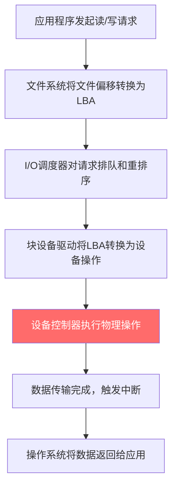
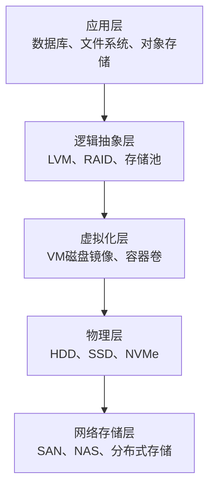

# 存储介质核心概念

## 1. 什么是存储介质

存储介质（Storage Medium）是计算机系统中用于持久化保存数据的物理载体。与内存（DRAM）不同，存储介质的核心特征是**非易失性**——断电后数据不会丢失。这一特性使存储介质成为所有需要长期保存数据的系统的物理基础。

从数据库的日志文件到云对象存储中的图片，从操作系统的交换分区到分布式文件系统的数据块，存储介质无处不在。理解存储介质的物理原理和性能特征，是做出正确系统设计决策的前提。一次HDD随机读取的时间（约8ms）足够现代CPU执行数百万条指令，存储I/O往往成为整个系统的性能瓶颈。

### 1.1 存储介质的核心属性

每一种存储介质都可以从以下五个维度进行刻画：

| 属性 | 含义 | 为什么重要 |
|------|------|-----------|
| **持久性（Durability）** | 断电后数据保持不变的能力 | 数据库事务的ACID中D的物理保障 |
| **容量（Capacity）** | 可存储的数据总量 | 决定系统能承载的数据规模 |
| **性能（Performance）** | 读写速度，包括延迟和吞吐量 | 直接影响应用响应时间 |
| **成本（Cost）** | 每GB的单位价格 | 决定存储架构的经济可行性 |
| **可靠性（Reliability）** | 数据不出错、不丢失的概率 | 通常用MTBF（平均无故障时间）衡量 |

这五个属性之间存在天然的trade-off：速度越快的介质通常越贵、容量越小；容量越大、成本越低的介质通常速度越慢。存储系统设计的核心挑战之一，就是在这些约束之间找到最优平衡。

### 1.2 存储介质的分类体系

根据物理原理和访问特性，存储介质可以按以下维度分类：

**按数据易失性分类：**

- **易失性存储（Volatile）**：断电后数据丢失，如DRAM、SRAM。速度快但不能持久保存。
- **非易失性存储（Non-Volatile）**：断电后数据保持，如NAND Flash、HDD、磁带、PMEM。速度较慢但可持久保存。

**按访问方式分类：**

- **块设备（Block Device）**：以固定大小的块（通常512B或4KB）为单位进行随机读写，如HDD、SSD。操作系统通过块接口访问，是文件系统和数据库的基础。
- **字节寻址设备（Byte-Addressable）**：可以像内存一样按任意字节地址直接读写，如PMEM（持久化内存）、DRAM。无需经过块层，延迟更低。
- **对象/文件设备**：以对象或文件为单位进行访问，如S3、HDFS。适合大文件的顺序读写。

**按物理存储原理分类：**

- **磁性存储**：利用磁性颗粒的极化方向表示数据（HDD、磁带）
- **半导体存储**：利用晶体管中的电荷表示数据（DRAM、NAND Flash、3D XPoint）
- **光学存储**：利用激光在介质表面刻录凹坑表示数据（CD、DVD、Blu-ray，已基本退出主流）

## 2. 存储层次结构

现代计算机系统的存储架构呈金字塔形，从上到下速度递减、容量递增、成本递减。这一层次结构（Memory Hierarchy）是理解所有存储相关设计决策的基石。

### 2.1 层次结构总览

┌─────────────┐
│   寄存器     │  ~1ns, <1KB         ← CPU内部，最快最贵
├─────────────┤
│   L1 Cache  │  ~1-2ns, 32-64KB    ← 指令/数据分离
├─────────────┤
│   L2 Cache  │  ~3-10ns, 256KB-1MB  ← 统一缓存
├─────────────┤
│   L3 Cache  │  ~10-20ns, 数MB-数十MB  ← 多核共享
├─────────────┤
│   主存 DRAM  │  ~50-100ns, 数GB-数TB   ← 操作系统管理
├─────────────┤
│  PMEM/NVM   │  ~100ns-10μs, 数TB      ← 字节寻址持久化
├─────────────┤
│   SSD       │  ~10-100μs, 数TB        ← 块设备，闪存
├─────────────┤
│   HDD       │  ~1-10ms, 数TB-数十TB   ← 块设备，机械
├─────────────┤
│  磁带/归档   │  ~秒-分钟, 无限         ← 离线存储
└─────────────┘

```mermaid
graph TD
    subgraph 存储层次金字塔
        A["寄存器<br/>~1ns, &lt;1KB"] --> B["L1 Cache<br/>~1-2ns, 32-64KB"]
        B --> C["L2 Cache<br/>~3-10ns, 256KB-1MB"]
        C --> D["L3 Cache<br/>~10-20ns, 数MB-数十MB"]
        D --> E["主存 DRAM<br/>~50-100ns, 数GB-数TB"]
        E --> F["PMEM/NVM<br/>~100ns-10μs, 数TB"]
        F --> G["SSD<br/>~10-100μs, 数TB"]
        G --> H["HDD<br/>~1-10ms, 数TB-数十TB"]
        H --> I["磁带/归档<br/>~秒-分钟, 无限"]
    end
    style A fill:#ff6b6b,color:#fff
    style B fill:#ffa94d,color:#fff
    style C fill:#ffd43b,color:#000
    style D fill:#a9e34b,color:#000
    style E fill:#69db7c,color:#000
    style F fill:#4dabf7,color:#fff
    style G fill:#339af0,color:#fff
    style H fill:#228be6,color:#fff
    style I fill:#1864ab,color:#fff
```



每一层的速度大约比下一层快10倍，容量大约小10倍。这种数量级差异在存储引擎设计中具有决定性影响。

### 2.2 局部性原理：层次结构为什么有效

存储层次结构之所以能高效工作，依赖于程序访问的两个局部性原理：

**时间局部性（Temporal Locality）**：最近被访问的数据很可能在短期内再次被访问。例如，数据库查询的热点数据会被反复读取。

**空间局部性（Spatial Locality）**：与当前访问地址相邻的数据很可能在短期内被访问。例如，顺序扫描一个文件时，读取第N个块后紧接着会读第N+1个块。

缓存（Cache）正是利用这两个原理工作的：将最近访问过的数据（时间局部性）和其相邻数据（空间局部性）预取到更快的存储层中。如果程序的访问模式违反了局部性原理（如大量随机访问），缓存的命中率会急剧下降，层次结构的性能优势也将不复存在。

### 2.3 层次结构对存储引擎设计的影响

存储引擎的设计必须考虑目标存储介质在层次结构中的位置：

- **面向DRAM的设计**：如Redis、Memcached。数据结构可以使用指针链接（如链表、树），因为随机访问代价低。但受限于DRAM容量（通常数十到数百GB），且断电丢失。
- **面向SSD的设计**：如RocksDB、LevelDB。需要减少写放大（Write Amplification），因为SSD的写入寿命有限。日志结构合并树（LSM-Tree）就是为SSD优化的典型设计。
- **面向HDD的设计**：如传统B+树索引。必须极力避免随机I/O，将随机写转化为顺序写。WAL（Write-Ahead Log）就是典型的顺序写优化技术。
- **面向PMEM的设计**：如Intel PMDK。可以绕过文件系统直接操作持久化内存，实现字节粒度的持久化，延迟接近DRAM。

## 3. 块存储的基本概念

块存储（Block Storage）是大多数存储介质对外暴露的访问接口。操作系统将存储设备抽象为一个线性编址的逻辑块序列，每个块有一个逻辑块地址（LBA, Logical Block Addressing）。

### 3.1 逻辑块与物理块

**逻辑块（Logical Block）**：操作系统看到的存储单元。传统扇区大小为512字节，现代Advanced Format磁盘使用4096字节（4KB）扇区。文件系统以逻辑块为单位分配空间。

**物理块（Physical Block）**：存储介质实际的存储单元。在HDD上，物理块对应盘片上的扇区；在SSD上，物理块对应闪存页（Page，通常4KB-16KB）。

逻辑块和物理块之间通常存在映射关系。在HDD上，这个映射相对简单（LBA直接对应磁道/扇区位置）。在SSD上，这个映射由闪存转换层（FTL）动态维护，同一逻辑块在不同时刻可能映射到不同的物理页。

### 3.2 I/O操作的基本流程

一次典型的块设备I/O操作包含以下步骤：



其中步骤E（设备物理操作）的延迟因介质不同而有数量级差异：

| 操作 | HDD | SSD (SATA) | SSD (NVMe) |
|------|-----|-----------|-----------|
| 随机4KB读 | ~8ms | ~100μs | ~20μs |
| 随机4KB写 | ~10ms | ~200μs | ~30μs |
| 顺序读（MB/s） | 100-250 | 500-550 | 3,500-7,000 |

### 3.3 I/O模式

理解I/O模式对于选择合适的存储介质和优化策略至关重要：

**顺序I/O vs 随机I/O**

- **顺序I/O**：连续读写相邻的逻辑块。HDD上性能接近磁盘持续传输速率，SSD上能充分利用闪存通道并行性。
- **随机I/O**：读写不相邻的逻辑块，每次操作需要独立寻址。HDD上性能急剧下降（需要寻道和旋转等待），SSD上影响较小但仍低于顺序I/O。

**读I/O vs 写I/O**

- **读密集型**：数据库查询、Web页面缓存、搜索引擎索引查询。适合使用SSD或内存缓存。
- **写密集型**：日志系统、时序数据库、实时数据采集。需要注意SSD的写放大和寿命问题。
- **读写混合**：OLTP数据库的典型工作负载。需要同时优化读和写路径。

**大I/O vs 小I/O**

- **大I/O**（≥64KB）：文件传输、大数据分析。带宽是主要瓶颈，适合HDD和SSD。
- **小I/O**（≤4KB）：事务日志、键值存储。IOPS是主要瓶颈，HDD性能极差，SSD优势明显。

## 4. 存储性能模型

在系统设计中，不能仅凭直觉选择存储方案，需要建立量化的性能模型。

### 4.1 存储性能三要素

评估任何存储设备都需要关注三个核心指标：

**IOPS（I/O Operations Per Second）**

每秒能完成的I/O操作数，衡量随机小I/O的吞吐能力。对于数据库等随机访问密集型应用，IOPS是最关键的指标。

| 存储设备 | 随机读IOPS | 随机写IOPS |
|---------|-----------|-----------|
| 7200RPM HDD | ~120 | ~120 |
| 10000RPM HDD | ~180 | ~180 |
| SATA SSD | 50,000-100,000 | 40,000-80,000 |
| NVMe SSD | 200,000-1,000,000 | 150,000-800,000 |

**带宽（Throughput）**

单位时间内传输的数据量，单位为MB/s或GB/s。对于大数据分析、视频处理等顺序读写密集型应用，带宽是关键指标。

**延迟（Latency）**

单次I/O从发起到完成的时间，单位为μs或ms。对于在线事务处理（OLTP）等对响应时间敏感的应用，延迟是关键指标。延迟通常关注百分位值而非平均值——P99延迟（99%的请求在此延迟内完成）比平均延迟更能反映用户体验。

### 4.2 Little's Law：三要素的关系

三个性能指标之间通过Little's Law（利特尔定律）相互关联：

并发度（Queue Depth） = IOPS × 延迟（秒）

这意味着：如果你知道设备的IOPS和延迟，就能推算出需要多少并发I/O才能打满设备性能。

**实际计算示例：**

一块7200RPM HDD的随机读IOPS为120，平均延迟为8ms：

所需并发度 = 120 × 0.008 = 0.96 ≈ 1

这说明HDD在同一时刻基本只能处理一个I/O请求。要提升HDD的有效吞吐，必须使用I/O调度器重排序请求以减少寻道。

一块企业级NVMe SSD的随机读IOPS为500,000，平均延迟为20μs：

所需并发度 = 500,000 × 0.00002 = 10

只需10个并发I/O就能打满NVMe SSD的性能，但要达到标称的1,000,000 IOPS则需要更高的队列深度。

### 4.3 性能瓶颈分析

在实际系统中，存储I/O瓶颈通常表现为以下症状：

- **CPU等待I/O（iowait%）**：`top`或`vmstat`中iowait比例持续偏高
- **I/O队列堆积**：`iostat`中avgqu-sz（平均队列长度）持续大于设备并行度
- **延迟尾部恶化**：监控中P99/P999延迟显著高于P50延迟，说明I/O请求排队严重

使用Linux工具诊断I/O瓶颈的基本方法：

```bash
# 实时查看磁盘I/O统计（每秒刷新）
iostat -xz 1

# 关键字段解读：
# r/s, w/s    - 每秒读/写次数（即IOPS）
# rkB/s, wkB/s - 每秒读/写吞吐量
# await       - 平均I/O等待时间（ms）
# svctm       - 平均服务时间（ms）（deprecated，仅供参考）
# %util       - 设备繁忙程度百分比

# 使用blktrace追踪块层I/O事件
blktrace -d /dev/sda -o trace
blkparse -i trace -o parsed.txt

# 使用biotop观察进程级别的I/O
biotop 1
```

`%util`字段的含义需要特别注意：对于单队列设备（如HDD），%util接近100%意味着设备已饱和；但对于多队列设备（如NVMe SSD），%util可能显示100%但设备实际仍有余量，因为多个队列可以并行处理。此时应关注`await`是否开始上升。

## 5. 存储可靠性基础

数据是企业和个人的核心资产，存储系统的可靠性设计直接关系到数据安全。

### 5.1 数据可靠性度量

**MTBF（Mean Time Between Failures）**：平均无故障时间。企业级HDD通常为100万-200万小时，企业级SSD通常为200万小时以上。注意MTBF不是单块磁盘的预期寿命，而是大量磁盘的统计平均值。

**不可修复读错误率（URE, Unrecoverable Read Error）**：读取数据时发生无法通过ECC纠正的错误的概率。企业级HDD通常为每读10^15 bits出现一次URE，消费级HDD为每10^14 bits一次。这意味着读取一块4TB消费级HDD的全部数据，约有40次概率遇到URE。

**年化故障率（AFR, Annualized Failure Rate）**：一年内设备发生故障的概率。Backblaze的磁盘统计数据表明，企业级HDD的AFR通常在1-2%，消费级HDD在2-5%。

### 5.2 RAID：冗余阵列

RAID（Redundant Array of Independent Disks）通过将数据分布在多块磁盘上，实现性能提升和/或数据冗余。

| RAID级别 | 冗余方式 | 最少磁盘数 | 读性能 | 写性能 | 容量利用率 |
|---------|---------|-----------|--------|--------|-----------|
| RAID 0 | 无冗余（条带化） | 2 | N倍 | N倍 | 100% |
| RAID 1 | 镜像（完整复制） | 2 | N倍 | 1/2 | 50% |
| RAID 5 | 分布式奇偶校验 | 3 | N-1倍 | 较低 | (N-1)/N |
| RAID 6 | 双重奇偶校验 | 4 | N-2倍 | 更低 | (N-2)/N |
| RAID 10 | 镜像+条带化 | 4 | N倍 | N/2倍 | 50% |

选择RAID级别的关键考量：

- **RAID 0**：纯性能，无容错。适合临时数据（如编译缓存），绝不能用于持久化数据。
- **RAID 1**：简单可靠，写入需双写。适合操作系统盘、小型数据库日志。
- **RAID 5**：性能和冗余的平衡点，但重建时间长（大容量磁盘可能需要数天），重建期间的URE风险高。适合读密集型、容量需求大的场景。
- **RAID 6**：可容忍两块磁盘同时故障，适合大容量磁盘组（>4TB）。
- **RAID 10**：最高性能+高可靠性，但容量浪费一半。适合OLTP数据库等对性能和可靠性都有高要求的场景。

### 5.3 端到端数据完整性

仅靠RAID还不够。数据从应用写入到最终读回，可能在多个环节发生损坏：

1. **应用层**：软件bug导致写入错误数据
2. **操作系统层**：内核bug、内存位翻转导致数据在传输中损坏
3. **块设备层**：磁盘固件bug、接口传输错误
4. **介质层**：磁性颗粒退化、闪存电荷泄漏

Linux提供了端到端的数据完整性保护机制：

```bash
# 启用文件系统级数据完整性校验（ext4）
mkfs.ext4 -O metadata_csum /dev/sda1

# 启用块设备层的完整性标签（DIF/DIX）
# 需要硬件支持（如企业级SSD）
echo 1 > /sys/block/sda/queue/ integrity
```

ZFS和Btrfs等现代文件系统内置了端到端校验和（checksum），可以自动检测和修复静默数据损坏（bit rot）。

## 6. 存储虚拟化与抽象

现代存储系统很少直接暴露物理存储设备，而是通过多层抽象提供更灵活的存储能力。

### 6.1 逻辑卷管理（LVM）

LVM（Logical Volume Manager）在物理磁盘和文件系统之间增加了一个抽象层：

物理磁盘/分区 → PV（物理卷） → VG（卷组） → LV（逻辑卷） → 文件系统

LVM的核心能力包括：

- **动态扩容**：在线扩展逻辑卷大小，无需卸载文件系统
- **快照（Snapshot）**：创建某一时刻的逻辑卷副本，用于备份或测试
- **条带化（Striping）**：将逻辑卷分布在多个物理磁盘上，提升性能
- **镜像（Mirroring）**：逻辑卷数据自动在多块磁盘上保持副本

```bash
# LVM基本操作示例
# 创建物理卷
pvcreate /dev/sdb /dev/sdc

# 创建卷组
vgcreate data_vg /dev/sdb /dev/sdc

# 创建逻辑条带卷（2条带，跨2块磁盘）
lvcreate -L 100G -i 2 -n data_lv data_vg

# 在线扩容
lvextend -L +50G /dev/data_vg/data_lv
resize2fs /dev/data_vg/data_lv  # ext4在线扩容
```

### 6.2 存储虚拟化层次

现代数据中心的存储虚拟化通常涉及多个层次：



每一层抽象都引入了性能开销，但也提供了更灵活的管理能力。理解每一层的性能特征和开销，是做出正确架构决策的关键。

## 7. 新型存储技术

存储技术仍在快速演进，以下新兴技术正在改变存储系统的设计范式。

### 7.1 持久化内存（PMEM / NVM）

Intel Optane DC Persistent Memory（已停产，但技术路线仍具参考价值）代表了一类介于DRAM和SSD之间的存储介质：

- **字节寻址**：像DRAM一样直接按地址读写，无需经过块层
- **持久化**：断电后数据不丢失
- **延迟**：读~100-300ns，写~150-500ns（比DRAM慢5-10倍，比SSD快100-1000倍）
- **容量**：单条可达128GB-512GB（远超DRAM）
- **价格**：介于DRAM和SSD之间

PMEM对存储引擎设计的影响是革命性的：可以实现**免拷贝（zero-copy）** 的持久化，WAL日志可以直接写入PMEM而无需刷盘，甚至可以实现基于指针的持久化数据结构（如持久化哈希表、持久化B树）。

### 7.2 ZNS SSD（Zoned Namespace）

传统SSD的FTL在内部管理垃圾回收和磨损均衡，但这种不透明性给上层应用带来了写放大问题。ZNS（Zoned Namespace）SSD将闪存的物理约束暴露给上层：

- 磁盘被划分为多个Zone，每个Zone只能顺序写入
- Zone满后必须擦除才能重新写入
- 上层应用（如文件系统或数据库）直接管理Zone的分配和回收

ZNS的优势：
- 消除FTL中的垃圾回收，大幅降低写放大（WAF趋近1）
- 提升SSD的有效寿命（减少不必要的擦除操作）
- 降低延迟尾部（无GC引起的延迟突刺）

### 7.3 计算存储（Computational Storage）

计算存储将处理能力下放到存储设备内部，在数据所在位置直接执行计算，减少数据搬运：

- **CSD（Computational Storage Drive）**：SSD内部集成FPGA或ARM处理器
- **CXL（Compute Express Link）**：新一代互联协议，支持CPU直接访问远端存储设备的内存空间，实现真正的内存语义存储

这些技术可能在未来3-5年内逐步进入主流，值得架构师关注和预研。

## 8. 核心概念速查表

| 概念 | 定义 | 典型值/范围 |
|------|------|-----------|
| LBA | 逻辑块地址，操作系统对存储的线性编址 | 0 到 设备容量/扇区大小 |
| IOPS | 每秒I/O操作数 | HDD~120, NVMe SSD~500K-1M |
| 带宽 | 数据传输速率 | HDD~200MB/s, NVMe~7GB/s |
| 延迟 | 单次I/O完成时间 | HDD~8ms, NVMe~20μs |
| WAF | 写放大系数 | 理想=1, 实际2-10 |
| FTL | 闪存转换层 | SSD内部，管理LBA→PPA映射 |
| AFR | 年化故障率 | 企业级HDD 1-2% |
| URE | 不可修复读错误率 | 企业级HDD 10^-15 |
| PMEM | 持久化内存 | 读~100ns, 字节寻址 |
| ZNS | 区域命名空间SSD | WAF趋近1，顺序写 |

## 9. 本节要点回顾

1. 存储介质的核心属性包括持久性、容量、性能、成本、可靠性，它们之间存在天然的trade-off。

2. 存储层次金字塔的每一层速度差约10倍，层次结构的有效性依赖于程序访问的局部性原理。

3. 块存储是大多数存储介质的访问接口，理解顺序I/O与随机I/O、读I/O与写I/O的区别是优化的基础。

4. IOPS、带宽、延迟三个性能指标通过Little's Law相互关联：并发度 = IOPS × 延迟。

5. 存储可靠性需要从介质层、设备层、系统层端到端考虑，RAID只是其中一环。

6. 新型存储技术（PMEM、ZNS、计算存储）正在改变存储系统的设计范式，值得持续关注。
