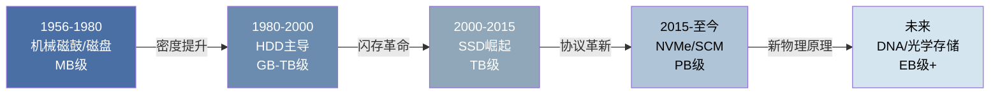
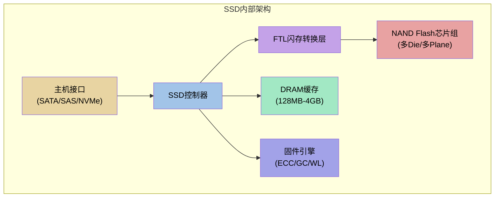
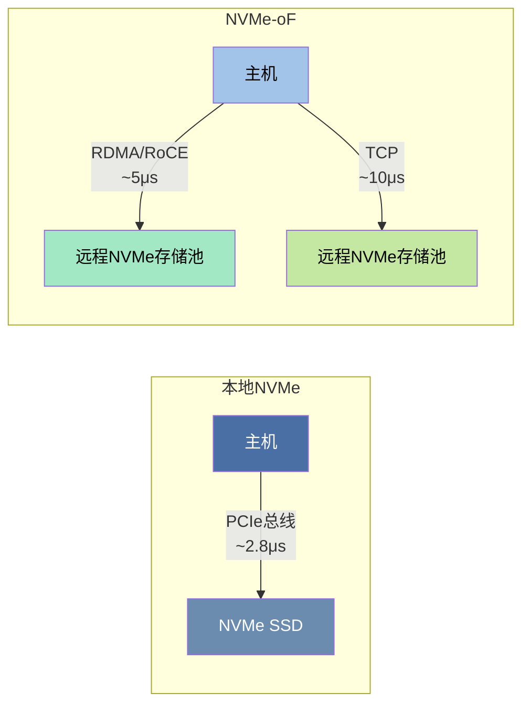
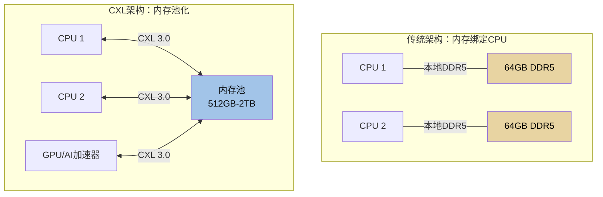

## 存储介质技术演进

### 1. 演进全景概述

存储介质的技术演进是整个计算机工业发展的缩影。从1956年IBM推出第一块硬盘RAMAC 305（容量仅5MB，重达一吨），到如今单盘容量突破30TB的机械硬盘、读写速度突破12GB/s的NVMe SSD，再到正在实验室中孕育的DNA存储和光学晶体存储，存储技术经历了从机械到电子、从串行到并行、从集中到分布的根本性变革。

这场演进的核心驱动力来自三个方向：

- **容量需求爆炸**：全球数据量从2010年的2ZB增长至2025年的181ZB（IDC预测），每年翻倍的增长对存储密度提出了指数级要求
- **性能需求升级**：实时计算、AI训练、高频交易等场景将延迟容忍度从秒级压到微秒甚至纳秒级
- **成本压力驱动**：每GB存储成本从RAMAC时代的$10,000降至HDD的$0.02和SSD的$0.05，持续降本是产业扩张的基础

### 2. 第一阶段：机械存储时代（1956—2000）

#### 2.1 磁鼓与早期磁盘

1950年代，计算机使用**磁鼓（Magnetic Drum）**作为主存储器。磁鼓是一个高速旋转的金属圆筒，表面涂有磁性材料，固定磁头在圆筒表面读写数据。IBM 650（1954）是典型的磁鼓计算机，其磁鼓容量仅10KB，但随机访问速度远超当时的穿孔卡片。

1956年IBM RAMAC 305开创了**随机存取磁盘存储**的时代：

| 参数 | RAMAC 305 | 说明 |
|------|-----------|------|
| 容量 | 5 MB | 约等于一张现代照片的原始数据 |
| 物理尺寸 | 两个冰箱大小 | 50个24英寸铝制盘片 |
| 重量 | 约1吨 | 含冷却系统和控制柜 |
| 数据传输率 | 8.3 KB/s | 每秒约一页A4文档 |
| 每MB成本 | 约$10,000 | 按通胀折算至今约$100,000 |
| 访问时间 | 约600ms | 等待盘片旋转到指定位置 |

#### 2.2 温彻斯特技术革命

1973年IBM推出IBM 3340引入**温彻斯特（Winchester）技术**，这是HDD发展史上最关键的转折点。其核心创新包括：

- **密封腔体**：磁头和盘片封装在无尘环境中，消除灰尘导致的磁头碰撞
- **飞行磁头**：磁头悬浮在盘片表面几微米处的气垫上，不接触盘片（Load/Load技术）
- **小尺寸盘片**：从24英寸缩小到14英寸，后来逐步缩小到3.5英寸和2.5英寸

温彻斯特技术使HDD的可靠性从几千小时MTBF提升到数十万小时，成本下降了两个数量级，直接推动了个人电脑时代的到来。

#### 2.3 HDD技术的持续演进

HDD在随后几十年中经历了多次技术飞跃：

**磁记录方式的演进：**

| 代际 | 技术 | 时间段 | 面密度 | 原理 |
|------|------|--------|--------|------|
| 第一代 | 纵向磁记录（LMR） | 1956-2005 | ~100 Gbit/in² | 磁化方向平行于盘面 |
| 第二代 | 垂直磁记录（PMR） | 2005-2015 | ~1 Tbit/in² | 磁化方向垂直于盘面 |
| 第三代 | 叠瓦式磁记录（SMR） | 2015-2020 | ~1.5 Tbit/in² | 磁道部分重叠写入 |
| 第四代 | 微波辅助磁记录（MAMR） | 2019- | ~2-4 Tbit/in² | 微波降低写入矫顽力 |
| 第五代 | 热辅助磁记录（HAMR） | 2024- | ~5+ Tbit/in² | 激光加热辅助写入 |

**关键里程碑：**

- **1980年**：IBM 3380首次达到1GB容量，售价$40,000
- **1991年**：IBM Deskstar（3.5英寸）让HDD进入个人电脑
- **2000年**：IBM Deskstar 75GXP首次突破75GB
- **2007年**：希捷Barracuda 7200.11达到1TB，HDD进入TB时代
- **2019年**：HGST Ultrastar He12达到12TB，充氦技术成熟
- **2023年**：希捷Exos Mozaic 3+采用HAMR技术，单盘突破30TB

#### 2.4 RAID与存储可靠性

单块HDD的年故障率（AFR）通常在1%-5%，这在企业级应用中不可接受。1988年David Patterson、Garth Gibson和Randy Katz提出了**RAID（Redundant Array of Independent Disks）**概念：

| RAID级别 | 最少磁盘 | 冗余方式 | 可用容量 | 读性能 | 写性能 | 容错能力 | 适用场景 |
|----------|----------|----------|----------|--------|--------|----------|----------|
| RAID 0 | 2 | 无 | N×单盘 | N倍 | N倍 | 无 | 临时数据/缓存 |
| RAID 1 | 2 | 镜像 | 50%×N | N倍 | 1倍 | 1块故障 | 系统盘/日志 |
| RAID 5 | 3 | 分布式奇偶校验 | (N-1)×单盘 | N倍 | ~N/2倍 | 1块故障 | 通用存储 |
| RAID 6 | 4 | 双校验 | (N-2)×单盘 | N倍 | ~N/3倍 | 2块故障 | 大容量存储 |
| RAID 10 | 4 | 镜像+条带 | 50%×N | N倍 | N/2倍 | 每组1块 | 数据库/高IOPS |
| RAID 50 | 6 | RAID 5+条带 | 变化 | 高 | 中等 | 每组1块 | 大容量高性能 |
| RAID 60 | 8 | RAID 6+条带 | 变化 | 高 | 中等 | 每组2块 | 极高可靠性 |

### 3. 第二阶段：闪存革命（2000—2015）

#### 3.1 从NAND Flash到SSD

闪存的发明可追溯到1984年东芝舛冈富士雄（Fujio Masuoka）的NOR Flash和1987年的NAND Flash。但闪存真正改变存储产业是从SSD（Solid State Drive）的商业化开始。

**NAND Flash的存储原理：**

NAND Flash使用浮栅晶体管（Floating Gate Transistor）存储数据。每个存储单元通过控制浮栅中电子的有无来表示0和1。写入时，电子通过量子隧穿效应穿过氧化层进入浮栅；擦除时，电子被拉出浮栅。由于氧化层在每次擦写时会微量损耗，NAND Flash有固定的擦写寿命（P/E Cycles）。

**NAND Flash类型演进：**

| 类型 | 每单元比特数 | 电压状态 | P/E寿命 | 读延迟 | 成本/GB | 应用 |
|------|-------------|----------|---------|--------|---------|------|
| SLC | 1 | 2态 | 100,000次 | ~25μs | 最高 | 企业级/嵌入式 |
| MLC | 2 | 4态 | 3,000-10,000次 | ~50μs | 中等 | 消费级SSD |
| TLC | 3 | 8态 | 500-3,000次 | ~75μs | 较低 | 主流消费级 |
| QLC | 4 | 16态 | 100-1,000次 | ~100μs | 低 | 大容量/读密集 |
| PLC | 5 | 32态 | ~100次 | ~150μs | 最低 | 冷存储/归档 |

#### 3.2 SSD的核心架构

一块现代SSD内部是一个完整的嵌入式计算系统：

**FTL（Flash Translation Layer）** 是SSD最关键的软件组件，它完成了三项核心工作：

- **逻辑地址映射**：将主机的LBA（逻辑块地址）映射到NAND的物理页面地址，类似操作系统的页表。映射表通常存储在DRAM中以保证查找速度
- **损耗均衡（Wear Leveling）**：确保所有物理块的擦写次数大致均匀，避免某些块过早磨损。全局损耗均衡会将冷数据迁移出高磨损块，将热数据均匀分布
- **垃圾回收（Garbage Collection）**：由于NAND Flash只能以块为单位擦除（通常256KB-4MB），而写入以页为单位（通常4KB-16KB），GC需要将有效页面搬移到新块、释放包含无效页面的旧块。GC是SSD性能波动的主要来源

#### 3.3 接口协议的演进

存储接口的演进是SSD性能释放的关键：

| 接口 | 发布年份 | 最大带宽 | 协议 | 队列深度 | 通道数 | 瓶颈 |
|------|----------|----------|------|----------|--------|------|
| PATA (IDE) | 1986 | 133 MB/s | ATA | 1 | 1 | 串行总线 |
| SATA I | 2003 | 150 MB/s | AHCI | 32 | 1 | 协议开销 |
| SATA II | 2004 | 300 MB/s | AHCI | 32 | 1 | 协议开销 |
| SATA III | 2009 | 600 MB/s | AHCI | 32 | 1 | 协议限制 |
| SAS 3 | 2013 | 1.2 GB/s | SAS | 256 | 1 | 串行协议 |
| SAS 4 | 2017 | 2.25 GB/s | SAS | 8192 | 1 | 串行协议 |
| NVMe 1.0 | 2012 | 4 GB/s | NVMe | 65535 | 4 | PCIe Gen3 |
| NVMe 1.4 | 2019 | 8 GB/s | NVMe | 65535 | 4 | PCIe Gen3 |
| NVMe 2.0 | 2021 | 16 GB/s | NVMe | 65535 | 4 | PCIe Gen4 |
| NVMe 2.5 | 2024 | 32 GB/s | NVMe | 65535 | 4 | PCIe Gen5 |

**NVMe相比SATA的核心优势：**

- **队列深度**：AHCI（SATA协议）仅支持1个命令队列、32条命令；NVMe支持最多65535个队列、每队列65535条命令。在高并发场景下，NVMe能充分利用SSD的内部并行性
- **延迟降低**：NVMe通过共享内存队列机制（取代SATA的寄存器轮询），将命令提交延迟从约6μs降至约2.8μs
- **CPU效率**：NVMe的MSI-X中断向量可绑定到特定CPU核心，减少锁竞争和上下文切换

### 4. 第三阶段：协议革新与新型介质（2015—至今）

#### 4.1 NVMe over Fabrics（NVMe-oF）

NVMe-oF将NVMe的高性能从本地扩展到了网络：

NVMe-oF支持多种传输层：

| 传输层 | 延迟 | 带宽 | 网络要求 | 典型场景 |
|--------|------|------|----------|----------|
| FC (Fibre Channel) | ~6μs | 32/64 Gbps | FC交换机 | 传统SAN升级 |
| RDMA/RoCE v2 | ~5μs | 100-400 Gbps | 无损以太网 | 超融合/高性能计算 |
| InfiniBand | ~3μs | 200-400 Gbps | IB交换机 | HPC/AI训练集群 |
| TCP | ~10μs | 10-100 Gbps | 标准以太网 | 通用数据中心 |

#### 4.2 存储级内存（SCM）

**Intel Optane（基于3D XPoint技术）** 是近十年存储领域最具颠覆性的创新之一。Optane填补了DRAM和NAND Flash之间的性能鸿沟：

| 特性 | DRAM | Intel Optane DC PMem | NAND SSD | HDD |
|------|------|----------------------|----------|-----|
| 延迟 | ~100ns | ~300ns | ~10μs | ~5ms |
| 每GB成本 | ~$3-5 | ~$1-2 | ~$0.05-0.10 | ~$0.01-0.02 |
| 容量/节点 | 128GB-6TB | 128GB-3TB | 1-30TB | 4-30TB |
| P/E寿命 | ∞（随机写） | 无限（字节可寻址） | 1,000-100,000次 | N/A |
| 掉电保护 | 无（数据丢失） | 有（数据保留） | 有（部分） | 有 |
| 能耗 | 3-10W/16GB | ~8W/128GB | ~5-10W | ~6-10W |

Optane的两种使用模式：

- **Memory Mode**：Optane作为扩展内存，DRAM作为缓存。操作系统看到的是大容量内存（可达6TB），但访问Optane部分的延迟约300ns（vs DRAM的100ns）。适用于内存数据库、大数据分析等需要大内存的场景
- **Persistent Memory Mode**：Optane作为块设备（类似超高速SSD），DAX（Direct Access）模式可绕过内核页缓存直接读写。适用于需要持久化的高性能应用，如SAP HANA、Oracle数据库

> **注意**：Intel已于2022年宣布停产Optane产品线，但其技术理念已被三星CXL内存、SK Hynix的存储级内存等后续产品继承。SCM这一品类将继续演进。

#### 4.3 CXL互连与内存池化

**CXL（Compute Express Link）** 基于PCIe 5.0/6.0物理层，正在重塑内存和存储的架构：

CXL内存池化带来的关键价值：

- **内存利用率提升**：传统服务器内存利用率通常30%-50%（因为按峰值配置），CXL池化后整体利用率可达70%-85%
- **内存扩展**：突破单服务器DIMM插槽数量限制，单节点可访问TB级内存
- **缓存一致性**：CXL 2.0/3.0支持硬件级缓存一致性，跨设备内存访问对应用透明

#### 4.4 ZNS与OCP SSD

**ZNS（Zoned Namespaces）** 是NVMe 2.0引入的新特性，改变了SSD内部的数据组织方式：

传统SSD通过FTL将主机的随机写转化为NAND的顺序写，但这个转换过程需要大量DRAM存储映射表（1TB SSD约需1-4GB DRAM），且GC导致性能不可预测。

ZNS将SSD的地址空间划分为若干**Zone**，每个Zone只能顺序写入：

| 对比维度 | 传统SSD | ZNS SSD |
|----------|---------|---------|
| 写入模式 | 随机（FTL转换） | 顺序（Zone内） |
| FTL复杂度 | 高（完整映射表） | 低（Zone级映射） |
| DRAM需求 | 1-4GB/TB | <100MB/TB |
| GC开销 | 5%-20%性能波动 | 几乎为零 |
| 空间利用率 | ~93%（预留OP空间） | ~98%+ |
| 延迟可预测性 | 差（GC时突增） | 好（确定性延迟） |
| 目标应用 | 通用 | 温和写入/日志/Ceph |

### 5. 第四阶段：前沿与未来技术

#### 5.1 持久内存的多元路线

除3D XPoint外，多个技术路线正在争夺SCM市场：

| 技术 | 原理 | 延迟 | 密度 | 成熟度 | 代表厂商 |
|------|------|------|------|--------|----------|
| 3D XPoint | 相变存储（PCM） | ~300ns | 高 | 量产（已停产） | Intel/Micron |
| STT-MRAM | 自旋转移力矩磁阻 | ~10-30ns | 中 | 小规模量产 | Everspin/TSMC |
| ReRAM | 电阻式随机存取存储器 | ~100ns | 高 | 实验/小规模 | Crossbar/SK Hynix |
| FeRAM | 铁电随机存取存储器 | ~50ns | 中 | 嵌入式量产 | Fujitsu/Rohm |
| Carbon Nanotube | 碳纳米管存储 | ~10ns | 极高 | 实验室 | Nantero |

#### 5.2 DNA存储

DNA存储利用脱氧核糖核酸的碱基（A/T/G/C）编码信息，是信息密度的终极方案：

| 维度 | DNA存储 | 最佳NAND |
|------|---------|----------|
| 理论密度 | 1 EB/mm³ | 1 TB/mm³ |
| 保存寿命 | 数千年（妥善保存） | 10-20年 |
| 写入速度 | 极慢（数小时/MB） | 7 GB/s |
| 读取速度 | 慢（测序需数小时） | 12 GB/s |
| 成本 | ~$800/MB（写入） | ~$0.05/GB |
| 随机访问 | 不支持（需PCR扩增） | 支持 |

DNA存储的研究进展：

- **2012年**：George Church实验室在DNA中存储了一整本书（5.27Mb）
- **2017年**：微软研究院存储了200MB数据，包括高清视频
- **2019年**：ETH Zurich实现了33TB/克的存储密度（接近理论极限的50%）
- **2024年**：多家初创公司（Catalog、Twist Bioscience）推出商业化DNA存储服务

DNA存储最大的挑战是**随机访问性能**——目前只能通过PCR（聚合酶链式反应）扩增目标序列片段来间接"读取"，延迟以小时计。这决定了DNA存储的定位是**冷数据归档**而非在线存储。

#### 5.3 光学存储新方向

传统的蓝光光盘（BD）已无法满足需求，新一代光学存储技术正在崛起：

- **5D光学存储**：南安普顿大学开发的飞秒激光写入技术，在石英玻璃中创建纳米级光栅结构，利用光栅的取向和强度两个额外维度编码数据。理论上可在一张光盘大小的介质中存储360TB数据，保存时间超过10亿年
- **多层全息存储**：通过全息干涉在晶体体内部存储数据，单盘可达TB级容量，随机访问速度远优于传统光盘

### 6. 存储软件栈的演进

硬件演进必须配合软件栈的变革才能释放全部潜力：

```mermaid
graph TB
    subgraph "传统存储栈（2000年代）"
        A1["应用"] --> A2["文件系统<br/>(ext3/ext4)"]
        A2 --> A3["卷管理器<br/>(LVM)"]
        A3 --> A4["块设备驱动<br/>(SCSI/SATA)"]
        A4 --> A5["HDD硬件"]
    end
    
    subgraph "现代存储栈（2020年代）"
        B1["应用"] --> B2["用户态文件系统<br/>(SPDK/DPDK)"]
        B2 --> B3["存储引擎<br/>(RocksDB/PebbleDB)"]
        B3 --> B4["NVMe驱动<br/>(io_uring/SPDK)"]
        B4 --> B5["NVMe SSD硬件"]
    end
    
    style A1 fill:#e8d4a2,color:#000
    style A2 fill:#d4c492,color:#000
    style A3 fill:#c4b482,color:#000
    style A4 fill:#b4a472,color:#000
    style A5 fill:#a49462,color:#000
    style B1 fill:#a2c4e8,color:#000
    style B2 fill:#92b4d8,color:#000
    style B3 fill:#82a4c8,color:#000
    style B4 fill:#7294b8,color:#000
    style B5 fill:#6284a8,color:#000
```

**关键软件技术演进：**

- **io_uring（2019）**：Linux内核的异步I/O框架，通过共享环形缓冲区避免系统调用开销，将4K随机读延迟从libaio的约10μs降至约4μs
- **SPDK（2015）**：Intel开源的用户态NVMe驱动框架，完全绕过内核栈，将NVMe IOPS从内核态的约100万提升至约400万（4K随机读，Intel P5800X）
- **用户态文件系统**：如FUSE passthrough、io_uring-fs，减少VFS层开销
- **计算存储（Computational Storage）**：在SSD控制器中嵌入ARM核心，让数据在存储端完成预处理（过滤、聚合、压缩），减少数据传输量

### 7. 分布式存储的演进

单机存储能力的上限催生了分布式存储，其架构也在持续进化：

| 代际 | 时间 | 代表系统 | 架构特点 | 数据组织 |
|------|------|----------|----------|----------|
| 第一代 | 2000s | GFS/HDFS | 主从架构，集中元数据 | 文件（大对象） |
| 第二代 | 2010s | Ceph/Cassandra | 去中心化，CRUSH/一致性哈希 | 块/对象/文件 |
| 第三代 | 2015s | MinIO/SeaweedFS | 云原生，S3兼容 | 对象（API优先） |
| 第四代 | 2020s | Iceberg/Delta Lake | 存算分离，数据湖仓 | 表格式（Schema on Read） |

**Ceph的统一存储架构**是分布式存储演进的典型代表：

Ceph通过单一集群同时提供三种存储接口：

- **RBD（RADOS Block Device）**：提供块存储，支持快照、克隆、精简置备，是OpenStack和KVM的主要块存储后端
- **CephFS**：提供POSIX兼容的文件系统，支持目录树元数据和文件锁
- **RADOS Gateway（RGW）**：提供S3/Swift兼容的对象存储接口

底层统一使用CRUSH算法将数据分散到数百到数千个OSD（Object Storage Daemon）上，无需中心化的元数据服务器来定位数据对象。

### 8. 总结：技术演进的规律

回顾存储介质数十年的演进历程，可以提炼出几条清晰的规律：

**规律一：机械到电子的不可逆替代**

HDD从1956年统治存储市场近60年，但SSD正以每年约15%-20%的成本下降速度蚕食HDD的市场。IDC预测到2028年，SSD的出货容量将首次超过HDD。机械存储在消费级市场已经基本退场，正在向冷存储和归档领域收缩。

**规律二：协议标准化推动生态繁荣**

从ATA到SATA到NVMe，每次存储接口的标准化都带来了产业的爆发式增长。NVMe的标准化尤其关键——它打破了厂商专有协议的壁垒，催生了数百家SSD厂商的充分竞争。

**规律三：软硬件协同是性能释放的关键**

NVMe SSD的硬件能力远超大多数系统的实际性能，瓶颈往往在软件栈：不合理的I/O调度、过深的内核路径、低效的文件系统日志。io_uring、SPDK、eBPF等技术正是为了解决这些软件瓶颈。

**规律四：冷热分层是永恒主题**

从RAMAC时代的磁盘/磁带双层体系，到现代的DRAM/SCM/SSD/HDD/磁带/光盘多层体系，存储的本质问题从未改变：用不同的介质服务于不同温度的数据。未来的存储架构将继续向"更快的热层+更大更便宜的冷层"方向演化。

**规律五：新技术的商业化需要20年周期**

DNA存储从2012年概念验证到2024年小规模商用用了12年；3D NAND从实验室到量产花了约15年；Optane从技术公布到大规模部署用了8年但仍未能盈利。存储技术的商业化需要跨越从实验室到工厂、从原型到良率、从性能到成本的多重鸿沟。
