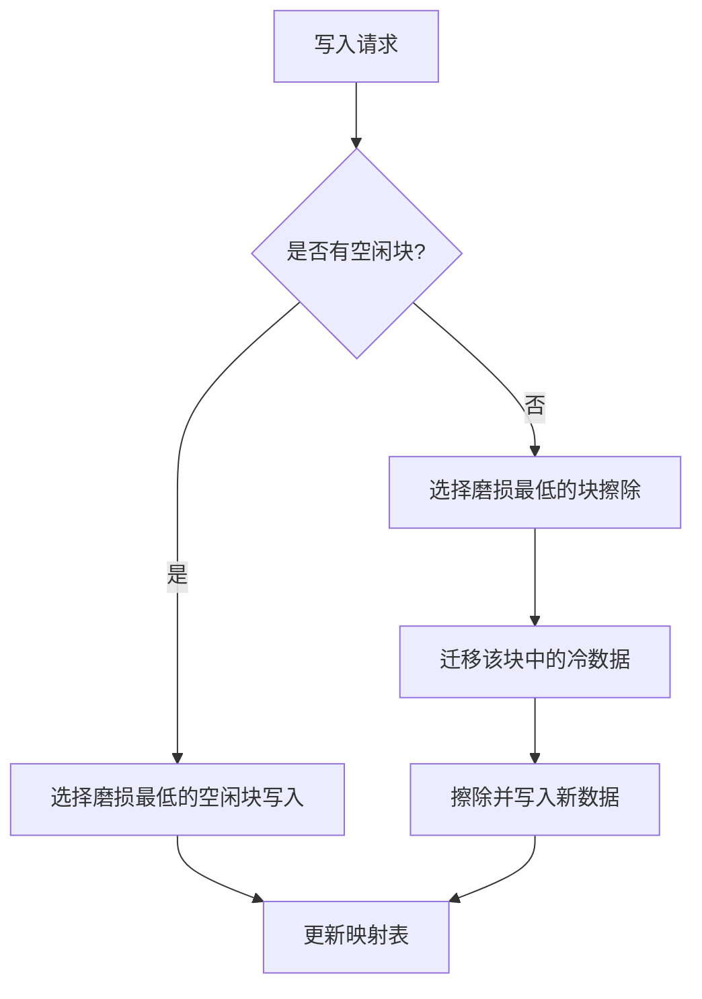
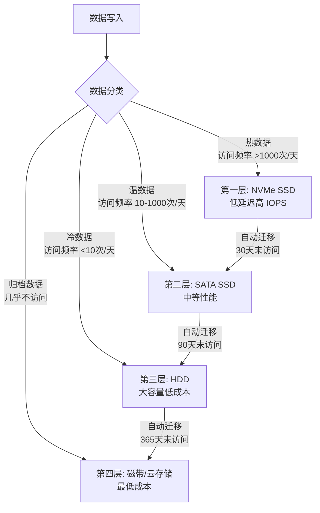

## 存储介质关键性能指标

### 1. 概述与背景

在存储系统设计与选型中，关键性能指标（Key Performance Metrics）是连接硬件规格与业务需求的桥梁。一个指标的微小差异，在大规模集群中可能被放大数个量级——例如，单盘延迟从 1ms 降至 0.1ms，在 1000 个并发请求下意味着整体吞吐量提升 10 倍。

存储介质的核心指标可以归纳为五大维度：

| 维度 | 核心问题 | 代表指标 |
|------|----------|----------|
| 性能 | 读写有多快？ | 延迟、吞吐量、IOPS、带宽 |
| 可靠性 | 数据会丢吗？ | MTBF、AFR、BER、误码率 |
| 耐久性 | 能写多久？ | TBW、DWPD、P/E 循环次数 |
| 容量 | 能存多少？ | 格式化容量、可用容量、OP 比例 |
| 成本 | 花多少钱？ | $/GB、$/IOPS、TCO |

理解这些指标之间的**权衡关系**比记住单个数值更重要。例如，追求极低延迟通常需要牺牲容量利用率（如 SLC 缓存），而追求高耐久度往往意味着更高的单位成本。

---

### 2. 性能指标详解

#### 2.1 延迟（Latency）

延迟是指从发出 I/O 请求到收到响应所经历的时间。它是用户体验最直接的感知指标——数据库查询慢、应用卡顿，根源往往在延迟。

**延迟的分层模型**

一次完整的 I/O 操作，延迟由多层叠加而成：

应用层延迟 + 文件系统层延迟 + 设备驱动延迟 + 设备固件延迟 + 物理介质延迟 = 总延迟

| 延迟层级 | 典型来源 | HDD 典型值 | SSD 典型值 | NVMe SSD 典型值 |
|----------|----------|------------|------------|------------------|
| 应用层 | 缓冲、序列化 | <1μs | <1μs | <1μs |
| 文件系统 | 元数据查找、日志 | 5-50μs | 5-50μs | 5-50μs |
| 块设备层 | IO 调度、合并 | 50-200μs | 10-50μs | 5-20μs |
| 设备固件 | FTL 映射、GC | N/A | 20-100μs | 10-50μs |
| 物理介质 | 磁头寻道/电子隧穿 | 2-10ms | 25-100μs | 15-80μs |
| **端到端总延迟** | | **3-15ms** | **50-300μs** | **20-150μs** |

**关键区分：平均延迟 vs 尾延迟**

平均延迟（P50）只能反映"典型情况"，而尾延迟（P99、P99.9）才真正决定系统在高负载下的表现。一个平均延迟 100μs 的 NVMe SSD，P99 延迟可能达到 1ms 甚至更高，这通常由后台垃圾回收（GC）引起。

```bash
# 使用 fio 测量延迟分布（含百分位数）
fio --name=lat_test \
    --ioengine=libaio \
    --bs=4k \
    --iodepth=1 \
    --rw=randread \
    --size=1G \
    --runtime=60 \
    --percentile_list=1:5:10:25:50:75:90:95:99:99.9:99.99 \
    --filename=/dev/nvme0n1p1
```

**常见延迟来源与对策**

| 延迟来源 | 现象 | 优化手段 |
|----------|------|----------|
| GC（垃圾回收） | 随机出现的 1-10ms 尖峰 | 预留 OP 空间、选择高耐久 SSD |
| 写放大 | 小写操作延迟飙升 | TRIM/UNMAP、对齐写入 |
| 降速模式 | SSD 温度过高后延迟突增 | 散热设计、监控温度 |
| 介质退化 | HDD 随使用时间延迟增加 | 定期 SMART 检测、及时更换 |

#### 2.2 吞吐量（Throughput）

吞吐量衡量单位时间内成功传输的数据量，通常以 MB/s 或 GB/s 表示。它反映的是**顺序**大块数据的传输能力。

**顺序吞吐量 vs 随机吞吐量**

这是两种截然不同的工作负载模式：

- **顺序吞吐量**：适合大文件拷贝、视频流、日志追加写入
- **随机吞吐量**：更适合用 IOPS 衡量（见下节）

| 存储类型 | 顺序读吞吐量 | 顺序写吞吐量 | 典型应用场景 |
|----------|-------------|-------------|-------------|
| 7200 RPM HDD | 150-200 MB/s | 130-170 MB/s | 归档存储、冷数据 |
| SATA SSD | 500-560 MB/s | 450-520 MB/s | 系统盘、一般应用 |
| PCIe Gen3 NVMe | 2,000-3,500 MB/s | 1,500-3,000 MB/s | 数据库、虚拟化 |
| PCIe Gen4 NVMe | 5,000-7,000 MB/s | 4,000-5,500 MB/s | 高性能数据库 |
| PCIe Gen5 NVMe | 10,000-14,000 MB/s | 8,000-10,000 MB/s | AI 训练、HPC |
| Intel Optane P5800X | 7,500 MB/s (读) | 6,500 MB/s (写) | 超低延迟场景 |

```bash
# 使用 fio 测量顺序吞吐量
fio --name=seq_test \
    --ioengine=libaio \
    --bs=128k \
    --iodepth=32 \
    --rw=read \
    --size=4G \
    --runtime=30 \
    --filename=/dev/nvme0n1p1
```

#### 2.3 IOPS（每秒 I/O 操作数）

IOPS 是衡量存储设备随机小块读写能力的核心指标，对数据库、虚拟化等随机 I/O 密集的场景至关重要。

**IOPS 的理论计算公式**

IOPS = 1 / 平均 I/O 延迟（秒）

示例：
- HDD: 1 / 5ms = 200 IOPS（单盘随机读）
- SATA SSD: 1 / 0.1ms = 10,000 IOPS（4K 随机读）
- NVMe SSD: 1 / 0.02ms = 50,000 IOPS（4K 随机读）

**队列深度（Queue Depth）对 IOPS 的影响**

队列深度是指同时挂起的 I/O 请求数量。增加队列深度可以提升吞吐量，但也会增加延迟。


不同存储设备对队列深度的响应差异巨大：

| 存储设备 | QD=1 IOPS | QD=32 IOPS | QD=256 IOPS | 最佳 QD 范围 |
|----------|-----------|------------|-------------|-------------|
| 7200 RPM HDD | 80-150 | 150-250 | 200-300 | QD=1-8 |
| SATA SSD | 5,000-8,000 | 70,000-90,000 | 90,000-100,000 | QD=8-32 |
| NVMe SSD | 10,000-20,000 | 200,000-500,000 | 500,000-1,000,000 | QD=16-64 |
| Intel Optane | 200,000+ | 550,000+ | 550,000+ | QD=1-32 |

```bash
# 使用 fio 测量 IOPS（4K 随机读，队列深度 32）
fio --name=iops_test \
    --ioengine=libaio \
    --bs=4k \
    --iodepth=32 \
    --rw=randread \
    --size=1G \
    --runtime=60 \
    --group_reporting \
    --filename=/dev/nvme0n1p1
```

**读写比例对 IOPS 的影响**

实际应用中，读写比例差异巨大，直接影响总 IOPS：

| 工作负载 | 读写比例 | 典型场景 | 对设备的要求 |
|----------|----------|----------|-------------|
| Web 服务器 | 95:5 | 静态资源读取 | 高读 IOPS |
| 关系型数据库 | 70:30 | OLTP 事务处理 | 读写均衡，低延迟 |
| 日志写入 | 5:95 | WAL、审计日志 | 高写 IOPS |
| 数据仓库 | 90:10 | 批量查询分析 | 高顺序读吞吐 |
| AI 训练 | 60:40 | 模型参数读取+梯度写回 | 高带宽 |

#### 2.4 带宽（Bandwidth）

带宽和吞吐量经常被混用，但严格来说，带宽是**硬件接口的理论最大传输速率**，吞吐量是**实际测量到的有效传输速率**。

有效带宽利用率 = 实际吞吐量 / 理论带宽 × 100%

典型的有效带宽利用率：HDD 约 70-85%，SSD 约 85-95%，NVMe SSD 约 90-98%。利用率过低通常意味着队列深度不够或 I/O 模式不佳。

#### 2.5 读写带宽比

实际场景中，读写带宽往往不对称：

NVMe SSD 典型读写比:
- 顺序读: 7,000 MB/s
- 顺序写: 5,500 MB/s
- 读写比 ≈ 1.27:1

这种不对称性意味着在系统设计时需要分别考虑读路径和写路径的容量规划。

---

### 3. 可靠性指标详解

#### 3.1 MTBF（平均无故障时间）

MTBF（Mean Time Between Failures）是指两次相邻故障之间的平均运行时间，用于衡量设备的**可靠性**。

**计算公式**

MTBF = 总运行时间 / 故障次数

示例：
某型号 HDD 标称 MTBF = 1,000,000 小时（约 114 年）
1000 块硬盘运行 1 年（8760 小时），预期故障数：
  预期故障数 = 1000 × 8760 / 1,000,000 ≈ 8.76 次

**重要误区：MTBF 不是预期寿命**

MTBF 统计的是故障**间隔**的平均值，不是设备的使用寿命。一个 MTBF 为 100 万小时的硬盘，不代表它能运行 114 年才坏——它只是说在大量设备的统计中，故障间隔的平均值是 100 万小时。

| 存储类型 | 典型 MTBF | 实际含义 |
|----------|-----------|----------|
| 企业级 HDD | 1,000,000-2,000,000 小时 | 年化故障率约 0.4-0.9% |
| 企业级 SSD | 1,500,000-2,500,000 小时 | 年化故障率约 0.3-0.6% |
| 消费级 HDD | 300,000-600,000 小时 | 年化故障率约 1.5-3.0% |
| 消费级 SSD | 1,000,000-1,500,000 小时 | 年化故障率约 0.6-0.9% |

#### 3.2 AFR（年化故障率）

AFR（Annualized Failure Rate）是 MTBF 的另一种表述形式，更直观地反映一年内预期的故障概率：

AFR = 8760 / MTBF × 100%

示例：
MTBF = 1,000,000 小时 → AFR = 8760 / 1,000,000 × 100% = 0.876%

**Backblaze 硬盘故障率真实数据（2024 年统计）**

Backblaze 云存储公司定期发布其数据中心硬盘故障率数据，是业界最权威的可靠性参考：

| 品牌型号 | 容量 | 运行数量 | 年化故障率（AFR） |
|----------|------|----------|-------------------|
| HGST HMS5C4040ALE640 | 4TB | 12,000+ | 0.36% |
| Seagate ST4000DM000 | 4TB | 15,000+ | 0.93% |
| Seagate ST12000NM0007 | 12TB | 18,000+ | 0.67% |
| HGST HUH721212ALE600 | 12TB | 5,000+ | 0.29% |
| Toshiba MG07ACA14TA | 14TB | 3,000+ | 0.52% |

#### 3.3 BER（位错误率）

BER（Bit Error Rate）是指存储设备在读取数据时出现比特错误的概率。这是衡量数据完整性的底层指标。

BER = 错误比特数 / 总读取比特数

示例：
HDD 的 BER 通常为 10^-14 ~ 10^-15
即每读取 10^14 ~ 10^15 个比特，可能出现 1 个错误

对于 12TB HDD:
  总比特数 = 12 × 10^12 × 8 = 9.6 × 10^13
  以 BER = 10^-14 计算，读完整盘可能出现 ~10 个错误

**BER 对 RAID 系统的影响**

这是 RAID 设计中经常被忽视的关键问题。当单盘 BER 较高时，RAID 重建期间可能发生不可纠正的读取错误（URE），导致整个 RAID 阵列数据丢失。

| 单盘容量 | 读取全部数据的概率 URE | BER=10^-14 时的风险 |
|----------|----------------------|---------------------|
| 1TB | 约 8.8% | 极高，不推荐 |
| 4TB | 约 25.3% | 高，需谨慎 |
| 8TB | 约 43.4% | 很高，需保护 |
| 12TB | 约 56.5% | 极高，必须保护 |
| 16TB | 约 66.4% | 几乎必然出错 |

**应对方案**：使用 RAID 6、ZFS、RAID-Z2 等提供双重冗余的方案，或使用企业级 HDD（BER=10^-15）。

#### 3.4 数据持久性（Data Retention）

数据持久性是指存储设备在断电状态下保持数据完整性的能力，对归档存储尤为重要。

| 设备类型 | 工作温度下的数据保持 | 非工作温度下 | 备注 |
|----------|---------------------|-------------|------|
| HDD | 无限期（理论上） | 1-2 年 | 磁性介质稳定性高 |
| MLC NAND SSD | 1 年 | 3-6 个月 | 建议每年通电一次 |
| TLC NAND SSD | 1 年 | 3-6 个月 | 需定期刷新 |
| QLC NAND SSD | 1 年 | 1-3 个月 | 更短的断电保持期 |
| 3D XPoint | 无限期（理论上） | 未知 | 非易失性但长期数据待验证 |

---

### 4. 耐久性指标详解

#### 4.1 P/E 循环（编程/擦除循环）

P/E 循环是 NAND 闪存的基本耐久单元。每次写入数据时，需要先擦除整个块（Block），然后重新编程（Program）——这就是一个 P/E 循环。每次擦除都会对浮栅晶体管中的氧化层造成微小损伤，累计到一定程度后，存储单元将无法可靠地保持电荷。

单个 P/E 循环的物理过程：
1. 擦除（Erase）：对整个块施加高电压，清除所有电子
2. 编程（Program）：向目标单元注入电子，写入数据
3. 读取（Read）：检测每个单元的电荷量，判断存储的值

**不同 NAND 类型的 P/E 循环寿命**

| NAND 类型 | 每个单元比特数 | P/E 循环次数 | 典型应用场景 |
|-----------|---------------|-------------|-------------|
| SLC (Single-Level Cell) | 1 | 50,000-100,000 | 企业级、工业级 |
| MLC (Multi-Level Cell) | 2 | 3,000-10,000 | 企业级 SSD |
| TLC (Triple-Level Cell) | 3 | 1,000-3,000 | 消费级 SSD |
| QLC (Quad-Level Cell) | 4 | 500-1,000 | 大容量、读密集 |
| PLC (Penta-Level Cell) | 5 | 100-500 | 归档存储（研发中） |

**3D NAND 对耐久性的提升**

3D NAND 通过垂直堆叠存储单元，使得每个单元可以使用更大的存储单元面积，从而降低电子隧穿对氧化层的应力。同为 TLC，2D NAND 的寿命约 500-1000 P/E 循环，而 3D TLC NAND 可达到 1500-3000 P/E 循环。

#### 4.2 TBW（总写入字节数）

TBW（Terabytes Written）是 SSD 厂商标称的设备在生命周期内可以写入的总数据量。它是对用户最直接的耐久性承诺。

**TBW 的计算示例**

以一块 1TB TLC SSD 标称 TBW = 600TB 为例：

TBW 换算为 P/E 循环:
600TB / 1TB = 600 次 P/E 循环

每日写入量计算（假设 5 年使用寿命）:
600TB / (5 × 365 天) = 328.77 GB/天

每月写入量:
328.77 × 30 = 9.86 TB/月

**不同用途的 TBW 消耗速率对比**

| 使用场景 | 典型日写入量 | 1TB SSD (600TBW) 预期寿命 |
|----------|-------------|--------------------------|
| 办公电脑 | 10-30 GB/天 | 54-164 年 |
| Web 服务器 | 50-200 GB/天 | 8-33 年 |
| 数据库（OLTP） | 200-500 GB/天 | 3.3-8.2 年 |
| 虚拟化平台 | 500GB-2TB/天 | 0.8-3.3 年 |
| 日志写入 | 1-10TB/天 | 0.16-1.6 年 |
| AI 训练数据预处理 | 5-50TB/天 | 33 天-0.33 年 |

#### 4.3 DWPD（每日全盘写入次数）

DWPD（Drive Writes Per Day）将 TBW 标准化为"在质保期内，每天可以将整个 SSD 完整写满多少次"。这使得不同容量 SSD 之间可以公平比较。

DWPD = TBW / (SSD 容量 × 质保天数)

示例：
1TB SSD, TBW = 600TB, 质保 5 年
DWPD = 600,000 GB / (1000 GB × 1825 天) = 0.33 DWPD

3.84TB 企业级 SSD, TBW = 21,900TB, 质保 5 年
DWPD = 21,900,000 GB / (3840 GB × 1825 天) = 3.13 DWPD

| SSD 定位 | 典型 DWPD | 质保期 | 适用场景 |
|----------|-----------|--------|----------|
| 消费级 | 0.1-0.3 | 3-5 年 | 个人电脑、轻度使用 |
| 读密集型企业级 | 1-3 | 5 年 | Web 服务器、CDN |
| 混合使用企业级 | 3-5 | 5 年 | 数据库、虚拟化 |
| 高耐久企业级 | 10-25 | 5 年 | 写密集、日志、缓存 |
| 超高耐久（SLC/3D XPoint） | 30-100+ | 5 年 | 存储分层、WAL |

#### 4.4 磨损均衡（Wear Leveling）

磨损均衡是 SSD 控制器的重要机制，确保所有存储单元均匀磨损，避免个别单元过早达到寿命极限。

**两种磨损均衡策略**：

- **动态磨损均衡**：只在写入时选择磨损最小的空闲块
- **静态磨损均衡**：不仅动态选择，还会将频繁写入的数据迁移到新块，将冷数据移到老块，使所有块的磨损程度趋于一致



---

### 5. 容量指标详解

#### 5.1 格式化容量 vs 可用容量

存储设备标称容量与实际可用容量存在差异，主要由以下因素造成：

可用容量 = 标称容量 × 10^12 / 2^40 × 保留比例

1TB HDD 标称容量:
  工厂计算: 1,000,000,000,000 字节
  操作系统识别: 1,000,000,000,000 / 1,099,511,627,776 = 909.49 GiB
  文件系统格式化损失: 约 3-7%（日志、元数据）
  实际可用: ≈ 840-880 GiB（约 82-86% 标称容量）

**不同文件系统的格式化开销对比**

| 文件系统 | 元数据开销 | 日志开销 | 碎片影响 | 1TB 盘可用容量 |
|----------|-----------|----------|----------|---------------|
| ext4 | ~3% | ~1% | 中等 | ~930 GiB |
| XFS | ~2% | ~1% | 低 | ~940 GiB |
| Btrfs | ~5-10% | 无独立日志 | 中等 | ~890-930 GiB |
| ZFS | ~10-15% | 内置 | 低 | ~850-890 GiB |
| NTFS | ~3% | ~1% | 中等 | ~930 GiB |
| APFS | ~3% | 共享池 | 低 | ~930 GiB |

#### 5.2 过量配置（Over-Provisioning）

过量配置是 SSD 独有的概念——SSD 控制器会预留一部分用户不可见的 NAND 空间，用于垃圾回收（GC）、坏块替换和磨损均衡。

物理 NAND 容量 = 用户可见容量 + 过量配置空间

示例：
一块标称 480GB 的 SSD，实际物理 NAND 可能为 512GB 或 528GB
OP 比例 = (物理容量 - 用户容量) / 物理容量 × 100%
        = (528 - 480) / 528 × 100% ≈ 9.1%

| OP 比例 | 适用场景 | 对性能的影响 |
|---------|----------|-------------|
| 7%（默认） | 一般消费级 | 基本性能 |
| 13-15% | 企业级混合负载 | 显著提升写入性能和耐久性 |
| 28% | 高耐久写入密集 | 最大化写入性能和设备寿命 |
| 用户手动设置 | 可通过工具预留额外 OP | 按需平衡容量与性能 |

```bash
# Linux 下通过 fio 创建预留 OP 空间（在 SSD 末尾创建不可见分区）
# 方法1：使用 parted 分区工具
parted /dev/nvme0n1 mkpart primary 480GB 100%

# 方法2：使用 hdparm 或 SSD 厂商工具设置 OP
# Intel SSD: 使用 Intel SSD Toolbox
# Samsung SSD: 使用 Samsung Magician
```

#### 5.3 RAID 容量损失

在企业存储中，RAID 级别的选择直接影响可用容量：

| RAID 级别 | 最少磁盘数 | 可用容量公式 | 3×12TB 盘可用容量 | 冗余能力 |
|-----------|-----------|-------------|-------------------|----------|
| RAID 0 | 2 | N × 单盘容量 | 36 TB | 无 |
| RAID 1 | 2 | N/2 × 单盘容量 | 18 TB | 1 盘故障 |
| RAID 5 | 3 | (N-1) × 单盘容量 | 24 TB | 1 盘故障 |
| RAID 6 | 4 | (N-2) × 单盘容量 | 12 TB | 2 盘故障 |
| RAID 10 | 4 | N/2 × 单盘容量 | 18 TB | 每组 1 盘故障 |

---

### 6. 功耗与热管理指标

#### 6.1 功耗特性

存储设备的功耗直接影响 TCO（总拥有成本）和散热设计。

| 存储类型 | 空闲功耗 | 活跃功耗 | 每 TB 功耗 |
|----------|---------|---------|-----------|
| 7200 RPM HDD | 3-5W | 5-8W | 0.4-0.7 W/TB |
| 5400 RPM HDD | 2-3W | 4-6W | 0.2-0.5 W/TB |
| SATA SSD | 0.02-0.5W | 2-4W | 0.2-0.5 W/TB |
| NVMe SSD | 0.03-0.5W | 5-12W | 0.5-1.5 W/TB |
| 企业级 NVMe | 5-10W | 15-25W | 1.5-3 W/TB |

**SSD 功耗模式**

现代 NVMe SSD 支持多种电源状态，可显著降低空闲功耗：

Power States (NVMe 规范):
PS0: 活跃状态，全速运行          → 8-25W
PS1: 轻度休眠，快速恢复          → 5-15W
PS2: 中度休眠                   → 3-8W
PS3: 深度休眠（L1.2）           → 2-5mW
PS4: 最深休眠（L1.2 sub-states）→ <1mW

#### 6.2 温度对性能的影响

SSD 和 HDD 对温度敏感，过高或过低的温度都会影响性能和可靠性。

| 温度范围 | HDD 影响 | SSD 影响 |
|----------|---------|---------|
| <5°C | 启动困难，读写错误率升高 | 正常 |
| 5-25°C | 正常运行 | 正常运行 |
| 25-40°C | 正常运行 | 正常运行 |
| 40-55°C | AFR 略增 | 接近降速阈值 |
| 55-70°C | AFR 显著增加 | 触发热节流（Thermal Throttling） |
| >70°C | 数据丢失风险 | 强制降速保护 |

```bash
# 查看 NVMe SSD 温度
smartctl -a /dev/nvme0n1 | grep -i temperature
nvme smart-log /dev/nvme0n1 | grep temperature

# 实时监控温度变化
watch -n 1 "nvme smart-log /dev/nvme0n1 | grep -A5 temperature"
```

**热节流（Thermal Throttling）的实际影响**

当 SSD 温度超过阈值（通常 70-75°C），控制器会强制降低性能以保护设备：

| 降速阶段 | 触发温度 | 性能表现 |
|----------|---------|---------|
| 正常 | <70°C | 100% 性能 |
| 第一级降速 | 70-75°C | 降至 60-80% |
| 第二级降速 | 75-80°C | 降至 30-50% |
| 紧急保护 | >80°C | 降至 10% 或暂停写入 |

---

### 7. 成本指标详解

#### 7.1 单位成本分析

存储成本不能只看购买价格，需要综合考虑全生命周期成本：

TCO（总拥有成本）= 购置成本 + 能源成本 + 散热成本 + 运维成本 + 空间成本

示例对比（3 年周期，100TB 可用容量）：
HDD 方案: 10×12TB HDD (RAID 6)
  购置: 10 × $200 = $2,000
  能耗: 10 × 6W × 8760h × 3年 × $0.12/kWh = $1,892
  散热: $500
  运维: $300
  总计: $4,692

SSD 方案: 4×3.84TB SSD (RAID 5)
  购置: 4 × $350 = $1,400
  能耗: 4 × 8W × 8760h × 3年 × $0.12/kWh = $1,010
  散热: $200
  运维: $100
  总计: $2,710

**单位成本对比表（2024-2025 市场价格参考）**

| 指标 | HDD (企业级) | SATA SSD | NVMe SSD | Intel Optane |
|------|-------------|----------|----------|--------------|
| $/GB（原始） | $0.02-0.04 | $0.06-0.10 | $0.08-0.15 | $1.50-3.00 |
| $/GB（含 TCO，3年） | $0.03-0.06 | $0.07-0.12 | $0.09-0.18 | $2.00-4.00 |
| $/IOPS（随机读） | $0.50-2.00 | $0.01-0.05 | $0.002-0.01 | $0.001-0.005 |
| $/MB/s（顺序读） | $0.50-1.50 | $0.10-0.25 | $0.03-0.08 | $0.20-0.40 |
| 每 TB 年能耗成本 | $5-10 | $2-5 | $5-15 | $10-20 |

#### 7.2 存储分层策略

最优成本方案通常不是"全部用最贵的盘"，而是根据数据热度进行分层存储：



**分层存储的成本优化效果**

| 存储分层 | 容量占比 | 数据热度 | 单位成本 |
|----------|---------|---------|---------|
| 热数据层（NVMe SSD） | 5-10% | 60-80% 的 I/O | $0.10/GB |
| 温数据层（SATA SSD） | 10-20% | 15-30% 的 I/O | $0.07/GB |
| 冷数据层（HDD） | 50-70% | 5-10% 的 I/O | $0.03/GB |
| 归档层（磁带/云） | 10-30% | <1% 的 I/O | $0.005/GB |

---

### 8. 常见误区与纠正

#### 误区一：IOPS 数字越高越好

**真相**：厂商宣称的 IOPS 通常是在 QD=256、100% 顺序读、4K 块大小的理想条件下测得。实际应用中 QD 通常在 1-32 之间，真实 IOPS 可能只有标称值的 10-50%。

**正确做法**：使用与实际工作负载匹配的测试条件（块大小、读写比例、队列深度）进行基准测试。

#### 误区二：SSD 不会坏

**真相**：SSD 有明确的写入寿命限制（TBW/DWPD）。虽然消费级用户很少用到 TBW 上限，但写密集型应用（数据库 WAL、日志服务）可能在 2-3 年内耗尽。

**正确做法**：监控 SSD 的 SMART 数据（特别是 `Data Units Written` 和 `Available Spare`），设置告警阈值。

#### 误区三：容量越大越划算

**真相**：大容量单盘确实 $/GB 更低，但可靠性风险更高——一块 20TB HDD 故障损失的数据远超两块 10TB HDD 故障。

**正确做法**：容量选择需平衡 $/GB、RAID 冗余成本和故障恢复时间。对于关键数据，适当分散到多盘比追求单盘大容量更安全。

#### 误区四：NVMe 一定比 SATA 快

**真相**：NVMe 在高并发随机 I/O 场景下优势明显，但在低队列深度、顺序读写场景下差距不大。对于 Web 服务器等轻负载场景，SATA SSD 的性价比可能更高。

**正确做法**：根据实际 I/O 模式选择接口。数据库 OLTP、虚拟化平台首选 NVMe；文件服务器、备份存储可考虑 SATA SSD 或 HDD。

---

### 9. 指标监控实战

#### 9.1 SMART 监控

S.M.A.R.T.（Self-Monitoring, Analysis and Reporting Technology）是存储设备自带的健康监控系统。

```bash
# 安装 smartmontools
sudo apt install smartmontools  # Debian/Ubuntu
sudo yum install smartmontools  # CentOS/RHEL

# 查看 HDD 完整 SMART 数据
sudo smartctl -a /dev/sda

# 查看 NVMe SSD 完整 SMART 数据
sudo nvme smart-log /dev/nvme0n1
```

**HDD 关键 SMART 指标**

| SMART ID | 指标名称 | 含义 | 告警阈值 |
|----------|----------|------|----------|
| 5 | Reallocated Sector Count | 重映射坏扇区数 | >0 需关注 |
| 187 | Reported Uncorrectable Errors | 不可纠正错误 | >0 立即备份 |
| 188 | Command Timeout | 命令超时次数 | >0 需排查 |
| 197 | Current Pending Sector Count | 等待重映射的扇区 | >0 需关注 |
| 198 | Offline Uncorrectable | 离线不可纠正扇区 | >0 需关注 |

**NVMe SSD 关键 SMART 指标**

| 指标名称 | 含义 | 告警条件 |
|----------|------|----------|
| Percentage Used | 已使用的寿命百分比 | >90% 需更换 |
| Available Spare | 可用备用块百分比 | <10% 需关注 |
| Available Spare Threshold | 备用块阈值 | 触发即告警 |
| Media and Data Integrity Errors | 介质数据错误 | >0 立即备份 |
| Critical Warning | 紧急警告标志 | 非零需立即处理 |

#### 9.2 性能基准测试工具

| 工具名称 | 适用场景 | 核心命令 | 特点 |
|----------|---------|----------|------|
| fio | 专业级基准测试 | `fio --name=test --rw=randread --bs=4k ...` | 最灵活，业界标准 |
| ioping | 快速延迟测试 | `ioping -c 100 /dev/sda` | 轻量级，适合快速检查 |
| dd | 简单吞吐量测试 | `dd if=/dev/zero of=test bs=1M count=1024` | 最简单，不精确 |
| hdparm | HDD 读取测试 | `hdparm -t /dev/sda` | 仅测顺序读取 |
| diskspd | Windows 平台 | `diskspd -b4k -d30 -L -t4 ...` | Windows 专用 |

#### 9.3 持续监控方案

```bash
# 使用 Prometheus + node_exporter 持续监控磁盘健康
# node_exporter 会自动采集 SMART 数据和磁盘 I/O 指标

# 自定义监控脚本示例
#!/bin/bash
# monitor_disk_health.sh - 简易磁盘健康监控

DISK="/dev/nvme0n1"
LOG="/var/log/disk_health.log"
ALERT_EMAIL="admin@example.com"

# 检查可用备用块
SPARE=$(nvme smart-log $DISK | grep "available_spare" | awk '{print $3}')
if [ "$SPARE" -lt 10 ]; then
    echo "$(date) ALERT: Available spare below 10%: $SPARE%" >> $LOG
    echo "Disk $DISK available spare critical: $SPARE%" | mail -s "Disk Alert" $ALERT_EMAIL
fi

# 检查温度
TEMP=$(nvme smart-log $DISK | grep temperature | awk '{print $3}')
if [ "$TEMP" -gt 65 ]; then
    echo "$(date) WARNING: Temperature high: ${TEMP}C" >> $LOG
fi

# 检查寿命使用
USED=$(nvme smart-log $DISK | grep "percentage_used" | awk '{print $3}')
if [ "$USED" -gt 80 ]; then
    echo "$(date) WARNING: Drive life ${USED}% used" >> $LOG
fi
```

---

### 10. 指标选型速查表

根据应用场景快速选择关键指标优先级：

| 应用场景 | 第一指标 | 第二指标 | 第三指标 | 推荐介质 |
|----------|---------|---------|---------|---------|
| 数据库 OLTP | 延迟（P99） | IOPS | 耐久性（DWPD） | NVMe SSD |
| Web 服务器 | 延迟（P50） | IOPS | 成本 | SATA SSD |
| 大数据分析 | 吞吐量 | 带宽 | 成本/TB | HDD |
| 视频监控 | 顺序写吞吐 | 容量 | 成本 | HDD |
| AI 训练 | 带宽 | IOPS | 容量 | NVMe SSD |
| 归档存储 | 容量 | 成本/TB | 数据持久性 | HDD/磁带 |
| 虚拟化平台 | IOPS | 延迟 | 耐久性 | NVMe SSD |
| 日志服务 | 写入吞吐 | 耐久性 | 成本 | 高耐久 SSD |

---

### 11. 本节小结

存储介质的关键性能指标是一个多维度的评估体系，核心要点包括：

1. **性能维度**：延迟、吞吐量、IOPS 和带宽各有侧重，必须结合实际工作负载评估，单一指标无法全面反映设备能力
2. **可靠性维度**：MTBF 提供统计参考，BER 才是数据完整性的底层保障，RAID 设计必须考虑 URE 风险
3. **耐久性维度**：TBW 和 DWPD 是 NAND 闪存的寿命承诺，磨损均衡机制显著延长实际使用寿命
4. **容量维度**：格式化开销、过量配置和 RAID 冗余都会减少可用容量，规划时需预留 15-30% 余量
5. **成本维度**：TCO 分析应覆盖全生命周期，存储分层策略可将整体成本降低 30-60%
6. **监控至关重要**：SMART 数据是预测性维护的基础，建立持续监控机制比事后补救成本低得多

掌握这些指标的含义、计算方法和实际意义，是进行存储系统设计、选型和优化的基本功。下一步应在实战中用 fio 等工具实际测量，将理论知识转化为直觉判断力。
