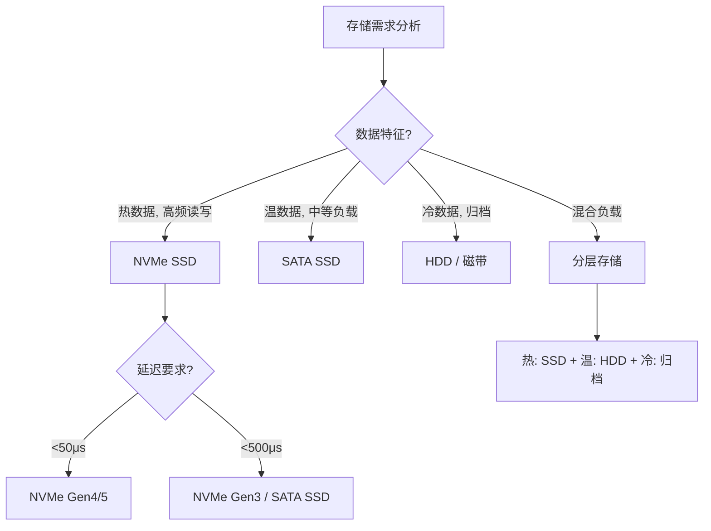

# 存储介质理论基础

## 引言

存储介质是计算机系统的"记忆"——没有可靠的持久化存储，操作系统、数据库、分布式系统都将无从谈起。从 1956 年 IBM 305 RAMAC 那块重达一吨、容量仅 5MB 的磁盘，到今天单条 8TB 的 NVMe SSD，存储技术经历了近 70 年的迭代。理解存储介质的物理原理、性能模型和工程约束，是做系统设计、数据库调优、分布式架构选型的基本功。

本节从物理原理出发，依次展开**核心概念**、**技术演进**、**关键性能指标**三条主线，为后续章节的实战分析和工具使用奠定理论基础。

---

## 一、核心概念

### 1.1 存储介质的定义与分类

存储介质（Storage Medium）是指能够持久保存数据的物理载体。按照数据存取方式，可分为两大类：

| 分类 | 特征 | 典型代表 |
|------|------|----------|
| **顺序存取存储（SAM）** | 必须按物理顺序读写，随机访问代价极高 | 磁带、光盘（CD/DVD） |
| **直接存取存储（DAM）** | 支持随机定位到任意地址读写 | HDD、SSD、NVMe |

按照数据持久性，又可分为：

- **易失性存储（Volatile）**：断电后数据丢失，如 DRAM、SRAM。速度快（DRAM 访问延迟 ~100ns），用于内存和缓存。
- **非易失性存储（Non-Volatile）**：断电后数据保留，如 NAND Flash、HDD、磁带。速度较慢但可长期保存。

工程实践中，我们通常关心的"存储介质"特指**非易失性、直接存取**的设备，即 HDD、SSD 及其衍生形态。下面按层级展开。

### 1.2 存储层次结构（Memory Hierarchy）

现代计算机采用层次化存储架构，核心思想是**用速度换取容量，用价格换取性能**：

┌─────────────────────────────────────────────────┐
│              寄存器 (Registers)                   │  ~0.3ns, ~KB
├─────────────────────────────────────────────────┤
│              L1 Cache                            │  ~1ns, 32-64KB
├─────────────────────────────────────────────────┤
│              L2 Cache                            │  ~3-10ns, 256KB-1MB
├─────────────────────────────────────────────────┤
│              L3 Cache                            │  ~10-30ns, 数MB-数十MB
├─────────────────────────────────────────────────┤
│              主存 (DRAM)                          │  ~100ns, 数GB-数TB
├─────────────────────────────────────────────────┤
│              SSD / NVMe                          │  ~10-100μs, 数百GB-数TB
├─────────────────────────────────────────────────┤
│              HDD                                 │  ~3-10ms, 数TB-数十TB
├─────────────────────────────────────────────────┤
│              磁带 / 光盘归档                      │  ~秒级, PB级
└─────────────────────────────────────────────────┘

这个层次结构的关键洞察是：**越靠近 CPU 的层级，速度越快、容量越小、每 GB 成本越高**。系统设计者的核心挑战在于：在成本约束下，如何设计缓存策略和数据布局，使得热点数据尽可能留在高速层，而冷数据沉降到低速层。

### 1.3 块设备与文件系统抽象

操作系统不直接操作物理存储介质，而是通过两层抽象：

1. **块设备（Block Device）**：将存储空间划分为固定大小的块（通常 512B 或 4KB），提供 `read(block_addr)` / `write(block_addr, data)` 接口。Linux 中以 `/dev/sd*`、`/dev/nvme*` 表示。

2. **文件系统（File System）**：在块设备之上构建目录、文件、权限等语义。常见文件系统包括 ext4、XFS、Btrfs、ZFS、NTFS、APFS。文件系统负责：
   - **元数据管理**：inode/dentry 映射文件名到物理块
   - **空间分配**：空闲块追踪与分配策略（连续分配 vs 碎片化）
   - **一致性保证**：日志（journaling）、写时复制（CoW）、写前日志（WAL）

应用程序
    ↓ read()/write()
虚拟文件系统 (VFS)
    ↓
具体文件系统 (ext4 / XFS / Btrfs)
    ↓
块设备层 (Block Layer) ← I/O调度器
    ↓
设备驱动 (AHCI / NVMe driver)
    ↓
物理存储介质 (HDD / SSD / NVMe)

理解这层抽象至关重要：当我们在应用层遇到"慢"的问题时，瓶颈可能出现在层次结构的任何一层——可能是文件系统的 journal commit，可能是 I/O 调度器的合并策略，也可能是物理介质本身的写放大。

### 1.4 I/O 栈全景

一次完整的 I/O 请求从应用到物理介质，经过以下关键路径：

应用发起 read(fd, buf, len)
  → VFS 查找 inode，定位逻辑块号
    → 文件系统将逻辑块号映射为物理块号
      → Block Layer 接收 BIO 请求
        → I/O Scheduler 排序/合并（mq-deadline / BFQ / kyber / none）
          → 设备驱动构建 SCSI/NVMe 命令
            → 物理介质执行实际读写
              → 中断/DMA 完成通知
                → 数据拷贝回用户空间

每一层都有自己的优化空间和潜在瓶颈，这是后续章节"核心技巧"和"实战案例"的分析框架。

---

## 二、技术演进

### 2.1 磁性存储：从 HDD 到 SMR

**机械硬盘（HDD）** 的工作原理基于电磁感应：

- **读写头**悬浮在高速旋转的盘片上方（飞行高度约 3-5nm，相当于一个水分子的直径）
- 盘片表面的磁性颗粒通过磁化方向表示 0 和 1
- 主轴电机驱动盘片以 5400/7200/10000/15000 RPM 旋转
- 寻道时间（Seek Time）是 HDD 最大的性能瓶颈：磁头从当前磁道移动到目标磁道需要 3-10ms

**关键性能参数（典型 7200RPM HDD）：**

| 参数 | 值 |
|------|-----|
| 旋转延迟（Rotational Latency） | 平均 4.17ms（= 60s / 7200RPM / 2） |
| 随机寻道时间 | 3-10ms |
| 顺序读取速度 | 150-250 MB/s |
| 随机 4K 读取 IOPS | 75-150 |
| 接口 | SATA III（6 Gbps） |

**SMR（叠瓦式磁记录）** 是 HDD 容量增长的关键技术：传统 CMR（垂直磁记录）的磁道之间需要保护间隙，而 SMR 将磁道像屋顶瓦片一样部分重叠，牺牲写性能换取面密度提升 25%。SMR 硬盘适合冷数据归档，不适合频繁写入的工作负载。

### 2.2 闪存革命：NAND Flash

**NAND Flash** 是 SSD 的核心存储元件。每个存储单元（Cell）由一个浮栅晶体管（Floating Gate Transistor）构成：

- **写入（编程）**：通过隧道效应将电子注入浮栅，改变阈值电压
- **擦除**：通过反向电压将电子从浮栅中抽出
- **读取**：检测阈值电压，判断存储的是 0 还是 1

关键限制：**NAND Flash 必须先擦除再写入**，且擦除的最小单位（erase block）远大于写入的最小单位（page）。这一不对称性导致了 SSD 设计中最核心的挑战——**写放大（Write Amplification）**。

**NAND Cell 类型演进：**

| 类型 | 每单元比特数 | 特点 | 耐久度（P/E Cycles） | 适用场景 |
|------|------------|------|---------------------|----------|
| SLC (Single-Level Cell) | 1 bit | 最快、最耐用、最贵 | 50,000-100,000 | 企业级、嵌入式 |
| MLC (Multi-Level Cell) | 2 bit | 平衡性能与成本 | 3,000-10,000 | 消费级 SSD |
| TLC (Triple-Level Cell) | 3 bit | 主流消费级 | 1,000-3,000 | 桌面/笔记本 |
| QLC (Quad-Level Cell) | 4 bit | 大容量、低成本 | 500-1,000 | 读密集、冷存储 |
| PLC (Penta-Level Cell) | 5 bit | 实验阶段 | ~100-300 | 未来归档存储 |

比特数越多，同一个物理空间能存更多数据，但代价是：
- **写入速度下降**：需要更精细的电压控制来区分多个电平
- **耐久度降低**：更多的电子进出浮栅加速氧化层磨损
- **读取干扰增加**：相邻电平之间的电压差更小，更容易误判

### 2.3 SSD 架构详解

一颗现代 SSD 内部远比"一堆闪存颗粒"复杂：

┌──────────────────────────────────────────────────────┐
│                   SSD 控制器                          │
│  ┌──────────┐  ┌──────────┐  ┌──────────────────┐   │
│  │ FTL 映射表│  │ 垃圾回收 │  │ 磨损均衡/TRIM    │   │
│  └──────────┘  └──────────┘  └──────────────────┘   │
│  ┌──────────┐  ┌──────────┐  ┌──────────────────┐   │
│  │ ECC 纠错  │  │ 电源管理 │  │ 接口控制器       │   │
│  └──────────┘  └──────────┘  └──────────────────┘   │
├──────────────────────────────────────────────────────┤
│              NAND Flash 通道（8-16 条）               │
│  ┌─────┐ ┌─────┐ ┌─────┐ ┌─────┐ ... ┌─────┐       │
│  │ CE0 │ │ CE1 │ │ CE2 │ │ CE3 │     │ CEn │       │
│  └─────┘ └─────┘ └─────┘ └─────┘     └─────┘       │
│  每个 CE (Chip Enable) 管理一个 Die                  │
└──────────────────────────────────────────────────────┘

**FTL（Flash Translation Layer）** 是 SSD 的"大脑"：

- **逻辑地址映射**：将逻辑块地址（LBA）映射到物理 NAND 页地址。映射表通常存储在 DRAM 中（企业级 SSD 有独立 DRAM 缓存，消费级 SSD 可能用 SRAM 或 Host Memory Buffer）
- **垃圾回收（GC）**：NAND 只能整块擦除。GC 将有效数据从"脏块"集中搬移到新块，然后擦除整个旧块。GC 是 SSD 性能退化的主要原因
- **磨损均衡（Wear Leveling）**：确保所有 NAND 块的擦除次数大致均匀，避免个别块过早失效
- **TRIM 命令**：操作系统告知 SSD 哪些块不再使用，让 GC 可以提前清理，维持长期写入性能

### 2.4 NVMe：从 SATA 到 PCIe

传统 SATA/SAS 接口设计于 HDD 时代，成为 SSD 性能的瓶颈：

| 接口 | 最大带宽 | 命令队列深度 | 延迟开销 |
|------|---------|-------------|---------|
| SATA III | 600 MB/s | 1 队列，深度 32 | 较高（AHCI 协议） |
| SAS 12G | 1.2 GB/s | 1 队列，深度 256 | 中等 |
| NVMe (PCIe 3.0 x4) | 3.5 GB/s | 64K 队列，每队列 64K 命令 | 极低 |
| NVMe (PCIe 4.0 x4) | 7.0 GB/s | 64K 队列，每队列 64K 命令 | 极低 |
| NVMe (PCIe 5.0 x4) | 14.0 GB/s | 64K 队列，每队列 64K 命令 | 极低 |

**NVMe 的核心优势：**

1. **多队列并行**：AHCI 只有 1 个命令队列，多核 CPU 争抢同一队列产生锁竞争。NVMe 支持 65,535 个队列，可为每个 CPU 核心分配独立队列，实现真正的无锁并行
2. **更低的协议开销**：NVMe 命令集精简，每条命令仅 64 字节（AHCI 为 32 字节命令 + 256 字节 FIS），减少了命令解析的 CPU 开销
3. **更低的延迟**：去掉了 SCSI 层和 AHCI 层的翻译开销，直连 PCIe 总线
4. **更好的中断处理**：支持 MSI-X 中断向量，可将中断分散到不同 CPU 核心

### 2.5 持久化内存与新兴技术

**Intel Optane（3D XPoint）** 代表了一类介于 DRAM 和 NAND Flash 之间的新型存储介质：

- 延迟：~10μs（比 NAND 快 10-100 倍，比 DRAM 慢约 1000 倍）
- 可字节寻址（Byte-addressable），无需块级 I/O
- 耐久度远高于 NAND
- 可作为持久化内存（PMEM）或快速存储（NVMe SSD）使用

虽然 Intel 已于 2022 年停产 Optane，但其设计思想（CXL 扩展内存、存算一体）正在影响下一代存储架构。

**其他值得关注的技术：**

- **ZNS SSD（Zoned Namespace）**：让主机感知闪存的 zone 结构，自行管理数据放置，减少 FTL 的写放大。是 ZBC/ZAC 标准在 NVMe 上的延续
- **CXL（Compute Express Link）**：新互连标准，支持内存池化和设备级缓存一致性，可能重塑存储层次结构
- **存储级内存（SCM）**：Memristor、MRAM、ReRAM 等技术仍在研发阶段，目标是实现 DRAM 级速度 + NAND 级持久性

---

## 三、关键性能指标

### 3.1 IOPS（每秒输入/输出操作数）

IOPS 是衡量随机 I/O 性能的核心指标。不同场景下 IOPS 的差异可达 3-4 个数量级：

| 设备 | 随机 4K 读 IOPS | 随机 4K 写 IOPS |
|------|----------------|-----------------|
| 7200RPM HDD | 75-150 | 75-150 |
| SATA SSD（消费级） | 50,000-90,000 | 40,000-80,000 |
| NVMe SSD（消费级） | 200,000-700,000 | 300,000-1,000,000 |
| NVMe SSD（企业级） | 500,000-2,000,000 | 500,000-2,000,000 |

**重要澄清**：厂商宣传的 IOPS 通常基于 4KB 块大小、QD=256 的队列深度。实际应用中队列深度往往远低于此值（数据库 OLTP 典型 QD=1-16），因此实测 IOPS 会明显低于标称值。

### 3.2 延迟（Latency）

延迟比 IOPS 更能反映用户体验。关键指标包括：

- **平均延迟**：一次 I/O 操作从提交到完成的平均时间
- **尾延迟（Tail Latency）**：P99、P99.9 延迟——在大规模系统中，尾延迟决定了最慢请求的体验。即使平均延迟很低，P99 过高也会导致显著的长尾效应

典型延迟对比（随机 4K 读取）：

| 设备 | 平均延迟 | P99 延迟 |
|------|---------|---------|
| NVMe SSD | 10-20 μs | 50-100 μs |
| SATA SSD | 50-100 μs | 200-500 μs |
| 7200RPM HDD | 3-10 ms | 20-50 ms |
| 云存储（EBS gp3） | 200-500 μs | 1-5 ms |

### 3.3 吞吐量（Throughput / Bandwidth）

吞吐量衡量的是单位时间内传输的数据总量，通常以 MB/s 或 GB/s 表示。它主要受两方面影响：

1. **接口带宽**：SATA III = 600 MB/s（实际约 550 MB/s），PCIe 4.0 x4 = 7 GB/s
2. **NAND 颗粒速度**：多通道并行读写能力

**顺序 vs 随机的吞吐差异巨大**：

- 顺序读取 1MB 块：NVMe SSD 可达 5-7 GB/s
- 随机读取 4K 块：即使 QD=256，吞吐也只有 ~2-3 GB/s（= 700K IOPS × 4KB）

### 3.4 写放大系数（WAF）

**写放大系数（Write Amplification Factor）** 是 SSD 特有的关键指标：

$$WAF = \frac{实际写入NAND的数据量}{主机写入的数据量}$$

WAF = 1 是理想状态（写多少存多少），实际中 WAF 通常在 2-10 之间。WAF 越高意味着：

- SSD 寿命消耗越快（每个 NAND 页被擦写的次数更多）
- 实际可用带宽下降（写带宽被 GC 消耗）

**影响 WAF 的因素：**
- 随机小写入 vs 顺序大写入（前者 WAF 更高）
- TRIM 是否正确下发
- SSD 空闲空间比例（建议保留至少 20% 的空闲空间）
- FTL 的 GC 算法质量

### 3.5 耐久度与寿命

SSD 的寿命通常以 **TBW（Terabytes Written）** 表示，即在保修期内可写入的总数据量。例如一块 1TB 的消费级 SSD 标称 600TBW，意味着：

- 如果每天写入 100GB，可用 600TBW / (100GB × 365) ≈ 16.4 年
- 如果每天写入 1TB，可用 600TBW / (1TB × 365) ≈ 1.6 年

**监控 SSD 健康状态：**

```bash
# 查看 SSD SMART 信息
sudo smartctl -a /dev/nvme0n1

# 关键字段：
# - Percentage Used: 已用寿命百分比
# - Data Units Written: 已写入数据量
# - Temperature: 温度过高会触发降速保护

# 使用 nvme-cli
sudo nvme smart-log /dev/nvme0n1
```

### 3.6 性能指标之间的权衡关系

            高 IOPS
               ↑
               │    ● NVMe SSD
               │
               │         ● SATA SSD
               │
    低延迟 ←───┼───→ 高吞吐
               │
               │              ● HDD (顺序)
               │
               │                   ● HDD (随机)
               ↓
            低 IOPS

**核心权衡：**
- **顺序 vs 随机**：顺序 I/O 利用预读、合并等优化，吞吐高；随机 I/O 无法利用局部性，IOPS 低
- **读 vs 写**：SSD 读比写快（无需 GC），且读不影响寿命；写触发 GC 和磨损
- **延迟 vs 吞吐**：高并发可以提升吞吐，但单个请求的延迟可能因队列排队而增加

---

## 四、实践指导

### 4.1 存储选型决策框架

在实际工程中，存储介质的选择需要综合考虑以下维度：



### 4.2 常见配置陷阱

**陷阱一：在 HDD 上跑数据库**
数据库的典型 I/O 模式是大量随机小写入（WAL、redo log）+ 随机小读取（索引查询）。HDD 的随机 IOPS 仅 75-150，无法满足 OLTP 负载。务必使用 SSD。

**陷阱二：过度预留给 SSD 保留空间**
很多指南建议 SSD 保留 20% 空闲空间。这是合理的，但盲目保留更多（如 50%）可能造成浪费。对于写入负载不重的读密集场景，保留 5-10% 即可。

**陷阱三：忽视文件系统选择**
- **ext4**：稳定可靠，适合大多数场景，但不支持在线压缩、快照等高级特性
- **XFS**：大文件和高并发写入性能更好，适合数据库和大规模文件存储
- **Btrfs**：支持快照、压缩、校验，但 RAID5/6 写入性能有已知问题
- **ZFS**：功能最全面（校验、压缩、去重、快照），但 Linux 上不是内核内置，需要 ZFS on Linux

**陷阱四：混淆 IOPS 与吞吐量**
厂商标称"1,000,000 IOPS"不等于"快"。如果你的工作负载是顺序读取大文件（如视频编辑），吞吐量才是关键指标。反过来，如果跑数据库 OLTP，IOPS 才是核心。

### 4.3 性能测试基准

以下是快速评估存储性能的方法：

```bash
# fio - 灵活的 I/O 测试工具
# 顺序写入测试（模拟大文件写入）
fio --name=seqwrite --rw=write --bs=1M --size=1G --numjobs=1 \
    --runtime=60 --time_based --filename=/tmp/fio_test

# 随机读取测试（模拟数据库查询）
fio --name=randread --rw=randread --bs=4K --size=1G --numjobs=4 \
    --iodepth=32 --runtime=60 --time_based --filename=/tmp/fio_test

# 混合读写测试（模拟 OLTP 负载）
fio --name=oltp --rw=randrw --rwmixread=70 --bs=4K --size=1G \
    --numjobs=8 --iodepth=32 --runtime=60 --time_based \
    --filename=/tmp/fio_test

# 查看结果关注指标：
# - IOPS：随机 I/O 性能
# - BW (Bandwidth)：吞吐量
# - lat (ns/us/ms)：延迟分布（avg、p99、p99.9）
```

### 4.4 操作系统级优化

```bash
# 1. 确认 I/O 调度器（NVMe 推荐 none/mq-deadline）
cat /sys/block/nvme0n1/queue/scheduler
# 设置为 none（直接下发，NVMe 控制器自带调度）
echo none > /sys/block/nvme0n1/queue/scheduler

# 2. 确认预读大小（顺序读取场景可增大）
blockdev --getra /dev/nvme0n1
# 默认通常 256（128KB），顺序读密集可设 2048（1MB）
sudo blockdev --setra 2048 /dev/nvme0n1

# 3. 文件系统挂载优化（ext4 为例）
# noatime：避免每次读取都更新访问时间戳
# discard：启用在线 TRIM（注意：可能影响写入性能）
# barrier=1：保证写入屏障（默认开启，不要关闭除非有 UPS）

# 4. 内核 I/O 参数调优
# vm.dirty_ratio：脏页占内存比例阈值（超过则阻塞写入）
sysctl vm.dirty_ratio=20
# vm.dirty_background_ratio：后台回刷阈值
sysctl vm.dirty_background_ratio=10
```

---

## 五、本节小结

存储介质理论基础的核心知识点：

1. **存储层次结构**揭示了速度、容量、成本之间的基本权衡，是系统设计的根本出发点
2. **NAND Flash 的物理特性**（先擦后写、块擦除、有限耐久度）决定了 SSD 的所有工程约束——FTL、GC、写放大、磨损均衡都源于此
3. **NVMe 协议**通过多队列并行和更低的协议开销，释放了 NAND Flash 的全部潜力，是当前高性能存储的标配
4. **IOPS、延迟、吞吐量、WAF、TBW** 五大指标构成了评估存储设备的完整框架，理解它们之间的权衡关系比记住具体数字更重要
5. **选型与优化**的关键在于理解工作负载特征——顺序还是随机？读密集还是写密集？热数据还是冷数据？不存在"万能存储"

这些理论将在后续的"核心技巧"和"实战案例"章节中得到具体应用。下一节将深入剖析 NVMe、SCSI 等协议规范的细节。
