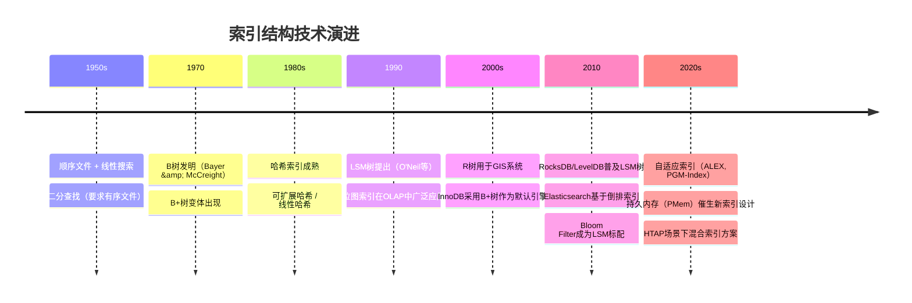

# 第10章 索引结构 · 章节概览

## 本章定位

索引是数据库系统中最核心的数据结构之一，其设计直接决定了查询性能的上限。在数据库的读写路径中，索引承担着"快速定位"的核心职责——没有高效的索引，即使拥有再快的CPU和再多的内存，查询也只能退化为逐条扫描。理解索引结构的原理与工程实现，是DBA、后端工程师和存储系统开发者的基本功。

本章从"索引为什么存在"出发，系统介绍数据库系统中最重要的几种索引结构——B+树、LSM树、哈希索引、倒排索引和R树，覆盖从算法原理到工程优化、从理论基础到实战案例的全链路知识。每种索引结构都围绕其核心设计权衡展开：查询速度与写入速度、内存占用与磁盘空间、点查询与范围查询、构建成本与维护成本。

## 为什么索引结构如此重要

索引的选择和设计直接影响数据库的性能表现。以下是一些真实的对比数据：

| 场景 | 索引方案 | 性能差异 |
|------|---------|---------|
| 亿级数据主键查询 | 无索引 vs B+树索引 | 查询延迟从秒级降到毫秒级 |
| 写密集日志系统 | B+树 vs LSM树 | 写入吞吐量提升 5-10 倍 |
| 点查询为主 | B+树 vs 哈希索引 | 查询延迟从 O(log N) 降到 O(1) |
| 全文搜索 | B+树 vs 倒排索引 | 搜索延迟从秒级降到毫秒级 |
| 空间数据查询 | B+树 vs R树 | 范围查询命中率提升 10-100 倍 |
| LSM树 Compaction | 不调优 vs 调优写放大 | 磁盘写入量减少 3-5 倍 |

一个错误的索引选择可能导致数倍的性能退化。例如，在写密集的时序数据库场景中使用B+树索引，写入性能可能比LSM树慢一个数量级；而在需要范围查询的OLTP场景中使用哈希索引，则完全无法支持范围扫描。理解不同索引结构的设计取舍，是做出正确选择的前提。

## 本章知识图谱

```mermaid
graph TD
    A["索引结构"] --> B["理论基础"]
    A --> C["B+树"]
    A --> D["LSM树"]
    A --> E["哈希索引"]
    A --> F["倒排索引"]
    A --> G["R树"]
    A --> H["工程优化"]
    A --> I["实战与误区"]

    B --> B1["索引的本质：空间换时间"]
    B --> B2["索引结构分类体系"]
    B --> B3["核心指标：读放大/写放大/空间放大"]
    B --> B4["技术演进：从顺序扫描到自适应索引"]

    C --> C1["B树定义与性质"]
    C --> C2["B+树改进：叶节点链表"]
    C --> C3["查找/插入/删除算法"]
    C --> C4["工程优化：前缀压缩/批量加载/COW"]

    D --> D1["写入路径：WAL→MemTable→SSTable"]
    D --> D2["读取路径：多层合并查找"]
    D --> D3["Compaction策略对比"]
    D --> D4["Bloom Filter优化"]

    E --> E1["静态哈希 vs 动态哈希"]
    E --> E2["可扩展哈希实现"]
    E --> E3["自适应哈希索引(AHI)"]

    F --> F1["分词与倒排构建"]
    F --> F2["TF-IDF与BM25"]
    F --> F3["Lucene/Elasticsearch实现"]

    G --> G1["R树空间划分"]
    G --> G2["最小包围矩形(MBR)"]
    G --> G3["R*树与空间查询"]

    H --> H1["索引压缩技术"]
    H --> H2["并发控制与锁"]
    H --> H3["索引选择与调优"]
```

## 本章内容结构

本章按照"理论基础 → 核心索引结构 → 实战应用 → 性能优化 → 总结"的逻辑层层递进，从索引的本质出发，逐步覆盖五种核心索引结构，最后通过实战案例和误区分析帮助读者将知识转化为工程能力。

### 第一部分：理论基础

在深入具体索引结构之前，先建立全局认知框架：

- **索引的本质与分类**：从全表扫描到精确寻址的核心抽象，理解索引作为"空间换时间"策略的本质；完整的索引结构分类体系——基于树的索引（B树/B+树/LSM树/R树）、基于哈希的索引（静态/动态/线性哈希）、基于倒排的索引、基于位图的索引，以及新兴的跳表、Trie树、自适应索引（ALEX、PGM-Index）等
- **关键指标**：三大放大因子——读放大（Read Amplification）、写放大（Write Amplification）、空间放大（Space Amplification）的定义与量化分析，以及延迟、吞吐量、可用性、一致性等系统级指标
- **技术演进**：从1950年代的顺序文件扫描，到1970年代B树的发明，再到现代LSM树和自适应索引的出现——索引结构的发展史本质上是一部在存储介质约束与查询需求之间持续寻找最优平衡的历史

### 第二部分：B+树——关系型数据库的基石

B+树是现代关系型数据库最广泛使用的索引结构，MySQL InnoDB、PostgreSQL、Oracle等都采用B+树作为核心索引：

- **B树的定义与性质**：自平衡多路搜索树的五大性质（节点容量、分裂条件、叶节点平衡等），以及树高估算——256叉B+树存储1亿条记录仅需3层，每层一次磁盘I/O
- **B+树的改进**：数据只存储在叶节点（内部节点容纳更多关键字）、叶节点有序链表（支持高效范围查询）、更高节点利用率
- **核心操作算法**：查找（O(log_m N)）、插入（含节点分裂）、删除（含借位与合并）的完整伪代码实现
- **工程优化**：前缀键压缩（共享前缀只存差异）、后缀截断（分隔键最小前缀）、批量加载（O(N)自底向上构建）、写时复制（PostgreSQL/LMDB的COW B+树天然支持MVCC）

### 第三部分：LSM树——写密集场景的王者

LSM树通过将随机写转化为顺序写，在写密集场景下表现出色：

- **设计动机**：B+树的原地更新导致随机I/O，LSM树将所有写入先缓存在内存中，批量刷盘后通过后台Compaction逐步合并
- **多层结构**：MemTable（内存跳表/红黑树）→ WAL（保证持久性）→ Immutable MemTable → SSTable（磁盘有序文件），多层SSTable从Level 0到Level k逐层合并
- **读写操作**：写入路径（WAL→MemTable→flush→Compaction）、读取路径（多层查找+Bloom Filter加速）、删除处理（Tombstone标记）
- **Compaction策略**：Size-Tiered（写放大低、空间放大高）vs Leveled（读性能好、写放大高），以及实际写放大分析——Leveled Compaction下1TB数据可能需要40倍写放大

### 第四部分：哈希索引——O(1)点查询

哈希索引提供常数时间的点查询，适用于键值对精确查找场景：

- **基本原理**：哈希函数将键映射到桶，支持O(1)平均点查询，但不支持范围查询
- **动态哈希**：可扩展哈希（Extendible Hashing）通过全局深度/本地深度控制目录扩展，解决静态哈希的容量瓶颈
- **数据库应用**：MySQL MEMORY引擎、Redis字典、InnoDB自适应哈希索引（AHI）——自动将频繁访问的B+树页面转换为哈希索引，减少B+树查找路径

### 第五部分：倒排索引与R树

- **倒排索引**：全文搜索的基础数据结构，从文档集合构建"词项→文档列表"的映射；覆盖TF-IDF和BM25评分模型；Lucene/Elasticsearch的实现细节
- **R树**：专为空间数据设计的索引结构，基于最小包围矩形（MBR）组织空间对象；R*树的优化策略；空间范围查询、最近邻查询的处理

### 第六部分：核心技巧与性能优化

- **B+树实操**：InnoDB页面布局、联合索引与最左前缀、覆盖索引与索引下推
- **LSM树写入优化**：WAL与MemTable配置调优、Compaction策略选择、Bloom Filter参数设计
- **哈希索引与布隆过滤器**：哈希碰撞处理、布隆过滤器误判率计算与空间优化
- **性能优化清单**：索引设计、查询调优、配置管理、监控运维的全生命周期检查清单

### 第七部分：实战案例与常见误区

- **实战案例**：电商平台大促场景下的索引优化——从问题诊断到方案实施的完整过程，包含具体SQL分析、索引设计决策和性能验证数据
- **常见误区**：索引设计中最容易犯的错误，包括过度索引、忽略联合索引顺序、误用前缀索引等，每条包含错误思维、真实案例和正确做法

### 第八部分：练习方法与本章小结

- 五套递进式练习：基础理解 → 动手实操 → 问题排查 → 性能优化 → 架构设计
- 核心知识点回顾、关键对比表（B+树 vs LSM树 vs 哈希索引）、最佳实践清单

## 本章学习路线

根据读者的背景和目标，推荐以下学习路径：

- **入门路径**：理解"索引为什么存在"以及B+树的基本结构——这是所有关系型数据库的基础，适合后端开发者和DBA入门
- **进阶路径**：深入LSM树的写入优化和Compaction机制，理解倒排索引和R树的应用场景——适合存储系统开发者和需要处理特殊查询模式的工程师
- **精通路径**：掌握索引压缩、并发控制、自适应索引等高级技巧，能够针对不同工作负载设计最优索引方案——适合数据库内核开发者和资深架构师

## 前置知识

学习本章前，建议具备以下基础知识：

- **数据结构基础**：二叉搜索树、平衡树（AVL/红黑树）、哈希表的基本概念与操作
- **磁盘存储原理**：第09章存储介质——磁盘页、顺序读写vs随机读写的性能差异、SSD的写入特性
- **数据库基础**：SQL查询的基本执行流程、WHERE/JOIN/GROUP BY的语义
- **算法基础**：时间复杂度分析、分治思想、归并排序

## 关键度量指标

索引结构的性能评估需要关注以下核心指标：

| 指标 | 含义 | 典型值 | 优化方向 |
|------|------|--------|----------|
| 读放大 (Read Amp) | 一次查询实际读取的磁盘页数 | B+树: 3-4次, LSM树: 1-6次 | Bloom Filter、缓存策略 |
| 写放大 (Write Amp) | 一次写入实际写入的磁盘数据量 | B+树: 1x, LSM树: 10-40x | Compaction策略、WAL优化 |
| 空间放大 (Space Amp) | 实际磁盘占用/逻辑数据量 | B+树: 1x, LSM树: 1-2x | 压缩算法、及时清理旧数据 |
| 查询延迟 | 点查询的响应时间 | B+树: 0.1-1ms, 哈希: <0.1ms | 索引命中率、缓存命中率 |
| 写入吞吐量 | 单位时间写入的记录数 | 10K-1M ops/s | 批量写入、异步Compaction |
| 空间利用率 | 索引占用空间/数据总空间 | B+树: 70-95%, LSM树: 50-80% | 节点填充率、前缀压缩 |

## 技术演进

## 参考文献

- Bayer, R. & McCreight, E. "Organization and Maintenance of Large Ordered Indexes." *Acta Informatica*, 1972.
- O'Neil, P. et al. "The Log-Structured Merge-Tree (LSM-Tree)." *Acta Informatica*, 1996.
- Comer, D. "The Ubiquitous B-Tree." *ACM Computing Surveys*, 1979.
- Guttman, A. "R-Trees: A Dynamic Index Structure for Spatial Searching." *ACM SIGMOD*, 1984.
- Cormen, T. et al. *Introduction to Algorithms* (算法导论). MIT Press.
- Silberschatz, A. et al. *Database System Concepts*. McGraw-Hill.
- 国盛. *数据库索引设计与优化*. 电子工业出版社.
- Knuth, D. *The Art of Computer Programming, Vol.3: Sorting and Searching*. Addison-Wesley.
