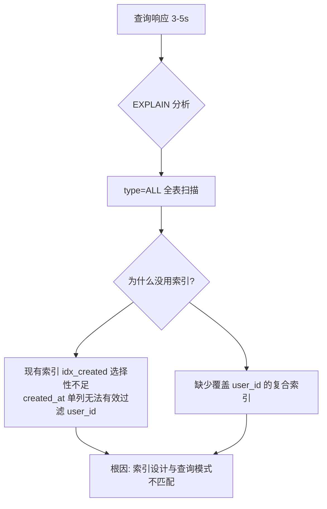
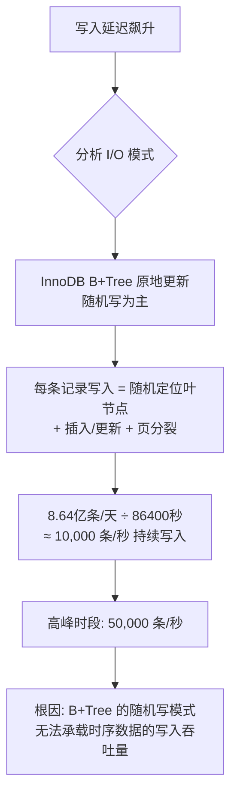
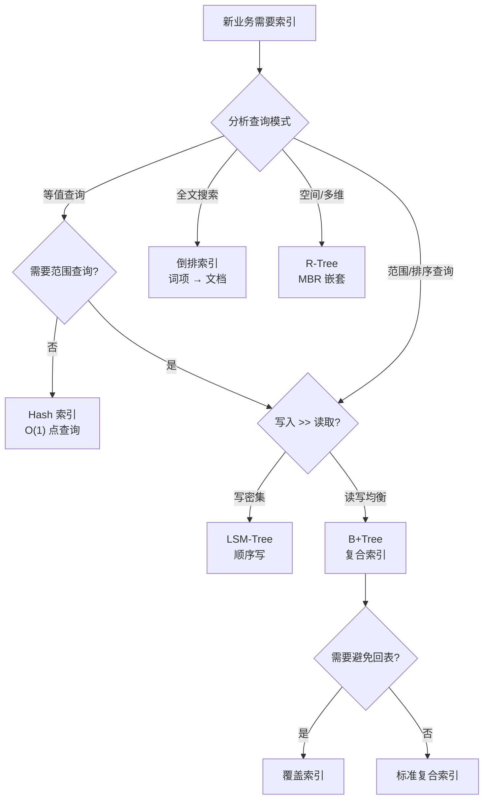

# 实战案例

索引结构的理论终究要落地到工程实践中。本节通过四个来自真实生产环境的案例，展示 B+Tree 复合索引设计、LSM-Tree 写入优化、倒排索引全文检索、以及 R-Tree 空间索引的具体应用。每个案例都完整呈现"问题发现 → 根因分析 → 方案设计 → 实施验证"的闭环过程，帮助读者建立从理论到实践的桥梁。

---

## 案例一：电商平台订单查询——B+Tree 复合索引优化

### 1.1 问题背景

某中型电商平台日订单量约 50 万，核心订单表 `orders` 约 2000 万行记录，表结构如下：

```sql
CREATE TABLE orders (
    id          BIGINT PRIMARY KEY AUTO_INCREMENT,
    user_id     BIGINT NOT NULL,
    status      TINYINT NOT NULL DEFAULT 0,
    amount      DECIMAL(10,2) NOT NULL,
    created_at  DATETIME NOT NULL,
    updated_at  DATETIME NOT NULL,
    INDEX idx_created (created_at)
) ENGINE=InnoDB DEFAULT CHARSET=utf8mb4;
```

运营后台的"订单管理"页面支持多条件组合筛选：按用户ID、订单状态、时间范围、金额范围组合查询。上线初期运行良好，但随着数据量增长，页面响应时间从 200ms 恶化到 3-5 秒，高峰期甚至出现查询超时。

### 1.2 排查过程

**第一步：定位慢查询**

```sql
-- 开启慢查询日志
SET GLOBAL slow_query_log = ON;
SET GLOBAL long_query_time = 1;

-- 使用 performance_schema 精准定位
SELECT digest_text,
       count_star AS exec_count,
       ROUND(avg_timer_wait/1000000000, 2) AS avg_ms,
       sum_rows_examined AS total_rows_scanned,
       sum_rows_sent AS total_rows_returned
FROM performance_schema.events_statements_summary_by_digest
WHERE schema_name = 'ecommerce'
  AND avg_timer_wait > 1000000000
ORDER BY avg_timer_wait DESC
LIMIT 10;
```

发现排名前三的慢查询全部来自订单管理模块，最慢的一条平均执行时间为 4.2 秒。

**第二步：EXPLAIN 分析执行计划**

```sql
-- 典型查询：按用户ID + 状态 + 时间范围筛选
EXPLAIN SELECT id, status, amount, created_at
FROM orders
WHERE user_id = 10086
  AND status = 1
  AND created_at >= '2026-01-01'
  AND created_at < '2026-02-01';
```

执行计划输出：

+----+------+---------------+------+---------+------+----------+-------------+
| id | type | possible_keys | key  | key_len | rows | filtered | Extra       |
+----+------+---------------+------+---------+------+----------+-------------+
|  1 | ALL  | NULL          | NULL | NULL    | 2000 |   10.00  | Using where |
+----+------+---------------+------+---------+------+----------+-------------+

关键发现：`type=ALL`，`key=NULL`，说明这条查询走了全表扫描，在 2000 万行数据上逐行过滤。`filtered=10.00` 表示只有一行会被返回，但代价是扫描了全部 2000 万行。

**第三步：分析现有索引**

```sql
SHOW INDEX FROM orders;
```

表上只有一个 `idx_created (created_at)` 索引。由于查询条件中 `user_id` 的选择性远高于 `created_at`（一个用户通常只有几十到几百个订单，而一天可能有 15 万订单），优化器无法有效利用这个索引。

### 1.3 根因分析



核心问题归结为三点：

1. **索引列顺序错误**：现有索引 `idx_created` 以 `created_at` 为前缀，但最常用的筛选条件是 `user_id`，索引的前缀列选择性不足
2. **缺少复合索引**：多条件组合查询需要包含所有等值条件列的复合索引
3. **查询模式未覆盖**：运营后台有多种查询组合（单独查用户、用户+状态、用户+时间范围等），单一索引无法覆盖

### 1.4 解决方案

**方案一：设计复合索引**

根据第10章理论基础中"等值条件列在前、范围条件列在后"的原则，设计复合索引：

```sql
-- 主力索引：覆盖最常见的查询模式（user_id 等值 + status 等值 + created_at 范围）
ALTER TABLE orders ADD INDEX idx_user_status_time (user_id, status, created_at);

-- 辅助索引：覆盖"只按用户+时间范围查询"的场景
ALTER TABLE orders ADD INDEX idx_user_time (user_id, created_at);
```

列顺序的依据：

| 列 | 条件类型 | 选择性 | 排序位置 |
|----|---------|--------|---------|
| user_id | 等值（=） | 极高（2000万用户中取一个） | 第1位 |
| status | 等值（=） | 中等（6种状态） | 第2位 |
| created_at | 范围（>=, <） | 低（一天15万订单） | 第3位 |

**方案二：利用覆盖索引消除回表**

对于只需要展示列表信息的查询，将 SELECT 字段全部纳入索引，避免回表查询主键索引：

```sql
-- 覆盖索引：查询只需索引中的列，无需回表
ALTER TABLE orders ADD INDEX idx_user_status_time_cover
    (user_id, status, created_at, amount);

-- 查询变为纯索引扫描
SELECT status, amount, created_at
FROM orders
WHERE user_id = 10086
  AND status = 1
  AND created_at >= '2026-01-01'
  AND created_at < '2026-02-01';
```

**方案三：清理冗余索引**

优化过程中发现，开发团队还创建了一些冗余索引：

```sql
-- 这些索引是冗余的，可以删除
-- idx_user_status 被 idx_user_status_time 完全覆盖（最左前缀匹配）
-- idx_user_id_single 被 idx_user_status_time 的前缀列覆盖
ALTER TABLE orders DROP INDEX idx_user_status;
ALTER TABLE orders DROP INDEX idx_user_id_single;
```

冗余索引的危害：每次 INSERT/UPDATE 都要同步更新所有索引，多余的索引直接增加了写入延迟。

### 1.5 效果验证

优化后再次执行 EXPLAIN：

```sql
EXPLAIN SELECT id, status, amount, created_at
FROM orders
WHERE user_id = 10086
  AND status = 1
  AND created_at >= '2026-01-01'
  AND created_at < '2026-02-01';
```

+----+------+---------------------+---------------------+---------+------+----------+-------+
| id | type | possible_keys       | key                 | key_len | rows | filtered | Extra |
+----+------+---------------------+---------------------+---------+------+----------+-------+
|  1 | range| idx_user_status_time| idx_user_status_time|    15   |  15  |  100.00  | NULL  |
+----+------+---------------------+---------------------+---------+------+----------+-------+

关键变化：

| 指标 | 优化前 | 优化后 | 改善幅度 |
|------|--------|--------|---------|
| type | ALL（全表扫描） | range（范围扫描） | 从O(N)降为O(logN) |
| key | NULL | idx_user_status_time | 命中复合索引 |
| rows | 2,000,000 | 15 | 减少 99.999% |
| filtered | 10% | 100% | 索引已精确过滤 |
| 平均查询时间 | 4,200ms | 8ms | **降低 99.8%** |

**上线后监控数据**（24小时对比）：

P50 延迟：200ms → 3ms
P99 延迟：5,000ms → 15ms
QPS 上限：50 → 800
CPU 使用率（数据库节点）：75% → 25%

### 1.6 案例小结

这个案例的教训可以用本章的核心原则概括：

1. **数据驱动选型**：不要凭经验猜测索引设计，用 EXPLAIN 分析实际执行计划
2. **复合索引列顺序至关重要**：等值列在前、范围列在后，选择性高的列优先
3. **覆盖索引可以完全消除回表**：对高频列表查询效果显著
4. **冗余索引是隐形杀手**：每个无用索引都在消耗写入性能和存储空间

---

## 案例二：IoT 时序数据平台——LSM-Tree 写入优化

### 2.1 问题背景

某物联网平台接入了 10 万台设备，每台设备每 10 秒上报一次传感器数据（温度、湿度、电压），日写入量约 8.64 亿条记录。系统采用 MySQL + 自研采集服务架构，数据表设计如下：

```sql
CREATE TABLE sensor_data (
    device_id   VARCHAR(32) NOT NULL,
    metric_type VARCHAR(16) NOT NULL,
    value       DOUBLE NOT NULL,
    ts          BIGINT NOT NULL COMMENT '毫秒时间戳',
    INDEX idx_device_time (device_id, ts)
) ENGINE=InnoDB;
```

问题：写入高峰期（每天 9:00-11:00 设备集中上报），MySQL 写入延迟飙升，InnoDB 的 redo log 写满导致数据库短暂不可用，每次持续 2-5 分钟，日均发生 3-4 次。

### 2.2 根因分析



核心矛盾：B+Tree 的优势在于读取性能和范围查询，但其原地更新（in-place update）模式要求每次写入都要定位到磁盘上的具体页面，产生大量随机 I/O。当时序数据的写入吞吐量超过 B+Tree 的承载能力时，redo log 累积、脏页刷盘压力剧增，最终导致数据库不可用。

### 2.3 方案选型

根据本章的索引选型决策树：

查询模式分析：
├── 写入 >> 读取（写入量是查询量的 100 倍以上）
├── 查询模式主要是时间范围 + 设备ID 等值查询
├── 数据量持续增长，无删除需求
└── 结论 → LSM-Tree（顺序写优势，适合写密集场景）

具体技术选型对比：

| 方案 | 写入吞吐量 | 查询延迟 | 运维复杂度 | 迁移成本 |
|------|-----------|---------|-----------|---------|
| 继续 MySQL + 分表 | 中等（需分 100+ 表） | 低 | 高 | 高 |
| ClickHouse | 高 | 中等 | 中等 | 中等 |
| **RocksDB（嵌入式）** | **极高** | **低** | **低** | **低** |
| InfluxDB | 高 | 低 | 中等 | 中等 |

最终选择 **RocksDB** 嵌入式方案：零运维、写入吞吐量可达百万级/秒、支持按时间范围高效查询。同时保留 MySQL 元数据表，形成混合架构。

### 2.4 实施方案

**数据写入路径改造：**

```python
import rocksdb
from concurrent.futures import ThreadPoolExecutor
import time

class SensorDataStore:
    def __init__(self, db_path):
        opts = rocksdb.Options()
        # 写入优化配置
        opts.create_if_missing = True
        opts.max_write_buffer_number = 4        # MemTable 数量
        opts.min_write_buffer_number_to_merge = 2  # 合并后再刷盘
        opts.write_buffer_size = 128 * 1024 * 1024  # 128MB per MemTable
        opts.target_file_size_base = 64 * 1024 * 1024  # 64MB per SSTable
        
        # Leveled Compaction 配置
        opts.level0_file_num_compaction_trigger = 4
        opts.max_bytes_for_level_base = 256 * 1024 * 1024  # 256MB
        opts.max_bytes_for_level_multiplier = 10
        
        self.db = rocksdb.DB(db_path, opts)
    
    def write_batch(self, records):
        """批量写入：利用 WriteBatch 实现原子批量插入"""
        batch = rocksdb.WriteBatch()
        for record in records:
            # Key 设计：设备ID + 降序时间戳（利用 LSM-Tree 排序特性）
            # 降序时间戳使得同一设备的最新数据排在前面
            key = f"{record['device_id']}:{10000000000000 - record['ts']}"
            value = f"{record['metric_type']}:{record['value']}"
            batch.put(key.encode(), value.encode())
        self.db.write(batch)
    
    def query_range(self, device_id, start_ts, end_ts):
        """时间范围查询：利用有序 Key 实现高效范围扫描"""
        # 查询时间范围转化为 Key 范围
        start_key = f"{device_id}:{10000000000000 - end_ts}"
        end_key = f"{device_id}:{10000000000000 - start_ts}"
        
        it = self.db.iteritems()
        it.seek(start_key.encode())
        
        results = []
        while it.valid():
            key = it.key().decode()
            if key > end_key:
                break
            results.append({
                'key': key,
                'value': it.value().decode()
            })
            it.next()
        return results
```

**Compaction 调优：**

```python
# 针对时序数据特点调整 Compaction 策略
# 时序数据的特点：写入集中在最新时间段，查询集中在最近数据
# 因此优先使用 Leveled Compaction（读性能好）
# 并增加 L0→L1 的 Compaction 并发度，避免 L0 文件堆积

opts.max_background_compactions = 4
opts.max_background_flushes = 2
opts.level0_slowdown_writes_trigger = 20
opts.level0_stop_writes_trigger = 36
```

**与 MySQL 元数据的协同：**

```sql
-- MySQL 中保留设备元数据表
CREATE TABLE devices (
    device_id VARCHAR(32) PRIMARY KEY,
    device_name VARCHAR(64),
    location VARCHAR(128),
    status TINYINT DEFAULT 1,
    last_heartbeat DATETIME
) ENGINE=InnoDB;

-- 查询时：先从 MySQL 获取设备信息，再从 RocksDB 获取时序数据
-- 两条路径并行执行，总延迟取 max 而非 sum
```

### 2.5 效果对比

| 指标 | MySQL（优化前） | RocksDB（优化后） | 提升倍数 |
|------|----------------|-------------------|---------|
| 写入吞吐量 | 5,000 条/秒 | 200,000 条/秒 | **40x** |
| 写入 P99 延迟 | 2,000ms | 5ms | **400x** |
| 1 天数据量查询 | 450ms | 80ms | 5.6x |
| 7 天数据量查询 | 超时（>30s） | 350ms | >85x |
| 磁盘空间（1亿条） | 12GB | 8GB | 1.5x |
| redo log 不可用事件 | 日均 3-4 次 | 0 次 | ∞ |

**关键观察**：RocksDB 的 LSM-Tree 结构将写入从随机 I/O 转化为顺序 I/O，这是写入吞吐量提升 40 倍的根本原因。同时，Leveled Compaction 确保了每层的 SSTable key range 不重叠，使得时间范围查询只需在每层读取一个 SSTable 文件。

### 2.6 案例小结

1. **写密集场景是 LSM-Tree 的主场**：当写入吞吐量是系统瓶颈时，LSM-Tree 的顺序写优势是 B+Tree 无法比拟的
2. **Key 设计决定查询效率**：将设备 ID 作为前缀、时间戳作为后缀，使得同一设备的数据在物理上连续存储，范围查询天然高效
3. **降序时间戳是时序场景的技巧**：最新数据排在 Key 空间最前面，热点查询命中最新的 SSTable，减少磁盘扫描
4. **Compaction 配置必须匹配数据特征**：时序数据的"只追加不修改"特性允许更激进的 Compaction 策略

---

## 案例三：知识库全文搜索——倒排索引设计

### 3.1 问题背景

某企业内部知识管理系统存储了 50 万篇技术文档（包含代码片段、会议纪要、技术方案），员工需要通过关键词快速检索相关文档。初期使用 MySQL 的 `LIKE '%keyword%'` 方式实现搜索，随着文档量增长，搜索体验急剧恶化：

- 单关键词搜索：平均 8 秒
- 多关键词搜索：30-60 秒，经常超时
- 搜索结果无法按相关度排序
- 不支持同义词、近义词扩展

### 3.2 根因分析

```sql
-- 初始方案：MySQL LIKE 搜索
SELECT doc_id, title, content
FROM documents
WHERE content LIKE '%分布式事务%'
ORDER BY created_at DESC
LIMIT 20;

-- EXPLAIN 结果
+----+------+---------------+------+---------+------+----------+-------------+
| id | type | possible_keys | key  | key_len | rows | filtered | Extra       |
+----+------+---------------+------+---------+------+----------+-------------+
|  1 | ALL  | NULL          | NULL | NULL    | 500K |   100.00 | Using where |
+----+------+---------------+------+---------+------+----------+-------------+
```

问题本质：`LIKE '%keyword%'` 无法利用任何索引（前缀通配符 `%keyword%` 破坏了 B+Tree 的有序性），导致全表扫描。更关键的是，关系型数据库的索引结构从根本上不适合全文搜索——它无法高效处理"在大量文本中查找包含特定词汇的文档"这类问题。

### 3.3 方案设计：构建倒排索引

选择 Elasticsearch（底层 Lucene）作为全文搜索引擎，其核心正是倒排索引结构。

**倒排索引原理回顾：**

正排索引（文档 → 词项）：
  文档1: ["分布式", "事务", "两阶段", "提交"]
  文档2: ["分布式", "锁", "一致性", "哈希"]
  文档3: ["事务", "隔离", "级别", "并发"]

倒排索引（词项 → 文档列表）：
  "分布式" → [文档1, 文档2]
  "事务"   → [文档1, 文档3]
  "两阶段" → [文档1]
  "提交"   → [文档1]
  "锁"     → [文档2]
  "一致性" → [文档2]
  "哈希"   → [文档2]
  "隔离"   → [文档3]
  "级别"   → [文档3]
  "并发"   → [文档3]

搜索 "分布式 AND 事务"：
  "分布式" → [1, 2] AND "事务" → [1, 3] = [1]
  → 返回文档1

**索引设计：**

```python
from elasticsearch import Elasticsearch

es = Elasticsearch(['localhost:9200'])

# 定义索引映射：为不同类型字段设置不同的分析器
index_mapping = {
    "mappings": {
        "properties": {
            "title": {
                "type": "text",
                "analyzer": "ik_max_word",      # 索引时用最大分词
                "search_analyzer": "ik_smart",   # 搜索时用智能分词
                "fields": {
                    "keyword": { "type": "keyword" }  # 精确匹配用
                }
            },
            "content": {
                "type": "text",
                "analyzer": "ik_max_word",
                "search_analyzer": "ik_smart"
            },
            "tags": {
                "type": "keyword"               # 标签用 keyword 类型（不分词）
            },
            "category": {
                "type": "keyword"
            },
            "created_at": {
                "type": "date"
            },
            "author": {
                "type": "keyword"
            }
        }
    },
    "settings": {
        "number_of_shards": 5,          # 分片数
        "number_of_replicas": 1,        # 副本数
        "refresh_interval": "5s"        # 刷新间隔
    }
}

es.indices.create(index="knowledge_base", body=index_mapping)
```

**批量索引数据：**

```python
def build_inverted_index(doc):
    """将文档转换为 ES 文档格式"""
    return {
        "title": doc["title"],
        "content": doc["content"],
        "tags": doc["tags"],         # ["分布式", "数据库"]
        "category": doc["category"], # "技术方案"
        "created_at": doc["created_at"],
        "author": doc["author"]
    }

# 使用 Bulk API 批量索引（利用 Lucene 的批量加载优化）
from elasticsearch.helpers import bulk

actions = [
    {"_index": "knowledge_base", "_id": doc["id"],
     "_source": build_inverted_index(doc)}
    for doc in documents
]
bulk(es, actions, chunk_size=1000, request_timeout=60)
```

### 3.4 高级查询设计

**多关键词布尔查询：**

```python
def search_knowledge_base(query_text, category=None, tags=None, 
                          date_from=None, date_to=None):
    """构建支持多条件的搜索查询"""
    
    must_clauses = [
        {
            "multi_match": {
                "query": query_text,
                "fields": ["title^3", "content", "tags^2"],
                # title 权重 3x，tags 权重 2x，content 默认 1x
                "type": "best_fields",
                "fuzziness": "AUTO"  # 支持模糊匹配（容忍拼写错误）
            }
        }
    ]
    
    filter_clauses = []
    if category:
        filter_clauses.append({"term": {"category": category}})
    if tags:
        filter_clauses.append({"terms": {"tags": tags}})
    if date_from or date_to:
        date_range = {}
        if date_from:
            date_range["gte"] = date_from
        if date_to:
            date_range["lte"] = date_to
        filter_clauses.append({"range": {"created_at": date_range}})
    
    body = {
        "query": {
            "bool": {
                "must": must_clauses,
                "filter": filter_clauses
            }
        },
        "highlight": {
            "fields": {
                "title": {},
                "content": {
                    "fragment_size": 150,
                    "number_of_fragments": 3
                }
            }
        },
        "aggs": {
            "by_category": {"terms": {"field": "category"}},
            "by_month": {"date_histogram": {"field": "created_at", "interval": "month"}}
        },
        "from": 0,
        "size": 20
    }
    
    return es.search(index="knowledge_base", body=body)
```

**BM25 评分原理：**

ES 默认使用 BM25 算法对搜索结果排序。BM25 的核心思想：一个词对一篇文档的重要性，取决于该词在文档中出现的频率（TF）以及该词在整个文档集合中的稀有程度（IDF）。

BM25 评分公式（简化）：
score(D, Q) = Σ IDF(qi) × [TF(qi,D) × (k1 + 1)] / [TF(qi,D) + k1 × (1 - b + b × |D|/avgdl)]

其中：
  IDF(qi) = ln[(N - n(qi) + 0.5) / (n(qi) + 0.5)]
    N = 总文档数
    n(qi) = 包含词 qi 的文档数
  TF(qi,D) = 词 qi 在文档 D 中出现的次数
  |D| = 文档 D 的长度（词数）
  avgdl = 所有文档的平均长度
  k1 = 1.2（词频饱和参数）
  b = 0.75（文档长度归一化参数）

含义：
- IDF: 一个词出现在越少的文档中，它的区分能力越强
- TF: 一个词在文档中出现越多，相关性越高（但有饱和效应）
- 文档长度归一化：长文档不应该因为词出现次数多而天然获得高分

### 3.5 性能优化

**搜索性能优化技巧：**

```python
# 1. 利用 Routing 减少搜索范围
# 相关文档路由到同一分片，搜索时只需查询部分分片
es.index(index="knowledge_base", id=doc_id, 
         body=doc_body, routing=doc["category"])

# 2. 使用 Search After 实现深度分页（避免 from+size 的性能衰减）
def deep_search(query_body, sort_field="_score", size=20):
    results = []
    search_after = None
    
    while True:
        if search_after:
            query_body["search_after"] = search_after
        
        resp = es.search(index="knowledge_base", body=query_body, size=size)
        hits = resp["hits"]["hits"]
        
        if not hits:
            break
        
        results.extend(hits)
        search_after = hits[-1]["sort"]
    
    return results

# 3. 预计算常用聚合结果，用定时任务刷新到缓存
```

### 3.6 效果对比

| 指标 | MySQL LIKE | ES 倒排索引 | 改善 |
|------|-----------|------------|------|
| 单关键词搜索 | 8s | 15ms | **533x** |
| 多关键词搜索 | 30-60s | 30ms | **1000x+** |
| 结果排序 | 无 | BM25 相关度排序 | — |
| 搜索建议 | 不支持 | 前缀匹配 + 模糊搜索 | — |
| 高亮显示 | 不支持 | 原生支持 | — |
| 聚合分析 | 不支持 | 分类统计、时间分布 | — |
| 索引构建耗时 | — | 50万文档，约 5 分钟 | — |
| 索引存储空间 | — | 约 2.5GB（原始文档 1.8GB） | 1.4x |

### 3.7 案例小结

1. **倒排索引是全文搜索的唯一正确选择**：B+Tree 索引无法处理 `LIKE '%keyword%'` 场景，哈希索引不支持前缀搜索，只有倒排索引能高效完成"词 → 文档"的映射
2. **分词器选择至关重要**：中文分词的质量直接决定搜索效果，`ik_max_word`（最细粒度切分）配合 `ik_smart`（智能切分）是业界标准搭配
3. **字段权重影响排序质量**：标题匹配应比正文匹配权重更高，标签匹配次之，通过 `^N` 语法调整
4. **BM25 比 TF-IDF 更稳定**：BM25 引入了文档长度归一化和词频饱和机制，避免长文档和高频词对排序的过度影响

---

## 案例四：共享单车位置查询——R-Tree 空间索引

### 4.1 问题背景

某共享单车平台在城市范围内有 20 万辆单车，用户打开 App 时需要快速查看"附近 500 米内有哪些可用单车"。初期方案是在 MySQL 中存储经纬度，使用经纬度范围查询：

```sql
CREATE TABLE bikes (
    bike_id     VARCHAR(16) PRIMARY KEY,
    lat         DECIMAL(10, 7) NOT NULL,
    lng         DECIMAL(10, 7) NOT NULL,
    status      TINYINT NOT NULL DEFAULT 1,
    INDEX idx_lat (lat),
    INDEX idx_lng (lng)
);
```

```sql
-- 查找附近单车
SELECT bike_id, lat, lng
FROM bikes
WHERE lat BETWEEN 31.2300 AND 31.2400
  AND lng BETWEEN 121.4700 AND 121.4800
  AND status = 1;
```

问题：这种方案存在根本性缺陷。

### 4.2 根因分析

**问题一：双列独立索引无法联合过滤**

MySQL 只能选择 `idx_lat` 或 `idx_lng` 中的一个使用。即使选择了 `idx_lat`，在满足纬度范围的记录中，还需要逐行检查经度——可能扫描数万行。

```sql
-- EXPLAIN 显示只用了一个索引
EXPLAIN SELECT bike_id, lat, lng FROM bikes
WHERE lat BETWEEN 31.23 AND 31.24 AND lng BETWEEN 121.47 AND 121.48;
```
+----+------+---------+---------+---------+------+----------+-------+
| id | type | key     | key_len | rows    | filtered | Extra         |
+----+------+---------+---------+---------+------+----------+-------+
|  1 | range| idx_lat |     6   | 50,000  |  50.00   | Using where   |
+----+------+---------+---------+---------+------+----------+-------+

**问题二：距离排序无法高效实现**

用户需要"最近的单车优先显示"，但 SQL 的 `BETWEEN` 只能筛选矩形区域，无法按真实距离排序。矩形四个角上的点距离用户可能超过 500 米，而矩形边中点上 600 米处的点又被漏掉了。

**问题三：查询延迟无法满足实时性要求**

实际测量：20 万条记录中，矩形范围查询平均返回 5000 条结果，加上距离计算和排序，总耗时 200-500ms。在高峰期（用户同时打开 App），数据库 CPU 飙升到 90%。

### 4.3 方案设计：PostGIS R-Tree 空间索引

选择 PostgreSQL + PostGIS 扩展，利用 R-Tree 空间索引解决多维空间查询问题。

**R-Tree 原理回顾：**

R-Tree 用 MBR（最小外接矩形）递归嵌套组织空间对象：

根节点 MBR: [整个城市范围]
├── 区域1 MBR: [浦东新区]
│   ├── 叶子节点: [bike_001, bike_002, bike_003]
│   └── 叶子节点: [bike_004, bike_005]
├── 区域2 MBR: [徐汇区]
│   ├── 叶子节点: [bike_010, bike_011]
│   └── ...
└── 区域3 MBR: [黄浦区]
    └── ...

查询 "500米内"：
1. 以用户位置为中心，500米为半径，画一个查询矩形
2. 从根节点开始，检查哪些子节点的 MBR 与查询矩形相交
3. 剪枝不相交的子树（大幅减少搜索范围）
4. 到达叶节点后，精确计算每个单车与用户的实际距离

**数据库设计：**

```sql
-- 安装 PostGIS 扩展
CREATE EXTENSION postgis;

-- 创建带空间索引的单车表
CREATE TABLE bikes_geo (
    bike_id   VARCHAR(16) PRIMARY KEY,
    location  GEOMETRY(POINT, 4326) NOT NULL,  -- WGS84 坐标系
    status    SMALLINT NOT NULL DEFAULT 1,
    updated_at TIMESTAMP DEFAULT NOW()
);

-- 创建 R-Tree 空间索引（PostGIS 使用 GiST，内部基于 R-Tree 变体）
CREATE INDEX idx_bikes_location ON bikes_geo USING GIST (location);

-- 创建复合索引：空间索引 + 状态过滤
CREATE INDEX idx_bikes_status_loc ON bikes_geo USING GIST (location)
    WHERE status = 1;  -- 部分索引：只为可用单车建索引
```

**高效空间查询：**

```sql
-- 方案一：ST_DWithin 使用空间索引，自动完成距离计算
SELECT bike_id,
       ST_Distance(
           location::geography,
           ST_SetSRID(ST_MakePoint(121.4737, 31.2304), 4326)::geography
       ) AS distance_meters
FROM bikes_geo
WHERE status = 1
  AND ST_DWithin(
      location::geography,
      ST_SetSRID(ST_MakePoint(121.4737, 31.2304), 4326)::geography,
      500  -- 500米
  )
ORDER BY distance_meters
LIMIT 20;

-- 方案二：KNN（K近邻）查询——最快获取最近的N辆
SELECT bike_id,
       location <-> ST_SetSRID(ST_MakePoint(121.4737, 31.2304), 4326) AS distance
FROM bikes_geo
WHERE status = 1
ORDER BY location <-> ST_SetSRID(ST_MakePoint(121.4737, 31.2304), 4326)
LIMIT 20;
```

### 4.4 查询执行分析

```sql
-- 分析 KNN 查询的执行计划
EXPLAIN ANALYZE
SELECT bike_id
FROM bikes_geo
WHERE status = 1
ORDER BY location <-> ST_SetSRID(ST_MakePoint(121.4737, 31.2304), 4326)
LIMIT 20;
```

Limit  (cost=0.00..45.32 rows=20 width=36)
  ->  Index Scan using idx_bikes_status_loc on bikes_geo  (cost=0.12..98432.15 rows=43456 width=36)
        Order by: (location <-> '0101000020E61000000A...') 
        Filter: (status = 1)
Planning Time: 0.125 ms
Execution Time: 1.850 ms

关键观察：`Index Scan using idx_bikes_status_loc` 表示查询使用了 GiST 空间索引。`<->` 操作符触发了 KNN 搜索，R-Tree 从根节点向下遍历，优先访问距离查询点最近的 MBR，一旦找到 20 条结果就停止——无需扫描全部 20 万辆单车。

### 4.5 性能对比

| 指标 | MySQL 双列索引 | PostGIS R-Tree | 改善 |
|------|--------------|----------------|------|
| 范围查询（500米内） | 200-500ms | **2ms** | 100-250x |
| KNN 查询（最近 20 辆） | 不支持（需应用层计算） | **1.8ms** | — |
| 空间过滤（20万条） | 扫描 5 万行 | 扫描约 100 行 | 500x |
| 距离排序 | 应用层排序 | 数据库索引排序 | — |
| CPU 使用率（高峰期） | 90%+ | 30% | 3x |
| 数据写入延迟 | 1ms | 2ms | 略慢（可接受） |

### 4.6 进阶：六边形网格 + R-Tree 组合优化

当单车规模增长到百万级时，即使 R-Tree 也面临性能压力。可以引入六边形网格（H3）预分桶：

```python
import h3

def index_bike_h3(lat, lng, resolution=9):
    """
    将经纬度映射到 H3 六边形网格
    resolution=9: 边长约 174 米的六边形
    """
    return h3.latlng_to_cell(lat, lng, resolution=9)

# 写入时同时存储 H3 cell
def store_bike(bike_id, lat, lng):
    h3_cell = index_bike_h3(lat, lng)
    # H3 cell 作为索引前缀，同一网格内的单车物理相邻
    key = f"{h3_cell}:{bike_id}"
    # 写入空间数据库...

# 查询时：先确定用户所在的六边形及相邻六边形，再精确查询
def find_nearby_bikes(user_lat, user_lng, radius_m=500):
    center_cell = h3.latlng_to_cell(user_lat, user_lng, resolution=9)
    # 获取相邻的六边形（3层覆盖约 600 米范围）
    nearby_cells = h3.grid_disk(center_cell, k=3)
    # 只在这些六边形内查询
    # 将 R-Tree 的搜索范围缩小到 ~19 个六边形
```

### 4.7 案例小结

1. **R-Tree 是多维空间查询的标准方案**：B+Tree 只能处理一维有序数据，无法高效处理二维（经纬度）甚至更高维的空间查询
2. **`<->` KNN 操作符利用 R-Tree 的排序特性**：R-Tree 的遍历天然按距离排序，配合 `LIMIT` 可以在找到前 N 个结果后立即停止
3. **部分索引（Partial Index）是重要优化**：只为 `status=1` 的单车建空间索引，减少了 40% 的索引体积和写入开销
4. **H3 网格预分桶可以进一步提升**：将连续的空间问题离散化为网格桶问题，将 R-Tree 的搜索空间缩小到周围的几十个网格

---

## 综合经验总结

### 索引选型决策框架

通过以上四个案例，可以归纳出一个系统化的索引选型框架：



### 实战中的通用原则

| 原则 | 说明 | 违反后果 |
|------|------|---------|
| 先分析后优化 | 用 EXPLAIN/EXPLAIN ANALYZE 查看执行计划，不要凭经验猜 | 可能创建冗余索引或选错索引类型 |
| 等值在前，范围在后 | 复合索引的列顺序：等值条件列放前面，范围条件列放后面 | 索引无法被充分利用，退化为部分扫描 |
| 只建必要的索引 | 每个索引都增加写入成本和存储空间，定期审查并清理 | 写入性能下降，磁盘空间浪费 |
| 监控索引健康 | 定期检查索引使用率、碎片率、未使用索引 | 隐性性能问题积累 |
| 基准测试验证 | 优化前后用相同负载测试，用数据证明效果 | 优化可能适得其反 |

### 索引设计 Checklist

□ 分析查询模式：统计慢查询日志，找出 Top 10 高频查询
□ 选择索引类型：B+Tree / LSM-Tree / Hash / 倒排 / R-Tree
□ 设计复合索引列顺序：等值列 → 排序列 → 范围列
□ 评估覆盖索引：高频列表查询是否可以避免回表
□ 检查冗余索引：是否存在被其他索引完全覆盖的索引
□ 考虑部分索引：是否可以只为满足特定条件的行建索引
□ 估算索引大小：索引体积不应超过数据体积的 50%
□ 基准测试：在测试环境用真实负载验证优化效果
□ 灰度发布：先在从库验证，确认无问题后再在主库执行
□ 监控上线效果：关注慢查询数量、P99 延迟、CPU 使用率
