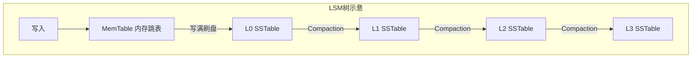
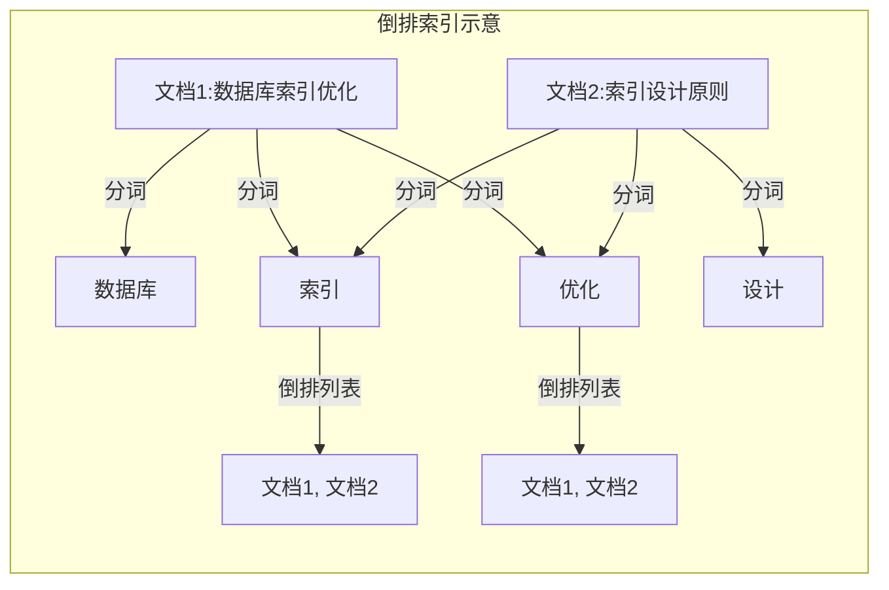

## 练习方法

本章提供了五套递进式练习，从基础概念理解到架构设计实战，覆盖从入门到精通的完整学习路径。每套练习都围绕索引结构的真实工程场景设计，包含可执行的代码、具体的检查标准和预期产出。

建议按顺序完成前四套练习（约 4 小时），第五套练习可根据个人水平和兴趣选做。

---

### 练习一：基础概念理解（预计 40 分钟）

**目标**：深入理解五种核心索引结构（B+树、LSM树、哈希索引、倒排索引、R树）的设计原理和适用场景，能够从底层数据结构的角度解释每种索引的优劣。

#### 1.1 核心概念自查

先用 5 分钟不翻阅任何资料，尝试回答以下问题。能流畅回答说明已掌握，卡壳的地方就是薄弱环节：

| 问题 | 考察知识点 |
|------|-----------|
| B+树为什么只在叶子节点存数据？内部节点不存数据带来了什么好处？ | B+树结构设计权衡 |
| LSM树的写入为什么比 B+树快？代价是什么？ | 写放大 vs 读放大 |
| 哈希索引为什么无法支持范围查询？ | 哈希函数打乱键序 |
| 布隆过滤器的误判率如何计算？为什么它"宁可误报，不可漏报"？ | 概率性数据结构 |
| 什么是读放大、写放大、空间放大？三种放大在 B+树和 LSM树中如何体现？ | 三大放大因子 |

#### 1.2 索引对比表绘制

在纸上或文档中完成以下对比表。这张表是本章最核心的知识浓缩，完成它等同于回顾全部理论要点：

| 维度 | B+树 | LSM树 | 哈希索引 | 倒排索引 | R树 |
|------|------|-------|---------|---------|-----|
| 点查询复杂度 | ? | ? | ? | ? | ? |
| 范围查询支持 | ? | ? | ? | ? | ? |
| 写入性能 | ? | ? | ? | ? | ? |
| 空间利用率 | ? | ? | ? | ? | ? |
| 典型应用场景 | ? | ? | ? | ? | ? |
| 代表数据库/系统 | ? | ? | ? | ? | ? |
| 读放大 | ? | ? | ? | ? | ? |
| 写放大 | ? | ? | ? | ? | ? |

**参考答案要点**：
- B+树：O(log n) 点查询，范围查询优秀，写入有页分裂开销，3 层可索引 16 亿行（扇出 1161），代表 InnoDB/PostgreSQL
- LSM树：O(log n + 多层查找) 点查询，写入顺序化所以极快，代价是写放大 10-40x，代表 RocksDB/LevelDB
- 哈希索引：O(1) 点查询，不支持范围查询，代表 Redis 字典/MEMORY 引擎
- 倒排索引：基于 TF-IDF/BM25 评分，天然支持全文检索，代表 Elasticsearch/Lucene
- R树：基于最小包围矩形（MBR），支持空间范围查询和最近邻查询，代表 PostGIS/SpatiaLite

#### 1.3 画出五种索引结构的示意图

选择以下任一工具，为每种索引画一张结构示意图：

**方式 A：手绘（推荐）**
在纸上画出 B+树的三层结构、LSM树的 MemTable→SSTable 多层结构、哈希表的桶分布、倒排索引的词项→文档映射、R树的空间划分。标注关键组件名称。

**方式 B：Mermaid 绘图**

```mermaid
graph TD
    subgraph "B+树示意"
        BA[根 [10|20|30]] --> BB[[5|8]]
        BA --> BC[[15|18]]
        BA --> BD[[25|28]]
        BB --> BE[叶子:1,3,5,7→数据]
        BB --> BF[叶子:8,9→数据]
        BC --> BG[叶子:15,16,17→数据]
        BD --> BH[叶子:25,26,27→数据]
        BE -.->|链表| BF
        BF -.->|链表| BG
    end
```





**检查标准**：
- [ ] 能不翻资料填写完整对比表（至少 80% 正确）
- [ ] 能画出 B+树和 LSM树的核心结构图
- [ ] 能用自己的话解释每种索引"为什么这样设计"
- [ ] 能说出至少 3 种索引各一个真实应用系统

---

### 练习二：B+树动手实操（预计 70 分钟）

**目标**：通过 MySQL InnoDB 实际操作 B+树索引，理解索引的物理存储、查询执行路径、联合索引的最左前缀原则和覆盖索引的效果。

#### 2.1 环境准备（10 分钟）

```bash
# 确保 MySQL 8.0+ 可用
mysql --version

# 如果没有安装 MySQL，用 Docker 快速启动
docker run -d \
  --name mysql-btree-lab \
  -e MYSQL_ROOT_PASSWORD=test123 \
  -e MYSQL_DATABASE=idx_lab \
  -p 3306:3306 \
  mysql:8.0

# 等待启动完成后连接
mysql -h 127.0.0.1 -u root -ptest123 idx_lab
```

#### 2.2 建表与数据准备（10 分钟）

```sql
-- 创建实验表
CREATE TABLE orders (
    id BIGINT PRIMARY KEY AUTO_INCREMENT,
    user_id INT NOT NULL,
    product_id INT NOT NULL,
    amount DECIMAL(10,2) NOT NULL,
    status TINYINT DEFAULT 0 COMMENT '0:待处理 1:已发货 2:已完成 3:已取消',
    created_at DATETIME DEFAULT CURRENT_TIMESTAMP,
    updated_at DATETIME DEFAULT CURRENT_TIMESTAMP ON UPDATE CURRENT_TIMESTAMP,
    INDEX idx_user_id (user_id),
    INDEX idx_status (status),
    INDEX idx_user_created (user_id, created_at),
    INDEX idx_user_status_amount (user_id, status, amount)
) ENGINE=InnoDB;

-- 批量插入 100 万条测试数据
-- 分两步：先用存储过程快速填充，再验证数据量
DELIMITER //
CREATE PROCEDURE generate_orders(IN total INT)
BEGIN
    DECLARE i INT DEFAULT 0;
    DECLARE batch_size INT DEFAULT 10000;
    WHILE i < total DO
        INSERT INTO orders (user_id, product_id, amount, status, created_at)
        SELECT 
            FLOOR(1 + RAND() * 10000),
            FLOOR(1 + RAND() * 5000),
            ROUND(10 + RAND() * 9990, 2),
            FLOOR(RAND() * 4),
            DATE_ADD('2024-01-01', INTERVAL FLOOR(RAND() * 730) DAY)
        FROM information_schema.tables t1
        CROSS JOIN information_schema.tables t2
        LIMIT batch_size;
        SET i = i + batch_size;
    END WHILE;
END //
DELIMITER ;

CALL generate_orders(1000000);

-- 验证数据
SELECT COUNT(*) AS total_rows FROM orders;
-- 预期：1,000,000
```

#### 2.3 EXPLAIN 深度分析（20 分钟）

对以下每条 SQL，先**预测** EXPLAIN 的输出（type、key、rows、Extra），再执行验证，记录预测与实际的差异：

```sql
-- 场景 1：主键精确查询 —— 预测走聚簇索引，type=const
EXPLAIN SELECT * FROM orders WHERE id = 500000;
-- 记录你的预测和实际结果的差异：_______________

-- 场景 2：二级索引精确查询 —— 预测走 idx_user_id，需要回表
EXPLAIN SELECT * FROM orders WHERE user_id = 1234;
-- 记录你的预测和实际结果的差异：_______________

-- 场景 3：覆盖索引查询 —— 预测走 idx_user_created，Extra 应有 Using index
EXPLAIN SELECT user_id, created_at FROM orders WHERE user_id = 1234;
-- 记录你的预测和实际结果的差异：_______________

-- 场景 4：范围查询 —— 预测走 idx_user_created，利用叶子链表
EXPLAIN SELECT * FROM orders 
WHERE user_id = 1234 AND created_at > '2025-01-01' AND created_at < '2025-06-30';
-- 记录你的预测和实际结果的差异：_______________

-- 场景 5：联合索引最左前缀 —— 只用到 user_id，created_at 无法利用
EXPLAIN SELECT * FROM orders WHERE created_at > '2025-01-01';
-- 预期：可能不走 idx_user_created，因为不满足最左前缀
-- 记录你的预测和实际结果的差异：_______________

-- 场景 6：联合索引跳列 —— user_id + amount 跳过 status
EXPLAIN SELECT * FROM orders WHERE user_id = 1234 AND amount > 5000;
-- 预期：只能用到 user_id 部分，amount 无法利用索引
-- 记录你的预测和实际结果的差异：_______________

-- 场景 7：三列联合索引完全匹配
EXPLAIN SELECT * FROM orders WHERE user_id = 1234 AND status = 2 AND amount > 1000;
-- 预期：走 idx_user_status_amount，user_id 精确 + status 精确 + amount 范围
-- 记录你的预测和实际结果的差异：_______________
```

**预测-验证记录表**：

| 场景 | 你预测的 type | 你预测的 key | 你预测的 Extra | 实际 type | 实际 key | 实际 Extra | 差异分析 |
|------|-------------|-------------|---------------|----------|---------|-----------|---------|
| 1 | | | | | | | |
| 2 | | | | | | | |
| 3 | | | | | | | |
| 4 | | | | | | | |
| 5 | | | | | | | |
| 6 | | | | | | | |
| 7 | | | | | | | |

#### 2.4 页分裂观察实验（15 分钟）

```sql
-- 实验 A：自增主键 —— 观察极少的页分裂
CREATE TABLE t_seq (
    id BIGINT PRIMARY KEY AUTO_INCREMENT,
    data VARCHAR(100)
) ENGINE=InnoDB;

-- 实验 B：随机主键 —— 观察大量页分裂
CREATE TABLE t_rand (
    id BIGINT PRIMARY KEY,
    data VARCHAR(100)
) ENGINE=InnoDB;

-- 分别插入 10 万条数据并记录耗时
-- 实验 A
SET @start = NOW(6);
INSERT INTO t_seq (data) 
SELECT MD5(RAND()) FROM information_schema.tables t1 
CROSS JOIN information_schema.tables t2 LIMIT 100000;
SELECT TIMESTAMPDIFF(MICROSECOND, @start, NOW(6)) / 1000000 AS seq_insert_seconds;

-- 实验 B（用 UUID 生成随机主键）
SET @start = NOW(6);
INSERT INTO t_rand (id, data)
SELECT UUID_SHORT(), MD5(RAND()) FROM information_schema.tables t1 
CROSS JOIN information_schema.tables t2 LIMIT 100000;
SELECT TIMESTAMPDIFF(MICROSECOND, @start, NOW(6)) / 1000000 AS rand_insert_seconds;

-- 对比两个表的索引空间占用
SELECT 
    table_name,
    ROUND(data_length / 1024 / 1024, 2) AS data_mb,
    ROUND(index_length / 1024 / 1024, 2) AS index_mb
FROM information_schema.tables
WHERE table_schema = DATABASE()
  AND table_name IN ('t_seq', 't_rand');
```

**预期结果**：随机主键的插入耗时约为自增主键的 2-4 倍，索引空间约为 2-3 倍。

#### 2.5 验证缓冲池命中率（15 分钟）

```sql
-- 查看当前缓冲池大小
SHOW VARIABLES LIKE 'innodb_buffer_pool_size';

-- 查看缓冲池命中率
SELECT 
    (1 - Innodb_buffer_pool_reads / Innodb_buffer_pool_read_requests) * 100 
    AS hit_rate_pct
FROM (
    SELECT 
        VARIABLE_VALUE AS Innodb_buffer_pool_reads
    FROM performance_schema.global_status
    WHERE VARIABLE_NAME = 'Innodb_buffer_pool_reads'
) a, (
    SELECT 
        VARIABLE_VALUE AS Innodb_buffer_pool_read_requests
    FROM performance_schema.global_status
    WHERE VARIABLE_NAME = 'Innodb_buffer_pool_read_requests'
) b;

-- 清空缓冲池后重新观察
-- 注意：生产环境慎用此操作！
-- SET GLOBAL innodb_buffer_pool_dump_at_shutdown = 0;
-- RESET QUERY CACHE;  -- MySQL 5.7 及以下

-- 重新执行几次高频查询后再次检查命中率
SELECT user_id, created_at FROM orders WHERE user_id = 1234;
SELECT user_id, created_at FROM orders WHERE user_id = 5678;
SELECT user_id, created_at FROM orders WHERE user_id = 9012;
```

**检查标准**：
- [ ] 环境搭建成功，100 万条数据已插入
- [ ] 完成了 7 个场景的 EXPLAIN 预测与验证
- [ ] 能正确解释每个场景的索引利用情况
- [ ] 理解自增主键 vs 随机主键的性能差异
- [ ] 能查看并理解缓冲池命中率

---

### 练习三：LSM树与索引问题排查（预计 60 分钟）

**目标**：理解 LSM树的写入路径和 Compaction 机制，掌握索引相关问题的诊断和排查方法。

#### 3.1 LSM树原理推演（20 分钟）

用纸笔或绘图工具，完成以下推演：

**场景**：一个使用 LSM树的 KV 存储系统（如 RocksDB），初始状态为空。

**任务 1：画出写入路径**
依次写入以下键值对，画出每一步的系统状态：
- 写入 (a=1, b=2, c=3) → MemTable 状态？
- 写入 (d=4, e=5) → MemTable 状态？
- MemTable 写满，刷盘 → SSTable 文件内容？
- 继续写入 (a=10, f=6) → 新 MemTable 状态？L0 有几个 SSTable？

**任务 2：推演 Compaction**
如果 L0 有 3 个 SSTable，执行 Size-Tiered Compaction：
- 3 个 SSTable 合并后的新 SSTable 内容是什么？
- 合并过程中 a=1 和 a=10 的旧值会怎样处理？

**任务 3：推演读取路径**
- 查询 key=a 时，系统需要检查哪些位置？
- 如果有 Bloom Filter（误判率 1%），每次查询平均需要几次磁盘 IO？

#### 3.2 RocksDB 实操（可选，20 分钟）

如果环境中安装了 RocksDB，完成以下操作：

```bash
# 安装 RocksDB 工具（Ubuntu）
sudo apt-get update
sudo apt-get install -y librocksdb-dev

# 或者用 Docker
docker run -it --rm ubuntu:22.04 bash -c "
  apt-get update &amp;&amp; apt-get install -y git build-essential librocksdb-dev &amp;&amp;
  git clone --depth 1 https://github.com/facebook/rocksdb.git /tmp/rocksdb &amp;&amp;
  cd /tmp/rocksdb &amp;&amp; make -j4 db_bench &amp;&amp;
  ./db_bench --benchmarks=fillrandom,readrandom \
    --num=1000000 --value_size=100 --key_size=16
"
```

```bash
# 用 ldb 工具观察 SSTable 结构
# 先创建一个测试数据库
./db_bench --benchmarks=fillseq \
  --num=100000 --db=/tmp/test_db --key_size=16 --value_size=100

# 查看数据库统计信息
./ldb --db=/tmp/test_db info

# 查看 SSTable 文件列表
./ldb --db=/tmp/test_db manifest_dump | head -50

# 查看 Compaction 统计
./ldb --db=/tmp/test_db stats | grep -A5 "Compaction"
```

#### 3.3 索引问题诊断实战（20 分钟）

**场景 1：查询突然变慢**

```sql
-- 模拟问题：索引被删除后查询变慢
-- 先记录基准性能
EXPLAIN SELECT * FROM orders WHERE user_id = 1234 AND status = 2;
-- 记录当前的 key、rows、Extra

-- 删除索引
ALTER TABLE orders DROP INDEX idx_user_status_amount;

-- 再次执行 EXPLAIN
EXPLAIN SELECT * FROM orders WHERE user_id = 1234 AND status = 2;
-- 观察查询计划的变化

-- 恢复索引
ALTER TABLE orders ADD INDEX idx_user_status_amount (user_id, status, amount);
```

**场景 2：索引选择错误**

```sql
-- 创建一个选择性很低的索引
ALTER TABLE orders ADD INDEX idx_status_bad (status);

-- status 只有 4 个值（0/1/2/3），选择性极低
EXPLAIN SELECT * FROM orders WHERE status = 2 AND user_id = 1234;
-- 观察优化器是否选择了错误的索引
-- 如果选了 idx_status_bad 而非 idx_user_created，说明优化器判断有误

-- 查看索引选择性
SELECT 
    index_name,
    column_name,
    cardinality,
    ROUND(cardinality / (SELECT COUNT(*) FROM orders) * 100, 2) AS selectivity_pct
FROM information_schema.STATISTICS
WHERE table_name = 'orders' AND table_schema = DATABASE()
ORDER BY index_name, seq_in_index;
```

**场景 3：统计信息过期导致错误执行计划**

```sql
-- 模拟：大量删除数据后统计信息可能过期
DELETE FROM orders WHERE status = 3 LIMIT 500000;

-- 此时 ANALYZE TABLE 可以刷新统计信息
ANALYZE TABLE orders;

-- 对比 ANALYZE 前后的 EXPLAIN
EXPLAIN SELECT * FROM orders WHERE status = 3;
-- 观察 rows 估算值的变化
```

**检查标准**：
- [ ] 能画出 LSM树的写入路径和 Compaction 过程
- [ ] 能推演 LSM树的多层查找过程
- [ ] 能诊断"查询变慢"的索引原因
- [ ] 能理解索引选择性对优化器决策的影响
- [ ] 能使用 ANALYZE TABLE 刷新统计信息

---

### 练习四：索引性能优化（预计 70 分钟）

**目标**：掌握索引性能的量化分析方法，能够建立基线、识别瓶颈、实施优化并验证效果。

#### 4.1 建立性能基线（15 分钟）

```sql
-- 创建性能测试的存储过程
DELIMITER //
CREATE PROCEDURE benchmark_query(IN iterations INT)
BEGIN
    DECLARE i INT DEFAULT 0;
    DECLARE start_time BIGINT;
    DECLARE total_time BIGINT DEFAULT 0;
    
    WHILE i < iterations DO
        SET start_time = UNIX_TIMESTAMP(NOW(6)) * 1000000;
        
        -- 模拟高频查询
        SELECT SQL_NO_CACHE user_id, created_at, amount 
        FROM orders 
        WHERE user_id = FLOOR(1 + RAND() * 10000) 
          AND created_at > DATE_SUB(NOW(), INTERVAL 30 DAY);
        
        SET total_time = total_time + (UNIX_TIMESTAMP(NOW(6)) * 1000000 - start_time);
        SET i = i + 1;
    END WHILE;
    
    SELECT 
        iterations AS total_queries,
        total_time AS total_microseconds,
        ROUND(total_time / iterations, 2) AS avg_latency_us;
END //
DELIMITER ;

-- 运行 100 次，建立基线
CALL benchmark_query(100);
-- 记录基线数据：平均延迟 _____ 微秒
```

#### 4.2 索引优化实验（30 分钟）

**优化 1：从全表扫描到索引覆盖**

```sql
-- 场景：统计每个用户的最近订单金额
-- 优化前：无合适索引
EXPLAIN SELECT user_id, SUM(amount) 
FROM orders 
WHERE created_at > '2025-01-01' 
GROUP BY user_id;
-- 记录 type 和 rows：_______________

-- 添加覆盖索引
CREATE INDEX idx_cover_created_user ON orders (created_at, user_id, amount);

-- 优化后
EXPLAIN SELECT user_id, SUM(amount) 
FROM orders 
WHERE created_at > '2025-01-01' 
GROUP BY user_id;
-- 记录 type 和 Extra 的变化：_______________

-- 对比实际查询耗时
-- 优化前
SET @start = NOW(6);
SELECT user_id, SUM(amount) FROM orders WHERE created_at > '2025-01-01' GROUP BY user_id;
SELECT TIMESTAMPDIFF(MICROSECOND, @start, NOW(6)) / 1000 AS before_optimize_ms;

-- 优化后
SET @start = NOW(6);
SELECT user_id, SUM(amount) FROM orders WHERE created_at > '2025-01-01' GROUP BY user_id;
SELECT TIMESTAMPDIFF(MICROSECOND, @start, NOW(6)) / 1000 AS after_optimize_ms;
```

**优化 2：联合索引的列顺序优化**

```sql
-- 场景：频繁查询 WHERE user_id = ? AND status = ? ORDER BY created_at DESC
-- 优化前的索引设计
EXPLAIN SELECT * FROM orders 
WHERE user_id = 1234 AND status = 2 
ORDER BY created_at DESC 
LIMIT 20;
-- 记录 Extra 中是否有 Using filesort：_______________

-- 创建优化的联合索引
CREATE INDEX idx_optimized ON orders (user_id, status, created_at);

-- 优化后
EXPLAIN SELECT * FROM orders 
WHERE user_id = 1234 AND status = 2 
ORDER BY created_at DESC 
LIMIT 20;
-- 文件排序是否消失？_______________
```

**优化 3：前缀索引 vs 完整索引的空间对比**

```sql
-- 如果有 VARCHAR 长字段，对比前缀索引的空间和效果
ALTER TABLE orders ADD COLUMN description VARCHAR(500) DEFAULT '';
UPDATE orders SET description = CONCAT('Order for product ', product_id, ' - ', UUID());

-- 完整索引
CREATE INDEX idx_desc_full ON orders (description(50));

-- 分析索引空间
SELECT 
    index_name,
    stat_value * @@innodb_page_size AS index_size_bytes,
    ROUND(stat_value * @@innodb_page_size / 1024 / 1024, 2) AS index_size_mb
FROM mysql.innodb_index_stats
WHERE database_name = DATABASE()
  AND table_name = 'orders'
  AND stat_name = 'size';
```

#### 4.3 查询执行计划深度分析（15 分钟）

```sql
-- 使用 EXPLAIN ANALYZE（MySQL 8.0.18+）获取实际执行时间
EXPLAIN ANALYZE 
SELECT user_id, COUNT(*), AVG(amount) 
FROM orders 
WHERE user_id = 1234 
  AND created_at > '2025-01-01'
GROUP BY user_id;
-- 输出会包含 actual time，对比预估和实际的差异

-- 使用 SHOW PROFILE 查看详细的时间分解
SET profiling = 1;

SELECT user_id, created_at, amount 
FROM orders 
WHERE user_id = 1234 AND status = 2 AND amount > 1000;

SHOW PROFILES;
-- 找到刚才查询的 Query_ID

SHOW PROFILE FOR QUERY <Query_ID>;
-- 查看每个阶段的耗时：executing、sending data、Sorting result 等
```

#### 4.4 清理实验环境（10 分钟）

```sql
-- 清理实验产生的临时索引
DROP INDEX idx_cover_created_user ON orders;
DROP INDEX idx_optimized ON orders;
DROP INDEX idx_status_bad ON orders;

-- 可选：清理临时表
DROP TABLE IF EXISTS t_seq, t_rand;
```

**检查标准**：
- [ ] 成功建立性能基线
- [ ] 完成了至少 2 个优化实验，有量化对比数据
- [ ] 能解读 EXPLAIN ANALYZE 的实际执行时间
- [ ] 能使用 SHOW PROFILE 定位查询耗时的瓶颈阶段
- [ ] 理解覆盖索引和联合索引顺序对性能的影响

---

### 练习五：索引架构设计（预计 90 分钟）

**目标**：能够根据具体业务场景，综合考虑查询模式、数据量、写入频率、一致性要求等因素，设计合理的索引方案。

#### 5.1 场景一：电商订单系统（30 分钟）

**业务背景**：
- 日订单量 50 万，历史数据保留 3 年，总数据量约 5 亿行
- 核心查询：按用户查订单、按时间范围查订单、按状态统计
- 写入频率：高（大促时每秒 5000+ 写入）
- 一致性要求：强一致

**任务**：

1. **识别高频查询模式**（5 分钟）

   | 查询 | SQL 模式 | 频率 | 延迟要求 |
   |------|---------|------|---------|
   | 用户查订单 | `WHERE user_id = ? ORDER BY created_at DESC LIMIT 20` | 极高 | < 10ms |
   | 按时间查 | `WHERE created_at BETWEEN ? AND ? AND status = ?` | 高 | < 50ms |
   | 订单统计 | `SELECT status, COUNT(*) FROM orders WHERE created_at > ? GROUP BY status` | 中 | < 1s |
   | 详情查询 | `WHERE order_no = ?` | 低 | < 10ms |

2. **设计索引方案**（15 分钟）

   写出你设计的索引，包括字段顺序和选择理由：

   | 索引名 | 字段 | 覆盖查询 | 设计理由 |
   |--------|------|---------|---------|
   | 主键索引 | id | | |
   | 索引 1 | | | |
   | 索引 2 | | | |
   | ... | | | |

3. **评估写入开销**（5 分钟）
   - 每次 INSERT 需要更新多少个索引？
   - 大促时每秒 5000 写入，每秒的索引写入量是多少？
   - 是否需要考虑索引合并或延迟创建？

4. **方案评审清单**（5 分钟）

   逐项检查：
   - [ ] 单表索引数是否控制在 5-8 个以内
   - [ ] 联合索引的列顺序是否合理（等值在前，范围在后）
   - [ ] 是否有覆盖索引可以避免回表
   - [ ] 是否有选择性过低的索引需要移除
   - [ ] 自增主键是否已使用（避免 UUID 导致页分裂）

#### 5.2 场景二：日志分析系统（30 分钟）

**业务背景**：
- 每天新增 1000 万条日志，保留 90 天，总数据量约 9 亿行
- 查询模式：按时间范围查询为主，偶尔全文搜索日志内容
- 写入频率：极高（持续写入，无明显峰值）
- 一致性要求：最终一致

**任务**：

1. **选择索引结构**（10 分钟）
   - 对比 B+树和 LSM树在这个场景下的优劣
   - 给出你的选择和理由

   | 维度 | B+树 | LSM树 | 本场景适配度 |
   |------|------|-------|-------------|
   | 写入性能 | | | |
   | 范围查询 | | | |
   | 空间效率 | | | |
   | Compaction 开销 | | | |

2. **设计分区与索引策略**（15 分钟）
   - 按时间分区的策略
   - 冷热数据分离方案
   - 索引压缩方案

3. **Compaction 策略选择**（5 分钟）
   - Size-Tiered vs Leveled Compaction，选择哪个？为什么？
   - 写放大预算和磁盘空间预算分别是多少？

#### 5.3 场景三：索引选型决策练习（30 分钟）

针对以下 5 个场景，给出你的索引选型方案（用一句话说明选择什么索引和为什么）：

| # | 场景描述 | 你的选择 | 理由 |
|---|---------|---------|------|
| 1 | 用户登录系统，按用户名精确查找，数据量 1000 万 | | |
| 2 | 地图应用，查询"附近的餐厅"，数据量 500 万个 POI | | |
| 3 | 文档管理系统，支持"搜索包含关键词的所有文档"，100 万文档 | | |
| 4 | 物联网时序数据，每秒 10 万条写入，偶尔按设备 ID 查询 | | |
| 5 | 电商商品表，需要按价格区间 + 分类 + 品牌组合筛选，100 万商品 | | |

**参考答案**：

| # | 推荐索引 | 关键考量 |
|---|---------|---------|
| 1 | 哈希索引或 B+树唯一索引 | 精确查找，数据量大，B+树 3 层即可定位 |
| 2 | R树（PostGIS GiST 索引） | 空间查询是 R树的核心场景，支持 KNN 和范围查询 |
| 3 | 倒排索引（Elasticsearch） | 全文搜索的唯一正确选择，B+树无法高效处理 |
| 4 | LSM树（时间序列数据库如 InfluxDB/TDengine） | 写密集 + 时间范围查询，LSM树的顺序写完美匹配 |
| 5 | B+树联合索引（分类, 品牌, 价格） | 多条件筛选，范围查询，B+树的叶子链表支持高效范围扫描 |

**检查标准**：
- [ ] 完成了电商订单系统的索引设计，方案合理
- [ ] 完成了日志分析系统的索引选型，有清晰的对比分析
- [ ] 完成了 5 个场景的索引选型决策
- [ ] 能解释每个设计决策背后的原因
- [ ] 方案中考虑了写入开销和维护成本

---

### 五套练习的知识点覆盖矩阵

| 知识点 | 练习一 | 练习二 | 练习三 | 练习四 | 练习五 |
|--------|:------:|:------:|:------:|:------:|:------:|
| B+树结构原理 | ● | ● | | ● | ● |
| LSM树写入路径 | ● | | ● | | ● |
| 哈希索引特性 | ● | | | | ● |
| 倒排索引原理 | ● | | | | ● |
| R树空间查询 | ● | | | | ● |
| 三大放大因子 | ● | | ● | | ● |
| EXPLAIN 分析 | | ● | ● | ● | |
| 联合索引最左前缀 | | ● | | ● | |
| 覆盖索引 | | ● | | ● | |
| 页分裂机制 | | ● | | | |
| 缓冲池与命中率 | | ● | | | |
| Compaction 策略 | | | ● | | ● |
| 统计信息与优化器 | | | ● | | |
| 性能基线建立 | | | | ● | |
| 索引空间分析 | | | | ● | |
| 架构选型决策 | | | | | ● |

> ● 表示该练习覆盖了此知识点。通过前四套练习即可覆盖 85% 以上的核心知识点，第五套练习针对架构设计能力的综合提升。

---

### 常见问题与排查清单

在练习过程中遇到问题时，参考以下排查路径：

| 现象 | 可能原因 | 排查方法 |
|------|---------|---------|
| EXPLAIN 显示 type=ALL | 索引未生效或数据量太小 | 检查 WHERE 条件是否命中索引列；检查数据量是否超过优化器阈值 |
| 查询结果正确但很慢 | 索引选择性差或需要大量回表 | 查看 rows 估算值；尝试创建覆盖索引 |
| 写入突然变慢 | 页分裂过多或索引过多 | 检查主键是否有序；统计索引数量 |
| EXPLAIN 的 rows 估算与实际差距大 | 统计信息过期 | 执行 ANALYZE TABLE 刷新统计信息 |
| 内存占用过高 | 缓冲池不足或索引碎片 | 调整 innodb_buffer_pool_size；检查碎片率 |
| 磁盘空间持续增长 | LSM树 Compaction 不及时或删除未回收 | 检查 Compaction 状态；确认 Tombstone 清理 |
