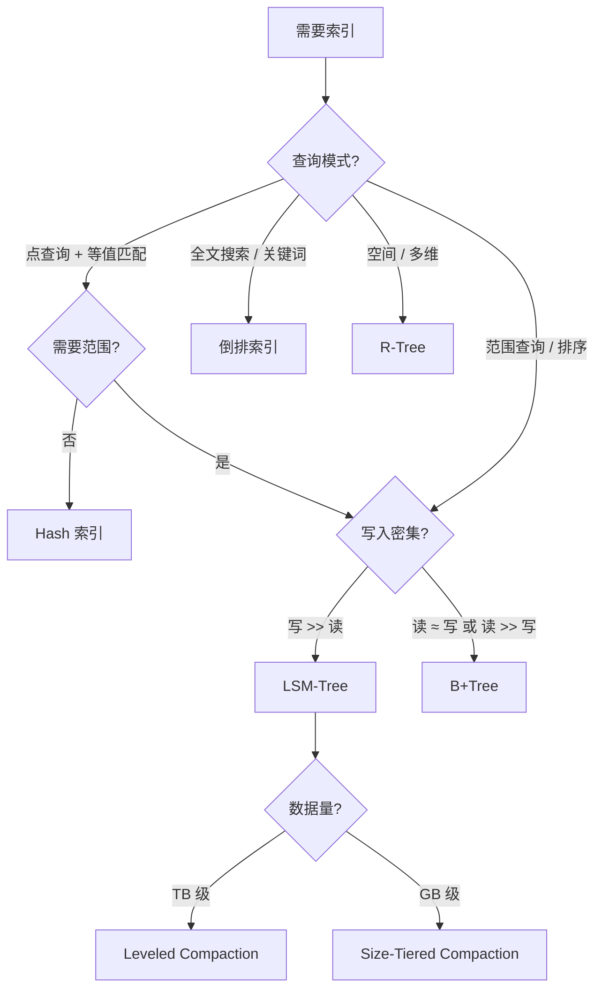
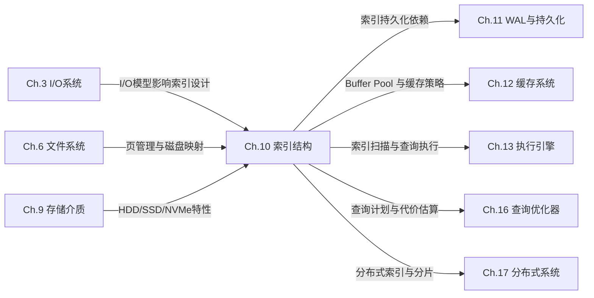

## 本章小结

索引结构是数据库与存储系统性能的基石。本章从"索引为什么存在"出发，系统性地覆盖了五种核心索引结构——B+Tree、LSM-Tree、Hash索引、倒排索引、R-Tree——的原理、实现与工程优化。以下是对全章知识体系的系统梳理，涵盖核心回顾、工程方法论、生产实践、常见误区、公式速查与进阶路径。

---

### 一、五种索引结构核心回顾

索引结构的本质是在"空间换时间"的大框架下，针对不同的查询模式（点查、范围查、全文搜、空间查）和工作负载特征（读密集、写密集、混合）做出不同的设计权衡。

| 索引结构 | 核心数据结构 | 读复杂度 | 写复杂度 | 适用场景 | 典型应用 |
|----------|-------------|---------|---------|---------|---------|
| B+Tree | 平衡多路搜索树 + 叶子链表 | O(log_m N) | O(log_m N) | 范围查询、点查询均衡 | MySQL InnoDB、PostgreSQL、Oracle |
| LSM-Tree | MemTable + SSTable + Compaction | O(log_m N)（需 Bloom Filter 辅助） | O(1) 顺序写 | 高吞吐写入、时序数据 | RocksDB、LevelDB、Cassandra、TiKV |
| Hash 索引 | 哈希表 + 动态扩展 | O(1) 平均 | O(1) | 等值查询、无需范围扫描 | MySQL MEMORY 引擎、Redis、Memcached |
| 倒排索引 | 字典 + 倒排列表 + Roaring Bitmap | O(词项数 × 文档数) | O(文档词项数) | 全文检索、关键词搜索 | Elasticsearch、Lucene、Solr |
| R-Tree | MBR（最小外接矩形）嵌套 | O(log N) ~ O(N) | O(log N) | 空间查询、多维数据 | PostGIS、MongoDB 空间索引、H3 |

**三大放大因子**是贯穿所有索引结构的统一评估框架：

| 放大因子 | 定义 | B+Tree | LSM-Tree | Hash | 倒排索引 |
|----------|------|--------|----------|------|---------|
| 读放大 | 一次查询实际读取的数据页数 | 3-4 页 | 1-6 层 | 1 次 | 词项数 × 文档块数 |
| 写放大 | 一次写入实际写入的数据量 | 1-2x | 10-40x | 1x | 1x（批量构建） |
| 空间放大 | 磁盘占用 / 逻辑数据量 | 1x | 1-2x | 1x | 0.5-1x（压缩后） |

#### 选择决策树



**决策树使用要点**：上述决策树提供的是初始方向，实际选型还需要考虑数据量级、延迟要求、一致性需求、运维复杂度等约束条件。例如，即使读写比为 1:1，如果延迟要求极严格（P99 < 1ms），B+Tree 仍然是更稳妥的选择；如果可以容忍 P99 < 10ms 且写入量巨大，LSM-Tree 的吞吐优势更明显。

---

### 二、B+Tree 深度总结

B+Tree 是关系型数据库的默认索引选择，其核心优势在于**将随机 I/O 转化为有限次磁盘寻址**。在 HDD 时代，一次磁盘寻址约 10ms；即使在 SSD 时代，随机读仍有 0.1ms 的延迟——B+Tree 的 3 层结构将任意查询压缩到 3 次 I/O，这是其持久生命力的根本原因。

**关键工程要点：**

- **阶数选择**：m 阶 B+Tree 的高度 h = ⌈log_m(N)⌉。对于 1 亿条记录、m=412 的 InnoDB（16KB 页），仅需 3 层即可覆盖全部数据——根节点（1 页）→ 内部节点（412 页）→ 叶子节点（412² ≈ 17 万页），意味着任何查询最多 3 次磁盘 I/O
- **节点分裂策略**：标准分裂在中间位置一分为二（利用率 50%）；Lucky Split 利用插入模式（自增主键总是右追加，新页永远为空，无需分裂）避免无效分裂；概率分裂在高并发场景下减少锁竞争
- **并发控制**：Latch Coupling（向下搜索时释放父节点 latch）与 Optimistic Coupling（先不加 latch，验证后再加）的权衡——高并发读场景下乐观耦合可显著降低锁开销；Bw-Tree 更进一步实现了 latch-free 设计
- **工程优化**：前缀压缩（相同前缀只存一次，索引体积缩小 30-50%）、后缀截断（内部节点只存分隔键的最小前缀）、批量加载（O(N) 自底向上复制 vs O(N log N) 逐条插入）、Copy-on-Write B-Tree（MVCC 场景，PostgreSQL/LMDB 采用）
- **复合索引列顺序**：遵循"等值条件列在前、范围条件列在后"原则；利用最左前缀匹配规则，一条 `(user_id, status, created_at)` 复合索引可覆盖 `WHERE user_id=? AND status=? AND created_at>?`、`WHERE user_id=? AND status=?`、`WHERE user_id=?` 三种查询模式
- **索引下推（ICP）**：MySQL 5.6+ 引入 Index Condition Pushdown，将 WHERE 条件中索引能判断的部分下推到存储引擎层过滤，减少回表次数——例如 `(user_id, status)` 索引下，`WHERE user_id=? AND status=? AND name LIKE '%keyword%'` 可先用索引过滤 user_id 和 status，再对结果集做 name 匹配

---

### 三、LSM-Tree 深度总结

LSM-Tree 的核心思想是**将随机写转化为顺序写**，以写入性能换取读取性能，是高吞吐写入场景的首选。这一设计在 HDD 时代节省了 100 倍的写入延迟（顺序写 vs 随机写），在 SSD 时代仍然有 3-5 倍的优势（SSD 的随机写虽然快于 HDD，但顺序写仍然更高效且对闪存寿命更友好）。

**写入路径**：Write → WAL（崩溃恢复保证）→ MemTable（内存，有序跳表或红黑树）→ 满后冻结为 Immutable MemTable → 刷盘为 SSTable。WAL 是顺序追加写，不涉及随机 I/O；MemTable 的写入是纯内存操作——整条写入路径几乎没有随机 I/O，这是 LSM-Tree 写入性能优越的根本原因。

**读取路径**：MemTable → Immutable MemTable → L0 SSTable → L1+ SSTable，逐层查找。Bloom Filter 将"可能不存在"的误判率降至 1% 以下，避免无效磁盘读——在 10 亿条记录、20 个 SSTable 的场景下，Bloom Filter 可将读取的磁盘 I/O 从 20 次降低到 1-2 次。

**Compaction 策略对比：**

| 策略 | 原理 | 写放大 | 读放大 | 空间放大 | 适用场景 |
|------|------|--------|--------|---------|---------|
| Size-Tiered | 相近大小的 SSTable 合并 | ~1.5x | 高（L0 文件多） | 高（临时 2x 空间） | 写密集、容忍读延迟 |
| Leveled | 每层大小固定，L0→L1→...逐层合并 | ~10x | 低（每层最多 1 个文件命中） | 低（~1.1x） | 读写均衡 |
| FIFO | 只删除最旧的 SSTable | 0x | 高 | 高 | 时序数据、TTL 过期 |

**Compaction 优化**：并发 Compaction（多线程同时合并不同层）、Rate Limiting（限制 Compaction 带宽避免与前台 I/O 争抢——通常限制为磁盘带宽的 20-30%）、动态 Level 选择（优先合并空间膨胀最大的层，减少空间放大）

**MemTable 数据结构选择**：跳表（并发友好，LevelDB/RocksDB 首选，插入/查询/删除均为 O(log N)）、红黑树（内存紧凑，适合单线程场景）、数组（批量写入场景，排序后一次性刷盘）

---

### 四、Hash 索引与布隆过滤器

**Hash 索引**：等值查询 O(1) 复杂度，但不支持范围查询和排序——这是 Hash 索引与 B+Tree 的根本区别。

- **Extendible Hashing**：通过目录（directory）+ 桶（bucket）实现动态扩展，分裂时只需将目录翻倍、重新分配受影响的桶，避免全量 rehash。全局深度（global depth）控制目录大小（2^depth 个槽），本地深度（local depth）控制每个桶的实际深度——当桶满且 local_depth = global_depth 时，目录翻倍
- **Adaptive Hash Index（InnoDB AHI）**：MySQL 自动为高频访问的索引页建立哈希索引，等值查询从 O(log N) 降至 O(1)。由 `innodb_adaptive_hash_index` 控制开关。注意：AHI 在等值查询频繁且数据分布均匀时效果最佳；如果查询模式以范围查询为主，AHI 几乎没有收益
- **适用边界**：Hash 索引只适合纯粹的等值查找场景（如 Redis GET/SET、Memcached）。一旦涉及范围查询（`BETWEEN`、`>`、`<`、`ORDER BY`），Hash 索引完全无法胜任——这是 B+Tree 更通用的根本原因

**布隆过滤器**：用于 LSM-Tree 读路径中快速判断"键一定不存在"，将无效磁盘读降低 10 倍以上。

- 误判率公式：f ≈ (1 - e^(-kn/m))^k，其中 m 为位数组大小、n 为元素数、k 为哈希函数数
- 工程参数：每条记录分配 10 bit、使用 7 个哈希函数时，误判率约 0.8%，内存开销仅 1.25 bytes/record
- 最优哈希函数数：k = (m/n) × ln2 ≈ 0.693 × (m/n)
- 缺陷：不支持删除（需要 Counting Bloom Filter 变种）、元素数超过预期时误判率急剧上升。替代方案：Cuckoo Filter（支持删除、空间效率更高）、Xor Filter（更小的误判率、更快的查询速度）

---

### 五、倒排索引与 R-Tree

**倒排索引**：全文检索的核心数据结构。

- 正排索引：文档 → 词项列表；倒排索引：词项 → 文档 ID 列表（posting list）。这个反转是全文搜索高效的关键——搜索"数据库"不需要遍历所有文档，直接查"数据库"对应的 posting list 即可
- **Roaring Bitmap**：混合存储方案——小集合（< 4096 元素）用 Sorted Array（空间 2N bytes）、大集合用 Bitmap（空间 N/8 bytes），空间效率比纯 Bitmap 提升 3-5 倍，且支持快速 AND/OR/NOT 位运算。4096 阈值的选择依据：当元素数 < 4096 时，Sorted Array 的压缩率（存储实际值）优于 Bitmap（存储位）
- **查询处理**：布尔查询（AND/OR/NOT 组合，用 Roaring Bitmap 的交集/并集运算加速）、短语查询（位置信息 + 词项对齐——先找出同时包含所有词项的文档，再验证词项位置是否连续）、排序查询（BM25 评分公式，考虑词频 TF、逆文档频率 IDF、文档长度归一化）
- **工程优化**：在线构建（适合增量更新，如 Elasticsearch 的 near-real-time indexing）vs 离线批量构建（适合全量重建，如 Lucene 的 bulk indexing）；Posting List 压缩（VarInt 变长编码、PForDelta 编码——将差值编码后的 posting list 分段存储，每段用少量 bit 表示偏移量）

**R-Tree**：空间索引的标准方案。

- 核心思想：用 MBR（最小外接矩形）递归嵌套组织空间对象。叶子节点存储实际空间对象的 MBR + 指针，内部节点存储子节点 MBR 的合并区域
- 查询：从根节点逐层检查 MBR 是否与查询区域重叠，剪枝不相交的子树——这是空间索引高效的关键，将全量空间扫描转化为对数级的区域匹配
- 变体：R* Tree（优化分裂策略——选择分裂后重叠面积最小的分裂方案，减少查询时的无效遍历）、R+ Tree（通过裁剪避免 MBR 重叠，代价是同一个对象可能出现在多个节点）、Hilbert R-Tree（利用 Hilbert 空间填充曲线将多维数据映射为一维，提升局部性）

---

### 六、索引选型工程方法论

本章给出了一个系统化的索引选型流程，从工作负载分析到持续调优，形成完整的闭环：

**第一步：工作负载分析**

统计读写比例、查询模式（点查/范围/全文/空间）、数据量（GB/TB/PB）、延迟要求（P50/P99/P999）、一致性需求。这一步决定了索引选型的大方向——读密集选 B+Tree，写密集选 LSM-Tree，等值查询选 Hash，全文检索选倒排索引，空间查询选 R-Tree。

**第二步：索引结构匹配**

根据分析结果，按选择决策树匹配最优索引。实际场景中往往需要多种索引配合——例如电商订单表用 B+Tree 做范围查询，商品描述用倒排索引做全文搜索，门店位置用 R-Tree 做空间查询。

**第三步：复合索引设计**

遵循"等值在前、范围在后"原则；利用选择性（Selectivity = 满足条件行数 / 总行数）确定列顺序——选择性高的列放前面可以更快缩小扫描范围。例如，`(user_id, status, created_at)` 中，user_id 选择性最高（1/100万），status 次之（1/5），created_at 最低（范围查询，约 1/30）。

**第四步：验证与调优**

用 EXPLAIN 分析查询计划（关注 type 列：ref/range/index_merge 是理想值，ALL 是全表扫描需要优化）、用基准测试对比不同索引方案的实际性能。关键：不要只看理论复杂度，要跑真实的生产数据量级测试。

**关键指标监控：**

| 指标 | 含义 | 告警阈值（参考值） | 处理方式 |
|------|------|-------------------|---------|
| Buffer Pool Hit Rate | 页面缓存命中率 | < 95% | 扩容 Buffer Pool 或优化查询 |
| Compaction Pending | LSM-Tree 待合并文件数 | 持续增长 | 增加 Compaction 线程数或降低写入速率 |
| Bloom Filter FPR | 布隆过滤器误判率 | > 5% | 增加位数组大小（每记录 10bit → 15bit） |
| Index Size / Table Size | 索引与表的大小比 | > 1.0 | 审查冗余索引，清理未使用索引 |
| Dead Tuples / Orphan Blocks | 死元组或孤立块 | > 10% 空间浪费 | 定期 VACUUM / COMPACT 清理 |
| Index Fragmentation | 索引碎片率 | > 30% | REBUILD INDEX 或 OPTIMIZE TABLE |
| Lock Wait Time | 索引操作锁等待时间 | P99 > 100ms | 优化并发控制，减小事务粒度 |

---

### 七、生产环境调试速查

在生产环境中，索引问题是最常见的性能瓶颈之一。以下是一份快速诊断指南，覆盖最常见的生产场景：

**场景一：查询突然变慢**

```sql
-- 1. 检查执行计划是否变化（索引是否被正确使用）
EXPLAIN SELECT * FROM orders WHERE user_id = 123 AND status = 1;

-- 2. 检查索引是否碎片化
SELECT index_name, stat_value * @@innodb_page_size / 1024 / 1024 AS size_mb
FROM mysql.innodb_index_stats
WHERE database_name = 'your_db' AND table_name = 'orders' AND stat_name = 'size';

-- 3. 检查表数据量是否超出索引设计容量
SELECT COUNT(*) FROM orders;

-- 4. 强制使用索引验证（排除优化器误判）
SELECT * FROM orders FORCE INDEX(idx_user_status) WHERE user_id = 123 AND status = 1;
```

**场景二：写入性能下降**

```sql
-- 检查 InnoDB 指标
SHOW ENGINE INNODB STATUS\G

-- 关注以下字段：
-- LOGS: log sequence number vs log flushed — 差距大说明 WAL 写入瓶颈
-- BUFFER POOL: dirty pages 比例 — 超过 75% 说明刷脏跟不上写入
-- ROW OPERATIONS: inserts/updates 每秒数量 — 与基线对比

-- 如果是 LSM-Tree (RocksDB)
-- 检查 compaction 状态
rocksdb --stats --db=/path/to/db | grep compaction
```

**场景三：磁盘空间异常增长**

```sql
-- 检查各索引的大小
SELECT table_name, index_length, data_length,
       ROUND(index_length / data_length, 2) AS index_data_ratio
FROM information_schema.tables
WHERE table_schema = 'your_db'
ORDER BY index_length DESC;

-- 如果 index_data_ratio > 1.0，说明索引比数据还大——可能有冗余索引
-- 检查重复/冗余索引
SELECT * FROM sys.schema_redundant_indexes WHERE table_schema = 'your_db';
```

**场景四：LSM-Tree Compaction 风暴**

```bash
# RocksDB 监控
rocksdb_dump --db=/path/to/db --dump_location=/tmp/rocksdb_stats.txt

# 关注指标：
# compaction_pending — 待合并文件数
# compaction_bytes — 合并写入量
# num-running-compactions — 当前运行的 Compaction 线程数

# 应急措施：降低写入速率或暂停非关键写入
```

---

### 八、常见误区与纠正

| 误区 | 真相 | 正确做法 |
|------|------|---------|
| 给每个列都建索引 | 过多索引导致写放大（每多一个索引，写入额外增加一次索引更新）、空间浪费、维护成本高。MySQL InnoDB 中，每多一个二级索引，INSERT 操作额外增加一次 B+Tree 插入 | 基于查询模式分析，只建必要索引；定期清理未使用索引（`sys.schema_unused_indexes`） |
| LSM-Tree 一定比 B+Tree 快 | LSM-Tree 写入快但读取可能需多次 I/O（未命中 Bloom Filter 时逐层查找）；B+Tree 读取稳定但写入涉及随机 I/O。在读写比 > 3:1 的 OLTP 场景中，B+Tree 通常更优 | 根据读写比例选择：读密集选 B+Tree，写密集选 LSM-Tree |
| 主键无所谓 | 自增主键 vs UUID 对 B+Tree 性能影响巨大——UUID 导致随机插入和页分裂，写入性能可能差 3-5 倍，碎片率高 | 自增整数做主键；UUID 场景用有序 UUID（ULID/UUIDv7） |
| 覆盖索引总是更好 | 覆盖索引增大索引体积（可能 2-5 倍）、增加写放大，且只对特定查询有效。如果查询还需要返回未覆盖的列，覆盖索引的额外开销就浪费了 | 仅在高频查询且对延迟敏感时使用覆盖索引 |
| Bloom Filter 能完全消除无效读 | Bloom Filter 只能判断"可能不存在"，无法判断"一定存在"——误判率为 1% 时，仍有 1% 的不存在键被误判为存在 | 理解误判率的含义，必要时配合 Cuckoo Filter 或调整误判率参数 |
| 索引建好就不用管了 | 数据分布会变化（时间推移导致某些索引的选择性下降）、查询模式会演变（新功能引入新的查询模式）、索引碎片会积累 | 定期审查索引使用率（`sys.schema_unused_indexes`）、清理死元组（`VACUUM`）、重建碎片化索引 |
| EXPLAIN 看到走了索引就万事大吉 | EXPLAIN 未考虑运行时因素：Buffer Pool 命中率、锁等待、网络延迟、并发竞争。一个"走了索引"的查询在高峰期仍可能慢——因为索引页不在 Buffer Pool 中 | 结合 `SHOW STATUS` 查看实际 I/O 次数；用 `pt-query-digest` 分析真实慢查询 |

---

### 九、全章公式与模型速查

| 概念 | 公式 | 说明 |
|------|------|------|
| B+Tree 高度 | h = ⌈log_m(N)⌉ | m 为阶数，N 为记录数 |
| InnoDB 3层容量 | m=412, 16KB页 → 约 1亿行 | 根节点 + 412 内部节点 + 412² 叶子节点 |
| B+Tree 叶子节点数 | N_leaf = ⌈N / (记录数/叶子节点)⌉ | 每个叶子节点存储 ⌊页大小 / (键大小 + 指针大小)⌋ 条记录 |
| LSM 写放大 | Leveled ≈ 10x, Size-Tiered ≈ 1.5x | Compaction 导致数据被重复写入多层 |
| Bloom Filter 误判率 | f ≈ (1 - e^(-kn/m))^k | m=位数组大小, n=元素数, k=哈希函数数 |
| Bloom Filter 最优 k | k = (m/n) × ln2 ≈ 0.693 × (m/n) | 最小化误判率的哈希函数数量 |
| Bloom Filter 内存估算 | memory = n × k / ln2 ≈ 1.44n bits | k 取最优值时的内存开销 |
| Extendible Hashing 目录大小 | 2^depth | depth 为全局深度，桶分裂时 depth+1 |
| BM25 评分 | Σ IDF(qi) × [TF(qi,D) × (k1+1)] / [TF(qi,D) + k1 × (1 - b + b × |D|/avgdl)] | k1=1.2, b=0.75 为常用参数 |
| IDF 计算 | IDF(qi) = log[(N - n(qi) + 0.5) / (n(qi) + 0.5)] | N=总文档数, n(qi)=包含词项qi的文档数 |
| Roaring Bitmap 空间 | 大集合: N/8 bytes (Bitmap); 小集合: 2N bytes (Sorted Array) | 阈值 4096 元素时切换存储方式 |
| 选择性估算 | Selectivity = 满足条件行数 / 总行数 | 选择性越高（越接近 1），索引越有效 |

---

### 十、设计原则总结

全章贯穿四条核心设计原则：

**1. 没有万能索引**

不同索引结构解决不同问题——B+Tree 不适合高吞吐写入（随机 I/O 导致写入瓶颈），LSM-Tree 不适合低延迟读取（多层查找 + Compaction 争抢 I/O），Hash 不支持范围查询（无法利用数据有序性），倒排索引不支持聚合查询（只擅长关键词匹配），R-Tree 在高维空间退化（维度灾难导致 MBR 重叠率上升）。理解 trade-off 是选型的前提。

**2. 理解硬件才能优化索引**

- B+Tree 的层数设计基于磁盘 I/O 成本：一次寻址 ≈ 10ms HDD / 0.1ms SSD / 0.01ms NVMe，层数每增加 1 层，查询延迟增加一个量级
- LSM-Tree 的顺序写优势基于磁盘的顺序 I/O 比随机 I/O 快 100 倍（HDD）/ 3-5 倍（SSD）
- NVMe 的高并发队列（32-128 队列深度）改变了并发控制策略——传统的 latch coupling 在 NVMe 上不再是瓶颈，可以承受更粗粒度的锁
- 持久内存（PMem/3D XPoint）接近 DRAM 的延迟（~100ns vs ~10ns），正在催生新的索引设计（如 ALEX、Dash），模糊了"内存索引"和"磁盘索引"的边界

**3. 数据驱动选型**

不要凭直觉选索引，用实际工作负载分析结果做决策——统计查询模式（`slow_query_log` + `pt-query-digest`）、测量选择性（`EXPLAIN` 的 rows 列 vs 实际数据量）、基准测试对比（`sysbench`、`db_benchmark`、`YCSB`）。一个常见的反直觉案例：某个看似"读密集"的系统，实际写入量远超预期——因为每个写操作都会触发多个触发器和级联更新。

**4. 索引是活的**

数据分布会变化（新用户涌入导致某些索引的选择性下降）、查询模式会演变（新功能引入新的查询模式，旧索引可能成为冗余）、索引需要持续维护——定期审查索引使用率（`sys.schema_unused_indexes`）、清理死元组（PostgreSQL `VACUUM` / MySQL `OPTIMIZE TABLE`）、调整 Compaction 策略（根据数据增长速率动态调整）。索引设计不是一次性工作，而是持续迭代的过程。

---

### 十一、跨章节知识关联

索引结构不是孤立的知识点，它与本书多个章节存在紧密关联：



- **向前回顾**：Ch.3 的 I/O 模型（同步/异步/直接 I/O）决定了索引的 I/O 策略——B+Tree 使用同步 I/O 保证一致性，LSM-Tree 使用异步 I/O 提升吞吐；Ch.6 的文件系统页管理是 B+Tree 页面持久化的基础——InnoDB 的 16KB 页大小并非随意选择，而是与文件系统块大小对齐的结果；Ch.9 的存储介质特性直接影响索引结构的选择和优化方向——HDD 上 B+Tree 的层数至关重要，SSD 上 LSM-Tree 的写放大问题更加突出
- **向后衔接**：Ch.11 的 WAL 机制是 LSM-Tree 崩溃恢复的保障——WAL 的刷盘策略（每次写入同步刷盘 vs 批量刷盘）直接影响写入延迟和数据安全性的权衡；Ch.12 的缓存系统与 B+Tree 的 Buffer Pool 紧密配合——Buffer Pool 的 LRU 淘汰策略决定了热数据的缓存命中率；Ch.13 的执行引擎负责索引扫描的具体实现——Index Scan、Index Only Scan、Index Skip Scan 等不同的扫描策略；Ch.16 的查询优化器基于索引的代价估算选择最优查询计划——代价模型需要考虑索引的选择性、回表成本、排序成本；Ch.17 的分布式系统需要在节点间同步和分片索引——一致性哈希、Range 分片、Hash 分片各有优劣

---

### 十二、工具生态系统

每种索引结构都有对应的成熟工具和框架，掌握工具链是工程落地的关键：

| 索引类型 | 核心实现 | 配置调优工具 | 监控工具 | 学习资源 |
|---------|---------|------------|---------|---------|
| B+Tree | InnoDB (MySQL)、PostgreSQL B-Tree | `innodb_buffer_pool_size`、`innodb_page_size` | `SHOW ENGINE INNODB STATUS`、`sys.*` 视图 | CMU 15-445 Lab 2 |
| LSM-Tree | RocksDB、LevelDB | `write_buffer_size`、`max_bytes_for_level_base`、`level0_file_num_compaction_trigger` | `rocksdb --stats`、`rocksdb_stats_dump` | RocksDB Wiki、LevelDB 源码 |
| Hash 索引 | InnoDB AHI、Redis dict | `innodb_adaptive_hash_index`、Redis `hash-max-ziplist-entries` | `SHOW STATUS LIKE 'Innodb_adaptive_hash%'` | Redis 源码 dict.c |
| 倒排索引 | Lucene、Elasticsearch | `index.refresh_interval`、`index.translog.durability` | `_cat/indices`、`_nodes/stats` | Lucene in Action、ES 官方文档 |
| R-Tree | PostGIS、MongoDB | GiST/SP-GiST 索引参数 | `ST_EstablishRelationship`、`explain analyze` | PostGIS 官方文档 |

---

### 十三、进阶学习路径

| 阶段 | 学习内容 | 推荐资源 | 预计耗时 | 里程碑 |
|------|---------|---------|---------|--------|
| 入门巩固 | 手写 B+Tree 实现（插入、删除、分裂） | CMU 15-445 Database Systems 课程 Lab 2 | 1-2 周 | 能独立实现插入/删除/分裂，通过所有测试用例 |
| 工程实践 | 用 LevelDB/RocksDB 搭建简化 LSM-Tree，对比不同 Compaction 策略的性能差异 | RocksDB Wiki、LevelDB 源码 | 2-3 周 | 能在 RocksDB 上配置并对比 Size-Tiered vs Leveled 的写入/读取性能 |
| 性能调优 | B+Tree vs LSM-Tree 基准测试：顺序/随机读写、不同读写比、不同数据量 | db_benchmark（RocksDB 自带）、YCSB、sysbench | 1-2 周 | 完成完整的性能对比报告，理解不同场景下的最优选择 |
| 源码阅读 | PostgreSQL nbtree（B-Tree 实现）、LevelDB SkipList（MemTable）、SQLite B-tree（磁盘 B-Tree） | 各项目 GitHub 仓库 | 3-4 周 | 能解释源码中关键算法的实现逻辑，画出核心数据流图 |
| 论文精读 | LSM-Tree 原始论文（O'Neil 1996）、Bw-Tree（Latch-free B-Tree）、Dostoevsky（LSM-Tree 最优参数）、Monkey（Bloom Filter 最优配置） | ACM DL / arXiv | 2-3 周 | 能复述论文核心贡献，理解设计动机和技术细节 |
| 前沿探索 | 学习型索引（Learned Index，用 ML 模型替代传统索引）、SplinterDB（KV 存储）、WiredTiger（MongoDB 引擎） | 相关论文与开源项目 | 持续 | 能评估新技术在实际场景中的适用性 |

---

### 十四、思考题

1. **B+Tree 的阶数 m 是如何确定的？为什么 InnoDB 选择 16KB 页大小？如果改用 64KB 页，对高度和写入性能分别有什么影响？**（提示：考虑磁盘 I/O 粒度、Buffer Pool 管理粒度、页分裂频率）

2. **在 LSM-Tree 中，如果关闭 Bloom Filter 会对读性能产生什么影响？请定量估算在 1 亿条记录、10 个 SSTable 的场景下，关闭前后各自的磁盘读次数。**（提示：每个 SSTable 需要一次二分查找 + 一次磁盘读）

3. **为什么 InnoDB 的自适应哈希索引（AHI）只对等值查询有效？它在什么情况下可能反而降低性能？**（提示：考虑哈希冲突、索引维护开销、高并发下的锁竞争）

4. **Roaring Bitmap 为什么在 4096 个元素时从 Sorted Array 切换到 Bitmap？请从空间和时间两个维度分析这个阈值的选择依据。**（提示：Sorted Array 空间 = 2N bytes，Bitmap 空间 = N/8 bytes，交叉点在 N=256 时空间相等，但考虑查询速度，Bitmap 在大集合上更快）

5. **假设你正在设计一个日志分析系统：每天 10 亿条日志，写入量远大于查询量，但偶尔需要按关键词和时间范围检索。你会如何组合使用本章介绍的索引结构？请给出具体的技术方案。**（提示：考虑写入路径用 LSM-Tree，查询路径用倒排索引 + 时间分区）

6. **为什么说"给每个列都建索引"是一个常见错误？请从写放大、空间占用、查询优化器行为三个角度分析其危害。**（提示：查询优化器可能选择错误的索引，导致更差的执行计划）

7. **Copy-on-Write B-Tree 和 LSM-Tree 都通过"追加写"来避免原地更新，它们的核心区别是什么？各自的适用场景有哪些？**（提示：COW B-Tree 的更新粒度是整个页，LSM-Tree 的更新粒度是单条记录；COW B-Tree 的读性能稳定，LSM-Tree 的读性能随数据量增长而下降）

8. **在 SSD 时代，B+Tree 的 3 层设计仍然合理吗？如果存储介质变成持久内存（延迟 ~100ns），索引结构应该如何重新设计？**（提示：考虑 NVMe 的高并发队列、持久内存的字节寻址特性、DRAM 与持久内存的混合架构）

---

### 本章核心速记

> **B+Tree**：读写均衡的王者，适合关系型数据库的通用场景。3 层结构覆盖 1 亿行记录，任何查询最多 3 次磁盘 I/O。

> **LSM-Tree**：写入之王，用 Compaction 换取顺序写优势。Leveled Compaction 写放大 ~10x 但读性能好，Size-Tiered 写放大 ~1.5x 但读性能差。

> **Hash 索引**：等值查询极速，但无法范围扫描。Extendible Hashing 解决动态扩展问题，AHI 是 MySQL 的自动优化利器。

> **倒排索引**：全文检索的基石，Roaring Bitmap 让它高效。BM25 评分是排序查询的标准算法。

> **R-Tree**：空间数据的守护者，MBR 嵌套实现多维检索。R* Tree 通过优化分裂策略减少查询时的无效遍历。

> **选型四原则**：没有万能索引 → 理解硬件约束 → 数据驱动决策 → 持续维护迭代。

> **生产环境速记**：查慢查询用 `pt-query-digest`，看执行计划用 `EXPLAIN`，查索引碎片用 `information_schema`，查冗余索引用 `sys.schema_unused_indexes`，LSM-Tree 用 `rocksdb --stats` 监控 Compaction。
