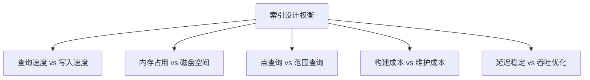
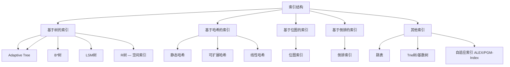
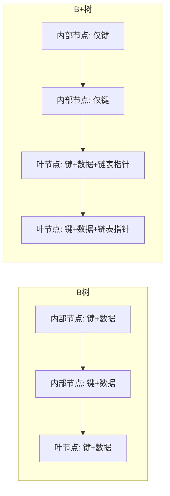
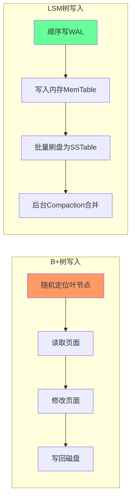
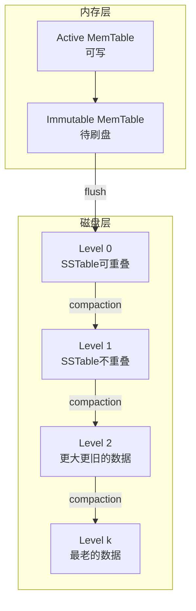
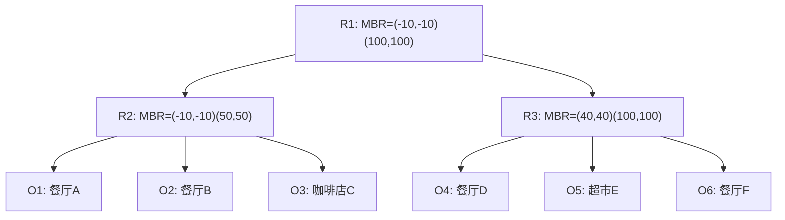

# 第十章 索引结构

## 章节概览

索引是数据库系统中最核心的数据结构之一，其设计直接决定了查询性能的上限。本章将系统介绍数据库系统中最重要的几种索引结构——B树/B+树、LSM树、哈希索引、倒排索引、R树，以及位图索引、跳表索引、自适应索引等新兴结构，从理论基础到工程实现进行深入剖析。

索引结构的设计需要在多个维度间取得平衡：



B+树是关系型数据库最经典的索引结构，凭借优秀的范围查询能力和稳定的查询性能，统治了OLTP数据库数十年。LSM树则通过将随机写转化为顺序写，在写密集场景下表现出色，是RocksDB、LevelDB等KV存储的核心。哈希索引提供O(1)的点查询，倒排索引是全文搜索的基础，R树专为空间数据设计。位图索引适用于低基数列的OLAP分析，跳表是LSM树MemTable的首选实现，自适应索引则代表了索引设计的未来方向。

通过本章学习，读者将能够：

- 深入理解各索引结构的算法原理与数学基础
- 掌握索引结构的工程优化技巧与并发控制
- 针对不同工作负载选择合适的索引方案
- 理解NVMe/SSD时代索引设计的演进趋势
- 在实际项目中做出有数据支撑的索引决策

---

**关键词：** B+树、LSM树、哈希索引、倒排索引、R树、位图索引、跳表、自适应索引、读写权衡

**前置知识：** 基本数据结构（树、哈希表、链表）、第九章存储介质

**参考文献：**

- Bayer, R. & McCreight, E. "Organization and Maintenance of Large Ordered Indexes." Acta Informatica, 1972.
- O'Neil, P. et al. "The Log-Structured Merge-Tree (LSM-Tree)." Acta Informatica, 1996.
- Guttman, A. "R-Trees: A Dynamic Index Structure for Spatial Searching." SIGMOD, 1984.
- Cormen, T. et al.《算法导论》. MIT Press.
- Graefe, G. "Modern B-Tree Techniques." Foundations and Trends in Databases, 2011.

---

## 10.1 索引概述

### 10.1.1 索引的本质

索引是一种**空间换时间**的数据结构——通过额外的存储空间来加速数据检索。在数据库系统中，索引的作用类似于书籍的目录：没有目录时，要找某个主题需要逐页翻阅；有了目录，可以直接定位到相关页码。

但从工程角度看，索引远不止"目录"这么简单。索引必须解决三个核心问题：

1. **定位问题**：如何在海量数据中快速找到目标记录？——需要高效的数据结构
2. **持久化问题**：如何将内存中的索引结构可靠地存储到磁盘？——需要页面管理和WAL
3. **并发问题**：多个事务同时读写索引时如何保证正确性？——需要并发控制机制

索引的核心性能指标包括：

| 指标 | 定义 | 影响因素 |
|------|------|----------|
| 查询延迟 | 找到目标数据需要的I/O次数和CPU计算量 | 树高、节点大小、缓存命中率 |
| 空间开销 | 索引结构本身占用的额外存储空间 | 键大小、指针大小、填充因子 |
| 维护成本 | 数据变更时更新索引的开销 | 分裂/合并频率、Compaction频率 |
| 查询类型支持 | 点查询、范围查询、前缀查询、空间查询等 | 数据结构特性 |
| 并发能力 | 支持多少并发读写操作 | 锁粒度、MVCC策略 |

### 10.1.2 索引结构分类



| 类别 | 代表结构 | 点查询 | 范围查询 | 写入特性 | 典型应用 |
|------|----------|--------|----------|----------|----------|
| 树形 | B+树 | O(log_m N) | O(log_m N + K) | O(log_m N) 随机 | OLTP数据库 |
| 树形 | LSM树 | O(k·log N) | 有额外开销 | O(1) 顺序 | 写密集KV存储 |
| 哈希 | 可扩展哈希 | O(1) 平均 | 不支持 | O(1) 平均 | 内存表、缓存 |
| 倒排 | 倒排索引 | O(1) | 取决于实现 | 批量构建为主 | 全文搜索 |
| 空间 | R树 | O(log N) | 有效 | O(log N) | GIS、地理查询 |
| 位图 | 位图索引 | O(1) | 位运算 | 批量构建 | OLAP分析 |
| 跳表 | 跳表索引 | O(log N) 平均 | 链表扫描 | O(log N) 无锁 | MemTable实现 |

### 10.1.3 索引设计的核心权衡

理解索引设计的核心权衡，是选择正确索引方案的前提。这些权衡可以归纳为三大矛盾：

**读优化 vs 写优化：** B+树是典型的读优化结构——数据按键排序存储在叶节点，范围查询只需顺序扫描链表。但每次写入都需要找到正确的叶节点并可能触发分裂（随机I/O）。LSM树则相反——所有写入先缓存在内存，批量刷盘后通过Compaction合并，写入吞吐极高。但读取时需要检查多个层级（读放大），且Compaction本身会产生大量写I/O（写放大）。

**空间效率 vs 时间效率：** 稀疏索引（每个数据块一个索引条目）空间小但查找需要块内二分查找；稠密索引（每条记录一个索引条目）查找快但空间开销大。Bloom Filter用少量额外空间大幅减少无效磁盘读取，但引入了假阳性。

**延迟稳定 vs 吞吐优化：** B+树的查询延迟相对稳定（树高固定），而LSM树在Compaction期间可能出现延迟抖动。对于延迟敏感的OLTP系统，稳定的P99延迟比平均吞吐更重要。

---

## 10.2 B树与B+树

### 10.2.1 B树的定义与性质

B树（B-Tree）由Rudolf Bayer和Edward McCreight于1972年在波音公司研究实验室提出。它是一种自平衡的多路搜索树，专为磁盘存储优化设计。

**为什么需要多路搜索树？** 二叉搜索树在磁盘上效率低下——每个节点只存一个关键字，树高为O(log₂N)。对于1亿条记录，二叉搜索树需要约27层，每层一次磁盘I/O就是27次。而如果每个节点能容纳256个关键字，只需3层即可覆盖1亿条记录。

一棵m阶B树满足以下性质：

1. 每个节点最多有m个子节点
2. 每个非根内部节点至少有⌈m/2⌉个子节点
3. 根节点至少有2个子节点（除非它是叶节点）
4. 所有叶节点在同一层（完美平衡）
5. 有k个子节点的内部节点包含k-1个关键字
6. 关键字在节点内有序排列，子树中的所有关键字严格位于父节点分隔键的两侧

```python
# B树节点定义
class BTreeNode:
    def __init__(self, is_leaf=False):
        self.keys = []       # 关键字列表
        self.children = []   # 子节点列表
        self.is_leaf = is_leaf
        self.n = 0           # 当前关键字数量

    def search(self, key):
        """在当前节点中查找关键字的位置"""
        i = 0
        while i < self.n and key > self.keys[i]:
            i += 1
        if i < self.n and key == self.keys[i]:
            return (self, i)  # 找到
        if self.is_leaf:
            return None        # 未找到
        return self.children[i].search(key)  # 递归到子节点
```

**B树的高度估算：**

```text
假设每个节点的大小为一个磁盘页（4KB），
关键字大小为8字节，指针大小为8字节，
则每个节点可容纳约 4096/16 ≈ 256 个关键字/指针对。

对于一棵256叉B树（最坏情况）：
存储N个记录需要的层数 = log_256(N)

存储1亿条记录：log_256(10^8) ≈ 2.6，即仅需3层！
每层一次磁盘I/O → 3次I/O即可找到任意记录

对比：二叉搜索树需要 log₂(10^8) ≈ 27 层，即27次I/O
```

这就是B树的核心优势：**通过增加每个节点的分支因子，大幅降低树高，从而减少磁盘I/O次数。**

### 10.2.2 B+树的改进

B+树是B树最重要的变体，也是现代数据库最广泛使用的索引结构。B+树相比B树有三个关键改进：



**改进一：数据只存储在叶节点。** 内部节点只存储索引键和子节点指针，不存储数据记录。这意味着内部节点可以容纳更多关键字，进一步降低树高。对于同样的16KB页面，B+树的内部节点可以比B树多存储约40%的索引键。

**改进二：叶节点形成有序链表。** 所有叶节点通过指针串联成一个有序链表，支持高效的范围查询和顺序扫描。在B树中，范围查询需要中序遍历整棵树；在B+树中，只需找到起始叶节点，然后沿链表顺序扫描即可。

**改进三：更高的节点利用率。** 由于内部节点不存储数据，节点分裂频率降低。同时，叶节点的数据量更大，批量操作的效率更高。

```text
B+树结构示例（4阶）：

              [30 | 70]                        ← 内部节点（仅索引键）
             /    |    \
        [10|20] [30|50] [70|80|90]             ← 内部节点
        /  |  \  / | \   /  |  \  \
      [10][20][30][50][70][80][90]              ← 叶节点（存储数据）
       ←→  ←→  ←→  ←→  ←→  ←→  ←→              ← 叶节点间的链表

范围查询 SELECT * WHERE key BETWEEN 20 AND 80:
1. 从根节点找到key=20的叶节点 → [10][20]
2. 沿链表向右扫描: [20] → [30] → [50] → [70] → [80]
3. 遇到key>80时停止
```

### 10.2.3 B+树的操作算法

**查找操作（Search）：**

```python
def btree_search(root, key):
    node = root
    while not node.is_leaf:
        # 在内部节点中二分查找合适的子节点
        i = 0
        while i < node.key_count and key >= node.keys[i]:
            i += 1
        node = node.children[i]

    # 在叶节点中查找
    for i in range(node.key_count):
        if node.keys[i] == key:
            return node.values[i]
    return NOT_FOUND
```

查找的时间复杂度为O(log_m(N))，其中m是B+树的阶，N是记录总数。每次磁盘I/O读取一个页面，因此总I/O次数等于树高。

**插入操作（Insert）：**

```python
def btree_insert(root, key, value):
    # 1. 找到应该插入的叶节点
    leaf = find_leaf(root, key)

    # 2. 在叶节点中插入（保持有序）
    insert_into_leaf(leaf, key, value)

    # 3. 如果叶节点溢出，分裂
    if leaf.key_count > MAX_KEYS:
        new_leaf = split_leaf(leaf)
        push_up_key = new_leaf.keys[0]
        insert_into_parent(leaf, push_up_key, new_leaf)

def split_node(node):
    """标准二分分裂：将节点从中间一分为二"""
    mid = node.key_count // 2
    new_node = create_node()

    # 右半部分移到新节点
    new_node.keys = node.keys[mid+1:]
    new_node.children = node.children[mid+1:]

    # 将中间键提升到父节点
    push_up_key = node.keys[mid]
    node.keys = node.keys[:mid]
    node.children = node.children[:mid+1]

    return new_node, push_up_key
```

**删除操作（Delete）：**

B+树的删除比插入更复杂，需要处理下溢（节点关键字数低于最小值）的情况：

```python
def btree_delete(root, key):
    leaf = find_leaf(root, key)
    remove_from_leaf(leaf, key)

    if leaf.key_count < MIN_KEYS:
        # 尝试从兄弟节点借一个关键字（rebalance）
        if can_borrow_from_sibling(leaf):
            borrow_from_sibling(leaf)
        else:
            # 与兄弟节点合并（merge）
            merge_with_sibling(leaf)
            # 合并可能导致父节点下溢，需要递归修复
            # 最坏情况：根节点只剩一个子节点，树高减1
```

删除操作的关键挑战在于**级联合并**：当一个叶节点与兄弟合并后，父节点可能失去一个子指针而下溢，进而触发父节点的合并，最终可能使树高减1。这种级联操作在最坏情况下需要O(log_m N)次调整。

### 10.2.4 B+树的工程优化

**前缀键压缩（Prefix Compression）：** 在叶节点中，如果多个键共享相同的前缀，只存储差异部分。例如，存储URL索引时，`www.example.com/page1`和`www.example.com/page2`可以只存储不同的后缀部分。

```text
压缩前：
[www.example.com/page1, data1]
[www.example.com/page2, data2]
[www.example.com/page3, data3]

压缩后（前缀 "www.example.com/page" 共享）：
prefix = "www.example.com/page"
[1, data1]
[2, data2]
[3, data3]
```

在实际数据库中，MySQL InnoDB使用**前缀和（Suffix Sum）**方式：每个键存储与前一个键共享的前缀长度和剩余后缀。这在高基数列上可以节省30%-50%的索引空间。

**后缀截断（Suffix Truncation）：** 内部节点中的分隔键不需要存储完整值，只需要存储能区分左右子树的最小前缀。

```text
原始分隔键：  "www.example.com/page50"
截断后：      "www.exam"  （如果这足以区分左右子树）
```

这可以显著减小内部节点的大小，增加每个节点能容纳的分支数，从而降低树高。PostgreSQL的nbtree实现中，后缀截断是默认行为。

**批量加载（Bulk Loading）：** 当需要一次性创建大量索引时，逐条插入的效率很低。批量加载算法先将数据排序，然后自底向上构建B+树。

```python
def bulk_load_btree(sorted_records, page_size):
    """批量加载：O(N)时间复杂度构建B+树"""
    # 第一步：自底向上构建叶节点
    leaves = []
    current_leaf = new_leaf()

    for record in sorted_records:
        if current_leaf.is_full():
            leaves.append(current_leaf)
            current_leaf = new_leaf()
        current_leaf.insert(record)

    if not current_leaf.is_empty():
        leaves.append(current_leaf)

    # 第二步：递归构建上层内部节点
    return build_upper_levels(leaves, page_size)
```

批量加载的时间复杂度为O(N)，远优于逐条插入的O(N log N)。更关键的是，生成的B+树叶节点完全填满（空间利用率接近100%），而逐条插入的B+树叶节点平均填充率约69%（因为分裂时各保留一半）。

**写时复制（Copy-on-Write）：** PostgreSQL和LMDB使用写时复制B+树，修改操作不原地更新，而是创建新节点，旧节点在没有引用时被回收。这天然支持MVCC和崩溃恢复。

```text
写时复制B+树的修改过程：
1. 复制从根到叶的路径上的所有节点
2. 在新叶节点上执行修改
3. 更新新路径上所有父节点的指针
4. 原子地将根指针指向新根

优点：
- 并发读者不会看到中间状态（天然MVCC）
- 崩溃恢复简单（旧根仍然一致）
- 不需要WAL（旧数据完好保留）

缺点：
- 每次修改需要复制整个路径（O(h)额外空间）
- 导致更多的随机写入
- 需要GC回收不再引用的旧节点
```

**自适应哈希索引（Adaptive Hash Index, AHI）：** InnoDB会自动监控B+树的访问模式，对于频繁访问的索引页，将其转换为内存中的哈希索引，从而将O(log N)的查找降为O(1)。

```sql
-- 查看InnoDB自适应哈希索引状态
SHOW ENGINE INNODB STATUS;
-- 查看AHI的使用情况
SELECT * FROM INFORMATION_SCHEMA.INNODB_METRICS
WHERE NAME LIKE '%adaptive_hash%';
```

### 10.2.5 B+树的页面管理

B+树的每个节点对应磁盘上的一个页面（通常4KB-16KB）。缓冲池（Buffer Pool）负责缓存频繁访问的页面，减少磁盘I/O。

```c
// B+树页面的基本布局（以16KB页面为例）
typedef struct BTreePage {
    // 页面头部（约64字节）
    uint32_t page_id;          // 页面编号
    uint32_t parent_page_id;   // 父节点页面编号
    uint16_t num_keys;         // 当前关键字数
    uint16_t page_type;        // LEAF_NODE / INTERNAL_NODE
    uint32_t next_leaf;        // 叶节点链表指针

    // 页面数据区
    union {
        struct {
            KeyType keys[MAX_KEYS];          // 索引键数组
            uint32_t children[MAX_KEYS + 1]; // 子节点页面ID
        } internal;
        struct {
            KeyType keys[MAX_KEYS];
            ValueType values[MAX_KEYS];      // 数据记录或RID
        } leaf;
    } data;
} BTreePage;
```

页面管理的关键设计决策包括：

**页面填充因子（Fill Factor）：** PostgreSQL允许为每个索引设置填充因子（70%-100%）。较低的填充因子为后续插入预留空间，减少页面分裂，但浪费存储空间。对于写密集的表，建议设置80%-90%的填充因子。

**碎片整理（Defragmentation）：** 长期的插入/删除操作会导致页面填充率下降和页面碎片。MySQL的`OPTIMIZE TABLE`和PostgreSQL的`REINDEX`可以重建索引，恢复最优的页面布局。

**缓冲池策略：** InnoDB使用改进的LRU（最近最少使用）算法，将缓冲池分为young区（热数据）和old区（新读入的数据）。新读入的页面先进入old区，只有被再次访问时才提升到young区，防止全表扫描污染缓存池。

### 10.2.6 B+树的并发控制

多线程环境下的B+树操作需要并发控制。不同的控制策略在性能和复杂度上有显著差异。

**锁耦合（Latch Coupling / Crabbing）：**

```python
def btree_search_concurrent(root, key):
    """读操作：自顶向下加读锁，逐层释放"""
    node = root
    node.read_latch()  # 获取读锁

    while not node.is_leaf:
        child = find_child(node, key)
        child.read_latch()  # 获取子节点读锁
        node.read_unlatch()  # 释放父节点读锁
        node = child

    result = search_in_leaf(node, key)
    node.read_unlatch()
    return result

def btree_insert_concurrent(root, key, value):
    """写操作：需要预判是否分裂，决定是否保留祖先锁"""
    # 第一遍：获取写锁，检查是否需要分裂
    nodes_to_latch = []
    node = root
    node.write_latch()
    nodes_to_latch.append(node)

    while not node.is_leaf:
        child = find_child(node, key)
        child.write_latch()
        if child.will_split():
            # 子节点会分裂，保持父节点的锁
            pass
        else:
            # 安全节点，释放所有祖先的锁
            for n in nodes_to_latch[:-1]:
                n.write_unlatch()
            nodes_to_latch = [child]
        node = child

    # 在叶节点中插入
    insert_into_leaf(node, key, value)

    # 释放所有锁
    for n in nodes_to_latch:
        n.write_unlatch()
```

锁耦合的核心思想是**螃蟹策略**（crabbing）：像螃蟹一样，一只手抓住新节点，另一只手松开旧节点。对于写操作，如果发现子节点是"安全的"（不会分裂），就可以释放所有祖先的锁，大幅减少锁持有时间。

**乐观锁耦合（Optimistic Latch Coupling）：** 读操作使用读锁，只有在实际需要分裂/合并时才升级为写锁。这减少了写锁的持有时间，但在高争用场景下可能需要重试。

**B-link树：** PostgreSQL的nbtree实现基于B-link树，每个节点维护一个"high key"（指向右兄弟的指针），使得并发操作时不需要锁定父节点。这大幅提高了并发度，但增加了实现复杂度。

---

## 10.3 LSM树

### 10.3.1 LSM树的动机

B+树的更新操作是原地更新（in-place update），这意味着每次写入可能需要随机I/O来修改磁盘上的页面。在写密集场景下，这种随机写入模式会严重限制吞吐量。



LSM树（Log-Structured Merge-Tree）由Patrick O'Neil等人于1996年提出，核心思想是：**将所有写入先缓存在内存中，当内存缓冲区满时，将数据批量写入磁盘，然后通过后台合并过程（compaction）逐步合并到更大的层级。**

LSM树将随机写转化为顺序写，极大提高了写入吞吐量。代价是读取时可能需要检查多个层级（读放大），以及Compaction本身会产生大量写I/O（写放大）。

### 10.3.2 LSM树的结构



**MemTable：** 通常使用跳表（Skip List）或红黑树实现，支持O(log N)的查找和插入。写入先进入WAL（保证持久性），然后写入MemTable。选择跳表而非红黑树的主要原因是：跳表的并发实现更简单——无需全局锁，通过CAS操作即可实现无锁插入。

**SSTable（Sorted String Table）：** 磁盘上有序的键值对文件。内部数据按键排序存储，通常还附带一个稀疏索引（sparse index）用于加速查找。

```text
SSTable结构：
┌─────────────────────┐
│ Data Block 1         │  ← 键值对，按key排序
│ Data Block 2         │
│ ...                  │
│ Data Block N         │
├─────────────────────┤
│ Index Block          │  ← 稀疏索引：每K个key记录一个
├─────────────────────┤
│ Filter Block (可选)  │  ← Bloom Filter
├─────────────────────┤
│ Footer               │  ← Index Block的偏移量
└─────────────────────┘
```

**数据块内部结构（以RocksDB为例）：** 每个Data Block内部使用前缀压缩（prefix compression）。相邻的key共享前缀，只存储不同的后缀部分。每16个entry设置一个重启点（restart point），重启点存储完整key，用于解压和二分查找。

### 10.3.3 LSM树的操作

**写入流程：**

```python
def lsm_write(key, value):
    # 1. 写WAL（保证持久性）
    wal.append(key, value)

    # 2. 写MemTable
    memtable.insert(key, value)

    # 3. 如果MemTable满了，转为Immutable并触发flush
    if memtable.size() >= MEMTABLE_SIZE_LIMIT:
        immutable_memtables.append(memtable)
        memtable = new_memtable()
        trigger_flush(immutable_memtables[-1])
```

WAL（Write-Ahead Log）是LSM树持久性的关键保障。写入顺序是：先写WAL（顺序I/O），再写MemTable（内存操作）。如果进程崩溃，WAL中的数据可以重放到MemTable中。

**读取流程：**

```python
def lsm_read(key):
    # 1. 先查Active MemTable（最新数据）
    result = memtable.get(key)
    if result is not None:
        return result if result != TOMBSTONE else NOT_FOUND

    # 2. 查Immutable MemTable（从新到旧）
    for imm in reversed(immutable_memtables):
        result = imm.get(key)
        if result is not None:
            return result if result != TOMBSTONE else NOT_FOUND

    # 3. 查Level 0 SSTable（从新到旧，可能重叠）
    for sst in reversed(level_0_sstables):
        if bloom_filter.might_contain(sst, key):
            result = sst.get(key)
            if result is not None:
                return result if result != TOMBSTONE else NOT_FOUND

    # 4. 查Level 1到Level k（每层只需查一个SSTable，因为不重叠）
    for level in range(1, max_level + 1):
        sst = find_sstable(level, key)  # 二分查找确定SSTable
        if sst and bloom_filter.might_contain(sst, key):
            result = sst.get(key)
            if result is not None:
                return result if result != TOMBSTONE else NOT_FOUND

    return NOT_FOUND
```

读取的关键优化：Level 1及以上的SSTable在同一层内key range不重叠，因此每层最多只需查找一个SSTable。Level 0的SSTable可能重叠，需要逐个检查。

**Compaction（合并）：** LSM树的核心操作，负责将多个小的SSTable合并为更大的SSTable，同时清理已删除的数据和过期的版本。

```python
def compact(level_i, level_i_plus_1):
    """将Level i的SSTable合并到Level i+1"""
    # 选择Level i中的SSTable（通常是最大的或最旧的）
    ssts_to_compact = pick_sstables_to_compact(level_i)

    for sst in ssts_to_compact:
        # 找到Level i+1中与之key range重叠的SSTable
        overlapping = find_overlapping(level_i_plus_1, sst.key_range)

        # 归并排序合并（保留最新版本，删除TOMBSTONE）
        merged = merge_sort(sst, overlapping)

        # 写入新的SSTable到Level i+1
        write_sstables(level_i_plus_1, merged)

        # 删除旧的SSTable
        delete_sstables(sst, overlapping)
```

### 10.3.4 LSM树的优化

**Bloom Filter：** 用于快速判断一个key是否**不在**某个SSTable中，避免不必要的磁盘读取。这是LSM树读性能的关键优化。

```python
class BloomFilter:
    def __init__(self, expected_items, fp_rate=0.01):
        self.size = optimal_size(expected_items, fp_rate)
        self.num_hashes = optimal_hash_count(self.size, expected_items)
        self.bits = BitArray(self.size)

    def add(self, item):
        for i in range(self.num_hashes):
            idx = hash(item, i) % self.size
            self.bits[idx] = 1

    def might_contain(self, item):
        for i in range(self.num_hashes):
            idx = hash(item, i) % self.size
            if self.bits[idx] == 0:
                return False  # 绝对不存在
        return True  # 可能存在（有假阳性）

# Bloom Filter的假阳性率计算：
# FP ≈ (1 - e^(-kn/m))^k
# 其中 k=哈希函数个数，n=元素数量，m=位数组大小
# 每key 10bit的Bloom Filter：FP ≈ 1%
# 每key 20bit的Bloom Filter：FP ≈ 0.01%
```

**Leveled Compaction vs Size-Tiered Compaction：** 两种主流的Compaction策略代表了读优化和写优化的权衡：

```text
Size-Tiered Compaction（大小分层）：
- 当同一层级的SSTable数量达到阈值时，合并为一个更大的SSTable
- 优点：写放大低（每次合并的数据量较小）
- 缺点：空间放大高（同一key可能存在于多个SSTable中）
- 适用于：写密集场景，如日志存储
- 代表系统：Cassandra（默认）

Leveled Compaction（层级压缩）：
- Level i+1的数据量是Level i的T倍（T通常为10）
- 每层内SSTable的key range不重叠
- 优点：读性能好（每层只需查一个SSTable），空间放大低
- 缺点：写放大高（数据需要逐层下沉）
- 适用于：读密集场景，如KV存储
- 代表系统：RocksDB（默认）、LevelDB

Universal Compaction（通用压缩）：
- 基于SSTable之间的重叠比例决定是否合并
- 优点：写放大介于两者之间，对顺序写入友好
- 适用于：时序数据等有序写入场景
- 代表系统：RocksDB（可选）
```

**写放大分析：**

```text
在Leveled Compaction中，数据从Level 0到最终层Level k，每层的合并都可能导致写放大：

假设放大因子T=10，共k层：
写放大 ≈ T × k = 10 × log_T(N/MemTable_size)

对于1TB数据、64MB MemTable：
层数 ≈ log_10(1TB / 64MB) ≈ 4
写放大 ≈ 10 × 4 = 40倍

这意味着LSM树写入1GB数据，实际可能需要向磁盘写入40GB！
```

### 10.3.5 LSM树的工程调优

**MemTable的数据结构选择：**

| 数据结构 | 查找 | 插入 | 并发性 | 适用场景 |
|----------|------|------|--------|----------|
| 跳表（Skip List） | O(log N) 平均 | O(log N) | 优秀（无锁CAS） | RocksDB、LevelDB默认 |
| 红黑树/AVL树 | O(log N) 最坏 | O(log N) | 较差（旋转需锁） | InnoDB Change Buffer |
| 数组+排序 | O(log N) 二分 | O(1) 追加 | 简单 | 写入密集场景 |

**Compaction线程池配置：**

```python
# RocksDB的Compaction线程池配置
options.max_background_compactions = 8  # Compaction线程数
options.max_subcompactions = 4          # 单次Compaction的子任务数

# 限速Compaction写入，避免影响前台I/O
options.rate_limiter = NewGenericRateLimiter(
    200 * 1024 * 1024,  # 200MB/s上限
    100000,              # refill周期(μs)
    10,                  # fairness
    RateLimiterMode::kWritesOnly
)
```

**分层Compaction的层级选择：**

```python
def pick_level_for_compaction(new_sst):
    """选择新SSTable应该compaction到的目标层级"""
    for level in range(1, max_level):
        overlapping = count_overlapping(level, new_sst.key_range)
        if overlapping <= MAX_OVERLAPPING_FILES:
            return level
    return max_level
```

---

## 10.4 哈希索引

### 10.4.1 基本哈希索引

哈希索引使用哈希函数将键映射到桶（bucket），支持O(1)的平均点查询。但它不支持范围查询——这是哈希索引最根本的限制。

```text
哈希索引结构：
key → hash(key) → bucket_id → 桶内的键值对列表

哈希函数选择：
- 除法法：h(k) = k mod m（简单但易冲突）
- 乘法法：h(k) = ⌊m(kA mod 1)⌋，A≈0.618（黄金分割比例）
- 现代推荐：MurmurHash3（高性能）、xxHash（极快）、SipHash（抗碰撞+安全性）

冲突解决：
- 链地址法（Chaining）：每个桶维护一个链表
- 开放寻址法（Open Addressing）：冲突时探测下一个空桶
```

**哈希索引的时间复杂度分析：**

```text
理想情况（低负载因子）：
- 平均查找/插入/删除：O(1)
- 空间：O(n)

退化情况（高负载因子，冲突多）：
- 负载因子 α = n/m（元素数/桶数）
- 链地址法：平均查找 O(1 + α)
- 当 α > 0.75 时，性能开始显著下降
- 当 α → 1 时，退化为 O(n)

工程实践中的负载因子阈值：
- 动态哈希：α < 0.75 时正常，α ≥ 0.75 时扩展
- 静态哈希：α 通常设置在 0.5-0.7
```

### 10.4.2 动态哈希

静态哈希表的大小固定，当数据量增长时性能会下降。动态哈希可以自动扩展，无需重建整个哈希表。

**可扩展哈希（Extendible Hashing）：**

```python
class ExtendibleHash:
    def __init__(self, bucket_size=4):
        self.global_depth = 1
        self.directory = [Bucket(local_depth=1), Bucket(local_depth=1)]
        self.bucket_size = bucket_size

    def insert(self, key, value):
        idx = hash(key) &amp; ((1 << self.global_depth) - 1)
        bucket = self.directory[idx]

        if bucket.is_full():
            if bucket.local_depth == self.global_depth:
                # 需要扩展目录（directory大小翻倍）
                self.double_directory()
            # 分裂桶（将桶中的数据按新的local_depth重新分配）
            self.split_bucket(idx)
            # 重新插入
            self.insert(key, value)
        else:
            bucket.add(key, value)

    def double_directory(self):
        self.directory = self.directory + self.directory[:]
        self.global_depth += 1

    def lookup(self, key):
        idx = hash(key) &amp; ((1 << self.global_depth) - 1)
        return self.directory[idx].find(key)
```

可扩展哈希的关键特性：目录翻倍时，每个桶的local_depth不变，只是目录中的指针数翻倍。这使得扩展操作的成本极低——只需复制目录指针数组，无需移动数据。

**线性哈希（Linear Hashing）：** 与可扩展哈希不同，线性哈希按固定顺序（而非按桶的冲突情况）逐步分裂桶。优点是分裂过程更平滑，避免了可扩展哈希中目录突然翻倍的问题。

### 10.4.3 哈希索引在数据库中的应用

**InnoDB的自适应哈希索引（AHI）：** InnoDB会自动监控B+树的访问模式，对于频繁访问的索引页（热点页面），将其转换为内存中的哈希索引。AHI将O(log N)的B+树查找优化为O(1)的哈希查找。

AHI的触发条件：当某个B+树页面的连续访问次数超过阈值（`innodb_adaptive_hash_index_parts`控制分区数，默认8个分区），InnoDB会在对应分区创建哈希索引条目。

**哈希索引的局限性：**

```text
哈希索引不支持的查询类型：
1. 范围查询：WHERE key > 100 — 无法利用哈希
2. 前缀查询：WHERE key LIKE 'abc%' — 哈希无法匹配
3. 排序操作：ORDER BY key — 哈希表无序
4. 模糊查询：WHERE key LIKE '%pattern%' — 完全无法利用
5. 联合索引的部分列匹配：索引(a,b)不支持只用a查询

哈希索引适用的场景：
1. 纯等值查询：WHERE key = value
2. 内存表：MEMORY引擎
3. 缓存层：Redis的字典
4. 分区键：用于数据分片
```

---

## 10.5 倒排索引

### 10.5.1 基本结构

倒排索引是全文搜索引擎的核心数据结构。与正排索引（文档→词）相反，倒排索引建立词→文档的映射。

```text
正排索引（Forward Index）：
Doc1 → {the, cat, sat, on, mat}
Doc2 → {the, dog, ate, the, bone}

倒排索引（Inverted Index）：
the  → [Doc1(pos:0), Doc2(pos:0,3)]
cat  → [Doc1(pos:1)]
sat  → [Doc1(pos:2)]
on   → [Doc1(pos:3)]
mat  → [Doc1(pos:4)]
dog  → [Doc2(pos:1)]
ate  → [Doc2(pos:2)]
bone → [Doc2(pos:4)]
```

### 10.5.2 倒排索引的组成

倒排索引由两个核心组件构成：

**词典（Dictionary）：** 存储所有唯一词项（term）。通常使用Trie树、有限状态转换机（FST）或哈希表实现。Elasticsearch使用FST（Finite State Transducer），它兼具Trie的前缀匹配能力和哈希表的空间效率。

**倒排列表（Posting List）：** 每个词项对应的文档ID列表。为了节省空间和加速交集运算，倒排列表通常使用以下压缩格式：

| 压缩格式 | 原理 | 空间效率 | 解码速度 | 适用场景 |
|----------|------|----------|----------|----------|
| 变长编码（VarByte） | 用1-4字节编码不同大小的整数 | 中等 | 快 | 通用 |
| 差值编码（Delta） | 存储相邻ID的差值而非ID本身 | 高 | 快 | 文档ID递增 |
| Frame of Reference（FOR） | 将一组差值编码打包到固定大小的块中 | 很高 | 中等 | 密集数据 |
| Roaring Bitmap | 高16位用容器，低16位用位图/数组 | 高 | 很快 | 稀疏+密集混合 |

```python
# Roaring Bitmap示例：兼顾稀疏和密集数据的压缩位图
class RoaringBitmap:
    def __init__(self):
        self.containers = {}  # key: 高16位, value: 低16位的容器

    def add(self, x):
        high = x >> 16
        low = x &amp; 0xFFFF
        if high not in self.containers:
            self.containers[high] = ArrayContainer()
        self.containers[high].add(low)

    # 容器类型自动选择：
    # ArrayContainer: 元素少于4096个时使用，存储排序数组（~6KB）
    # BitmapContainer: 元素多于4096个时使用，存储位图（固定8KB）
    # 当ArrayContainer超过4096个元素时，自动转换为BitmapContainer
```

### 10.5.3 倒排索引的查询

**布尔查询：**

```python
def boolean_and(query_terms, inverted_index):
    """AND查询：获取所有词项的交集"""
    posting_lists = [inverted_index[term] for term in query_terms]

    # 按列表长度排序，从最短的开始（优化策略）
    posting_lists.sort(key=len)

    # 逐步求交集
    result = posting_lists[0]
    for i in range(1, len(posting_lists)):
        result = intersect_sorted(result, posting_lists[i])
        if len(result) == 0:
            return []  # 提前终止

    return result

def intersect_sorted(list_a, list_b):
    """两个有序列表的交集（双指针扫描）"""
    result = []
    i, j = 0, 0
    while i < len(list_a) and j < len(list_b):
        if list_a[i] == list_b[j]:
            result.append(list_a[i])
            i += 1
            j += 1
        elif list_a[i] < list_b[j]:
            i += 1
        else:
            j += 1
    return result
```

**短语查询：** 需要在倒排列表中存储词项的位置信息（position），然后验证多个词项是否在指定窗口内相邻。例如，查询"cat sat"需要验证"cat"和"sat"在某个文档中的位置差恰好为1。

**排名查询：** 使用TF-IDF或BM25等算法计算文档与查询的相关性得分：

```text
BM25得分公式（Elasticsearch和Lucene的默认排序算法）：

score(D, Q) = Σ IDF(qi) × (f(qi, D) × (k1 + 1)) / (f(qi, D) + k1 × (1 - b + b × |D| / avgdl))

其中：
- f(qi, D)：词项qi在文档D中的出现频率（TF）
- |D|：文档D的长度
- avgdl：平均文档长度
- k1, b：可调参数（通常k1=1.2, b=0.75）
- IDF(qi) = log((N - n(qi) + 0.5) / (n(qi) + 0.5) + 1)
  其中N是总文档数，n(qi)是包含qi的文档数

BM25相比TF-IDF的改进：
1. TF饱和：当词频超过k1后，贡献趋于饱和，避免重复词项过度影响
2. 文档长度归一化：长文档的词频被适当惩罚
3. 参数可调：k1和b可以根据应用场景调整
```

### 10.5.4 倒排索引的构建优化

**在线构建（Incremental Indexing）：** 新文档到达时实时更新索引。适用于搜索引擎的实时索引更新。

```python
class IncrementalIndexBuilder:
    def __init__(self):
        self.buffer = {}  # term -> posting list buffer
        self.flush_threshold = 1000000  # 缓冲区大小阈值

    def add_document(self, doc_id, content):
        terms = tokenize(content)
        for position, term in enumerate(terms):
            if term not in self.buffer:
                self.buffer[term] = []
            self.buffer[term].append((doc_id, position))

        if self.estimate_size() > self.flush_threshold:
            self.flush_to_disk()

    def flush_to_disk(self):
        """将内存缓冲区刷写到磁盘段（segment）"""
        for term in sorted(self.buffer.keys()):
            posting_list = sorted(self.buffer[term])
            write_segment(term, posting_list)
        self.buffer.clear()
```

**离线构建（Batch Indexing）：** 先收集所有文档，排序后一次性构建。效率更高，适用于初始索引构建。Elasticsearch的bulk API就是为批量索引设计的。

**倒排列表的压缩编码：**

```python
def encode_varint(value):
    """将整数编码为变长字节序列"""
    result = []
    while value > 0:
        byte = value &amp; 0x7F
        value >>= 7
        if value > 0:
            byte |= 0x80  # 设置continuation bit
        result.append(byte)
    return bytes(result)

def encode_posting_list(doc_ids):
    """差值编码 + VarInt：压缩倒排列表"""
    encoded = []
    prev = 0
    for doc_id in doc_ids:
        delta = doc_id - prev
        encoded.append(encode_varint(delta))
        prev = doc_id
    return b''.join(encoded)
```

---

## 10.6 R树

### 10.6.1 空间数据索引的需求

传统的B+树适用于一维数据，但无法高效处理多维空间数据（如地理坐标、矩形区域）。考虑一个"查找某矩形区域内所有餐厅"的查询——B+树只能在某个维度上做范围查询，无法同时约束多个维度。

R树（R-Tree）由Antonin Guttman于1984年提出，是最重要的空间索引结构。它将空间对象用其**最小边界矩形（MBR, Minimum Bounding Rectangle）**来近似，并将MBR组织成层次结构。

### 10.6.2 R树的结构



**R树的性质：**

- 每个叶节点包含m到M个条目（M为最大容量，通常M=50-200）
- 每个条目形式为(MBR, 指向数据记录的指针)
- 每个内部节点包含m到M个子节点指针
- 根节点至少有2个子节点（除非它是叶节点）
- 所有叶节点在同一层
- 所有MBR覆盖其所有子节点的MBR

### 10.6.3 R树的操作

**范围查询：**

```python
def rtree_range_search(node, query_rect):
    """在R树中查找与查询矩形相交的所有对象"""
    results = []

    if node.is_leaf:
        for entry in node.entries:
            if intersects(entry.mbr, query_rect):
                results.append(entry.object)
    else:
        for entry in node.entries:
            if intersects(entry.mbr, query_rect):
                results.extend(rtree_range_search(entry.child, query_rect))

    return results
```

**插入操作：**

```python
def rtree_insert(node, new_entry):
    if node.is_leaf:
        node.entries.append(new_entry)
        if len(node.entries) > MAX_ENTRIES:
            split(node)  # 节点分裂
    else:
        # 选择最佳子树插入：选择插入后MBR面积增加最小的子节点
        best_child = choose_subtree(node, new_entry)
        rtree_insert(best_child, new_entry)
        update_mbr(node)  # 更新当前节点的MBR

def choose_subtree(node, entry):
    """选择插入后MBR面积增加最小的子节点（Guttman的choose_subtree算法）"""
    min_enlargement = infinity
    best = None
    for child in node.entries:
        enlargement = mbr_enlargement(child.mbr, entry.mbr)
        if enlargement < min_enlargement:
            min_enlargement = enlargement
            best = child
    return best
```

**节点分裂策略：** R树的节点分裂是影响性能的关键操作。Guttman提出了两种分裂算法：

- **平方分裂（Quadratic Split）**：O(M²)时间复杂度，选择面积增加最大的两个条目作为新节点的种子，然后逐步分配剩余条目
- **线性分裂（Linear Split）**：O(M)时间复杂度，选择在最远两个角点的条目作为种子

### 10.6.4 R树的变体

**R*树（R-Star Tree）：** 改进了插入和分裂策略，引入强制重插入（forced reinsert）机制。当节点溢出时，不立即分裂，而是将部分条目移除并重新插入到树中。这显著提升了查询性能（减少MBR重叠），但增加了写入开销。PostGIS的空间索引默认使用R*树。

**R+树：** 允许MBR重叠，通过将大MBR分裂到多个节点来避免重叠。查询时可能需要检查多个路径，但每次检查更精确。

**Hilbert R树：** 使用Hilbert空间填充曲线对空间对象排序，然后构建类似B+树的结构。Hilbert曲线将多维数据映射到一维，同时保持空间邻近性，因此在范围查询和最近邻查询上性能更优。

---

## 10.7 其他索引结构

### 10.7.1 位图索引

位图索引（Bitmap Index）为每个列的每个唯一值维护一个位图（bit array），每个bit对应表中的一行。适用于低基数列（唯一值少于行数的1%）的OLAP分析场景。

```text
假设employees表有100万行，department列有5个唯一值：

department列的位图索引：
Engineering: 1010000001000010...
Marketing:   0101000000100000...
Sales:       0000110000010010...
HR:          0000001000000100...
Finance:     0001000100000000...

WHERE department = 'Engineering' AND status = 'Active'：
→ Engineering位图 AND Active位图 = 逐位与运算
→ 结果位图中为1的位置就是满足条件的行
```

**位图索引的优势：**

- 等值查询极快：直接位运算（AND/OR/NOT），CPU一条指令处理64位
- 复杂条件组合：`WHERE d1 = 'A' AND d2 = 'B' OR d3 = 'C'` 转化为位图的AND/OR运算
- 压缩位图：使用EWAH（Enhanced Word-Aligned Hybrid）等压缩格式，大幅减少存储空间

**位图索引的限制：**

- 高基数列（如用户ID、UUID）不适用：每个唯一值一个位图，空间开销巨大
- 单行更新代价高：修改一行需要更新所有相关位图
- 不适合OLTP：并发更新时位图的锁粒度太粗

**典型应用：** Oracle Database的位图索引、Apache Druid的位图索引用于OLAP聚合查询。

### 10.7.2 跳表索引

跳表（Skip List）由William Pugh于1990年提出，是一种概率平衡的有序数据结构。它通过在有序链表上建立多层索引来实现O(log N)的查找，是LSM树MemTable的首选实现。

```text
跳表结构示例：

Level 3:  1 ────────────────────→ 9
Level 2:  1 ────→ 4 ────────────→ 9
Level 1:  1 → 3 → 4 → 5 → 7 → 9
Level 0:  1 → 2 → 3 → 4 → 5 → 6 → 7 → 8 → 9

查找5的过程：
Level 3: 1 → (跳到9太大，回退到Level 2)
Level 2: 1 → 4 → (下一个9太大，回退到Level 1)
Level 1: 4 → 5 ✓ 找到！
```

**跳表 vs 红黑树：**

| 特性 | 跳表 | 红黑树 |
|------|------|--------|
| 查找时间复杂度 | O(log N) 平均 | O(log N) 最坏 |
| 并发实现 | 简单（无锁CAS） | 复杂（旋转需全局锁） |
| 范围查询 | 天然支持（链表遍历） | 需要中序遍历 |
| 内存局部性 | 较差（指针跳转） | 较好（节点紧凑） |
| 实现复杂度 | 简单 | 中等 |
| 空间开销 | 较高（多层指针） | 较低 |

RocksDB和LevelDB选择跳表作为MemTable的实现，主要原因是跳表的并发友好性——多个线程可以同时插入不同的位置，只需CAS操作即可，无需全局锁。

### 10.7.3 自适应索引

传统索引是静态设计的：数据库管理员预先定义索引结构，系统被动地维护。自适应索引（Adaptive Indexing）则根据实际查询负载动态调整索引结构。

**数据库裂变（Database Cracking）：** 每次查询到达时，索引根据查询条件部分地重组数据。经过多次查询后，索引自然收敛为适合该负载的最优结构。这类似于运动员通过训练逐渐适应比赛条件。

**混合索引（Hybrid Indexing, ALEX）：** ALEX（Adaptive Learned Index）是Google在2020年提出的自适应索引，结合了B+树的结构和学习型索引（Learned Index）的思想。它使用线性模型预测key的位置，对于预测偏差大的区域使用传统B+树节点补充。在工作负载变化时，ALEX能自动调整模型和节点大小。

**PGM-Index（Piecewise Geometric Model Index）：** PGM-Index使用分段线性模型近似key到位置的映射，空间效率比B+树高10-100倍，查询速度与B+树相当甚至更快。特别适合静态数据集的索引。

```text
自适应索引的分类：

1. 索引调整（Index Tuning）
   - 自动选择和创建索引
   - 代表：Database Tuning Advisor (SQL Server)
   - 代表：Index Advisor (PostgreSQL pg_qualstats)

2. 索引物化（Index Materialization）
   - 根据查询负载逐步构建索引
   - 代表：Database Cracking (CIDR 2007)
   - 代表：Chameleon (VLDB 2009)

3. 学习型索引（Learned Index）
   - 用机器学习模型替代传统索引结构
   - 代表：ALEX (SIGMOD 2020)
   - 代表：PGM-Index (SIGMOD 2018)
   - 代表：FITing-Tree (VLDB 2019)
```

---

## 10.8 索引结构对比与选型

### 10.8.1 综合对比

| 索引结构 | 点查询 | 范围查询 | 写入方式 | 空间效率 | 并发能力 | 适用场景 |
|----------|--------|----------|----------|----------|----------|----------|
| B+树 | O(log_m N) | O(log_m N + K) | 随机写 | 高（69%-100%） | 锁耦合/B-link | OLTP通用 |
| LSM树 | O(k·log N) | 需合并多层 | 顺序写 | 中（可能>1x） | 跳表无锁 | 写密集KV |
| 哈希索引 | O(1) 平均 | 不支持 | O(1) 平均 | 高 | 分区锁 | 纯点查询 |
| 倒排索引 | O(1) | 倒排列表合并 | 批量构建 | 中 | 分段锁 | 全文搜索 |
| R树 | O(log N) | 有效 | O(log N) | 中 | 节点锁 | 空间查询 |
| 位图索引 | O(1) | 位运算 | 不适合单行更新 | 压缩后高 | 粗粒度 | OLAP分析 |
| 跳表 | O(log N) 平均 | 链表扫描 | O(log N) 无锁 | 中 | 优秀 | MemTable |

### 10.8.2 索引选择策略

选择索引结构前，需要分析工作负载特征：

```python
def analyze_workload(query_log):
    """分析查询日志，推荐索引策略"""
    stats = {
        'point_queries': 0,
        'range_queries': 0,
        'full_text_queries': 0,
        'spatial_queries': 0,
        'write_rate': 0,
        'read_write_ratio': 0,
    }

    for query in query_log:
        if query.type == 'EQ':
            stats['point_queries'] += 1
        elif query.type in ('RANGE', 'ORDER_BY'):
            stats['range_queries'] += 1
        elif query.type == 'TEXT_SEARCH':
            stats['full_text_queries'] += 1
        elif query.type == 'GEO':
            stats['spatial_queries'] += 1

    # 推荐策略
    recommendations = []
    if stats['full_text_queries'] > 0:
        recommendations.append('倒排索引（Elasticsearch/Lucene）')
    if stats['spatial_queries'] > 0:
        recommendations.append('R树索引（PostGIS/H3）')
    if stats['point_queries'] > stats['range_queries'] * 10:
        recommendations.append('哈希索引或LSM树')
    elif stats['write_rate'] > HIGH_WRITE_THRESHOLD:
        recommendations.append('LSM树（RocksDB）')
    else:
        recommendations.append('B+树（默认选择）')
    return recommendations
```

### 10.8.3 联合索引设计

对于多列联合索引，列顺序的选择至关重要。核心原则遵循**最左前缀匹配**：

```text
查询模式                          推荐列顺序                    原理
WHERE a=1 AND b=2               → (a, b) 或 (b, a)           选择性更高的列在前
WHERE a=1 AND b>2               → (a, b)                     等值条件在前，范围条件在后
WHERE a>1 ORDER BY b            → (b, a)                     排序列在前可避免filesort
WHERE a=1 AND b=2 AND c=3       → 按选择性排序                过滤效果最好的列在前
WHERE a=1 AND b>2 AND c='x'     → (a, b, c)                  等值→范围→其他
```

**选择性计算：**

```sql
-- 计算列的选择性（唯一值越少选择性越低，越不适合放前面）
SELECT
    COUNT(DISTINCT a) / COUNT(*) AS selectivity_a,
    COUNT(DISTINCT b) / COUNT(*) AS selectivity_b
FROM my_table;

-- 使用索引统计信息（更准确）
SELECT
    index_name,
    stat_name,
    stat_value
FROM mysql.innodb_index_stats
WHERE table_name = 'your_table'
  AND stat_name IN ('n_diff_pfx01', 'n_diff_pfx02');
```

**覆盖索引（Covering Index）：** 当索引包含查询所需的所有列时，查询无需回表（访问聚簇索引获取数据），性能大幅提升。

```sql
-- 查询只需要 user_id 和 created_at
SELECT user_id, created_at FROM orders WHERE user_id = 123;

-- 创建覆盖索引
ALTER TABLE orders ADD INDEX idx_user_created (user_id, created_at);

-- EXPLAIN中会出现 "Using index"，表示使用了覆盖索引
```

---

## 10.9 实战案例

### 10.9.1 案例一：MySQL InnoDB的B+树索引实战

**问题场景：** 某电商系统的订单查询接口响应缓慢：

```sql
SELECT * FROM orders
WHERE user_id = 12345
  AND status = 'paid'
  AND created_at BETWEEN '2024-01-01' AND '2024-06-30'
ORDER BY created_at DESC
LIMIT 20;
```

表结构：

```sql
CREATE TABLE orders (
    id BIGINT PRIMARY KEY,
    user_id BIGINT NOT NULL,
    status VARCHAR(20) NOT NULL,
    amount DECIMAL(10,2),
    created_at DATETIME NOT NULL,
    INDEX idx_user_id (user_id)
) ENGINE=InnoDB;
```

**问题分析：**

```sql
EXPLAIN SELECT * FROM orders
WHERE user_id = 12345
  AND status = 'paid'
  AND created_at BETWEEN '2024-01-01' AND '2024-06-30'
ORDER BY created_at DESC LIMIT 20;
```

```text
+----+-------------+--------+------+---------------+-----------+---------+-------+--------+-----------------------------+
| id | select_type | table  | type | possible_keys | key       | key_len | ref   | rows   | Extra                       |
+----+-------------+--------+------+---------------+-----------+---------+-------+--------+-----------------------------+
|  1 | SIMPLE      | orders | ref  | idx_user_id   | idx_user_id | 8    | const | 15000  | Using where; Using filesort |
+----+-------------+--------+------+---------------+-----------+---------+---------+--------+-----------------------------+
```

两个问题：

1. **回表过滤**：虽然使用了`idx_user_id`索引快速定位到15000行，但`status`和`created_at`的过滤需要回表后在内存中完成
2. **文件排序**：`ORDER BY created_at`无法利用索引（`created_at`不在`idx_user_id`索引中），需要额外的filesort操作

**优化方案：**

```sql
-- 创建覆盖查询模式的联合索引
ALTER TABLE orders ADD INDEX idx_user_status_created (user_id, status, created_at);
```

```sql
-- 优化后的EXPLAIN
EXPLAIN SELECT * FROM orders
WHERE user_id = 12345
  AND status = 'paid'
  AND created_at BETWEEN '2024-01-01' AND '2024-06-30'
ORDER BY created_at DESC LIMIT 20;
```

```text
+----+-------------+--------+-------+------------------------------------------+---------+---------+------+-----+-----------------------+
| id | select_type | table  | type  | possible_keys                            | key     | key_len | ref  | rows | Extra                 |
+----+-------------+--------+-------+------------------------------------------+---------+---------+------+-----+-----------------------+
|  1 | SIMPLE      | orders | range | idx_user_id,idx_user_status_created      | ...     | ...     | NULL | 200  | Using index condition |
+----+-------------+--------+-------+------------------------------------------+---------+---------+------+-----+-----------------------+
```

**索引设计原理：**

- `user_id`在最前：等值条件，快速定位用户的所有订单
- `status`在中间：等值条件，进一步缩小范围
- `created_at`在最后：范围条件+排序，避免filesort
- 由于只需要`LIMIT 20`，在`created_at DESC`方向扫描，找到20条满足条件的记录即可终止，扫描量极小

**优化效果：** 扫描行数从15000降至约200，消除了filesort，查询延迟从秒级降至毫秒级。

### 10.9.2 案例二：RocksDB在时序数据场景的LSM树调优

**场景描述：** 某IoT平台使用RocksDB存储传感器数据：

- Key: `{sensor_id}_{timestamp}`
- Value: 传感器读数（JSON格式，约500字节）
- 写入模式：高吞吐顺序写入（每天约10亿条记录）
- 查询模式：按sensor_id和时间范围查询最近数据

**初始配置的问题：**

```cpp
Options options;
options.write_buffer_size = 64 * 1024 * 1024;  // 64MB太小
options.max_write_buffer_number = 2;
options.level0_file_num_compaction_trigger = 4;
```

问题分析：

- MemTable太小（64MB）导致频繁flush，每秒产生数十个Level 0文件
- Level 0文件过多触发写停顿（write stall），吞吐量骤降
- 没有利用数据的顺序写入特性

**优化后的配置：**

```cpp
Options options;

// 1. 增大MemTable：减少flush频率
options.write_buffer_size = 256 * 1024 * 1024;  // 256MB
options.max_write_buffer_number = 6;
options.min_write_buffer_number_to_merge = 2;  // 合并2个MemTable后再flush

// 2. 调整Compaction参数：放宽Level 0的阈值
options.level0_file_num_compaction_trigger = 8;
options.level0_slowdown_writes_trigger = 16;
options.level0_stop_writes_trigger = 24;
options.max_bytes_for_level_base = 10ULL * 1024 * 1024 * 1024;  // 10GB
options.max_bytes_for_level_multiplier = 10;

// 3. 使用Universal Compaction（适合顺序写入场景）
options.compaction_style = kCompactionStyleUniversal;
options.compaction_options_universal.max_size_amplification_percent = 200;
options.compaction_options_universal.size_ratio = 1;

// 4. 布隆过滤器：加速点查询
BlockBasedTableOptions table_options;
table_options.filter_policy.reset(NewBloomFilterPolicy(10, false));
options.table_factory.reset(NewBlockBasedTableFactory(table_options));

// 5. 分层压缩：新数据不压缩，老数据高压缩
options.compression_per_level = {
    kNoCompression,      // Level 0: 不压缩（快速写入）
    kLZ4Compression,     // Level 1: 轻量压缩
    kZSTD,               // Level 2+: 高压缩比
    kZSTD,
    kZSTD,
};
```

**效果对比：**

| 指标 | 默认配置 | 优化后 | 改善幅度 |
|------|---------|--------|----------|
| 写入吞吐 | 30万 ops/s | 120万 ops/s | 4x |
| P99写入延迟 | 15ms | 2ms | 7.5x |
| Level 0文件数 | 频繁触发写停顿 | 稳定在8-16 | 消除写停顿 |
| 空间放大 | 2.5x | 1.8x | 28% |
| 读放大 | 3-5 | 2-3 | 改善 |

### 10.9.3 案例三：Elasticsearch的倒排索引实践

**索引设计：** 某日志分析系统使用Elasticsearch存储应用日志：

```json
{
    "timestamp": "2024-01-15T10:30:00Z",
    "level": "ERROR",
    "service": "payment-service",
    "message": "Transaction failed: insufficient funds",
    "user_id": "12345",
    "trace_id": "abc-def-123"
}
```

**索引映射优化：**

```json
{
    "mappings": {
        "properties": {
            "timestamp": {
                "type": "date",
                "format": "strict_date_optional_time"
            },
            "level": {
                "type": "keyword"  // 精确匹配用keyword，不分词
            },
            "service": {
                "type": "keyword"
            },
            "message": {
                "type": "text",  // 全文搜索用text
                "analyzer": "standard",
                "fields": {
                    "keyword": {
                        "type": "keyword",
                        "ignore_above": 256
                    }
                }
            },
            "user_id": {
                "type": "keyword"
            },
            "trace_id": {
                "type": "keyword"
            }
        }
    }
}
```

**关键设计决策：**

- `level`和`service`使用`keyword`类型（不分词），因为查询模式是精确匹配
- `message`使用`text`类型进行分词，支持全文搜索
- `message`同时保留`keyword`子字段（multi-field），支持聚合和排序

**查询优化：**

```json
// 优化前：所有条件都在must中（需要评分）
{
    "query": {
        "bool": {
            "must": [
                {"match": {"message": "transaction failed"}},
                {"term": {"level": "ERROR"}}
            ],
            "filter": [
                {"range": {"timestamp": {"gte": "now-1h"}}}
            ]
        }
    }
}

// 优化后：不需要评分的条件放入filter（利用位集缓存）
{
    "query": {
        "bool": {
            "must": [
                {"match": {"message": "transaction failed"}}
            ],
            "filter": [
                {"term": {"level": "ERROR"}},
                {"range": {"timestamp": {"gte": "now-1h"}}}
            ]
        }
    }
}
```

**优化要点：**

- 将不需要评分的条件（`level`精确匹配、时间范围）放入`filter`上下文，利用位集缓存（bit set cache），后续相同过滤条件可直接复用
- `level`的精确匹配使用`term`而非`match`，避免分词开销
- `message`的全文搜索使用`match`而非`term`，确保经过分析器处理

---

## 10.10 常见误区

### 10.10.1 误区一：每个查询字段都应该建索引

**错误观点：** "既然索引能加速查询，那就给每个WHERE条件涉及的列都加上索引。"

**辨析：** 索引不是免费的午餐。每个索引都有以下成本：

- **写入开销**：每次INSERT/UPDATE/DELETE都需要同步更新所有索引。一个表有10个索引，写入开销约为无索引的10倍
- **存储开销**：索引可能占用大量磁盘空间（有时比数据本身还大）
- **维护开销**：索引需要碎片整理、统计信息更新、Compaction（LSM树）

```sql
-- 查看表的索引大小
SELECT
    index_name,
    stat_value * @@innodb_page_size AS index_size_bytes
FROM mysql.innodb_index_stats
WHERE table_name = 'orders' AND stat_name = 'size';
```

**正确做法：** 只为真正被查询使用的索引建立索引。可以通过以下方式识别无用索引：

```sql
-- MySQL中查找未使用的索引
SELECT * FROM sys.schema_unused_indexes
WHERE object_schema = 'your_database';

-- PostgreSQL中查找未使用的索引
SELECT * FROM pg_stat_user_indexes
WHERE idx_scan = 0 AND indexrelid NOT IN (
    SELECT indexrelid FROM pg_constraint WHERE contype IN ('p','u')
);
```

### 10.10.2 误区二：LSM树总是比B+树快

**错误观点：** "LSM树写入速度快，所以在所有场景下都优于B+树。"

**辨析：**

```text
LSM树 vs B+树的权衡：
              LSM树            B+树
写吞吐        高(顺序)         低(随机)
点查询延迟    较高(多层查找)   较低(直接定位)
范围查询      需要合并多层     链表顺序扫描
空间效率      可能较低         较高(稳定)
延迟一致性    可能抖动(Compaction) 较稳定
运维复杂度    需要调优Compaction 相对简单
```

**正确做法：** 根据读写比例和查询模式选择：

- 写密集且可容忍读延迟 → LSM树（如日志存储、时序数据）
- 读写均衡且要求延迟稳定 → B+树（如OLTP业务）
- 纯读场景 → B+树（或直接使用内存索引）
- 混合负载 → B+树为主，LSM树为辅（如MySQL+RocksDB）

### 10.10.3 误区三：主键选择不影响性能

**错误观点：** "主键只是用来唯一标识记录的，用自增ID还是UUID无所谓。"

**辨析：** 在InnoDB中，主键就是聚簇索引的键，数据按主键顺序物理存储。因此主键的选择对性能影响巨大：

```text
主键策略对比：

自增ID：
- 优点：顺序插入，B+树最右端追加，叶节点分裂少
- 缺点：高并发下右边界成为插入瓶颈（页锁竞争）
- 适用：单机、写入不太密集的场景

UUID v4（随机）：
- 优点：全局唯一，无需协调
- 缺点：随机值导致大量随机页面插入，叶节点分裂频繁，页碎片化严重
- 缺点：UUID (36字节) 比INT (4字节) 大9倍，索引更大
- 适用：不推荐用于InnoDB主键

有序UUID（ULID）：
- 优点：时间有序 + 全局唯一
- 格式：26字符（Base32编码），时间戳在前
- 适用：需要全局唯一且保持顺序性的场景

Snowflake ID：
- 格式：64位 = 1位符号 + 41位时间戳 + 10位机器ID + 12位序列号
- 优点：全局唯一、时间有序、紧凑（8字节）
- 适用：分布式系统
```

**正确做法：**

- 单机场景：自增ID或有序UUID
- 分布式场景：Snowflake ID或类似方案
- **永远避免使用随机UUID作为InnoDB的主键**

### 10.10.4 误区四：覆盖索引一定更快

**错误观点：** "覆盖索引避免了回表查询，所以创建覆盖索引总是最优选择。"

**辨析：** 覆盖索引确实避免了回表，但可能带来以下问题：

1. **索引过大**：包含太多列会导致索引膨胀，反而增加I/O。一个包含10个字段的覆盖索引可能比数据本身还大
2. **维护成本**：宽索引在每次写入时需要更新更多数据
3. **缓冲池压力**：大索引占用更多缓冲池空间，挤出其他热数据

```sql
-- 过度覆盖索引的反面教材
ALTER TABLE orders ADD INDEX idx_covering_everything (
    user_id, status, created_at, amount, product_id, ...
);
-- 这个索引可能比表本身还大！每次写入都要更新所有字段
```

**正确做法：** 只在高频查询上使用覆盖索引，且只包含必要的列。通过EXPLAIN确认是否出现了"Using index"。

### 10.10.5 误区五：Bloom Filter可以完全消除无效读取

**错误观点：** "既然有Bloom Filter，LSM树的查询就不存在无效I/O了。"

**辨析：** Bloom Filter只能判断"一定不存在"，不能判断"一定存在"（存在假阳性）。对于"可能存在"的查询，仍然需要读取磁盘确认。

此外，Bloom Filter对**范围查询无用**。查询`WHERE key > 100`时，Bloom Filter无法帮忙。

```python
# Bloom Filter的假阳性率
# FP ≈ (1 - e^(-kn/m))^k
# 其中k=哈希函数个数，n=元素数量，m=位数组大小

# 每key 10bit的Bloom Filter：FP ≈ 1%
# 每key 20bit的Bloom Filter：FP ≈ 0.01%
# 每key 100bit的Bloom Filter：FP ≈ 0.000000000001%

# 工程权衡：空间换精度
# 每key 10bit → 1亿key只需120MB，FP≈1%
# 每key 20bit → 1亿key只需240MB，FP≈0.01%
```

**正确做法：** Bloom Filter是重要的优化手段，但不是万能的。对于范围查询等场景，仍然需要其他优化策略（如SSTable的key range元数据、前缀索引）。

---

## 10.11 现代索引设计趋势

### 10.11.1 NVMe/SSD对索引设计的影响

传统索引结构（如B+树）是为HDD设计的——HDD的随机读取代价极高（寻道时间约10ms），因此B+树通过增大节点大小（16KB-64KB）来降低树高，减少随机I/O次数。

NVMe SSD彻底改变了存储的性能特征：

```text
存储介质性能对比：

                HDD          SATA SSD       NVMe SSD
随机读延迟      ~10ms        ~0.1ms         ~0.01ms
顺序带宽        ~200MB/s     ~500MB/s       ~7GB/s
随机读IOPS      ~100         ~100K          ~1M
耐用性(TBW)     无限制       ~1PB           ~10PB
```

**对索引设计的影响：**

1. **树高不再是关键瓶颈：** 在NVMe SSD上，3层B+树（3次I/O）仅需0.03ms，与内存访问的差距大幅缩小。因此，某些场景下可以接受更矮胖的索引结构（如更大的节点、更少的层级）。

2. **顺序写优势减弱：** LSM树的核心优势是将随机写转化为顺序写。但NVMe SSD的随机写性能已经很高（虽然仍低于顺序写），且SSD内部有日志结构转换层（FTL），因此LSM树的写入优势相对缩小。

3. **写放大问题更突出：** SSD有有限的写入寿命（TBW），LSM树的Compaction写放大（可能40倍）会加速SSD磨损。这促使了FIFO Compaction、TTL Compaction等减少写放大的策略。

4. **内存映射（mmap）的可行性增加：** 在NVMe SSD上，mmap的page fault代价从HDD的10ms降至0.01ms，使得内存映射B+树（如LMDB）更加实用。

### 10.11.2 新型索引结构

**Bε-tree（B epsilon tree）：** Bε-tree是B+树和LSM树的理论统一。在Bε-tree中，内部节点也存储数据（数据从叶节点向上"冒泡"），写入时数据先写入根节点，当节点满时向下分摊。Bε-tree的写放大约为O(log_B(N))（B是分支因子），远低于LSM树的O(T·log_T(N))。Ceph的RocksDB后端和某些学术原型系统使用Bε-tree。

**学习型索引（Learned Index）：** 2018年Tim Kraska等人在SIGMOD上提出，用神经网络模型替代B+树。核心思想：将索引视为一个函数f(key) → position，用模型学习这个映射关系。对于有序数据，一个分段线性模型可以达到与B+树相当的查询精度，但空间效率提高10-100倍。

```text
学习型索引的演进：

2018  LSM-Forest (MIT)        用RNN预测key位置
2018  PGM-Index               分段线性模型，理论可证明的误差界
2019  FITing-Tree             分段线性拟合+B+树兜底
2020  ALEX (Google)           自适应混合索引，动态调整模型和节点
2021  LIPP                    基于间隙的索引，适合OLTP
2022  Splash/ROS              可学习的LSM树
```

**分区索引与数据放置：** 现代数据库越来越多地采用"索引即数据"的设计理念，将索引和数据紧密耦合。例如：

- CockroachDB的**存储引擎Pebble**（基于Go重写的LSM引擎）使用MVCC友好的键编码
- TiKV的**Titan**将大value从LSM树中分离（Blob Storage），减少写放大
- ClickHouse使用**稀疏主键索引**（每N行一个索引条目），适合列式存储的扫描模式

### 10.11.3 索引与查询优化器的协同

索引不是孤立存在的——它与查询优化器紧密协作。优化器通过索引统计信息（直方图、NDV、选择率）来评估使用某个索引的代价。

```sql
-- 查看索引统计信息
SHOW INDEX FROM orders;

-- 更新统计信息（MySQL）
ANALYZE TABLE orders;

-- 查看查询优化器的选择
EXPLAIN FORMAT=JSON SELECT ...;
```

优化器选择索引的关键因素：

- **选择率（Selectivity）**：索引能过滤掉多少行？选择率越高（过滤越多），索引越有价值
- **回表代价**：使用二级索引后需要回表多少行？如果回表行数超过表的30%，优化器可能选择全表扫描
- **索引覆盖**：如果索引覆盖了查询所需的所有列，无需回表，代价大幅降低
- **统计信息新鲜度**：过时的统计信息可能导致优化器做出错误决策

---

## 10.12 练习方法

### 10.12.1 基础练习

**练习1：手写B+树**

**目标：** 通过实现B+树来深入理解其算法。

**要求：** 用Python/C实现一个简单的B+树，支持：

- 插入（含节点分裂）
- 查找（点查询和范围查询）
- 删除（含节点合并和借位）

```python
class BPlusTree:
    def __init__(self, order=4):
        self.root = LeafNode()
        self.order = order

    def search(self, key):
        """点查询"""
        pass

    def range_search(self, low, high):
        """范围查询"""
        pass

    def insert(self, key, value):
        """插入操作，含分裂逻辑"""
        pass

    def delete(self, key):
        """删除操作，含合并/借位逻辑"""
        pass
```

**测试用例：**

1. 插入1-100的整数，验证查找和范围查询的正确性
2. 随机删除一半数据，验证树的正确性
3. 大量随机插入/删除后验证树的平衡性
4. 验证叶节点链表在范围查询中的正确性

**练习2：实现简单的LSM树**

**目标：** 理解LSM树的写入、flush和compaction流程。

**要求：** 实现一个简化的LSM树：

```python
class SimpleLSMTree:
    def __init__(self, memtable_size=1000):
        self.memtable = SkipList()
        self.immutable_memtables = []
        self.sstables = [[]]  # levels of SSTables
        self.memtable_size = memtable_size

    def put(self, key, value):
        """写入"""
        pass

    def get(self, key):
        """读取"""
        pass

    def flush(self):
        """将MemTable刷入SSTable"""
        pass

    def compact(self, level):
        """合并指定层级的SSTable"""
        pass
```

### 10.12.2 进阶练习

**练习3：B+树 vs LSM树性能对比实验**

**目标：** 量化比较两种索引结构在不同工作负载下的表现。

**实验设计：**

```python
import time
import random

def benchmark_insert(tree_class, num_records, key_generator):
    """测量插入性能"""
    tree = tree_class()
    start = time.time()
    for i in range(num_records):
        key = key_generator(i)
        tree.insert(key, f"value_{i}")
    elapsed = time.time() - start
    return num_records / elapsed  # ops/sec

def benchmark_point_query(tree, num_queries, keys):
    """测量点查询性能"""
    start = time.time()
    for _ in range(num_queries):
        key = random.choice(keys)
        tree.search(key)
    elapsed = time.time() - start
    return num_queries / elapsed

def benchmark_range_query(tree, num_queries, key_range):
    """测量范围查询性能"""
    start = time.time()
    for _ in range(num_queries):
        low = random.randint(0, key_range - 100)
        tree.range_search(low, low + 100)
    elapsed = time.time() - start
    return num_queries / elapsed
```

**实验变量：**

1. 顺序插入 vs 随机插入
2. 读写比例：100%写、50/50、100%读
3. 数据量：1万、10万、100万、1000万

**练习4：倒排索引构建与查询**

**目标：** 实现一个简单的全文搜索索引。

**要求：**

```python
class SimpleSearchEngine:
    def __init__(self):
        self.index = {}  # term -> [(doc_id, [positions])]
        self.documents = {}

    def add_document(self, doc_id, text):
        """添加文档到索引"""
        pass

    def search(self, query):
        """布尔查询"""
        pass

    def phrase_search(self, phrase):
        """短语查询"""
        pass

    def rank(self, query, doc_ids):
        """BM25排序"""
        pass
```

**测试数据：** 使用Project Gutenberg的文本或维基百科文章构建索引，测试查询性能和结果质量。

### 10.12.3 高级练习

**练习5：阅读数据库源码中的索引实现**

**任务：** 阅读以下任一系统的索引实现源码：

1. **PostgreSQL的nbtree**（B+树实现）
   - 源码路径：`src/backend/access/nbtree/`
   - 重点阅读：`nbtinsert.c`（插入逻辑）、`nbtpage.c`（页面管理）

2. **LevelDB的SkipList**
   - 源码路径：`db/skiplist.h`
   - 重点理解：无锁并发Skip List的实现

3. **SQLite的B-tree**
   - 源码路径：`btree.c`
   - 重点理解：写时复制和溢出页处理

**输出：** 撰写源码分析笔记（3000字），重点解释：

- 数据结构在磁盘上的布局
- 并发控制策略
- 错误处理和崩溃恢复

**练习6：在实际数据库中测试索引性能**

**目标：** 在MySQL/PostgreSQL中实测不同索引策略的效果。

**步骤：**

1. 创建测试表（100万行随机数据）
2. 分别创建不同类型的索引（单列、联合、覆盖）
3. 用EXPLAIN分析查询计划
4. 用实际查询测量响应时间
5. 分析索引对写入性能的影响（INSERT/UPDATE/DELETE）
6. 对比有无Bloom Filter的查询差异（PostgreSQL支持Bloom索引）

---

**推荐阅读：**

- 《Database Internals》by Alex Petrov — 第4-7章深入讲解B-Tree和LSM-Tree的工程实现
- 《Architecture of a Database System》by Hellerstein et al. — 数据库系统架构全景
- Leis, V. et al. "The ART of Practical Synchronization." DaMoN, 2016 — 现代索引并发控制
- Kraska, T. et al. "The Case for Learned Index Structures." SIGMOD, 2018 — 学习型索引开山之作

---

## 本章小结

### 核心要点回顾

本章系统介绍了数据库系统中最重要的索引结构，每种结构都有其独特的设计哲学和适用场景。

**B+树**是OLTP数据库的基石。其自平衡特性保证了稳定的查询性能（O(log_m N)），叶节点链表支持高效的范围查询。工程上的关键优化包括：前缀压缩、后缀截断、批量加载、写时复制和锁耦合。B+树已经统治关系型数据库索引超过50年，至今仍是MySQL InnoDB、PostgreSQL、Oracle等主流数据库的核心索引结构。

**LSM树**通过将随机写转化为顺序写，在写密集场景下展现出显著优势。其代价是读放大和Compaction带来的写放大。Leveled Compaction和Size-Tiered Compaction代表了读优化和写优化两种不同的权衡策略。RocksDB、LevelDB、Cassandra等系统广泛采用LSM树。

**哈希索引**提供O(1)的点查询性能，但不支持范围查询。动态哈希技术（可扩展哈希、线性哈希）解决了静态哈希表的扩展性问题。InnoDB的自适应哈希索引在热点数据上自动优化查询性能。

**倒排索引**是全文搜索引擎的核心。词典+倒排列表的基本结构配合Roaring Bitmap等压缩技术，支持海量文档的高效检索。BM25等排序算法将搜索从简单的布尔匹配提升为相关性排序。

**R树**通过最小边界矩形组织空间数据，支持高效的空间范围查询和最近邻查询。R*树等变体通过改进分裂和重插入策略提升了查询性能。

**位图索引**适用于低基数列的OLAP分析，通过位运算实现极快的条件组合查询。**跳表索引**凭借并发友好的特性，成为LSM树MemTable的首选实现。**自适应索引**（ALEX、PGM-Index）代表了索引设计的未来方向。

### 关键设计原则

1. **没有万能的索引**：不同索引结构在读写性能、空间效率、查询类型支持上有不同的权衡
2. **理解硬件约束**：NVMe SSD正在改变索引设计的基本假设——树高不再是瓶颈，写放大成为新焦点
3. **索引选择基于数据**：通过查询日志分析、选择性计算、EXPLAIN计划等方法做出量化决策
4. **索引维护是持续的**：定期清理无用索引，监控索引碎片化，更新统计信息
5. **索引与查询优化器协同**：索引设计必须考虑优化器的决策逻辑，不能孤立设计

### 与其他章节的联系

索引结构是数据库查询引擎的核心组件，直接影响查询优化器的决策（第16章）和执行器的实现（第13章）。索引的持久化机制依赖WAL（第11章）和缓存系统（第12章）。B+树的页面管理与磁盘存储引擎（第9章）紧密相关。分布式环境下的索引维护则面临额外的挑战（第17章）——如何在多副本间保持索引一致性，如何在分片间路由查询。

---

**延伸阅读：**

- Graefe, G. "Modern B-Tree Techniques." Foundations and Trends in Databases, 2011.
- Luo, C. & Carey, M.J. "LSM-based Storage Techniques: A Survey." VLDB Journal, 2020.
- Kraska, T. et al. "The Case for Learned Index Structures." SIGMOD, 2018.
- Dayan, N. & Idreos, S. "Dostoevsky: Better Space-Time Trade-Offs for LSM-Tree Based Key-Value Stores." SIGMOD, 2018.
- Alexiev, S. "Implementation of Log-Structured Merge Trees in KV-Stores." Master's Thesis, 2020.
