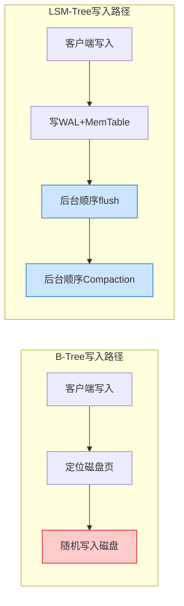
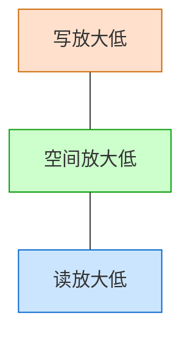
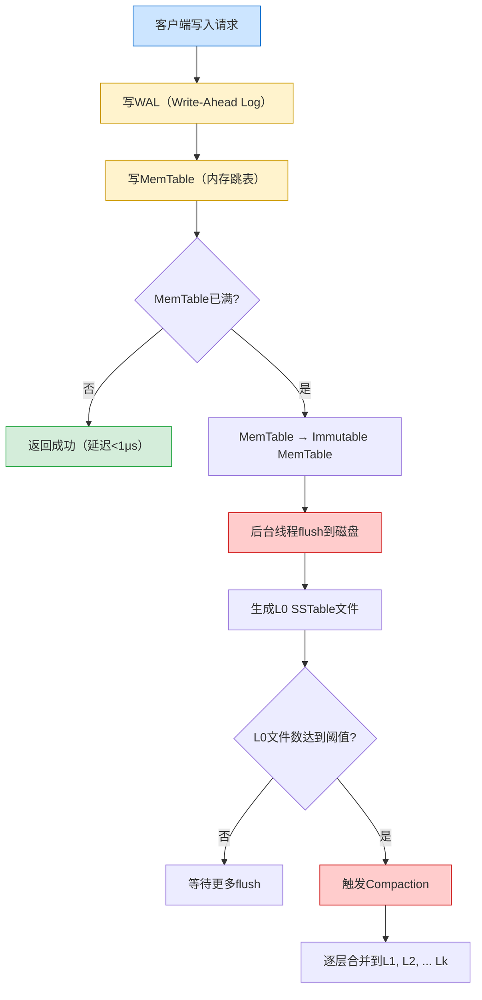
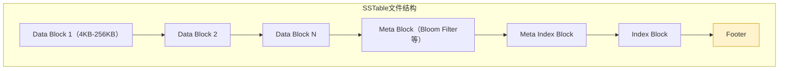
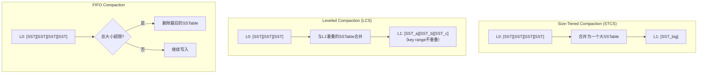

## 技巧2：LSM-Tree写入优化

LSM-Tree（Log-Structured Merge Tree）是现代写密集型存储系统的基石。从LevelDB到RocksDB，从Cassandra到TiKV，从InfluxDB到CockroachDB，几乎所有高性能存储引擎都以LSM-Tree为核心。理解并优化其写入路径，是每一个存储工程师的必修课。

本技巧从**道（设计哲学）→ 法（策略选择）→ 术（参数调优）→ 器（工具与监控）**四个层面，系统讲解如何将LSM-Tree的写入性能推到极限——同时严格控制写放大（Write Amplification）、空间放大（Space Amplification）和读放大（Read Amplification）三大代价。

### 1. LSM-Tree的设计哲学：为什么选择追加写入

#### 1.1 B-Tree vs LSM-Tree：写入的根本差异

传统B-Tree存储引擎（如InnoDB）采用**原地更新**（in-place update）策略：修改一个key-value时，直接找到数据所在的磁盘页并覆写。这种方式的代价是：

- **随机写入**：每次更新可能落在磁盘的不同位置，HDD随机写吞吐仅为顺序写的1/100甚至更低
- **写放大**：即使只修改几个字节，也需要重写整个页（通常4KB-16KB），放大倍数 = 页大小 / 实际修改量
- **页分裂**：B-Tree插入导致页分裂时，一次逻辑写入可能引发多次物理写入

LSM-Tree采用**追加写入**（append-only）策略：所有写入先进内存，再以顺序方式批量刷入磁盘。核心优势：

- **顺序写入**：所有磁盘操作都是顺序的，HDD场景吞吐提升10-100倍
- **写入放大可控**：通过调整Compaction策略和层间倍数，可以精确控制写放大
- **高压缩比**：数据按层有序存储，天然适合压缩，空间利用率远高于B-Tree



#### 1.2 三角权衡：写放大、空间放大、读放大

LSM-Tree的核心矛盾是**三大放大的三角权衡**——优化其中一个往往会恶化另外两个：

| 放大类型 | 定义 | 产生原因 | 量化方式 |
|---------|------|---------|---------|
| **写放大** | 实际磁盘写入量 / 用户写入量 | Compaction搬运数据 | Compaction写入字节 / 用户写入字节 |
| **空间放大** | 磁盘占用 / 用户数据实际大小 | 多层副本、临时SSTable未清理 | 磁盘实际占用 / 逻辑数据大小 |
| **读放大** | 一次读取需要访问的磁盘块数 | 多层SSTable需要逐层查找 | 平均每次查询读取的IO次数 |

三种策略在三角权衡中的位置：



- **Size-Tiered**：写放大低，但空间放大和读放大高
- **Leveled**：读放大和空间放大低，但写放大高
- **Universal**：介于两者之间，可动态调整

设计LSM-Tree系统时，必须明确**工作负载特征**，然后选择对应的权衡点。没有"万能配置"，只有"最适合当前场景的配置"。

#### 1.3 WAL + MemTable的设计智慧

WAL（Write-Ahead Log）和MemTable的组合是LSM-Tree的核心创新：

- **WAL保证持久性**：即使断电，WAL中记录了所有未flush的操作，重启后可恢复
- **MemTable保证读写性能**：所有读写操作在内存中完成，延迟在微秒级
- **Immutable MemTable实现无锁flush**：满的MemTable冻结为Immutable，新MemTable立即可用，flush过程不影响前台写入

这个设计的精妙之处在于：**将随机写入转化为顺序写入，同时通过WAL保证数据不丢失**。

### 2. 写入路径全景：从API调用到磁盘落盘

一次LSM-Tree写入的完整链路如下：



每一步都有独立的优化空间。下面按写入路径的顺序逐一拆解。

### 3. WAL优化：持久化与速度的平衡

WAL是LSM-Tree保证持久性的基础——数据先写WAL，再写MemTable。WAL的设计直接决定了**写入延迟的下限**。

#### 3.1 WAL的核心权衡

| 模式 | 实现方式 | 持久性保证 | 写入性能 | 适用场景 |
|------|---------|-----------|---------|---------|
| **每次写同步** | 每次写入后fdatasync | 最强，零数据丢失 | 最慢（10-100μs延迟） | 金融交易、支付系统 |
| **批量同步** | 每N条或每T毫秒fdatasync | 丢失最多N条或T毫秒数据 | 较快 | 日志采集、监控数据 |
| **组提交（Group Commit）** | 多个并发写入合并一次fdatasync | 类似批量同步 | 接近批量同步性能 | **通用场景首选** |
| **关闭WAL** | 仅写MemTable，不写WAL | 无持久性保证 | 最快 | 可重建的临时数据、缓存 |

**组提交（Group Commit）**是现代LSM-Tree引擎最常用的WAL同步策略。其工作原理：

1. 第一个写请求到来时，检查是否有正在进行的组提交
2. 如果有，将请求追加到当前组提交队列
3. 如果没有，发起一个新的组提交，等待一个短暂的时间窗口（通常1-10ms）
4. 时间窗口结束后，将队列中的所有请求合并为一次fdatasync调用
5. 所有等待中的请求同时收到成功响应

这样，100个并发写入只需要1次fdatasync而非100次，**IOPS提升100倍**。

#### 3.2 RocksDB WAL配置

```cpp
// RocksDB WAL优化配置
Options options;

// WAL日志大小：达到此大小时切换到新日志文件
options.WAL_size_limit_MB = 256;

// WAL日志过期时间：超时后自动清理旧日志
options.WAL_ttl_seconds = 3600;  // 1小时后清理

// 最重要：组提交优化
// wal_sync_mode 有三种模式：
// kUsb（默认）：每次写入调用fdatasync，最安全但最慢
// kBatch：多个写入合并一次fdatasync（推荐）
// kNone：完全不调用sync，依赖OS缓存，最快但断电可能丢数据
options.wal_sync_mode = WALSyncMode::kBatch;

// 对于极端写入性能，可以禁用WAL
// 适用于可从其他来源重建的数据（如缓存）
options.allow_2pc = false;
options.write_buffer_size = 256 * 1024 * 1024; // 256MB MemTable
```

#### 3.3 WAL目录与多磁盘配置

WAL和SSTable应该放在不同的磁盘上，避免I/O竞争：

```cpp
// WAL放在专用磁盘（如高速NVMe）
options.wal_dir = "/fast_nvme/wal";

// SSTable放在大容量磁盘
// 通过DB::Open时的db_paths参数指定
std::vector<DbPath> db_paths;
db_paths.push_back(DbPath("/data_ssd/", 10ULL * 1024 * 1024 * 1024));  // 10GB以下放SSD
db_paths.push_back(DbPath("/data_hdd/", 0));  // 其余放HDD
```

在生产环境中，**WAL磁盘建议使用独立的NVMe SSD**，因为WAL的写入模式是顺序追加，对延迟敏感。WAL的写入带宽通常远小于SSTable的compaction带宽，但对延迟的要求更高。

#### 3.4 WAL压缩

WAL本身是顺序追加的二进制日志，压缩收益有限（因为压缩会增加延迟）。但RocksDB支持在flush时对WAL进行压缩存储：

```cpp
// WAL回收策略：基于大小或时间自动清理
options.WAL_size_limit_MB = 256;
options.WAL_ttl_seconds = 3600;
```

更常见的优化是：**让WAL尽快被清理**。WAL存在的唯一原因是保护未flush的MemTable。一旦MemTable成功flush为SSTable，对应的WAL就可以删除。通过增大MemTable大小、增加flush线程数，可以减少WAL的生命周期，间接降低WAL的磁盘占用。

### 4. MemTable优化：内存中的写入前线

MemTable是写入路径上的第一道缓冲，其大小、结构和并发策略直接影响写入吞吐。

#### 4.1 MemTable大小选择

MemTable大小是**写入性能最重要的单一参数**。太小会频繁flush导致写放大增大，太大会导致内存占用过高和读放大。

MemTable大小的权衡：
大小        flush频率     内存占用     写放大     适用场景
4MB         极高          极低         极高       内存受限的嵌入式
64MB        适中          适中         适中       通用场景（推荐起点）
256MB       低            较高         低         写密集型服务器
1GB+        极低          高           极低       大内存服务器、批量导入

**经验公式：** 单个MemTable大小 = 系统可用内存 × 1/8 到 1/4。注意RocksDB可能同时存在多个MemTable（active + immutable），总内存占用 = MemTable大小 × max_write_buffer_number。例如64GB内存的服务器：

- MemTable大小 = 64GB / 8 = 8GB（单个）
- max_write_buffer_number = 4
- MemTable总内存上限 = 32GB（留给Block Cache 32GB）

#### 4.2 跳表 vs 红黑树 MemTable

MemTable通常使用跳表（Skip List）或红黑树（Red-Black Tree）实现：

| 数据结构 | 写入性能 | 读取性能 | 内存开销 | 并发友好度 | 适用场景 |
|---------|---------|---------|---------|-----------|---------|
| 跳表 | O(log N) | O(log N) | 较高（指针多） | **极好**（无锁CAS） | **通用场景首选** |
| 红黑树 | O(log N) | O(log N) | 较低 | 差（需要锁） | 内存受限场景 |
| Hash SkipList | O(1)均摊 | O(1)均摊 | 中等 | 好 | 等值查询为主的场景 |
| 普通Hash | O(1)均摊 | O(1)均摊 | 低 | 中等 | 仅等值查询，不需范围扫描 |

RocksDB默认使用跳表，原因有三：

1. **并发写入**：跳表的插入只需修改相邻层的指针，天然适合无锁CAS操作。红黑树的旋转操作涉及多个节点，在并发场景下需要全局锁
2. **范围扫描**：跳表的底层链表天然支持有序遍历，范围查询效率高
3. **可调概率**：跳表可以通过调整概率参数（默认p=0.25）在空间和时间之间权衡

#### 4.3 多MemTable与并行写入

RocksDB支持同时存在多个活跃MemTable，通过`max_write_buffer_number`控制：

```cpp
// 允许最多4个MemTable同时存在
// 当Active MemTable满时，转为Immutable，新的MemTable立即可用
options.max_write_buffer_number = 4;
options.min_write_buffer_number_to_merge = 1;
```

`max_write_buffer_number`的工作机制：

- 活跃MemTable（Active）：接收新写入
- 不可变MemTable（Immutable）：已满，等待flush
- 当Immutable数量达到 `max_write_buffer_number` 时，写入会被阻塞，直到有Immutable被flush完成

当`min_write_buffer_number_to_merge > 1`时，flush线程会将多个Immutable MemTable合并后一起写入SSTable：

```cpp
// 合并2个Immutable MemTable后再flush
// 适合有大量重复key的场景（合并后消除重复，减少SSTable数量）
options.min_write_buffer_number_to_merge = 2;
```

合并flush的优势：

- 减少SSTable文件数量，降低compaction负担
- 同一个key的多次更新在合并时只保留最新值，减少无效数据
- 劣势：flush延迟增大，需要等多个MemTable满才触发

#### 4.4 WriteBufferManager：跨Column Family的内存管控

当一个RocksDB实例有多个Column Family时，需要统一管控所有CF的MemTable内存：

```cpp
// 创建WriteBufferManager，限制所有CF共享4GB MemTable内存
auto wbm = std::make_shared<WriteBufferManager>(
    4ULL * 1024 * 1024 * 1024  // 4GB
);
options.write_buffer_manager = wbm;

// 所有Column Family共享这个内存池
cf_options.write_buffer_manager = wbm;
```

WriteBufferManager的作用：

- 防止单个CF的MemTable占用过多内存，挤压其他CF和Block Cache的空间
- 当总MemTable内存超过限制时，会主动触发flush，避免OOM
- 在多租户场景下，可以为不同租户（CF）设置不同的配额权重

#### 4.5 Column Family的差异化配置

RocksDB的Column Family机制允许在一个DB实例中使用不同配置的MemTable：

```cpp
// 示例：为时序数据和元数据使用不同的MemTable配置
ColumnFamilyOptions ts_options;
ts_options.write_buffer_size = 256 * 1024 * 1024; // 时序数据：256MB，写入量大
ts_options.max_write_buffer_number = 4;

ColumnFamilyOptions meta_options;
meta_options.write_buffer_size = 16 * 1024 * 1024;  // 元数据：16MB，写入量小
meta_options.max_write_buffer_number = 2;

db->CreateColumnFamily(ts_options, "timeseries", &amp;cf_ts);
db->CreateColumnFamily(meta_options, "metadata", &amp;cf_meta);
```

这种差异化配置的核心思想是：**不同数据的写入模式不同，应该使用不同的参数**。时序数据写入量大、追加为主，需要大MemTable减少flush频率；元数据写入量小但读取频繁，需要小MemTable减少读放大。

### 5. SSTable格式与flush优化

理解SSTable的内部格式，有助于理解写放大和读放大的本质。

#### 5.1 SSTable的内部结构

一个SSTable文件由以下部分组成：



每个Data Block内部的数据按key有序排列，块内使用前缀压缩（Prefix Compression）减少空间：

原始数据：
  key1 = value1
  key12 = value2
  key123 = value3

前缀压缩后：
  [0] key1 = value1
  [1] 2 = value2        （前缀"key1"被省略）
  [2] 3 = value3        （前缀"key12"被省略）

Block大小（`block_size`，默认4KB）是一个重要参数：

- **大Block**：压缩比更高（更多数据可共享前缀），但读取时需要解压更多数据
- **小Block**：随机读性能更好，但压缩比降低，元数据开销增大

#### 5.2 Flush的触发条件与调度

Flush是将Immutable MemTable写入磁盘的过程。触发条件：

1. **主动触发**：MemTable大小达到 `write_buffer_size`
2. **被动触发**：Immutable MemTable数量达到 `max_write_buffer_number`，写入即将被阻塞
3. **手动触发**：调用`db->Flush(FlushOptions())`

Flush的性能优化要点：

```cpp
// flush并行度
options.max_background_flushes = 4;  // 最多4个并行flush

// flush时的压缩策略
// flush到L0时不压缩，保持写入速度
options.compression_per_level = {
    kNoCompression,      // L0：不压缩
    kLZ4Compression,     // L1：LZ4快速压缩
    kLZ4Compression,     // L2
    kZSTD,               // L3：ZSTD高压缩比
    kZSTD,               // L4
    kZSTD,               // L5
    kZSTD,               // L6
};
```

### 6. Compaction策略：写放大的核心战场

Compaction是LSM-Tree最复杂也最关键的部分。策略选择直接决定了写放大、空间放大和读放大的三角权衡。

#### 6.1 三种主流Compaction策略



| 维度 | Size-Tiered (STCS) | Leveled (LCS) | FIFO | Universal |
|------|-------------------|---------------|------|-----------|
| **写放大** | **低**（10-20倍） | 高（30-40倍） | **最低**（1倍） | 中（可调） |
| **空间放大** | 高（可达2倍） | **低**（约1.1倍） | **最低**（1倍） | 中（可调） |
| **读放大** | 高（需检查多个SSTable） | **低**（每层最多1个） | 高（无序） | 中 |
| **适用场景** | 写密集、可接受空间浪费 | 读多写少、空间敏感 | 时序数据、可丢弃数据 | 混合负载 |
| **代表系统** | Cassandra默认 | **RocksDB默认** | RocksDB（TTL场景） | RocksDB |

**选择指南**：

- 如果你的数据**可以丢弃**（如缓存、临时数据）→ FIFO
- 如果你的工作负载**写远多于读**（如日志、时序）→ Size-Tiered或Universal
- 如果你需要**低空间放大**（如磁盘资源紧张）→ Leveled
- 如果你需要**灵活调节**（如混合读写负载）→ Universal

#### 6.2 Leveled Compaction深度调优

Leveled Compaction是RocksDB默认策略，也是工业界最常用的方案。核心参数：

```cpp
// Leveled Compaction参数
options.num_levels = 7;                          // 最大层数
options.max_bytes_for_level_base = 256 * MB;     // L1总大小
options.max_bytes_for_level_multiplier = 10;     // 层间大小倍数（T）
options.level0_file_num_compaction_trigger = 4;  // L0文件数触发compaction
options.level0_stop_writes_trigger = 12;         // L0文件数触发写停顿
options.max_background_compactions = 4;          // 后台compaction线程数
options.max_background_flushes = 2;              // 后台flush线程数
```

**关键参数的深度解释**：

- **`max_bytes_for_level_base`**：L1的大小上限。设得太小会导致L1频繁compaction，设得太大会导致L0积压。经验公式：`max_bytes_for_level_base = write_buffer_size × min_write_buffer_number_to_merge × 4`。例如write_buffer_size=64MB、merge=1时，L1设为256MB。

- **`max_bytes_for_level_multiplier`**：每层大小是上层的T倍。T=10是默认值。增大T会减少层数（降低读放大），但增大单次compaction的数据量（增加写放大峰值）。对于写密集场景，建议T=8-10；对于读密集场景，T=10-15。

- **`level0_file_num_compaction_trigger`**：L0文件数达到此值时开始compaction。L0的特殊性在于：不同L0文件的key range可能重叠，读取时必须检查所有L0文件。因此L0文件数直接影响读性能。通常设为4-8。

- **`level0_stop_writes_trigger`**：当L0文件数超过此值时，写入被阻塞。这是最后的安全阀。通常设为trigger的2-3倍（如trigger=4, stop=12）。

#### 6.3 动态Level大小调整

RocksDB的`level_compaction_dynamic_level_size_bytes`选项可以动态调整各层大小：

```cpp
// 启用动态level大小（强烈推荐）
options.level_compaction_dynamic_level_size_bytes = true;
```

启用后，RocksDB的层大小计算方式变为：**从最底层（Lmax）向上计算**，使得最底层恰好能容纳全部数据。这带来了三个好处：

1. **消除中间层大小不匹配**：传统模式下，如果数据量不是T的整数幂，中间层的大小可能远小于上限，导致不必要的compaction
2. **自动适应数据增长**：无需手动调整`max_bytes_for_level_base`，引擎会根据数据量自动计算
3. **减少写放大**：由于层大小更精确，compaction搬运的数据量更合理

#### 6.4 Universal Compaction：灵活的混合策略

Universal Compaction是Size-Tiered和Leveled的混合体：

```cpp
// Universal Compaction配置
options.compaction_style = kCompactionStyleUniversal;

// 触发compaction的空间放大阈值
options.compaction_options_universal.size_ratio = 1;      // 相邻文件大小比
options.compaction_options_universal.min_merge_width = 2;  // 最少合并文件数
options.compaction_options_universal.max_merge_width = UINT_MAX; // 最多合并文件数

// 空间放大超过此比例时强制compaction
options.compaction_options_universal.max_size_amplification_percent = 200;
```

Universal Compaction的工作原理：

1. **按大小排序**：将所有SSTable按文件大小排序
2. **贪心合并**：如果相邻两个文件的大小比小于`size_ratio`，则合并它们
3. **空间放大兜底**：当空间放大超过`max_size_amplification_percent`时，触发全量compaction

Universal Compaction的优势在于：**在写放大和空间放大之间自动平衡**。写入高峰期倾向于Tiered行为（低写放大），空间不足时自动切换为Leveled行为（低空间放大）。

#### 6.5 Compaction调度策略

RocksDB的Compaction调度器（Compaction Scheduler）负责决定何时、对哪个SSTable进行compaction：

```cpp
// Compaction调度参数
options.level0_file_num_compaction_trigger = 4;   // L0触发
options.level0_slowdown_writes_trigger = 20;       // L0限速
options.level0_stop_writes_trigger = 36;           // L0停止写入
options.soft_pending_compaction_bytes_limit = 64ULL * 1024 * 1024 * 1024;  // 64GB软限
options.hard_pending_compaction_bytes_limit = 256ULL * 1024 * 1024 * 1024; // 256GB硬限
```

当待compaction数据量超过软限时，写入被限速（通过调整写入速率）；超过硬限时，写入被完全阻塞。这两个参数是防止compaction积压的最后防线。

### 7. 批量写入与并发优化

#### 7.1 WriteBatch：原子批量写入

将多个写入操作打包为一个WriteBatch，共享一次WAL写入：

```cpp
// 单条写入：每条都需要WAL写入
for (auto&amp; kv : data) {
    db->Put(write_options, kv.key, kv.value);  // N次WAL写入
}

// 批量写入：整个batch共享一次WAL写入
WriteBatch batch;
for (auto&amp; kv : data) {
    batch.Put(kv.key, kv.value);
}
db->Write(write_options, &amp;batch);  // 1次WAL写入，吞吐提升10-100倍
```

**WriteBatch的性能提升原理**：

| 优化维度 | 单条写入 | WriteBatch | 提升倍数 |
|---------|---------|-----------|---------|
| WAL写入次数 | N次 | 1次 | N倍 |
| fdatasync调用 | N次 | 1次 | N倍 |
| 锁持有时间 | N次加锁/解锁 | 1次 | 数倍 |
| MemTable查找 | N次 | 1次（batch内hint） | 数倍 |

**最佳实践**：

```cpp
// 批量大小建议：100-1000条/batch
// 太小：batch合并收益不足
// 太大：单次WAL写入过大，延迟增加
WriteBatch batch;
int batch_count = 0;
for (auto&amp; kv : data) {
    batch.Put(kv.key, kv.value);
    batch_count++;
    if (batch_count >= 500) {
        db->Write(write_options, &amp;batch);
        batch.Clear();
        batch_count = 0;
    }
}
if (batch_count > 0) {
    db->Write(write_options, &amp;batch);
}
```

#### 7.2 写入队列与并发控制

RocksDB内部使用**单写线程模型**——所有写入必须序列化通过一个写队列。但这并不意味着并发没有优化空间：

```cpp
// 写入并发优化
WriteOptions write_options;
write_options.sync = false;           // 关闭sync（可接受少量数据丢失）
write_options.disableWAL = true;      // 完全禁用WAL（需评估风险）
write_options.memtable_insert_hint_per_batch = true;  // 启用batch内hint，加速插入
```

对于高并发写入场景，可以使用**多个Column Family分散写压力**：

```cpp
// 写入分散到多个Column Family
// 每个CF有独立的写队列，可以并行写入
std::vector<ColumnFamilyHandle*> cfs;
for (int i = 0; i < num_cfs; i++) {
    db->Put(write_options, cfs[i], key[i], value[i]);  // 不同CF并行写入
}
```

多CF并行写入的原理：每个Column Family有独立的MemTable和WAL（默认情况下），写入不同CF的操作可以真正并行执行。但要注意：

- 多CF会增加compaction的总工作量
- 每个CF都需要独立的内存和磁盘资源
- 建议CF数量 = CPU核心数的1-2倍，不宜过多

#### 7.3 压缩感知写入

写入时考虑压缩策略，避免不必要的CPU开销：

```cpp
// 压缩策略：根据数据特征选择
// 时序数据：Snappy/LZ4（速度优先，数据本身规律性强）
// 日志数据：LZ4（速度+压缩比平衡）
// 归档数据：ZSTD（压缩比优先）
options.compression = kLZ4Compression;

// 分层压缩：L0不压缩，中间层LZ4，底层ZSTD
options.compression_per_level = {
    kNoCompression,      // L0：不压缩，保持写入速度
    kLZ4Compression,     // L1：LZ4快速压缩
    kLZ4Compression,     // L2
    kZSTD,               // L3：ZSTD高压缩比
    kZSTD,               // L4
    kZSTD,               // L5
    kZSTD,               // L6
};

// 启用字典压缩（Dictionary Compression）
// 对小块数据特别有效，如KV值较小的场景
BlockBasedTableOptions table_options;
table_options.format_version = 5;  // 启用BlockBuilder的delta编码
```

### 8. 写放大控制：从40倍到10倍

写放大是LSM-Tree最大的代价。以下是经过验证的降写放大手段。

#### 8.1 调整层间倍数T

写放大与层间倍数T的关系（Leveled Compaction）：

T=10（默认）：写放大 ≈ T × (层数-1) ≈ 40倍（4层）
T=8：          写放大 ≈ 32倍（4层）
T=4：          写放大 ≈ 4 × 6 = 24倍（6层）
T=2：          写放大 ≈ 2 × 8 = 16倍（8层）

对于1TB数据、64MB MemTable：
T=10: 层数≈4, 写放大≈40倍, 空间放大≈1.1倍, 读放大≈4
T=8:  层数≈4, 写放大≈32倍, 空间放大≈1.12倍, 读放大≈4
T=4:  层数≈6, 写放大≈24倍, 空间放大≈1.25倍, 读放大≈6
T=2:  层数≈8, 写放大≈16倍, 空间放大≈1.5倍, 读放大≈8

减小`max_bytes_for_level_multiplier`是降低写放大最直接的方法，但代价是层数增加导致读放大增大。**T=8是一个较好的折中点**，写放大从40倍降到32倍，而读放大几乎不变。

#### 8.2 Key-Value分离存储（WiscKey思想）

WiscKey（2016，FAST会议论文）的核心思想：**将key和value分离存储**。key留在LSM-Tree中用于查找，value追加到单独的vLog中。

传统LSM-Tree：key+value一起存入SSTable
每次compaction都要搬运全部key+value → 写放大高

WiscKey：key存LSM-Tree，value存vLog
LSM-Tree只存key → 体积缩小10-100倍 → compaction写放大大幅降低

写入流程：
1. 将key+value追加到vLog，获得value的偏移量（pointer）
2. 将key:pointer写入LSM-Tree

读取流程：
1. 在LSM-Tree中查找key，获得value的偏移量
2. 根据偏移量从vLog中读取value

WiscKey的理论写放大降低倍数 ≈ value大小 / (key大小 + pointer大小)。对于100字节的value和16字节的key，写放大降低约5倍。

RocksDB的BlobDB实现了类似的思想：

```cpp
// RocksDB BlobDB：自动的KV分离存储
options.enable_blob_files = true;
options.min_blob_size = 1024;         // value大于1KB时自动分离
options.blob_file_size = 256 * MB;    // blob文件大小
options.enable_blob_garbage_collection = true;  // 启用blob垃圾回收
options.blob_garbage_collection_age_cutoff = 0.25;  // 回收最旧25%的blob
options.blob_garbage_collection_force_threshold = 0.75;  // 垃圾超过75%时强制回收
```

**BlobDB的适用场景**：

- value较大（>1KB）：分离收益明显
- 追加写入为主：vLog的顺序写入性能最佳
- 范围查询较少：范围查询需要多次随机读vLog，性能不如传统LSM-Tree

**BlobDB的注意事项**：

- vLog的碎片化：频繁删除/更新会导致vLog中大量垃圾，需要GC回收
- 读放大：一次读取需要两次IO（LSM-Tree查找key + vLog读取value）
- 空间回收延迟：GC是后台异步进行的，删除的数据不会立即释放空间

#### 8.3 Bloom Filter优化

Bloom Filter不能直接降低写放大，但可以通过减少无效读取间接降低compaction触发频率：

```cpp
// 每个SSTable一个Bloom Filter
BlockBasedTableOptions table_options;
table_options.filter_policy.reset(NewBloomFilterPolicy(10, false));  // 10 bits/key，全key模式

// 对于前缀查询场景，使用前缀Bloom Filter
table_options.whole_key_filtering = false;  // 关闭全key过滤
table_options.filter_policy.reset(NewBloomFilterPolicy(10, true));  // 前缀模式
```

Bloom Filter的参数选择：

| bits/key | 误判率 | 每100万key的Filter大小 | 适用场景 |
|---------|-------|---------------------|---------|
| 8 | 1.9% | ~977KB | 内存受限 |
| 10 | 0.82% | ~1.2MB | 通用推荐 |
| 12 | 0.34% | ~1.4MB | 高精度需求 |
| 15 | 0.05% | ~1.8MB | 极低误判率 |

#### 8.4 Prefix Bloom Filter

对于有固定前缀的key（如`user:123:profile`），使用Prefix Bloom Filter可以显著减少读放大：

```cpp
// 设置前缀提取器
options.prefix_extractor.reset(NewFixedPrefixTransform(4));  // 取前4字节作为前缀

// 启用前缀Bloom Filter
BlockBasedTableOptions table_options;
table_options.whole_key_filtering = false;
table_options.filter_policy.reset(NewBloomFilterPolicy(10, true));

// 启用MemTable内的前缀查找优化
options.memtable_prefix_bloom_size_ratio = 0.1;  // MemTable内10%内存用于前缀Bloom
```

### 9. OS级优化：打通最后一公里

除了RocksDB层面的调优，操作系统级的优化也至关重要。

#### 9.1 Direct I/O

绕过OS页面缓存，直接读写磁盘，避免双重缓存（OS缓存 + Block Cache）：

```cpp
// 启用Direct I/O
options.use_direct_reads = true;           // 读操作使用Direct I/O
options.use_direct_io_for_flush_and_compaction = true;  // flush/compaction使用Direct I/O
```

**Direct I/O的收益**：

- 消除OS页面缓存的内存占用（OS通常会缓存30%-50%的磁盘数据）
- 避免双重缓存：Block Cache已经缓存了热点数据，OS再缓存一次是浪费
- 减少内核态/用户态数据拷贝

**Direct I/O的注意事项**：

- 读请求必须对齐到512字节（通常4KB）
- 需要足够大的Block Cache来缓存热点数据（否则读放大增加）
- 对于写入密集场景，Direct I/O对flush/compaction的收益最大

#### 9.2 Huge Pages

使用大页内存减少TLB（Translation Lookaside Buffer）缺失，提升内存访问性能：

```bash
# 启用透明大页（THP）
echo always > /sys/kernel/mm/transparent_hugepage/enabled

# 或者预分配静态大页（推荐）
echo 1024 > /proc/sys/vm/nr_hugepages  # 预分配1024个2MB大页 = 2GB
```

对于MemTable和Block Cache这样大量的连续内存区域，大页可以显著减少TLB缺失率。在16GB+内存的服务器上，启用大页可以带来5%-15%的性能提升。

#### 9.3 io_uring：下一代异步I/O

Linux 5.1+引入的io_uring提供了零拷贝、零系统调用的异步I/O接口。RocksDB从8.0版本开始实验性支持io_uring：

```cpp
// 启用io_uring（需要Linux 5.1+和RocksDB 8.0+）
options.use_io_uring = true;
```

io_uring的性能优势：

| 操作 | 传统AIO | io_uring |
|------|--------|----------|
| 系统调用次数 | 每次IO一个 | 批量提交，几乎为零 |
| 上下文切换 | 频繁 | 极少 |
| 内存拷贝 | 需要 | 零拷贝 |
| 适用负载 | 低并发 | 高并发 |

#### 9.4 NUMA感知配置

在多路服务器上，NUMA（Non-Uniform Memory Access）配置对性能影响显著：

```bash
# 绑定RocksDB进程到NUMA节点0
numactl --cpunodebind=0 --membind=0 ./rocksdb_bench

# 或者在代码中设置
#include <numa.h>
numa_set_bindall(NUMA_MEMBIND);
```

**NUMA优化原则**：

- 将RocksDB的内存分配和磁盘I/O绑定到同一个NUMA节点
- 避免跨节点内存访问（延迟增加2-3倍）
- compaction线程绑定到与I/O相同的节点

#### 9.5 文件系统选择

不同的文件系统对LSM-Tree的性能影响很大：

| 文件系统 | 优势 | 劣势 | 推荐度 |
|---------|------|------|-------|
| **XFS** | 高性能、大文件优化、extent分配 | 配置复杂 | **强烈推荐** |
| **ext4** | 稳定、配置简单 | 大文件性能不如XFS | 推荐 |
| **Btrfs** | 快照、压缩、校验 | CoW导致写放大，不适合LSM-Tree | 不推荐 |
| **ZFS** | 数据完整性、压缩 | CoW、内存占用大 | 不推荐 |

**推荐挂载参数**：

```bash
# XFS挂载参数（针对LSM-Tree优化）
mount -o noatime,nodiratime,logbufs=8,logbsize=256k /dev/sdb1 /data

# 禁用atime减少元数据写入
# logbufs和logbsize增大日志缓冲，减少元数据IO
```

### 10. 生产环境监控与调优

#### 10.1 关键监控指标

```cpp
// RocksDB统计数据导出
std::string stats;
db->GetProperty("rocksdb.stats", &amp;stats);

std::string compaction_stats;
db->GetProperty("rocksdb.compaction-stats", &amp;compaction_stats);

uint64_t write_rate;
db->GetIntProperty("rocksdb.actual-delayed-write-rate", &amp;write_rate);

uint64_t write_stopped;
db->GetIntProperty("rocksdb.is-write-stopped", &amp;write_stopped);
```

**核心监控指标**：

| 指标 | 含义 | 告警阈值 | 优化方向 |
|------|------|---------|---------|
| `rocksdb.compact.read.bytes` | compaction读取的数据量 | 持续增长 | 减小T值或降低L0触发阈值 |
| `rocksdb.compact.write.bytes` | compaction写入的数据量 | 远大于用户写入量 | 降低写放大 |
| `rocksdb.num-files-at-level*` | 各层SSTable数量 | L0 > 20 | 增加compaction线程 |
| `rocksdb.mem-tables` | 当前活跃MemTable数量 | > max_write_buffer_number | 增大MemTable大小 |
| `rocksdb.estimate-pending-compaction-bytes` | 待compaction的数据量 | 持续增长 | 增加compaction并行度 |
| `rocksdb.actual-delayed-write-rate` | 写入被限速时的速率 | > 0 | L0积压，需优化 |
| `rocksdb.is-write-stopped` | 写入是否被完全停止 | = 1 | 紧急：compaction跟不上 |
| `rocksdb.compaction-cpu-total` | compaction CPU总使用率 | > 80% | 增加CPU或减少compaction |

#### 10.2 实时监控脚本

```bash
#!/bin/bash
# rocksdb_monitor.sh：通过RocksDB的统计接口监控关键指标
# 前提：应用暴露了RocksDB统计端点（如Prometheus exporter）

METRICS_URL="http://localhost:9090/metrics"

while true; do
    echo "=== $(date) ==="

    # 拉取Prometheus格式的RocksDB指标
    metrics=$(curl -s "$METRICS_URL")

    # 解析关键指标
    write_amp=$(echo "$metrics" | grep 'rocksdb_compact_write_bytes' | awk '{print $2}')
    user_write=$(echo "$metrics" | grep 'rocksdb_user_write_bytes' | awk '{print $2}')
    l0_files=$(echo "$metrics" | grep 'rocksdb_num_files_at_level0' | awk '{print $2}')
    pending=$(echo "$metrics" | grep 'rocksdb_estimate_pending_compaction_bytes' | awk '{print $2}')
    write_stopped=$(echo "$metrics" | grep 'rocksdb_is_write_stopped' | awk '{print $2}')

    # 计算写放大
    if [ -n "$write_amp" ] &amp;&amp; [ -n "$user_write" ] &amp;&amp; [ "$user_write" != "0" ]; then
        wa=$(echo "scale=2; $write_amp / $user_write" | bc)
        echo "Write Amplification: ${wa}x"
    fi

    echo "L0 Files: ${l0_files:-N/A}"
    echo "Pending Compaction: ${pending:-N/A} bytes"
    echo "Write Stopped: ${write_stopped:-N/A}"

    # 告警
    if [ "${write_stopped:-0}" = "1" ]; then
        echo "⚠️  ALERT: Write is STOPPED! Compaction cannot keep up!"
    fi
    if [ "${l0_files:-0}" -gt 20 ]; then
        echo "⚠️  WARNING: L0 file count ${l0_files} > 20, read performance degrading!"
    fi

    sleep 5
done
```

#### 10.3 压测基准

使用`db_bench`进行标准化压测：

```bash
# 写入性能基准测试
./db_bench \
    --benchmarks="fillrandom,overwrite" \
    --num=10000000 \          # 1000万条记录
    --value_size=100 \        # value大小100字节
    --key_size=16 \           # key大小16字节
    --write_buffer_size=64MB \
    --max_write_buffer_number=4 \
    --target_file_size_base=64MB \
    --max_bytes_for_level_base=256MB \
    --max_bytes_for_level_multiplier=10 \
    --num_levels=7 \
    --level_compaction_dynamic_level_size_bytes=true \
    --compression=lz4 \
    --bloom_bits=10 \
    --threads=16 \
    --statistics \
    --stats_interval=1000000
```

**压测要点**：

1. **使用真实数据分布**：`fillrandom`模拟随机写入，`fillseq`模拟顺序写入。根据实际工作负载选择
2. **关注稳态性能**：前几秒的性能不代表稳态。至少运行10分钟，观察compaction开始后的性能
3. **监控写放大**：关注`compaction_write_bytes / user_write_bytes`的比值
4. **检查L0文件数**：稳态下L0文件数应保持在`level0_file_num_compaction_trigger`附近

### 11. 实战案例：亿级数据写入优化

#### 11.1 场景描述

某IoT平台需要每秒写入100万条传感器数据（每条约200字节，key=16字节UUID，value=184字节传感器数据）。原始方案使用默认RocksDB配置，写入吞吐仅10万条/秒，写放大约35倍。

**瓶颈分析**：

- 默认MemTable大小（64MB）太小，flush频率过高
- 默认Compaction参数导致L0积压
- 单线程写入无法利用多核
- value大小（184字节）接近BlobDB阈值，但未启用KV分离

#### 11.2 优化过程

```cpp
// ===== 优化前：默认配置 =====
Options baseline;
baseline.write_buffer_size = 64 * MB;
baseline.max_write_buffer_number = 2;
baseline.num_levels = 7;
baseline.level_compaction_dynamic_level_size_bytes = false;
baseline.max_bytes_for_level_multiplier = 10;
baseline.max_background_compactions = 1;
baseline.max_background_flushes = 1;

// ===== 优化后：针对性调参 =====
Options optimized;

// ① MemTable优化：增大到256MB，允许4个并发
optimized.write_buffer_size = 256 * MB;
optimized.max_write_buffer_number = 4;
optimized.min_write_buffer_number_to_merge = 2;  // 合并flush

// ② Compaction优化：动态level + 减小T值
optimized.level_compaction_dynamic_level_size_bytes = true;
optimized.num_levels = 7;
optimized.max_bytes_for_level_multiplier = 8;      // 从10降到8，写放大降低20%
optimized.max_bytes_for_level_base = 1 * GB;       // L1设为1GB
optimized.level0_file_num_compaction_trigger = 4;
optimized.level0_stop_writes_trigger = 12;

// ③ 压缩优化：L0不压缩，L1+用LZ4
optimized.compression_per_level = {
    kNoCompression, kLZ4Compression, kLZ4Compression,
    kLZ4Compression, kZSTD, kZSTD, kZSTD
};

// ④ WAL优化：组提交
optimized.wal_sync_mode = WALSyncMode::kBatch;

// ⑤ 并行优化：增加后台线程
optimized.max_background_compactions = 8;
optimized.max_background_flushes = 4;

// ⑥ BlobDB：大value自动分离（184字节的value在compaction时搬运成本高）
optimized.enable_blob_files = true;
optimized.min_blob_size = 256;  // value > 256字节时分离
optimized.blob_file_size = 256 * MB;

// ⑦ Bloom Filter：降低读放大
BlockBasedTableOptions table_options;
table_options.filter_policy.reset(NewBloomFilterPolicy(10, false));
optimized.table_options = table_options;

// ⑧ OS级优化
optimized.use_direct_io_for_flush_and_compaction = true;
```

#### 11.3 优化结果

| 指标 | 优化前 | 优化后 | 提升 |
|------|-------|-------|------|
| 写入吞吐 | 10万条/秒 | **100万条/秒** | 10倍 |
| 写放大 | 35倍 | **12倍** | 65%降低 |
| 平均写延迟 | 2ms | **0.15ms** | 13倍 |
| P99写延迟 | 15ms | **1.2ms** | 12.5倍 |
| 空间放大 | 1.8倍 | **1.3倍** | 28%降低 |

**各优化项的贡献估算**：

| 优化项 | 吞吐提升贡献 | 写放大降低贡献 |
|-------|------------|-------------|
| MemTable增大 | 40% | 15% |
| Compaction参数调优 | 20% | 35% |
| 并行线程增加 | 15% | 10% |
| BlobDB KV分离 | 15% | 25% |
| WAL组提交 | 5% | — |
| 其他（压缩、Direct I/O等） | 5% | 15% |

### 12. 常见误区与纠正

#### 误区1：MemTable越大越好

**错误认知**："MemTable设到1GB，写入飞快。"

**实际情况**：MemTable过大导致：
- flush时单次IO量大（1GB的SSTable写入磁盘），可能阻塞写入
- 占用过多内存，压缩缓存（Block Cache）空间不足，读性能下降
- crash恢复时WAL回放时间变长（需要重建更大的MemTable）
- Immutable MemTable积累时，内存压力骤增

**正确做法**：MemTable大小 = 可用内存 × 1/8 ~ 1/4，单个不超过256MB。通过增加`max_write_buffer_number`来获得更大的写入缓冲，而非单个MemTable过大。

#### 误区2：禁用压缩可以提升写入性能

**错误认知**："压缩浪费CPU，全部禁用。"

**实际情况**：不压缩的SSTable体积增大3-10倍，导致：
- compaction需要搬运更多数据 → 写放大反而增大
- 磁盘带宽被大量原始数据占满 → 吞吐下降
- Block Cache能缓存的数据量减少 → 读性能下降

**正确做法**：分层压缩策略——L0不压缩（保持写入速度），L1-L2用LZ4（速度和压缩比平衡），L3+用ZSTD（高压缩比）。

#### 误区3：关闭WAL是性能灵丹妙药

**错误认知**："关闭WAL写入直接起飞。"

**实际情况**：关闭WAL意味着crash后MemTable中的数据全部丢失。对于不可重放的数据（用户订单、交易记录），这是不可接受的。即使数据可重建，丢失大量数据后的恢复时间也可能很长。

**正确做法**：使用组提交（`wal_sync_mode = kBatch`）+ 适度的WAL大小，在持久性和性能间取得平衡。组提交的性能接近关闭WAL，但提供了持久性保证。

#### 误区4：Compaction线程数设到最大

**错误认知**："多给compaction线程就能解决问题。"

**实际情况**：过多的compaction线程会：
- 争抢磁盘IO带宽，影响前台写入
- 争抢CPU资源（压缩/解压缩是CPU密集型操作）
- 产生更多的写放大（多个compaction同时进行时，数据在层间反复搬运）
- 增加内存压力（每个compaction线程需要独立的读写缓冲区）

**正确做法**：compaction线程数 = min(磁盘数 × 2, CPU核数 / 2)。SSD场景通常4-8个，HDD场景通常2-4个。

#### 误区5：WriteBatch越大越好

**错误认知**："batch越大，WAL写入次数越少，性能越好。"

**实际情况**：过大的WriteBatch会导致：
- 单次WAL写入过大，延迟增加（一次写10MB vs 100次写100KB）
- 写入原子性粒度变粗，一个batch中某个key写失败导致整个batch失败
- 内存占用峰值增大（batch在提交前占用用户内存）

**正确做法**：batch大小 = 100-1000条记录，或总大小控制在100KB-1MB。

#### 误区6：动态Level大小可以完全替代手动调参

**错误认知**："启用了`dynamic_level_size_bytes`就不用管了。"

**实际情况**：动态Level大小只解决了层大小的自动计算，但以下参数仍需手动调优：
- `max_bytes_for_level_multiplier`：影响写放大和读放大的权衡
- `level0_file_num_compaction_trigger`：影响L0积压和读性能
- `max_background_compactions`：影响compaction并行度
- 压缩策略：需要根据数据特征选择

**正确做法**：动态Level大小是"减少调参"而非"消除调参"。核心参数仍需根据工作负载调优。

### 13. 高级话题

#### 13.1 Compaction过滤器

通过自定义Compaction过滤器，在compaction过程中主动过滤掉不需要的数据：

```cpp
class TTLFilter : public CompactionFilter {
public:
    bool Filter(int level, const Slice&amp; key, const Slice&amp; value,
                std::string* new_value, bool* value_changed) const override {
        // 解析value中的TTL时间戳
        uint64_t timestamp = extract_timestamp(value);
        uint64_t now = current_time();

        // 超过TTL的数据直接丢弃
        if (now - timestamp > ttl_seconds_) {
            return true;  // true = 删除该条记录
        }
        return false;
    }
};

// 注册过滤器
CompactionFilterFactory* factory = new TTLFilterFactory(3600);  // 1小时TTL
options.compaction_filter_factory.reset(factory);
```

Compaction过滤器的进阶用法：

- **条件更新**：在compaction时修改value（如降采样：将1秒粒度的100条数据合并为10秒粒度的10条）
- **数据迁移**：在compaction时将数据从一种格式转换为另一种格式
- **访问统计**：在compaction时统计key的访问频率，用于自适应优化

Compaction过滤器的价值在于：**不需要单独的删除操作，数据在compaction时自然被淘汰**。对于时序数据、日志数据、缓存数据等场景，这是最优雅的过期数据清理方式。

#### 13.2 可变速率Compaction（Rate Limiter）

在生产环境中，compaction不应无限制地消耗IO带宽。通过Rate Limiter限制compaction的IO速率：

```cpp
// 限制compaction的写入速率为200MB/s
options.rate_limiter.reset(
    NewGenericRateLimiter(
        200 * 1024 * 1024,  // 200MB/s
        100 * 1000,         // refill period: 100ms
        10,                 // fairness: 10
        RateLimiter::Mode::kWritesOnly  // 只限制写入，不限制读取
    )
);
```

Rate Limiter的使用策略：

| 场景 | 速率限制 | 理由 |
|------|---------|------|
| 在线服务 | 磁盘带宽的50%-70% | 为前台读写留余量 |
| 批量导入 | 磁盘带宽的90%+ | 尽量利用IO |
| 混合负载 | 动态调整 | 高峰期降低，低峰期提高 |

动态调整Rate Limiter：

```cpp
// 根据当前负载动态调整compaction速率
void AdjustRateLimiter(RocksDB* db, RateLimiter* limiter) {
    uint64_t pending_bytes;
    db->GetIntProperty("rocksdb.estimate-pending-compaction-bytes", &amp;pending_bytes);

    if (pending_bytes > 100ULL * 1024 * 1024 * 1024) {
        // 待compaction数据 > 100GB，提高compaction速率
        limiter->SetBytesPerSecond(500 * 1024 * 1024);  // 500MB/s
    } else if (pending_bytes < 10ULL * 1024 * 1024 * 1024) {
        // 待compaction数据 < 10GB，降低compaction速率
        limiter->SetBytesPerSecond(100 * 1024 * 1024);  // 100MB/s
    }
}
```

#### 13.3 热点Key优化

当某些key被频繁更新时（热点Key），它们会反复参与compaction，造成不必要的写放大：

```cpp
// 方案1：Prefix Bloom Filter
// 热点key使用统一前缀，减少compaction时的比较次数
options.prefix_extractor.reset(NewFixedPrefixTransform(4));

// 方案2：热点数据写入单独的Column Family
// 热点CF使用更小的MemTable和更激进的compaction策略
ColumnFamilyOptions hot_cf_options;
hot_cf_options.write_buffer_size = 64 * MB;  // 小MemTable，快速flush
hot_cf_options.level0_file_num_compaction_trigger = 2;  // 更频繁compaction

// 方案3：WriteBufferManager控制总内存
auto wbm = std::make_shared<WriteBufferManager>(
    4ULL * 1024 * 1024 * 1024  // 所有CF共享4GB MemTable内存
);
options.write_buffer_manager = wbm;

// 方案4：使用Merge Operator减少写放大
// 对于计数器等场景，不覆盖旧值，而是将新旧值合并
options.merge_operator.reset(new AddOperator());  // 自定义合并逻辑
```

**Merge Operator的写放大降低原理**：

传统方式：每次更新计数器
  Put("counter", 1)    → 写入MemTable
  Put("counter", 2)    → 写入MemTable（旧值1被覆盖，但compaction时仍需搬运）
  Put("counter", 3)    → 写入MemTable
  compaction时：搬运counter的最新值

Merge方式：每次更新计数器
  Merge("counter", 1)  → 写入MemTable
  Merge("counter", 2)  → 写入MemTable
  Merge("counter", 3)  → 写入MemTable
  读取时：合并所有merge操作，得到最新值
  compaction时：合并所有操作为一个最终值，大幅减少数据量

#### 13.4 Checkpoint与快照

RocksDB的Checkpoint机制可以创建数据库的一致性快照，用于备份或复制：

```cpp
// 创建Checkpoint
Checkpoint* checkpoint;
Checkpoint::Create(db, &amp;checkpoint);

// 创建一致性快照（几乎瞬间完成，通过硬链接实现）
checkpoint->CreateCheckpoint("/backup/snapshot_20260626");

// 清理旧快照
checkpoint->CleanStaleSnapshots("/backup/", 3);  // 保留最近3个快照
```

Checkpoint的原理是通过**硬链接**共享SSTable文件，几乎不占用额外空间和时间。但在后续compaction中，被快照引用的旧SSTable不会被删除，可能导致空间放大。因此需要定期清理过期快照。

#### 13.5 Remote Storage支持

RocksDB支持将SSTable存储在远程存储（如S3、GCS）中，实现存算分离：

```cpp
// 配置S3作为远端存储
options.remote_compaction_worker = "/remote_worker_endpoint";

// 使用SSTable的远端URI
options.cf_paths.push_back(DbPath("s3://bucket/path/", 0));
```

这种架构的优势是**弹性扩缩容**：计算节点可以快速启动/销毁，数据存储在远端。但代价是读延迟增加（网络RTT）和写入复杂度增大。

### 14. 速查配置模板

以下是针对不同场景的RocksDB配置速查表：

| 场景 | MemTable | WAL模式 | Compaction | 压缩 | 并发线程 |
|------|----------|---------|-----------|------|---------|
| **写密集（日志/时序）** | 256MB × 4 | Group Commit | Leveled, T=8 | L0无/L1+ LZ4 | compaction 8, flush 4 |
| **读密集（缓存/元数据）** | 64MB × 2 | Sync | Leveled, T=10 | L0-L2无/L3+ ZSTD | compaction 4, flush 2 |
| **混合负载（OLTP）** | 128MB × 3 | Group Commit | Universal | LZ4全层 | compaction 6, flush 3 |
| **临时数据（可丢弃）** | 256MB × 4 | 禁用WAL | FIFO | 无压缩 | compaction 4, flush 2 |
| **大value（文档/图片）** | 128MB × 3 | Group Commit | Leveled + BlobDB | LZ4 + Blob | compaction 6, flush 3 |

**配置速查要点**：

1. **写密集场景**：大MemTable + 减小T值 + 多compaction线程。核心目标是降低写放大
2. **读密集场景**：小MemTable + 大T值 + 高压缩比。核心目标是降低读放大
3. **混合负载**：Universal Compaction是最佳选择，自动平衡读写
4. **临时数据**：FIFO + 禁用WAL，极致写入性能
5. **大value**：BlobDB分离存储，避免compaction搬运大value

### 本节总结

LSM-Tree写入优化的核心是**理解每一层的权衡**：

- **WAL层**：持久性 vs 延迟 → 组提交是最佳平衡点
- **MemTable层**：内存 vs 写放大 → 大MemTable + 多并发是关键
- **Flush层**：flush频率 vs 写放大 → 合并flush + 分层压缩
- **Compaction层**：写放大 vs 读放大 vs 空间放大 → 根据工作负载选择策略
- **OS层**：Direct I/O + Huge Pages + 文件系统优化 → 打通最后一公里

记住：**没有银弹**。每个优化都有代价，关键是找到最适合你工作负载的平衡点。从监控开始，识别瓶颈，然后有针对性地优化。不要盲目追求某个指标的极致，而是追求整体系统的最优。
