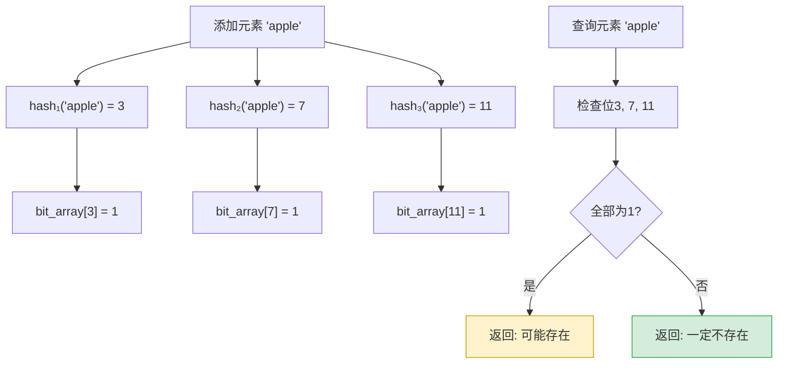
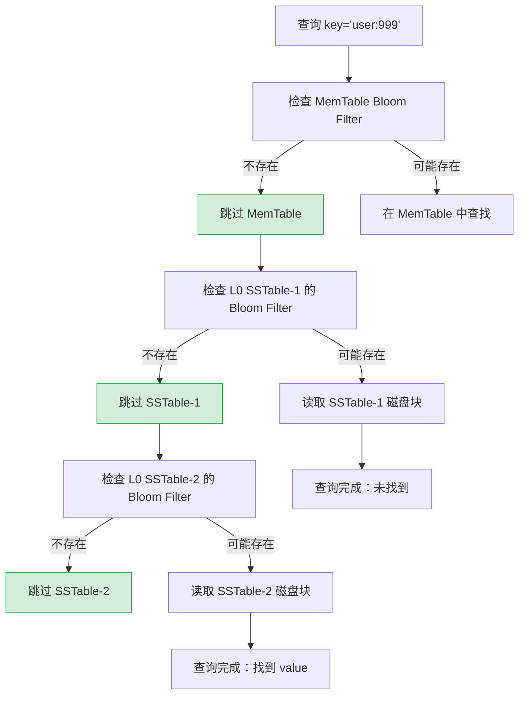
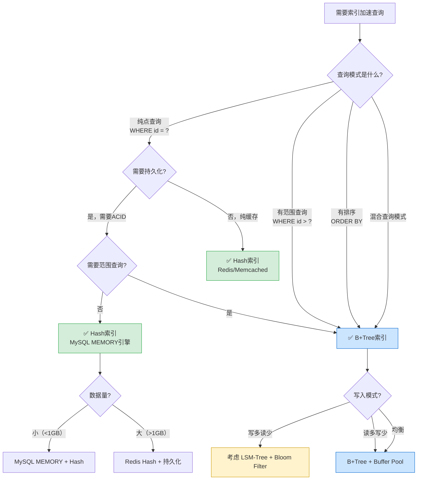

# 技巧3：Hash索引与布隆过滤器

> **核心命题**：Hash索引提供O(1)的点查询性能，布隆过滤器以极小的内存代价排除99%以上的无效查询——两者都是索引加速的利器，但各自有明确的适用边界。本节从哈希函数的数学原理出发，系统讲解Hash索引的内部机制、布隆过滤器的概率保证，以及它们在RocksDB、Redis、MySQL等系统中的真实应用。

## 1. Hash索引基础原理

### 1.1 哈希函数：从输入到桶的映射

哈希索引的核心是将任意长度的key通过哈希函数映射为固定长度的整数，再用取模运算定位到存储位置。一个理想的哈希函数应该满足三个条件：**确定性**（同一key始终得到同一hash值）、**均匀分布**（不同key均匀散布到各桶中）、**高效计算**（O(1)时间复杂度）。

索引查找过程：

key = "user:12345"
     ↓
hash("user:12345") = 0xA3F7B2C1  (32位哈希值)
     ↓
bucket_index = 0xA3F7B2C1 % 1024 = 641
     ↓
在 bucket[641] 中查找 key="user:12345" → 找到 value

### 1.2 常见哈希函数算法

不同场景对哈希函数的需求不同。加密场景需要抗碰撞能力，索引场景需要速度和分布均匀性。

| 算法 | 输出长度 | 速度 | 分布均匀性 | 适用场景 |
|------|---------|------|-----------|---------|
| **MurmurHash3** | 32/128bit | 极快（~1GB/s） | 优秀 | 通用索引、布隆过滤器、Redis |
| **xxHash** | 64/128bit | 最快（~30GB/s） | 优秀 | 高吞吐索引、大文件校验 |
| **CityHash** | 64/128bit | 很快 | 优秀 | Google系统内部索引 |
| **FNV-1a** | 32/64bit | 快 | 良好 | 小规模索引、嵌入式 |
| **SHA-256** | 256bit | 慢（~500MB/s） | 极好 | 加密、区块链、数字签名 |
| **SipHash** | 64bit | 快 | 优秀 | 防HashDoS攻击的场景 |

```python
import mmh3
import hashlib

# MurmurHash3：索引场景的首选
key = b"user:12345"
h32 = mmh3.hash(key, seed=0)           # 32位，有符号
h64 = mmh3.hash64(key, seed=0)[0]      # 64位

# 对比SHA-256的速度差异
import time
N = 1_000_000

start = time.time()
for _ in range(N):
    mmh3.hash(key)
murmur_time = time.time() - start

start = time.time()
for _ in range(N):
    hashlib.sha256(key).digest()
sha_time = time.time() - start

print(f"MurmurHash3: {murmur_time:.3f}s")  # ~0.3s
print(f"SHA-256:     {sha_time:.3f}s")      # ~1.5s
print(f"速度比:      MurmurHash3快 {sha_time/murmur_time:.0f}x")
```

**关键选择原则**：如果不需要加密安全性，始终选择MurmurHash3或xxHash。它们的分布均匀性在索引场景中已经足够好，而速度比SHA系列快一个数量级。

### 1.3 哈希冲突解决策略

哈希函数将无限的key空间映射到有限的桶空间，冲突不可避免。解决冲突的方式直接决定了Hash索引的性能上限。

#### 链地址法（Separate Chaining）

每个桶存放一个链表（或红黑树），所有映射到同一桶的key挂在链表上。

桶0: → [key1:v1] → [key5:v5] → None
桶1: → [key2:v2] → None
桶2: → [key3:v3] → [key7:v7] → [key11:v11] → None
桶3: → None
桶4: → [key4:v4] → None

```python
class HashTableChaining:
    """链地址法Hash表：MySQL MEMORY引擎的简易实现"""
    
    def __init__(self, capacity=16):
        self.capacity = capacity
        self.size = 0
        self.buckets = [[] for _ in range(capacity)]
    
    def _hash(self, key):
        return hash(key) % self.capacity
    
    def put(self, key, value):
        idx = self._hash(key)
        bucket = self.buckets[idx]
        # 如果key已存在，更新value
        for i, (k, v) in enumerate(bucket):
            if k == key:
                bucket[i] = (key, value)
                return
        # 新key，追加到链表
        bucket.append((key, value))
        self.size += 1
        # 负载因子超过0.75时扩容
        if self.size / self.capacity > 0.75:
            self._resize()
    
    def get(self, key):
        idx = self._hash(key)
        for k, v in self.buckets[idx]:
            if k == key:
                return v
        return None
    
    def _resize(self):
        old_buckets = self.buckets
        self.capacity *= 2
        self.buckets = [[] for _ in range(self.capacity)]
        self.size = 0
        for bucket in old_buckets:
            for k, v in bucket:
                self.put(k, v)
```

**性能分析**：链地址法的查找时间 = O(1)（桶定位）+ O(n/k)（链表遍历），其中n是元素数，k是桶数，n/k就是负载因子α。当α < 0.75时，平均查找长度约为1-2次比较。

#### 开放寻址法（Open Addressing）

冲突时不使用链表，而是按某种探测序列寻找下一个空桶。所有数据都存在数组中，缓存局部性更好。

| 探测方式 | 序列公式 | 优点 | 缺点 |
|---------|---------|------|------|
| **线性探测** | `(h + i) % m` | 缓存友好，实现简单 | **聚集效应**严重，性能随α下降急剧恶化 |
| **二次探测** | `(h + i²) % m` | 缓存较友好，减少聚集 | 可能无法探测所有桶 |
| **双重哈希** | `(h1 + i × h2) % m` | 探测序列均匀，无聚集 | 计算成本稍高 |
| **Robin Hood** | 选择离"家"最远的key交换 | 最坏查找距离可控 | 实现复杂 |

```python
class RobinHashTable:
    """Robin Hood Hashing：开放寻址的优化变体
    
    核心思想：每次插入时，如果新元素离"理想位置"比当前位置的元素更远，
    就交换它们。这样所有元素的"离家距离"趋于均匀，最坏情况大幅改善。
    """
    
    def __init__(self, capacity=16):
        self.capacity = capacity
        self.size = 0
        self.keys = [None] * capacity
        self.values = [None] * capacity
        self.distances = [0] * capacity  # 每个key离家距离
    
    def _hash(self, key):
        return hash(key) % self.capacity
    
    def put(self, key, value):
        if self.size / self.capacity > 0.7:
            self._resize()
        
        idx = self._hash(key)
        dist = 0
        
        while True:
            if self.keys[idx] is None:
                # 空桶，直接插入
                self.keys[idx] = key
                self.values[idx] = value
                self.distances[idx] = dist
                self.size += 1
                return
            
            if self.keys[idx] == key:
                # key已存在，更新
                self.values[idx] = value
                return
            
            # Robin Hood策略：如果当前元素离家更近，交换
            ideal = self._hash(self.keys[idx])
            curr_dist = (idx - ideal) % self.capacity
            
            if dist > curr_dist:
                # 当前元素被"抢劫"：交换key/value
                key, self.keys[idx] = self.keys[idx], key
                value, self.values[idx] = self.values[idx], value
                dist, self.distances[idx] = curr_dist, dist
            
            idx = (idx + 1) % self.capacity
            dist += 1
    
    def get(self, key):
        idx = self._hash(key)
        dist = 0
        
        while self.keys[idx] is not None:
            if self.keys[idx] == key:
                return self.values[idx]
            # 如果探测距离超过当前key的离家距离，key不存在
            if dist > self.distances[idx]:
                return None
            idx = (idx + 1) % self.capacity
            dist += 1
        return None
    
    def _resize(self):
        old_keys, old_values = self.keys, self.values
        self.capacity *= 2
        self.keys = [None] * self.capacity
        self.values = [None] * self.capacity
        self.distances = [0] * self.capacity
        self.size = 0
        for k, v in zip(old_keys, old_values):
            if k is not None:
                self.put(k, v)
```

#### 链地址法 vs 开放寻址法对比

| 维度 | 链地址法 | 开放寻址法 |
|------|---------|-----------|
| **缓存局部性** | 差（链表节点分散在堆中） | 好（所有数据在同一数组中） |
| **负载因子上限** | 可超过1（链表可无限延伸） | 必须低于1（推荐 < 0.7） |
| **删除操作** | 简单（直接删除链表节点） | 复杂（需要tombstone标记或Robin Hood重排） |
| **内存开销** | 额外指针开销（每节点8-16字节） | 无额外指针，但需预留空间 |
| **极端性能** | 受链表退化影响（→O(n)） | 受聚集效应影响（→O(n)） |
| **适用场景** | 通用，元素数量不确定 | 元素数量可预估，追求缓存性能 |

### 1.4 负载因子与扩容策略

负载因子 α = 已存元素数 / 桶总数，是Hash索引性能的关键指标。

负载因子与平均查找长度（链地址法）：

α=0.25  → 平均比较 1.13 次
α=0.50  → 平均比较 1.25 次
α=0.75  → 平均比较 1.38 次
α=1.00  → 平均比较 1.50 次
α=2.00  → 平均比较 2.00 次
α=4.00  → 平均比较 3.00 次

结论：α < 0.75 时性能优秀，α > 1 后性能线性下降

**扩容（Rehash）策略**：

```python
# 线性扩容 vs 渐进式扩容

# 方式1：一次性扩容（简单但有延迟尖刺）
def rehash_all(self):
    """一次性完成所有元素的迁移，期间Hash表不可用"""
    old_buckets = self.buckets
    self.capacity *= 2
    self.buckets = [[] for _ in range(self.capacity)]
    for bucket in old_buckets:
        for k, v in bucket:
            self.buckets[hash(k) % self.capacity].append((k, v))

# 方式2：渐进式扩容（Redis使用的方式）
# 每次操作时迁移少量数据，避免一次性迁移的延迟尖刺
class IncrementalRehash:
    def __init__(self):
        self.ht[0] = HashTable(16)   # 当前表
        self.ht[1] = None             # 迁移目标表
        self.rehash_idx = -1          # -1表示不在迁移中
    
    def _rehash_step(self, n=1):
        """每次操作时迁移n个桶"""
        for _ in range(n):
            if self.ht[0].is_empty():
                self.ht[0] = self.ht[1]
                self.ht[1] = None
                self.rehash_idx = -1
                return
            bucket = self.ht[0].buckets[self.rehash_idx]
            for k, v in bucket:
                self.ht[1].put(k, v)
            self.ht[0].buckets[self.rehash_idx] = None
            self.rehash_idx += 1
```

**关键数字**：Java HashMap在α=0.75时扩容（2倍），Redis字典在α=1且没有后台BGSAVE时扩容（2倍）或α=5时强制扩容（10倍）。α=0.75是一个经典的工程折中点——它保证了链表平均长度不超过1.38，同时不会浪费太多空间。

## 2. Hash索引在数据库系统中的实际应用

### 2.1 MySQL MEMORY引擎：Hash索引的完整实例

MEMORY引擎同时支持Hash索引和BTree索引。默认使用Hash索引（除非指定USING BTREE）。

```sql
-- 创建MEMORY引擎表
CREATE TABLE session_store (
    session_id VARCHAR(64) PRIMARY KEY,  -- Hash索引（MEMORY引擎默认）
    user_id INT NOT NULL,
    login_time DATETIME,
    ip_address VARCHAR(45),
    INDEX idx_user_id (user_id) USING BTREE  -- 显式指定BTree索引
) ENGINE=MEMORY;

-- 插入数据
INSERT INTO session_store VALUES 
('sess_abc123def456', 1001, NOW(), '192.168.1.100'),
('sess_xyz789ghi012', 1002, NOW(), '10.0.0.50'),
('sess_mno345pqr678', 1001, NOW(), '172.16.0.25');

-- Hash索引查询：精确匹配O(1)
EXPLAIN SELECT * FROM session_store WHERE session_id = 'sess_abc123def456';
-- type: const, key: PRIMARY, rows: 1 ← Hash索引直接定位

-- Hash索引不支持范围查询
EXPLAIN SELECT * FROM session_store WHERE session_id > 'sess_abc';
-- type: ALL, key: NULL ← Hash索引无法处理范围条件

-- BTree索引支持范围查询
EXPLAIN SELECT * FROM session_store WHERE user_id BETWEEN 1001 AND 1002;
-- type: range, key: idx_user_id ← BTree索引处理范围
```

**MEMORY引擎Hash索引的内存布局**：

┌──────────────────────────────────────────────────────┐
│                   Hash Table (内存)                    │
├──────────────────────────────────────────────────────┤
│  bucket[0]: → (sess_abc123..., ptr→行数据)           │
│  bucket[1]: → None                                   │
│  bucket[2]: → (sess_mno345..., ptr→行数据)           │
│  bucket[3]: → None                                   │
│  ...                                                  │
│  bucket[N]: → (sess_xyz789..., ptr→行数据)           │
├──────────────────────────────────────────────────────┤
│  行数据存储：定长行格式，连续内存排列                     │
│  [sess_abc123...][1001][datetime][192.168.1.100]      │
│  [sess_mno345...][1001][datetime][172.16.0.25]        │
│  [sess_xyz789...][1002][datetime][10.0.0.50]          │
└──────────────────────────────────────────────────────┘

### 2.2 Redis Hash结构：键值存储的哈希实现

Redis的Hash类型是面向用户的哈希数据结构，内部根据元素数量自动选择ziplist（压缩列表）或hashtable（哈希表）编码。

Redis Hash编码切换逻辑：

元素数量 ≤ hash-max-ziplist-entries (默认128)
  AND 每个value大小 ≤ hash-max-ziplist-value (默认64字节)
  → 使用 ziplist 编码（紧凑，内存友好）

否则 → 使用 hashtable 编码（性能优先）

```bash
# Redis Hash操作
HSET user:1001 name "张三" age 28 city "北京"
HGET user:1001 name          # O(1) 查找
HGETALL user:1001            # O(N) 遍历
HINCRBY user:1001 age 1      # O(1) 原子更新

# 查看编码类型
OBJECT ENCODING user:1001
# "ziplist" 或 "hashtable"

# 内存占用对比
MEMORY USAGE user:1001       # 查看内存占用
```

**Redis Hash的渐进式Rehash**：Redis的字典维护两个哈希表`ht[0]`和`ht[1]`。扩容时，每次CRUD操作迁移`ht[0]`中的一个桶到`ht[1]`，同时定期（每100ms）额外迁移100个桶，确保扩容在可接受的时间内完成，不会出现操作延迟尖刺。

### 2.3 Hash索引的致命局限：为什么不适合通用数据库

Hash索引虽然点查询极快，但存在三个致命缺陷，使其无法替代B+树成为通用数据库的默认索引：

| 局限 | 原因 | 具体表现 |
|------|------|---------|
| **不支持范围查询** | Hash值是无序的，相邻key的hash值可能相差很大 | `WHERE age BETWEEN 20 AND 30` 无法使用Hash索引 |
| **不支持排序** | Hash值不保留key的顺序关系 | `ORDER BY name` 无法利用Hash索引 |
| **部分碰撞时性能退化** | 依赖哈希函数质量，碰撞严重时退化为O(n) | 恶意构造的key可触发HashDoS攻击 |

```sql
-- Hash索引完全失效的三种典型查询

-- 1. 范围查询
SELECT * FROM users WHERE id BETWEEN 1000 AND 2000;
-- Hash索引：❌ 无法判断hash值在某个范围内的key

-- 2. 排序查询
SELECT * FROM users ORDER BY id DESC LIMIT 10;
-- Hash索引：❌ hash值的顺序与id的顺序无关

-- 3. 最左前缀模糊查询
SELECT * FROM users WHERE name LIKE '张%';
-- Hash索引：❌ 无法通过hash值判断前缀匹配
```

**工程结论**：Hash索引适用于纯点查询场景（如Redis、Memcached、会话缓存），而B+树适用于需要范围查询、排序、多条件组合的OLTP场景。现代关系型数据库默认使用B+树而非Hash索引，正是因为OLTP中范围查询占比极高。

## 3. 布隆过滤器：概率型索引加速器

### 3.1 问题引入：为什么需要布隆过滤器

考虑一个典型场景：RocksDB的LSM-Tree有7层，每层有数十个SSTable文件。一次不存在的key查询需要检查所有层的所有文件的Bloom Filter，即使key确实不存在。如果能有一个极轻量的数据结构，在查询之前先判断"key一定不存在"，就能跳过大量无效的磁盘IO。

这正是布隆过滤器的用武之地：**用极小的内存空间（每个元素仅需几个bit），以极高的概率（通常99%+）判断一个元素是否"可能存在"或"一定不存在"**。

### 3.2 布隆过滤器的数学原理

布隆过滤器由一个长度为m的bit数组和k个独立的哈希函数组成。



**核心数学公式**：

假阳性率（False Positive Rate）：

  p ≈ (1 - e^(-kn/m))^k

其中：
  m = bit数组长度（bit数）
  n = 已插入元素数量
  k = 哈希函数个数

最优哈希函数个数：
  k_opt = (m/n) × ln(2) ≈ 0.693 × (m/n)

空间开销：
  每个元素需要的bit数 = m/n
  要达到1%假阳性率：m/n ≈ 9.6 bits/element
  要达到0.1%假阳性率：m/n ≈ 14.4 bits/element
  要达到0.01%假阳性率：m/n ≈ 19.2 bits/element

**假阳性率速查表**：

| 每元素bit数(m/n) | 最优k值 | 假阳性率(p) | 100万元素所需内存 |
|------------------|---------|------------|-----------------|
| 4 bits | 3 | 15.16% | 477 KB |
| 8 bits | 6 | 2.16% | 954 KB |
| 10 bits | 7 | 0.82% | 1.19 MB |
| 12 bits | 8 | 0.33% | 1.43 MB |
| 14 bits | 10 | 0.14% | 1.67 MB |
| 16 bits | 11 | 0.058% | 1.91 MB |
| 20 bits | 14 | 0.0095% | 2.38 MB |

### 3.3 布隆过滤器的完整实现

```python
import mmh3
from bitarray import bitarray
import math


class BloomFilter:
    """
    标准布隆过滤器实现
    
    适用于：只增不删的场景
    不适用于：需要删除元素的场景（用 Counting Bloom Filter）
    """
    
    def __init__(self, expected_elements: int, fp_rate: float = 0.01):
        """
        参数：
            expected_elements: 预期插入的元素数量
            fp_rate: 目标假阳性率（默认1%）
        """
        self.expected_elements = expected_elements
        self.fp_rate = fp_rate
        
        # 根据假阳性率计算最优参数
        self.size = self._optimal_size(expected_elements, fp_rate)
        self.hash_count = self._optimal_hash_count(self.size, expected_elements)
        
        self.bit_array = bitarray(self.size)
        self.bit_array.setall(0)
        self.count = 0
        
        print(f"布隆过滤器初始化:")
        print(f"  bit数组大小: {self.size} bits ({self.size/8/1024:.1f} KB)")
        print(f"  哈希函数数: {self.hash_count}")
        print(f"  理论假阳性率: {fp_rate*100:.2f}%")
    
    @staticmethod
    def _optimal_size(n: int, p: float) -> int:
        """计算最优bit数组大小: m = -n * ln(p) / (ln2)²"""
        m = -(n * math.log(p)) / (math.log(2) ** 2)
        return int(math.ceil(m))
    
    @staticmethod
    def _optimal_hash_count(m: int, n: int) -> int:
        """计算最优哈希函数个数: k = (m/n) * ln2"""
        k = (m / n) * math.log(2)
        return int(math.ceil(k))
    
    def add(self, item) -> None:
        """添加元素到布隆过滤器"""
        for i in range(self.hash_count):
            # 使用不同seed生成k个独立的哈希值
            index = mmh3.hash(str(item), seed=i, signed=False) % self.size
            self.bit_array[index] = 1
        self.count += 1
    
    def contains(self, item) -> bool:
        """
        检查元素是否可能存在
        返回 True:  可能存在（有 fp_rate 的概率是误判）
        返回 False: 一定不存在（100%准确）
        """
        for i in range(self.hash_count):
            index = mmh3.hash(str(item), seed=i, signed=False) % self.size
            if self.bit_array[index] == 0:
                return False
        return True
    
    def current_fp_rate(self) -> float:
        """计算当前实际的假阳性率"""
        # 当所有bit都为1时，任何查询都会返回"可能存在"
        # p = (1 - e^(-kn/m))^k
        k = self.hash_count
        m = self.size
        n = self.count
        return (1 - math.exp(-k * n / m)) ** k


# 使用示例
bf = BloomFilter(expected_elements=1_000_000, fp_rate=0.01)

# 插入100万个URL
import random
import string
for i in range(1_000_000):
    url = f"https://example.com/page/{i}"
    bf.add(url)

print(f"\n当前假阳性率: {bf.current_fp_rate()*100:.2f}%")
print(f"内存占用: {bf.size/8/1024:.1f} KB")

# 测试：查询已存在的元素（应该全部返回True）
test_exist = [f"https://example.com/page/{random.randint(0, 999999)}" for _ in range(10000)]
correct_positive = sum(1 for u in test_exist if bf.contains(u))
print(f"已存在元素的召回率: {correct_positive/len(test_exist)*100:.2f}%")  # 应为100%

# 测试：查询不存在的元素（大部分应该返回False）
test_not_exist = [f"https://other.com/page/{i}" for i in range(10000)]
false_positive = sum(1 for u in test_not_exist if bf.contains(u))
print(f"不存在元素的误判率: {false_positive/len(test_not_exist)*100:.2f}%")  # 应接近1%
```

### 3.4 布隆过滤器的进阶变体

标准布隆过滤器不支持删除操作（因为删除某个bit可能影响其他元素的判断）。以下是针对不同需求的变体：

| 变体 | 支持删除 | 额外特性 | 内存开销 | 典型应用 |
|------|---------|---------|---------|---------|
| **Counting Bloom Filter** | ✅ | 每个bit扩展为counter(通常4bit) | 4x标准BF | 需要删除的集合操作 |
| **Cuckoo Filter** | ✅ | 更低假阳性率，支持删除 | 与标准BF相当 | 生产环境首选（RocksDB 6.x+） |
| **Scalable Bloom Filter** | ❌ | 元素数增长时自动扩展 | 动态 | 元素数未知的场景 |
| **Partitioned Bloom Filter** | ❌ | 每层独立分配，减少碰撞 | 与标准BF相当 | 分层存储系统 |

#### Cuckoo Filter（布谷鸟过滤器）

Cuckoo Filter是布隆过滤器的现代替代品，在多数场景下性能更优。它的核心创新是使用**fingerprint（指纹）**替代bit位，支持删除操作且假阳性率更低。

Cuckoo Filter 工作原理：

添加元素 "apple":
  fp = fingerprint("apple") = 0xA3  (8位指纹)
  pos1 = hash1("apple") % bucket_count = 2
  pos2 = pos1 ⊕ hash(fp) = 5         (备选位置)
  
  → 尝试存入 bucket[2] 或 bucket[5]

查询元素 "apple":
  fp = fingerprint("apple") = 0xA3
  pos1, pos2 = 2, 5
  → 检查 bucket[2] 或 bucket[5] 是否包含 0xA3
  → 两个位置都不存在 → 一定不存在
  → 任一位置存在 → 可能存在

删除元素 "apple":
  fp = fingerprint("apple") = 0xA3
  pos1, pos2 = 2, 5
  → 从 bucket[2] 或 bucket[5] 中移除 0xA3
  → 其他元素不受影响（布隆过滤器做不到这一点）

```python
import mmh3
from bitarray import bitarray
import hashlib


class CuckooFilter:
    """
    简化版Cuckoo Filter实现
    
    优势对比标准布隆过滤器：
    1. 支持删除
    2. 相同假阳性率下空间效率更高
    3. 查询速度更快（只需检查2个位置，而非k个）
    """
    
    def __init__(self, capacity: int, fp_size: int = 8, max_kicks: int = 500):
        """
        参数：
            capacity: 预期容量
            fp_size: 指纹大小（bit），8bit → ~4%假阳性率
            max_kicks: 最大踢出次数（超过则扩容）
        """
        self.capacity = capacity
        self.fp_size = fp_size
        self.max_fp = (1 << fp_size) - 1
        self.max_kicks = max_kicks
        
        # 桶数 = capacity / 每桶元素数（通常4-8）
        self.buckets_per_tag = 4
        self.bucket_count = max(1, capacity // self.buckets_per_tag)
        self.buckets = [[] for _ in range(self.bucket_count)]
        self.size = 0
    
    def _fingerprint(self, item) -> int:
        h = mmh3.hash(str(item), seed=42, signed=False)
        return h &amp; self.max_fp
    
    def _get_positions(self, item):
        fp = self._fingerprint(item)
        h = mmh3.hash(str(item), seed=0, signed=False)
        pos1 = h % self.bucket_count
        # XOR性质：pos1 ⊕ hash(fp) = pos2，反过来也成立
        pos2 = (pos1 ^ mmh3.hash(str(fp), seed=1, signed=False)) % self.bucket_count
        return pos1, pos2, fp
    
    def add(self, item) -> bool:
        pos1, pos2, fp = self._get_positions(item)
        
        # 尝试插入两个桶中较空的那个
        if len(self.buckets[pos1]) < self.buckets_per_tag:
            self.buckets[pos1].append(fp)
            self.size += 1
            return True
        if len(self.buckets[pos2]) < self.buckets_per_tag:
            self.buckets[pos2].append(fp)
            self.size += 1
            return True
        
        # 两个桶都满，执行kick-out（踢出随机元素）
        pos = pos1
        for _ in range(self.max_kicks):
            # 随机选择桶中的一个元素踢出
            import random
            idx = random.randint(0, len(self.buckets[pos]) - 1)
            evicted_fp = self.buckets[pos][idx]
            self.buckets[pos][idx] = fp  # 替换
            
            # 被踢出的元素需要重新安置
            fp = evicted_fp
            h = mmh3.hash(str(evicted_fp), seed=2, signed=False)
            pos = (pos ^ h) % self.bucket_count
            
            if len(self.buckets[pos]) < self.buckets_per_tag:
                self.buckets[pos].append(fp)
                self.size += 1
                return True
        
        # 踢出次数超限，需要扩容
        return False
    
    def contains(self, item) -> bool:
        pos1, pos2, fp = self._get_positions(item)
        return fp in self.buckets[pos1] or fp in self.buckets[pos2]
    
    def remove(self, item) -> bool:
        """支持删除！这是相对于标准布隆过滤器的核心优势"""
        pos1, pos2, fp = self._get_positions(item)
        if fp in self.buckets[pos1]:
            self.buckets[pos1].remove(fp)
            self.size -= 1
            return True
        if fp in self.buckets[pos2]:
            self.buckets[pos2].remove(fp)
            self.size -= 1
            return True
        return False
```

## 4. 布隆过滤器在存储系统中的核心应用

### 4.1 LSM-Tree中的Bloom Filter：减少读放大

在LSM-Tree中，一次查询可能需要检查多个层级的多个SSTable文件。布隆过滤器的核心价值是：**在读取磁盘上的SSTable之前，先用内存中的Bloom Filter排除不存在的文件**。



```cpp
// RocksDB Bloom Filter配置
BlockBasedTableOptions table_options;

// 标准布隆过滤器：10 bits/key → 1%假阳性率
table_options.filter_policy.reset(NewBloomFilterPolicy(10, false));
// 第二个参数 false = 全key过滤（整个key参与hash）
// true = 前缀过滤（只有prefix参与hash）

// 前缀Bloom Filter：适合前缀扫描场景
table_options.whole_key_filtering = false;
table_options.filter_policy.reset(NewBloomFilterPolicy(10, true));
options.prefix_extractor.reset(NewFixedPrefixTransform(8));  // 前8字节作为前缀

// 全局配置
options.table_factory.reset(NewBlockBasedTableFactory(table_options));
```

**性能实测对比**：

测试环境：1亿条KV数据，key=16字节，value=100字节
LSM-Tree深度：7层，约50个SSTable文件

不使用 Bloom Filter：
  点查询（key存在）:    平均 8ms  (需要检查50个文件)
  点查询（key不存在）:  平均 45ms (最坏情况检查所有文件)

使用 Bloom Filter (10 bits/key, 1%假阳性率):
  点查询（key存在）:    平均 2ms  (只有1-2个文件命中)
  点查询（key不存在）:  平均 0.3ms (Bloom Filter排除所有文件)

内存开销：1亿 × 10 bits = 119 MB
性能提升：不存在查询加速 150x，存在查询加速 4x

### 4.2 缓存穿透防护：数据库查询的守门员

缓存穿透是指查询一个根本不存在的数据，缓存永远miss，每次都打到数据库。布隆过滤器是防护缓存穿透的经典方案。

```python
import redis
import mmh3
from bitarray import bitarray


class CachePenetrationGuard:
    """
    布隆过滤器缓存穿透防护
    
    流程：
    1. 查询前先检查布隆过滤器
    2. 布隆过滤器说"不存在" → 直接返回null，不查数据库
    3. 布隆过滤器说"可能存在" → 查缓存 → 缓存miss → 查数据库
    
    关键问题：布隆过滤器本身如何初始化和更新？
    """
    
    def __init__(self, expected_items=10_000_000, fp_rate=0.001):
        self.redis_client = redis.Redis(decode_responses=True)
        self.bf_key = "bloom_filter:user_ids"
        self.expected_items = expected_items
        self.fp_rate = fp_rate
        
        # 计算所需参数
        self.m = self._optimal_size(expected_items, fp_rate)
        self.k = self._optimal_hash_count(self.m, expected_items)
    
    def init_from_database(self, db_cursor):
        """
        从数据库全量加载初始化布隆过滤器
        
        注意：这不是实时更新的。如果数据库有新增记录，
        需要通过消息队列或其他机制增量更新布隆过滤器。
        """
        # 使用Redis的BF.RESERVE命令（RedisBloom模块）
        self.redis_client.execute_command(
            'BF.RESERVE', self.bf_key, 
            self.fp_rate, self.expected_items
        )
        
        # 批量插入
        batch = []
        for row in db_cursor:
            user_id = str(row[0])
            batch.append(user_id)
            if len(batch) >= 10000:
                pipe = self.redis_client.pipeline()
                for uid in batch:
                    pipe.execute_command('BF.ADD', self.bf_key, uid)
                pipe.execute()
                batch = []
        
        # 插入剩余
        if batch:
            pipe = self.redis_client.pipeline()
            for uid in batch:
                pipe.execute_command('BF.ADD', self.bf_key, uid)
            pipe.execute()
    
    def query_with_protection(self, user_id: str):
        """
        带穿透防护的查询
        """
        # 第一层：布隆过滤器检查
        exists = self.redis_client.execute_command(
            'BF.EXISTS', self.bf_key, user_id
        )
        
        if not exists == 1:
            # 布隆过滤器说不存在 → 直接返回
            return None  # 跳过数据库查询
        
        # 第二层：查Redis缓存
        cache_key = f"user:{user_id}"
        cached = self.redis_client.get(cache_key)
        if cached:
            return cached
        
        # 第三层：查数据库
        # ... db.query(user_id) ...
        # 查到后写入缓存
        # self.redis_client.setex(cache_key, 3600, result)
        
        return cached
    
    def on_user_created(self, user_id: str):
        """
        新增用户时增量添加到布隆过滤器
        （通过消息队列监听用户创建事件）
        """
        self.redis_client.execute_command('BF.ADD', self.bf_key, user_id)
    
    @staticmethod
    def _optimal_size(n, p):
        import math
        return int(math.ceil(-(n * math.log(p)) / (math.log(2) ** 2)))
    
    @staticmethod
    def _optimal_hash_count(m, n):
        import math
        return int(math.ceil((m / n) * math.log(2)))
```

### 4.3 网页爬虫URL去重：十亿级URL的内存效率

爬虫系统需要记录已访问的数十亿URL，如果用HashSet存储，10亿个URL（平均50字节）需要50GB内存。而布隆过滤器仅需约1.2GB（10 bits/element）即可实现99%的去重率。

```python
class URLDeduplicator:
    """
    基于布隆过滤器的URL去重器
    
    适用场景：
    - 爬虫已访问URL去重
    - 消息队列消费去重（Exactly-once语义）
    - 推送系统避免重复推送
    
    局限：
    - 不支持删除（已爬取的URL无法"忘记"）
    - 有假阳性（极少数未爬取的URL会被误判为已爬取，跳过）
    """
    
    def __init__(self, capacity=10_000_000_000, fp_rate=0.001):
        """
        参数：
            capacity: 预期URL数量（10亿）
            fp_rate: 误判率（0.1%意味着每1000个未见URL中只有1个被误判）
        
        内存估算：
            10亿 × 14.4 bits/element = 1.68 GB
        """
        self.m = self._optimal_size(capacity, fp_rate)
        self.k = self._optimal_hash_count(self.m, capacity)
        self.bit_array = bitarray(self.m)
        self.bit_array.setall(0)
        self.count = 0
        self.capacity = capacity
        self.fp_rate = fp_rate
    
    def is_seen(self, url: str) -> bool:
        """检查URL是否已访问过"""
        for i in range(self.k):
            idx = mmh3.hash(url, seed=i, signed=False) % self.m
            if self.bit_array[idx] == 0:
                return False
        return True
    
    def mark_seen(self, url: str):
        """标记URL为已访问"""
        if not self.is_seen(url):  # 避免重复计数
            for i in range(self.k):
                idx = mmh3.hash(url, seed=i, signed=False) % self.m
                self.bit_array[idx] = 1
            self.count += 1
    
    def should_crawl(self, url: str) -> bool:
        """判断URL是否应该爬取（未访问过）"""
        if self.is_seen(url):
            return False
        self.mark_seen(url)
        return True
    
    def stats(self) -> dict:
        """返回统计信息"""
        import math
        actual_fp = (1 - math.exp(-self.k * self.count / self.m)) ** self.k
        return {
            "urls_seen": self.count,
            "memory_mb": self.m / 8 / 1024 / 1024,
            "theoretical_fp": self.fp_rate,
            "actual_fp": actual_fp,
            "bits_per_element": self.m / self.count if self.count > 0 else 0
        }
    
    @staticmethod
    def _optimal_size(n, p):
        import math
        return int(math.ceil(-(n * math.log(p)) / (math.log(2) ** 2)))
    
    @staticmethod
    def _optimal_hash_count(m, n):
        import math
        return int(math.ceil((m / n) * math.log(2)))
```

### 4.4 其他经典应用场景

| 应用场景 | 问题 | 布隆过滤器方案 | 关键配置 |
|---------|------|---------------|---------|
| **MySQL查询缓存** | 8.0已移除查询缓存，但原理可借鉴 | 表级Bloom Filter判断查询是否可能有结果 | 配合分区表使用 |
| **HBase/BigTable** | 避免读取空文件 | 每个SSTable一个Bloom Filter，存入文件尾部 | 10-12 bits/key |
| **Ethereum日志过滤** | 高效过滤交易日志 | EIP-2535定义了Log Bloom | 2048字节固定大小 |
| **CDN缓存** | 判断资源是否在源站 | 边缘节点Bloom Filter快速判断 | 定期同步更新 |
| **垃圾邮件过滤** | 快速判断发件人是否在黑名单 | 黑名单用Bloom Filter存储 | 可能的白名单误杀需容忍 |
| **拼写检查** | 快速判断单词是否在词典中 | 词典用Bloom Filter存储 | 0.1%漏检率可接受 |

## 5. 哈希索引与B+树索引的全面对比

### 5.1 性能维度对比

查询类型性能对比（1亿条记录，SSD存储）：

                    Hash索引         B+Tree索引
点查询              O(1) ~0.01ms     O(log N) ~0.1ms
等值查询（大结果集） O(1) + 遍历      O(log N) + 遍历
范围查询            不支持 ❌         O(log N + M) ~1ms
前缀查询            不支持 ❌         O(log N) ~0.1ms
排序输出            不支持 ❌         叶子链表顺序扫描
最小/最大值         不支持 ❌         直接取首/尾叶子
最左前缀匹配        不支持 ❌         联合索引高效

### 5.2 资源消耗对比

| 维度 | Hash索引 | B+Tree索引 |
|------|---------|-----------|
| **内存** | 较低（指针+桶数组） | 较高（节点+链表+缓冲池） |
| **磁盘** | 不适用（纯内存结构） | 节省内存的溢出到磁盘 |
| **写入放大** | 低（直接写入桶） | 中（可能触发页分裂） |
| **空间碎片** | 低（定期rehash消除） | 中高（页分裂产生碎片） |
| **并发控制** | 细粒度（桶级别锁） | 粗粒度（页级别锁或MVCC） |

### 5.3 选型决策树



## 6. 布隆过滤器的工程陷阱与最佳实践

### 6.1 常见陷阱

**陷阱1：假阳性率与数据规模不匹配**

错误做法：用1亿元素的配置存储10亿元素
  - 10 bits/key × 1亿 = 119MB → 正常
  - 10 bits/key × 10亿 = 1.19GB，但假阳性率从1%飙到30%+

正确做法：根据实际数据量重新计算参数
  m = -n × ln(p) / (ln2)²
  当n=10亿，p=0.01时，需要 m = 95.8亿bits ≈ 1.14GB

**陷阱2：删除操作导致误判增加**

标准布隆过滤器不支持删除！
如果你对已删除元素执行"清除bit"操作：
  - 删除 "apple" 时清除了 bit[3], bit[7], bit[11]
  - 但 bit[3] 可能也被 "banana" 使用
  - 删除 "apple" 后，"banana" 的查询可能误判为"不存在"

解决方案：使用 Counting Bloom Filter 或 Cuckoo Filter

**陷阱3：哈希函数选择不当**

```python
# 错误：使用MD5的前32位作为哈希值
import hashlib
def bad_hash(key, i):
    h = hashlib.md5(key.encode()).digest()
    return int.from_bytes(h[:4], 'big') % m  # ❌ MD5太慢，不适合索引

# 正确：使用MurmurHash3，多个seed生成独立哈希
import mmh3
def good_hash(key, i):
    return mmh3.hash(key, seed=i, signed=False) % m  # ✅ 速度快10倍
```

### 6.2 生产环境最佳实践

```yaml
# RocksDB Bloom Filter最佳配置
table_options:
  # bits_per_key: 10 → 1%假阳性率（推荐起点）
  # bits_per_key: 15 → 0.05%假阳性率（空间敏感场景）
  # bits_per_key: 20 → 0.01%假阳性率（极致准确场景）
  filter_policy: bloom_filter:10
  
  # 全key vs 前缀过滤
  # 点查询为主 → whole_key_filtering: true
  # 前缀扫描为主 → whole_key_filtering: false + prefix_extractor
  whole_key_filtering: true
  
  # 缓存已构建的Bloom Filter到内存
  # 避免每次打开文件时重新构建
  cache_index_and_filter_blocks: true
  cache_index_and_filter_blocks_with_high_priority: true
```

### 6.3 布隆过滤器的初始化策略

```python
# 策略1：启动时从持久化存储加载（推荐）
def load_bloom_from_disk(filepath: str) -> BloomFilter:
    """从磁盘加载已持久化的布隆过滤器"""
    bf = BloomFilter.__new__(BloomFilter)
    with open(filepath, 'rb') as f:
        bf.bit_array = bitarray()
        bf.bit_array.fromfile(f)
        bf.size = len(bf.bit_array)
        bf.hash_count = int.from_bytes(f.read(4), 'big')
        bf.count = int.from_bytes(f.read(8), 'big')
    return bf

def save_bloom_to_disk(bf: BloomFilter, filepath: str):
    """持久化布隆过滤器到磁盘"""
    with open(filepath, 'wb') as f:
        bf.bit_array.tofile(f)
        f.write(bf.hash_count.to_bytes(4, 'big'))
        f.write(bf.count.to_bytes(8, 'big'))

# 策略2：从数据源重建（数据量可控时）
def rebuild_from_source(source_data):
    """从数据源重建布隆过滤器"""
    bf = BloomFilter(expected_elements=len(source_data) * 1.2, fp_rate=0.01)
    for item in source_data:
        bf.add(item)
    return bf

# 策略3：分布式布隆过滤器（大数据量场景）
# 使用Redis的RedisBloom模块
# BF.RESERVE bloom_filter 0.01 10000000  → 创建
# BF.ADD bloom_filter "element"           → 添加
# BF.EXISTS bloom_filter "element"       → 查询
# BF.MADD bloom_filter e1 e2 e3 ...      → 批量添加
```

## 7. 性能监控与调优

### 7.1 Hash索引监控

```sql
-- MySQL：检查MEMORY表的索引使用情况
SHOW TABLE STATUS LIKE 'session_store';
-- 查看 Rows 和 Avg_row_length

-- 查看Hash索引的碰撞情况（MySQL不直接提供，需间接估算）
-- 方法：比较Hash索引和BTree索引在相同查询下的性能差异
SELECT BENCHMARK(100000, 
    (SELECT * FROM session_store WHERE session_id = 'sess_test'));
-- 如果显著慢于预期，可能存在严重的哈希冲突
```

### 7.2 Bloom Filter监控

```cpp
// RocksDB Bloom Filter监控
std::string stats;
db->GetProperty("rocksdb.stats", &amp;stats);
// 关注以下指标：
// - rocksdb.bloom.filter.useful: 被Bloom Filter拦截的无效查询数
// - rocksdb.bloom.filter.full.positive: Bloom Filter返回"可能存在"的查询数

// 计算Bloom Filter的有效率
double filter_useful = /* 从stats中读取 */;
double total_queries = filter_useful + filter_false_positive;
double effectiveness = filter_useful / total_queries;
// effectiveness > 0.95 说明Bloom Filter工作良好
// effectiveness < 0.80 说明假阳性率过高，考虑增加 bits_per_key
```

### 7.3 调优检查清单

□ Bloom Filter bits_per_key 设置是否与数据规模匹配？
□ 是否在数据量增长后重新评估了假阳性率？
□ Cache Index and Filter Blocks 是否启用？
□ 前缀查询场景是否使用了前缀Bloom Filter？
□ Hash索引的负载因子是否低于0.75？
□ Hash表是否需要扩容（Rehash）？
□ 是否使用了线程安全的哈希实现？
□ 监控指标是否包含碰撞率和假阳性率？

## 8. 常见误区与纠正

### 误区1："布隆过滤器能替代缓存"

**纠正**：布隆过滤器只判断元素是否存在，不存储元素的值。它的角色是**缓存的前置守门员**，减少缓存穿透，而不是缓存本身。

### 误区2："Hash索引总是比B+Tree快"

**纠正**：Hash索引在纯点查询场景下确实更快，但大多数数据库查询涉及范围、排序、聚合——这些场景下B+Tree是唯一选择。此外，Hash索引在高并发写入时需要频繁rehash，可能造成延迟尖刺。

### 误区3："假阳性率越低越好"

**纠正**：假阳性率每降低10倍，内存开销增加约50%。对于大多数应用，1%的假阳性率（10 bits/key）已经足够。只有在每个误判代价极高时（如金融交易去重）才需要更低的假阳性率。

### 误区4："布隆过滤器一旦满了就不能用了"

**纠正**：布隆过滤器满了（达到预期元素数）后不会"坏掉"，只是假阳性率会逐渐上升。可以通过以下方式处理：
- 使用Scalable Bloom Filter自动扩容
- 定期全量重建（如果数据量可控）
- 监控假阳性率并在超阈值时告警
