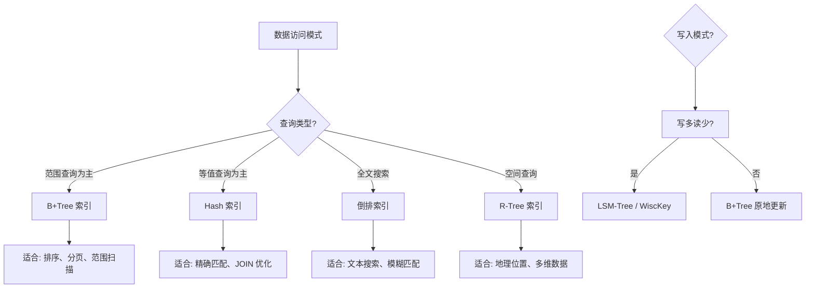
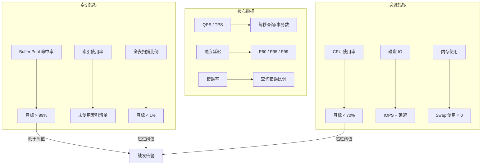
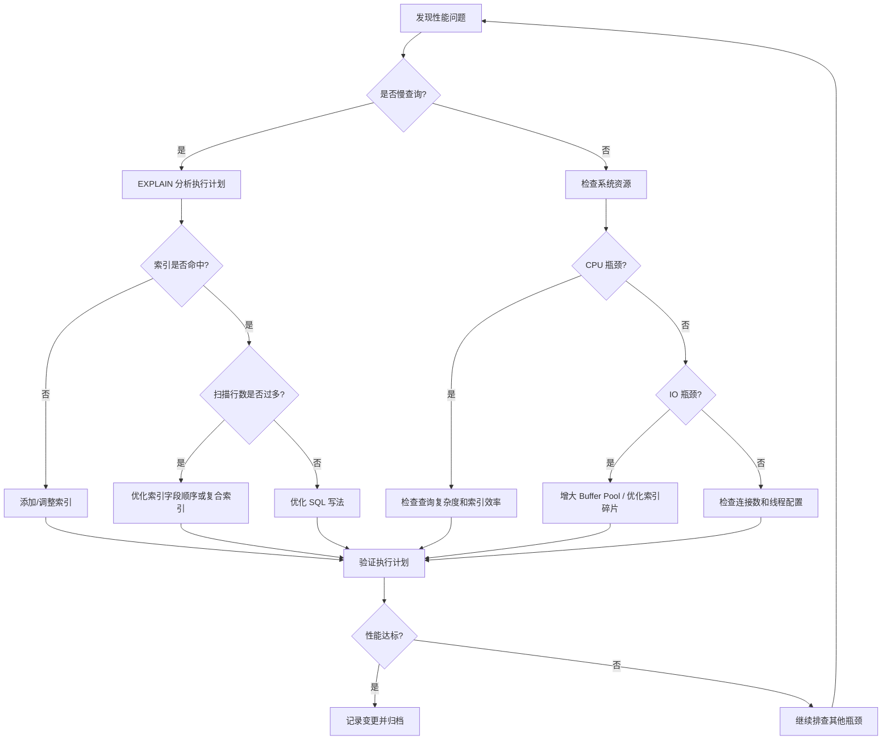

## 索引性能优化清单

索引是数据库性能的基石，但索引本身也需要精心设计和持续优化。一份系统化的优化清单能帮助开发者在索引设计、查询调优、配置管理和运维监控等各环节不遗漏关键动作。

本清单按照「设计→调优→配置→监控→运维→基准测试」的顺序组织，覆盖从建表到日常运营的全生命周期。每一项都附带具体的检查命令、参考阈值和操作示例，可以直接落地执行。

---

### 一、索引设计阶段

索引设计的质量决定了系统的性能上限。在建表和初期开发阶段做好以下检查，能避免后期大量的返工。

#### 1.1 确认索引覆盖查询模式

每个索引都应该有明确的查询场景。建索引前必须回答：这个索引服务于哪些查询？如果回答不清楚，说明对业务查询模式的分析还不够深入。

```sql
-- 错误做法：盲目为每个字段都建索引
CREATE INDEX idx_col_a ON orders(col_a);
CREATE INDEX idx_col_b ON orders(col_b);
CREATE INDEX idx_col_c ON orders(col_c);

-- 正确做法：分析实际查询模式后建索引
-- 场景1：按用户查订单（覆盖 95% 的查询）
CREATE INDEX idx_user_time ON orders(user_id, created_at);

-- 场景2：按状态筛选待处理订单（覆盖 3% 的查询）
CREATE INDEX idx_status_priority ON orders(status, priority, created_at);

-- 场景3：按用户+状态+时间范围的复合查询（覆盖 2% 的后台任务）
CREATE INDEX idx_user_status_time ON orders(user_id, status, created_at);
```

**查询模式分析方法：**

在生产环境中，通过慢查询日志和 `performance_schema` 采集真实查询负载：

```sql
-- 从 performance_schema 获取高频查询 Top 20（MySQL 8.0+）
SELECT
    digest_text AS query_pattern,
    count_star AS exec_count,
    ROUND(avg_timer_wait / 1000000000, 2) AS avg_latency_ms,
    sum_rows_examined AS total_rows_scanned,
    sum_rows_sent AS total_rows_returned
FROM performance_schema.events_statements_summary_by_digest
WHERE digest_text LIKE 'SELECT%'
ORDER BY count_star DESC
LIMIT 20;
```

**检查要点：**

| 检查项 | 说明 | 常见问题 |
|--------|------|----------|
| 查询频率匹配 | 高频查询是否都有对应索引 | 慢查询日志中反复出现的无索引查询 |
| 字段顺序匹配 | 复合索引的字段顺序是否匹配查询条件 | WHERE 条件顺序与索引字段顺序不一致 |
| 覆盖索引利用 | 是否可以通过覆盖索引避免回表 | SELECT 的字段未被索引包含，导致额外 IO |
| 排序利用 | ORDER BY 字段是否在索引中 | 排序字段不在索引内导致 filesort |
| 分组利用 | GROUP BY 字段是否在索引中 | 分组操作触发临时表或 filesort |

#### 1.2 评估索引类型选择

不同索引结构适用于不同的数据特征和访问模式。选型不当会导致事倍功半。



**索引类型选型清单：**

| 索引类型 | 适用场景 | 时间复杂度 | 不适用场景 | 典型引擎/组件 |
|----------|---------|-----------|-----------|--------------|
| B+Tree | 范围查询、排序、分页、前缀匹配 | O(log N) | 全文搜索、高基数精确匹配 | InnoDB 聚簇索引 |
| Hash | 精确等值查询（`=`, `IN`） | O(1) | 范围查询、排序、前缀匹配 | Memory 引擎、InnoDB 自适应哈希 |
| FULLTEXT | 自然语言文本搜索 | 约 O(log N) | 精确匹配、结构化查询 | MySQL FULLTEXT、Elasticsearch |
| R-Tree | GIS 地理位置查询、多维范围 | O(log N) | 一维数据、文本查询 | InnoDB 空间索引 |
| 倒排索引 | 关键词搜索、多条件全文检索 | O(词项数) | 模糊匹配、前缀匹配 | Elasticsearch、Lucene |
| LSM-Tree | 写密集型、时序数据、日志追加 | O(log N) | 频繁更新、随机读 | RocksDB、LevelDB、TiKV |

**关键决策依据：**

- **OLTP 场景**（高并发读写、小事务）：B+Tree 是默认选择，InnoDB 聚簇索引天然支持主键查询
- **OLAP 场景**（大批量分析查询）：考虑列式存储索引（Clickhouse）或物化视图
- **搜索引擎场景**：倒排索引是核心，MySQL FULLTEXT 适合简单场景，复杂需求用 Elasticsearch
- **时序数据**：写入量极大时考虑 LSM-Tree 引擎（如 InfluxDB、TimescaleDB 的压缩段）

#### 1.3 复合索引设计规则

复合索引的字段顺序直接影响索引效率。遵循「等值在前、范围在后、排序优先」的原则。

```sql
-- 查询模式: WHERE user_id = ? AND status = ? AND created_at > ? ORDER BY created_at
-- 最优索引设计
CREATE INDEX idx_user_status_time ON orders(user_id, status, created_at);

-- 字段顺序解析:
-- 第1列 user_id: 等值查询，区分度最高（可过滤 99% 数据）
-- 第2列 status: 等值查询，进一步缩小范围
-- 第3列 created_at: 范围查询 + 排序，放在最后
```

**复合索引设计检查清单：**

**1. 区分度（Cardinality）：** 高区分度字段放在索引前面。用以下 SQL 评估：

```sql
-- 计算字段区分度（值越接近 1 越好）
SELECT
    COUNT(DISTINCT user_id) / COUNT(*) AS user_selectivity,
    COUNT(DISTINCT status) / COUNT(*) AS status_selectivity,
    COUNT(DISTINCT created_at) / COUNT(*) AS time_selectivity
FROM orders;
-- 结果示例: user_selectivity=0.95, status_selectivity=0.003, time_selectivity=0.98
-- user_id 区分度最高，应放在索引最前面
```

> **注意：** 区分度低的字段（如 `gender` 只有 M/F 两种值，区分度约 0.5）单独建索引几乎无用，但放在复合索引的靠前位置可以帮助缩小扫描范围。

**2. 最左前缀原则：** 复合索引从左到右依次匹配。`INDEX(a, b, c)` 可以服务于 `a`、`a,b`、`a,b,c` 的查询，但不能直接服务于 `b,c`（跳过了 a）。实际效果如下：

| 查询 WHERE 条件 | INDEX(a,b,c) 能否使用 | 使用的前缀长度 |
|-----------------|----------------------|---------------|
| `a = ?` | ✅ | 1 列 |
| `a = ? AND b = ?` | ✅ | 2 列 |
| `a = ? AND b = ? AND c = ?` | ✅ | 3 列 |
| `b = ?` | ❌ | 无 |
| `b = ? AND c = ?` | ❌ | 无 |
| `a = ? AND c = ?` | ✅（仅用 a） | 1 列 |
| `a = ? AND b > ? AND c = ?` | ✅（a + b 范围，c 无法过滤） | 2 列 |

**3. 范围查询置后：** 范围查询（`>`, `<`, `BETWEEN`, `LIKE 'abc%'`）后面的字段无法利用索引进行过滤。因此范围查询字段应放在复合索引的最后。

**4. 避免冗余索引：** 如果已有 `INDEX(a, b)`，则 `INDEX(a)` 是冗余的（前者已包含后者的能力）。定期清理冗余索引可以减少写入开销。

```sql
-- 查找冗余索引（MySQL 8.0+ 推荐方式：sys schema）
SELECT * FROM sys.schema_redundant_indexes
WHERE table_schema = 'your_database';

-- 查找重复索引（完全相同的索引）
SELECT * FROM sys.schema_duplicate_indexes
WHERE table_schema = 'your_database';

-- 传统方式：从 information_schema 查找冗余索引
SELECT
    a.TABLE_SCHEMA,
    a.TABLE_NAME,
    a.INDEX_NAME AS redundant_index,
    a.COLUMN_NAME AS redundant_columns,
    b.INDEX_NAME AS covering_index,
    b.COLUMN_NAME AS covering_columns
FROM information_schema.STATISTICS a
JOIN information_schema.STATISTICS b
  ON a.TABLE_SCHEMA = b.TABLE_SCHEMA
  AND a.TABLE_NAME = b.TABLE_NAME
  AND a.SEQ_IN_INDEX = 1
  AND b.SEQ_IN_INDEX = 1
  AND a.INDEX_NAME != b.INDEX_NAME
  AND a.COLUMN_NAME = b.COLUMN_NAME
WHERE a.INDEX_NAME IN (
    SELECT INDEX_NAME FROM information_schema.STATISTICS
    GROUP BY TABLE_SCHEMA, TABLE_NAME, INDEX_NAME
    HAVING COUNT(*) > 1
)
ORDER BY a.TABLE_NAME;
```

#### 1.4 控制索引数量

索引不是越多越好。每个索引都会带来额外的写入开销、存储空间和维护成本。

**索引数量指导原则：**

| 表数据量 | 建议索引数量 | 说明 |
|----------|-------------|------|
| < 1万行 | 2-3个 | 小表全表扫描可能比走索引更快（避免随机 IO） |
| 1万-100万行 | 3-5个 | 根据查询模式精准建索引 |
| 100万-1亿行 | 4-8个 | 每个索引必须有明确场景，定期审查 |
| > 1亿行 | 5-10个 | 考虑分区、分库分表减轻单表索引压力 |

**单表索引写入成本估算：**

索引写入成本 ∝ N × K × log(M) / log(B)

其中:
  N = 每秒写入行数
  K = 索引数量
  M = 表总行数
  B = B+Tree 分支因子（通常 100-500）

示例：
  1000万行的表，5个索引，每秒写入 1000 行
  每次写入需要约 5 × log(10,000,000) / log(200) ≈ 5 × 3.7 ≈ 18.5 次页访问
  即每秒产生约 18,500 次随机 IO

**索引过多的直接代价：**

- **写入放大：** 每条 INSERT/UPDATE/DELETE 需要同步更新所有索引，写入吞吐量下降 30%-70%
- **存储膨胀：** 索引通常占表总存储的 50%-200%，每个冗余索引都在浪费磁盘和内存
- **优化器干扰：** 索引越多，优化器选择错误索引的概率越大，尤其是低选择性索引

---

### 二、查询调优阶段

索引设计好之后，SQL 写法决定了索引能否被有效利用。

#### 2.1 EXPLAIN 执行计划审查

每条核心查询上线前都必须用 EXPLAIN 审查执行计划，确保索引被正确使用。

```sql
-- 审查执行计划（MySQL 8.0.18+ 推荐 EXPLAIN ANALYZE，会实际执行并返回真实耗时）
EXPLAIN ANALYZE
SELECT o.id, o.amount, u.name
FROM orders o
JOIN users u ON o.user_id = u.id
WHERE o.user_id = 12345
  AND o.status = 'pending'
ORDER BY o.created_at DESC
LIMIT 10;
```

**EXPLAIN 结果审查清单：**

| 检查项 | 理想状态 | 警告信号 | 处理方式 |
|--------|---------|---------|---------|
| type 列 | ref / eq_ref / const / range | ALL（全表扫描） | 检查索引是否存在、是否被使用 |
| key 列 | 期望的索引名 | NULL（未命中索引） | 添加或调整索引 |
| rows 列 | 接近实际返回行数 | 远大于返回行数（如预估 10万但只返回 10 行） | 索引区分度不够，调整字段顺序 |
| Extra 列 | Using index（覆盖索引） | Using filesort / Using temporary | 优化索引或 SQL 写法 |
| filtered 列 | > 80% | < 10% | 索引过滤效率低，考虑调整 |

**type 列值的含义与优先级（从好到差）：**

const / system  → 主键或唯一索引等值查询，最快（O(1)）
eq_ref          → JOIN 时被驱动表用主键/唯一索引匹配，每次命中一行
ref             → 非唯一索引等值查询，可能返回多行
range           → 索引范围扫描（BETWEEN, >, <, IN）
index           → 全索引扫描（遍历索引树但不读表数据）
ALL             → 全表扫描，最差，必须优化

#### 2.2 避免索引失效的写法

以下 SQL 写法会导致索引失效，必须在代码审查中严格检查：

```sql
-- ❌ 索引失效写法及原因

-- 1. 对索引列使用函数
WHERE YEAR(created_at) = 2024           -- 索引失效：函数破坏了索引有序性
WHERE created_at >= '2024-01-01'        -- ✅ 改用范围查询
  AND created_at < '2025-01-01'

-- 2. 对索引列进行运算
WHERE id + 1 = 100                      -- 索引失效：对索引列做了加法
WHERE id = 99                           -- ✅ 将运算移到常量侧

-- 3. 隐式类型转换
WHERE phone = 13800138000               -- phone 是 VARCHAR，传入 INT 导致隐式转换
WHERE phone = '13800138000'             -- ✅ 类型匹配

-- 4. LIKE 左模糊
WHERE name LIKE '%张'                   -- 索引失效：左模糊无法利用 B+Tree 的有序性
WHERE name LIKE '张%'                   -- ✅ 右模糊可用索引前缀匹配

-- 5. OR 连接不同索引列
WHERE user_id = 1 OR status = 'paid'    -- 通常导致全表扫描
-- ✅ 改写为 UNION（每个子查询各自走索引）
SELECT * FROM orders WHERE user_id = 1
UNION
SELECT * FROM orders WHERE status = 'paid' AND user_id != 1;

-- 6. NOT IN / NOT EXISTS 导致全表扫描
WHERE user_id NOT IN (SELECT id FROM blacklist)
-- ✅ 改用 LEFT JOIN IS NULL
SELECT o.* FROM orders o
LEFT JOIN blacklist b ON o.user_id = b.id
WHERE b.id IS NULL;

-- 7. IS NULL / IS NOT NULL（取决于数据分布）
WHERE deleted_at IS NOT NULL            -- 如果 NULL 占比极低（<5%），可用索引
-- 如果 NULL 占比高（>30%），优化器会放弃索引
-- ✅ 用默认值替代 NULL
WHERE deleted_at = 0                    -- 0 表示未删除

-- 8. != / <> 条件
WHERE status != 'deleted'               -- 如果 'deleted' 占比 <30%，可用索引
-- 如果 deleted 状态只占 5%，!= 反而匹配 95% 数据，优化器放弃索引
-- ✅ 改为正向查询
WHERE status IN ('pending', 'paid', 'shipped')
```

**索引失效速查表：**

| 失效场景 | 原因 | 修复方式 |
|----------|------|---------|
| `WHERE YEAR(col) = 2024` | 函数破坏索引有序性 | 改为范围查询 `col >= '2024-01-01'` |
| `WHERE col + 1 = 100` | 列上运算导致无法走索引 | 运算移到常量侧 `col = 99` |
| `WHERE var_col = 123` | 隐式类型转换 | 参数类型与列类型匹配 |
| `WHERE col LIKE '%abc'` | 左模糊无法利用 B+Tree | 改为右模糊或全文索引 |
| `WHERE a = 1 OR b = 2` | OR 跨不同索引列 | 改为 UNION 或合并索引 |
| `WHERE col NOT IN (...)` | 否定条件通常走全表 | 改为 LEFT JOIN IS NULL |
| `WHERE indexed_col != val` | 不等于匹配大部分行时优化器放弃 | 改为正向 IN 查询 |

#### 2.3 分页查询优化

深分页是索引性能的常见杀手。当 `OFFSET` 很大时，数据库需要先扫描跳过的所有行，然后丢弃，造成大量无效 IO。

```sql
-- ❌ 深分页：OFFSET=100000 时需要扫描 100010 行
-- 实测耗时约 1.2 秒（InnoDB, 1000万行表）
SELECT * FROM orders
WHERE user_id = 123
ORDER BY id
LIMIT 10 OFFSET 100000;

-- ✅ 方案1：游标分页（推荐，性能最优）
-- 利用上一页最后一条记录的 ID 作为起点
-- 实测耗时约 0.003 秒（无论翻到第几页）
-- 第一页
SELECT * FROM orders
WHERE user_id = 123
ORDER BY id
LIMIT 10;
-- 假设最后一条 id = 100010

-- 后续页
SELECT * FROM orders
WHERE user_id = 123 AND id > 100010
ORDER BY id
LIMIT 10;

-- ✅ 方案2：延迟关联（适合需要跳页的场景）
-- 先在覆盖索引中定位 ID，再回表取完整数据
-- 实测耗时约 0.15 秒（比纯 OFFSET 快 8 倍）
SELECT o.* FROM orders o
INNER JOIN (
    SELECT id FROM orders
    WHERE user_id = 123
    ORDER BY id
    LIMIT 10 OFFSET 100000
) t ON o.id = t.id;

-- ✅ 方案3：书签法（适合固定排序条件）
-- 记住上次查询的最大值，直接定位
-- 需要应用层维护状态
SELECT * FROM orders
WHERE user_id = 123
  AND created_at <= '2024-06-01 12:00:00'  -- 上次查询的最后一条时间
ORDER BY created_at DESC
LIMIT 10;
```

**分页方案对比：**

| 方案 | 适用场景 | 性能 | 优点 | 缺点 |
|------|---------|------|------|------|
| OFFSET LIMIT | 小数据量、浅分页（<1000） | 随偏移量线性下降 | 实现简单 | 深分页 O(N) 扫描 |
| 游标分页 | 无限滚动、流式数据 | O(log N) 恒定 | 性能稳定，支持实时数据 | 不支持跳页 |
| 延迟关联 | 需要跳页 + 深分页 | O(log N) + 回表 | 性能远优于纯 OFFSET | SQL 较复杂 |
| 书签法 | 后台管理列表 | O(log N) 恒定 | 简单高效 | 需要应用层维护 |

#### 2.4 JOIN 查询优化

JOIN 的性能很大程度上取决于被驱动表（右侧表）的关联字段是否有索引。

```sql
-- 核心原则：被驱动表的 JOIN 字段必须有索引

-- 小表驱动大表
-- MySQL 优化器通常会自动选择小表作为驱动表
-- 但可以通过 STRAIGHT_JOIN 强制指定
SELECT STRAIGHT_JOIN o.id, u.name, oi.product_name
FROM users u                    -- 驱动表（10万行，小表）
JOIN orders o ON o.user_id = u.id           -- 被驱动表（1000万行），user_id 必须有索引
JOIN order_items oi ON oi.order_id = o.id;  -- 被驱动表（5000万行），order_id 必须有索引

-- MySQL 8.0.18+ Hash Join 优化
-- MySQL 8.0.18 起，对于无索引的等值 JOIN，优化器自动使用 Hash Join
-- 替代了原来的 Block Nested Loop，性能提升 10-100 倍
-- 但仍建议为 JOIN 字段建索引（Hash Join 内存开销大）

-- 控制 Hash Join 的内存使用
SET SESSION join_buffer_size = 256 * 1024 * 1024;  -- 256MB
```

**JOIN 性能检查清单：**

| 检查项 | 说明 | 处理方式 |
|--------|------|---------|
| 被驱动表索引 | JOIN 字段是否有索引 | 为被驱动表的关联字段建索引 |
| 驱动表选择 | 是否由小表驱动大表 | 检查 EXPLAIN 中的表顺序，必要时 STRAIGHT_JOIN |
| JOIN 缓冲区 | 是否频繁使用 Block Nested Loop | 增大 join_buffer_size 或添加索引 |
| 多表 JOIN 深度 | 是否 JOIN 超过 4 张表 | 考虑拆分查询或反范式化 |
| JOIN 类型 | LEFT JOIN 是否必要 | 非必须时改用 INNER JOIN（优化空间更大） |

---

### 三、配置调优阶段

#### 3.1 InnoDB Buffer Pool 配置

Buffer Pool 是 InnoDB 最重要的内存结构，直接决定了数据页和索引页的缓存命中率。

```ini
# my.cnf 核心配置

[mysqld]
# Buffer Pool 大小：建议设置为物理内存的 60%-75%
# 例：16GB 内存的服务器，设置 10-12GB
innodb_buffer_pool_size = 12G

# Buffer Pool 实例数：减少内部锁竞争
# MySQL 5.7+: 每个实例独立管理，高并发下减少 mutex 竞争
# 经验：每实例至少 1GB，总大小 / 1GB = 实例数
innodb_buffer_pool_instances = 12

# Buffer Pool 预热：重启后自动恢复缓存状态
# 避免冷启动后大量磁盘 IO
innodb_buffer_pool_dump_at_shutdown = ON
innodb_buffer_pool_load_at_startup = ON
innodb_buffer_pool_dump_pct = 40         # 关闭时转储 40% 最热的页

# 日志缓冲区
innodb_log_buffer_size = 64M             # 大事务场景可增大到 256M

# Redo Log 文件大小：影响写入性能和崩溃恢复时间
# 建议设置为 1-2 小时的写入量
innodb_log_file_size = 2G
innodb_log_files_in_group = 2

# 刷新策略
innodb_flush_log_at_trx_commit = 1      # 1=每次提交刷盘（最安全）
                                         # 2=每秒刷盘（性能更好，丢失1秒数据）
                                         # 0=由OS决定（最快，风险最大）
innodb_flush_method = O_DIRECT           # 绕过OS缓存，减少双缓存

# MySQL 8.0.30+ 动态调整 Buffer Pool（无需重启）
SET GLOBAL innodb_buffer_pool_size = 16 * 1024 * 1024 * 1024;  -- 动态调整到 16GB
```

**Buffer Pool 关键监控：**

```sql
-- 查看 Buffer Pool 命中率（应 > 99%）
SELECT
    (1 - (
        (SELECT VARIABLE_VALUE FROM performance_schema.global_status
         WHERE VARIABLE_NAME = 'Innodb_buffer_pool_reads') /
        (SELECT VARIABLE_VALUE FROM performance_schema.global_status
         WHERE VARIABLE_NAME = 'Innodb_buffer_pool_read_requests')
    )) * 100 AS hit_rate_pct;
-- 命中率 < 99% 需要增大 buffer_pool_size 或优化查询减少数据读取量

-- 查看 Buffer Pool 各状态的页数量
SHOW ENGINE INNODB STATUS\G
-- 在 BUFFER POOL AND MEMORY 部分查看：
--   Total pages = 总页数
--   Free pages = 空闲页（如果为 0 说明 Buffer Pool 不够）
--   Database pages = 数据页
--   Modified db pages = 脏页数量

-- 脏页比例监控（过高会触发强制刷盘，影响写入性能）
SELECT
    (SELECT VARIABLE_VALUE FROM performance_schema.global_status
     WHERE VARIABLE_NAME = 'Innodb_buffer_pool_pages_dirty') /
    (SELECT VARIABLE_VALUE FROM performance_schema.global_status
     WHERE VARIABLE_NAME = 'Innodb_buffer_pool_pages_total') * 100
    AS dirty_page_pct;
-- 目标: < 75%，超过时增加 IO 线程
```

#### 3.2 连接池与线程配置

```ini
[mysqld]
# 最大连接数：根据业务并发量设置
# 经验公式: max_connections = (CPU核数 * 2) + 有效磁盘数
max_connections = 500

# 每个连接的线程缓存（减少线程创建/销毁开销）
thread_cache_size = 64

# 表缓存（避免频繁打开/关闭表文件）
# 建议值 = max_connections * 2 + 活跃表数量
table_open_cache = 4096
table_open_cache_instances = 16

# 每连接独立分配的缓冲区（注意：总内存 = 值 × max_connections）
sort_buffer_size = 4M        # 排序缓冲，过大浪费内存
join_buffer_size = 4M        # JOIN 缓冲
read_buffer_size = 2M        # 顺序读缓冲
read_rnd_buffer_size = 8M    # 随机读缓冲（用于 ORDER BY 后的回表）

# 内存临时表大小限制
tmp_table_size = 64M
max_heap_table_size = 64M

# 连接超时设置（释放空闲连接）
wait_timeout = 600           # 非交互连接超时（秒）
interactive_timeout = 1800   # 交互连接超时（秒）
```

**内存使用估算：**

每连接内存 ≈ sort_buffer + join_buffer + read_buffer + read_rnd_buffer + 线程栈
          ≈ 4M + 4M + 2M + 8M + 256KB ≈ 18.25MB

500 连接的总内存 ≈ 500 × 18.25MB ≈ 9.1GB

注意：这还不包括 Buffer Pool、连接缓冲区等全局内存
建议预留: Buffer Pool + (每连接内存 × 并发数) < 物理内存 × 85%

#### 3.3 自适应哈希索引 (AHI)

InnoDB 的自适应哈希索引可以自动为频繁访问的 B+Tree 页面建立哈希索引，加速等值查询。

```sql
-- 查看 AHI 命中率
SHOW GLOBAL STATUS LIKE 'Innodb_adaptive_hash%';

-- 关键指标：
-- Innodb_adaptive_hash_hash_searches: 哽希搜索次数（命中 AHI）
-- Innodb_adaptive_hash_non_hash_searches: 非哈希搜索次数（未命中 AHI）
-- 命中率 = hash_searches / (hash_searches + non_hash_searches)

-- AHI 决策指南：
-- 命中率 > 95%: 保持开启，AHI 效果显著
-- 命中率 80%-95%: 观察，根据业务变化调整
-- 命中率 < 80%: 考虑关闭（可能增加 B+Tree 锁竞争）
-- 高并发写入场景（>5000 TPS）: 可能需要关闭（哈希索引本身有锁竞争）

-- 动态开关 AHI（无需重启）
SET GLOBAL innodb_adaptive_hash_index = ON;
SET GLOBAL innodb_adaptive_hash_index = OFF;

-- MySQL 8.0+ 支持分区 AHI（减少锁竞争）
-- 默认 8 个分区，可通过 innodb_adaptive_hash_index_parts 调整
SET GLOBAL innodb_adaptive_hash_index_parts = 16;  -- 高并发场景增大分区数
```

#### 3.4 优化器配置

```ini
[mysqld]
# 优化器统计采样精度（影响索引选择的准确性）
# 默认 20 页，复杂查询或数据分布不均匀时可增大到 100-200
innodb_stats_persistent_sample_pages = 20

# 优化器开关
optimizer_switch = 'index_merge=on'                # 允许索引合并（对多个单列索引做 UNION）
optimizer_switch = 'index_condition_pushdown=on'   # ICP 索引条件下推（在存储引擎层过滤）
optimizer_switch = 'mrr=on'                        # Multi-Range Read（优化回表的随机 IO）
optimizer_switch = 'batched_key_access=on'         # 批量键访问（配合 MRR，JOIN 场景优化）

# MySQL 8.0+ 新增优化器特性
optimizer_switch = 'hash_join=on'                  # Hash Join（无索引等值 JOIN 优化）
optimizer_switch = 'skip_scan=on'                  # Skip Scan（跳过复合索引的前缀列）
```

**MySQL 8.0 直方图统计（Histogram）：**

当数据分布不均匀时，优化器可能选错索引。直方图可以帮助优化器准确了解数据分布。

```sql
-- 为 status 字段创建等宽直方图（推荐方式）
ANALYZE TABLE orders UPDATE HISTOGRAM ON status WITH 256 BUCKETS;

-- 为 created_at 字段创建等高直方图（适合倾斜数据）
ANALYZE TABLE orders UPDATE HISTOGRAM ON created_at WITH 256 BUCKETS;

-- 查看直方图信息
SELECT
    column_name,
    histogram,
    num_buckets
FROM information_schema.COLUMN_STATISTICS
WHERE table_name = 'orders';

-- 删除直方图（不再需要时）
ANALYZE TABLE orders DROP HISTOGRAM ON status;
```

> **直方图使用场景：** 当 WHERE 条件字段的值分布极不均匀时（如 99% 的订单 status='completed'，1% 为 'pending'），没有直方图的优化器可能错误地估计扫描行数，选择低效索引。直方图统计在 MySQL 8.0+ 中是解决此类问题的标准方案。

---

### 四、监控与诊断

#### 4.1 慢查询监控

```sql
-- 开启慢查询日志（建议生产环境始终开启）
SET GLOBAL slow_query_log = ON;
SET GLOBAL slow_query_log_file = '/var/log/mysql/slow.log';
SET GLOBAL long_query_time = 1;                          -- 超过 1 秒记录为慢查询
SET GLOBAL log_queries_not_using_indexes = ON;           -- 记录未使用索引的查询
SET GLOBAL log_slow_admin_statements = ON;               -- 记录管理语句的慢查询
SET GLOBAL log_slow_replica_statements = ON;             -- 从库也记录慢查询

-- 在 my.cnf 中持久化配置
-- slow_query_log = ON
-- slow_query_log_file = /var/log/mysql/slow.log
-- long_query_time = 1
-- log_queries_not_using_indexes = ON
```

**慢查询分析工具：**

```bash
# mysqldumpslow: MySQL 自带，按模式聚合慢查询

# 按查询次数排序，取前 10（找出最频繁的慢查询）
mysqldumpslow -s c -t 10 /var/log/mysql/slow.log

# 按平均耗时排序，取前 10（找出最慢的查询模式）
mysqldumpslow -s at -t 10 /var/log/mysql/slow.log

# 按锁等待时间排序（找出锁竞争最严重的查询）
mysqldumpslow -s l -t 10 /var/log/mysql/slow.log

# pt-query-digest: Percona Toolkit，功能更强
# 安装: apt install percona-toolkit
pt-query-digest /var/log/mysql/slow.log > /tmp/slow_report.txt

# 只分析最近 1 小时的慢查询
pt-query-digest --since '1h' /var/log/mysql/slow.log
```

#### 4.2 索引使用率监控

```sql
-- 查看索引的使用统计（MySQL 8.0+）
SELECT
    object_schema,
    object_name AS table_name,
    index_name,
    count_star AS total_access,
    count_read AS reads,
    count_write AS writes,
    count_fetch AS fetches
FROM performance_schema.table_io_waits_summary_by_index_usage
WHERE object_schema NOT IN ('mysql', 'performance_schema', 'sys')
ORDER BY count_star DESC
LIMIT 20;

-- 查找从未使用的索引（候选删除对象）
SELECT
    object_schema,
    object_name AS table_name,
    index_name
FROM performance_schema.table_io_waits_summary_by_index_usage
WHERE index_name IS NOT NULL
  AND index_name != 'PRIMARY'
  AND count_star = 0
  AND object_schema NOT IN ('mysql', 'performance_schema', 'sys')
ORDER BY object_schema, object_name;

-- ⚠️ 注意：performance_schema 启动后才开始计数
-- 如果服务器刚重启，需要等待足够长时间再判断索引是否"从未使用"
-- 建议至少观察 1 个完整业务周期（如 7 天）再决定删除
```

#### 4.3 隐形索引（Invisible Index）—— 安全的索引删除测试

MySQL 5.7.8+ 支持隐形索引：索引对优化器不可见，但仍然维护。这是测试"删除索引是否安全"的最佳方式。

```sql
-- 将索引设为隐形（优化器不再使用，但不删除）
ALTER TABLE orders ALTER INDEX idx_status INVISIBLE;

-- 测试：用 EXPLAIN 确认查询仍能高效执行
EXPLAIN SELECT * FROM orders WHERE status = 'pending';
-- 如果 type 变为 ALL（全表扫描），说明该索引是必需的，不能删除

-- 测试通过后，正式删除索引
ALTER TABLE orders DROP INDEX idx_status;

-- 如果测试发现问题，恢复索引
ALTER TABLE orders ALTER INDEX idx_status VISIBLE;
```

> **为什么推荐隐形索引而非直接 DROP：**
> 直接删除索引后，如果发现查询性能下降，需要重新创建索引（大表可能需要数小时）。隐形索引可以零风险测试，发现问题秒级恢复。生产环境删除索引的最佳实践：先 INVISIBLE 观察 1-2 周 → 确认无影响 → 再 DROP。

#### 4.4 索引碎片检测与清理

索引碎片会导致查询扫描更多的数据页，降低缓存命中率。

```sql
-- 检测表碎片率
SELECT
    TABLE_NAME,
    ROUND(DATA_LENGTH / 1024 / 1024, 2) AS data_size_mb,
    ROUND(INDEX_LENGTH / 1024 / 1024, 2) AS index_size_mb,
    ROUND(DATA_FREE / 1024 / 1024, 2) AS free_space_mb,
    ROUND(DATA_FREE / (DATA_LENGTH + INDEX_LENGTH + 1) * 100, 2) AS frag_pct
FROM information_schema.TABLES
WHERE TABLE_SCHEMA = 'your_database'
  AND DATA_LENGTH > 0
HAVING frag_pct > 10                  -- 碎片率超过 10% 建议整理
ORDER BY frag_pct DESC;
```

**碎片清理方式对比：**

| 方式 | 命令 | 锁定级别 | 适用场景 | 耗时参考 |
|------|------|---------|---------|---------|
| ALTER TABLE | `ALTER TABLE t ENGINE=InnoDB;` | 表级锁 | 离线维护窗口 | 中等 |
| OPTIMIZE TABLE | `OPTIMIZE TABLE t;` | 表级锁 | 小表或维护窗口 | 中等 |
| 在线 DDL | `ALTER TABLE t ENGINE=InnoDB, ALGORITHM=INPLACE, LOCK=NONE;` | 不阻塞 DML | 生产环境大表 | 较长 |
| pt-online-schema-change | `pt-online-schema-change --alter "ENGINE=InnoDB" D=db,t=orders` | 不阻塞 DML | 超大表、需要精确控制 | 最长但最安全 |

#### 4.5 实时性能仪表盘

```bash
# 一目了然的系统状态监控脚本
watch -n 2 '
echo "=== MySQL 连接 ===" &amp;&amp;
mysql -e "SHOW STATUS LIKE \"Threads_connected\"" 2>/dev/null | tail -1 &amp;&amp;
echo "=== InnoDB Buffer Pool ===" &amp;&amp;
mysql -e "SHOW STATUS LIKE \"Innodb_buffer_pool_read%\"" 2>/dev/null &amp;&amp;
echo "=== 活跃查询 ===" &amp;&amp;
mysql -e "SELECT COUNT(*) AS active_queries FROM information_schema.processlist WHERE command != \"Sleep\"" 2>/dev/null | tail -1
'
```

**关键监控指标看板（Grafana/Prometheus）：**



**推荐监控工具组合：**

| 工具 | 用途 | 特点 |
|------|------|------|
| Prometheus + Grafana | 指标采集与可视化 | 开源，社区活跃，MySQL Exporter 支持完善 |
| Percona Monitoring (PMM) | 专业 MySQL 监控 | 开箱即用的 MySQL 监控面板，含索引分析 |
| pt-summary / pt-mysql-summary | 快速诊断报告 | 一条命令获取完整 MySQL 状态摘要 |
| MySQL Enterprise Monitor | 官方监控 | 商业版，含索引建议和查询分析 |

---

### 五、运维阶段

#### 5.1 索引变更操作规范

索引变更（CREATE/DROP INDEX）在大表上可能持续数分钟到数小时，必须遵循规范操作流程。

**操作前检查清单：**

```bash
# 1. 确认表当前大小
mysql -e "SELECT
    TABLE_NAME,
    ROUND(DATA_LENGTH/1024/1024) AS data_mb,
    ROUND(INDEX_LENGTH/1024/1024) AS index_mb,
    TABLE_ROWS
FROM information_schema.TABLES
WHERE TABLE_SCHEMA='db' AND TABLE_NAME='orders';"

# 2. 评估变更耗时（InnoDB 按页扫描，每页 16KB）
# 经验公式：耗时(秒) ≈ 表大小(MB) / 50
# 例：500MB 的表 ≈ 10秒，5GB 的表 ≈ 100秒，50GB 的表 ≈ 17分钟

# 3. 检查当前是否有长事务运行（长事务会阻塞 DDL）
mysql -e "SELECT trx_id, trx_state, trx_started,
    TIMESTAMPDIFF(SECOND, trx_started, NOW()) AS running_sec
FROM information_schema.innodb_trx
WHERE TIMESTAMPDIFF(SECOND, trx_started, NOW()) > 60;"

# 4. 检查当前锁等待
mysql -e "SELECT * FROM performance_schema.data_lock_waits;"

# 5. 检查当前复制延迟（从库上操作需注意）
mysql -e "SHOW SLAVE STATUS\G | grep Seconds_Behind"
```

**Online DDL 兼容性矩阵（MySQL 8.0+）：**

| 操作 | ALGORITHM=INPLACE | ALGORITHM=COPY | 原地重建？ | 需要表重建？ |
|------|-------------------|---------------|-----------|------------|
| 添加索引 | ✅ | ✅ | 是 | 否 |
| 删除索引 | ✅ | ✅ | 仅元数据 | 否 |
| 修改索引 | ❌ | ✅ | 否 | 是（全表重建） |
| 添加列 | ✅（不带 BEFORE/AFTER） | ✅ | 是 | 否 |
| 修改列顺序 | ❌ | ✅ | 否 | 是 |
| 修改列类型 | ❌ | ✅ | 否 | 是 |
| 添加 AUTO_INCREMENT | ✅ | ✅ | 是 | 否 |
| 修改 ENUM 值 | ✅ | ✅ | 仅元数据 | 否 |

**安全操作流程：**

```sql
-- 使用 Online DDL（MySQL 5.6+）
-- ALGORITHM=INPLACE: 原地重建，不需要复制全表数据
-- LOCK=NONE: 不阻塞 DML 操作
ALTER TABLE orders
  ADD INDEX idx_new_pattern (col_a, col_b),
  ALGORITHM=INPLACE,
  LOCK=NONE;

-- ⚠️ 如果 ALGORITHM=INPLACE 不支持，会自动回退到 ALGORITHM=COPY
-- 建议显式指定，避免隐式降级
-- 检查 DDL 日志确认实际使用的算法
SHOW PROCESSLIST;  -- 观察 ALTER TABLE 进度
```

#### 5.2 大表索引管理策略

```sql
-- 分区表的索引策略
-- 分区键必须是主键或唯一索引的一部分
ALTER TABLE orders
  PARTITION BY RANGE (YEAR(created_at)) (
    PARTITION p2022 VALUES LESS THAN (2023),
    PARTITION p2023 VALUES LESS THAN (2024),
    PARTITION p2024 VALUES LESS THAN (2025),
    PARTITION pmax VALUES LESS THAN MAXVALUE
  );

-- 分区裁剪：查询带上分区键可以只扫描对应分区
SELECT * FROM orders
WHERE created_at >= '2024-01-01' AND created_at < '2025-01-01'
  AND user_id = 12345;
-- 只扫描 p2024 分区，避免全表扫描
-- 分区裁剪后，索引搜索范围缩小为总数据的 1/N（N=分区数）
```

**大表索引管理最佳实践：**

| 策略 | 适用场景 | 实施方式 |
|------|---------|---------|
| 分区表 | 按时间范围查询为主 | RANGE/LIST 分区 + 分区裁剪 |
| 分库分表 | 单表超过 5000万行 | 按用户 ID/时间哈希分片 |
| 读写分离 | 读多写少 | 从库承担分析查询，主库专注写入 |
| 归档冷数据 | 历史数据不再修改 | 定期归档到历史表/归档库 |

#### 5.3 索引变更回滚预案

每次索引变更都必须准备回滚方案：

```sql
-- 变更前记录当前索引状态（保存为永久表，不要用临时表）
CREATE TABLE IF NOT EXISTS _index_backup (
    backup_date DATETIME DEFAULT CURRENT_TIMESTAMP,
    TABLE_SCHEMA VARCHAR(64),
    TABLE_NAME VARCHAR(64),
    INDEX_NAME VARCHAR(64),
    COLUMN_NAME VARCHAR(64),
    SEQ_IN_INDEX INT,
    INDEX_TYPE VARCHAR(20),
    NON_UNIQUE INT
);

INSERT INTO _index_backup
SELECT
    NOW(),
    TABLE_SCHEMA,
    TABLE_NAME,
    INDEX_NAME,
    COLUMN_NAME,
    SEQ_IN_INDEX,
    INDEX_TYPE,
    NON_UNIQUE
FROM information_schema.STATISTICS
WHERE TABLE_SCHEMA = 'your_db'
  AND TABLE_NAME = 'orders';

-- 如果变更出问题，执行回滚
-- 1. 先删除新增索引
DROP INDEX idx_new_pattern ON orders;

-- 2. 恢复旧索引（从 _index_backup 表读取定义）
-- 注意：需要手动重建，information_schema.STATISTICS 不存储完整 DDL
-- 所以建议在变更前导出完整 CREATE INDEX 语句
```

#### 5.4 索引相关告警规则

```yaml
# Prometheus 告警规则配置示例（alertmanager 格式）

# 1. 全表扫描比例过高（意味着索引缺失或失效）
- alert: FullTableScanHigh
  expr: mysql_global_status_created_tmp_disk_tables / mysql_global_status_created_tmp_tables > 0.5
  for: 5m
  labels:
    severity: warning
  annotations:
    summary: "磁盘临时表比例过高 ({{ $value | humanizePercentage }})"
    description: "可能存在未走索引的查询，请检查慢查询日志"

# 2. 慢查询数量激增
- alert: SlowQuerySpike
  expr: rate(mysql_global_status_slow_queries[5m]) > 10
  for: 3m
  labels:
    severity: critical
  annotations:
    summary: "慢查询速率超过 10/秒"
    description: "请立即排查慢查询日志，可能存在索引失效或数据倾斜"

# 3. Buffer Pool 命中率下降
- alert: BufferPoolHitRateLow
  expr: (1 - mysql_global_status_innodb_buffer_pool_reads / mysql_global_status_innodb_buffer_pool_read_requests) < 0.99
  for: 10m
  labels:
    severity: warning
  annotations:
    summary: "Buffer Pool 命中率低于 99%"
    description: "当前命中率: {{ $value | humanizePercentage }}，建议增大 buffer_pool_size"

# 4. 连接数接近上限
- alert: ConnectionPoolHigh
  expr: mysql_global_status_threads_connected / mysql_global_variables_max_connections > 0.8
  for: 5m
  labels:
    severity: critical
  annotations:
    summary: "MySQL 连接数使用率超过 80%"
    description: "当前连接数: {{ $value | humanizePercentage }}，可能存在连接泄漏"

# 5. 磁盘空间不足（影响索引增长）
- alert: DiskSpaceLow
  expr: (node_filesystem_avail_bytes{mountpoint="/var/lib/mysql"} / node_filesystem_size_bytes{mountpoint="/var/lib/mysql"}) < 0.15
  for: 5m
  labels:
    severity: critical
  annotations:
    summary: "MySQL 数据目录磁盘空间不足 15%"
```

---

### 六、性能基准测试

#### 6.1 建立性能基线

上线前必须建立性能基线，作为后续优化的参照。

```bash
# 使用 sysbench 建立基准

# 准备测试数据（10张表，每表100万行）
sysbench oltp_read_write \
  --mysql-host=localhost \
  --mysql-user=root \
  --tables=10 \
  --table-size=1000000 \
  prepare

# 运行基准测试（32并发，持续5分钟）
sysbench oltp_read_write \
  --mysql-host=localhost \
  --mysql-user=root \
  --tables=10 \
  --table-size=1000000 \
  --threads=32 \
  --time=300 \
  --report-interval=10 \
  run

# 结果解读关键指标：
# QPS (queries per second): 总吞吐量，越高越好
# P95 latency: 95%请求的响应时间，越低越好
# P99 latency: 99%请求的响应时间，尾部延迟
# 错误数: 应为 0，任何错误说明测试配置有问题

# 清理测试数据
sysbench oltp_read_write \
  --mysql-host=localhost \
  --mysql-user=root \
  --tables=10 \
  cleanup
```

#### 6.2 变更前后对比

```bash
# 使用 pt-query-digest 对比变更前后性能

# 1. 清空慢查询日志，采集变更前数据
mysql -e "FLUSH SLOW LOGS;"
sleep 3600  # 等待 1 小时收集足够数据
pt-query-digest /var/log/mysql/slow.log > /tmp/before.txt

# 2. 执行索引变更
# ... 变更操作 ...

# 3. 采集变更后慢查询
sleep 3600  # 等待 1 小时收集足够数据
pt-query-digest /var/log/mysql/slow.log > /tmp/after.txt

# 4. 对比关键查询的性能变化
# 方法：grep 对应的查询摘要，对比 Exec time 和 Rows examine

# 关键对比指标：
# - 每个查询模式的平均耗时变化
# - 每个查询模式的扫描行数变化（Rows examine）
# - 总 QPS 变化
# - 错误率变化
# - 排序/临时表使用变化
```

#### 6.3 回归测试检查清单

每次索引变更后，必须执行以下回归验证：

```bash
# 1. 验证核心查询的 EXPLAIN 计划未发生变化
# 将变更前的 EXPLAIN 结果与变更后对比
mysql -e "EXPLAIN SELECT ..." > /tmp/explain_after.txt
diff /tmp/explain_before.txt /tmp/explain_after.txt

# 2. 运行业务回归测试套件
# 确保所有业务功能正常

# 3. 监控变更后 30 分钟的慢查询数量
watch -n 60 'mysql -e "SHOW STATUS LIKE \"Slow_queries\""'

# 4. 检查复制延迟（如果是从库操作）
mysql -e "SHOW SLAVE STATUS\G" | grep -i delay
```

---

### 七、常见索引优化模式速查表

| 场景 | 问题 | 优化方案 | 预期效果 |
|------|------|---------|---------|
| 等值查询慢 | 全表扫描 | 为 WHERE 条件字段建索引 | 查询时间从秒级降至毫秒级 |
| 排序慢 | filesort | ORDER BY 字段加入索引 | 消除临时排序操作 |
| 分页深 | OFFSET 大 | 改用游标分页或延迟关联 | P99 延迟从秒级降至毫秒级 |
| COUNT 慢 | 全表扫描 | 用缓存/近似值替代，或建覆盖索引 | 响应时间降低 10-100 倍 |
| JOIN 慢 | 被驱动表无索引 | 为 JOIN 关联字段建索引 | JOIN 耗时降低 100 倍以上 |
| 写入慢 | 索引过多 | 合并或删除低价值索引 | 写入吞吐量提升 30%-50% |
| 空间占用大 | 索引碎片 | ALTER TABLE 或 OPTIMIZE TABLE | 磁盘使用减少 20%-40% |
| 内存不足 | Buffer Pool 命中率低 | 增大 buffer_pool_size | 命中率从 95% 提升至 99%+ |
| 锁等待多 | 索引粒度太粗 | 拆分索引，减小锁范围 | 并发写入能力提升 |
| 数据倾斜 | 热点数据集中 | 分区表 + 本地索引 | 均匀分散 IO 压力 |
| 索引选错 | 优化器选择错误索引 | 用直方图统计或 FORCE INDEX | 选择正确索引，性能恢复 |
| 删除索引怕出事 | 不确定索引是否还有用 | 先 INVISIBLE 测试 1-2 周 | 零风险验证 |

---

### 八、MySQL 8.0+ 现代索引特性

MySQL 8.0 引入了多项索引增强特性，充分利用可以显著简化设计。

#### 8.1 降序索引（Descending Index）

MySQL 5.7 及之前，所有索引实际上都是升序存储的，`DESC` 关键字被忽略。MySQL 8.0 终于支持真正的降序索引。

```sql
-- MySQL 8.0+: 真正的降序索引
CREATE INDEX idx_time_desc ON orders(created_at DESC);

-- 适合场景：ORDER BY created_at DESC 的查询
-- 不再需要 filesort，直接从索引尾部向前扫描

-- 混合排序：最新的在前，同时间的按 ID 升序
CREATE INDEX idx_mixed ON orders(created_at DESC, id ASC);
```

#### 8.2 函数索引（Functional Index）

MySQL 8.0.13+ 支持基于表达式的索引，无需创建生成列。

```sql
-- 对表达式建索引（不需要先创建生成列）
CREATE INDEX idx_lower_email ON users ((LOWER(email)));
-- 注意双括号：外层括号是语法要求

-- 对 JSON 字段的路径建索引
CREATE INDEX idx_order_amount ON orders ((CAST(data->>'$.amount' AS UNSIGNED)));

-- 查询时使用相同表达式即可命中索引
SELECT * FROM users WHERE LOWER(email) = 'test@example.com';
EXPLAIN → 使用 idx_lower_email，避免全表扫描

-- 对比 MySQL 5.7 的做法（需要生成列）
ALTER TABLE users ADD COLUMN email_lower VARCHAR(255) AS (LOWER(email)) VIRTUAL;
CREATE INDEX idx_email_lower ON users (email_lower);
-- 函数索引直接省去了生成列，更简洁
```

#### 8.3 不可见索引（Invisible Index）

已在 4.3 节详述。核心要点：`ALTER TABLE t ALTER INDEX idx INVISIBLE` 让索引对优化器不可见但仍维护，是安全测试索引删除的标准方式。

#### 8.4 多值索引（Multi-Valued Index）

MySQL 8.0.17+ 支持对 JSON 数组建索引，用于 `MEMBER OF`、`JSON_CONTAINS`、`JSON_OVERLAPS` 查询。

```sql
-- 对 JSON 数组中的值建多值索引
CREATE TABLE products (
    id INT PRIMARY KEY,
    name VARCHAR(100),
    tags JSON,
    INDEX idx_tags ((CAST(tags AS UNSIGNED ARRAY)))
);

-- 插入数据
INSERT INTO products VALUES (1, '手机', '[1, 3, 5]');
INSERT INTO products VALUES (2, '电脑', '[2, 4, 5]');

-- 使用 MEMBER OF 查询（命中多值索引）
SELECT * FROM products WHERE 5 MEMBER OF (tags);
-- EXPLAIN: 使用 idx_tags 索引
```

---

### 九、优化流程总结



**优化核心原则：**

1. **先诊断后优化**：永远用数据说话，EXPLAIN 和慢查询日志是最可靠的诊断工具
2. **一次只改一个**：每次只做一个变更，然后验证效果。同时做多个变更无法确定哪个有效
3. **监控前置**：变更前建立监控，变更中实时观察，变更后持续跟踪
4. **回滚预案**：每次索引变更都必须有回滚方案，变更前备份索引状态
5. **基准对比**：用 sysbench / pt-query-digest 量化优化效果，避免主观感受
6. **隐形索引优先**：删除索引前先 INVISIBLE 测试，避免不可逆操作
7. **定期审查**：建议每月审查一次慢查询日志和索引使用率

**索引优化是一个持续迭代的过程**——随着业务发展和数据增长，曾经最优的索引策略可能不再适用。建立定期审查机制，持续监控慢查询日志和索引使用率，才能保持系统长期健康运行。
