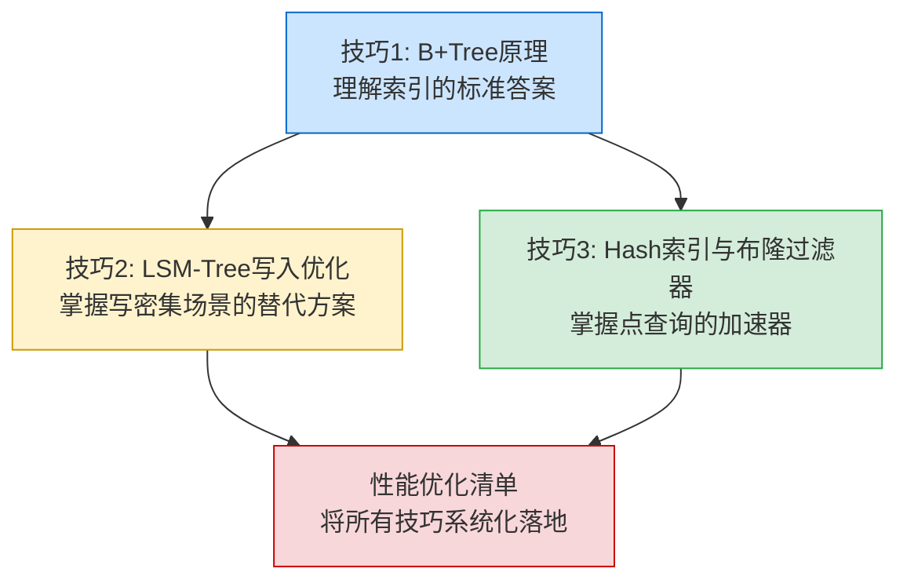
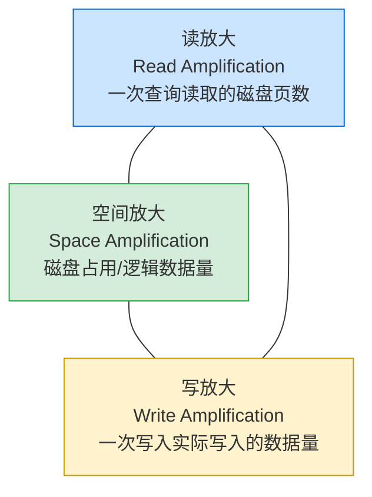
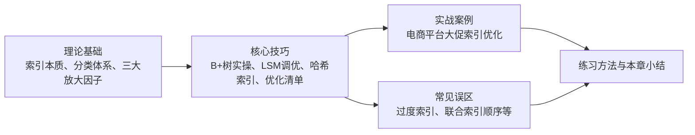

# 核心技巧

> **本节定位**：掌握了索引的理论基础之后，真正的功力体现在工程实操中。本节将理论知识转化为可落地的工程技巧——从B+树的页面布局到LSM树的写入调优，从哈希索引的碰撞处理到布隆过滤器的参数设计，每一个技巧都经过工业级系统的验证。

## 为什么需要这一节

理论告诉你"是什么"和"为什么"，但工程实践中更常遇到的问题是"怎么做"：

- 你知道B+树支持范围查询，但面对一个慢查询时，如何设计索引才能让它走B+树而非全表扫描？
- 你知道LSM树写入快，但写放大达到40倍时，如何将它降到10倍？
- 你知道布隆过滤器能加速查询，但`m/n=10`和`m/n=20`到底差多少，该怎么选？

本节的四个技巧正是围绕这些工程痛点展开：每个技巧从一个具体问题出发，给出完整的原理剖析、配置方案、代码示例和性能数据，让你"看完就能用"。

## 本节内容导航

| 技巧 | 核心问题 | 适用人群 | 关键产出 |
|------|---------|---------|---------|
| [技巧1：B-Tree/B+Tree原理与实操](01-技巧1BTreeBTree原理/) | 如何设计高效索引、理解查询路径 | DBA、后端工程师 | InnoDB页面布局、EXPLAIN解读、索引设计模式 |
| [技巧2：LSM-Tree写入优化](02-技巧2LSMTree写入优化/) | 如何将写入性能压到极限 | 存储系统开发者 | WAL调优、Compaction策略、写放大控制 |
| [技巧3：Hash索引与布隆过滤器](03-技巧3Hash索引与布隆过滤器/) | 如何在点查询场景做到O(1) | 全栈工程师、DBA | 哈希碰撞处理、布隆过滤器参数设计、误判率计算 |
| [索引性能优化清单](04-性能优化清单/) | 如何系统化地管理索引生命周期 | 全员 | 设计→调优→配置→监控→运维的全链路检查清单 |

## 知识脉络

四个技巧之间存在递进和互补关系，建议按以下顺序学习：

**为什么这样安排？**

1. **B+树是基石**：MySQL、PostgreSQL、Oracle等主流关系型数据库都以B+树为核心索引。掌握了B+树的页面布局、查询路径和索引设计，就掌握了80%的索引优化场景。
2. **LSM树是补充**：当B+树的随机写入成为瓶颈时，LSM树通过"写入缓冲 + 后台合并"的策略提供10倍以上的写入提升。掌握LSM树的Compaction策略和写放大控制，是构建写密集系统的关键。
3. **哈希索引和布隆过滤器是加速器**：在点查询场景下，哈希索引提供O(1)的查找；布隆过滤器以极小的内存代价排除99%+的无效查询。两者都是"用空间换时间"的经典实现。
4. **优化清单是整合**：将前面三个技巧的核心知识串联成一套可操作的检查清单，覆盖从建表设计到日常运维的全生命周期。

## 三大放大因子：贯穿全节的核心框架

评估任何索引结构的性能，都绕不开三个核心指标。本节所有技巧的优化目标，本质上都是在这三个指标之间寻找最优平衡：

| 指标 | 含义 | 优化方向 | 涉及技巧 |
|------|------|---------|---------|
| **读放大** | 一次查询实际读取的磁盘页数。B+树通常3-4次（树高度），LSM树可能1-6次（需检查多层SSTable） | 缓冲池、Bloom Filter、覆盖索引、索引条件下推 | 技巧1、技巧3 |
| **写放大** | 一次写入实际写入的磁盘数据量。B+树约1倍（原地更新），LSM树可达10-40倍（Compaction反复搬移） | Compaction策略、WAL组提交、KV分离存储 | 技巧2 |
| **空间放大** | 实际磁盘占用与逻辑数据量的比值。B+树约1倍，LSM树因Compaction和旧版本残留可达1.5-2倍 | 压缩算法、及时清理旧数据 | 技巧2 |

**核心权衡**：降低其中一个放大因子，往往会增加另一个。例如，Leveled Compaction降低了LSM树的空间放大（约1.1倍），但代价是写放大升高（30-40倍）。理解这个三角权衡，是做出正确技术选型的前提。

## 各技巧速览

### 技巧1：B-Tree/B+Tree原理与实操

B+树是关系型数据库索引的绝对统治者。本技巧从"能看懂一棵B+树"到"能设计高性能索引"，完成从理论到实操的跨越。

**核心内容**：
- **内部结构全景**：InnoDB页面布局（内部节点 vs 叶子节点）、扇出计算（16KB页面可容纳约1161个子节点指针，3层即可索引10亿条记录）
- **B树 vs B+树**：为什么B+树成为主流——数据只存叶子节点（更高扇出）、叶子双向链表（高效范围查询）
- **实操验证**：SHOW INDEX查看索引结构、EXPLAIN分析查询路径（const > ref > range > index > ALL）、INNODB_SYS_*系统表深入探查
- **页分裂机制**：自增主键 vs 随机主键的实测对比——自增主键插入100万行约35秒，UUID主键约120秒（3.4倍差距）
- **聚簇索引与二级索引**：InnoDB的双B+树架构、回表的性能代价、覆盖索引与索引条件下推（ICP）
- **索引设计模式**：最左前缀原则、联合索引列顺序设计、覆盖索引的实战应用
- **性能监控**：缓冲池命中率（目标>99%）、索引碎片检测与整理

**适合你如果**：使用MySQL/PostgreSQL等关系型数据库，需要设计和优化索引。

### 技巧2：LSM-Tree写入优化

LSM-Tree是现代写密集型存储系统的核心——RocksDB、LevelDB、Cassandra、TiKV的底层都基于它。本技巧从写入路径的每一段出发，系统讲解如何将写入性能压榨到极限。

**核心内容**：
- **写入路径全景**：从API调用到磁盘落盘的完整链路——WAL → MemTable → Immutable MemTable → SSTable → Compaction
- **WAL优化**：每次同步 vs 批量同步 vs 组提交的性能对比，RocksDB WAL压缩配置
- **MemTable优化**：大小选择（64MB通用推荐）、跳表vs红黑树（跳表并发写入远优）、多MemTable并行写入、Column Family分区
- **Compaction策略**：Size-Tiered（写放大低10-20倍）vs Leveled（读性能好）vs FIFO（时序数据）、Universal Compaction混合策略、动态Level大小调整
- **批量写入与并发**：WriteBatch原子批量写入（吞吐提升10-100倍）、多Column Family分散写压力
- **写放大控制**：从40倍降到10倍——调整T值、WiscKey KV分离存储（LSM-Tree体积缩小10-100倍）、Bloom Filter优化
- **生产环境监控**：7个核心监控指标及告警阈值、实时监控脚本、db_bench压测基准
- **实战案例**：IoT平台亿级数据写入优化——从10万条/秒提升到100万条/秒，写放大从35倍降到12倍

**适合你如果**：构建或运维RocksDB/LevelDB/Cassandra/TiKV等写密集系统。

### 技巧3：Hash索引与布隆过滤器

Hash索引提供O(1)的点查询性能，布隆过滤器以极小的内存代价排除99%+的无效查询。两者都是索引加速的利器，但各自有明确的适用边界。

**核心内容**：
- **哈希函数选择**：MurmurHash3（~1GB/s）、xxHash（~30GB/s）vs SHA-256（~500MB/s）——索引场景无需加密安全，选快的
- **冲突解决策略**：链地址法（MySQL MEMORY引擎）vs 开放寻址法（Robin Hood Hashing），缓存局部性、负载因子上限的全面对比
- **负载因子与扩容**：α<0.75时性能优秀，Redis的渐进式Rehash机制，Java HashMap的扩容策略
- **数据库应用**：MySQL MEMORY引擎Hash索引实例、Redis Hash结构的ziplist/hashtable编码切换、InnoDB自适应哈希索引（AHI）
- **致命局限**：不支持范围查询、不支持排序、HashDoS攻击风险——为什么Hash索引无法替代B+树
- **布隆过滤器数学原理**：假阳性率公式 `p ≈ (1 - e^(-kn/m))^k`，最优哈希函数个数 `k_opt = 0.693 × (m/n)`
- **布隆过滤器参数速查**：10 bits/element→0.82%误判率（100万元素仅需1.19MB），20 bits/element→0.0095%误判率
- **完整实现**：标准布隆过滤器、Counting Bloom Filter（支持删除）、Scalable Bloom Filter（动态扩容）
- **高级变体**：Cuckoo Filter（支持删除+真删除）、Count-Min Sketch（频率估算）、Redis Bloom模块实战

**适合你如果**：需要理解Redis/Memcached的内部机制，或在LSM-Tree中配置Bloom Filter。

### 性能优化清单

一份系统化的检查清单，将前面三个技巧的核心知识串联成可操作的工作流，覆盖索引设计、查询调优、配置管理和运维监控的全生命周期。

**核心内容**：
- **设计阶段**：确认索引覆盖查询模式、评估索引类型选择、复合索引设计规则（区分度、最左前缀、范围置后）、控制索引数量
- **查询调优**：EXPLAIN执行计划审查、避免索引失效的6种写法（函数转换、隐式类型转换、LIKE左模糊、OR连接、NOT IN、IS NULL）、深分页优化（游标分页、延迟关联）、JOIN优化
- **配置调优**：InnoDB Buffer Pool（物理内存60-75%）、连接池与线程配置、自适应哈希索引（AHI）调优、优化器开关配置
- **监控与诊断**：慢查询日志分析、索引使用率监控（发现未使用的候选删除索引）、索引碎片检测与清理
- **运维阶段**：在线DDL工具（pt-online-schema-change）、分区表策略、大表索引变更的灰度流程

**适合你如果**：需要一份可以打印出来贴在工位上的索引优化速查手册。

## 学习建议

### 初级工程师（1-2年经验）

从技巧1开始，重点掌握B+树的页面布局和EXPLAIN的使用。这是日常工作中使用频率最高的知识。然后阅读性能优化清单的设计阶段和查询调优部分，建立索引设计的基本意识。

### 中级工程师（3-5年经验）

在掌握B+树的基础上，深入技巧2的LSM-Tree写入优化和技巧3的布隆过滤器。这些知识在处理高并发写入和海量数据查询时至关重要。同时通读性能优化清单的配置调优和监控部分。

### 高级工程师/架构师（5年以上经验）

四个技巧全部精通，重点关注技巧2中的Compaction策略选择和写放大控制（这是分布式存储系统的核心难点），以及技巧3中的高级变体（Cuckoo Filter、Count-Min Sketch）。性能优化清单的运维阶段对你最有价值。

## 与本章其他部分的关系

本节"核心技巧"与本章其他部分的关系如下：

- **理论基础**为本节提供概念框架（三大放大因子、索引分类体系）
- **本节（核心技巧）**将理论转化为可操作的工程实践
- **实战案例**展示本节技巧在真实场景中的综合应用
- **常见误区**警示本节技巧使用中的典型错误
- **练习方法**通过递进式练习巩固本节知识

> **一句话总结**：理论基础回答"为什么"，核心技巧回答"怎么做"，实战案例展示"做出来什么样"，常见误区提醒"别踩哪些坑"——四者结合，构成从认知到能力的完整闭环。
