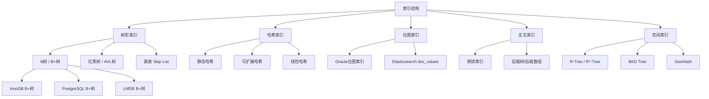
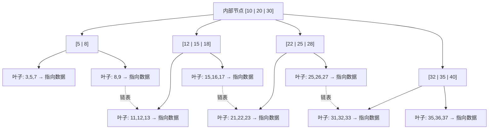
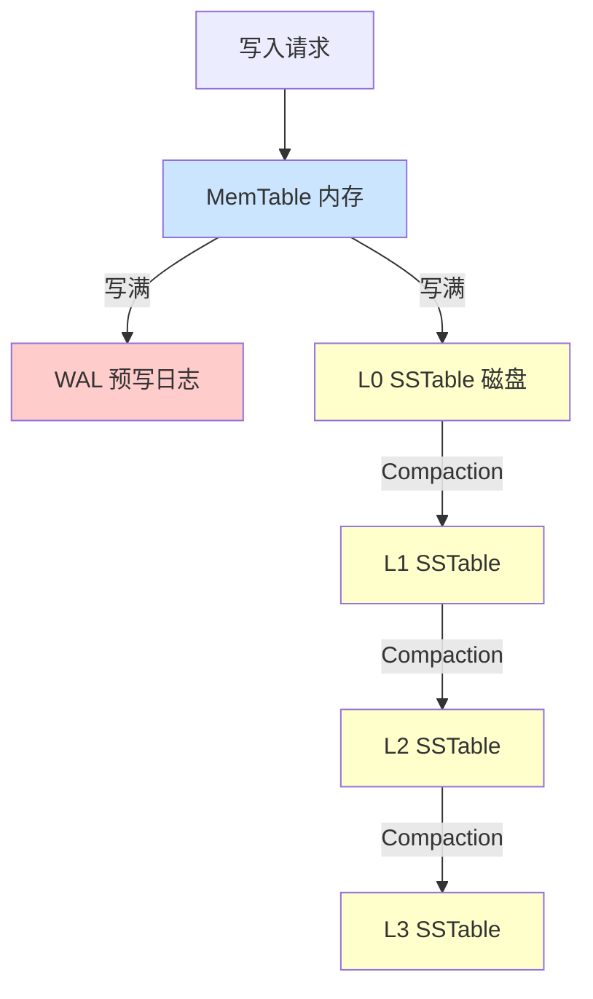
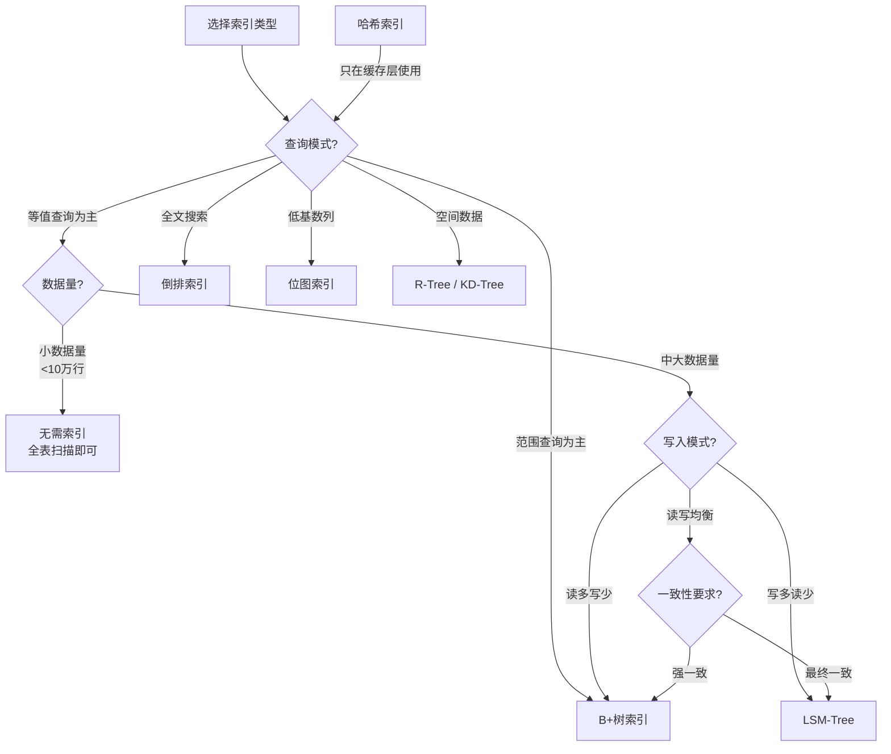

## 索引结构核心概念

### 1. 为什么需要索引——从全表扫描到精确寻址

假设你有一本600页的字典，要查"棘"这个字。如果没有目录，你只能从第1页开始逐页翻找——这就是**全表扫描（Full Table Scan）**。有了拼音索引，你可以直接翻到"ji"对应页码，一步到位——这就是**索引查询**。

在数据库和存储系统中，这个道理完全一样。数据以行（Row）或键值对（Key-Value）的形式存储在磁盘上，当数据量从100行增长到1亿行时，全表扫描的代价从毫秒级飙升到分钟级。索引的本质，就是在数据之上构建一个**辅助数据结构**，以少量的额外存储空间和写入开销，换取查询速度的大幅提升。

**一组真实数据感受差距：**

| 数据规模 | 全表扫描耗时（HDD） | B+树索引查询（HDD） | 加速比 |
|----------|-------------------|--------------------|--------|
| 1万行 | ~50ms | <1ms | 50倍 |
| 100万行 | ~5s | <1ms | 5000倍 |
| 1亿行 | ~8min | <2ms | 24万倍 |

> 以上数据基于单条等值查询，磁盘顺序读吞吐约200MB/s，B+树3层结构。

**没有索引时的查询路径：**


**有索引时的查询路径：**


全表扫描需要读取磁盘上每一条记录并逐一比较。对于一张1亿行、每行500字节的表，数据总量约50GB。即使HDD能持续以200MB/s的吞吐读取，扫描完也需要约250秒。而B+树索引只需要从根节点出发，沿着3层结构逐级定位，总IO量不到50KB（3个16KB的页），耗时不到1毫秒。

**索引并非万能药。** 索引会引入以下代价：

- **存储开销**：索引本身占用磁盘空间，通常为数据量的5%~30%
- **写入放大**：每次INSERT/UPDATE/DELETE不仅要写数据，还要维护所有相关索引
- **维护成本**：索引碎片、页分裂、Compaction等后台操作消耗CPU和IO资源

因此，索引设计的核心问题是：**在读性能和写开销之间找到最优平衡点**。

### 2. 索引的核心定义

**索引（Index）** 是一种独立于原始数据的辅助数据结构，它存储了数据记录的**键值（Key）** 与**存储位置（Pointer/Address）** 之间的映射关系，使得系统能够通过键值快速定位到目标数据，而无需遍历全部数据。

索引的核心要素包括：

| 要素 | 说明 | 类比 |
|------|------|------|
| **索引键（Index Key）** | 被索引的字段或属性，用于查询匹配 | 字典的拼音/部首 |
| **指针（Pointer）** | 指向实际数据存储位置的引用（可以是行ID、文件偏移量、页号+槽号） | 字典页码 |
| **索引条目（Index Entry）** | 键值+指针的组合体，索引的基本单元 | 字典索引中的每一条记录 |
| **索引结构（Index Structure）** | 组织所有索引条目的数据结构，决定了查找效率 | 字典索引的排列方式 |

**从软件栈的角度看索引：**

┌─────────────────────────────────────┐
│         应用层查询请求                │
│    SELECT * FROM users WHERE id=42  │
├─────────────────────────────────────┤
│         查询优化器                   │
│    选择最优执行计划（走哪个索引）       │
├─────────────────────────────────────┤
│         存储引擎索引层               │
│    B+树 / LSM-Tree / 哈希表          │
│    定位目标数据的物理地址             │
├─────────────────────────────────────┤
│         缓冲池 / 缓存层              │
│    Buffer Pool / Page Cache          │
├─────────────────────────────────────┤
│         磁盘 / SSD                  │
│    实际的数据页                      │
└─────────────────────────────────────┘

索引处于查询优化器和存储引擎之间。优化器根据查询条件和索引统计信息，决定使用哪个索引；索引结构负责高效的键值定位；缓冲池减少实际的磁盘IO。

### 3. 索引的核心性能指标

在讨论具体索引类型之前，先建立统一的评估框架。衡量任何索引结构，核心看以下四个维度：

#### 3.1 查询复杂度——查找有多快

索引最核心的价值是加速查询。不同索引结构的查找复杂度差异巨大：

| 索引类型 | 点查询（等值查找） | 范围查询 | 部分匹配 | 多条件组合 |
|----------|-------------------|----------|----------|-----------|
| 全表扫描 | O(n) | O(n) | O(n) | O(n) |
| 哈希索引 | **O(1)** | 不支持 | 不支持 | 不支持 |
| B+树索引 | O(log n) | **O(log n + k)** | 前缀匹配 | 支持（最左前缀） |
| LSM-Tree | O(log n)（含读放大） | O(log n + k) | 不支持 | 有限支持 |
| 位图索引 | O(n) 但位运算极快 | **极快** | 不支持 | **极快**（位运算AND/OR） |
| 跳表（Skip List） | O(log n) | O(log n + k) | 不支持 | 不支持 |

> **k** 为结果集大小。范围查询的时间与返回的记录数线性相关，这是不可避免的——你至少要把结果都读出来。

**一个常见的误解：** O(log n) 看起来和 O(1) 差距不大，但在实际系统中差异显著。B+树的 O(log n) 每一层都可能涉及一次磁盘IO（即使有缓冲池，叶子节点仍可能需要IO），而哈希的 O(1) 理论上只有一次IO。但B+树支持范围查询和排序，这让它在大多数业务场景中胜出。

#### 3.2 写入开销——插入/删除有多贵

索引不是免费的午餐。每写入一条数据，不仅要写数据本身，还要更新所有相关索引。不同索引结构的写入代价差异明显：

- **B+树**：写入需要定位到叶子节点，可能触发节点分裂，每次写入涉及多次随机IO
- **LSM-Tree**：写入只需追加到内存缓冲区，顺序写磁盘，写入代价低
- **哈希索引**：写入代价低（O(1)），但哈希冲突处理有额外开销；扩容时需要Rehash，代价高昂

**写入放大系数（Write Amplification）** 是衡量写代价的关键指标：

| 索引结构 | 写入放大倍数 | 原因 |
|----------|-------------|------|
| B+树 | 2~10x | 页分裂、随机IO |
| LSM-Tree（Leveled Compaction） | 10~30x | 多层Compaction反复读写 |
| LSM-Tree（Tiered Compaction） | 5~10x | Compaction频率低但单次大 |
| 哈希索引 | 1x | 直接写入对应位置 |

LSM-Tree虽然单次写入代价低（顺序写），但后台Compaction会导致总体写入放大。这就是为什么SSD的写入寿命（TBW）在LSM-Tree工作负载下消耗更快。

#### 3.3 存储空间——索引占多少磁盘

索引本身也需要存储空间。典型场景下，一个索引可能占用原始数据量的5%~30%的空间。索引空间的大小取决于：

- **键的大小**：键越长，索引条目越大。8字节的BIGINT主键 vs 256字节的VARCHAR索引，空间差异32倍
- **条目数量**：数据越多，索引条目越多
- **结构开销**：树节点的分裂因子、指针、页头/页尾元数据、LSM-Tree的多层SSTable副本
- **压缩率**：LSM-Tree的SSTable通常使用压缩（LZ4/Zstd），实际占用远小于逻辑大小

**估算索引空间的快速公式：**

B+树索引大小 ≈ 行数 × (键大小 + 指针大小 + 树节点开销) / 填充因子

示例：1亿行 × (8 + 6 + 2) 字节 / 0.7 ≈ 2.3 GB

#### 3.4 并发与一致性——多线程安全吗

在高并发场景下，多个线程同时读写索引需要加锁或使用无锁数据结构来保证一致性。锁的粒度直接影响并发性能：

- **粗粒度锁**（如表级锁）：实现简单，但并发低——MySQL的MyISAM引擎就使用表级锁
- **细粒度锁**（如行级锁、页级锁）：并发高，但实现复杂——InnoDB使用行级锁+MVCC
- **无锁结构**（如CAS操作）：适合简单场景，但不适用于复杂的树结构
- **MVCC（多版本并发控制）**：不加锁实现读写并发，读操作读取快照版本，写操作创建新版本

**并发控制的现实：**

InnoDB的B+树使用**乐观插入**策略：先尝试不加锁插入，只有当节点需要分裂时才加排他锁。这种设计让大多数插入操作无需加锁，极大提高了并发写入性能。但如果多个线程频繁插入导致节点分裂，锁竞争就会加剧——这就是为什么自增主键在高并发写入场景下表现更好。

### 4. 索引的分类体系

从不同维度对索引进行分类，有助于系统性地理解各种索引的适用场景。

#### 4.1 按数据结构分类

这是最核心的分类维度，直接决定了索引的性能特征。



**树形索引（B+树为主流）** 是关系型数据库的标配。B+树的每个节点可以存放多个键值，树的高度通常在2~4层。对于一个扇出（Fan-out）为500的B+树，3层就可以索引1.25亿条记录——也就是说，查找任何一条记录最多只需要3次磁盘IO。

**哈希索引** 适用于等值查询的极致性能场景。通过哈希函数将键映射到固定位置，理想情况下O(1)即可完成查找。但它的致命弱点是不支持范围查询——因为哈希函数打乱了键的天然顺序。

**位图索引** 适用于低基数（Cardinality）列，如性别（男/女/未知）。用一个位（bit）表示某个值是否存在，查询时通过位运算（AND/OR/NOT）快速得到结果。在数据仓库和OLAP分析场景中，位图索引对多条件筛选有极大优势——1000万行的位图索引只需约1.25MB。

**全文索引** 基于倒排索引（Inverted Index）实现，将文档中的每个词映射到包含该词的文档列表。搜索引擎的核心就是倒排索引。PostgreSQL的GIN索引和Elasticsearch的倒排索引都是全文索引的典型实现。

**空间索引** 用于地理坐标、多边形等空间数据的查询。R-Tree将空间对象按最小外接矩形（MBR）组织成层次结构，支持范围查询（"找出某个矩形区域内的所有点"）和最近邻查询（"找出距离我最近的5家咖啡店"）。

#### 4.2 按存储方式分类

| 分类 | 说明 | 典型实现 | 适用场景 |
|------|------|----------|----------|
| **聚簇索引** | 索引的叶节点直接存储数据行 | InnoDB主键索引 | 主键查询、有序扫描 |
| **非聚簇索引（二级索引）** | 叶节点存储指向数据行的指针 | InnoDB二级索引 | 非主键字段查询 |
| **覆盖索引** | 索引包含查询所需的所有字段 | 设计层面优化 | 避免回表查询 |
| **包含索引** | 在索引中额外存储若干字段 | SQL Server INCLUDE | 减少回表次数 |

**聚簇索引与非聚簇索引的区别：**

在InnoDB中，表的数据本身就是按主键排列的B+树——这就是聚簇索引。每个表有且仅有一个聚簇索引（即主键索引）。其他索引（二级索引）的叶节点存储的是主键值，查询时需要先在二级索引中找到主键，再通过主键回到聚簇索引中查找完整数据——这个过程叫做**回表（Table Lookup）**。


**回表的代价：** 每次回表都是一次额外的B+树查找（从聚簇索引的根节点走到叶子节点）。如果二级索引查询返回100条记录，就需要回表100次——这就是为什么在需要返回多行数据时，覆盖索引的优化效果特别显著。

**聚簇索引的选择权：**

- **InnoDB**：默认使用主键作为聚簇索引。如果没有主键，选择第一个非空唯一索引；如果也没有，生成一个隐藏的6字节ROW_ID
- **MyISAM**：使用独立的行号（ROW_NUMBER），数据文件和索引文件分离（.MYD + .MYI）
- **PostgreSQL**：使用Heap存储，索引存储的是行指针（ctid），不直接存储数据行。通过Index-Only Scan避免回表
- **ClickHouse**：MergeTree引擎使用主键排序数据，但主键不要求唯一，类似聚簇索引的行为

#### 4.3 按功能特性分类

| 特性 | 说明 | 示例 |
|------|------|------|
| **唯一索引** | 索引列不允许重复值 | 用户名、身份证号 |
| **组合索引** | 多个字段联合建索引 | (城市, 年龄) 联合索引 |
| **前缀索引** | 只索引字符串的前N个字符 | URL字段索引前20个字符 |
| **函数索引** | 对表达式/函数结果建索引 | UPPER(name) 索引 |
| **部分索引** | 只索引满足条件的行 | WHERE status='active' |
| **降序索引** | 按降序排列的索引 | ORDER BY create_time DESC |
| **表达式索引** | 对计算结果建索引 | price * quantity 索引 |

**前缀索引的选择性判断：**

选择前缀长度时，需要在索引大小和选择性之间权衡。选择性计算公式：

选择性 = COUNT(DISTINCT LEFT(col, N)) / COUNT(DISTINCT col)

目标是让前缀索引的选择性接近完整列索引的选择性，同时长度尽量短。可以用以下SQL探测最优前缀长度：

```sql
-- 探测email列的最优前缀长度
SELECT
    COUNT(DISTINCT LEFT(email, 5))  / COUNT(DISTINCT email) AS sel_5,
    COUNT(DISTINCT LEFT(email, 10)) / COUNT(DISTINCT email) AS sel_10,
    COUNT(DISTINCT LEFT(email, 15)) / COUNT(DISTINCT email) AS sel_15,
    COUNT(DISTINCT LEFT(email, 20)) / COUNT(DISTINCT email) AS sel_20
FROM users;
-- 当选择性达到95%以上时，对应的长度就是最优前缀长度
```

**部分索引的威力（PostgreSQL）：**

```sql
-- 只为活跃用户建索引（active=1的行只占5%）
CREATE INDEX idx_active_email ON users (email) WHERE active = 1;
-- 索引大小只有全量索引的5%，但查询性能等价
```

### 5. 索引与底层数据结构的关系

理解索引，需要理解它所依赖的底层数据结构。本节从数据结构的演进角度，解释为什么最终的索引结构是今天的样子。

#### 5.1 二叉搜索树（BST）——索引的起点

二叉搜索树是索引思想的源头。每个节点最多有两个子节点，左子树所有节点的键值小于根节点，右子树所有节点的键值大于根节点。查找、插入、删除的平均复杂度为O(log n)。

但BST存在严重缺陷：如果插入有序数据（如自增ID），树会退化成链表，查找复杂度退化到O(n)。

有序插入1,2,3,4,5 → BST退化为链表：

  1
   \
    2
     \
      3
       \
        4
         \
          5
  查找5需要比较5次（O(n)）

#### 5.2 平衡二叉树（AVL树 / 红黑树）——消除退化

AVL树通过严格的平衡条件（左右子树高度差不超过1）保证树高始终为O(log n)。红黑树放宽了平衡条件，减少了旋转操作，更适合频繁插入删除的场景。

AVL树（严格平衡）：
        4
       / \
      2   6
     / \ / \
    1  3 5  7
  查找任何节点最多3次比较（O(log n)）

但二叉树有一个根本问题：**每个节点只存一个键，每个节点只分两个叉**。当数据量达到亿级时，树高可能达到30层以上，意味着30次磁盘IO。磁盘IO是机械操作，每次约10ms（HDD），30次就是300ms——这在高性能场景下是不可接受的。

更关键的是：磁盘的读写是以**页（Page）** 为单位的，通常一次读取4KB~16KB。而一个二叉树节点只存一个键（几字节到几十字节），这意味着每次磁盘IO只有极小一部分数据被有效利用。**磁盘IO的带宽被严重浪费了。**

#### 5.3 B树与B+树——面向磁盘的设计

**B树（B-Tree）** 的核心创新：**多路平衡**。每个节点不再只存一个键，而是存储多个键（通常几百到几千个），分出多个子节点。这极大地降低了树的高度，同时每次磁盘IO读取一个完整的页，可以获取大量键值信息——磁盘IO的利用率大幅提升。

**B+树（B+Tree）** 在B树基础上做了三个关键改进：

1. **所有数据只存在叶子节点**：内部节点只存储键值和子节点指针，不存数据——这让内部节点可以容纳更多的键，树更矮
2. **叶子节点通过链表相连**：支持高效的范围查询和顺序扫描——从任意叶子节点出发，可以沿着链表遍历整个范围
3. **内部节点可以存储更多键**：因为不需要存数据，单个节点的扇出更大——InnoDB的非叶子节点可以存储上千个指针



**B+树 vs B树的核心区别：**

| 特性 | B树 | B+树 |
|------|-----|------|
| 数据存储位置 | 所有节点 | 仅叶子节点 |
| 叶子节点链表 | 无 | 有（支持范围扫描） |
| 内部节点扇出 | 较低（需存数据） | 较高（只存键+指针） |
| 树高度 | 较高 | 较矮 |
| 范围查询效率 | 需要中序遍历 | 沿链表顺序扫描 |
| 典型应用 | MongoDB WiredTiger | MySQL InnoDB、PostgreSQL |

**关键数字感受：**

假设一个B+树节点大小为16KB（InnoDB默认页大小），每个键+指针占14字节：

- 单个节点扇出 = 16KB / 14 ≈ **1170个子节点指针**
- 2层B+树可索引：1170 × 1170 ≈ **137万**条记录
- 3层B+树可索引：1170 × 1170 × 1170 ≈ **16亿**条记录

也就是说，查询16亿条数据中的任意一条，最多只需要3次磁盘IO。这就是B+树统治关系型数据库的根本原因。

#### 5.4 LSM-Tree——写优化的索引结构

B+树虽然读性能优秀，但写入时需要随机IO（定位到具体页再修改），在写密集场景下性能不佳。

**LSM-Tree（Log-Structured Merge Tree）** 的核心思想是：**将随机写转化为顺序写**。



写入流程：

1. 数据首先写入内存中的 **MemTable**（有序结构，通常是跳表或红黑树）
2. 同时写入 **WAL（Write-Ahead Log）** 用于崩溃恢复——即使MemTable尚未持久化，WAL保证数据不丢失
3. MemTable 写满后，冻结为一个有序的 **SSTable（Sorted String Table）** 文件，刷到磁盘
4. 后台定期执行 **Compaction**，将多个SSTable合并，消除重复和删除的键

**LSM-Tree的三个放大问题：**

| 放大类型 | 含义 | 影响 |
|----------|------|------|
| **写放大（Write Amplification）** | 数据实际写入量远大于用户写入量 | 消耗SSD寿命、占用IO带宽 |
| **读放大（Read Amplification）** | 一次查询可能需要检查多个层级 | 增加查询延迟 |
| **空间放大（Space Amplification）** | 旧版本数据未及时清理 | 浪费磁盘空间 |

这三个问题构成一个**不可能三角（RUM Conjecture）**——优化其中一个必然恶化另一个。不同的Compaction策略（Leveled vs Tiered）本质上是在这三个维度之间做权衡。

LSM-Tree的读放大问题可以通过**布隆过滤器（Bloom Filter）** 缓解：在查询前先检查布隆过滤器，如果判断"不存在"就可以跳过该层级的SSTable，避免无效IO。布隆过滤器空间极小（每条记录只需约10bit），却能将读放大从O(L)降低到接近O(1)。

#### 5.5 哈希表——极致的等值查找

哈希表通过哈希函数将键直接映射到数组下标，理想情况下O(1)即可完成查找。

Key "user:10086" → hash("user:10086") % array_size → slot[42]

**哈希冲突的处理方式：**

| 方式 | 原理 | 优点 | 缺点 |
|------|------|------|------|
| **链地址法** | 冲突的元素挂到同一个链表 | 实现简单、负载因子高时仍可用 | 链表过长时退化 |
| **开放寻址法** | 冲突时探测下一个空位 | 缓存友好、无需额外指针 | 负载因子高时性能差 |
| **布隆过滤器** | 多个哈希函数+位数组，概率性判断 | 空间极小 | 可能误判存在、不能删除 |
| **Cuckoo Hashing** | 两个哈希函数+两个表，冲突时踢出 | 最坏O(1)查找 | 插入可能失败、实现复杂 |

**哈希索引的局限性：**

- 不支持范围查询（哈希打乱了键的顺序）
- 不支持排序扫描
- 哈希表扩容（Rehash）代价高昂——需要重新计算所有键的哈希值并重新分布
- 不支持前缀匹配和模糊查询
- 哈希冲突导致最坏情况下性能退化

因此，哈希索引通常用于内存中的缓存（如Redis的dict）或作为辅助结构（如InnoDB的自适应哈希索引AHI），而不是作为主要的磁盘索引结构。

**InnoDB的自适应哈希索引（AHI）：** InnoDB会自动监控B+树索引的访问模式，对频繁访问的索引页自动在内存中建立哈希索引，将O(log n)的B+树查找加速为O(1)。这个过程完全自动，无需DBA干预。但AHI只缓存热点页，且不持久化到磁盘。

#### 5.6 跳表（Skip List）——简单高效的有序结构

跳表是一种概率平衡的有序数据结构，通过多层链表实现O(log n)的查找效率。Redis的有序集合（Sorted Set）就是基于跳表实现的。

第3层:  1 ────────────────────────→ 9
第2层:  1 ──────→ 4 ────────────→ 9
第1层:  1 → 2 → 4 → 5 → 7 → 8 → 9

跳表的优势：
- **实现简单**：相比红黑树/B+树，跳表的代码量小一个数量级
- **并发友好**：加锁粒度细，可以只锁局部链表
- **范围查询高效**：找到起点后沿底层链表顺序扫描

Redis选择跳表而非红黑树作为Sorted Set的底层结构，正是因为跳表在实现简洁性和并发友好性上更优——Redis的内存操作不需要考虑磁盘IO，跳表的多层指针开销在内存中完全可接受。

### 6. 索引选择的决策框架

面对具体的业务场景，如何选择合适的索引类型？以下是决策路径：



> **10万行的判断依据：** InnoDB全表扫描10万行（假设每行500字节）只需读取约50MB数据。在SSD上，顺序读50MB耗时约25ms；在内存中甚至不到5ms。此时建索引的维护成本反而高于全表扫描的开销。

**各存储引擎的索引选择：**

| 存储引擎 | 主索引结构 | 辅助结构 | 典型应用 |
|----------|-----------|----------|----------|
| InnoDB (MySQL) | B+树聚簇索引 | 自适应哈希索引、Change Buffer | OLTP事务型 |
| RocksDB | LSM-Tree | 布隆过滤器 + 哈希索引 | 写密集型KV |
| PostgreSQL | B+树 / Heap | GIN/GiST/BRIN/Rum | 通用OLTP + GIS + 全文搜索 |
| Redis | 哈希表 + 跳表 | — | 内存缓存、排行榜 |
| Elasticsearch | 倒排索引 + BKD树 | Doc Values | 全文搜索 + 分析 |
| ClickHouse | LSM + 哈希 | 稀疏索引、跳数索引 | OLAP分析型 |
| TiKV (TiDB) | LSM-Tree（RocksDB） | Coprocessor下推 | 分布式HTAP |

### 7. 索引的物理存储细节

理解索引在磁盘上的实际存储形态，对于性能调优至关重要。

#### 7.1 页（Page）——索引的最小I/O单元

数据库不是按字节读写磁盘的，而是以**页（Page）** 为单位。InnoDB默认页大小为16KB，PostgreSQL默认为8KB。一次磁盘IO读取一个完整的页。

这意味着：
- 索引条目的大小直接影响每个页能存放多少条目
- 如果一条记录只占100字节，一个16KB的页可以存放约160条索引条目
- 但如果有大字段（如VARCHAR(2000)），每个页的条目数会显著减少
- **页是并发控制的最小单位**——InnoDB的行锁本质上是对页内某个槽位的锁

**InnoDB页的内部结构：**

┌─────────────────────────────────────┐
│  File Header (38 bytes)  页头        │
│  页号、页类型、前后页指针、校验和       │
├─────────────────────────────────────┤
│  Page Header (56 bytes)  数据页头    │
│  记录数量、空闲空间偏移、索引ID        │
├─────────────────────────────────────┤
│  Infimum + Supremum (26 bytes)      │
│  页内记录的虚拟最小/最大边界           │
├─────────────────────────────────────┤
│  User Records (剩余空间)            │
│  实际的行数据，按主键顺序排列          │
├─────────────────────────────────────┤
│  Free Space (空闲空间)              │
│  尚未使用的空间                      │
├─────────────────────────────────────┤
│  Page Directory (槽目录)            │
│  页内记录的分组槽指针，支持二分查找     │
├─────────────────────────────────────┤
│  File Trailer (8 bytes)  页尾       │
│  校验和、LSN（用于检测页损坏）         │
└─────────────────────────────────────┘

#### 7.2 缓冲池（Buffer Pool）——减少磁盘IO

B+树的根节点和上层节点通常很小，且被频繁访问，几乎总是驻留在内存中。InnoDB的缓冲池（Buffer Pool）会缓存热点数据页，大幅减少实际的磁盘IO次数。

典型的访问路径：
1. 根节点 → 缓存在内存中（常驻）
2. 第二层节点 → 大概率在缓冲池中
3. 叶子节点 → 可能需要磁盘IO（取决于热点分布）

对于3层B+树，实际磁盘IO通常只有1次——访问叶子节点的那一次。这就是为什么InnoDB在SSD上可以轻松做到亚毫秒级查询。

**缓冲池的淘汰策略：**

InnoDB使用改进的LRU（Least Recently Used）算法，将缓冲池分为两个区域：

- **Young区（热端，约5/8）**：存放最近被频繁访问的页
- **Old区（冷端，约3/8）**：新读入的页先放在这里，只有被再次访问后才"晋升"到Young区

这种设计防止了一个问题：全表扫描会大量读入新页，如果直接放到LRU头部，会把真正的热点页挤出去。通过把新页先放到Old区，只有确认是真正热的页才提升到Young区，保护了热点数据的缓存命中率。

#### 7.3 页分裂（Page Split）——写入的隐藏代价

当一个B+树的叶子节点写满时，需要进行**页分裂**：创建一个新页，将原页中约一半的数据迁移到新页，并更新父节点的指针。页分裂涉及：

1. 分配新页（磁盘空间）
2. 移动数据（约50%的条目）
3. 更新父节点（可能触发父节点分裂，向上传递——极端情况下分裂可以一直传播到根节点，导致树高增加1）

**自增主键 vs 随机主键** 的核心区别正在于此：

- **自增主键**：新记录总是追加到最后一个叶子节点，极少触发页分裂
- **UUID等随机主键**：新记录可能插入到任意叶子节点，频繁触发页分裂，导致数据碎片化

| 主键类型 | 页分裂频率 | 空间利用率 | 缓存友好度 | 推荐场景 |
|----------|-----------|-----------|-----------|----------|
| 自增整数 | 极低 | 高(~100%) | 高 | 绝大多数场景 |
| UUID | 高 | 低(~60-70%) | 低 | 分布式ID生成 |
| 业务键(如邮箱) | 中等 | 中等 | 中等 | 需要唯一约束时 |
| 雪花算法ID | 低 | 高(~95%) | 高 | 分布式且需有序 |

> **为什么空间利用率重要？** 页分裂后，原页只有约50%的数据，新页也只有约50%。如果频繁分裂，大量页处于半满状态，浪费磁盘空间的同时也降低了缓存命中率（同样的数据需要更多的页来存储）。

#### 7.4 数据碎片与整理

随着频繁的插入和删除，B+树的页会出现碎片化——部分页只有少量数据，但占据完整的页空间。InnoDB通过两种方式处理：

- **页内碎片**：UPDATE变长字段导致记录缩短时，空间不会立即回收，而是放入页的"空闲空间"供后续插入使用
- **页间碎片**：大量删除后，某些页只有很少的记录。InnoDB不会主动合并页，碎片长期存在

**碎片整理方法：**

```sql
-- 方法1：OPTIMIZE TABLE（重建表和索引，会锁表）
OPTIMIZE TABLE users;

-- 方法2：ALTER TABLE（MySQL 5.6+使用Online DDL）
ALTER TABLE users ENGINE=InnoDB;

-- 方法3：使用pt-online-schema-change（Percona工具，不锁表）
pt-online-schema-change --alter "ENGINE=InnoDB" D=mydb,t=users --execute
```

### 8. 索引失效的常见原因

索引建了不等于能用上。以下是导致索引失效的典型原因：

| 失效原因 | 示例 | 解决方案 |
|----------|------|----------|
| **对索引列使用函数** | `WHERE YEAR(create_time) = 2025` | 改为范围查询 `WHERE create_time >= '2025-01-01' AND create_time < '2026-01-01'` |
| **隐式类型转换** | `WHERE varchar_col = 12345` | 保持类型一致 `WHERE varchar_col = '12345'` |
| **前导通配符** | `WHERE name LIKE '%三'` | 改为前缀匹配 `WHERE name LIKE '张%'` |
| **OR条件未全索引** | `WHERE a=1 OR b=2`（b无索引） | 给b加索引或改用UNION |
| **NOT IN / NOT EXISTS** | `WHERE id NOT IN (1,2,3)` | 改为左连接或改写查询 |
| **列运算** | `WHERE id + 1 = 10` | 改为 `WHERE id = 9` |
| **数据量太小** | 查询结果占表20%以上 | 优化器可能选择全表扫描更优 |
| **联合索引不满足最左前缀** | 索引(a,b,c)，查询 `WHERE b=1` | 调整索引顺序或增加单独索引 |
| **NOT LIKE** | `WHERE name NOT LIKE '张%'` | 改写查询逻辑 |
| **IS NULL / IS NOT NULL** | `WHERE col IS NOT NULL` | 视数据分布而定，可能不走索引 |

**隐式类型转换的陷阱详解：**

当WHERE子句中的参数类型与索引列类型不匹配时，MySQL会进行隐式类型转换。如果转换发生在索引列上，索引就会失效：

```sql
-- varchar_col 列上有索引
-- MySQL会把 varchar_col 转为数字来比较，相当于对索引列用了函数
WHERE varchar_col = 12345    -- ❌ 索引失效
WHERE varchar_col = '12345'  -- ✅ 索引生效
```

反过来，如果把常量转换为列的类型，索引可以正常使用：

```sql
-- int_col 列上有索引
WHERE int_col = '12345'   -- ✅ 字符串转数字，常量转换，索引生效
WHERE int_col = 12345      -- ✅ 索引生效
```

**EXPLAIN分析示例：**

```sql
-- 创建测试表
CREATE TABLE users (
    id INT PRIMARY KEY AUTO_INCREMENT,
    name VARCHAR(50),
    email VARCHAR(100),
    city VARCHAR(50),
    age INT,
    INDEX idx_name (name),
    INDEX idx_city_age (city, age)
);

-- 索引生效
EXPLAIN SELECT * FROM users WHERE name = '张三';
-- type: ref, key: idx_name

-- 索引失效（函数作用于索引列）
EXPLAIN SELECT * FROM users WHERE LEFT(name, 1) = '张';
-- type: ALL, key: NULL (全表扫描)

-- 联合索引 - 最左前缀匹配
EXPLAIN SELECT * FROM users WHERE city = '北京' AND age = 25;
-- type: ref, key: idx_city_age (完全匹配)

EXPLAIN SELECT * FROM users WHERE age = 25;
-- type: ALL, key: NULL (不满足最左前缀)

-- 范围条件后的列无法使用索引
EXPLAIN SELECT * FROM users WHERE city > '北京' AND age = 25;
-- type: range, key: idx_city_age (只用到city, age未使用)
```

**MySQL 8.0+的索引跳过扫描（Index Skip Scan）：**

MySQL 8.0引入了索引跳过扫描优化，可以在某些不满足最左前缀的场景下自动利用联合索引。例如，联合索引(a,b,c)，查询`WHERE b=1 AND c=2`，优化器可能自动扫描每个不同的a值对应的b,c子集。但这个优化只在a列选择性很低（不同值很少）时有效。

### 9. 索引设计的实战原则

#### 9.1 索引不是越多越好

每个索引都会带来以下开销：

- **写入放大**：每次INSERT/UPDATE/DELETE都需要更新所有相关索引
- **空间开销**：索引文件可能占磁盘空间的20%~50%
- **维护成本**：索引碎片需要定期整理，更多的索引意味着更多的维护工作
- **优化器选择困难**：索引越多，查询优化器选择错误索引的概率越大

经验法则：单表索引数量控制在**5~8个**以内，特殊场景不超过15个。

**索引数量的量化评估：**

写入性能 ≈ 基础写入速度 / (1 + 索引数量 × 单索引维护开销)

示例：单表8个索引时，写入速度约为无索引时的 1/(1+8×0.3) ≈ 29%
（假设每个索引增加约30%的写入开销）

#### 9.2 选择性（Selectivity）决定索引价值

选择性 = 不同值的数量 / 总行数。选择性越高，索引的过滤效果越好。

| 字段 | 选择性 | 是否值得建索引 |
|------|--------|---------------|
| 主键 | 100% | 已有聚簇索引 |
| 手机号 | ~100% | ✅ 非常值得 |
| 邮箱 | ~100% | ✅ 非常值得 |
| 性别 | ~0.03%（3个值） | ❌ 不值得单独索引 |
| 城市 | ~0.1%（几百个值） | ⚠️ 考虑联合索引 |
| 创建日期 | ~0.05%（按天算） | ⚠️ 考虑联合索引 |
| 状态（启用/禁用） | ~0.002%（2个值） | ❌ 绝不单独索引 |

**选择性的计算SQL：**

```sql
-- 计算city字段的选择性
SELECT
    COUNT(DISTINCT city) / COUNT(*) AS selectivity,
    COUNT(DISTINCT city) AS distinct_count,
    COUNT(*) AS total_rows
FROM users;
```

#### 9.3 联合索引的列顺序

联合索引(a, b, c)可以高效支持以下查询模式：

| 查询条件 | 是否走索引 | 使用列 |
|----------|-----------|--------|
| `WHERE a = ?` | ✅ | a |
| `WHERE a = ? AND b = ?` | ✅ | a, b |
| `WHERE a = ? AND b = ? AND c = ?` | ✅ | a, b, c |
| `WHERE a = ? AND c = ?` | ⚠️ | 只用到a，c无法利用索引 |
| `WHERE b = ?` | ❌ | 不满足最左前缀 |
| `WHERE a = ? AND b > ? AND c = ?` | ✅ | a精确匹配 + b范围匹配，c无法使用 |
| `WHERE a = ? ORDER BY b` | ✅ | a过滤 + b排序（利用索引有序性） |

**列顺序的设计原则：**

1. **等值条件列在前，范围条件列在后**：范围条件之后的列无法使用索引
2. **高选择性列在前**：让索引尽早过滤掉更多数据
3. **考虑ORDER BY和GROUP BY**：把排序和分组的列放在索引末尾，可以避免额外的排序操作（Using filesort）
4. **覆盖索引优先**：如果某个列组合能覆盖最频繁的查询，即使选择性不是最高，也优先放前面

**实际案例——电商订单表的联合索引设计：**

```sql
-- 场景：最频繁的查询是"某用户在某状态下的订单，按时间倒序"
SELECT * FROM orders 
WHERE user_id = 10086 AND status = 'paid' 
ORDER BY created_at DESC 
LIMIT 20;

-- 推荐索引：把user_id放最前面（等值查询），status第二（等值查询），created_at第三（排序）
CREATE INDEX idx_user_status_time ON orders (user_id, status, created_at);
-- 索引天然有序，无需额外排序，直接逆序扫描即可
```

#### 9.4 覆盖索引——避免回表的终极手段

如果查询只需要索引中已经包含的字段，就可以直接从索引返回数据，完全不需要回表读取聚簇索引——这就是覆盖索引。

```sql
-- 假设有联合索引 INDEX idx_name_email (name, email)

-- 需要回表（索引中没有age字段）
SELECT name, email, age FROM users WHERE name = '张三';
-- Extra: NULL（需要回表）

-- 覆盖索引（所有字段都在索引中）
SELECT name, email FROM users WHERE name = '张三';
-- Extra: Using index (表示使用了覆盖索引)
```

**覆盖索引的性能收益：**

对于需要返回1000行的查询，回表需要额外的1000次B+树查找（如果主键是聚簇索引）。而覆盖索引直接从二级索引的叶子节点返回所有数据，省去了1000次随机IO。在SSD上，这个差距可能从0.5ms到50ms——100倍的差距。

### 10. 索引监控与维护

建立索引只是开始，持续监控和维护才能保证索引始终高效运行。

#### 10.1 索引使用情况监控

```sql
-- MySQL：查看索引使用统计（Performance Schema）
SELECT 
    object_schema, object_name, index_name,
    count_read, count_fetch, count_insert, count_update, count_delete
FROM performance_schema.table_io_waits_summary_by_index_usage
WHERE object_schema = 'mydb'
ORDER BY count_read DESC;

-- 查找从未使用过的索引（候选删除对象）
SELECT * FROM sys.schema_unused_indexes;

-- 查找冗余索引
SELECT * FROM sys.schema_redundant_indexes;
```

#### 10.2 索引健康度检查

```sql
-- 查看索引碎片率（InnoDB）
SELECT 
    table_name, index_length, data_free,
    ROUND(data_free / (index_length + data_length) * 100, 2) AS fragmentation_pct
FROM information_schema.tables
WHERE table_schema = 'mydb' AND data_free > 0
ORDER BY fragmentation_pct DESC;
-- 碎片率超过10%时考虑整理
```

### 11. 本节小结

索引结构是数据库和存储系统的基石。理解索引，需要把握以下关键点：

1. **索引的本质** 是用空间换时间——通过构建辅助数据结构加速查询。但索引不是免费的，写入放大、空间开销、维护成本是必须承担的代价
2. **B+树** 是关系型数据库的默认选择，3层结构可索引16亿条记录，兼顾读性能和范围查询
3. **LSM-Tree** 通过将随机写转化为顺序写，适用于写密集场景，但需要Compaction来控制读放大
4. **哈希索引** 提供O(1)等值查询，但不支持范围查询，主要用于缓存层和辅助结构
5. **索引设计** 需要平衡查询性能和写入开销，过多的索引反而会拖慢系统。选择性、联合索引列顺序、覆盖索引是三个核心设计维度
6. **索引失效** 是常见的性能杀手，使用EXPLAIN分析查询计划是DBA的基本功
7. **索引不是一劳永逸的**，需要持续监控使用情况、检查碎片化、清理冗余索引

在后续章节中，我们将深入探讨B+树的实现细节（页结构、并发控制、WAL机制）、LSM-Tree的Compaction策略（Leveled vs Tiered）、布隆过滤器的原理与应用，以及索引性能优化的实战技巧。
